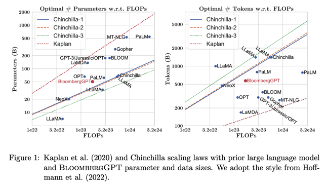

# Reading: Domain-specific Training: Bloombertgpt

📊 **Progress:** `2` Notes | `1` Screenshots

---

<kbd></kbd>

> [!NOTE]
> Như đã biết **những đường chéo** là **đường tối ưu** của c**ompute budget - model size** và
> **compute budget - data size** theo các nghiên cứu của **Chinchilla** với **các version khác
> nhau**. Thì **Bloomberg** được **pretrained** **cố gắng theo sát nguyên tắc Chinchilla**, thể
> hiện trên biểu đồ. Tuy nhiên **ở khía cạnh data** thì **không đạt** vì thứ nhất là **không có
> data** (chỉ có 700B thay vì tối ưu là 1400B và **thứ hai là technique Early Stopping**
> (giúp regularization giảm overfit) k**hông cho phép training hết 700 điểm
> dữ liệu mà họ có.**

> [!NOTE]
> BloombergGPT, developed by Bloomberg, is a large Decoder-only language model. It
> underwent pre-training using an extensive financial dataset comprising news articles, reports,
> and market data, to increase its understanding of finance and enabling it to generate
> finance-related natural language text. The datasets are shown in the image above.
>
> During the training of BloombergGPT, the authors used the Chinchilla Scaling Laws to guide
> the number of parameters in the model and the volume of training data, measured in tokens.
> The recommendations of Chinchilla are represented by the lines Chinchilla-1, Chinchilla-2
> and Chinchilla-3 in the image, and we can see that BloombergGPT is close to it.
>
> While the recommended configuration for the team’s available training compute budget was
> 50 billion parameters and 1.4 trillion tokens, acquiring 1.4 trillion tokens of training data in the
> finance domain proved challenging. Consequently, they constructed a dataset containing just
> 700 billion tokens, less than the compute-optimal value. Furthermore, due to early stopping,
> the training process terminated after processing 569 billion tokens.
>
> The BloombergGPT project is a good illustration of pre-training a model for increased
> domain-specificity, and the challenges that may force trade-offs against compute-optimal
> model and training configurations.

 

