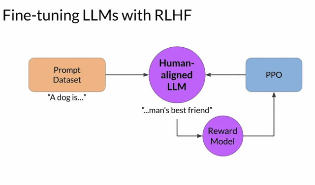
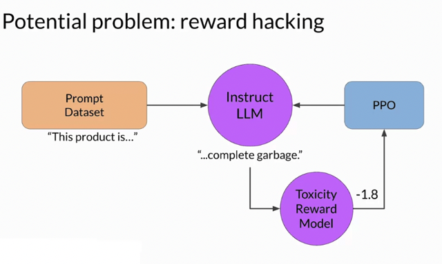
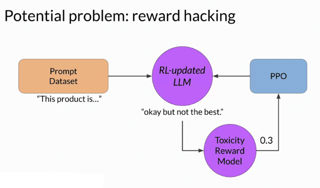
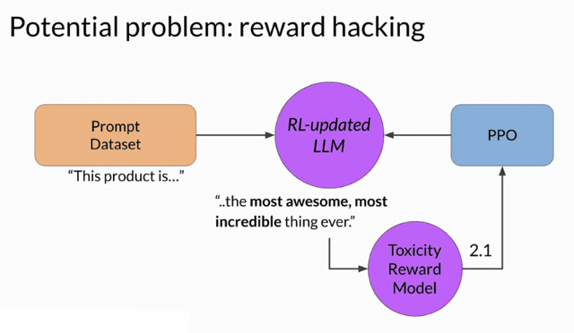
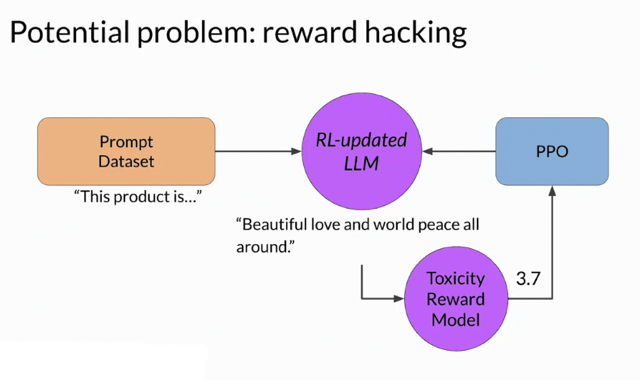
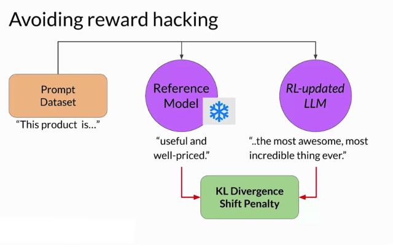
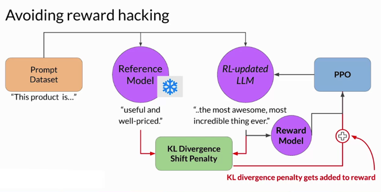
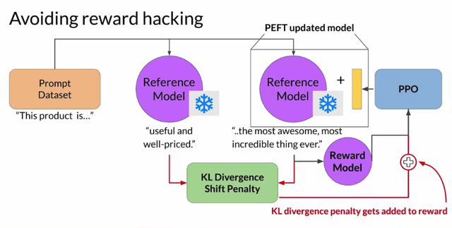
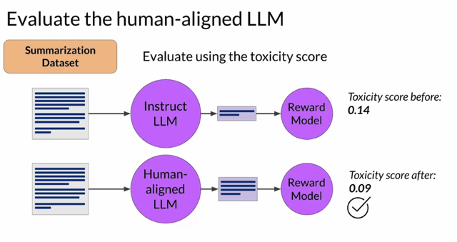
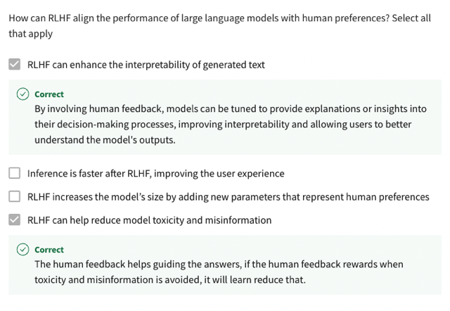

# Reward Hacking

📊 **Progress:** `6` Notes | `10` Screenshots

---

## Certainly, here's the content reorganized into indexed paragraphs without using titles:

> [!NOTE]
> Certainly, here's the content reorganized into indexed paragraphs without using titles:
>
> 1. **RLHF Fine-Tuning Process:**: RLHF **aligns LLMs with human preference**s through a **reward
> model**. LLM completions are assessed against human preference metrics. Reinforcement learning
> **(PPO) updates LLM weights based on rewards**. **Multiple iterations** with**various prompt**s **lead to
> desired alignment.**
>
> 2. ****Reward Hacking in RL**:** Reward hacking occurs when the **agent maximizes reward at the
> expense of original objectives**. In LLMs, it can **involve generating phrases to boost scores but
> reduce language quality**.
>
> 3. ****Reward Model Example**:** Using RLHF to detoxify model. A reward model rates toxic vs.
> non-toxic completions. Given a prompt, an LLM generates completions like "complete garbage"
> which gets a high toxic rating.
>
> 4. ****Preventing Reward Hacking**:** RLHF can **diverge from initial LLM**. Use an **unfrozen reference
> LLM (reference model) to prevent divergence**. **Compare completions from reference LLM and
> updated LLM using KL divergence**. **Penalize updated LLM if it diverges too much**.
>
> 5. ****KL Divergence Calculation**:** KL divergence **measures distribution differences**. Use it to **assess
> the divergence between LLM completions**. It's **computationally demanding** but **standard libraries**
> offer algorithms.
>
> 6. ****Applying KL Divergence**:** **Calculate KL divergence for each token**. **Add the term to reward
> calculation** to **penalize divergence from the reference model**.
>
> 7. **PEFT Adapter with RLHF and PEFT:** Use PEFT adapter for RLHF with PEFT. **Update PEFT adapter's
> weights, not full LLM**. Same underlying LLM for reference and PPO models, **reducing memory
> usage**.
>
> 8. ****Assessing Model Performance**:** After RLHF,**evaluate model's performance**. **Use
> summarization dataset for toxicity reduction assessment**. Baseline **toxicity score** from original LLM.
> **Compare scores after RLHF for improved alignment.**
>
> 9. **Conclusion:** **RLHF refines LLMs using reward models** and **reinforcement learning**. It tackles
> **reward hacking** through **reference models and KL divergence**. **Assessing alignment**using **toxicity
> scores** demonstrates success.
>
> Feel free to ask if you need further clarification or assistance!

 

<kbd></kbd>

 

<kbd></kbd>

 

<kbd></kbd>

 

<kbd></kbd>

> [!NOTE]
> **Reward hacking**xảy ra khi **LLM output ra sentence
> theo hướng nhằm mục đích nhận được điểm
> cao** **bất kể có đúng hay không**

 

<kbd></kbd>

> [!NOTE]
> Bằng những cách ví dụ**như cố nhét các chữ như này
> vào để có điểm cao, nhưng nội dung thì sai bét**

 

<kbd></kbd>

> [!NOTE]
> Khắc phục hiện tượng này bằng cách **dùng bản gốc của LLM** như một
> **reference model**, trong đó ta sẽ **đưa prompt vào cả Reference model và RL
> updated model** để **lấy completion của cả hai** để tính **KL Divergence Shift
> Penalty**

 

<kbd></kbd>

> [!NOTE]
> **Add KL Divergence Shift Penalty vào Reward**. Ý tưởng này nên hiểu đại
> khái là **khiến / giữ (penalize) cho distribution của output của RL updated
> LLM không đi xa khỏi distribution của output của model gốc** từ đó **ngăn
> việc Updated LLM tạo ra những câu trả lời quá không thực tế nhằm mục
> đích chỉ đạt Reward cao.**

 

<kbd></kbd>

> [!NOTE]
> Quá trình này còn có thể kết hợp với nguyên lý của PEFT, tức là k**hông thay
> đổi model weight** mà chỉ **update một Low Rank weight matrix (như phương
> pháp của LoRA)** hay nói chung là **một 'lớp' weight "thêm vào" thôi**

 

<kbd></kbd>

> [!NOTE]
> Và ta sẽ có cách để**evaluate kết quả của quá trình**, bằng cách
> **đo chỉ số ví dụ 'toxicity' của model mới so sánh với model cũ**

 

<kbd></kbd>

 

