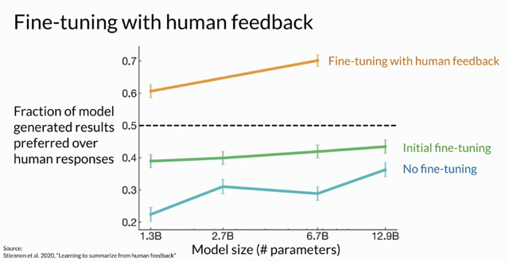
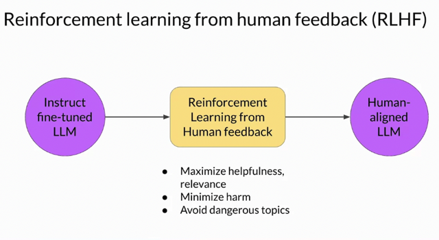
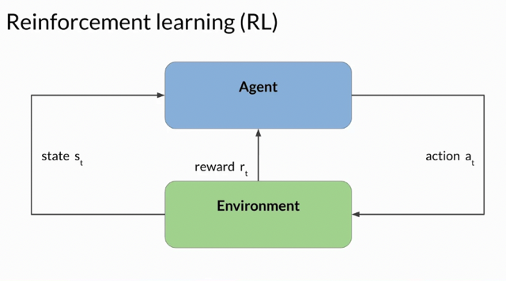
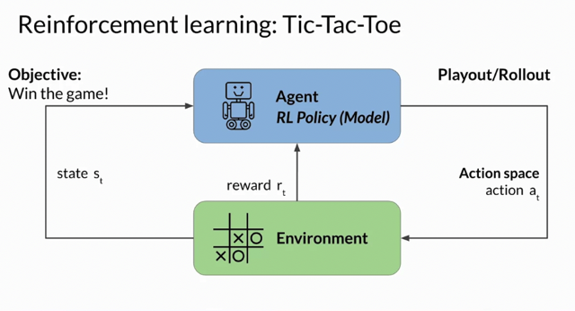
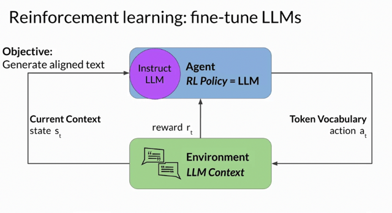
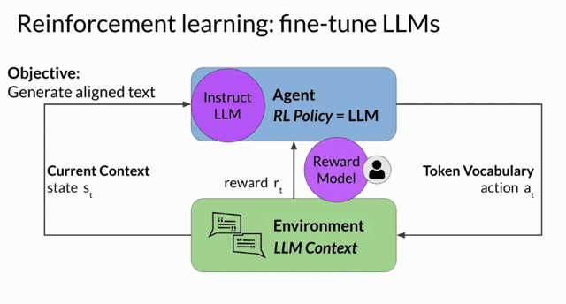

# RLHF

📊 **Progress:** `11` Notes | `6` Screenshots

---

## 1. **Text summarization** through**fine-tuning** using**human-generated summaries.**

> [!NOTE]
> 1. **Text summarization** through**fine-tuning** using**human-generated summaries.**
>
> 2. **OpenAI's 2020 research** on**fine-tuning with human feedback** fo**r better summarization.**
>
> 3. **RLHF (Reinforcement Learning from Human Feedback)** aligns models with **human
> preferences.**
>
> 4. RLHF **maximizes usefulness, relevance, and minimizes harm** in model outputs.
>
> 5. **RLHF's potential for personalization in AI**, including**individualized learning plans**.
>
> 6. **Introduction to RL**: Decision-making **using reinforcement learning towards a goal.**
>
> 7. RL involves **agent-environment interaction**, **action taking**,**reward collection**, and **strategy
> refinement**.
>
> 8. Example: Training a model to play**Tic-Tac-Toe** illustrates **RL concepts.**
>
> 9. **Extending RL concepts**to **fine-tuning LLMs with RLHF** for **text generation.**
>
> 10. **LLMs' policy** guides **text generation based on context**, aligned with**human preferences**.
>
> 11. **Reward assigned based on human preference alignment**, often involving **toxicity metrics.**
>
> 12.**Obtaining human feedback can be resource-intensive**; **reward model as an alternative**.
>
> 13. **Reward model**classifies LLM outputs, guides i**terative weight updates for alignment.**
>
> 14. **Rollout** in language modeling **is the sequence of actions and states**.
>
> 15. **Reward model encodes human preferences**, **drives LLM weight updates.**

 

<kbd></kbd>

> [!NOTE]
> Let's consider the task of **text summarization**, where you use the model to **generate a short
> piece of text** that captures the **most important points in a longer article**. Your goal is to **use
> fine-tuning to improve the model's ability to summarize**, by showing it examples of human
> generated summaries.
>
> In 2020, researchers at OpenAI published a paper that explored the **use of fine-tuning with
> human feedback to train a model** to write short summaries of text articles. Here you can see
> that a model fine-tuned on human feedback **produced better responses than a pretrained
> model, an instruct fine-tuned model, and even the reference human baseline**

> [!NOTE]
> Đại khái là OpenAI research cho thấy fine tuning model với **Reinforcement
> with Human Feedback giúp đạt được performance tốt hơn instructed
> fine-tuning thậm chí hơn cả human base line**

 

<kbd></kbd>

> [!NOTE]
> A popular technique to finetune large language models with human feedback is called
> **reinforcement learning from human feedback**, or **RLHF** for short.
>
> As the name suggests, RLHF uses **reinforcement learning**, or RL for short, to**finetune
> the LLM with human feedback data**, resulting in a model that is **better aligned with
> human preferences**. You can use RLHF to make sure **that your model produces outputs
> that maximize usefulness and relevance to the input prompt**. Perhaps most importantly,
> RLHF can **help minimize the potential for harm**. You can train your model to**give
> caveats that acknowledge their limitations and to avoid toxic language and topics**.
>
> One potentially exciting application of RLHF is the **personalizations of LLMs**, where
> models **learn the preferences of each individual user through a continuous feedback
> process**.

> [!NOTE]
> Đại khái là RLHF là một technique phổ biến để fine-tune **LLM với human feedback**. Sử
> dụng **reinforcement learning**, phương pháp này giúp**model align với những tiêu chuẩn
> của con người**, t**ối đa hoá tính hữu ích của output** và **relevant với prompt**.
>
> Nó cũng giúp **khắc phục những nhược điểm** đã nói của LLM và điểm đáng chú ý l**à tiềm
> năng của nó trong việc 'cá nhân hoá' LLM**, nơi mà model có thể học cách nhận biết và đáp
> ứng nhu cầu của**từng cá nhân**theo thời gian

 

<kbd></kbd>

> [!NOTE]
> In case you aren't familiar with **reinforcement learning**, here's a high level overview
> of the **most important concepts**.
>
> Reinforcement learning is a type of machine learning in which an **agent learns to
> make decisions related to a specific goal by taking actions in an environment**, with the
> **objective of maximizing some notion of a cumulative reward**.
>
> In this framework, **the agent continually learns from its experiences by taking
> actions**, **observing the resulting changes in the environment, and receiving rewards
> or penalties**, based on the outcomes of its actions.
>
> By **iterating through this process**, the **agent gradually refines its strategy or policy
> to make better decisions** and increase its chances of success.

> [!NOTE]
> Đại khái là review một chút về **cách hoạt động của Reinforcement
> Learning**. Cái này ta đã biết trong MLSpec, đó là **nó sẽ liên tục thực
> hiện các hành động và nhận feedback từ đó tìm cách cách để learn và
> improve policy để tối đa được reward.**

 

<kbd></kbd>

> [!NOTE]
> A useful example to illustrate these ideas is **training a model to play Tic-Tac-Toe**. Let's
> take a look.
>
> In this example, **the agent is a model or policy acting as a Tic-Tac-Toe player**.
>
> Its **objective is to win the game**. The **environment is the three by three game board**,
> and the **state** at any moment, is the current configuration of the board.
>
> **The action space comprises all the possible positions a player can choose** based on
> the current board state. The agent makes decisions by following a strategy known as the
> **RL policy**.
>
> Now, as the agent takes actions, it **collects rewards based on the actions' effectiveness
> in progressing towards a win**.
>
> The goal of reinforcement learning is for the agent to**learn the optimal policy for a given
> environment that maximizes their rewards.** This learning process is**iterative and
> involves trial and error**.
>
> Initially, the **agent takes a random action which leads to a new state**. From this state,
> the agent **proceeds to explore subsequent states through further actions**. The series of
> actions and **corresponding states form a playout, often called a rollout.**
>
> As the agent **accumulates experience**, it gradually **uncovers actions that yield the
> highest long-term rewards**, ultimately leading to success in the game.

> [!NOTE]
> Ôn lại các khái niệm trong RL như
> policy, environment, action space,
> reward, rollout,,,

 

<kbd></kbd>

> [!NOTE]
> Now let's take a look at how the Tic-Tac-Toe example can be extended to the case of **fine-tuning large
> language models** with RLHF.
>
> In this case, the **agent's policy** that guides the actions is the **LLM**, and its **objective** is to
> **generate text that is perceived as being aligned with the human preferences**. This could mean that
> the text is, for example, **helpful, accurate, and non-toxic**.
>
> The **environment** is the**context window** of the model, **the space in which text can be entered via
> a prompt**.
>
> The **state** that the model considers before taking an action is the **current context**. That means
> **any text currently contained in the context window**.
>
> The **action** here is the **act of generating text**. This could be a **single word, a sentence, or a
> longer form text**, depending on the task specified by the user.
>
> The **action space** is the**token vocabulary,** meaning **all the possible tokens that the model can
> choose** from to generate the completion. How an LLM decides to generate the next token in a
> sequence, depends on the statistical representation of language that it learned during its training. At any
> given moment, the action that the model will take, meaning which token it will choose next, depends on
> the prompt text in the context and the probability distribution over the vocabulary space.
>
> The**reward** is assigned **based on how closely the completions align with human preferences**

 

<kbd></kbd>

> [!NOTE]
> Sure, here are the main ideas extracted from the provided text:
>
> 1. **Complexity of **Reward Determination****: Due to the **variability in human responses to
> language**, **determining rewards** for language models is more **intricate than in simpler examples
> like Tic-Tac-Toe**.
>
> 2. ****Human Evaluation and Alignment Metric****: One approach is to **have humans evaluate
> model completions** using**alignment metrics** like toxicity. Feedback is represented as a **scalar
> value, either 0 or 1**, to guide the model towards generating non-toxic text.
>
> 3. ****Iterative Reward Maximization****: The **model's weights are updated** **iteratively** to **maximize
> rewards** from human evaluations, **leading to improved model** performance in generating
> non-toxic text.
>
> 4. ****Challenges of Human Feedback****: Human feedback is **time-consuming** and **expensive**,
> motivating the need for alternative methods.
>
> 5. ****Reward Model** as Alternative**: A reward model, a **separate model**, can be **used to classify
> the outputs of the language model** and **gauge alignment with human preferences**. It's **trained
> with a smaller set of human examples through supervised learning.**
>
> 6. ****Using the Reward Model****: Once trained, the **reward model assesses the language model's
> output**and**assigns reward values**. These rewards are then **used to update the language model's
> weights** and train a more aligned version.
>
> 7. ****Weight Update Algorithm****: The method of **updating weights based on assessments of
> model completions** depends on the chosen algorithm for optimizing the model's behavior.
>
> 8. ****Rollout vs. Playout****: In language modeling, the **sequence of actions and states** is referred
> to as a "**rollout**," unlike the term "**playout**" used in **classic reinforcement learning**.
>
> 9. ****Importance of Reward Model****: The reward model **embodies preferences** learned from
> human feedback and **plays a central role in guiding weight updates** over multiple iterations.
>
> 10. **Training and Classification**: The next video will explain **how the reward model is trained**
> and **how it's used** to **classify the language model's outputs** in the reinforcement learning process.
>
> The provided text discusses **how to determine rewards for language models** in the context of
> **human evaluation and reinforcement learning**, using both **human feedback**and a **reward model**
> to guide the model's behavior. It also highlights challenges and solutions related to the practical
> application of these concepts.

> [!NOTE]
> Ngắn gọn là việc **give feedback (reward or punish) cho model** có thể **dùng human**nhưng rõ ràng là sẽ **rất tốn kém và mất thời gian**.
>
> Một cách hiệu quả hơn đó là**train một Reward model** bằng **supervised learning** với
> dataset sao đó  để nó **học được cái 'tiêu chuẩn của con người'.**
>
> Từ đặt nó vào vị trí để**đánh giá và gửi feedback cho LLM model trong quá trình
> training.**

 

