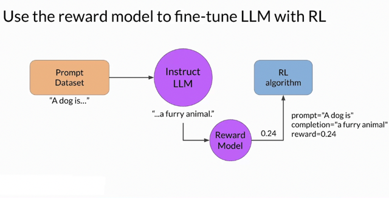
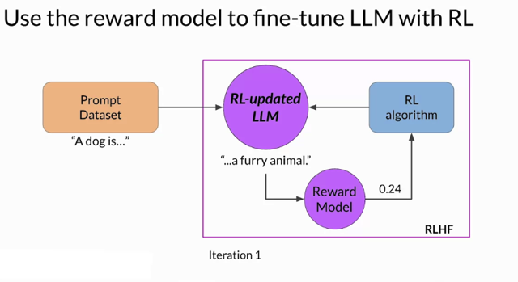
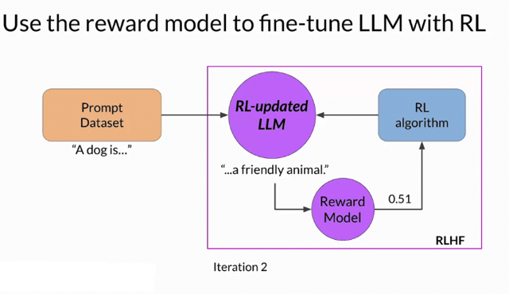
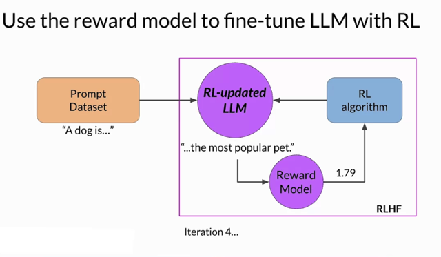
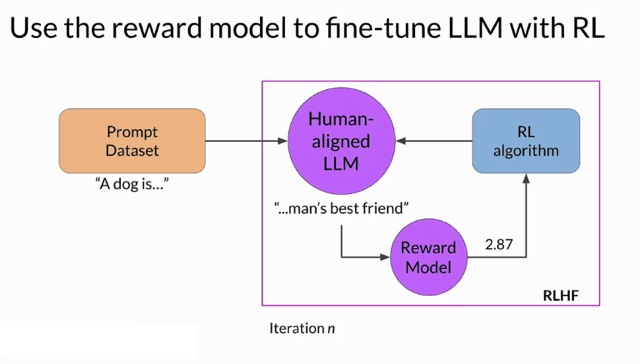
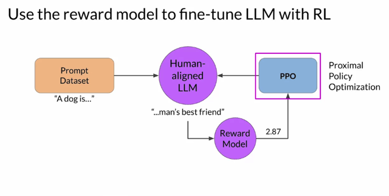

# RLHF: Fine-tuning With Reinforcement Learning

📊 **Progress:** `11` Notes | `6` Screenshots

---

## ****Using Reward Model in RLHF Process****:

> [!NOTE]
> ****Using Reward Model in RLHF Process****:
> To **achieve a human-aligned model** through reinforcement learning from human feedback (RLHF), 
> you'll integrate the reward model into the reinforcement learning process. The goal is to **update the 
> weights of the language model (LLM)** and **create a model that aligns with human preference**s.
>
> ****Iteration of RLHF Process****:
> 1. **Start with a well-performing mode**l on the**task of interest**.
> 2. **Pass a prompt** from the dataset **to the instruct LLM**, generating a **completion**.
> 3. **Combine the completion and original prompt**into a **prompt-completion pair.**
> 4. **Feed this pair** to the **reward model**, which **evaluates it based on human feedback** and r**eturns a reward value.**
> 5. **A higher reward value** indicates a **more aligned response**, while a **lower value means a less aligned one**.
> 6. This reward value**updates the LLM's weight**s through the **reinforcement learning algorithm**.
> 7. This intermediate version is referred to as the **RL updated LLM**.
> 8. These steps together constitute **one iteration** of the RLHF process.
>
> ****Multiple Iterations****:
> 1. Multiple iterations (**epochs**) of RLHF occur, **similar to other fine-tuning processes.**
> 2. **Reward score**s are **expected to improve after each iteration.**
> 3. The model's text output should **increasingly align with human preferences**.
> 4. Iterations **continue until alignment is achieved**, based on **set evaluation criteria**(e.g., reaching a threshold 
> of helpfulness) or a **maximum number of steps** (e.g., 20,000).
>
> ****Reinforcement Learning Algorithm****:
> 1. This **algorithm** takes the **reward model's output** and **updates LLM weights** to **increase the reward score over time.**
> 2. **Proximal Policy Optimization (PPO)** is a **popular choice** for this step.
> 3. While **understanding PPO's details isn't essential**, it can aid in **troubleshooting implementation challenges**.
>
> **Further Technical Details (Optional)**:
> A **deeper dive into the PPO algorithm** is available in an optional video. This isn't necessary for quizzes or the lab, 
> but it can enhance understanding of RLHF's significance in ensuring safe and aligned behavior of LLMs during deployment.

 

<kbd></kbd>

> [!NOTE]
> Bắt đầu quá trình với việc lấy **prompt data** đưa vào LLM để n**ó generate
> completion.** 
>
> Sau đó đưa cặp**prompt-completion** vào **Reward model** để nó
> **predict ra logit score** đ**óng vai trò là reward** cho LLM. Nhớ lại Reward model
> được train sao cho nó **nhận cặp prompt-completion** và **cho ra điểm cao nếu
> completion align tốt với human preference và ngược lại.**
>
> Reward model **pass score qua cho RL algorithm** và tại đây nó sẽ **update lại
> param của LLM**, tại đây ta kết thúc 1 iteration. Thì q**úa trình update policy** để ngày
> càng **nhận được reward cao hơn** chính là quá trình**update weight của LLM** để
> c**ompletion ngày càng align tốt với human preference.**

> [!NOTE]
> Let's bring everything together, and look at how you will **use the reward
> model** in the **reinforcement learning process** to **update the LLM
> weights**, and **produce a human aligned mode**l.
>
> Remember, you want to **start with a model that already has good
> performance** on your **task of interests**. You'll work to align an instruction
> finds you and LLM.
>
> First, you'll **pass a prompt** from your**prompt dataset**. In this case, a dog
> is, to the **instruct LLM**, which then **generates a completion**, in this case a
> furry animal. Next, you **sent this completion**, and the **original prompt** to
> the **reward mode**l as the **prompt completion pair**.
>
> The **reward model** **evaluates the pair** based on the human feedback it
> was trained on, and **returns a reward value**. A **higher value** such as 0. 24
> as shown here r**epresents a more aligned response**. A less aligned
> response would receive a lower value, such as negative 0.53.
>
> You'll then **pass this reward value** for the prom completion pair **to the
> reinforcement learning algorithm** to**update the weights of the LLM**, and
> **move it towards** generating more aligned, higher reward responses. Let's
> call this intermediate version of the model the RL updated LLM.

 

<kbd></kbd>

> [!NOTE]
> Kết thúc iteration thứ 1, ta
> có RL updated LLM. Và ta sẽ thực hiện nhiều lần

 

<kbd></kbd>

> [!NOTE]
> Ví dụ như iteration 2 khi cùng prompt đó model cho
> ra một completion khác được reward model cho
> điểm cao hơn. Cho thấy LLM đã học được các align
> với human reference.

> [!NOTE]
> These **series of step**s together**forms a single iteration of the RLHF process**.
> These iterations continue for a**given number of epics**, similar to other types of
> fine tuning. Here you can see that the **completion generated by the RL updated
> LLM receives a higher reward score**, indicating that the u**pdates to weights
> have resulted in a more aligned completion**

 

<kbd></kbd>

> [!NOTE]
> If the process is working well, **you'll see the reward improving after each
> iteration** as the model **produces text that is increasingly aligned with
> human preferences.**

> [!NOTE]
> Nếu quá trình diễn ra tốt đẹp ta sẽ thấy reward
> sẽ ngày càng tăng cho thấy LLM đã ngày càng
> align với human preference

 

<kbd></kbd>

> [!NOTE]
> You will **continue this iterative process** until your **model is aligned based on some
> evaluation criteria**. For example, **reaching a threshold value** for the helpfulness
> you defined. You can also define a **maximum number of steps**, for example, **20,
> 000** as the stopping criteria.

> [!NOTE]
> Tiếp tục đến khi LLM **reach một threshold nào đó** đã
> define ví dụ như helpfulness score nào đó. Hoặc cũng
> có thể **preset số lần iteration**

 

<kbd></kbd>

> [!NOTE]
> One detail we haven't discussed yet is the exact nature of the **reinforcement learning
> algorithm**.
>
> This is the algorithm that **takes the output of the reward model** and uses it to **update
> the LLM model weights** so that the reward score increases over time.
>
> There are **several different algorithms** that you can use for this part of the RLHF
> process. A popular choice is **proximal policy optimization or PPO for short**. PPO is a**pretty complicated** algorithm, and you **don't have to be familiar** with all of the details
> to be able to make use of it.
>
> However, it can be a**tricky algorithm** to implement and **understanding its inner
> workings in more detail can help** you troubleshoot if you're having problems getting it to
> work. To explain how the PPO algorithm works in more detail, I invited my AWS
> colleague, Ek to give you a deeper dive on the technical details. This next video is
> optional and you s**hould feel free to skip it**, and move on to the reward hacking video.
> You won't need the information here to complete the quizzes or this week's lab.
> However, I **encourage you to check out**the details as RLHF is**becoming
> increasingly important to ensure that LLMs behave in a safe and aligned manner** in
> deployment.

> [!NOTE]
> Một cái chưa nói là cá**i RL algorithm** dùng để**update LLM weight**sau khi nhận feedback từ Reward model. Cái này đại khái là có
> nhiều cách, thì một trong số đó là **PPO**. Cũng phức tạp nên có thể
> bỏ qua nếu muốn. Nhưng n**ên biết qua** để có thể giúp ích sau này.
> Video sau sẽ nói về nó

 

