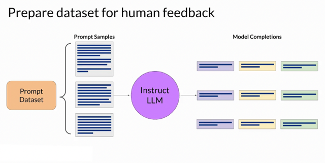
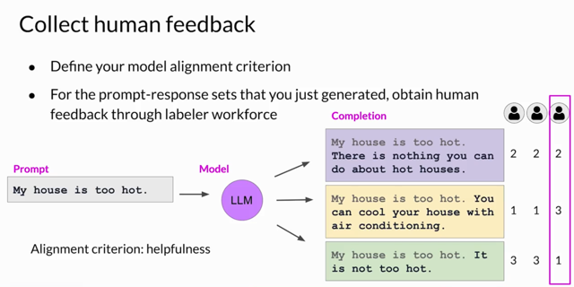
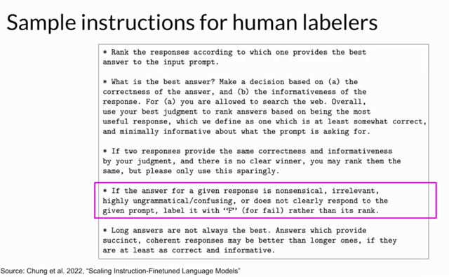
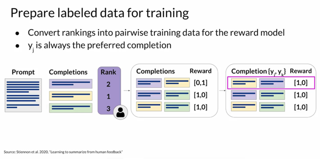

# RLHF: Obtaining Feedback From Human

📊 **Progress:** `5` Notes | `4` Screenshots

---

## 1. The process of **refining a language model** through \\*Reinforcement Learning

> [!NOTE]
> 1. The process of **refining a language model** through **Reinforcement Learning
> from Human Feedback** (RLHF) begins by **choosing a suitable model for the task**
> at hand and **creating a dataset that will be used for human feedback**.
>
> This model should **possess the necessary capabilities for the desired task**, such
> as text summarization or question answering. Often, it's advantageous to**start with
> a pre-trained model** that already**exhibits general capabilities.**
>
> Using this **model** and a**prompt dataset**, a variety of responses are generated
> for each prompt.
>
> 2. The**collection of human feedback** involves **human evaluators** who **assess
> the generated completions** based on**specific criteria**, such as **their helpfulness
> or potential toxicity.**
>
> These **evaluators rank or rate the completions according to the chosen criterion**.
>
> To illustrate, an example is provided where **labelers rank completions in terms of
> helpfulness**. **Multiple human labelers** assess the **same sets of prompt
> completions** to **establish agreement** and **mitigate the influence of outlier
> evaluators**.
>
> **Providing clear and comprehensive instructions** to evaluators is **crucial**, as it
> directly **impacts the quality and consistency of the collected feedback**. The
> instructions encompass factors like **response accuracy, informativeness, handling
> tied rankings, and addressing low-quality responses.**
> 3. **Preparing the data for training a reward model**, a key step in the process,
> involves **translating the human assessments into a format suitable** for
> reinforcement learning.
>
> **The rankings** are transformed into a system of **pairwise comparisons**, involving
> **scores of 0 or 1** for **each possible pair of completions**. The responses that
> were**favored receive a reward score of 1**, while the l**ess favored ones receive a
> score of 0**.
>
> These responses are then **reordered** so that the **preferred completion is placed
> first**, aligning with the **expectations of the reward model**. Despite the ease of
> collecting simple feedback like thumbs-up or thumbs-down, utilizing ranked feedback
> provides a more extensive dataset for training the reward model, enhancing its
> effectiveness.

 

<kbd></kbd>

> [!NOTE]
> Đại khái là **bắt đầu với instructed fine-tuned model** đã được**fine-tuned để
> perform well trên nhiều task**, đặc biệt là task mong muốn.
>
> Sau đó chuẩn bị **prompt dataset**, dùng để **inference model với nhiều prompt
> khác nhau** để **generate nhiều completion khác nhau.**

> [!NOTE]
> The first step in fine-tuning an LLM with RLHF is to**select a model to work**with and
> use it to **prepare a data set for human feedback**. The model you choose should
> have **some capability to carry out the task you are interested in**, whether this is text
> summarization, question answering or something else. In general, you may find it
> easier to**start with an instruct model that has already been fine tuned** across**many
> tasks and has some general capabilities**. You'll then use this LLM along with a
> **prompt data** set to **generate a number of different responses** for each prompt. The
> prompt dataset is comprised of **multiple prompts**, each of which gets processed by
> the LLM to p**roduce a set of completions.**

 

<kbd></kbd>

> [!NOTE]
> Để **collect human feedback**, đầu tiên là phải **tạo bộ dữ liệu cho việc training reward
> model**: Thì việc này là dùng **human labeler**. Nôm na ngắn gọn là ta **dùng các prompt trong
> prompt dataset** nói ở trên**vào LLM để lấy các prediction** của nó (gọi là **completion**). Sau đó
> **đưa cho human labeler để họ đánh giá, xếp hạng**các completion từ **cao tới thấp** theo một
> **tiêu chí nào đó** 
>
> **Nhiều người sẽ cùng label cùng một sample data** để lấy **sự đồng thuận**(phương pháp này đã nói ở Course 2) và **giảm thiểu rủi ro ông nào đó làm sai**. Nói chung là
> bộ data này sẽ**dùng để  train Reward model** bằng **Supervised Learning**, để sau đó **dùng nó
> đóng vai trò con người trong việc give feedback cho LLM trong quá trình fine-tuning LLM
> bằng RLHB**
> **Bước đầu là define alignment criterion** - tiêu chí là gì. Sau đó bắt đầu inference LLM với
> **prompt dataset** để nó generate output. Kế đến, dùng **human** labeler để **đánh giá theo
> kiểu là xếp hạng output từ cao đến thấp  theo tiêu chí đã đặt ra.**
>
> Và thay vì một, s**ẽ dùng một group nhiều labeled để lấy kết quả đồng thuận** nhằm hạn
> chế khả năng người gán nhãn đó hiểu sai yêu cầu.

 

<kbd></kbd>

> [!NOTE]
> Đại khái là **để đảm bảo các human labeler** có thể làm tốt việc **đánh giá (và gán nhãn)
> đối với các output của model** từ một prompt thì phải đ**ảm bảo human labeler hiểu được
> yêu cầu**.
>
> Cho nên **nên  có các hướng dẫn dành cho người gán nhãn** cho data (human labeler).
> Hướng dẫn họ **nên gán nhãn như thế nào** và **cách xử lý các tình huống thường gặp**
>
> Việc i**nstruct tốt cho human labeler** sẽ giúp **tăng tính consistency của data.**
>
> Mục đích là **tạo labeled data để train Reward model** để nó sẽ t**hay thế con người
> đánh giá LLM output** và gửi feedback cho LLM t**rong quá trình fine-tuning LLM bằng
> RLHF**
>
> Dữ liệu là output của LLM với input prompt. Và human sẽ đánh giá (label nó) từ cao đến
> thấp theo các tiêu chí nào đó.

 

<kbd></kbd>

> [!NOTE]
> Cuối cùng là **chuẩn bị labeled data theo dạng như này**. Đó là thành **từng cặp các
> LLM completion**. Nhìn hình chắc hiểu, giải thích dài dòng.  Ví dụ cặp thứ 2 ở
> hình giữa có reward 1,0 vì cái tím có rank 2, cái xanh có rank 3.
>
> Cuối cùng là **xếp lại, cái output có rank cao lên trước.**

 

