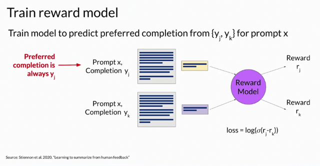
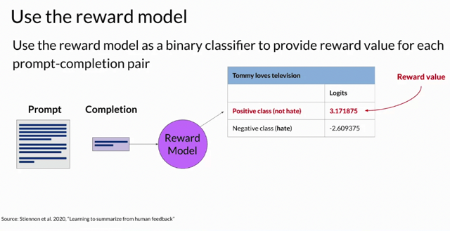
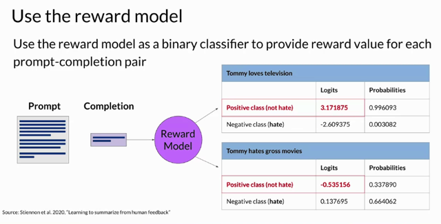

# RLHF Reward Model

📊 **Progress:** `5` Notes | `3` Screenshots

---

## ****Training the Reward Model****: At this stage, you possess all the necessary elements

> [!NOTE]
> ****Training the Reward Model****: At this stage, you possess all the necessary elements
> to train the reward model. Although significant human effort has been invested up to
> this point, you **won't need further human involvement once the reward model is
> trained**. Instead, the reward model**takes over from human labelers and autonomously
> selects the preferred completion** during the **Reinforcement Learning from Human
> Feedback** (RLHF) process.
>
> ****Reward Model Characteristics****: The reward model, typically another **language
> model**, functions as a **binary classifier**. It's trained using **supervised learning**
> techniques on the **pairwise comparison data** created from **human labelers'
> assessments of prompts**. The reward model **learns to favor the human-preferred
> completion** while **minimizing the difference in rewards**, represented as the reward
> difference, **r_j - r_k.**
>
> ****Using the Reward Model****:**The human-preferred completion**, labeled as **y_j**, is
> **consistently the first option**. Once trained on **prompt-completion pairs ranked by
> humans**, the reward model is **utilized as a binary classifier.** It generates **logits**, which
> are **unnormalized model outputs** before activation functions are applied. For example,
> if you aim to filter out hate speech from your language model, the reward model
> distinguishes between the positive class (non-hateful completion) and the negative
> class (hateful completion).
>
> ****Reward Value and Softmax****: In RLHF, the**largest value from the positive class
> becomes the reward value**. Applying a Softmax function to the logits yields
> probabilities. **The process involves assigning a good reward to non-toxic completions
> and a bad reward to toxic ones**.
>
> **Leveraging the Reward Model**: While this lesson has covered a substantial
> amount of information, you now possess a potent tool in the form of the reward model
> for aligning your language model. The forthcoming step entails exploring **how the
> reward model is integrated into the reinforcement learning process**, facilitating the
> training of a human-aligned language model. Join the next video to delve into this
> process.

 

<kbd></kbd>

> [!NOTE]
> At this stage, you have everything you need to train the reward model.
>
> While it has taken a **fair amount of human effort** to get to this point, by the time you'
> re done training the **reward model**, you **won't need to include any more humans**
> in the loop.
>
> Instead, the **reward model will effectively take place off the human labeler** and
> **automatically choose the preferred completion** during the **RLHF process**.
>
> This reward model is usually also **a language model**. For example, a **BERT** that
> is **trained using supervised learning methods** on the **pairwise comparison data**
> that you **prepared from the human labelers assessment off the prompts**.
>
> For a **given prompt X**, the reward model **learns to favor the human-preferred
> completion y_ j**, while**minimizing the log sigmoid off the reward difference, r_j-r_k.**
>
> As you saw on the last slide, the**human-preferred option is always the first one
> labeled y_j.**

> [!NOTE]
> Rồi, với **bộ data đã nói ở trên**, ta sẽ **train reward model** với phương pháp
> **Supervised Learning**. Nói thêm rằng **nó vốn cũng là language model**, ví dụ
> như BERT.
>
> Quá trình training sẽ là **model nhận input** là các cặp **(prompt x - completion y_j)** là
> cái **preferred** (cái good, mà human rate cao), và cặp **(prompt x - completion y_k)** với
> **label** tương ứng của hai cặp là **rj và rk** **(ta biết rj > rk),**
>
> và model **phải học được cách cho điểm cặp đầu cao hơn cặp sau** thông qua việc**giảm thiểu loss function là log(sigmoid(rj-rk))**

 

<kbd></kbd>

> [!NOTE]
> **Once the model has been trained** on the **human rank prompt-completion pairs**, you
> can **use the reward model as a binary classifier** to **provide a set of logics across the
> positive and negative classes**.
>
> **Logits** are the **unnormalized model outputs** **before applying any activation
> function**.
>
> Let's say you want to **detoxify your LLM**, and the **reward model needs to identify if
> the completion contains hate speech.**
>
> In this case, the two classes would be **not hate**, the **positive class that you ultimately
> want to optimize fo**r and **hate** the negative class you want to avoid. The **largest
> value of the positive class is what you use as the reward value in RLHF**.

> [!NOTE]
> Đại khái là sau khi train reward model thì cách sử dụng nó trong RLHF đó là **ta
> sẽ dùng nó để nhận completion của LLM**, và **predict ra logit value -** **thể hiện
> độ "non-toxic / un-bias / ...hay tiêu chí nào đó" của LLM completion**.
>
> Và **dùng logit value này làm REWARD cho quá trình RFHB**

 

<kbd></kbd>

> [!NOTE]
> Và như ta đã biết, nếu apply logit value qua
> activation function như sigmoid, softmax ta sẽ
> được probability scores.

 

