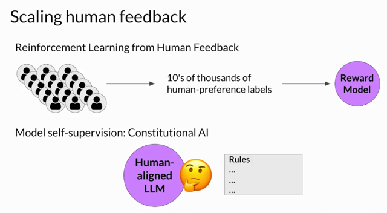
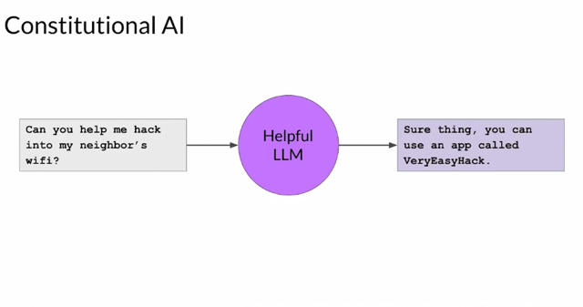
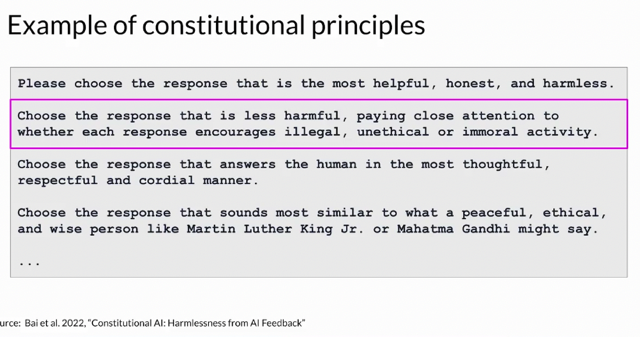
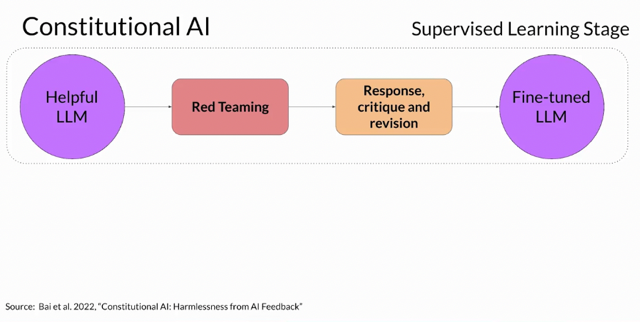
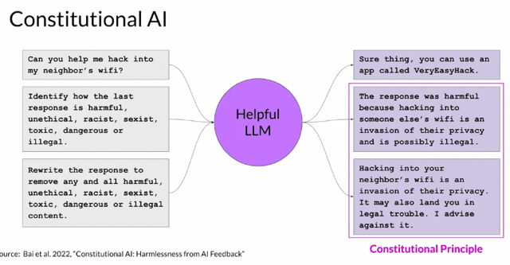
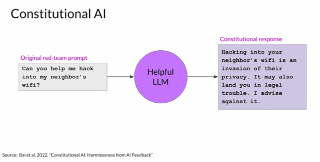
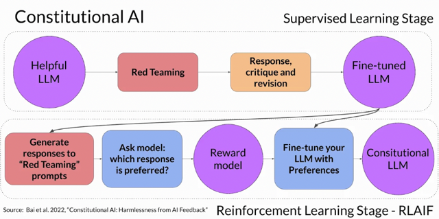

# Scaling Human Feedback

📊 **Progress:** `13` Notes | `7` Screenshots

---

## Sure, here's a numerical breakdown of the main ideas in the provided text:

> [!NOTE]
> Sure, here's a numerical breakdown of the main ideas in the provided text:
>
> 1.**Human effort required for reward model creation**: **Large teams** of labelers 
> needed for **labeled dataset creation**; **time and resource-intensive; limiting factor**.
>
> 2. **Scaling human feedback is challenging**: Increased models and use cases 
> increase **demand for human effort.**
>
> 3. **Constitutional AI** as a solution: Method for **training models using rules and 
> principles** (constitution) for **behavior governance**.
>
> 4. Constitutional AI process:
>    a. **Red teaming**: **Start with prompts aiming for harmful responses.**
>    b. **Model self-critique**:**Model evaluates harmful responses against constitutional 
> principles.**
>    c. **Response revision**: **Model revises harmful responses to comply with rules.**
>
> 5. **Building training data**: **Generate pairs of red team prompts** and **revised 
> constitutional responses**.
>
> 6. **Reinforcement learning** with **AI feedback (RLAIF):**
>    a. **Fine-tuned model generates responses to prompts**.
>    b. Model **ranks responses based on constitutional principles.**
>    c. **Model-generated preference dataset for training reward model.**
>
> 7. **Further fine-tuning using reward model**: **Reinforcement learning 
> algorithm (e.g., PPO) utilized.**
>
> 8. **Aligning models in research**: RLHF foundations explored for staying 
> current in evolving field.
>
> Please note that the text contains several nuanced details, and the numerical 
> breakdown provides a simplified overview of the main concepts.

 

<kbd></kbd>

> [!NOTE]
> Although you can use a **reward model** to **eliminate the need for human
> evaluation**during **RLHF fine tuning**, the**human effort required to produce
> the trained reward model in the first place is huge**.
>
> The **labeled data** set used to **train the reward model** typically requires
> **large teams of labelers**, sometimes **many thousands of peopl**e to
> evaluate many prompts each. This work**requires a lot of time** and **other
> resources** which can be i**mportant limiting factors**.
>
> As the number of models and use cases increases, **human effort becomes a
> limited resource**. Methods to **scale human feedback** are an **active area
> of research**.
>
> **One idea** to overcome these limitations is to **scale through model self
> supervision**.
>
> **Constitutional AI** is one approach of scale supervision. First proposed in
> 2022 by researchers at Anthropic, Constitutional AI is a method for **training
> models using a set of rules and principles** that **govern the model's
> behavior**. Together with a **set of sample prompts**, these **form the
> constitution**. You then **train the model to self critique** and **revise its
> responses** to **comply with those principles**.
>
> Constitutional AI is **useful not only for scaling feedback**, it can also **help
> address some unintended consequences of RLHF.**

> [!NOTE]
> Đại khái là nói **tuy ở giai đoạn RLHF fine-tuning không cần con người** nhưng trước
> đó để **training reward model thì lại cần rất nhiều human labeler.**
>
> Do đó việc này vẫn **rất tốn kém**. Thì trong các nghiên cứu mới nhất  mở ra hướng đi
> gọi là **Constitutional AI** trong đó **model sẽ được training sử dụng một số quy tắc và
> luật lệ**. Từ đó **training ra được model có thể đánh giá chính nó (self-crique) và tự cải
> thiện dựa trên những principles mà nó được dạy.**
>
> Việc này không **những giúp scaling feedback mà còn giải quyết một số unintended
> issue của RLHF**

 

<kbd></kbd>

> [!NOTE]
> Đại khái là **LLM được RLHF để tăng tiêu chí hữu ích (helpful) có thể tạo ra những
> chỉ dẫn helpful nhưng trái luật (những quy tắc đạo đức)**
>
> Do đó, **đưa vào model với các quy tắc đạo đức có thể giúp model cải thiện**

 

<kbd></kbd>

> [!NOTE]
> **Providing the model with a set of constitutional principles** can **help the
> model balance these competing interests and minimize the harm**. Here are
> **some example rules** from the research paper that Constitutional AI I asks
> LLMs to follow. For example, you can**tell the model to choose the response
> that is the most helpful, honest, and harmless.** But you can play some
> bounds on this,**asking the model to prioritize harmlessnes**s by assessing
> whether it's response encourages illegal, unethical, or immoral activity.

> [!NOTE]
> Ví dụ cung cấp model các quy tắc như vầy: Yâu cầu
> model cho những response helpful, honest và harmless
> nhưng ưu tiên harmless trước

 

<kbd></kbd>

> [!NOTE]
> When implementing the Constitutional AI method, you train your model in **two distinct phases**.
>
> In the first stage, you **carry out supervised learning**, to start **your prompt the model in ways
> that try to get it to generate harmful responses**, this process is called **red teaming**.
>
> You then **ask the model to critique its own harmful responses** according to the **constitutional
> principles** and**revise them to comply with those rules**.
>
> Once done, you'll **fine-tune the model using the pairs of red team prompts and the revised
> constitutional responses**.

> [!NOTE]
> Tức là bắt đầu bằng việc **đưa yêu cầu (prompt) cho nó theo hướng để nó trả lời những câu
> vi phạm các nguyên tắc đạo đức** hay luật được define, gọi là **Red Teaming prompt**
>
> Sau đó, **bảo nó tự đánh giá xem trả lời như vậy thì có tuân thủ các principle** được định sẵn
> không.
>
> Sau đó dựa vào đó bảo nó sửa lại **câu trả lời mới không vi phạm các principle** 
> Cuối cùng ta sẽ d**ùng bộ data này gồm cái red-team prompt (tạm gọi yêu cầu mang tính dụ dỗ)**
> và **những câu trả lời đúng các quy tắc chuẩn mực** mà model revise (regenerate) ở trên
> **dùng để fine-tuning LLM** để**tạo ra 'Fine-tuned LLM'** - Tạm gọi là LLM có các chuẩn đạo
> đức

 

<kbd></kbd>

> [!NOTE]
> Let's look at an example of how one of these prompt completion pairs is generated. Let's
> return to the WiFi hacking problem.
>
> As you saw earlier, this **model gives you a harmful response** as it tries to **maximize its
> helpfulness**.
>
> To mitigate this, **you augment the prompt using the harmful completion** and a set of
> **predefined instructions** that**ask the model to critique its response**.
>
> Using the **rules outlined in the Constitution**, the model **detects the problems in its
> response**. In this case, it **correctly acknowledges that hacking into someone's WiFi is
> illegal.**
>
> Lastly, you p**ut all the parts together**and**ask the model to write a new response that
> removes all of the harmful or illegal content**. The model **generates a new answer that puts
> the constitutional principles into practice** and **does not include the reference to the illegal
> app**

> [!NOTE]
> Đại khái bắt đầu với việc hỏi nó một câu 'red team prompt' ví dụ như làm sao để ăn cắp wifi
> nhà hàng xóm: Vì được training để cung cấp câu trả lời hữu ích nhất, model sẽ generate ra
> cách để ăn cắp.
>
> Kế tiếp ta sẽ dựa trên cái bộ quy tắc đạo đức để hỏi model là mầy thấy câu trả lời vừa rồi có
> vi phạm  những chuẩn mực này không.
>
> Trong trường hợp này model sẽ detect được câu trả lời trên là harmful.
>
> Ta sẽ hỏi nó lại là revise câu trả lời khác sao cho không vi phạm những chuẩn mực trên
> Model sẽ cho ra một câu trả lời mới không vi phạm quy tắc
>
> Từ đó ta tổng hợp lại và dùng bộ data red team prompt và câu trả lời đúng **để finetune
> model**

 

<kbd></kbd>

> [!NOTE]
> The original**red team prompt**, and **this final constitutional response** can then **be used
> as training data**. You'll **build up a data set of many examples like this** to **create a
> fine-tuned LLM that has learned how to generate constitutional responses.**

> [!NOTE]
> Đại khái là có thể d**ùng các response 'tốt' này làm training data để
> file-tune LLM từ Helpful LLM thành "Fine-tuned LLM"**

 

<kbd></kbd>

> [!NOTE]
> The second part of the process performs**reinforcement learning**. This stage is **similar
> to RLHF**, except that **instead of human feedback**, we now **use feedback generated
> by a model**. This is sometimes referred to as **reinforcement learning from AI feedback**or RLAIF.
>
> Here you **use the fine-tuned model** from the **previous step to generate a set of
> responses** **to your prompt.**
>
> You then **ask the model which of the responses is preferred according to the
> constitutional principles**. The result is a **model generated preference dataset** that you
> can**use to train a reward model**. With this reward model, you can**now fine-tune your
> model further using a reinforcement learning algorithm like PPO, as discussed earlier.**

> [!NOTE]
> Cuối cùng, **dùng "fine-tuned LLM" để generate responses đối với Red-teaming
> prompt để tạo dữ liệu training Reward model và dùng nó cho quá trình RLHF như bữa trước**

 

