# Scaling Laws And Compute-optimal Models

📊 **Progress:** `18` Notes | `12` Screenshots

---

## 1. ****Computational Challenges** of Training Large Language Models:** The passage begins by acknowledging

> [!NOTE]
> 1. ****Computational Challenges** of Training Large Language Models:** The passage begins by acknowledging
> the**challenges of training large language models**. To achieve**better performance**, t**wo options** are presented:
> **increasing the size of the training dataset** and **increasing the number of parameters** in the model.
>
> 2. ****Compute Budget Definitio**n:** The concept of a "**petaFLOP per second day**" is introduced as a **unit of
> compute** that **quantifies the required resources** for training large language models.
>
> 3. ****Scaling of Model Size**,**Training Data**, and **Compute Budget**:** Researchers have explored the **relationship
> between model size**,**training dataset size**, and **compute budget**. The goal is to**find the right balance to optimize
> model performance** while **considering available resources**.
>
> 4. ****Power-Law Relationships**:** Power-law relationships exist between **compute budget** and **model
> performance**,**training dataset siz**e and **model** **performance**, and **model size** and **model performance**.
>
> 5. **Compute **Optimal Model - Chinchilla Paper**:** The Chinchilla paper, published in **2022**, explores the
> **performance of language models** of various **sizes** and **quantities** of training data. Chinchilla is the resulting
> compute**optimal model**, showing that **many large models** like GPT-3 may be **overparameterized** and
> **undertrained**.
>
> 6. ****Optimal Training Dataset Size**:** The Chinchilla paper suggests that the **optimal training dataset size** for a
> given model is about **20 times larger** than the **number of parameters in the model**.
>
> 7. ****Benefits of Compute Optimal Models**:** **Compute optimal models** like Chinchilla **outperform non-optimal
> models (e.g., GPT-3)** on a range of **downstream evaluation tasks**.
>
> 8. ****Smaller Models** with **Similar Performance**:** As a result of the Chinchilla paper, teams are developing
> **smaller models that achieve similar or better results than larger non-optimal models.**
>
> 9. ****Bloomberg GPT**:** Bloomberg GPT is an example of a **model trained in a compute optimal way following
> the Chinchilla loss**, achieving **good performance with 50 billion parameters.**
>
> Overall, the passage highlights the **trade-offs and relationships between model size, training data, compute
> budget**, and **model performance**. It introduces the **Chinchilla paper** as an **important study** in understanding how
> to**optimize language models for better performance.**

 

<kbd>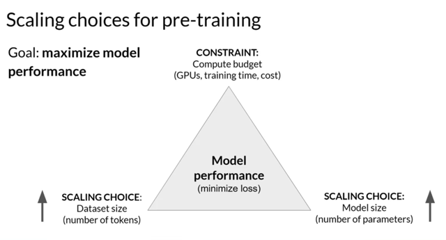</kbd>

> [!NOTE]
> In the last video, you explored some of the **computational challenges** of **training large
> language models**. Here you'll learn about research that has explored the **relationship
> between model size, training, configuration and performance** in an effort to **determine just
> how big models need to be**. Remember, the goal during pre-training is to **maximize the
> model's performance of its learning objective**, which is **minimizing the loss when predicting
> tokens**. Two options you have to achieve better performance are **increasing the size of the
> dataset** you train your model on and **increasing the number of parameters** in your model. In
> theory, you could **scale either of both of these quantities to improve performance**. However,
> **another issue to take into consideration is your compute budget** which includes factors like
> the **number of GPUs** you have access to and the **time you have available for training models**.

> [!NOTE]
> Đại khái là có những nhiên cứu cho thấy **quan hệ giữa model size, training,
> configuration và performance**. Dù ta có thể tăng performance bằng cách**tăng kích
> thước model** cũng như là **số lượng data**, tuy nhiên **trong thực tế ta luôn bị giới
> hạn bởi compute budget** như **số lượng GPU, thời gian cho phép** trong việc training
> model.

 

<kbd>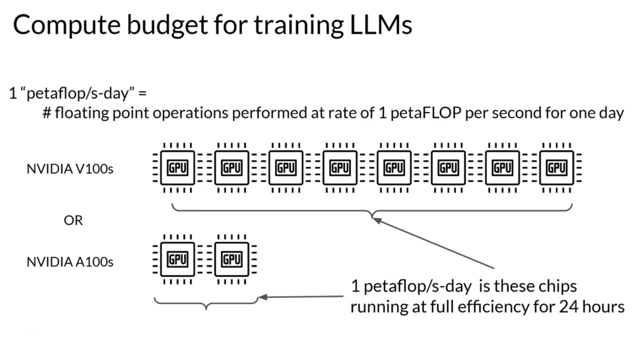</kbd>

> [!NOTE]
> To help you **understand some of the discussion ahead**, let's first **define a unit of
> compute** that **quantifies the required resources**. A **petaFLOP** **per second day** is a
> **measurement of the number of floating point operations** performed at a **rate of one
> petaFLOP per second**, running for an **entire day**. Note, one petaFLOP corresponds to
> **one quadrillion floating point operations per second**. When specifically thinking about
> training Transformers, **one petaFLOP / second day** is approximately equivalent to
> **8 NVIDIA V100 GPUs**, operating at **full efficiency for one full day.** If you have a
> more powerful processor that can carry out more operations at once, then a
> petaFLOP per second day requires fewer chips. For example, two NVIDIA A100 GPUs
> give equivalent compute to the eight V100 chips.

> [!NOTE]
> Đại khái đơn vị tính 1 petaflop/s-day là **số lượng phép tính floating
> point** được thực hiện với **tốc độ 1 petaFlop mỗi giây** và **chạy
> liên tục trong 1 ngày**. Mỗi petaFlop tương ứng với **1 triệu tỉ phép
> tính floating point trong một giây**. 1 petaFlop/ s-day tương đương**8
> NVIDA V100**hoặc **2 NVIDIA A100** chạy liên tục với **full-efficiency
> trong 24 giờ.**

 

<kbd>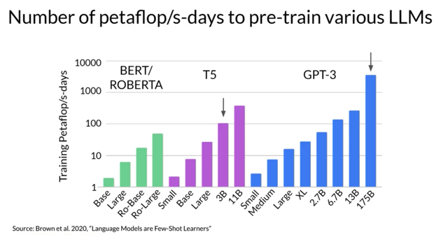</kbd>

> [!NOTE]
> To give you an idea off the scale of these compute budgets, this chart shows a
> **comparison off the petaFLOP per second days** required to pre-train **different variance
> of Bert and Roberta**, which are****both**encoder only models**. **T5** and **encoder-decoder
> model** and **GPT-3**, which is a **decoder only** model. The difference between the models
> in each family is the **number of parameters** that were trained, ranging from a few
> hundred million for Bert base to 175 billion for the largest GPT-3 variant. Note that the
> y-axis is **logarithmic**. E**ach increment vertically is a power of 10**. Here we see that T5
> XL with **3 billion parameters** required close to **100 petaFLOP per second days**.
> While the **larger GPT-3 175 billion parameter model** required approximately **3,700
> petaFLOP per second days**. This chart makes it clear that a **huge amount of computers
> required to train the largest models.**

> [!NOTE]
> Biểu đồ cho thấy **số petaflop/s-days** cần thiết để train các **LLM từ nhỏ tới lớn**.
> Với **T5 3B** (**3 billions params**) cần 100 trong khi đó **GPT-3 175B** (**175 billions
> params**) cần tới **3700 petaflop/s-days**. Cho thấy y**êu cầu tính toán để train các
> LLM này là con số khổng lồ.**

 

<kbd>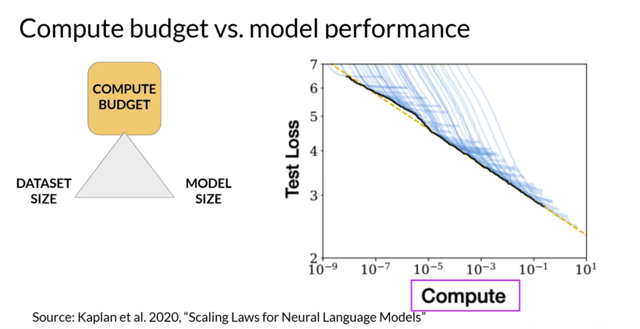</kbd>

> [!NOTE]
> It turns out that they are actually w**ell-defined relationships** between these **three scaling
> choices**. Researchers have explored the **trade-offs between training dataset size**,
> **model size** and **compute budget**. Here's a figure from a paper by researchers at OpenAI
> that explores the **impact of compute budget** on model performance. The y-axis is the**test
> loss,** which you can consider as **a proxy for model performance** where smaller values are
> better. The x-axis is the **compute budget**in **units of petaFLOP per second days**. As you
> just saw, larger numbers can be achieved by either **using more compute power** or
> **training for longer** or **both**. Each **thin blue line** here shows the **model loss over a
> single training run**. Looking at**where the loss starts to decline more slowly** for each run,
> reveals a **clear relationship between the compute budget and the model's performance**.

> [!NOTE]
> Có một liên hệ trade off giữa t**raining dataset size, model size và compute budget**. Đồ thị
> cho thấy đại khái là**compute budget càng lớn** thì **test loss có thể xuống càng thấp**
> (các **đường chỉ màu xanh** thể hiện **test loss**, nó giảm xuống lúc đầu nhanh nhưng sau
> chậm dần dần) để rồi **thống kế lại các điểm đáy khi của test loss sẽ có xu hướng thấp
> dần** khi **compute budget càng lớn**. Cơmpute budget được tính bằng đơn vị **petaFlop
> per second day** và có thể được tăng bằng cách **train với model lớn hơn hoặc train lâu
> hơn (với nhiều data hơn)**

 

<kbd>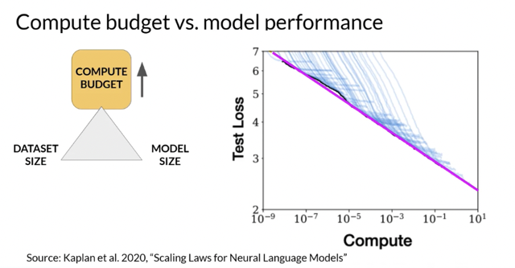</kbd>

> [!NOTE]
> This can be approximated by a **power-law relationship**, shown by this **pink line**. A
> power law is a **mathematical relationship between two variables**, where **one is
> proportional** **to the other** **raised to some power**. When plotted on a graph where
> both axes are logarithmic, power-law relationships appear as**straight lines**. The
> relationship here holds as long as model size and training dataset size don't inhibit the
> training process. Taken at face value, this would suggest that you can**just increase your
> compute budget to achieve better model performance**

> [!NOTE]
> Đại khái là nếu **plot theo log của compute budget** và **log của test loss ra đường
> thằng** thì thực tế quan hệ của chúng là**law-power**tức là **biến này tăng theo cấp
> mũ của biến kia**. Và biểu đồ cũng cho thấy rằng ta **có thể tăng model performance
> bằng cách tăng compute budget.**

 

<kbd>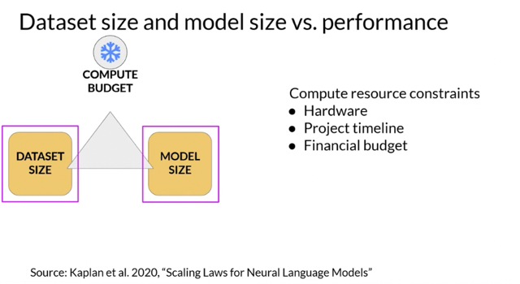</kbd>

> [!NOTE]
> Đại khái là trong thực tế **compute budget sẽ bị giới hạn** bởi các yếu tố như **hardware,
> project lifetime**hay**financial budget**. Nhưng nghiên cứu của OpenAI cũng cho thấy
> **nếu hai cái yếu tố còn lại** (trong 3 yếu tố là compute budget, dataset size và model
> size) **được giữ fixed**, thì t**ăng yếu tố nào cũng sẽ cải thiện test loss theo power-law.**

> [!NOTE]
> In practice however, the **compute resources** you have available for training
> will generally **be a hard constraint**set by factors such as the **hardware** you
> have access to, the **time available for training** and the **financial budget** of the
> project. If you **hold your compute budget fixed**, the two levers you have to
> improve your model's performance are the**size of the training dataset** and
> the **number of parameters** in your model. The OpenAI researchers found that
> these two quantities also show a **power-law relationship** with a test loss**in the
> case where the other two variables are held fixed.**

 

<kbd>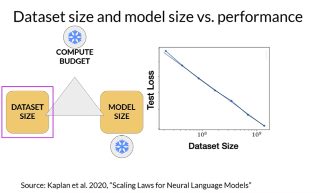</kbd>

> [!NOTE]
> Ví dụ như **giữ compute budge và
> model size fix** thì **càng nhiều data
> càng tăng performance theo power law**

 

<kbd>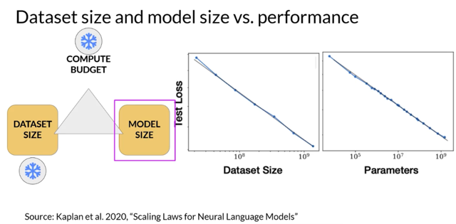</kbd>

> [!NOTE]
> Hoặc giữ **compute budget** và **dataset size fixed** thì
> càng **tăng model size** càng **tăng performance theo power-law**

 

<kbd>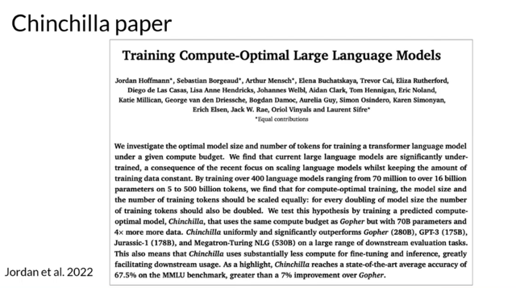</kbd>

> [!NOTE]
> Đại khái là người ta nghiên cứu kiểu như **làm sao để tối ưu LLM**, với**compute
> budget và model size cụ thể thì nên train với bao nhiêu data** hoặc **với chừng đó
> data và compute budget thì model size thế nào là tối ưu**...Nghiên cứu được công
> bố trong paper gọi là **Chinchilla paper**

 

<kbd>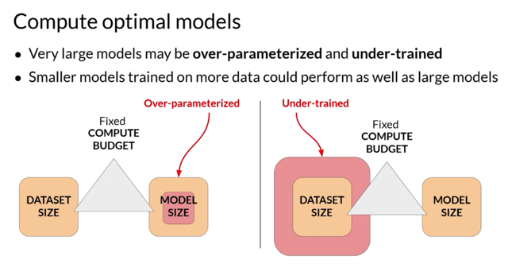</kbd>

> [!NOTE]
> Nó có thấy nhiều LLM model bị **over-parameterized** - Là **đáng lẽ không cần model to như
> vậy** với chừng đó data và compute budget ý nói có thể thu nhỏ nó lại mà vẫn giữ được thậm
> chí tăng performance. Hoặc **under-trained** khi model có thể **chưa tận dụng hết tiềm
> năng** và **nếu được train với nhiều data** hơn nó sẽ **còn có thể tốt hơn.**

 

<kbd>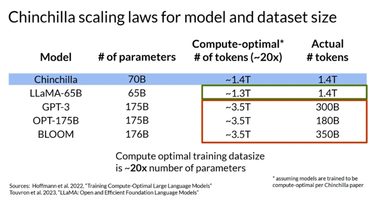</kbd>

> [!NOTE]
> Cho thấy các model như **LLaMA** đạt **tiệm cận mức tối ưu**
> (tức là **số lượng data point sẽ khoảng 20 lần số parameter**
> như Chinchilla model) và các **LLM khác như GPT-3, hay
> BLOOM** bị **dưới tiềm năng** khi **có thể được cải thiện hơn
> nữa với nhiều data hơn.**

 

<kbd>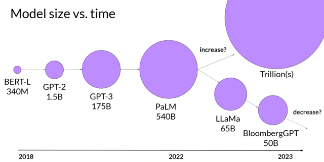</kbd>

> [!NOTE]
> Đại khái là với Chinchilla paper, người ta**dần dần thu
> gọn các model lại mà vẫn giữ được performance.**

 

