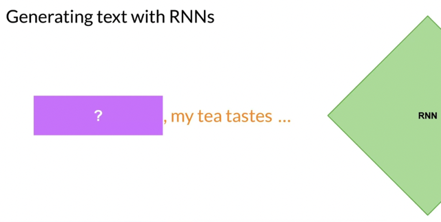
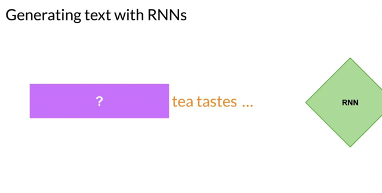
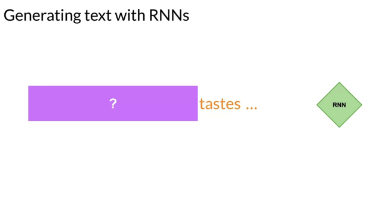
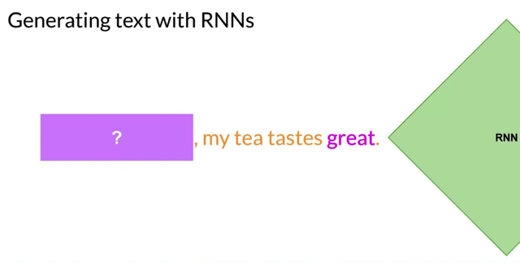
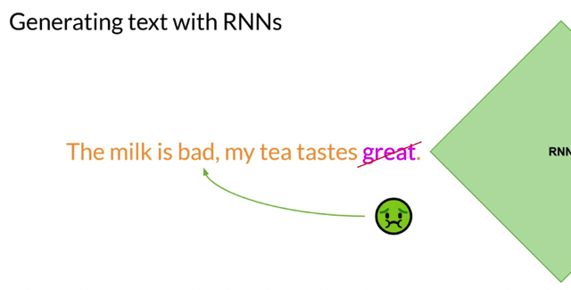
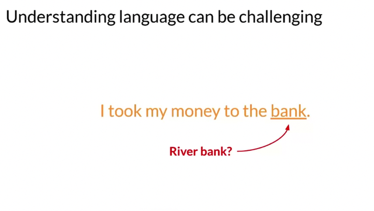
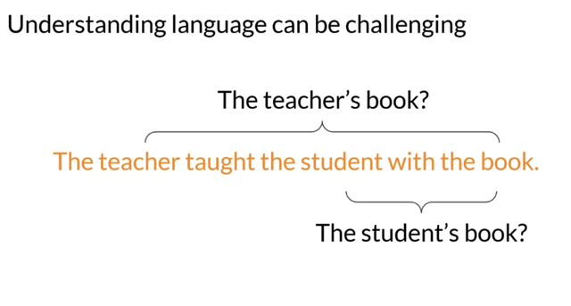
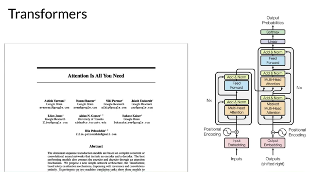
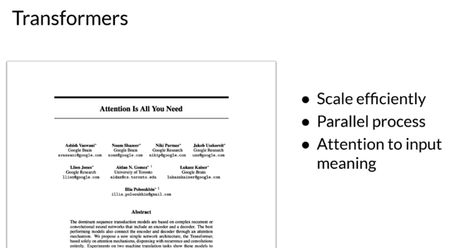

# Text Generation Before Transformers

📊 **Progress:** `7` Notes | `11` Screenshots

---

## 1 **Generative algorithms** have been used in **language models**, with **previous generations**

> [!NOTE]
> 1 **Generative algorithms** have been used in **language models**, with **previous generations**
> relying on **recurrent neural networks (RNNs).**
>
> 2 **RNNs** had **limitations** due to **computational and memory requirements**, especially when
> **scaling to consider more preceding words** for**better predictions.**
>
> 3 **Language understanding** requires **considering the context of a sentence** or even the **entire
> document**, as words can have **multiple meanings** and **syntactic ambiguity.**
>
> 4 In 2017, the **transformer architecture**, introduced in the paper **"Attention is All You Need,"**
> r**evolutionized generative AI.**
>
> 5 The transformer architecture allows for **efficient scaling**, **parallel processing** of input data, and
> the **ability to learn to pay attention to word meanings.**
>
> 6 The **key concept**in the **transformer architecture** is **attention**, which **enables improved
> language understanding** and **generative capabilities**.

 

<kbd></kbd>

<kbd></kbd>

<kbd></kbd>

<kbd></kbd>

<kbd></kbd>

 

<kbd></kbd>

> [!NOTE]
> Đại khái là nói về RNN **khi câu càng dài**, hay nói cách khác là cái**từ chứa thông tin liên quan để
> dự đoán từ tiếp theo càng xa** thì **RNN dễ bị quên đi thông đó** khiến **dự đoán không chính xác**.
>
> Ở muốn diễn đạt ý là **để predict một từ**, RNN sẽ **dựa trên trí nhớ của nó về các từ trước đó**, ví dụ
> chỉ có '**taste**' nó **chưa đủ để dự đoán**, nó**phải chứa được thêm thông tin ở xa hơn**
>
> Ví dụ có thêm **'tea taste'**, tuy nhiên v**ẫn chưa đủ**, **nó cần nhớ nhiều thông tin hơn nữa** (thể hiện
> bằng cái minh hoạ RNN model phình to ra)
>
> Đến khi có **'my tea taste'** thì nó dự đoán là '**great**'.
>
> Nhưng k**ết quả là sai** vì một thông tin quan trọng là chữ **bad** trong vế câu trước. Cho thấy là, **với
> những câu dài, để predict được chính xác, model có thể cần phải biết được toàn bộ câu hoặc
> thậm chí toàn bộ document.**

 

<kbd></kbd>

> [!NOTE]
> RNNs while powerful for their time, were limited by the amount of compute and memory needed
> to perform well at generative tasks. Let's look at an example of an RNN carrying out a simple
> next-word prediction generative task.**With just one previous words seen by the model, the
> prediction can't be very good**. As you **scale the RNN implementation** to be able to**see more
> of the preceding words in the text**, you have to **significantly scale the resources that the model
> uses**. As for the prediction, well, the model **failed** here. **Even though you scale the model**,
> it **still hasn't seen enough of the input to make a good prediction.** To successfully predict the next word, **models need to see more than  just the previous few
> words**. Models needs to **have an understanding  of the whole sentence** or even the **whole
> document**

 

<kbd></kbd>

> [!NOTE]
> The problem here is that**language is complex**. In many languages, **one word
> can have multiple meanings**. These are **homonyms**. In this case, **it's only
> with the context of the sentence that we can see what kind of bank is meant.**
> Words within a sentence structures can be **ambiguous** or have what we
> might call **syntactic ambiguity.** Take for example this sentence, "The teacher
> taught the students with the book." Did the teacher teach using the book or
> did the student have the book, or was it both? How can an algorithm make
> sense of human language if sometimes we can't?

> [!NOTE]
> Một từ có thể **có nhiều nghĩa tuỳ vào
> hoàn cảnh cụ thể** trong từng câu.

 

<kbd></kbd>

> [!NOTE]
> Hoặc vấn đề **syntactic ambiguity** mà n**gay cả
> con người nhiều khi còn khó hiểu**

 

<kbd></kbd>

> [!NOTE]
> Well in 2017, after the publication of this paper, **Attention is All You Need**, from
> **Google** and the **University of Toronto**, everything changed. The **transformer**
> **architecture** had arrived. This **novel approach** unlocked the progress in
> generative AI that we see today. It can be s**caled efficiently**to use multi-core
> GPUs, it can **parallel process input data,** making **use of much larger training
> datasets**, and crucially, it's able to **learn to pay attention to the meaning of the
> words it's processing**. And attention is all you need. It's in the title.

> [!NOTE]
> Và **Attention** model cùng với **Transformer** đã mang tới một giải pháp rất
> tốt cho vấn đề này. Nó cho phép model **học được các embed từ tuỳ theo
> ngữ cảnh** của nó **thay vì extract từ một fixed embedding dictionary**. Nó
> **mang đến khả năng parallel process** đối với **sequence data** giống như
> cách mà **Convolutional Network làm đối với image data**.

 

<kbd></kbd>

 

