# Transformer. Architecture

📊 **Progress:** `21` Notes | `27` Screenshots

---

## 1 The transformer architecture **greatly improved natural language processing tasks** and \\*generative

> [!NOTE]
> 1 The transformer architecture **greatly improved natural language processing tasks** and **generative
> capabilities** compared to earlier**RNN-based models.**
>
> 2 The power of the transformer lies in **its ability to learn the relevance and context of all words in a
> sentence,** **considering their relationships with each other.**
>
> 3 **Self-attention** is a k**ey attribute** of the transformer architecture, allowing the model to **assign
> attention weights to words based on their importance and relevance**.
>
> 4 The transformer architecture consists of**two main components:** the **encoder** and the **decoder**,
> which **work together and share similarities.**
>
> 5 **Tokenization** is necessary to**convert words into numerical representations** before passing them
> into the model.
>
> 6 The **embedding layer maps token IDs** to**high-dimensional vectors,** **encoding the meaning and
> context of individual tokens in the input sequence.**
>
> 7 **Positional encoding preserves** the **word order** by a**dding positional information** to the token
> vectors.
>
> 8 The **self-attention layer** **analyzes relationships between tokens**, allowing the model****to**capture
> contextual dependencies and attend to different parts of the input sequence.**
>
> 9 **Multi-headed self-attention** involves **learning multiple sets of self-attention weights in parallel**, with
> **each head focusing on different aspects of language.**
>
> 10 The**outp**ut of the self-attention layer is **processed through a feed-forward network,** producing
> **logits** that **represent the probability scores for each token in the tokenizer dictionary.**
>
> 11 **The logits are normalized using a softmax** layer to **obtain probability scores for each word**, with
> the **highest scoring token being the most likely prediction**.
>
> 12 **Various methods** can be used to**select the final predicted token** from the probability distribution.

 

<kbd>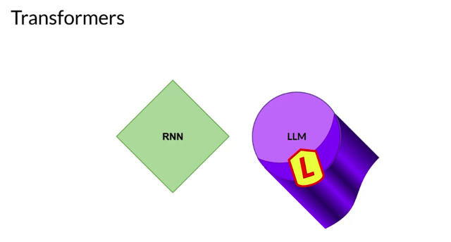</kbd>

 

<kbd>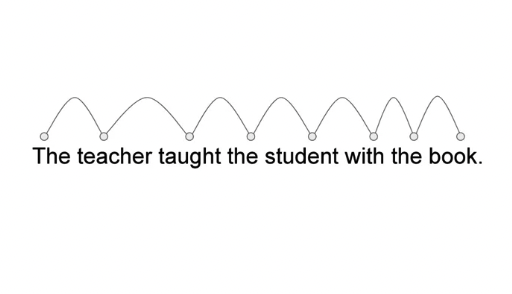</kbd>

 

<kbd></kbd>

> [!NOTE]
> The power of the transformer architecture lies in its **ability to learn the
> relevance and context of all of the words in a sentence.** Not just as you see
> here, to each word next to its neighbor, but to **every other word in a
> sentence**. To apply \_**attention weights**\_ to those relationships so that the **model
> learns the relevance of each word** to**each other words no matter where they
> are in the input.**

> [!NOTE]
> Thay vì **chỉ học được các thông tin liên quan ngữ nghĩa của một từ** bằng **những từ
> hàng xóm** của nó **mà là tất cả các từ trong câu**. **Nói đúng ra thì** những**bản nâng
> cấp của RNN như GRU, LSTM với bi-directional cũng cố gắng làm việc** này tuy nhiên
> cách làm của nó ta nhớ lại là t**ìm những sự liên quan của một từ với các từ ở xa dựa
> trên fixed embedding của chúng**.
>
> Còn **Transformer với Self-Attention** model còn tiến xa hơn khi kiểu như**"tính lại một
> embedding vector" khác thật sự dựa trên những relevancy của từ đó** **với các từ trong
> câu** sẽ giúp **thông tin không bị "quên" khi câu dài** như ngay cả khi dùng LSTM. Đó là
> chưa nói đến khả năng xử lý đồng loạt.

 

<kbd>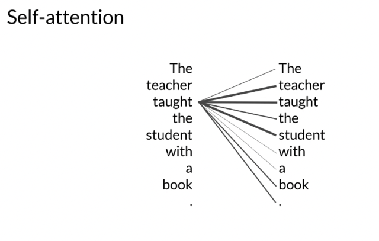</kbd>

<kbd>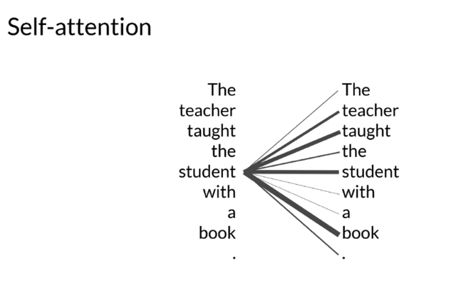</kbd>

<kbd></kbd>

<kbd></kbd>

<kbd>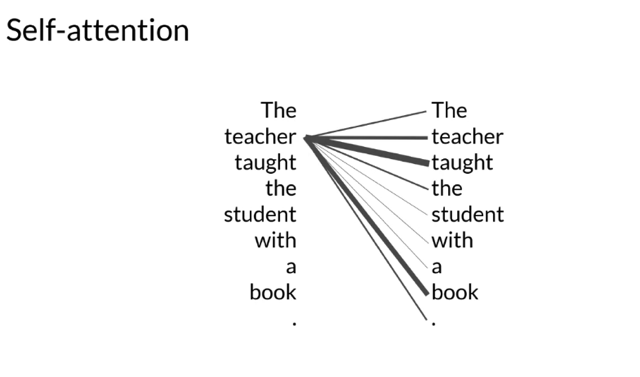</kbd>

> [!NOTE]
> Bằng cách tính ra các attention-weight kiểu như
> trọng số của một từ nên được chú ý vào/bởi
> những từ (tất cả các từ) trong câu cho dù ở xa hay gần

 

<kbd>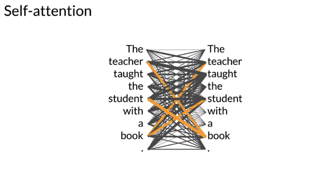</kbd>

> [!NOTE]
> To apply **attention weights** to those **relationships** so that the model learns the
> **relevance of each word to each other words** **no matter where they are** in the input.
> This gives the algorithm the ability to learn who has the book, who could have the
> book, and if it's even relevant to the wider context of the document. These **attention
> weights** are **learned during LLM training**and you'll learn more about this later this
> week. This diagram is called an**attention map**and can be useful to**illustrate the
> attention weights between each word and every other word.** Here in this stylized
> example, you can see that the word **book** is **strongly connected** with or **paying
> attention** to the word **teacher** and the word **student**. This is called **self-attention** and
> the ability to learn attention in this way across the whole input **significantly approves
> the model's ability to encode language**.

> [!NOTE]
> Từ đó model cải thiện đáng kể khả năng
> embedding một từ đó nắm bắt được rất tốt ý
> nghĩa của nó trong hoàn cảnh cụ thể

 

<kbd>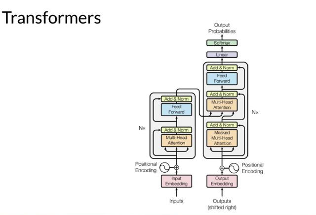</kbd>

 

<kbd>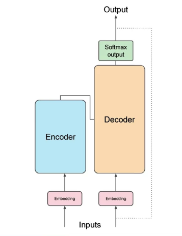</kbd>

> [!NOTE]
> Here's a simplified diagram of the **transformer architecture** so that you can
> focus at a **high level** on where these processes are taking place. The
> transformer architecture is split into **two distinct parts**, the **encoder** and the
> **decoder**. These components work in conjunction with each other and they
> **share a number of similarities**. Also, note here, the diagram you see is
> derived from the original attention is all you need paper. Notice how the
> **inputs to the model are at the bottom** and the **outputs are at the top**, where
> possible we'll try to remain faithful to this throughout the course

 

<kbd>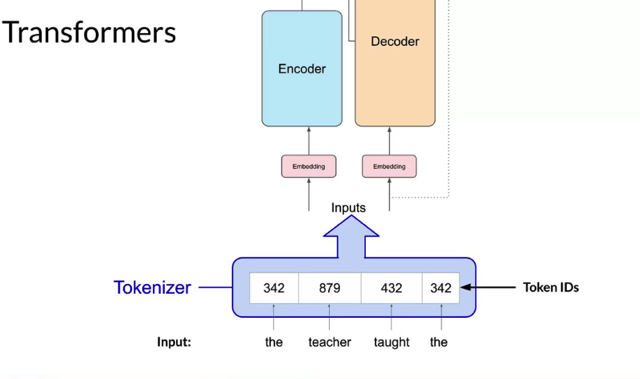</kbd>

> [!NOTE]
> Đầu tiên chắc đã hiểu là ta không thể khơi khơi đưa từ
> vựng vào. Mà phải tokenize nó. Bằng cách phương
> pháp quen thuộc như mỗi từ sẽ được token bằng index
> của nó trong vocab list.

> [!NOTE]
> Now, **machine-learning models** are just **big statistical calculators** and they work
> with **numbers**, **not words**. So before passing texts into the model to process,
> you **must first tokenize the words**. Simply put, this**converts the words into
> numbers**, with e**ach number representing a position in a dictionary** of all the
> possible words that the model can work with. You can choose from **multiple
> tokenization methods**. For example, **token IDs matching two complete words**,
> or using **token IDs to represent parts of words**. As you can see here. What's
> important is that once you've**selected a tokenizer to train the model, you must
> use the same tokenizer when you generate text**

 

<kbd>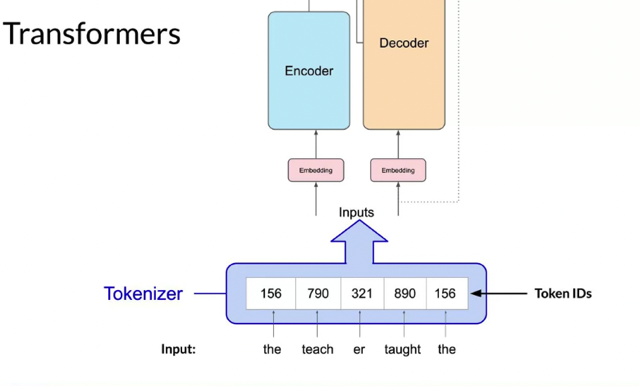</kbd>

> [!NOTE]
> Hoặc có cái này mới đó là mỗi phần của từ được tokenized luôn. Và
> dùng cách nào cho input thì dùng cách đó cho output

 

<kbd>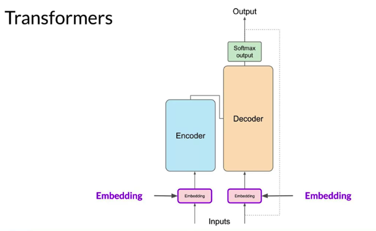</kbd>

> [!NOTE]
> Now that your **input is represented as numbers,** you can pass it to the
> **embedding layer**. This layer is a **trainable vector embedding space**, a
> **high-dimensional space** where each **token** is represented **as a vector** and
> **occupies a unique location within that space**. **Each token ID** in the vocabulary is
> **matched to a multi-dimensional vector**, and the intuition is that these vectors
> \_**learn to encode the meaning and context of individual tokens in the input
> sequence**\_. Embedding vector spaces have **been used** in natural language
> processing for some time, previous generation language algorithms like
> **Word2vec** use this concept. Don't worry if you're not familiar with this. You'll see
> examples of this throughout the course, and there are some links to additional
> resources in the reading exercises at the end of this week

> [!NOTE]
> Bỏ **word index** qua **Embedding layer** để**map nó với
> high-dimensional vector** gọi là **Embedding vector**. Mục đích là **trong
> quá trình training**, **model sẽ learn** để **trong quá trình giải quyết bài
> toán chính** nó sẽ **học cách tạo ra** (v**à dùng** chúng để phục vụ bài
> toán chính) **những embedding vector** giúp **nắm bắt ý nghĩa của từ
> vựng.** Như cách mà **các language model trước** đã dùng như
> **Word2Vec** hay **CBOW**

 

<kbd>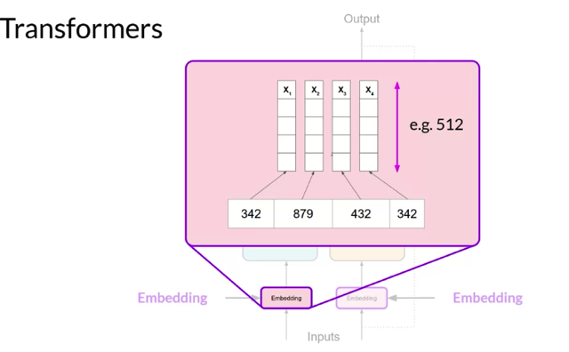</kbd>

> [!NOTE]
> Embedding sẽ **map một word index thành một word
> embedding vector,** Trong original paper tác giả dùng
> **word embedding có size là 512.**

 

<kbd>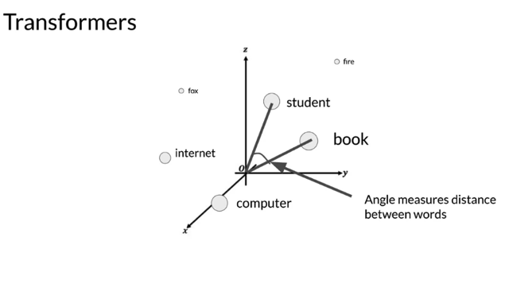</kbd>

<kbd></kbd>

<kbd>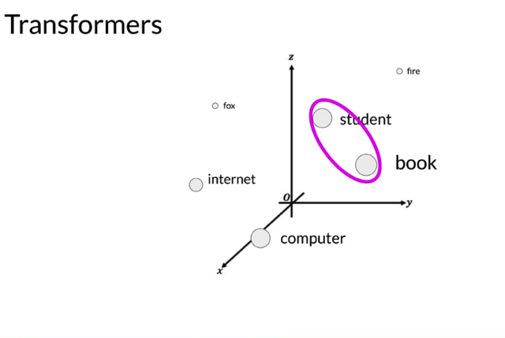</kbd>

> [!NOTE]
> Minh hoạ **embedding vector có độ dài 3** để **plot trong không gian 3D** minh họa việc
> các t**ừ như student và book** sau khi **model đã train xong**(và học và tạo ra các
> embedding vectors) **sẽ thật sự gần nhau trong không gian** thể hiện các**e.v đã chứa
> đựng nắm bắt được các quan hệ ngữ nghĩa của chúng**Và sự gần gũi của các từ đúng hơn là embedding vector sẽ được đo bằng góc giữa các
> vector - ý nói đến **Cosine Similarity**

 

<kbd>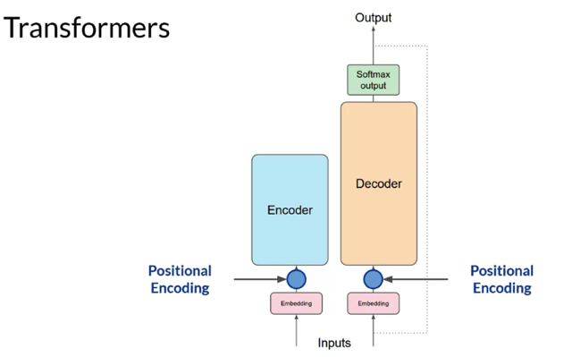</kbd>

> [!NOTE]
> Như mới review DLSpec C5W4 Transformer hôm qua có thể thấy không khó hiểu về "
> Positional Encoding" nữa. Đơn giản là vì trong **Transformer**, **các từ được xử lý đồng loạt,**
> song song nhau **nên thông tin mang ý nghĩa thứ tự của các từ trong câu bị mất đi**. Và **vì
> thứ tự chắc chắn là có ý nghĩa quan trọng** nên tác giả của Transformer **tìm cách đưa lại
> thông tin này vào word embedding** bằng cách **add vào Positional Encoding**. Sẵn review
> nói luôn, họ **dùng các function lượng giác** với mục đích không có gì ghê gớm chỉ là các
> h**àm lượng giác nó không bao giờ trùng nhau**, nên nếu dùng giá trị của chúng tại cùng
> một thời điểm thì **có thể tạo ra các positional encoding vector chứa đựng thông tin về thứ
> tự cho các từ.**

 

<kbd>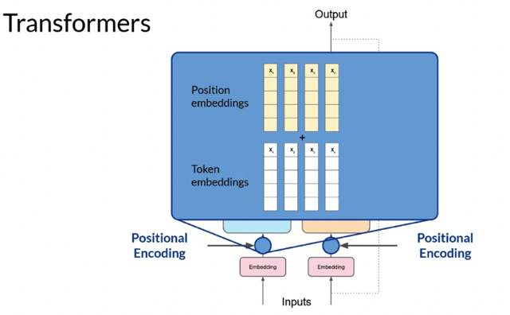</kbd>

> [!NOTE]
> Như đã nói, Positional Encoding sẽ được add vào Token embeddings để
> thêm thông tin về vị trí cho word embedding

 

<kbd>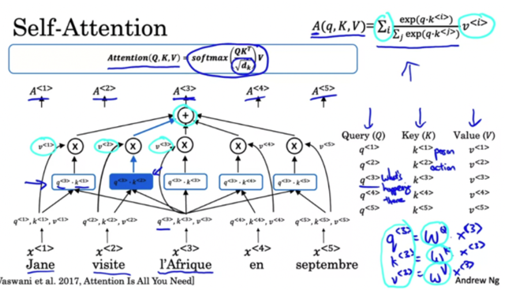</kbd>

<kbd></kbd>

<kbd>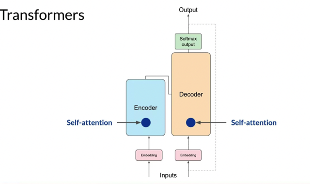</kbd>

> [!NOTE]
> Tới đây **cơ chế Self-Attention** sẽ ra tay để **tính toán xào nấu** sao đó để tạo ra một tạm
> gọi là "**một Self-attention embedding vector" cho mỗi từ**,  là một embedding vector mới
> **tính toán từ / chứa đựng / tạo nên từ** **đóng góp của tất cả các từ trong câu** với **trọng
> số nhiều ít khác nhau** dựa trên **mức độ liên quan của chúng**. Ôn lại ngắn gọn luôn. Đầu
> tiên là nó sẽ, **với mỗi từ dùng 3 weight matrix WQ, WK, WV** tính ra **cho mỗi từ (i)** **một bộ 3
> vector q<i>, k<i>, v<i>**. Rồi dùng các giá trị q và v của chúng để tính ra **các trọng số alpha
> giữa chúng** (chính là **attention weight)**thể hiện **mối tương đồng, liên quan về ý nghĩa
> giữa chúng**.
>
> Rồi từ **các trọng số alpha và các v<i>** tính ra **vector self-attention embedding** **cho mỗi
> từ** như đã nói ở trên sẽ c**hứa đựng thông tin liên quan của nó với tất cả các từ khác.**

> [!NOTE]
> Once you've **summed the input tokens and the positional encodings**, you **pass**
> the resulting vectors **to** the **self-attention layer.** Here, the \_**model analyzes the
> relationships between the tokens**\_ in your input sequence. As you saw earlier, this
> allows the model to \_**attend to different parts of the input sequence to better
> capture the contextual dependencies between the words**\_. The **self-attention
> weights** that are **learned during training** and **stored in these layers** **reflect the
> importance of each word** in that input sequence to **all other words in the sequence**

 

<kbd>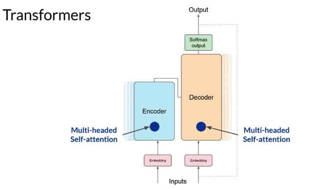</kbd>

> [!NOTE]
> But this **does not happen just once**, the transformer architecture actually has
> **multi-headed self-attention**. This means that **multiple sets of self-attention weights**
> or heads are **learned in parallel independently of each other.** The number of
> attention heads included in the attention layer varies from model to model, but
> numbers in the range of **12-100 are common**. The intuition here is that each
> self-attention head will**learn a different aspect of language**. For example, one head
> may see the**relationship between the people entities** in our sentence. Whilst
> another head may **focus on the activity of the sentence.** Whilst yet another head
> may focus on some **other properties such as if the words rhyme**. It's important to
> note that **you don't dictate ahead of time what aspects of language the attention
> heads will learn**. The **weights of each head are randomly initialized** and**given
> sufficient training data and tim**e, each will **learn different aspects of language.** While
> some attention maps are easy to interpret, like the examples discussed here, others
> may not be

 

<kbd>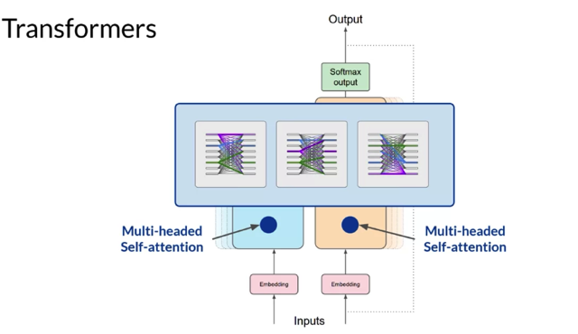</kbd>

> [!NOTE]
> Xong mới nói tiếp là ta sẽ làm nhiều lần tức là **có nhiều quá trình Self-Attention cùng lúc (với các
> matrix WQ, WK, WV) khác nhau** và đương nhiên sẽ **tạo ra nhiều Self-Attention vector cho mỗi từ.**
>
> Thường là **12-100 cái**. Ý nghĩa là **với mỗi bộ WQ, WK, WV** model sẽ **extract thông tin của một từ theo một
> câu hỏi lớn nào đó** ví dụ như Attention Head thứ nhất là "**Chuyện gì** xảy ra", các thứ hai là " **Ai**..." cái
> thứ 3 là " **Khi nào.**.." cái thứ 4 là " **Bằng cách nào..** " và **nhiều "khía cạnh" như vậy** để **tạo nhiều
> Self-attention vector cho một từ** ở **nhiều khía cạnh khác nhau.**
>
> Và mình**đặt 100 khía cạnh (hay câu hỏi lớn)**và bố trí như vậy thôi còn **model nó sẽ tự học tự tìm ra
> 100 khía cạnh đó là gì** (không chỉ là when, where, how, who, mà là **nhiều khía cạnh khác nữa mà ta
> sẽ không biết nó tìm ra cái gì".**
>
> Ý nghĩa là với những khía cạnh khác nhau, câu hỏi lớn khác nhau thì **mỗi từ sẽ được embedding
> khác nhau với các trọng số thể hiện quan hệ của nó với các từ khác cũng khác nhau** cho từng câu
> hỏi lớn (attention head).
>
> Từ đó khi **stack tất cả các Self-attention vector của 1 từ này lại** để tạo thành **Multi-head attention của
> từ** đó thì**hầu như đã nắm bắt được một bộ thông tin đa chiều ở rất nhiều khía cạnh của từ đó rồi**

 

<kbd>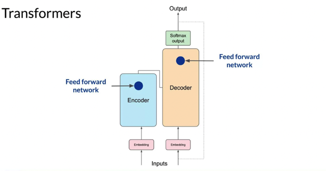</kbd>

> [!NOTE]
> Now that all of the attention weights have been applied to your input data, the
> output is **processed through a fully-connected feed-forward network**. The output of
> this layer is a **vector of logits** proportional to the **probability score** for **each and
> every token in the tokenizer dictionary**. You can then **pass these logits to a final
> softmax layer,** where they are **normalized into a probability score for each word**.
> This output includes a **probability for every single word in the vocabulary**, so there'
> s likely to be thousands of scores here. One single token will have a **score higher
> than the rest.** This is the **most likely predicted token**. But as you'll see later in the
> course, there are a number of methods that you can use to vary the final selection
> from this vector of probabilities.

> [!NOTE]
> Xong bỏ bộ Multi-head attention qua **feed-forward network** để tính ra bộ**logit scored**và **softmax** để ra vector các **probability scroes** chứa **xác
> suất của tất cả các từ trong vocab** và **từ có P cao nhất là từ được chọn để
> đưa ra dự đoán.**

 

<kbd>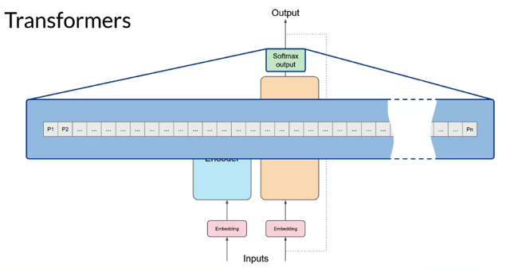</kbd>

 

