# Using The LLM Applications

📊 **Progress:** `8` Notes | `12` Screenshots

---

## 1. **Challenges with LLMs:**

> [!NOTE]
> 1. **Challenges with LLMs:**
>
> - **LLMs have a knowledge cutoff,** and they **can't provide information beyond their training
> data**.
> - They can struggle with **complex math problems** as they **predict tokens based on
> training, not perform calculations**.
> - LLMs tend to**generate text even when they don't know the answer**, leading to "
> hallucination."
>
> 2. ****Connecting to External Data Sources**:**
>
> - To overcome these challenges, you can **connect LLMs to external data sources and
> applications**.
> - This connection is facilitated through an**orchestration library**.
> - Access to external data sources **enhances LLM performance** at runtime.
>
> 3. ****Retrieval Augmented Generation (RAG)**:**
>
> - **RAG** is a framework that **allows LLMs to utilize external data sources**.
> - It helps **overcome knowledge cutoff issues by providing access to additional data during
> inference**.
> - RAG can be used to**access new information documents** or **proprietary knowledge**.
> - It **improves the relevance and accuracy of LLM completions**.
>
> 4. **RAG Implementation:**
>
> - RAG involves a "**Retriever**" component consisting of a **query encoder and an external
> data source**.
> - The encoder **encodes user input for querying the data source**.
> - The **Retriever** finds **relevant documents and combines them with the user query**.
> - The **expanded prompt** is then used by the LLM to generate completions.
>
> 5. **Benefits of RAG:**
>
> - RAG helps **prevent model hallucination and enhances LLM utility**.
> - It can **integrate various external information sources**, including **local documents, the
> internet, and databases**.
> - Vector Stores, containing **vector representations of text**, are particularly useful for LLMs in
> RAG.
>
> 6. **Considerations for RAG:**
>
> - External data **must be chunked to fit the LLM's context window**.
> - **Data retrieval** relies on **vector representations** and similarity measures.
> - **Vector stores and databases** allow for **efficient searching and citation tracking.**
>
> By connecting LLMs to **external data sources** using RAG, you can **address their
> limitations, improve their performance, and provide more accurate and relevant information to
> users.**

 

<kbd>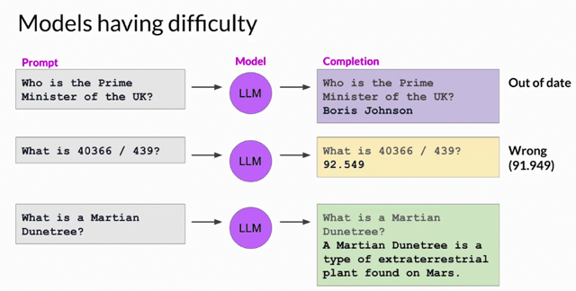</kbd>

> [!NOTE]
> Đại khái là LLM có những nhược điểm như bị outdate
> thông tin, không tính toán được và bịa chuyện

 

<kbd>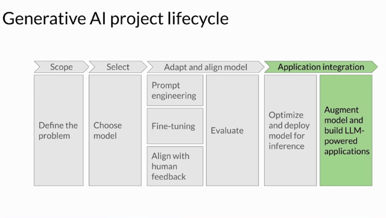</kbd>

 

<kbd>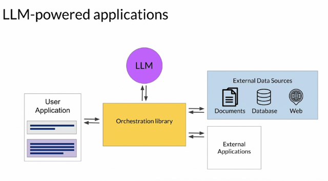</kbd>

> [!NOTE]
> Những điều này có thể khắc phục bằng cách dùng một cơ
> chế như sau Orchestration library để kết nối LLM với
> Database hoặc External applications,

 

<kbd>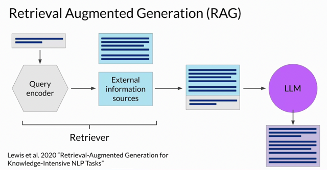</kbd>

> [!NOTE]
> Đại khái là có nhiều lib support việc này, ở đây nói về cái đầu tiên (của
> Facebook) trong đó đại khái là nó giúp từ initial prompt, nó lấy thông tin từ
> external information sources và rồi combine với initial prompt để được
> prompt mới (chứa những kiến thức được cập nhật) sẽ bỏ vào model

 

<kbd>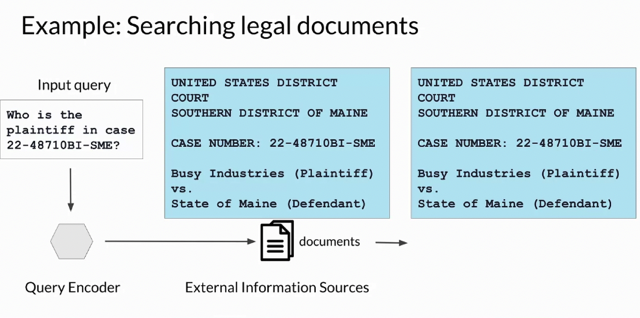</kbd>

> [!NOTE]
> Lấy ví dụ hỏi model về một vấn đề liên quan đến một vụ án
> trong lịch sử. Query encoder sẽ trích xuất thông tin của vụ án ra
> để kết hợp với initial prompt trước  khi bỏ vào model

 

<kbd>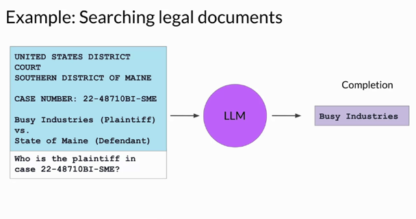</kbd>

> [!NOTE]
> Với **thông tin đúng được trích xuất** đi kèm với**initial prompt**, đưa
> vào model sẽ **giúp model cho ra câu trả lời với thông tin được cập
> nhật chính xác**
>
> Thật ra quá trình này cũng y như mình tìm thông tin rồi instructed
> prompting vậy

 

<kbd>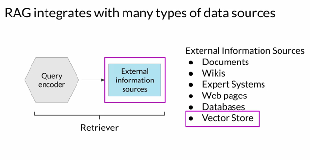</kbd>

 

<kbd>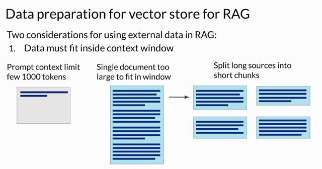</kbd>

> [!NOTE]
> Đại khái là vì limit của context window nên thông tin trích xuất thực tế
> sẽ phải được split ra thành nhiều mảnh. Thì những cái như
> LangChain sẽ giúp làm việc này

 

<kbd>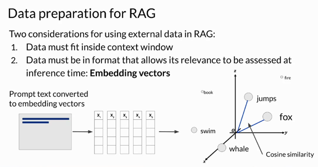</kbd>

> [!NOTE]
> Điều consideration thứ 2 đó là
> data phải ở format phù hợp: Embedding vectors

 

<kbd>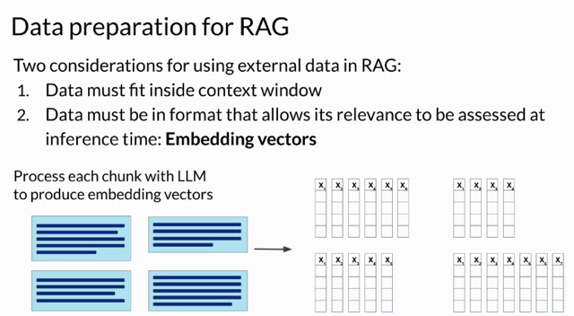</kbd>

 

<kbd>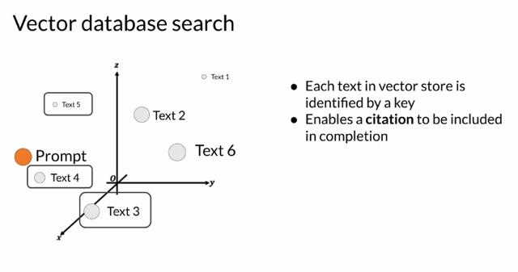</kbd>

> [!NOTE]
> Đại khái là kiểu như có vector
> database mapping key = word
> với embedding vector.

 

<kbd>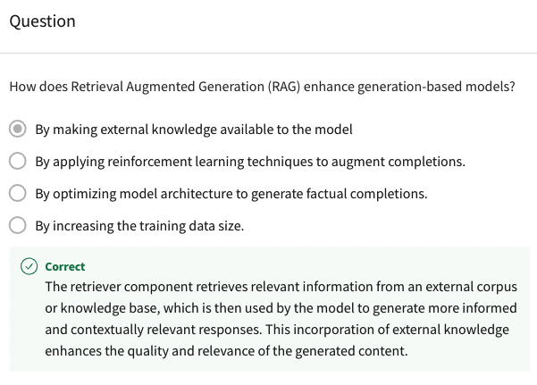</kbd>

 

