# C1W2 - NAIVE BAYES  Learn the theory behind Bayes' rule for conditional probabilities, then apply it  toward building a Naive Bayes tweet classifier of your own!  \\*Learning Objectives \\*  • Error analysis  • Naive Bayes inference  • Log likelihood  • Laplacian smoothing  • conditional probabilities  • Bayes rule  • Sentiment analysis  • Vocabulary creation  • Supervised learning

📊 **Progress:** `56` Notes | `119` Screenshots

---

Learn the theory behind Bayes' rule for conditional probabilities, then apply it toward building a Naive Bayes tweet classifier of your own!
**Learning Objectives**
 • Error analysis
 • Naive Bayes inference
 • Log likelihood
 • Laplacian smoothing
 • conditional probabilities
 • Bayes rule
 • Sentiment analysis
 • Vocabulary creation
 • Supervised learning

## Probability & Bayes's Rule

 

<kbd>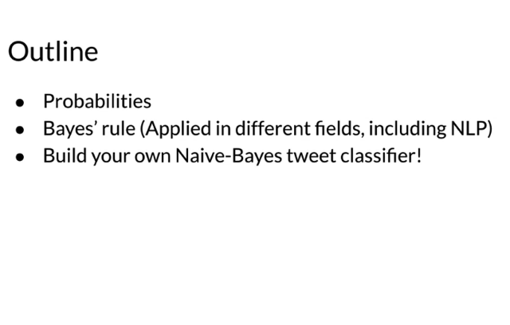</kbd>

 

<kbd>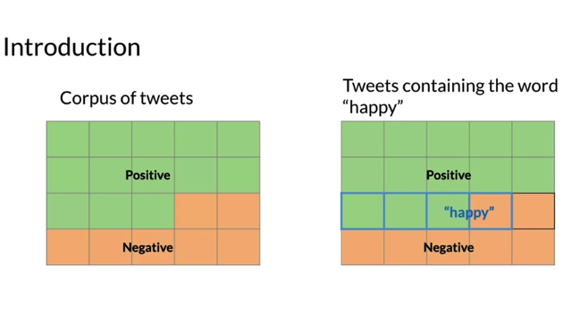</kbd>

> [!NOTE]
> Đại ý là trong corpus các tweets được label positive hay negative.
> Và trong số đó từ happy xuất hiện trong các tweet của cả 2 class

 

<kbd>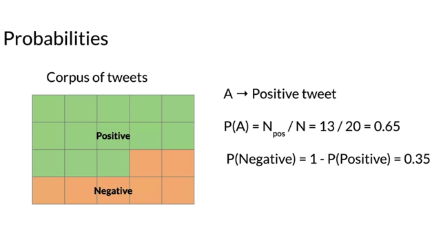</kbd>

> [!NOTE]
> Cho A là sự kiện: "1 tweet là positive", thì Probability của A sẽ là tổng số
> sự kiện mà có A xuất hiện (13) chia tổng số sự kiện (20)
>
> Và Probability mà A ko xuất hiện sẽ là 1 - P(A) với điều kiện là
> tất cả event (tweet) đều được label là Pos hay Neg nhưng không
> được cả hai

 

<kbd>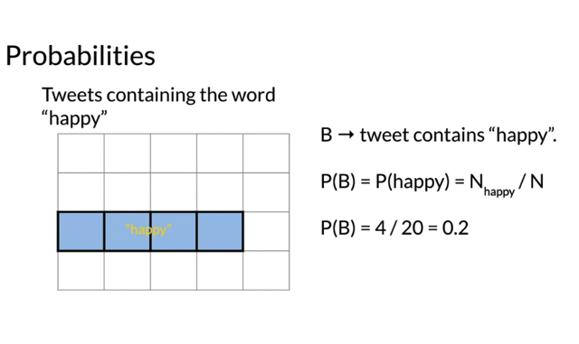</kbd>

> [!NOTE]
> Tương tự, cho sự kiện B là '1 tweet có chứa từ 'happy' thì Probability
> của B là số lần B xuất hiện (tổng các tweet chứa từ này) = 4, chia cho
> tổng số sự kiện (tổng số tweet = 20)

 

<kbd>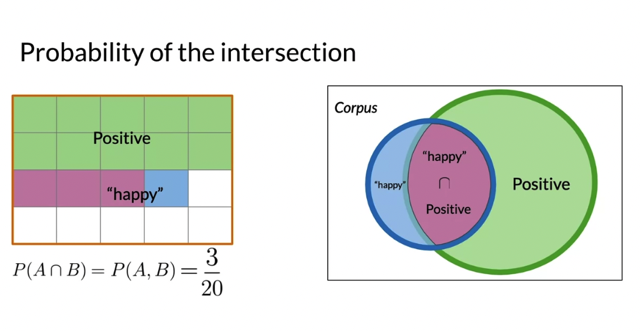</kbd>

> [!NOTE]
> Và Probability của cả A và B cùng
> xảy ra (intersection) sẽ kí hiệu như vầy

 

## Bayes's Rule

 

<kbd>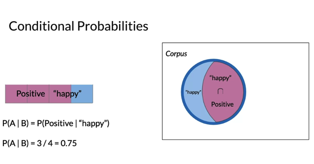</kbd>

> [!NOTE]
> Đại khái là nói về khái niệm tính xác xuất (probability / likelihood) xảy ra
> A. nếu đã xảy ra B (P(A, given B)) thì ta tính **tỉ số các event có A (tweet
> là positive) = 3 \_trong các event có B\_ (tweet có chữ 'happy') = 4 = 75%**ta nói **"xác suất 1 tweet có chữ happy là một positive tweet là 75%"**

 

<kbd>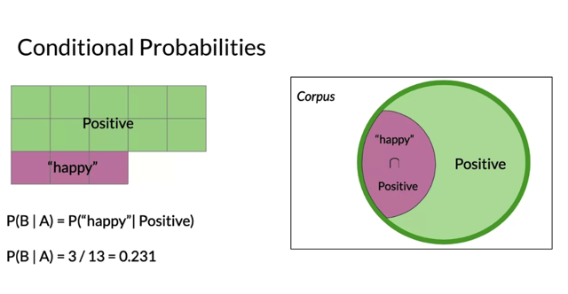</kbd>

> [!NOTE]
> Tương tự, P(B, given A) là: \_**trong các event A**\_ (số Positive tweet)  =
> 13 thì **có bao nhiêu tweet mang chữ 'happy' event B** = 3.
>
> Ta nói xác suất một tweet positive có chữ happy chỉ là 23,1%

 

<kbd>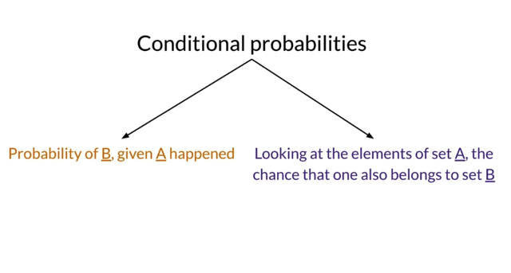</kbd>

> [!NOTE]
> 2 cách 'nói':
> - Khả năng xảy ra B nếu A đã xảy ra
>
> - Trong các sự kiện A, có bao nhiêu cơ hội cũng xảy ra B

 

<kbd>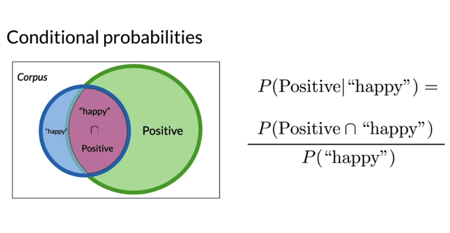</kbd>

> [!NOTE]
> Công thức khái quát
> hoá như sau: 
>
> Trong các **sự kiện/khả năng** xảy ra 'happy' = **P(happy)** thì: 
>
> có bao nhiêu **sự kiện/khả năng** vừa có happy vừa có 
> positive = **P(happy giao với positive)**

 

<kbd>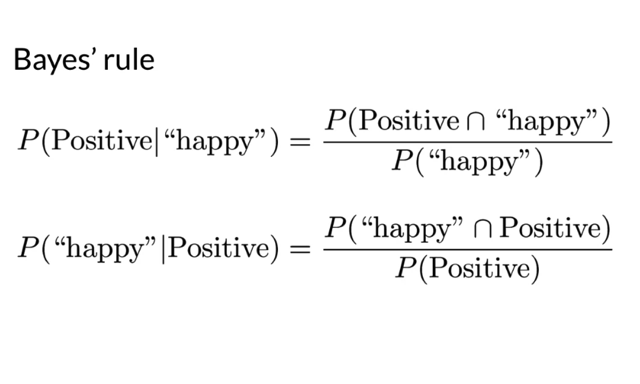</kbd>

 

<kbd>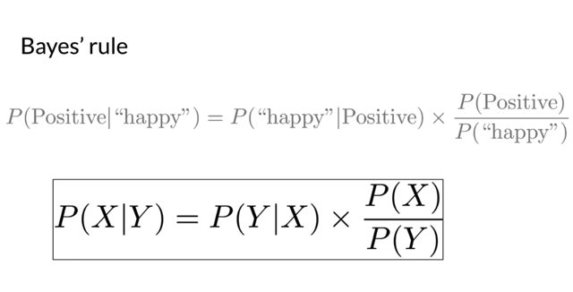</kbd>

 

<kbd>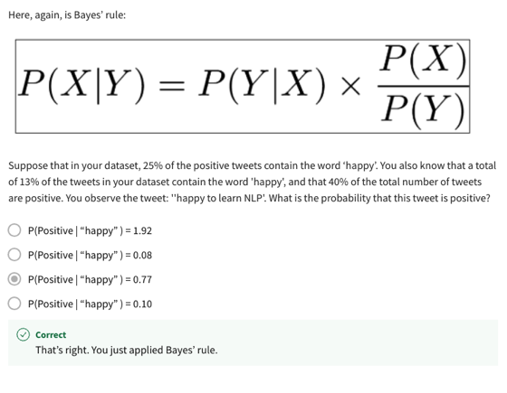</kbd>

<kbd></kbd>

<kbd>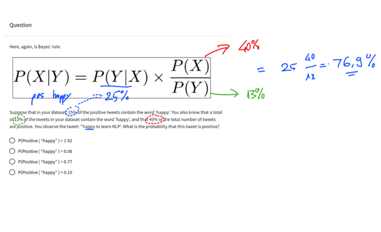</kbd>

 

<kbd>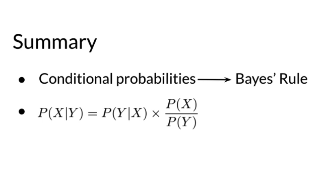</kbd>

> [!NOTE]
> Đại ý là chỉ cần nhớ Bayes rule được
> hình thành từ khái niệm Conditional
> probabilities và công thức

 

<kbd>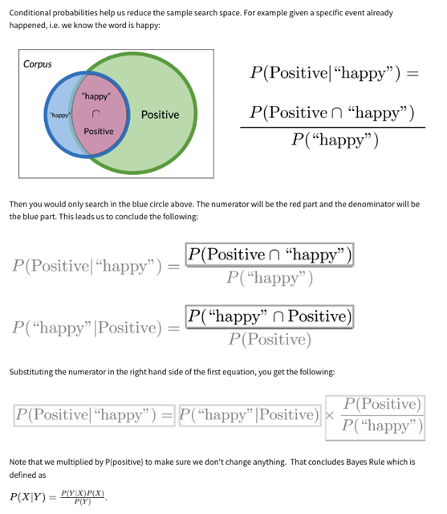</kbd>

 

## Naive Bayes Introduction

 

### 1 Introduction to Naive Bayes as a method for text classification

> [!NOTE]
> 1 Introduction to Naive Bayes as a method for text classification
>
> 2 The Naive Bayes method is a simple and fast baseline for many text classification
> tasks
>
> 3 The Naive Bayes method makes the assumption that all features used for classification
> are independent
>
> 4 The first step in Naive Bayes is to extract the vocabulary and the word counts from the
> positive and negative corpora
>
> 5 The conditional probabilities of each word given the class are computed by dividing the
> frequency of each word in a class by its corresponding sum of words in the class
>
> 6 A table of conditional probabilities is created, which has the property that the sum of
> probabilities for each class is 1
>
> 7 Some words have a significant difference between probabilities, carrying more weight
> in determining tweet sentiments
>
> 8 The probability function is smoothed to avoid a situation where a word appears in only
> one corpus
>
> 9 The Naive Bayes inference condition rule for binary classification is introduced
>
> 10 The product of probabilities for each word in the tweet is calculated, and a conclusion
> is drawn regarding the sentiment of the tweet
>
> 11 Issues with the implementation are discussed, and the simplification of calculations is
> promised for the next video.

 

  
  
<kbd>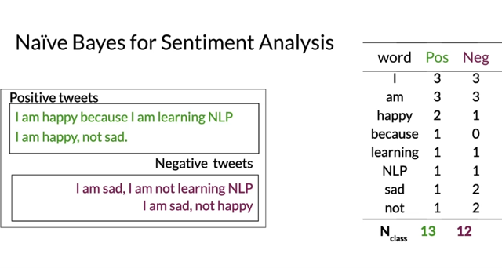</kbd>

  > Có tên Naive là vì nó ngây thơ giả định rằng các features independent nhau
  > nhưng thự tế không phải vậy nhưng vẫn khá tốt trong việc tạo 1 model đơn
  > giản cho việc sentiment recognition
  >
  > Đại khái là có 2 corpus pos và neg sentence, ta extract tất cả các từ ra
  > thành 1 vocab list, rồi đếm số lần mỗi từ xuất hiện trong pos corpus và neg
  > corpus rồi tổng lại pos bao nhiêu neg bao nhiêu

   

  
  
<kbd>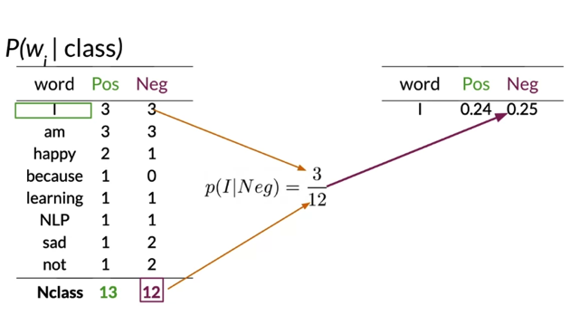</kbd>

  
<kbd></kbd>

  
<kbd>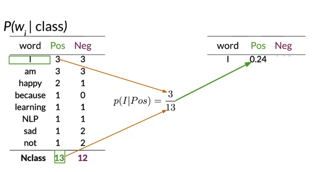</kbd>

  > Tính P(word,Pos) và P(word, Neg) của
  > từng từ để tạo 1 table mới

   

  
  
<kbd>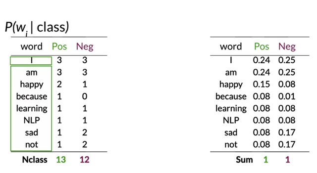</kbd>

  > Dễ hiểu được tính chất tổng các
  > cột đều bằng 1

   

  
  
<kbd>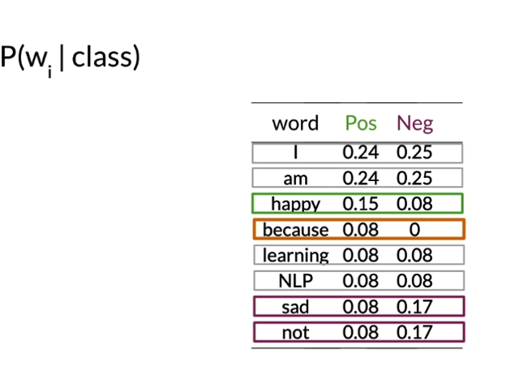</kbd>

  🔗 **Related:** [1 Counting word \\*occurrence\\* for probability calculation  2 \\*Problem with probability of zero\\* for \\*unseen word\\* pairs  3 Introduction to \\*smoothing\\*  4 \\*Laplacian smoothing\\* technique to \\*avoid zero probabilities\\*  5 Formula for Laplacian smoothing  6 Calculation of probability using Laplacian smoothing  7 Importance of Laplacian smoothing  8 Introduction to log likelihood in next video.](laplacian_smoothing.md#node-212)

  > Những từ như I, am có P_pos và neg bằng nhau và ko giúp ích gì trong
  > sentiment recognition nhưng happy hay sad có 2 chỉ số này chênh lệch ->
  > Nó là những power word sẽ có sức nặng để quyết định kết quả của
  > sentiment analysis của câu

  > Còn những từ như because ko xuất hiện trong 1 cột (neg) thì ta sẽ smooth
  > cái probability function để giúp P pos hay neg không bằng 0 (để công thức
  > Naive Bayes không bị lỗi do chia 0)

   

  
  
<kbd>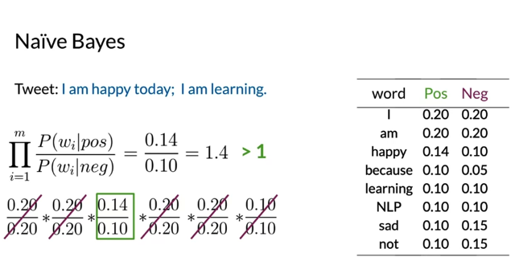</kbd>

  > Phương pháp: Tính product của các tỉ số P_pos và P_neg của các từ trong
  > câu, ví dụ câu này ra 1.4 -> Khả năng câu này là positive sentiment

   

  
  
<kbd>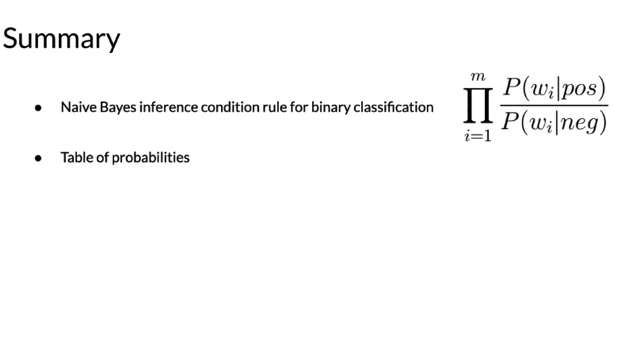</kbd>

   

## Laplacian Smoothing

 

### 1 Counting word \\*occurrence\\* for probability calculation

> [!NOTE]
> 1 Counting word \**occurrence\** for probability calculation
>  2 \**Problem with probability of zero\** for \**unseen word\** pairs
>  3 Introduction to \**smoothing\**
>  4 \**Laplacian smoothing\** technique to \**avoid zero probabilities\**
>  5 Formula for Laplacian smoothing
>  6 Calculation of probability using Laplacian smoothing
>  7 Importance of Laplacian smoothing
>  8 Introduction to log likelihood in next video.

 

  
  
<kbd>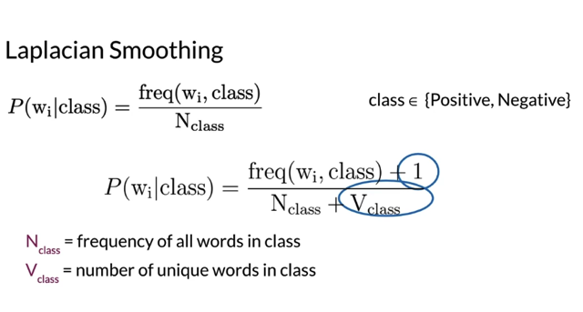</kbd>

  > "So now all the probabilities in each column will sum to one. This process is
  > called Laplacian in smoothing."
  >
  > Mình hiểu là cộng 1 trên tử để cho P không bằng 0 dù cho từ ko xuất hiện
  > trong cột neg/pos (freq (w|pos) hay freg(w|neg = 0) thì cộng thêm V (số
  > unique word) ở dưới để tổng các P theo công thức mới (Laplacian
  > smoothing) vẫn = 1
  >
  > Nếu có bối rối:
  >
  > freq(w1|Pos) +freq(w2|Pos)... = 3 + 3 + 2 +. ..= N_pos = 13
  >
  > V là số unique words = 8

   

  
  
<kbd>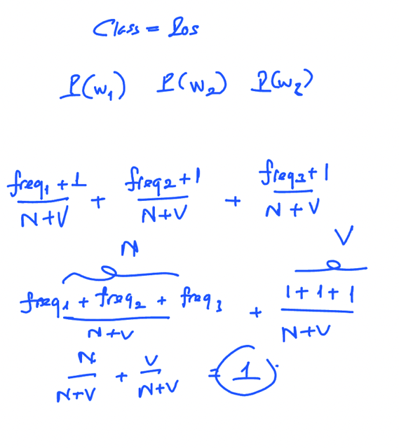</kbd>

   

  
  
<kbd>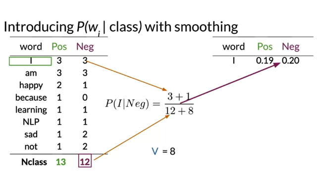</kbd>

  
<kbd></kbd>

  
<kbd>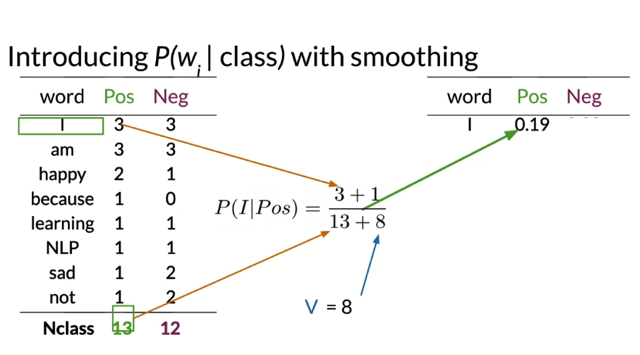</kbd>

  > Tính lại Probability table với
  > Laplacian smoothing

   

  
  
<kbd>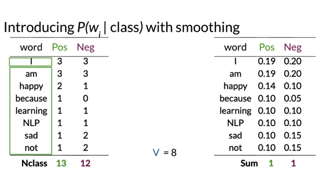</kbd>

   

  
  
<kbd>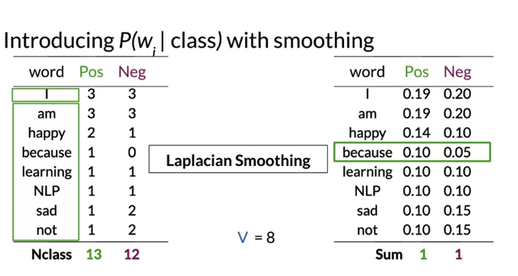</kbd>

  🔗 **Related:** [1 Introduction to Naive Bayes as a method for text classification  2 The Naive Bayes method is a simple and fast baseline for many text classification tasks  3 The Naive Bayes method makes the assumption that all features used for classification are independent  4 The first step in Naive Bayes is to extract the vocabulary and the word counts from the positive and negative corpora  5 The conditional probabilities of each word given the class are computed by dividing the frequency of each word in a class by its corresponding sum of words in the class  6 A table of conditional probabilities is created, which has the property that the sum of probabilities for each class is 1  7 Some words have a significant difference between probabilities, carrying more weight in determining tweet sentiments  8 The probability function is smoothed to avoid a situation where a word appears in only one corpus  9 The Naive Bayes inference condition rule for binary classification is introduced  10 The product of probabilities for each word in the tweet is calculated, and a conclusion is drawn regarding the sentiment of the tweet  11 Issues with the implementation are discussed, and the simplification of calculations is promised for the next video.](naive_bayes_introduction.md#node-203)

  > Với Laplacian Smoothing, P ('because', neg
  > class) không còn bằng 0 nữa

   

  
  
<kbd>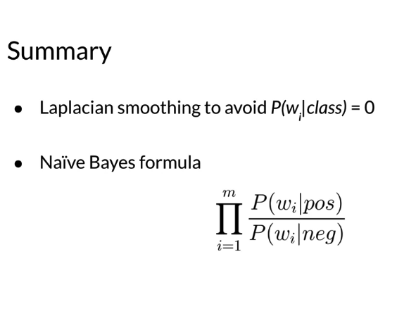</kbd>

  > Mục đích là để P ko bằng 0 như trường hợp từ because ở trên có
  > P(' Because'. Neg class) = 0 để khi tính công thức Naive Bayes
  > không bị lỗi chia 0

   

  
  
<kbd>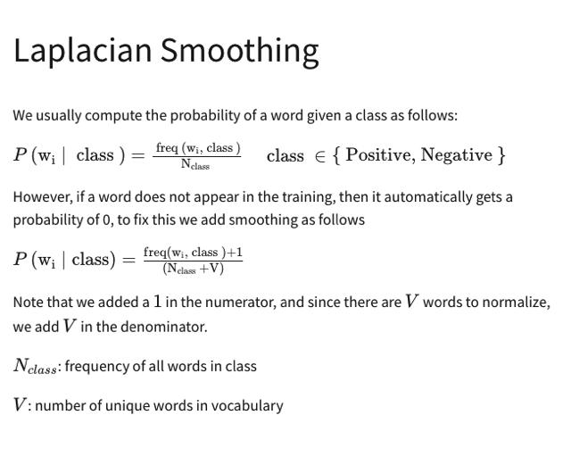</kbd>

   

## Log Likelihood P1

 

### 1 The video introduces the concept of\\* log likelihood\\*s, which

> [!NOTE]
> 1 The video introduces the concept of\**log likelihood\**s, which
> are l\**ogarithms of the probabilities\** used in sentiment
> classification.
>
> 2 Words are classified as \**neutral\**, \**positive\**, or \**negative\** using
> \**conditional probabilities\**, and their \**ratios\** are used for
> classification.
>
> 3 The \**ratios\** for each word are essential for \**Naive Bayes'
> binary classification\**, and a mathematical \**trick\** using
> \**logarithms\** can be used to \**prevent numerical underflow.\**
>
> 4 \**Lambda\** is introduced as the \**log of the ratio of the
> probability that a word is positive\** \**over the probability that it
> is negative\**, and it can be used to calculate the log score for
> sentiment classification.
>
> 5 The video emphasizes the \**importance\** of the \**prior ratio\** in
> \**unbalanced data-sets\** and how it affects the Naive Bayes'
> formula for binary classification.

 

  
  
<kbd>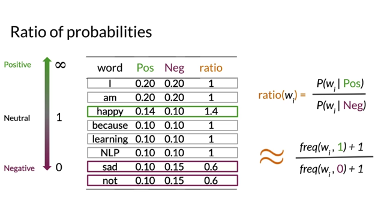</kbd>

  > Đại khái là tính thêm cột **ratios** và dùng nó để tính 'tính positive,
  > negative hay neutral' của từ. Càng **cao thì càng positive**, càng **gần 0 thì
  > càng negative**

   

  
  
<kbd>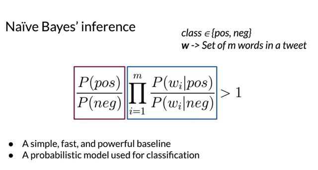</kbd>

  > Đại khái là **Full Naive Bayes** sẽ có thêm 'prior' ratios (P(pos)/P(neg))
  > sẽ tính tới sự không cân bằng của dataset, cho tới giờ do Pos
  > sentences = Neg sentences nên tỉ số này bằng 1.
  >
  > Nói chung là Naive Bayes là 1 algorithm **đơn giản và nhanh** để tạo
  > baseline (kiểu như 1 chuẩn/một model prototype để đánh giá)

   

  
  
<kbd>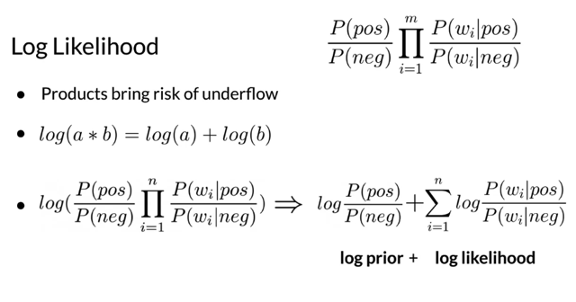</kbd>

  > Đại khái là do các P đều nhỏ hơn 1 nên làm việc
  > với nó dễ bị n**umberical underflow** issue - kiểu như số nó quá
  > nhỏ dẫn đến lỗi máy tính.
  >
  > Người ta dùng **log** để tính toán giúp giải quyết issue này

   

  
  
<kbd>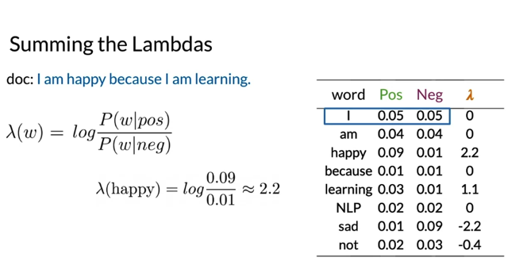</kbd>

  > Ví dụ với cách dùng log, thay vì ta tính**TÍCH (Product) của các
  > tỉ số** P(w|pos) / P(w|Neg) để ra số rồi xem > 1 thì suy ra Pos <
  > 1 thì suy ra Neg thì ..
  >
  > với log ta tính **TỔNG (Sum) các log của tỉ số**
  > P_pos / P_neg - gọi là lambda thì kết quả cũng như vậy

   

  
  
<kbd>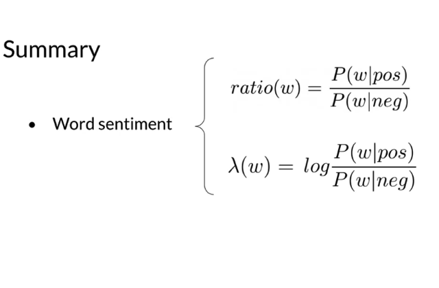</kbd>

   

  
  
<kbd>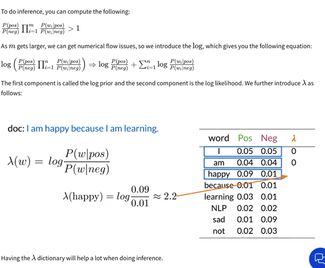</kbd>

  
<kbd></kbd>

  
<kbd>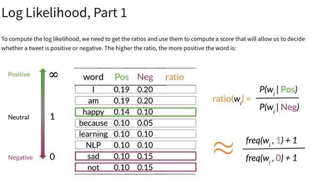</kbd>

   

## Log Likelihood P2

 

### 1 Inference: Learn how to calculate the \\*log likelihood of a tweet\\*

> [!NOTE]
> 1 Inference: Learn how to calculate the \**log likelihood of a tweet\**
> based on the\**lambda dictionary\**
>
> 2 Log likelihood: \**Sum up the lambdas from each word\** in the
> tweet to calculate the l\**og likelihood\**
>
> 3 Sentiment analysis: Determine whether a\**tweet is positive or
> negative\** based on the \**log likelihood value\**
>
> 4 Power words: \**Words with positive or negative sentiment\** have
> more influence on the \**log likelihood score\**
>
> 5 Decision threshold: The \**threshold\** for the log likelihood score
> is \**0\** instead of 1
>
> 6 Training: Introduction to \**training a naive bayes model\** for
> sentiment analysis.

 

  
  
<kbd>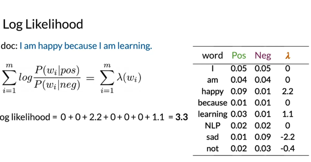</kbd>

  > Log likelihood  của 1 tweets là
  > tổng các lambda của các từ trong tweet

   

  
  
<kbd>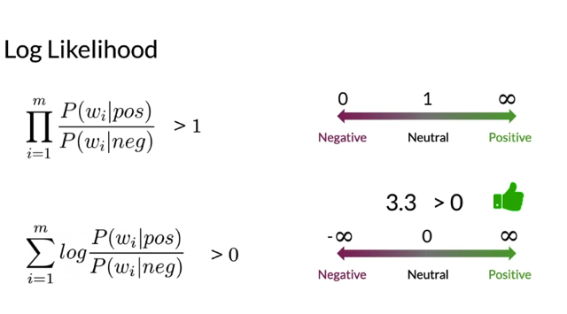</kbd>

  > Với Log (likelihood) range sẽ là (-infi infi) và decision
  > threshold là 0 không phải (0-infi) với threshold 1 nữa

   

  
  
<kbd>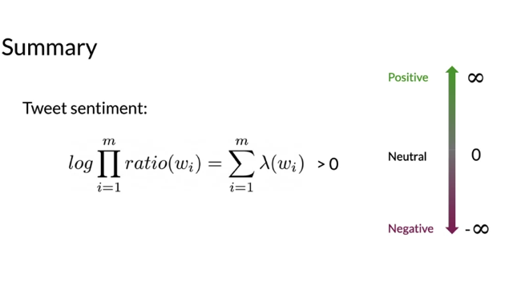</kbd>

  > Log likelihood của tweet dương thì
  > positive, âm thì negative

   

  
  
<kbd>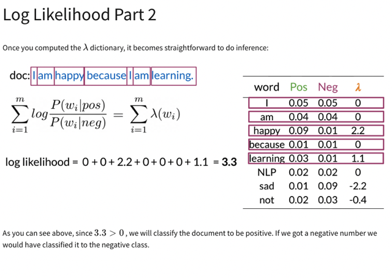</kbd>

   

## Training Naive Bayes

 

### 1 Naive Bayes classifier is trained differently from logistic regression or

> [!NOTE]
> 1 Naive Bayes classifier is trained differently from logistic regression or
> deep learning.
>
> 2 The first step in any supervised machine learning project is to \**gather\** and
> \**preprocess\** data.
>
> 3 Preprocessing involves \**lowercase\** texts, \**removing\** \**punctuation\**, \**URLs\**,
> handles,\**stop words\**, \**stemming\**, and \**tokenizing\**.
>
> 4 The next step is to \**compute the vocabulary\** for each word in each class
> to produce a table of \**frequencies\** and \**conditional probabilities\**.
>
> 5 The \**Lambda\** score for each word is estimated using the \**log of the ratio\**
> of conditional probabilities.
>
> 6 The\**log prior\** is estimated by counting the number of positive and
> negative tweets and computing the log of the ratio.
>
> 7 \**Training a Naive Bayes\** model can be divided into \**six logical steps.\**
>
> 8 The final step is to \**classify sentences\** using the\**probability table \**built in
> the previous steps.

 

  
  
<kbd>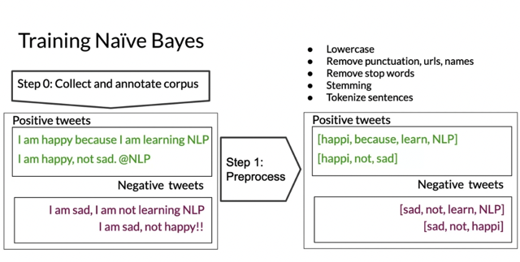</kbd>

  > Bước 0 là chuẩn bị data và bước 1 Preprocess data
  >
  > Trong thực tế bước preprocess có thể chiếm nhiều thời gian
  > hơn là trong assignment này

   

  
  
<kbd>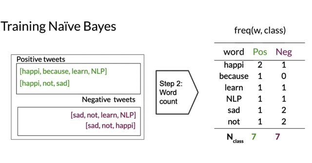</kbd>

  > Bước 2 là đếm số lần 1 từ xuất hiện trong pos corpus và neg corpus

   

  
  
<kbd>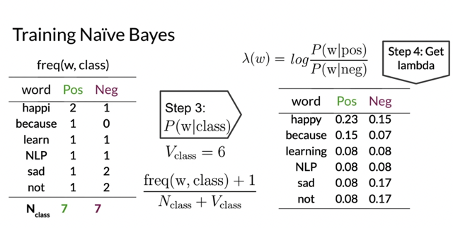</kbd>

  > Step 3 và 4 là tính **Conditional Probability**P(w,Pos) và
  > P(w, Neg) của mỗi từ và lambda (log của ratios Ppos/Pneg)

   

  
  
<kbd>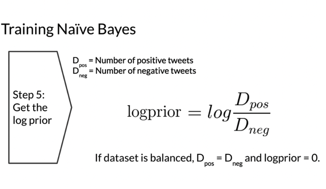</kbd>

  > Kế là tính log prior vốn trong assignment này do
  > balanced nên = 0 nhưng trong unbalanced dataset
  > thì chỉ số này có thể quan trọng

   

  
  
<kbd>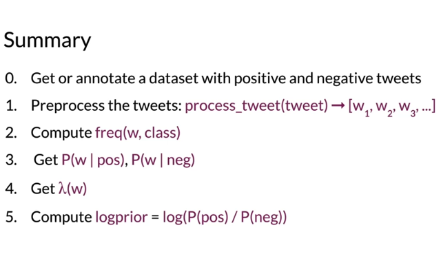</kbd>

   

## Lab: Visualizing Likelihoods And Confidence

 

### In this lab, we will cover an \\*essential part of data analysis\\* that has not

> [!NOTE]
> In this lab, we will cover an \**essential part of data analysis\** that has not
> been included in the lecture videos. As we stated in the previous module,
> \**data visualization\** gives \**insight\** into the \**expected performance\** of
> any model.
>
> In the following exercise, you are going to make a \**visual inspection\** of
> the tweets dataset using the \**Naïve Bayes features\**. We will see how we
> can understand the \**log-likelihood ratio\** explained in the videos as a pair
> of numerical features that can be fed in a machine learning algorithm.
>
> At the end of this lab, we will introduce the concept of \**confidence ellipse\**
> as a tool for representing the \**Naïve Bayes\** model visually.

 

- Import
   

    
    
<kbd>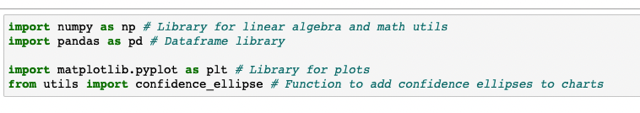</kbd>

     

- Calculate the likelihoods for each tweet
   

    
    
<kbd>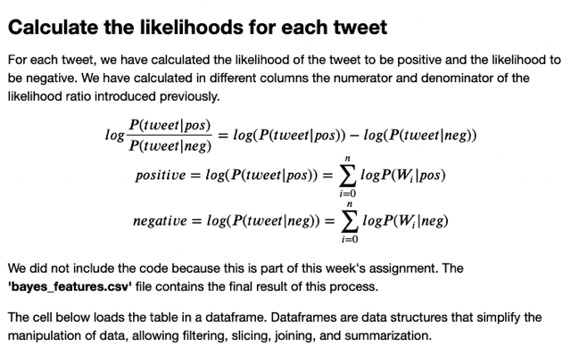</kbd>

    > Log likelihood của một từ w là log của
    > ratios P(w, pos) và P(w, neg)
    >
    > Thì ở đây định nghĩa thêm Log likelihood của 1 câu tweet là 
    > log của ratios giữa P(tweet, pos) và P(tweet, neg)
    >
    > P(tweet, pos) là tích các P(word, pos) trong câu
    > tương tự P(tweet, neg) cũng là tích các P(w, neg) trong câu
    >
    > Nên ta có Log (P(tweet, pos)/P(tweet, neg)) 
    >
    > = log(P(tweet, pos)) - log(P(tweet, neg)) 
    > (do Log(a/b) = log(a)-log(b)
    >
    > = log[P(w1, pos)*P(w2, pos) ...P(wn, pos)] - log[P(w1, neg)*P(w2, neg) ...P(wn, neg)]
    >
    > = [ log(P(w1, pos) + log(P(w2, pos) + ...log(P(wn, pos) ]
    > - [ log(P(w1, neg) + log(P(w2, neg) + ...log(P(wn, neg) ]

     

    
    
<kbd>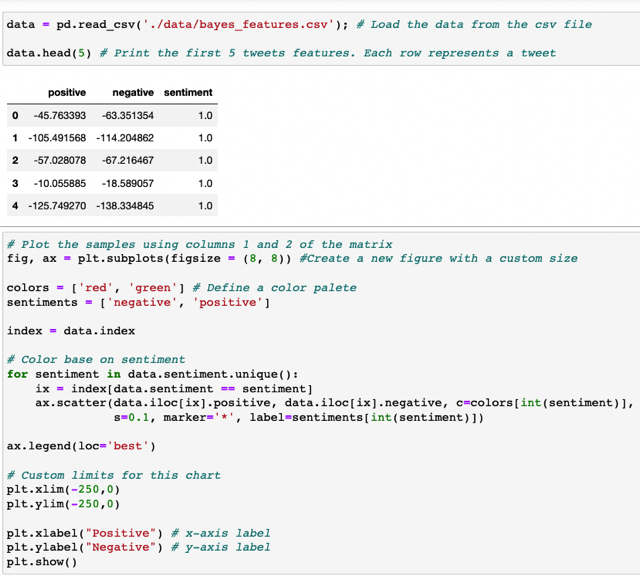</kbd>

     

    
    
<kbd>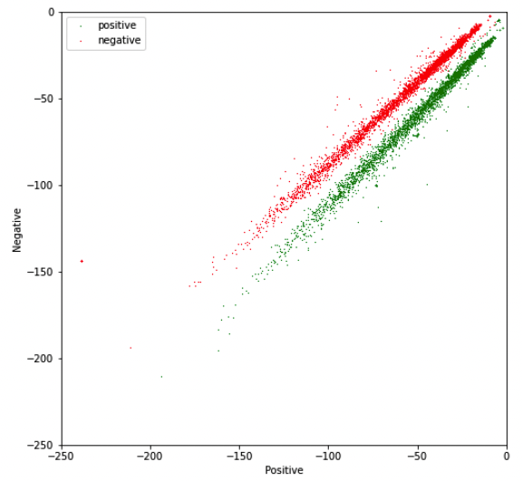</kbd>

     

- Using Confidence Ellipses to interpret Naïve Bayes
   

    
    
<kbd>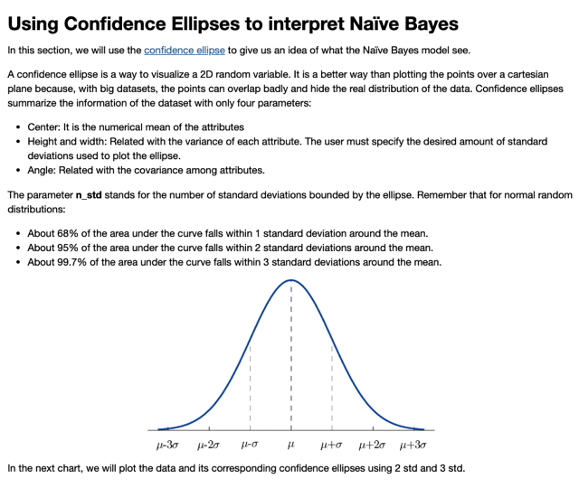</kbd>

    > Chưa hiểu lắm như đại khái là vẽ cái phân bố (distribution) của
    > data theo Confidence Ellipses sẽ giúp có cái nhìn tốt hơn là chỉ
    > vẽ khơi khơi (Cartesian plane). Tốt hơn ở đây chắc là thể hiện
    > thêm các cấp phân bố standard deviation mấy cái đường
    > ellipse chấm chấm

     

    
    
<kbd>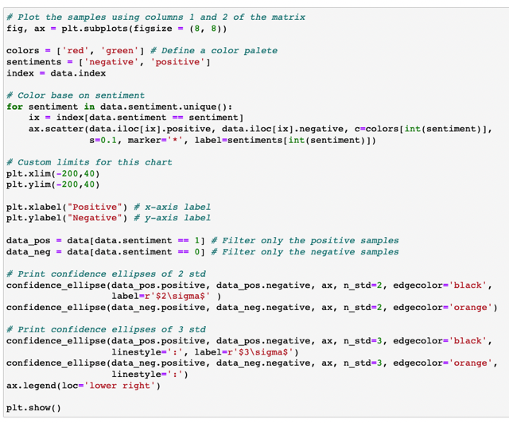</kbd>

     

    
    
<kbd>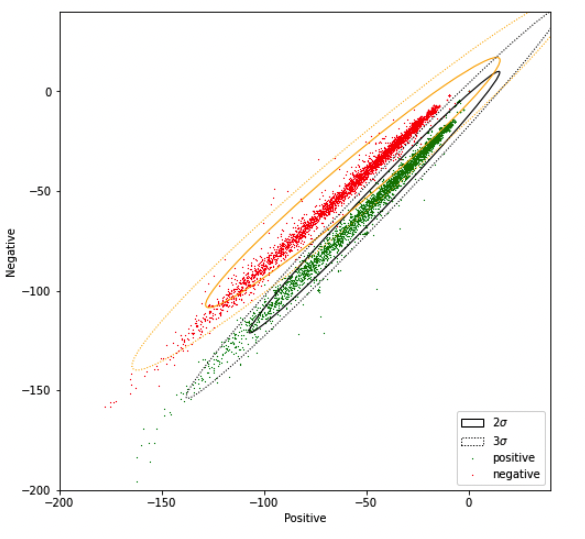</kbd>

     

    
    
<kbd>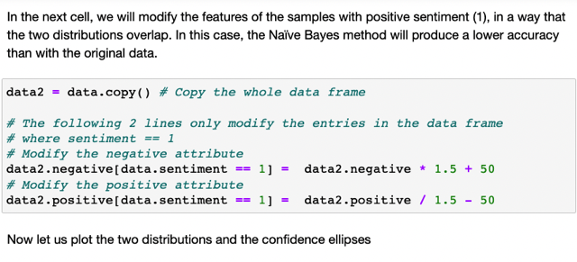</kbd>

     

    
    
<kbd>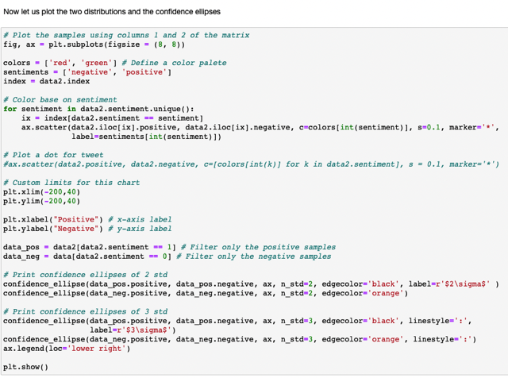</kbd>

     

    
    
<kbd>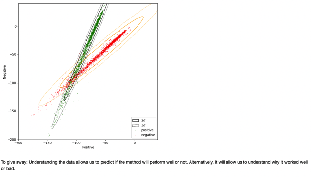</kbd>

     

## Testing Naive Bayes

 

### 1 The main task is to apply the Naive Bayes classifier on \\*real test examples.\\*

> [!NOTE]
> 1 The main task is to apply the Naive Bayes classifier on \**real test examples.\**
>
> 2 The \**conditional probabilities\** are used to predict the sentiment of new unseen tweets.
>
> 3 The \**model performance\** is evaluated using a\**test set\** of annotated tweets.
>
> 4\**Pre-processing of text\** is necessary before applying the model to predict sentiments.
>
> 5 The model can only give a score for words \**it's seen before.\**
>
> 6 The \**score obtained\** from the model can be used to predict whether a tweet has
> positive or negative sentiment.
>
> 7 \**Validation set\** is used to measure the performance of the trained model.
>
> 8 The \**accuracy function\** is implemented to \**measure the performance of the model\**.
>
> 9 The score of each entry in the validation set is computed and evaluated to get a vector of
> zeros and ones indicating whether the predicted sentiment is negative or positive,
> respectively.
>
> 10 The \**accuracy of the model \**is computed by \**comparing the predicted labels\** with
> the\**true labels \**provided in the validation set.
>
> 11 The words that don't appear in the Lambda table are treated as \**neutral words.\**
>
> 12 The Naive Bayes method is applied to classify tweets in the coding exercise at the end
> of the week.

 

  
  
<kbd>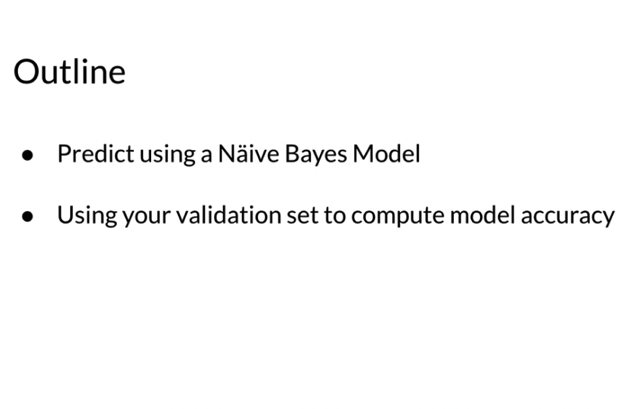</kbd>

   

  
  
<kbd>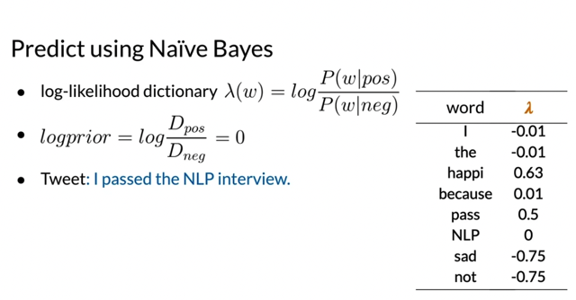</kbd>

   

  
  
<kbd>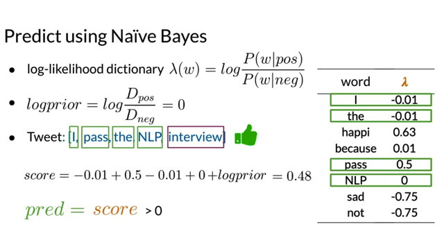</kbd>

  > Nhớ rằng cái model này không có params gì hết, cơ bản chỉ là đếm, nên predict
  > 1 tweet mới ta sẽ preprocess nó thành vector các từ, rồi tính tổng các lambda
  > của các từ đó, từ nào ko có trong table thì thôi, rồi cộng với log prior ra kết quả
  > so với 0 để kết luận

   

  
  
<kbd>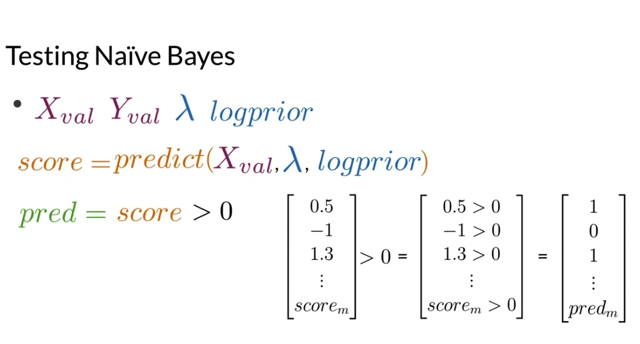</kbd>

  > Evaluate đv CV set.

   

  
  
<kbd>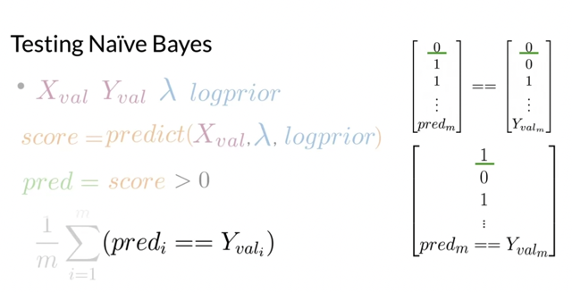</kbd>

   

  
  
<kbd>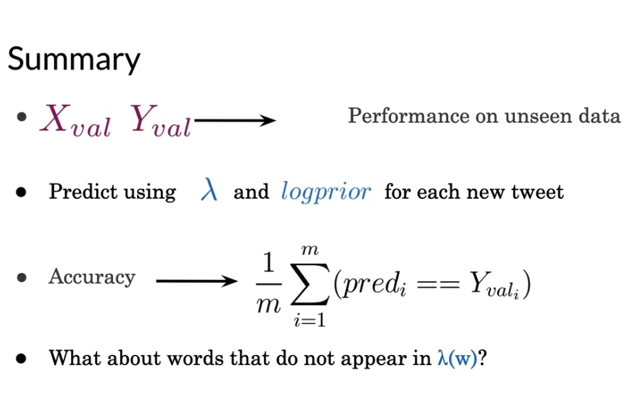</kbd>

   

## Application Of Naive Bayes

 

### 1 Naive Bayes method can be used for v\\*arious classification tasks\\*, such as \\*sentiment

> [!NOTE]
> 1 Naive Bayes method can be used for v\**arious classification tasks\**, such as \**sentiment
> analysis\**, \**author identification, spam filtering, information retrieval, and word
> disambiguation.
> \**
> 2 The \**Naive Bayes formula\** calculates the \**ratio between\** the \**conditional probabilities of the
> priors\** and \**likelihoods to estimate the probability for each class\**.
>
> 3 Naive Bayes can be used for \**author identification\** by training a model to recognize
> whether a new document was written by one author or another, based on their \**unique
> writing style.\**
>
> 4 \**Spam filtering\** can be performed using Naive Bayes by \**analyzing the sender, subject,
> and content\** of an email to determine whether it is spam or not.
>
> 5 \**Information retrieval\** can be done using Naive Bayes by calculating the \**likelihood\** of
> \**documents given a query\** and storing them based on their likelihoods.
>
> 6 Naive Bayes can be used for \**word disambiguation\** by \**calculating the score of the
> documents given that a word refers to each possible meaning\**, and choosing the one with
> the highest score.
>
> 7 Naive Bayes is a \**popular method\** due to its \**simplicity\** in training, use, and interpretation.
>
> 8 The assumptions underlying the Naive Bayes method will be discussed in the upcoming
> videos.

 

  
  
<kbd>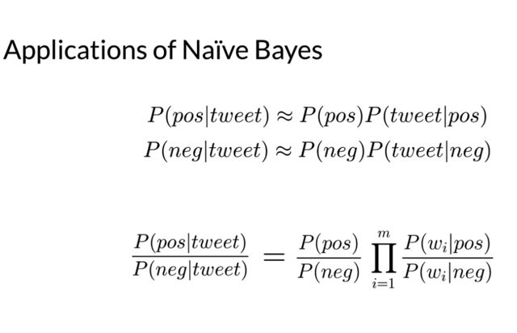</kbd>

   

  
  
<kbd>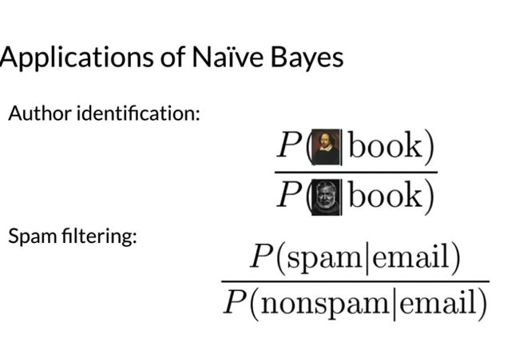</kbd>

   

  
  
<kbd>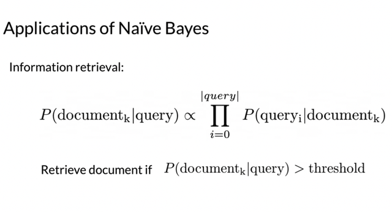</kbd>

  > Chưa hiểu lắm

   

  
  
<kbd>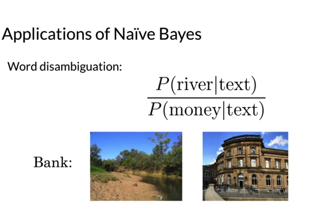</kbd>

   

  
  
<kbd>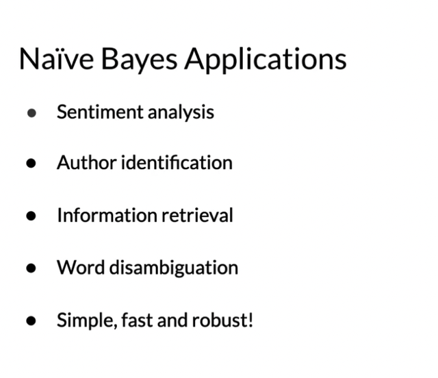</kbd>

   

  
  
<kbd>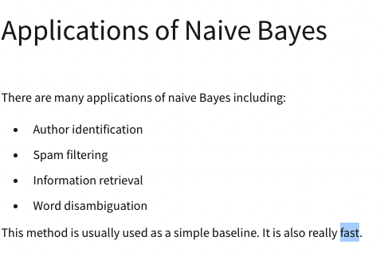</kbd>

  > Note: Bayes Rule thường dùng
  > như 1 simple baseline

   

## Naive Bayes Assumptions

 

### 1 The main \\*assumption\\* underlying the naïve bayes method is \\*independence\\*

> [!NOTE]
> 1 The main \**assumption\** underlying the naïve bayes method is \**independence\**
> of \**words in a sentence.\**
>
> 2 Naïve bayes is a \**simple\** model that \**doesn't require setting custom
> parameter\**s.
>
> 3 Naïve bayes assumes \**independence\** between the predictors or \**features\**
> associated with each class, which may \**not always be the case.\**
>
> 4 Naïve bayes could l\**ead to under or overestimation\** of the \**conditional
> probabilities of individual words. \** 5 Naïve bayes \**relies on the distribution of the
> training data sets\**, which could result in an \**overly optimistic or pessimistic
> model\**.
>
> 6 The assumption of\**independence in naïve bayes is difficult to guarantee\**, but
> the model \**works well in certain situations.\**
>
> 7 The relative frequency of positive and negative tweets in training data sets needs
> to be balanced for accurate results.
>
> 8 If naïve bayes fails to perform well, there are solutions to improve its
> performance, which will be covered in the next video.

 

  
  
<kbd>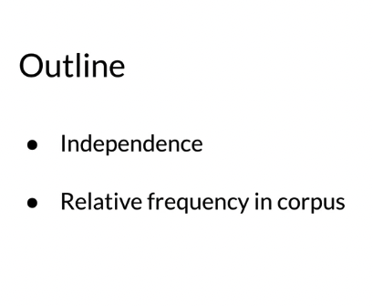</kbd>

   

  
  
<kbd></kbd>

  > Đại khái là Naive Bayes assume các từ độc lập với nhau và rõ ràng là
  > không đúng (ví dụ 'hot' và 'sunny' có quan hệ rõ ràng với 'desert', do đó
  > nó không nắm bắt được các liên hệ giữa các Từ. Các course sau sẽ nói
  > đến các model làm tốt hơn việc này (RNN, Transformer).

   

  
  
<kbd>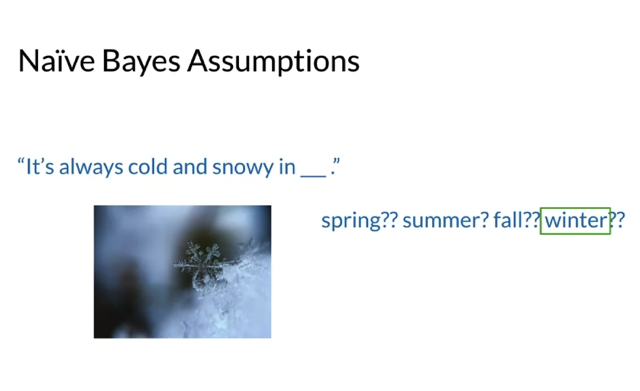</kbd>

  > Dẫn đến trong vấn đề dưới nó sẽ tính ra P
  > của các chữ đều bằng nhau.

   

  
  
<kbd>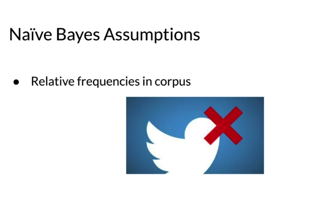</kbd>

  > Cái thứ hai đại khái là nó **phụ thuộc vào data distribution của dataset
  > mà vốn các bộ data này thường được cleaned và artificially balanced**như tweet dataset trong khi đó thường trong thực tế sẽ nhiều positive
  > tweet hơn do cái negative bị banned hoặc user muted (???) negative
  > tweet. Đại khái là do đó Naive Bayes ko thể phản ánh đúng thực tế như
  > thế nào và dẫn đến model bị **overconfidence** hay **overpessimistic**

   

  
  
<kbd>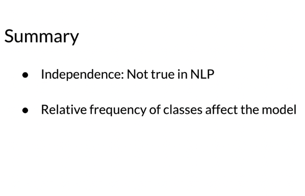</kbd>

  > Dù vậy nó vẫn tốt trong
  > một số trường hợp

   

## Error Analysis

 

### 1 \\*NLP errors\\* are \\*inevitable\\* no matter what method you use

> [!NOTE]
> 1 \**NLP errors\** are \**inevitable\** no matter what method you use
>
> 2 Errors in NLP can be caused by \**loss of semantic meaning\**, \**word\**
> \**order\**, and \**language quirks\** that are \**difficult for machines\** to understand
>
> 3 It's important to \**analyze processed text\** to ensure accurate results,
> including \**checking for punctuation and word removal\**
>
> 4 \**Naïve base classification\** relies on word \**frequency\** \**counts\** and can
> lead to \**errors due to its independence assumption\**
>
> 5 \**Word vectors\** can be used to improve NLP results
>
> 6 Naïve base classification may fail in cases of \**adversarial attacks,\**
> which are \**language phenomena like sarcasm, irony, and euphemism\**
> that machines have\**difficulty understanding.\**

 

  
  
<kbd>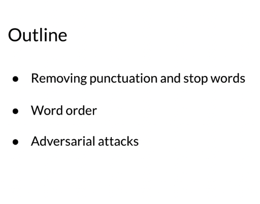</kbd>

   

  
  
<kbd>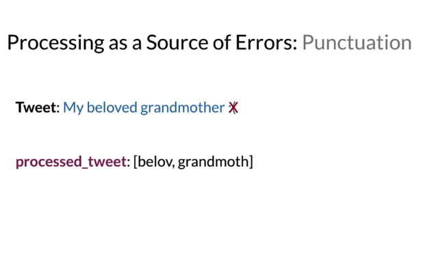</kbd>

  🔗 **Related:** [PREPROCESSING](preprocessing.md#node-37)

  > Đại khái là nhớ lại 1 điểm lưu ý trong Processing bữa trước khi
  > removing **Punctuation** phải cẩn thận vì đôi khi nó chứa thông tin quan
  > trọng, ví dụ bỏ cái mặt buồn ở dưới thôi là thay đổi hết ý nghĩa câu

   

  
  
<kbd>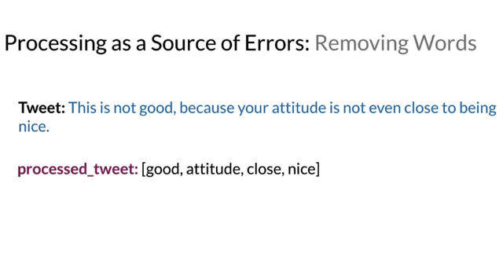</kbd>

  > Tương tự với Stop Words

   

  
  
<kbd>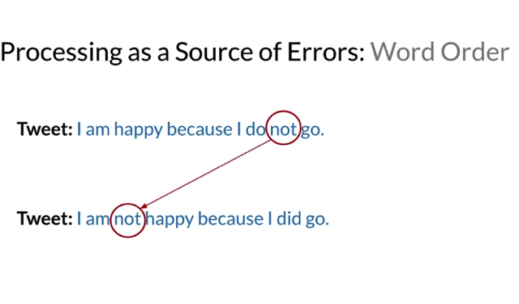</kbd>

  > Word order nữa, nói chung là những model sau như RNN, Attention và
  > Transformer sẽ handle dc những ca này

   

  
  
<kbd>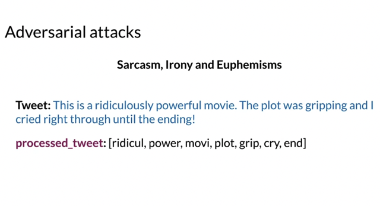</kbd>

  > Đại khái là sao đó mà câu positive sau khi
  > preprocess thì nghe rất negative

   

- An adversarial attack in the context of naïve Bayes refers to a situation where the model misclassifies a text input due to the use of language phenomena such as \\*sarcasm, irony, or euphemism.  \\*These language phenomena can be \\*easily understood by humans\\* but can be \\*challenging for machines\\* to interpret. In the given example, the text "This is a ridiculously powerful movie. The plot was gripping and I cried right through until the ending" contains \\*positive\\* language, but the \\*pre-processing step used by naïve Bayes\\* to extract features and analyze sentiment may \\*incorrectly classify it as negative\\* due to the presence of words like "\\*ridiculous\\*" or "cried."  This can \\*result in inaccurate sentiment analysis\\* and affect the overall performance of the model. To avoid such adversarial attacks, it is important to use \\*more sophisticated models\\* that can better understand the nuances of language and context. (GPT)
  > Đại khái cái sao đó chính là hiện tượng gọi là Adversarial
  > attack, model quá đơn giản như Naive Bayes ko nắm bắt
  > được sự 'lắt léo' trong ngôn ngữ khiến nó ko hiểu được ý
  > nghĩa positive của câu trên

   

## Week Conclusion

 

## Quiz

 

<kbd>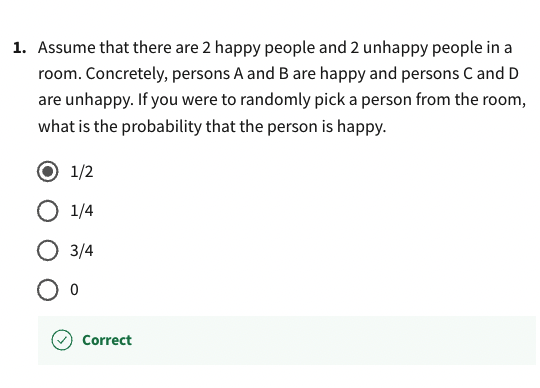</kbd>

 

<kbd>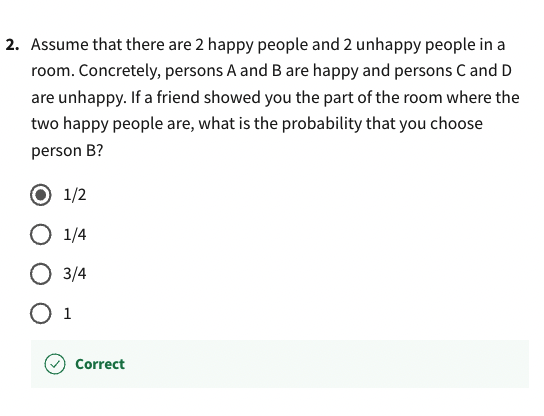</kbd>

 

<kbd>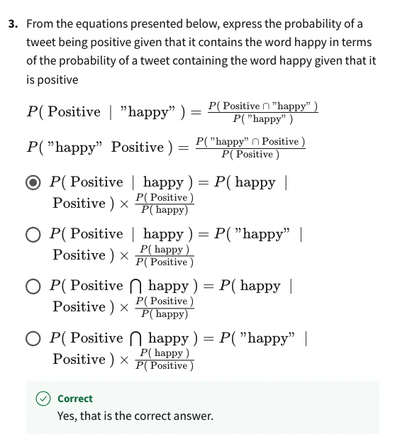</kbd>

 

<kbd>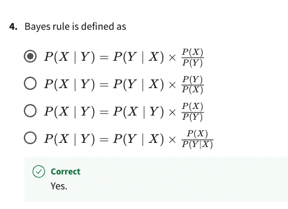</kbd>

 

<kbd>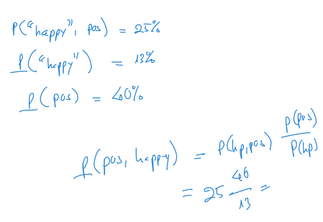</kbd>

<kbd></kbd>

<kbd>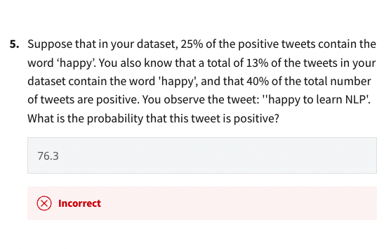</kbd>

> [!NOTE]
> Không hiểu sao sai

 

<kbd>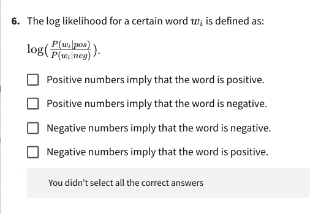</kbd>

 

<kbd>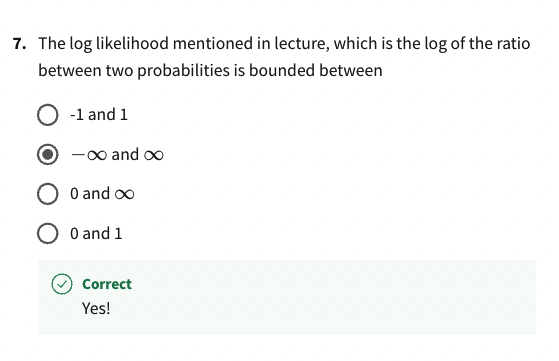</kbd>

 

<kbd>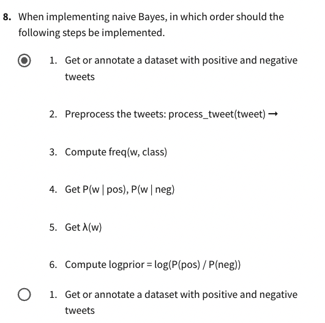</kbd>

 

<kbd>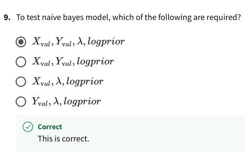</kbd>

 

<kbd>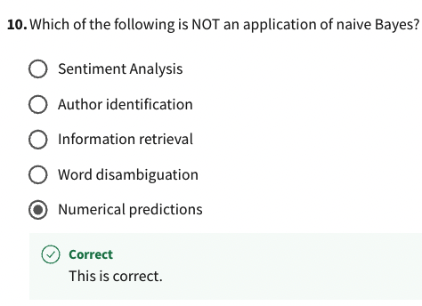</kbd>

 

## PROGRAMMING ASSIGNMENT: Naive Bayes

 

### Welcome to week two of this specialization. You will learn about \\*Naive

> [!NOTE]
> Welcome to week two of this specialization. You will learn about \**Naive
> Bayes\**. Concretely, you will be using Naive Bayes for \**sentiment analysis\** on
> \**tweets\**. Given a tweet, you will decide if it has a positive sentiment or a
> negative one. Specifically you will:
>
> • \**Train a naive bayes model\** on a \**sentiment analysis task\**
>
> • \**Test using your model\**
>
> • \**Compute ratios of positive words to negative words\**
>
> • Do some \**error analysis\**
>
> • Predict on your own tweet
>
> You may already be familiar with Naive Bayes and its justification in terms of
> \**conditional probabilities\** and \**independence\**.
>
> • In this week's lectures and assignments we used the \**ratio of probabilities
> between positive and negative sentiment.\**
>
> • This approach gives us simpler formulas for these 2-way classification
> tasks.

 

- Importing Functions and Data
   

  
  - from utils import process_tweet, lookup import pdb from \\*nltk.corpus\\* import \\*stopwords\\*, \\*twitter_samples\\* import numpy as np import pandas as pd import nltk import string from nltk.tokenize import \\*TweetTokenizer\\* from os import getcwd import w2_unittest  \\*nltk.download('twitter_samples') nltk.download('stopwords')\\*
     

      
      
<kbd>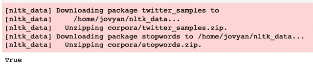</kbd>

      > If you are running this notebook in your local computer, don't
      > forget to download the tweeter samples and stopwords from nltk.
      >
      > nltk.download('stopwords') nltk.download('twitter_samples')

       

    
    - filePath = f"{getcwd()}/../tmp2/" nltk.data.path.append(filePath)  \\/# \\*get the sets of positive and negative tweets\\*\\/ all_positive_tweets = twitter_samples.strings('\\*positive_tweets.json\\*') all_negative_tweets = twitter_samples.strings('\\*negative_tweets.json\\*')  \\/# \\*split the data into two pieces\\*, one for training and one for testing (validation set) \\/test_pos = all_positive_tweets[\\*4000\\*:] train_pos = all_positive_tweets[:\\*4000\\*] test_neg = all_negative_tweets[4000:] train_neg = all_negative_tweets[:4000]  train_x = train_pos + train_neg test_x = test_pos + test_neg  \\*# avoid assumptions about the length of all_positive_tweets\\* train_y = np.append(np.ones(len(train_pos)), np.zeros(len(train_neg))) test_y = np.append(np.ones(len(test_pos)), np.zeros(len(test_neg)))
       

- 1 - Process the Data
   

  
  - For any machine learning project, once you've gathered the data, \\*the first step is to process it \\*to make useful inputs to your model.  \\*Remove noise\\*: You will first want to remove noise from your data -- that is, \\*remove words that don't tell you much\\* about the content. These include all \\*common words like 'I, you, are, is\\*, etc...' that would not give us enough information on the sentiment.  We'll also remove \\*stock market tickers\\*, \\*retweet\\* \\*symbols\\*, \\*hyperlinks\\*, and \\*hashtags\\* because they can not tell you a lot of information on the sentiment. You also want to remove all the \\*punctuation\\* from a tweet. The reason for doing this is because we want to \\*treat words with or without the punctuation\\* as the same word, instead of treating "happy" , "happy?", " happy!", "happy," and "happy." as different words.  Finally you want to use \\*stemming\\* to only keep track of one variation of each word. In other words, we'll treat "motivation", "motivated", and " motivate" similarly by grouping them within the same stem of \\*"motiv-"\\*. We have given you the function \\/\\*process_tweet\\*\\/ that does this for you.
     

    
    - custom_tweet = "RT @Twitter @chapagain Hello There! Have a great day. :) #good #morning http://chapagain.com.np"  # print cleaned tweet print(process_tweet(custom_tweet)) -> ['hello', 'great', 'day', ':)', 'good', 'morn']
       

  
  - 1.1 - Implementing your Helper Functions
     

    
    - To help you train your naive bayes model, you will need to \\*compute a dictionary\\* where the \\*keys are a tuple (word, label) \\*and the values are the corresponding \\*frequency\\*. Note that the labels we'll use here are 1\\* for positive and 0 for negative\\*.  You will also implement a \\*lookup helper function\\* that takes in the \\*freqs\\* \\*dictionary\\*, a \\*word\\*, and a \\*label\\* (1 or 0) and \\*returns the number of times that word and label tuple appears in the collection of tweets.\\*  For example: given a list of tweets ["I am rather excited", "you are rather happy"] and the label 1, the function will return a dictionary that contains the following key-value pairs:  { ("rather", 1): 2, ("happi", 1) : 1, ("excit", 1) : 1 }  - Notice how for each word in the given string, the same label 1 is assigned to each word.  - Notice how the words "I" and "am" are not saved, since it was removed by \\*process_tweet\\* because it is a \\*stopword\\*.  - Notice how the word " rather" appears twice in the list of tweets, and so its count value is 2.
       

  
  - Exercise 1 - count_tweets
     

    
    - Create a function \\*count_tweets\\* that \\*takes a list of tweets\\* as input, \\*cleans\\* all of them, and \\*returns a dictionary\\*.  - The \\*key\\* in the dictionary is a \\*tuple containing the stemmed word and its class label,\\* e.g. ("happi",1).  - The \\*value\\* the \\*number of times this word appears in the given collection of tweet\\*s (an integer).  \\*Hints\\*  • Please use the `\\*process_tweet\\*` function that was imported above, and then store the words in their respective dictionaries and sets.  • You may find it useful to use the `\\*zip\\*` function to match each element in `tweets` with each element in `ys`.  • Remember to \\*check\\* if the key in the dictionary \\*exists\\* before adding that key to the dictionary, or incrementing its value.  • Assume that the `result` dictionary that is input will contain clean key-value pairs (you can assume that the values will be integers that can be incremented). It is\\* good practice to check the datatype\\* before \\*incrementing\\* the value, but it's not required here.
       

        
        
<kbd>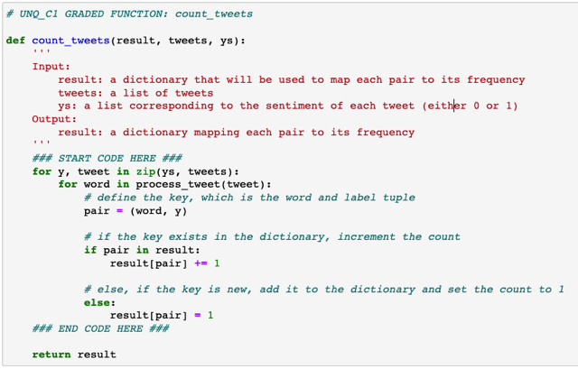</kbd>

         

        
        
<kbd>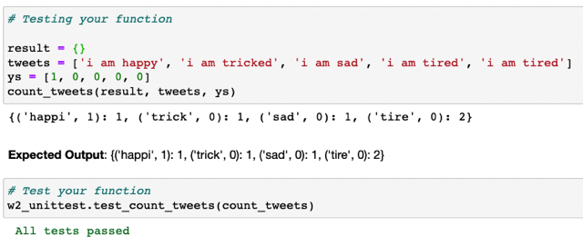</kbd>

         

- 2 - Train your Model using Naive Bayes
   

  
  - Some explaination
     

      
      
<kbd>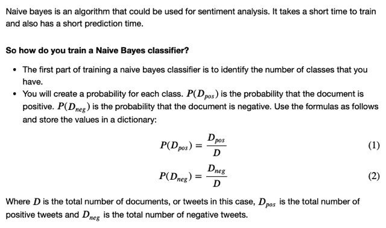</kbd>

       

      
      
<kbd>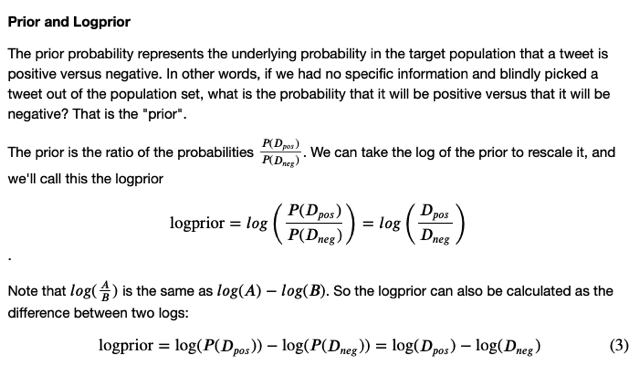</kbd>

      > Phòng khi bối rối ngu đột xuất để rồi không hiểu tại sao logprior lại bằng
      > log(Dpos/Dneg) thì P(Dpos) = Dpos/D, P(Dneg) = Dneg/D Nên chia hai thằng
      > đó cho nhau ra Dpos/Dneg

       

      
      
<kbd>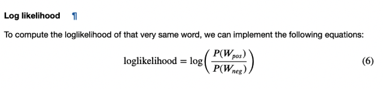</kbd>

      
<kbd></kbd>

      
<kbd>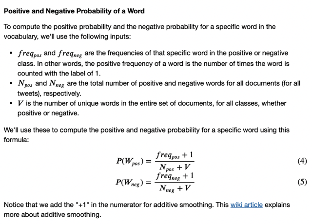</kbd>

       

    
    - \\/\\*Create freqs dictionary \\*\\/  • Given your \\*count_tweets\\* function, you can compute a dictionary called \\*freqs\\* that contains all the frequencies.  • In this freqs dictionary, the \\*key\\* is the tuple \\*(word, label)\\*  • The value is the \\*number of times it has appeared\\*.  We will use this dictionary in several parts of this assignment.
       

      
      - # Build the freqs dictionary for later uses freqs = count_tweets({}, train_x, train_y)
         

  
  - Exercise 2 - train_naive_bayes
     

      
      
<kbd>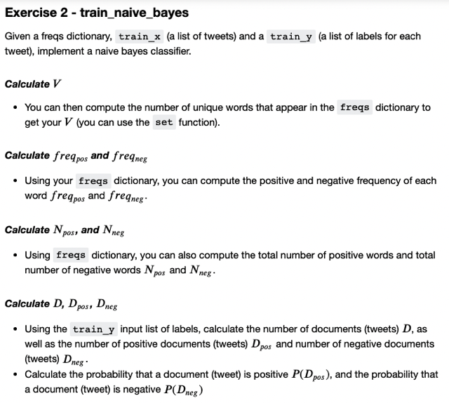</kbd>

       

      
      
<kbd>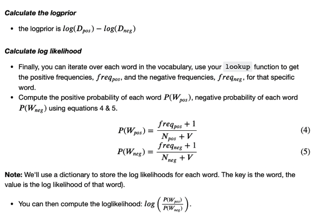</kbd>

       

      
      
<kbd>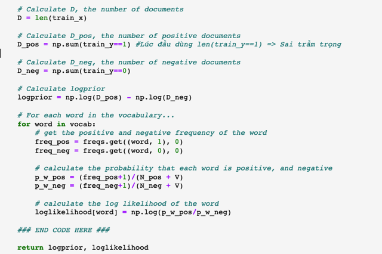</kbd>

      
<kbd></kbd>

      
<kbd>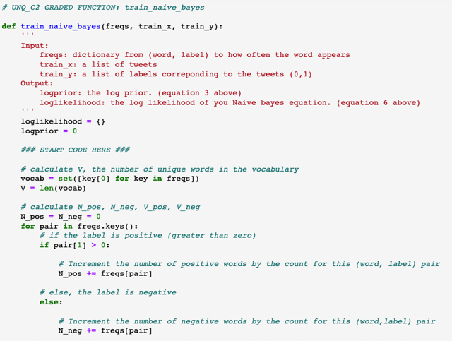</kbd>

      > len(y==1) là ra y xì len của y, nhớ nha vì y==1 ra 1 vector
      > dài bằng y chưa các kết quả so sánh các vị trí của y với 1.
      > giống thì bằng 1, khác thì = 0. Nên phải sum mới đúng

      > Cách làm như này rất gọn mà Python nó mạnh những cái như vậy
      > vocab = set([key[0] for key in freqs])

       

      
      
<kbd>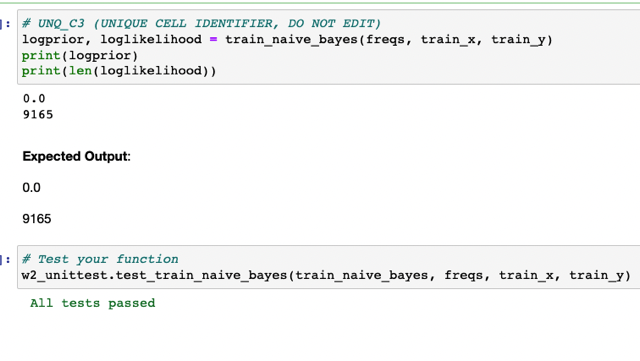</kbd>

       

- 3 - Test your Naive Bayes
   

  
  - Exercise 3 - naive_bayes_predict
     

      
      
<kbd>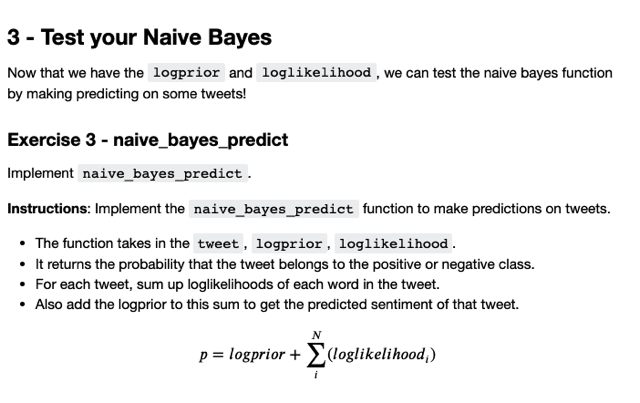</kbd>

       

    
    - Note   Note we calculate the \\*prior\\* from the \\*training data\\*, and that the training data is evenly split between positive and negative labels (4000 positive and 4000 negative tweets). This means that the ratio of positive to negative 1, and the logprior is \\*0.\\*  The value of 0.0 means that when we add the logprior to the log likelihood, we're just adding zero to the log likelihood. However, please remember to include the logprior, because whenever the data is not perfectly balanced, the logprior will be a non-zero value.
       

        
        
<kbd>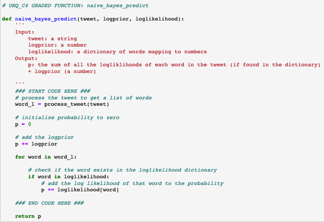</kbd>

         

        
        
<kbd>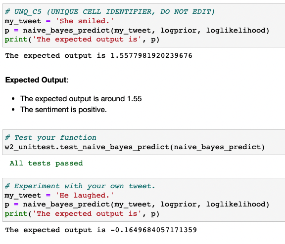</kbd>

         

  
  - Exercise 4 - test_naive_bayes
     

    
    - Implement test_naive_bayes. \\*Instructions\\*:  • Implement \\*test_naive_bayes\\* to check the accuracy of your predictions.  • The function takes in your \\*test_x\\*, \\*test_y\\*, \\*log_prior\\*, and \\*loglikelihood\\*  • It returns the accuracy of your model.  • First, use \\*naive_bayes_predict\\* function to make predictions for each tweet in test_x.
       

        
        
<kbd>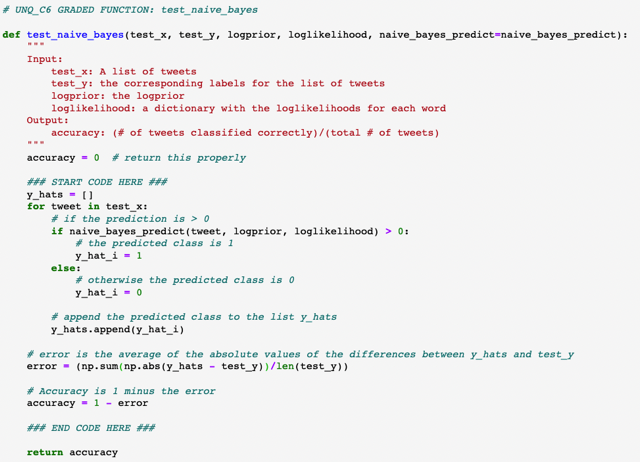</kbd>

        > Nhờ câu hint mà làm thôi
        >
        > # error is the average of the **absolute** values of the  **differences**
        > between y_hats and test_y
        >
        > differences -> Trừ nhau chứ gì**,**average -> sum./len**.**Nhớ****absolute nữa, không nó ra âm
        >
        > error = np.abs(np.sum(y_hats - test_y)/len(test_y))

        > abs(y^-y) chứ ko phải sum hết rồi mới abs

         

        
        
<kbd>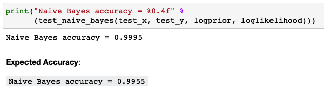</kbd>

         

      
      - # UNQ_C7 (UNIQUE CELL IDENTIFIER, DO NOT EDIT) # Run this cell to test your function for tweet in ['I am happy', 'I am bad', 'this movie should have been great.', 'great', 'great great', 'great great great', 'great great great great']:     # print( '%s -> %f' % (tweet, naive_bayes_predict(tweet, logprior, loglikelihood)))     p = naive_bayes_predict(tweet, logprior, loglikelihood) #     print(f'{tweet} -> {p:.2f} ({p_category})')     print(f'{tweet} -> {p:.2f}')  -> I am happy -> 2.14 I am bad -> -1.31 this movie should have been great. -> 2.12 great -> 2.13 great great -> 4.26 great great great -> 6.39 great great great great -> 8.52 
         

        
        
<kbd>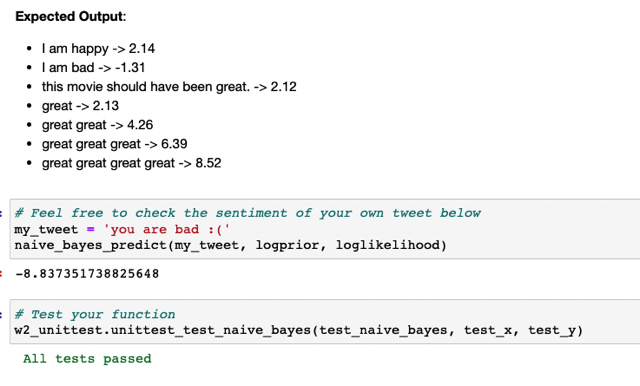</kbd>

         

- 4 - Filter words by Ratio of Positive to Negative Counts
   

  
  - • Some words have \\*more positive counts\\* than others, and can be considered "more positive". Likewise, some words can be considered more negative than others.  • One way for us to define the level of positiveness or negativeness, without calculating the log likelihood, is to compare the positive to negative frequency of the word.  ▪ Note that we can also use the log likelihood calculations to compare relative positivity or negativity of words.  • We can calculate the ratio of positive to negative frequencies of a word.  • Once we're able to calculate these ratios, we can also \\*filter a subset of words\\* that have a \\*minimum ratio of positivity / negativity\\* or higher.  • Similarly, we can also filter a subset of words that have a maximum ratio of positivity / negativity or lower (words that are at least as negative, or even more negative than a given threshold).
     

  
  - Exercise 5 - get_ratio
     

      
      
<kbd>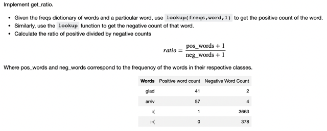</kbd>

       

      
      
<kbd>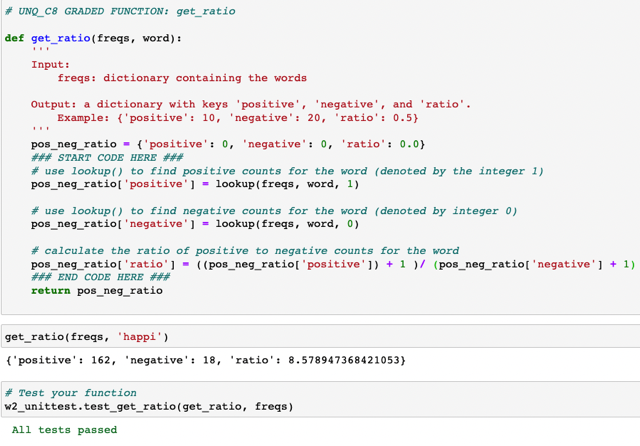</kbd>

       

  
  - Exercise 6 - get_words_by_threshold
     

      
      
<kbd>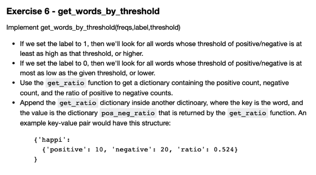</kbd>

       

      
      
<kbd>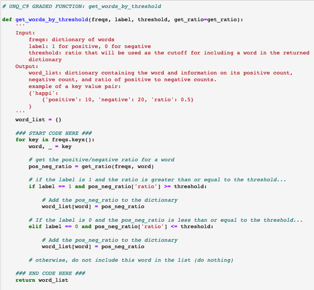</kbd>

       

      
      
<kbd>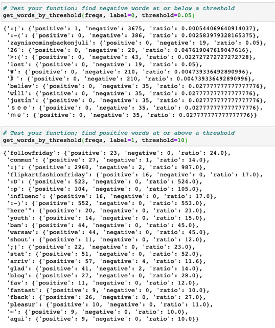</kbd>

      > Notice the difference between the positive and negative ratios.
      > Emojis like **:(** and words like '**me**' **tend to have a negative**
      > connotation. Other words like glad, community, arrives, tend to
      > be found in the positive tweets.

       

- 5 - Error Analysis¶
   

  
  - # Some error analysis done for you print('Truth Predicted Tweet') for x, y in zip(test_x, test_y):     y_hat = naive_bayes_predict(x, logprior, loglikelihood)     if y != (np.sign(y_hat) > 0):         print('%d\\t%0.2f\\t%s' % (y, np.sign(y_hat) > 0, ' '.join(             process_tweet(x)).encode('ascii', 'ignore')))
    > In this part you will see some tweets that your model
    > missclassified. Why do you think the missclassifications
    > happened? Were there any assumptions made by your
    > naive bayes model?

     

    
    - Truth Predicted Tweet 1 0.00 b'truli later move know queen bee upward bound movingonup' 1 0.00 b'new report talk burn calori cold work harder warm feel better weather :p' 1 0.00 b'harri niall 94 harri born ik stupid wanna chang :D' 1 0.00 b'park get sunlight' 1 0.00 b'uff itna miss karhi thi ap :p' 0 1.00 b'hello info possibl interest jonatha close join beti :( great' 0 1.00 b'u prob fun david' 0 1.00 b'pat jay' 0 1.00 b'sr financi analyst expedia inc bellevu wa financ expediajob job job hire'
       

- 6 - Predict with your own Tweet
   

  
  - # Test with your own tweet - feel free to modify `my_tweet` my_tweet = 'I am happy because I am learning :)'  p = naive_bayes_predict(my_tweet, logprior, loglikelihood) print(p)  -> 9.571143871339594
    > Congratulations on completing this
    > assignment. See you next week!

     

