# C1W3 - VECTOR SPACE MODELS  Vector space models \\*capture semantic meaning\\* and r\\*elationships between words. \\* You'll learn how to \\*create word vectors\\* that \\*capture dependencies between words\\*,  then \\*visualize\\* \\*their relationships\\* in two dimensions using \\*PCA\\*. \\* Learning Objectives \\*  • Covariance matrices  • Dimensionality reduction  • Principal component analysis  • Cosine similarity  • Euclidean distance  • Co-occurrence matrices  • Vector representations 

📊 **Progress:** `80` Notes | `126` Screenshots

---

## Introduction

 

### 1 Understanding v\\*ector spaces\\* in NLP

> [!NOTE]
> 1 Understanding v\**ector spaces\** in NLP
>
> 2 Representing \**word\** \**vectors\** as numerical codes
>
> 3 Two methods for \**comparing different word vectors\**:
> \**Euclidean distance\** and\**cosine similarity\**
>
> 4 \**Plotting\** `high-dimensional` word vectors in a \**2D
> plane\**
>
> 5 \**Clustering\** \**similar words\** together in the plot

 

## Vector Space Models

 

### 1 Introduction to \\*vector space\\* models and their applications in

> [!NOTE]
> 1 Introduction to \**vector space\** models and their applications in
> \**NLP\**.
>
> 2 \**Vector space models\** can \**encode\** different \**types of information\**
> and \**capture word relationships\**.
>
> 3 Examples of how \**vector space\** models can be used in question
> \**answering\**, \**paraphrasing\**, \**summarization\**, \**information extraction\**,
> \**machine translatio\**n, and \**chat\** programming.
>
> 4 \**Representing words\** and documents \**as vectors\** using \**context\**
> and \**cooccurrence matrices\**.
>
> 5 John Firth's quote\**"You shall know a word by the company it
> keeps\**" as a fundamental concept in NLP.
>
> 6 Next video will cover \**building vector space models\** from scratch
> using \**cooccurrence matrices\**.

 

  
  
<kbd>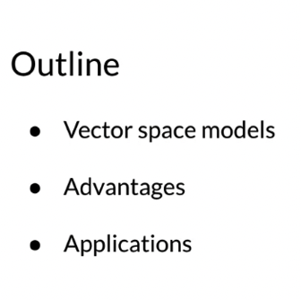</kbd>

   

  
  
<kbd>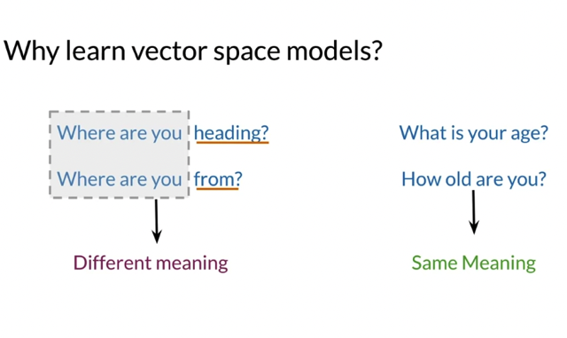</kbd>

  > [!NOTE]
  > Đại khái là **vector space** sẽ giúp giải quyết được vấn đề như
  > này một cái là **2 câu gần như giống nhau** nhưng **nghĩa
  > hoàn toàn khác xa** còn **2 câu nhìn thì khác xa** nhưng
  > n**ghĩa lại giống nhau**

   

  
  
<kbd>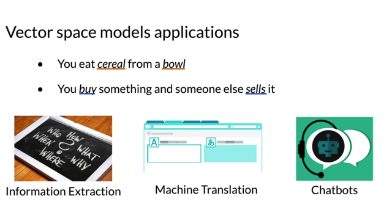</kbd>

  > [!NOTE]
  > Nó cũng sẽ giúp **nắm bắt được sự liên quan
  > giữa các từ** trong câu và ứng dụng trong rất
  > nhiều lĩnh vực

   

  
  
<kbd>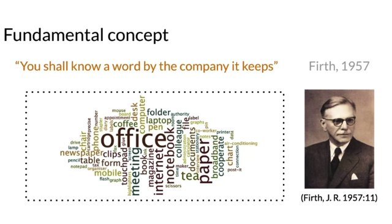</kbd>

  > [!NOTE]
  > Đại khái là represent một word sao cho **nắm bắt được tất cả
  > những thông tin context xung quanh nó** từ đó hiểu được trọn vẹn ý
  > nghĩa của từ

   

  
  
<kbd>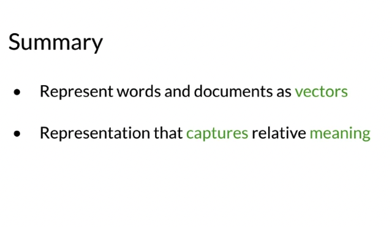</kbd>

   

  
  
<kbd>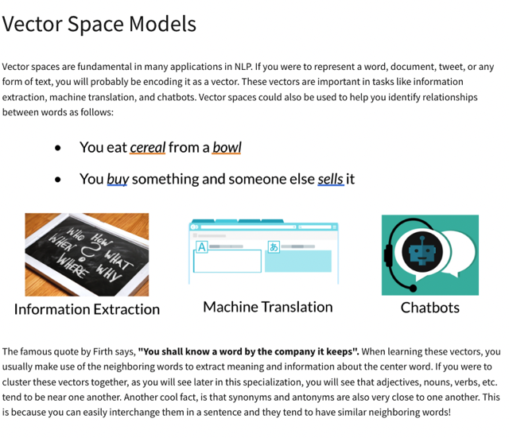</kbd>

   

## Word By Word And Word By Doc

 

### 1 Introduction to \\*constructing vectors\\* based on `\\*co-occurrence` matrix\\*

> [!NOTE]
> 1 Introduction to \**constructing vectors\** based on \**co-occurrence matrix\**
>
> 2 \**Different designs\** for constructing vector space models for words and
> documents
>
> 3 \**Co-occurrence\** matrix and \**vector representations\** for words in the \**corpus\**
>
> 4 \**Co-occurrence of words in documents\** and \**vector representations for
> documents in the corpus\**
>
> 5 Creating a \**vector space\** by taking representations for multiple sets of
> documents or words
>
> 6 \**Comparing\** vector representations using \**cosine similarity \**and \**Euclidean
> distance\**
>
> 7 Importance of \**similarity metrics\** in vector spaces
>
> 8 Summary of the main ideas and a teaser for the next video on \**Euclidean
> distance\** similarity metric.

 

  
  
<kbd>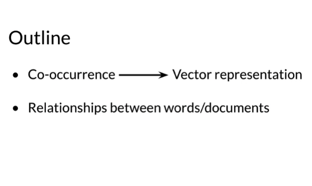</kbd>

   

  
  
<kbd>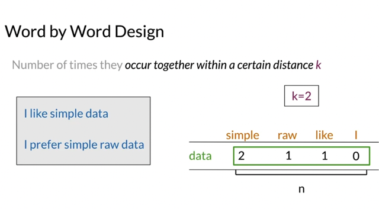</kbd>

  > [!NOTE]
  > Đại khái là dựa vào nhận định ở bài trước, rằng ý nghĩa một từ có thể được
  > xác định bằng các từ hay vây quanh nó, ta có thể có cách thức đầu tiên để
  > xây dựng word vector như sau. Xét một corpus, ta sẽ thống kê xem trong
  > một phạm vi nhất định, thì có bao nhiêu lần một từ xuất hiện trong phạm vi
  > đó với một từ khác, để rồi tạo ra `co-occurrence` matrix. Và dựa vào các chỉ
  > số thống kê này, để tạo word vector. Ví dụ trong corpus gồm 2 câu như trong
  > hình, xây dựng vector cho từ "data" dựa trên số lần các từ khác xuất hiện
  > trong phạm vi gần nó
  >
  > Cho k bằng 2 thì đv từ '**data**' thì trong khoảng **K** này các từ khác **xuất
  > hiện nhiều hay ít** (mấy lần) từ đó xây dựng**vector represent** cho từ 'data'
  > ..
  >
  > Với cách tạo vector này có thể thấy n**hững từ mà có liên quan đến nhau sẽ
  > có xu hướng xuất hiện gần nhau** nhiều nên sẽ cao hơn

   

  
  
<kbd>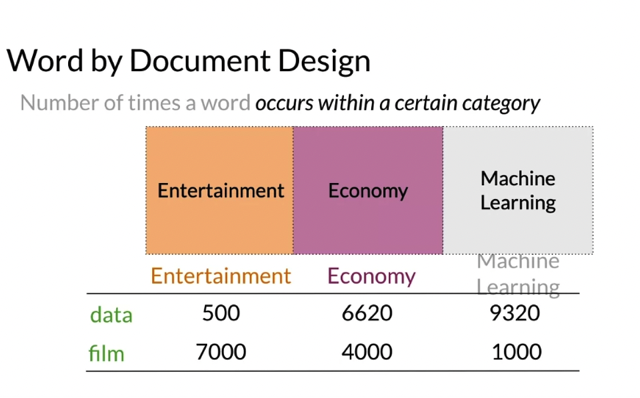</kbd>

  > [!NOTE]
  > Còn cái này thì đại khái cũng tạo vector bằng số lần từ này **xuất
  > hiện trong 1 corpus thuộc lĩnh vực** nào đó. Như từ **data** với véctơ
  > như vậy sẽ dễ thấy nó **liên quan nhiều đến máy tính** còn **film** thì
  > **liên quan nhiều đến giải trí**

   

  
  
<kbd>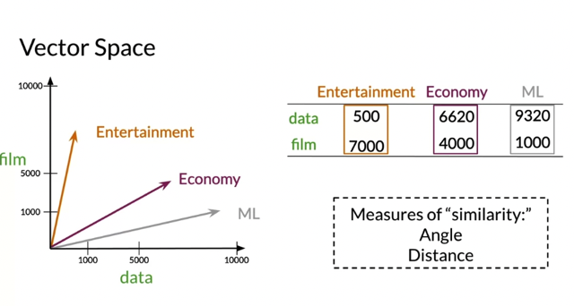</kbd>

  > [!NOTE]
  > Đại khái là vẽ ra như này sẽ thấy **'data' có tính economy và ML
  > còn film có tính entertainment nhiều hơn.**
  >
  > Đồng thời cũng cho thấy lĩnh vực **ML và Economy thì gần nhau
  > hơn là ML với Entertainment**
  >
  > Và để cụ thể hoá tính chất gần nhau đó thì người ta dùng thước 
  > đo **Angle** và **Distance** của các vector

   

  
  
<kbd>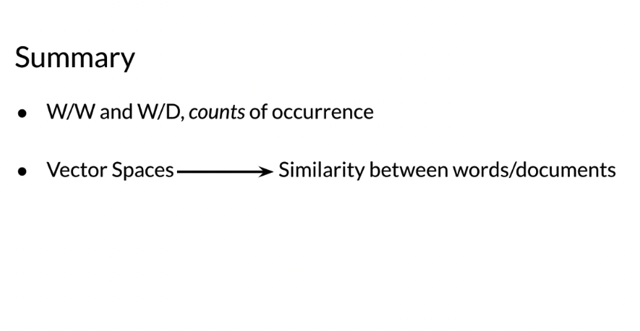</kbd>

   

  
  
<kbd>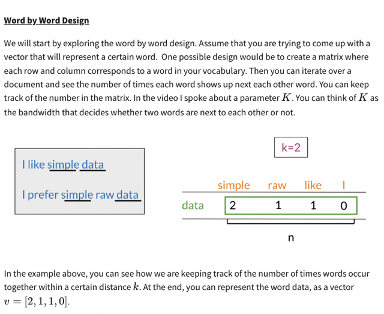</kbd>

   

  
  
<kbd>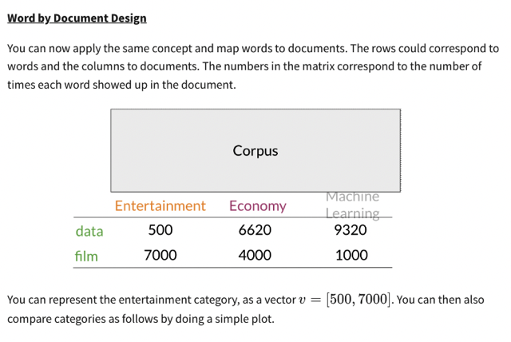</kbd>

   

  
  
<kbd>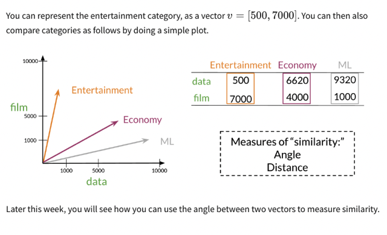</kbd>

   

## Linear Algebra In Python With Numpy

 

### In this lab, you will have the opportunity to remember some

> [!NOTE]
> In this lab, you will have the opportunity to remember some
> \**basic concepts \**about \**linear algebra\** and how to use them in
> \**Python\**.
>
> \**Numpy\** is one of the \**most used libraries\** in Python for \**arrays
> manipulation\**. It adds to Python a set of functions that allows
> us to \**operate on large multidimensional arrays\** with just a few
> lines. So forget about writing nested loops for adding
> matrices! With NumPy, this is as simple as adding numbers.
>
> Let us \**import\** the numpy library and assign the alias \**np\** for it.
> We will follow this convention in almost every notebook in this
> course, and you'll see this in many resources outside this
> course as well.

 

- import numpy as \\*np\\*  # The swiss knife of the data scientist.
   

- Defining lists and numpy arrays
   

  
  - alist `=` [1, 2, 3, 4, 5]   # Define a python list. It looks like an np array narray `=` \\*np.array\\*([1, 2, 3, 4]) # Define a numpy array
    
<kbd>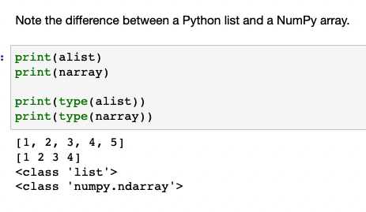</kbd>

    
<kbd></kbd>

     

- Algebraic operators on NumPy arrays vs. Python lists
   

  
  - One of the \\*common\\* beginner \\*mistakes\\* is to \\*mix up\\* the concepts of \\*NumPy\\* arrays and \\*Python lists\\*. Just observe the next example, where we \\*add\\* two objects of the two mentioned types.  Note that the `\\*'+'\\*` operator on NumPy arrays perform an `\\*element-wise` addition\\*, while the same operation on \\*Python\\* \\*lists\\* results in a \\*list concatenatio\\*n. Be careful while coding. Knowing this can \\*save many headaches.\\*
     

    
    - print(narray `\\*+\\*` narray) print(alist `\\*+\\*` alist)  [2 4 6 8] [1, 2, 3, 4, 5, 1, 2, 3, 4, 5]
      > [!NOTE]
      > Đối với Numpy array là cộng
      > vector element wise còn dv
      > Python list thì là concat

       

  
  - It is the same as with the \\*product\\* operator, \\**\\*. In the first case, we \\*scale\\* the vector, while in the second case, we \\*concatenate three times\\* the same list.  Be aware of the difference because, \\*within the same function\\*, \\*both\\* types of arrays can \\*appear\\*. \\*Numpy\\* arrays are designed for \\*numerical\\* and \\*matrix\\* operations, while lists are for more general purposes.
     

    
    - print(narray * 3) print(alist * 3)  [ 3  6  9 12] [1, 2, 3, 4, 5, 1, 2, 3, 4, 5, 1, 2, 3, 4, 5]
      > [!NOTE]
      > Đối với Numpy array là nhân
      > vector element wise còn dv
      > Python list thì là concat 3 lần vãi thật

       

- Matrix or Array of Arrays
   

  
  - In \\*linear algebra\\*, a \\*matrix\\* is a structure composed of \\*n rows\\* \\*by m columns\\*. That means each row must have the same number of columns. With NumPy, we have two ways to create a matrix:  `-` Creating an array of arrays using \\*np.array\\* (recommended).  `-` Creating a matrix using \\*np.matrix\\* (still available but might be removed soon). NumPy arrays or lists can be used to \\*initialize\\* a matrix, but the resulting matrix will be composed of NumPy arrays only.
     

    
    - npmatrix1 `=` \\*np.array\\*([narray, narray, narray]) # Matrix \\*initialized with NumPy arrays \\*npmatrix2 `=` \\*np.array\\*([alist, alist, alist]) # Matrix \\*initialized with lists\\* npmatrix3 `=` \\*np.array\\*([narray, [1, 1, 1, 1], narray]) # Matrix \\*initialized with both types \\* print(npmatrix1) print(npmatrix2) print(npmatrix3)
       

        
        
<kbd>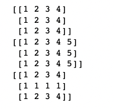</kbd>

         

      
      - However, when \\*defining a matrix\\*, be sure that \\*all the rows contain the same number of elements\\*. Otherwise, the linear algebra operations could lead to unexpected results.  Analyze the following two examples:
         

        
        - # Example 1:  okmatrix `=` \\*np.array\\*([[1, 2], [3, 4]]) # Define a 2x2 matrix print(okmatrix) # Print okmatrix print(okmatrix * 2) # Print a scaled version of okmatrix
           

            
            
<kbd>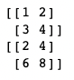</kbd>

             

        
        - # Example 2:  badmatrix `=` np.array([[1, 2], [3, 4], \\*[5, 6, 7]\\*]) # Define a matrix. Note the third row contains 3 elements print(badmatrix) # Print the malformed matrix print(badmatrix * 2) # It is supposed to scale the whole matrix  `->` [\\*list\\*([1, 2]) list([3, 4]) list([5, 6, 7])] [list([1, 2, 1, 2]) list([3, 4, 3, 4]) list([5, 6, 7, 5, 6, 7])]
           

- Scaling and translating matrices
   

  
  - Now that you know how to build \\*correct NumPy arrays and matrices\\*, let us see how \\*easy\\* it is to \\*operate\\* with them in Python using the regular \\*algebraic operators\\* like `+` and `-.`  Operations can be performed \\*between arrays\\* and arrays or between \\*arrays\\* and \\*scalars\\*.
     

    
    - # Scale by 2 and translate 1 unit the matrix result `=` okmatrix\\* * 2\\* `+` 1 # For each element in the matrix, multiply by 2 and add 1 print(result)
       

        
        
<kbd>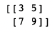</kbd>

         

    
    - # Add two compatible matrices result1 `=` okmatrix `\\*+\\*` okmatrix print(result1)  # Subtract two compatible matrices. This is called the difference vector result2 `=` okmatrix\\* `-\\*` okmatrix print(result2)
       

        
        
<kbd>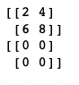</kbd>

         

    
    - result `=` okmatrix \\**\\* okmatrix # Multiply each element by itself print(result)
       

        
        
<kbd>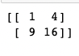</kbd>

         

- Transpose a matrix
   

  
  - In linear algebra, the \\*transpose\\* of a matrix is an operator that \\*flips a matrix over its diagonal\\*, i.e., the transpose operator switches the row and column indices of the matrix producing another matrix. If the original matrix dimension is \\*n by m\\*, the resulting transposed matrix will be \\*m by n.\\*  \\*T\\* denotes the t\\*ranspose operation\\*s with NumPy matrices.
     

    
    - matrix3x2 `=` np.array([[1, 2], [3, 4], [5, 6]]) # Define a 3x2 matrix print('Original matrix 3 x 2') print(matrix3x2) print('Transposed matrix 2 x 3') print(matrix3x2.T)
       

        
        
<kbd>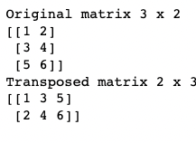</kbd>

         

    
    - nparray `=` np.array([1, 2, 3, 4]) # Define an array print('Original array') print(nparray) print('Transposed array') print(nparray.T)
      > [!NOTE]
      > However, note that the transpose
      > operation does not affect 1D arrays.

       

        
        
<kbd>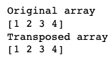</kbd>

         

    
    - nparray `=` np.array([[1, 2, 3, 4]]) # Define a 1 x 4 matrix. Note the 2 level of square brackets print('Original array') print(nparray) print('Transposed array') print(nparray.T)
       

        
        
<kbd>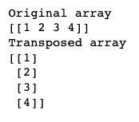</kbd>

         

- Get the norm of a nparray or matrix
   

    
    
<kbd>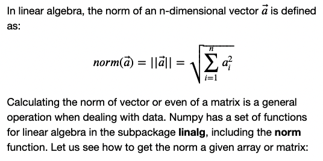</kbd>

     

  
  - nparray1 `=` np.array([1, 2, 3, 4]) # Define an array norm1 `=` \\*np.linalg.norm\\*(nparray1)  nparray2 `=` np.array([[1, 2], [3, 4]]) # Define a 2 x 2 matrix. Note the 2 level of square brackets norm2 `=` \\*np.linalg.norm\\*(nparray2)   print(norm1) print(norm2)  `->` 5.477225575051661 5.477225575051661
     

    
    - Note that without any other parameter, the norm function \\*treats the matrix as being just an array of numbers\\*. However, it is possible to get the norm \\*by rows\\* or by \\*columns\\*. The \\*axis\\* parameter controls the form of the operation:  \\* • `axis=0\\* means` get the norm of each column \\*  • `axis=1\\* means` get the norm of each row.
       

      
      - nparray2 `=` np.array([[1, 1], [2, 2], [3, 3]]) # Define a 3 x 2 matrix.   normByCols `=` np.linalg.norm(nparray2, `\\*axis=0\\*)` # Get the norm for each \\*column\\*. Returns 2 elements normByRows `=` np.linalg.norm(nparray2, `\\*axis=1\\*)` # get the norm for each \\*row\\*. Returns 3 elements  print(normByCols) print(normByRows)  `->` [3.74165739 3.74165739] [1.41421356 2.82842712 4.24264069] 
         

- The dot product between arrays: All the flavors
   

    
    
<kbd>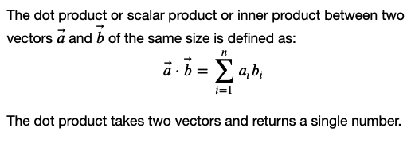</kbd>

     

  
  - nparray1 `=` np.array([0, 1, 2, 3]) # Define an array nparray2 `=` np.array([4, 5, 6, 7]) # Define an array  flavor1 `=` \\*np.dot\\*(nparray1, nparray2) # Recommended way print(flavor1)  flavor2 `=` \\*np.sum\\*(nparray1 * nparray2) # Ok way print(flavor2)  flavor3 `=` nparray1 \\*@\\* nparray2         # Geeks way print(flavor3)  # As you never should do:             # Noobs way flavor4 `=` 0 \\*for\\* a, b in\\* zip(nparray1, nparray2):\\*     flavor4 `+=` a * b      print(flavor4)
     

      
      
<kbd>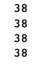</kbd>

       

    
    - \\*We strongly recommend using np.dot, since it is the \\_only method that accepts arrays and lists without problems\\*\\_
       

      
      - norm1 `=` \\*np.dot\\*(np.array([1, 2]), np.array([3, 4])) # Dot product on nparrays norm2 `=` \\*np.dot\\*([1, 2], [3, 4]) # Dot product on python lists  print(norm1, `'=',` norm2 )
         

          
          
<kbd>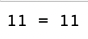</kbd>

           

          
          
<kbd>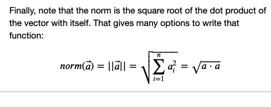</kbd>

           

- Sums by rows or columns
   

  
  - Another general operation performed on matrices is the \\*sum by rows or columns\\*. Just as we did for the function norm, the \\*axis\\* parameter controls the form of the operation:  \\* • `axis=0\\* means` to sum the elements of each column together. \\*  • `axis=1\\* means` to sum the elements of each row together.
     

    
    - nparray2 `=` np.array([[1, `-1],` [2, `-2],` [3, `-3]])` # Define a 3 x 2 matrix.   sumByCols `=` \\*np.sum\\*(nparray2, `axis=0)` # Get the sum for each column. Returns 2 elements sumByRows `=` \\*np.sum\\*(nparray2, `axis=1)` # get the sum for each row. Returns 3 elements  print('Sum by columns: ') print(sumByCols) print('Sum by rows:') print(sumByRows)
       

        
        
<kbd>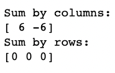</kbd>

         

- Get the mean by rows or columns
   

    
    
<kbd>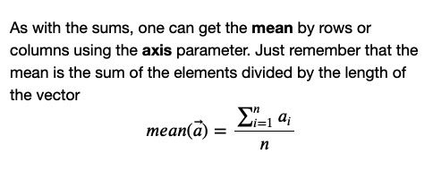</kbd>

     

  
  - nparray2 `=` np.array([[1, `-1],` [2, `-2],` [3, `-3]])` # Define a 3 x 2 matrix. Chosen to be a matrix with 0 mean  mean `=` \\*np.mean\\*(nparray2) # Get the mean for the whole matrix meanByCols `=` \\*np.mean\\*(nparray2, `axis=\\*0\\*)` # Get the mean for each column. Returns 2 elements meanByRows `=` \\*np.mean\\*(nparray2, `axis=\\*1\\*)` # get the mean for each row. Returns 3 elements  print('Matrix mean: ') print(mean) print('Mean by columns: ') print(meanByCols) print('Mean by rows:') print(meanByRows)
     

      
      
<kbd>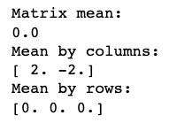</kbd>

       

- Center the columns of a matrix
   

  
  - \\*Centering the attributes\\* of a data matrix is another \\*essential preprocessing step\\*. Centering a matrix means to \\*remove the column mean to each element inside the column\\*. The mean by columns of a centered matrix is always 0.  With NumPy, this process is as simple as this:
     

    
    - nparray2 `=` np.array([[1, 1], [2, 2], [3, 3]]) # Define a 3 x 2 matrix.   nparrayCentered `=` nparray2 `-` \\*np.mean\\*(nparray2, `axis=\\*0\\*)` # \\*Remove the mean for each column \\* print('Original matrix') print(nparray2) print('Centered by columns matrix') print(nparrayCentered)  print('New mean by column') `print(nparrayCentered.mean(axis=0))`
       

        
        
<kbd>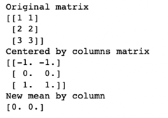</kbd>

         

  
  - \\*Warning\\*: This process \\*does not apply for row centering\\*. In such cases, consider \\*transposing\\* the matrix, \\*centering by columns\\*, and then \\*transpose back the result\\*.  See the example below:
     

    
    - nparray2 `=` np.array([[1, 3], [2, 4], [3, 5]]) # Define a 3 x 2 matrix.   nparrayCentered `=` nparray2\\*.T\\* `-` \\*np.mean\\*(nparray2, `axis=\\*1\\*)` # \\*Remove the mean for each row \\*nparrayCentered `=` nparrayCentered\\*.T\\* # \\*Transpose back \\*the result  print('Original matrix') print(nparray2) print('Centered by rows matrix') print(nparrayCentered)  print('New mean by rows') `print(nparrayCentered.mean(axis=1))`
       

        
        
<kbd>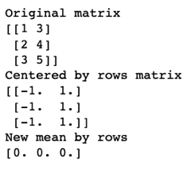</kbd>

         

  
  - Note that some operations can be performed using static functions like \\*np.sum\\*() or \\*np.mean\\*(), or by using the \\*inner functions of the array\\*
     

    
    - nparray2 `=` np.array([[1, 3], [2, 4], [3, 5]]) # Define a 3 x 2 matrix.   mean1 `=` \\*np.mean\\*(nparray2) # Static way mean2 `=` nparray2\\*.mean()\\*   # Dinamic way  print(mean1, ' `==` ', mean2)
      > [!NOTE]
      > Even if they are equivalent, we **recommend
      > the use of the static way** always.

       

        
        
<kbd>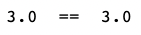</kbd>

         

## Euclidean Distance

 

### 1 \\*Euclidean\\* \\*distance\\* is a \\*similarity metric\\* used to determine \\*how far two

> [!NOTE]
> 1 \**Euclidean\** \**distance\** is a \**similarity metric\** used to determine \**how far two
> points or vectors are from each other.\**
>
> 2 Euclidean distance can be used to calculate the \**distance between two
> document vectors\**, as well as v\**ector spaces in higher dimensions\**.
>
> 3 The formula for Euclidean distance involves finding the horizontal and
> vertical distance squared and adding them together.
>
> 4 The \**Pythagorean theorem\** is used to calculate the Euclidean distance
> between two points.
>
> 5 In \**higher dimensions\**, the Euclidean distance formula is \**the norm of the
> difference between the vectors\** being compared.
>
> 6 The implementation of Euclidean distance in Python can be done using
> the \**linag\** module from NumPy.
>
> 7 The primary takeaway of Euclidean distance is that it can be used to
> determine the \**similarity between two documents or words.\**
>
> 8 The next video will discuss \**cosine\** \**similarity\**, another popular similarity
> function.

 

  
  
<kbd>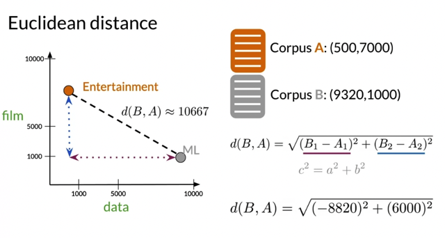</kbd>

  > [!NOTE]
  > Chiều dài đoạn thẳng nối 2 vector.
  > Dễ dàng tính bằng Pythago

   

  
  
<kbd>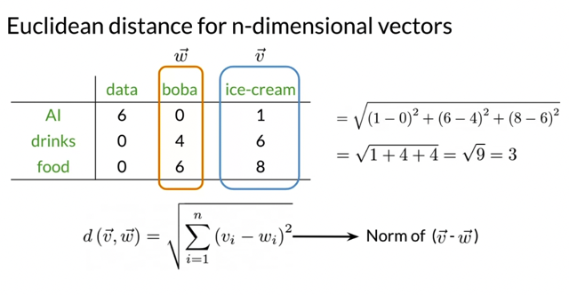</kbd>

  > [!NOTE]
  > Và nó cũng chính là norm của 'hiệu 2 vector'
  >
  > the norm of the difference between the vectors
  >
  > Norm của vector là **sqrt của tổng bình phương các element** của nó
  >
  > Norm ở đây nói chọn chứ đúng phải nói rõ ra là **L2 norm**, còn đv L1 norm thì
  > (không sqrt) tổng các  absolute value các element
  >
  > Công thức chung là Ln norm `=` (a1**n `+` a2**n `+` ...)** `(1/n)`

   

  
  
<kbd>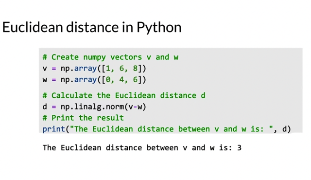</kbd>

  > [!NOTE]
  > Để tính (L2) norm trong Python
  > thì dùng **np.linalg.norm**

   

  
  
<kbd>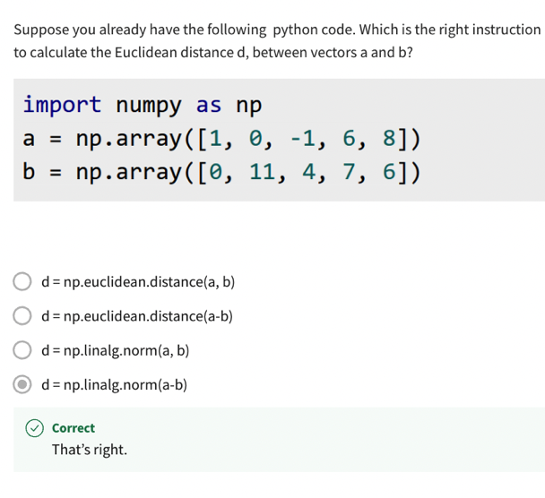</kbd>

   

  
  
<kbd>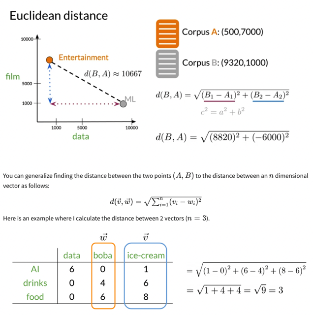</kbd>

   

## Cosine Similarity: Intuition

 

### 1 Introduction to \\*cosine similarity\\* as a \\*similarity metric\\* for comparing \\*vector

> [!NOTE]
> 1 Introduction to \**cosine similarity\** as a \**similarity metric\** for comparing \**vector
> representations.\**
>
> 2 The \**problem of using Euclidean distance\** to compare vector
> representations of documents or corpora.
>
> 3 Example of how the Euclidean distance can be \**problematic\** in comparing
> \**different sized corpora.\**
>
> 4 The use of \**cosine\** \**similarity\** as a \**better proxy\** for \**similarity between vector\**
> representations than Euclidean distance.
>
> 5 Explanation of the main \**advantage\** of cosine similarity over Euclidean
> distance.
>
> 6 The intuition behind the use of cosine similarity as a metric to compare
> the \**similarity between two vector representations.\**
>
> 7 Advantages of cosine similarity when comparing documents of \**different
> sizes.\**
>
> 8 The opportunity to learn how to calculate cosine similarity.

 

  
  
<kbd>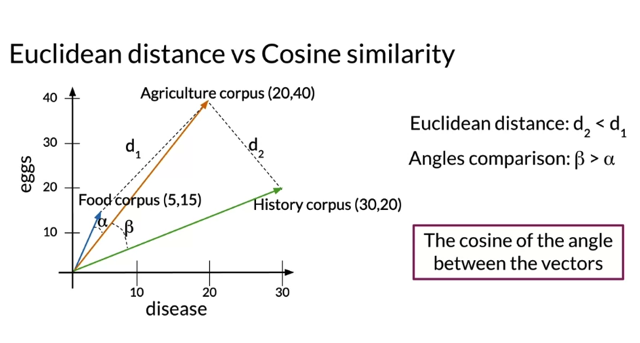</kbd>

  > [!NOTE]
  > Đại khái là **vấn đề với Euclidean** là nếu **chiều dài vector khác nhau nhiều**
  > (corpus nhỏ `-` bộ từ trong 1 lĩnh vực đại khái vậy) thì **khoảng cách vector
  > không phản ánh đúng độ giống giữa 2 vector** ví dụ Foot và Agriculture do
  > chênh lệch kích thước corpus mà thành ra xa nhau hơn là Agriculture với
  > History nếu đo bằng Euclidean (d1 > d2)
  >
  > Dùng hàm **cosine** **góc giữa 2 vector càng nhỏ** thì **chúng càng giống nhau**sẽ **nắm bắt tốt hơn sự giống nhau giữa các vector (alpha < beta)**

   

  
  
<kbd>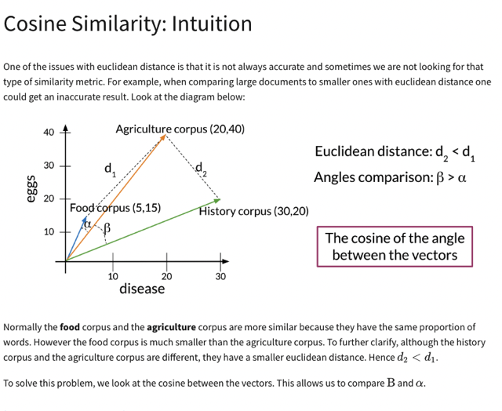</kbd>

   

## Cosine Similarity

 

### 1 The video teaches how to compute the \\*dot product\\* and \\*norm

> [!NOTE]
> 1 The video teaches how to compute the \**dot product\** and \**norm
> of vectors\** to calculate the cosine similarity score.
>
> 2 The \**cosine similarity\** score measures the \**similarity of the
> directions of two vectors.\**
>
> 3 The \**cosine similarity\** takes values \**between 0 and 1\** for the
> vector spaces seen so far.
>
> 4 The \**closer the cosine similarity score is to 1\**, the \**more similar
> the vectors' directions are\**.
>
> 5 A \**cosine similarity score of 1\** indicates \**identical vectors,\** while
> a score of \**0 indicates orthogonal vectors.\**
>
> 6 \**Similar vectors\** have \**higher cosine similarity scores\**.

 

  
  
<kbd>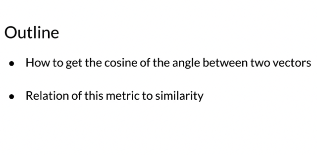</kbd>

   

  
  
<kbd>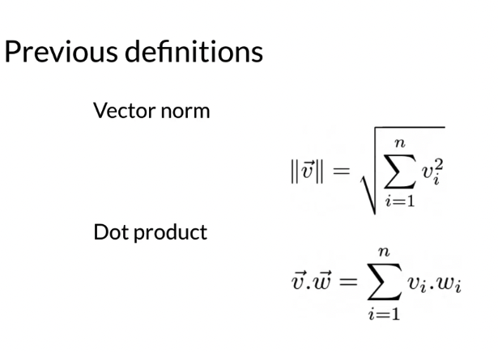</kbd>

  > [!NOTE]
  > Ôn lại ha khái niệm
  > **norm** và **dot product**

   

  
  
<kbd>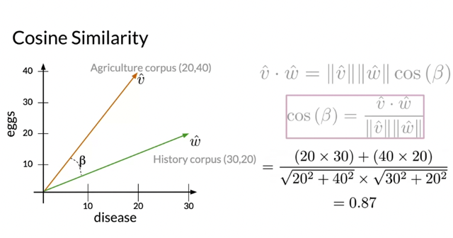</kbd>

  > [!NOTE]
  > Công thức nó vầy rảnh
  > thì chứng minh lại

   

  
  
<kbd>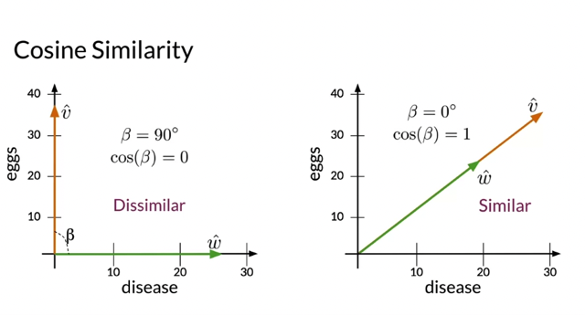</kbd>

  > [!NOTE]
  > Đại khái là rất dễ hiểu tại sao lại dùng cosine làm thước đó đơn giản vì
  > cosine giữa chúng càng lớn, 2 vector càng cùng hướng `->` mà max
  > cosine là 1 thì 2 véctơ trùng hướng luôn còn ngược lại thì cosine càng
  > nhỏ thì 2 thằng càng khác hướng nhau mà min khi hai vector vuông góc
  > gọi là **maximum dissimilar**. Nên cosine là thước đo tốt cho độ **direction
  > similarity của 2 vectors, cosine càng lớn thì 2 thằng càng giống**

   

  
  
<kbd>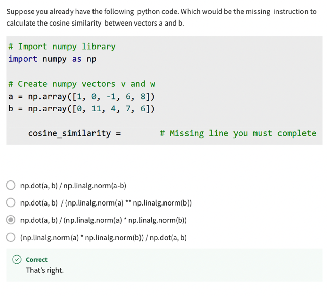</kbd>

   

## Manipulating Words In Vector Sapces

 

### 1 Introduction: The video teaches how to \\*manipulate vectors\\* to \\*predict the capital city of a

> [!NOTE]
> 1 Introduction: The video teaches how to \**manipulate vectors\** to \**predict the capital city of a
> country.\**
>
> 2 \**Manipulating vector \**representations: \**Vector algebra\** can be used to infer\**unknown
> relationships among words.\**
>
> 3 Finding \**relationship between vectors\**: Find the \**difference between the vectors \**of two related
> entities to determine \**how many units on each dimension to move to find other related entities.\**
>
> 4 Predicting capital of Russia: Adding the vector of Russia with the previously calculated vector
> will give the vector representation of its capital.
>
> 5 Finding the \**closest representation\**: \**Compare the vector representations of all possible cities\**
> with the vector representation obtained above \**using Euclidean distances\** or \**cosine similarities\**
> to d\**etermine the most similar city\**.
>
> 6 Importance of vector space: The process \**can only be done in a vector space\** that c\**aptures
> the relative meaning of words\**.
>
> 7 \**Clustering\** of vectors: The vectors of \**words that occur in similar places in a sentence \**will be
> encoded in a \**similar\** way.
>
> 8 \**Identifying patterns:\** Take advantage of the consistency encoding to identify patterns, such as
> finding the closest words to a given word by computing cosine similarity.
>
> 9 Plotting `d-dimensional` vectors on a 2D plane: Learn how to plot vectors on a 2D plane in the
> next video.

 

  
  
<kbd>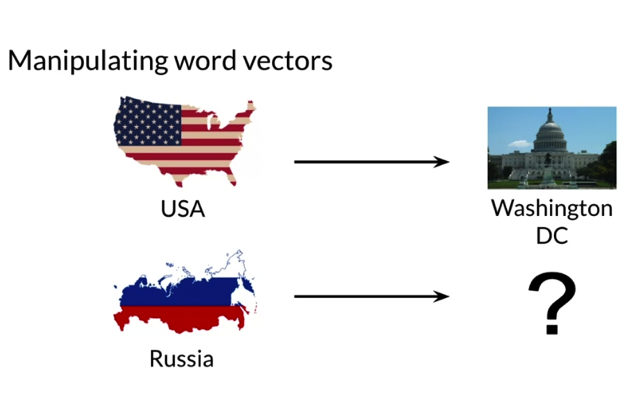</kbd>

   

  
  
<kbd>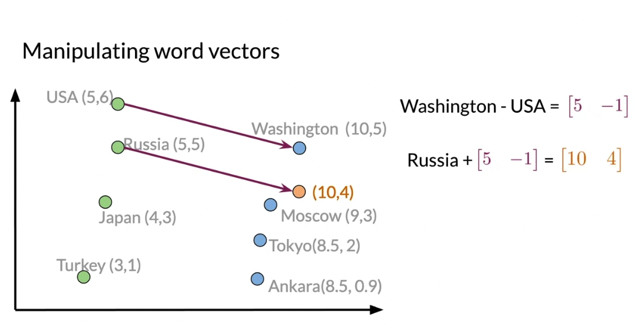</kbd>

  > [!NOTE]
  > Đại khái là nếu ta biết  WD là thủ đô USA thì **chiều của vector WD `-` USA** cho ta biết
  > **mối quan hệ của vector (encoded cho) nước và (encoded vector của) thủ đô phải
  > như thế nào**
  >
  > Từ đó nếu có encoded vector của nước khác như **Russian** thì ta sẽ **predict** được
  > en**coded vector của thủ đô của nó** dựa theo quan hệ của **WD-USA**
  >
  > Và khi chọn ra cái gần nhất `-` giống nhất (dựa trên metric cosine similarity hoặc
  > Euclidean distance) với cái predict trong số các thủ đô thì ta sẽ thấy **Moscow** là gần
  > nhất.
  >
  > Và tính sai lệch giữa predicted capital of Russia và actual (Moscow) bằng Euclidean
  > distance hoặc Cosine similarity

   

  
  
<kbd>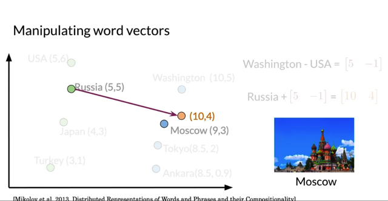</kbd>

   

  
  
<kbd>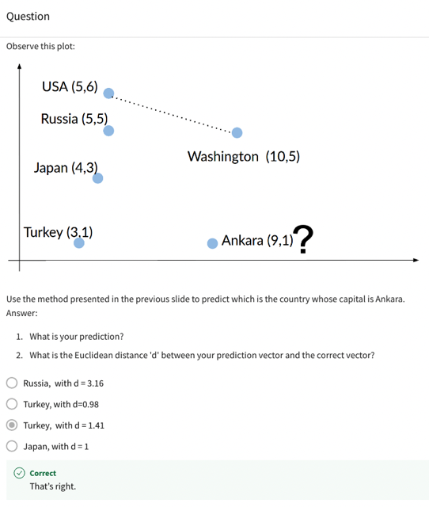</kbd>

  > [!NOTE]
  > Turkey (3,1) `+` (5, `-1)` `=` Predicted Capital: (8, 0)
  >
  > Actual (Ankara): (9,1)
  >
  > `->` Euclidean distance `=` norm of (predicted `-` actual) 
  >  square root of { (8-9)**2 `+` (0-1)**2 } `=` sqrt(2) `=` 1.41

   

  
  
<kbd></kbd>

  > [!NOTE]
  > Đại khái là với 1 không gian vector kiểu như các từ đều được
  > encoded thì các quan hệ giữa các từ gần nhau đã biết sẽ có thể
  > cho phép ta đưa ra những dự đoán

   

## Manipulating Word Embeddings

 

### Manipulating word embeddings

 

- In this week's assignment, you are going to use a `\\*pre-trained` word embedding\\* for finding word analogies and equivalence. This exercise can be used as an \\*Intrinsic Evaluation\\* for the word embedding performance. In this notebook, you will apply linear algebra operations using NumPy to find analogies between words manually. This will help you to prepare for this week's assignment.
  > [!NOTE]
  > Đại khái nói sẽ dùng 1 `pre-trained` word embedding để xem thử và từ
  > đó hiểu được ý nghĩa của việc tạo các word embedding vector trong
  > việc khắc hoạ được ý nghĩ và mối quan hệ của nó với các từ khác

   

  
  - import pandas as pd # Library for Dataframes  import numpy as np # Library for math functions import pickle # Python object serialization library. Not secure  `\\*word_embeddings\\*` `=` pickle.load( open( `"./data/word_embeddings_subset.p",` "rb" ) ) `len(word_embeddings)` # there should be 243 words that will be used in this assignment
     

- Now that the model is loaded, we can take a look at the word representations. First, note that `\\*word_embeddings\\*` is a Agriculture. Each word is the key to the entry, and the value is its corresponding vector presentation. Remember that \\*square brackets\\* allow access to any entry if the key exists.
   

  
  - countryVector `=` `word_embeddings\\*['country']\\*` # Get the \\*vector representation\\* for the word '\\*country\\*' print(type(countryVector)) # Print the type of the vector. Note it is a numpy array print(countryVector) # Print the values of the vector.
     

- It is important to note that we store each vector as a NumPy array. It allows us to use the linear algebra operations on it.  The vectors have a size of \\*300\\*, while the vocabulary size of Google News is around \\*3 million word\\*s!
   

  
  - #Get the vector for a given word: def vec(w):     return `word_embeddings[w]`
     

### Operating on word

> [!NOTE]
> Operating on word
> embeddings

 

- Remember that \\*understanding the data\\* is one of the \\*most critical steps \\*in Data Science.\\* Word embeddings\\* are the result of \\*machine learning processe\\*s and will be part of the input for further processes. These word embedding needs to be \\*validated\\* or at least \\*understood\\* because the performance of the derived model will strongly depend on its quality.  Word embeddings are \\*multidimensional arrays\\*, usually with \\*hundreds of attributes\\* that pose a challenge for its interpretation.  In this notebook, we will \\*visually inspect\\* the \\*word embedding\\* of some words using a \\*pair of attributes\\*. Raw attributes are not the best option for the creation of such charts but will allow us to illustrate the mechanical part in Python.  In the next cell, we make a beautiful \\*plot\\* for the \\*word embeddings of some words\\*. Even if plotting the dots gives an idea of the words, the arrow representations help to visualize the vector's alignment as well.
  > [!NOTE]
  > Đại khái là word embedding vector thường có hàng trăm
  > `unit/feature/attribute/(dimension)` là kết quả của một quá trình
  > ML training (để tìm ra `/` khắc hoạ ra nghĩa, quan hệ của nó đv
  > các từ khác trong không gian từ vựng) nhưng ở đây ta sẽ dùng
  > 2 attributes để plot

   

  
  - import matplotlib.pyplot as plt # Import matplotlib %matplotlib inline  words `=` ['oil', 'gas', 'happy', 'sad', 'city', 'town', 'village', 'country', 'continent', 'petroleum', 'joyful']  bag2d `=` np.array([vec(word) for word in words]) # \\*Convert each word to its vector representatio\\*n  fig, ax `=` plt.subplots(figsize `=` (10, 10)) # Create custom size image  \\*col1 `=` 3 \\*# \\*Select the column\\* for the x axis col2 `=` \\*2\\* # \\*Select the column\\* for the y axis  # Print an arrow for each word for word in bag2d:     ax.arrow(0, 0, word[col1], word[col2], `head_width=0.005,` `head_length=0.005,` `fc='r',` `ec='r',` width `=` `1e-5)`       ax\\*.scatter\\*(bag2d[:, col1], bag2d[:, col2]); # Plot a dot for each word  # Add the word label over each dot in the scatter plot for I in range(0, len(words)):     ax.annotate(words[I], (bag2d[I, col1], bag2d[I, col2]))   plt.show()
    > [!NOTE]
    > Đại khái là **chọn vài từ** rồi tạo (lấy ra từ `word_embedding` dictionary) **representation
    > vectors** xong **chọn 2 attribute `/` feature** trong hàng trăm (**300) features** của nó để plot

     

      
      
<kbd></kbd>

      > [!NOTE]
      > Note that **similar words** like '**village**' and '**town**' or '**petroleum**', '**oil**', and 'gas'
      > tend to point in the same direction. Also, note that**'sad' and 'happy' looks
      > close to each other; however, the vectors point in opposite directions**.
      >
      > In this chart, one can figure out the **angles** and **distances** between the
      > words. Some words are close in both kinds of distance metrics.

      > [!NOTE]
      > Nhận xét thấy các từ mà ta hiểu nghĩa gần nhau (về
      > bối cảnh như sad, happy là đều về emotion, village &
      > town) thật sự xuất hiện gần nhau trên plot.
      >
      > Nhưng hướng của chúng lại thể hiện sự tương quan về ý nghĩa
      > của từ, sad với happy đi hai hướng có góc gần với 90 thể hiện
      > chúng đối nghĩa nhau

       

### Word distance

 

- Now \\*plot\\* the words '\\*sad\\*', '\\*happy\\*', '\\*town\\*', and '\\*village\\*'. In this same chart, \\*display the vector from 'village' to 'town'\\* and the \\*vector from 'sad' to 'happy'\\*. Let us use NumPy for these linear algebra operations.
   

  
  - words `=` ['sad', 'happy', 'town', 'village']  bag2d `=` np.array([vec(word) for word in words]) # Convert each word to its vector representation  fig, ax `=` plt.subplots(figsize `=` (10, 10)) # Create custom size image  col1 `=` 3 # Select the column for the x axe col2 `=` 2 # Select the column for the y axe  # Print an arrow for each word for word in bag2d:     ax.arrow(0, 0, word[col1], word[col2], `head_width=0.0005,` `head_length=0.0005,` `fc='r',` `ec='r',` width `=` `1e-5)`      # print the vector difference between village and town village `=` vec('village') town `=` vec('town') diff `=` town `-` village ax.arrow(village[col1], village[col2], diff[col1], diff[col2], `fc='b',` `ec='b',` width `=` `1e-5)`  # print the vector difference between village and town sad `=` vec('sad') happy `=` vec('happy') diff `=` happy `-` sad ax.arrow(sad[col1], sad[col2], diff[col1], diff[col2], `fc='b',` `ec='b',` width `=` `1e-5)`   ax.scatter(bag2d[:, col1], bag2d[:, col2]); # Plot a dot for each word  # Add the word label over each dot in the scatter plot for I in range(0, len(words)):     ax.annotate(words[I], (bag2d[I, col1], bag2d[I, col2]))   plt.show() 
     

      
      
<kbd></kbd>

      > [!NOTE]
      > Sad và happy giống như vuông góc biểu thị
      > quan hệ hoàn toàn trái ngược, vilage với
      > town có vẻ cùng hướng hơn

       

### Linear algebra on

> [!NOTE]
> Linear algebra on
> word embeddings

 

- print(\\*np.linalg.norm\\*(vec('town'))) # Print the norm of the word town print(\\*np.linalg.norm\\*(vec('sad'))) # Print the norm of the word sad  2.3858097 2.9004838
  > [!NOTE]
  > In the lectures, we saw the analogies between words using
  > **algebra** on word embeddings. Let us see how to do it in
  > Python with Numpy.
  >
  > To start, get the norm of a word in the word embedding.

   

### Predicting capitals

 

- Now, applying v\\*ector difference\\* and \\*addition\\*, one can create a \\*vector representation for a new word\\*. For example, we can say that the \\*vector difference between 'France' and 'Paris\\*' represents the \\*concept of Capital.\\*  One can move from the city of Madrid in the direction of the concept of Capital, and obtain something close to the corresponding country to which Madrid is the Capital.
  > [!NOTE]
  > **Hiệu hai vector France và Paris** sẽ đại diện cho **khái
  > niệm thủ đô**. Thử tìm từ nào mà hợp với Madrid để
  > tạo vector cùng chiều với vector đại diện cho khái
  > niệm thủ đô này

   

  
  - Capital `=` vec('France') `-` vec('Paris') Country `=` vec('Madrid') `+` capital  print(country[0:5]) # Print the first 5 values of the vector  `->[-0.02905273` `-0.2475586`   0.53952026  0.20581055 `-0.14862823]` 
    > [!NOTE]
    > Tính ra vector của từ dự
    > đoán sẽ là Spain này

     

    
    - Diff `=` country `-` vec('Spain') print(diff[0:10])  `[-0.06054688` `-0.06494141`  0.37643433  0.08129883 `-0.13007355` `-0.00952148`  `-0.03417969` `-0.00708008`  0.09790039 `-0.01867676]` 
      > [!NOTE]
      > We can observe that the vector 'country' that
      > we expected to be the same as the vector
      > for Spain is n**ot exactly it**.

      > [!NOTE]
      > Thì thấy nó không trùng khớp với
      > Spain (different khác 0)

       

      
      - # Create a dataframe out of the dictionary embedding. This facilitate the algebraic operations keys `=` `word_embeddings.keys()` data `=` [] for key in keys:     `data.append(word_embeddings[key])`  embedding `=` `pd.\\*DataFrame\\*(data=data,` `index=keys)` # Define a function to find the closest word to a vector: def `find_closest_word(v,` k `=` 1):     # Calculate the vector difference from each word to the input vector     diff `=` embedding.values `-` v      # Get the squared L2 norm of each difference vector.     # It means the squared euclidean distance from each word to the input vector     delta `=` np.sum(diff * diff, `axis=1)`     # Find the index of the minimun distance in the array     I `=` np.argmin(delta)     # Return the row name for this item     return embedding.iloc[I].name 
        > [!NOTE]
        > So, we have to **look for the closest words** in the embedding that
        > matches the candidate country. If the word embedding works as
        > expected, the most similar word must be 'Spain'. Let us define a
        > function that helps us to do it. We will store our word embedding as a
        > DataFrame, which facilitate the lookup operations based on the
        > numerical vectors.

        > [!NOTE]
        > Nên thử tìm **từ gần nhấ**t với từ này
        > trong data xem sao, ổng cho sẵn 1
        > hàm **find_closest_word**

         

          
          
<kbd></kbd>

          > [!NOTE]
          > Thì tuy không ra chính xác Spain
          > nhưng từ Spain là**từ 'gần nhất'** với
          > vector từ prediction này

           

### Predicting other Countries

 

  
  
<kbd></kbd>

  > [!NOTE]
  > Đại khái là thử với các quan hệ khác tìm từ mà quan hệ của nó với
  > Madrid gần với quan hệ giữa Italy và Rome nhất sẽ ra Spain

   

### Represent a sentence as a vector

 

  
  
<kbd></kbd>

  > [!NOTE]
  > Đại khái là represented vector của 1
  > **sentence** là **sum của các word vector**

   

  
  
<kbd></kbd>

   

## Visualization And Pca

 

### 1 Introduction to the \\*problem\\* of `\\*high-dimensional` vectors\\* and the

> [!NOTE]
> 1 Introduction to the \**problem\** of \**high-dimensional vectors\** and the
> need for \**dimensionality reduction\** for \**visualization\**.
>
> 2 Explanation of \**principal component analysi\**s (\**PCA\**) and how it can
> be used to \**reduce the dimension \**of \**vector representations.\**
>
> 3 Motivation for visualizing vector representations of words and using PCA
> to \**identify relationships among words\**.
>
> 4 Process of performing PCA on data to \**obtain uncorrelated features\**
> and \**projecting data to a lower dimensional space.\**
>
> 5 Importance of \**retaining as much information as possible\** during the
> dimensionality reduction process.
>
> 6 Review of the main ideas discussed, including the use of PCA for
> \**visualizing data\** and \**transforming `high-dimensional` vectors\** into\**two
> dimensions\** for \**plotting\**.

 

  
  
<kbd></kbd>

   

  
  
<kbd></kbd>

  > [!NOTE]
  > Đại khái là với high dimension vector thì làm sao visualize ra mà
  > xem khi mà nó có nhiều hơn 2 feature

   

  
  
<kbd></kbd>

  > [!NOTE]
  > Giải pháp như đã quá biết là dùng Principal Component Analysis để
  > giảm từ nhiều dimension xuống còn 2 hay 3 features mà giữ tối đa thông
  > tin để từ đó có thể plot trên không gian 2d hay 3d

   

  
  
<kbd></kbd>

   

  
  
<kbd></kbd>

   

  
  
<kbd></kbd>

  > [!NOTE]
  > Một điểm chú ý mà có thể những bài giảng về PCA trước có nói nhưng không
  > để ý là '**uncorrelated features**', nhưng ở đây cũng chưa nói rõ tại sao hoặc là cái gì

   

  
  
<kbd></kbd>

  
<kbd></kbd>

  
<kbd></kbd>

  > [!NOTE]
  > Một số training algorithm khi learn words họ dùng cách identifying
  > neighboring words nên encoding words vector với similar POS thường
  > sẽ plot ra gần nhau
  >
  > Câu hỏi gợi mở là tại sao sad và joyful mang nghĩa trái ngược cùng gần
  > nhau? `->` Tại vì không gian ngữ cảnh của nó gần nhau cũng tính chất emotion

   

## Pca Algorithm

 

### 1 Introduction to \\*reducing the dimension of features \\*using \\*Eigenvalues\\* and

> [!NOTE]
> 1 Introduction to \**reducing the dimension of features \**using \**Eigenvalues\** and
> \**Eigenvectors\**
>
> 2 Process for dimensionality reduction using \**PCA\**, including obtaining
> \**uncorrelated features\**, \**normalizing data\**, and performing \**singular value
> decomposition\**
>
> 3 Obtaining \**Eigenvectors\** and \**Eigenvalues\** from the \**co-variance matrix\** of
> \**normalized data\** for PCA
>
> 4 \**Projecting data onto a new vector space\** using Eigenvectors and Eigenvalue
>
> 5 Importance of organizing \**Eigenvectors\** and \**Eigenvalues\** in \**descending order\**
> to r\**etain information\**
>
> 6 Implementation of \**PCA\** in a \**programming library\** and its use in visualizing
> word representations
>
> 7 Future topic of learning about \**vector spaces\** and building a simple \**machine
> translation\** system

 

  
  
<kbd></kbd>

   

  
  
<kbd></kbd>

  > [!NOTE]
  > **Eigenvector**: the resulting vectors, also known as the **uncorrelated** **features** of
  > your data
  >
  > **Eigenvalue**: the **amount of information retained by each new feature**. You can
  > think of it as the **variance** in the eigenvector.
  >
  > Also each **eigenvalue** has a **corresponding eigenvector**. The eigenvalue tells you
  > **how much variance there is in the eigenvector.** Here are the steps required to
  > compute PCA:

   

  
  
<kbd></kbd>

  > [!NOTE]
  > Cái này có thể mới hoặc đã học mà ko để ý là **eigenvector** là các
  > **unrelated features** còn **eigenvalue** là phần thông tin **retained** by each
  > feature

   

  
  
<kbd></kbd>

  > [!NOTE]
  > Cách tính như vầy, nhưng ổng nói khỏi lo
  > có lib tính giùm hiểu là được

   

  
  
<kbd></kbd>

  > [!NOTE]
  > Thực hiện việc project tức là tính ra bộ data mới X' (ít feature hơn X) bằng cách
  > dot product X với **matrix U lấy 2 cột đầu** **thôi** `=` 2 uncorrelated vector chứa
  > nhiều thông tin nhất  (vì đang reduce về 2D mà, nếu về 3D thì lấy 3)
  >
  > Thì tính thử percentage of **retained variance** bằng tỉ lệ của 2 thằng đầu tiên
  > trong đường chéo của matrix S (Sum `S00+S11)` và tổng các value trên đường
  > chéo (Sum `S00+S11+..Sdd)`
  >
  > Ôn lại lại, matrix **U** là **eigenvector**, sẽ có **D cột** biểu thị cho  D feature
  > (những đã chuyển thành D **uncorrelated feature**)  hay D dimension ban đầu,
  > bây giờ muốn g**iảm xuống D' < D dimension thì lấy D' cột đầu thôi** và tương
  > ứng với nó sẽ bị mất thông tin
  >
  > Again do đã học qua PCA ở ML Spec nên biết mấy cái này cũng  không khó.

   

  
  
<kbd></kbd>

  > [!NOTE]
  > Đại khái là Eigenvector sẽ đại diện cho các
  > **uncorrelated feature**, kiểu như SVD nó sẽ phân tích
  > bộ data ban đầu với D feature (correlated) để tách
  > thành D cái uncorrelated feature

   

## Another Explanation About Pca

> [!NOTE]
> Một số cái không hiểu, quay lại sau

 

### Another explanation about PCA

 

- In this lab, we are going to view another explanation about Principal Component Analysis(PCA). PCA is a \\*statistical technique\\* invented in 1901 by Karl Pearson that uses orthogonal transformations to \\*map a set of variables\\* into a set of \\*linearly uncorrelated variables\\* called \\*Principal Components.\\*  PCA is based on the \\*Singular Value Decomposition (SVD) \\*of the \\*Covariance Matrix\\* of the original dataset. The \\*Eigenvectors\\* of such decomposition are used as a \\*rotation matrix\\*. The \\*Eigenvectors are arranged in the rotation matrix in decreasing order according to its explained variance\\*. This last term is related to the \\*EigenValues\\* of the SVD.  PCA is a potent technique with applications ranging from \\*simple space transformation\\*, \\*dimensionality reduction\\*, and mixture separation from spectral information.  Follow this lab to view \\*another explanation for PCA\\*. In this case, we are going to use the concept of \\*rotation matrices\\* applied to \\*correlated random data\\*, just as illustrated in the next picture.
  > [!NOTE]
  > `\/"The` **Eigenvectors are arranged in the rotation matrix in decreasing order
  > according to its explained variance**." `\/`
  >
  > `->À` như vậy **rotation matrix** chính là **matrix U** đó mà **mỗi cột là một
  > Eigenvector** sắp theo **thứ tự giảm dần của explained variance** cũng là cái có
  > liên quan đến **Eigenvalue**
  >
  > Hiểu thêm `/` mới rằng đại khái là từ **D feature** ban đầu của **X**, phép **SVD**
  > sẽ map data thành **D unrelated new features** mỗi features được **đại diện bằng
  > 1 Eigenvector** theo thứ tự từ cái có e**xplained variance lớn nhất tới nhỏ nhất**.
  > Để từ đó muốn giảm xuống (d**imensionality reduction**) còn **K < D** feature thì
  > tính bằng cách nhân **X với K Eigenvector đầu thôi**Và PCA có nhiều ứng dụng mà ở đây sẽ **giải thích một cách khác**về PCA

   

    
    
<kbd></kbd>

     

  
  - import numpy as np                         # Linear algebra library import matplotlib.pyplot as plt            # library for visualization from \\*sklearn.decomposition\\* import \\*PCA\\*      # PCA library import pandas as pd                        # Data frame library import math                                # Library for math functions import random                              # Library for pseudo random numbers
     

    
    - np.random.seed(1) n `=` 1  # The amount of the correlation x `=` np.random.uniform(1,2,1000) # Generate 1000 samples from a uniform random variable y `=` x.copy() * n # Make y `=` n * x  # PCA works better if the data is centered \\*x `=` x `-` np.mean(x)\\* # \\*Center x\\*. Remove its mean \\*y `=` y `-` np.mean(y)\\* # \\*Center y\\*. Remove its mean  data `=` \\*pd.DataFrame\\*({'x': x, 'y': y}) # \\*Create a data frame with x and y\\* plt.\\*scatter\\*(data.x, data.y) # Plot the original correlated data in blue  pca `=` `\\*PCA\\*(\\*n_components=2\\*)` # \\*Instantiate a PCA\\*. Choose to get 2 output variables  # Create the\\* transformation model for this data\\*. \\*Internally\\*, it gets the \\*rotation\\*  # \\*matrix\\* and the\\* explained variance\\* pcaTr `=` pca.\\*fit\\*(data)  rotatedData `=` pcaTr.\\*transform(data)\\* # \\*Transform the data\\* base on the \\*rotation matrix\\* of pcaTr   # # \\*Create a data frame\\* with the \\*new variables\\*. We call these new variables \\*PC1\\* and \\*PC2\\* dataPCA `=` pd.DataFrame(\\*data `=` rotatedData\\*, \\*columns `=` ['PC1', 'PC2']\\*)   # Plot the transformed data in orange plt.\\*scatter\\*(\\*dataPCA.PC1\\*, \\*dataPCA.PC2\\*) plt.show()
      > [!NOTE]
      > To start, let us consider a pair of random variables x, y.
      > Consider the base case when **y `=` n * x**. The x and y
      > variables will be **perfectly correlated to each other** since
      > **y is just a scaling of x**.

      > [!NOTE]
      > Tóm tắt lại cái này, rất đơn giản
      >
      > Ổng tạo bộ dataset với x random và, y `=` 1*x
      >
      > Đầu tiên PCA để work tốt hơn thì làm động tác centerlized data X,
      > Y bằng cách trừ x cho mean x tức với mỗi dataset x(i), trừ từng
      > feature x1 `-` mu1 (mean của feature 1), x2 `-` mu2 (mean feature 2).
      > Bước này như khi normalizing thì thêm chia cho variance nữa thôi.
      >
      > Kế là tạo PCA model bằng `Scikit-Learn` với **n_compoent** là 2
      >
      > Xong dùng function fit để được pcaTr (PCA transformation) và
      > transform để ..transform X.
      >
      > Và trong cái pcaTr này sẽ có **rotation matrix** và **explained
      > variance**lưu trong**pcaTr.components_ và pcaTr.explained_variance_**
      >
      > kết quả ra rotatedData sẽ có 2 feature mới dùng pandas.
      > DataFrame để tạo lại DataFrame đặt column (feature name) là
      > PCA1, PCA2

       

        
        
<kbd></kbd>

         

### Understanding the

> [!NOTE]
> Understanding the
> transformation model pcaTr

 

- As mentioned before, a \\*PCA model\\* is composed of a \\*rotation matrix \\*and its \\*corresponding explained variance\\*. In the next module, we will explain the details of the rotation matrices.  \\*pcaTr.components_\\* has the \\*rotation matrix\\*  `\\*pcaTr.explained_variance_\\*` has the \\*explained variance\\* of each \\*principal component\\*
   

  
  - print('Eigenvectors or principal component: First row must be in the direction of [1, n]') print(pcaTr.\\*components_\\*)  print() print('Eigenvalues or explained variance') `print(pcaTr.\\*explained_variance_\\*)`
    
<kbd></kbd>

    
<kbd></kbd>

    > [!NOTE]
    > Nó nói First row must be in direction
    > of [1, n] là sao không hiểu?

     

      
      
<kbd></kbd>

      > [!NOTE]
      > Hoàn toàn không hiểu

       

### Correlated Normal

> [!NOTE]
> Correlated Normal
> Random Variables.

 

- Now, we will use a \\*controlled dataset\\* composed of \\*2 random variables\\* with \\*different variances\\* and with a \\*specific Covariance\\* among them. The only way I know to get such a dataset is, first, create two \\*independent Normal random variables\\* with the \\*desired variances\\* and then \\*combine\\* them using a \\*rotation matrix\\*. In this way, the new resulting variables will be a linear combination of the original random variables and thus be dependent and correlated.
   

  
  - import matplotlib.lines as mlines import matplotlib.transforms as mtransforms  np.random.seed(100)  std1 `=` 1     # The \\*desired standard deviation\\* of our first random variable std2 `=` 0.333 # The d\\*esired standard deviation\\* of our second random variable  x `=` np.\\*random.normal\\*(0, \\*std1\\*, 1000) # \\*Get 1000 samples from x ~ N(0, std1)\\* y `=` np.\\*random.normal\\*(0, std2, 1000)  # \\*Get 1000 samples from y ~ N(0, std2)\\* #y `=` y `+` np.random.normal(0,1,1000)*noiseLevel * np.sin(0.78)  # PCA works better if the data is centered x `=` x `-` \\*np.mean(x)\\* # \\*Center x\\*  y `=` y `-` \\*np.mean(y)\\* # \\*Center y \\* #Define a pair of dependent variables with a desired amount of covariance n `=` 1 # Magnitude of covariance.  angle `=` \\*np.arctan\\*(\\*1 `/` n)\\* # Convert the covariance to and angle print('angle: ',  angle * 180 `/` math.pi)  # Create a \\*rotation matrix\\* using the given angle \\*rotationMatrix\\* `=` np.array([[np.\\*cos(angle)\\*, np.\\*sin(angle)\\*],                  `[-np.\\*sin(angle)\\*,` np.\\*cos(angle)\\*]])   print('rotationMatrix') print(rotationMatrix)  xy `=` np.concatenate(([x] , [y]), `axis=0).T` # Create a matrix with columns x and y  # \\*Transform the data using the rotation matrix\\*. It correlates the two variables data `=` \\*np.dot(xy, rotationMatrix)\\* # Return a nD array  # Print the rotated data plt.scatter(data[:,0], data[:,1]) plt.show()
    > [!NOTE]
    > đại khái là nó đang muốn tạo
    > một bộ data randomly nhưng (distribution sao cho) với
    > standard deviation là 1 cho x và 0.333 cho y.

     

      
      
<kbd></kbd>

      🔗 **Related:** [THE ROTATION MATRIX](the_rotation_matrix.md#node-538)

      > [!NOTE]
      > Sau khi đọc Rotation Matrix có thể hiểu khúc này. Rất
      > đơn giản vì hệ số góc của y `=` x là 1 (y `=` 1*x) nên tan `=`
      > 1, từ đó tìm ra lại góc bằng bao nhiêu thôi dùng hàm
      > arctan `->` angle là 45 đó
      >
      > Rồi ổng tạo Rotation Matrix với góc beta 45 độ này theo công thức 
      > của case xoay ngược chiều kim đồng hồ

       

      
      
<kbd></kbd>

      > [!NOTE]
      > Sau khi đọc **Rotation Matrix** có thể hiểu tiếp là nhân
      > rotation matrix với vector để xoay vector qua 1 góc
      > beta ở đây là 45 (ở đây đúng hơn xoay 1000 cái
      > vector `-` xy là matrix (1000,2) được tạo thành bỏi câu
      > concate hai vector x và y đó)

       

      
      
<kbd></kbd>

       

    
    - plt.scatter(data[:,0], data[:,1]) # Print the original data in blue  # Apply PCA. \\*In theory, the Eigenvector matrix must be the  \\*# \\*inverse of the original rotationMatrix\\*.  pca `=` `PCA(n_components=2)`  # Instantiate a PCA. Choose to get 2 output variables  # Create the transformation model for this data. Internally it gets the rotation  # matrix and the explained variance pcaTr `=` pca.\\*fit\\*(data)  # Create an array with the transformed data \\*dataPCA\\* `=` pcaTr.\\*transform\\*(data)  print('Eigenvectors or principal component: First row must be in the direction of [1, n]') print(pcaTr.components_)  print() print('Eigenvalues or explained variance') `print(pcaTr.explained_variance_)`  # Print the rotated data \\*plt.scatter(dataPCA[:,0], dataPCA[:,1])\\*  # Plot the\\* first component axe\\*. Use the \\*explained variance to scale the vector\\* plt.plot([0, rotationMatrix[0][0] * std1 * 3], [0, rotationMatrix[0][1] * std1 * 3], `'k-',` `color=\\*'red\\*')` # Plot the \\*second component axe\\*. Use the \\*explained variance to scale the vector\\* plt.plot([0, rotationMatrix[1][0] * std2 * 3], [0, rotationMatrix[1][1] * std2 * 3], `'k-',` `color='\\*green\\*')`  plt.show()
      > [!NOTE]
      > Let us print the original and the resulting transformed system using the
      > result of the PCA in the same plot alongside with the 2 Principal
      > Component vectors in red and blue

      > [!NOTE]
      > Hiểu 70%

      > [!NOTE]
      > Tới đây đã hiểu phần nào như sau
      >
      > Đaị khái là lúc đầu ổng nói cái gì muốn tạo 2 uncorrelated feature gì gì  đó thì
      > mình nên hiểu là ổng muốn tạo dataset distributed theo 2 trục vuông góc nhau
      > `-` vuông góc nhau thì chính là uncorrelated
      >
      > Rồi ổng nói gì không biết cách nào để làm vậy ngoài việc tạo riêng  2 cái rồi có
      > lẽ chính là bước ổng define x random, y random với mỗi  cái mỗi giá trị
      > standard deviation mong muốn
      >
      > Tới đây nếu plot bộ data ra trước khi 'xoay' có lẽ sẽ ra giống như màu  cam.
      >
      > Xong ổng define Rotation Matrix với góc 45 từ hệ số góc 1 trong y `=` x để xoay
      > cái dataset.
      >
      > Rồi ổng dùng PCA, apply và plot ra lại cũng như in cái Eigenvector ra cho thấy
      > kết quả là quay cái bộ data 1 góc cũng 45 độ về lại ban đầu và Eigenvector
      > (trong field **eigenvector_**của pcaTr bằng đúng giá trị của Rotation Matrix
      > làm từ góc 45.
      >
      > *Cái điểm muốn mình hiểu ở đây là
      > 1. PCA nó thực hiện phép xoay bộ data sao đó ...
      > 2. ...

       

        
        
<kbd></kbd>

        > [!NOTE]
        > Vẽ cái data hồi nãy ra lại bằng các
        > chấm xanh cái này hiểu

         

        
        
<kbd></kbd>

        > [!NOTE]
        > Ở đây cái câu này gợi ý Eigenvector phải là inverse của
        > Rotation Matrix, gợi ý rằng nếu apply PCA, thì nhân
        > matrix data X với Eigenvector sẽ xoay X 1 góc ngược
        > với của Rotation Matrix?

         

        
        
<kbd></kbd>

        > [!NOTE]
        > Thì, hiện tượng ổng muốn nói là, Eigenvector đúng là
        > đóng vai trò như Rotation Matrix, nó xoay bộ data 1
        > góc bằng đúng cái góc 45 độ

         

        
        
<kbd></kbd>

        > [!NOTE]
        > Hiểu 70%

        > [!NOTE]
        > Nhắc lại việc đầu tiên tạo uncorrelated variables x, y `-` hiểu mơ hồ
        > rằng nó sẽ tạo các điểm phân bố ngẫu nhiên nhưng cái distribution
        > của nó ..kiểu như 2 trục vuông góc.
        >
        > Xong dùng Rotation Matrix với góc của hệ số y `=` 1*x để xoay
        >
        > Rồi nó apply PCA thì thấy PCA nó tìm ra lại đúng cái Rotation
        > Matrix này và xoay ngược trở lại vị trí cũ
        >
        > và Eigenvalue chính là bình phương 2 chỉ số standard deviation ban
        > đầu  Khi tạo x, y là 1 và 0.333 tức là Variance 1 và Variance 2
        > (Variance `=` standard deviation (sigma) **2 nhớ không)

         

### PCA as a strategy for

> [!NOTE]
> PCA as a strategy for
> dimensionality reduction

 

- The principal components contained in the \\*rotation matrix\\*, are \\*decreasingly sorted\\* depending on its \\*explained Varianc\\*e. It usually means that \\*the first components retain most of the power\\* of the data to \\*explain the patterns\\* that generalize the data. Nevertheless, for some applications, we are interested in the patterns that explain much less Variance, for example, in novelty detection.  In the next figure, we can see the original data and its corresponding projection using dimenson axes as principal components. In other words, data comprised of a single variable.
  > [!NOTE]
  > Đoạn này hiểu nè đại khái là vì rotation matrix sắp xếp các Eigenvector
  > Theo giảm dần độ variance nên cái đầu sẽ là cái quan trọng nhất
  > Trong việc chứa đựng những thông tin pattern của data.
  >
  > Nhưng đ.v một số trường hợp ta cần check những cái less variance
  > hơn ví dụ như '**novelty detection**' `-` kiểu như anomaly detection,
  > Những thằng (data instance) ở ngoài rìa

   

  
  - nPoints `=` len(data)  # Plot the original data in blue plt.scatter(data[:,0], data[:,1])  #Plot the projection along the first component in orange plt.scatter(data[:,0], np.zeros(nPoints))  #Plot the projection along the second component in green plt.scatter(np.zeros(nPoints), data[:,1])  plt.show()
     

      
      
<kbd></kbd>

      > [!NOTE]
      > Hiểu, sau khi PCA thì cái feature 1 là màu cam,
      > feature 2 là màu xanh. Nếu mình giảm
      > dimension xuống chỉ có 1 trục thì nó chỉ còn cái
      > màu cam (nó chứa variance nhiều nhất)

       

### PCA as a strategy to

> [!NOTE]
> PCA as a strategy to
> plot complex data

 

- The next chart shows a sample diagram \\*displaying a dataset of pictures of cats and dogs\\*. Raw pictures are composed of \\*hundreds or even thousands of feature\\*s. However, PCA allows us to \\*reduce that many features to only two\\*. In that \\*reduced space of uncorrelated variables\\*, we can easily separate cats and dogs.
  > [!NOTE]
  > Hiểu, đại khái là trong không gian vector mỗi từ dc
  > represented bởi hàng trăm hoặc hàng ngàn feature (tương
  > ứng là số dimension của không gian) nhưng reduce xuống
  > bằng PCA còn 2 thì plot ra dc để thấy chó với mèo nó gom
  > gom lại thành 2 group

   

    
    
<kbd></kbd>

     

## The Rotation Matrix

 

<kbd></kbd>

> [!NOTE]
> Đại khái qua phép tính tính lượng giác có thể hiểu được khái
> niệm **Rotation matrix** là gì `-` Đại khái là cái **matrix** mà khi **nhân
> với vector** sẽ giúp **xoay vector đó 1 góc beta** (biến thành 1
> vector mới hợp với vector cũ 1 góc beta) Có điều chưa hiểu nó
> liên quan gì với PCA ở lab trước.

 

<kbd></kbd>

> [!NOTE]
> Hiểu, cạnh góc vuông bằng
> huyền * sin đối cos kề

 

<kbd></kbd>

> [!NOTE]
> Này là công thức
> lượng giác thôi.

 

<kbd></kbd>

> [!NOTE]
> Thay thế và khai triển

 

<kbd></kbd>

🔗 **Related:** [import matplotlib.lines as mlines import matplotlib.transforms as mtransforms  np.random.seed(100)  std1 = 1     # The \\*desired standard deviation\\* of our first random variable std2 = 0.333 # The d\\*esired standard deviation\\* of our second random variable  x = np.\\*random.normal\\*(0, \\*std1\\*, 1000) # \\*Get 1000 samples from x ~ N(0, std1)\\* y = np.\\*random.normal\\*(0, std2, 1000)  # \\*Get 1000 samples from y ~ N(0, std2)\\* #y = y + np.random.normal(0,1,1000)*noiseLevel * np.sin(0.78)  # PCA works better if the data is centered x = x - \\*np.mean(x)\\* # \\*Center x\\*  y = y - \\*np.mean(y)\\* # \\*Center y \\* #Define a pair of dependent variables with a desired amount of covariance n = 1 # Magnitude of covariance.  angle = \\*np.arctan\\*(\\*1 / n)\\* # Convert the covariance to and angle print('angle: ',  angle * 180 / math.pi)  # Create a \\*rotation matrix\\* using the given angle \\*rotationMatrix\\* = np.array([[np.\\*cos(angle)\\*, np.\\*sin(angle)\\*],                  [-np.\\*sin(angle)\\*, np.\\*cos(angle)\\*]])   print('rotationMatrix') print(rotationMatrix)  xy = np.concatenate(([x] , [y]), axis=0).T # Create a matrix with columns x and y  # \\*Transform the data using the rotation matrix\\*. It correlates the two variables data = \\*np.dot(xy, rotationMatrix)\\* # Return a nD array  # Print the rotated data plt.scatter(data[:,0], data[:,1]) plt.show()](another_explanation_about_pca.md#node-518)

> [!NOTE]
> Đã hiểu rotation matrix

 

<kbd></kbd>

 

<kbd></kbd>

 

<kbd></kbd>

 

<kbd></kbd>

 

## Week Conclusion

 

### 1 Introduction to \\*vector spaces\\* and \\*representing words as vectors\\*

> [!NOTE]
> 1 Introduction to \**vector spaces\** and \**representing words as vectors\**
>
> 2 \**Comparing words\** using \**cosine similarity\** and \**Euclidean distance\**
>
> 3 Programming assignment: \**manipulating word vectors\** to 
> \**find countries from capital cities\**
>
> 4 \**Dimensionality reduction\** of word vectors and \**clustering similar words\**
>
> 5 Preview of next week's topic: \**machine translation\**

 

## Quiz

 

<kbd></kbd>

 

<kbd></kbd>

 

<kbd></kbd>

 

<kbd></kbd>

 

<kbd></kbd>

 

<kbd></kbd>

 

<kbd></kbd>

 

<kbd></kbd>

 

<kbd></kbd>

 

<kbd></kbd>

 

<kbd></kbd>

 

## Programming Assignment: Vector Space Models

> [!NOTE]
> Có một chỗ chưa pass unit test dù vẫn pass assignment `4/5,` quay lại sau

 

### Welcome to this week's programming assignment of the specialization. In

> [!NOTE]
> Welcome to this week's programming assignment of the specialization. In
> this assignment we will explore word vectors. In natural language
> processing, we \**represent each word as a vector\** consisting of numbers.
> \**The vector encodes the meaning of the word\**. These numbers (or
> weights) for each word \**are learned using various machine learning
> models\**, which we will explore in more detail later in this specialization.
> Rather than make you code the machine learning models from scratch,
> we will s\**how you how to use the\**m. \**In the real world, you can always load
> the trained word vectors, and you will almost never have to train them
> from scratch\**. In this assignment you will
>
> • \**Predict analogies between words.\**
>
> • Use \**PCA\** to\**reduce the dimensionality \**of the \**word embeddings\** and plot
> them in two dimensions.
>
> • Compare \**word embeddings\** by using a \**similarity measure\** (the\**cosine
> similarity\**).
>
> • Understand \**how these vector space models work.\**

 

- 1 `-` Predict the Countries from Capitals
   

  
  - 1.1 Importing the Data
     

    
    - # Run this cell to import packages. import pickle import numpy as \\*np\\* import pandas as \\*pd\\* import matplotlib.pyplot as plt import w3_unittest  from utils import `\\*get_vectors\\*`
      > [!NOTE]
      > As usual, you start by importing some essential Python
      > libraries and the load dataset. The dataset will be loaded as
      > a Pandas **DataFrame**, which is very a common method in
      > data science. Because of the large size of the data, this may
      > take a few minutes.

       

      
      - data `=` `pd.read_csv('./data/capitals.txt',` `delimiter='` ') data.columns `=` ['city1', 'country1', 'city2', 'country2']  # print first five elements in the DataFrame data.head(5)
         

          
          
<kbd></kbd>

           

        
        - \\*To Run This Code On Your Own Machine:  \\*Note that because the \\*original google news word embedding dataset\\* is about \\*3.64 gigabytes\\*, the workspace is not able to handle the full file set. So we've downloaded the full dataset, \\*extracted a sample of the words\\* that we're going to analyze in this assignment, and saved it in a \\*pickle file\\* called `\\*word_embeddings_capitals.p\\*` If you want to download the full dataset on your own and choose your own set of word embeddings, please see the instructions and some helper code.  • Download the dataset from this \\_page\\_.  • Search in the page for `'\\*GoogleNews-vectors-negative300.bin.gz\\*'` and click the link to download.  • You'll need to \\*unzip\\* the file.  `\\*Copy-paste\\*` the code below and run it on your local machine after downloading the dataset to the same directory as the notebook.
           

          
          - import nltk from gensim.models import KeyedVectors   embeddings `=` `KeyedVectors.load_word2vec_format('./GoogleNews-vectors-negative300.bin',` binary `=` True) f `=` open('capitals.txt', 'r').read() `set_words` `=` `set(nltk.word_tokenize(f))` `select_words` `=` words `=` ['king', 'queen', 'oil', 'gas', 'happy', 'sad', 'city', 'town', 'village', 'country', 'continent', 'petroleum', 'joyful'] for w in `select_words:`     `set_words.add(w)`  def `get_word_embeddings(embeddings):`      `word_embeddings` `=` {}     for word in embeddings.vocab:         if word in `set_words:`             `word_embeddings[word]` `=` embeddings[word]     return `word_embeddings`   # Testing your function `word_embeddings` `=` `get_word_embeddings(embeddings)` `print(len(word_embeddings))` pickle.dump( `word_embeddings,` open( `"word_embeddings_subset.p",` "wb" ) )
             

            
            - `word_embeddings` `=` `pickle.load(open("./data/word_embeddings_subset.p",` "rb")) `len(word_embeddings)`  # there should be 243 words that will be used in this assignment  `->` 243
              > [!NOTE]
              > Now we will load the word embeddings as a Python
              > dictionary. As stated, these have already been obtained
              > through a machine learning algorithm.

               

              
              - print("dimension: {}". `format(word_embeddings['Spain'].` shape[0]))  `->dimension:` 300
                > [!NOTE]
                > Each of the word embedding is a
                > `300-dimensional` vector.

                 

                
                - \\*Predict relationships among words  \\*Now you will write a function that will \\*use the word embeddings\\* to \\*predict relationships\\* among words.   • The function will take as \\*input\\* \\*three words.\\*   • The \\*first two are related to each other.\\*   • It will \\*predict a 4th word\\* which is \\*related to the third word\\* in a \\*similar manner as the two first words\\* are related to each other.   • As an example, "Athens is to Greece as Bangkok is to \\*__\\*"?   • You will write a program that is capable of \\*finding the fourth word.\\*   • We will give you a hint to show you how to compute this.  A similar analogy would be the following: 
                   

                    
                    
<kbd></kbd>

                    > [!NOTE]
                    > You will implement a function that can tell you the capital of a
                    > country. You should use the same methodology shown in the
                    > figure above. To do this, you'll first compute the**cosine similarity
                    > metric** or the**Euclidean distance**.

                     

  
  - 1.2 Cosine Similarity
     

      
      
<kbd></kbd>

       

  
  - Exercise 1 `-` `cosine_similarity` `(UNQ_C1)`
     

      
      
<kbd></kbd>

       

      
      
<kbd></kbd>

       

  
  - 1.3 Euclidean Distance
     

      
      
<kbd></kbd>

       

  
  - Exercise 2 `-` euclidean `(UNQ_C2)`
     

      
      
<kbd></kbd>

       

      
      
<kbd></kbd>

       

  
  - 1.4 Finding the Country of each Capital
     

    
    - Now, you will use the previous functions to compute \\*similarities between vectors\\*, and use these to find the \\*capital cities of countries\\*. You will write a function that takes in three words, and the embeddings dictionary. Your task is to find the capital cities. For example, given the following words:  • 1: Athens 2: Greece 3: Baghdad,  your task is to predict the country 4: Iraq.
       

  
  - Exercise 3 `-` `get_country` `(UNQ_C3)`
     

    
    - \\*Instructions\\*:  1 To predict the capital you might want to look at `the \\/King` `-` Man `+` Woman `=` `Queen\\/ example` above, and implement that scheme into a mathematical function, using the word embeddings and a similarity function.  2 \\*Iterate over the embeddings dictionar\\*y and compute the \\*cosine similarity score\\* between \\*your vector\\* and the \\*current word embedding\\*.  3 You should a\\*dd a check\\* to make sure that the word you return is not any of the words that you fed into your function. \\*Return the one with the highest score.\\*
       

        
        
<kbd></kbd>

        
<kbd></kbd>

        
<kbd></kbd>

        > [!NOTE]
        > Đại khái là với cái input city 1, country 1, country 2 (là tên) ta chuyển
        > nó thành embedding vector nhờ cái embedding dictionary. Sau đó,
        > dựa vào quan hệ giữa vector khái niệm Nước `-` Thủ đô với country 2
        > ta predict embedding vector của city 2. Loop trong dataset, xem thử
        > cái nào là cái gần nhất (dùng Cosine similarity) với cái predict vector

         

        
        
<kbd></kbd>

         

  
  - 1.5 Model Accuracy
     

      
      
<kbd></kbd>

       

  
  - Exercise 4 `-` `get_accuracy` `(UNQ_C4)`
     

      
      
<kbd></kbd>

      > [!NOTE]
      > Không có gì khó, chỉ đơn giản là loop qua các row của dataset, lấy ra
      > cái country1, city1, country2 rồi predict cái thủ đô city2: Để rồi xem nó
      > có đúng bằng cái city2 trong dataset không. Đúng thì `+1.` Xong hết chia
      > tổng số correct cho tổng số hàng để ra. Accuracy percent

       

      
      
<kbd></kbd>

       

- 2 `-` Plotting the vectors using PCA
   

  
  - Now you will \\*explore the distance\\* between \\*word vectors\\* after \\*reducing their dimension\\*. The technique we will employ is known as \\*principal component analysis (PCA)\\*. As we saw, we are working in a `\\*300-dimensional` space\\* in this case. Although from a computational perspective we were able to perform a good job, it is\\* impossible to visualize results\\* in such high dimensional spaces.  You can think of PCA as a method that \\*projects our vectors in a space of reduced dimension\\*, while \\*keeping the maximum information\\* about the original vectors in their reduced counterparts. In this case, \\*by maximum informatio\\*n we mean that the \\*Euclidean distance between the original vectors and their projected siblings is minima\\*l. Hence vectors that were originally close in the embeddings dictionary, will produce \\*lower dimensional vectors \\*that are \\*still close to each other\\*.  You will see that when you map out the words,\\* similar words\\* will be \\*clustered\\* next to each other. For example, the words 'sad', ' happy', 'joyful' all describe emotion and are supposed to be near each other when plotted. The words: ' oil', 'gas', and ' petroleum' all describe natural resources. Words like 'city', ' village', 'town' could be seen as synonyms and describe a similar thing.
     

    
    - Before plotting the words, you need to first be able to \\*reduce each word vector with PCA into 2 dimensions\\* and then plot it. The steps to compute PCA are as follows:  1 \\*Mean normalize\\* the data  2 \\*Compute the covariance matrix\\* of your data `(Σ).`  3 \\*Compute the eigenvectors\\* and the\\* eigenvalues of your covariance matrix\\*  4 Multiply the \\*first K eigenvectors\\* by \\*your normalized data\\*. The transformation should look something as follows:
       

        
        
<kbd></kbd>

         

- Exercise 5 `-` `compute_pca` `(UNQ_C5)`
   

  
  - \\*Instructions\\*:  Implement a program that takes in a data set where each row corresponds to a word vector.  • The \\*word vectors are of dimension 300\\*.  • Use \\*PCA\\* to change the 300 dimensions `to \\*n_components\\* dimensions.`  • The new matrix should be of dimension \\*m, `n_componentns.\\*`  • First `\\*de-mean\\*` the data  • Get the \\*eigenvalues\\* using\\* linalg.eigh\\*. Use '\\*eigh\\*' rather than '\\*eig\\*' since R is symmetric. The performance gain when using \\*eigh\\* instead of \\*eig\\* is substantial.  • \\*Sort the eigenvectors and eigenvalues by decreasing order of the eigenvalues.  \\*• Get a subset of the \\*eigenvectors\\* (choose how \\*many principle components\\* you want to use using `\\*n_components\\*).`  • Return the new transformation of the data by \\*multiplying the eigenvectors\\* with the \\*original data.\\*
     

    
    - Use `\\*numpy.mean(a,axis=None)\\*` which takes one required parameter. You need to specify the optional argument axis for this exercise: If you set axis `=` 0, you take the mean for each column. If you set axis `=` 1, you take the mean for each row. Remember that each row is a word vector, and the number of columns are the number of dimensions in a word vector.  Use \\*numpy.cov(m, `rowvar=True)\\*` which takes one required parameter. You need to specify the optional argument rowvar for this exercise. This calculates the covariance matrix. By default \\*rowvar\\* is True. From the documentation: "If rowvar is True (default), then each row represents a variable, with observations in the columns." In our case, each row is a word vector observation, and each column is a feature (variable).  Use \\*numpy.linalg.eigh(a, `UPLO='L')\\*`  Use\\* numpy.argsort\\* sorts the values in an array from smallest to largest, then returns the indices from this sort.  In order to reverse the order of a list, you can use: `\\*x[::-1].\\*`  To apply the sorted indices to eigenvalues, you can use this format `\\*x[indices_sorted].\\*`  When applying the sorted indices to \\*eigen\\* vectors, note that each column represents an eigenvector. In order to preserve the rows but sort on the columns, you can use this format `\\*x[:,indices_sorted]` \\* To transform the data using a subset of the most relevant principle components, take the matrix multiplication of the eigenvectors with the original data.  The data is of shape `\\*(n_observations,` `n_features).\\*`  The subset of eigenvectors are in a matrix of shape `\\*(n_features,` `n_components)\\*.`  To multiply these together, take the transposes of both the eigenvectors `\\*(n_components,` `n_features)` \\*and the data `(n_features,` `n_observations).`  The product of these two has dimensions\\* `(n_components,n_observations)\\*.` Take its transpose to get the shape `\\*(n_observations,` `n_components).\\*`
       

        
        
<kbd></kbd>

        > [!NOTE]
        > Vẫn sai chỗ nào mà pass `2/4` unit
        > test. Quay lại kiểm tra sau

        > [!NOTE]
        > Có nhiều cái mới biết:
        >
        > `-` demean,
        >
        > `-` tính covariance matrix bằng np.cov(..,rowVar),
        >
        > `-` tính Eigenvectors và Eigenvalues bởi np.linalg.
        > `eigh(cov_matrix,` `UPLO='L'` ),
        >
        > `-` sort bằng np.argsort(),

         

        
        
<kbd></kbd>

         

        
        
<kbd></kbd>

        > [!NOTE]
        > What do you notice?
        >
        > The word vectors for gas, oil and petroleum appear related to
        > each other, because their vectors are close to each other.
        > Similarly, sad, joyful and happy all express emotions, and are
        > also near each other.

         

