# C2W1_AUTOCORRECT  Learn about \\*autocorrect\\*, \\*minimum\\* \\*edit\\* \\*distance\\*, and \\*dynamic\\* \\*programming\\*,  then build your own \\*spellchecker\\* to \\*correct misspelled words\\*! \\*  Learning Objectives \\*  • Word probabilities  • Dynamic programming  • Minimum edit distance  • Autocorrect

📊 **Progress:** `55` Notes | `130` Screenshots

---

## Intro To Course 2

 

## Week Introduction

 

## Overview

 

## Autocorrect

 

### 1 \\*Autocorrect\\* overview:

> [!NOTE]
> 1 \**Autocorrect\** overview:
>  • \**Autocorrect\** is an application that \**corrects misspelled words.\**
>  • It is \**commonly found\** on devices such as phones, tablets, and document 
> editors.
>  • \**Autocorrect identifies misspelled words\** and \**replaces them\** with the correct 
> ones.
>
> 2 \**Four key steps\** of autocorrect:
>  • Step 1: \**Identify an incorrect word\**, typically through \**misspelling detection\**.
>
> • Step 2: \**Find strings\** that are a \**certain number of edit distances away\** from the 
> incorrect word.
>
>  • Step 3: \**Filter\** the strings to \**identify real words\** that are\**spelled correctly.\**
>
>  • Step 4: \**Calculate word probabilities\** to determine the\**likelihood of each word\** 
> \**appearing\** in the\**given context\** and \**choose the most probable \**replacement\**.\**
>
>  3 \**Implementing\** autocorrect:
>  • Each step of autocorrect implementation will be discussed in detail in the 
> subsequent sections.
>  • Understanding the concepts of\**minimum edit distance\** and \**word probabilities\** is 
> crucial for building the \**autocorrect model.\**
>
>  4 Coding \**exercise\** and \**effectiveness\**:
>  • The coding exercise for implementing autocorrect will demonstrate its 
> effectiveness.
>  • \**Autocorrect has proven to work well in practice.\**
>
>  5 \**Speeding up\** \**edit distance computation\**:
>  • An upcoming topic will focus on \**optimizing the computation\** of \**edit distance.\**
>  • \**Improving efficiency\** in\**edit distance calculations\** can enhance the \**overall 
> performance\** of autocorrect.

 

  
  
<kbd></kbd>

  > [!NOTE]
  > Đại khái là sửa
  > lỗi chính tả đó

   

  
  
<kbd>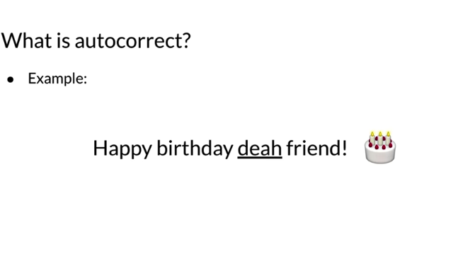</kbd>

   

  
  
<kbd>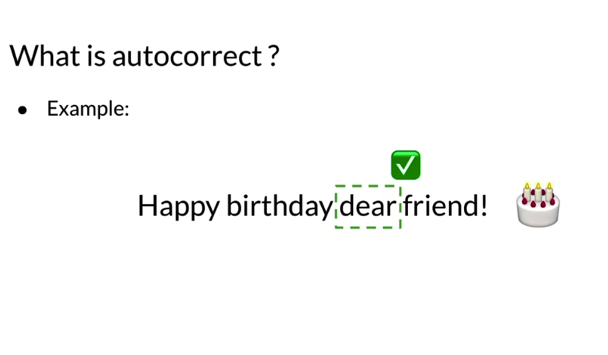</kbd>

   

  
  
<kbd>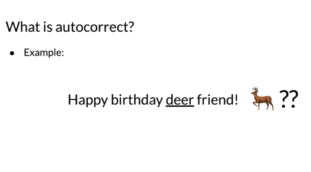</kbd>

  > [!NOTE]
  > But what if you typed **deer** instead of **dear**? Here, you see the word is spelled
  > correctly, but it's **context is incorrect**. Well, unless your friend happens to be an
  > actual deer, y**ou will not test for this contextual error this week**. As **it's a more
  > sophisticated problem**, you'll get to **learn about that another time.**

  > [!NOTE]
  > Đại khái là ở đây chỉ sửa lỗi chính tả, chứ không sửa lỗi từ, cái đó
  > khó hơn sẽ học sau (như ta đã biết sẽ dùng những cái như LSTM,
  > RNN, hay Transformer) giúp model hiểu được nghĩa của từ trong
  > ngữ cảnh mới mới làm được. Nên deer vẫn flag là đúng.

   

  
  
<kbd>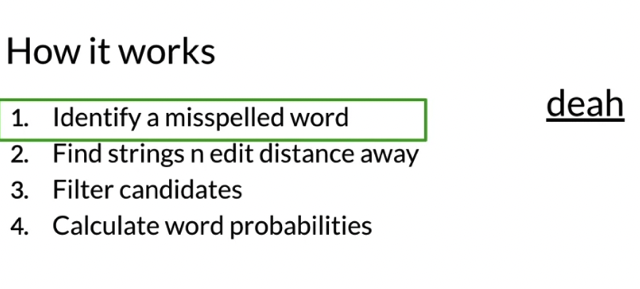</kbd>

  > [!NOTE]
  > Bước 1 là identify
  > misspelled word

   

  
  
<kbd>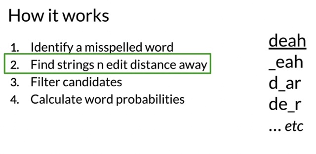</kbd>

  > [!NOTE]
  > Bước 2 đại khái là tìm các string khác sao cho cách
  > original misspelling word 1 khoảng n trong chỉ số **edit
  > distance.** Là chỉ số kiểu như là **đo số thao tác phải làm
  > để biến 1 string thành 1 string khác**.

   

  
  
<kbd>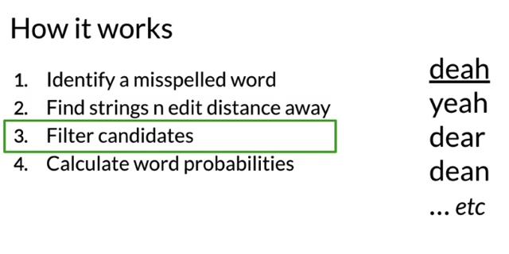</kbd>

  > [!NOTE]
  > Bước 3 là **bỏ đi các từ vô nghĩa** trong đó, chỉ
  > giữ những từ có nghĩa (bằng cách **xem nó có
  > trong từ điển không** ấy mà)

   

  
  
<kbd>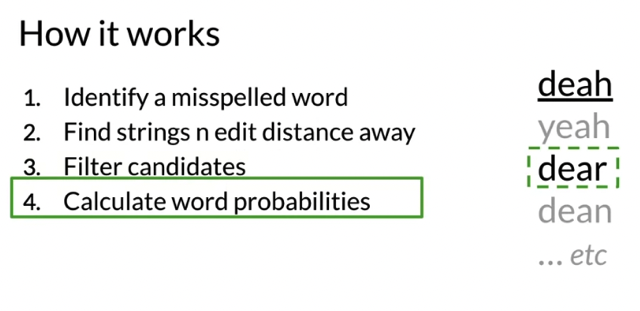</kbd>

  > [!NOTE]
  > Cuối cùng là trong các candidate đó thì **xem
  > cái nào có probability cao nhất**

   

  
  
<kbd>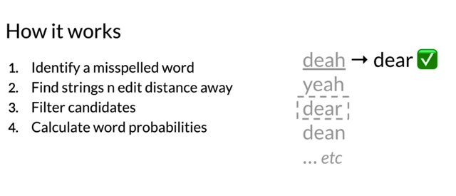</kbd>

   

## Building The Model I

 

### 1 Step 1: \\*Identify misspelled words:\\*

> [!NOTE]
> 1 Step 1: \**Identify misspelled words:\**
>  • Misspelled words can be identified \**by checking\** if they are \**present\** in a 
> \**dictionary\**.
>  • Words\**not found in the dictionary\** are flagged as\**potentially misspelled.\**
>  • The focus is on \**spelling errors\** rather than \**contextual errors.\**
>
> 2 Step 2: \**Find strings at n edit distances away:\**
>  • \**Edit distance measures\** the number of \**operations needed\** to transform \**one 
> string into another.\**
>  • Common edit operations include \**insert\**, \**delete\**, \**switch\**, and \**replace\**.
>  • By applying these edit operations, \**a list of strings\** at different \**edit distances\** 
> from the \**original\** word can be \**generated\**.
>  • Auto-correct typically considers \**1-3 edit distances.\**
>
>  3 Step 3: \**Filter candidates:\**
>  • Many generated strings may not resemble actual words.
>  • To \**filter out non-words\**, compare the candidates against a known \**dictionary\** or 
> vocabulary.
>  • Only \**retain the strings\** that \**appear\** in the \**dictionary\**.
>
>  4 Progress so far:
>  • Steps 1-3 cover the initial stages of building the\**auto-correct model.\**
>  • Misspelled word identification, generating strings at edit distances, and filtering 
> candidates have been discussed.
>  • The next lesson will focus on the fourth and final step.
>
>  5 \**Calculating probabilities (upcoming):\**
>  • The final step, which will be covered in the next video, \**involves calculating 
> word probabilities.\**
>  • The probabilities\**indicate\** \**how likely each word is to appear\** in a given context.
>  • The probability calculation helps \**determine the most suitable replacement\** for a 
> misspelled word.

 

  
  
<kbd>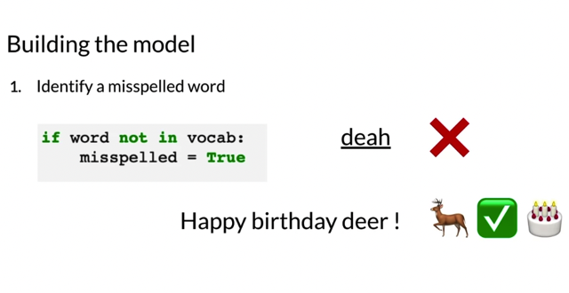</kbd>

  > [!NOTE]
  > Bước 1 đại khái**check nó nếu
  > ko có trong dictionary thì chứng
  > tỏ misspell** vậy thôi

   

- Step 1, \\*identify a misspelled word\\*. When the string there is encountered, \\*how do you know it's a misspelled word?\\* Well, if it's s\\*pelled correctly\\*, you will \\*find it in the dictionary\\*. If not, then it's probably a misspelled word. If a word is not given in a dictionary, flag it for correction.  Recall that \\*you're not searching for contextual errors\\*, \\*just spelling errors\\*. There are \\*much more sophisticated techniques\\* for\\* identifying words that are probably incorrect\\* by \\*looking at the words surrounding them\\*. Some of which you'll \\*visit later in the course\\*.  But for now, quickly identifying a word as incorrect \\*by its appearance misspelling\\* is a \\*simple\\* and is a \\*powerful\\* model that works well. Words like \\*deer\\* \\*will pass\\* through this filter just fine as it is spelled correctly\\* regardless of how the context may seem\\*.
  > [!NOTE]
  > Nhắc lại ở đây là việc xử lý **contextual error**
  > thì để học những model sau, ở đây chỉ sửa lỗi
  > chính tả

   

    
    
<kbd>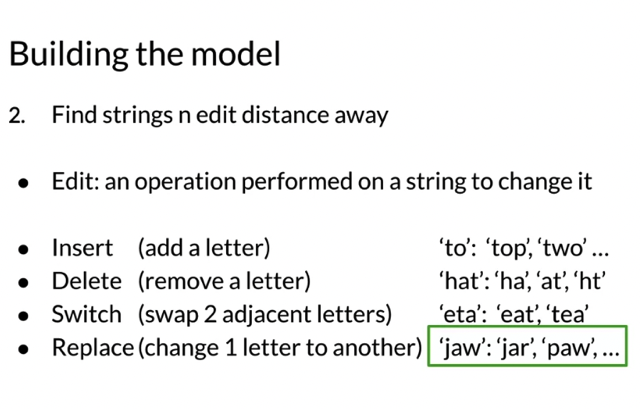</kbd>

    > [!NOTE]
    > Nói về bước 2 - tìm những từ có **n edit
    > distance** away với từ misspelled. N lúc
    > sau có nói thường là **2,3**

     

    
    
<kbd>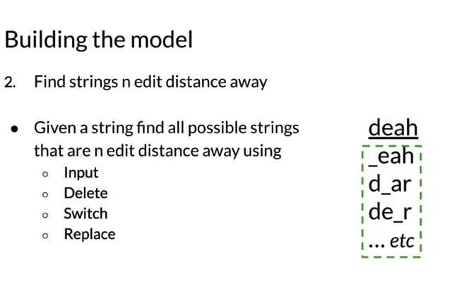</kbd>

     

  
  - Using the four edits; insert, delete, switch, and replace, you can modify any string. By combining these edits, you can \\*find a list of all possible strings that's are n edits away.\\* For \\*auto-correc\\*t, \\*n\\* is usually \\*1-3 edits.\\* You'll implement each of these edits in this week's programming exercise and combine edits to \\*get a list of 2 edit distances\\* from the \\*original input string\\*
     

      
      
<kbd>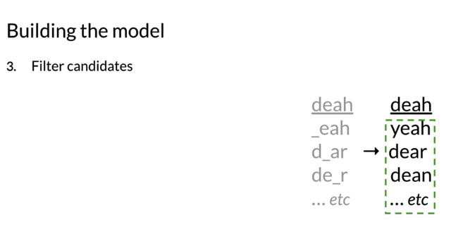</kbd>

      > [!NOTE]
      > Bước 3, đã biết, ta sẽ xem trong đó**từ
      > nào có nghĩa**(look up trong từ điển để
      > **xoá bớt những từ vô nghĩa**)

       

    
    - Now Step 3, \\*filter candidates\\*. Notice how many of the strings that are generated \\*do not look like actual words\\*. To filter these strings and keep ones that are real words, you only want to consider \\*real\\* and \\*correctly spelled \\*words \\*from your candidate lists. \\*Again, \\*compare it to a known dictionary or vocabulary,\\* just like in \\*Step 1.\\* This time, if the string does \\*not appear in the dictionary\\*, \\*remove it\\* from the list of candidates. When you're \\*left with a list of actual words only\\*, then that is good progress. That's the first three steps of building the auto-correct model. In the next lesson, you'll see the fourth and final step
       

## Lab: Bulding The Vocab

 

### Imports and Data

 

- # imports import re # regular expression library; for tokenization of words from collections import Counter # collections library; counter: dict subclass for counting hashable objects import matplotlib.pyplot as plt # for data visualization
   

  
  - # the tiny corpus of text !  text = 'red pink cyan cyan pink blue blue yellow ORANGE BLUE BLUE PINK' # 🌈 print(text) print('string length : ',len(text))
     

    
    - red pink cyan cyan pink blue blue yellow ORANGE BLUE BLUE PINK string length :  62
       

### Preprocessing

> [!NOTE]
> Preprocessing
>
> \**e.findall(r'\\\\w+', text_lowercase)\**
>
> Giới thiệu một function rất gọn \**giúp bẻ 1
> string thành 1 list các từ\** giống nhu
> java \**string.split(" ")\** vậy

 

- # convert all letters to lower case text_lowercase = text\\*.lower()\\* print(text_lowercase) print('string length : ',len(text_lowercase))
   

  
  - red pink cyan cyan pink blue blue yellow orange blue blue pink string length :  62
     

    
    - # some regex to \\*tokenize the string to words\\* and\\* return them in a list \\*words = \\*re.findall(r'\\\\w+', text_lowercase)\\* print(words) print('count : ',len(words))
      > [!NOTE]
      > Giới thiệu một function rất gọn **giúp bẻ 1
      > string thành 1 list các từ** giống nhu
      > java **string.split(" ")** vậy

       

      
      - ['red', 'pink', 'cyan', 'cyan', 'pink', 'blue', 'blue', 'yellow', 'orange', 'blue', 'blue', 'pink'] count :  12
         

### Create Vocabulary

> [!NOTE]
> Create Vocabulary
>
> Giới thiệu cách dùng set(bỏ vào đây array)
> để tạo list vocab

 

- # create vocab vocab = \\*set(words)\\* print(vocab) print('count : ',len(vocab))
  > [!NOTE]
  > Option 1 : A set of distinct
  > words from the text

  > [!NOTE]
  > Giới thiệu cách dùng set(bỏ vào đây array)
  > để tạo list vocab

   

  
  - {'cyan', 'yellow', 'orange', 'pink', 'blue', 'red'} count :  6
     

### Add Information with Word Counts

> [!NOTE]
> Add Information with Word Counts
>
> Hoặc dùng dict để có thêm thông tin số lần
> xuất hiện

 

- # create vocab including word count counts_a = \\*dict()\\* for w in words:     counts_a[w] = counts_a.get(w,0)+1 print(counts_a) print('count : ',len(counts_a))
  > [!NOTE]
  > Option 2 : Two alternatives for
  > including the word count as well

  > [!NOTE]
  > Hoặc dùng dict để có thêm thông tin số lần
  > xuất hiện

   

  
  - {'red': 1, 'pink': 3, 'cyan': 2, 'blue': 4, 'yellow': 1, 'orange': 1} count :  6
     

    
    - # create vocab including word count using collections.Counter counts_b = dict() counts_b = Counter(words) print(counts_b) print('count : ',len(counts_b))
       

      
      - Counter({'blue': 4, 'pink': 3, 'cyan': 2, 'red': 1, 'yellow': 1, 'orange': 1}) count :  6
         

        
        - # barchart of sorted word counts d = {'blue': counts_b['blue'], 'pink': counts_b['pink'], 'cyan': counts_b['cyan'], 'red': counts_b['red'], 'yellow': counts_b['yellow'], 'orange': counts_b['orange']} plt.bar(range(len(d)), list(d.values()), align='center', color=d.keys()) _ = plt.xticks(range(len(d)), list(d.keys()))
           

            
            
<kbd>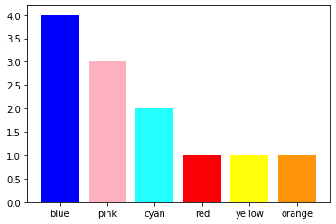</kbd>

             

### Ungraded Exercise

 

  
  
<kbd>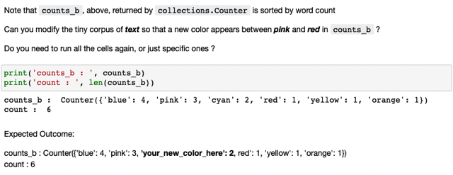</kbd>

   

### Summary

 

- This is a tiny example but the methodology scales very well.  In the assignment you will \\*create a large vocabulary of thousands of words\\*, from a \\*corpus of tens of thousands or words\\*! But the \\*mechanics are exactly the same.\\*  The only \\*extra things to pay attention\\* to should be; run time, \\*memory management\\* and the \\*vocab data structure\\*.  So the \\*choice of approach \\*used in code blocks \\*counts_a\\* vs \\*counts_b\\*, above, will be important.
  > [!NOTE]
  > Đại khái là chuẩn bị trước một số cách để build dictionary, sẽ gặp
  > trong P.A. Cân nhắc thêm nếu trong thực tế đối diện với vấn đề
  > memory management và vocab data structure nữa thì lựa chọn giữa
  > hai phương án sẽ cần phải cân nhắc

   

## Building The Model Ii

 

### 1 Step 4: \\*Calculate word probabilities:\\*

> [!NOTE]
> 1 Step 4: \**Calculate word probabilities:\**
>  • The \**final step\** in implementing \**auto-correct\** is to \**calculate the probabilities\** of each 
> \**possible correct word\**.
>  • Word \**probabilities\** are determined based on \**their frequency\** in a given body of 
> text, known as a \**corpus\**.
>  • The \**more common a word is in the corpus\**, the \**higher its probability.
> \** • This information helps auto-correct \**choose\** the \**most likely replacement\** for a 
> \**misspelled word\**.
>
>  2 Word \**frequency\** and \**corpus\**:
>  • To calculate word probabilities, you need to \**count\** the \**number of times\** each 
> \**word appears in the corpus.\**
>  • The \**corpus\** can be a \**large collection of texts\**, such as all \**issues of a magazine \**
> or a \**series of books\**.
>  • In the example given, the \**corpus is a single sentence for simplicity\**.
>  • Each word's \**frequency\** is \**divided by the total number of words\** in the corpus to 
> determine its \**probability\**.
>
>  3 Selecting the replacement word:
>  • Auto-correct \**selects\** the word \**candidate\** with the \**highest probability\** as the 
> \**replacement for the misspelled word.
> \** • The word with the \**highest probability\** is considered the \**most likely correct 
> word.\**
>
>  4 \**Summary\** of the \**auto-correct implementation steps:\**
>  • To implement auto-correct, you follow four steps: \**identify\** the \**misspelled\** word, 
> \**generate\** a list of strings at \**edit distances\**, \**filter\** the list to include \**only actual words\**, and 
> \**calculate\** word \**probabilities\**.
>  • The word with the \**highest probability\** is \**chosen\** as the auto-correct 
> \**replacement\**.
>
>  5 Importance of \**understanding\** auto-correct implementation:
>  • Understanding the step-by-step process of auto-correct implementation is 
> crucial for the programming assignments.
>  • It provides a \**solid intuition\** for \**how auto-correct works\** and will be useful in 
> completing the assignments.
>
>  6 Next topic: \**Evaluating similarity\** between \**strings\**:
>  • The next video will introduce the concept of \**evaluating\** \**similarity between\** two 
> \**strings\**.
>  • This is particularly important when \**comparing a word\** with a \**typo\** to the \**correct 
> version of the word.\**
> \**• The evaluation of string similarity is a common practice in natural language 
> processing (NLP).\**

 

  
  
<kbd>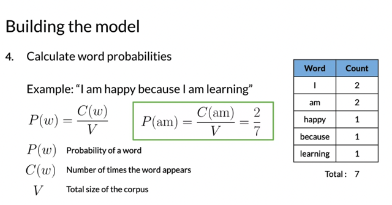</kbd>

  > [!NOTE]
  > Công thức tính **Probability** của từ, ở đây công thức
  > đơn giản là **đếm số lần xuất hiện của từ** trong corpus = 2
  > chia cho **tổng số lần xuất hiện của tất cả các từ trong corpus**. = 7

   

  
  
<kbd>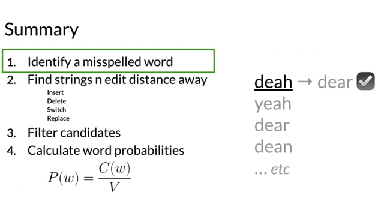</kbd>

   

  
  
<kbd>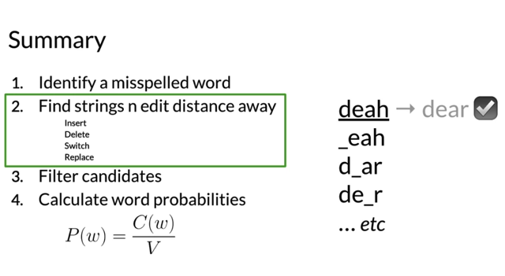</kbd>

   

  
  
<kbd>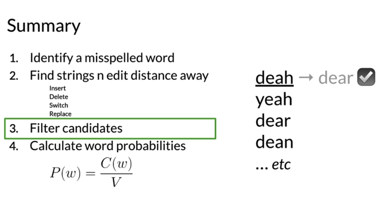</kbd>

   

  
  
<kbd>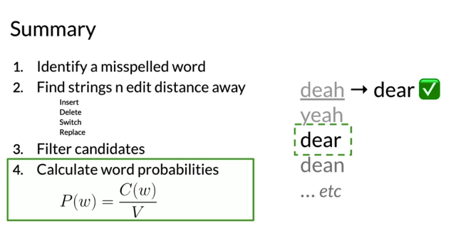</kbd>

  > [!NOTE]
  > Với bước 4, ta tính **Probability của các
  > candidate** và từ đó decide từ nào sẽ dùng để
  > 'correct; cho misspelled word c**hính là từ có P cao nhất**

   

  
  
<kbd>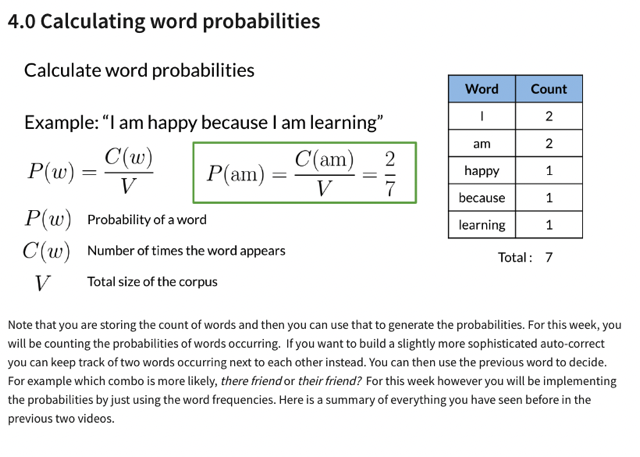</kbd>

  > [!NOTE]
  > Có gợi ý là có thể làm 1 cái phức tạp hơn là keep track các từ xuất
  > hiện kế tiếp nhau, rồi dùng từ trước predict từ sau. Ví dụ nếu thấy
  > their friend hay xuất hiện kế nhau hơn là there, friend thì có friend
  > sẽ suy ra khả năng cao là their hơn there nhưng ở đây sẽ chỉ tính
  > P bằng word frequency = ko care đến các mối quan hệ nào giữa
  > các từ

   

  
  
<kbd>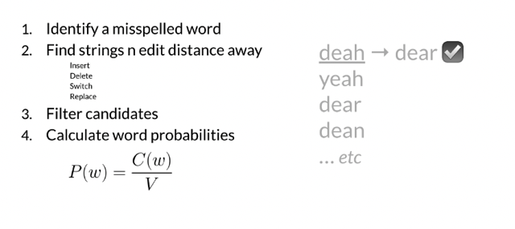</kbd>

   

## Lab: Candidates From Edits

 

### Splits

> [!NOTE]
> Splits
>
> Split string bằng 2 cách trong Python

 

  
  
<kbd>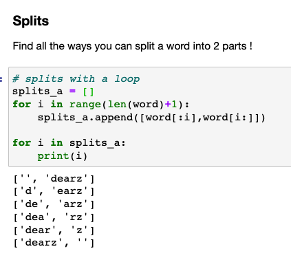</kbd>

   

  
  
<kbd>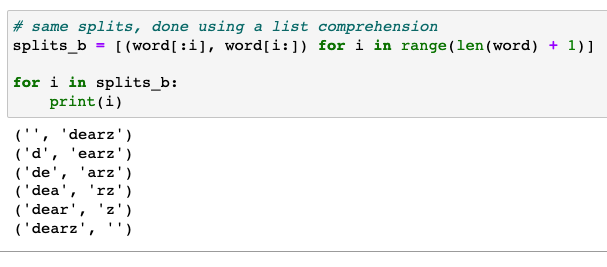</kbd>

  > [!NOTE]
  > Cùng 1 mục đích nhưng làm cách
  > khác gọi gọn hơn trong Python

   

### Delete Edit

> [!NOTE]
> Delete Edit
>
> Đại khái là ổng muốn \**chỉ cho mình một
> cách để delete character\** của word phục vụ
> cho bước tạo\**n distance away - candidate
> word\** của original word đây mà. Chắc gợi ý
> cho P.A

 

  
  
<kbd>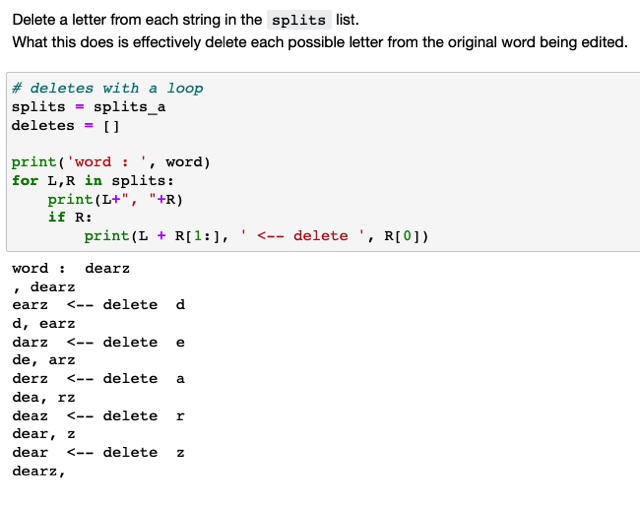</kbd>

  > [!NOTE]
  > splits chứa các cặp 
  > ['','dearz'], ['d', 'earz'],..
  >
  > Nên ở đoạn code này đơn giản là loop trong splits
  > gán cặp từ tại mỗi vị trí cho L, R
  >
  > rồi nó ..in ra thôi có gì đâu, chỉ có R là nó in từ [1:] tức là từ kí tự thừ 2
  > của R trở đi. Chưa hiểu ý ổng là làm cái gì ở đây

   

  
  
<kbd>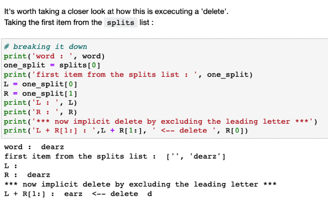</kbd>

  > [!NOTE]
  > Đại khái là ổng muốn **chỉ cho mình một cách để delete character** của
  > word phục vụ cho bước tạo**n distance away - candidate word** của
  > original word đây mà. Chắc gợi ý cho P.A

   

### Find candidate

> [!NOTE]
> Find candidate
>
> Đại khái là show hàng hàm set.\**intersection\** để
> check phần chung giữa 2 list từ sẽ là phương
> án rất nhanh để loại bỏ các candidate word mà
> không có trong dictionary

 

  
  
<kbd>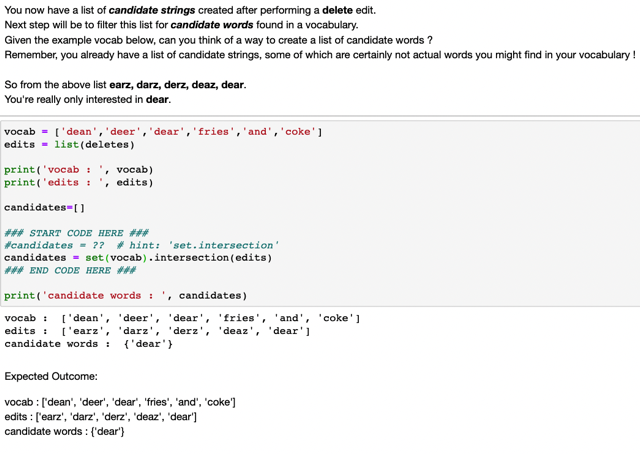</kbd>

  > [!NOTE]
  > Đại khái là show hàng hàm intersection để
  > check phần chung giữa 2 list từ sẽ là phương
  > án rất nhanh để loại bỏ các candidate word mà
  > không có trong dictionary

   

### Summary

 

- You've unpacked an integral part of the assignment by \\*breaking down splits and edits\\*, specifically looking at deletes here. Implementation of the other \\*edit types (insert, replace, switch)\\* follows a \\*similar methodology\\* and should now feel somewhat familiar when you see them. This bit of the code isn't as intuitive as other sections, so well done! You should now feel confident facing some of the \\*more technical parts of the assignment\\* at the end of the week.
   

## Minimum Edit Distance

 

### 1 \\*Minimum Edit Distance\\* (\\*MED\\*) has various \\*applications\\*, including \\*spelling\\*

> [!NOTE]
> 1 \**Minimum Edit Distance\** (\**MED\**) has various \**applications\**, including \**spelling\**
> \**correction\**, \**document similarity\**, \**machine translation\**, and\**DNA sequencing\**.
>
> 2 MED can be used to \**evaluate\** the \**similarity\** between \**two strings or documents\**
> by \**determining the lowest number of operations\** required to \**transform\** one into the
> other.
>
> 3 Three types of e\**dit operations\** are used in calculating the minimum edit
> distance: \**insert\**, \**delete\**, and \**replace\**.
>
> 4 Initially, \**all edit operations\** are considered to have the \**same cost (e.g., 1).\**
>
> 5 \**Edit distance\** represents the \**total cost of edits,\** and the \**goal is to minimize this\**
> \**distance\**.
>
> 6 \**Different costs\** are assigned to each type of edit operation: \**insert\** and \**delete\**
> have a cost of \**1\**, while \**replace\** has a cost of\**2.\**
>
> 7 The \**edit distance\** is calculated as the \**sum of costs\** for the \**performed edit\**s.
>
> 8 The \**complexity\** of \**solving the edit distance problem\** using\**brute force \** increases
> \**exponentially\** with the\**length of the strings\**.
>
> 9 A \**more efficient approach\** is using a \**tabular method\** and \**dynamic programming\**
> to \**enumerate all possible strings and edits\**.
>
> 10 The \**tabular approach speeds up \**the process of \**calculating\** edit distances and
> introduces the concept of \**dynamic programming\**.

 

  
  
<kbd>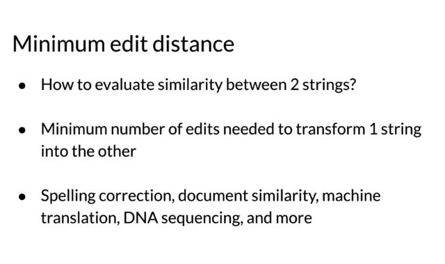</kbd>

  > [!NOTE]
  > Tác dụng của **minimum edit distance** chú ý đây là **so sánh 2
  > string** chứ không phải 2 word nha - so sánh word bằng cách
  > so sánh word vector như mấy bài trước là khác

   

  
  
<kbd>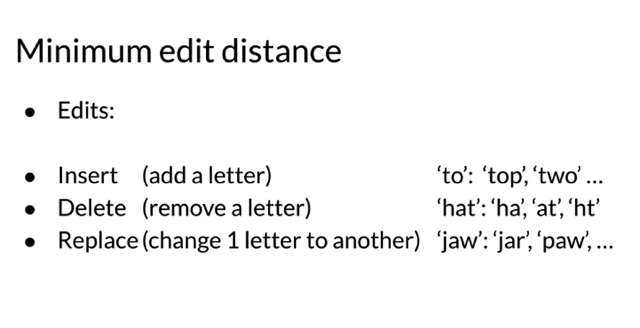</kbd>

   

  
  
<kbd>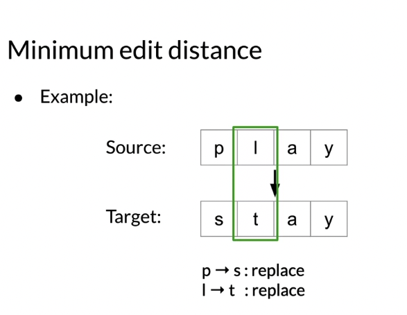</kbd>

   

  
  
<kbd>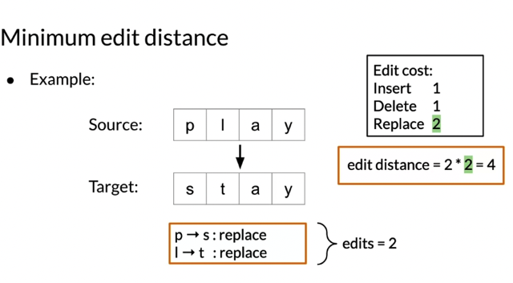</kbd>

  > [!NOTE]
  > Đại khái là replace giống như delete sau đó
  > insert nên tính edit cost cao hơn. Và từ đó play
  > thành stay tốn 4 edit distance.

   

  
  
<kbd>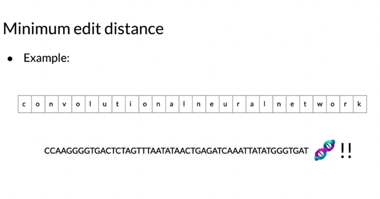</kbd>

  > [!NOTE]
  > Nói về việc với string dài thòn lòn như
  > DNA thì tính kiểu này sẽ rất lâu, cách
  > tiếp cận khác là **Tabular** và **Dynamic programming**

   

## Minimum Edit Distance Algorithm

 

### Main ideas (indexed):

> [!NOTE]
> Main ideas (indexed):
>  1 \**Dynamic programming\** is a powerful technique that can be applied to various 
> problems.
>  2 The goal of dynamic programming is to \**break down a problem\** into \**smaller 
> subproblems\** and solve them \**individually\**.
>  3 In the \**minimum edit distance\** problem, a distance matrix D is constructed to 
> determine the minimum edit distance between two strings.
>  4 The \**distance matrix\** is f\**illed out\** by considering the minimum edit distance 
> between\**prefixes of the source\** and \**target strings\**.
>  5 The formula to calculate each element in the distance matrix is based on the 
> previous calculations and the cost of edit operations (insert, delete, replace).
>  6 The process starts with the \**special case\** of transforming an \**empty source\** 
> \**string\** to an \**empty target string\**, which has an \**edit distance of zero.
> \** 7 The edit distance between a letter in the source string and an empty target 
> string can be computed using an \**insert operation\** with a \**cost of one.\**
>  8 The edit distance between an empty source string and a letter in the target 
> string can be computed using a delete operation with a cost of one.
>  9 To compute the edit distance between two letters,\**different paths\** (sequences 
> of edits) are \**considered\**, including insert, delete, and replace operations.
>  10 The \**minimum edit distance\** is determined by taking the \**minimum cost among 
> all possible paths.\**
>  11 The distance matrix is filled out by considering the dependencies on the 
> previously filled cells (above, left, and upper left).
>  12 The first column and the first row of the distance matrix are filled separately to 
> ensure that all cells have the necessary dependencies.
>  13 \**Dynamic programming\** provides a \**faster\** way to populate the \**distance matrix \**
> compared to a \**brute force\** approach.

 

  
  
<kbd>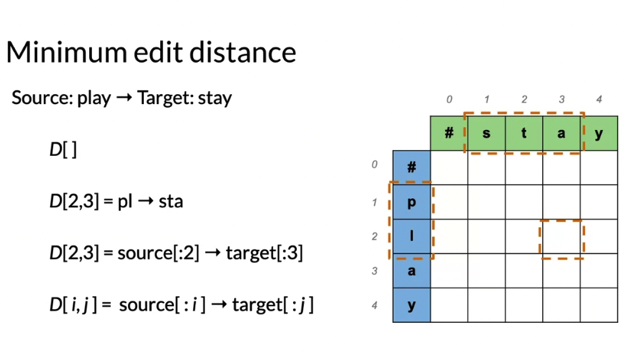</kbd>

  > [!NOTE]
  > Kí hiểu D[2,3] là cost của việc chuyển từ (cột xanh
  > dương, index 2) tương ứng với string PL 
  >
  > (HAY ĐÚNG HƠN LÀ
  > từ source[:2]  - tức là từ PLAy nhưng lấy 2 kí tự đầu thôi - là PL)
  >
  > sang (xanh lá, thứ 3) tương ứng với string STA 
  > (Hay đúng hơn là target[:3] - tức là từ STAY nhưng lấy 3 kí tự đầu thôi

   

  
  
<kbd>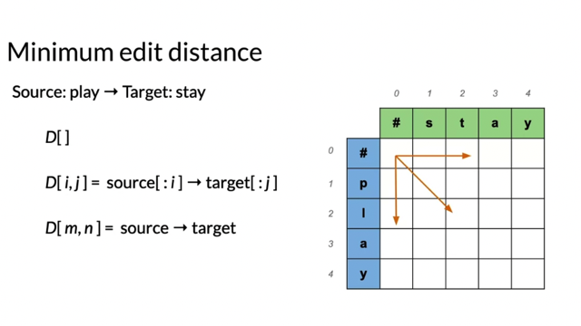</kbd>

  > [!NOTE]
  > thì đại khái là lấy cái nào (cách thay
  > đổi nào có cost nhỏ nhất)

   

  
  
<kbd>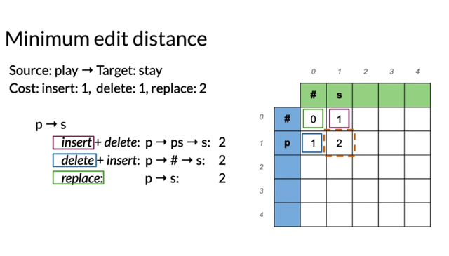</kbd>

  > [!NOTE]
  > từ # (empty char) cái ô xanh lá -> # (empty char): 
  > Cost = 0 vì không cần làm gì
  >
  > Từ 'p' -> # (ô xanh dương): Delete -> Cost = 1 
  > Từ # -> 's' (ô tím) : Insert -> Cost = 1 
  >
  > từ 'p' -> 's' (ô màu cam chấm chấm): Thì có thể có những cách sau
  > 1. Delete p để về lại # (empty) chính là cost ở ô xanh dương
  > rồi từ # insert s chính là cost của ô tím => 1 + 1 =  2
  >
  > 2.Insert 's' để thành ps, delete p để thành s.
  > Thì insert s cũng là cost ở ô tím và delete p cũng là cost ở ô xanh 
  > dương => 1 + 1 = 2
  >
  > 3. Replace p -> s Thì cost = 2 Theo quy ước
  >
  > Thì ý là cách nào nhỏ nhất thì đó là minimum distance

   

## Minimum Edit Distance Algorithm Ii

 

### 1 The video focuses on translating the process of populating a table for minimum

> [!NOTE]
> 1 The video focuses on translating the process of populating a table for minimum 
> edit distance calculation into code.
>  2 The intuitive approach was used to fill out the upper left corner of the table, 
> and now a\**formulaic approach\** will be shown to fill out the rest.
>  3 The remaining cells of the leftmost column and top row are filled out. For 
> transforming "play" into an empty string, each letter is deleted.
>  4 The formula for filling out the cells top to bottom is explained, where the cost of 
> an extra delete edit is considered.
>  5 Similar operations are applied in the first row to transform the empty string into 
> "stay" by inserting one letter at a time.
>  6 The \**big formula \**for calculating the minimum edit distance is introduced, 
> building upon the previous computations.
>  7 The formula considers \**delete cost, insert cost, and replace cost \**based on 
> \**matching\** or \**mismatching\** letters between the source and target words.
>  8 The \**minimum edit distance value\**s are determined using the formula and filled 
> out in the table.
>  9 The \**patterns\** in the table, revealed through color coding or a \**heat map\**, show 
> that \**once the suffix of both words is the same, no more edits are needed\**.
>  10 The \**implementation style\** and \**important considerations\** for the programming 
> assignments are mentioned.

 

  
  
<kbd>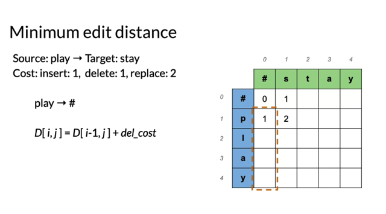</kbd>

   

  
  
<kbd>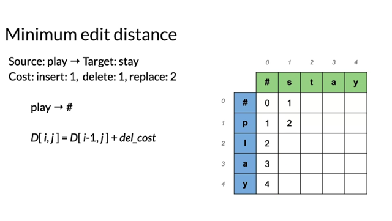</kbd>

  > [!NOTE]
  > For each cell, look at the **cell above**
  > and at the **cost of an extra delete**
  > edit, which will be 1.
  >
  > P -> #: delete P cost 1
  > PL -> #: delete L + cost of (P -> #) = 1 + 1 = 2
  > PLA -> # delete A + cost of (PL -> #) = 1 + 2 = 3
  > PLAY -> # delete Y + cost pf (PLA -> #) = 1 + 3 = 4
  >
  > Từ đó có công thức D[i, j] = D[i-1,j] + del_cost (j là cột, i là hàng)
  >
  > Nến mới nói cót của 1 cell là lấy**cái trên nó + del cost**

   

  
  
<kbd>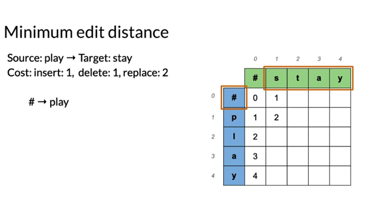</kbd>

   

  
  
<kbd>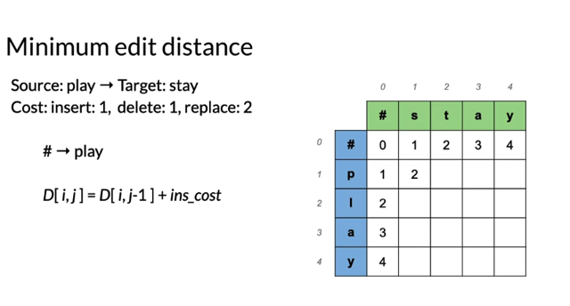</kbd>

  > [!NOTE]
  > tương tự với Insert
  >
  > Từ # -> S: insert S: cost 1
  > Từ # -> ST: insert T + cost of (#->S) = 1 + 1 = 2
  > Từ # -> STA: insert A + cost of (#->ST) = 2 + 1 = 3
  > Từ # -> STAY: insert Y + cost of (#->STA) = 3 + 1 = 4
  >
  > Nên D[i, j] = d[I, j-1] + insert cost
  >
  > hoặc cũng cell bằng **lấy cái bên trái nó. + insert cost**

   

  
  
<kbd>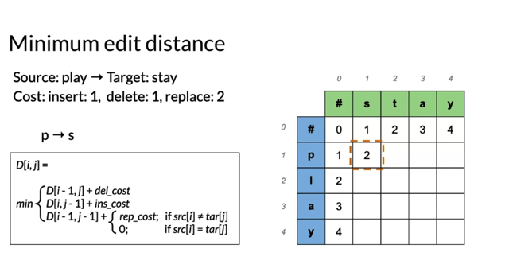</kbd>

  > [!NOTE]
  > Và công thức tổng quát để tính
  > cho một ô bất kì nào

   

- So the distance to this orange cell is going to be the minimum distance to reach it from any of the previous three cells, interesting, right?
   

    
    
<kbd>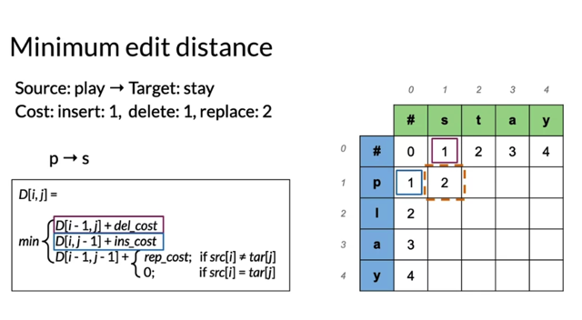</kbd>

    
<kbd>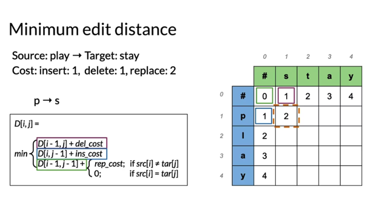</kbd>

    
<kbd></kbd>

    
<kbd></kbd>

    
<kbd>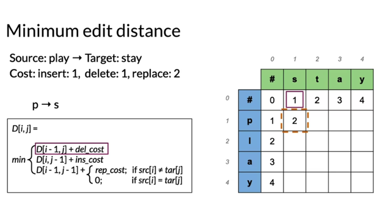</kbd>

    > [!NOTE]
    > Vậy để tính ô màu cam biểu thị cost từ P -> S 
    >
    > Ta biết để P -> Cần **Delete P** và **Insert S**
    >
    > Vậy..:
    >
    > thì Nếu "đi từ ô tím" - có nghĩa là ta đã có S (insert từ #->S) 
    > và lúc này kiểu như ta có PS, thì h ta chỉ 
    > cần add thêm cost của việc delete P 
    > Nên cost = cost of (#->S) là (ô. tím, = 1) + cost of delete P (=1) = 2
    >
    > Nếu "đi từ ô xanh" - có nghĩa là ta đã có cost của việc delete P, 
    > để thành #, giờ chỉ insert S 
    > Nên cost = cost of (P -> #) là ô xanh + cost of insert S = 1 + 1 = 2
    >
    > Còn nếu đi từ ô xanh lá có nghĩa ta đang có # thôi Thì một là replace cost (=2) nếu hai ô khác
    > Nhau (ví dụ P -> S là khác nhau) hoặc hai là cost = 0 nếu
    > hai ô giống nhau (ví dụ từ M - M) thì không làm gì
    >
    > VÀ KẾT QUẢ CUỐI LÀ MIN CỦA 3 CÁCH ĐÓ

     

    
    
<kbd>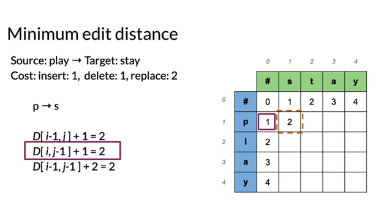</kbd>

    
<kbd>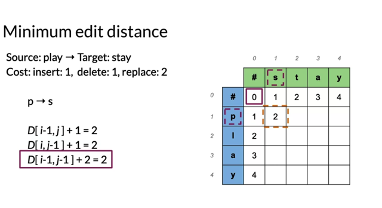</kbd>

    
<kbd></kbd>

    
<kbd></kbd>

    
<kbd>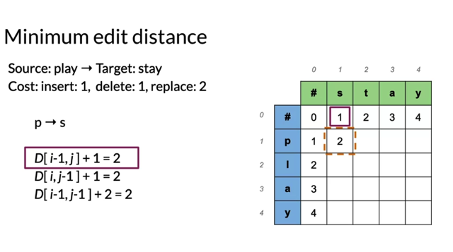</kbd>

     

    
    
<kbd>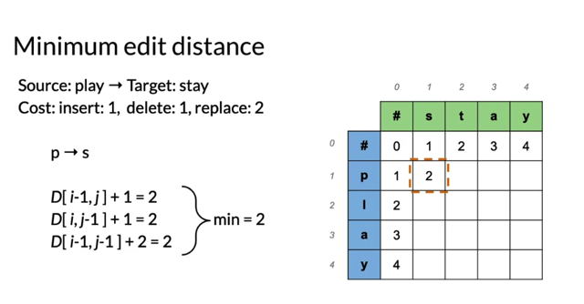</kbd>

    > [!NOTE]
    > Trong trường hợp này nó
    > bằng nhau hết nên là 2

     

    
    
<kbd>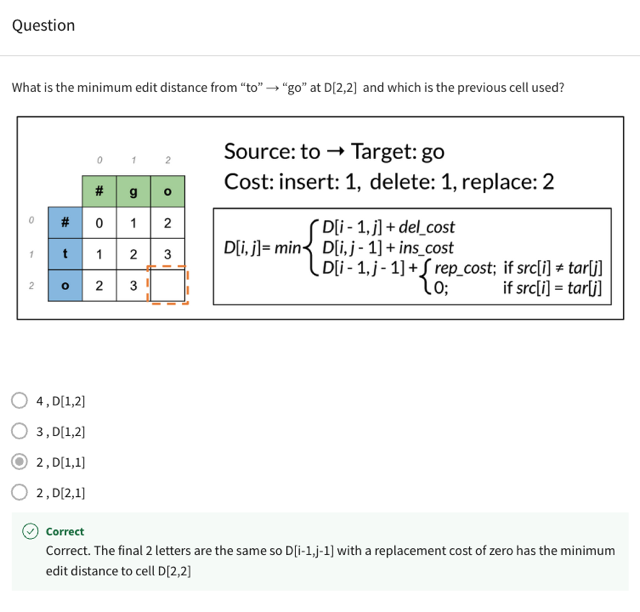</kbd>

     

  
  - TO -> GO  Đi từ ô trên: cost T->GO + cost của delete O = 3 + 1 = 4 Đi từ ô trái: cost TO->G + cost của insert O = 3 + 1 = 4 Đi từ ô chéo: cost T->G + cost của replace O với O (mà hai cái giống nhau nên = 0) => 2 + 0 = 2  -> Min 3 cái đó là 2
    > [!NOTE]
    > Cái này dễ lúng túng: TO - GO, rồi đi từ ô trên phải hiểu như vầy, là
    > ta đã biến T thành GO rồi, có nghĩa TO bây giờ đã thành GOO, do
    > đó chỉ còn bỏ bớt O đi, nên mới nói cost của T->GO + cost của bỏ
    > bớt O nữa
    >
    > Còn đi từ ô trái, tức là đã có TO-> G rồi, giờ muốn có GO thì thêm O 
    > nữa, nên cost là cost của (TO->G) + cost của 1 insert.
    >
    > Còn đi từ ô chéo: Đã có T - G rồi, tức là từ TO nó đã thành GO rồi.
    > Giả sử yêu cầu mà là TA -GB thì bấy giờ đã có GA rồi (T thành G)
    > chỉ cần add thêm cost replace A thành B nữa sẽ thành GB
    > Nhưng ở đây TO - GO là O - O giống nhau nên không làm gì cả.
    > Mà quả thật từ TO -> GO thì thay T bằng G là xong rồi.

     

      
      
<kbd>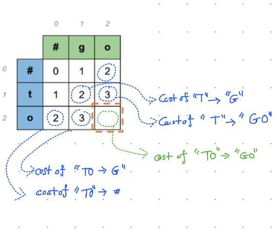</kbd>

       

      
      
<kbd>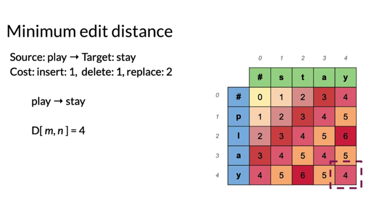</kbd>

      
<kbd></kbd>

      
<kbd>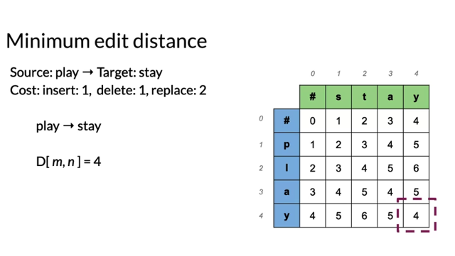</kbd>

       

      
      
<kbd>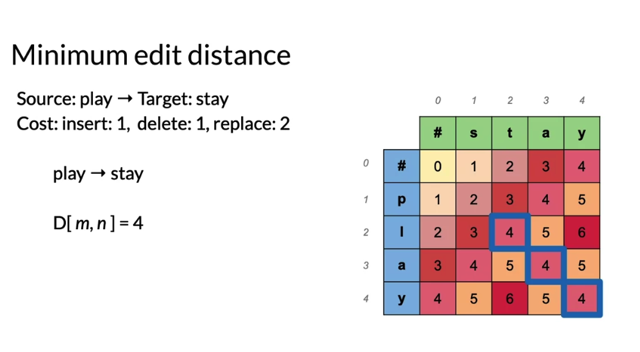</kbd>

      > [!NOTE]
      > Tô màu xong thấy rõ pattern, Từ PLAY muốn
      > thành STAY thì khi đã đổi PL thành ST thì
      > không còn phải làm gì nữa

       

## Minimum Edit Distance Algorithm Iii

 

### 1 The video provides an overview of \\*minimum edit distance\\* and explains how to

> [!NOTE]
> 1 The video provides an overview of \**minimum edit distance\** and explains how to
> \**reconstruct\** the \**path\** taken during the edits.
>
> 2 The implementation of minimum edit distance using \**insert\**, \**delete\**, and \**replace\**
> operations with costs 1, 1, and 2 respectively is known as \**Levenshtein distance.\**
>
> 3 While finding the minimum edit distance is important, \**knowing the\** \**path taken\** is also
> \**crucial\**, which can be achieved through \**backtrace\**.
>
> 4 \**Backtrace\** involves \**keeping a pointer\** in\**each cell\** of the \**table\** to \**track the path from
> the top left corner\** to the \**bottom right corner\**, useful in \**string alignment problems\**.
>
> 5 The \**tabular method\** used for computation, instead of\**brute force\**, is a technique
> called d\**ynamic programmin\**g. It involves \**solving smaller subproblems\** first and \**reusing
> the results to solve larger subproblems.
> \**
> 6 \**Dynamic programming\** is a \**well-known technique\** in \**computer science\** and will be
> encountered throughout the course.
>
> 7 The viewer is encouraged to t\**ry the programming assignment\** that involves \**coding\**
> the \**minimum edit distance\** example and optionally \**building a backtrace tool\**.
>
> 8 A \**recap\** is provided, highlighting the key topics covered in the \**past few lessons,\**
> including \**auto-correct\**, \**string similarity\**, and the \**tabular algorithmic technique\** for
> \**minimum edit distance\**.
>
> 9 The viewer is congratulated on finishing the week and informed about the upcoming
> topic of the \**Viterbi\** \**algorithm\** in the next week, which also \**utilizes dynamic
> programming.\**

 

  
  
<kbd>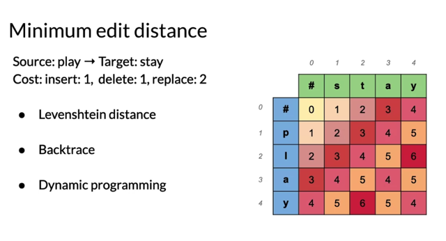</kbd>

  > [!NOTE]
  > Đại khái đây chính là **Levenshtein distance** và nếu cần có thể ghi lại
  > sơ đồ đường đi từ đầu đến cuối quá trình biến 1 string thành 1 string
  > để có thể tái lặp gọi là **backtrace**.

   

- Finally, this \\*tabular method\\* for computation instead of \\*brute force\\*, is a technique known as \\*dynamic programming\\*. Intuitively, this just means that \\*solving the smallest subproblem first\\* and then \\*reusing that result to solve the next biggest subproblem\\*, saving that result, \\*reusing it again and so on\\*. This is what you did here by solving each cell in order. It's a \\*well-known technique\\* in \\*computer science\\* and will appear again and again in the coming weeks of this course.
  > [!NOTE]
  > Và đại khái giải quyết vấn đề từng
  > chút từng chút như này gọi là
  > Dynamic Programming

   

    
    
<kbd>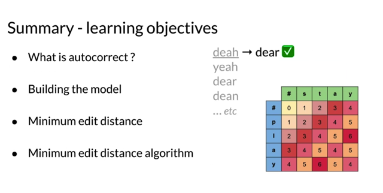</kbd>

     

## Week Conclusion

 

<kbd></kbd>

 

### Good job in learning this week's materials. You now know how

> [!NOTE]
> Good job in learning this week's materials. You now know how
> \**dynamic programming\** works and you can see why it is a \**very
> powerful algorithm\**. Just like how you can use dynamic
> programming to\**find the minimum edit distance\** between \**two
> strings\**, you can also use it to\**find the shortest path\** from \**point A
> to point B to point C\**, like in Google Maps. These are some \**very
> powerful models that you learned\**.
>
> In this week's programming assignment, you'll be implementing
> \**autocorrect\**, and by the end of the assignment, you will be \**able to
> feed in a typo to your model\**, and it will \**give you the most likely
> correction\**. \**Autocorrect\**, these days, \**uses a lot of techniques\**,
> but you will get a \**good baseline and understand \**how the
> \**concepts\** work. You will also learn about dynamic programming
> can be assigned. Next week you'll tackle part of \**speech tagging.\**
> Good luck in the assignment.

 

## Quiz

 

<kbd></kbd>

 

<kbd>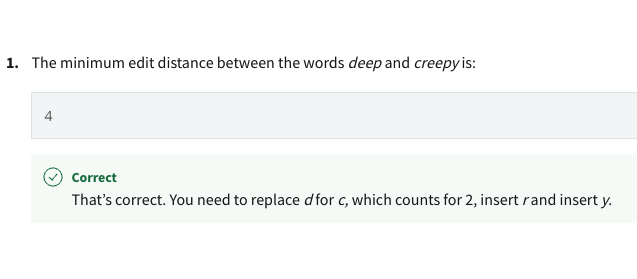</kbd>

 

<kbd>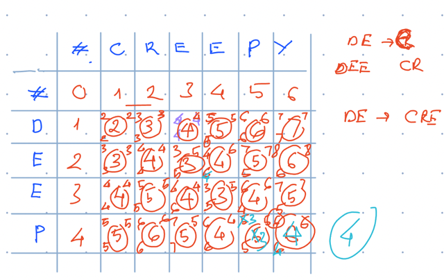</kbd>

 

<kbd>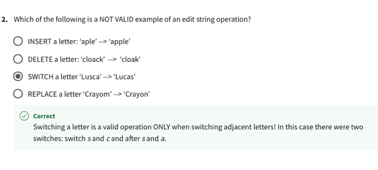</kbd>

 

<kbd>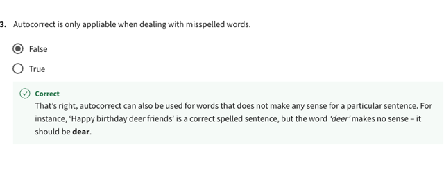</kbd>

> [!NOTE]
> Ý ổng là sửa deer thành dear cũng
> là autocorrect nhưng ở những
> model sau phức tạp hơn

 

<kbd>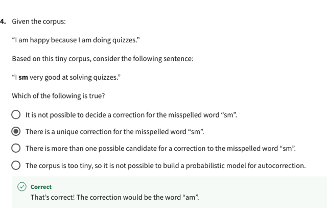</kbd>

 

<kbd>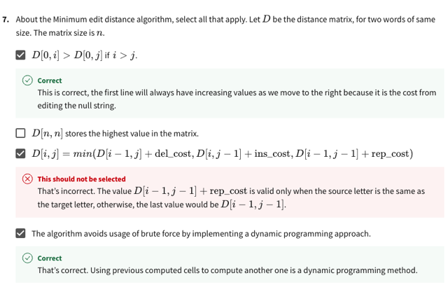</kbd>

<kbd></kbd>

<kbd>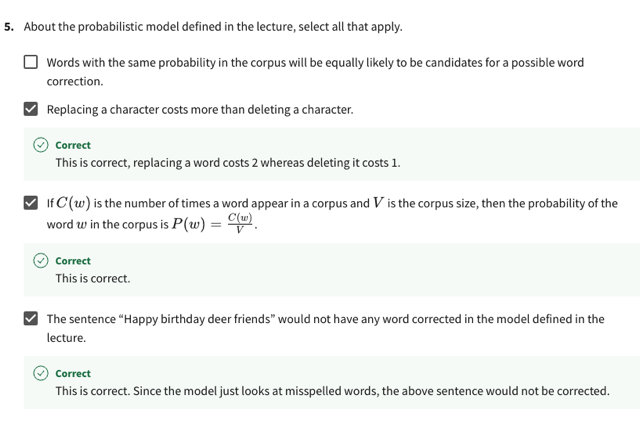</kbd>

 

<kbd>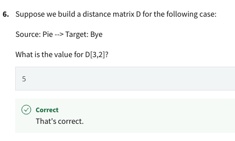</kbd>

 

<kbd>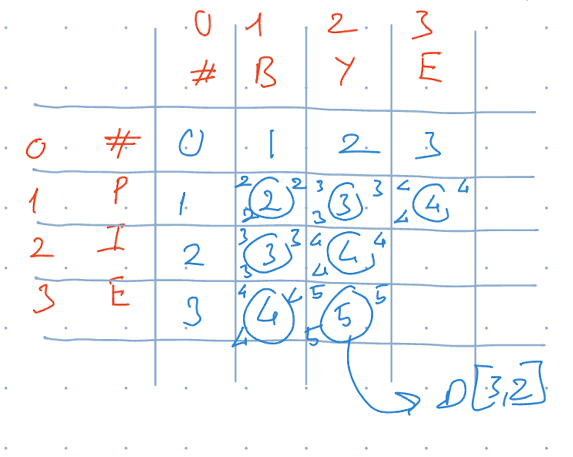</kbd>

 

<kbd></kbd>

<kbd></kbd>

<kbd>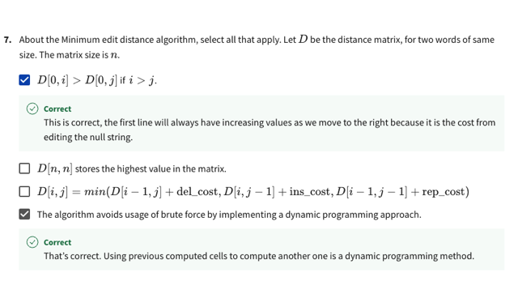</kbd>

 

<kbd>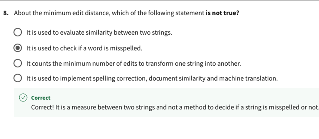</kbd>

> [!NOTE]
> Decide misspelled thì phải look up
> dictionary xem có ko mới dc

 

<kbd>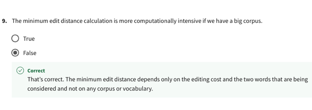</kbd>

> [!NOTE]
> That’s correct. The minimum edit distance **depends only on the
> editing cost and the two words** that are being considered and
> not on any corpus or vocabulary.

 

<kbd>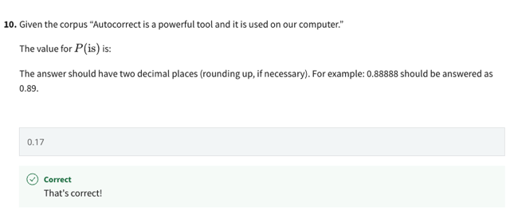</kbd>

> [!NOTE]
> đếm ko kĩ tính
> 2/11 (phải 2/12)

 

## Programming Assignment

 

### Welcome to the first assignment of Course 2. This

> [!NOTE]
> Welcome to the first assignment of Course 2. This
> assignment will give you a chance to \**brush up on
> your python and probability skills\**. In doing so, you
> will implement an \**auto-correct system that is very
> effective and useful\**

 

- 0 - Overview
   

  
  - You use \\*autocorrect\\* every day on your cell phone and computer. In this assignment, you  will explore what really goes on behind the scenes. Of course, the model you are about to  implement is \\*not identical\\* to the one used in your phone, but it is \\*still quite good.\\*  By completing this assignment you will learn how to:  • Get a \\*word count\\* given a \\*corpus\\*  • Get a \\*word probability\\* in the \\*corpus\\*  • \\*Manipulate strings \\* • \\*Filter strings\\*  • Implement \\*Minimum edit distance\\* to \\*compare strings\\* and to help \\*find the  optimal path for the edits\\*.  • Understand how \\*dynamic programming\\* works  Similar systems are used everywhere.  • For example, if you type in the word \\*"I am lerningg"\\*, chances are very high  that you meant to write \\*"learning"\\*, as shown in \\*Figure 1\\*.
     

      
      
<kbd></kbd>

       

- 0.1 - Edit Distance
   

  
  - In this assignment, you will implement models that \\*correct words\\* that are  \\*1 and 2 edit distances away\\*.   • We say two words are \\*n edit distance away\\* from each other when we need \\*n  edits to change one word into another\\*.  An edit could consist of one of the following options:  • \\*Delete\\* (remove a letter): ‘hat’ => ‘at, ha, ht’  • \\*Switch\\* (swap 2 adjacent letters): ‘eta’ => ‘eat, tea,...’  • \\*Replace\\* (change 1 letter to another): ‘jat’ => ‘hat, rat, cat, mat, ...’  • \\*Insert\\* (add a letter): ‘te’ => ‘the, ten, ate, ...’  You will be using the four methods above to implement an\\* Auto-correct\\*.  • To do so, you will need to compute \\*probabilities that a certain word is correct  given an input\\*.  This auto-correct you are about to implement was first created by \\_\\*Peter Norvig\\*\\_ in 2007.  • His \\_original article\\_ may be a useful reference for this assignment.  \\/\\*https://norvig.com/spell-correct.html\\*\\/
     

      
      
<kbd>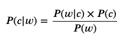</kbd>

      > [!NOTE]
      > The goal of our spell check model is to
      > compute the following probability:

       

    
    - The equation above is Bayes Rule.  - Equation 1 says that the \\*probability of a word being correct\\* 𝑃\\*(\\*𝑐\\*|\\*𝑤\\*)\\* is equal to the \\*probability of having a certain word \\*𝑤, \\*given that it is correct  \\*𝑃\\*(\\*𝑤\\*|\\*𝑐\\*)\\* , multiplied by the \\*probability of being correct in general \\*𝑃\\*(\\*𝐶\\*)\\*  divided by the\\* probability of that word \\*𝑤\\* appearing \\*𝑃\\*(\\*𝑤\\*) in general\\*.  - To compute equation 1, you will first \\*import a data set\\* and then \\*create all the probabilities that you need\\* using that data set.
       

- 1 - Data Preprocessing
   

  
  - Data Preprocessing
     

    
    - import re from collections import Counter import numpy as np import pandas as pd  import w1_unittest
       

      
      - As in any other machine learning task, the first thing you have to do is \\*process your data  set.\\*  • Many courses load in \\*pre-processed data for you\\*.  • However, \\*in the real world\\*, when you build these NLP systems,  you \\*load\\* the datasets and \\*process them.\\*  • So let's get some real world practice in \\*pre-processing the data\\*!  Your first task is to read in a file called \\*'shakespeare.txt'\\* which is found in your file  directory. To look at this file you can go to File ==> Open.
         

  
  - Exercise 1 - process_data (UNQ_C1)
     

    
    - Implement the function \\*process_data\\* which  1) \\*Reads in a corpus (text file)\\*  2) Changes everything to \\*lowercase\\*  3) \\*Returns a list of words\\*.
       

      
      - \\*Options and Hints  \\* • If you would like more of a \\*real-life practice\\*, don't open the 'Hints' below (yet)  and \\*try searching the web to derive your answer.\\*  • If you want a little help, click on the green "\\*General Hints"\\* section by clicking  on it with your mouse.  • If you get stuck or are not getting the expected results, click on the green  'Detailed Hints' section to get hints for each step that you'll take to complete this function
         

          
          
<kbd>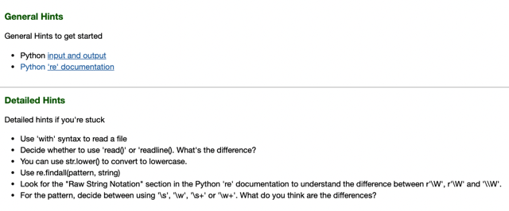</kbd>

          > [!NOTE]
          > Lúc làm không dùng hint mà search ChatGPT

           

          
          
<kbd>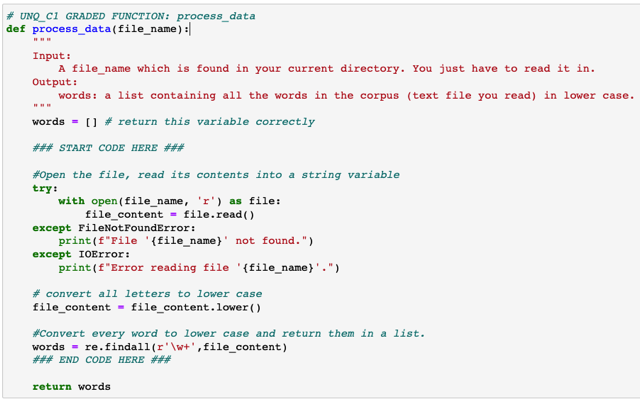</kbd>

           

          
          
<kbd>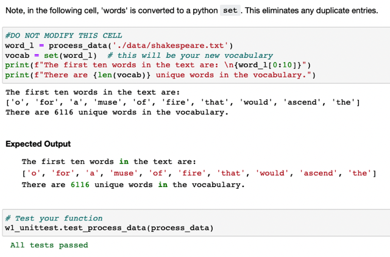</kbd>

           

  
  - Exercise 2 - get_count (UNQ_C2)
     

    
    - Implement a get_count function that returns a dictionary  The dictionary's keys are words  The value for each word is the number of times that word appears in the corpus.  For example, given the following sentence: "I am happy because I am learning", your dictionary should return the following:
       

        
        
<kbd>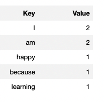</kbd>

         

      
      - \\*Instructions\\*: Implement a get_count which returns a dictionary where the key is a word and the value is the number of times the word appears in the list.  \\*Hints\\*  • Try implementing this using a for loop and a regular dictionary. This may be good practice for similar coding interview questions  • You can also use defaultdict instead of a regular dictionary, along with the for loop  • Otherwise, to skip using a `for` loop, you can use Python's \\_Counter class\\_
         

          
          
<kbd>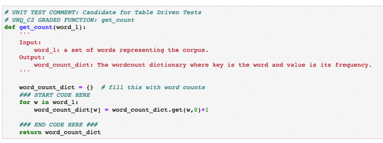</kbd>

           

          
          
<kbd>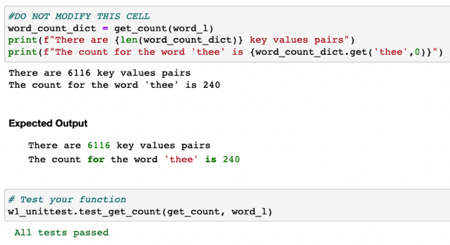</kbd>

           

  
  - Exercise 3 - get_probs (UNQ_C3)
     

      
      
<kbd>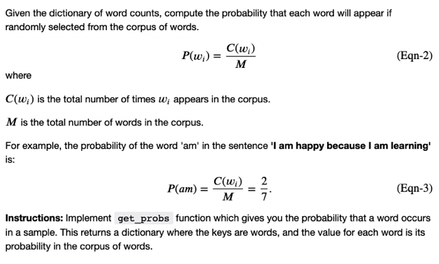</kbd>

       

    
    - General advice  Use dictionary.\\*values()\\* Use \\*sum\\*() The cardinality (number of words in the corpus should be equal to len(word_l).  You will calculate this same number, but using the word count dictionary. If you're using a for loop:  Use dictionary.\\*keys() \\*If you're using a dictionary comprehension:  Use dictionary.items()
       

        
        
<kbd>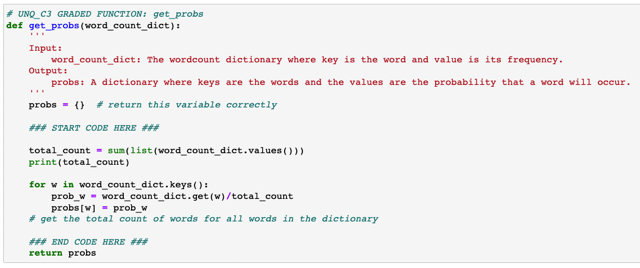</kbd>

        > [!NOTE]
        > Cái này mình đã tự làm
        > không dùng hint

         

        
        
<kbd>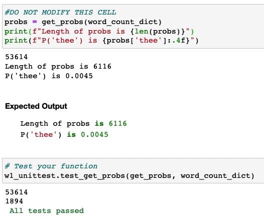</kbd>

         

- 2 - String Manipulations
   

  
  - 2 - String Manipulations
     

    
    - Now that you have computed 𝑃(𝑤𝑖) for all the words in the corpus, you will write a few  functions to \\*manipulate strings\\*  so that you can \\*edit the erroneous strings\\* and return the \\*right spellings\\* of the words.   In this section, you will implement four functions:  • \\*delete_letter\\*: given a word, it returns all the possible strings that have \\*one  character removed\\*.  • \\*switch_letter\\*: given a word, it returns all the possible strings that have \\*two  adjacent letters switched\\*.  • \\*replace_letter\\*: given a word, it returns all the possible strings that have \\*one  character replaced by another different letter\\*.  • \\*insert_letter\\*: given a word, it returns all the possible strings that have  an \\*additional character inserted\\*.
       

      
      - \\*List comprehensions \\* String and list manipulation in python will often make use of a python feature called \\_\\*list  comprehensions\\*\\_. The routines below will be described as using list comprehensions, but  if you would rather implement them in another way, you are free to do so as long as the  result is the same. Further, the following section will provide detailed instructions on how  to use list comprehensions and how to implement the desired functions. If you are a  python expert, feel free to skip the python hints and move to implementing the routines  directly.  \\*Python List Comprehensions\\* embed a \\*looping structure\\* inside of a \\*list declaration\\*,  collapsing \\*many lines\\* of code into a \\*single line\\*. If you are not familiar with them, they  seem slightly out of order relative to for loops.
        > [!NOTE]
        > Đây chính là nói về cái vụ hay gặp cái kiểu declare
        > 1 cái dòng rất gọn làm cái việc của for loop thông
        > thường phải mất vài dòng. Gọi là Python List Comprehension

         

          
          
<kbd>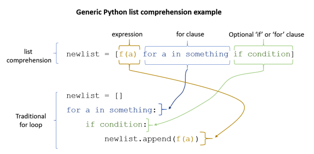</kbd>

           

        
        - The diagram above shows that the \\*components\\* of a \\*list comprehension\\* are the \\*same\\* components you would find in a typical for loop that appends to a list, but in a \\*different order\\*. With that in mind, we'll continue the specifics of this assignment. We will be very descriptive for the first function, deletes(), and less so in later functions as you become familiar with list comprehensions.
           

  
  - Exercise 4 - delete_letter (UNQ_C4)
     

    
    - \\*Instructions for delete_letter():\\*  Implement a delete_letter() function that, given a word,  returns a list of strings with one character deleted.  For example, given the word \\*nice\\*, it would return the set: {'ice', 'nce', 'nic', 'nie'}. \\* Step 1:\\* Create a list of 'splits'. This is all the ways you can split a word into Left and  Right:  For example, 'nice is split into : [('', 'nice'), ('n', 'ice'), ('ni', 'ce'), ('nic', 'e'), ('nice', '')]  This is common to all four functions (delete, replace, switch, insert).
       

        
        
<kbd>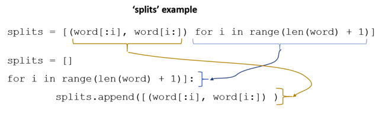</kbd>

         

      
      - \\*Step 2:\\* This is specific to \\*delete_letter\\*. Here, we are generating all words that result from  deleting one character.  This can be done in a\\* single line\\* with a \\*list comprehension\\*. You can make use of this  type of syntax:  [f(a,b) for a, b in splits if condition]  For our 'nice' example you get: ['ice', 'nce', 'nie', 'nic']
         

          
          
<kbd>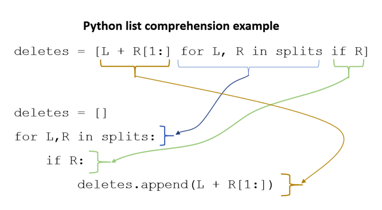</kbd>

           

        
        - \\*Levels of assistance \\* Try this exercise with these levels of assistance.  • We hope that this will make it both a \\*meaningful \\*experience but also not a  \\*frustrating\\* experience.  • Start with level 1, then move onto level 2, and 3 as needed.  ▪ Level 1. Try to think this through and implement this yourself.  ▪ Level 2. Click on the "Level 2 Hints" section for some hints to get started.  ▪ Level 3. If you would prefer more guidance, please click on the "Level 3 Hints"  cell for step by step instructions.  • If you are still stuck, look at the images in the "list comprehensions" section  above.
           

            
            
<kbd>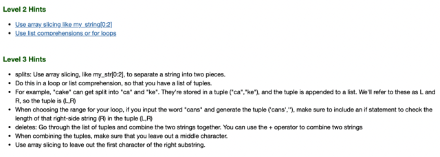</kbd>

             

            
            
<kbd>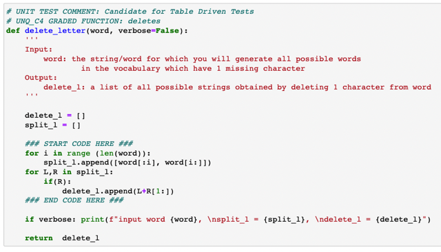</kbd>

             

            
            
<kbd>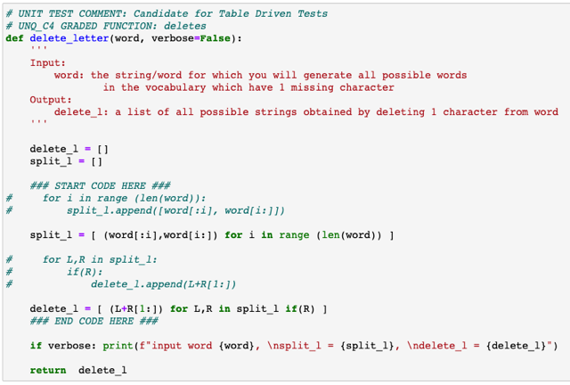</kbd>

            > [!NOTE]
            > Dùng list comprehension

             

            
            
<kbd>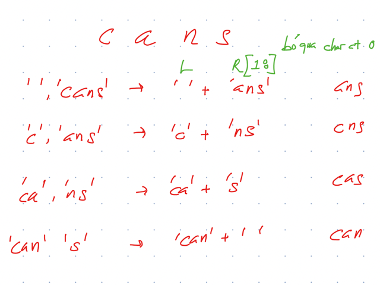</kbd>

             

            
            
<kbd>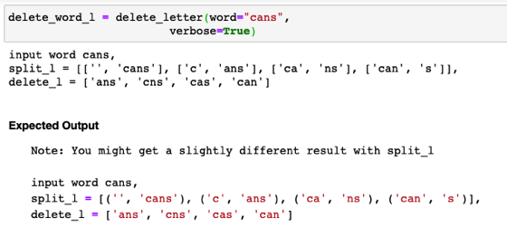</kbd>

             

            
            
<kbd>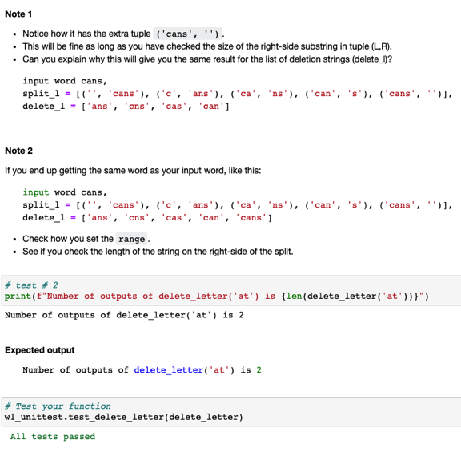</kbd>

             

  
  - Exercise 5 - switch_letter (UNQ_C5)
     

    
    - \\*Instructions for switch_letter()\\*:  Now implement a function that \\*switches two letters\\* in a word. It takes in a word and \\*returns a list of all the possible switches \\*of two letters \\*that are adjacent to each other\\*.  • For example, given the word \\*'eta'\\*, it returns \\*{'eat', 'tea'}\\*, but does not return ' ate'. \\*  Step 1:\\* is the same as in \\*delete_letter\\*()  \\*  Step 2:\\* A list comprehension or for loop which forms strings by swapping adjacent letters.  This is of the form: [f(L,R) for L, R in splits if condition] where 'condition' will test the length of R in a given iteration. See below.
       

        
        
<kbd>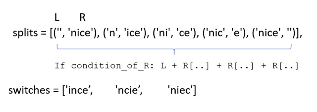</kbd>

         

        
        
<kbd>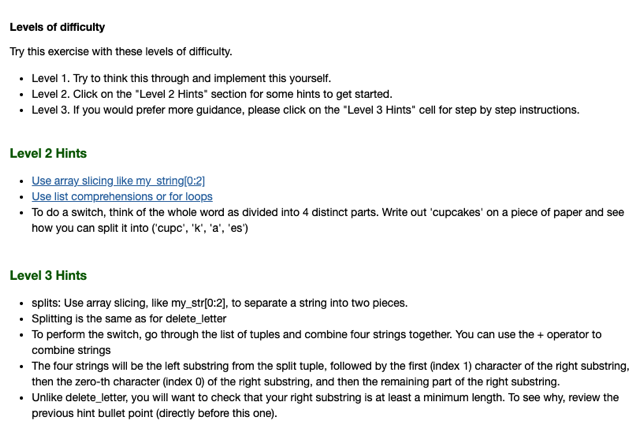</kbd>

         

        
        
<kbd>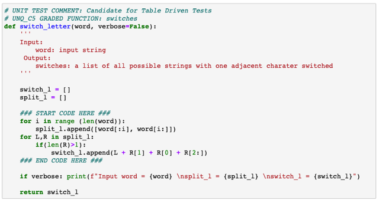</kbd>

         

        
        
<kbd>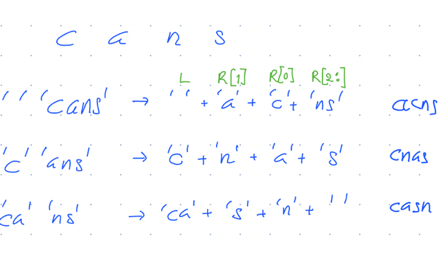</kbd>

         

        
        
<kbd>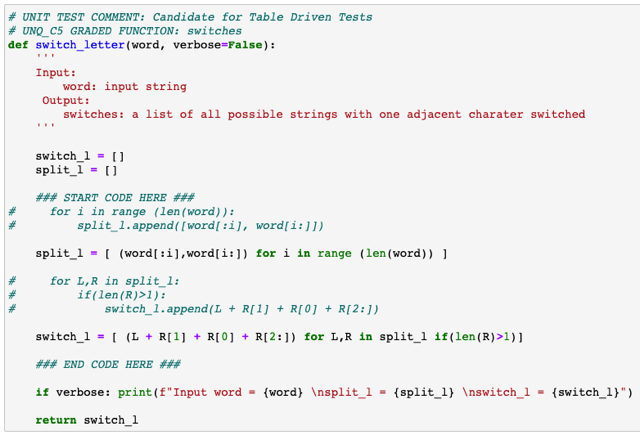</kbd>

        > [!NOTE]
        > Dùng list comprehension

         

        
        
<kbd>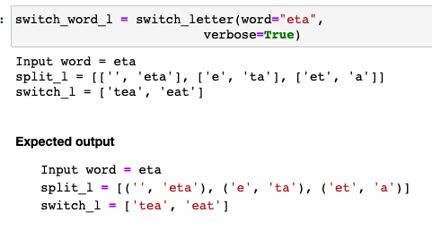</kbd>

         

        
        
<kbd>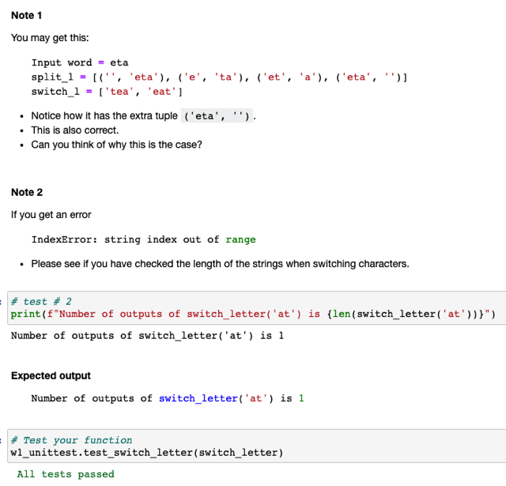</kbd>

         

  
  - Exercise 6 - replace_letter (UNQ_C6)
     

    
    - \\*Instructions for replace_letter()\\*:  Now implement a function that takes in a word and returns a list of strings with one \\*replaced letter\\* from the original word. \\*  Step 1:\\* is the same as in delete_letter() \\*  Step 2:\\* A list comprehension or for loop which form strings by replacing letters. This can be of the form:  [f(a,b,c) for a, b in splits if condition for c in string] Note the use of the second for loop. It is expected in this routine that one or more of the replacements will include the original word. For example, replacing the first letter of 'ear' with 'e' will return 'ear'. \\*   Step 3:\\* Remove the original input letter from the output.  \\*Hints\\*   • To remove a word from a list, first store its contents inside a set()  • Use \\*set.discard\\*('the_word') to remove a word in a set. Using  set.remove('the_word') throws a KeyError if the word does not exist in the set.
       

        
        
<kbd>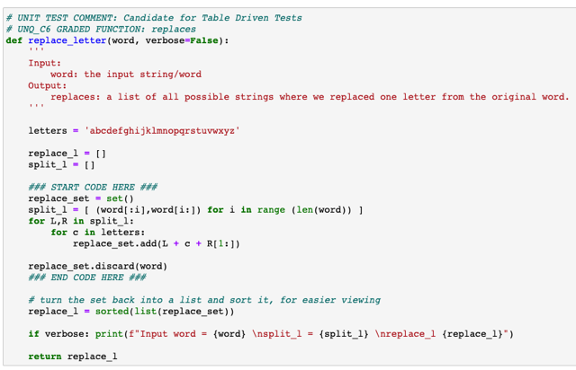</kbd>

         

        
        
<kbd>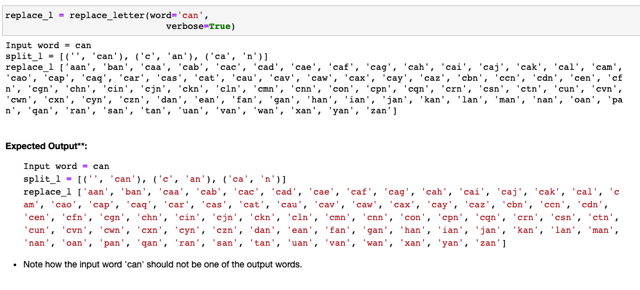</kbd>

         

        
        
<kbd>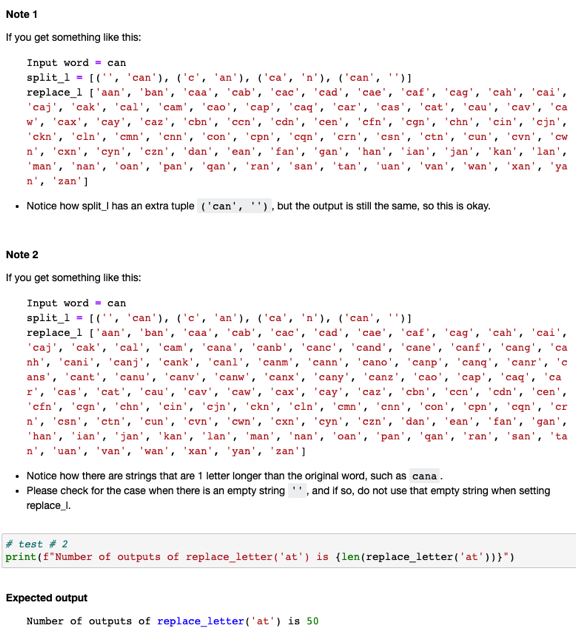</kbd>

         

  
  - Exercise 7 - insert_letter (UNQ_C7)
     

    
    - \\*Instructions for insert_letter()\\*:   Now implement a function that takes in a word and returns a list with \\*a  letter inserted\\* at \\*every offset\\*. \\*Step 1:\\* is the same as in \\*delete_letter\\*() \\*Step 2:\\* This can be a list comprehension of the form:  [f(a,b,c) for a, b in splits if condition for c in string]
       

        
        
<kbd>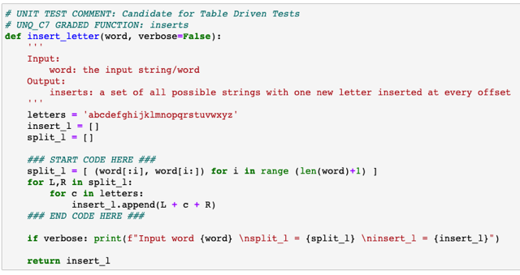</kbd>

         

      
      - Phải lấy rang len(word) + 1 để split_l nó có tuple 'word', ' ' để có insert vào cuối từ nữa
         

          
          
<kbd>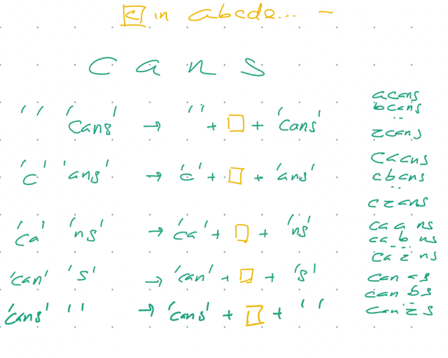</kbd>

           

          
          
<kbd>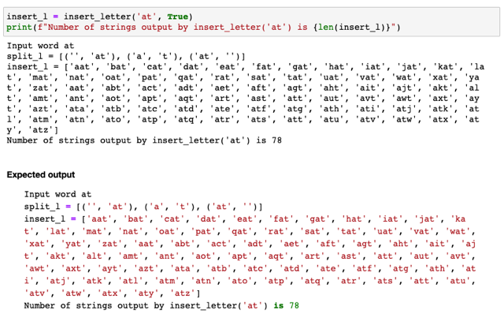</kbd>

           

          
          
<kbd>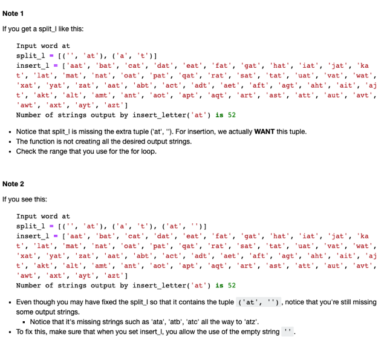</kbd>

           

- 3 - Combining the Edits
   

  
  - Combining the Edits
     

    
    - Now that you have implemented the string manipulations, you will create two functions that, \\*given a string, will return all the possible single and double edits on that string.\\* These will be \\*edit_one_letter\\*() and \\*edit_two_letters\\*()\\*.\\*
       

  
  - 3.1 - Edit One Letter
     

    
    - Exercise 8 - edit_one_letter (UNQ_C8)
       

      
      - \\*Instructions\\*:  Implement the \\*edit_one_letter\\* function to get \\*all the possible edits\\* that are \\*one edit away\\*  from a word. The edits consist of the \\*replace\\*, \\*insert\\*, \\*delete\\*, and optionally the \\*switch\\*  operation. You should \\*use the previous functions\\* you have already implemented to  complete this function. The 'switch' function is a less common edit function, so its use will  be selected by an \\*" allow_switches"\\* input argument.  Note that those functions return \\/\\*lists\\*\\/ while this function should return a \\/python \\*set\\*\\/.  Utilizing a set \\*eliminates any duplicate entries.  Hints\\*   • Each of the functions returns a list. You can combine lists using the `+` operator.  • To get unique strings (avoid duplicates), you can use the set() function.
         

          
          
<kbd>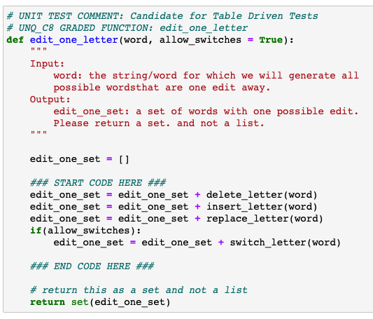</kbd>

           

          
          
<kbd>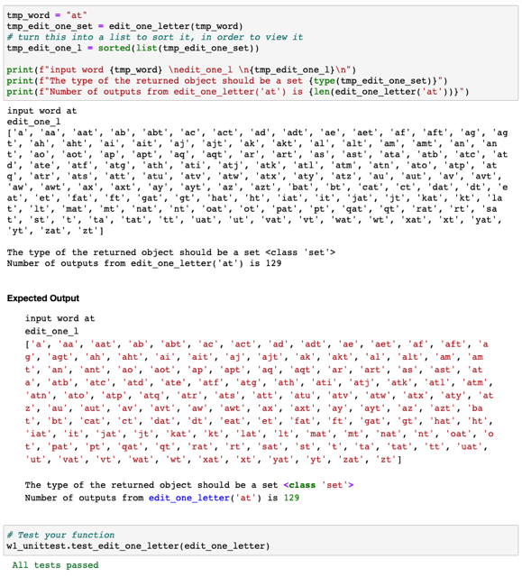</kbd>

           

  
  - 3.2 - Edit Two Letters
     

    
    - Exercise 9 - edit_two_letters (UNQ_C9)
       

      
      - \\*Exercise 9 - edit_two_letters  \\*Now you can generalize this to implement to get two edits on a word. To do so, you would  have to get \\*all the possible edits\\* on a \\*single word\\* and then \\*for each modified word, you  would have to modify it again\\*. \\* Instructions\\*: Implement the edit_two_letters function that returns a set of words that are  \\*two edits away\\*. Note that creating additional edits based on the edit_one_letter function  may 'restore' some one_edits to zero or one edits. That is allowed here. This is  accounted for in get_corrections.  \\*Hints\\*   • You will likely want to take the union of two sets.  • You can either use \\*set.update()\\* or use the\\* '|'\\* (or operator) to union two sets  • See the documentation \\_Python sets \\_for examples of using operators or  functions of the Python set.
         

          
          
<kbd>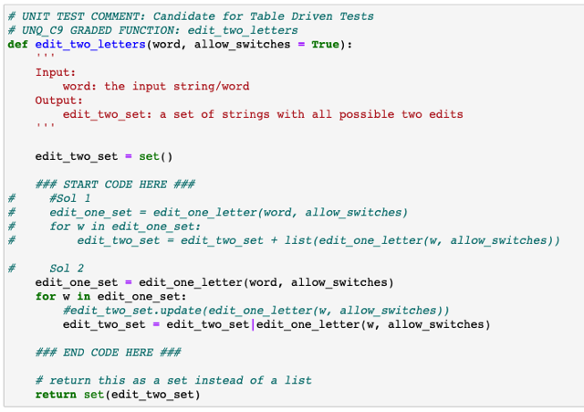</kbd>

           

          
          
<kbd>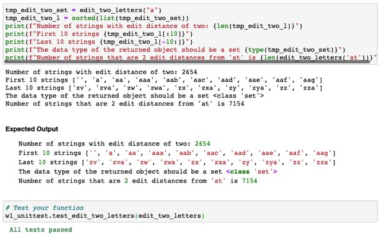</kbd>

           

  
  - 3.3 - Suggest Spelling Suggestions
     

    
    - Exercise 10 - get_corrections (UNQ_C20)
       

      
      - Now you will use your edit_two_letters function to get a set of all the possible 2 edits on  your word. You will then use those strings to get the most probable word you meant to  type a.k.a your typing suggestion.  \\*Exercise 10 - get_corrections  Instructions\\*: Implement get_corrections, which returns a list of zero to n possible  suggestion tuples of the form (word, probability_of_word). \\* Step 1:\\* Generate suggestions for a supplied word: You'll use the edit functions you have  developed. The 'suggestion algorithm' should follow this logic:  • If the word is in the vocabulary, suggest the word.  • Otherwise, if there are suggestions from edit_one_letter that are in the  vocabulary, use those.  • Otherwise, if there are suggestions from edit_two_letters that are in the  vocabulary, use those.  • Otherwise, suggest the input word.*  • The idea is that words generated from fewer edits are more likely than words  with more edits.  Note:  • Edits of two letters may 'restore' strings to either zero or one edit. This  algorithm accounts for this by preferentially selecting lower distance edits first.
         

          
          
<kbd>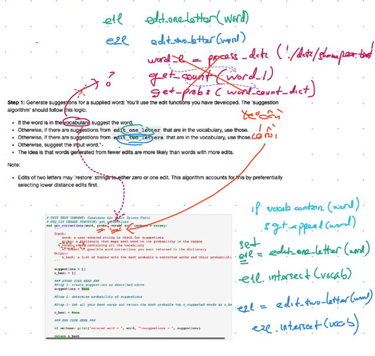</kbd>

           

          
          
<kbd>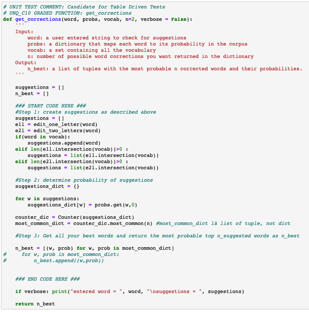</kbd>

           

          
          
<kbd>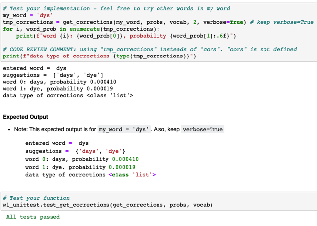</kbd>

           

- 4 - Minimum Edit Distance
   

  
  - Now that you \\*have implemented your auto-correct\\*, how do you \\*evaluate the similarity between two strings\\*? For example: '\\*waht\\*' and '\\*what\\*'  Also how do you \\*efficiently find the shortest path\\* to \\*go from the word, 'waht' to the word 'what'?\\*  You will implement a \\*dynamic programming system\\* that will tell you the \\*minimum number of edits required to convert a string into another string.\\*
     

- 4.1 - Dynamic Programming
   

  
  - Dynamic Programming \\*breaks a problem down into subproblems\\* which can be \\*combined to form the final solution\\*. Here, given a string \\*source[0..I]\\* and a string \\*target[0..j]\\*, we will compute all the combinations of \\*substrings[I, j]\\* and \\*calculate their edit distance\\*.  To do this efficiently, we will \\*use a table to maintain the previously computed substrings\\* and use those to calculate larger substrings.
     

      
      
<kbd>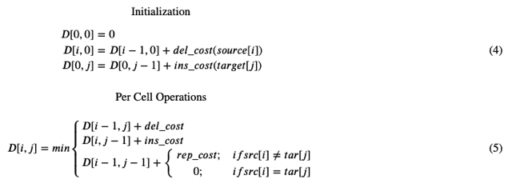</kbd>

      > [!NOTE]
      > You have to create a matrix and update each
      > element in the matrix as follows:

       

      
      
<kbd>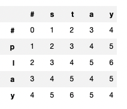</kbd>

      > [!NOTE]
      > So converting the source word '**play'** to the target
      > word '**stay'**, using an input cost of one, a delete
      > cost of 1, and replace cost of 2 would give you
      > the following table:

       

    
    - The operations used in this algorithm are '\\*insert', 'delete', and 'replace'.\\* These correspond to the functions that you defined earlier: \\*insert_letter\\*(), \\*delete_letter\\*() and \\*replace_letter\\*(). \\*switch_letter\\*() is not used here.  The diagram below describes how to initialize the table. Each entry in D[i,j] represents the \\*minimum cost\\* of \\*converting string source[0:i] to string target[0:j]\\*. The first column is initialized to represent the cumulative cost of deleting the source characters to convert string " EER" to "". The first row is initialized to represent the cumulative cost of inserting the target characters to convert from "" to "NEAR".
       

        
        
<kbd>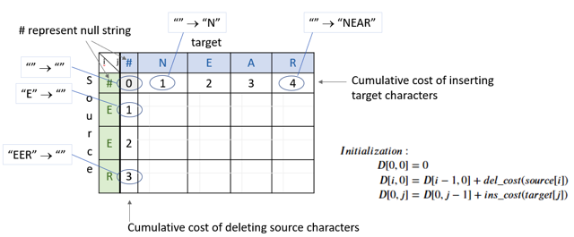</kbd>

         

        
        
<kbd>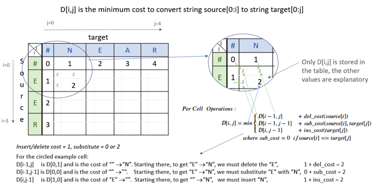</kbd>

        > [!NOTE]
        > Filling in the remainder of the table utilizes the 'Per Cell
        > Operations' in the equation (5) above. Note, the diagram below
        > includes in the table some of the 3 sub-calculations shown in light
        > grey. Only 'min' of those operations is stored in the table in the
        > min_edit_distance() function.

         

        
        
<kbd>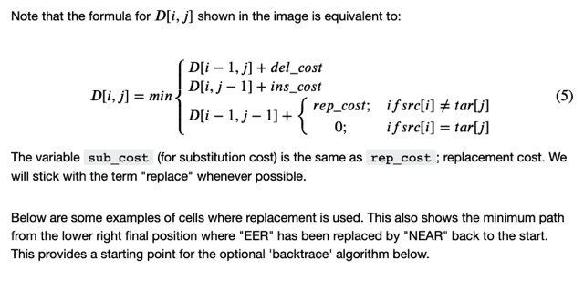</kbd>

         

        
        
<kbd>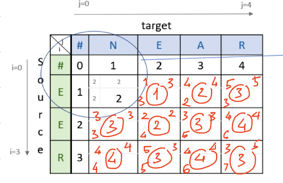</kbd>

         

        
        
<kbd>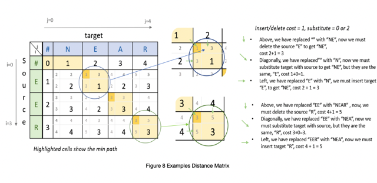</kbd>

        > [!NOTE]
        > Mấy cái này đã hiểu rồi

         

- Exercise 11 - min_edit_distance (UNQ_C11)
   

  
  - Again, the word "substitution" appears in the figure, but think of this as "replacement".  \\*Instructions\\*:  Implement the function below to get the \\*minimum amount of edits\\* required given a source string and a target string.  \\*Hints\\*  • The \\*range(start, stop, step)\\* function excludes 'stop' from its output  • \\_words\\_
     

      
      
<kbd>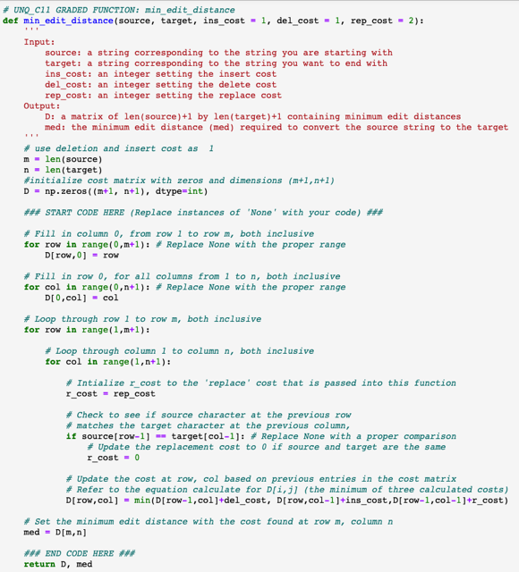</kbd>

       

      
      
<kbd>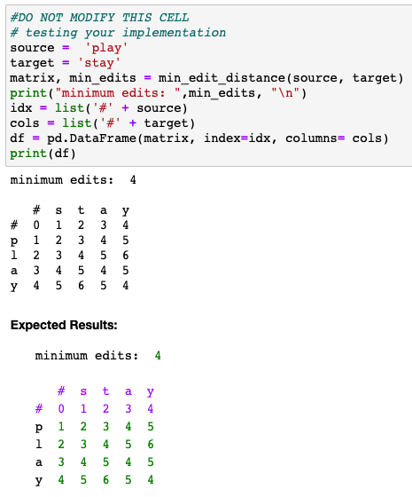</kbd>

       

      
      
<kbd>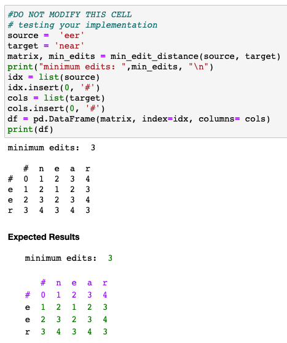</kbd>

       

      
      
<kbd>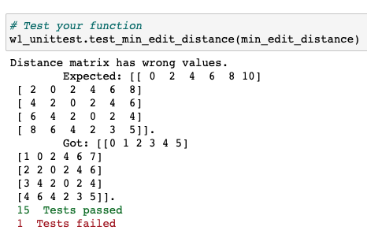</kbd>

      > [!NOTE]
      > Không hiểu sao fail 1 cái

       

      
      
<kbd>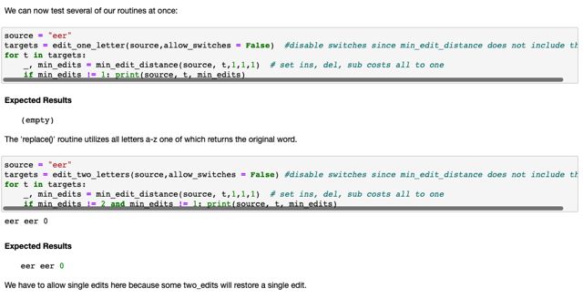</kbd>

       

- 5 - Backtrace (Optional)
   

  
  - Once you have computed your matrix using minimum edit distance, how would find the shortest path from the top left corner to the bottom right corner?  Note that you could use backtrace algorithm. Try to find the shortest path given the matrix that your min_edit_distance function returned.  You can use these lecture slides on minimum edit distance by Dan Jurafsky to learn about the algorithm for backtrace.  https://web.stanford.edu/class/cs124/lec/med.pdf
    > [!NOTE]
    > Chưa làm, quay lại sau

     

