# C2W2_PART OF SPEECH TAGGING AND HIDDEN MARKOV MODELS  Learn about \\*Markov\\* \\*chains\\* and \\*Hidden Markov models\\*, then use them  to create \\*part-of-speech\\* \\*tags\\* for a \\*Wall Street Journal text corpus!\\* \\* Learning Objectives \\*  • Markov chains  • Hidden Markov models  • Part-of-speech tagging  • Viterbi algorithm  • Transition probabilities  • Emission probabilities

📊 **Progress:** `145` Notes | `186` Screenshots

---

## Week Introduction

 

## Part Of Speech Tagging

 

<kbd>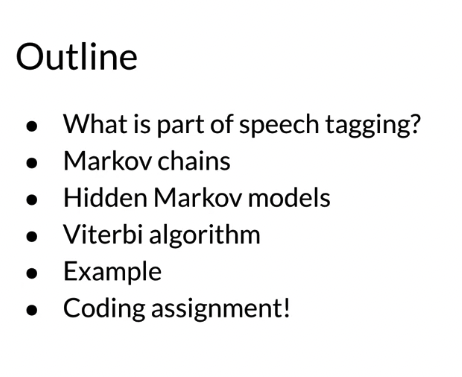</kbd>

 

<kbd></kbd>

 

<kbd>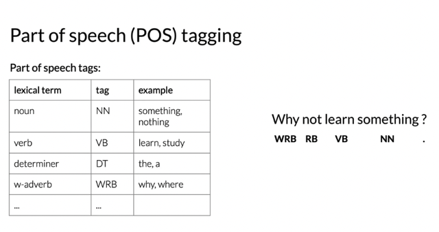</kbd>

> [!NOTE]
> Lexical: Từ vựng học /
> từ nguyên học

 

<kbd>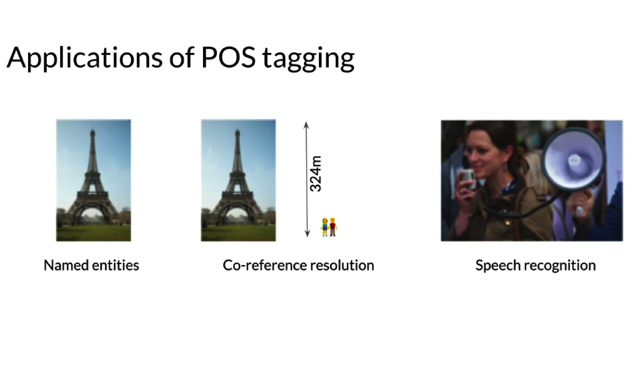</kbd>

> [!NOTE]
> Một số ứng dụng của **POS tagging** -
> Part of Speech tagging như Name
> Entities đại khái như

 

### Because \\*POS tags\\* describe the \\*characteristic structure of lexical terms\\* in a

> [!NOTE]
> Because \**POS tags\** describe the \**characteristic structure of lexical terms\** in a
> sentence or text, you can use them to \**make assumptions about semantics.\**
> They're used for identifying named entities too. In a sentence such as the Eiffel
> Tower is located in Paris, Eiffel Tower and Paris are both named entities. 
>
> Tags
> are also used for coreference resolution. If you have the two sentences, the
> \**Eiffel Tower\** is located in Paris, \**it\** is 324 meters high, you can use part-of-speech
> tagging to infer that \**it refers in this context to the Eiffel Tower.\** 
>
> Another
> application is \**speech recognition\**, where you use parts of speech tags to \**check
> if a sequence of words has a high probability or not\**.

> [!NOTE]
> \/"Because **POS tags** describe the **characteristic structure of lexical
> terms** in a sentence or text, you can use them to **make assumptions
> about semantics."**\/
>
> Bởi vì các thẻ POS mô tả **cấu trúc đặc trưng của các thuật ngữ** từ
> vựng trong một câu hoặc văn bản, bạn có thể sử dụng chúng để**đưa ra
> các giả định về ngữ nghĩa.**

 

- Part of Speech Tagging (POS) is the process of \\*assigning a Part of  Speech tag to a word\\*. By doing so, you will learn the following:    • \\*Markov Chains\\*  • \\*Hidden Markov Models\\*  • \\*Viterbi algorithm\\*
  > The POS tagging is process of **assigning a POS tag to a word**
> "POS tagging là quá trình \/**Gán một POS cho một từ**. Cứ
> hiểu POS là loại từ, thì POS là quá trình **gán loại từ cho một
> từ** nào đó.\/

   

    
    
<kbd>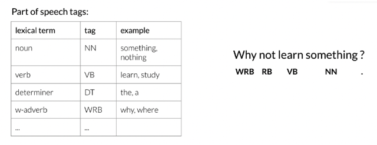</kbd>

     

  
  - You can use \\*part of speech tagging for\\*:     • \\*Identifying named entities\\*  • \\*Speech recognition\\*  • \\*Coreference Resolution\\*   You can use the \\*probabilities\\* of \\*POS tags\\* \\*happening near  one another\\* to \\*come up with the most reasonable output\\*.
    > Hiểu đại khái là nếu mình biết **xác suất một loại từ nào đứng
> cạnh một loại từ nào đó cao** hay thấp, hay nôm na kiểu ví dụ
> như **sau một 'Danh từ' thường là một 'động từ'**  thì thông tin
> này sẽ nhiều khả năng **giúp mình kết luận được chính xác
> hơn cái nào là đúng trong nhiều chuỗi các từ** mà  Speech
> recognition 'nghe được' (ví dụ trong vấn đề Speech
> Recognition)

     

## Lab: Working With Text Files

 

### In this lecture notebook you will \\*create a vocabular\\*y from a \\*tagged dataset \\*and learn how

> [!NOTE]
> In this lecture notebook you will \**create a vocabular\**y from a \**tagged dataset \**and learn how 
> to \**deal with words\** that are \**not present in this vocabulary\** when \**working with other text 
> sources\**. Aside from this you will also learn how to:
>
>  • \**read text files\**
>  • \**work with defaultdict\**
>  • \**work with string data\**

 

- Read Text Data
   

  
  - A \\*tagged dataset\\* taken from the \\*Wall Street Journal\\* is provided in the  file \\*WSJ_02-21.pos\\*.  To \\*read this file\\* you can use \\*Python's context manager\\* by using the with \\*keyword 'open'\\* and  \\*specifying the name of the file\\* you wish to read. To actually save the contents of the file  into memory you will need to use the\\* readlines()\\* method and \\*store its return value in a  variable\\*.  \\*Python's context managers\\* are great because you \\*don't need to explicitly close\\* \\*the  connection to the file\\*, this is done under the hood:
    > Đầu tiên phải hiểu rằng Wall Street Journal nó cung cấp sẵn một bộ dữ liệu "tagged
> dataset" - là các từ được gắn (tag) với loại từ (POS tag). Lưu trong file WSJ_02-21.
> pos
>
> Ta sẽ dùng **Python's context manager**để open file này bằng keyword 'open', và
> dùng lệnh 'readlines()' để đọc và save content của file này vào một variable
>
> Ổng còn nói thêm là không cần phải close connection tới file khi  xong, nó tự làm
> luôn, rất tiện

     

    
    - # Read lines from 'WSJ_02-21.pos' file and save them into the '\\*lines\\*' variable \\*with\\* \\*open\\*("\\/\\*./data/WSJ_02-21.pos\\*\\/", 'r') as \\*f\\*:     \\*lines\\* = f.\\*readlines\\*()
      > thì lines sẽ là 1 array các line, trong file
> WSJ_02-21.pos, 1 line có nội dung 
> là 1 từ + 1 tag (POS tag), ví dụ: 
>
> review\tNN\n 
>
> \t là kí tự 'tab' '\n' là 'xuống dòng'

       

      
      - # Print columns for reference print("\\\\t\\\\tWord", "\\\\tTag\\\ ")  # Print first five lines of the dataset for I in range(5):     print(f'line number {I+1}: {\\*lines[I]\\*}')
         

          
          
<kbd>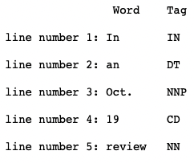</kbd>

           

        
        - Each \\*line\\* within the dataset has a \\*word\\* followed by its \\*corresponding tag\\*. However since  the printing was done using a formatted string it can be inferred that the \\*word\\* and  the \\*tag\\* are \\*separated by a tab\\* (or some spaces) and there is a \\*newline at the end of  each line\\* (notice that there is a space between each line).  If you want to understand the meaning of these tags you can take a look \\_here\\_.
           

            
            
<kbd>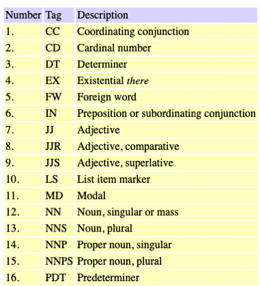</kbd>

             

            
            
<kbd>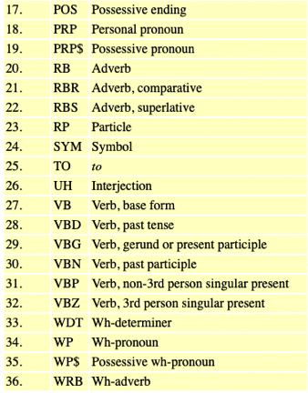</kbd>

             

          
          - To better understand how the information is structured in the dataset it is recommended to \\*print an unformatted version of it:\\*
             

              
              
<kbd>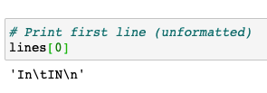</kbd>

              > \t = tab, \n = new line

              > Indeed there is a **tab** between the
> word and the tag and a **newline** at
> the end of each line.

               

- Creating a vocabulary
   

  
  - Now that you understand \\*how the dataset is structured\\*, you will \\*create a vocabulary\\* out  of it. A vocabulary is made up of \\*every\\* \\*word\\* that \\*appeared at least 2 times\\* in the dataset.  For this, follow these steps:  • Get \\*only the words\\* from the dataset  • Use a \\*defaultdict\\* to \\*count the number of times\\* each word \\*appears\\*  • \\*Filter the dict\\* to \\*only\\* \\*include\\* words that appeared \\*at least 2 times\\*  • \\*Create a list\\* out of the \\*filtered dict\\*  • \\*Sort the list\\*
     

    
    - # Get the words from each line in the dataset words = [line.split(\\*'\\\\t'\\*)[\\*0\\*] for line in lines]
      > Giờ ta đã biết list comprehension trong Python thì cái
> này tương đương như sau:
>
> **words = [] 
> for line in lines:  
>     words.append(line.split('\\t')[0])**

      > For step 1 you can use **the fact** that every word and tag
> are **separated by a tab** and that  **words always come
> first.** Using \/list comprehension\/ the words list can be
> created like this:
>
> Đại khái không có gì khó hiểu cả, vì **ta đã biết** **nó có dạng**
> **word + tab + tag** thì ta **split nó bằng tab** character rồi **lấy
> thằng đầu** sẽ cho ra word

       

      
      - Step 2 can be done easily by \\*leveraging defaultdict\\*. In case you aren't familiar with  \\*defaultdicts\\* they are a \\*special kind of dictionaries\\* that \\*return the "zero" value of a type  if you try to access a key that does not exist\\*. Since you want the \\*frequencies\\* of  words, you should define the \\*defaultdict\\* with a \\*type of int.\\*  Now you don't need to worry about the case when the word is not present within the  dictionary because getting the value for that key will simply return a zero. Isn't that cool?
        > Đại khái nói cho ta biết về cái \/**defaultdict**\/ trong python, là cái
> dict mà nếu đòi lấy ra một key không trong dict thì nó sẽ tạo key đó
> với value = 0, thay vì báo lỗi, That's it. Thì đại khái là mình dùng cái
> này để làm step 2 - Use a **defaultdict** to **count the number of
> times** each word **appears**

         

        
        - # Define defaultdict of type 'int' freq = \\*defaultdict(int)\\*  # \\*Count frequency of occurrence\\* for each word in the dataset \\*for word in words:     freq[word] += 1\\*
          > Có nghĩa làm với **defaultdict tiện lợi hơn** thấy
> không, thay vì **bình thường là phải check xem
> từ/key đó có tồn tại** chưa, nếu chưa thỉ add vào
> với value = 1, nếu rồi thì add thêm 1 vào value.
> Không khó nhưng rõ ràng  **dài dòng hơn nhiều**. Cái
> này **chỉ việc access key  nếu không có nó tự trả về
> 0 và mình += 1 thì nó tự động cập nhật** thêm word
> vào key và value thành 1

           

          
          - \\*Filtering\\* the \\*freq\\* \\*dictionary\\* can be done using \\*list comprehensions\\* again (aren't they handy?). You should filter out words that \\*appeared only once\\* and also \\*words\\* that are \\*just a newline character\\*:
            > Tiếp là filter **loại bỏ những từ chỉ xuất hiện 1
> lần** và những từ dạng **'\ '**. Dùng list
> comprehension tiếp rất tiện lợi + gọn

             

            
            - # Create the vocabulary by filtering the 'freq' dictionary vocab = [k for k, v in \\*freq.items()\\* if (v > 1 and k != '\\\ ')]
              > Rất dễ hiểu khi ta đã biết list
> comprehension trong Python: 
>
> [action | for term | conditional term]
>
> vocab = []
>
> for k,v in freq.items():
>     if(v>1 and k!='\n'):
>         vocab.append(k)

               

              
              - # Sort the vocabulary vocab.\\*sort()\\*  # Print some random values of the vocabulary for I in range(4000, 4005):     print(vocab[I])
                > Finally, the **sort method** will take care
> of the final step. **Notice that it changes
> the list directly so you don't need to
> reassign the vocab variable:**

                 

                  
                  
<kbd>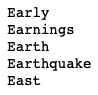</kbd>

                   

                
                - Now you have successfully \\*created a vocabulary from the dataset.\\* \\*Great job\\*! The vocabulary is \\*quite extensive\\* so it is not printed out but you can still do so by creating a cell and running something like print(vocab).  At this point you will u\\*sually write the vocabulary into a file\\* for future use, but that is out of the scope of this notebook. If you are curious it is very similar to how you read the file at the beginning of this notebook.
                  > Đại khái là vậy là ta đã có **1 bộ vocabulary** với **word - count** 
> trong corpus để xài. Thì ổng nói **thông thường** ta sẽ
> **save nó vào file để mà xài** sau này nhưng ở đây không làm
> nhưng muốn làm cũng dễ gợi ý là nó rất giống với đoạn
> code read the file

                   

                  
                  - # Read lines from 'WSJ_02-21.pos' file and save them into the 'lines' variable with open("./data/WSJ_02-21.pos", 'r') as f:     lines = f.readlines()  # Get the words from each line in the dataset words = [line.split('\\t')[0] for line in lines]  # Define defaultdict of type 'int' freq = defaultdict(int)  # Count frequency of ocurrence for each word in the dataset for word in words:     freq[word] += 1  # Sort the vocabulary vocab.sort()  # Print some random values of the vocabulary for i in range(4000, 4005):     print(vocab[i])
                    > Tự tổng hợp lại, chỉ với mấy dòng
> bọ mà ta đã có một bộ vocab:
> word- count rất ngon

                     

- Processing new text sources
   

  
  - Dealing with unknown words
     

    
    - Now that you have a \\*vocabulary\\*, you will use it when processing new text sources. \\*A  new text will have words that do not appear in the current vocabulary\\*. To tackle this,  you can simply \\*classify each new word\\* as an \\*unknown one\\*, but you can do better by  \\*creating a function\\* that tries to \\*classify the type of each unknown word\\* and \\*assign it a  corresponding unknown token\\*
       

      
      - This function will do the following \\*checks\\* and return an \\*appropriate token\\*:  • Check if the unknown word \\*contains any character that is a digit\\*  ▪ return --\\*unk_digit\\*--  • Check if the unknown word contains any \\*punctuation\\* character  ▪ return --\\*unk_punct\\*--  • Check if the unknown word contains any \\*upper-case character\\*  ▪ return --\\*unk_upper\\*--  • Check if the unknown word \\*ends with a suffix\\* that could indicate it is a noun,  verb, adjective or adverb  ▪ return --\\*unk_noun\\*--, --\\*unk_verb\\*--, --\\*unk_adj\\*--, --\\*unk_adv\\*-- respectively
        > Đại khái là nói về việc handle 1 từ không có trong từ điển
> (vocabulary - dict) thì ta có thể viết một function check và
> assign token cho từ đó theo gợi ý 
>
> Kiểu như xem nó có chưa số không, có thì gán cho nó --unk_digit--,
> hoặc là --unk_punct-- (Unknown punctuation)...

         

        
        - If a word fails to \\*fall\\* under any condition then its token will be a\\* plain --unk--\\*. The  conditions will be evaluated in the \\*same order as listed here\\*. So if a word contains a  punctuation character but does not contain digits, it will fall under the second condition.  To achieve this behaviour some \\*if/elif statements\\* can be used along with \\*early returns\\*.  This function is implemented next. Notice that the \\*any()\\* \\*function\\* is being \\*heavily used\\*. It  returns True if at least one of the cases it evaluates is True.
          > Đại khái là các condition sẽ
> làm theo order như vậy

           

          
          - def \\*assign_unk\\*(word):     """     Assign tokens to unknown words     """          # \\*Punctuation characters\\*     # Try printing them out in a new cell!     punct = set(\\*string.punctuation\\*)           # \\*Suffixes\\*     \\*noun_suffix\\* = ["action", "age", "ance", "cy", "dom", "ee", "ence", "er", "hood", "ion", "ism", "ist", "ity", "ling", "ment", "ness", "or", "ry", "scape", "ship", "ty"]     \\*verb_suffix\\* = ["ate", "ify", "ise", "ize"]     \\*adj_suffix\\* = ["able", "ese", "ful", "i", "ian", "ible", "ic", "ish", "ive", "less", "ly", "ous"]     \\*adv_suffix\\* = ["ward", "wards", "wise"]      # \\*Loop the characters in the word, check if any is a digit\\*     if \\*any\\*(\\*char.isdigit\\*() for char in word):         return "--\\*unk_digit\\*--"      # Loop the characters in the word, check if any is a punctuation character     elif any(char \\*in\\* \\*punct\\* for char in word):         return "--\\*unk_punct\\*--"      # Loop the characters in the word, check if any is an upper case character     elif \\*any\\*(\\*char.isupper\\*() for char in word):         return "--\\*unk_upper\\*--"      # Check if word ends with any noun suffix     elif any(\\*word.endswith\\*(\\*suffix\\*) for suffix in \\*noun_suffix\\*):         return "--unk_noun--"      # Check if word ends with any verb suffix     elif any(\\*word.endswith\\*(\\*suffix\\*) for suffix in \\*verb_suffix\\*):         return "--unk_verb--"      # Check if word ends with any adjective suffix     elif any(\\*word.endswith\\*(\\*suffix\\*) for suffix in \\*adj_suffix\\*):         return "--unk_adj--"      # Check if word ends with any adverb suffix     elif any(\\*word.endswith\\*(\\*suffix\\*) for suffix in \\*adv_suffix\\*):         return "--unk_adv--"          # If none of the previous criteria is met, return plain unknown     return "--unk--" 
            > Thì người ta làm sẵn cho đây, có thể P.A sẽ bắt làm lại cái này

            > Điểm độc chiêu 1:  1 dòng kết hợp if và loop rất gọn
>
> if any(**char.isdigit**() for char in word):
>         return "--**unk_digit**--"
>
> Cái này tương đương như sau nếu viết theo thông thường
>
> for char in word:
>  if char.isdigit() return '--unk_digit--"

             

            
            - A POS tagger will \\*always encounter\\* words that are not within the vocabulary that is being used. By augmenting the dataset to include these \\*unknown\\* word tokens you are \\*helping the tagger to have a better idea\\* of the appropriate tag for these words.
               

  
  - Getting the correct tag for a word
     

    
    - All that is left is to \\*implement a function\\* that will \\*get the correct tag\\* for a \\*particular word\\*  taking special considerations for unknown words. Since the dataset provides each word  and tag within the same line and a word being known depends on the vocabulary used,  these two elements should be arguments to this function.  This function should \\*check if a line is empty\\* and if so, it should return a \\*placeholder\\* \\*word\\*  and \\*tag\\*, \\*--n--\\* and \\*--s--\\* respectively.  If not, it should process the line to return the \\*correct word\\* and \\*tag\\* pair, considering if a  word is unknown in which scenario the function \\*assign_unk\\*() should be used.  The function is implemented next. Notice that the \\*split()\\* method can be used without  specifying the \\*delimiter\\*, in which case it will default to \\*any whitespace\\*.
      > Cuối cùng là tổng hợp lại và viết một function để
> nhận một linę (tức là trong quá trình readline() 
> ở trên để đọc từ file WJS..) và tách ra thành word, và tag (POS tag)
>
> .split() mà ko có delimiter thì default sẽ
> là split bởi 'any whhitespace'

       

      
      - def \\*get_word_tag\\*(\\*line\\*, \\*vocab\\*):     # If \\*line is empty\\* return placeholders for word and tag    \\* if not line.split(): \\*\\/#Tức là nếu split bởi whitespace mà  #vẫn không có gì, thì tức là line is empty\\/         word = "--n--"         tag = "--s--"     else:         # Split line to separate word and tag \\/#Cái này cũng là split  #bởi (any) whitespace vì tab (mỗi line của data có dạng word + tab + tag) cũng là  #whitespace \\/        word, tag =\\* line.split()\\*         # Check if word is not in vocabulary         if \\*word\\* \\*not in vocab: \\*             # Handle unknown word             tag = \\*assign_unk(word) \\*    return \\*word, tag\\*
         

          
          
<kbd>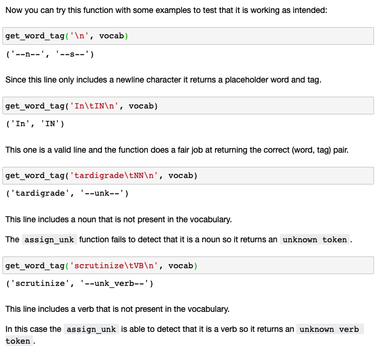</kbd>

           

- Congratulations on finishing this lecture notebook! Now you should be more familiar with working with text data and \\*have a better understanding\\* of how a \\*basic POS tagger works\\*.  Keep it up!
   

## Markov Chains

 

### 1 Introduction to Markov Chains:

> [!NOTE]
> 1 Introduction to Markov Chains:
> a. Markov chains are \**crucial\** in \**speech recognition \**and \**parts of speech tagging POS\**.
> b. \**Transition probabilities\** and \**states\** are \**fundamental concepts\** in Markov chains.
>
>  2 Example: \**Transition Probabilities\**:
> a. A small example is used to \**illustrate\** the \**concept of transition probabilities\** in Markov chains.
> b. The \**likelihood of the next word's part of speech tag\** \**depends\** \**on the previous word's tag\**.
> c. \**Arrows\** and \**circles\** are used to \**visually represent transition probabilities between states\**.
>
>  3 Understanding \**Markov Chains\**:
> a. Markov chains are \**stochastic\** \**models\** that \**describe sequences of events\**.
> b. They \**rely on previous event states\** to determine the \**probability of each event.\**
> c. Stochastic models incorporate \**randomness\** and have a \**random component.\**
>
>  4 Depicting Markov Chains:
> a. Markov chains can be represented as \**directed graphs\**.
> b. Graphs consist of \**circles\** (nodes) \**connected by lines\** (edges) with \**directional arrows.\**
> c. \**Each circle represents a state \**in the model, \**reflecting a specific condition\** at the \**present moment\**.
>
>  5 States in Markov Chains:
> a. \**States\** in Markov chains \**can correspond to part of speech tags\**, among other conditions.
> b. For example, \**verbs\** and \**nouns\** can be \**represented by different states in the model\**.
> c. \**States are labeled \**using \**unique names\** (e.g., \**q1, q2, q3)\**, and the \**set of all states\** is denoted by\**Q\**.
>
>  6 Next Steps: P\**arts of Speech Tagging\**:
> a. The upcoming video will delve into \**parts of speech tags\** in the context of \**Markov chains\**.
> b. Parts of speech tags provide a way to \**label words\** based on their \**grammatical function\**.

 

  
  
<kbd>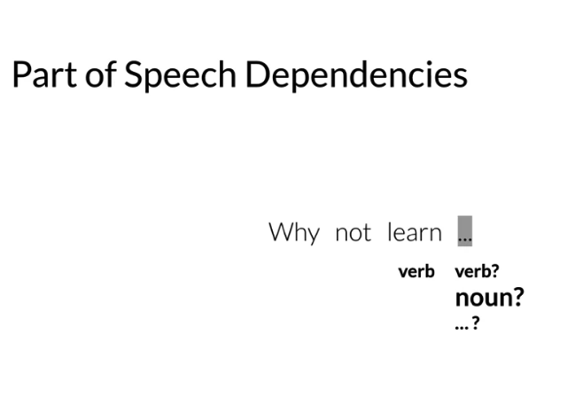</kbd>

  > If you look at the sentence, "**Why not learn...??"**, the word learn is a verb. The
> question you want to answer is **whether the following word in the sentence is a
> noun, a verb, or some other parts of speech**. If you're familiar with the English
> language, you might guess that if you see a **verb** in the sentence, the
> **following** word is **more likely to be a noun**. Rather than another verb.
>
> \/**So the idea here, is that the likelihood of the next words part of speech tag in
> a sentence tends to depend on the part of speech tag of the previous word**\/.
> Makes sense, right?

  > So the idea here, is that the **likelihood** of the **next words's**
> **part of speech tag** in a sentence **tends** to **depend** on
> the **part of speech tag of the previous word**Đại khái là trong một câu, khả năng / **xác suất của một từ là
> loại từ** **gì** sẽ d**epend vào loại từ của từ trước đó**.

   

  
  
<kbd>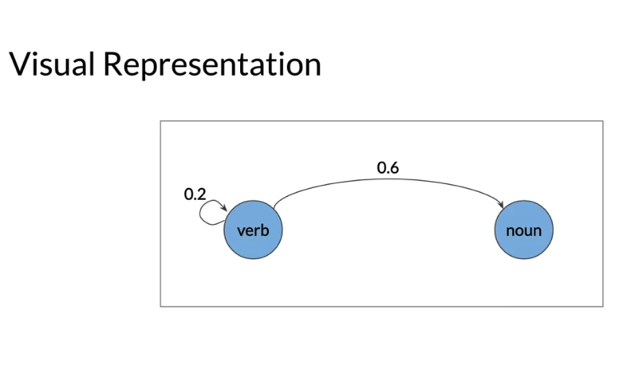</kbd>

  > Đại khái cái hình vẽ kiểu này gọi là Markov chain. Giá trị
> từ verb -> noun là 0.6 nghĩa là **xác suất (probability) sau
> 1 verb là một noun là 0.6.**Trong khi đó **khả năng sau verb
> là một verb chỉ có 0.2**

   

  
  
<kbd>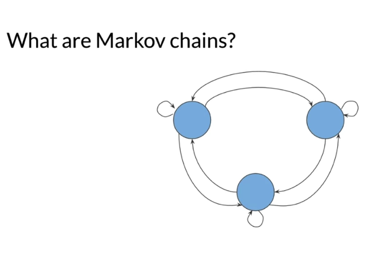</kbd>

  > So what's our Markov chains? They're a type of**stochastic model** that describes a
> **sequence of possible events.** To get the **probability for each event**, it needs only
> the**states of the previous events**. The word **stochastic** just means random or
> **randomness**. So a stochastic model, incorporates and models processes does have
> a random component to them.

  > Markov chain là một mô hình ngẫu nhiên - **stochastic** (=random:
> ngẫu nhiên) model - mô tả **chuỗi các sự kiện có thể xảy ra**. Mà
> trong đó khả năng **(probability) xảy ra sự kiện này chỉ phụ thuộc
> vào trạng thái (state) của event** trước đó

   

  
  
<kbd>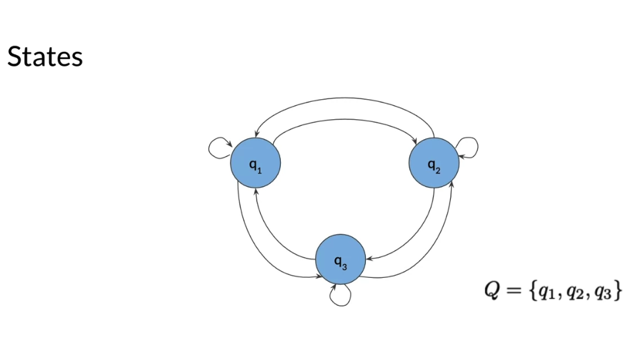</kbd>

  > A **Markov chain**, can be **depicted** as a **directed graph**. So in the context of **Computer
> Science**, a graph is a **kind of data structure** that is visually represented, as a set of
> **circles connected by lines**. When the lines that connect the circles have **arrows** that
> indicates a certain **direction**, this is called a **directed graph**. The **circles** of the graph,
> represents **states of our model**. A state refers to a **certain condition of the present
> moment**. For example, if you are using a graph to model whether **water** is in a **frozen**
> state, a **liquid** state, or a **gas** state. Then you would draw a circle, for each of these
> states to represent the three **possible states that water** **can be at the present
> moment**. I'm labeling each state as **q1, q2, q3** etc. To give them each a unique name.
> Then referring to the set of all states with a capital letter **Q**. For this graph there are
> three states, q1, q2, and q3. Next up, get ready to use Markov chains to tag parts of
> speech.

  > Đại khái là nói qua về khái niệm **Markov chain** trong **Computer Science.**
>
> Đại khái là vẽ circle với **q1, q2, q3** là **các trạng thái (state)**có thể có, thì các
> **directed line** sẽ thể hiện sự**thay đổi trạng thái từ này sang trạng thái khái**.
>
> Thì đại khái Markov dùng identify khả năng của từ kế tiếp sẽ là POS tag loại gì tính từ
> hay danh từ

   

  
  
<kbd>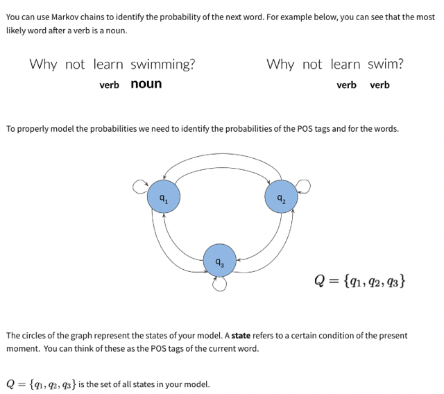</kbd>

   

## Markov Chains And Pos Tags

 

### 1 Introduction to \\*parts of speech tags\\* and \\*transition probabilities\\*

> [!NOTE]
> 1 Introduction to \**parts of speech tags\** and \**transition probabilities\**
>
> 2 Representation of \**sentences\** as \**graphs\** with \**part of speech tags\** as
> \**events\**
>
> 3 \**Markov property\** in modeling \**transition probabilities\**
>
> 4 \**Analogy\** of \**water states\** (solid, liquid, gas) to understand \**Markov chains\**
>
> 5 \**Probability\** \**calculation\** based on \**current state\** for the \**next word\** in a
> sentence
>
> 6 \**Transition matrix\** as a \\/\**compact\\/ representation of the Markov chain\**
> model
>
> 7 Flaw in the model: assigning part of speech tag to the \**first word\**
>
> 8 Introduction of an \**initial state\** to handle the\**first word in a sentence\**
>
> 9 Recap of Markov chains, including \**states\** and \**transition matrix\**
>
> 10 Conclusion of the video and preview of the next topic: \**hidden Markov
> models for decoding hidden states\**

 

  
  
<kbd>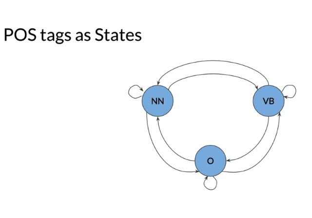</kbd>

  > Now, you know what **states** are. In this video, we're going to introduce **parts of
> speech tags**. In other words, you will see how you can **go from one state** to
> **another state**. In doing so, we will define a term that we call **transition
> probabilities**. These transition probabilities tell you about **the chances of going
> from one POS tag to another**. If you think about a sentence as a sequence of
> words with associated part of speech tags. You can **represent that sequence
> with a graph**. Where the **parts of speech tags are events that can occur.**
> Depicted by the state of our model graph. In this example, **NN** is for a noun,
> **VB** is for verbs. And **other**, stands for all other tags.

  > If you think about a **sentence as a sequence of words with
> associated part of speech tags**. You can represent that
> **sequence** with a **graph**
>
> Coi mỗi **POS của từ trong câu** là một **state**, thì **cái câu là
> sequence các state transition sang state khác** có thể vẽ
> thành một cái **graph**. Như từ Noun transition thành Verb, từ
> Verb transition thành Adj chẳng hạn
>
> Và define cái gọi là **Transition probability** cho biết khả năng, **xác
> suất một POS (state) này theo sau bởi (transition) to một POS
> khác (state khác) là bao nhiêu**.

   

  
  
<kbd>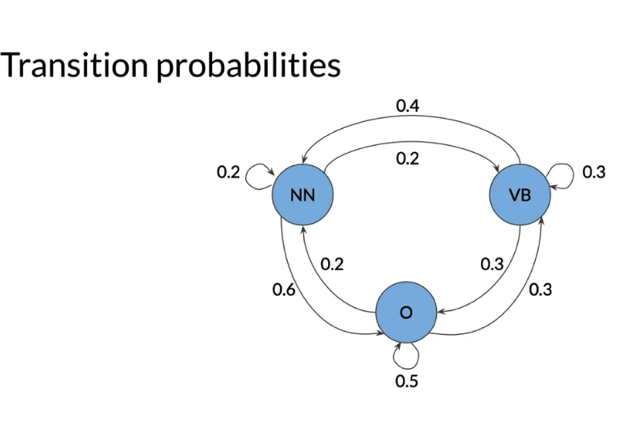</kbd>

  > The edges of the graph have **weights** or **transition probabilities** associated with
> them. Which defined the **probability of going from one state to another**.
>
> There is one less important property that's Markov chains possess. The so called
> **Markov property.** Which states that the **probability of the next event only depends on
> the current event.** The Markov property helps keep the model simple. By saying, **all
> you need to determine the next state is the current states**.**It doesn't need information
> from any of the previous states.**

  > Con số gắn với mỗi transition là **transition probability thể hiện
> xác suất biến từ state này trở thành state kia.**Ở đây hiểu là có **40% khả năng state Verb transition thành
> state Noun** hay có 40% khả năng t**heo sau một Verb là một Noun**
> Và cái probability này c**hỉ phụ thuộc vào trạng thái hiện tại là
> Verb**, chứ **không quan tâm trước đó là gì. Tính chất này gọi là
> Markov property giúp giữ cho model đơn giản**

  > Going back to the analogy whether water is in solid, liquid or gas states. If you
> look at a cup of water that is sitting outside. The current state of the water is a
> liquid states. When modeling the probability that the water in the cup will transition
> into the gas states. You **don't need to know the previous history of the water**.
> Whether it's previously came from ice cubes. Or whether it's previously came from
> rain clouds

  > Đại khái là lấy minh hoạ như chuỗi các trạng thái của
> nước, thì trạng thái tiếp theo của nước **CHỈ PHỤ
> THUỘC VÀO TRẠNG THÁI HIỆN TẠI CỦA NÓ LÀ GÌ
> (THỂ LỎNG)** chứ **KHÔNG CẦN BIẾT TRƯỚC ĐÂY
> NÓ LÀ GÌ** (HƠI NGƯNG TỤ THÀNH LỎNG, HAY ĐÁ
> TAN THÀNH LỎNG
>
> Điều này rất logic., thì cái mô hình Markov này cũng vậy

   

  
  
<kbd>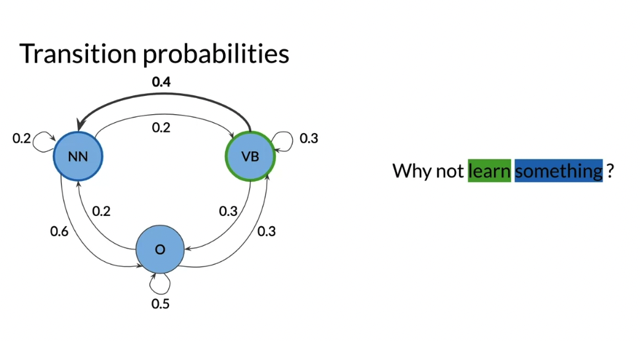</kbd>

  > If you look at this sentence again and want to know the **probability that
> the next word**. Following 'learn' is a **noun**. Then this just **depends on the
> current state that you're in**. In this case, the **verb** states denoted by VB.
> Because the current word learn is a verb. **So, the probability of the next
> word being a noun is the transition probability for going from the verb to
> the noun and N states.** The transition probability is written on the arrow
> that goes from VB to NN. And as you can see, it's **0.4**.

  > State kế tiếp - POS của từ kế tiếp **chỉ phụ thuộc (depend) vào
> current state** - POS của từ hiện tại. Idea của Markov chain là
> vậy. Nên probability của next state là noun nếu hiện tại là verb là
> 0,4
>
> Tương tự như ví dụ về nước, **nếu từ hiện tại đang là 'Danh từ',** thì từ **kế tiếp chỉ phụ thuộc vào một sự thật là khả năng cao
> sau một  danh từ là gì chứ không care trước đó là loại gì**.

   

  
  
<kbd>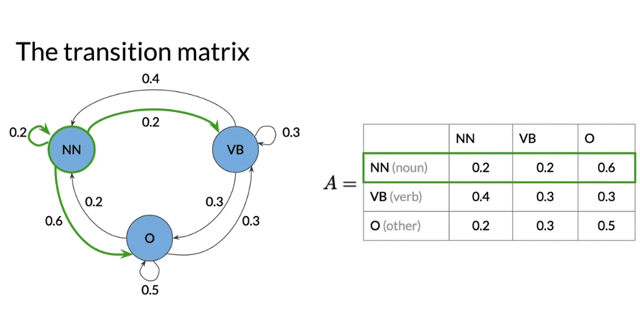</kbd>

  > Cũng có thể thể hiện bằng 1 table gọi là **Transition Table**

   

  
  
<kbd>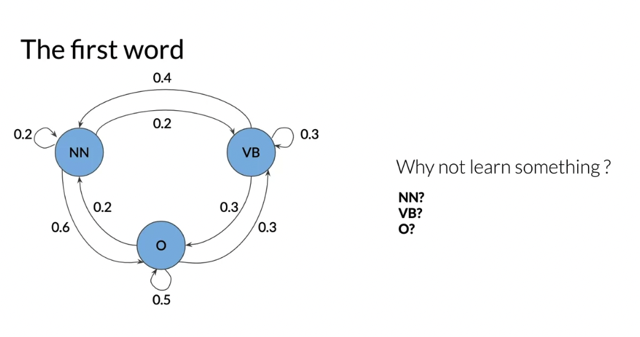</kbd>

  > Vấn đề là từ đầu tiên trong chuỗi, không có từ nào (POS tag nào)
> biến thành / transition tới nó thì probability nó như thế nào -> Giải
> pháp là cứ gán cho nó một giá trị ban đầu (initialization)

   

- Câu hỏi nên hỏi là mấy cái số này (giá trị probability POS này -> POS kia) ở đâu mà ra???
  
<kbd>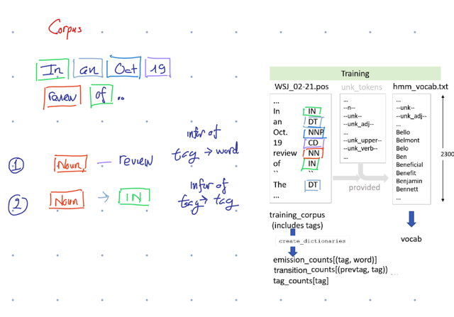</kbd>

  
<kbd></kbd>

  > Thì câu trả lời là extract (đúng hơn là đếm) từ trong một word corpus. Mà
> ví dụ, trong P.A ta sẽ dùng một bộ corpus từ tạp chí Wall Street Journal -
> WSJ_02-21.pos, trong đó list các từ có tính chất QUAN TRỌNG SAU:
>
> 1. **CÁC TỪ ĐƯỢC GẮN POS TAG** - tức đã có loại từ. 
> Đây chính là cơ sở để tính **EMISSION probability** - Xác suất
> một pos -> một từ
>
> 2. **CÁC TỪ VẪN THEO THỨ TỰ** (NHỚ ĐÂY KHÔNG PHẢI LÀ
> MỘT DANH SÁCH THEO ABC) do đó nó giữ được thứ tự
> Đúng ngữ pháp của chúng.
> Đây là cơ sở để tính **TRANSITION probability** - Xác suất một 
> POS tag -> POS tag : loại từ này theo sau bởi loaị từ khác

   

    
    
<kbd>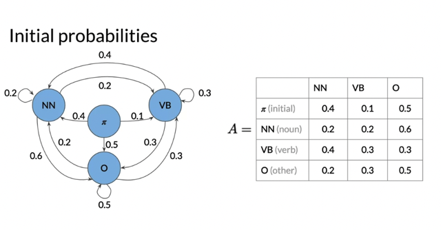</kbd>

    > Probability của từ đầu tiên thì sẽ
> được **initialize**

    > Mai ôn tiếp tai đây

     

    
    
<kbd>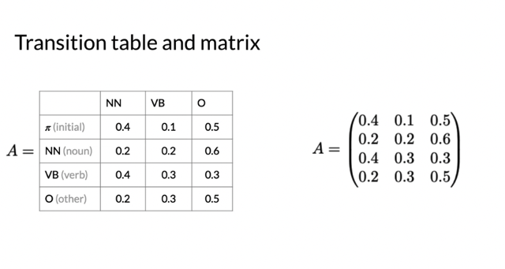</kbd>

    > Transition table có thể thể hiện thành matrix gọi là**transition matrix**

     

    
    
<kbd>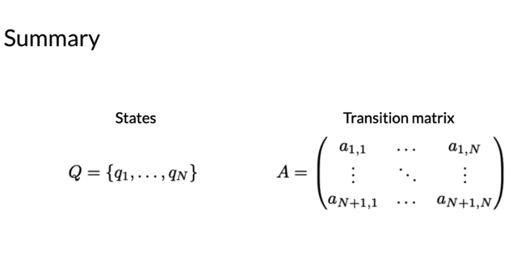</kbd>

    > Tóm lại, Q là tập hợp các trạng thái khả dĩ (có thể xảy ra)
> q1, q2, ...qN. Và transition matrix sẽ thể hiện xác suất /
> khả năng một trạng thái này có thể chuyển thành trạng
> thái kia

     

## Hidden Markov Models

 

### 1 Introduction to \\*Hidden Markov models (HMM)\\*:

> [!NOTE]
> 1 Introduction to \**Hidden Markov models (HMM)\**:
>  • \**HMMs\** are used to \**decode hidden states\**, such as \**parts of speech in this video\**.
>  • \**Hidden states\** are \**not directly observable\** from the \**text data\**.
>  • \**Observable data\** consists of words that \**can be seen\** by the machine.
>
>  2 \**Transition probabilities\** in Markov models and HMMs:
>  • \**Markov chain model\** and \**HMM\** have t\**ransition probabilities\** represented by 
> \**matrix A\**.
>  • A is of dimensions (\**NxN)\**, where \**N is the number of hidden states\**.
>  • \**Hidden states\** represent \**parts of speech\**, such as \**noun, verb\**, or others.
>
>  3 \**Emission\** \**probabilities\** in HMMs:
>  • \**HMMs\** have \**additional probabilities\** called \**emission probabilities\**.
>  • Emission probabilities describe the \**transition from hidden states to 
> observables (words).\**
>  • Emission probabilities can be represented in a matrix/table format.
>
>  4 Understanding \**emission probabilities:\**
>  • Emission probability represents the \**likelihood of emitting an observable given 
> a hidden state.\**
>  • Example: The emission probability from the \**verb\** hidden state to the word \**"eat" \**
> is \**0.5.\**
>  • \**Words can have different parts of speech tags depending on the context.\**
>
>  5 Components and notation of HMMs:
>  • HMMs consist of a \**set of N states\** \**(Q)\**.
>  • \**Transition matrix A\** has dimension N by N, representing transition probabilities.
>  • \**Emission matrix B\** has dimension \**N by V\**, representing emission probabilities.
>  • \**N denotes the number of hidden states\**, and \**V represents the number of 
> observables (words).\**
>
>  6 Computation of transition and emission probabilities:
>  • \**Transition probabilities\** define \**state transitions\** in the HMM.
>  • \**Emission probabilities\** describe the \**relationship between hidden states and 
> observables.\**

 

  
  
<kbd>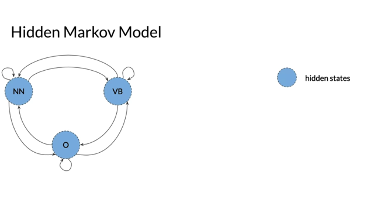</kbd>

  > Going back to the Markov model that has the states for the
> parts of speech, such as noun, verb, or other, you can now
> think of these as **hidden states** because **these are not directly
> observable from the text data**

  > Đại khái là giới thiệu một version khác của Markov model, gọi
> nó là hidden Markov model vì, các trạng thái của nó (model) bị
> ẩn. Lí do là đối với máy tính nó chỉ thấy 'Jim' 'learn' -
> observable chứ không biết 'Jim' là noun hay 'learn' là verb.
>
> Tạm thời cứ hiểu là **một mô hình Markov** với**state bị ẩn.**

   

  
  
<kbd>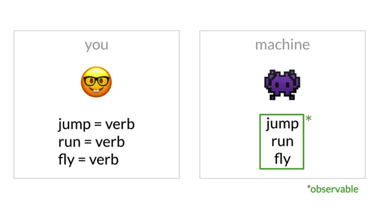</kbd>

  > Đại khái là bởi máy tính không biết jump, run, fly là verb hay là
> noun. Nó chỉ thấy những từ đó thôi, gọi là **observable**.

   

  
  
<kbd>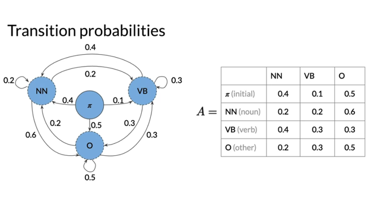</kbd>

  > The Markov chain model and Hidden Markov model
> have **transition probabilities**, which can be represented
> by a **matrix** A of dimensions **N plus 1 by N**, where **N is
> the number of hidden states.**

  > Thì đại khái là một **hidden Markov model** cũng sẽ **giống như
> Markov model**, sẽ có **transition probabilities**, thể hiện bởi
> **table (transition table)** hay **matrix A (transition matrix) có
> shape: NxN N là số hidden states**

   

  
  
<kbd>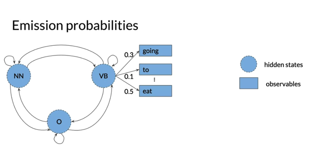</kbd>

  > The Hidden Markov model also has **additional probabilities** known as
> **emission probabilities.** These describe the **transition from the hidden
> states of your Hidden Markov model,** which are parts of speech seen
> here as circles for noun, verb, and the other, **to the observables** or the
> words of your corpus shown here inside **rectangles**. Here, for example,
> are the **observables** for the **hidden states VB**, which are the words; **going**,
> **to**, **eat**.

  > Và một mô hình Markov còn có thêm các thông số xác
> suất khác gọi là **Emission probabilities - Giúp define khả
> năng thay đổi từ hidden state sang observable state**Ví dụ ở dưới là hình tròn nét đứt thể hiện hidden state
> chuyển đổi (transition) sang trạng thái quan sát được
> (observable) là hình chữ nhật

   

  
  
<kbd>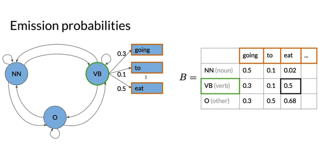</kbd>

  > The emission probability from the hidden states, verb to the observable, eat, is 0.5.
> **This means when the model is currently at the hidden state for a "verb", there is a 50
> percent chance that the observable the model will emit is the word, "eat"**. Here's an
> equivalent representation of the emission probabilities in the form of a table. Each row
> is designated for one of the hidden states. A column is designated for each of the
> observables. For example, the row for the hidden state, verb, intersects with the
> column for the observable, eat. The value 0.5 is the emission probability of going from
> the states verb to emitting the observable, eat. **The emission matrix represents the
> probabilities for the transition of your end hidden states representing your parts of
> speech tags to the M words in your corpus**

  > Ý nghĩa của Emission probabilities: Ví dụ nếu model đang ở tại
> hidden state Verb thì sẽ có 50% khả năng nó sẽ là từ ' eat'.
>
> Và tương tự như Transition probs Emission probs cũng được
> thể hiện bởi table hay Emission matrix B. Row là hidden state,
> column là Observable state
>
> Và hiểu thêm ý nghĩa của nó trong câu quan trọng sau:
> **Emission matrix sẽ thể hiện xác suất của hidden state có thể
> chuyển thành các từ cụ thể trong corpus**

   

  
  
<kbd>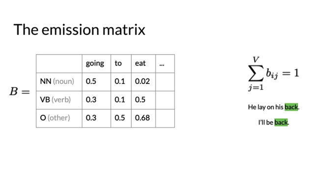</kbd>

  > What you might have realized in this example is that there are **emission
> probabilities greater than zero** for all **three of our parts of speech tags**. This is
> because **words can have different parts of speech tag assigned depending on the
> context in which they appear.**
>
> For example, the word **"back"** should have**different parts of speech tag** in each
> of the sentences. The noun tag for the sentence, he lay on his back, and the adverb
> tag for, I'll be back.

  > Tổng các probability 1 hidden state chuyển sang các observable
> state khác nhau bằng
> 1. Và một đặc điểm đáng chú ý là tất cả các gía trị P của cột đều
> dương CÓ NGHĨA LÀ VÍ DỤ HIDDEN STATE LÀ VERB THÌ MỌI TỪ
> ĐỀU CÓ CÓ THỂ ÍT NHIỀU TRỞ THÀNH LÀ ĐÁP ÁN (CÓ THỂ TỪ
> VERB TRANSITION THÀNH BẤT KÌ TỪ NÀO VỚI XÁC SUẤT ÍT
> NHIỀU), ý nói một từ có thể được assign thành nhiều vai trò khác
> nhau, như lúc thì là noun, trong câu khác thì là verb nên GIẢ SỬ
> CÓ 1 VERB THÌ BẤT CỨ TỪ NÀO CŨNG ÍT NHIỀU CÓ KHẢ
> NĂNG LÀ VERB TRANSITON THÀNH

   

  
  
<kbd>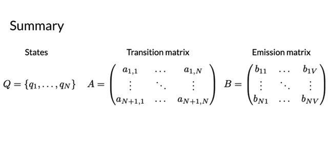</kbd>

  > A quick recap of Hidden Markov models. They
> consist of a set of **N states**, **Q**. The **transition matrix
> A**has dimension **N by N**, and the **emission matrix B**has dimension **N by V**

  > Tóm lại, một mô hình hidden Markov có thêm Emission
> matrix chứa thông số xác suất, khả năng các hidden state
> chuyển thành observable state

   

  
  
<kbd>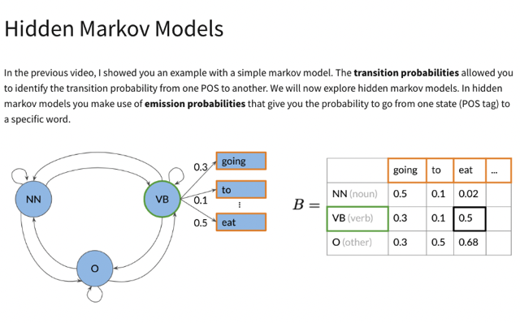</kbd>

   

  
  
<kbd>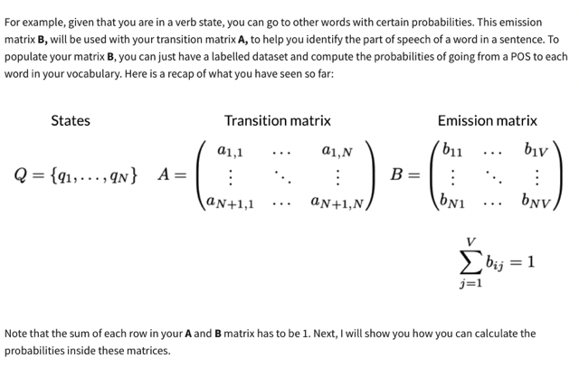</kbd>

   

## Calculating Probabilities

 

### 1 Introduction: Learn how to \\*compute probabilities for transition\\* and\\* emission\\* matrices in a

> [!NOTE]
> 1 Introduction: Learn how to \**compute probabilities for transition\** and\**emission\** matrices in a
> Markov model \**using a corpus\**.
>
> 2 Transition Matrix: The \**transition matrix\** contains \**transition probabilities\** \**between states\** in
> the Markov model.
>
> 3 Calculating Transition Probabilities: Transition probabilities are calculated based on the
> \**occurrences of tag combinations\** in the \**training corpus.\**
>
> 4 Counting Tag Pairs: The function \**C(t_i-1, t_i)\** counts the \**occurrences of tag pair (t_i-1, t_i)\**
> in the corpus.
>
> 5 Probability Calculation: \**Probability P(t_i|t_i-1)\** is calculated using the \**counts of (t_i-1, t_i)\**
> divided by the \**sum of occurrences of tag t_i-1 with all other tags t_j.\**
>
> 6 Haiku Example: Training a \**model for haiku\** using a \**provided corpus\** and making
> \**necessary modifications\**.
>
> 7 \**Corpus\** \**Preparation\**: Adding\**start tokens\** to each line, \**converting words to lowercase\**, and
> preserving punctuation.
>
> 8 Transformation to Probabilities: \**Converting counts into probabilities\** to \**populate the
> transition matrix.\**
>
> 9 Importance of Probabilities: \**Probabilities\** allow for the \**representation of transitions\**
> \**between states\** in the Markov model.

 

  
  
<kbd>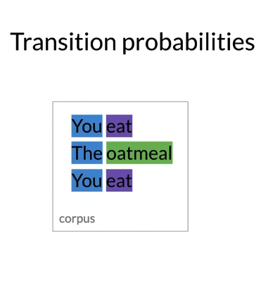</kbd>

  > Ý là lấy **ví dụ một tiny corpus**, gồm chỉ 3 câu thế này.
> Các màu sẽ thể hiện Part of Speech tag - POS tag. Thì đại
> ý ở đây muốn cho ta thấy là bằng cách **đếm số lần ô
> xanh dương -> tím** trên t**ổng số lần xanh dương -> Từ
> bất kì** thì sẽ cho ta cái **xác suất ô tím theo sau một ô là
> xanh dương** - **P(tím|xanh dương)** là bao nhiêu.

   

  
  
<kbd>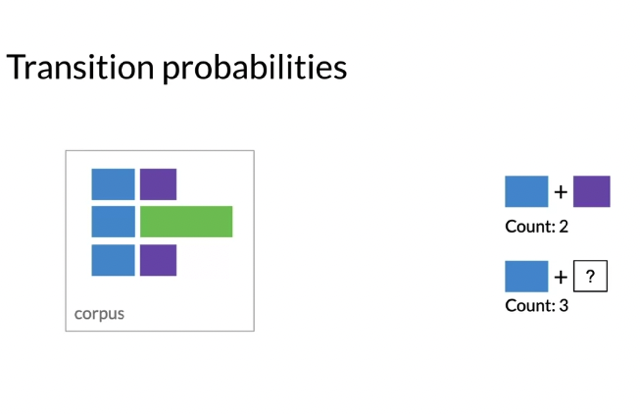</kbd>

  > Đại khái là có **2 'lần'** ô **xanh biến thành ô tím** và **3 lần** ô **xanh
> biến thành ô bất kì** (cũng chính là số ô xanh) trong word
> corpus này. Ta sẽ dựa vào đó để tính probability

   

  
  
<kbd>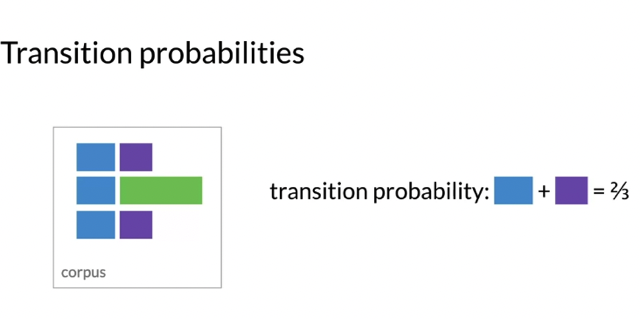</kbd>

  > Do đó ta nói probability một ô xanh dương biến thành ô tím hay 
> **xác suất một ô tím xuất hiện sau khi một ô xanh dương đã xuất hiện** 
>
> P(tím | xanh dương) = 2/3

   

  
  
<kbd>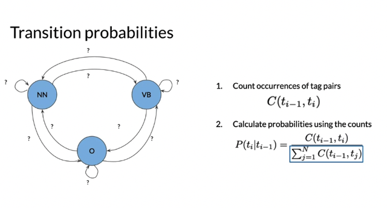</kbd>

  > More formally, in order to calculate all the **transition probabilities** of your
> Markov model, you'd first have to count **all occurrences of tag pairs** in your
> **training corpus**. I'll define this as the **function C** of the tags t_i minus 1 comma
> t_i which returns the counts for the tag t_i minus 1 followed by the tag t_i in
> your training corpus. Next, you calculate the probability of a tag t_i following
> another tag, t_i minus 1 as P of t_i given t_i minus 1. This counts of t_i minus
> 1 comma t_i in the numerator, which is the number of occurrences of t_i minus
> 1 comma t_i in the corpus divided by the sum of all occurrences of the tag t_i
> minus one, together with all the other tags t_j.

  > Đại khái là 
>
> Khả năng một trạng thái **t_i-1** chuyển thành trạng thái**t_i**,
> kí hiệu là **P(t_i-1| t_i)** sẽ được tính bằng:
>
> Tất cả các lần trạng thái **t_i-1 chuyển thành t_i**, 
> kí hiệu là **C(t_i-1, t_i)** 
>
> Chia cho tổng số tất cả các lần **t_i-1** chuyển thành các 
> trạng thái khác **t_j bất kì**, kí hiệu là
> sum j=1:N C(**t_i-1**, **t_j**)

   

  
  
<kbd>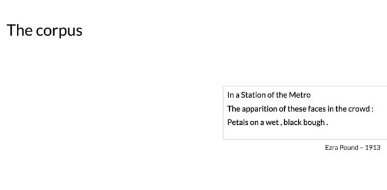</kbd>

  > Đại khái ta sẽ dùng corpus này, 1
> bài thơ của Nhật, để train một
> model làm thơ nhật

   

  
  
<kbd>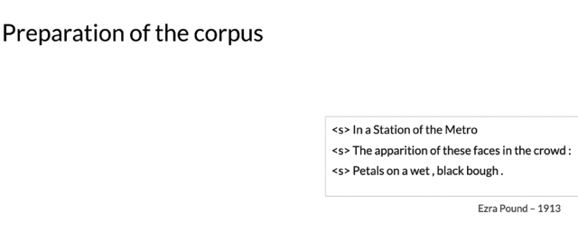</kbd>

  > First, at the start token to each line or sentence in order to be able to
> calculate the initial probabilities using the previous defined formula. Then
> transform all words in the corpus to lowercase so the model becomes case
> insensitive. The punctuation you should leave intact because it doesn't
> make a difference for a toy model, and there aren't tags for different kinds
> of punctuation included here. There you have it and nicely prepared corpus

  > Đại khái là ta sẽ làm một số bước
> preparation như tính initial
> probability và lowercase text

   

  
  
<kbd>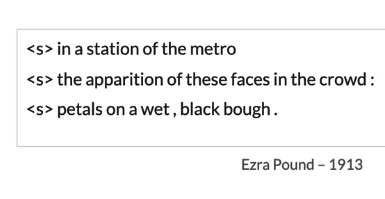</kbd>

  > Xong lowercase hết.

   

## Populating The Transition Matrix

 

### 1 Introduction: To\\* populate the transition matrix\\*, calculate \\*probabilities of tag transitions

> [!NOTE]
> 1 Introduction: To\**populate the transition matrix\**, calculate \**probabilities of tag transitions
> \**and \**initial tag probabilities\**.
>
> 2 Filling the First Column: Count the \**occurrences\** of\**tag combinations\** to populate the first
> column of the \**transition matrix.\**
>
> 3 Shortcut and Programming Assignments: Shortcut taken for illustration purposes, but in
> programming assignments, all calculations must be performed.
>
> 4 Transition Matrix Calculation: Once the counts are obtained, \**divide each count\** by the
> \**corresponding row sum\** to calculate \**transition probabilities.\**
>
> 5 Row Sum Interpretation:\**Row sums represent all pairs of words where the current state
> is a specific part of speech, and the next state can be any part of speech.\**
>
> 6 Problems with Division: The \**issue of division by zero\** for certain tags and \**many zero
> entries in the transition matrix.\**
>
> 7 Smoothing: Modify the formula by \**adding a small value (Epsilon) to each count\** and \**N
> times Epsilon to the divisor for smoothin\**g.
>
> 8 Smoothing Benefits: \**Smoothing\** \**eliminates zero value\** entries and allows the model to
> \**generalize\** to other examples.
>
> 9 Transition Matrix After Smoothing: A transition matrix example after applying smoothing
> with Epsilon (0.001).
>
> 10 Initial Probabilities and Smoothing: \**Consideration of not applying smoothing to initial
> probabilities to avoid allowing any tag, including punctuation, at the start of a sentence.\**
>
> 11 Understanding Smoothing: Explanation of smoothing and \**its importance in estimating
> transition probabilities\**.
>
> 12 Next Steps: Moving on to \**populating the emissions matrix\** in the next video.

 

  
  
<kbd>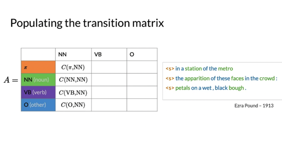</kbd>

  > Đại khái là dựa vào **corpus** và thứ tự các **POS
> của các từ trong đó**, ta sẽ tạo **transition matrix**

   

  
  
<kbd>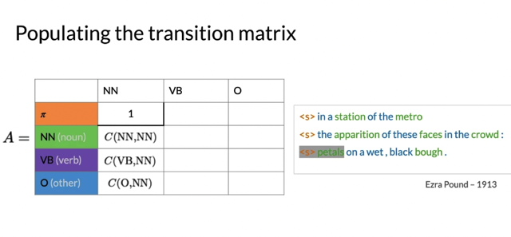</kbd>

  > Rất đơn giản, để tính **C(π, NN)** là số lần π (kí hiệu '**không
> có gì**') được **theo sau bởi một noun**, ta **đếm trong corpus**
> thấy có **1 lần,**ghi vào ô **hàng π, cột là NN = 1**

   

  
  
<kbd>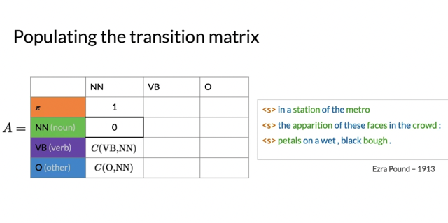</kbd>

   

  
  
<kbd>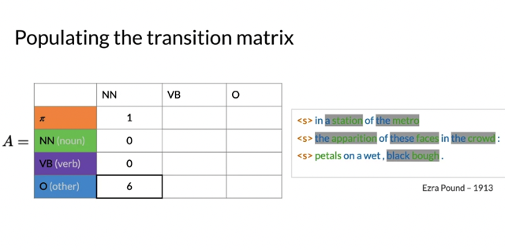</kbd>

  > Tương tự, số lần 1 loại Other (không phải
> verb, noun hay π) như a, the, these...
> chuyển thành Noun là 6

   

  
  
<kbd>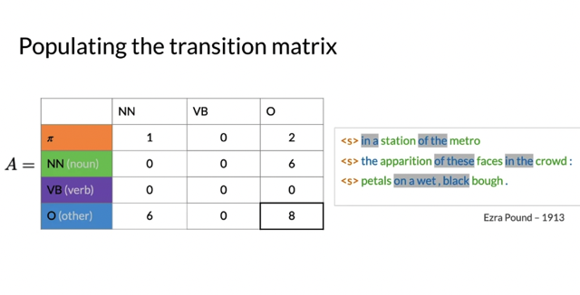</kbd>

  > **Tương tự như vậy đến hết table**. Ta sẽ viết code để làm việc này
> trong P. A
>
> In the last line, you have to take into account the tagged words on
> a, a, wet, wet, and, back to calculate the correct counts
>
> Cái ô cuối là phải tính các lần 1 từ Other biến thành 1 từ Other

   

  
  
<kbd>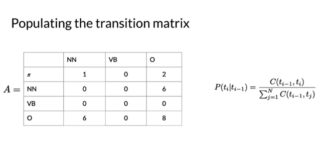</kbd>

   

  
  
<kbd>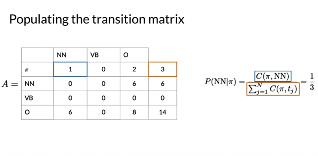</kbd>

  > Khi có các **transition count** rồi thì có thể tính **transition probability** theo
> công thức thì chính là lấy **số của mỗi ô** **chia**cho**tổng của hàng** tương
> ứng.
>
> Vì ví trong hàng NN, cột VB là số lần một Noun chuyển thành Verb. 
> Còn **tổng của hàng** ví dụ NN, chính là **tổng số lần NN chuyển 
> thành một loại (POS tag) bất kì**.
>
> Thì chia ô đó cho tổng của hàng sẽ được probability của NN->VB
>
> Tuy nhiên cách tính kiểu này sẽ có bất cập là **mẫu có thể = 0** (nguyên 1
> hàng = 0) và rất nhiều ô = 0 cũng khiến probability = 0 không đúng - kiểu
> như, **text corpus không có verb không có nghĩa là p(v, n) p(v,adj) = 0.**

   

  
  
<kbd>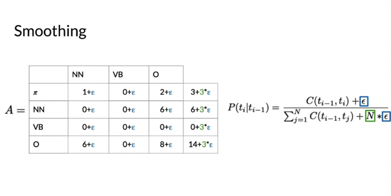</kbd>

  > Cách giải quyết là **Smoothing**, đã từng học ở phần trước, là
> **cộng tử cho 1 số epsilon** và **mẫu cho N*epsilon** để **tổng P vẫn
> = 1**, và giải quyết được vấn đề trên

   

  
  
<kbd>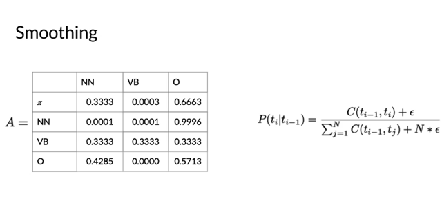</kbd>

  > The results of smoothing is, as you can see, that you no longer have any 0 value
> entries in a. Further, since the transition probabilities from the VB states are
> actually one-third for all outgoing transitions, they are equally likely. That's
> reasonable. Since you didn't have any data to estimate these transition
> probabilities. 
>
> One more thing before you go, and a real-world example, you might
> not want to apply smoothing to the**initial probabilities in the first row** of the
> **transition matrix**. That's because if you apply smoothing to that row by adding a
> small value to possibly zeroed valued entries. You'll effectively allow a sentence
> to start with any parts of speech tag, including punctuation

  > Có cái note cuối là trong thực tế **ta sẽ không apply
> smoothing cho hàng đầu tiên** tương ứng với xác suất  **'
> Không có gì' -> 'Một loại từ nào đó'** vì như vậy,
>
> ngay cả **một punctuation (ví dụ dấu chấm), cũng có xác
> suất**π->. lớn hơn 0**, dẫn tới sự kiện dấu chấm ngay
> đầu câu có thể xảy ra**

   

  
  
<kbd>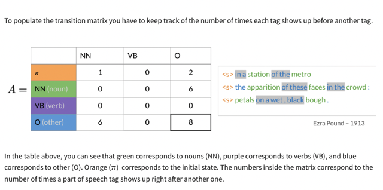</kbd>

   

  
  
<kbd>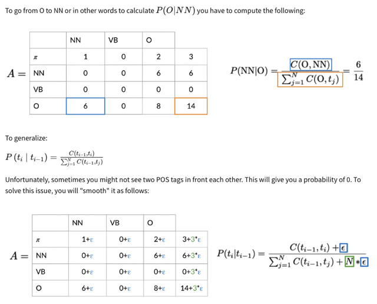</kbd>

   

## Populating The Emission Matrix

 

### 1 Introduction: Introduction to the need for a new matrix to incorporate

> [!NOTE]
> 1 Introduction: Introduction to the need for a new matrix to incorporate
> \**word probabilities\** into the equation.
>
> 2 \**Emission\** Matrix: Introduction to the emission matrix, which provides
> \**probabilities of\** \\/\**transitioning from a word to a part of speech tag\**\\/.
>
> 3 Counting \**Co-Occurrences\**: Counting the co-occurrences of part of
> speech tags with specific words in the corpus to \**populate the emission
> matrix\**.
>
> 4 Example: \**Illustration\** of counting co-occurrences using a small
> training corpus and the haiku example.
>
> 5 Formula for Emission Probabilities: The formula for calculating
> emission probabilities with smoothing, using \**counts of tag-word pairs\**
> and corresponding \**row sums\** in the emission matrix.
>
> 6 Recap: Ability to calculate both transition and emission matrices,
> including applying smoothing for improved model generalization.
>
> 7 Using Matrices Together: Introduction to using transition and
> emission matrices together for part of speech tagging of a given
> sentence.

 

  
  
<kbd>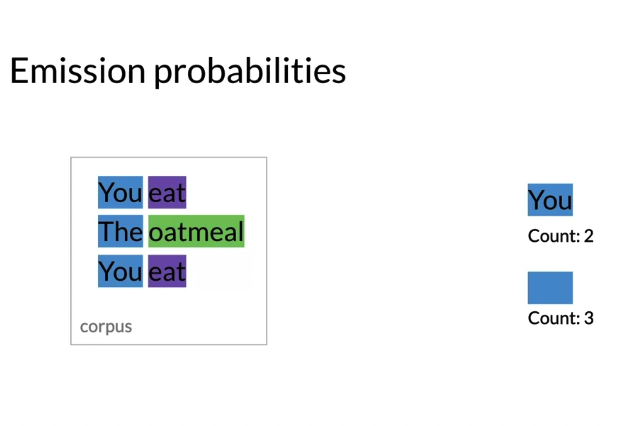</kbd>

  > Có **3 ô xanh trong corpus**, trong **3 ô xanh đó hoá ra có
> 2 chữ You**. Vậy khả năng **Ô xanh -> 'You'**là **2/3.**

   

  
  
<kbd>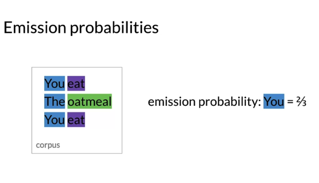</kbd>

   

  
  
<kbd>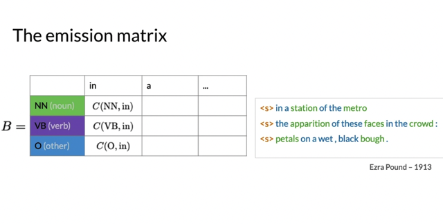</kbd>

   

  
  
<kbd>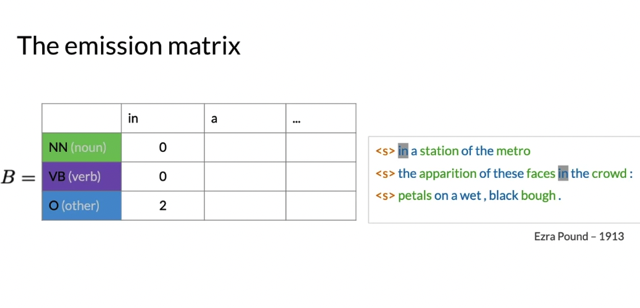</kbd>

   

  
  
<kbd>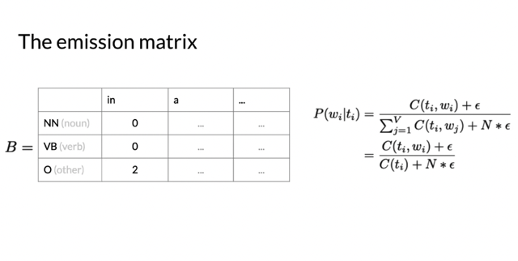</kbd>

  > Hiểu cái kia rồi thì cái này cũng tương tự, Khả năng / Xác suất một
> **trạng thái** **t_i** (t kí hiệu cho tag, POS tag, 1 **hidden** state) trở
> thành hay  kế tiếp một **trạng thái w_i** (w kí hiệu cho word, cùng
> là i vì ở cùng 1 vị  trí, 1 cái là ẩn 1 cái là **observable**), sẽ được
> tính bằng
>
> tổng số lần mà **t_i -> w_i**  kí hiệu là C(t_i, w_i)
>
> **Chia** cho **tổng số sự kiện t_i chuyển sang từ bất kì**  
> Σ j=1:N C(t_i, w_j) 
>
> và **cũng chính là tổng số lần t_i xuất hiện C(t_i)**

   

  
  
<kbd>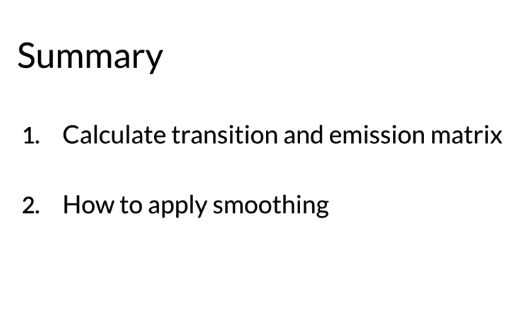</kbd>

   

## Lab: Working With Tags And Numpy

 

### In this lecture notebook you will \\*create a matrix\\* using

> [!NOTE]
> In this lecture notebook you will \**create a matrix\** using
> some\**tag information\** and then \**modify it\** using \**different
> approaches\**. This will serve as \**hands-on experience\**
> working with \**Numpy\** and as an introduction to some
> elements used for \**POS tagging\**.

 

- import numpy as np import pandas as pd
   

- Some information on tags
   

  
  - For this notebook you will be using a \\*toy example\\* including only \\*three tags\\* (or states). In a \\*real world application\\* there are \\*many more tags\\* which can be found here.
     

      
      
<kbd>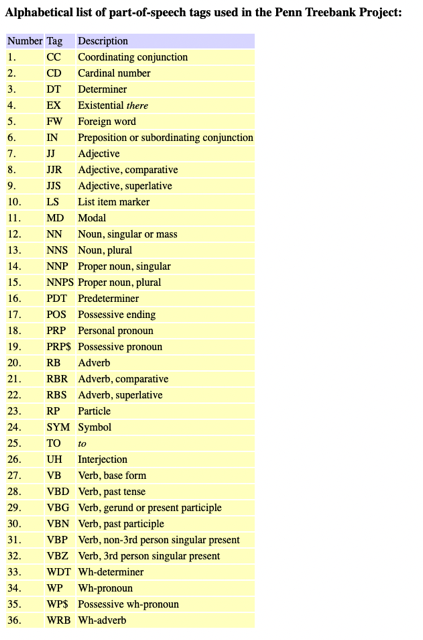</kbd>

       

    
    - # Define tags for Adverb, Noun and To (the preposition) , respectively tags = ['RB', 'NN', 'TO']
       

      
      - In this week's assignment you will \\*construct some dictionaries\\* that provide \\*useful information of the tags\\* and words you will be working with.  One of these dictionaries is the \\*transition_counts\\* which counts the number of times a \\*particular tag happened next to another.\\* The keys of this dictionary have the form (\\*previous_tag\\*, \\*tag\\*) and the values are the \\*frequency of occurrences\\*.  Another one is the \\*emission_counts\\* dictionary which will count the number of times a \\*particular pair of (tag, word) appeared in the training dataset.\\*  In general think of \\*transition\\* when working with \\*tags only\\* and of \\*emission\\* when working with \\*tags and words.\\*  In this notebook you will be looking at the first one:
        > nói về việc trong P.A ta sẽ tính ra cái transition_counts chứa key
> previous tag, tag - count và emission_count chứa key word, tag -
> count nhằm tính toán số lần xuất hiện của một cặp tag-tag và
> tag-word phục vụ cho việc tính Transition probability và Emission
> probability matrices

         

        
        - # Define '\\*transition_counts\\*' dictionary # Note: values are the same as the ones in the assignment transition_counts = {     ('NN', 'NN'): 16241,     ('RB', 'RB'): 2263,     ('TO', 'TO'): 2,     ('NN', 'TO'): 5256,     ('RB', 'TO'): 855,     ('TO', 'NN'): 734,     ('NN', 'RB'): 2431,     ('RB', 'NN'): 358,     ('TO', 'RB'): 200 }
          > Đại khái làm giả dụ cái
> transition_counts

          > Notice that there are 9 combinations of the 3 tags
> used. Each tag can appear after the same tag so
> you should include those as well.

           

- Using Numpy for matrix creation
   

  
  - # Store the number of tags in the 'num_tags' variable num_tags = len(tags)  # Initialize a 3X3 numpy array with zeros transition_matrix = np.zeros((num_tags, num_tags))  # Print matrix transition_matrix
     

      
      
<kbd>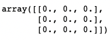</kbd>

       

    
    - # Print shape of the matrix transition_matrix.shape
      > Visually you can see the matrix has the correct
> dimensions. Don't forget you can check this too
> using the shape attribute:

       

        
        
<kbd>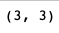</kbd>

         

      
      - # Create sorted version of the tag's list \\*sorted_tags\\* = \\*sorted\\*(tags)  # Print sorted list sorted_tags
        > Before filling this matrix with the values of the
> **transition_counts** dictionary you should **sort the tags** so
> that **their placement** in the matrix is **consistent**:

         

          
          
<kbd>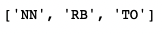</kbd>

           

        
        - # Loop rows for \\*i\\* in range(\\*num_tags\\*):     # Loop columns     for \\*j\\* in range(\\*num_tags\\*):         # Define tag pair         \\*tag_tuple\\* = (\\*sorted_tags\\*[i], \\*sorted_tags\\*[j])         # Get frequency from transition_counts dict and assign to (i, j) position in the matrix         \\*transition_matrix[i, j] = transition_counts.get(tag_tuple)\\*  # Print matrix transition_matrix
          > To**fill this matrix** with the correct values you can use
> a **double for-loop**. You could also use **itertools.product**to one line this double loop:

           

            
            
<kbd>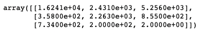</kbd>

             

          
          - Looks like this worked fine. However the \\*matrix\\* can be hard to read as \\*Numpy\\* is more  about efficiency, rather than presenting values in a pretty format.  For this you can use a \\*Pandas\\* \\*DataFrame\\*. In particular, a function that takes the matrix  as input and prints out a pretty version of it will be very useful:
             

            
            - # Define 'print_matrix' function def print_matrix(matrix):     print(pd.\\*DataFrame\\*(matrix, index=\\*sorted_tags\\*, columns=\\*sorted_tags\\*))
               

              
              - Notice that the \\*tags are not a parameter\\* \\*of the function\\*. This is because the \\*sorted_tags\\* list \\*will not change\\* in the rest of the notebook so it is safe to use the variable previously declared. To test this function simply run:
                 

                
                - # Print the 'transition_matrix' by calling the 'print_matrix' function print_matrix(transition_matrix)
                   

                    
                    
<kbd>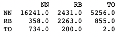</kbd>

                     

- Working with Numpy for matrix manipulation
   

  
  - Now that you got the matrix set up it is time to see how a matrix can be manipulated after  being created.  Numpy allows \\*vectorized operations\\* which means that operations that would normally  include looping over the matrix can be done in a simpler manner. This is consistent with \\* treating numpy arrays as matrices\\* since you get support for common matrix operations.  You can do matrix multiplication, scalar multiplication, vector addition and many more!  For instance try \\*scaling each value in the matrix by a factor of 1/10\\*  Normally you would loop over each value in the matrix, updating them accordingly. But in Numpy this is as easy as \\*dividing the whole matrix by 10\\*:
     

    
    - # Scale transition matrix transition_matrix = \\*transition_matrix/10\\*  # Print scaled matrix print_matrix(transition_matrix)
       

        
        
<kbd>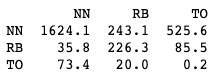</kbd>

         

        
        
<kbd>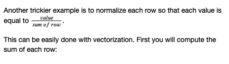</kbd>

         

      
      - # Compute sum of row for each row rows_sum = transition_matrix.\\*sum\\*(\\*axis=1\\*, keepdims=True)  # Print sum of rows rows_sum
         

          
          
<kbd>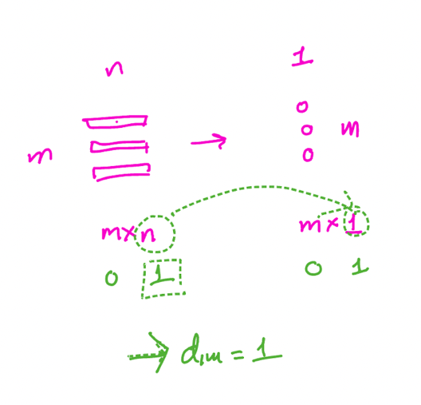</kbd>

          > Again, để dễ nhớ dim
> bằng bao nhiêu

           

          
          
<kbd>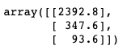</kbd>

           

        
        - Notice that the \\*sum()\\* method was used. This method does exactly what its name implies.  Since the \\*sum of the rows\\* was\\* desired\\* the \\*axis was set to 1.\\* In Numpy \\*axis=1 refers to  the columns\\* so the sum is done by summing each column of a particular row, for each  row.  Also the \\*keepdims\\* parameter was set to \\*True\\* so the resulting array had \\*shape (3,  1) rather than (3,)\\*. This was done so that the axes were consistent with the desired  operation.  When working with Numpy, always \\*remember to check the shape of the arrays\\* you are  working with, \\*many unexpected errors happen because of axes not being consistent\\*.  The \\/\\*shape attribute is your friend\\*\\/ for these cases.
          > Cách hiểu thứ 2 cũng dễ nhớ là: Tổng các hàng có nghĩa là cộng giá
> trị của các cột (của 1 hàng) lại với nhau. mà hàng x cột ứng với
> dimension 0x1 => dim = 1.
>
> Còn cái keepdims = True là để vẫn giữ (3,1) thay vì thành 1D array
> (3,)
>
> Cuối cùng ổng nói nên check shape luôn luôn vì rất nhiều lỗi  là do
> shape sai.

           

          
          - # Normalize transition matrix transition_matrix = transition_matrix / rows_sum  # Print normalized matrix print_matrix(transition_matrix)
             

              
              
<kbd>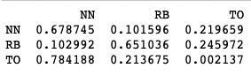</kbd>

               

            
            - Notice that the \\*normalization\\* that was carried out forces the \\*sum of each row to be equal to 1\\*. You can easily check this by running the sum method on the resulting matrix:
               

              
              - transition_matrix. sum(\\*axis=1\\*, \\*keepdims\\*=True)
                 

                  
                  
<kbd>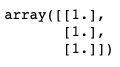</kbd>

                   

- For a final example
  > Quay lại sau

   

  
  - For a final example you are asked to \\*modify each value of the diagonal of the matrix\\* so  that they are \\*equal to the log of the sum of the current row plus the current value\\*. When  doing mathematical operations like this one don't forget to import the math module.  This can be done using a \\*standard for loop\\* or \\*vectorization\\*. You'll see both in action:
     

    
    - import math  # \\*Copy transition matrix\\* for for-loop example t_matrix_for =\\* np.copy(\\*transition_matrix)  # \\*Copy\\* transition matrix for numpy functions example t_matrix_np = \\*np.copy\\*(transition_matrix)
       

      
      - # Loop values in the diagonal for i in range(num_tags):     t_matrix_for[i, i] =  t_matrix_for[i, i] + math.log(rows_sum[i])  # Print matrix print_matrix(t_matrix_for)
         

          
          
<kbd>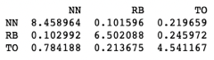</kbd>

           

        
        - # Save diagonal in a numpy array d = \\*np.diag(t_matrix_np)\\*  # Print shape of diagonal d.shape
           

            
            
<kbd>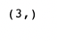</kbd>

             

          
          - You can \\*save the diagonal\\* in a numpy array using Numpy' s \\*diag() function\\*. Notice that  this array has shape \\*(3,)\\* so it is \\*inconsistent\\* with the dimensions of the rows_sum array  which are \\*(3, 1)\\*. You'll have to \\*reshape\\* before moving forward. For this you can use Numpy's \\*reshape\\*() function, specifying the desired shape in a tuple
             

            
            - # Reshape diagonal numpy array d = np.\\*reshape\\*(d, (3,1))  # Print shape of diagonal d.shape
               

                
                
<kbd>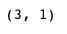</kbd>

                 

              
              - Now that the \\*diagonal\\* has the \\*correct shape\\* you can do the vectorized operation by  applying the \\*math.log() \\*function to the \\*rows_sum\\* array and adding the diagonal.  To apply a function to each element of a numpy array use Numpy' s \\*vectorize()\\* function  \\/\\*providing the desired function as a parameter.\\*\\/ This function returns a vectorized function  that accepts a numpy array as a parameter.  To update the original matrix you can use Numpy' s \\*fill_diagonal\\*() function.
                 

                
                - # Perform the vectorized operation d = d +\\* np.vectorize(math.log)(rows_sum)\\*  # Use numpy's '\\*fill_diagonal\\*' function to update the diagonal \\*np.fill_diagonal\\*(t_matrix_np, d)  # Print the matrix print_matrix(t_matrix_np)
                   

                    
                    
<kbd>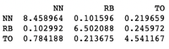</kbd>

                     

                  
                  - To perform a \\*sanity check \\*that both methods yield the same result you can compare both matrices. Notice that this operation is also vectorized so you will get the equality check for each element in both matrices:
                     

                      
                      
<kbd>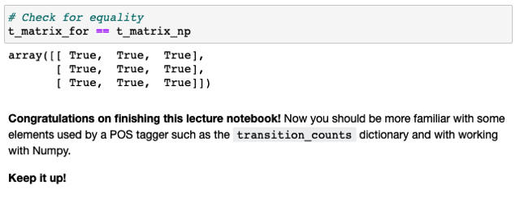</kbd>

                       

## The Viterbi Algorithm

 

### 1 \\*Introduction\\* to the \\*Viterbi algorithm\\* and its purpose.

> [!NOTE]
> 1 \**Introduction\** to the \**Viterbi algorithm\** and its purpose.
>
> 2 Calculation of \**transition\** and \**emission\** \**probabilities\** for the \**Markov chain\** and \**hidden
> Markov model\**.
>
> 3 Problem: Finding the \**most likely sequence of parts of speech tags\** given a \**sentence
> and the model.\**
>
> 4 Introduction of the \**Viterbi algorithm\** as a \**graph algorithm.\**
>
> 5 Example: \**Toy model\** with the sentence \**"I love to learn"\** and \**initial states\**.
>
> 6 Selection of the \**most probable hidden states\** based on transition and emission
> probabilities.
>
> 7 Calculation of \**joint probabilities\** for \**observed words\** and transitions between hidden
> states.
>
> 8 Iterative process of \**traversing the model graph\** and \**making optimal choices\** for
> \**hidden states.\**
>
> 9 Computation of \**multiple paths simultaneously\** to\**find the most likely sequence.\**
>
> 10 Three main steps of the Viterbi algorithm: \**initialization\**, \**forward\** pass, and \**backward\**
> pass.
>
> 11 Introduction of \**auxiliary matrices (C and D) \**to store \**probabilities\** and \**visited states\**.
>
> 12 Matrix dimensions and their relation to the number of parts of speech tags and
> words in the sequence.
>
> 13 Recap of the three steps: initialization, forward pass, and backward pass.
>
> 14 Mention of upcoming video on initialization.

> [!NOTE]
> Phải hiểu vấn đề trước:
>
> Cho trước một câu (**sequence of words**) và một model
> (**Markov model**) với **transition probability matrix** và
> **emission probability matrix**
>
> Bài toán đặt ra là **tìm xác suất cao nhất của một chuỗi các
> POS** sử dụng Viterbi algorithm

 

- So far you've calculated the \\*transition\\* and \\*emission\\* probabilities for the \\*Markov chain\\* and the \\*hidden Markov model\\*. Given a \\*part of speech tag\\* and \\*these probabilities\\*, you can \\*easily select the most likely next parts of speech tag\\* or the \\*most probable word\\*. You can do so by looking up the correct entry in the respective row of the transition or emission matrix.
  > Ý ổng là khi đã có transition & emission
> probability matrix rồi thì giả sử đang ở từ W1,
> loại từ (POS tag) T1 có thể dễ dàng look up để
> tính ra tìm ra xác suất của từ W2 kế tiếp hoặc
> loại từ T2 kế tiếp là gì.

   

    
    
<kbd>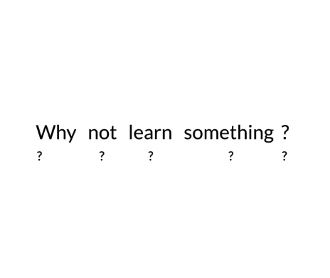</kbd>

    > But **what if you're given a sentence** like, \/**"Why not learn something?"**\/
> \/**What is the most likely sequence of parts of speech tags given the sentence
> and your model**\/. The sequence can be computed using the Viterbi algorithm.
> You're about to see lots of formulas which are all based on matrices
> representing our hidden Markov model, but the Viterbi algorithm is actually a
> graph algorithm. Picturing the problem we want to solve on the graph, will
> make it much easier for us to understand the formulas and the algorithm

    > Nhưng giả sử mình có một câu thế này, "Why not learn
> something?" vậy thì câu hỏi đặt ra là: **Liệu có thể từ transition và
> emission matrix ta có thể train ra một model để tính toán ra các
> POS của các từ không.**
>
> Ở đây **không phải đơn giản là tra cứu từ đó có pos gì rồi gán
> vào** vì thứ nhất **từ có thể không có trong corpus** để mà tra, vì
> ta đang nói câu bất kì. Thứ hai **một từ có thể thuộc về cả nhiều
> loại từ** khác nhau lúc thì verb lúc thì noun..
>
> Thì đây, người ta giới thiệu **Viterbi algorithm** có thể dùng giúp
> **tìm ra xác suất cao nhất của các POS tag cho một câu như thế
> này.**

     

    
    
<kbd>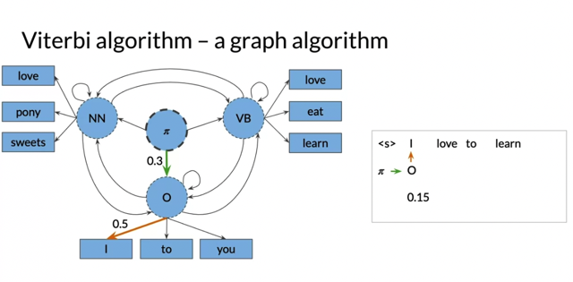</kbd>

    > To go from  π to I you need to multiply the corresponding**transition probability π-O = 0.3** and the
> corresponding **emission probability** O -> 'I' = 0.5, which gives you **0.15**. You keep doing that for all the
> words, until you get the probability of an entire sequence.

    > **Cho trước các emission / transition probability matrix**, giờ có
> một câu **"I love to learn"**. **Yêu cầu** là ta **tìm ra các POS tag của chúng**
>
> Thì đại khái là ổng **GIẢ SỬ ĐÃ CÓ MỘT CÁI MODEL** như hình
> thì ta sẽ **tìm ra cái chuỗi POS phù hợp nhất / có xác suất cao nhất
> cho câu này**như sau:
>
> Vì THEO MODEL (GIẢ SỬ ĐÃ TRAIN VÀ ĐƯỢC MODEL NÀY),
> "I" chỉ có thể được 'emission' từ O, hay **trong số các khả năng
> một loại từ nào đó trở thành 'I' thì O là cao nhất**, hoặc là **duy nhất**
> nên ta sẽ gán O (POS tag) cho 'I', và dĩ nhiên O là POS đầu tiên
> của chuỗi POS mà ta đang cố tìm.
> Sau bước này ta tính được probability của chuỗi 
> π-O-'I' là 0.3*0.5 = 0.15
>
> Sau đó, từ kế tiếp là "love", thì nó có có thể đi theo con đường
> O-NN-"love" hoặc O-VB-"love", hay nói cách khác là cả NN và VB
> đều có khả năng là cái POS tag của "love", hay nói cách khác nữa
> là POS tag tiếp theo của chuỗi POS tag có thể là VB hoặc NN.
>
> Tuy nhiên tính**xác suất của O-VB-"love" = 0.5*0.5 = 0.25 lớn hơn
> xác suất của O-NN-"love" là 0.5*0.1 = 0.05**. Nên ta chọn VB là POS
> tag của "love".
>
> Tiếp, chỉ có thể là O, vì không có POS tag nào khác có xác suất trở
> thành "to" ngoài O và tính probability của step này là 0.08
>
> Cuối cùng, cũng chỉ có thể là VB vì chỉ có từ VB mới có xác suất 
> P(VB->"learn") dương.
>
> Và tính xác suất tổng của chuỗi này là tích các xác suất của mỗi step
> là 0,0003.

     

    
    
<kbd>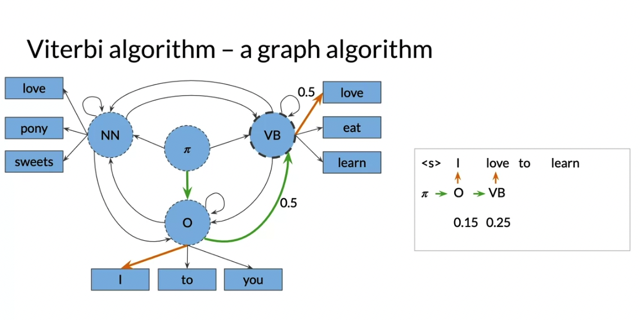</kbd>

    
<kbd></kbd>

    
<kbd>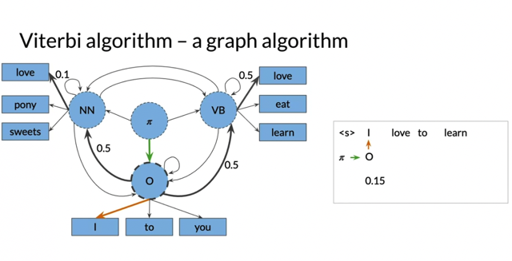</kbd>

    > Transition probability như nhau nhưng
> Emission probability của VB-Love lớn hơn

    > Thì ý ở đây là Viterbi algorithm nó sẽ **tính toán tất cả các "con
> đường" khả dĩ** để tìm ra cái nào có **xác suất cao nhất**
>
> Ta thấy minh hoạ của quá trình chọn lựa trên ngay trong ví dụ
> này:
>
> từ I->love, ta không gán NN cho love mà VB là vì **xác suất của
> VB-" love" cao hơn NN-"love"** hay nói cách khác chuỗi
> O-VB-O-VB cao hơn O-NN-O-VB
>
> Còn gán O cho "you" vì nó là cái có **xác suất dương duy nhất**,
> tức là **những thằng POS tag khác có xác suất đến you = 0**.
> Nên trong hàng  sa số các Path khác, thì có thể xác suất bằng 0
> ở bước này khiến  xác suất của chuỗi bằng 0 và bị loại ngay rồi

     

    
    
<kbd>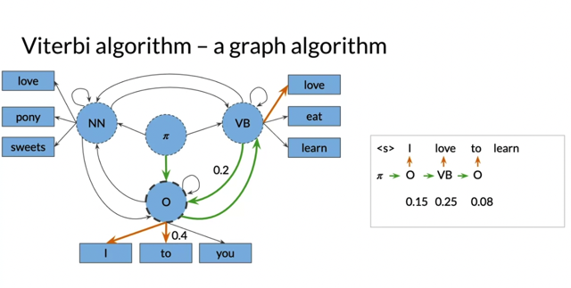</kbd>

    > Sau đó chỉ có thể về lại O state vì chỉ có từ O state mới có thể đi
> tới 'to' hay nói cách khác như trong lecture là **chỉ có xác suất O-'to'
> là non-zero**, hoặc hiểu nôm na là chỉ có thể đến 'to' từ O

     

    
    
<kbd>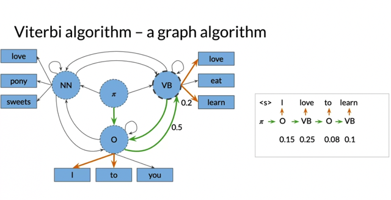</kbd>

    > Tương tự, trong toy model này thì chỉ có probability 'VB'-'learn' là
> non-zero nên từ O chỉ có thể qua VB lại

     

    
    
<kbd>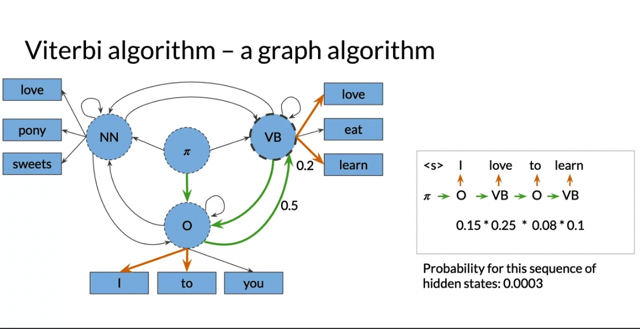</kbd>

    > **Sequence probability** sẽ tính bằng cách lấy **probability của tất cả
> step nhân lại (product)**
>
> Thực tế Viterbi algorithm nó sẽ**thử nhiều path** (step) khác nhau để
> **chọn cái nào có sequence probability cao nhất**.

     

    
    
<kbd>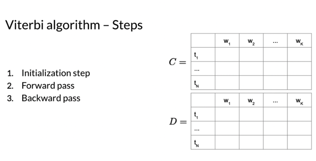</kbd>

    > The algorithm can be split into **three main steps**: 
>
> The **initialization** step, 
> the **forward** pass,
>  and the **backward** pass.
>
> Given your **transition** and **emission** **probabilities**, 
> you first populate and then use the **auxiliary matrices C and D**.
>
> The matrix C holds the **intermediate optimal probabilities** 
> and matrix D the **indices of the visited states**.
>
> As you're traversing the model graph to find 
> the most likely sequence of parts of speech tags for the given 
> sequence of words, W_1, all the way to W_K. 
>
> These two matrices have **n rows**, 
> where n is the n**umber of parts of speech tags** or **hidden states** in our model, 
>
> and **k columns**,
> where k is the **number of words in the given sequence**

    > Đại khái nói sơ về việc Viterbi algorithm
> sẽ gồm 3 bước 
> 1. Initialization 
> 2. Forward pass 
> 3. Backward pass 
>
> trong đó ta sẽ dùng **transition** & **emission** matrix
> để tính **auxiliary matrices** C, D
>
> Chỗ này ổng nói không kĩ một cái rất quan trọng.
>
> C chức "**intermediate optimal probabilities**" - là xác suất của **một loại từ** đến**một từ**. T - W
>
> Hay C12 = t1 -> w2 là xác suất cao nhất của t1 trở thành w2

     

## Viterbi: Initialization

 

### \\* 1 Initialization Step\\*: The initialization step involves populating the \\*first

> [!NOTE]
> \**1 Initialization Step\**: The initialization step involves populating the \**first
> column\** of the \**auxiliary\** matrices C and D. \**2 Matrix C Initialization\**: In matrix C, the first column represents the
> probability of transitioning from the \**start states (π)\** to the \**first tag (t_i)\** and
> \**word (w_1)\**. The entries in the first column (\**c_1,1\**) are calculated as the
> \**product of\** the transition probability \**A(1,i)\** from the initial states and the
> corresponding emission probability (b) for the word. \**3 Matrix D Initialization\**: In matrix D, the first column stores the labels
> representing the different states traversed while finding the most likely
> sequence of parts of speech tags. In the first column, all entries are set to zero
> as there are no preceding parts of speech tags. \**4 Matrix Indexing\**: The C index function returns the column index and the
> matrix b value for the given word. This indexing is used to calculate the
> probabilities and update the matrices during the algorithm's execution. The
> initialized matrices C and D provide the starting point for further calculations in
> the Viterbi algorithm. They store the probabilities and the path information
> needed to determine the most likely sequence of parts of speech tags for a
> given sentence.
>
> The summarized information highlights the initialization step of the Viterbi
> algorithm, where the first column of matrices C and D is populated with the
> appropriate probabilities and labels. This step sets the foundation for
> subsequent calculations and the decoding process of parts of speech for a
> given sentence.

> [!NOTE]
> auxiliary = Phụ tá

 

  
  
<kbd>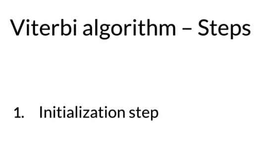</kbd>

   

  
  
<kbd>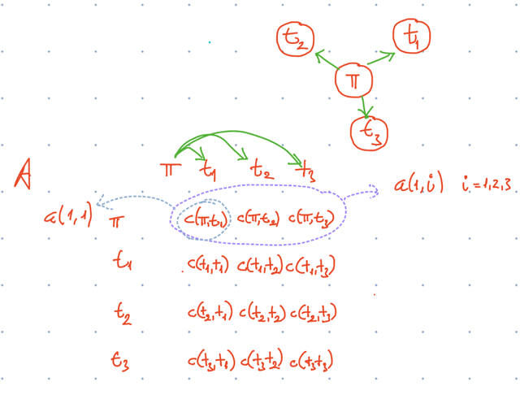</kbd>

  
<kbd>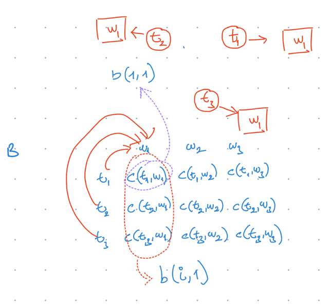</kbd>

  
<kbd></kbd>

  
<kbd></kbd>

  
<kbd>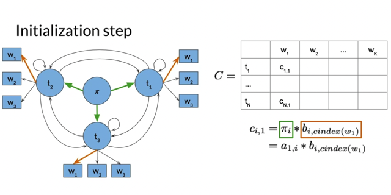</kbd>

  > π -> t_1 -> w1
> π-> t_2 -> w1
> π -> t_3 -> w1
>
> *π->t_i (i=1,2,3)
>
> Tính Probs π -> t_i (i=1,2,3) chính là **hàng đầu tiên** của 
> **Transition matrix** (A) (ví dụ π->NN, π->VB, π->O)
>
>
> *t_i (i=1,2,3) -> w_1
>
> Tính Probs t_i->w_1 chính là **1 cột của Emission matrix (B)** với 
> cái cội tương ứng với **index của từ w_1 nên** 
> mới kí hiệu là **b_i,cindex(w1)** . 
> b ý là Emission matrix, 
> i = 1,2,3 ý là index các hàng, 
> cindex(w1) là **index của cái cột tương ứng từ w1.**

  > c_i,1 là Probability t_i -> w_1 với i = 1,2,3...N
>
> Ví dụ:
>
> c_1,1  
> = π_1 * b1, cindex(w1) 
> = (Xác suất pi -> t_1) * (Xác suất t_1 -> w1 )
> = A(1,1) * B(1, index của cột tương ứng với w1)

   

  
  
<kbd>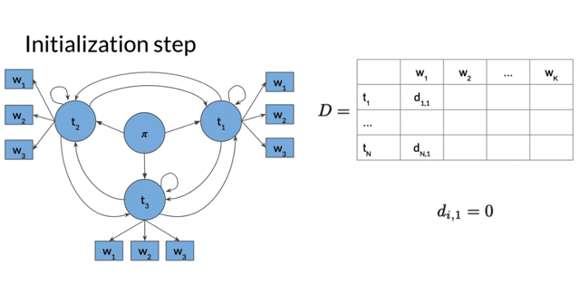</kbd>

  > Hence we introduce a matrix D, which allows you to store the **labels** that
> represent the **different states** you are going through when finding the **most
> likely sequence of POS tags** for the given sequence of words  w_1,..w_K
>
> At first you set the first column to 0, because you are not coming from any
> POS tag.

  > Ví dụ cho dễ hiểu nè: Ví dụ tính cho D(1,1) - tag 1 - word 1. Giả sử
> trong số các tag thì P(tag_5,tag_1) cao nhất, đồng nghĩa trong các
> hàng k = 1-> N của transition matrix A, cột 1 (tag = 1) thì hàng 5
> cao nhất hay A(5,1) cao nhất. Thì khi đó D1,1 = 5.
>
> Ban đầu vì ta chưa so, ta chỉ ini với tag 'không' -> tag 1. Nên tạm
> ghi D(1,1) = 0.

   

- w1, w2, w3, w4.....w_numOfWords: Là chuỗi các từ trong corpus, giữ nguyên thứ tự ví dụ w1 = He, w2 = like, w3 = apple. Trong corpus He like apple  Ý nghĩa của bước Initialization:  Đối với tất cả các từ w1,w2... ta đều cần tìm POS tag nào có xác suất cao nhất để trở thành / gắn với nó  Nhưng ví dụ tìm POS tag cho w2 thì khó vì nó phụ thuộc vào w1 - Why? -> Vì theo.. state sau phải depend vào state trước. Mà w1 thì ta chưa biết state của nó (pos tag) nên đâu tính được state của w2.  Vậy tính w1, mà tương tự, w1 thì không biết state của trước nó là gì, vậy phải tính làm  sao.  Thì nó có cái state π của không có gì, coi trước w1 là 'Không có gì' thì state là π. và có Probability của π-> t1, t2....tN Và như vậy ta có thể tính ra POS tag của w1 bằng cách tìm POS tag t_k nào có xác  suất π->t_k->w1 cao nhất, thế là ta có thể tìm ra POS tag cho w1.  Đây chính là ý nghĩa cái bước Initialization của Viterbi algorithm.  Tiếp theo, qua forward pass: Dùng các giá trị cột 1, tất nhiên transition + emission để tính cột 2,3..
  
<kbd>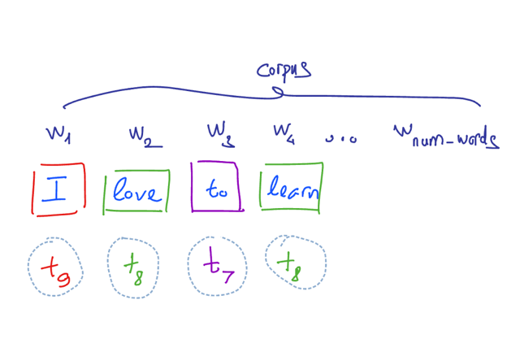</kbd>

  
<kbd></kbd>

   

  
  - Forward pass
     

    
    - Backward pass
       

        
        
<kbd>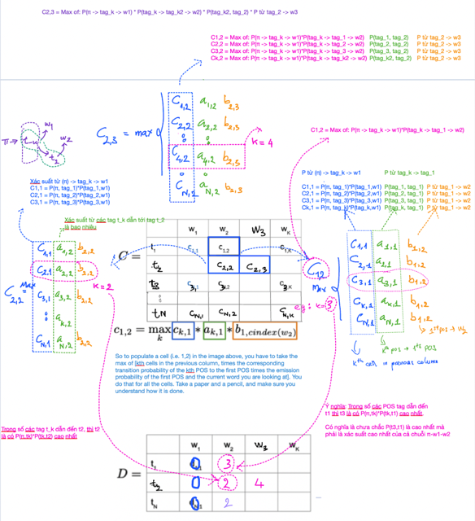</kbd>

         

        
        
<kbd>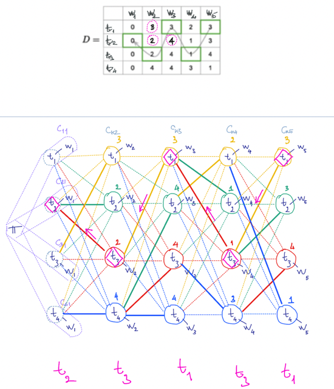</kbd>

         

  
  
<kbd>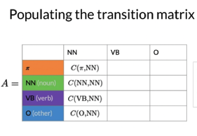</kbd>

   

  
  
<kbd>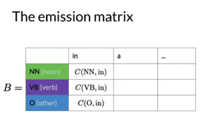</kbd>

   

## Viterbi: Forward Pass

 

### \\* 1 Forward Pass\\*: The forward pass is the second step in populating the matrices

> [!NOTE]
> \**1 Forward Pass\**: The forward pass is the second step in populating the matrices
> C and D using the Viterbi algorithm. \**2 Calculation of Matrix C\**: To calculate the entries in matrix C, a function is used
> that considers the values from the previous column and the emission probability of
> the current word. Starting from the last term, the formula incorporates the emission
> probability from tag t1 to word w2, the transition probability from tag tk to the current
> tag t1 (ak,1), and the probability of the preceding path (tk1). The formula is
> evaluated for each possible value of k, and the k value that maximizes the formula
> is chosen. The resulting maximum value is stored in Ci,j. \**3 Calculation of Matrix D\**: Matrix D is calculated using a similar formula to that of
> matrix C, with the exception of the leading argmax function. The argmax function
> returns the k value that maximizes the function arguments instead of the maximum
> value itself. The k value that maximizes the formula is stored in Di,j. \**4 Populating Matrices Column by Column\**: The remaining entries in matrices C
> and D are populated column by column, following the same calculation process
> described above.
>
> By completing the forward pass, the matrices C and D are fully populated,
> representing the probabilities and paths associated with each part of speech tag for
> the given sequence of words. These matrices serve as the basis for the next step,
> where the path can be reconstructed to identify the part of speech for each word.
>
> The summarized information emphasizes the process of populating matrices C and
> D using the Viterbi algorithm during the forward pass. The calculations involve
> considering transition probabilities, emission probabilities, and preceding path
> probabilities to determine the most likely sequence of part of speech tags for a
> given sentence.

 

  
  
<kbd>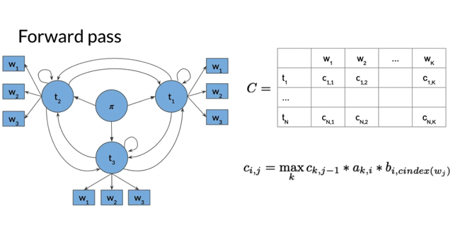</kbd>

  > The forward pass is the second of three steps to populate your matrices, C and D.
> Now that you **have initialized** the matrices, C and D, all the remaining entries in the
> two matrices, C & D are**populated** **column by column** during the **forward pass**

   

  
  
<kbd>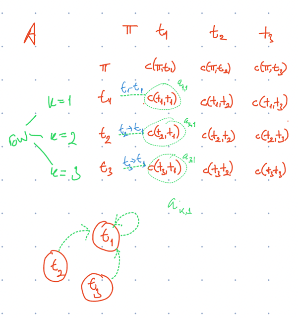</kbd>

  
<kbd>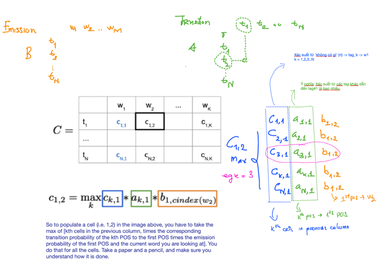</kbd>

  
<kbd></kbd>

  
<kbd></kbd>

  
<kbd>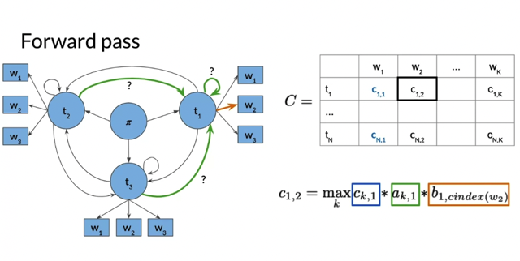</kbd>

  > Ví dụ tính C1,2 đại khái là chọn **k** làm sao mà 
> maximize **Ck,1 * ak,1 * b1,cindex(w2)**
>
> **b1,cindex(w2)**: is simply the emission probability from 
> tag t1 towards w2. Cái này fix rồi
>
> -> Đơn giản đó là emission prob từ tag t_1 thành từ w_2.
>
> **ak,1**, which is the **transition** probability from the 
> part of speech tag **t_k** to the current tag **t_1**
>
> -> Là transition probs từ các trạng thái t_k đến t_1. vk = 1,2,..t_N
>
> **Ck,1** là represent of probability the preceding path you traversed
> Đại khái hiểu là probability từ đầu cho đến trạng thái t_1
>
> You **choose the k** which **maximizes the entire formula**. 
> In this case, there are **three states** that are **not the initial state.**

   

  
  
<kbd>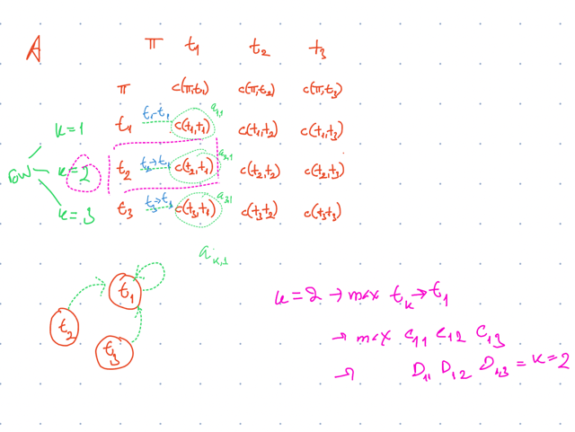</kbd>

  
<kbd></kbd>

  
<kbd>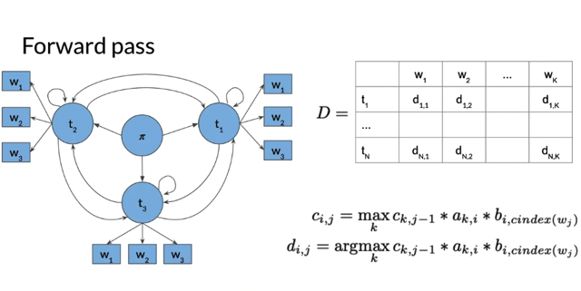</kbd>

  > In each di,j, you simply **save the k** which maximizes the entry
> and ci,j. Here, there are three states that are not the initial
> state. So, k is either one, two, or three

  > Như vậy D chỉ đơn giản là chứa giá trị của k mà
> khiến tính giá trị của C tương ứng lớn nhất. 
>
> Ở đây có 3 states, không phải là initial state, K ở đây có thể là 1,2,3

  > Note that the only difference between  c ij and d ij   , is
> that in the former you compute the **probability** and in
> the latter you keep track of the **index** **of the row**
> where that probability came from. So you keep track of
> which  k was used to get that max probability.

   

## Viterbi: Backpass

 

<kbd>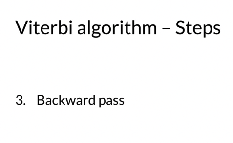</kbd>

> [!NOTE]
> By now, you've populated the matrices C and D. Now you just have
> to **extract the path through your graph from the matrix D**, which
> represents the **sequence of hidden states** that's **most likely
> generated our sequence** where at one all the way towards K.

 

<kbd>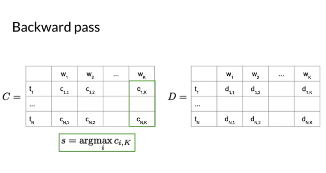</kbd>

> [!NOTE]
> First **calculate the index o**f the entry**C_i,K** with the **highest probability in the last
> column of C**. The probability at this index is the **probability** of the **most likely sequence
> of hidden states** generating the **given sequence of words**. You use this index as to traverse
> backwards through the matrix D to reconstruct the sequence of parts of speech tags. First,
> calculate the index of the entry CIK with the highest probability in the last column of C. The
> probability at this index is the probability of the most likely sequence of hidden states
> generating the given sequence of words. You use this index s to traverse backwards
> through the matrix D to reconstruct the sequence of parts of speech tags.

> [!NOTE]
> Đơn giản tóm gọn:
>
> Bắt đầu bằng cách xem trong cái **cột cuối**cùng của C thằng nào
> **to nhất** thì lấy index của nó. Gán cho **s***Ở đây: theo bảng C này, ở cột cuối, cái ô ở hàng đầu (index = 1) to
> nhất**nên s = 1.**Giả dụ t1, t2, t3.. là hidden state là POS tag Verb,
> Noun, Adj..  tạm gọi là **loại từ** cho gần gũi.
>
> Và w_K.. là observable state là 'eat' thì khả năng cao nhất của một
> **loại từ** biến thành **' eat'** chính là **verb** - cái **loại từ** tương
> ứng với **t1.**
>
> Qua bảng D, cột cuối, xem với index **s** đó, là ô nào, thì đánh dấu
> màu xanh vào ô đó.
>
> *Ở đây, s = 1, thì qua D đánh dấu màu xanh vào ô số 1.
>
> Sau đó từ ô đó mang số bao nhiêu thì nó sẽ thể hiện cái ô trước
> đó. Ví dụ 3 thì cái ô trước đó - tức là của cái cột trước sẽ là ô thứ 3
> thế là ta đánh dấu vào ô đó, và **t3** tương ứng sẽ là cái **loại từ có
> xác suất cao nhất tương ứng với w4.**Cái ô này lại mang số 1.****Tiếp theo hoàn toàn tương tự, cái ô trước đó sẽ là ô số 1 của cột
> 3. -> Khả năng cao nhất của w3 sẽ là t1
>
> Ô số 1 của cột 3 mang số 3.
>
> ->Ô trước đó sẽ là ô số 3 của cột 2 -> Khả năng cao nhất của w2 là t3
>
> Cứ như vậy cho đến khi gặp từ w1.****

 

<kbd>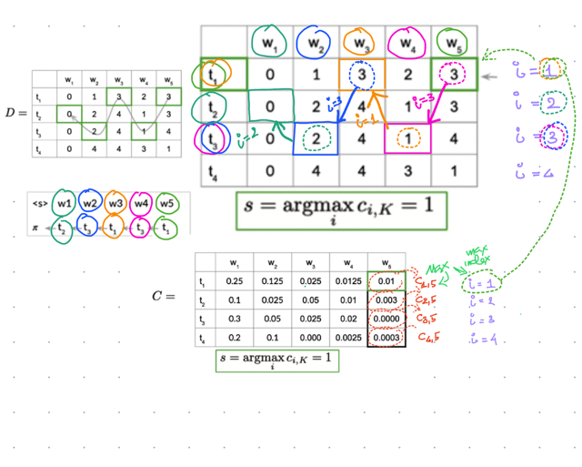</kbd>

> [!NOTE]
> Nhớ: Vị trí đầu tiên của D là do C (index
> nào của ô mang số lớn nhất của cột cuối),
> sau đó thì theo các giá trị cuả ô trong D

 

<kbd>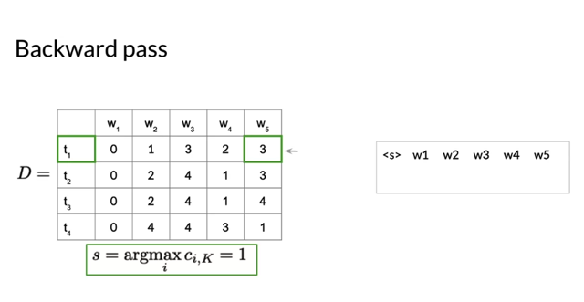</kbd>

<kbd></kbd>

<kbd>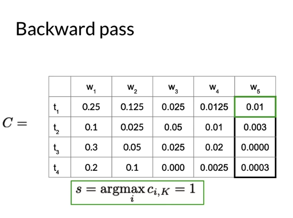</kbd>

 

<kbd>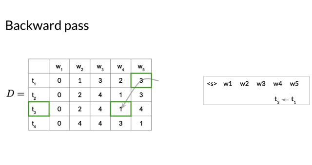</kbd>

 

<kbd>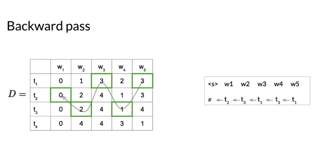</kbd>

 

<kbd>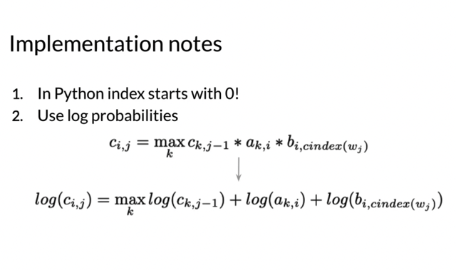</kbd>

> [!NOTE]
> Hai chú ý để khi làm P.A. 1 là python
> start index by 0 và dùng log

 

<kbd>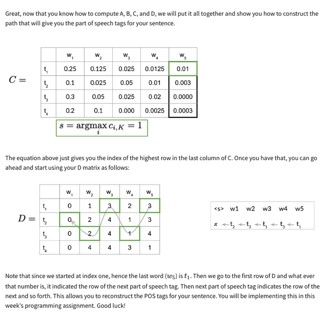</kbd>

 

## Week Conclution

 

## Quiz: Part Of Speech Tagging

 

<kbd></kbd>

 

<kbd>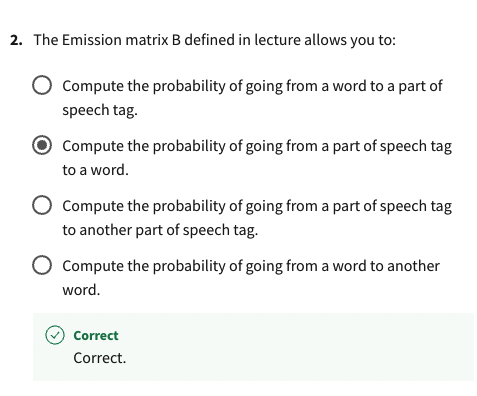</kbd>

 

<kbd>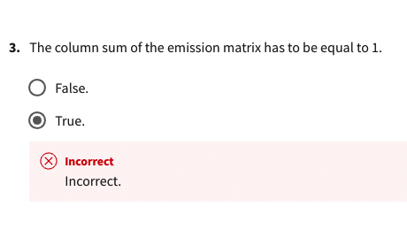</kbd>

 

<kbd>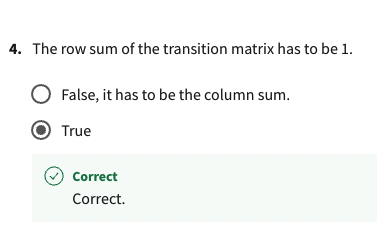</kbd>

 

<kbd>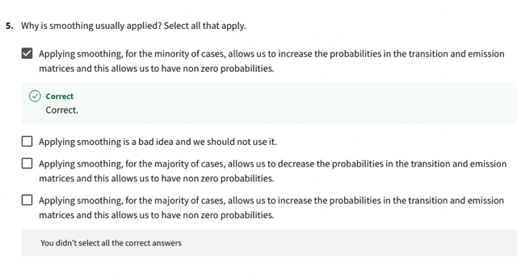</kbd>

> [!NOTE]
> Phải check thêm ý thứ 4 Số ít trường hợp thì giúp
> tăng probability khi gặp từ không có trong corpus,
> nhưng với đa số còn lại nó làm giảm probability đi

 

<kbd>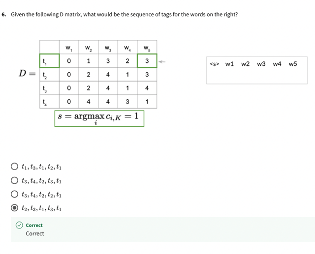</kbd>

 

<kbd>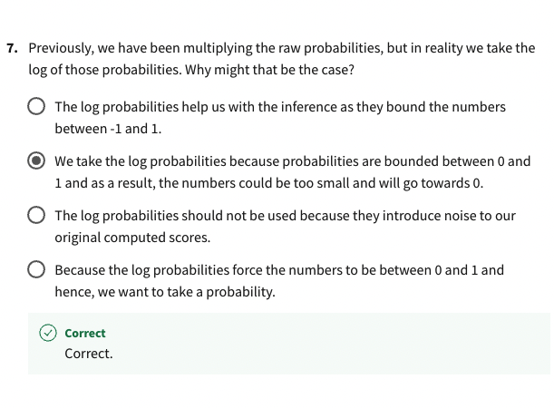</kbd>

 

<kbd>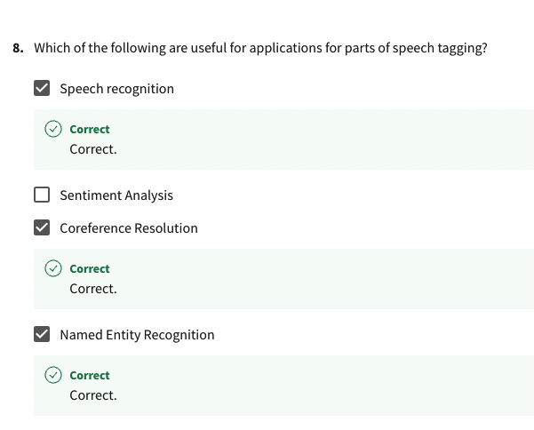</kbd>

 

## Programming Assignment: Part Of Speech Tagging

 

### Welcome to the second assignment of Course 2 in the Natural Language Processing

> [!NOTE]
> Welcome to the second assignment of Course 2 in the Natural Language Processing 
> specialization. This assignment will develop skills in part-of-speech (POS) tagging, the 
> process of assigning a \**part-of-speech tag (Noun, Verb, Adjective...)\** to \**each word in an 
> input text\**. \**Tagging\** is difficult because some words can represent more than one part of 
> speech at different times. They are \**Ambiguous\**. Let's look at the following example:
>
>  • The whole team played \**well\**. [adverb]
>  • You are doing \**well\** for yourself. [adjective]
> \**• Well\**, this assignment took me forever to complete. [interjection]
>  • The \**well\** is dry. [noun]
>  • Tears were beginning to \**well\** in her eyes. [verb]
>
> Distinguishing the parts-of-speech of a word in a sentence will help you \**better understand 
> the meaning of a sentence\**. This would be critically important in \**search queries.\** 
> Identifying the proper \**noun\**, the \**organization\**, the \**stock symbol,\** or anything similar would 
> greatly improve everything ranging from speech recognition to search. By completing this 
> assignment, you will:
>  • Learn how parts-of-speech tagging works
>  • Compute the \**transition matrix A\** in a Hidden Markov Model
>  • Compute the \**emission matrix B\** in a Hidden Markov Model
>  • Compute the \**Viterbi\** algorithm
>  • Compute the \**accuracy\** of your own model
>

 

- 0 - Data Sources
   

  
  - # Importing packages and loading in the data set  from utils_pos import get_word_tag, preprocess   import pandas as pd from collections import defaultdict import math import numpy as np import w2_unittest
     

    
    - This assignment will use two \\*tagged data sets\\* collected from the \\*Wall Street Journal (WSJ)\\*. \\_ Here\\_ is an example \\*'tag-set'\\* or \\*Part of Speech\\* designation describing the two or three  letter tag and their meaning.  • One data set (\\*WSJ-2_21.pos\\*) will be used for \\*training\\*.  • The other (\\*WSJ-24.pos\\*) for \\*testing\\*.  • The tagged training data has been preprocessed to form a vocabulary  (\\*hmm_vocab.txt\\*).  • The words in the vocabulary are words from the training set that were used  two or more times.  • The vocabulary is augmented with a set of '\\*unknown word tokens\\*', described below. The training set will be used to create the \\*emission, transition and tag counts\\*.
       

      
      - The test set (WSJ-24.pos) is read in to create \\*y\\*.  • This contains both the \\*test text and the true tag.\\*  • The test set has also been preprocessed to \\*remove the tags\\* to  form \\*test_words.txt\\*.  • This is read in and further processed to identify the end of sentences and  handle words not in the vocabulary using functions provided in \\*utils_pos.py\\*.  • This forms the \\*list prep\\*, the preprocessed text used to test our POS taggers.
         

        
        - \\*A POS tagger\\* will necessarily encounter words that are not in its datasets.  • To improve accuracy, these words are \\*further analyzed\\* during preprocessing  to \\*extract available hints\\* as to their appropriate tag.  • For example, the suffix '\\*ize\\*' is a hint that the word is a verb, as in '\\*final-ize\\*' or  '\\*character-ize\\*'.  • A set of unknown-tokens, such as '\\*--unk-verb--\\*' or '\\*--unk-noun--\\*' will replace  the unknown words in both the training and test corpus and will appear in the emission,  transition and tag data structures.
           

            
            
<kbd>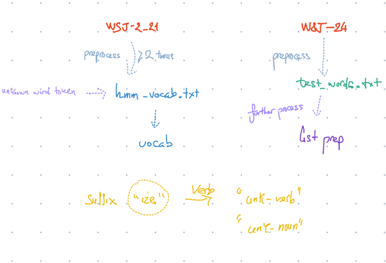</kbd>

            > Một chút 'đồ hoạ' để dễ hiểu
> hơn 1 chút preprocessing

             

            
            
<kbd>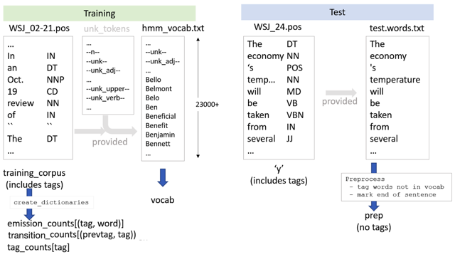</kbd>

            > Tóm tắt:
>
> WSJ_02-21.pos sẽ được đọc thành training_corpus - một list, nội dung có sao
> để vậy tức là **word** gắn với **POS** **tag ví dụ như:**'r**eview**\\t**NN**\\n
>
> cái này sẽ được dùng để tạo transition, emission và tag count
>
> WSJ_02-21.pos ở một hướng khác được preprocess, cùng với unk_tokens:
> Remove cái POS tag đi, để tạo thành **hmm_vocab.txt** (người ta làm sẵn
> rồi) cái này có dạng kiểu như list các text thì mình sẽ đọc cái file này, và tạo
> một cái 'từ điển từ vựng' - vocab dictionary chứa các cặp **word - ID**

            > Tương tự, WSJ_24.pos cũng được đọc thành y, không preprocess gì  (tương
> tự như training_corpus),  là một list các word+tag
>
> Và WSJ_24.pos cũng được preprocess (để remove tag) tạo thành test.word.
> txt.
>
> Rồi process tiếp - remove luôn cái nào mà tag không có trong  vocab - tạo
> bởi training) và thêm cái end of sentence marking để thành 'prep'

             

          
          - Implementation note:  • For python 3.6 and beyond, \\*dictionaries\\* retain the \\*insertion order\\*.  • Furthermore, their \\*hash-based lookup\\* makes them suitable for \\*rapid  membership tests\\*.  ▪ If \\/di\\/ is a dictionary, key in di will return True if \\/di\\/ has a key _key_, else False.  The dictionary vocab will utilize these features.
            > Đại khái nói thêm về tính chất 'retain the insertion
> order' - kiểu như thứ tự nhét vào được giữ nguyên và
> dictionary có cái term 'key in di' sẽ trả về true nếu key
> có trong dictionary di

             

            
            - # load in the training corpus \\*with open\\*("./data/WSJ_02-21.pos", 'r') \\*as\\* \\*f\\*:     \\*training_corpus\\* = \\*f.readlines()\\*  print(f"A few items of the training corpus list") print(training_corpus[\\*0:5\\*])
              > Đại khái là đọc file WSJ_02-21.pos ra,
> thì training_corpus sẽ là 1 list

               

                
                
<kbd>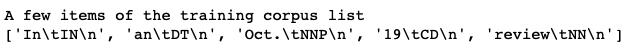</kbd>

                 

              
              - # read the vocabulary data, split by each line of text, and \\*save the list\\* with open("./data/\\*hmm_vocab.txt\\*", 'r') as f:     \\*voc_l\\* = f.read().\\*split\\*('\\\ ')  print("A few items of the vocabulary list") print(voc_l[0:50]) print() print("A few items at the end of the vocabulary list") print(voc_l[-50:])
                > Đại khái là đọc cái hmm_vocab.txt ra,
> voc_l sẽ là 1 list các string thôi

                 

                  
                  
<kbd>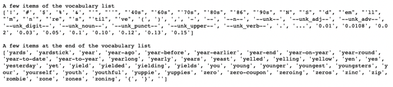</kbd>

                   

                
                - # \\*vocab\\*: \\*dictionary\\* that has the \\*index of the corresponding words\\* vocab = {}  # Get the index of the corresponding words.  for I, word in enumerate(sorted(\\*voc_l\\*)):      \\*vocab[word] = I\\*             print("Vocabulary dictionary, key is the word, value is a unique integer") cnt = 0 for k,v in vocab.items():     print(f"{k}:{v}")     cnt += 1     if cnt > 20:         break
                  > Đại khái là ở đây, ổng từ 1 list - vocab_l,
> để chuyển thành 1 vocab dictionary sao
> cho map 1 từ - 1 unique id

                   

                    
                    
<kbd>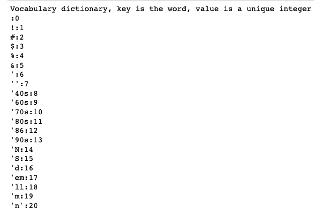</kbd>

                    > Vocab là một cái dictionary, với keylà
> word còn value là unique integer

                     

                  
                  - # load in the test corpus with open("./data/WSJ_24.pos", 'r') as f:     y = f.readlines()      print("A sample of the test corpus") print(y[0:10])
                    > Tương tự, đọc cái WSJ_24.
> pos ra, y sẽ là 1 list

                     

                      
                      
<kbd>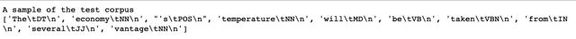</kbd>

                       

                    
                    - #corpus without tags, preprocessed _, prep = preprocess(vocab, "./data/test.words")       print('The length of the preprocessed test corpus: ', len(prep)) print('This is a sample of the test_corpus: ') print(prep[0:10])
                      > Đọc cái file test.word - chứa các từ trong test corpus
> và xử lý thêm để được prep
> - list các word

                       

                        
                        
<kbd>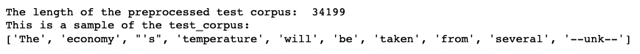</kbd>

                         

- 1 - Parts-of-speech Tagging
   

  
  - 1.1 - Training
     

    
    - You will start with the \\*simplest\\* possible \\*parts-of-speech tagger\\* and we will build up to the  \\*state of the art.\\*  In this section, you will find the words that are \\*not ambiguous.\\*  • For example, the word is is a verb and it is not ambiguous.  • In the WSJ corpus, \\*86%\\* of the token are unambiguous (meaning they have  only one tag)  • About 14% are ambiguous (meaning that they have more than one tag)
      > Đại khái là phần này mình sẽ tìm
> những từ unambiguous - những
> từ chỉ có 1 POS tag

       

        
        
<kbd>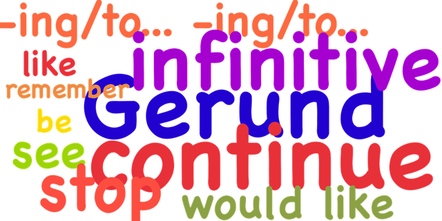</kbd>

         

      
      - Before you start \\*predicting the tags of each word\\*, you will need to compute a \\*few dictionaries\\* that will help you to \\*generate the tables\\*.
         

          
          
<kbd>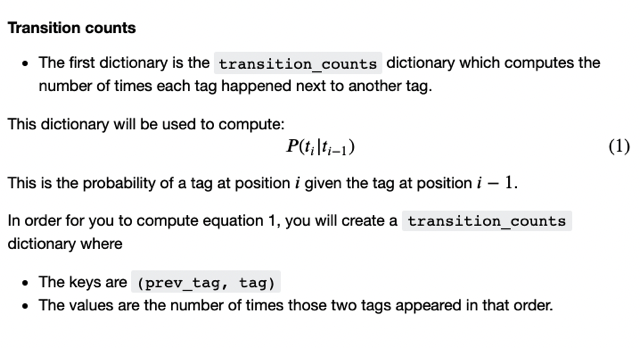</kbd>

          > Đại khái là để tính cái Transition Matrix (hay table) trong đó chứa giá trị là
> xác suất (probability) của 1 hidden state t_i-1 chuyển thành hidden state t_i,
> hay nói cách khác là P(t_i|t_i-1) thì đầu tiên ta sẽ tính / đếm (trong training set) số lần t_i theo
> sau bởi t_i-1. Để rồi khi tính P(t_i|t_i-1) ta sẽ lấy cái đó chia cho tổng số lần
> t_i-1 xuất hiện)

           

          
          
<kbd>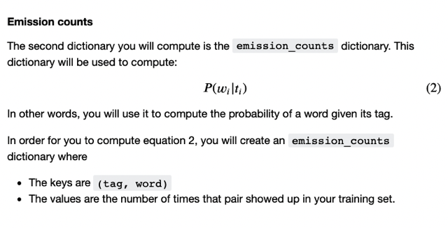</kbd>

          > Tương tự, để tính Emission matrix (probability matrix) chứa P(w_i|t_i) - Xác suất, hidden
> state t_i biến thành observable state w_i, hay nói cách khác là nếu cho biết POS tag t_i
> (ví dụ verb), thì xác suất nó là từ w_i (Ví dụ 'drink' là bao nhiêu). Để tính, trước tiên ta
> cũng đếm (trong training set) bao nhiêu lần t_i nó "theo sau" bởi w_i, để rồi chia cho tổng
> số t_i, ta sẽ được P(w_i|t_i)

           

          
          
<kbd>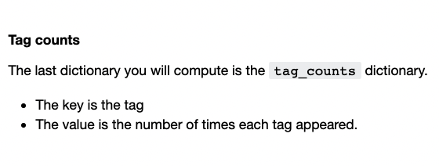</kbd>

          > Cuối cùng để có cái denominator / mẫu số cho các
> phép chia khi tính P(t_i|t_i-1) và P(w_i|t_i) thì ta sẽ
> tính trước số lần t_i xuất hiện.

           

  
  - Exercise 1 - create_dictionaries (UNQ_C1)
     

    
    - \\*Instructions:\\*  Write a program that takes in the \\*training_corpus\\* and returns the \\*three  dictionaries\\* mentioned above \\*transition_counts\\*, \\*emission_counts\\*, and \\*tag_counts\\*.  • \\*emission_counts\\*: maps (tag, word) to the number of times it happened.  • \\*transition_counts\\*: maps (prev_tag, tag) to the number of times it has  appeared.  • \\*tag_counts\\*: maps (tag) to the number of times it has occurred.  Implementation note: This routine utilizes \\/\\*defaultdict\\*\\/, which is a \\*subclass of \\/dict\\*\\/.  • A standard Python dictionary throws a \\/KeyError\\/ if you try to access an item  with a key that is not currently in the dictionary.  • In contrast, the \\/defaultdict\\/ will create an item of the type of the argument, in  this case an integer with the default value of 0.  • See \\_defaultdict\\_.
      > Đại khái là gợi ý mình dùng defaultdict - là một
> dạng của dict. Trong đó nó không báo lỗi nếu
> access với key chưa tồn tại, mà tự động
> tạo/thêm key với gía trị = 0.

       

        
        
<kbd>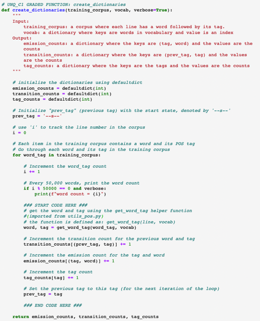</kbd>

         

        
        
<kbd>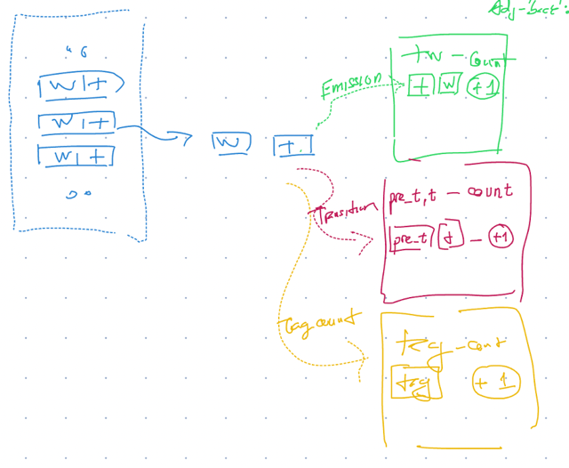</kbd>

         

        
        
<kbd>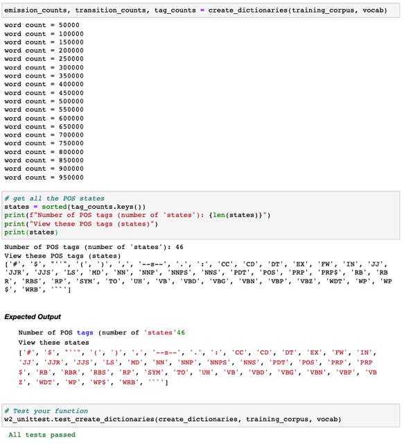</kbd>

         

      
      - The '\\*states\\*' are the Parts-of-speech designations found in the training data. They will also  be referred to as '\\*tags\\*' or \\*POS\\* in this assignment.  • "\\*NN\\*" is \\*noun\\*, \\*singular\\*,  • '\\*NNS\\*' is \\*noun\\*, \\*plural\\*.  • In addition, there are helpful tags like '\\*--s--\\*' which indicate a \\*start of a  sentence\\*.  • You can get a more complete description at \\_clips/MBSP\\_.
         

          
          
<kbd>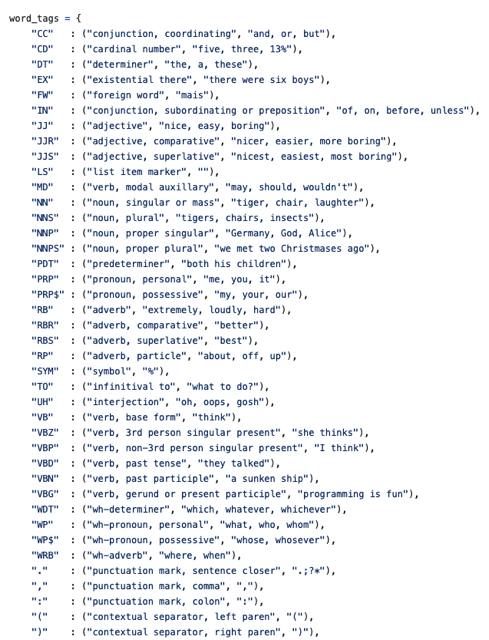</kbd>

          > https://github.com/clips/MBSP/blob/master/tags.py

           

        
        - print("transition examples: ") for ex in \\*list\\*(\\*transition_counts.items()\\*)[\\*:3\\*]:     print(ex) print()  print("emission examples: ") for ex in \\*list\\*(\\*emission_counts.items()\\*)[\\*200:203\\*]:     print (ex) print()  print("ambiguous word example: ") for tup,cnt in emission_counts.items():     if tup[1] == 'back': print (tup, cnt)
           

            
            
<kbd>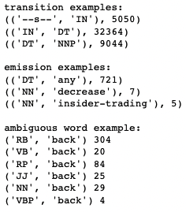</kbd>

             

  
  - 1.2 - Testing
     

    
    - Now you will \\*test\\* the \\*accuracy of your parts-of-speech tagger\\* using  your \\*emission_counts\\* dictionary.  • Given your \\*preprocessed test corpus prep\\*, you will assign a \\*parts-of-speech\\*  \\*tag\\* to every word in that corpus.  • Using the \\*original tagged test corpus y,\\* you will then \\*compute what percent of  the tags you got correct\\*.
      > Đại khái là ta sẽ gán POS tag cho từ trong preprocessed
> test corpus prep, và dùng pos thực sự (original tagged test
> corpus y - là cái đọc từ WJS_24 ra đó) để check xem độ
> chính xác là bao nhiêu.

       

        
        
<kbd>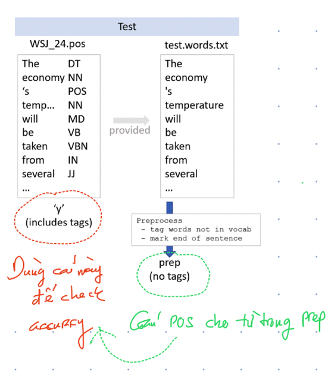</kbd>

         

  
  - Exercise 2 - predict_pos (UNQ_C2)
     

    
    - \\*Exercise 2 - predict_pos  Instructions:\\* Implement \\*predict_pos\\* that computes the accuracy of your model.  • This is a \\*warm up exercise.\\*  • To assign a part of speech to a word, assign the \\*most frequent POS\\* for\\* that  word\\* in the \\*training set.\\*  • Then\\* evaluate how well this approach works\\*. Each time you predict based on  the most frequent POS for the given word, check whether the actual POS of that word is  the same. If so, the prediction was correct!  • Calculate the accuracy as the\\* number of correct predictions\\* divided by the  \\*total number of words\\* for which you predicted the POS tag.
      > Đại khái là sơ khởi, ta sẽ gán POS cho từ một ví dụ 'back' một cách ngây thơ là cứ dùng POS nào mà
> **POS-'back'** có **giá trị cao nhất trong Emission count dict**. Có nghĩa ta coi trong training, **loại từ
> (POS) của từ 'back' chính loại từ mà gắn với 'back' nhiều nhất** trong **training corpus**
>
> Ta sẽ dùng cách này để predict tag của các từ trong test corpus, cụ thể là **prep** - cái list từ đã extract và
> preprocess từ test.words.txt. Xong rồi đối chiếu với POS tag thật sự của chúng để tính  accuracy percentage

       

        
        
<kbd>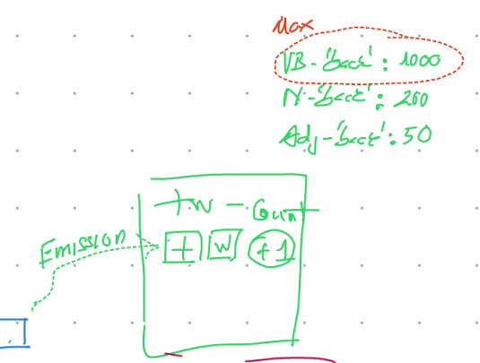</kbd>

         

        
        
<kbd>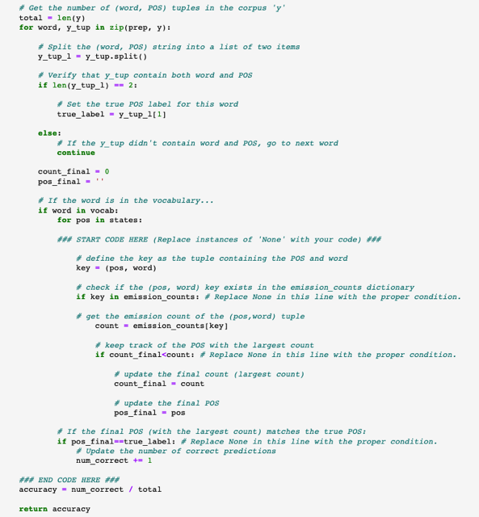</kbd>

        
<kbd></kbd>

        
<kbd>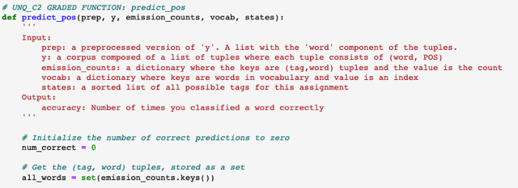</kbd>

         

        
        
<kbd>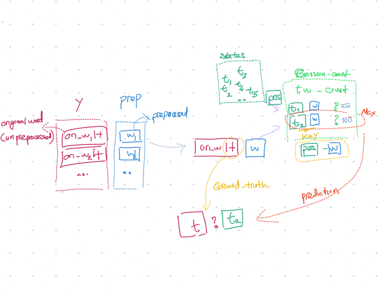</kbd>

         

        
        
<kbd>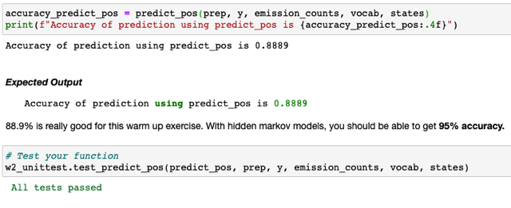</kbd>

         

- 2 - Hidden Markov Models for POS
   

  
  - Now you will build something more \\*context specific\\*. Concretely, you will be implementing  a \\*Hidden Markov Model (HMM)\\* with a \\*Viterbi decoder\\*  • The HMM is one of the \\*most commonly used algorithms\\* in \\*Natural Language  Processing\\*, and is a \\*foundation\\* \\*to many deep learning techniques\\* you will see in this  specialization.  • In addition to \\*parts-of-speech tagging\\*, HMM is used in \\*speech recognition\\*,  \\*speech synthesis\\*, etc.  • By completing this part of the assignment you will get a \\*95% accuracy\\* on the  same dataset you used in Part 1.  The Markov Model contains a \\*number of states\\* and the \\*probability of transition between  those states\\*.  • \\*In this case\\*, the \\*states\\* are the \\*parts-of-speech.\\*  • A Markov Model utilizes a \\*transition matrix, A\\*.  • A Hidden Markov Model adds an \\*observation\\* or \\*emission matrix B\\* which  describes the \\*probability of a visible observation when we are in a particular state.\\*  • In this case, the \\*emissions\\* are the \\*words in the corpus\\*  • The state, which is hidden, is the \\*POS tag\\* of that word.
    > Đại khái là nói về Hidden Markov Model, rất quan trong, đặt nền
> móng cho nhiều ứng dụng khác trong NLP nữa. Nhắc lại về
> probability of transition từ hidden state (trong bài toán này là POS)
> này sang hidden state khác và từ hidden state sang observable state
> (trong bài toán này là word)

     

  
  - 2.1 - Generating Matrices
     

    
    - \\*Creating the 'A' transition probabilities matrix \\* Now that you have your \\*emission_counts\\*, \\*transition_counts\\*, and \\*tag_counts\\*, you will  start implementing the \\*Hidden Markov Model\\*.  This will allow you to quickly construct the  • \\*A transition probabilities matrix\\*.  • and the \\*B emission probabilities matrix\\*.  You will also use some \\*smoothing\\* when computing these matrices.  Here is an example of what the A transition matrix would look like (it is simplified to 5 tags  for viewing. It is 46x46 in this assignment.):
       

        
        
<kbd>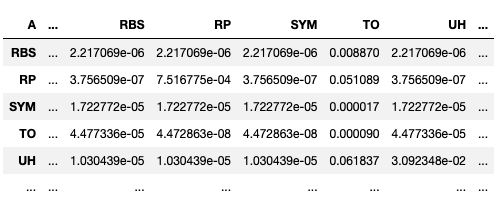</kbd>

         

        
        
<kbd>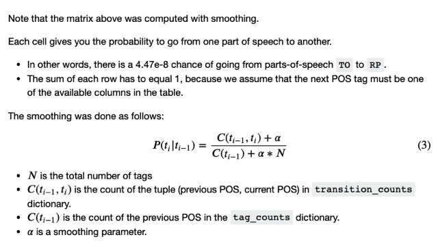</kbd>

         

  
  - Exercise 3 - create_transition_matrix (UNQ_C3)
     

    
    - Instructions: Implement the create_transition_matrix below for all tags. Your task is to output a \\*matrix\\* that computes \\*equation 3\\* for \\*each cell in matrix A. \\*
       

        
        
<kbd>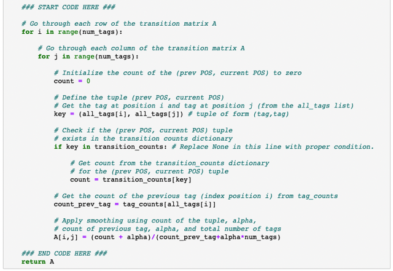</kbd>

        
<kbd></kbd>

        
<kbd>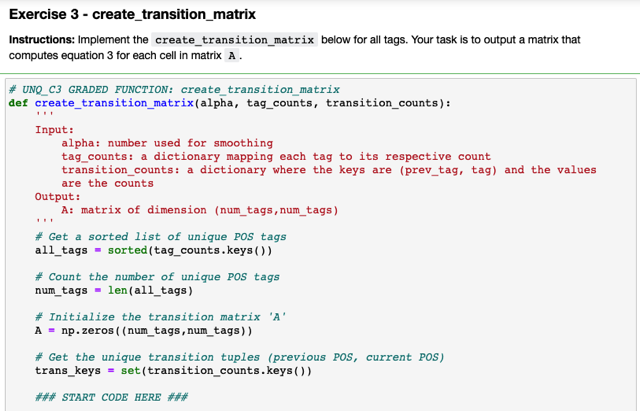</kbd>

         

        
        
<kbd>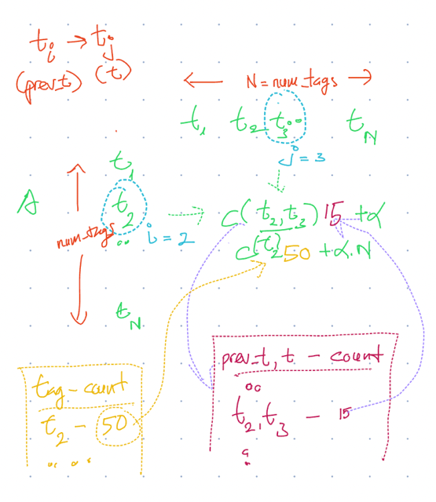</kbd>

         

        
        
<kbd>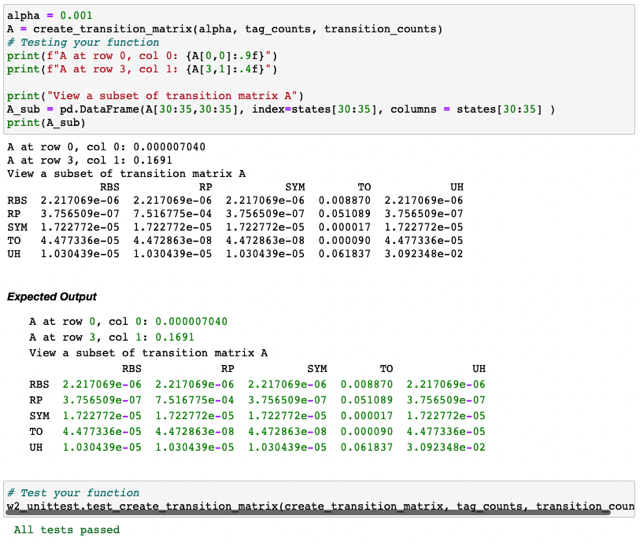</kbd>

         

  
  - Exercise 4 - create_emission_matrix (UNQ_C4)
     

      
      
<kbd>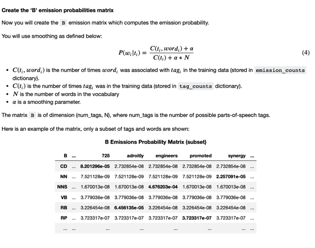</kbd>

       

    
    - Instructions: Implement the create_emission_matrix below that computes the B emission probabilities matrix. Your function takes in  𝛼  , the smoothing parameter, tag_counts, which is a dictionary mapping each tag to its respective count, the emission_counts dictionary where the keys are (tag, word) and the values are the counts. Your task is to output a matrix that computes equation 4 for each cell in matrix B.
       

        
        
<kbd>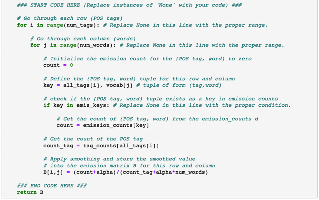</kbd>

        
<kbd></kbd>

        
<kbd>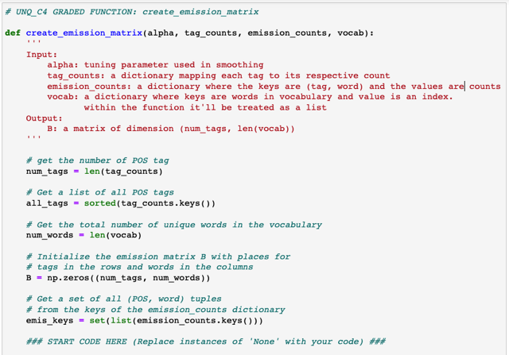</kbd>

         

        
        
<kbd>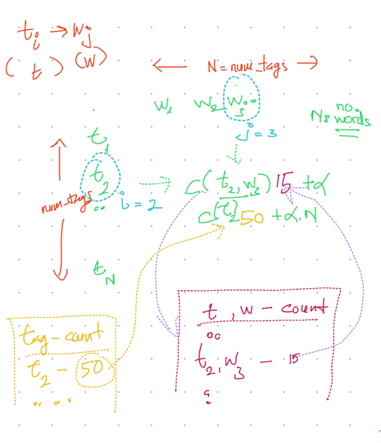</kbd>

         

        
        
<kbd>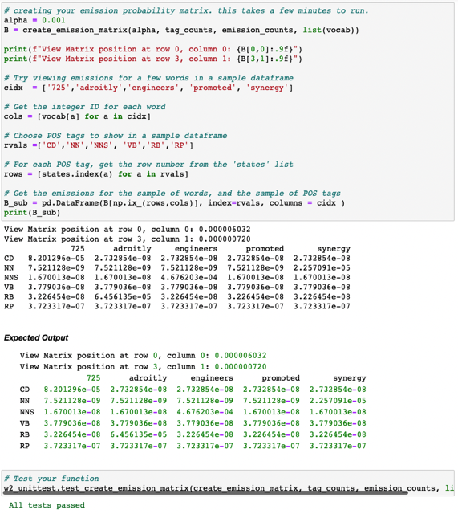</kbd>

         

- 3 - Viterbi Algorithm and Dynamic Programming
   

  
  - In this part of the assignment you will implement the \\*Viterbi algorithm\\* which makes use of  dynamic programming. Specifically, you will use your two matrices, \\*A\\* and \\*B\\* to compute  the \\*Viterbi algorithm\\*. We have decomposed this process into three main steps for you. \\* • Initialization\\* - In this part you \\*initialize\\*  the \\*best_paths\\* and \\*best_probabilities\\* \\*matrices\\* that you will be populating  in feed_forward. \\* • Feed forward\\* - At each step, you \\*calculate the probability of each path\\*  happening and \\*the best paths up to that point.\\* \\* • Feed backward\\*: This allows you to\\* find the best path\\* with the \\*highest  probabilities.\\*
     

  
  - 3.1 - Initialization
     

    
    - You will start by \\*initializing two matrices\\* of the same dimension.  • \\*best_probs\\*: Each cell contains the \\*probability of going from one POS tag to a  word in the corpus\\*.  • \\*best_paths\\*: A matrix that helps you trace through the \\*best possible path in the  corpus.\\*
       

  
  - Exercise 5 - initialize (UNQ_C5)
     

      
      
<kbd>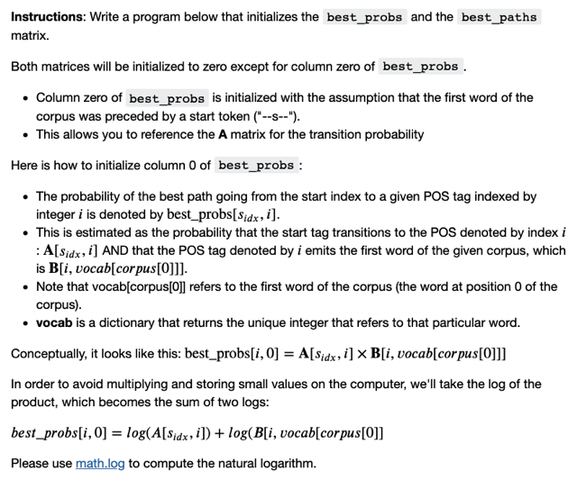</kbd>

      > Đại khái là cái matrix C - best probs sẽ ini với
> 0 hết trừ cái cột đầu - ứng với từ probability
> mà  đầu tiên trong corpus

       

    
    - Tại sao phải giả định từ đầu tiên của Corpus được preceding bởi --s--?
       

        
        
<kbd></kbd>

        
<kbd></kbd>

        
<kbd></kbd>

        
<kbd></kbd>

        
<kbd></kbd>

        > π -> t_1 -> w1
> π-> t_2 -> w1
> π -> t_3 -> w1
>
> *π->t_i (i=1,2,3)
>
> Tính Probs π -> t_i (i=1,2,3) chính là **hàng đầu tiên** của 
> **Transition matrix** (A) (ví dụ π->NN, π->VB, π->O)
>
>
> *t_i (i=1,2,3) -> w_1
>
> Tính Probs t_i->w_1 chính là **1 cột của Emission matrix (B)** với 
> cái cội tương ứng với **index của từ w_1 nên** 
> mới kí hiệu là **b_i,cindex(w1)** . 
> b ý là Emission matrix, 
> i = 1,2,3 ý là index các hàng, 
> cindex(w1) là **index của cái cột tương ứng từ w1.**

        > c_i,1 là Probability t_i -> w_1 với i = 1,2,3...N
>
> Ví dụ:
>
> c_1,1  
> = π_1 * b1, cindex(w1) 
> = (Xác suất pi -> t_1) * (Xác suất t_1 -> w1 )
> = A(1,1) * B(1, index của cột tương ứng với w1)

         

        
        
<kbd>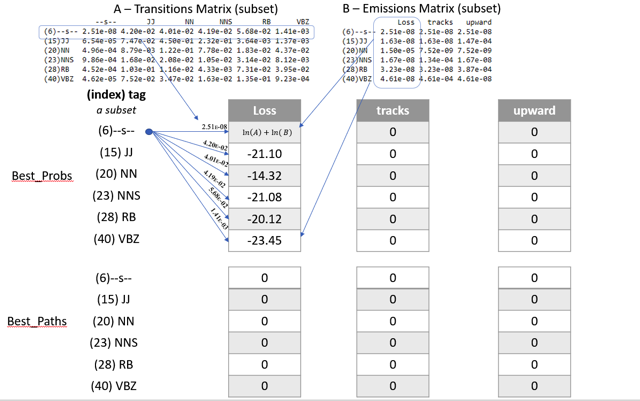</kbd>

         

        
        
<kbd>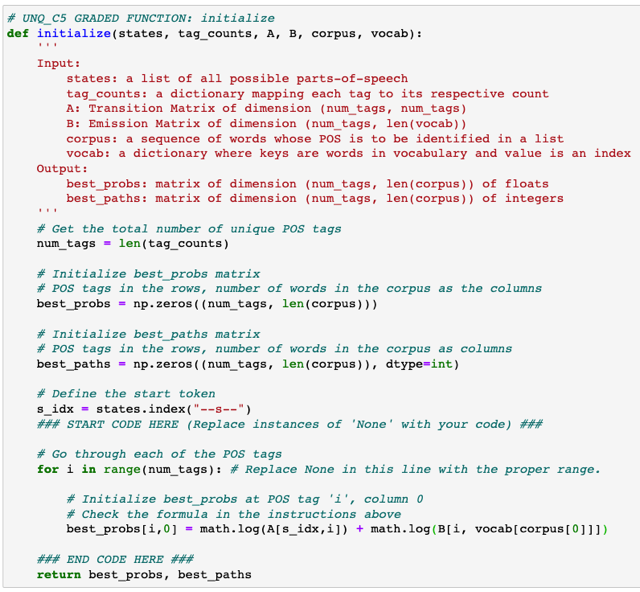</kbd>

         

        
        
<kbd>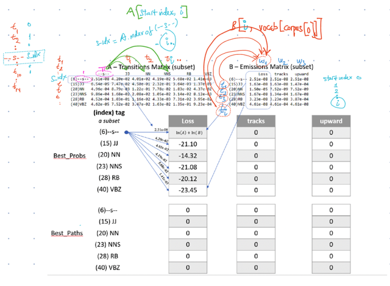</kbd>

         

  
  - 3.2 - Viterbi Forward
     

      
      
<kbd>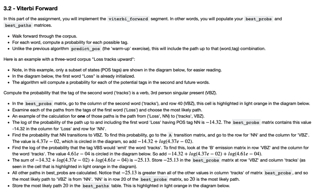</kbd>

      > Quay lại ghi chú sau

       

      
      
<kbd>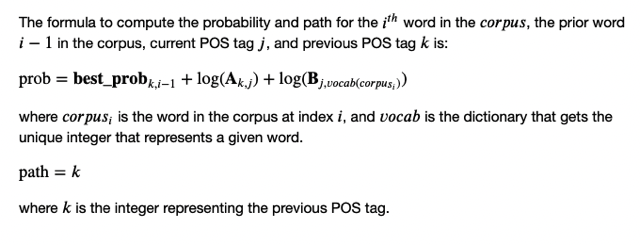</kbd>

       

  
  - Exercise 6 - viterbi_forward (UNQ_C6)
     

      
      
<kbd>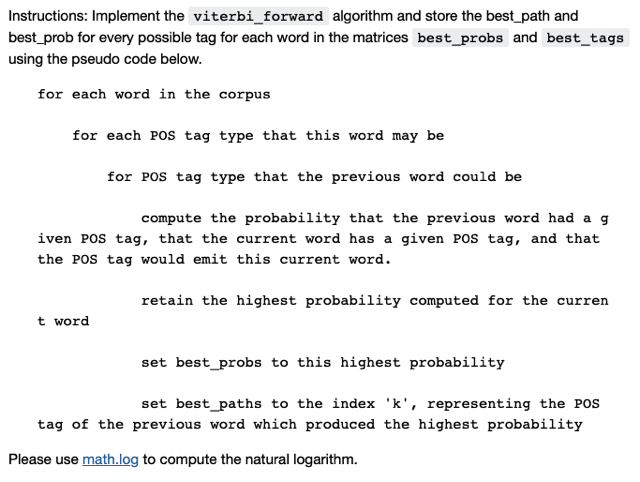</kbd>

       

      
      
<kbd>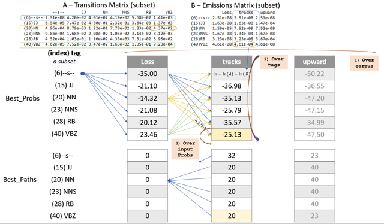</kbd>

       

      
      
<kbd>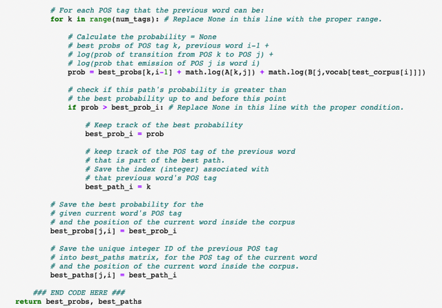</kbd>

      
<kbd></kbd>

      
<kbd>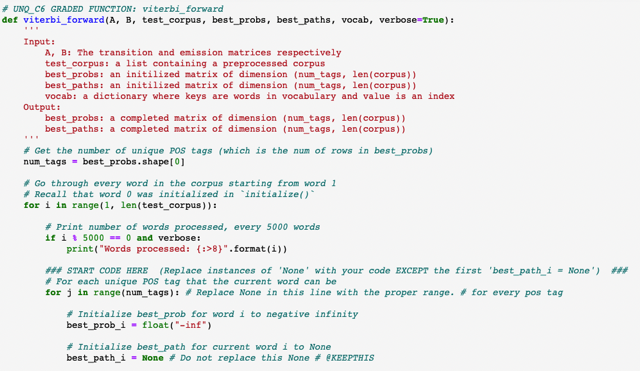</kbd>

       

  
  - 3.3 - Viterbi Backward
     

  
  - Exercise 7 - viterbi_backward (UNQ_C7)
     

      
      
<kbd>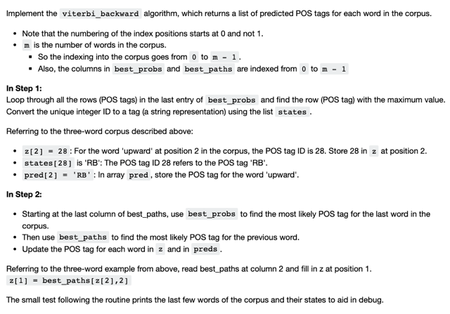</kbd>

       

      
      
<kbd>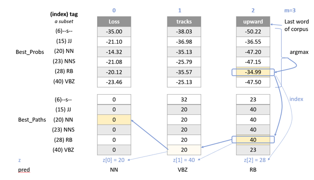</kbd>

       

      
      
<kbd></kbd>

      > Nhớ: Vị trí đầu tiên của D là do C (index
> nào của ô mang số lớn nhất của cột cuối),
> sau đó thì theo các giá trị cuả ô trong D

       

      
      
<kbd>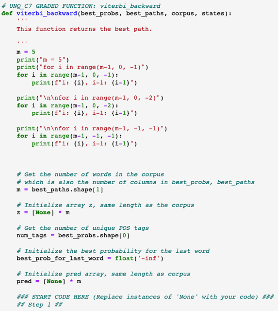</kbd>

       

      
      
<kbd>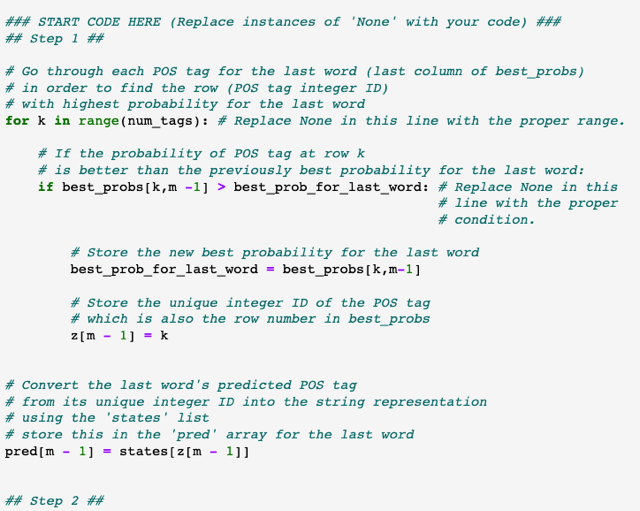</kbd>

      > Bước 1 hoàn toàn chỉ nhờ vào best_prop, đơn giản chỉ xem trong cột
> cuối của best_prob thằng nào to nhất, thì **index hàng của thằng to
> nhất** chính là POS tag id.
>
> Và bỏ id vào states để đổi ra POS tag string.
>
> Update vào pred[], tất nhiên là cũng là ở vị trí cuối.
>
> Và update cái **index hàng của thằng to nhất**đó vào **z[]**

       

      
      
<kbd>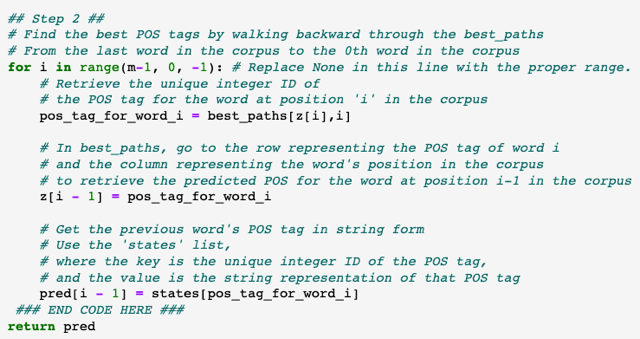</kbd>

      > Sau step 1, nhờ best_prob, predict cho**từ cuối** (m-1) xong rồi (lưu trong pred[m-1] và z[m-1]),
> giờ '\/cầm qua\/' nhờ **best_path**
>
> POS tag ID của**từ áp chót** (m-2) sẽ là giá trị của **best_path** tại vị trí hàng là giá trị của
> z[m-1], cột m-1
>
> (nhờ ID này bỏ vào states sẽ lấy ra giá trị string của POS tag  như VB,NN)
>
> Do đó ta sẽ lấy **best_path[z[m-1],m-1]** gán cho **pos_tag_for_word_i**, rồi lấy giá trị
> của POS string bằng state[**pos_tag_for_word_i**] và update vào pred[m-2].
>
> Đồng thời, update **pos_tag_for_word_i vào z[m-2]**để kế tiếp tính cho thằng áp chót của thằng
> áp chót...
>
> Ngược thêm một thằng nữa, ta lại làm tương tự, lấy giá trị của best_path tại hàng z[m-2],
> cột m-2..
>
> và cứ thế tiếp tục cho đến thằng đầu tiên của chuỗi, chỗ này có lưu ý sẽ nói sau.

      > Do đó cách làm là ta sẽ có 1 loop chạy từ thằng cuối
> ngược lại dần.
> Bắt đầu từ côt cuối  tức start index của loop là m-1.
> Và ngược về dần nên dùng term" range(m-1,0,-1) thì nó sẽ
> bắt đầu i = m-1, ngược dần mỗi lần 1 em, và i cuối là +1 
> (không phải 0 mà +1 nhé)
>
> Rồi với mỗi i, ta lấy best_path ở vị trí **cột** là i, **hàng** là giá trị của z[i].
> Thì đó chính là POS tag ID của cái từ i-1 trong chuỗi.
>
> Trong code: 
>  **pos_tag_for_word_i  = best_path[z[i], i]**
>
> rồi đổi xèng thành tiền, bỏ vào states lấy ra giá trị string của POS của
> và update vào pred[]:
>
>  pred[i-1] = states[pos_tag_for_word_i]
>
> Cuối cùng, update pos_tag_for_word_i vào z[i-1] để xài cho thằng tiếp theo

       

    
    - Để như vầy: ...range(m-1, -1, -1):.. sẽ bị lỗi gọi là "update ngược thằng cuối"
       

        
        
<kbd>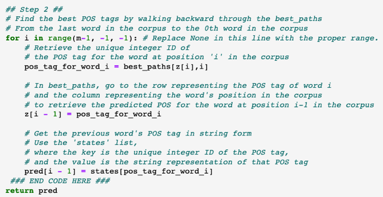</kbd>

         

        
        
<kbd>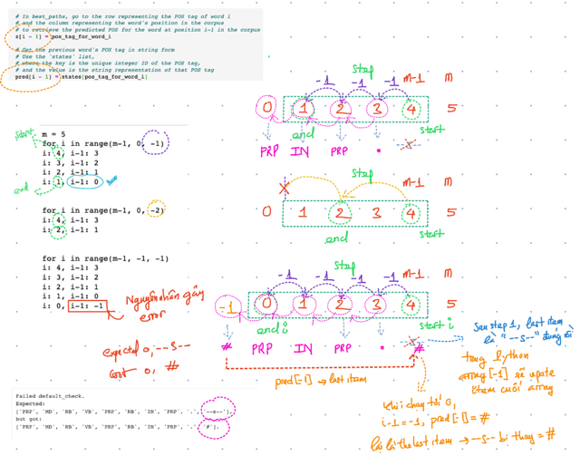</kbd>

        > Ngắn gọn là: trong công thức rang (a, b, c) thì a là start,
> loop bắt đầu từ đó (tức là có tính 'a') và kết thúc ở b
> nhưng không tính b và c là step.
>
> Nên range(m-1, 0, -1) thì nó sẽ start với i = m-1, là thằng cuối,
> (mà đã mang giá trị nhờ step 1)
>
> do đó z[i-1] =.. sẽ update vào thằng áp chót, đi ngược về 0 nhưng
> không tính 0, tức là i sẽ dừng ở +1, do đó z[0] =... sẽ update cho
> thằng đầu tiên của chuỗi. Và stop ở đây. Là đúng.
>
> Còn với rang(m-1,-1,-1) thì nó cũng như trên, update từ thằng
> áp chót của chuỗi ngược về i=0 mới dừng, và do đó nó update
> z[i-1] = z[-1] = ....Thế là nó quay lại update thằng cuối cùng của 
> chuỗi (vì trong Python, phép arrar[-1] sẽ access thằng cuối của array.
> Nên thằng z[m-1], pred[m-1] vốn đang mang giá trị đúng tính từ
> Step 1 là "--s--" lại bị override bằng "#".

         

  
  - Exercise 8 - compute_accuracy (UNQ_C8)
     

      
      
<kbd>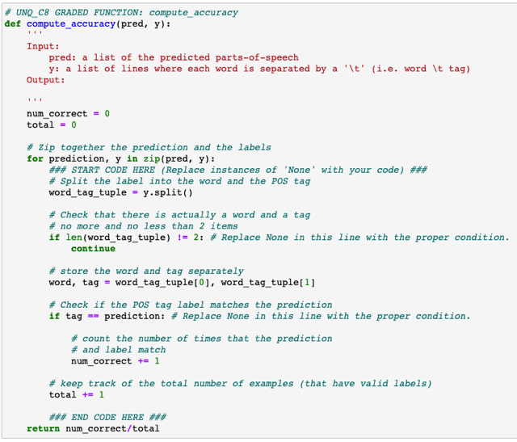</kbd>

      > Implement a function to compute the accuracy of the viterbi algorithm's POS tag predictions.
>
> To split y into the word and its tag you can use y.split().

      > Trong Python loop, continue sẽ bỏ qua
> item này chuyển qua next item

       

- 4 - Predicting on a Dataset
   

