# C2W3_AUTOCOMPLETE AND LANGUAGE MODELS  Learn about how \\*N-gram language models\\* work by calculating \\*sequence probabilities\\*,  then build your own\\* autocomplete language model\\* using a \\*text corpus from Twitter!\\* \\* Learning Objectives \\*  • \\*Conditional probabilities\\*  • \\*Text pre-processing\\*  • \\*Language modeling\\*  • \\*Perplexity\\*  • \\*K-smoothing\\*  • \\*N-grams\\*  • \\*Backoff\\*  • \\*Tokenization\\*

📊 **Progress:** `127` Notes | `156` Screenshots

---

## N-grams: Overview

 

### 1 \\*N-grams\\* are \\*fundamental concepts\\* in NLP used in \\*various applications\\* like

> [!NOTE]
> 1 \**N-grams\** are \**fundamental concepts\** in NLP used in \**various applications\** like
> \**speech recognition\**, \**spelling correction\**, and \**augmentative communication\**.
>
> 2 This video provides an overview of what will be learned about n-grams and
> \**language models.\**
>
> 3 A \**text corpus\** is a \**large database of text documents\**, and a \**language model\**
> calculates the \**probabilities of sentences\** and \**upcoming words\**.
>
> 4 The assignment involves building an \**n-gram language model\** to \**auto-complete
> given sentences\**.
>
> 5 \**Language models\** are widely used in \**speech recognition\**, \**spelling correction\**,
> and\**augmentative communication\**.
>
> 6 Language models assist in \**converting speech to text\**, \**correcting spelling errors\**,
> and \**aiding augmentative communication systems\**.
>
> 7 The tasks for this week include \**transforming raw text corpus\** into a\**language
> model\**, handling \**out-of-vocabulary words\**, applying \**smoothing techniques\**, and
> \**evaluating\** language models using \**perplexity\**.
>
> 8 The language model helps \**suggest likely words\** for \**auto-completion\** and
> \**improves the accuracy of word prediction\** in various applications.
>
> 9 The use of \**smoothing techniques\** and \**perplexity\** metric enhances the
> \**performance\** and \**estimation\** of unseen words and sentences.
>
> 10 By implementing the skills learned, a \**sentence auto-completion model\** can be
> successfully created in the assignments.

 

  
  
<kbd>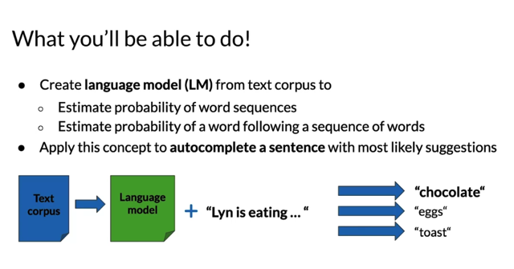</kbd>

  > Đại khái là ta sẽ dựa vào một **text corpus** để tạo một**Language
  > Model** có khả năng tính ra **xác suất của một sequence** hoặc
  > **probability của một từ sau một sequence các từ** cho trước từ đó
  > dùng nó để áp dụng vào tạo một**autocomplete program** trong đó
  > người tính toán **tìm ra từ có xác suất cao nhất theo sau một 
  > từ user mới gõ** vào chẳng hạn.

   

  
  
<kbd>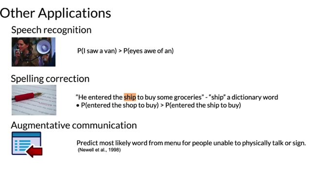</kbd>

  > Có rất **nhiều ứng dụng** nhờ cái này. Ví dụ như **Speech
  > recognition** - hiểu nôm na là máy nó nghe một câu, có thể **ban
  > đầu chưa chính xác**, nhưng sau đó **autocomplete model**
  > sẽ **giúp điều chỉnh lại.**
  >
  > Rồi **Spelling correction** cũng tương tự, nó nhận ra**xác suất của
  > từ 'ship' trong câu này nhỏ hơn từ 'shop'**, nên giúp **sửa lỗi**.
  >
  > Và **augmentative communication** - đại khái là **trợ giúp khả năng 
  > communicate** nhờ việc giống như 'hiểu ý'

   

  
  
<kbd>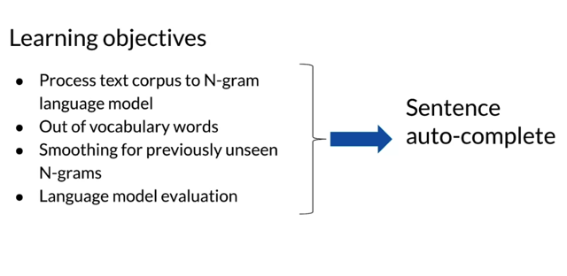</kbd>

  > First, you will **transform your raw text corpus** into a **language model**, which returns
  > the**probability of the next word** by **using the previous words of a sentence**. Next,
  > you'll **adapt your language model** to deal with **words** the model **hasn't seen** during
  > training. These words are called **out of vocabulary words**. **Smoothing** is another
  > technique that you can use to deal with previously unseen inputs. Probability of
  > unseen words and sentences can still be successfully estimated this way.
  > Smoothing essentially **pretends that each word and phrase appears in the training
  > corpus at least once**. This helps to calculate the probability even for **unusual words
  > and sequences**. Finally, I'll show you how to **choose the best language model** with
  > the **perplexity metric**, a new tool for your toolkits. When you combine these skills,
  > you'll be able to successfully implement a sentence auto-completion model in this
  > week's assignments

  > Đại khái dùng**text corpus** tạo **Language model**. Xử lý
  > **out-of-vocab words** và **unseen words - smoothing** cuối cùng
  > là **đánh giá model với perplexity metric**

   

## N-grams & Probs

 

### 1 \\*N-gram language models\\* allow you to \\*generate texts\\* by \\*estimating the \\/conditional probability\\*\\/ of an

> [!NOTE]
> 1 \**N-gram language models\** allow you to \**generate texts\** by \**estimating the \\/conditional probability\**\\/ of an
> \**N-gram\** from a \**text corpus.\**
>
> 2 An \**N-gram\** is a \**sequence of words,\** where the \**word order matters\**. In this context, you'll focus on
> sequences of words.
>
> 3 When \**processing\** the corpus, \**punctuation is treated as words\**, but \**special characters\** like codes are
> \**removed\**.
>
> 4 \**Unigrams\** are \**sets of unique single words\** in the corpus, while \**bigrams\** are sets of \**two words
> appearing side-by-side\**.
>
> 5 To be considered a \**bigram\**, words\**must appear next to each other\**. The prefix "\**bi\**" signifies \**two\**.
>
> 6 \**Trigrams\** represent \**unique triplets of words\** \**appearing together\** in sequence. The prefix "\**tri\**" denotes
> \**three\**.
>
> 7 Corpus \**notation\** includes using \**subscripts\** and \**superscripts\** to denote \**specific sequences of words\**
> within the corpus.
>
> 8 \**Probability estimation\** starts with \**unigrams\**, where the \**probability of a word W\** is the\**\\/count of W\**\\/
> \\/\**divided by the total corpus size.\**\\/
>
> 9 \**Bigram probabilities\** are \\/\**conditional\**\\/, calculated by \**dividing the count of the \\/bigram X, Y\**\\/ by the\**count
> of unigram X.\**
>
> 10 \**Trigram probabilities\** represent the \\/\**conditional probability\**\\/ of the third word given the previous two
> words, calculated using the\**counts of the trigram\** and the \**counts of the previous two words appearing\**
> in sequence.
>
> 11 The \**general formula\** for N-gram probabilities extends this concept to any number N, where the
> \**probability of word w_N following the sequence w_1 to w_N-1\** is estimated by the \**count of the N-gram
> w_1 to w_N\** divided by the \**count of the N-gram prefix w_1 to w_N-1.\**
>
> 12 \**N-gram language models\** can be used to \\/\**compute probabilities of whole sentences\** by \**combining
> the probabilities of individual N-grams in the sentence\\/.\**
>
> 13 By understanding N-grams and their \**probabilities\**, you can \**generate texts\** and \**compute the
> \\/likelihood of different sentences\**\\/ in a corpus.

 

  
  
<kbd>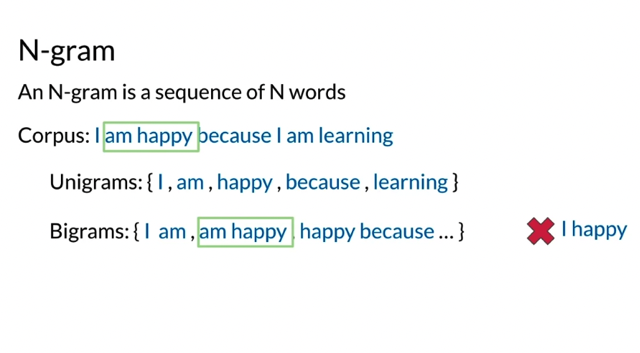</kbd>

  
<kbd>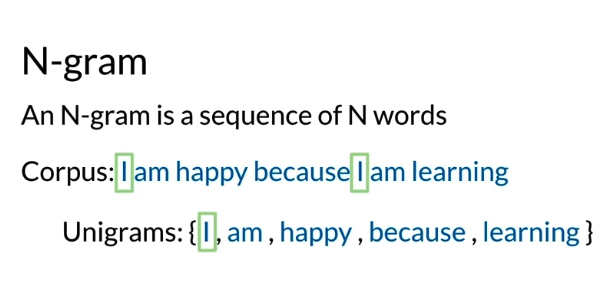</kbd>

  
<kbd></kbd>

  
<kbd></kbd>

  
<kbd>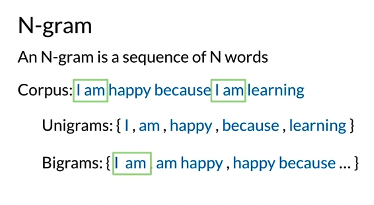</kbd>

  > Unigram - Uni, chỉ lấy các từ đơn lẻ, Corpus, sẽ chỉ chứa /
  > liệt kê các từ đơn lẻ xuất hiện
  >
  > Bigram - Corpus sẽ liệt kê các cặp từ xuất hiện**liền kề
  > nhau**. Ví dụ I am, không có I happy
  >
  > Trigram - Corpus sẽ liệt kê các bộ **3 từ xuất hiện liền kề**
  > nhau Ví dụ I am happy

  > N-gram hiểu là 1 chuỗi N
  > từ liền kề nhau

   

  
  
<kbd>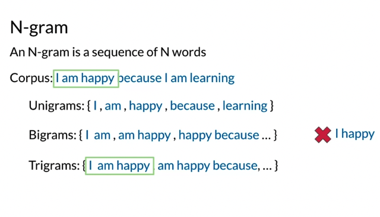</kbd>

   

  
  
<kbd>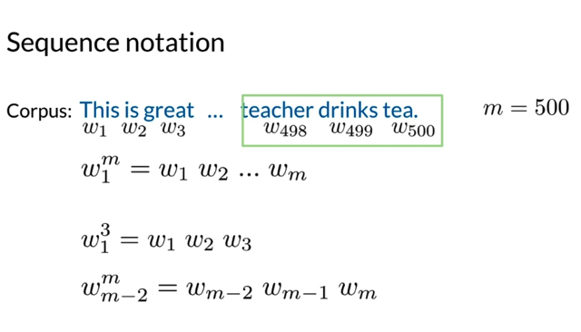</kbd>

  > Đại khái là quy ước kí hiệu
  > của sequence

   

  
  
<kbd>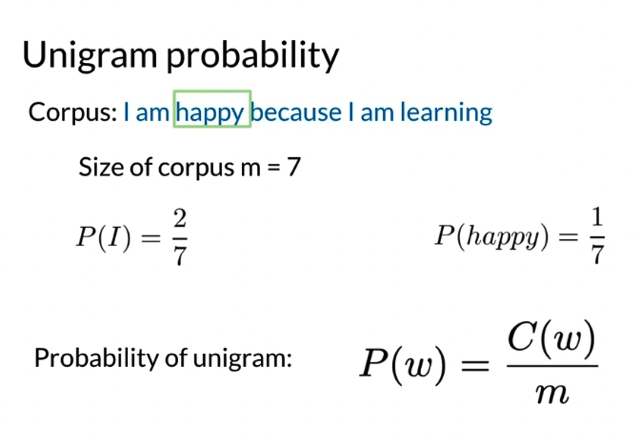</kbd>

  
<kbd></kbd>

  
<kbd>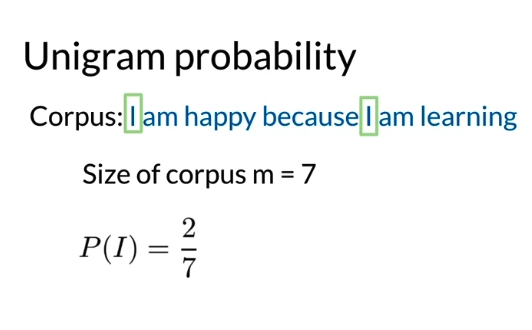</kbd>

  > **Unigram probability** của 1 từ (hay 1 uni-gram) tính bằng
  > **số lần xuất hiện của từ đó** **trong corpus**(không phải
  > trong một câu nhé), chia cho **tổng số từ của corpus**

   

  
  
<kbd>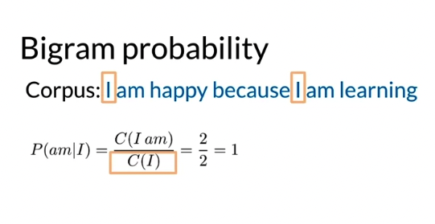</kbd>

  
<kbd></kbd>

  
<kbd>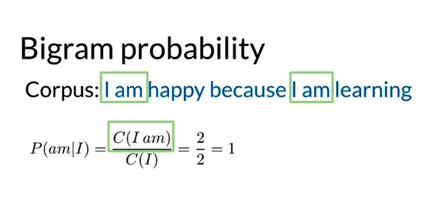</kbd>

  > **Bigram probability** của 1 **bigram** (= 2 từ liền kề)
  >
  > Định nghĩa là**conditional probability** - **khả năng xuất hiện
  > của từ w2, nếu w1 đã "xảy ra"**
  >
  > Sẽ tính bằng tồng số lần **2 từ liền kề w1w2 đó (bigram)** xuất
  > hiện trên **tổng số lần từ đầu tiên w1 xuất hiện**(đúng hơn là
  > w1 với**1 từ bất kì** - sẽ nói ở sau)****

   

  
  
<kbd>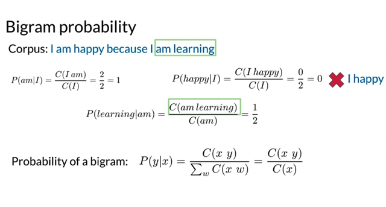</kbd>

  > Tạm thời ở đây đang coi như Σw C(xw) tổng số lần
  > từ **x xuất hiện với một từ w bất kì** là bằng **tổng
  > số lần x xuất hiện**C(x). Nhưng nghĩ kĩ hơn thì sẽ
  > thấy nó **không hoàn toàn chặt chẽ** vì nếu **x
  > đứng cuối câu** thì không có từ nào sau nó cả. Khi
  > đó **C(x) có thể lớn hơn C(x, w)**

   

  
  
<kbd>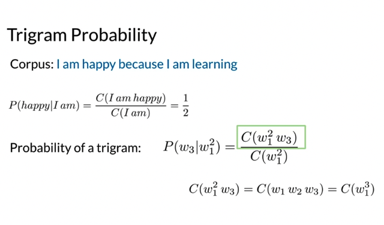</kbd>

  > Tương tự probability của 1 **trigram** - bộ **3 từ liền kề** sẽ là:
  >
  > Định nghĩa là **conditional probability** - **khả năng xuất hiện của từ
  > w3, nếu chuỗi w1 w2 đã "xảy ra"**
  >
  > Tính bằng  **tổng số lần xuất hiện của 3 từ liền kề w1w2w3 trong
  > corpus** trên **tổng số bộ (2 từ đầu** **w1w2 + một từ bất kì)** trong
  > corpus

   

  
  
<kbd>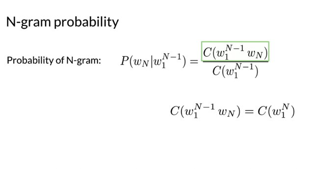</kbd>

  > Khái quát hoá lên cho probability của bộ N từ liền kề
  > - N-gram
  >
  > là số lần chuỗi **w1w2..wN** xuất hiện chia cho  tổng
  > số lần chuỗi **w1w2...w(N-1)** xuất hiện

   

## Sequence Probabilities

 

### 1 Modeling \\*whole sentences\\* using \\*n-gram probabilities\\*.

> [!NOTE]
> 1 Modeling \**whole sentences\** using \**n-gram probabilities\**.
>
> 2 Calculating the \**probability of a sentence\** using \**conditional probability\** and the\**chain
> rule.
> \**
> 3 The \**limitations\** of \**direct approach\** to sequence probability in natural language due to
> its \**high variability\**.
>
> 4 Applying the \**chain rule\** \**of probability\** to estimate the \**sentence probability.\**
>
> 5 Using \**bigram approximation\** and the\**Markov assumption\** to \**simplify\** the calculation of
> \**sentence probability\**.
>
> 6 The \**product of conditional probabilities of words\** and their \**immediate predecessors\** in
> the \**bigram formula.\**
>
> 7 The \**reliance\** on \**unigram probability for the first word\** in the sentence.
>
> 8 Computing \**n-gram probabilities\** from a corpus for probability estimation.

 

  
  
<kbd>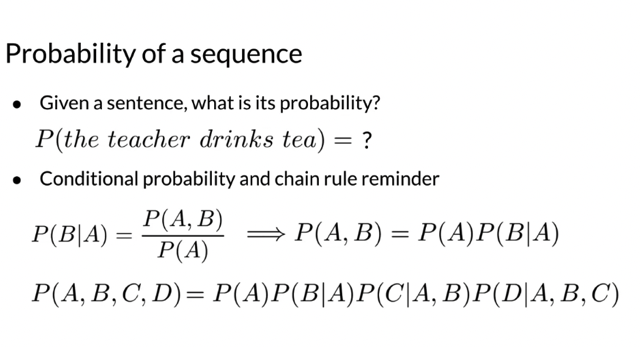</kbd>

  > Câu hỏi cần giải quyết là: **Khả năng, xác suất của một câu cho
  > trước lớn đến mức nào?**
  >
  > Thì đại khái là ta nhớ lại về **conditional probability P(B|A)**
  > sẽ được tính bằng **P(A,B) chia cho P(A).**
  > **P(A,B) gọi là joint probability của A, B** hiểu là xác suất của 
  > chuỗi **A, B cùng xuất hiện**
  > **P(A)** là xác suất của **A xuất hiện**.
  >
  > Nên: **P(A,B) = P(A)*P(B|A)** dịch sang ý nghĩa là: 
  > Xác suất**A xuất hiện** * xác suất **B nếu đã có A.**
  >
  > Vậy tương tự xác suất một chuỗi các từ A,B,C,D xuất hiện (và
  > nó chính là xác suất của câu A B C D) sẽ tính bằng
  >
  > P(A,B,C,D) = P(A)*P(B|A)*P(C|A,B)*P(D|A,B,C)

   

  
  
<kbd>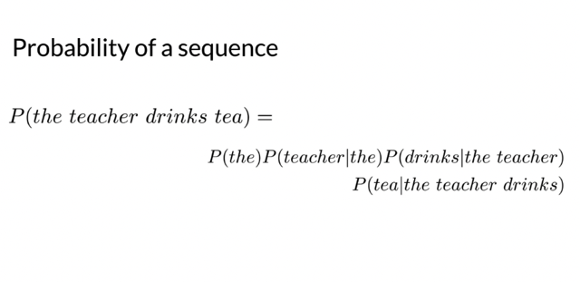</kbd>

  > Áp dụng vào tính **probability** của một câu thì
  > P của (the teacher drinks tea) sẽ là như vầy
  >
  > P của (the teacher drinks tea) =
  > P(tea | the teacher drinks)
  > *P(drinks | the teacher)
  > *P(teacher | the)
  > *P(the)

   

  
  
<kbd>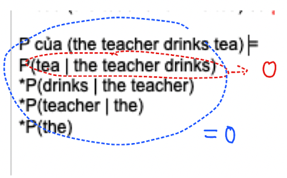</kbd>

  
<kbd></kbd>

  
<kbd>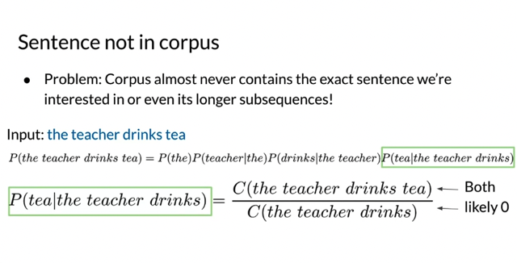</kbd>

  > Nhưng gặp vấn đề với cách làm này.
  >
  > Trong công thức ta cần tính P(tea| the teacher drink tea) ta phải
  > Đếm số lần xuất hiện **"the teacher drinks tea"** chia cho 
  > số lần xuất hiện của **"the teacher drinks"**
  > C(the teacher drinks tea) / C(the teacher drinks)
  >
  > Nhưng "the teacher drinks tea", có thể không xuất hiện trong **corpus** 
  > thậm chí "the teacher drinks" cũng vậy
  >
  > Khi đó thì P(tea| the teacher drink tea) = 0.
  >
  > Kéo Theo công thức tính P của câu cũng = 0

   

  
  
<kbd>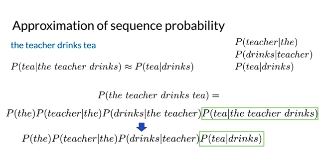</kbd>

  > Như vậy khi tính P của câu '**the teacher drink tea**': 
  > P(the teacher drink tea) =
  > P(tea | the teacher drinks)
  > *P(drinks | the teacher)
  > *P(teacher | the)
  > *P(the)
  > **Sẽ trở thành** 
  >
  > P(the teacher drink tea) =
  > **P(tea | drinks)
  > *P(drinks | teacher)
  > *P(teacher | the)
  > *P(the)**

  > Thì đại khái người ta dùng cách tiếp cận gần đúng
  >
  > Cho phép P(**tea**| **the teacher** **drinks**)
  >
  > C(\/**the teacher drinks tea**\/) / C(\/**the teacher drinks**\/)
  >
  > được phép gần đúng bằng P(**tea**| **teacher** **drinks**)
  >
  > C(\/**teacher drinks tea**\/) / C(\/**teacher drinks**\/)
  >
  > hoặc gần đúng bằng P(**tea**| **drinks**)
  >
  > C(\/**drinks tea**\/) / C(\/**drinks**\/)
  >
  > khả năng trong corpus là có xuất hiện **'drinks tea'** 
  > - C(\/**drinks tea**\/) > 0,****giúp****P(tea| the teacher drinks)
  > không bị = 0

  > Về mặt ý nghĩa
  >
  > Khi cho P(tea| the teacher drinks) ~= P(tea| drinks) hoặc ~= P(tea| teacher drinks)
  >
  > Ta nói xác suất của **chuỗi các từ** dẫn đến **tea** 
  >
  > Được thay bằng / tính gần bằng
  >
  > xác suất của **cái từ cuối trong chuỗi** (drinks) dẫn đến **tea**.
  >
  > Hoặc
  >
  > xác suất của **2 từ cuối trong chuỗi**(teacher drinks) dẫn đến **tea**.

   

  
  
<kbd>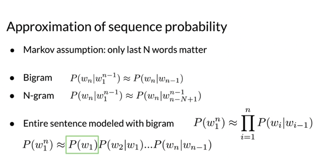</kbd>

  > Và đây **không có gì xa lạ** chính là ta **đang áp dụng Markov assumption -**trạng thái kế tiếp **CH**Ỉ phụ thuộc vào **trạng thái hiện tại**, không phụ
  > thuộc trước đó, có nghĩa là**quan trọng \/N\/ từ cuối thôi.**
  >
  > P(w_n|w1w2..wn-1) 
  > (*chữ n nhỏ chỉ chuỗi n từ w1->wn không có liên quan gì chữ N trong N-gram)
  >
  > Công thức N-gram: P(wn|w1w2..wn-1) = P(wn|wn-N+1,... wn-1)
  >
  > nếu **N = 2**: P(wn | w1w2...wn-1) ****~= P(wn | wn-1) ~= P(wn|wn-2+1,... wn-1) = P(wn|wn-1,... wn-1)
  > ~= P(wn | wn-1) -> only last **2** words matter là wn và wn-1
  >
  > nếu **N = 3**: P(wn|w1w2..wn-1) 
  > ~= P(wn | wn-2, wn-1)**-**> only last **3** words matter là wn, wn-1 và wn-2

  > Và như vậy nếu áp dụng N=2 thì P của 1 chuỗi w1...wN sẽ 
  >
  > P(w1)P(w2|w1)P(**w3**|w1**w2**)P(**w4**|w1w2**w3**)....P(**wN**|w1w2...**wN-1**)
  >
  > sẽ trở thành (tính xấp xỉ)
  >
  > ~= P(w1)P(w2|w1)P(**w3**|**w2**)P(**w4**|**w3**)...P(**wN|wN-1**)

   

  
  
<kbd>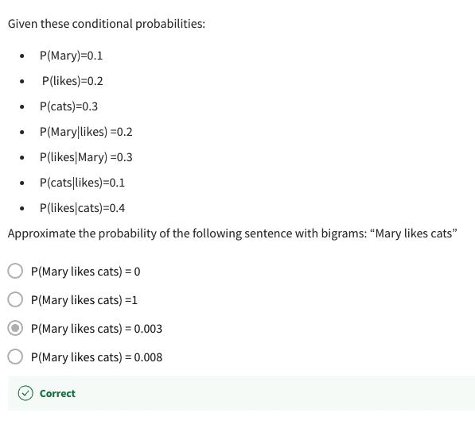</kbd>

  > P(Mary like cats) =
  > P(cat| Mary like) (~= P(cat, like) = 0.1)
  > *P(like|Mary) = 0.3
  > *P(Mary) = 0.1
  >
  > =0.1*0.3*0.1 = 0.003

   

  
  
<kbd>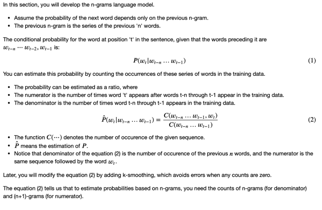</kbd>

  > Hoặc khái quát hơn là 
  >
  > Xác suất của chuỗi các từ dẫn đến một từ w
  > sẽ chỉ bằng xác suất của 1 từ cuối dẫn đến w . Đó là 2-gram.
  >
  > Xác suất của chuỗi các từ dẫn đến một từ w
  > sẽ chỉ bằng xác suất của 2 từ cuối dẫn đến w . Đó là 3-gram.
  >
  > Xác suất của chuỗi các từ dẫn đến một từ w
  > sẽ chỉ bằng xác suất của N-1 từ cuối dẫn đến w . Đó là N-gram.
  >
  > Vậy kết luận câu này trong P assignment sai:
  >
  > "Assume the probability of the next word depends only on previous
  > **N-gram" thì phải là N-1 gram** mới đúng

  > Hoặc CHẤP NHẬN RẰNG KHÔNG QUAN TRỌNG TIỂU TIẾT
  >
  > Gọi là N-gram là 1 từ phụ thuộc vào n từ cuối hay n-1 từ cuối thì
  > ý nghĩa chính vẫn xác suất của một từ tiếp trong chuỗi sẽ tính bằng
  > | sẽ chỉ phụ thuộc vào vài từ ở cuối. 
  >
  > Và theo P/A thì dự đoán từ tiếp theo sẽ phụ thuộc vào n từ cuối.
  >
  > ĐÓ CHỈ HIỂU ĐẠI Ý RẰNG:
  >
  > XÁC XUẤT CỦA TỪ THEO SAU MỘT CHUỖI
  >
  > SẼ ĐƯỢC THAY BẰNG / TÍNH GẦN BẰNG
  >
  > XÁC SUẤT CỦA VÀI TỪ CUỐI TRONG CHUỖI DẪN ĐẾN TỪ
  > ĐÓ.
  >
  > (VÀI TỪ CUỐI Ở ĐÂY CÓ THỂ N HOẶC N-1, KHÔNG QUAN TRỌNG) 
  >
  > Và xác suất của (việc) một từ nào đó theo sau một chuỗi đồng khái
  > niệm với xác suất của việc một từ nào đó là từ kế tiếp của chuỗi / câu
  > (Chính là cái ổng nói "probability of the next word)
  >
  > Chấp nhận như vậy thì ok ta có thể hiểu câu này:
  >
  >  • Assume the probability of the next word depends only on the previous n-gram.
  >  • The previous n-gram is the series of the previous 'n' words.

  > Xác suất của việc "chuỗi các từ dẫn đến một từ w nào đó"  = "xác suất xuất
  > hiện của w là từ tiếp theo của chuỗi" sẽ chỉ bằng xác suất của việc "n từ
  > cuối dẫn đến w" P(w| sub-chuỗi n từ cuối trong chuỗi).
  >
  > Như vậy có nghĩa là nó chỉ phụ thuộc vào **n từ cuối là gì** thôi, vì n từ cuối
  > là gì sẽ quyết định w nào có xác suất cao nhất.  Mà n từ cuối chính là
  > previous n-gram của cái từ đang nói đến w - cái từ đang dự đoán, đang
  > tìm.
  >
  > Cho nên có thể hiểu câu này.
  >
  > "Assume the probability of the next word depends only on previous
  > **N-gram"**

   

## Start And Ending Sentence

 

### 1 Introduction to \\*handling the beginning\\* and \\*end of sentences\\* in \\*N-gram

> [!NOTE]
> 1 Introduction to \**handling the beginning\** and \**end of sentences\** in \**N-gram 
> language models\**.
>
>  2 The use of \**special symbols\** to represent the \**start\** and \**end\** of a sentence.
>
>  3 Adding start tokens to handle the \**first term\** in the \**bigram approximation\** and 
> resolve \**the lack of context for the first word\**.
>
>  4 \**Generalizing\** the concept to \**N-gram models\** by \**adding multiple start tokens at 
> the beginning of each sentence.\**
>
>  5 Dealing with the \**end of sentences\** and the \**issue of simplification\** in the 
> \**conditional probability formula.\**
>
>  6 \**Adding an end-of-sentence token\** to handle cases where the \**last word of a 
> sentence lacks sufficient context\**.
>
>  7 The importance of \**adding start and end tokens\** for\**accurate probability 
> calculations in N-gram models\**.
>
>  8 The process of \**pre-processing the training corpus\** to include the \**end-of-
> sentence symbol.\**
>
>  9 Resolving the \**issue of summing probabilities for sentences\** of different lengths 
> by adding the end-of-sentence symbol.
>
>  10 Applying the\**fixed approach to N-gram models\** by adding a \**single symbol per 
> sentence.\**
>
>  13 The \**generalization\** of the concept to \**building N-gram language models.\**

 

  
  
<kbd>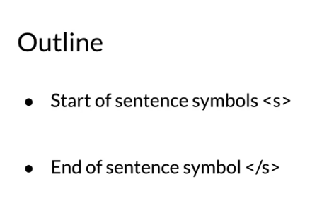</kbd>

   

  
  
<kbd>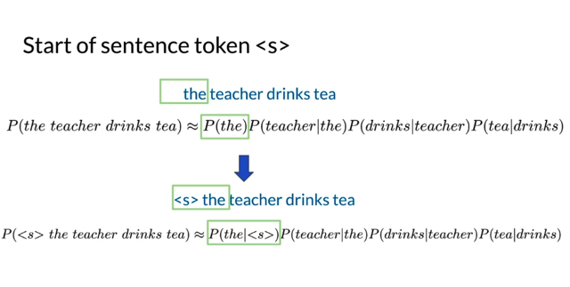</kbd>

  > Đại khái là ổng nói tính **probability của sequence** theo công
  > thức **xấp sỉ** đã học ở bài trước thì cái **P(the)** **không biết tính
  > theo công thức của \/bigram\/ probability** thế nào.
  >
  > Vì nếu đã theo **bigram probability** cho các từ trước thì từ đầu
  > cũng phải vậy, mà **nó lại không có ai đứng trước nó** nên không
  > tính theo bigram probability được.
  >
  > Do đó, người ta **chèn vào trước câu** một **start of sentence
  > token <s>**, từ đó tính **bigram probability cho từ "the"** sẽ là
  > **P(the|<s>)**

   

  
  
<kbd>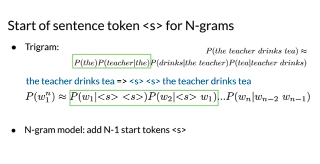</kbd>

  > **Tương tự** như vậy cho
  > bài toán **Trigram**, ta sẽ **chèn** **2 <s> đầu câu**
  >
  > Khái quát hoá cho **N-gram**, ta sẽ chèn **N-1 <s> đầu câu**

   

  
  
<kbd>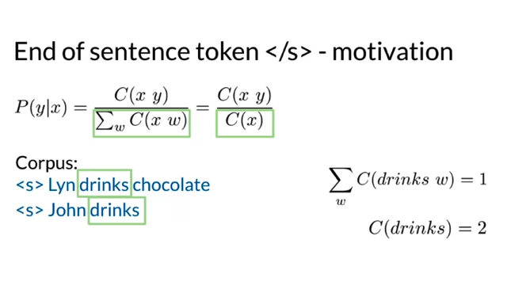</kbd>

  > Nhắc lại cách tính **P(y|x)** sẽ bằng cách tính tổng số lần "**đã có x,
  > xuất hiện y"** chia cho tổng số lần "**có** **x, xuất hiện từ bất kì**
  > Σ**C(x, w)"**và ta **thường** cho rằng số lần "**có x, xuất hiện từ bất kì**
  > Σ**C(x, w)"**cũng là bằng "**số lần có x xuất hiện - C(x)"**Tuy nhiên, lập luận này **không đúng nếu x đứng cuối câu**, vì không có
  > từ nào xuất hiện sau nó nên Σ**C(x, w) sẽ không bằng C(x)**Do đó, người ta thêm "**end of sentence' token </s> vào cuối câu** để
  > khắc phục vấn đề này

   

  
  
<kbd>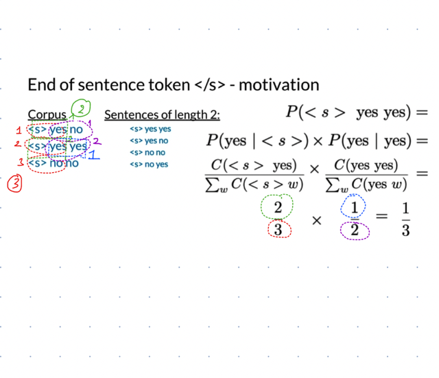</kbd>

   

  
  
<kbd>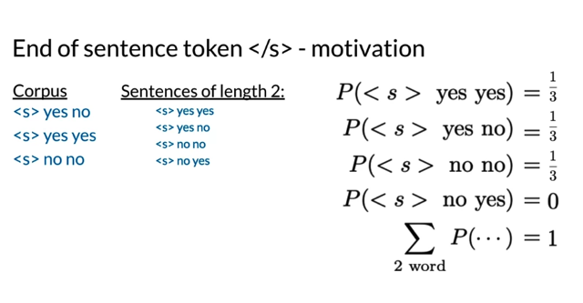</kbd>

   

  
  
<kbd>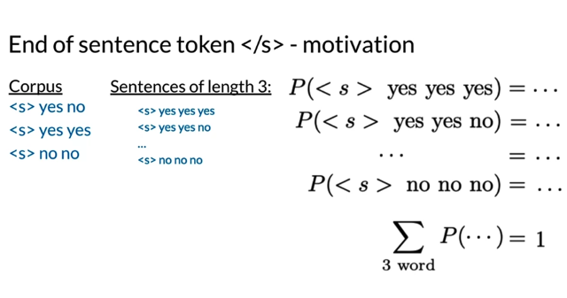</kbd>

   

  
  
<kbd>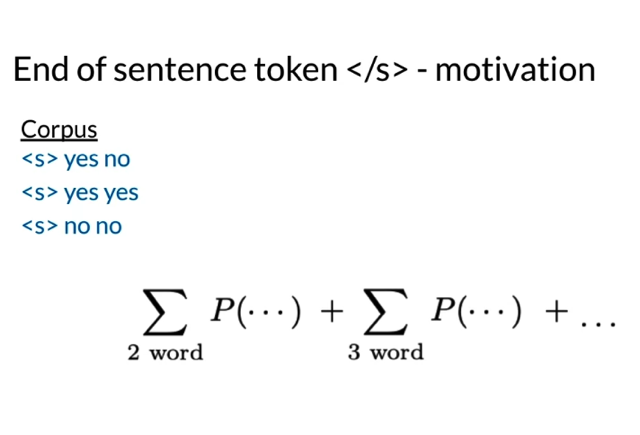</kbd>

   

  
  
<kbd>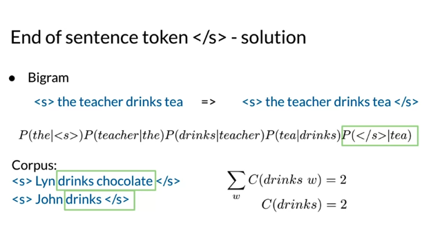</kbd>

  > Nói chung là một loạt slide trước muốn **chứng minh cho ta thấy
  > rằng cần phải thêm một 'End of sentence' token vào cuối câu** sẽ
  > **fix được các vấn đề gây sai sót  trong việc tính probability.**
  >
  > Đơn cử dễ hiểu nhất là với </s> cuối câu thì **ΣC(drinks w) nó đã
  > bằng C(drinks)** cho dù drinks đứng cuối câu

   

  
  
<kbd>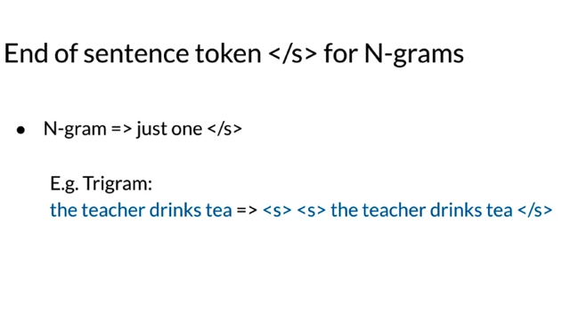</kbd>

  > Đối với N-grams thì **hoá ra cũng chỉ cần thêm
  > MỘT end of sentence token** thôi là đủ

   

  
  
<kbd>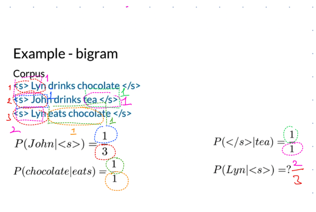</kbd>

   

  
  
<kbd>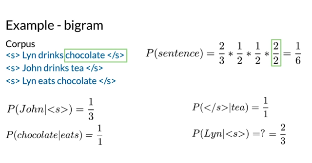</kbd>

  > Ở đây ổng nói có một điểm đáng chú ý là kết quả P(sentence)
  > ra **1/6. Chứ không phải là 1/3** mà ta có thể **tưởng** (expect)
  > khi training set có 3 câu

   

  
  
<kbd>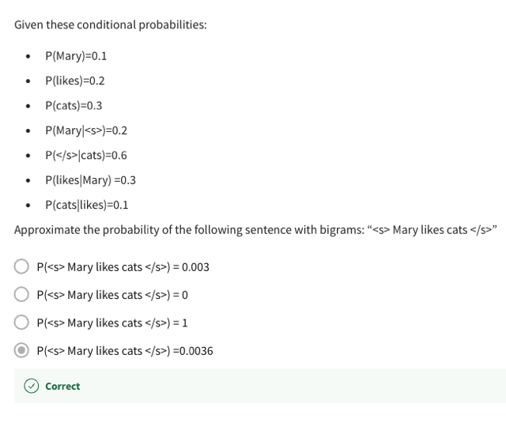</kbd>

   

## Lab: N-gram Corpus Preprocessing

 

### The \\*input corpus\\* in this week's assignment is a \\*continuous text\\* that \\*needs some

> [!NOTE]
> The \**input corpus\** in this week's assignment is a \**continuous text\** that \**needs some 
> preprocessing\** so that you can \**start calculating the n-gram probabilities\**.
>
> Some common preprocessing steps for the language models include:
>  • \**lowercasing\** the text
>  • \**remove special characters\**
>  • \**split text to list of sentences\**
>  • \**split sentence into list words
> \**Can you note the similarities and differences among the preprocessing steps shown 
> during the \**Course 1\** of this specialization?

> [!NOTE]
> Đại khái là **làm thử cái việc preprocessing**, đối với **text
> corpus** trước khi **train model N-gram**. Cũng tương tự như
> việc preprocessing ở Course 1 nhưng có **khác chút xíu** ví
> dụ không có bước stemming.

 

- import \\*nltk\\*               # NLP toolkit import \\*re\\*                 # Library for Regular expression operations  nltk.download('\\*punkt\\*')    # Download the \\*Punkt sentence tokenizer\\*
  > Biết thêm cái **Punkt**
  > **sentence** **tokenizer**

   

  
  - Lowercase
     

    
    - Words at the beginning of a sentence and names start with a \\*capital letter\\*. However,  when \\*counting words\\*, you want to \\*treat them the same\\* as if they appeared in the middle  of a sentence.  You can do that by converting the text to lowercase using [\\*str. lowercase\\*] (\\_https:// docs.python. org/3/library/stdtypes. html?highlight=split#str. lower\\_).
       

      
      - # change the corpus to lowercase \\*corpus\\* = "Learning% makes 'me' happy. I am happy be-cause I am learning! :)" corpus = corpus.\\*lower()\\*  # note that word "learning" will now be the same regardless of its position in the sentence print(corpus)
         

        
        - learning% makes 'me' happy. i am happy be-cause i am learning! :)
           

  
  - Remove special charactes
     

    
    - \\*Some of the characters\\* may \\*need to be removed\\* from the corpus before we start  processing the text to find \\*n-grams.\\*  Often, the special characters such as \\*double quotes '"'\\* or \\*dash '-'\\* are removed, and the \\*interpunction\\* such as full \\*stop '.'\\* or \\*question mark ' ?'\\* are \\*left\\* in the corpus.
      > Một số characters sẽ bị
      > removed như ", - Nhưng dấu
      > chấm (.), hỏi (?) thì giữ lại

       

      
      - # \\*remove special characters\\* corpus = "learning\\*%\\* makes \\*'\\*me\\*'\\* happy. i am happy be-cause i am learning! \\*:)\\*" corpus = \\*re.sub(r"[^a-zA-Z0-9.?! ]+", "", corpus)\\* print(corpus)  learning makes me happy. i am happy because i am learning!
        > Đại khái là mớm cho một câu code để remove special character
        >
        > re.sub(r"[^a-zA-Z0-9. ?! ]+", "", corpus)
        >
        > **re** là một cái thư viện để **Regular expression**,

         

        
        - Note that this process gets rid of the \\*happy face made with punctuations :).\\* Remember that for \\*sentiment analysis\\*,\\* this emoticon was very important\\*. However, we \\*will not consider it here.\\*
          > Đại khái là nếu là bài toán
          > sentiment analysis thì ta không
          > được bỏ cái emoticon mặt cười

           

  
  - Text splitting
     

    
    - In the assignment, the \\*sentences in the corpus\\* are separated by a special delimiter \\*\\\ \\*.  You will need to \\*split the corpus\\* into an \\*array of sentences\\* using this \\*delimiter\\*. One way  to do that is by using the \\_\\*str.split\\*\\_ method.  The following examples illustrate how to use this method. The code shows: • how to \\*split a string\\* containing a \\*date\\* into an \\*array of\\* \\*date parts\\*   • how to \\*split a string\\* with \\*time\\* into an \\*array containing hours, minutes and  seconds \\* Also, note what happens if there are \\*several \\/back-to-back delimiters\\*\\/ like between "May"  and "9".  This text splitting is more complicated than the tokenization process used for sentiment analysis.
      > Đại khái là **chia corpus thành từng
      > câu** và **câu thành từng từ**, ta dùng string.
      > **split()** function với **delimiter (eg. " ")**

       

      
      - # split text by a delimiter to array input_date="\\*Sat May  9 07:33:35 CEST 2020\\*"  # get the date parts in array date_parts = input_date.\\*split(" ")\\* print(f"date parts = {date_parts}")  #get the time parts in array time_parts = \\*date_parts[4].split(":")\\* print(f"time parts = {time_parts}")
         

        
        - date parts = ['Sat', 'May', \\*''\\*, '9', '07:33:35', 'CEST', '2020'] time parts = ['07', '33', '35']
          > Để ý sau May và 9 có vẻ rộng hơn, ổng nói chú ý
          > chuyện gì xảy ra nếu có '**back-to-back delimiter**' thì
          > mình thấy nó tạo ra 1 từ kiểu '' trong array

           

  
  - Sentence tokenizing
     

    
    - Once you have a \\*list of sentences\\*, the next step is to \\*split each sentence into a list of  words.\\*  This process c\\*ould be done in several ways\\*, even using the \\*str.split\\* method described  above, but we will use the \\*NLTK library\\* \\_nltk\\_ to help us with that. \\*https://www.nltk.org/\\*  In the code assignment, you will use the method \\_\\*word_tokenize\\*\\_ to \\*split your sentence  into a list of words\\*. Let us try the method in an example.   https://www.nltk.org/api/nltk.tokenize.html#nltk.tokenize.punkt.PunktLanguageVars.word_tokenize
      > Đại khái là ta sẽ split câu thành từ,
      > nhưng thay vì dùng function **str.split()**
      > thì ta sẽ dùng thư viện **nltk.word_tokenize**

       

      
      - # tokenize the sentence into an array of words  sentence = 'I am happy because I am learning.' tokenized_sentence = \\*nltk.word_tokenize\\*(sentence) print(f'{sentence} -> {tokenized_sentence}')
         

        
        - I am happy because I am learning. -> ['I', 'am', 'happy', ' because', 'I', 'am', 'learning', '.']
           

          
          - Now that the sentence is tokenized, you can \\*work with each word\\* in the sentence \\*separately\\*. This will be useful later when \\*creating\\* and \\*counting N-grams.\\* In the following code example, you will see how to \\*find the length of each word\\*.
             

            
            - # find length of each word in the tokenized sentence sentence = ['I', 'am', 'happy', 'because', 'I', 'am', 'learning', '.'] word_lengths = [(word, \\*len(word)\\*) for word in sentence] # Create a list with the word lengths using a list comprehension print(f' Lengths of the words: \\\ {word_lengths}')
              > Dùng l**en(word) để xem length của word** để ý dưới ta lại
              > găp **list comprehension** thật tiện

               

              
              - Lengths of the words:  [('I', 1), ('am', 2), ('happy', 5), ('because', 7), ('I', 1), ('am', 2), ('learning', 8), ('.', 1)]
                > The previous result produces a
                > **list of pairs**. This is not
                > equivalent to a dictionary.

                > Cái này là list các
                > tuple, ko phải là dict

                 

  
  - N-grams
     

    
    - \\*Sentence to n-gram \\* The next step is to \\*build n-grams\\* from the \\*tokenized sentences.\\*  A \\*sliding window of size n-words\\* can \\*generate the n-grams\\*. The window\\* scans the list of  words\\* starting at the sentence beginning, \\*moving by a step of one word\\* until it \\*reaches  the end of the sentence.\\*  Here is an example method that prints all trigrams in the given sentence.
      > Nói về một khái niệm mới, dùng **sliding
      > window** có size là **n-words** để tạo**n-gram**

       

      
      - def \\*sentence_to_trigram\\*(tokenized_sentence):     """     Prints all \\*trigrams\\* in the given tokenized sentence.          Args:         tokenized_sentence: The \\*words list.\\*          Returns:         No output     """     # note that the \\*last position of i\\* is \\*3rd to the end\\*     for i in range(\\*len(tokenized_sentence)\\* \\*- 3\\* \\*+ 1\\*):         # the sliding window \\*starts at position i\\* and contains \\*3 words\\*         \\*trigram\\* = tokenized_sentence[\\*i : i + 3\\*]         print(trigram)  tokenized_sentence = ['i', 'am', 'happy', 'because', 'i', 'am', 'learning', '.']  print(f'List all trigrams of sentence: {tokenized_sentence}\\\ ') sentence_to_trigram(tokenized_sentence) 
         

          
          
<kbd>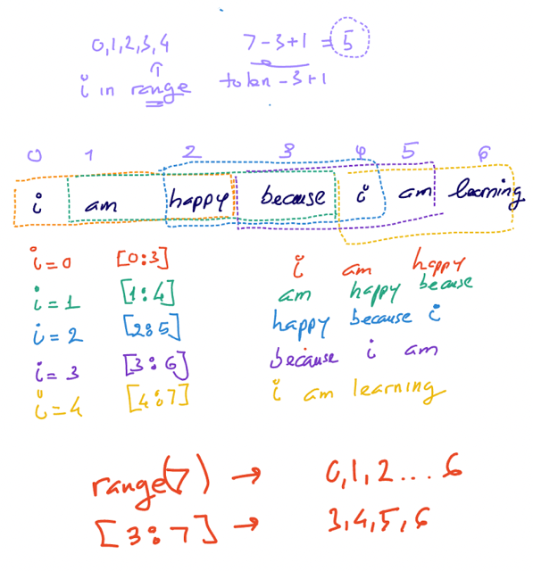</kbd>

          
<kbd></kbd>

          
<kbd>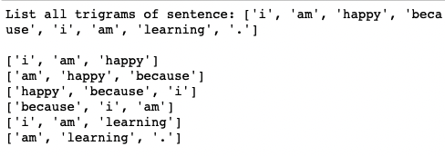</kbd>

           

          
          
<kbd>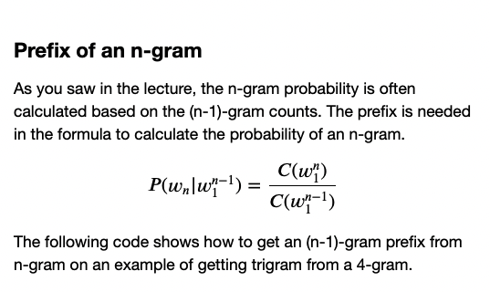</kbd>

          > Nói chung chỉ trước cho cách lấy
          > **prefix của n-gram** để dùng khi tính
          > probability của 1 n-gram

           

        
        - # get \\*trigram prefix\\* from a \\*4-gram\\* fourgram = ['I', 'am', 'happy','because'] trigram = fourgram\\*[0:-1]\\* # Get the elements \\*from 0\\*, included, \\*up to the last element\\*, \\*not included\\*. print(trigram)
          > **4-gram prefix** của của một 5-gram "I love you so much" là "I love you so"
          >
          > **3-gram prefix** của nó là "love you so"
          >
          > **2-gram prefix** của nó là "you so"

           

            
            
<kbd>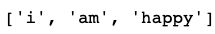</kbd>

             

  
  - Start and end of sentence word
     

    
    - You could see in the lecture that we \\*must add some special characters at the beginning and the end\\* of each sentence:  \\*<\\*𝑠\\*>\\*   at beginning \\*<\\*𝑒\\*>\\*   at the end For n-grams, we must \\*prepend n-1 of characters at the begining of the sentence.\\*  Let us have a look at how you can implement this in code.
      > Add Start / End token vào câu, có tác
      > dụng **giúp tính probability không bị sai.**
      > Ở đây chỉ cách làm ntn

       

      
      - # when working with \\*trigrams\\*, you need to prepend \\*2 <s>\\* and append \\*one </s> \\*n = 3 tokenized_sentence = ['I', 'am', 'happy', 'because', 'I', 'am', 'learning', '.'] tokenized_sentence = [\\*"<s>"] * (n - 1)\\* + tokenized_sentence + \\*["<e>"]\\* print(tokenized_sentence)
        > Ta again thấy cái **[]*a_number** trong
        > python là là **concatenate** a_number
        > **lần**. ví dụ **["a"]*4 = ["aaaa"]**

         

        
        - ['<s>', '<s>', 'I', 'am', 'happy', 'because', 'I', 'am', 'learning', '.', '<e>']
           

## The N-gram Language Model

 

### 1 Creating a \\*count matrix\\*: The first step is to \\*process a corpus\\* and create a \\*count matrix\\* that

> [!NOTE]
> 1 Creating a \**count matrix\**: The first step is to \**process a corpus\** and create a \**count matrix\** that
> captures the \**number of occurrences\** of relative \**n-grams\**. This matrix provides the \**numerator\** for
> calculating \**conditional probabilities\**.
>
> 2 Transforming count matrix into a \**probability matrix\**: The count matrix is then \**transformed\** into a
> \**probability matrix\** by \**dividing each cell\** by the \**corresponding row sum\**, which represents the count of
> the\**(n-1)-gram prefixes\**. This matrix contains information about the \**conditional probability of the
> n-grams.\**
>
> 3 Connecting the probability matrix to the\**language model\**: The probability matrix is used in the
> \**language model\** to estimate the \**probability of a given sentence\**. The model splits the sentence into
> \**n-grams\** and \**finds their probability in the probability matrix\**. It can als\**o predict the next word\** in a
> sequence by e\**xtracting the last (n-1)-gram\** and\**finding the corresponding row in the probability
> matrix\**.
>
> 4 Dealing with \**numerical underflow\**: Multiplying many \**small probabilities\** can lead to \**numerical
> underflow\**, so a \**mathematical trick using logarithms\** can be applied to avoid this issue and ensure
> accurate calculations.
>
> 5 \**Text generation\** using the language model: The language model can be used to \**generate new
> sentences from scratch or with a small hint\**. The algorithm \**randomly chooses bigrams based on their
> probabilities\**, starting with a \**chosen seed\** and continuing until an \**end sentence token\** is selected.
>
> 6 \**Evaluation\** of the language model: The passage mentions that the next step is to \**evaluate the
> language model\**, although further details about this process are not provided.

 

  
  
<kbd>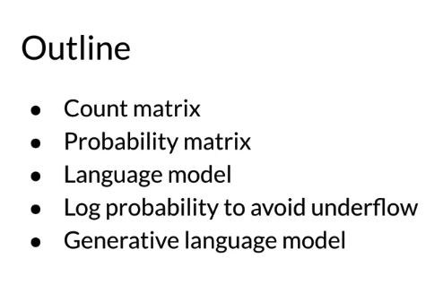</kbd>

   

  
  
<kbd>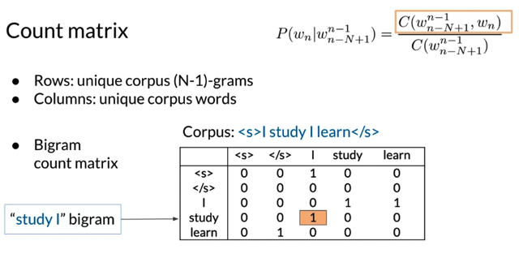</kbd>

  > Đại khái là mình sẽ dùng môt**sliding window N-gram**,**loop qua
  > hết bộ** **corpus** để **đếm**, và ghi nhận vào table như sau:
  >
  > Các **hàng** là các **unique (N-1)-gram**, ví dụ bài toán **3-gram**
  > thì các hàng là các unique **2-gram** trong corpus.
  >
  > Còn các **cột** là các **unique single words.**
  >
  > Tại mỗi ô, sẽ là tương ứng với 1 2-gram và 1 từ, ý nghĩa của cái
  > bảng này: **Tổng mỗi hàng** sẽ là **tổng số lần một 2-gram xuất
  > hiện với một từ bất kì**. Còn tại **mỗi ô** sẽ là **số lần một 2-gram
  > xuất hiện với từ của cột đó** mà ta sẽ tính probability. Nói chung nhờ
  > cái bảng này mà ta sẽ tính được **N-gram probability** bằng cách
  > **chia mỗi ô cho sum row đó.**
  >
  > Nhớ lại ví dụ **3-gram probability** của một **3-gram** **w1w2w3**
  > là: khả năng \/**w3 xuất hiện nếu w1w2 đã xuất hiện**\/
  > **P(w3|w1w2)**.Tính bằng **số lần w3 xuất hiện sau khi w1w2** **đã
  > xuất hiện C(w1,w2,w3)** chia cho **số lần một từ bất kì xuất hiện
  > sau khi w1w2 đã xuất hiện C(w1, w2, any word)**

   

  
  
<kbd>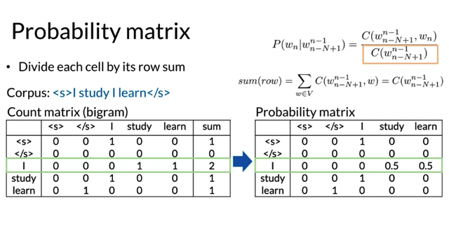</kbd>

  > Đây, từ count matrix, ta tính **sum của từng row** và **chia mỗi cell value
  > cho sum của row tương ứng**, thì sẽ cho ra **probability của N-gram.**

   

  
  
<kbd>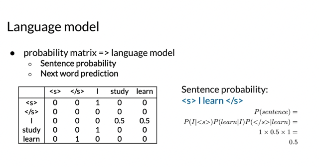</kbd>

  > Đại khái là với cái **probability matrix** này, ta sẽ **tạo một
  > language model** - thật ra đơn giản **chỉ là một đoạn script**
  > **dùng cái matrix này** để **tính ra xác suất của một câu** bằng cách
  > **split câu thành các n-gram**, và **tính xác suất của câu** theo
  > công thức (bằng cách tính xác suất của các N-gram rồi nhân lại).
  >
  > Ví dụ tính xác suất của câu "I learn" như sau

   

- Mặc khác nó có thể \\*dự đoán từ tiếp theo\\* của câu bằng cách lấy ra cái \\*(N-1)-gram\\* cuối của câu đang có và tìm trong \\*probability matrix\\* cái row tương ứng với (N-1)-gram đó và \\*xem từ nào tạo nên xác suất cao nhất\\*.  Ví dụ trong cái bản 2-gram ở trước, thì mỗi hàng là những cái 1-gram, giả sử có câu " Tomorrow I ..." yêu cầu\\* tìm từ có xác suất cao nhất để điền vào\\* thì ta extract \\*1-gram\\* cuối của câu = \\*"I"\\* và xem trong matrix thấy với hàng I thì từ \\*"study"\\* và \\*"learn"\\* có \\*bigram probability cao nhất\\* suy ra prediction có thể là \\*Tomorrow I learn \\*hoặc \\*Tomorrow I study\\*
   

    
    
<kbd>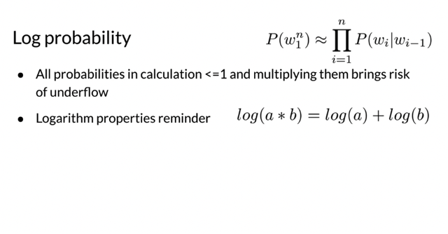</kbd>

    > Đại khái là vì các p đều**trong khoảng 0-1** nên tích nhiều cái lại khi
    > tính p của sentence sẽ làm số nó **rất nhỏ**, gây lỗi máy tính do đó
    > người ta dùng **log probability**

     

    
    
<kbd>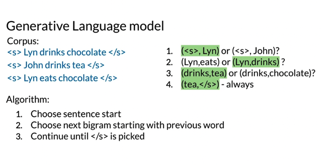</kbd>

    > Đại khái là N-gram model có thể **generate ra câu hoàn chỉnh
    > from scratch**
    >
    > 1.Bắt đầu nó sẽ **chọn một từ để start** dựa trên các từ có **xác
    > suất <s> -> w** cao.
    >
    > 2. Nó sẽ**tìm cái từ tiếp theo** có **bi-gram cao nhất.**
    >
    > 3. Và tiếp tục như vậy đến khi cái **token </s>** được chọn

     

    
    
<kbd>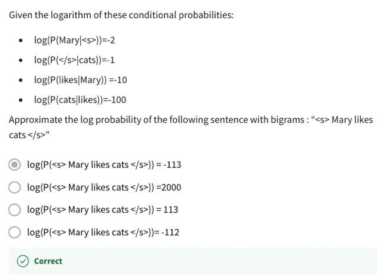</kbd>

     

## Language Model Evaluation

 

### 1 Introduction to language model \\*evaluation\\*: The video explains how to \\*evaluate a language model\\* using a

> [!NOTE]
> 1 Introduction to language model \**evaluation\**: The video explains how to \**evaluate a language model\** using a
> metric called \**perplexity\**. Perplexity \**measures the complexity of a set of texts\** and is used to \**assess the
> performance of a language model\**.
>
> 2\**Dataset splitting\**: Before evaluating the language model, the dataset is \**divided into training, validation, and
> test sets.\** The \**training set\** is used for model \**training\**, the \**validation\** set helps\**tune hyper-parameters\**, and the
> \**test set\** is held out to \**evaluate the model's performance\** on unseen data.
>
> 3 Understanding \**perplexity\**: Perplexity is a measure of \**how well a language model assigns probabilities to
> sentences\**. A \**lower perplexity score\** indicates that the \\/\**sentences are more likely to have been written by
> humans\**\\/, while a \**higher score suggests randomness \**in word choice.
>
> 4 Calculation of \**perplexity\**: Perplexity is computed by \**raising the probability of sentences\** in the test set to the
> \**power of -1 divided by the number of words\** in the test set. \**The\** \**higher\** the language model estimates the
> \**probability\**, the l\**ower the perplexity scor\**e will be.
>
> 5 Perplexity example: Two language models with \**different probabilities\** for the test set are \**compared\**. The
> model with a \**higher probability has a lower perplexity score\**, indicating \**better performance\** in predicting the
> test set.
>
> 6 \**Perplexity\** for\**bigram models\**: Perplexity calculation for bigram models involves \\/\**multiplying the probabilities
> of all the bigrams in the sentences\**\\/ and then taking the \**power of -1 divided by the number of words\**.
>
> 7 \**Log perplexity\**: \**Some researchers\** use \**log perplexity\** instead of perplexity, which involves computing the
> sum of logarithms of the probabilities of words. Log perplexity is\**easier to compute\** and is often reported in
> research papers.
>
> 8 Impact of improved perplexity:\**Lower perplexity scores indicate better language model\**s. An example with a
> Wall Street Journal corpus shows how \**perplexity decreases as the model complexity increases\**, with \**trigram\**
> \**models\** producing \**more reasonable language.
> \**
> 9 H\**andling out-of-vocabulary words\**: In future videos, techniques for handling words \**not seen in the training
> set\** will be covered, as this is an \**important aspect for real-world language model applications.\**

 

  
  
<kbd>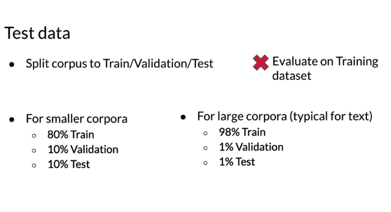</kbd>

  > Đại khái là chia corpus ra Train.Validation.
  > Test set để evaluation model. Tỉ lệ thì ít thì 8/2/2 Nhiều thì 98/1/1

   

  
  
<kbd>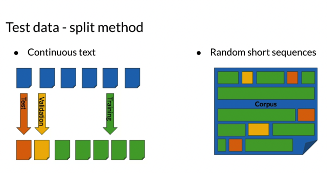</kbd>

  > In NLP there are**two main methods** for **splitting**. You can **split the
  > corpus** by **choosing longer continuous segments** like Wikipedia
  > articles or you can **randomly choose short sequences** **of words**
  > such as those in the sentences.

  > Cái này chưa hiểu

   

  
  
<kbd>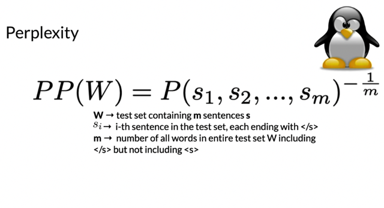</kbd>

  > **Text do người viết** sẽ có**PP thấp**, còn text **random generated** bởi
  > máy tính sẽ có **PP cao**. Nói chung là một **chỉ số hay dùng** để đ**ánh giá
  > Language Model**
  >
  > Tính bằng cách tìm **Probability tất cả các câu** trong test set (ví dụ m
  > câu), rồi **luỹ thừa (-1/m)** Thì P càng cao thì PP càng nhỏ. Chưa hiểu
  > lắm cụ thể tính P của tất cả các câu = Nhân hết các P của câu lại

  > Chỗ này trong slide hình như ổng ghi sai rồi:
  > W thì nói là test set chứa m câu ở dưới lại ghi
  > m là tổng số các từ trong test sét...

   

  
  
<kbd>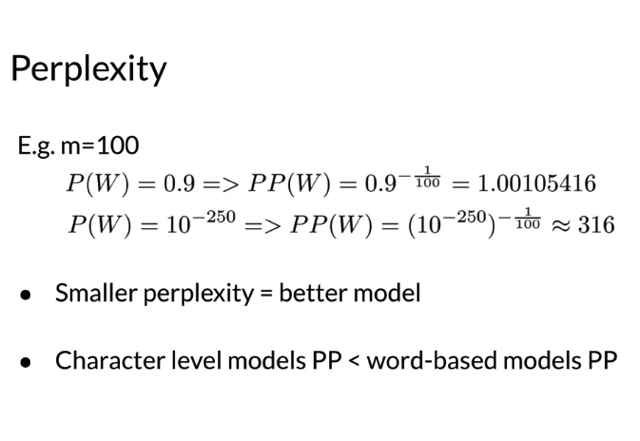</kbd>

  > Xem ví dụ tính **PP của 2 model**, cái**P ra 0.9** (là cao) thì PP là 1,
  > cái còn lại P = 10^-250 (rất nhỏ) thì PP thành ra 316 lớn hơn cái kia
  > nhiều. **Ý nói PP càng thấp thì càng tốt, và cái tốt nhất hiện tại có PP
  > khoảng 20-60**
  > Một ý nữa là **PP của character level models** thì**thường nhỏ hơn** **word
  > based model**

   

  
  
<kbd>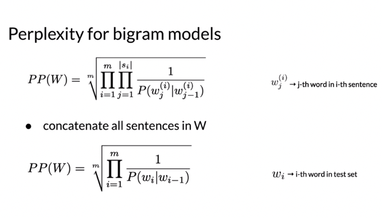</kbd>

  > Now it gets ready to calculate **perplexity for bigram models** and a bigram
  > model you calculate the **product of bigram probabilities of all sentences**,
  > then take the**power of -1 over m.**

   

- Nhìn đáng sợ nhưng thật ra công thức rất dễ hiểu:  Tính \\*Bi-gram probability\\* của \\*từng câu\\* (ví dụ câu w1w2w3, nhớ lại P(w1w2w3) sẽ ~= P(w3|w2)*P(w2|w1)) và chính là \\*tích của tất cả các Bi-gram probability các bigram của câu đó.\\*  Sau đó tính tính product / \\*nhân hết P của các câu lại ví dụ ra A\\*,  thì A \\*cũng chính là tích của tất cả các Bi-gram trong entire set\\*.  Và \\*luỹ thừa -1/m\\* mà chính là \\*căn bậc m \\*
   

    
    
<kbd>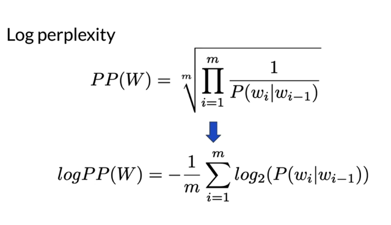</kbd>

    > Một số paper người ta dùng **Log PP** thì công thức như này, good model
    > sẽ có Log PP từ 4.3 và 5.9

     

    
    
<kbd>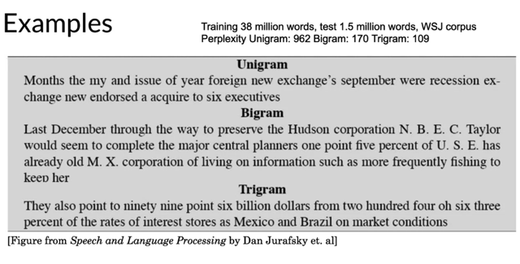</kbd>

    > Now how does the improved perplexity translate in a production quality language
    > model? Here is an example of a Wall Street Journal corpus. If you take a **unigram**
    > **language model**, the perplexity is very high, **962**. This just **generates words by their
    > probability.** With a **bigram language model**, the text **starts to make a little more
    > sense**. Using a **trigram** you can see the language it produces is **pretty close to
    > reasonable**. The perplexity is now equal to 109, much closer to the target perplexity
    > of 20 to 60 I mentioned earlier. Later in the specialization you'll encounter deep
    > learning language models with even lower perplexities course

    > một ví dụ cho thấy **3 language model** generate text dùng
    > **WSJ corpus**, thì cái **trigram model** tạo nội dung **có vẻ
    > khá giống người nhấ**t, và nó cũng có **PP thấp nhất**

     

    
    
<kbd>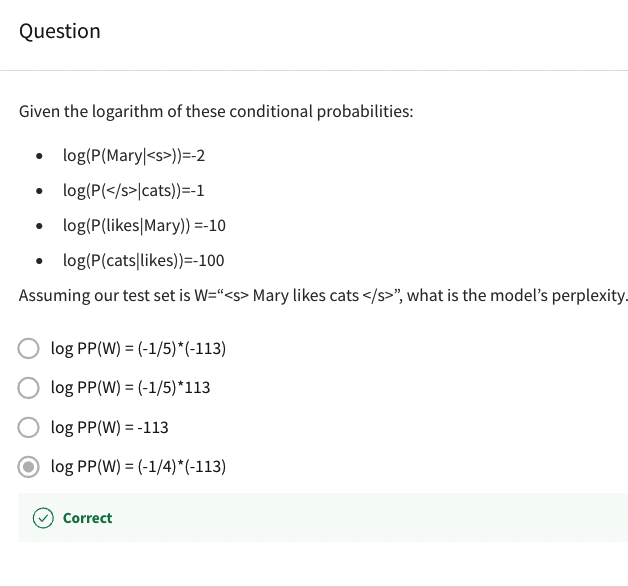</kbd>

    > -1/4[(-1 -100 -10 -2)] = -1/4(-113)
    > Tính log PP nên c.thức = -1/m*tổng của all log của bigram probability 
    > m là theo định nghĩa ko tính start token nên là 4

     

## Lab: Building The

> [!NOTE]
> LAB: BUILDING THE
> LANGUAGE MODEL

 

### Count matrix

 

- To calculate the \\*n-gram probability\\*, you will need to \\*count frequencies\\* of \\*n-grams\\* and \\*n- gram prefixes\\* in the training dataset. In some of the code assignment exercises, you will  store the \\*n-gram frequencies\\* in a dictionary.  In other parts of the assignment, you will build a \\*count matrix\\* that keeps counts of (\\*n-1)- gram\\* \\*prefix\\* followed by \\*all possible last words in the vocabulary\\*.  The following code shows how to \\*check\\*, \\*retrieve\\* and \\*update\\* \\*counts of n-grams\\* in the  word count dictionary.
  > Đại khái ta sẽ phải tính cái **frequencies** của **n-gram** và
  > **(n-1)-gram** - mà còn gọi là **N-gram Prefix**, Thì ổng nói trong P.A có khi
  > ta sẽ save trong một cái **dictionary**, nhưng có khi ta cần save
  > dưới dạng một table / **matrix** có hàng là các N-gram prefix cột
  > là các single word.

   

  
  - # manipulate n_gram count \\*dictionary\\*  \\*n_gram_counts\\* = {     ('I', 'am', 'happy'): 2,     ('am', 'happy', 'because'): 1}  # \\*get count\\* for an n-gram \\*tuple\\* print(f"count of n-gram {('I', 'am', 'happy')}: {n_gram_counts[('I', 'am', 'happy')]}")  # \\*check\\* if n-gram is \\*present\\* in the dictionary if \\*('I', 'am', 'learning') in n_gram_counts\\*:     print(f"n-gram {('I', 'am', 'learning')} found") else:     print(f"n-gram {('I', 'am', 'learning')} missing")  # \\*update the count\\* in the word count dictionary \\*n_gram_counts[('I', 'am', 'learning')] = 1\\* if ('I', 'am', 'learning') in n_gram_counts:     print(f"n-gram {('I', 'am', 'learning')} found") else:     print(f"n-gram {('I', 'am', 'learning')} missing") 
    > Đại khái là cho ta **xem thử** việc **tạo n-gram dictionary** là sao, đơn
    > giản **chỉ là một cái dictionary**, key là**n-gram dưới dạng 1 tuple**, **value
    > là số lần nó xuất hiện trong corpus**
    >
    > Thì mọi**action đều là của 1 dictionary thôi** như **lấy giá trị ra**, **check
    > có trong dic khôn**g, hoặc **update value**

     

      
      
<kbd>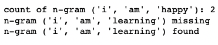</kbd>

       

    
    - The next code snippet shows \\*how to merge two tuples\\* in \\*Python\\*. That will be handy when \\*creating the n-gram\\* from the \\*prefix\\* and the\\* last word.\\*
       

      
      - # concatenate tuple for prefix and tuple with the last word to create the n_gram prefix = ('I', 'am', 'happy') word = 'because'  # \\*note here the syntax for creating a tuple for a single word\\* n_gram =\\* prefix + (word,)\\* print(n_gram)
        > Đại khái là **có 1 tuple,** giờ làm sao để **add thêm từ
        > vào tuple**. Cái này sẽ giúp tạo n_gram ví bằng
        > cách add từ vào **(n-1)-gram: n_gram = prefix + (word,)**

         

        
        - In the lecture, you've seen that the \\*count matrix\\* could be made in a single pass through the corpus. Here is one approach to do that.
           

          
          - import \\*numpy\\* as np import \\*pandas\\* as pd from collections import \\*defaultdict\\* def \\*single_pass_trigram_count_matrix\\*(corpus):     """     Creates the \\*trigram count matrix\\* from the\\* input corpus\\* in a \\*single pass through the corpus\\*.          Args:         corpus: \\*Pre-processed\\* and\\* tokenized corpus.\\*           Returns:         \\*bigrams\\*: list of a\\*ll bigram prefixes\\*, \\*row index\\*         \\*vocabulary\\*: list of \\*all found words\\*, the \\*column index\\*         \\*count_matrix\\*: pandas \\*dataframe\\* with \\*bigram prefixes as rows\\*,                        v\\*ocabulary words\\* as \\*columns\\*                        and t\\*he counts of the bigram/word combinations \\*(i.e. \\*trigrams\\*) as values     """     bigrams = []     vocabulary = []     count_matrix_dict = defaultdict(dict)          # \\*go through the corpus\\* once with a\\* sliding window\\*     for i in range(l\\*en(corpus) - 3 + 1\\*):         # the sliding window starts at position I and contains 3 words         \\*trigram = tuple(corpus[i : i + 3])\\*                  \\*bigram = trigram[0 : -1]\\*         if not bigram in bigrams:             \\*bigrams\\*.\\*append\\*(bigram)                          \\*last_word\\* = \\*trigram[-1]\\*         if not last_word in vocabulary:             \\*vocabulary\\*.append(last_word)                  if (\\*bigram,last_word\\*) not in \\*count_matrix_dict\\*:             count_matrix_dict[bigram,last_word] = 0                      count_matrix_dict[bigram,last_word] \\*+= 1\\*          # convert the count_matrix to \\*np.array\\* to fill in the blanks     count_matrix = \\*np.zeros((len(bigrams), len(vocabulary)))\\*     for \\*trigram_key\\*, \\*trigam_count\\* in count_matrix_dict.items():         count_matrix[bigrams.index(trigram_key[0]), \\\\                      vocabulary.index(trigram_key[1])]\\\\         = trigam_count          # \\*np.array\\* to\\* pandas dataframe \\*conversion     count_matrix = \\*pd.DataFrame\\*(\\*count_matrix\\*, index=bigrams, columns=vocabulary)     return bigrams, vocabulary, count_matrix  corpus = ['I', 'am', 'happy', 'because', 'I', 'am', 'learning', '.']  bigrams, vocabulary, count_matrix = single_pass_trigram_count_matrix(corpus)  print(count_matrix) 
             

            
            - # \\*go through the corpus\\* once with a\\* sliding window\\*     for i in range(l\\*en(corpus) - 3 + 1\\*):         # the sliding window starts at position I and contains 3 words         \\*trigram = tuple(corpus[i : i + 3])\\*
              > Ở lab trước đã phân tích vụ này, cách **lấy
              > n-gram bằng sliding window** và thực hiện việc**tạo tuple**

               

            
            - \\*bigram = trigram[0 : -1]\\*         if not bigram in bigrams:             \\*bigrams\\*.\\*append\\*(bigram)                          \\*last_word\\* = \\*trigram[-1]\\*         if not last_word in vocabulary:             \\*vocabulary\\*.append(last_word)                  if (\\*bigram,last_word\\*) not in \\*count_matrix_dict\\*:             count_matrix_dict[bigram,last_word] = 0                      count_matrix_dict[bigram,last_word] \\*+= 1\\*
              > Đơn giản chỉ là **lấy bigram từ trigram tuple** bằng
              > cách lấy từ **(index) đầu đến index áp chót**
              >
              > Và lấy **từ ở cuối tri-gram** ra chính là **từ đơn.**
              >
              > Check bigrams list có bigram chưa, chưa thì bỏ vô
              > Check vocabulary list có từ đơn đó chưa, chưa thì bỏ vô.
              >
              > Và update cái count matrix với key là bigram, word

               

            
            - # convert the count_matrix to \\*np.array\\* to fill in the blanks     count_matrix = \\*np.zeros((len(bigrams), len(vocabulary)))\\*     for \\*trigram_key\\*, \\*trigam_count\\* in count_matrix_dict.items():         count_matrix[bigrams.index(trigram_key[0]), \\\\                      vocabulary.index(trigram_key[1])]\\\\         = trigam_count          # \\*np.array\\* to\\* pandas dataframe \\*conversion     count_matrix = \\*pd.DataFrame\\*(\\*count_matrix\\*, index=bigrams, columns=vocabulary)     return bigrams, vocabulary, count_matrix
              > cái này nó **convert count matrix** đang ở **"dạng" là
              > một dictionary** (tri-gram - count) thành **"dạng" array**
              > với **hàng là bi-gram, cột là từ**Cuối cùng bỏ vào Panda dataframe

               

              
              
<kbd>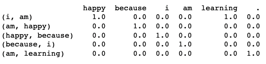</kbd>

               

### Probability matrix

 

- The next step is to \\*build a probability matrix\\* from the \\*count matrix.\\*  You can use an object \\*dataframe\\* from library \\*pandas\\* and its methods \\_\\*sum\\*\\_ and \\_\\*div\\*\\_ to  \\*normalize the cell counts\\* with the \\*sum of the respective rows.\\*
  > Đại khái là tính **Probability** ta cần **chia giá trị tại
  > mỗi ô** cho **sum của hàng của nó**, thì ở đây có
  > thể dùng ngay function **sum() và div()** của
  > P**andas.DataFrame** luôn

   

  
  - # create the \\*probability matrix\\* from the count matrix row_sums = \\*count_matrix.sum(axis=1) \\*# divide each row by its sum prob_matrix = count_matrix.\\*div\\*(row_sums, axis=0)  print(prob_matrix)
    > Tranh thủ ôn lại: **Sum 1 hàng** lại
    > tức là**cộng các cột lại**, **cột ->
    > dimension = 1 => axis = 1**

     

      
      
<kbd>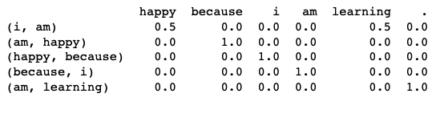</kbd>

       

    
    - # find the probability of a trigram in the probability matrix trigram = ('I', 'am', 'happy')  # find the prefix bigram  bigram = trigram[:-1] print(f'bigram: {bigram}')  # find the last word of the trigram word = trigram[-1] print(f'word: {word}')  # we are using the pandas dataframes here, column with vocabulary word comes first, row with the prefix bigram second trigram_probability = \\*prob_matrix[word][bigram]\\* print(f'trigram_probability: {trigram_probability}')
      > The probability matrix now helps you to **find a
      > probability of an input trigram**.

      > Đây là **DataFrame** nên để **access gía trị** thì ta "bỏ"
      > giá trị của **column (từ đơn)** và **row (bi-gram)** vào, **không phải là
      > 2D array** mà dùng **index**

       

        
        
<kbd>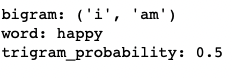</kbd>

         

      
      - In the code assignment, you will be \\*searching for the most probable words\\* starting with a  \\*prefix\\*. You can use the method \\_\\*str.startswith\\*\\_ to \\*test if a word starts with a prefix.\\*  Here is a code snippet showing how to use this method.
        > Chỉ cho ta biết function **startswith()** giúp **check
        > xem 1 từ có start bởi 1 prefix không**, sẽ **rất tiện**ví dụ như khi muốn check 1 tri-gram A có start
        > bởi 1 bi-gram B không

         

        
        - # lists all words in vocabulary starting with a given prefix vocabulary = ['I', 'am', 'happy', 'because', 'learning', '.', 'have', 'you', 'seen','it', '?'] starts_with = 'ha'  print(f'words in vocabulary starting with prefix: {starts_with}\\\ ') for word in vocabulary:     if \\*word.startswith(starts_with):\\*         print(word)
           

### Language model evaluation

 

- \\*Train/validation/test split \\*  In the videos, you saw that \\*to evaluate language models\\*, you need to\\* keep some of the  corpus data for validation and testing\\*.  The choice of the \\*test\\* and \\*validation data\\* should correspond \\*as much as possible\\* to the  \\*distribution of the data coming from the actual application\\*. \\/\\*If nothing but the input corpus  is known\\*\\/, then \\*random sampling\\* from the corpus is used to define the test and validation  subset.  Here is a code similar to what you'll see in the code assignment. The following function  allows you to \\*randomly sample the input data\\* and return t\\*rain/validation/test subsets\\* in a  split given by the method parameters.
  > Đại khái nói là để **evaluate** thì phải**để dành 1 phần data**
  > để **validation** và **test**. Và **số lượng bao nhiêu tuỳ thuộc**
  > vào '**actual application**' nhưng nếu không biết gì hết thì sẽ
  > dùng "**random sampling**"

   

  
  - # we only need train and validation %, test is the remainder import random def train_validation_test_split(data, train_percent, validation_percent):     """     Splits the input data to  train/validation/test according to the percentage provided          Args:         \\*data\\*: \\*Pre-processed and tokenized corpus\\*, i.e. list of sentences.         \\*train_percent\\*: integer\\* 0-100\\*, defines the portion of input corpus allocated for training         \\*validation_percent\\*: integer \\*0-100\\*, defines the portion of input corpus allocated for validation                  Note: \\*train_percent\\* + \\*validation_percent\\* need to be \\*<=100\\*               the reminder to 100 is allocated for the test set          Returns:         train_data: list of sentences, the training part of the corpus         validation_data: list of sentences, the validation part of the corpus         test_data: list of sentences, the test part of the corpus     """     # fixed seed here for reproducibility     random.seed(87)          # reshuffle all input sentences     \\*random.shuffle\\*(data)      \\*train_size\\* = int(len(data) * train_percent / 100)     train_data = data[\\*0:train_size\\*]          \\*validation_size\\* = int(len(data) * validation_percent / 100)     validation_data = data[\\*train_size:train_size + validation_size\\*]          \\*test_data\\* = data[\\*train_size + validation_size:\\*]          return train_data, validation_data, test_data  data = [x for x in range (0, 100)] \\*//Tạo 1 data giả bộ\\*  train_data, validation_data, test_data = train_validation_test_split(data, 80, 10) print("split 80/10/10:\\\ ",f"train data:{train_data}\\\ ", f"validation data:{validation_data}\\\ ",        f"test data:{test_data}\\\ ")  train_data, validation_data, test_data = train_validation_test_split(data, 98, 1) print("split 98/1/1:\\\ ",f"train data:{train_data}\\\ ", f"validation data:{validation_data}\\\ ",        f"test data:{test_data}\\\ ")
    > Dễ hiểu, function này **chỉ shuffle data lên** rồi **chia theo tỉ lệ bởi
    > argument thôi** không có gì

     

### Perplexity

 

  
  
<kbd>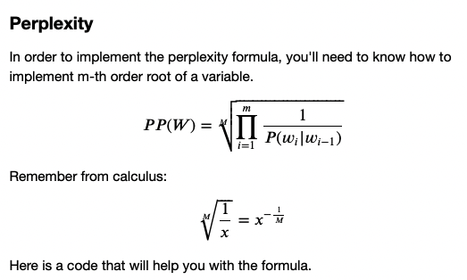</kbd>

  > Cuối cùng là chỉ cho cách tính "căn bậc m" thì
  > theo toán học căn bậc m là luỹ thừa cùa -1/m.

   

  
  
<kbd>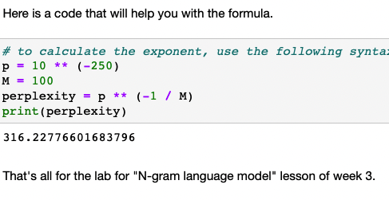</kbd>

   

## Out Of Vocabulary

 

### 1 \\*Out of vocabulary words\\* (\\*OOV\\*) and their significance:

> [!NOTE]
> 1 \**Out of vocabulary words\** (\**OOV\**) and their significance:
> a. OOV refers to words that are \**not seen during training\**.
> b. In some tasks, such as \**speech recognition or question answering\**, limited sets of 
> words are \**encountered and generated\** (\**closed vocabulary\**).
> c. However, in other cases, words \**outside\** the known vocabulary can be encountered 
> (open vocabulary).
>
>  2 Modeling \**unknown words with UNK\**:
> a. To handle unknown words, a special word, \**UNK\**, is introduced.
> b. \**Unknown words are replaced with\** \**UNK\** during processing.
> c. \**N-gram language model probability\** calculations are performed with the \**inclusion of 
> UNK.\**
>
>  3 \**Creating a vocabulary:\**
> a. The \**vocabulary\** consists of words that are considered \**known.\**
> b. \**Words not in the vocabulary\** are r\**eplaced with UNK.\**
> c. \**Different criteria\** can be used to \**create the vocabular\**y, such as \**minimum word 
> frequency\** or \**maximum vocabulary size\**.
>
>  4 Impact of \**UNKs\** on \**perplexity\**:
> a. \**The presence of UNK\**s can \**lower the perplexity metric\**, giving the\**impression of 
> improved performance.\**
> b. However, \**an excessive number of UNK\**s can result in the \**generation of meaningless 
> sentences.\**
>
>  5 \**Recommendations\**:
> a. \**Use\** \**UNKs\** \**sparingly\** to maintain \**meaningful output.\**
> b. When \**comparing language models\** using perplexity,\**ensure they have the same 
> vocabulary.\**
>
>  6 Future topic: Method to\**improve performance\** on\**rare words\**.
>
> These main ideas provide an overview of\**dealing with out-of-vocabulary words\**, 
> introducing \**UNK as a special word\**, creating a vocabulary, and considering the \**impact of 
> UNKs on model performance.\**

 

  
  
<kbd>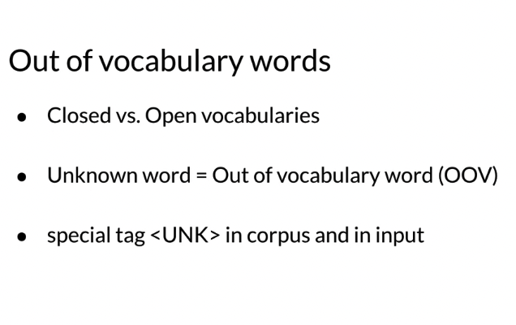</kbd>

  > Đại khái là **language model** được train hay sử dụng một text corpus
  > gọi là **vocabularies** thì **một số task** như speech recognition hay
  > question answering **chỉ generate từ có trong đó** thôi gọi là **Closed
  > vocab.**
  >
  > Nhưng **một số task khác** thì khi dùng để predict thì **nó sẽ phải gặp
  > những từ không có trong vocab** list của model, thì cái này gọi  là
  > **open vocabs**

   

  
  
<kbd>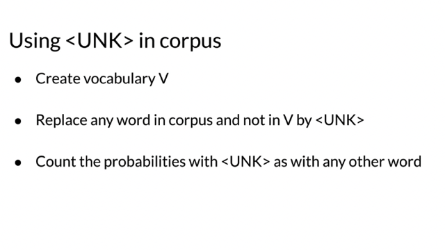</kbd>

  > Từ **text corpus** ta sẽ **tạo bộ vocab V**, với **một số tiêu
  > chuẩn** nào đó **ví dụ như frequency**đạt bao nhiêu
  > mới cho vào.
  >
  > **Những từ không có trong vocab** sẽ bị **thay thế bằng
  > UNK**
  >
  > Và **tính probability như bình thường**

   

  
  
<kbd>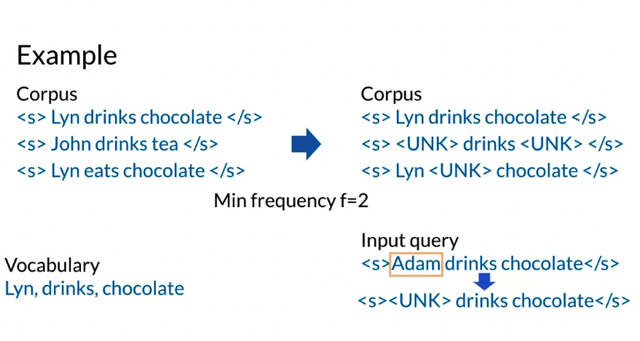</kbd>

  > Ví dụ **cho corpus này** thì giả sử**đặt tiêu chuẩn min frequency =
  > 2** thì **vocab chỉ có 3 từ Lyn, drinks, chocolate**. Những từ **còn
  > lại sẽ thay bằng UNK hết**. Và khi **tính probability của một câu**
  > (ví dụ Adam drinks chocolate) thì **cũng thay từ ko có trong vocab
  > (Adam) bằng UNK trước khi tính**

   

  
  
<kbd>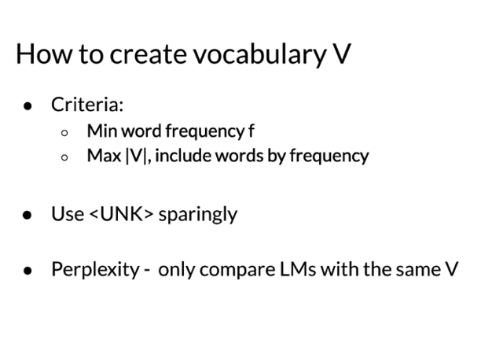</kbd>

  > Một s**ố cách tạo Vocab**, có thể dùng **min frequency** như
  > đã nói hoặc dùng **Max |V|**- add những thằng có
  > f**requency cao nhất vào cho đến khi đủ số lượng tối đa** mã
  > |V| từ trong vocab thôi
  >
  > Ý thứ 2 ý nói nếu mà **lạm dụng unk quá thì cũng không
  > đượ**c
  >
  > Và khi **so sánh các Language Model** với nhau thì phải dựa
  > trên cơ sở **cùng một bộ vocab**

   

  
  
<kbd>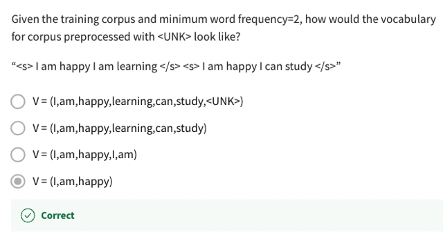</kbd>

   

## Smoothing

 

### 1 \\*N-gram probabilities\\* can be \\*skewed\\* when trained on a \\*limited corpus\\*.

> [!NOTE]
> 1 \**N-gram probabilities\** can be \**skewed\** when trained on a \**limited corpus\**.
>
>  2 \**Smoothing\** is a method used to remedy the skewed probabilities in N-gram 
> models.
>
>  3 \**Missing N-grams\** in the corpus \**affect the estimation of their probabilities\**.
>
>  4 \**Add-one smoothing\** (Laplacian smoothing) \**adds 1\** to the \**numerator\** and \**each 
> by-gram in the denominator sum\**, making missing N-grams have a nonzero probability.
>
>  5\**Add-k smoothing\** is a variation of add-one smoothing where a constant \**value k \**
> is \**added to the numerator\** and \**each possible N-gram in the denominator.\**
>
>  6 \**Advanced \**smoothing methods like \**Kneser-Ney or Good-Turing\** exist for more 
> accurate probability estimation.
>
>  7 \**Backoff\** is an approach where \**if an N-gram is missing\**, \**lower-level N-grams are 
> used\** as a \**fallback\** \**until nonzero probability is found.\**
>
>  8 \**Katz backoff\** uses \**discounting\** to \**adjust probabilities \**in lower-level N-grams 
> based on higher-level N-grams.
>
>  9 \**Stupid backoff \**uses a \**constant multiplier \**when higher-level N-gram 
> probabilities are missing.
>
>  10 \**Linear interpolation\** \**combines\** the weighted probabilities of N-grams and lower-
> level N-grams.
>
>  11 Interpolation is applied by combining the probabilities of N-gram, (N-1)-gram, 
> and lower-level N-grams with weighted constants.
>
>  12 The\**weights (lambdas) in interpolation are learned \**from the \**validation set \**by 
> \**maximizing the probability of sentences\**.
>
>  13 Interpolation can be applied to general N-grams by using more lambdas.
>
>  14 N-gram language models can be improved with smoothing techniques and 
> interpolation.
>
>  15 \**N-gram language models \**are effective in \**generating text\**, and coding exercises 
> provide an opportunity to practice creating them.

 

  
  
<kbd>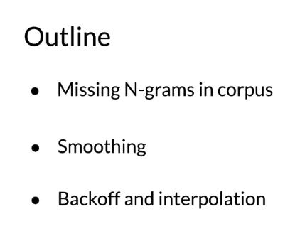</kbd>

   

  
  
<kbd>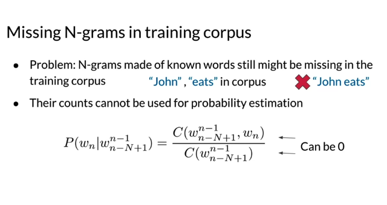</kbd>

  > Đại khái là một hiện tượng khác bất ngờ xảy đến thứ 2 (cái
  > thứ 1 là model gặp từ không có trong vocab, thì gán thành
  > UNK) đó là từ **có trong vocab nhưng cái n-gram thì
  > không**, ví dụ, **John, eats đều có trong vocab**, nhưng
  > **không có chỗ nào mà John eats đứng cạnh nhau cả**, như
  > vậy không tính probability của cái N-gram ví dụ 3-gram như
  > **John eats apple** dc vì không có cái 2-gram **John eats**.

   

  
  
<kbd>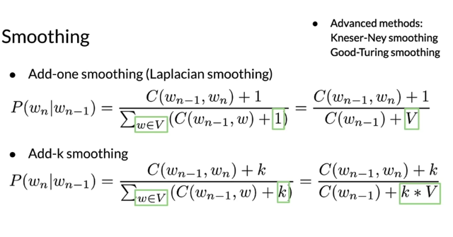</kbd>

  > Cách giải quyết là **Smoothing**, tương tự như cái đã gặp ở các model
  > trước. Đại khái là ta **cộng 1 vào mỗi một N-gram**. thì gọi là **Laplacian
  > smoothing**, hoặc k thì gọi là **Add-k smoothing** Ví dụ như ở hình dưới,
  > tính BI-GRAM, **chú ý là đang tính Bi-gram** probability nên mới kí hiệu là
  > **P(wn|wn-1)**.
  >
  > Ví dụ Bi-gram probability của P(w2|w1) thì ta + 1 vào mọi bi-gram Trong
  > count-matrix. Theo công thức ta sẽ**đếm số lần w1w2 xuất hiện** và chia
  > cho **tổng số  lần w1 word bất kì xuất hiện**, vậy thì với smoothing, ta cộng
  > 1 vào số lần w1w2 xuất hiện nên là **C(w1,w2) + 1**. Và cộng 1 vào tất cả
  > các lần w1 và 1 từ bất kì xuất hiện, mà **số lần 1 từ bất kì xuất hiện chính
  > là số từ trong vocab chứ gì**, thành ra **mẫu cộng V** (V = tổng số từ trong
  > vocab)
  >
  > Tương tự với k thì thay vì cộng 1 thì cộng k. K chưa thấy nói tính ra sao.
  >
  > Còn có những cách advance hơn như **Kneser-Ney hay Good-Turing**

   

  
  
<kbd>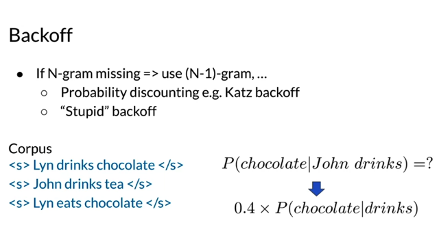</kbd>

  > Một cách nữa gọi là **Backoff**.
  >
  > - **Backoff**: Khi **không tồn tại một N-gram cần tính** thì dùng **N-1
  > gram**, nếu không có luôn thì xài **N-2 gram** cứ như vậy cho đến
  > khi còn **Uni-gram** (thì chắc chắn phải có)
  >
  > Trong ví dụ dưới, muốn tính **P(chocolate| John drinks)** thì theo
  > công thức phải tính số lần **"John drinks chocolate"** xuất hiện
  > **chia cho** số lần **John drink** + **1 từ nào đó** xuất hiện. Nhưng
  > rõ ràng là không có bộ "**John drink chocolate"** nào hết có nghĩa là
  > tử số **= 0**, mẫu số thì có = 1 (John drink + tea)
  >
  > Lúc này **backoff** có nghĩa là ta thay **P(chocolate| John drinks)**bằng tính **P(chocolate|drink)** - thay Trigram giảm xuống bằng
  > Bigram, nếu vẫn không được luôn thì tính **unigram P(chocolate)**
  > thôi
  >
  > Katz backoff: Đại khái là có thể khi giảm cấp thì **nhân thêm hệ số điều
  > chỉnh**, vì giảm cấp  rõ ràng sẽ làm giảm độ chính xác. Hệ số này
  > chưa nói rõ sẽ tính ntn. Còn nếu không cần tính hệ số điều chỉnh mà
  > **cứ dùng 1 constant** như **0.4** thì gọi là **Stupid backoff**

   

  
  
<kbd>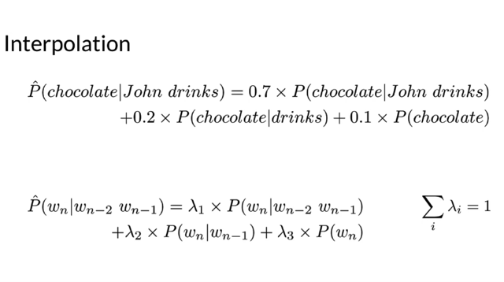</kbd>

  > Cái này đã hiểu, ý nói **thay vì tính P(chocolate| John drink) một
  > cách thông thường** theo công thức (tức là đếm số bộ John
  > drink chocolate chia cho số bộ John drink từ bất kì). Ok, thì **giả
  > sử tính tính vậy dc rồi** (không có bị missing n gram nên phải
  > backoff gì hết, cái này cái khác)
  >
  > Thì cái này **ý nói người ta tính thêm các N-1 gram probability,
  > N-2 gram probability vào nữa** mỗi cái với tham số weight
  > lambda để ra cái gọi à **P^ của (chocolate| John drink).**

   

## Lab: Language Model

> [!NOTE]
> LAB: LANGUAGE MODEL
> GENERALIZATION

 

### Vocabulary

 

- \\*Vocabulary \\* In the video about the \\*out of vocabulary words\\*, you saw that the first step in dealing with  the unknown words is to \\*decide which words belong to the vocabulary.\\*  In the code assignment, you will try the method based on \\*minimum frequency\\* - all words  appearing in the training set with \\*frequency >= minimum frequency\\* are \\*added\\* to the  vocabulary.  Here is a code for the other method, where the \\*target size of the vocabulary is known in  advance\\* and the vocabulary is filled with words based on their frequency in the training  set.
  > Đại khái là trước tiên ta **build vocab list**, có 2 cách
  >
  > 1 là **dựa trên minimum frequency**, tức là trong corpus từ nào xuất. hiện ất
  > least 1 số làn nào đó mới bõ vào vocab list,. Nhưng từ khác đều dc gán
  > thành UNK
  >
  > 2. là dựa trên **việc chọn ra cho đủ số lượng các từ có frequency cao nhất
  > thôi**, tức là lấp đầy với các từ có f cao nhất cho đến khi đủ số

   

  
  - # \\*build the vocabulary\\* from\\* M most frequent words\\* # use\\* Counter object\\* from the collections library to\\* find M most common words \\*from collections \\*import Counter\\*  # the \\*target size of the vocabulary\\* \\*M = 3\\*  # pre-calculated word counts # Counter could be used to build this dictionary from the source corpus word_counts = {'happy': 5, 'because': 3, 'I': 2, 'am': 2, 'learning': 3, '.': 1}  vocabulary = \\*Counter(word_counts).most_common(M)\\*  # \\*remove the frequencies and leave just the words\\* vocabulary = \\*[w[0] for w in vocabulary]\\*  print(f"the new vocabulary containing {M} most frequent words: {vocabulary}\\\ ")
    > Ở đây là nói về cách 2, bắt đầu bằng **định ra M là số
    > lượng của vocab**, ta sẽ dùng **Counter**, bỏ vào đó cái
    > **word+word count dictionary** và gọi**function
    > most_common(M)** để nó **lấy ra list M vocab có word count
    > cao nhất.** Nói chung chỉ cho cách xài Counter rất tiện lợi

     

    
    - Now that the vocabulary is ready, you can use it to \\*replace the OOV words\\* with  \\*<\\*𝑈𝑁𝐾\\*>\\*   as you saw in the lecture.
       

      
      - # test if words in the input sentences are in the vocabulary, if OOV, print <UNK> sentence = \\*['am', 'I', 'learning']\\* output_sentence = [] print(f"input sentence: {sentence}")  for w in sentence:     # test if word w is in vocabulary    \\* if w in vocabulary:\\*         output_sentence.append\\*(w)\\*     else:         output_sentence.append\\*('<UNK>')\\*          print(f"output sentence: {output_sentence}")
        > Đại khái là**loop qua các từ**, từ nào
        > **có trong vocav thì append vào list**,
        > **ko có thì append 'UNK**"

         

          
          
<kbd>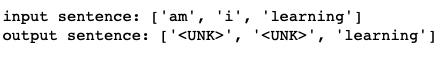</kbd>

           

        
        - When building the vocabulary in the code assignment, you will need to know \\*how to iterate through the word counts dictionary.\\*  Here is an example of a similar task showing how to \\*go through all the word counts\\* and print out only the words with the \\*frequency equal to f.\\*
           

          
          - # \\*iterate through all word counts and print words\\* with given frequency f f = 3  word_counts = {'happy': 5, 'because': 3, 'I': 2, 'am': 2, 'learning':3, '.': 1}  for \\*word\\*, \\*freq\\* in \\*word_counts.items()\\*:     \\*if freq == f:\\*         print(word)
            > Đại khái là**chỉ cách loop
            > trong words count dicts** nhu thế nào

             

              
              
<kbd>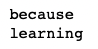</kbd>

               

            
            - As mentioned in the videos, \\*if there are many  <\\*𝑈𝑁𝐾\\*>\\* replacements in your train and test set, you may \\*get a very low perplexity\\* even though the \\*model itself wouldn' t be very helpful.\\*  Here is a sample code showing this unwanted effect.
               

              
              - # many <unk> low perplexity  training_set = ['i', 'am', 'happy', 'because','i', 'am', 'learning', '.'] training_set_unk = ['i', 'am', '<UNK>', '<UNK>','i', 'am', '<UNK>', '<UNK>']  test_set = ['i', 'am', 'learning'] test_set_unk = ['i', 'am', '<UNK>']  M = len(test_set) probability = 1 probability_unk = 1  # pre-calculated probabilities bigram_probabilities = {('i', 'am'): 1.0, ('am', 'happy'): 0.5, ('happy', 'because'): 1.0, ('because', 'i'): 1.0, ('am', 'learning'): 0.5, ('learning', '.'): 1.0} bigram_probabilities_unk = {('i', 'am'): 1.0, ('am', '<UNK>'): 1.0, ('<UNK>', '<UNK>'): 0.5, ('<UNK>', 'i'): 0.25}  # got through the test set and calculate its bigram probability for i in range(len(test_set) - 2 + 1):     bigram = tuple(test_set[i: i + 2])     probability = probability * bigram_probabilities[bigram]              bigram_unk = tuple(test_set_unk[i: i + 2])     probability_unk = probability_unk * bigram_probabilities_unk[bigram_unk]  # calculate perplexity for both original test set and test set with <UNK> perplexity = probability ** (-1 / M) perplexity_unk = probability_unk ** (-1 / M)  print(f"perplexity for the training set: {perplexity}") print(f"perplexity for the training set with <UNK>: {perplexity_unk}") 
                > Đại khái là cho ví dụ tính **Perplexity** của hai model trong đó **một cái toàn UNK không** cũng
                > thấy là chỉ số **PP thấp (là good(** dù rõ ràng là **model vô tích sự**

                 

                  
                  
<kbd>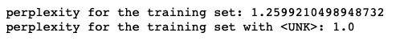</kbd>

                   

  
  - the new vocabulary containing 3 most frequent words: \\*['happy', ' because', 'learning']\\*
     

### Smoothing

 

- \\*Add-k smoothing\\* was described as a method for smoothing of the \\*probabilities\\* for \\*previously unseen n-grams.\\*  Here is an example code that shows how to implement \\*add-k smoothing\\* but also \\*highlights a disadvantage of this method\\*. The \\*downside\\* is that n-grams \\*not previously seen in the training dataset get too high probability.\\*  In the code output bellow you'll see that \\*a phrase that is in the training set\\* gets the\\* same probability \\*as an \\*unknown phrase.\\*
  > Đại khái là **ví dụ cho thấy** A**dd-k smoothing** có **nhược điểm**
  > là **làm cho N-gram không có trong training dataset cũng có
  > probability cao** mà trong ví dụ này sẽ thấy nó cao bằng cái
  > có trong training set luôn.

   

  
  - def \\*add_k_smooting_probability\\*(k, vocabulary_size, \\*n_gram_count\\*, \\*n_gram_prefix_count\\*):     numerator = n_gram_count \\*+ k\\*     denominator = n_gram_prefix_count + \\*k * vocabulary_size\\*     return \\*numerator / denominator\\*  trigram_probabilities = {('I', 'am', 'happy') : 2} bigram_probabilities = {( 'am', 'happy') : 10} vocabulary_size = 5 k = 1  probability_known_trigram = \\*add_k_smooting_probability\\*(k, vocabulary_size, \\*trigram_probabilities[('I', 'am', 'happy')]\\*,                             bigram_probabilities[( 'am', 'happy')])  probability_unknown_trigram = add_k_smooting_probability(k, vocabulary_size, \\*0, 0\\*)  print(f"probability_known_trigram: {probability_known_trigram}") print(f"probability_unknown_trigram: {probability_unknown_trigram}") 
     

      
      
<kbd>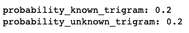</kbd>

       

### Back-off

 

- Back-off is a \\*model generalization method\\* that leverages information from \\*lower order n-grams\\* in case information about the \\*high order n-grams is missing\\*. For example, if the probability of an trigram is missing, use bigram information and so on.  Here you can see an example of a\\* simple back-off\\* technique.
  > Nhắc lại **Backoff** là gì, khi tính p và trong đó **cần
  > tính count của một N-gram mà ko có** thì dùng
  > count của**N-1 gram**, ko có nữa thì dùng**N-2 gram.**...cho đến khi 1-gram

   

  
  - # pre-calculated probabilities of all types of n-grams trigram_probabilities = {('i', 'am', 'happy'): 0} bigram_probabilities = {( 'am', 'happy'): 0.3} unigram_probabilities = {'happy': 0.4}  # this is the input trigram we need to estimate trigram = ('are', 'you', 'happy')  # find the last bigram and unigram of the input \\*bigram = trigram[1: 3] unigram = trigram[2]\\* print(f"besides the trigram {trigram} we also use bigram {bigram} and unigram ({unigram})\\\ ")  # 0.4 is used as an example, experimentally found for web-scale corpuses when using the "stupid" back-off lambda_factor = 0.4 probability_hat_trigram = 0  # \\*search for first non-zero probability starting with trigram\\* # to generalize this for any order of n-gram hierarchy,  # you could loop through the probability dictionaries instead of if/else cascade if \\*trigram\\* not in \\*trigram_probabilities\\* or \\*trigram_probabilities[trigram]\\* == 0:     print(f"probability for trigram {trigram} not found")          if \\*bigram\\* not in \\*bigram_probabilities\\* or \\*bigram_probabilities[bigram]\\* == 0:         print(f"probability for bigram {bigram} not found")                  if \\*unigram\\* in \\*unigram_probabilities\\*:             print(f"probability for unigram {unigram} found\\\ ")             probability_hat_trigram = lambda_factor * lambda_factor * unigram_probabilities[unigram]         else:             probability_hat_trigram = 0     else:         probability_hat_trigram = lambda_factor * bigram_probabilities[bigram] else:     probability_hat_trigram = trigram_probabilities[trigram]  print(f"probability for trigram {trigram} estimated as {probability_hat_trigram}") 
     

      
      
<kbd>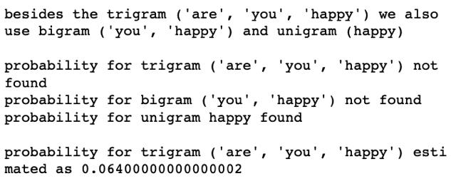</kbd>

       

### Interpolation

 

- The other method for using \\*probabilities\\* of\\* lower order n-grams\\* is the \\*interpolation\\*. In this case, you use \\*weighted probabilities of n-grams\\* of all orders every time,\\/\\* not just when high order information is missing.\\*\\/  For example, you \\*always combine\\* \\*trigram, bigram and unigram probability\\*. You can see how this in the following code snippet.
  > Nhờ cái này mà hiểu dc interpolation tức là thay vì
  > chỉ tính n-gram probability 1 cách thông thường thì
  > ta tính thêm vào cá P của các gram level thấp hơn
  > nhân cho hệ số.

   

  
  - # pre-calculated probabilities of all types of n-grams trigram_probabilities = {('I', 'am', 'happy'): 0.15} bigram_probabilities = {( 'am', 'happy'): 0.3} unigram_probabilities = {'happy': 0.4}  # the weights come from optimization on a validation set lambda_1 = 0.8 lambda_2 = 0.15 lambda_3 = 0.05  # this is the\\* input trigram we need to estimate\\* trigram =\\* ('I', 'am', 'happy')\\*  # find the last bigram and unigram of the input bigram = trigram[1: 3] unigram = trigram[2] print(f"besides the trigram {trigram} we also use bigram {bigram} and unigram ({unigram})\\\ ")  # in the production code, you would need to check if the probability n-gram dictionary contains the n-gram probability_hat_trigram = \\*lambda_1 * trigram_probabilities[trigram] \\* +\\* lambda_2\\* * \\*bigram_probabilities[bigram] \\*+ \\*lambda_3\\* * \\*unigram_probabilities[unigram]\\*  print(f"estimated probability of the input trigram {trigram} is {probability_hat_trigram}") 
    
<kbd>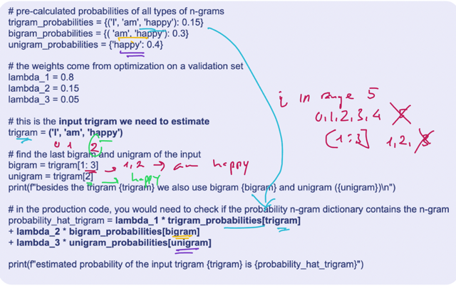</kbd>

     

    
    - besides the trigram ('I', 'am', 'happy') we also use bigram ('am', 'happy') and unigram (happy)  estimated probability of the input trigram ('I', 'am', 'happy') is 0.12
       

## Week Conclusion

 

### 1 Recap of the \\*key concepts\\* learned in \\*N-Gram language models\\*.

> [!NOTE]
> 1 Recap of the \**key concepts\** learned in \**N-Gram language models\**.
>
> 2 Understanding \**N-Grams\** and \**calculating their probabilities \**from a corpus.
>
> 3 \**Combining N-Gram probabilities\** to approximate \**sentence probabilities.\**
>
> 4 Building a l\**anguage model\** by organizing information about \**N-Grams in the
> corpus.
> \**
> 5 Handling \**missing information in sentences \**through techniques like \**smoothing\**,
> \**backoff\**, and \**interpolation\**.
>
> 6 Dealing with \**out-of-vocabulary words\** using \**special markers\** like \**"<UNK>"\**.
>
> 7 Introducing the \**perplexity\** \**metric\** as a tool for \**evaluating and selecting language
> models.
> \**
> 8 Preparation for the assignment on\**sentence auto-complete.\**
>
> 9 Acknowledgment of progress and accomplishments in the course.
>
> 10 Importance of \**N-Grams \**as \**foundational concepts\** for \**more advanced models.\**
>
> 11 Encouragement to \**reinforce understanding through the programming
> assignment.\**

 

  
  
<kbd>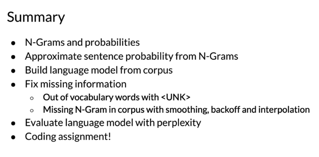</kbd>

   

## Week Conclusion

 

### You will l\\*oad and pre-process the data\\*, \\*develop an Ngram based language

> [!NOTE]
> You will l\**oad and pre-process the data\**, \**develop an Ngram based language
> model\**, calculate the \**perplexity\** to \**evaluate your model's performance\**, and finally,
> \**bring everything together to build an auto complete system.\** This week's
> assignment helps you lay the foundations for the future courses and allows you to
> \**better understand probabilities and K smoothing\**, a technique that is very
> common in NLP. You will also see some different ways of \**handling out of
> vocabulary words.\**

 

## Quiz

 

<kbd></kbd>

 

<kbd>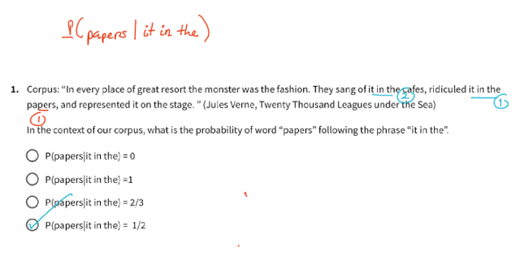</kbd>

<kbd></kbd>

<kbd>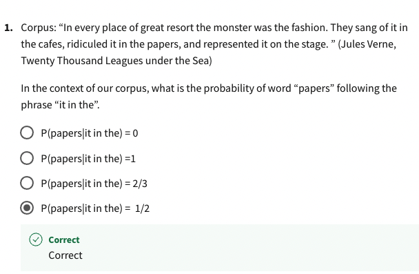</kbd>

 

<kbd>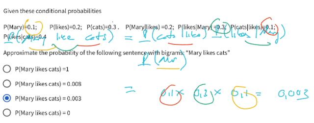</kbd>

<kbd></kbd>

<kbd>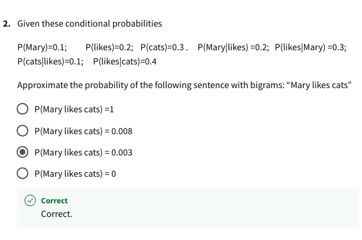</kbd>

 

<kbd>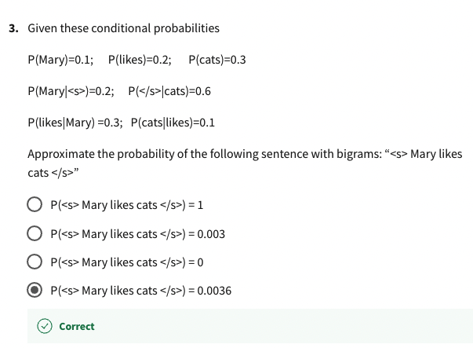</kbd>

 

<kbd>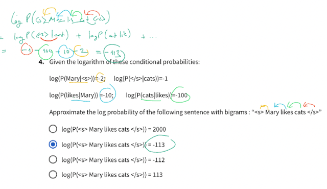</kbd>

<kbd></kbd>

<kbd>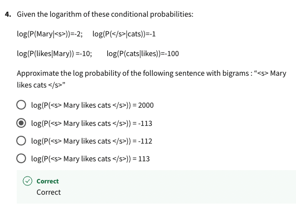</kbd>

 

<kbd>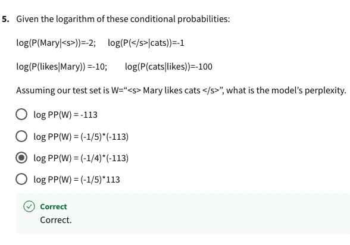</kbd>

 

<kbd>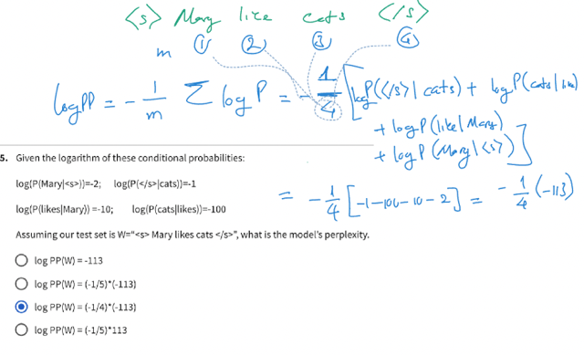</kbd>

 

<kbd>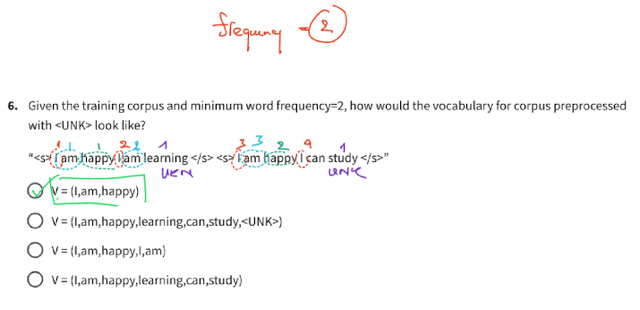</kbd>

<kbd></kbd>

<kbd>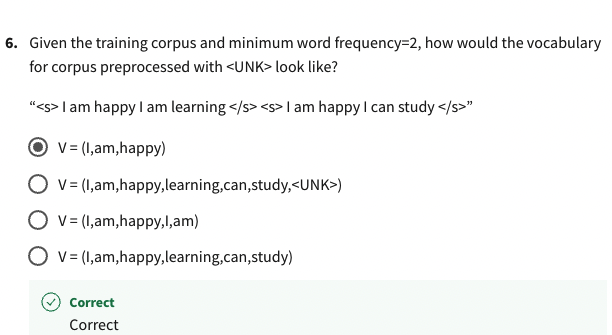</kbd>

 

<kbd>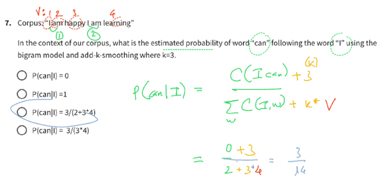</kbd>

<kbd></kbd>

<kbd>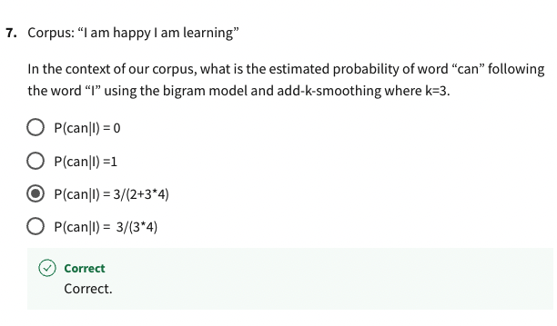</kbd>

 

<kbd>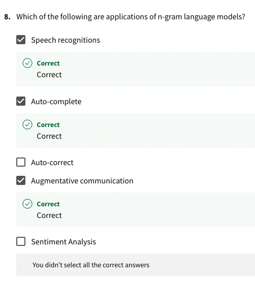</kbd>

 

<kbd>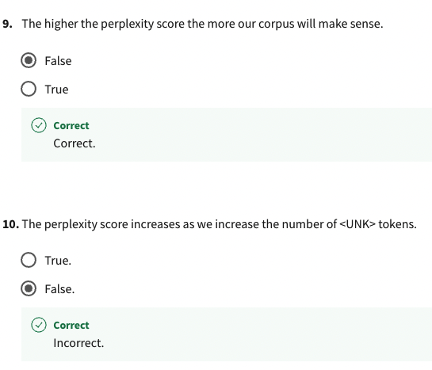</kbd>

 

## Programming Assignment:

> [!NOTE]
> PROGRAMMING ASSIGNMENT:
> LANGUAGE MODELS: AUTO-COMPLETE

 

### In this assignment, you will build an \\*auto-complete system\\*.

> [!NOTE]
> In this assignment, you will build an \**auto-complete system\**.
> Auto-complete system is  something you may see every day
>
> • When you google something, you often have \**suggestions\** to help
> you complete  your search.
>
> • When you are \**writing an email\**, you get suggestions telling you
> possible  endings to your sentence.
>
> By the end of this assignment, you will develop a \**prototype of such
> a system.\**

<kbd></kbd>

 

- 1 - Load and Preprocess Data
   

    
    
<kbd>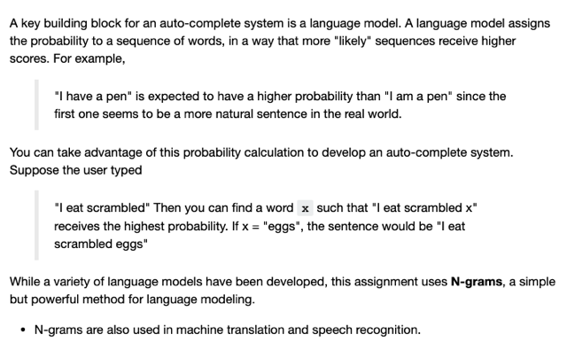</kbd>

    > Đại khái nói chìa khoá của một **auto-complete system** là một
    > **language model**. Nó sẽ assign **probability cho một câu** sao
    > cho **câu nào giống thật hơn**, thì sẽ có **probability cao hơn**. Và
    > có nhiều language model trong đó **N-gram** là một loại **đơn
    > giản và mạnh mẽ**.

     

  
  - Here are the steps of this assignment:  1 \\*Load and preprocess data\\*  • \\*Load\\* and \\*tokenize data.\\*  • \\*Split the sentences\\* into \\*train\\* and \\*test\\* sets.  • \\*Replace words\\* with a \\*low frequency\\* by an unknown marker <\\*unk\\*>.   2 Develop \\*N-gram\\* based language models  • Compute the \\*count\\* of\\* n-grams\\* from a given data set.  • Estimate the \\*conditional probability\\* of a \\*next word\\* with \\*k-smoothing\\*.  3 \\*Evaluate the N-gram models\\* by computing the \\*perplexity score\\*.  4 \\*Use your own model\\* to suggest an \\*upcoming word\\* given your sentence.
     

    
    - import \\*math\\* import \\*random\\* import \\*numpy\\* as np import \\*pandas\\* as pd import \\*nltk\\* nltk.download('\\*punkt\\*')  import \\*w3_unittest\\* nltk.data.path.append('.')
       

- 1.1 - Load the Data
   

  
  - You will use \\*twitter\\* data. Load the data and view the first few sentences by running the next cell.  Notice that data is a \\*long string\\* that contains many many \\*tweets\\*. Observe that there is a \\*line break "\\\ "\\* between tweets.
    > Dùng bộ Twitter data, load và xem thử
    > vài cái. Để ý nó là chuỗi liên tục các
    > tweets có \n ở cuối tweet

     

    
    - \\*with open\\*(".\\*/data/en_US.twitter.txt\\*", "r") as \\*f\\*:     data = \\*f.read()\\* print("Data type:", \\*type(data)\\*) print("Number of letters:", \\*len(data)\\*) print("First 300 letters of the data") print("-------") display(data[\\*0:300\\*]) print("-------")  print("Last 300 letters of the data") print("-------") display(data[\\*-300:\\*]) print("-------")
      > Cái này mới biết: access
      > 300 cái cuối : [-300:]

       

        
        
<kbd>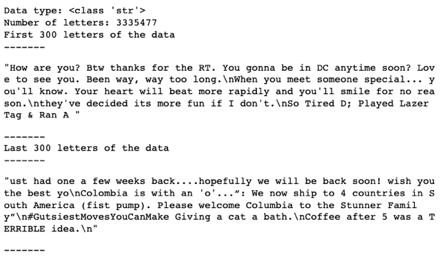</kbd>

         

- 1.2 - Pre-process the Data
   

  
  - Preprocess this data with the following steps:   1 \\*Split data into sentences\\* using \\*"\\\ "\\* as the \\*delimiter\\*.   2 \\*Split each sentence\\* into \\*tokens\\*. Note that in this assignment we use \\*"token"\\*  and "\\*words"\\* \\*interchangeably\\*.   3 \\*Assign\\* sentences into \\*train\\* or \\*test\\* sets.   4 \\*Find tokens\\* that \\*appear\\* \\*at least N times\\* in the training data.   5 \\*Replace tokens\\* that appear \\*less than N times\\* by \\*<unk>\\*  Note: we \\*omit validation data\\* in this exercise.  • In \\*real applications, \\*we should \\*hold a part of data\\* as a \\*validation set\\* and use it  to \\*tune our training.\\*  • We s\\*kip this process for simplicity.\\*
    > Thì đại khái các bước preprocess data sẽ là
    >
    > 1. Split data thành câu bởi '\n'
    >
    > 2. Split câu thành các từ hay gọi là token.
    >
    > 3. Chia ra thành train/test sét.
    >
    > 4.Đếm, token nào xuất hiện nhỏ hơn N lần thì assign <ukn>.

     

- Exercise 1- split_to_sentences (UNQ_C1)
   

    
    
<kbd>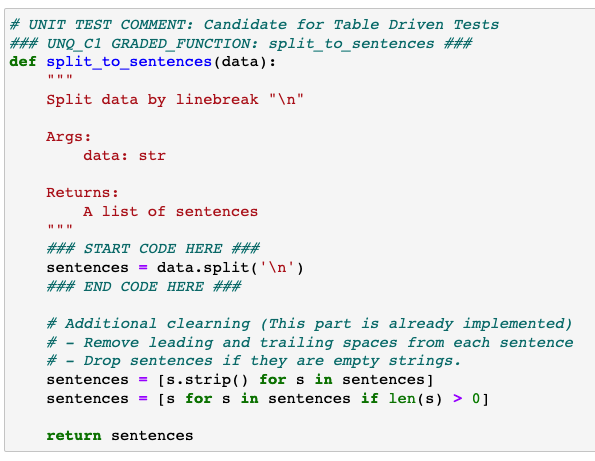</kbd>

    > Đơn giản chỉ dùng split() với delimiter là '\n' thôi. Biết
    > thêm cái strip() giúp remove leading và trailing
    > space. Thêm một nhận xét nữa đúng là python list
    > comprehension rất tiện lợi.

     

    
    
<kbd>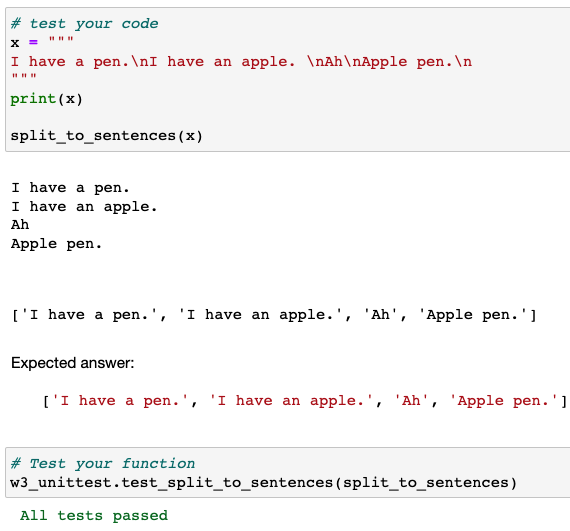</kbd>

     

- Exercise 2 - tokenize_sentences (UNQ_C2)
   

  
  - The next step is to \\*tokenize\\* sentences (\\*split\\* a sentence into a \\*list of words\\*).  • \\*Convert all tokens\\* into \\*lower case\\* so that words which are capitalized (for example, at the start of a sentence) in the original text are treated the same as the lowercase versions of the words.  • Append each tokenized list of words into a\\* list of tokenized sentences.\\*
    > Đại khái tiếp là tokenize - tách câu thành
    > từng từ đơn và lowercase, bỏ các
    > punctuation..nên dùng nltk để giúp tokenize
    >
    > Mỗi câu thành 1 list token (gọi là tokenized) sentence, bỏ vào 1 list
    > (Thành ra list các list)

     

    
    - \\*Hints\\*  • Use \\_str.lower\\_ to convert strings to lowercase.  • Please use \\_nltk. word_tokenize\\_ to split sentences into tokens.  \\/https://www.nltk.org/api/nltk.tokenize.html#nltk.tokenize.punkt. PunktLanguageVars.word_tokenize\\/  • If you used str.split instead of nltk.word_tokenize, there are additional edge  cases to handle, such as the \\*punctuation\\* (comma, period) that follows a word.
       

        
        
<kbd>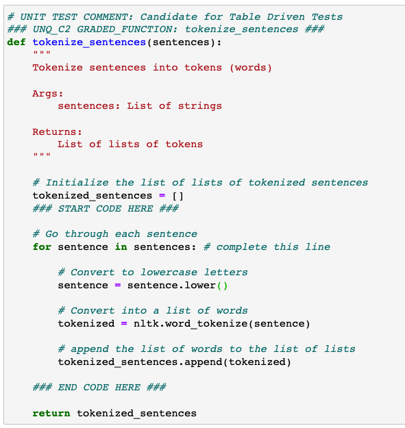</kbd>

         

        
        
<kbd>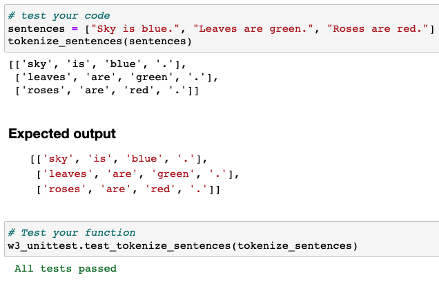</kbd>

         

- Exercise 3 - get_tokenized_data (UNQ_C3)
   

  
  - Use the two functions that you have just implemented  to \\*get the tokenized data.\\*   • \\*split the data into sentences\\*  • \\*tokenize those sentences\\*
     

      
      
<kbd>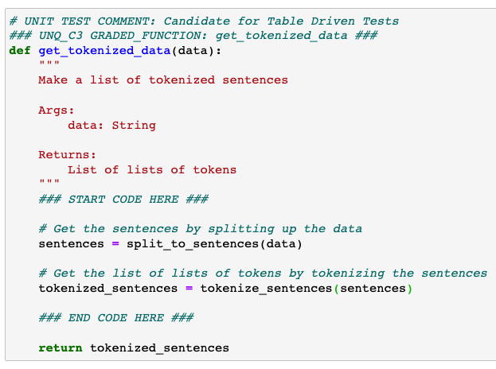</kbd>

      > Define function dùng 2 function
      > trên để nhận text, ta sẽ split ra
      > thành câu và tokenize

       

      
      
<kbd>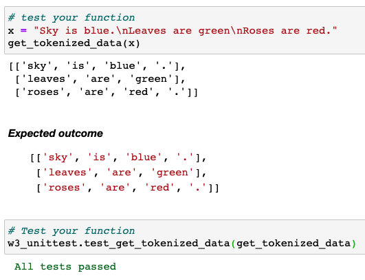</kbd>

       

- Split to train/test
   

    
    
<kbd>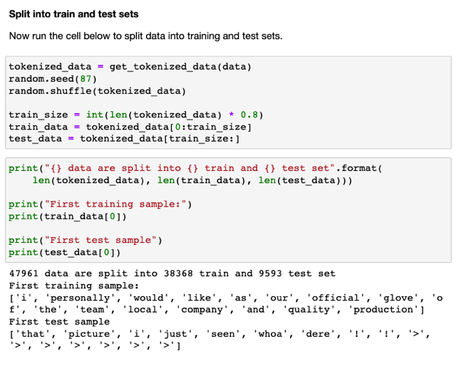</kbd>

    > Cũng đơn giản, dùng function trên để split và tokenize, xong  là
    > shuffle lên rồi chia theo tỉ lệ 8/2. Cách làm quen thuộc tính ra index
    > (len() * 0.8) rồi lấy [0:index] = từ đầu đến index và [index:] = từ index
    > tới hết

     

- Exercise 4 - count_words (UNQ_C4)
   

  
  - You \\*won't use all the tokens\\* (words) appearing in the data for training. Instead, you will  use the \\*more frequently used words\\*.  • You will focus on the words that appear \\*at least N times in the data.\\*  • First \\*count how many times each word appears\\* in the data.  You will need a \\*double for-loop,\\* one for \\*sentences\\* and the other for \\*tokens within a  sentence\\*.  \\*Hints\\*   • If you decide to import and use \\*defaultdict\\*, remember to \\*cast the dictionary  back to a regular 'dict'\\* before \\*returning\\* it.
    > Đại khái bước tiếp theo ta sẽ 'đếm' xem mỗi token
    > xuất hiện bao nhiêu lần trong corpus để tí nữa chỉ
    > lấy những token nào xuất hiện ít nhất N lần thôi,
    > còn lại gán thành <unk>

     

      
      
<kbd>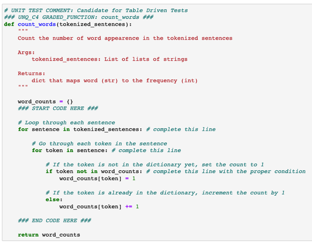</kbd>

      > với function này, ta bỏ bộ tokenized sentences vào, loop trong
      > các tokenized sentence (là list các token), loop trong các
      > token của từng sentences. Và check nếu chưa có trong dict
      > thì set = 1, có thì tăng lên 1.
      >
      > Kết quả ta sẽ có 1 dict: token - count of token.

       

      
      
<kbd>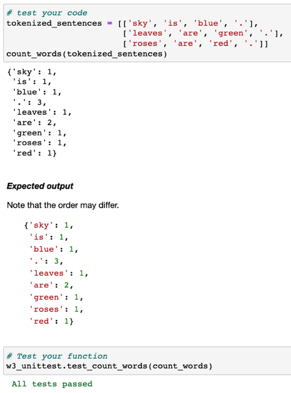</kbd>

       

- Handling 'Out of Vocabulary' words
   

  
  - If your model is \\*performing autocomplete\\*, but encounters a word that it \\*never saw\\* during  training, it won't have an input word to help it determine the next word to suggest. The  model will not be able to predict the next word because there are no counts for the  current word.   • This 'new' word is called an 'unknown word', or \\*out of vocabulary  (OOV)\\* words.   • The percentage of unknown words in the test set is called the \\*OOV \\*rate.  To handle unknown words during prediction, use a special token to represent all unknown  words 'unk'.   • \\*Modify the training data\\* so that it\\* has some 'unknown' words to train on.\\*   • Words to convert into "unknown" words are those that \\*do not occur very  frequently\\* in the training set.   • Create a list of the most frequent words in the training set, called the \\*closed  vocabulary \\*.   • Convert all the other words that are not part of the closed vocabulary to the  token 'unk'.
     

- Exercise 5 - get_words_with_nplus_frequency (UNQ_C5)
   

  
  - You will now create a \\*function\\* that takes in a \\*text document\\* and a  threshold \\*count_threshold\\*.   • Any word whose \\*count is greater than or equal\\* to the  threshold \\*count_threshold\\* is kept in the \\*closed vocabulary\\*.   • Returns the word closed vocabulary list.
    > Đại khái là viết function lấy count của các token và so
    > sánh với một threshold để nếu nó lớn hơn hoặc bằng thì
    > cho vào một 'closed vocab list'

     

      
      
<kbd>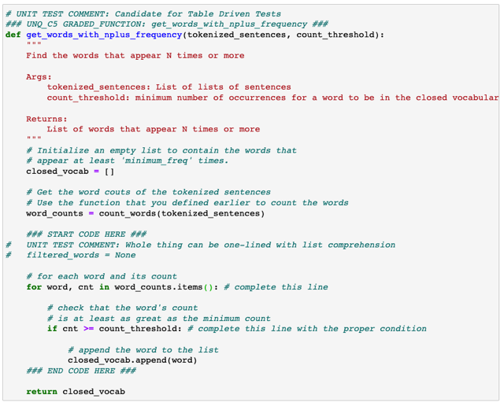</kbd>

      > Có thể làm 1 line với list comprehension:
      >
      > closed_vocab = [word for word, cnt in word_counts.items() if cnt >= count_threshold]

       

      
      
<kbd>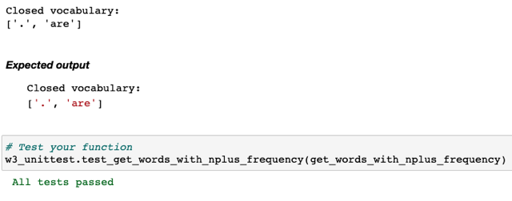</kbd>

       

- Exercise 6 - replace_oov_words_by_unk (UNQ_C6)
   

  
  - The words that appear \\*count_threshold\\* times or more are in the closed vocabulary.  • All other words are regarded as \\*unknown\\*.  • \\*Replace words\\* not in the closed vocabulary with the token \\*<unk>\\*.
     

      
      
<kbd>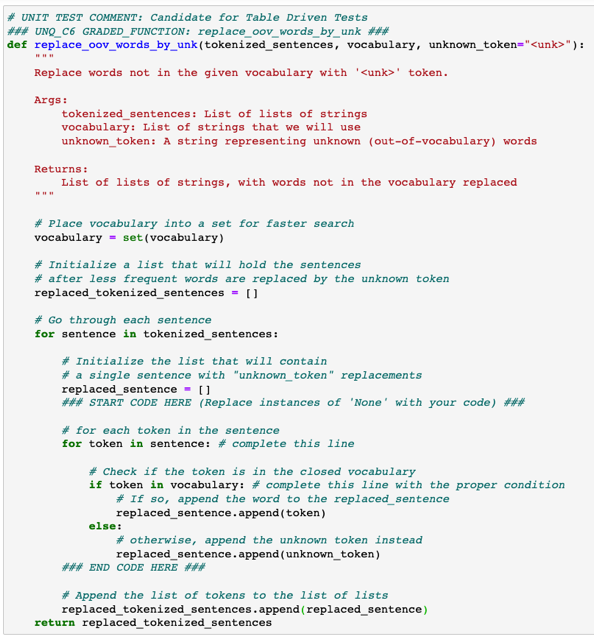</kbd>

      > Viết một function nhận tokenized sentences, và vocabulary, và một unknow_token,
      > ta sẽ
      >
      > loop các sentence,
      >
      > với mỗi sentence tạo một replaced sentence
      >
      > loop trong các token của sentence đó,
      >
      > Check nếu token có trong vocabulary thì append vào replaced_sentence
      >
      > Không thì append <unk>
      >
      > Kết quả ta có replaced tokenized sentences - cũng là 1 list các list
      > các token nhưng cái nào xuất hiện ít trong corpus ban đầu đều bị
      > thay bằng <unk>

       

      
      
<kbd>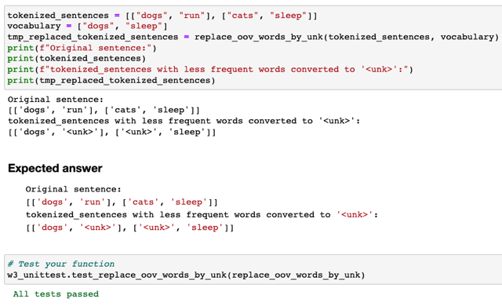</kbd>

       

- Exercise 7 - preprocess_data (UNQ_C7)
   

  
  - Now we are ready to \\*process our data\\* by combining the functions that you just  implemented.  1\\* Find tokens that appear at least count_threshold\\* times in the training data.  2 \\*Replace tokens\\* that appear \\*less than count_threshold\\* times by " <\\*unk\\*>" both  for training and test data.
    > Tổng hợp các function ở trên, viết một function process bộ
    > train / test để trả ra vocabulary list, và bộ train / test đã thay
    > từ không đạt frequency bằng <unk>

     

      
      
<kbd>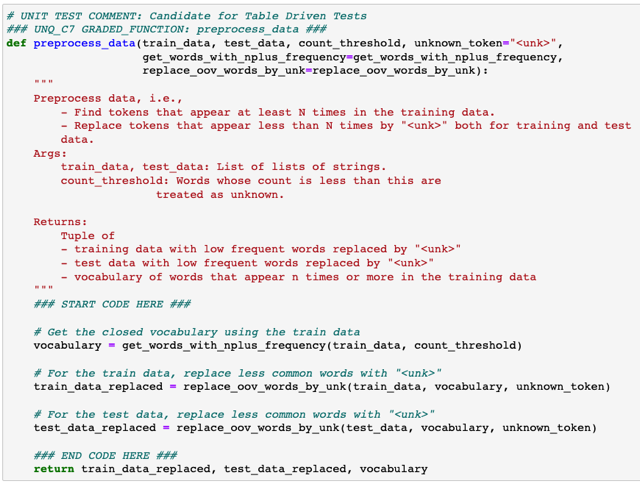</kbd>

       

      
      
<kbd>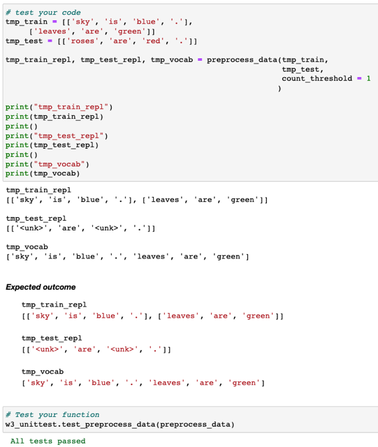</kbd>

       

- 2 - Develop n-gram based Language Models
   

- Exercise 8 - count_n_grams (UNQ_C8)
   

    
    
<kbd></kbd>

    > Hoặc CHẤP NHẬN RẰNG KHÔNG QUAN TRỌNG TIỂU TIẾT
    >
    > Gọi là N-gram là 1 từ phụ thuộc vào n từ cuối hay n-1 từ cuối thì
    > ý nghĩa chính vẫn xác suất của một từ tiếp trong chuỗi sẽ tính bằng
    > | sẽ chỉ phụ thuộc vào vài từ ở cuối. 
    >
    > Và theo P/A thì dự đoán từ tiếp theo sẽ phụ thuộc vào n từ cuối.
    >
    > ĐÓ CHỈ HIỂU ĐẠI Ý RẰNG:
    >
    > XÁC XUẤT CỦA TỪ THEO SAU MỘT CHUỖI
    >
    > SẼ ĐƯỢC THAY BẰNG / TÍNH GẦN BẰNG
    >
    > XÁC SUẤT CỦA VÀI TỪ CUỐI TRONG CHUỖI DẪN ĐẾN TỪ
    > ĐÓ.
    >
    > (VÀI TỪ CUỐI Ở ĐÂY CÓ THỂ N HOẶC N-1, KHÔNG QUAN TRỌNG) 
    >
    > Và xác suất của (việc) một từ nào đó theo sau một chuỗi đồng khái
    > niệm với xác suất của việc một từ nào đó là từ kế tiếp của chuỗi / câu
    > (Chính là cái ổng nói "probability of the next word)
    >
    > Chấp nhận như vậy thì ok ta có thể hiểu câu này:
    >
    >  • Assume the probability of the next word depends only on the previous n-gram.
    >  • The previous n-gram is the series of the previous 'n' words.

    > Xác suất của việc "chuỗi các từ dẫn đến một từ w nào đó"  = "xác suất xuất hiện
    > của w là từ tiếp theo của chuỗi" sẽ chỉ bằng xác suất của việc "n từ cuối dẫn đến
    > w" P(w| sub-chuỗi n từ cuối trong chuỗi).
    >
    > Như vậy có nghĩa là nó chỉ phụ thuộc vào **n từ cuối là gì** thôi, vì n từ cuối là gì
    > sẽ quyết định w nào có xác suất cao nhất.  Mà n từ cuối chính là previous
    > n-gram của cái từ đang nói đến w - cái từ đang dự đoán, đang tìm.
    >
    > Cho nên có thể hiểu câu này.
    >
    > "Assume the probability of the next word depends only on previous **N-gram"**

    > Tóm lại là trong P.A này, khi nói n-gram, thì tức là 
    > Ta sẽ tính p của một từ w sau một chuỗi sẽ dựa trên | thay bằng | tính
    > gần đúng bằng p của n từ cuối của chuỗi đó dẫn tới w.
    >
    > Gọi w là từ đứng thứ t trong cái chuỗi lớn đi (chuỗi nhỏ là n từ cuối)
    > thì p sẽ tính bằng P(wt | wt-n wt-n+1 ...wt-1)
    > dịch ra tiếng kinh là: Xác suất của việc từ wt xuất hiện sau khi
    > chuỗi n từ (wt-n wt-n+1 ...wt-1) đã xuất hiện.
    >
    > Công thức thì dễ hiểu rồi, lấy tử số là số lần chuỗi n từ 
    > (wt-n wt-n+1 ...wt-1) + wt xuất hiện - Và nó là một (n+1)-gram
    > Chia cho mẫu số là  số lần chuỗi n từ (wt-n wt-n+1 ...wt-1) xuất hiện.
    >
    > Add k-smoothing, thì cũng dễ tử số cộng thêm cho k,
    > Mẫu thì cộng thêm cho k*V với V là số từ trong câu.
    >
    > Nói chung cái N-gram model dễ hiểu, chỉ là lằng nhằng lúc thì ổng 
    > nói n-gram là cho phép tính gần đúng của p w | 1 chuỗi thay bằng
    > P (w | n từ cuối của chuỗi) hay P (w | n - 1 từ cuối của chuỗi) 
    >
    > **Nhưng thôi cứ theo PA là n từ cuối - n-gram, với từ đang 'tính' nữa
    > thì thành (n+1)-gram**

     

    
    
<kbd>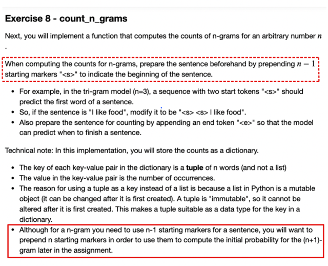</kbd>

    > Một lần nữa, rất dễ gây confuse, nhưng cứ bỏ qua những chỗ có vẻ
    > conflict như thế này có thể sau này quay lại thấy không khó hiểu nữa.
    > Hiện giờ cứ 'KIỂU NHƯ TÂM NIỆM RẰNG' lúc tính ta sẽ theo cách
    > hiểu là: Nói n-gram thì n ở đây là
    >
    > Ta sẽ tính p của một từ w sau một chuỗi sẽ dựa trên | thay bằng | tính
    > gần đúng bằng p của n từ cuối của chuỗi đó dẫn tới w.

     

    
    
<kbd>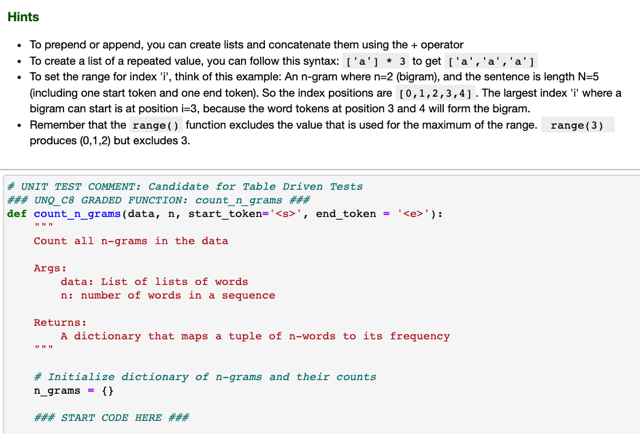</kbd>

    > Ok, next, thì đại khái đầu tiên ta sẽ chuẩn bị một function có
    > nhiệm vụ là: Cho vào một list các list từ trong một câu. tức là
    > ở các phần preprocessing ở trên, ta đã split, tokenize bộ text
    > corpus để giờ đây ra có 1 list, mỗi item là 1 list nữa chứa các
    > từ trong 1 câu.
    >
    > Thì nhiệm vụ của function tạo ra 1 dictionary, với key là các 
    > n-gram ở trong bộ data input này, còn value là số lần n-gram đó
    > xuất hiện (nói chung là đếm)
    >
    > Thì cơ bản cách làm sẽ là,
    >
    > Loop trong các câu (cái list lớn)
    >
    > tại mỗi câu (dạng list các từ, loop trong các từ đó:
    >
    > Cái khó ở đây là xác định các chỉ số index sao cho lấy 
    > ra được các n-gram.
    >
    > Sau đó update vào dict (initialize) ở đầu vậy thôi.

     

    
    
<kbd>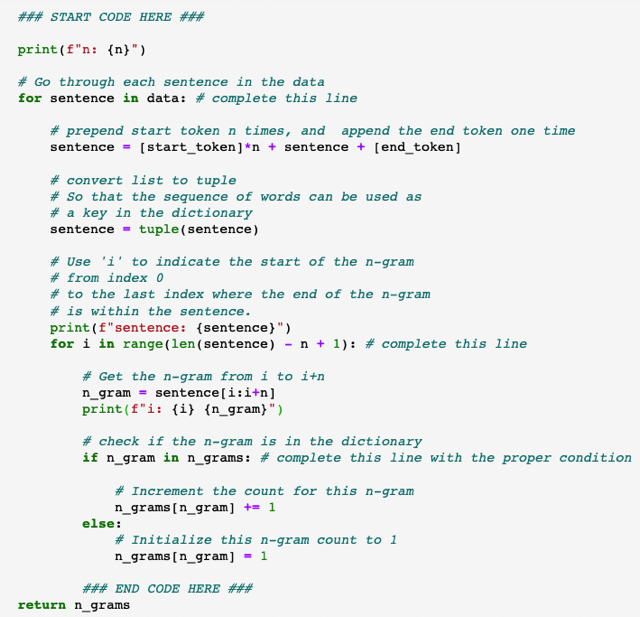</kbd>

     

    
    
<kbd>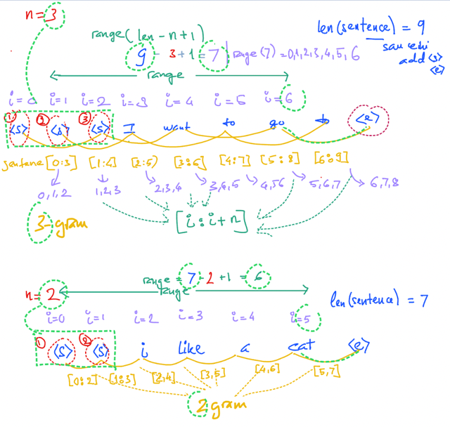</kbd>

    > Cái chính cần nhớ:
    >
    > Luôn tâm niệm là ở đây, P.A này khi ổng nói n-gram chính là nói dùng n-gram
    > từ này để predict từ sau. Nên khi thêm <s> là thêm n cái chứ không phải như
    > trong lý thuyết nói n-1 Cái này không nhắc đi nhắc lại thì sau khi ôn lại sẽ rất
    > lúng túng.
    >
    > Trong lecture lý thuyết thì nói n-gram là dùng n-1 từ trước predict từ sau, (để
    > thành ra **hiểu n-gram là là n-1 từ trước + 1 từ sau**). Nhưng ở đây thì là dùng
    > n từ trước (n-gram) để predict từ sau (tức là **hiểu n-gram là chỉ n từ trước
    > thôi**)
    >
    > Với việc hiểu như vậy rồi thì ra add n*<s> vào đầu câu, cuối câu thì chỉ
    > một <e> thì không có gì phải thắc mắc rồi.
    > Và 2 điểm chính để làm đúng đó là:
    >
    > Range của i trong loop của mỗi câu. thì ta phải cho i chạy làm sao mà
    > khi lấy n-gram nó không bị lọt ra ngoài. 
    > Thì ví dụ câu dài 5 (I want to go to), n-gram = 3 gram, thì sau khi add 3 <s> và 1 <e>
    > i sẽ chạy từ 0,1,...
    > và lấy n-gram sẽ là [i:i+n] ví dụ [0, 0+3] = [0,3] thì nó sẽ lấy index 0,1,2
    > vì Python nó exclude cái cuối (trong hint có note cho ta cái này)
    >
    > Vậy thì i chạy i_final đến đâu, từ đó, để [i_final : i_final+n] nó ra cái n-gram cuối. 
    > Ta tính mò cũng được nhưng có thể tính như vậy nè:
    >
    > với n_gram cuối lấy ra bởi sentence[i_final : i_final+n] thì cái từ cuối
    > của n-gram này sẽ có index là **i_final+n - 1** (giống như sentence[0:3]
    > thì nó sẽ lấy 3 từ có index là 0,1,2 vậy)
    >
    > và vì n-gram cuối nên từ cuối của nó cũng là từ cuối của câu - là cái <e>. Và index 
    > của <e> là **len-1** = 9-1 = 8. (Câu dài 4 thì index cuối là 3)
    > Vậy i**_final+n - 1** phải = **len-1** suy ra **i_final = len - n**. (ví dụ ở đây = 9 -3 = 6)
    >
    > Vậy i chạy từ 0 đến **len - n** thì define là **..i in range (len - n + 1)**  | 
    > Again, phải + 1 vì Python thì thằng i cuối mới là len - n
    > nó exclude thằng cuối của range
    >
    > Tóm lại mấu chốt là hiểu n-gram
    > và cách lấy n-gram sentence[i:i+n] và range của i sẽ là len - n + 1

    > Kết quả, là ta có một function đưa vào bộ các
    > sentences, mỗi sentences đã split thành các từ
    > thì function này giúp tạo ra bộ dictionary đếm
    > các n-gram trong đó

     

    
    
<kbd>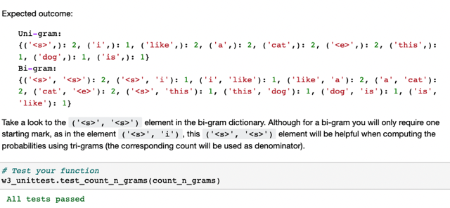</kbd>

     

- Exercise 9 - estimate_probability (UNQ_C9)
   

    
    
<kbd>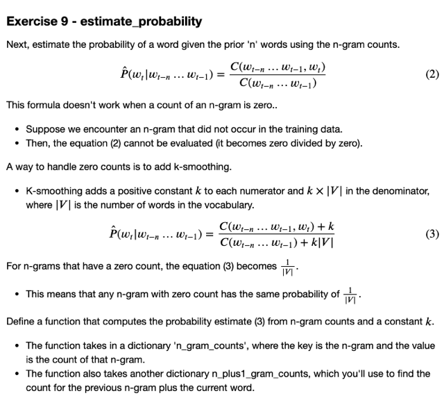</kbd>

     

    
    
<kbd>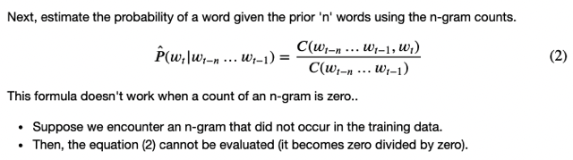</kbd>

    > Đoạn này nhắc lại công thức tính P của wt xuất hiện sau chuỗi hay
    > gọi là sau n-gram wt-n,...wt-2 wt-1 sẽ tính bằng cách:
    >
    > chia tử số là số lần xuất hiện của n-gram (wt-n,...wt-2 wt-1) + wt
    >
    > cho mẫu số là số lần xuất hiện của n-gram (wt-n,...wt-2 wt-1)
    >
    > Tiếp theo nhắc đến việc nếu cái chuỗi / cái n-gram (wt-n,...wt-2 wt-1)
    > này không có / xuất hiện trong corpus / training data thì mẫu sẽ = 0
    > và sẽ không thể tính được P

     

    
    
<kbd>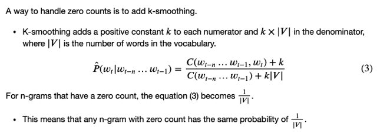</kbd>

    > Do đó nhắc lại vai trò của k-smoothing, 
    > Ta sẽ cộng k vào tử và k*V cho mẫu số. với V là số từ trong vocab
    >
    > Với k-smoothing thì nếu n-gram nào không có trong training thì 
    > probability mà một từ nào đó xuất hiện sau nó sẽ đều bằng 1/|V|

     

    
    
<kbd>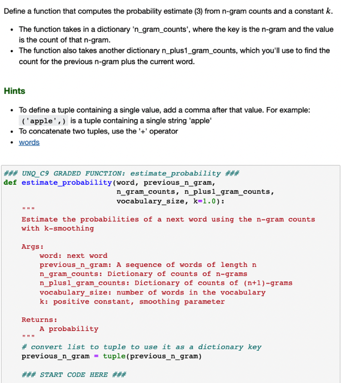</kbd>

    > Bây giờ ta sẽ chuẩn bị một function nhận:
    >
    > - một từ - word,
    >
    > - môt n-gram trước từ đó - previous_n_gram,
    >
    > - cái dictionary n_gram để 'tra cứu' xem một n-gram nào đó có
    > mấy lần xuất hiện,
    >
    > - và một dictionary khác để "tra cứu" xem một cái n+1_gram
    > nào đó xuất hiện mấy lần, và..
    > ***Cái dict này tạm thời đừng quan tâm ở đâu ra.**
    >
    > - tham số k và vocab size để tính k-smoothing.
    >
    > Nhiệm vụ là áp dụng công thức để tính P(word | previous_n_gram).

     

    
    
<kbd>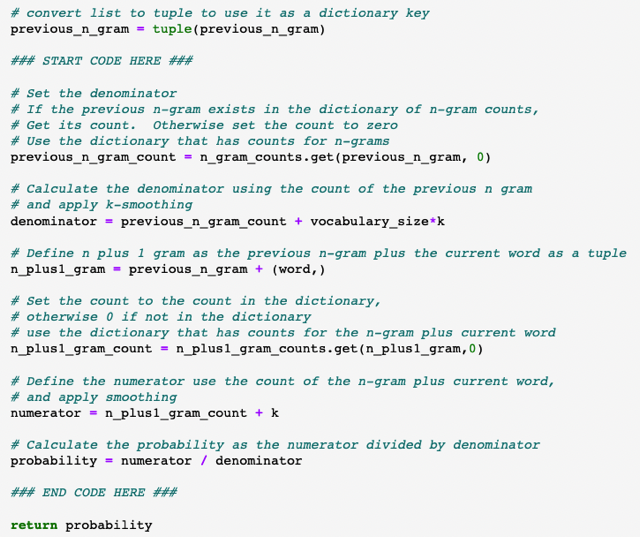</kbd>

    > Với define các argument rõ ràng vậy rồi thì function này không có gì
    > khó, chỉ việc dùng hai cái dictionary, bỏ vào đó cái previous_n_gram để
    > tính Mẫu số (cộng k-smoothing term - k*V)
    >
    > Tử số thì  đầu tiên tạo cái tuple để gắn previous_n_gram với cái word.
    > Cách tạo 1 tuple mới từ 1 tuple và 1 từ có gợi ý trong hint cũng  như
    > trong lab bữa trước cũng làm thử rồi. Đó là biến từ thành tuple trước
    > bằng (word,) rồi dùng '+' để concatenate với cái previous_n_gram  Thôi.
    >
    > Sau đó dùng cái dictionary n_plus1_gram để tra xem nó xuất hiện mấy
    > lần và + k (k-smoothing)
    >
    > Cuối cùng lấy tử chia mẫu thôi.
    >
    > Ở đây ôn lại việc access một dictionary trong python bằng cách Dùng .
    > get( a key, default value). Cho default value = 0, nếu dùng cách access
    > kiểu [key] thì phải check xem key có trong dict không trước.

     

    
    
<kbd>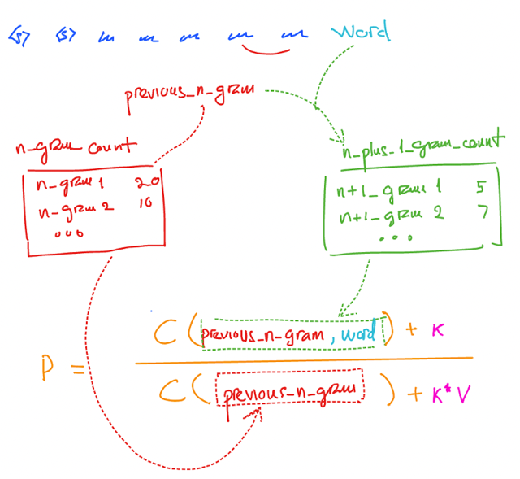</kbd>

     

    
    
<kbd>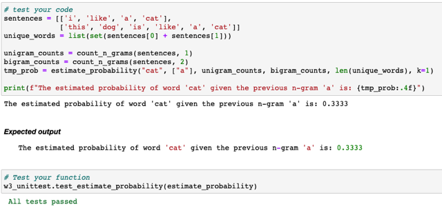</kbd>

     

- Estimate Probabilities For All Words
   

    
    
<kbd>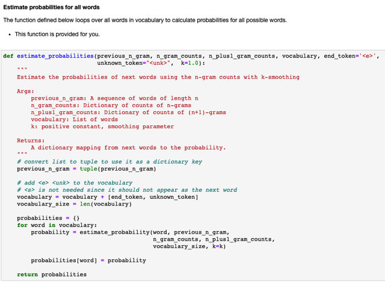</kbd>

    > Thì đại khái là với function estimate_probability ở trên, ta viết thêm một
    > function nữa, nhận một n_gram làm previous_n_gram, cũng lại có 2 cái
    > dictionary n_gram_counts và n_plus_1_counts, vocab và k. Nhiệm vụ
    > là nó sẽ loop qua hết các word trong vocab và áp dụng function
    > estimate_probability để tính P(word|previous_n_gram) và bỏ nó vào
    > một cái dictionary probabilities trả về.
    >
    > Function này người ta làm sẵn, nhưng cũng không có gì khó, chỉ thấy
    > họ thêm end_token và unknown_token vào vocabulary trước,  Sau đó
    > loop trong vocab và apply function estimate_probability  để tính thôi.

     

    
    
<kbd>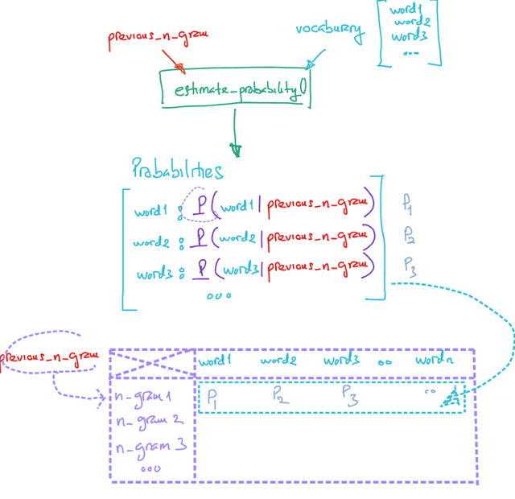</kbd>

    > Thì nhận xét là cái kết quả của function này, sẽ
    > chính là 1 row, trong probability matrix, row ứng với
    > n-gram và column là các word . và gía trị mỗi ô sẽ
    > là P của word | n_gram

     

    
    
<kbd>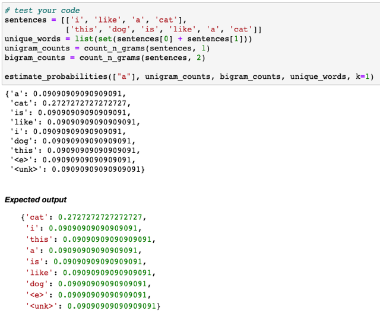</kbd>

     

    
    
<kbd>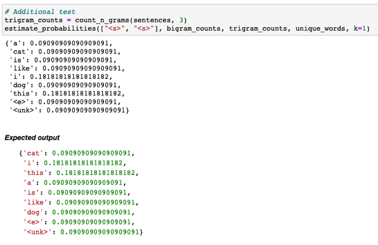</kbd>

     

- Count Matrices
   

    
    
<kbd>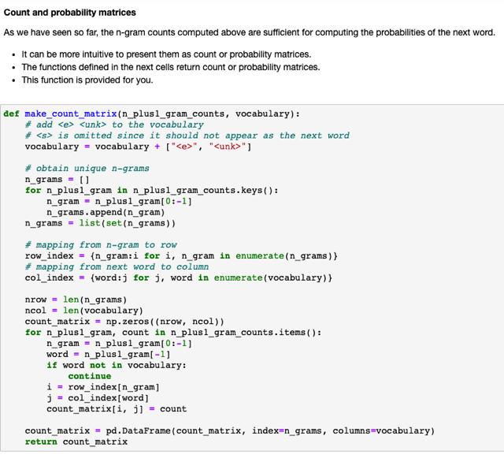</kbd>

    > Đại khái là với cái function ở trên, bỏ vào một n-gram
    > (previous n-gram) là nó tính ra dict các P (từ trong vocab |
    > n_gram) là đủ để thực hiện việc 'predict next word' rồi.
    > Nhưng để tốt hơn cho việc hiểu thì nên tính và in ra cái count
    > matrix và probability matrix

     

    
    
<kbd>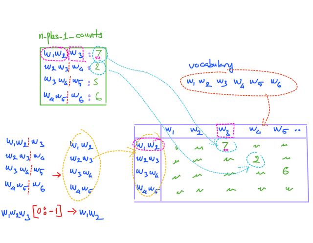</kbd>

    > Function này sẽ nhận cái n_plus_1_gram dict và vocabulary
    >
    > thì đầu tiên là dùng cái n_plus_1_gram để extract ra bộ 
    > các n_gram vì key của nó là 1 bộ các n+1 gram thì chỉ việc
    > Loop trong các key, bỏ cái từ cuối đi là thành ra n_gram thôi.
    >
    > Sau đó dùng nó làm các row, các cột thì là các từ trong vocab.
    > Tạo Pandas.Dataframe

     

    
    
<kbd>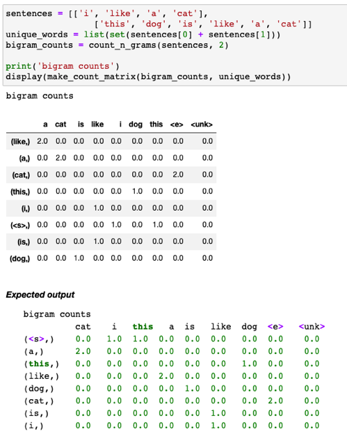</kbd>

     

    
    
<kbd>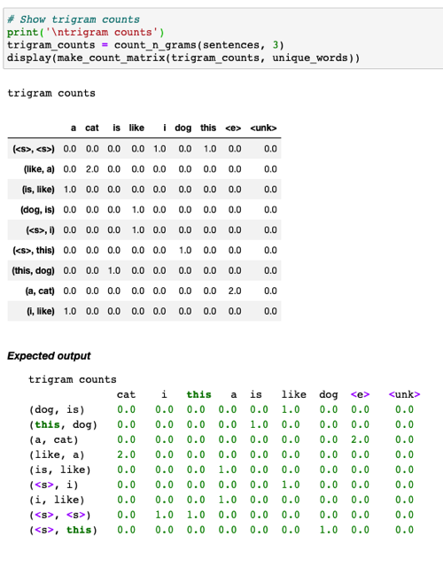</kbd>

     

- Probability Matrices
   

    
    
<kbd>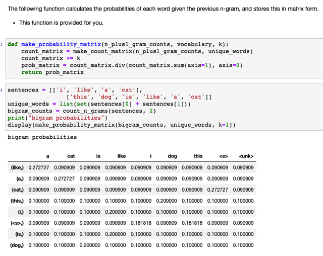</kbd>

    > Xong dùng function tính count matrix đó, viết một function khác để tính
    > P matrix, đơn giản, tính count matrix xong, thì chia nó cho (element
    > wise divide) với sum các hàng. Lí do tại sao chắc không cần ghi ở đây,
    > Nhưng nhắc sơ lại sum mỗi hàng là tổng số lần 1 n-gram xuất hiện với
    > 1 từ bất kì. còn tại mỗi ô là số lần n-gram xuất hiện với từ của đó. Nên
    > phép chia sẽ cho ra P(word trong ô | n-gram hàng tương ứng)

     

    
    
<kbd>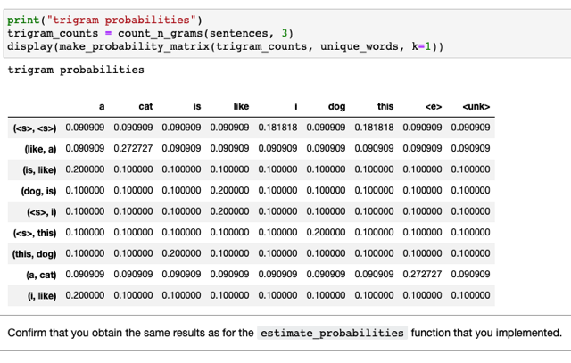</kbd>

     

- 3 - Perplexity
   

    
    
<kbd>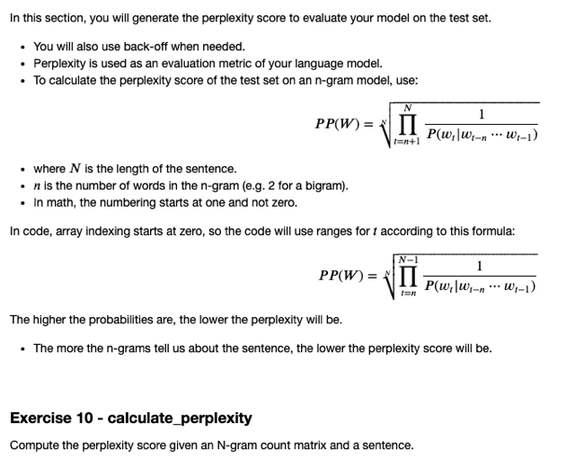</kbd>

     

- Exercise 10 - calculate_perplexity (UNQ_C10)
   

    
    
<kbd>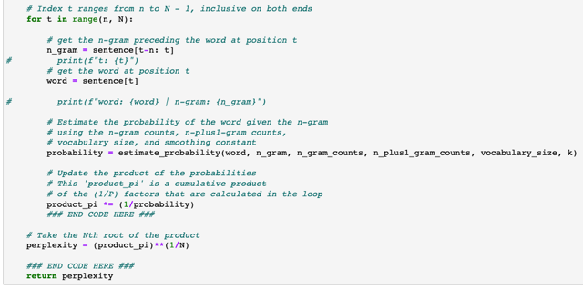</kbd>

    
<kbd></kbd>

    
<kbd>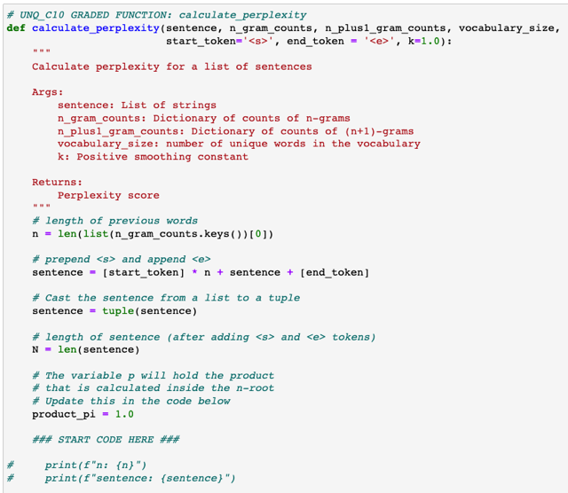</kbd>

     

    
    
<kbd>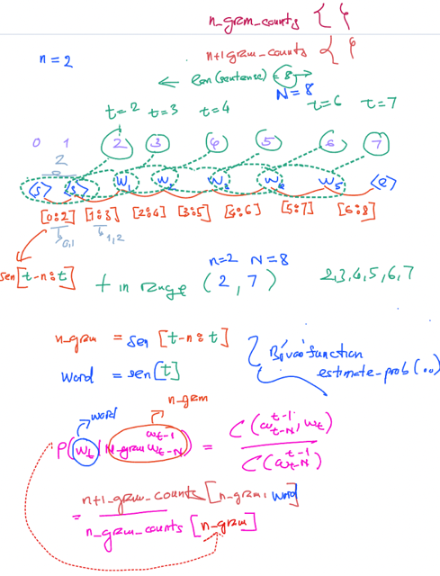</kbd>

    > Viết function bỏ vào một list các từ của MỘT SENTENCE. Cũng với 2 dict
    > n_gram_counts và n_plus_one_count, vocab size, k.
    >
    > Nhiệm vụ là tính ra perplexity score
    >
    > Thì theo định nghĩa, PP của model sẽ là product của các Probability của các câu mà
    > model tạo ra, sau đó lấy căn bậc M.M là chiều dài của câu (đã add các <s>,<e>)
    > nhưng không tính các <s> Hay nói cách khác là số từ trong câu gốc + 1 (<e>)
    >
    > Probability của các câu trước. Bây giờ giả sử có một bộ các câu, có thể chả phải do
    > model nào tạo ra, chỉ là lấy từ corpus thôi. Thì PP thử xem ra bao nhiêu.
    >
    > Thì ta lần lượt loop qua các câu, và tính P các câu, mà theo định nghĩa cũng như áp
    > dụng gần đúng thì bằng product các n-gram probability trong câu đó.

    > Và n-gram probability trong câu tính như thế nào thì đại khái là ta sẽ loop qua các từ
    > word_t  không tính các <s>. **Tại sao ko tính <s> mà có <e>**
    >
    > Khúc này quan trọng, phải hiểu rằng: Kiểu như giả sử ra lệnh cho  model phải tạo ra
    > 1 câu, thì nó sẽ tạo ra từ thứ nhất w1, từ thừ hai w2, từ thứ ba w3, rồi nó stop.
    >
    > Thì có nghĩa là trong quá trình đó nó..
    >
    > - tìm w1 sao cho xác suất P (w1 | chuỗi <s><s> ) cao nhất,
    >
    > - rồi tìm w2 sao cho P (w2 | <s> w1) cao nhất,
    >
    > - rồi tìm w3 sao cho P (w3 | w1 w2) cao nhất,
    >
    > - rồi tìm w4 sao cho P (w4 | w2 w3) cao nhất. Thì ở bước này nó tìm ra w4 là <e>,
    > báo hiệu là stop nên nó stop không generate thêm nữa.
    >
    > Vậy để đánh giá model, ta sẽ đánh giá bằng các xem mấy cái P  ở trên CÓ CAO
    > KHÔNG. NẾU CAO THÌ CHỨNG TỎ MODEL TỐT, SẼ DẪN ĐẾN PP THẤP.
    >
    > Vậy cho nên, khi loop trong các từ để tính P(từ w | ngram trước w) thì **end token
    > cũng là 1 từ mà model nó generate.** Còn <s> dĩ nhiên model nó đâu có generate
    > khoảng trống đầu câu đâu nên không 'tính' nó.
    >
    > Và theo hướng dẫn (place holder) thì ta sẽ loop bằng index t chạy từ index của từ,
    > không phải index i chạy từ 0. Vậy phải xác định t start từ đâu và end ở đâu.
    >
    > Nhìn hình dễ thấy, sau khi add n token <s> thì từ đầu tiên w1 (của câu gốc) sẽ là ở
    > index thứ n (vì n token <s> sẽ có index là 0, 1..n-1, ví dụ n = 2 thì  2 cái token <s> sẽ
    > có index 0,1. Vậy range_start của t là n
    >
    > Còn end của t ở đâu, dễ hiểu là vì có tính cả <e> cuối câu như đã nói ở trên nên end
    > index của t sẽ là len -1  (len là len của sentence có token, là N đó). Vậy để t chạy từ
    > n đến len - 1 thì ta define t in **range (n, len = N)** : again, do python nó exclude
    > thằng cuối trong range.

    > Một cái nữa là với t như vậy thì lấy n_gram trước nó như thế nào thì dễ hiểu là [t-n:t],
    > nhìn hình minh hoạ là thấy. Rồi có từ, có n_gram, bỏ vào function
    > estimate_probability để tính ra P(từ|n_gram) xong "product dồn" vào để khi loop xong
    > ta lấy nó luỹ thừa 1/M là ra PP

    > Chỉ có 1 cái không hiểu là tại sao trong công thức ổng
    > nói lấy M là số từ của câu không tính <s> mà ở đây ổng
    > tính M = N = len của sentence có cả <s> và <e>

     

    
    
<kbd>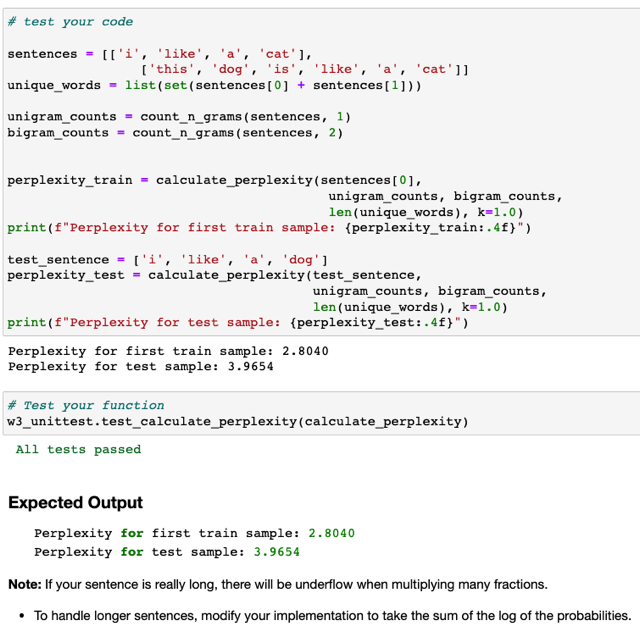</kbd>

     

- 4 - Build an Auto-complete System
   

    
    
<kbd>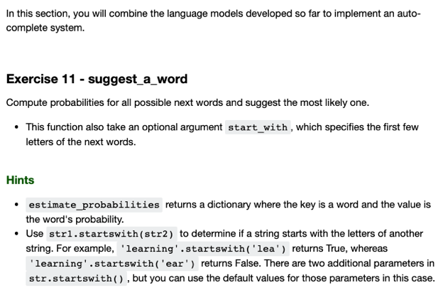</kbd>

     

    
    
<kbd>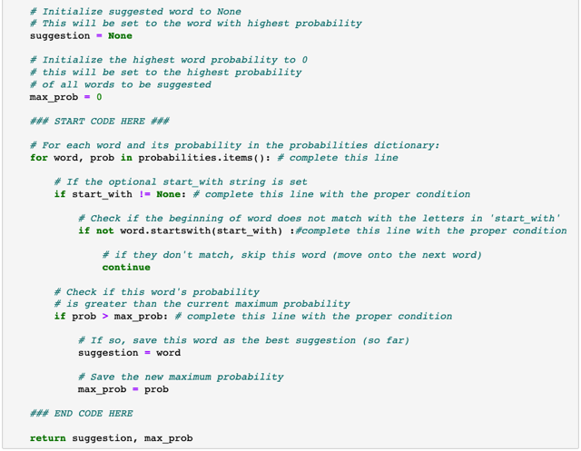</kbd>

    
<kbd></kbd>

    
<kbd>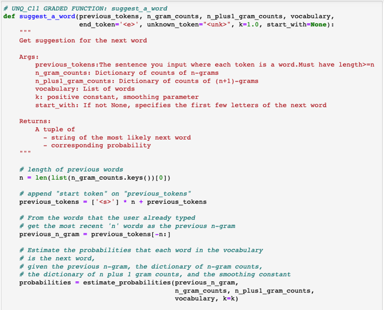</kbd>

    > Cuối cùng là viết function nhận một câu mà người ta đang gõ, tìm ra
    > những từ có xác suất tiếp theo cao nhất dựa trên N-gram model.
    >
    > Cách làm cũng dễ hiểu, là xem trong câu đang gõ - previous_token, lấy
    > ra cái n-gram cuối, cái này thì chỉ đơn giản bằng cách: **[-n]**
    >
    > Kế đến dùng cái n-gram đó tính ra các P(w | n_gram đó) với w là các từ
    > trong vocab.
    >
    > Bước này thì chỉ việc bỏ cái n_gram vào function đã define ở trên
    > **estimate_probabilities**() là nó sẽ trả ra cái **probabilities dict**- với key là từ
    > (ví dụ a), và value là P (a| n_gram). Xong loop trong đó xem thằng nào có
    > P cao nhất để trả về kết quả.

     

- Exercise 11 - suggest_a_word (UNQ_C11)
   

