# C3W1_NEURAL NETWORKS FOR SENTIMENT ANALYSIS Learn about neural networks for \\*deep learning\\*, then build a \\*sophisticated tweet classifier\\*  that \\*places tweets into positive or negative sentiment categories\\*, using a \\*deep neural  network.\\*  Learning Objectives   • \\*Feature extraction \\* • \\*Supervised machine learning\\*  • \\*Binary classification\\*  • \\*Text preprocessing\\*  • \\*ReLU\\*  • \\*Python classes\\*  • \\*Trax\\*  • \\*Neural networks\\*

📊 **Progress:** `72` Notes | `146` Screenshots

---

## Course 3 Introduction

 

### 1 The course is about \\*natural language processing\\* with \\*sequence models.\\*

> [!NOTE]
> 1 The course is about \**natural language processing\** with \**sequence models.\**
>
> 2 The course covers\**various topics\** and applications in NLP.
>
> 3 The first topic is \**sentiment analysis\** using \**deep neural networks\**.
>
> 4 The second topic is \**building a language generator\** using r\**ecurrent neural networks (RNNs)\**.
>
> 5 \**LSTM units\** (Long Short-Term Memory) are applied to \**named entity recognition.\**
>
> 6 \**Siamese networks\** are used to \**identify duplicate questions\** in \**online discussion forums.\**
>
> 7 Learners will develop skills to\**build powerful NLP systems \**for \**solving problems in different
> industries.\**
>
> 8 The instructors for this course are \**Lukasz\** and \**Younes\**.
>
> 9 The course builds on the \**foundational skills learned\** in the previous \**two courses of the
> specialization.\**
>
> 10 Learners will explore \**advanced models\** for \**sentiment analysis\**, \**language modeling\**,
> \**named entity recognition\**, and\**duplicate identification.\**
>
> 11 \**Sentiment analysis\** is a \**challenging problem\** with \**numerous applications.\**
>
> 12 \**Language modeling\** enables solving various problems like \**translation\**, \**autocomplete\**, and
> \**text generation.\**
>
> 13 \**Named entity recognition\** is important for\**extracting specific entities\** from sentences.
>
> 14 \**Identifying duplicates\** is a \**crucial task\** for \**online forums\** and \**search engines\**.
>
> 15 The instructors are excited to guide learners through these applications and \**elevate their
> skills in NLP.\**

 

  
  
<kbd>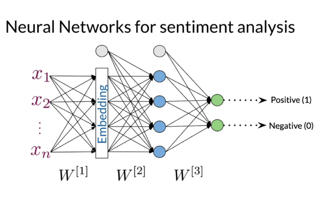</kbd>

   

  
  
<kbd>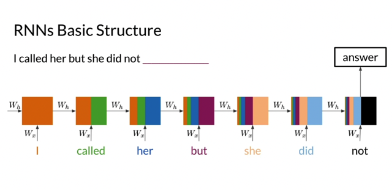</kbd>

   

  
  
<kbd>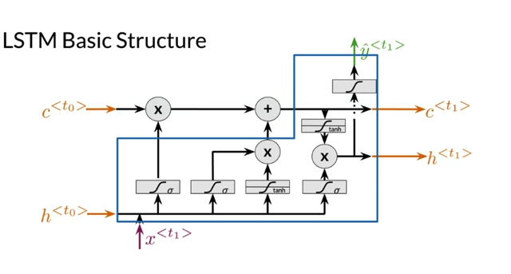</kbd>

   

  
  
<kbd>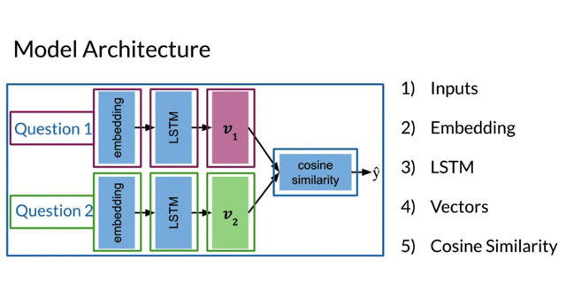</kbd>

   

  
  
<kbd>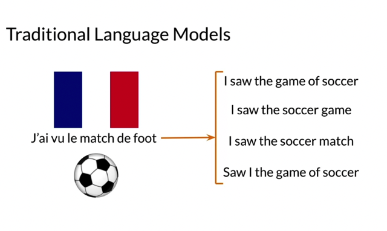</kbd>

   

  
  
<kbd>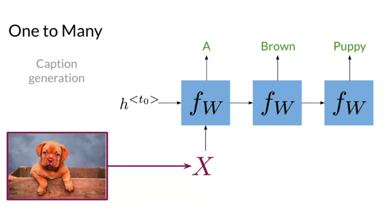</kbd>

   

  
  
<kbd>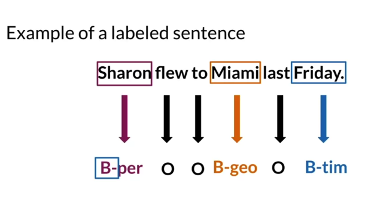</kbd>

   

  
  
<kbd>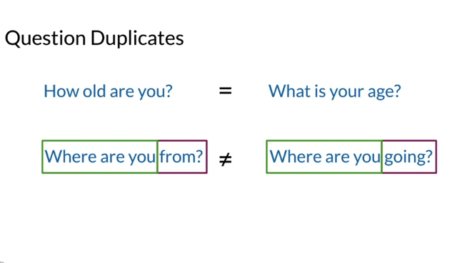</kbd>

   

## Week Intro

 

### 1 This week focuses on using \\*sequence models\\* for \\*natural language processing\\* (NLP).

> [!NOTE]
> 1 This week focuses on using \**sequence models\** for \**natural language processing\** (NLP).
>
> 2 \**Deep neural networks\** are introduced as a \**more advanced approach\** compared to\**logistic
> regression\** and \**naive Bayes models\**.
>
> 3\**Logistic regression\** and \**naive Bayes models\** provide a \**good baseline for sentiment analysis\** but
> may struggle with \**confusing statements\**.
>
> 4 \**Deep neural networks\** can \**learn abstract information\** and \**do not require manual feature
> engineering.\**
>
> 5 The goal of the week is to build and train a \**sophisticated sentiment analysis model\** using \**deep
> neural networks.\**
>
> 6 Jonas will provide the details and guide learners on building their own sentiment analysis model
> using deep nets.
>
> 7 The emphasis is on diving into deep learning models and exploring their capabilities in NLP
> tasks.

 

## Neural Networks For Sentiment Analysis

 

### 1 The focus of this week is on creating \\*neural networks using layers\\*, which \\*simplifies the task.

> [!NOTE]
> 1 The focus of this week is on creating \**neural networks using layers\**, which \**simplifies the task.
> \**
> 2 Neural networks are computational structures that mimic the way the human brain recognizes
> patterns.
>
> 3 They have been effective in various applications of artificial intelligence, including natural
> language processing (NLP).
>
> 4 A simple neural network example is shown with input parameters, hidden layers, and output
> units.
>
> 5 The network \**receives a data representation with n features\**, performs \**computations\** in the
> hidden layers, and delivers an output of size three.
>
> 6 Mathematically, each layer's activation is computed based on the weights matrix and
> activations from the previous layer.
>
> 7 \**Forward propagation\** is the process of moving from the \**left \**of the neural network to the\**right,\**
> c\**omputing activations through successive layers.
> \**
> 8 The goal is to implement a neural network for s\**entiment analysi\**s, where \**tweets are inputted
> as vector representations.\**
>
> 9 The network includes an \**embedding layer\** to \**transform the input representation\**, a \**hidden layer\**
> with a \**ReLU\** activation function, and an \**output layer\** with a \**softmax\** function for sentiment
> probabilities.

 

  
  
<kbd>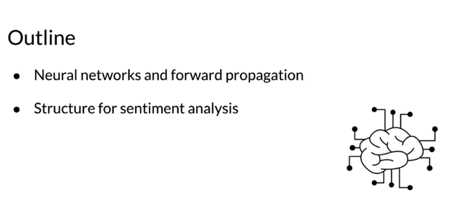</kbd>

   

  
  
<kbd>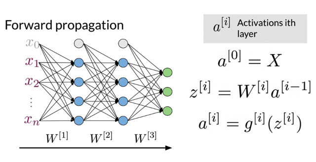</kbd>

> [!NOTE]
> Nhắc lại về kiến trúc của một
> MLP và Forward Prop

   

  
  
<kbd>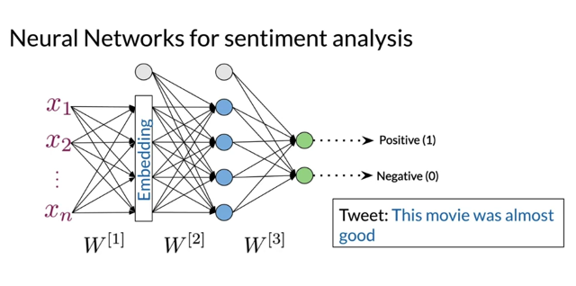</kbd>

> [!NOTE]
> Nói về **structure của N.N sẽ dùng trong bài toán sentiment analysis**.
> Xuất hiện **Embedding layer** và output ra **2 unit mà ổng nói dùng
> softmax** để tính ra p**robability Positive và Negative**. Có thắc mắc là
> **tại sao phải dùng softmax với 2 unit** chẳng phải nó **hoàn toàn
> tương đương với logistic function (sigmoid) sao? Có thể là nếu muốn
> có thể thêm 1 unit nữa với class "Neutral"**

   

  
  
<kbd>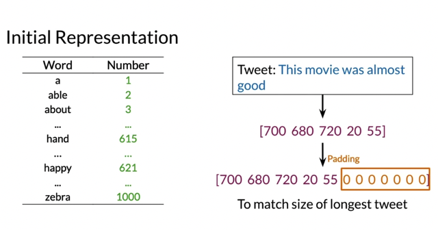</kbd>

> [!NOTE]
> Đại khái là nói về bước i**nitial representation**, ta cũng sẽ bắt đầu
> với **một vocab size** dùng r**epresent mỗi từ bằng index của nó** trong
> vocab size. Sau đó một **sequence of word / câu** sẽ được represent
> bằng **chuỗi các word index**, và được **zeros padding để đạt một max
> len** định trước thường là **câu dài nhất trong đám**

   

  
  
<kbd>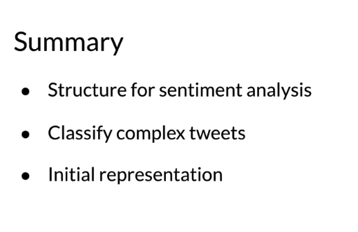</kbd>

   

  
  
<kbd>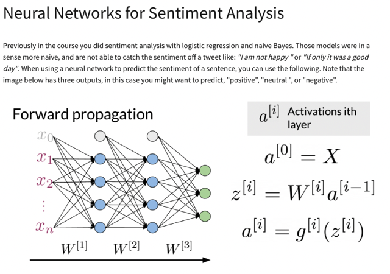</kbd>

   

  
  
<kbd>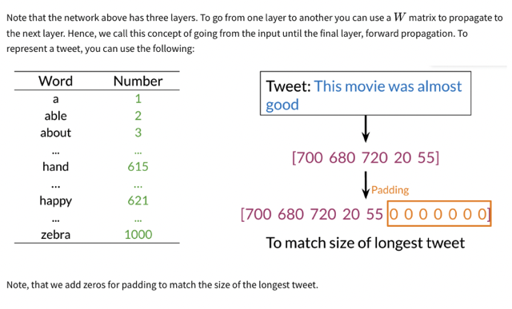</kbd>

   

## Trax: Neural Networks

 

### 1 The focus is on defining neural networks using \\*Trax\\*, a \\*framework\\* built on \\*TensorFlow\\*.

> [!NOTE]
> 1 The focus is on defining neural networks using \**Trax\**, a \**framework\** built on \**TensorFlow\**.
>
> 2 Trax allows for \**efficient computation\** on various hardware, such as\**CPUs, GPUs, and TPUs.\**
>
> 3 The \**model architecture\** is specified using \**Trax layers\** in a \**sequential manner\**, indicating the \**order of
> computations in forward propagation.\**
>
> 4 Each layer represents a \**specific computational step\**, including dot products as \**dense layers\** and
> \**activation functions like sigmoid.\**
>
> 5 \**Trax\** \**keeps a record of algebraic operations\** in the order of computation, which \**facilitates gradient
> evaluation.\**
>
> 6 \**Trax\** offers \**computational efficiency\** and the \**ability to perform parallel computing\**.
>
> 7 Trax is built on top of \**TensorFlow\** and is \**one of the latest open-source frameworks\** for deep learning.
>
> 8 Trax provides \**advantages such as computational speed\**, \**parallel computing\**, and\**automatic
> computation\** of model ingredients.
>
> 9 The next step is to delve into more details on using Trax and its functionalities.

 

  
  
<kbd>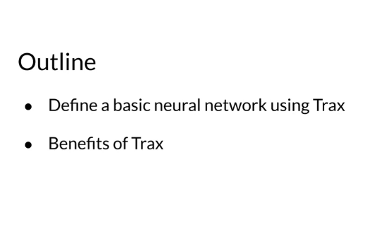</kbd>

   

  
  
<kbd>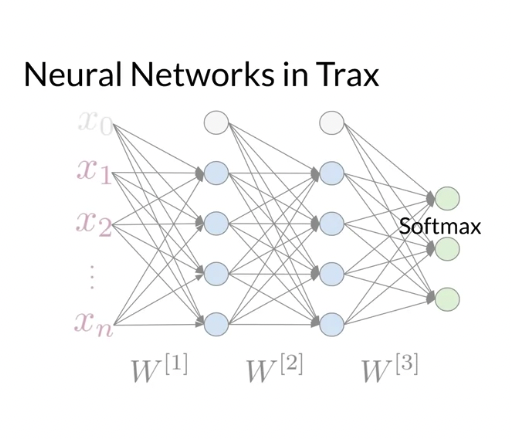</kbd>

  
<kbd></kbd>

  
<kbd>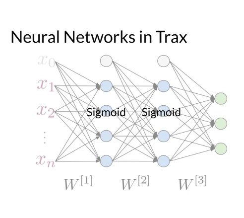</kbd>

   

  
  
<kbd>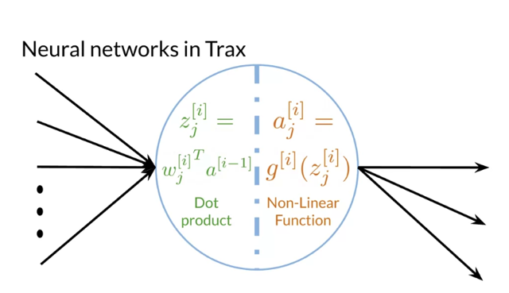</kbd>

   

  
  
<kbd>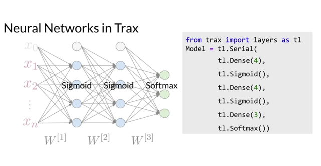</kbd>

> [!NOTE]
> Ví dụ define NN với Trax,
> mỗi bước là một layer

   

  
  
<kbd>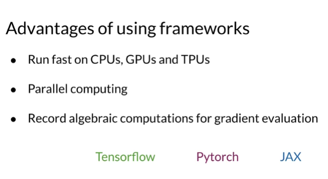</kbd>

> [!NOTE]
> Advantages của TRAX. Trax ổng nói là cái framework mới nhất, được build trên nền TF.

   

  
  
<kbd>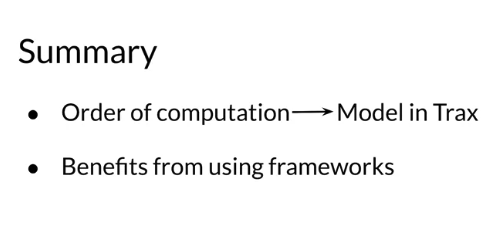</kbd>

   

## Why We Recommend Trax

 

### 1 Introduction and personal background:

> [!NOTE]
> 1 Introduction and personal background:
>  ◦ Introduction of the speaker and their connection to Google Brain team.
>  ◦ Experience as a software engineer and involvement in machine learning projects.
>
>  2 Development of \**TensorFlow\** and \**machine translation\**:
>  ◦ \**Creation of TensorFlow \**and its\**initial goals\**.
>  ◦ Contribution to \**machine translation \**and the use of \**deep sequence models\**.
>  ◦ Challenges of training models and l\**imitations outside of Google.\**
>
>  3 Creation of the \**Tensor2Tensor\** library:
>  ◦ Aim to \**make deep learning research\**, especially for \**sequence models\**, \**accessible\**.
>  ◦ Introduction of the \**transformer model \**for\**faster training\**.
>  ◦ Adoption and usage of \**Tensor2Tensor\** in Google and other companies.
>
>  4 Need for a new library - Trax:
>  ◦ Decision to improve upon existing libraries.
>  ◦ Introduction of Trax as a \**deep-learning library\** focused on \**clear code and speed.\**
>  ◦ \**Comparison\** of Trax \**with TensorFlow and PyTorch\** in terms of \**code complexity.\**
>
>  5 Benefits of using Trax:
>  ◦ Enhanced programmer \**efficiency\** due to \**readable and understandable code.\**
>  ◦ \**Utilization of the Adam optimizer\** as an \**example\**.
>  ◦ \**Just-In-Time compiler technology\** (\**XLA\**) and \**integration with JAX for fast execution\**.
>  ◦ \**Trax's performance\** in \**MLPerf competition\**, \**outperforming other frameworks.\**
>  ◦ \**Compatibility with TPUs\** on Google Colab for \**testing\** and \**cost-effectiveness.\**
>
>  6 Personal satisfaction and recommendation:
>  ◦ Personal enjoyment and satisfaction in using Trax.
>  ◦ Encouragement to explore Trax for machine learning research and applications.
>  ◦ Flexibility for startups and large companies alike.

 

  
  
<kbd>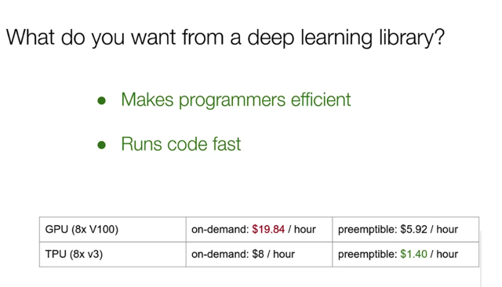</kbd>

   

  
  
<kbd>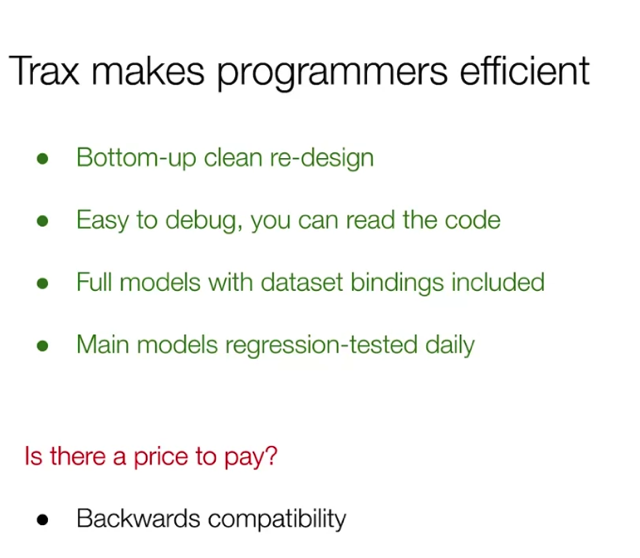</kbd>

   

  
  
<kbd>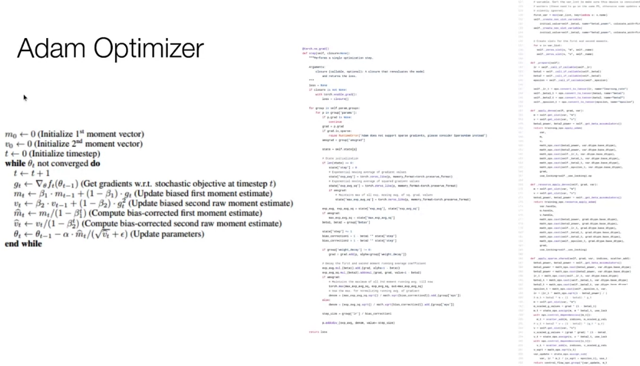</kbd>

   

  
  
<kbd>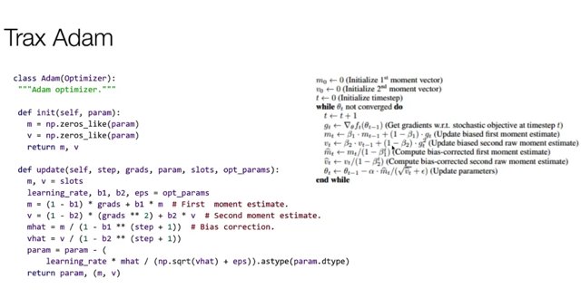</kbd>

> [!NOTE]
> Because if you're**implementing a new paper**or if you're **learning**
> and you want to**find in the code of the framework**, **where are
> the equations from the paper,** you can really do with this here.
> That is the benefit of Trax.

   

  
  
<kbd>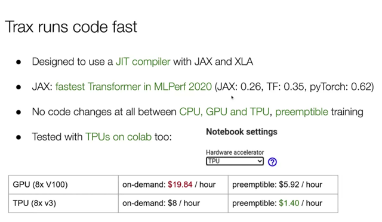</kbd>

   

  
  
<kbd>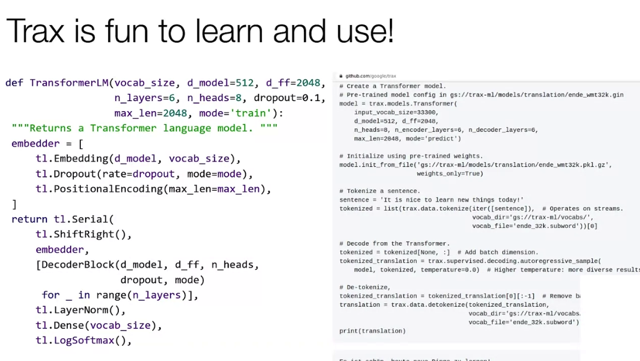</kbd>

   

## Reading: Trax And Jax, Docs And Code

 

### Official Trax documentation maintained by the Google Brain team:

> [!NOTE]
> Official Trax documentation maintained by the Google Brain team:
> \\_https://trax-ml.readthedocs.io/en/latest/\\_
>
> Trax source code on GitHub:
> \\_https://github.com/google/trax\\_
>
> JAX library:
> \\_https://jax.readthedocs.io/en/latest/index.html\\_
>

 

## Lab: Introduction To Trax

 

<kbd>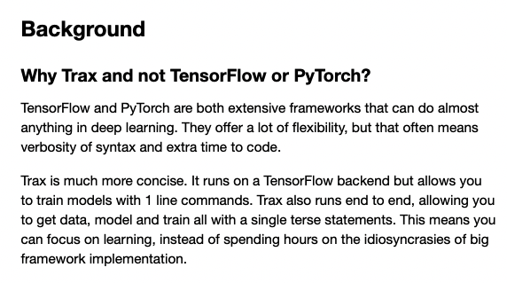</kbd>

> [!NOTE]
> Đạu khái là **Trax gọn hơn TensorFlow**, hay **Pytorch** vì như đã
> xem bài trước nó **không support backward compatibility**. Và
> do đó **để học thì dùng nó dễ hơn** thay vì**tốn thời gian nghiên
> cứu các đặc điểm riêng** của mỗi framework. **Trax run ons TF
> backend** cho phép có thể**train model với chỉ 1 dòng code.**

 

<kbd>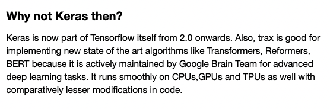</kbd>

> [!NOTE]
> **Keras** cũng **tích hợp vào TF rồi từ version 2**. Nên dùng Trax
> cũng chính là Keras. Chưa kể nó có những cái **"state of the
> art" algorithm như Transformer, Reformers....và được
> maintain bởi Google Brain Team**

 

<kbd>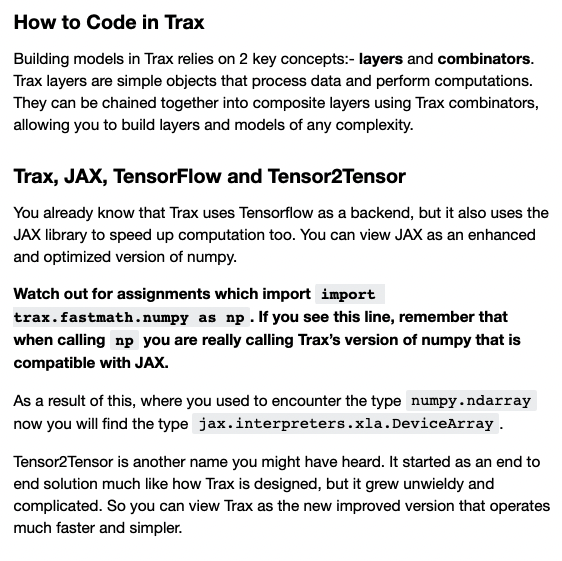</kbd>

> [!NOTE]
> Đại khái là Trax dựa trên **2 concept là LAYERS** và
> **COMBINATORS**. Dùng l**ayers để define simple objects process
> data**và **thực hiện các tính toán** còn **combinator** để combine
> layer thành các s**tructures phức tạp hơ**n.
>
> **JAX**  là lib thực hiện **các phép tính toán kiểu như bản nâng cấp
> hơn của numpy** nhưng **nhanh và hiệu quả hơn**
>
> Còn **Tensor2Tensor** là cũng có **mục đích như Trax** nhưng **fail**, vì
> trở nên p**hức tạp**. Nên có thể hiểu **Trax như bản cải tiến của
> Tensor2Tensor**

 

### Resources

> [!NOTE]
> Resources
> Trax source code can be found on Github: Trax
> JAX library: JAX
>
> https://github.com/google/trax
>
> https://jax.readthedocs.io/en/latest/index.html

 

  
  
<kbd></kbd>

   

### Layers

 

- \\*Layers\\* are the \\*core building blocks \\*in Trax or as mentioned in the lectures, they are the \\*base classes\\*.  They take \\*inputs\\*, \\*compute functions/custom calculations\\* and \\*return outputs.\\*  You can also \\*inspect layer properties\\*. Let me show you some examples.
   

    
    
<kbd>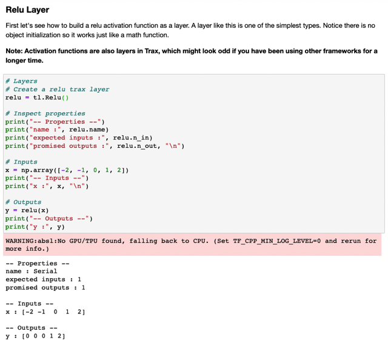</kbd>

> [!NOTE]
> Ví dụ về **Relu** layer - yes, trong **Trax activation function
> cũng là layer**. Layer là base-class, có các thông số input
> (**n_in**), output (**n_out**), name (**name**). Relu layer kiểu này thì **không có params**

     

    
    
<kbd>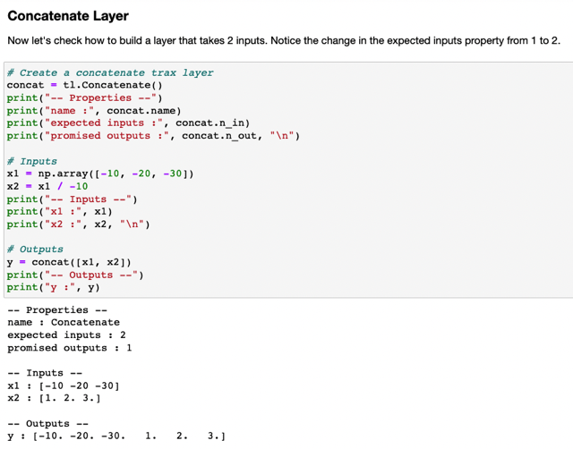</kbd>

> [!NOTE]
> Một loại non-param layer khác - work
> như một Function là concatenate giúp
> concatenate tensor

     

    
    
<kbd>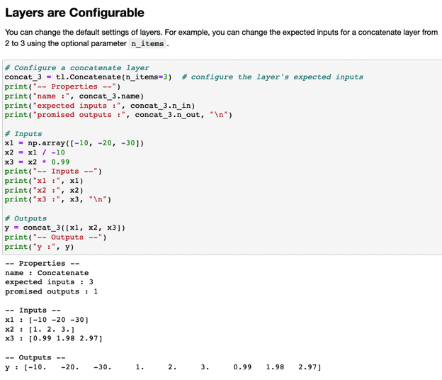</kbd>

> [!NOTE]
> Ví dụ này ý nói layers có thể được
> configured lại như Concatenate có thể
> được define để expect nhận 3 input

     

    
    
<kbd>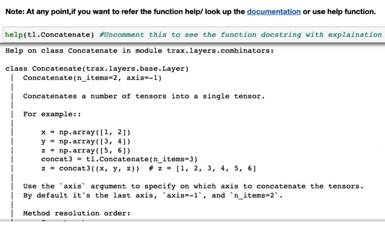</kbd>

> [!NOTE]
> dùng help(tl layer) vào sẽ mở
> ra document rất tiện

     

### Layers can\\* have Weights\\*

 

- \\*Some layer\\* types include \\*mutable weights and biases\\* that are used in \\*computation\\* and \\*training\\*. Layers of this type \\*require initialization before use.\\*  For example the \\*LayerNorm\\* layer \\*calculates normalized data\\*, that is also \\*scaled by weights and biases\\*. During initialization you \\*pass the data shape \\*and \\*data type of the inputs\\*, so the layer \\*can initialize compatible arrays of weights and biases.\\*
> [!NOTE]
> Đại khái là **ngoài các layer như reLu hay
> Concatenate** làm việc**như một function** thì các
> **weight layer có weight và bias** cần được **Initialize**.
> Cái này không có gì mới

   

    
    
<kbd>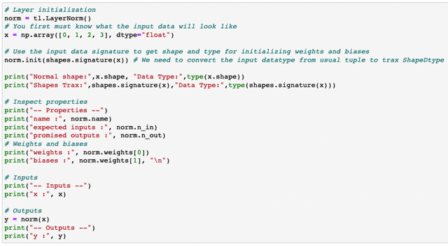</kbd>

> [!NOTE]
> Ta thấy cũng tương tự như những "kiểu" **syntax initialization** là cần
> d**efine một cái shape**, thì đây cũng vậy, shape được "lấy" bằng cách
> dùng cái class là **shapes**, và function **signatures()**. Import cái
> class "shapes" và gọi function **signatures(x)** bỏ vào tensor x nó sẽ
> **cho biết shape, và dtype**

     

    
    
<kbd>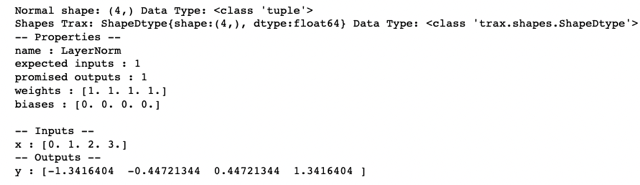</kbd>

     

### Custom Layers

 

  
  
<kbd>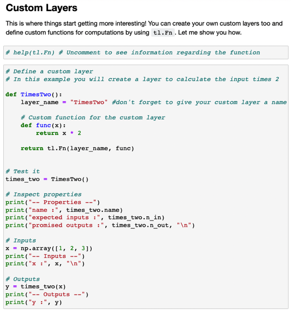</kbd>

> [!NOTE]
> Nói về cách **define custom layer,** ví dụ này define layer work
> như function x2: ta thấy**define name**, rồi **define một cái
> function**, và bỏ cả hai vào t**f.Fn()**Nó tự thấy layer sử dụng function func(x) có 1 input và tính ra 
> 1 output x**2. Nên layer.n_in bằng 1 và n_out bằng 1

   

  
  
<kbd>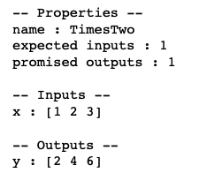</kbd>

   

### Combinators

 

  
  
<kbd>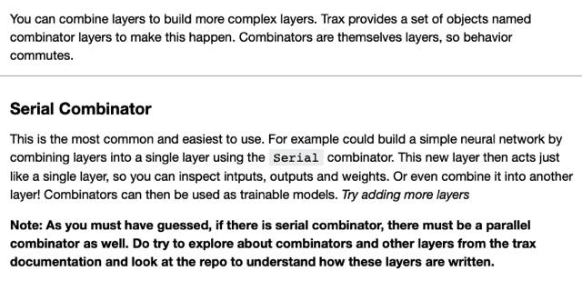</kbd>

> [!NOTE]
> **Combinator** giúp **combine layers thành các kiến trúc phức tạp
> hơn**. Có **Serial** và **Parallel**.

   

  
  
<kbd>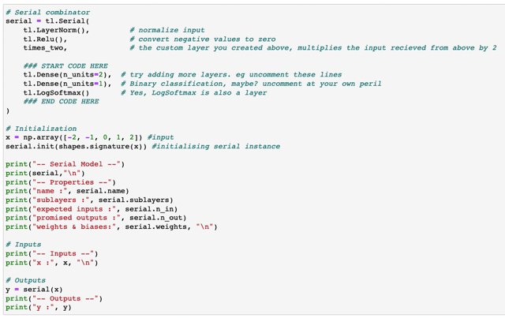</kbd>

> [!NOTE]
> Và khi add các layer lại với **combinator**, **bản thân nó như một layer**, với
> **inputs**, **outputs**, và **weights**. Và tiếp tục **có thể add vào các combinator khác**

   

  
  
<kbd>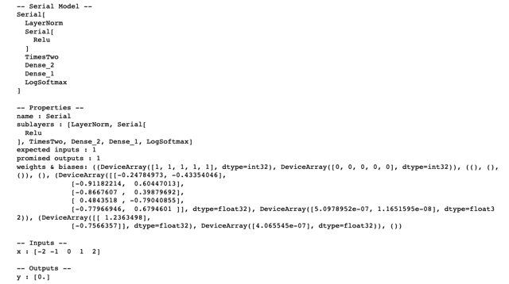</kbd>

   

### Jax

 

  
  
<kbd>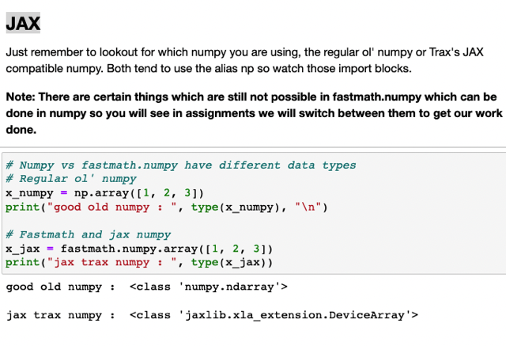</kbd>

> [!NOTE]
> Nói về **numpy** và J**AX numpy,**  với chú ý là vẫn có những cái
> numpy làm được mà JAX numpy không làm được.

   

### Summary

 

- Trax is a \\*concise framework\\*, built on \\*TensorFlow\\*, for\\* end to end machine learning.\\* The \\*key building blocks\\* are \\*layers\\* and \\*combinators\\*. This notebook is just a taste, but sets you up with some key \\*intuitions\\* to take forward into the rest of the course and assignments where you will build end to end models.
> [!NOTE]
> **concise**: Ngắn gọn. Nói chung Trax là một f**ramework "ngắn
> gọn"** với **layers** và **combinators** giúp việc t**hực hành build các
> model DL nhanh và gọn**

   

## Classes, Subclasses And Inheritance

 

### 1 Classes in Python: Classes are used to define \\*common properties\\* and methods for \\*similar

> [!NOTE]
> 1 Classes in Python: Classes are used to define \**common properties\** and methods for \**similar
> objects\**. They allow the \**definition of variables\** and \**behaviors\** that a\**re shared among instances\** of the
> class.
>
> 2 \**Class\** \**definition\**: A class is defined by giving it a \**name\** and then specifying its \**methods\**. The
> \**__init__\** method \**is called when initializing an instance of the class\**, and the \**__call__\** method is \**used
> when the instance is called\**.
>
> 3 \**Initializing\** and \**calling\** class instances: To create an instance of a class,\**you pass values for its
> parameters in the __init__ method\**. The \**instance\** can then be \**called\**, which triggers the \**execution of
> the __call__ method.\**
>
> 4 \**Subclasses\** and \**inheritance\**: Subclasses can be defined by \**creating a new class\** and \**indicating
> the parent class it inherits from\**. Subclasses can \**add additional parameters and methods\** while
> i\**nheriting common properties and methods from the parent class\**.
>
> 5 \**Overriding methods\**: When defining methods in a subclass, they \**can override methods\** from the
> parent class. This \**allows customization and modification of inherited behavior.\**
>
> 6 Benefits of classes and subclasses: Classes and subclasses help in structuring code and
> efficiently managing larger codebases.
>
> 7 TRAX layers: The text mentions that the next topic to be discussed is "TRAX layers," implying
> that it will cover a specific concept or functionality related to layers in the context of TRAX.
>
> These main ideas highlight the \**concepts of classes, subclasses, and inheritance in Python\**,
> emphasizing their usefulness in\**code organization\** and \**reusability\**. The text also mentions their
> relevance in the context of TRAX layers, setting the stage for further discussion on that topic.

 

  
  
<kbd>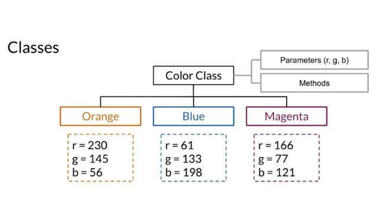</kbd>

> [!NOTE]
> Đại khái nói về **định nghĩa của class** trong
> Python, với **parameter** (như variable) và
> **method** (như function)

   

  
  
<kbd>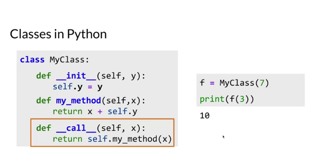</kbd>

> [!NOTE]
> Đây, đây mới nói lại cho mình biết **về kiến trúc của một class** trong **Python**
> đây, **_init_** là i**nitialization function** y như **constructor** của Java class vậy.
>
> Kế tiếp **define một function** của class như **my_method**(). Cái này**không có
> gì để nói**
>
> Nhưng đặc biệt là có cái **call function** - nó sẽ được **gọi ta dùng object như
> function**. Trong ví dụ, khi khởi tạo (ini một cái object của class MyClass, theo yêu
> cầu của constructor (_init) ta cần bỏ vào một number - y) Sau khi khởi tạo, ta **gọi
> nó như một function** -**f()**thì đó **chính là function call**.
>
> Vì call **yêu cầu argument** là x nên phải có argument **f(3)**. Kết quả là nó **gọi
> function call** và trong đó **nó gọi function my_method()**.
>
> Nhắc lại **như java không có vụ này**, ví dụ tạo a = new A_Class(). thì a chỉ là
> refer tới object A_class, còn muốn gọi function nào của A_class phải gọi ra ví dụ a.
> method1(), a.method2() chứ đâu có cái kiểu a() như vầy

   

  
  
<kbd>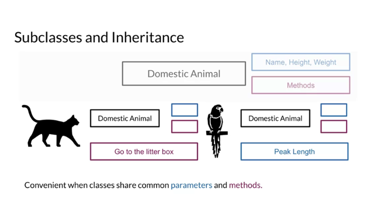</kbd>

> [!NOTE]
> Nói về khái niệm **subclasses** và
> **inheritance** **không có gì khác so với
> cái ngôn ngữ khác như Java**

   

  
  
<kbd>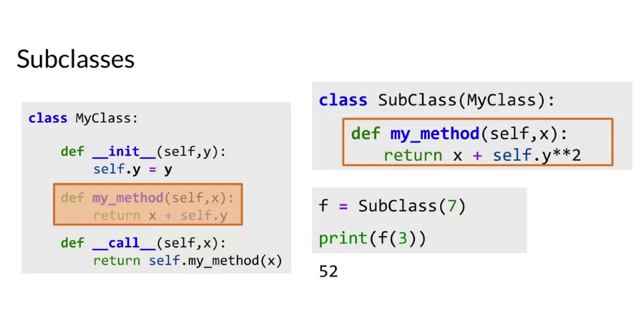</kbd>

> [!NOTE]
> Một ví dụ subclass trong Python. Không cần như
> **extend** hay **implement keyword** như Java mà**cứ bỏ
> vào ()**

   

## Lab: Classes And Subclasses

 

### In this notebook, I will show you the \\*basics of classes and subclasses\\* in Python. As

> [!NOTE]
> In this notebook, I will show you the \**basics of classes and subclasses\** in Python. As 
> you've seen in the lectures from this week, \**Trax\** uses \**layer classes\** as building blocks for 
> \**deep learning models\**, so it is important to understand \**how classes and subclasses 
> behave in order to be able to build custom layers when needed\**.
>
> By completing this notebook, you will:
>  • Be \**able to define classes and subclasses\** in Python
>  • Understand \**how inheritance works in subclasses
> \** • Be able to \**work with instances\**

> [!NOTE]
> Nói chung là các khái niệm subclass và inheritance
> không có gì khác Java hay các language khác cả
> nên đọc code sẽ dễ dàng hiểu, không có gì phải note.

 

- Part 1: Parameters, methods and instances
   

    
    
<kbd>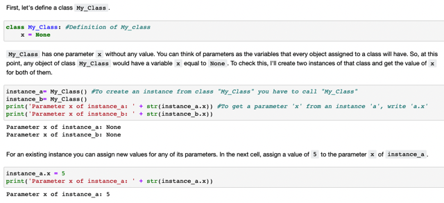</kbd>

     

    
    
<kbd>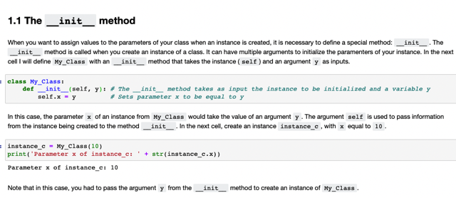</kbd>

     

    
    
<kbd>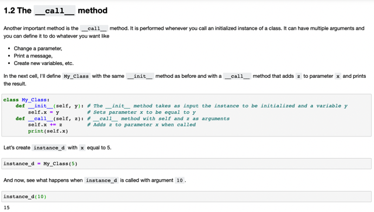</kbd>

     

    
    
<kbd>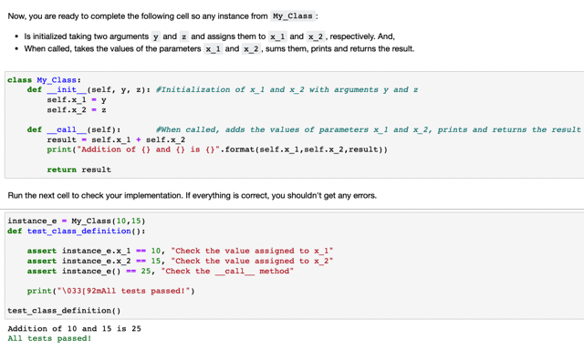</kbd>

     

    
    
<kbd>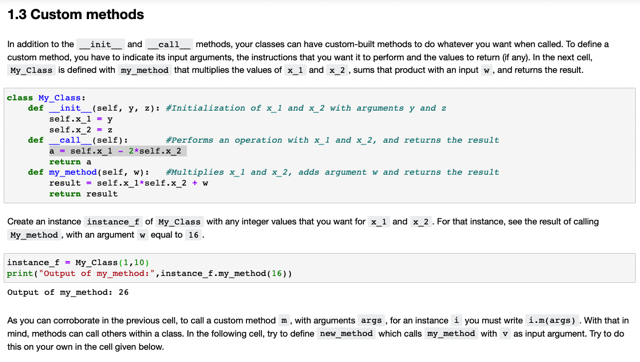</kbd>

     

    
    
<kbd>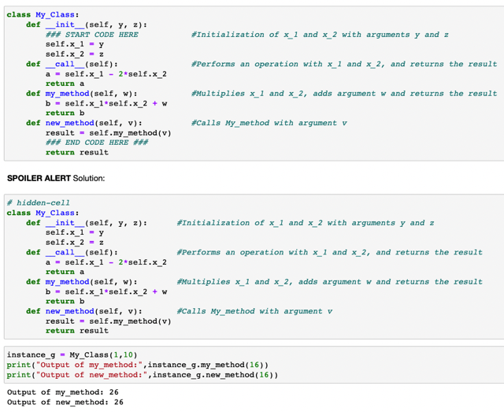</kbd>

     

- Part 2: Subclasses and Inheritance
   

    
    
<kbd>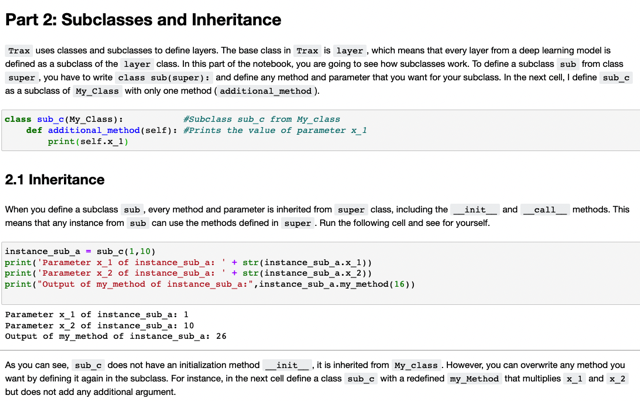</kbd>

     

    
    
<kbd>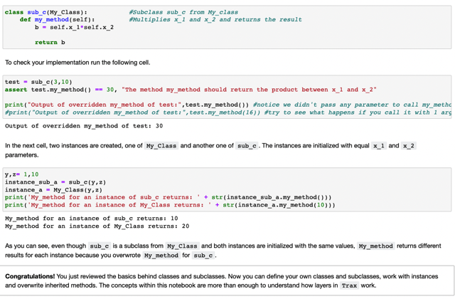</kbd>

     

## Dense And Relu Layers

 

### 1 Dense Layer: The text introduces the \\*dense layer\\*, which is a\\* commonly used layer \\*in neural

> [!NOTE]
> 1 Dense Layer: The text introduces the \**dense layer\**, which is a\**commonly used layer \**in neural
> networks. It explains that the dense layer allows for the transition between layers within the network.
> It \\_\**performs a dot product between the weights associated with the hidden units and the activations
> from the previous layer\**\\_. This computation is followed by the application of a non-linear function to the
> results.
>
> 2 ReLU Layer: The text discusses the ReLU layer, which is\**another commonly used layer\** in neural
> networks. It explains that the ReLU layer helps in \**maintaining the stability of the network\**. It applies
> the \**rectified linear unit (ReLU) function\** to the \**values in each hidden unit\**. The ReLU function maps
> \**negative values to zero\** and l\**eaves positive values unchanged.\** This process is applied to all hidden
> units simultaneously.
>
> 3 Dense Layer and ReLU Layer Interactions: The text explains how the \**dense layer\** and the \**ReLU
> layer interact with each other\**. The \**dense layer computes dot products between the weight matrix and
> the activations from the previous layer\**. After this interaction, t\**he ReLU layer applies the ReLU
> function to the resulting values in each hidden unit.\**
>
> 4 ReLU Function and Graph: The text mentions that the \**ReLU function is represented by the graph\**
> where the \**negative parts of the function\** are\**rectified to match the horizontal axis\**. It explains that
> ReLU stands for rectified linear units, which aligns with the graph's shape.
>
> 5 Understanding Neural Network Components: The text emphasizes that the\**dense layer\** and the
> \**ReLU layer are two fundamental components\** of neural networks. It indicates that the dense layer
> \**enables transitioning between layers\**, while the \**ReLU layer helps maintain stability\** by applying the
> ReLU function to hidden unit values.
>
> 6 Future Topics: The text mentions that the next topic will be discussing\**how to put a model together\**,
> now that the dense layer and the ReLU layer have been explained.

 

  
  
<kbd>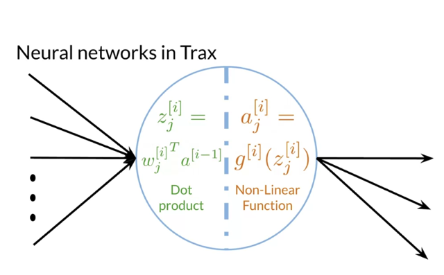</kbd>

   

  
  
<kbd>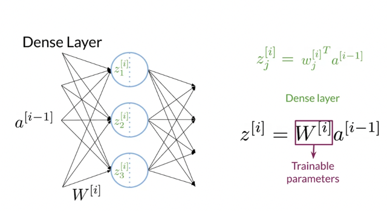</kbd>

> [!NOTE]
> Cái phần tính **dot product** của **weight** của
> hidden units và previous layer **activation** tạo
> nên **Dense layer** trong Trax

   

  
  
<kbd>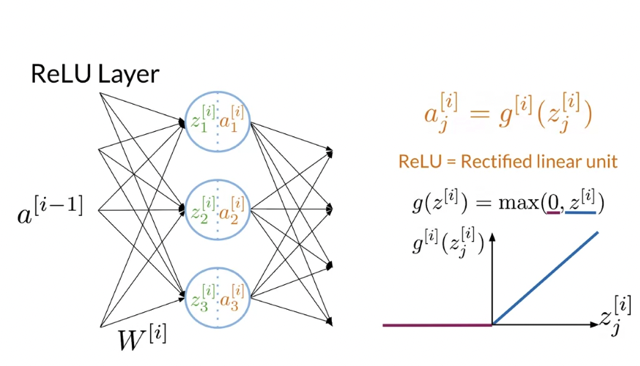</kbd>

> [!NOTE]
> Và ReLU layer apply **relu function**cho
> các kết quả cuả Dense layer

   

  
  
<kbd>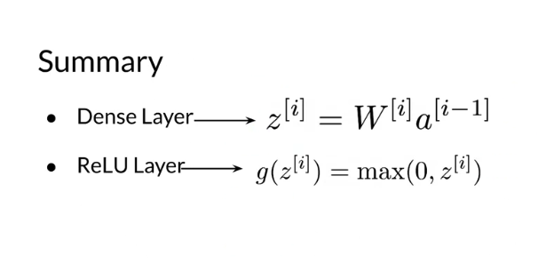</kbd>

   

## Serial Layer

 

### For instance, in a \\*vanilla neural network\\* like the one presented in this slide,

> [!NOTE]
> For instance, in a \**vanilla neural network\** like the one presented in this slide,
> you will have \**some dense layers\** followed by \**activation layers\**. Then the
> \**sequential\** arrangements of those layers is done interacts when you define
> \**a serial layer.\** You could think of \\_\**this new serial layer like your whole neural
> network model in a single layer\**\\_. This layer allows you to \**perform forward
> propagation of the entire model instead of doing it step-by-step.\** To recap, a
> \**serial layer is just a composition of sublayers,\** which consists of a \**dense\**
> \**layer\** followed by \**activation layers\**. Let's continue.

 

  
  
<kbd>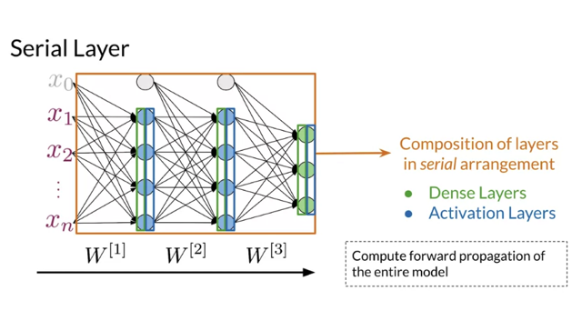</kbd>

> [!NOTE]
> Đại khái là **Serial layer** sẽ tạo nên từ **nhiều layer
> sắp xếp tuần tự (serial)** và nó sẽ **hành xử như
> một layer của toàn bộ NN.**

   

## Other Layers

 

### 1 Introduction to \\*Embedding\\* and Mean Layers: The text introduces\\* two additional layers\\* in neural

> [!NOTE]
> 1 Introduction to \**Embedding\** and Mean Layers: The text introduces\**two additional layers\** in neural
> networks, namely the e\**mbedding layer\** and the \**mean layer.\** It suggests that these layers are \**useful
> and important\**, especially in the context of NLP tasks.
>
> 2 \**Embedding Layer\**: The text explains that an embedding layer \**maps words from a vocabulary\** to a
> \**representation in a determined dimension\**. Each word is \**assigned an index\**, and \**the embedding
> layer returns a vector representing that word\**. The \**values in the embedding layer are trainable,
> \**allowing the \**model to learn the best word representations for the given NLP tasks.\**
>
> 3 \**Mean Layer\**: The text mentions the mean layer, which \**follows the embedding layer in serial
> models\**. The mean layer t\**akes a matrix of word embeddings\** and \**computes the mean of each
> feature, resulting in a vector representation\**. This helps reduce the number of parameters to train
> and provides a \**condensed representation of the input text.\**
>
> 4 Training and Trainable Parameters: The text emphasizes that the \**values in the embedding layer\**
> are \**trainable\**, meaning that the neural network \**adjusts and learns the optimal word representations
> during training\**. However, the \**mean layer does not have any trainable parameters\** as it only
> \**computes the mean\** of the word embeddings.
>
> 5 Benefits of Using Embedding Layers: The text highlights that incorporating an embedding layer in
> the model allows for \**learning effective representations of the vocabulary\** specific to the task at
> hand. It enables the neural network to \**capture meaningful information from the input text.\**
>
> 6 Summary of Layers: The text concludes by mentioning the\**four layers discussed\**: \**dense, ReLU,
> embedding, and mean layers\**. It states that these layers provide a\**solid foundation for building
> neural networks\**.
>
> Overall, the main ideas revolve around the introduction and explanation of the \**embedding layer\** and
> \**mean layer\**. The text emphasizes the benefits of using an embedding layer to\**learn word
> representations\** and the r\**eduction of parameters achieved by the mean layer\**. It also summarizes
> the different layers covered and their significance in neural network construction

 

  
  
<kbd>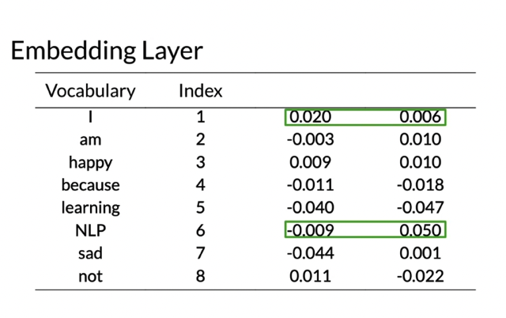</kbd>

> [!NOTE]
> Embedding này kiểu như làm cái việc của giống như trong bài trước
> mình đã học về cách**train CBOW model để tạo embedding cho
> word**vậy. thì lúc đó mình define 1 cái **Dense layer** rồi thông qua
> Wx+b để giảm từ **size của x là V dimension sang còn embedding
> vector với N dimension (xong ta lấy cột W1 hay hàng W2 nhớ
> không)**. Thì cái Embedding layer này nó cũng đại khái là làm vậy
> bên trong thôi..
>
> Nên Embedding layer nhận **input là word index**, đầu ra của là**embedding
> vector có 2 value** (size của embedding là h.p do mình chọn) hiểu nôm
> na là bên trong, nó encode từ với số từ trong vocab thành o**ne-hot
> vector size V** và "map" với embedding vector size N để thông qua
> quá trình training, nó sẽ**learn ra embedding vector** tốt represent cho
> input word (Theo mình hiểu với CNOW thì weight matrix cũng chính
> là embedding matrix đó)

   

  
  
<kbd>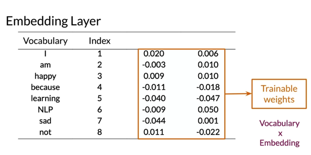</kbd>

   

  
  
<kbd>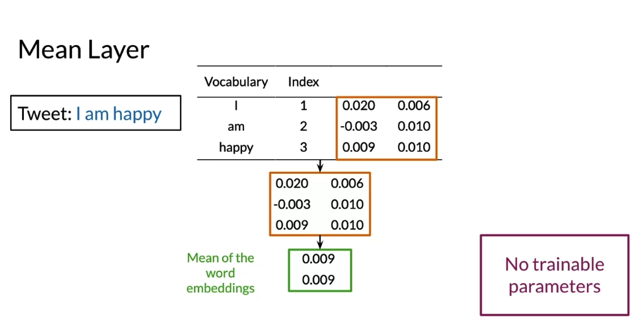</kbd>

> [!NOTE]
> Còn mean layer đại khái là tính mean, kiểu như bỏ vào **3 từ**
> vào **embedding layer** nó cho ra **3 embedding vector** thì mean
> layer sẽ giúp **tính ra embedding vector** của **cả câu**bằng cách
> tính mean của 3 vector này.Vậy thôi

   

  
  
<kbd>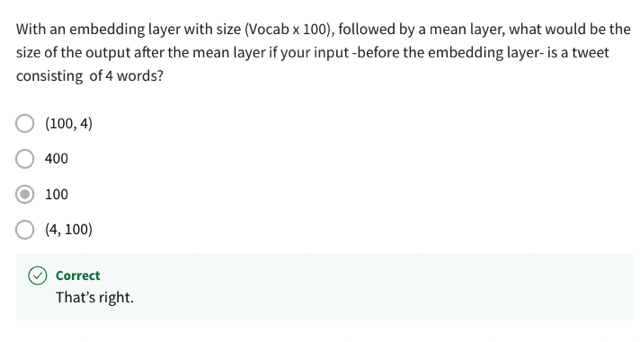</kbd>

   

  
  
<kbd>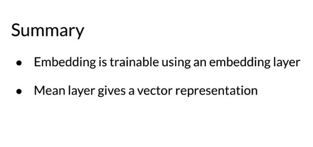</kbd>

   

## Training

 

### 1 \\*Gradients\\* and \\*Backpropagation\\*: The text emphasizes the importance of \\*computing gradients\\* in

> [!NOTE]
> 1 \**Gradients\** and \**Backpropagation\**: The text emphasizes the importance of \**computing gradients\** in
> training neural networks. It mentions that \**manually calculating gradients can be complex\**, but deep
> learning frameworks p\**rovide automated methods\** to compute gradients, making the process \**easier and
> more efficient.\**
>
> 2 \**Computing Gradients with Trax\**: The text introduces the Trax framework and its\**"grad" function\**, which
> allows for \**easy computation of gradients.\** It demonstrates how to use the "grad" function by \\_d\**efining a
> function "f"\\_ \**and calling \\_\**"grad(f)" to obtain the gradient of "f" with respect to its input "x".\**\\_
>
> 3 Training a Model with Gradients: The text explains that training a neural network model using gradients
> is straightforward with Trax. It suggests \**applying the "grad" function to the forward method\** \**of the model,\**
> which \**returns a function that computes the gradient\**. The gradients can then be evaluated using the
> model's weights and inputs.
>
> 4 Iterating Until Convergence: Once the \**gradients\** are obtained, the text suggests\**iterating until
> convergence is reached\**, implying the use of an \**optimization algorithm\** such as \**gradient descent\** to
> update the \**model's weights.\**
>
> 5 \**Simplifying Training\** with \**Trax\**: The text highlights the \**advantage of using Trax\** for training neural
> networks, as it \**automates the computation of gradients\** and \**simplifies the forward and backpropagation
> processes.\** It mentions that the programming assignments in the module will involve defining and training
> neural networks using Trax.
>
> 6 Next Steps: The text concludes by stating that the reader now knows how to create neural networks
> with layers and how to train them. It mentions that in the following week, \**more complex layers\** and
> techniques for building better-performing networks will be explored.
>
> Overall, the main ideas revolve around the \**ease of computing gradients using the Trax framework\**, the
> simplicity of training models with the built-in \**"grad" function\**, and the advantage of \**using Trax to
> streamline the training process\**.

 

  
  
<kbd>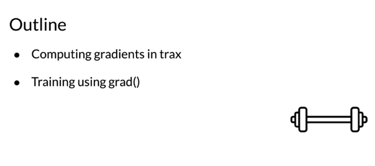</kbd>

   

  
  
<kbd>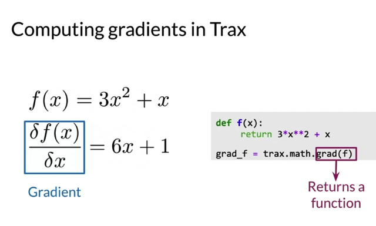</kbd>

> [!NOTE]
> Rất hay, chỉ cần bỏ **function f(x)** vào **trax.
> math.grad()**là có ngay **function tính
> đạo hàm (partial derivative) của f() w.r.t x.**

   

  
  
<kbd>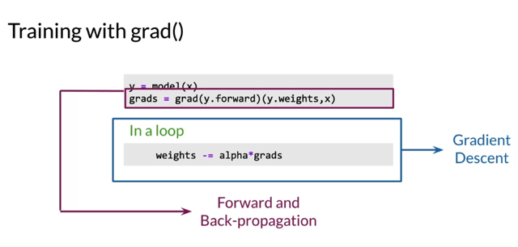</kbd>

> [!NOTE]
> Và nhờ trax tính gradient của model rất nhanh chỉ có 1 dòng là tính ra
> gradients để sẵn sàng update weights ở bước gradient descent rồi
>
> Ở đây bỏ **model.forward()** (hiểu nôm na là **nguyên cái forward prop
> như một function f** vậy) vào**trax.math.grad()** là nó trả ra \_**một cái
> FUNCTION tính đạo hàm partial.derivative của function model.forward()
> w.r.t model's weights**\_.
>
> Tiếp theo thế là **bỏ model's weights và x** vào cái function đó là tính **ra
> giá trị của gradient of model cost function w.r.t model weight** để mà
> update

   

  
  
<kbd>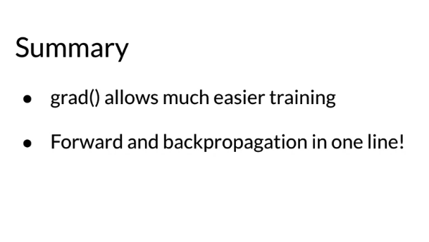</kbd>

   

## Lab: Data Generators

 

### In Python, a \\*generator\\* is a function that behaves like an \\*iterator\\*. It will\\* return

> [!NOTE]
> In Python, a \**generator\** is a function that behaves like an \**iterator\**. It will\**return
> the next item\**. Here is a \\_link\\_ to review python generators. In many AI
> applications, it is \**advantageous to have a data generator to handle loading
> and transforming data\** for different applications.
>
> You will now implement a \**custom data generator\**, using a common pattern
> that you will use during all assignments of this course. In the following
> example, we use a set of samples a, to derive a new set of samples, with
> more elements than the original set. \**Note: Pay attention to the use of
> list \\/lines_index\\/ and \**variable\\/\**index\\/ to traverse the original list.\**

> [!NOTE]
> Làm quen với Generator, cái dùng để iterate và thực
> hiện việc loading và transforming data. Thì ở đây ta sẽ
> làm một cái custom generator

 

- import random as rnd import numpy as np  # Example of \\*traversing a list of indexes to create a circular list\\* a = [1, 2, 3, 4] b = [0] * 10  a_size = len(a) b_size = len(b)  # is equivalent to \\*[i for i in range(0,a_size)]\\*, the difference being the advantage  # of using \\**\\* to \\*pass values of range iterator\\* \\*to\\* \\*list\\* directly similar to index in data_generator below lines_index = \\*[*range(a_size)]\\*   index = 0                       for i in range(\\*b_size\\*):        # `b` is longer than `a` forcing a wrap     # We \\*wrap\\* by resetting index to 0 so the sequences circle back at the end to point to the first index     \\*if index >= a_size:\\*         index = 0          b[i] = a[\\*lines_index\\*[\\*index\\*]]     #  `indexes_list[index]` point to a index of a. Store the result in b     index += 1      print(b)
> [!NOTE]
> Đại khái là một ví dụ để **traverse một list** để **tạo một cái circular list.** Dùng để tạo một new sét có
> nhiều sample  hơn từ một set ban đầu.
>
> Đại khái là **tạo cái list a dài 4 chứa [1,2,3,4]** và một cái**list b dài 10 chứa 0 ban đầu hết** (b = [0]*10) Bây giờ
> đại khái là **fill vào b các giá trị của a theo thứ tự**, **hết thì quay lại từ đầu**cho đ**ến khi  B được fill hết**.

   

  
  - Shuffling the data order  In the next example, we will do the same as before, but \\*shuffling the order of the elements in the output list\\*. Note that here, our strategy of traversing using \\*lines_index\\* and \\*index\\* becomes \\*very important\\*, because we can \\*simulate a shuffle in the input data\\*, \\*without doing that in reality.\\*
> [!NOTE]
> "mô phỏng việc shuffle input data mà
> không thực sự làm vậy"??

     

      
      
<kbd>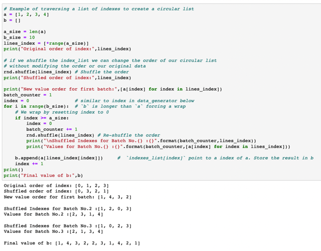</kbd>

> [!NOTE]
> Cũng y như cái hồi nãy, chỉ có thêm cái là **shuffle cái lines_index**, giúp cho kiểu như **"mỗi một
> vòng"** - **dùng các giá trị của a để fill vào b** thì**thứ tự của các item mỗi khác do được shuffle** -
> khi "loop" hết len a (chỗ if index >= a_size) thì re-shuffle.
>
> Tuy nhiên**nó không shuffle cái a, cái a được giữ nguyên**. Nó **chỉ shuffle cái index list -**
> lines_index, nên mới nói là**simulate a shuffle in the input data without doing that really.**

       

    
    - Note: We \\*call an epoch each time\\* that an \\*algorithm passes over all the training examples\\*. \\*Shuffling\\* the examples \\*for each epoch\\* is known to \\*reduce variance\\*, making the \\*models more general and overfit less.\\*
> [!NOTE]
> việc **shuffling một batch các sample** trước
> khi đưa vào để training model giúp **reduce
> variance, giảm overfit**

       

      
      - \\*Exercise  Instructions:\\* Implement a data generator function that takes in batch_size, x, y  shuffle where x could be a large list of samples, and y is a list of the tags associated with  those samples. Return a subset of those inputs in a tuple of two arrays (X,Y). Each is an  array of dimension (batch_size). If shuffle=True, the data will be traversed in a random  form. \\* Details:\\*  This code as an outer loop while True:   ...   yield((X,Y))    Which runs continuously in the fashion of generators, pausing when yielding the next  values. We will generate a batch_size output on each pass of this loop. It has an inner loop that stores in temporal lists (X, Y) the data samples to be included in  the next batch. 
> [!NOTE]
> Ok, đại khái là **viết một function nhận data x, y là nguyên bộ large list
> sample**, và batch_size để **trả về từng bộ nhỏ X, Y chứa batch_size sample
> thôi**. Có thê argument shuffle để thực hiện shuffle nếu cần.
>
> Và người ta hướng dẫn sẵn là nó sẽ có cái loop như này ở ngoài cùng, chưa
> hiểu lắm nhưng đại khái là giúp return từng batch chứ không trả về hết một
> lần.
>
> Việc mình cần làm là viết cái cơ chế lấy subset data X,Y từ large dataset x, y

         

        
        - 1.The first is the use of a \\*list of a predefined size\\* to \\*store the data for each batch\\*. Using a \\*predefined size list\\* reduces the computation time i\\*f the elements in the array are of a fixed size\\*, like \\*numbers\\*. If the elements are of \\*different sizes\\*, it is better to use an\\* empty array\\* and \\*append one element at a time\\* during the loop.
> [!NOTE]
> Đại khái là gợi ý cho mình, nên dùng một cái list có
> **predefined size để chứa data** cho mỗi batch nếu elements
> trong array có fixed size như number (chưa hiểu lắm, không
> biết có phải ý nói number thì size là fix là 1) còn giả sử element
> trong array mà là một câu, hay một list khác, thì size của nó
> không fixed, thì lúc đó nên dùng empty array và append

           

          
          - The second is \\*tracking the current location\\* in the \\*incoming lists of samples\\*. Generators variables \\*hold their values between invocations\\*, so \\*we create an index variable\\*, \\*initialize to zero\\*, and \\*increment by one\\* for \\*each sample included in a batch\\*. However, we \\_\\*do not use the index to\\*\\_ \\_\\*access the positions of the list of sentences directly\\*\\_. Instead, we use it to \\*select one index from a list of indexes\\*. In this way, we can \\*change the order in which we traverse our original list\\*, keeping \\*untouched our original list.\\*
            
<kbd>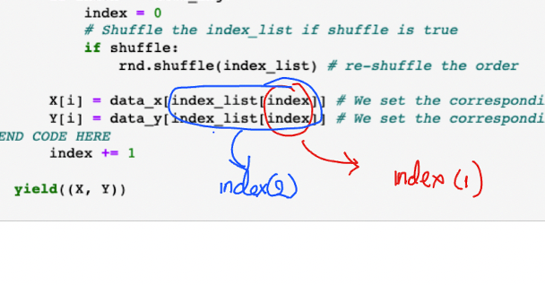</kbd>

            
<kbd></kbd>

> [!NOTE]
> Đại khái là như ở trên, trong ví dụ, ta sẽ kiểu như dùng một cái
> **biến index (1) để lấy index (2) từ một indexes list rồi mới lấy cái
> index (2) đó để lấy data**. Bằng cách đó mình có thể kiểu như **mô
> phỏng việc shuffle mà không cần phải thật sự shuffle cái list data
> gốc.**

             

            
            - The third also relates to \\*wrapping\\*. Because \\*batch_size\\* and the \\*length of the input lists\\* are not aligned, gathering a batch_size group of inputs may involve \\*wrapping back to the beginning of the input loop\\*. In our approach, it is just enough to reset the index to 0. We can re-shuffle the list of indexes to produce different batches each time.
> [!NOTE]
> Cái hint thứ 3 đại khái nói về vụ wrapping, kiểu như trong
> một cái original list có 20 element (ví dụ vậy) mà match
> size thì ví dụ như 6 thì sau 3 batch nó còn có 2 cái trong
> original list thôi thì **phải quay lại từ đầu** để lấy cho đủ 6
> item trong batch và đơn giản chỉ là set cái index thành 0.
> Cái index đang nói chính là cái index (1)

               

                
                
<kbd>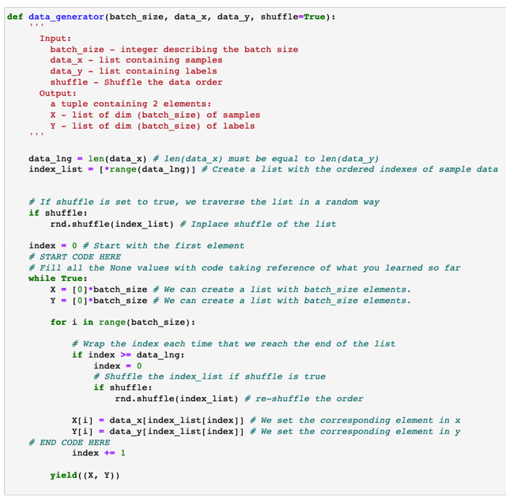</kbd>

> [!NOTE]
> Những điểm chú ý: [0]*10 là concatenate 10
> cái [0] để thành một cái list dài 10

                 

## Week Conclusion

 

### Good job going through the lectures. You now know how you can use \\*neural

> [!NOTE]
> Good job going through the lectures. You now know how you can use \**neural
> networks for classification\** and you've got some practice with \**cross-entropy
> loss\**. In this week's programming assignment, you will be \**building and
> designing models using layers\**. Training your model using the \**training loop\**,
> implementing the \**binary cross entropy function\**, \**computing the accuracy\** of
> your model, and \**predicting using your own input\**. This type of model is useful
> for\**product reviews,\** like movies, restaurants, and those found some
> e-commerce websites. Next week, you'll get started with \**deep engram\** and
> \**gated recurrent units\**. Good luck in the programming assignment.

 

## Quiz

 

<kbd>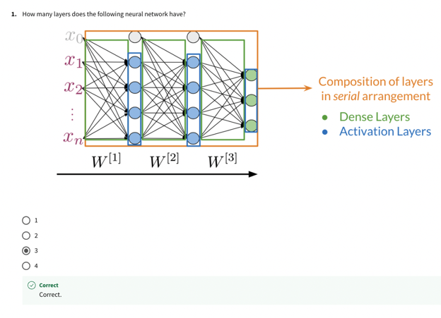</kbd>

 

<kbd>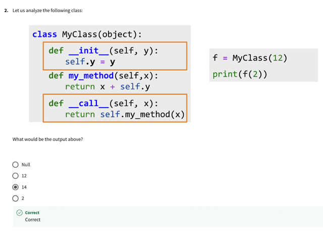</kbd>

 

<kbd>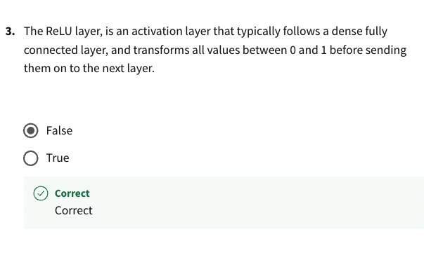</kbd>

 

<kbd>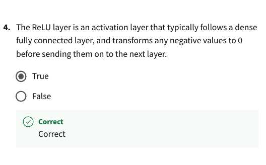</kbd>

 

<kbd>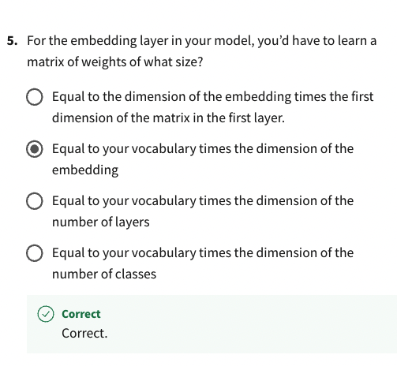</kbd>

 

## P.a: Sentiment With Deep Neural Networks

 

<kbd>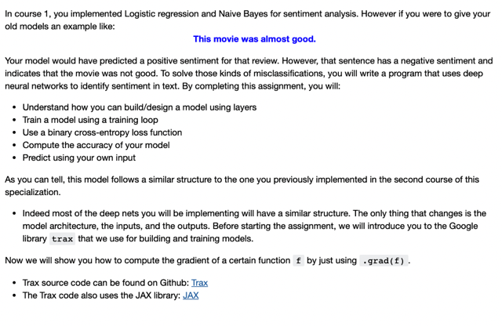</kbd>

> [!NOTE]
> Đại khái là với câu này "This movie..." thì nếu dùng các Logistic
> regression và Naive Bayes thì sẽ cho ra kết quả không chính xác. Ta
> sẽ build một NN model để giải quyết. Các bước làm thì đều trải qua
> các bước như nhau chỉ có khác ở cái algorithm, input và output. Ta sẽ
> dùng Google's trax lib.

 

### 1 - Import Libraries and try out Trax

 

- import os  import shutil import random as rnd  # import relevant libraries import \\*trax\\* import \\*trax.fastmath.numpy\\* as np from trax import \\*layers\\* as tl from trax import \\*fastmath\\*  # import Layer from the utils.py file from utils import \\*Layer\\*, \\*load_tweets\\*, \\*process_tweet\\* import w1_unittest
   

    
    
<kbd>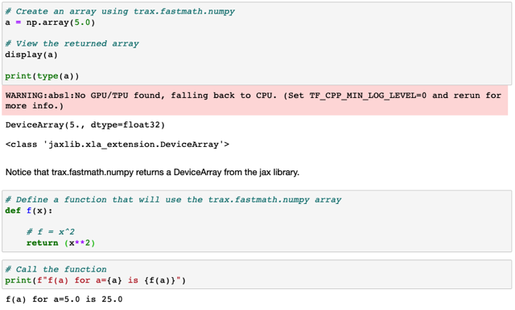</kbd>

> [!NOTE]
> Dùng trax.fastmath.numpy để define một cái np.
> array. In ra thì nó là DeviceArray, và type của nó là
> jaxlib.xla_extension.DeviceArray

     

    
    
<kbd>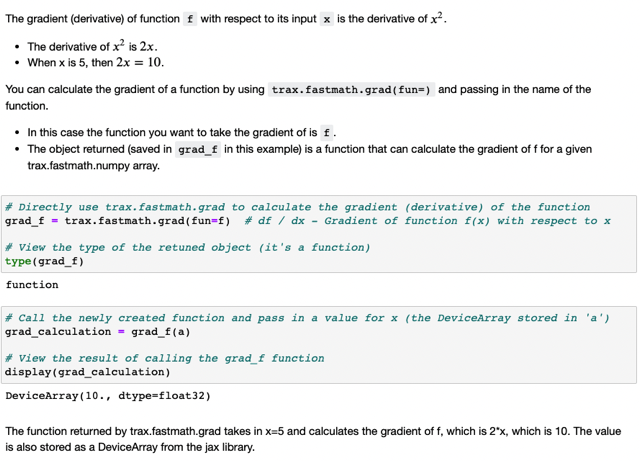</kbd>

> [!NOTE]
> Chú ý. Type của frad_f là function, ý nói đang biểu
> diễn dùng trax.fastmath.grad(fun=f) để tính ra
> function tính derivative của f w.r.to x.

     

### 2 - Importing the Data

 

- 2.1 - Loading in the Data
   

  
  - Import the data set.   • You may recognize this from earlier assignments in the specialization.   • Details of process_tweet function are available in utils.py file
     

      
      
<kbd>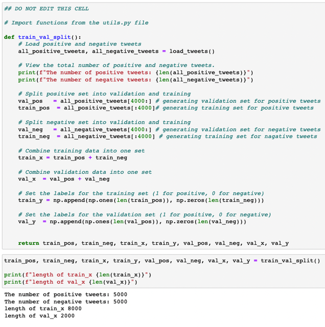</kbd>

> [!NOTE]
> Đại khái là function giúp load tweet data
> về và split ra thành train sét, validation
> sét, đồng thời tạo label.

       

      
      
<kbd>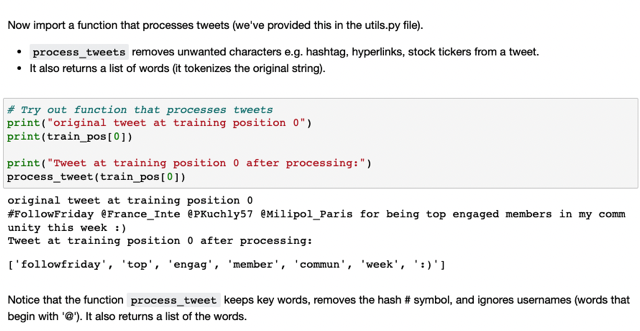</kbd>

> [!NOTE]
> Đại khái là import **process_tweets** - từ utils library để giúp **bỏ đi
> các "unwanted characters"** như link, hashtag và **process tweet
> thành một list các token** Để ý là nó cũng biến kiểu như engaged
> thành "engag", "community" thành "commute" thôi **để lấy phần chung,
> giảm corpus size.**

       

- 2.2 - Building the Vocabulary
   

    
    
<kbd>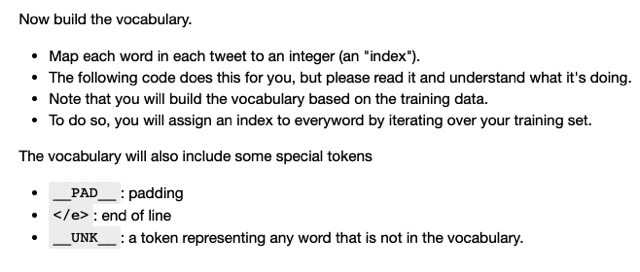</kbd>

     

    
    
<kbd>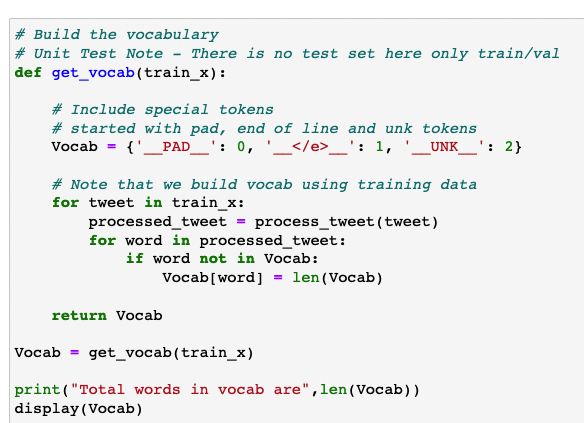</kbd>

> [!NOTE]
> Đại khái là function **nhận bộ train_x là list các tweet**. Trong đó
> nó **loop qua các tweet**, bỏ vào **processs_tweet** để**tạo
> thành list các token**. Xong **loop trong list các token** đó để
> **check xem có trong Vocabs chưa**, **nếu chưa thì gắn vào**,
> với key là từ, còn value là **value lấy bằng len(Vocabs)** - không
> có gì khó hiểu **cứ sau mỗi lần gắn vocabs len tăng lên 1, nên
> các từ được bỏ vào Vocabs sẽ có index tăng dần từ 0 - 9088**.
>
> Vocabs là một **python dict được bỏ sẵn 3 special token.**

     

    
    
<kbd>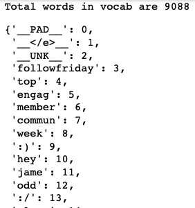</kbd>

     

    
    
<kbd>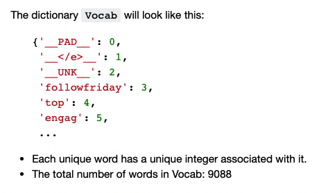</kbd>

     

- 2.3 - Converting a Tweet to a Tensor
   

    
    
<kbd>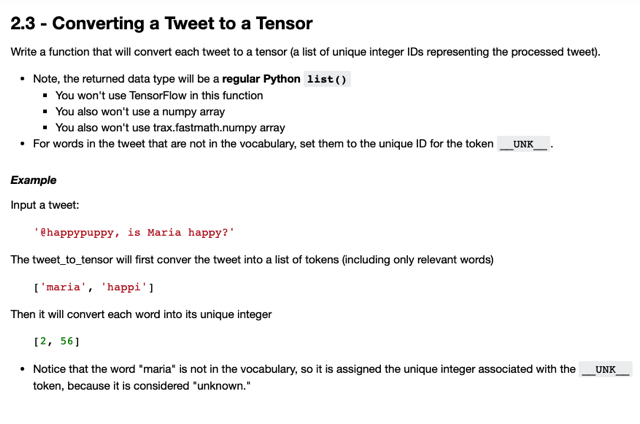</kbd>

> [!NOTE]
> Đại khái là viết một function nhận một tweet, **process nó thành
> các token**và "biến thành" một tensor **chứa các id của các
> token.**

     

- Exercise 1 - tweet_to_tensor (UNQ_C1)
   

    
    
<kbd>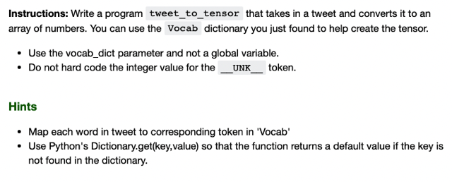</kbd>

     

    
    
<kbd>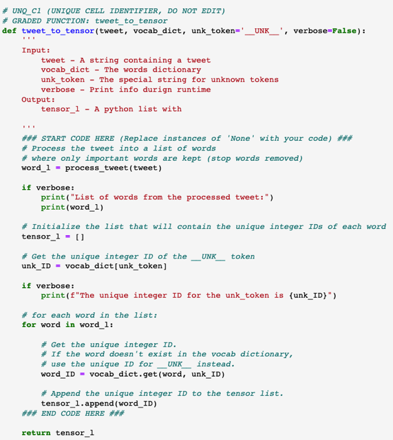</kbd>

> [!NOTE]
> Đầu tiên là **dùng function process_tweet để xử lý input tweet**
> thành **list các token**. Xong**loop trong các token đó**, dùng
> **vocab dict để lấy id của nó**, nếu**token không có trong vocab
> dict thì thay bằng unk_token id.**

     

    
    
<kbd>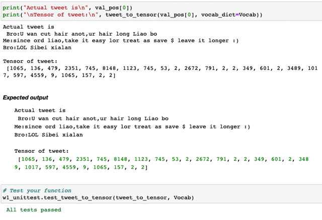</kbd>

     

- 2.4 - Creating a Batch Generator
   

    
    
<kbd>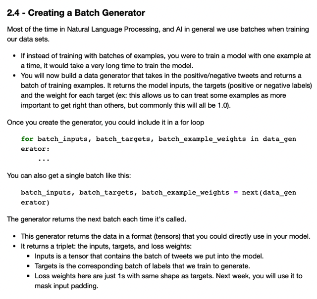</kbd>

> [!NOTE]
> Viết một function kiểu như **nhận bộ data bự** và **trả về TỪNG
> BATCH MỘT data, bao gôm x, y, và weight** nếu**cần thể hiện tầm
> quan trọng ít nhiều của training example nay hơn cái khác**. Thì nhờ
> function này, ta có thể **loop và xử lí từng batch, hoặc lấy cái batch
> tiếp theo bằng next()**

     

- Exercise 2 - data_generator (UNQ_C2)
   

    
    
<kbd>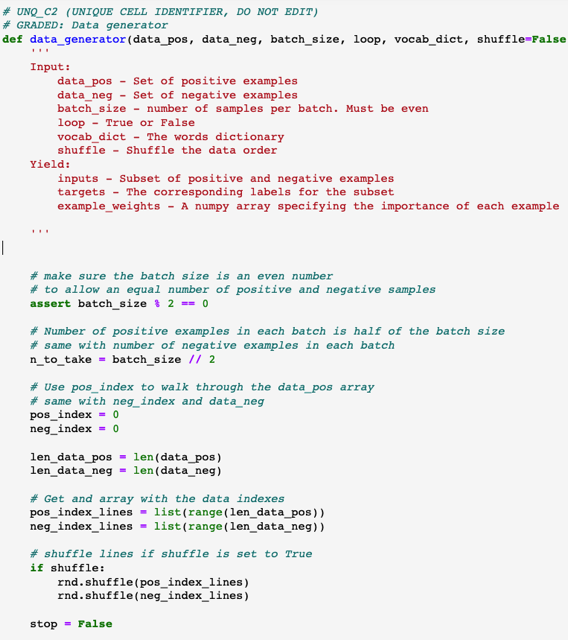</kbd>

     

    
    
<kbd>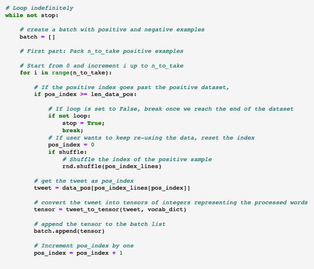</kbd>

> [!NOTE]
> Tương tự như đã gặp trong lab, cái pos_index cứ tăng từ 0 đến
> bằng batch_size, dùng nó để lấy một cái index từ cái indexes list
> (tạo nhanh gọn bằng lít(range(len_data_pos) và được shuffle),
> mới dùng cái index này để lấy tweet từ data_pos. Sau đó chuyển
> thành tensor nhờ function tweet_to_tensor và append vào batch.
>
> Lấy positive tweet trước, lấy n_to_take cái.

     

    
    
<kbd>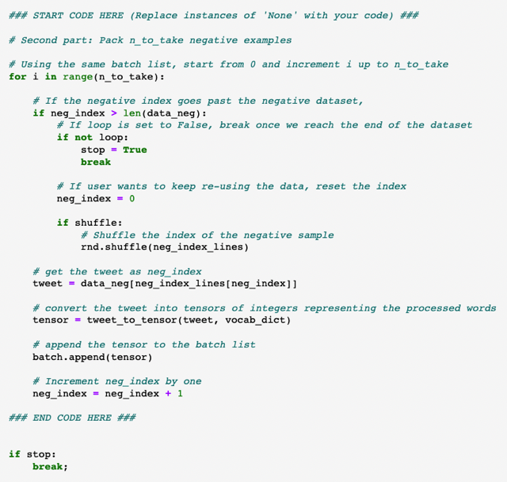</kbd>

> [!NOTE]
> Làm tương tự để lấy n_to_take cái negative tweet nữa để bỏ vào
> batch. Như vậy 1 batch sẽ có 1 nửa là positive tweet được lấy
> randomly từ và 1 nửa negative tweet được lấy randomly

     

    
    
<kbd>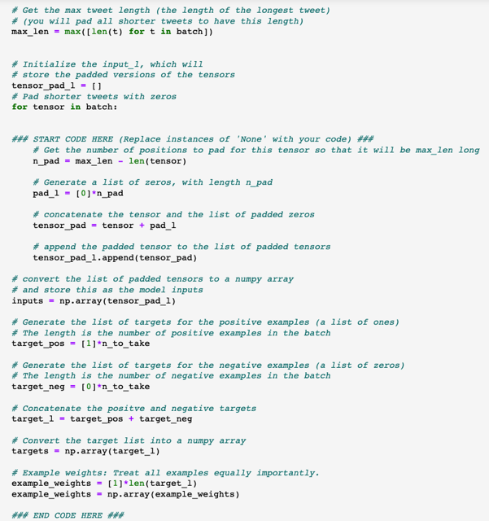</kbd>

> [!NOTE]
> Đại khái là với mỗi tensor, xem thử nó " hụt" bao nhiêu so với max len. Thì
> tạo zeros tensor dài bấy nhiêu để đắp vào (append) vào và chuyển thành
> np.array. Và tạo target (label) tensor. Cũng đơn giản, nửa đầu (n_to_take)
> là "ones" tensor, nửa sau  (n_to_take) là "zeros" tensor xong concatenate
> lại. Và cũng chuyển thành np.array. Cuối cùng trọng số example_weight
> thì do không "làm" nên cứ số 1 hết, cũng chuyển thành np.array

     

    
    
<kbd>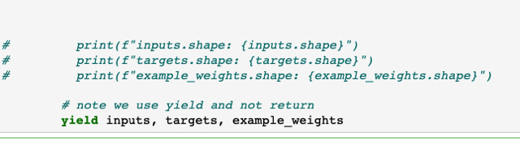</kbd>

     

    
    
<kbd>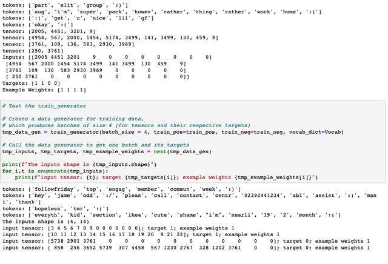</kbd>

     

  
  - Now you can use your data generator to create a data generator for the training data, and another data generator for the validation data.  We will create a third data generator that does not loop, for testing the final accuracy of the model.
     

    
    - Now that you have your train/val generators, you can just call them and they will return tensors which correspond to your tweets in the first column and their corresponding labels in the second column. Now you can go ahead and start building your neural network.
       

### 3 - Defining Classes

 

- 3 - Defining Classes
   

    
    
<kbd>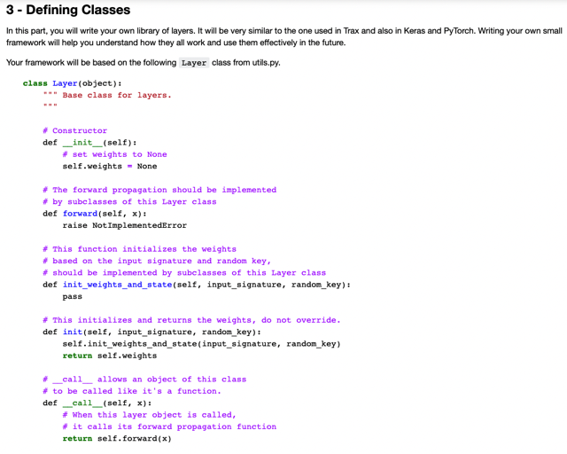</kbd>

> [!NOTE]
> Đại khái là thử làm một cái lib layers luôn để hiểu rõ ngọn ngành của thực
> hành cá yếu tố của neural network. Và dựa trên Layer class extend từ
> object đã define  trong uitls.py, ta sẽ extend cái Layers class này define
> forward function để "tạo" custom layer của mình

     

- 3.1 - ReLU Class
   

  
  - Exercise 3 - Relu (UNQ_C3)
     

      
      
<kbd>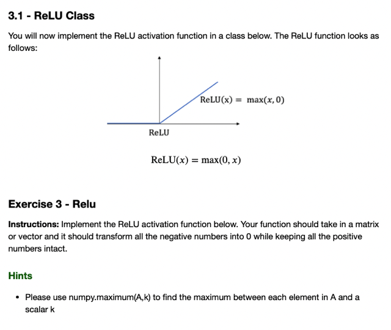</kbd>

       

      
      
<kbd>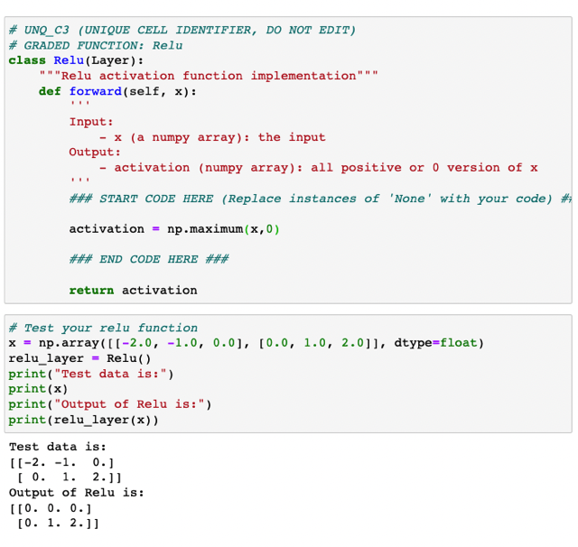</kbd>

       

- 3.2 - Dense Class
   

  
  - Exercise 4 - Dense (UNQ_C4)
     

      
      
<kbd>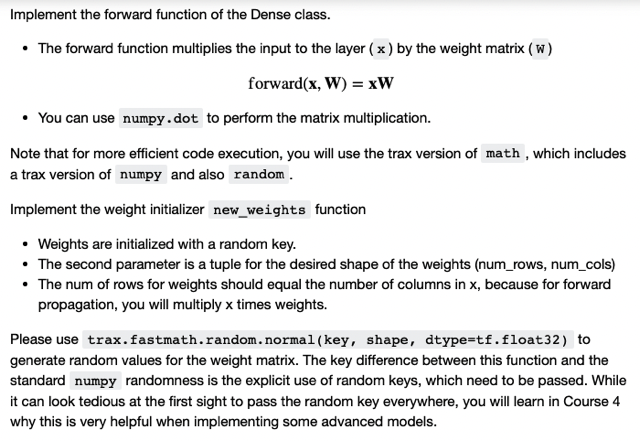</kbd>

> [!NOTE]
> Đại khái là kế đến define cái Dense layer, thì forward function sẽ
> tính dot product của weight matrix và x. Thì ở đây có nói đến
> initialize cho weight matrix dùng trax. fastmath.random.normal
> thay vì np.random để ini nó theo normal random distribution. Và
> nói về cái key trong function này sẽ có tác dụng gì đó sẽ thấy ở
> các course sau.

       

      
      
<kbd>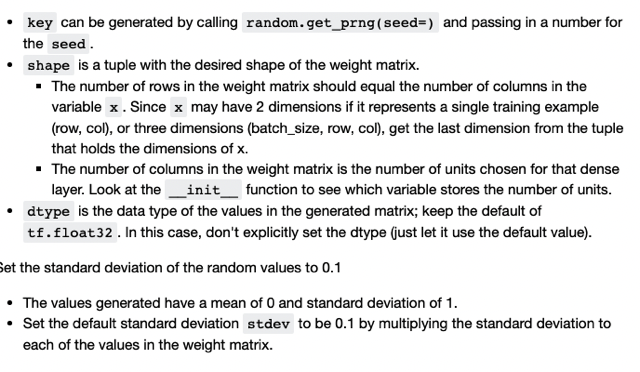</kbd>

> [!NOTE]
> Ở đây define mỗi sample data x theo row như "hồi
> xưa", thành ra x(i) sẽ là row (1, n) và do đó W sẽ là
> nxh - n hàng, h (Số unit) cột.

       

      
      
<kbd>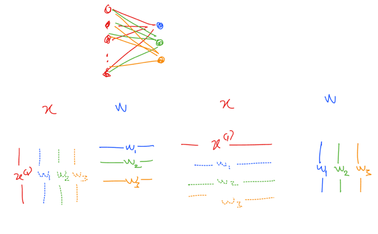</kbd>

       

      
      
<kbd>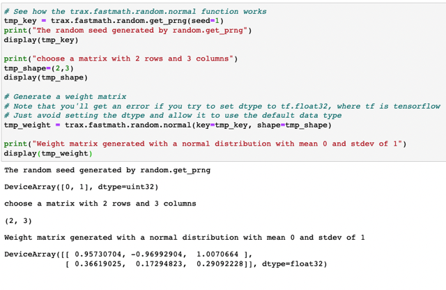</kbd>

> [!NOTE]
> Xem thử cách init weight với trax.
> fastmath.random.normal

       

      
      
<kbd>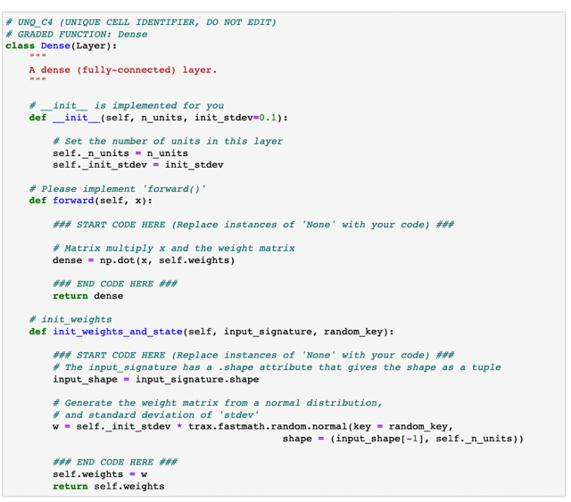</kbd>

       

- 3.3 - Model
   

    
    
<kbd>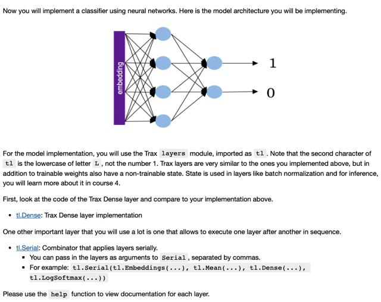</kbd>

     

    
    
<kbd>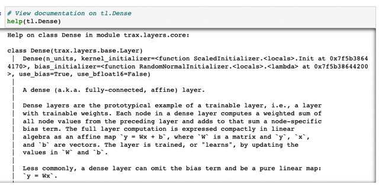</kbd>

     

    
    
<kbd>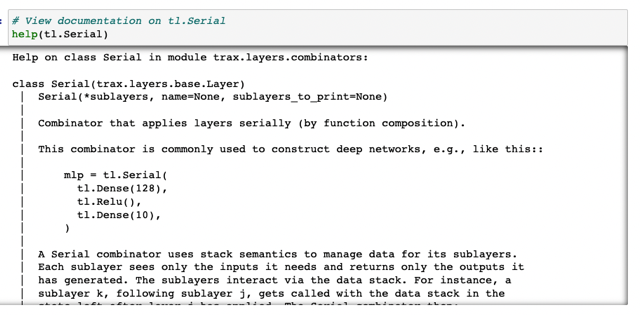</kbd>

     

    
    
<kbd>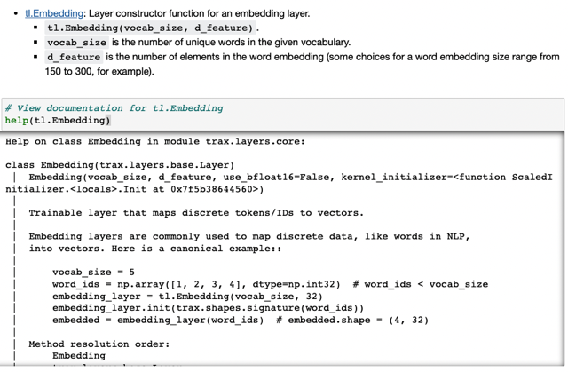</kbd>

     

    
    
<kbd>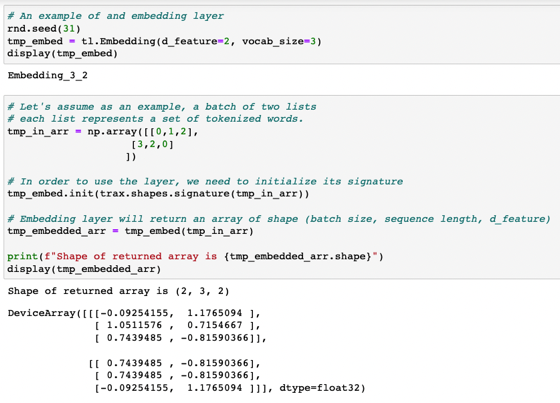</kbd>

     

    
    
<kbd>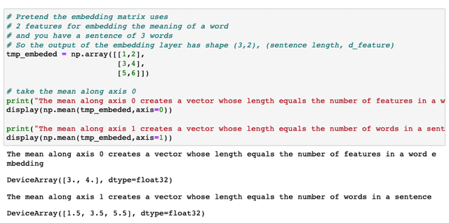</kbd>

    
<kbd></kbd>

    
<kbd>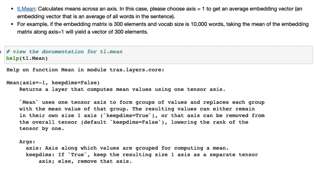</kbd>

     

    
    
<kbd>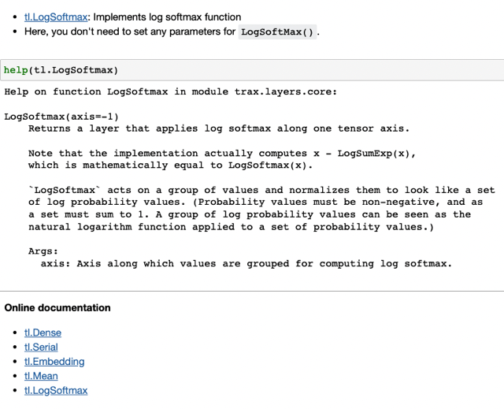</kbd>

     

  
  - Exercise 5 - classifier (UNQ_C5)
     

      
      
<kbd>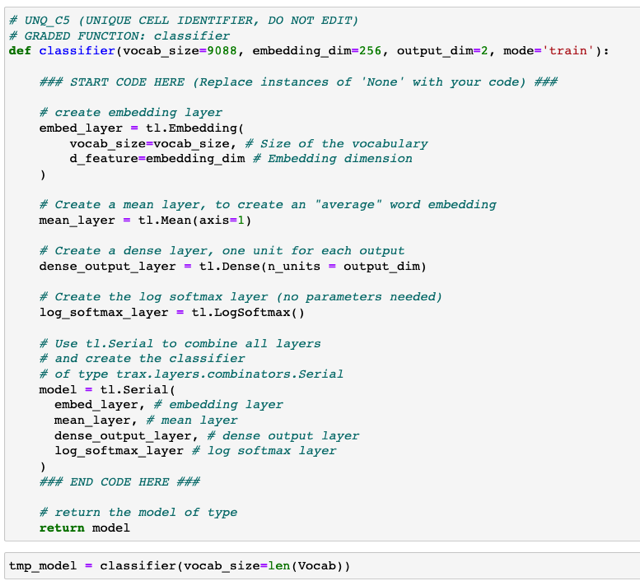</kbd>

       

      
      
<kbd>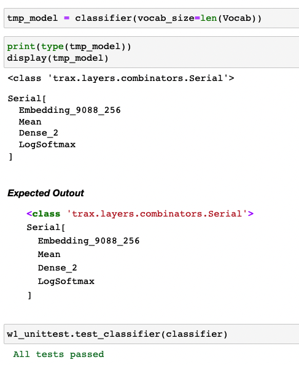</kbd>

       

      
      
<kbd>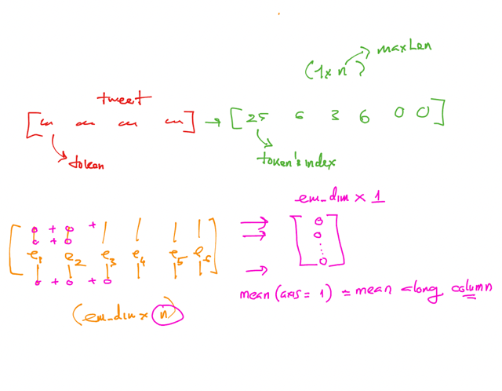</kbd>

> [!NOTE]
> Lúc đầu để Mean() không define axis vẫn pass
> unit test nhưng khi train bị lỗi. Sau khi search
> trên forum hoá ra phải define
> mean(axis =1 ) mới được

       

      
      
<kbd>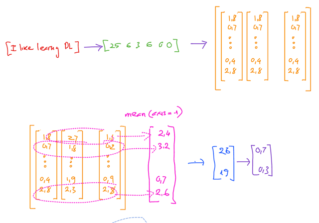</kbd>

       

      
      
<kbd>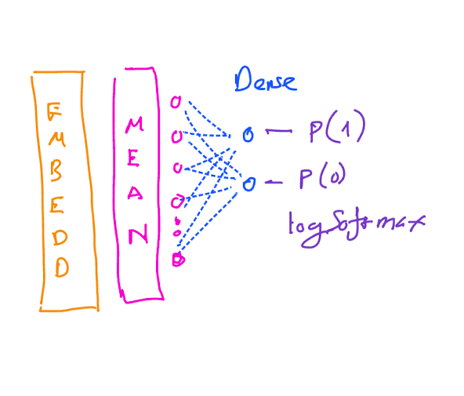</kbd>

       

### 4 - Training

 

- 4 - Training
   

  
  - To train a model on a task, Trax defines an  abstraction \\_trax.supervised.training. TrainTask\\_ which packages the train data, loss and  optimizer (among other things) together into an object.  Similarly to evaluate a model, Trax defines an  abstraction \\_trax.supervised.training. EvalTask\\_ which packages the eval data and metrics  (among other things) into another object.  The final piece tying things together is the \\_trax.supervised.training.Loop\\_ abstraction that is a very simple and flexible way to put everything together and train the model, all the while evaluating it and saving checkpoints. Using Loop will save you a lot of code compared to always writing the training loop by hand, like you did in courses 1 and 2.  More importantly, you are less likely to have a bug in that code that would ruin your  training.
     

      
      
<kbd>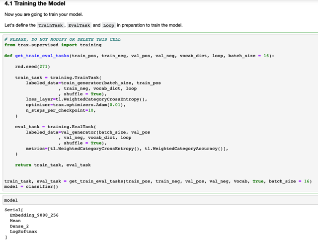</kbd>

       

      
      
<kbd>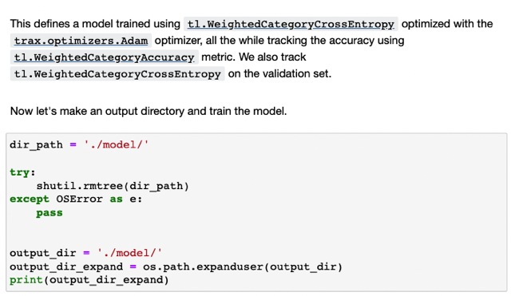</kbd>

       

- 4.1 Training the Model
   

  
  - Exercise 6 - train_model (UNQ_C6)
     

      
      
<kbd>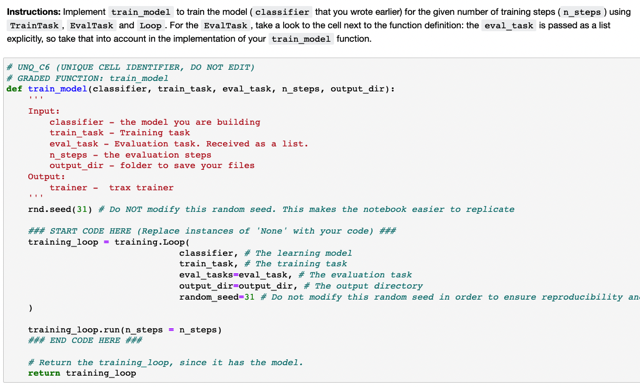</kbd>

       

      
      
<kbd>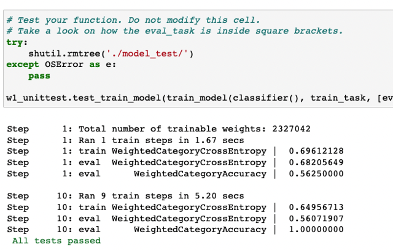</kbd>

       

- 4.2 - Practice Making a Prediction
   

  
  - Now that you have trained a model, you can access it as \\*training_loop. model\\* object. We  will actually use \\*training_loop.eval_model\\* and in the \\*next weeks\\* you will \\*learn why we  sometimes use a different model for evaluation\\*, e.g., \\*one without dropout\\*. For now, make predictions with your model.  Use the \\*training data\\* just to see how the prediction process works.  • Later, you will use \\*validation data\\* to \\*evaluate your model's performance.\\*
> [!NOTE]
> Đại khái đã train model xong, thì có thể tiếp cận model bằng
> **training_loop. model**.
>
> Tuy nhiên mình sẽ dùng một cái khác gọi là **eval_model** dùng để
> evaluate mà tuần sau sẽ biết **tại sao có một cái model khác để
> evaluation**, ví dụ trong model để evaluate sẽ **không apply
> dropout**.
>
> Tức là c**ó những setting khác nhau giữa model trong lúc training và
> evaluating.**

     

      
      
<kbd>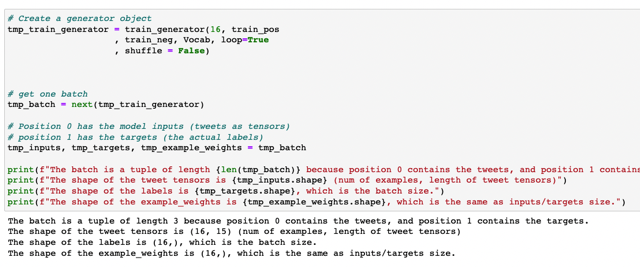</kbd>

> [!NOTE]
> Đại khái là **lấy ra một batch từ training set** bằng cách gọi
> **function next(training generator)**Nó sẽ có bộ **x, label y và
> example weights** như đã biết.
>
> Xem **thử các shape của các tensor inputs, labels**

       

      
      
<kbd>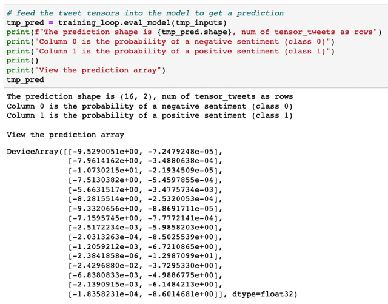</kbd>

> [!NOTE]
> Lấy cái **eval_model** của **training loop** và bỏ **inputs data vào**,
> để nó cho ra **dự đoán tmp_pred**Kết qủa là một 16x2 tensor. kết quả dự đoán cho 16 example, mỗi
> example có **2 chỉ số log prob**

> [!NOTE]
> Chỗ này chưa hiểu là tại sao biết cột
> thứ 1 là probability of a negative
> sentiment và cột 2 là probability of a
> positive sentiment?

       

    
    - To turn these \\*probabilities into categories\\* (\\*negative\\* or \\*positive\\* \\*sentiment prediction)\\*, for  each row:  • \\*Compare the probabilities\\* in each column.  • If \\*column 1 has a value greater than column 0\\*, classify that as a positive tweet.  • Otherwise if column 1 is less than or equal to column 0, classify that example  as a negative tweet.
> [!NOTE]
> Ở đây chú ý là vì output của NN dùng **LogSoftMax** chứ **không
> phải SoftMax** nên các **giá trị là Log Probabilities** chứ **không
> phải Probabilities**, do đó chúng **không sum bằng 1**.
>
> Cái nữa là **dù có là log probability hay probability thì thằng nào
> lớn nhất thì lấy thằng đó**.
>
> Nên ở đây, vì chỉ có **2 class**, nên chỉ cần**so sánh hai thằng
> với nhau** thay vì dùng function argmax.

       

        
        
<kbd>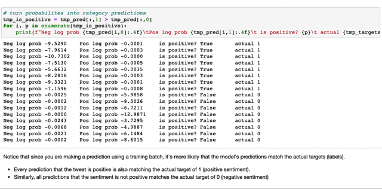</kbd>

> [!NOTE]
> Đại khái là vì đây là **(một batch từ) training set**,
> nên model sẽ predict chính xác là điều dễ hiểu.

         

        
        
<kbd>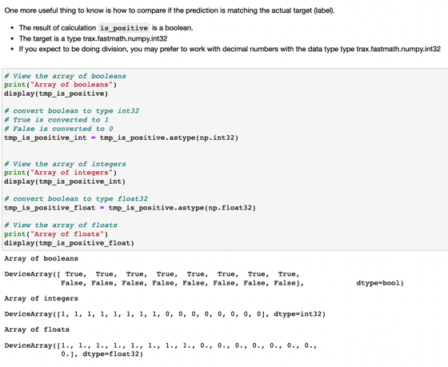</kbd>

> [!NOTE]
> Đại khái là dùng **astype** để**convert boolean
> arrays sang int32 hay float32**

         

        
        
<kbd>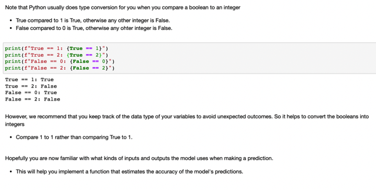</kbd>

> [!NOTE]
> Đại khái là **Python** nó sẽ **tự động convert khi mình so
> sánh boolean với integer**, tuy nhiên ổng **khuyên là mình
> không nên để nó tự động mà nên keep track datatype
> và tự convert nếu cần so sánh**

         

### 5 - Evaluation

 

- 5.1 - Computing the Accuracy on a Batch
   

    
    
<kbd>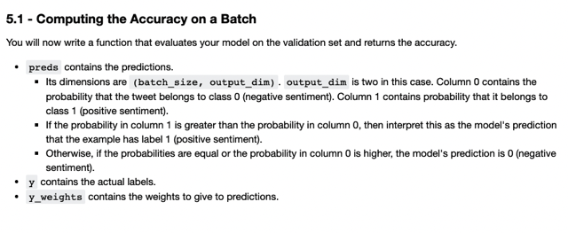</kbd>

     

- Exercise 7 - compute_accuracy (UNQ_C7)
   

    
    
<kbd>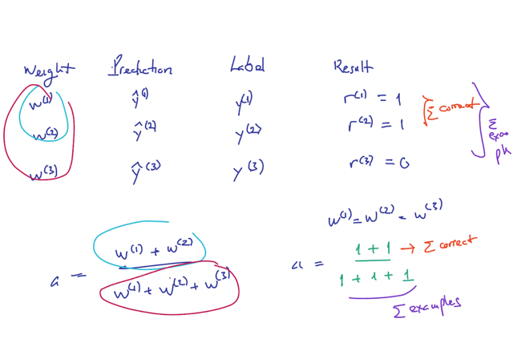</kbd>

    
<kbd></kbd>

    
<kbd>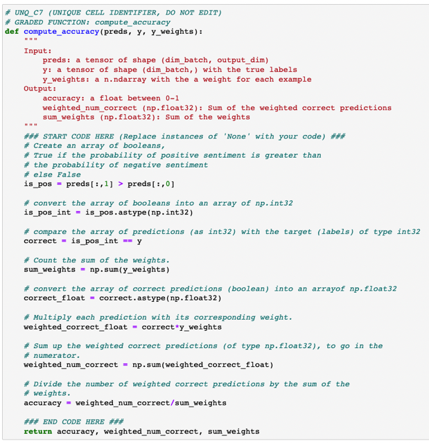</kbd>

> [!NOTE]
> Đáng chú ý ở đây tính **weighted accuracy** - accuracy **có tính tới
> weight assigned cho từng data sample.**
>
> Và công thức của nó sẽ là **tổng các weights của các example
> được predict đúng.**
> Chia cho **tổng các weights.**
>
> **Nếu các weight đều được assign bằng nhau** thì ta sẽ **có công
> thức tính accuracy thông thường** đó là **tổng số prediction đúng
> trên tổng số data example**

     

    
    
<kbd>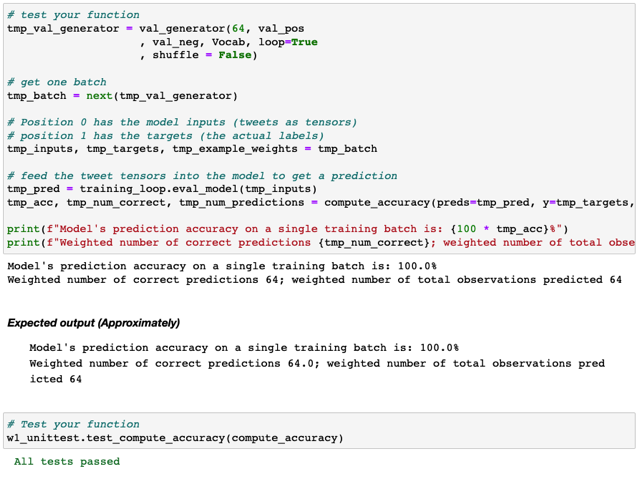</kbd>

     

- 5.2 - Testing your Model on Validation Data
   

    
    
<kbd>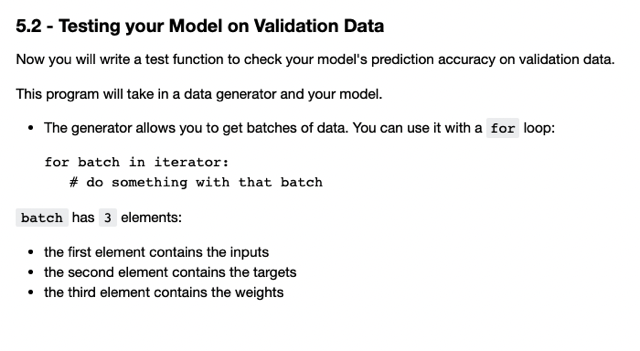</kbd>

     

- Exercise 8 - test_model (UNQ_C8)
   

    
    
<kbd>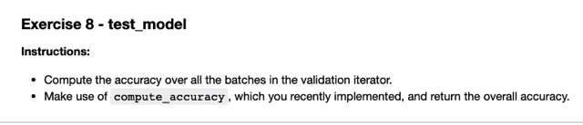</kbd>

    
<kbd></kbd>

    
<kbd>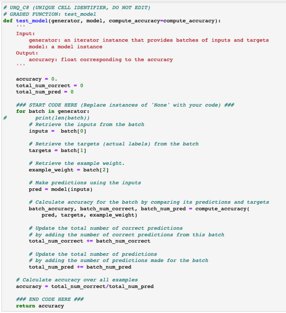</kbd>

     

    
    
<kbd>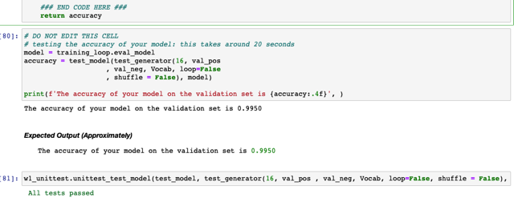</kbd>

     

### 6 - Testing with your Own Input

 

  
  
<kbd>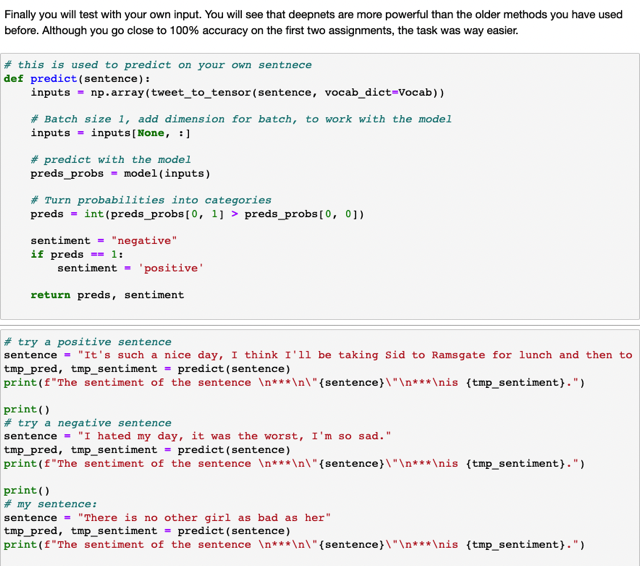</kbd>

   

  
  
<kbd>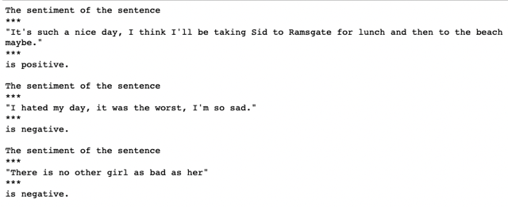</kbd>

   

### 7 - Word Embeddings

 

  
  
<kbd>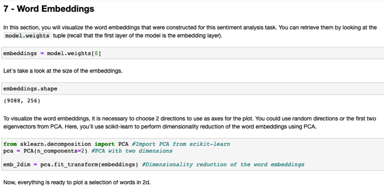</kbd>

> [!NOTE]
> Đại khái là lấy cái weight của Embedding layer ra (nhớ lại, nó nằm ở đầu tiên
> của network, nên lấy bằng index = 0)
>
> Sau đó xem thử shape thì ta thấy đúng như dự đoán nó sẽ có 9088 là vocab
> size hàng, và 256 cột, mỗi hàng sẽ là embedding vector của một từ trong
> vocab.
>
> Kế đến để plot, họ dùng ScikitLearn's PCA với n_components = 2 để giảm
> xuống từ 256 còn 2 dimensions.

   

  
  
<kbd>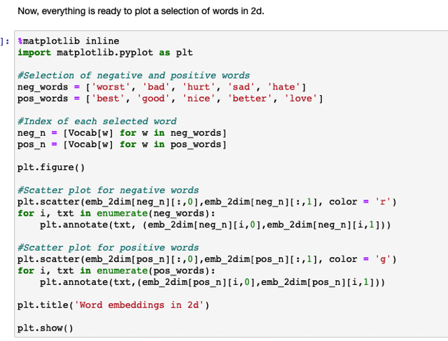</kbd>

> [!NOTE]
> Đại khái ở đây là define vài từ positive và negative, xong lấy id
> tức là vị trí của những từ này ra trong vocab. Sau đó, nó dùng
> những index này để lấy ra embedding vector (phiên bản đã giảm
> từ 256 xuống còn 2 dimension). Và plot ra

   

  
  
<kbd>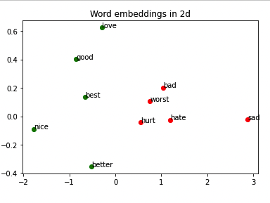</kbd>

> [!NOTE]
> As you can see, the word embeddings for this
> task seem to distinguish negative and positive
> meanings very well. However, clusters don't
> necessarily have similar words since you only
> trained the model to analyze overall
> sentiment.

> [!NOTE]
> Thì thấy positive words nằm một bên,
> negative words nằm một bên.

   

- On Deep Nets Deep nets allow you to understand and capture dependencies that you would have not been able to capture with a simple linear regression, or logistic regression.  It also allows you to better use pre-trained embeddings for classification and tends to generalize better.
   

