# C3W3_LSTMs AND NAMED ENTITY REGCONITION:  Learn about how long short-term memory units (\\*LSTMs\\*) solve the \\*vanishing gradient \\* problem, and how \\*Named Entity Recognition\\* systems quickly \\*extract important  information from text\\*. Then build your own Named Entity Recognition system using an  \\*LSTM and data from Kaggle!\\*  Learning Objectives   • \\*Vanishing gradients\\*  • \\*Named entity recognition\\*  • \\*LSTMs\\*  • \\*Feature extraction\\*  • \\*Part-of-speech tagging\\*  • \\*Data generators\\* 

📊 **Progress:** `63` Notes | `115` Screenshots

---

## Welcom

 

### This week explores named entity recognition or NAR for short, which is a sap task of

> [!NOTE]
> This week explores named entity recognition or NAR for short, which is a sap task of
> information extraction that locates and classifies named entities and text. The named
> entities could be organizations, persons, locations, times. For example, if you look at
> the sentence, the French people are visiting Morocco for Christmas, you will see that
> the word French is a geopolitical entity. Morocco is a geographic entity and Christmas
> is a time indicator. \**When you can recognize named entities and text then given an
> article, you can find the people, countries, organizations that are mentioned, and you
> can quickly pass and gather information about\**. \**You can use this information, for
> example, to do market research about certain topics by scraping the internet\**. When
> implementing NAR for this week, you will be using a \**long short-term memory unit\** or
> \**LSTM\**. LSTM's are \**similar to RNNs and GRUs\** except they have \**other gates that make
> them more powerful\**. Jonas will show you more about it. &gt;&gt; Yeah, let's get started.

 

## Rnns And Vanishing Gradients

 

### 1 Introduction to LSTM: The text introduces \\*long short-term memory (LSTM) cells\\* as a solution to

> [!NOTE]
> 1 Introduction to LSTM: The text introduces \**long short-term memory (LSTM) cells\** as a solution to
> the \**problems faced by conventional RNNs\**, namely the \**vanishing and exploding gradients\**.
>
> 2 Pros and cons of RNNs: \**RNNs\** are discussed in terms of their ability to \**model sequences\**,
> \**capture dependencies\**, and their \**relatively lightweight nature\**. However, they \**struggle with
> long-term dependencies\** and are \**prone to vanishing and exploding gradients\**.
>
> 3 Description of \**information propagation in RNN\**s: The \**process of propagating information\** from
> the beginning to the end of the sequence is explained, where computed values for each word are
> used to compute values for subsequent words.
>
> 4 \**Vanishing\** and \**exploding gradients\**: The consequences of vanishing gradients, where \**gradients
> exponentially decay\** as they \**propagate backward through time\**, and \**exploding gradients\**, where
> \**gradients grow uncontrollably,\** are described. These problems result in the\**loss of information from
> early steps\** or \**convergence issues\** during training.
>
> 5 \**Solutions for vanishing and exploding gradients\**: Some techniques to address these issues are
> briefly mentioned, including \**weight initialization\**, \**ReLU activation\**, \**gradient clipping\**, and \**skip
> connections.\**
>
> 6 \**Introduction to LSTM\** as a solution: The text concludes by mentioning that the next video will
> discuss LSTM as a \**solution to the problems of vanishing and exploding gradient\**s in RNNs.

 

  
  
<kbd>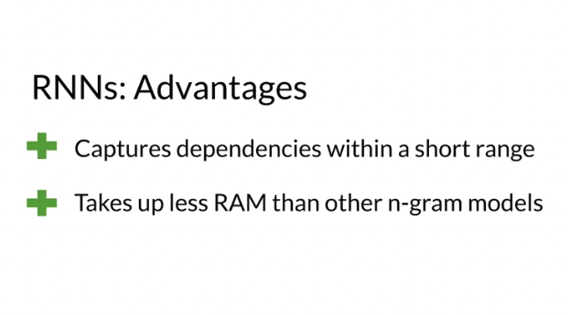</kbd>

  > Ưu điểm là captures được **short range dependencies** -
  > nôm na là n**hớ được, nắm bắt được quan hệ ngữ nghĩa
  > của các từ trong chuỗi** nhưng không quá xa. Và cũng **nhẹ
  > RAM hơn các N-gram model**

   

  
  
<kbd>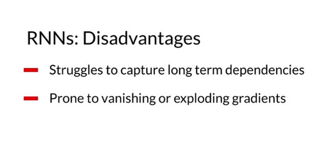</kbd>

  > Nhưng nhược điểm là **không nhớ tốt
  > được long term dependencies** và bị
  > **vanishing / exploding gradient**

   

  
  
<kbd>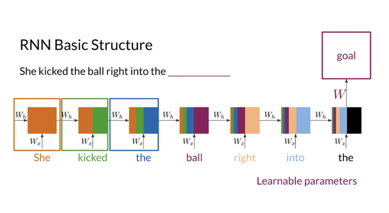</kbd>

  > 1 **Vanishing** and **exploding** **gradients**: These are problems that can occur in**recurrent neural
  > networks (RNNs)** when **propagating information** from the **beginning** to the **end** of a sequence.
  >
  > 2 Information propagation in **RNNs**: RNNs start by **computing values for the first word** in the
  > sequence and then **propagate those values to compute new values for the second word**, using
  > the previously computed values. This process continues for subsequent words in the sequence.
  >
  > 3 Illustration of information propagation: The text describes a visual representation where the
  > **orange area represents the first computed values**, and the **green area represents the second
  > word**. The process of computing new values for each word using the previous values is
  > depicted.
  >
  > 4 **Accumulation of information**: As the RNN progresses through the sequence, it **incorporates
  > information from all the previous words**. This accumulation **allows the RNN to predict the next
  > word based on the information contained in the entire sequence.**
  >
  > 5 Influence of **early steps**: The**information from the first step** in the sequence has **less impact
  > on the final outputs of the RNN**. This is evident from the decreasing influence of the orange
  > portion (representing the first step) with each subsequent step in the computation.

  > Đại khái**thông tin từ những step đầu** **ảnh hưởng rất nhỏ tới output
  > của những step cuối** lí do là **hiện tượng gradient vanishing** mà theo
  > GPT là do **eigenvalue của weight matrix nhỏ hơn 1 sẽ khiến
  > gradient tính ra nhỏ đi nhanh chóng (exponential decay)**  (Từ
  > DLSpec ta hiểu Vanishing Gradient nhưng cụ thể cái gì gây ra hiện
  > tượng này?) dẫn đến là **những tính toán từ step đầu ảnh hưởng
  > nhỏ đến cost function**

   

  
  
<kbd>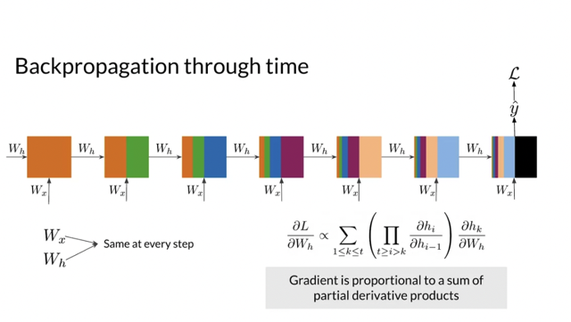</kbd>

  > The gradients are calculated using **backpropagation through time**, which sounds way
  > more **scary** than what it really is. As it would **simple backpropagation**. You just have to
  > apply the**chain rule multiple times**. Recall that the weights **W_h** and **W_x** are **the same
  > for each step**. Let's focus on the weights W_h. Noting that everything that I'll present to
  > you also applies to W_x, with the loss being computed at the T step sequence. The
  > **gradient with respect to W_h** would depend on the computations that are made this
  > every step. In fact, it is proportional to the s**um of products** of **hidden states, partial
  > derivatives**. This relationship can be found by **applying the chain rule** and the use of a
  > couple of tricks. But you **don't need to worry about the derivation** as much as the
  > implications behind this formula

  > Nói chung là đầu tiên cứ biết rằng **d Loss w.r.t W_h** sẽ
  > proportional với **sum của product của partial derivative của
  > hidden state w.r.t hidden state time step trước đó dh<t>/dh<t-1>**

   

  
  
<kbd>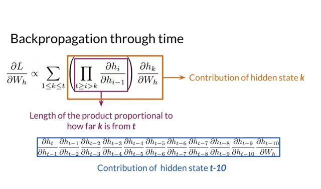</kbd>

  > Và product của chuỗi các partial derivative của
  > hidden state time-step hiện tại w.r.t hidden
  > state của time-step trước đó.

   

  
  
<kbd>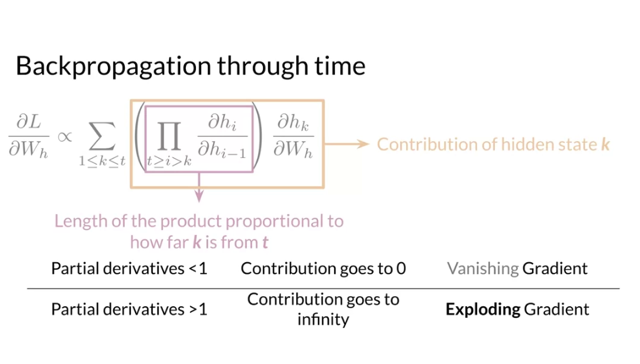</kbd>

  > Thì ý nói nếu P.d mà nhỏ hơn 1, nó sẽ nhân nhiều lần nhỏ hơn
  > 1 thì **dần dần thu nhỏ về 0** gây ra**Vanishing Gradient** còn
  > ngược lại nếu **P.d mà lớn hơn 1** thì nó được **khuếch đại
  > nhanh chóng** trở thành rất lớn gây ra **Exploding Gradient**

   

  
  
<kbd>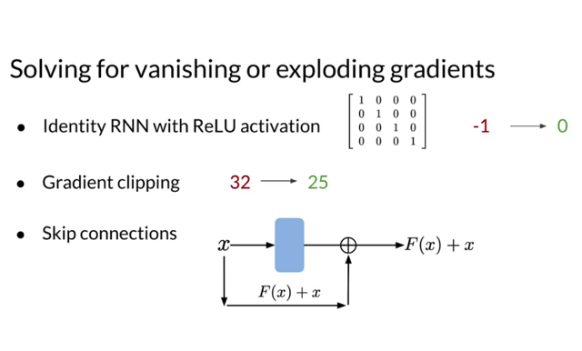</kbd>

  > You can deal with vanishing gradients by **initializing your weights to the identity matrix**,
  > which carries values of **one along the main diagonal** and **zero everywhere else**. Using a
  > **ReLU activation**. What this essentially does is **copy the previous hidden states** and
  > **information** from the current inputs and **replace any negative values with zero**. This has
  > the effect of **encouraging your network to stay close to the values of the identity
  > matrix**, which act like ones during matrix multiplication. This method is referred to
  > unsurprisingly as an **identity RNN**. The identity RNN approach **only works for vanishing
  > gradients** though, as a derivative of ReLU is equal to 1 for all values greater than zero.
  > To account for **values growing exponentially** you can perform**gradients clipping**. To clip
  > your gradient,**simply choose a relevant value** that you would **clip the gradient**to, say
  > 25. Using this technique, **any value greater than 25 will be clipped to 25**. This serves to
  > **limit the magnitude of the gradient**. Finally **skip connections**provide a **direct connection
  > to the earlier layers**. This effectively skips over the activation functions and adds the
  > value from your initial inputs x to you're outputs or f of x plus x. This way, activations
  > from early layers have more influence over the costs

  > **Một số giải pháp khắc phục** (trước khi có LSTM
  > là) **Identity RNN** để **giảm Vanishing gradient**,
  > **Gradient clipping** để **fix vấn đề exploding**
  > gradient và **Skip Connection.**

   

  
  
<kbd>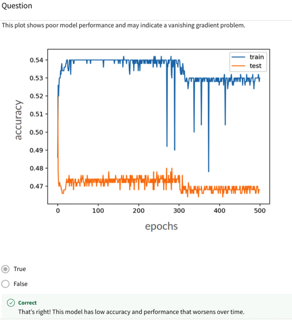</kbd>

   

## Rnns And Vanishing

> [!NOTE]
> RNNS AND VANISHING
> GRADIENTS (READING)

 

<kbd>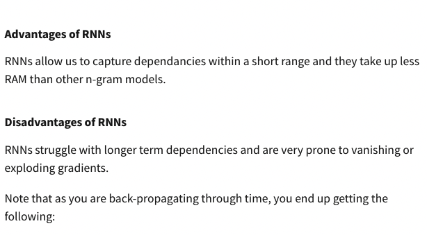</kbd>

 

<kbd>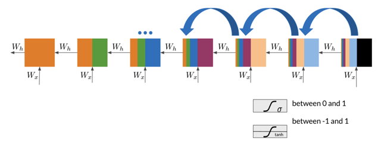</kbd>

> [!NOTE]
> Note that the **sigmoid** and **tanh functions** are bounded by **0 and
> 1** and **-1 and 1** respectively. This eventually leads us to a problem.
> If you have **many numbers that are  less than |1|**, then as you **go
> through many layers**, and **you take the product of those  numbers**,
> you **eventually end up getting a gradient that is very close to 0**. This
> introduces  the problem of **vanishing gradients.**

 

<kbd>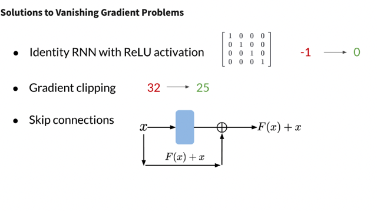</kbd>

 

## (optional) Reading Intro To

> [!NOTE]
> (OPTIONAL) READING INTRO TO
> OPTIMIZATION IN DEEP LEARNING:
> GRADIENT DESCENT

 

### https://blog.paperspace.com/intro-to-optimization-in-deep-learning-gradient-descent/

> [!NOTE]
> Bài viết rất hay về Gradient
> Descent. Quay lại sau

 

  
  
<kbd>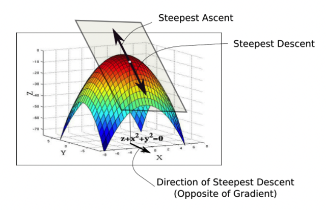</kbd>

   

  
  
<kbd>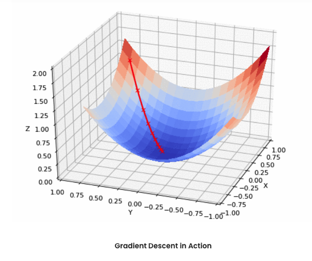</kbd>

   

  
  
<kbd>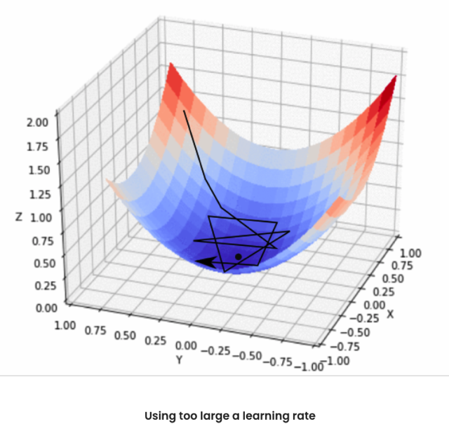</kbd>

   

  
  
<kbd>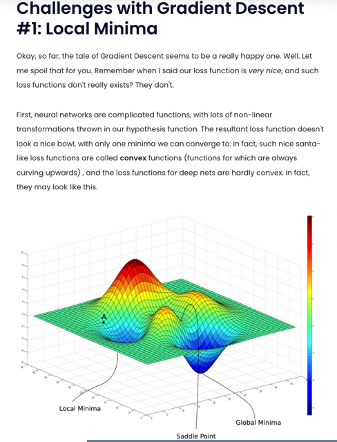</kbd>

   

  
  
<kbd>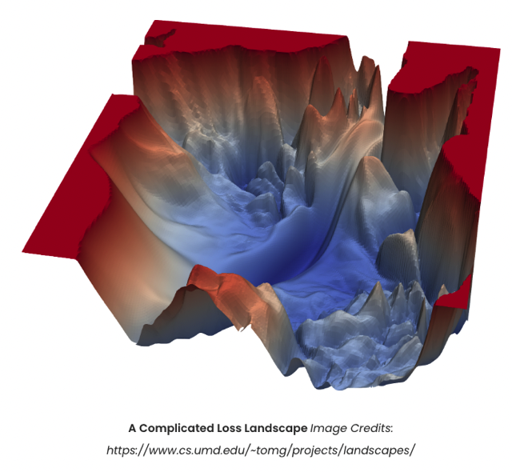</kbd>

   

  
  
<kbd>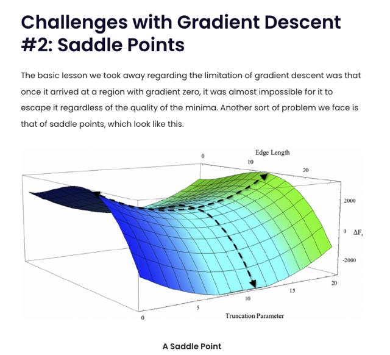</kbd>

   

## Lab: Exploding & Vanishing Gradients

 

<kbd>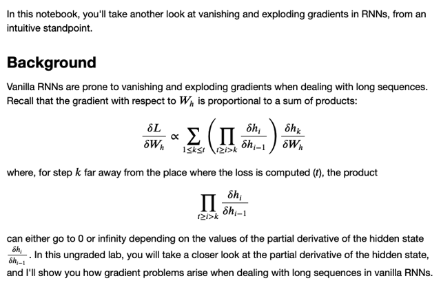</kbd>

> [!NOTE]
> **Partial derivative (P.D) of loss function w.r.t weight matrix Wh** - **dL/dWh** sẽ **tỉ lệ
> thuận** (proportional) với **tổng các product** của các **P.D** of **hidden state sau w.r.
> t hidden state trước** - **dh_i/dh_i-1**. Và ở đây người ta sẽ cho mình thấy **với k
> lớn** (tức cái chuỗi dài) thì cái **"tổng các product..."** này sẽ **trở nên vô cùng bé
> hoặc vô cùng lớn** gây ra hiện tượng **vanishing gradient hoặc exploding
> gradient.**

 

<kbd>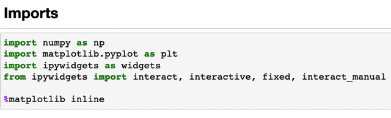</kbd>

 

<kbd>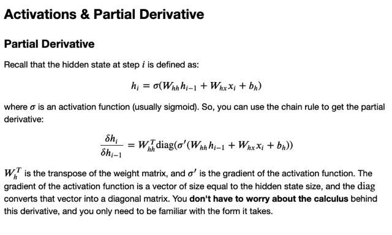</kbd>

> [!NOTE]
> Công thức của hidden state
> trong RNN, và partial derivative
> của h_i w.r.t h_i-1.

 

<kbd>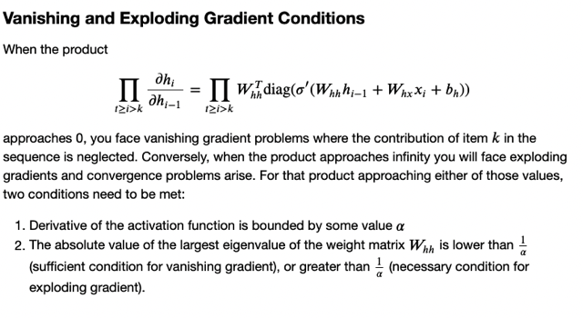</kbd>

> [!NOTE]
> Điều kiện để gây ra V.G hoặc E.G:
>
> 1. Đạo hàm của activation function bị rằng buộc bởi một giá trị
> alpha nào đó
>
> 2. Giá trị tuyệt đối của cái eigenvalue lớn nhất của matrix Whh
> mà nhỏ hơn 1/alpha, thì gây vanishing gradient, lớn hơn
> 1/alpha thì gây exploding gradient

 

<kbd>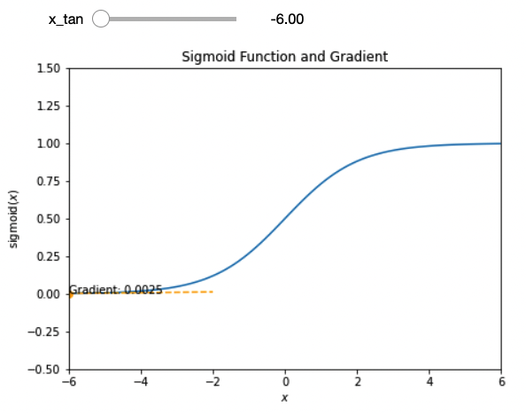</kbd>

> [!NOTE]
> Với x = -6, sigma(x) ~=0, và
> dsigma(x)/d(x) ~= 0.0025

 

<kbd>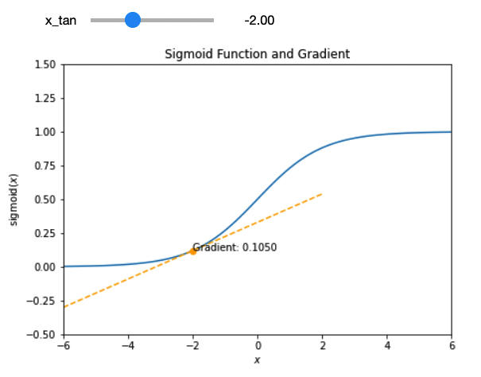</kbd>

> [!NOTE]
> Với x = 2, sigma(x) = đâu đó 0.1, và
> dsigma(x)/d(x) ~= 0.1050

 

<kbd>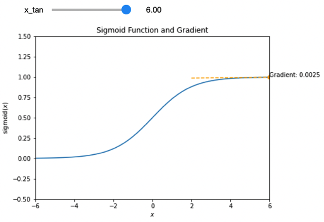</kbd>

> [!NOTE]
> Với x = 6, sigma(x) ~=1, và dsigma(x)/d(x) ~= 0.0025
>
> Ta thấy, khi x<-6 và x>6, sigma(x) ~= 0 và ~=1,  giá trị của
> dsigma(x)/d(x) không bao giờ vượt con số 0.0025.
>
> Chưa hiểu sao người ta lại nói sigmoid function is bounded by
> alpha = 1/4 nhưng chắc cũng liên quan.
>
> Vậy thì nếu thoả mãn điều kiện eigenvalue lớn nhất của Whh mà
> nhỏ hơn 1/alpha  = 4 thì sẽ gây V.G. Còn ngược lại sẽ gây E.G

> [!NOTE]
> As you checked, the derivative of the sigmoid function is bounded by  𝛼=14  . So
> vanishing gradient problems will arise for long-term components if the largest
> eigenvalue of  𝑊ℎℎ   is lower than 4, and exploding gradient problems will happen if
> the largest eigenvalue is larger than 4.

 

<kbd>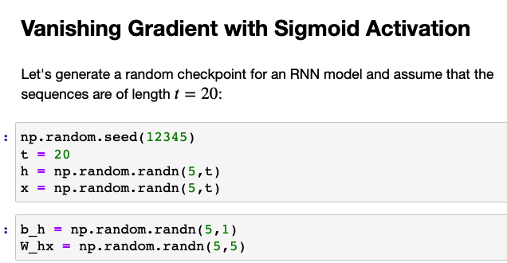</kbd>

> [!NOTE]
> Đoạn này ý là giả bộ có một RNN model, và sequence len = 20: có
> 20 time-step
>
> Giả bộ giá trị của x(i) - là tensor 20x5 - 20 time-step, mỗi input tại
> mỗi time-step x(i)<t> là một vector có len = 5
>
> Và hidden state cũng vậy, cũng là vector len 5 tại mỗi timestep h<t>
>
> Và dĩ nhiên Whx phải là 5x5 matrix, bh 5x1.

 

<kbd>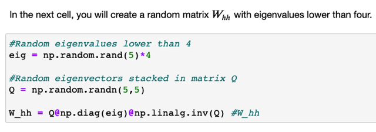</kbd>

> [!NOTE]
> 1 Random Eigenvalues: The line "eig = np.random.rand(5)*4" **generates an array of 5
> random numbers between 0 and 1** using **np.random.rand(5)**. These numbers are then
> **multiplied by 4**, resulting in **random eigenvalues that are lower than 4**. The array eig
> represents the eigenvalues.
>
> 2 Random Eigenvectors: The line "Q = np.random.randn(5,5)" creates a 5x5 matrix Q with
> random values drawn from a standard normal distribution using np.random.randn(5,5).
> These values represent the random eigenvectors.
>
> 3 Computation of W_hh: The next line of code "W_hh = \_Q@np.diag\_(eig)@np.linalg.
> inv(Q)" computes the matrix product of three matrices: Q, a diagonal matrix formed from the
> eigenvalues eig using np.diag(eig), and the inverse of Q calculated using np.linalg.inv(Q).
> This multiplication results in the matrix W_hh.

 

<kbd>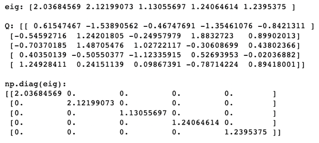</kbd>

> [!NOTE]
> Tạo một matrix Whh sao cho nó có wigenvalue < 4 (max eigenvalue < 4
> để mô phỏng điều kiện Vanishing Gradient).
>
> Đầu tiên là np.random.rand(5) sẽ tạo vector chứa 5 số trong khoảng 0,
> 1. Đem nhân 4 thì được một vector mà các giá trị không lơn hơn 4. 5
> con số này đóng vai trò là 5 eigenvalues và nhắc lại max của chúng
> không quá 4.
>
> Dòng thứ 2 tạo ra matrix 5x5 random từ normal distribution - đóng vai
> trò random eigenvectors.
>
> Dòng thứ 3, np.diag(eig) sẽ tạo ra diagonal matrix - tạo matrix 5x5 mà
> số 0 hết, chỉ có đường chéo tạo bởi các giá trị của eig. Cuối cùng nó
> tính Whh.

 

<kbd>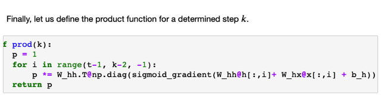</kbd>

> [!NOTE]
> Kế tới là define một function để tính
> product của công thức trên

 

<kbd>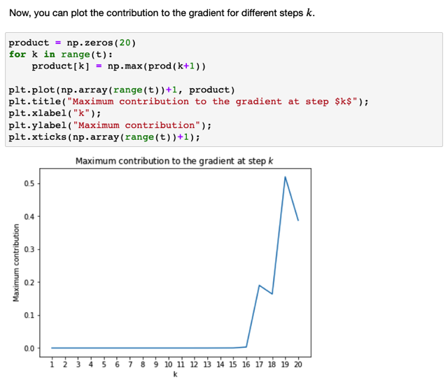</kbd>

> [!NOTE]
> With the l**argest eigenvalue of the weight matrix**𝑊**ℎℎ   being lower than 4** --with a **sigmoid
> activation function**, the **contribution of the early items in the sequence to the gradient go to
> zero**. In practice, this will **make your RNN rely only upon the most recent items** in the series.

> [!NOTE]
> Thì đại khái đồ thị cho ta thấy **contribution của các time-step khác
> nhau từ 1 tới k đối với gradient cũng là contribution với loss function**
> cho thấy: **contribution của những time-step từ 16 trở về trước hầu
> như bằng 0**, hệ quả nôm na là :
>
> **khi model tính loss và dùng gradient để điều chỉnh weight** **để có
> thể predict đúng hơn ở một time step k** thì **hầu như gradient chỉ bị
> ảnh hưởng bởi những time-step gần đó**, **còn ở xa xa hầu như
> không có**.
>
> Cho nên, **ý nghĩa của nó đó là:** **từ được dự đoán ở timestep k**
> **chỉ phụ thuộc hay dựa trên một số từ gần gần đó thôi**, **không thể
> có long-range dependency** hay **ảnh hưởng bởi những từ ở đầu câu
> ở xa**

 

<kbd>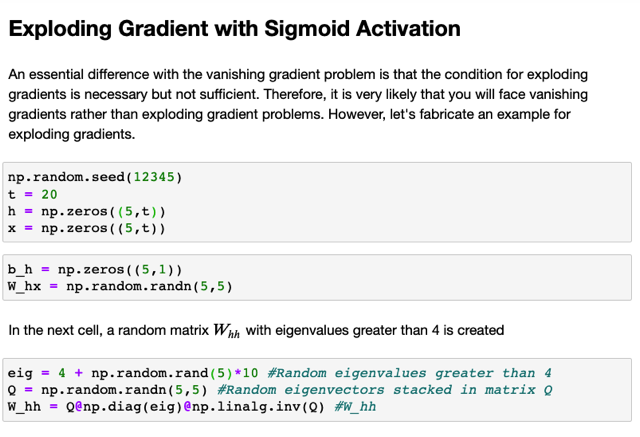</kbd>

> [!NOTE]
> Ý ổng nói với Exploding gradient thì điều kiện 2 (max value of
> eigenvalue >4) là điều kiện cần chứ không phải điều kiện đủ, nên hiện
> tượng V. G dễ xẩy ra hơn E.G. Tương tự, cũng giả bộ một RNN có
> trạng thái gây ra E.G

 

<kbd>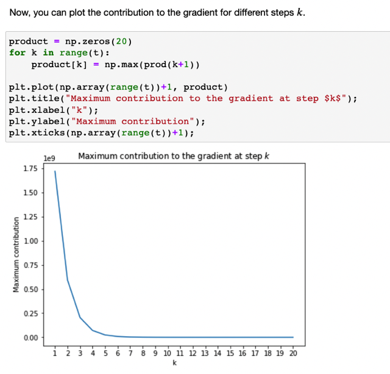</kbd>

> [!NOTE]
> With the **largest eigenvalue of the weight matrix**𝑊**ℎℎ being greater than 4**
> --with a sigmoid activation function, the **contribution of the early items in the
> sequence to the gradient goes to infinity**. In practice, this will **make you face
> convergence problems during training.**

> [!NOTE]
> Thì hình vẽ cho thấy , contribution của các time-step ở
> xa đối với gradient lớn vô cùng, gây ra các vấn đề
> converge. Đó chính là Exploding Gradient

 

### Now you are more familiar with the \\*conditions for vanishing and exploding

> [!NOTE]
> Now you are more familiar with the \**conditions for vanishing and exploding
> gradient problems\**. You should take away that for \**vanishing gradient it is
> sufficient to satisfy\** an \**eigenvalue condition\**, while for the \**exploding gradient
> problem it is neccesary but not enough\**. I used the weight matrix  𝑊ℎℎ   in this
> discussion, but everything exposed here\**also applies\** for  𝑊ℎ𝑥  .
>
> Solution One solution is to use RNN architectures \**specially designed\** to avoid
> these problems (like GRUs and LSTMs). Other solutions involve
> \**skip-connections or gradient clipping\**. But those are both discussions for another
> time.

 

## Introduction To Lstms

 

### 1 \\*LSTMs\\* are the \\*best-known solution\\* to the \\*vanishing gradients problem\\* in \\*recurrent neural

> [!NOTE]
> 1 \**LSTMs\** are the \**best-known solution\** to the \**vanishing gradients problem\** in \**recurrent neural
> networks (RNNs)\**.
>
> 2 LSTMs are a \**special variety of RNNs \**designed to \**handle entire sequences of  data\** by \**learning
> when to remember and forget information.
> \**
> 3 LSTMs consist of a \**cell\** \**state\** (\**memory\**) and a \**hidden state\** where  computations are performed
> during training to decide on changes to make.
>
> 4 LSTMs have\**multiple gates\** (\**forget\** gate, \**input\** gate, \**output\** gate) that \**allow  information to flow
> through the network\**, \**avoiding vanishing or exploding gradients\**.
>
> 5 The \**concept of LSTMs\** can be related to how \**humans handle conversations  and retain relevant
> information while discarding irrelevant details\**.
>
> 6 Applications of LSTMs include \**language models, chatbots, music composition,  automatic image
> captioning, and speech recognition.\**
>
> 7 LSTMs have \**revolutionized natural language processing (NLP) \**and are \**widely  used\** for various
> tasks in this domain.
>
> 8 The LSTM architecture involves computations through three gates:\**forget gate,  input gate, and
> output gate.
> \**
> 9 LSTMs have become popular due to their ability to\**overcome the limitations of  traditional RNNs.\**
>
> Overall, LSTMs are powerful tools that have significantly advanced the field of natural language
> processing and other related tasks by efficiently processing sequential data while avoiding
> gradient-related issues.

 

  
  
<kbd>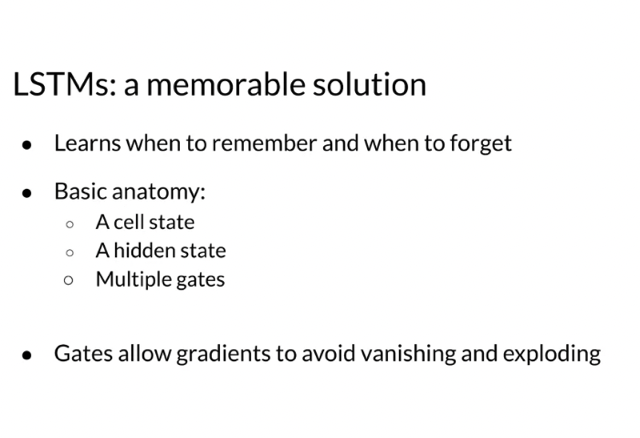</kbd>

   

  
  
<kbd>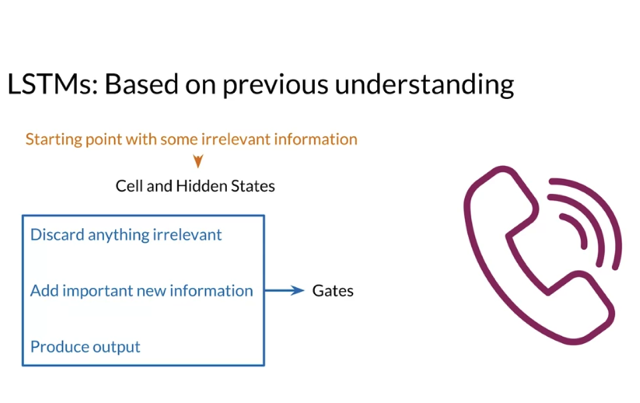</kbd>

  > So sánh với việc con người handle một conversation:
  >
  > Bỏ thông tin không còn quan trọng (irrelevant) - Forget gate.
  >
  > Thêm thông tin mới quan trọng (Input gate).
  >
  > Product output (output gate)

   

  
  
<kbd>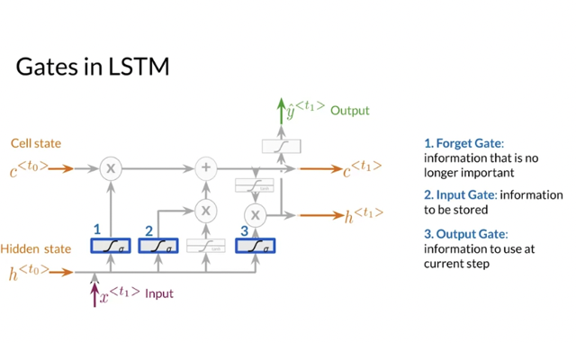</kbd>

  > Thông tin đi từ time-step trước sẽ bị chặn bởi Forget gate (số 1), gate
  > này (cũng như các gate khác) sẽ được model dựa trên thông tin từ
  > current input và hidden state trước để quyết định nên giữ hay bỏ, giữ
  > nhiều hay ít thông tin từ time-step trước c<t0> trong cell state này
  > c<t>.
  >
  > Input và hidden state trước sẽ được kết hợp để tính c~<t> và cho
  > qua Input gate để quyết định sẽ sử dụng hay không, nhiều hay ít
  > trong cell state.
  >
  > Như vậy thông qua Forget gate, input gate, thông tin cell state sẽ có
  > chứa thông tin nào được giữ lại từ previous time-step , và thông tin
  > mới ở time-step <t> nào được cho vào.
  >
  > Cuối cùng, output gate sẽ quyết định thông tin nào của cell state sẽ
  > được dùng để output và save vào hidden state để pass qua next time-step

   

  
  
<kbd></kbd>

   

  
  
<kbd>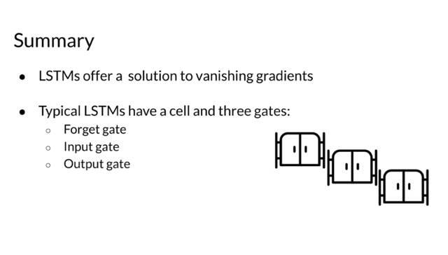</kbd>

   

## Lstm Architecture

 

### 1 The architecture of an LSTM involves a cell state, a hidden state, input (x), and output (y).

> [!NOTE]
> 1 The architecture of an LSTM involves a cell state, a hidden state, input (x), and output (y).
>
> 2 The \**cell state\** functions as the \**memory of the network\** and gets modified using information from
> the input and previous hidden state.
>
> 3 LSTMs use three gates to control the flow of information: \**forget gate, input gate, and output gate.\**
>
> 4 \**Sigmoid\** activation functions are applied to the input and previous states for the gates, ensuring
> values are \**between 0 and 1.\**
>
> 5 The \**forget gate \**decides \**what information to keep or discard\** from the \**previous cell state.\**
>
> 6 The \**input gate\** selects \**relevant information\** from the \**input and previous hidden state.\**
>
> 7 The \**candidate cell state\** is computed by transforming information from the \**previous hidden states\**
> and \**current inputs\** using a \**hyperbolic tangent activation function\**.
>
> 8 The \**new cell state\** is \**updated\** by \**adding the candidate cell state information\** that \**passes
> through the input gates\** to the cell state information that passes through the forget gate.
>
> 9 The \**new hidden state\** is \**computed\** by p\**assing transformed information\** from the \**new cell state
> through the output gate.\**
>
> 10 Some LSTM architectures \**directly pass the new cell state\** through the output gate \**without applying
> the hyperbolic tangent activation.\**
>
> 11 LSTMs are powerful tools for handling sequential data, and the understanding of their architecture and
> computations is essential for implementing them.
>
> The text provides a detailed explanation of the LSTM architecture, describing the functions of different
> components (cell state, gates, candidate cell state, hidden state) and their interactions. It emphasizes the
> importance of LSTMs in handling sequential data and their practical applications in solving NLP tasks.

 

  
  
<kbd>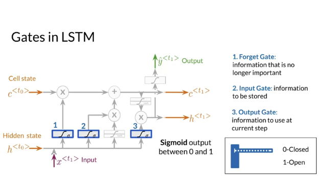</kbd>

   

  
  
<kbd>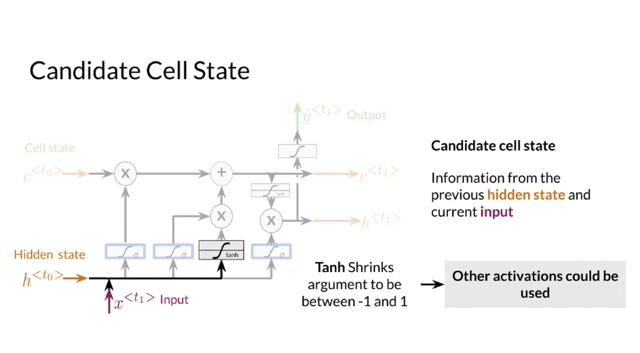</kbd>

  > **Input** và **hidden state trước** sẽ được kết hợp để tính **c~<t>** và
  > cho qua **Input gate** để quyết định sẽ **sử dụng hay không, nhiều
  > hay ít** trong **cell state.**Và tanh giúp ổn định, kiểm soát giá trị
  > không cho quá cao hay quá thấp, khắc phục tình trạng vanishing &
  > exploding gradient.

   

  
  
<kbd>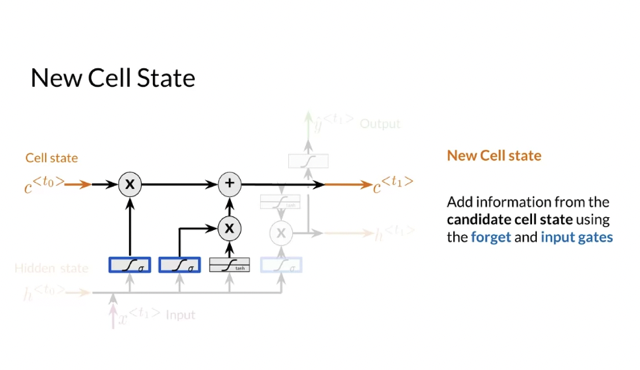</kbd>

  > Như vậy thông qua **Forget gate**, **Input gate**, thông tin **cell state sẽ
  > có chứa thông tin nào được giữ lại từ previous time-step**, và**thông
  > tin mới ở time-step <t> nào được cho vào**

   

  
  
<kbd>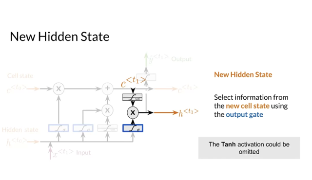</kbd>

  > Cuối cùng, **output gate** sẽ quyết định thông tin nào của
  > cell state sẽ được dùng để **output** và save vào **hidden
  > state** để **pass qua next time-step**

   

  
  
<kbd>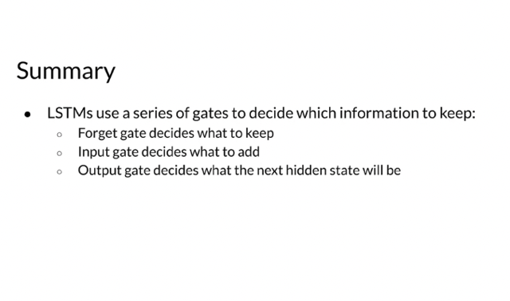</kbd>

   

## Introduction To Named

> [!NOTE]
> INTRODUCTION TO NAMED
> ENTITY RECOGNITION

 

### 1 Named Entity Recognition (NER) is an \\*essential problem in natural language processing (NLP)\\*, and many

> [!NOTE]
> 1 Named Entity Recognition (NER) is an \**essential problem in natural language processing (NLP)\**, and many
> NLP systems use \**NER components\**.
>
> 2 NER systems \**locate and extract named entities from text,\** which can be anything from \**places\**,
> \**organizations\**, and \**people's names\** to times and dates.
>
> 3\**NER systems\** use \**labels\** to \**classify entities\**. Some common classes include \**geographical entities,\**
> \**organizations, geopolitical entities, time indicators, artifacts, and person names.\**
>
> 4 \**NER\** is useful for \**content classification\** and o\**ptimizing search engine efficiency\** by \**quickly scanning large
> amounts of text\** for specific words or entities.
>
> 5 Real-world applications of NER systems include \**optimizing search engine efficiency\**, making
> \**recommendations\** based on user history, \**matching customers\** to appropriate service agents, and even
> \**automatic trading\** using sentiment analysis on news articles.
>
> 6 NER systems have \**numerous applications in the field of deep learning\**, and \**their ability to extract and
> identify entities\** plays a \**vital role in various NLP tasks.\**
>
> The text provides an overview of what NER is, its \**significance\** in NLP, and its \**practical applications\** in
> various domains. It highlights the \**versatility of NER systems \**in \**extracting relevant information from text\** and
> how they can be \**employed to improve efficiency in different tasks\**, from search engines to customer service
> and trading applications.

 

  
  
<kbd></kbd>

   

  
  
<kbd></kbd>

   

  
  
<kbd></kbd>

   

  
  
<kbd>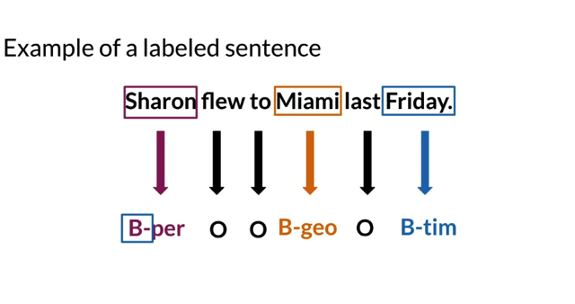</kbd>

   

  
  
<kbd></kbd>

   

## Lstm Equations

 

<kbd>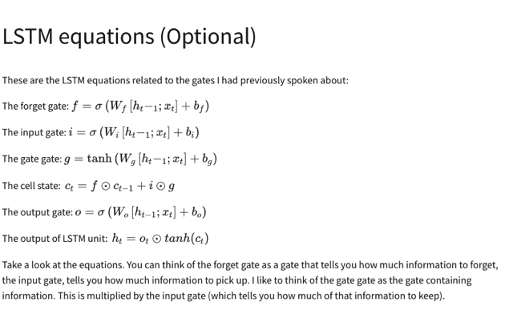</kbd>

 

## Training Ners: Data Preprocessing

 

### 1 To train a \\*Named Entity Recognition (NER) system\\*, the first step involves \\*converting entity classes\\* and

> [!NOTE]
> 1 To train a \**Named Entity Recognition (NER) system\**, the first step involves \**converting entity classes\** and
> \**labeled data\** into \**arrays of numbers\** that correspond to each other.
>
> 2 \**Each entity class \**is assigned a\**unique number\**, and \**each word in the sentence\** is \**assigned a number
> corresponding to its entity class\**.
>
> 3 The s\**equences of numbers\** are transformed\**\**into\**numerical arrays\**, and to handle \**different sequence
> lengths,\** a \**padding token is added to fill empty spaces.\**
>
> 4 Data is processed in \**batches\** using a \**data generator\** to \**speed up processing time.\**
>
> 5 The \**NER\** \**system\** architecture includes\**feeding the input data through an LSTM layer,\** followed by a \**fully
> connected (dense) layer\** and using \**log softmax for prediction\**.
>
> 6 \**Log softmax\** is preferred over softmax for \**better numerical performance\** during optimization.
>
> 7 The layers in the NER system include the\**LSTM layer, a dense layer, and a log softmax activation\**
> function.
>
> 8 After implementing these steps, the NER system is \**ready for training and evaluation.\**
>
> The text outlines the \**steps involved in training a NER system\**, including \**data preprocessing\**, \**batch
> processing\**, and\**building the NER model architecture\**. It also emphasizes the progress made throughout
> the course in understanding and implementing these concepts. The next step is to evaluate the trained
> NER system, completing the process of \**building a fully functional NER model from scratch\**.

 

  
  
<kbd>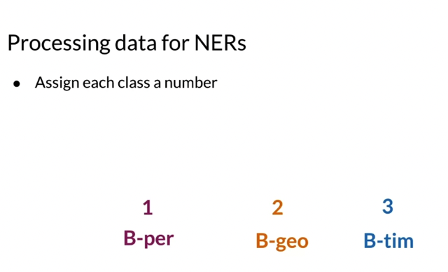</kbd>

  > Assign mỗi class 1 number ví
  > dụ "Tên riêng" = 45

   

  
  
<kbd>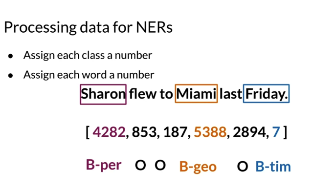</kbd>

  > Chỗ này chưa hiểu lắm là assign mỗi từ một number là
  > number gì, là index trong vocab hay class number?

   

  
  
<kbd>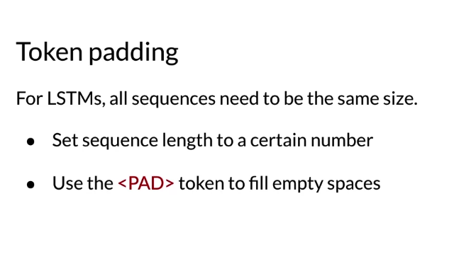</kbd>

  > Không có gì mới, các câu phải được padding để bằng size
  > nhau hết thường size câu dài nhất. Cái này cũng tương tự
  > các image trong 1 batch phải cùng size vậy

   

  
  
<kbd>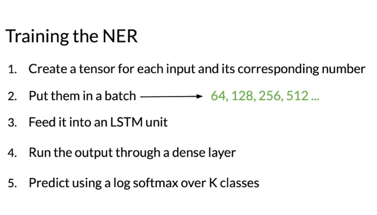</kbd>

  > Quá trình training

   

  
  
<kbd>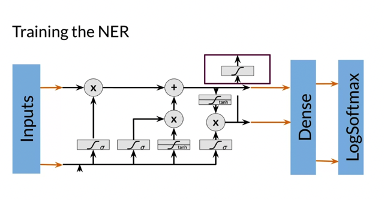</kbd>

  > Output dùng log-softmax . Tức là lấy
  > log trên kết quả của softmax.

   

- We use Log Softmax instead of Softmax in training the Named Entity Recognition (NER) neural network model mainly for \\*numerical stability\\* and \\*computational efficiency\\* during optimization.  The \\*Softmax\\* function is used to convert the \\*raw scores (logits)\\* produced by the last layer of the neural network \\*into probabilities\\*. However, \\*exponentiating large logits\\* in Softmax can \\*lead to numerical instability\\*, as exponential values can grow very quickly, potentially \\*causing overflow\\* or \\*loss of precision in floating-point representations\\*.  On the other hand, \\*Log Softmax\\* is a \\*more numerically stable\\* alternative. \\*Instead of exponentiating the logits\\*, Log Softmax computes the \\*logarithm of the Softmax probabilities\\*. This \\*avoids the issues of exponential growth\\* and helps \\*maintain numerical stability\\* during training.  Using Log Softmax also provides \\*computational advantages\\* during \\*optimization\\*, especially in deep neural networks like NER models. When computing gradients during backpropagation, \\*taking the logarithm of the Softmax probabilities allows for simpler and more efficient computations\\*. It \\*simplifies the calculations\\* when performing the chain rule to compute gradients, \\*reducing computational complexity\\* and \\*speeding up the training process.\\*  In summary, using Log Softmax in training NER neural network models ensures numerical stability and enhances computational efficiency during optimization, making the training process more reliable and faster.
  > Đại khái là quá trình tính **Softmax** khiến **giá trị có thể rất
  > lớn do tính e^**, dẫn đến tiềm ẩn **nguy cơ bị numerical
  > instability như overflow** hoặc**loss precision** trong floating
  > point representation. Một cái nữa là khi **backprob, tính
  > derivative của log softmax đơn giản hơn** cho việc tính
  > toán dẫn đến**training nhanh hơn**

   

    
    
<kbd>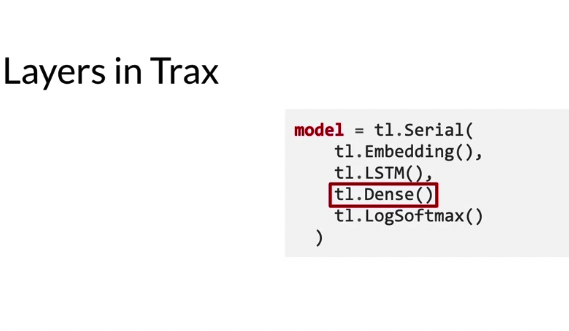</kbd>

    > Define LSTM neural network nhờ
    > Trax trở nên rất đơn giản

     

    
    
<kbd>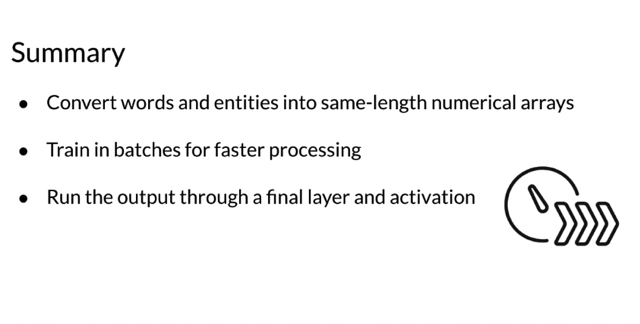</kbd>

     

    
    
<kbd>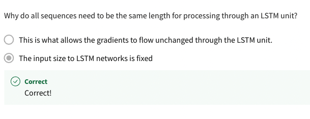</kbd>

     

## Reading: Lstm (dlspec C5)

 

## Compute Accuracy

 

<kbd>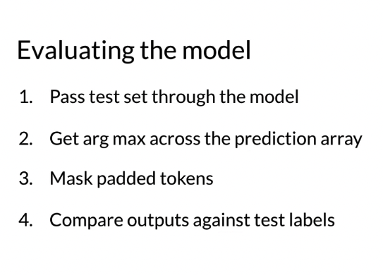</kbd>

> [!NOTE]
> Đại khái là evaluate model bằng cách **tính accuracy của model trên test
> set**. thì đây là bài toàn **NER - Named Entity Recognition** nên cơ bản
> nó là **multi-class classification** - **predict label của một từ trong số
> nhiều label có thể có**.
>
> Thì khi model nó **predict một từ (tại một time-step)** thì nó có dạng
> **vector các probability** có độ dài là **số label (Entity class)**, thì **thằng
> nào có P lớn nhất sẽ được chọn**, và**index** của nó chính là "kết luận"
> sẽ  đem so với **g.t.label (label của mỗi từ cũng chính là index của một
> Entity class nào đó)**
>
> Thì việc ta **xác định thằng có P lớn nhất đó rồi lấy index của nó** chính
> là "**arg max across prediction array".**Ý thứ 3 đại khái là đối với token đóng vai trò là padding thì tất nhiên ta
> không tính đúng sai gì đối với nó, cho đó mới nói là **Mask padded
> token** ý nói **khi tính accuracy thì che padded token lại, không tính nó.**
> Cuối cùng với các **" kết luận" về entity class của các từ trong sequence
> mà model predict, ta đem so với labe**l. Xem phần trăm đúng là bao
> nhiêu.

 

<kbd>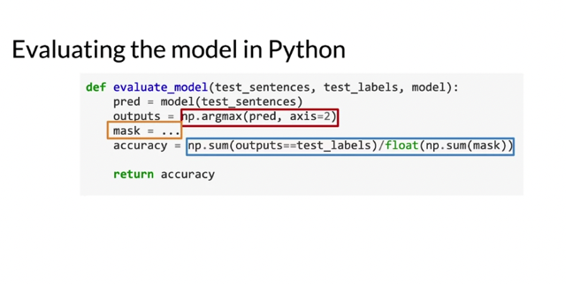</kbd>

> [!NOTE]
> 1. Như đã phân tích, ta **cần lấy index của vị trí có giá trị cao nhất trong  probability
> vector.**
>
> Nhưng không chỉ có 1 vector mà là một list Tx từ nên có Tx vector vector. Và lại có
> batch câu.
>
> Nên **prediction output tensor y^**sẽ có shape là  batch x Tx (chiều dài sequence) x
> n_classes.
>
> Do đó **trục thứ nhất axis = 0** là **batch size** lấy trong trục này là **lấy một câu nào
> đó trong batch.**
>
> **Trục thứ hai axis = 1** là **số từ Tx** hay đúng hơn là token trong sequence. Loop
> trong đây là **loop trong các từ | time-step trong câu.**
>
> **Trục thứ ba, axis = 2** mới là **probability vector**. Vậy để lấy index mà có giá trị p
> max trong từng vector thì phải để axis = 2
>
> 2. Cái mask sẽ làm như thế nào cụ thể trong Assignment sẽ note
>
> 3.Cái cuối chính là **so sánh output** với **ground-truth label**, mà y sẽ có shape là:
> **Batch x Tx**: Có batch câu, mỗi câu có Tx từ (có thể sẽ lấy Tx là câu dài  nhất trong
> batch) Mỗi từ gắn với index của Entity class
>
> -> shape y: **batch_size x Tx**
>
> Kết quả của output sau khi lấy argmax của y^ cũng là **batch_size x Tx.** **So sánh
> hai thằng đó sẽ ra một tensor mà chỗ nào chúng nó bằng  nhau thì là True, ngược lại
> thì False**. Do đó **sum hết lại chính là những từ được predict Named Entity đúng.**
>
> Sau đó chia cho sum(mask). **Khả năng cao mask ta sẽ tạo một tensor số 1 hết, trừ
> chỗ nào là padded token sẽ là 0**. Nên sum **mask tính là tất cả các từ trong tensor.**

 

<kbd>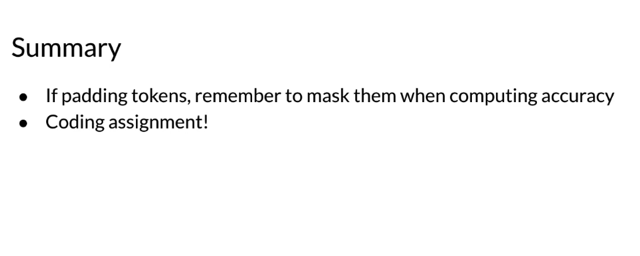</kbd>

 

## Week Conclusion

 

## Quiz

 

<kbd></kbd>

 

<kbd>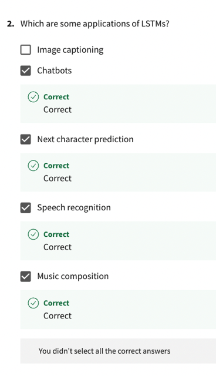</kbd>

> [!NOTE]
> Hoá ra image captioning
> cũng dùng LSTM

 

<kbd>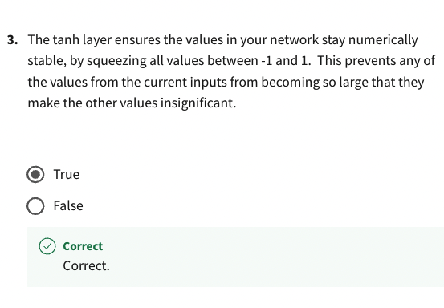</kbd>

 

<kbd>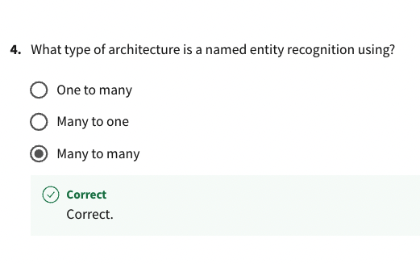</kbd>

 

<kbd></kbd>

 

<kbd>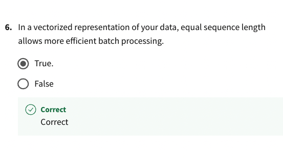</kbd>

 

<kbd></kbd>

 

<kbd>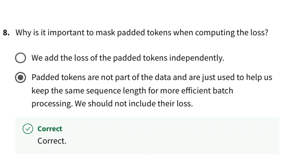</kbd>

 

<kbd>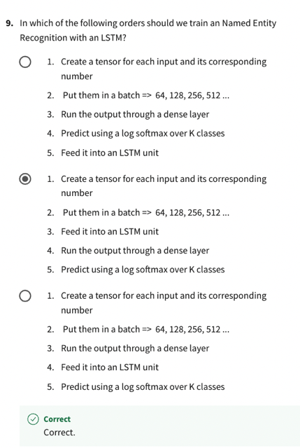</kbd>

 

## P.A: Named  Entity Recognition

 

### Welcome to the third programming assignment of Course 3. In this assignment,

> [!NOTE]
> Welcome to the third programming assignment of Course 3. In this assignment, 
> you will  learn to \**build more complicated models\** with \**Trax\**. By completing this
>  assignment, you will be able to:
>  • \**Design the architecture of a neural network\**, \**train it, and test it.
> \** • \**Process features\** and \**represents\** them
>  • Understand \**word padding\**
>  • Implement \**LSTMs\**
>  • \**Test\** with your own sentence

 

- Introduction
   

    
    
<kbd></kbd>

    > NER là một subtask của **Information extraction**. Ở đây ta sẽ build một cái model
    > làm nhiệm vụ này và train nó để đạt **75% accuracy** trong vài giây. Rồi lại **load một
    > cái y vậy những được đã được train lâu hơn** và evaluate nó sẽ thấy nó đạt tới **96%
    > accuracy**.

     

    
    
<kbd>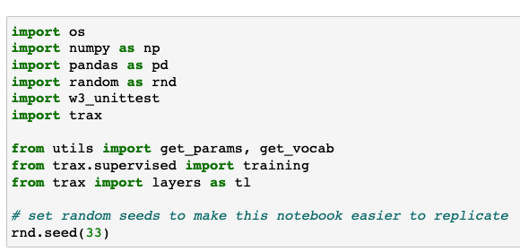</kbd>

     

- 1 - Exploring the Data
   

  
  - We will be using a dataset from \\*Kaggle\\*, which we will \\*preprocess\\* for you.  The \\*original data\\* consists of \\*four columns\\*: the \\*sentence number\\*, the \\*word\\*,  the \\*part of speech of the word\\*, and the \\*tags\\*. A few tags you might expect to see are:  \\*geo\\*: \\*geographical\\* entity \\*org\\*: \\*organization\\* \\*per\\*: \\*person\\* \\*gpe\\*: \\*geopolitical\\* entity \\*tim\\*: \\*time\\* indicator \\*art\\*: \\*artifact\\* \\*eve\\*: \\*event\\* \\*nat\\*: \\*natural phenomenon\\* O: \\*filler word\\*
     

      
      
<kbd>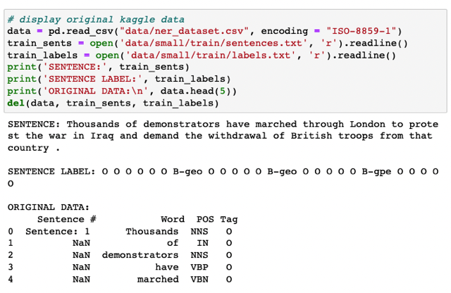</kbd>

      > Dataset này sẽ lấy từ **Kaggle**, được **preprocess giùm** để có dạng như sau:
      > **Mỗi data sample** **x sẽ là một sentence**. **Label sẽ là một chuỗi**, **tương
      > ứng mỗi vị trí của từ trong câu là một tag** ví dụ như **B-geo (geographical
      > entity), B_gpe (geopolitical entity), O (filler word)**.
      >
      > Original (Chưa preprocess data) thì có dạng 4 columns như bên dưới tất nhiên ta
      > sẽ làm việc với bộ data đã preprocessed sẵn

       

- 1.1 - Importing the Data
   

    
    
<kbd>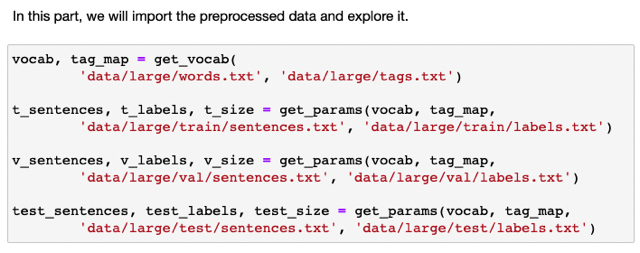</kbd>

    > Sử dụng utils function get_vocab(với path dẫn
    > đến hai file words.txt và tags.txt) nó sẽ giúp
    > chuẩn bị hai bộ dictionary. Một cái map từ - index, và một cái
    > map tag - index.

     

    
    
<kbd>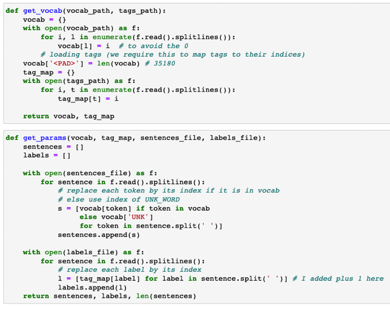</kbd>

    > Open file define bởi input path (vocab_path), đọc file và split ra bởi "
    > xuống dòng" để có list các từ và loop trong đó map từ với index. Cuối
    > cùng thêm một từ đặc sắc gọi là '<PAD>'. Làm tương tự với tags. Nói
    > chung nó sẽ trả ra hai cái dictionary. Một cái map từ - index, và một cái
    > map tag - index.

     

    
    
<kbd>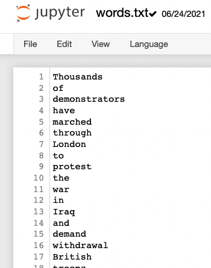</kbd>

    > File words.txt trong
    > folder data/large:

     

    
    
<kbd>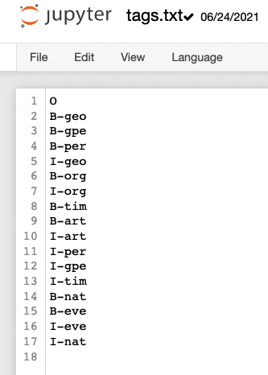</kbd>

    > File tags.txt trong
    > folder data/large:

     

    
    
<kbd>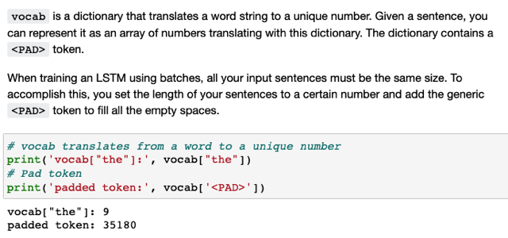</kbd>

    > Thì ý nói với hai cái dictionary này. Ta sẽ "transform" training
    > sample từ câu text thành list (hoặc batch of list) các index number
    > (của từ đó trong vocab). Đồng thời bù vào cuối một số lượng các
    > các index của Padded token để cho đủ một số lượng nào đó mà ta
    > chọn (Tx) mục đích để tất cả các sequence trong batch đều dài
    > bằng nhau.

     

    
    
<kbd>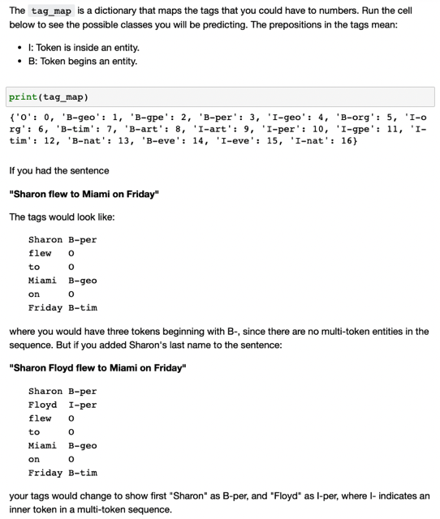</kbd>

    > tag_map dictionary map tag với index. Chỉ có cái đặc biệt là I- hay B-.
    > Thì đại khái là nếu có cái tên Anh Tran is learning.. thì Anh là B-name (ví
    > dụ vậy, là Entity class "Name", nhưng Trần sẽ là I-name thể hiện nó
    > cũng là "Name" nhưng không đứng trước như "Anh" mà đứng "trong"
    > - trong ở đây hiểu là trong một "Name" lớn hơn là "Anh Tran".

     

    
    
<kbd>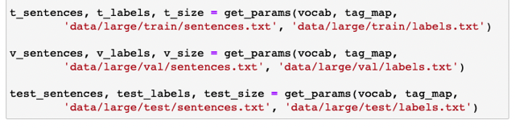</kbd>

    
<kbd></kbd>

    
<kbd>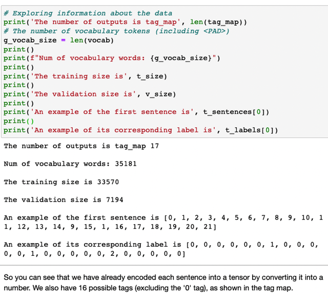</kbd>

    > Thì đại khái cái câu lệnh dưới sử dụng utils function get_params đã giúp ta load hai cái
    > file sentences.txt chứa các câu, và labels.txt chứa các tags mà các labeler đã miệt mài
    > gán nhãn cho các từ của các câu trong file sentences.txt.
    >
    > Từ đó ta có dataset dành cho training, validating và testing (mỗi cái load file sentence.
    > txt và labels.txt từ folder tương ứng (data/large/train/, data/large/val, data/large/text)

     

    
    
<kbd>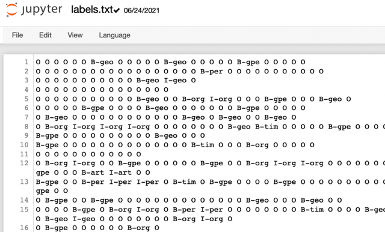</kbd>

    
<kbd>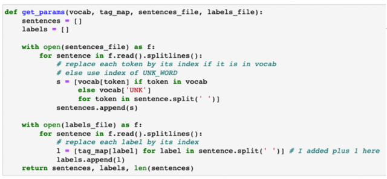</kbd>

    
<kbd></kbd>

    
<kbd></kbd>

    
<kbd></kbd>

     

- 1.2 - Data Generator
   

    
    
<kbd>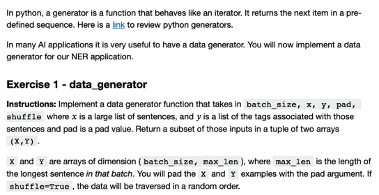</kbd>

    > Viết function làm nhiệm vụ data generator, nhận input là batch_size,
    > bộ data "full" x, y, pad - là padded token hoặc index của nó, shuffle
    > là boolean ý muốn có shuffle không. Làm sao đó để trả về từng
    > batch data dạng tuple (X,Y) sao cho chứa số sample bằng
    > batch_size. Phải được 'pad' cho đủ max_length là chiều dài của
    > câu dài nhất trong batch đó - không phải trong toàn bộ data. Rồi
    > phải có cơ chế shuffle để dùng nếu cần.

     

  
  - Details:  Use this code as an outer loop  \\*while True:   ...   yield((X,Y))\\*    so your data generator runs continuously. Within that loop, \\*define 2\\* \\/\\*for loops\\*\\/:  The first stores \\*temporal lists\\* of the \\*data samples\\* \\*to be included\\* in the batch, and \\*finds  the maximum length\\* of the sentences contained in it.  The second one \\*moves the elements\\* from the \\*temporal list\\* into \\*NumPy arrays pre-filled  with pad values\\*.  There are three features useful for defining this generator:  The NumPy \\*full()\\* function to \\*fill the NumPy arrays\\* with a \\*pad value\\*. See full function  documentation.  \\*Tracking the current location\\* in the incoming lists of sentences. \\*Generators\\* \\*variables hold  their values between invocations\\*, so we\\* create an index variable\\*, \\*initialize to zero\\*, and  \\*increment by one for each sample included\\* in a batch. However, we \\*do not use the index\\*  to access the positions of the list of sentences \\*directly\\*. Instead, we \\*use it to select one  index\\* from \\*a list of indexes\\*. In this way, we can \\*change the order\\* in which we \\*traverse\\*  our original list, keeping untouched our original list.  Since \\*batch_size\\* and \\*the length of the input lists\\* are \\*not aligned\\*, gathering a batch_size  group of inputs may involve \\*wrapping back to the beginning of the input loop\\*. In our  approach, it is \\*just enough to reset the index to 0\\*. We can \\*re-shuffle the list of indexes\\* to  produce different batches each time.
    > Đã quen quen với cái này - Data Generator. Nói chung sẽ là như vầy:
    >
    > Cái Generator có đặc điểm là nó sẽ GIỮ giá trị variable của nó giữa những lần yêu
    > cầu nó để lấy batch data cho việc training (invocation) nên cách làm là mình sẽ có
    > một cái variable ví dụ "index". Mỗi khi add một sample vào batch ta sẽ tăng index
    > lên 1. Nhưng ta không dùng nó để lấy data item ra mà là lấy một cái index thứ 2 từ
    > list các index ra rồi mới dùng cái index 2 này để lấy data. Mục đích chính là để
    > shuffle nếu cần, vì chỉ cần thay vì ta shuffle cái bộ data gốc đưa vào thì ta chỉ
    > shuffle cái index list.
    >
    > Cái cuối ý muốn nói nếu khi index (index 1) đã vượt quá số lượng của  bộ data "full"
    > mà chưa đủ số cho batch (kiểu như lần training ở cuối  khi đã loop qua hết số
    > sample) thì ta sẽ reset index về 0 để lấy tiếp, lúc đó có thể shuffle lại nữa (nếu yêu
    > cầu shuffle).
    >
    > Cuối cùng quay lại khúc đầu đại khái cách làm cho vụ padding là mình  cứ lấy một
    > list chứa batch_size các sample ra (bằng cách đã nói ở  trên), sau đó tìm lengh của
    > câu dài nhất. Rồi dùng nó cùng với batch_size để tạo một matrix hay tensor chứa
    > toàn index của padded  token. Xong mới loop trong cái temporal list để lấy các giá
    > trị trong đó  và update vào cái tensor "pad"

    > lines_index = [*range(num_lines)]: Chính là tạo ra một list chứa
    > index của các câu.

     

      
      
<kbd>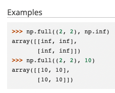</kbd>

      
<kbd></kbd>

      
<kbd>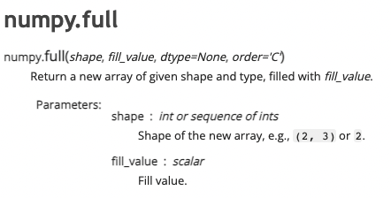</kbd>

       

- Exercise 1 - data_generator (UNQ_C1)
   

    
    
<kbd>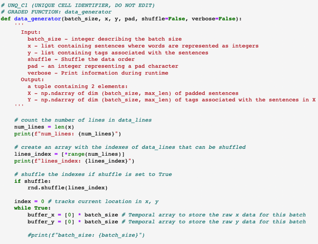</kbd>

     

    
    
<kbd>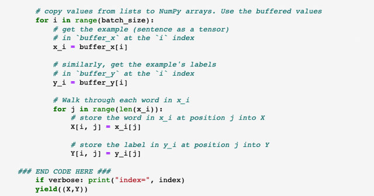</kbd>

    
<kbd></kbd>

    
<kbd>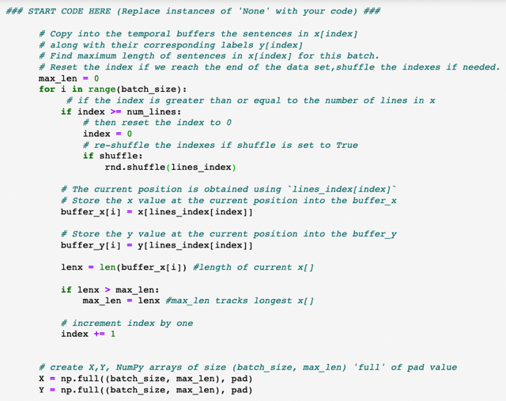</kbd>

     

    
    
<kbd>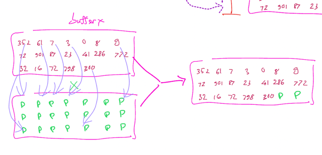</kbd>

    
<kbd></kbd>

    
<kbd>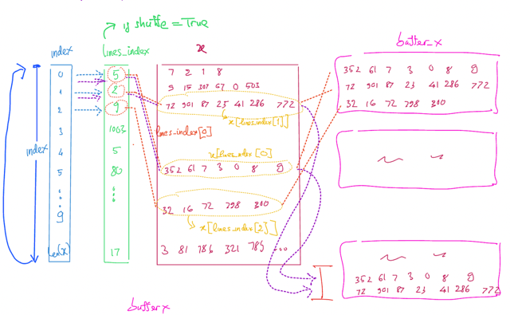</kbd>

     

    
    
<kbd>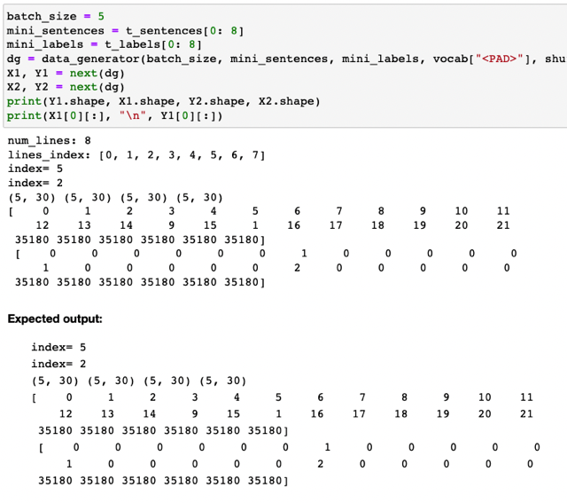</kbd>

     

- 2 - Building the Model
   

    
    
<kbd>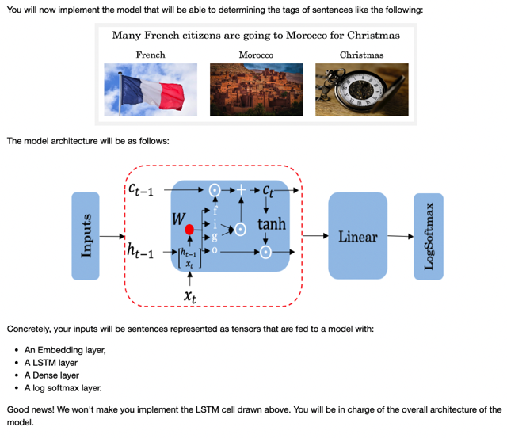</kbd>

     

- Exercise 2 - NER (UNQ_C2)
   

    
    
<kbd>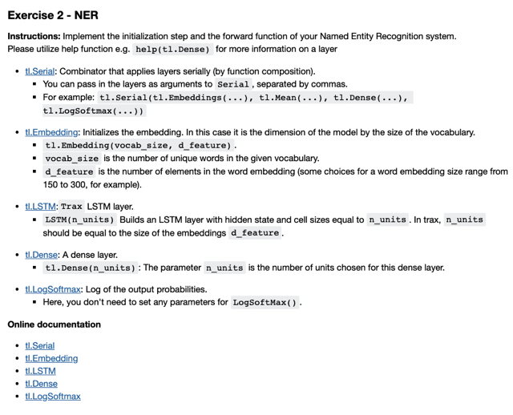</kbd>

     

    
    
<kbd>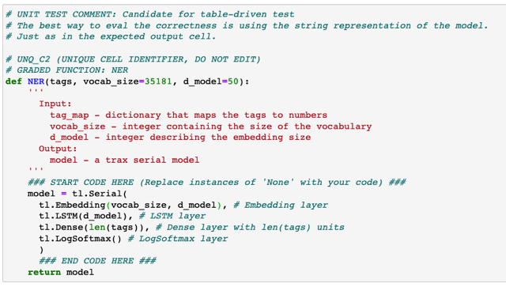</kbd>

    > Trong Trax, đại khái có điểm chú ý là trong Trax số lượng unit của hidden
    > state nên bằng với embedding vector input x. Có nghĩa là x<t> và c<t> (tất
    > nhiên bằng luôn là a<t> hay h<t>) có length bằng nhau

     

    
    
<kbd>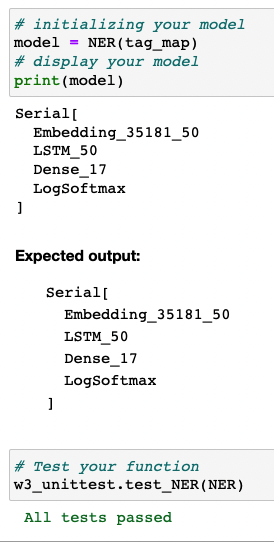</kbd>

     

- 3 - Train the Model
   

    
    
<kbd>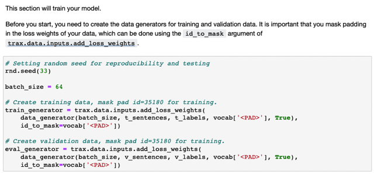</kbd>

    > Đại khái là dùng function của trax add_loss_weighs(nhận generator
    > khởi tạo bởi data_generator() function mình làm ở trên, với một
    > id_to_mask argument). Mục đích là add padding in the loss weight.
    > Kiểu như data nó có có loss weight để nhấn mạnh một số chỗ này
    > thì quan trọng hơn những chỗ khác, hoặc là nếu có pad token để
    > khi tính loss nó sẽ bỏ qua loss đối với pad token. Function này nó
    > cũng chỉ giống như chỉnh sửa và trả lại một cái Generator mới mà
    > đã có add loss weight ở dạng một tensor chứa weight tương ứng
    > của các vị trí trong index. Nếu chưa generator gốc chưa trả về
    > weight, nó tự tạo weight là một ones-tensor, còn nếu có rồi thì
    > check thêm nếu id_to_mask khác None thì nó sẽ update cái weight
    > sao cho chỗ nào mà là pad (quy định bởi id_to_mask) sẽ bị gán =
    > 0.

     

    
    
<kbd>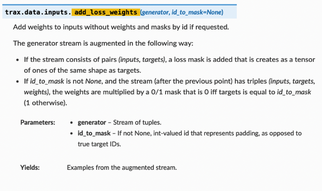</kbd>

    > Theo GPT và doc thì hiểu đại khái rằng nếu original generator có trả
    > về weight tensor (bên cạnh data + label tensor) thì nó dùng cái đó,
    > còn không thì nó tạo cái mới "tensor of ones of same shape as
    > target". Sau đó nếu có id_to_mask, nó sẽ căn cứ vào đó mà update
    > weight chỗ nào bị masked trở thành 0.

     

- Exercise 3 - train_model (UNQ_C3)
   

    
    
<kbd>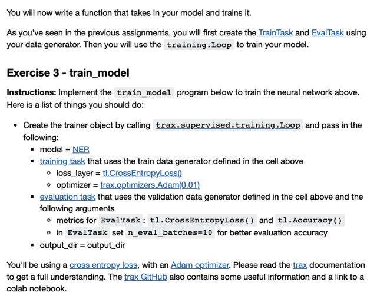</kbd>

     

    
    
<kbd>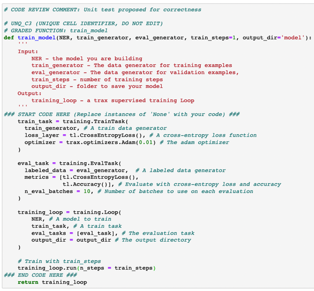</kbd>

    > Chỉ lắp các mảnh
    > ghép lại thôi

     

    
    
<kbd>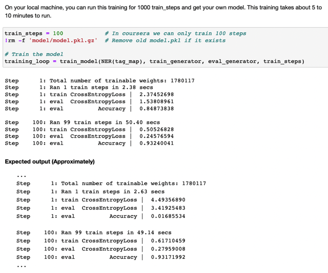</kbd>

    > Bắt đầu train với
    > 100 train_steps cho thấy accuracy đạt 93%

     

    
    
<kbd>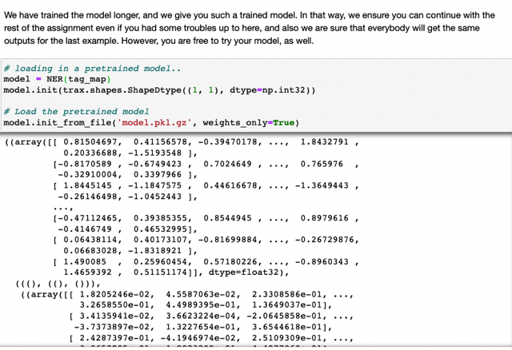</kbd>

    > Load cái model y vậy nhưng được
    > pre-trained lâu hơn tăng performance lên

     

- 4 - Compute Accuracy
   

    
    
<kbd>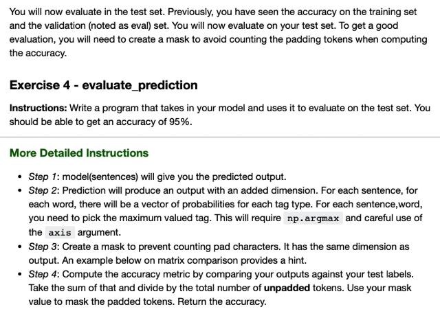</kbd>

     

    
    
<kbd>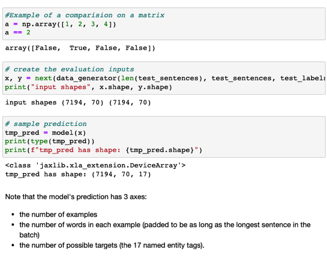</kbd>

    > Một ví dụ cho thấy với x là (batch, max_len) ví dụ (7194, 70) thì sau model cho ra
    > batch, max_len, num_class ví dụ (7194, 70, 17). Vì ứng với mỗi từ (đúng hơn là
    > index của từ) nó sẽ cho ra probability vector chứa 17 p value. Và mình sẽ lấy index
    > (trong vector đó) của thằng có p cao nhất. Sẽ cho ra lại tensor (batch, max_len) và
    > dùng nó để so sánh với y cũng có shape (batch, max_len)

     

- Exercise 4 - evaluate_prediction (UNQ_C4)
   

    
    
<kbd>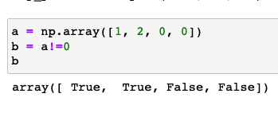</kbd>

    
<kbd></kbd>

    
<kbd>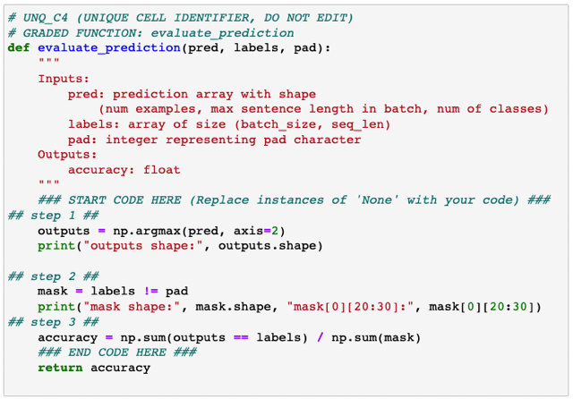</kbd>

    > 1. Như đã phân tích, ta **cần lấy index của vị trí có giá trị cao nhất trong  probability vector.**
    >
    > Nhưng không chỉ có 1 vector mà là một list Tx từ nên có Tx vector vector. Và lại có batch câu.
    >
    > Nên **prediction output tensor y^**sẽ có shape là  batch x Tx (chiều dài sequence) x n_classes.
    >
    > Do đó **trục thứ nhất axis = 0** là **batch size** lấy trong trục này là **lấy một câu nào đó trong batch.**
    >
    > **Trục thứ hai axis = 1** là **số từ Tx** hay đúng hơn là token trong sequence. Loop trong đây là **loop
    > trong các từ | time-step trong câu.**
    >
    > **Trục thứ ba, axis = 2** mới là **probability vector**. Vậy để lấy index mà có giá trị p max trong từng
    > vector thì phải để axis = 2
    >
    > 2. Cái mask: Vì labels (b,max_len) là tensor chứa g.t. label đã được padded. Nên chỉ việc so sánh (!=)
    > nó với pad index sẽ cho ra tensor cùng shape mà chỗ nào trong labels bằng với pad index thì chỗ đó =
    > 0, chỗ nào không phải pad thì chỗ đó = 1. Thì sum của mask tensor này chính là tổng số từ không phải
    > pad.
    >
    > 3.Cái cuối chính là **so sánh output** với **ground-truth label**, mà y sẽ có shape là: **Batch x Tx**: Có
    > batch câu, mỗi câu có Tx từ (có thể sẽ lấy Tx là câu dài  nhất trong batch) Mỗi từ gắn với index của
    > Entity class
    >
    > -> shape y: **batch_size x Tx**
    >
    > Kết quả của output sau khi lấy argmax của y^ cũng là **batch_size x Tx.** **So sánh hai thằng đó sẽ ra
    > một tensor mà chỗ nào chúng nó bằng  nhau thì là True, ngược lại thì False**. Do đó **sum hết lại
    > chính là những từ được predict Named Entity đúng.**
    >
    > Sau đó chia cho sum(mask). **Khả năng cao mask ta sẽ tạo một tensor số 1 hết, trừ chỗ nào là padded
    > token sẽ là 0**. Nên sum **mask tính là tất cả các từ trong tensor.**

     

    
    
<kbd>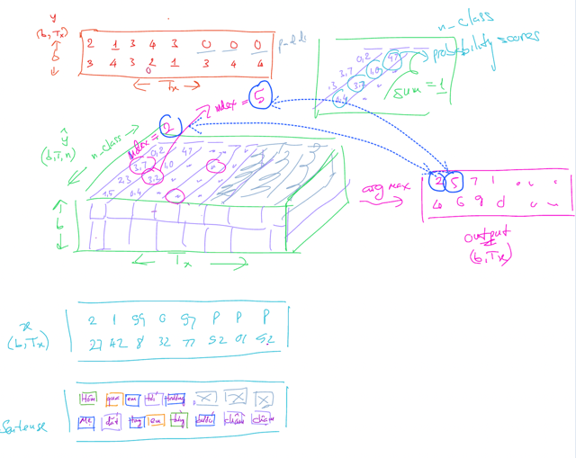</kbd>

     

    
    
<kbd>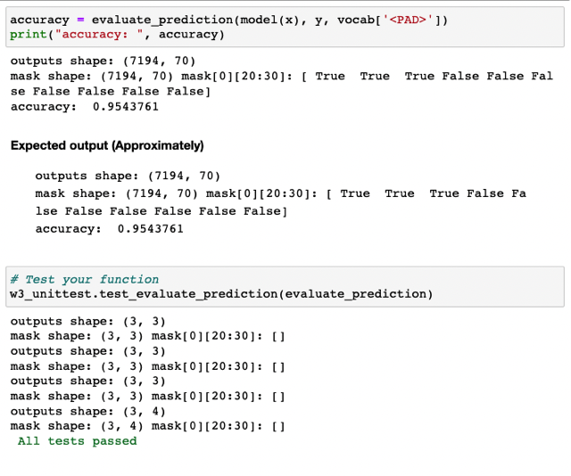</kbd>

     

- 5 - Testing with your Own Sentence
   

    
    
<kbd>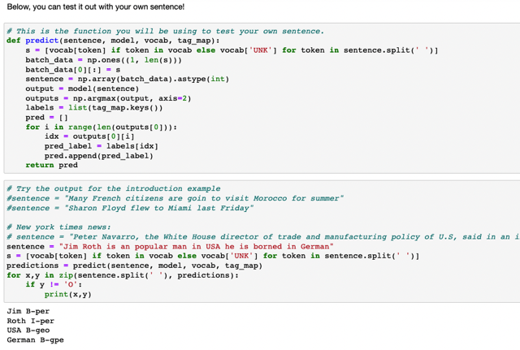</kbd>

     

    
    
<kbd>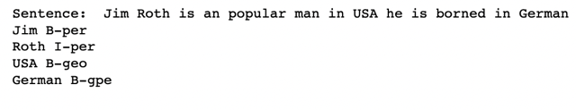</kbd>

     

