# C4W2_TEXT SUMMARIZATION  \\*Compare RNNs\\* and \\*other sequential models\\* to the more modern \\*Transformer  architecture\\*, then create a tool that \\*generates text summaries\\*.  Learning Objectives   • Describe the \\*three basic types of attention\\*  • Name the \\*two types of layers in a Transformer\\*  • Define \\*three main matrices in attention\\*  • \\*Interpret the math behind scaled dot product attention\\*, \\*causal attention\\*, and  \\*multi-head attention\\*  • Use articles and their summaries to \\*create input features for training a text  summarizer\\*  • Build a \\*Transformer decoder mode\\*l (\\*GPT-2)\\*

📊 **Progress:** `76` Notes | `158` Screenshots

---

## Week Introduction

 

## Transformers Vs RNN

 

### 1. Introduction to Transformer Model:

> [!NOTE]
> 1. Introduction to Transformer Model:
>    - The lecture focuses on the transformer model, developed as a\**purely attention-based 
> solution\** by Google.
>    - It aims to \**address problems associated\** with \**Recurrent Neural Networks (RNNs).\**
>
> 2. Problems with RNNs:
>    - \**Sequential Computation\**: RNNs \**process inputs sequentially\**, causing \**longer 
> processing times for longer sentences\**.
>    - \**Vanishing Gradients\**: RNNs struggle with \**vanishing gradients\** and \**information loss\** in 
> \**long sequences\**.
>
> 3. Use Case: \**Neural Machine Translation\**:
>    - \**RNNs\** used for \**neural machine translation\** involve \**sequential encoding and decoding 
> of inputs.\**
>    - \**Sequential processing\** leads to\**time-intensive computations\** for \**longer sentences.\**
>
> 4.\**Sequence-to-Sequence Architecture\**:
>    - The\**general sequence-to-sequence\** architecture \**requires multiple sequential steps\** to 
> propagate information.
>    - Long sequences cause\**information loss\** within the network, leading to challenges.
>
> 5. Introducing Attention:
>    - Attention is introduced as a way to \**mitigate the challenges posed by RNNs\**.
>    - A \**sequence-to-sequence architecture\** \**with\** \**attention\** helps in \**addressing these issues\**.
>
> 6. \**Transformer Architecture\** vs. \**RNNs\**:
>    - \**Transformers\** r\**ely solely on attention mechanisms\**, without \**needing recurrent 
> networks\**.
>    - \**Transformers prioritize attention\**, along with \**some linear and nonlinear 
> transformations.\**
>
> 7. Advantages of Transformers:
>    - Transformers offer advantages over RNNs:
>      - \**Faster processing\** due to \**parallelism\**.
>      - \**Improved contextual understanding\**, especially for\**longer contexts\**.
>
> 8. Conclusion and Next Steps:
>    - Transformers provide a\**solution to the slowness and context-related issues of RNNs\**.
>    - The next video will provide a detailed overview of the transformer architecture.

 

  
  
<kbd>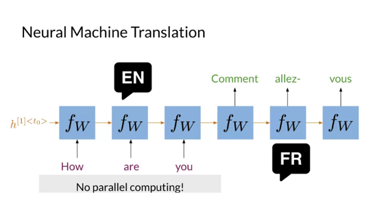</kbd>

> [!NOTE]
> Đại khái là về **cách thức hoạt động truyền thống của Neural
> Machine Translation** trong đó phải **xử lý input sequence từ đầu
> đến cuối** trong **encoder** trước khi **pass information qua decoder**
> để**generate text**. Quá trình này **hoàn toàn không có yếu tố
> parallel computing** cùng lúc nhiều time-steps
>
> Do đó nhược điểm thứ nhất là **với câu dài, ta phải chờ encoder
> xử lý hết câu trước khi decoder  có thể bắt đầu**generate output.

   

  
  
<kbd>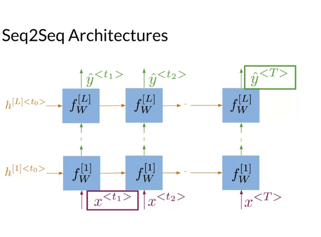</kbd>

> [!NOTE]
> Khái qúa hơn mô hình RNN là ta **phải chờ T time-step trước khi
> Decoder bắt đầu có thể generate**. T là chiều dài của sequence.
>
> Nhưng ta cũng đã biết vấn đề lớn hơn đó là hiện tượng **vanishing
> gradient** khi **càng nhiều time-step thông tin bị mất dần**đi khiến **chất
> lượng của output giảm xuống.**
>
> Tuy sự ra đời của **LSTM hay GRN** giúp ích trong việc p**hần nào khắc
> phục** vanishing gradient, nhưng **với câu rất dài thì  vấn đề này vẫn
> không được khắc phục hoàn toàn** và thông tin vẫn bị mất, chất
> lượng output tụt xuống thảm hại

   

  
  
<kbd>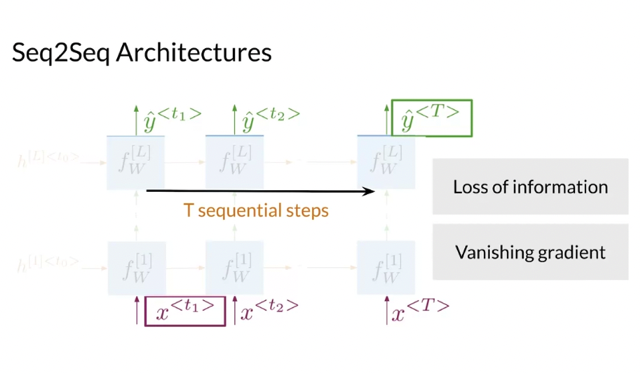</kbd>

> [!NOTE]
> Nói chung tóm lại là hai vấn đề lớn của Seq2Seq
> architecture là **không thể xử lý song song** theo cách mà CNN
> trong Computer Vision mang lại, và **hiện tượng vanishing
> gradient với câu rất dài** vẫn xảy ra

   

  
  
<kbd>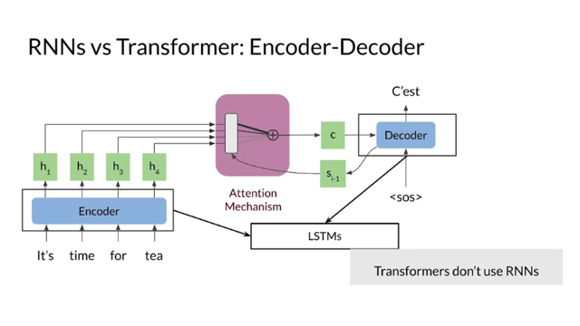</kbd>

> [!NOTE]
> Giải pháp mà tuần trước có nói qua đó là **Attention mechanism** trong
> đó ta **vẫn sử dụng LSTM trong encoder**.
>
> Và tuần này sẽ là về **Transformer**, nơi mà ta **hoàn toàn không còn
> sử dụng RNN** **(LSTM, GRU) component** mà **chỉ dùng Attention
> mechanism** thôi.
>
> Bởi vậy Transformer paper mới có tên **Attention is All You Need.**
>
> Theo DLSpec ta đã biết nó c**hỉ đưa input qua Embedding + Positional
> Encoding trước khi vào Self-Attention layers.**

   

## Reading Transformer Vs RNN

 

### In the image above, you can see a typical RNN that is used to translate the English

> [!NOTE]
> In the image above, you can see a typical RNN that is used to translate the English
> sentence "How are you?" to its German equivalent, "Wie sind Sie?". One of the \**biggest
> issues with these RNNs\**, is that they make use of s\**equential computation\**. That
> means, in  order for your code to process the word "you", it has to first go through "are"
> and then  "you". Two other issues with RNNs are the:
>
> • \**Loss of information\**: For example, \**it is harder to keep track\** of whether the
> subject is singular or plural as you \**move further away from the subject.\**
>
> • \**Vanishing Gradient\**: when you \**back-propagate\**, the\**gradients can become
> really small\** and as a result, your model will \**not be learning much. \**
>
> In contrast, \**transformers are based on attention\** and \**don't require any sequential
> computation per layer\**, only a \**single step\** is needed.
>
> Additionally, the \**gradient steps\** that  need to be taken from the \**last output\** \**to the\**
> \**first input\** in a transformer is \**just one\**. For  RNNs, the number of steps increases
> with longer sequences.
>
> Finally, transformers \**don't  suffer from vanishing gradients problems\** that are \**related
> to the length of the  sequences\**. Here is an image that might help you visualize it.

> [!NOTE]
> Chỉ cần một gradient step duy nhất để
> đi từ last output to first input.

 

  
  
<kbd>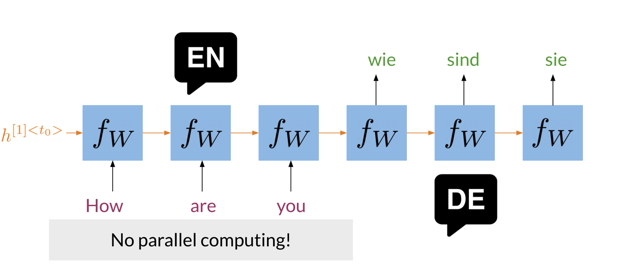</kbd>

   

  
  
<kbd>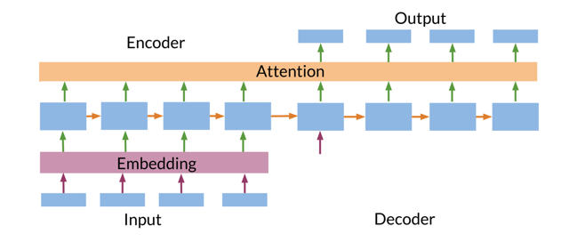</kbd>

   

## Transformers Overview

 

### Here's a summarized list of the main points from the provided text:

> [!NOTE]
> Here's a summarized list of the main points from the provided text:
>
> 1. Introduction to Transformer Model:
>    - The transformer model, introduced in 2017 by Google researchers including \**Lucasz Kaiser\**, 
> has gained immense popularity.
>    - It has become the \**standard for large language models\**, including \**BERT\**,\**T5\**, and \**GPT-3.\**
>
> 2. Importance of Transformers:
>    - Transformers have \**significantly impacted the field of natural language processing.\**
>    - The foundational paper "Attention is All You Need" serves as the \**basis for all transformer models\**.
>
> 3. Core Mechanism:\**Scaled Dot-Product Attention\**:
>    - Transformers use scaled dot-product attention for \**efficient computation\** and \**memory utilization.\**
>    - This attention mechanism \**forms the core of the transformer model\**, enabling its \**scalability\**.
>
> 4. \**Multi-Head Attention\**:
>    - The transformer model employs the \**Multi-Head Attention layer\**, which \**runs in parallel.\**
>    - It consists of \**multiple scaled dot-product attention mechanisms\** with \**learnable linear
>  transformations\**.
>
> 5. Transformer \**Encoder and Decoder\**:
>    - The \**encoder\** employs \**multi-head attention\** for \**self-attention\** on \**input sequences\**.
>    - \**Residual connections\**, \**normalization\**, and \**feed-forward layers\** are part of encoder layers.
>    - The \**decoder\** also employs \**multi-head attention\** and \**attends to both encoder outputs\** and 
> \**previous positions\**.
>
> 6. \**Positional Encoding\**:
>    - Transformers use \**positional encoding\** to \**incorporate word order information\**.
>    - Positional encoding values \**are added to embeddings\**, allowing retention of \**word order\**.
>
> 7. \**Model Architecture\**:
>    - The architecture involves \**embedding input sentences\** and \**applying positional encodings\**.
>    - The \**encoder\** consists of \**multi-layer multi-head attention\** modules.
>    - The \**decoder\** takes \**encoder outputs\** and \**shifts the output sentence for probability generation\**.
>
> 8. \**Advantages\** \**of\** \**Transformers\**:
>    - Transformers can be \**parallelized\** and \**trained efficiently on multiple GPUs\**.
>    - They overcome issues of \**sequential processing\** and\**vanishing gradients\** faced by RNNs.
>
> 9. \**Transformer Applications\**:
>    - Transformers have \**widespread applications\**, particularly in \**NLP\** and \**various fields involving 
> sequential data.\**
>
> 10. Conclusion:
>     - Transformers are \**highly valuable\** and have \**gained widespread attention\** due to\**their 
> effectiveness.\**
>
> 11. Next Steps:
>     - The next video will \**cover applications of transformers\**, elaborating on their \**practical usage.\**

 

  
  
<kbd>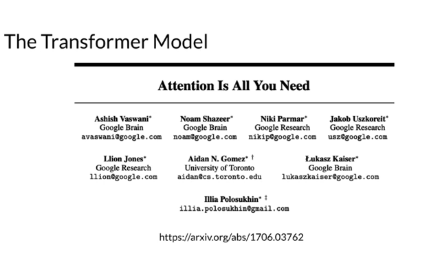</kbd>

   

  
  
<kbd>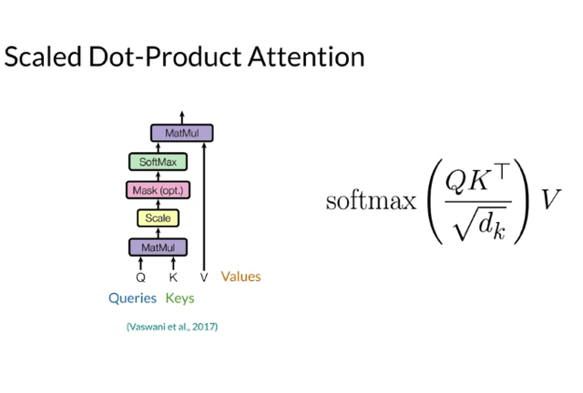</kbd>

> [!NOTE]
> The transformer model uses **scaled dot-product attention**, which you saw
> in the first week of this course. The **first form of attention** is very **efficient** in
> terms of **computation and memory** due to its consisting of**just matrix
> multiplication** operations. This mechanism is the **core** of the model, and it
> **allows the transformer to grow larger**, and more complex while being
> faster, and **using less memory than other comparable model** architectures.

> [!NOTE]
> Component đầu tiên tạo nên Transformer là **Scaled-DotProduct
> Attention** mà ta đã gặp tuần trước. Kiểu attention này **rất efficient
> trong computation và memory usage** khi **chỉ bao gồm phép
> matrix multiplication**. Cho phép model có thể **scale up tốt hơn trở
> nên complex hơn**

   

  
  
<kbd>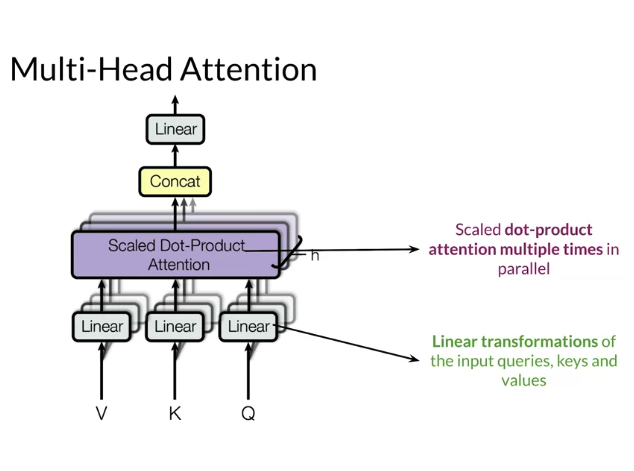</kbd>

> [!NOTE]
> In the **transformer model**, you will use the **Multi-Head Attention** layer.
> This layer **runs in parallel**, and it**has a number of scaled dot-product
> attention mechanisms** at multiple **linear transformations** of the inputs,
> **queries, keys, and values**. In this layer, the **linear transformations are
> learnable parameters.**

> [!NOTE]
> **Multi-head attention**. Bao gồm bước**tính các matrix Q, K,V** thông
> qua**linear transformation** (**Linear layers** với các weight matrices
> **WQ, WK,WV**) Query, Key, Value. Và sau đó là **cùng lúc** thực hiện
> các phép **Scaled Dot-Product attentions đối với các Q,K,V**

   

  
  
<kbd>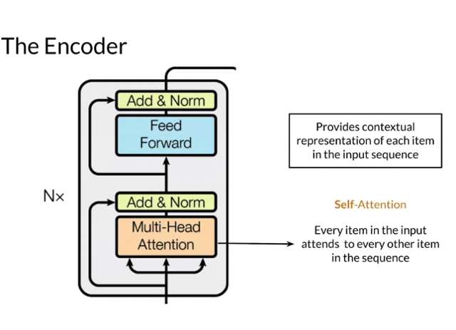</kbd>

> [!NOTE]
> The**transformer encoder** starts with a **multi-head attention module** that's
> **performed self-attention** on the**input sequence**. That is, **each word** in
> the inputs **attends to every other word in the input**.
>
> This is followed by a **residual connection** and **normalization**, a**feed
> forward** layer, and **another residual connection** and **normalization**.
>
> This **entire block is one encoder layer** and is **repeated a number of times**.
>
> Thanks to self attention layer, the encoder will give you a **contextual
> representation of each one of your inputs**

> [!NOTE]
> Encoder của Transformer bắt đầu với **input** (chính là **embedding**) được
> **linear transformation thành QKV** và đưa qua **Multi-head attention** để
> **perform self-attention**.
>
> Trong quá trình này, **mỗi word sẽ 'kiểu như chú ý đến và tính lại dựa trên' các từ
> khác trong câu**. Sau đó thông qua một số layer như **Residual Connection,
> Normalization.**
>
> Thì output là một **dạng embedding mới xịn xò hơn của sequence embedding lúc
> đưa vào**. Vì lúc này nó **'chứa/ tính đến' các yếu tố ngữ nghĩa cụ thể của câu đó**chứ **không chỉ chung chung**. Gọi là **Contextual Representation**
>
> Một điểm chú ý là **không phải chỉ có một mà là có một vài Encoder (xN)**, tạo
> thành **Encoder Stack**

   

  
  
<kbd>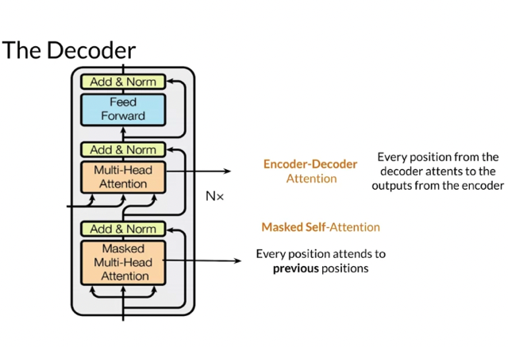</kbd>

> [!NOTE]
> **Decoder** cũng có cấu trúc tương tự với 2 Multi-head attention. Trong đó cái
> thứ nhất được mask (gọi là **Future mask**) để **mỗi từ của input (input của
> Decoder sẽ chính là target sentence) chỉ attend những từ trước đó thôi.**
> Mục đích là để Decoder không ăn gian khi nhìn thấy trước đáp án.
>
> **Output của MHA thứ nhất** này sẽ (đóng vai trò là **Q**) cùng với **Encoder's
> output (đóng vai trò K, V)** đi vào **MHA thứ hai**. Tại đây **mỗi position của
> decoder's sequence sẽ attends với mọi position của encoders**

> [!NOTE]
> The decoder is constructed **similarly** to the encoder with**multi-headed
> attention modules, residual connections, and normalization**. The first
> attention module is **masked** such that **each position attends only to previous
> positions**, its **blocks leftward flowing information**. The **second attention**
> module**takes the encoder outputs**, and allows the decoder to **attend to all
> items.** This whole decoder layer is also r**epeated some number of time**s, one
> after another.

   

  
  
<kbd>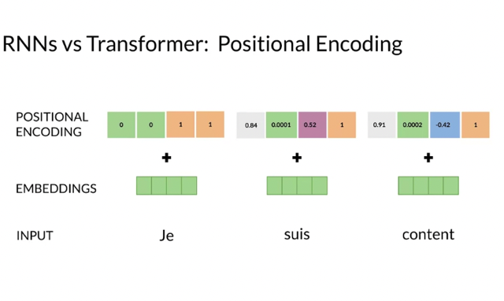</kbd>

> [!NOTE]
> Transformers also incorporate a **positional encoding** stage, which **encodes each inputs
> position** in the sequence. This is necessary because transformers **don't use recurrent
> neural networks**. But the **word order is relevant** for any language. Positional encoding
> can be **learned or fixed**. This has the **word embeddings**.
>
> For instance, let's suppose you want to translate from the French race over here, you have
> [inaudible], and then you want to capture the sequential information. The transformers uses a
> **positional encoding to retain the position** of the input sequence. The positional encoding
> has values that are **added to the embeddings**, so that for **every inputs word, you have
> information about its order and position**. In this case, a positional encoding vector for each
> word

> [!NOTE]
> Vì **không dùng RNN để xử lý tuần tự** mà **Transformer** **xử lý cùng lúc** tất
> cả các word trong sequence, nên **nó phải dùng Positional Encoding** để
> **đưa vào lại thông tin vị trí của từ.**
>
> Như ta đã biết bên DLSpec, nó cũng**tương tự embedding vector**  và **sẽ
> được cộng với embedding vector** để **tạo ra embedding encoding vector**.
>
> Cách tính ra nó có thể là**fixed hoặc trainable**

   

  
  
<kbd>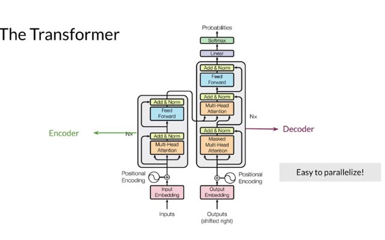</kbd>

   

  
  
<kbd>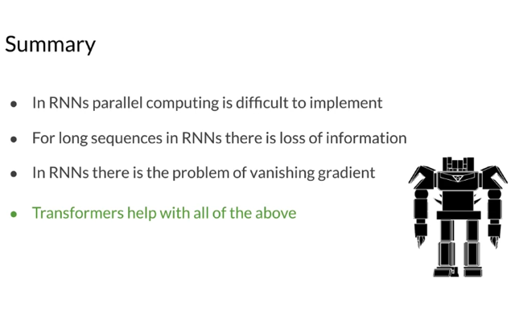</kbd>

> [!NOTE]
> Túm lại, tradition RNN gặp 3 vấn đề lớn: Không
> xử lý song song được, vanishing gradient và loss
> information khi câu dài. Và transformer sẽ giải
> quyết các issue này

   

## Transformers Application

 

### Sure, here's the content reorganized into indexed paragraphs without using titles:

> [!NOTE]
> Sure, here's the content reorganized into indexed paragraphs without using titles:
>
> 1. **\**Transformer Applications\** in NLP:** The transformer is a \**versatile deep-learning model\** with
> \**successful applications\** in \**various tasks across NLP\** and beyond. Examples include \**automatic text
> summarization\**, \**auto-completion\**, \**named entity recognition\**, \**question answering\**, \**machine translation\**,
> \**chatbots\**, \**sentiment analysis\**, and \**market intelligence\**.
>
> 2. **\**Variants\** and \**Named Models\**:** Many transformer \**variants\** exist in NLP, each with its own name.
> For instance, \**GPT-2\** (\**G\**enerative \**P\**re-training for \**T\**ransformer) by \**OpenAI\** excels in \**text generation\**.
> \**BERT\** (\**B\**idirectional \**E\**ncoder \**R\**epresentations from \**T\**ransformers) by Google AI Language team is
> used for \**learning text representations\**. \**T5\** (\**T\**ext-\**t\**o-\**T\**ext \**T\**ransfer \**T\**ransformer) is a \**multitask
> transformer for tasks like question answering.\**
>
> 3. **\**T5's Versatility\**:** T5 stands out for its ability to \**handle multiple tasks within a single model\**.
> Instead of \**training separate models for each task\**, T5 can \**perform tasks like translation, classification,
> and question answering within one model\**.
>
> 4. **T5's Input Format:** To \**instruct T5\**, an\**input string includes \**the \**desired task\** and\**the data for that
> task\**. For instance, to translate "I'm happy" from English to French, input "translates English into
> French: I am happy" produces the French translation.
>
> 5. **\**Examples of T5 Tasks\**:** T5 performs \**classification\** by inputting sentences like "\**cola\**: He bought
> fruits and vegetables." It answers questions with input like "\**question\**: Which volcano in Tanzania is the
> highest mountain in Africa?" T5 also handles \**regression\**, \**calculating numeric values\** like sentence
> similarity. Summarization involves \**providing T5 with long text and getting concise summaries.\**
>
> 6. **T5 Trivia Demo:** A T5 demo demonstrates trivia questions where T5 competes. It was trained
> without external knowledge. This showcases T5's versatility in diverse tasks.
>
> 7. **\**State of the Art Transformers\**:** Prominent transformers include \**GPT-2\**, \**BERT\**, and \**T5\**. They
> underline the\**flexibility and power of transformers\**. T5's capability to manage multiple tasks through
> text representations is \**particularly remarkable\**.
>
> 8. **Conclusion:** Transformers like \**T5\** have \**revolutionized NLP\** by handling\**diverse tasks\** in a \**unified
> model\**. Their applications are widespread, and their potential for managing a range of tasks in one
> model is astonishing. This comprehensive capability sets the stage for understanding how
> transformers work in the following video.
>
> Feel free to ask if you need further clarification or assistance!

 

  
  
<kbd>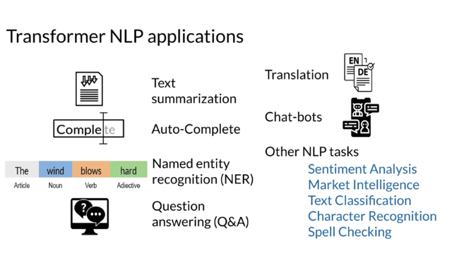</kbd>

> [!NOTE]
> Các ứng dụng của
> Transformer

   

  
  
<kbd>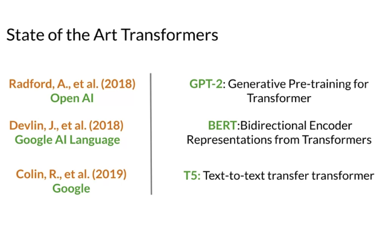</kbd>

> [!NOTE]
> Một số tên tuổi lớn LLM có
> nền tảng là Transformer

   

  
  
<kbd>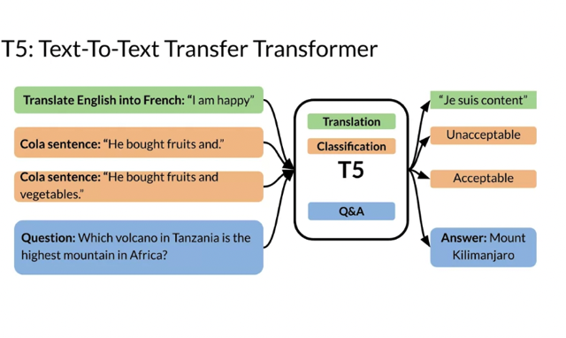</kbd>

> [!NOTE]
> Lấy ví dụ T5, tên viết tắt của **Text-To-Text Transfer Transformer**. Thì đại
> khái là nó c**ó thể làm cùng lúc nhiều task**. Có nghĩa là, như **từ trước
> tới giờ ta chỉ thấy model được training để làm một nhiệm vụ cụ thể** nào
> đó, như **classification, sentiment analysis..**.
>
> Còn với T5 là một language model có core là **Transformer**, thì nó c**ó
> thể làm nhiều việc**, và **input của nó sẽ có hai phần: Nhiệm vụ và nội
> dung**. Thì đây chính là lúc ta **thấy 'bóng hình' của Large Language
> Model**.
>
> Và quả thật **GPT, BERT, T5 chính là LLM** và cái phần **input mô tả
> nhiệm vụ (yêu cầu) gọi là Prompt**

   

  
  
<kbd>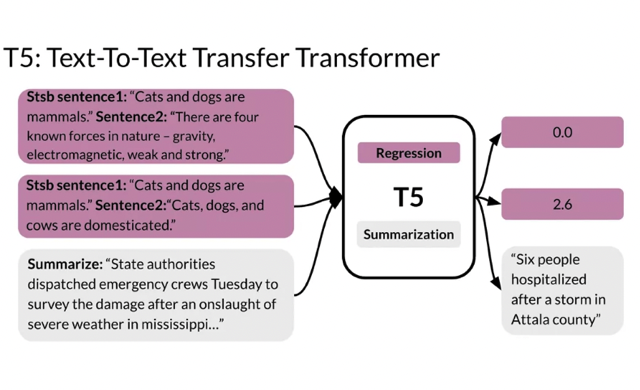</kbd>

> [!NOTE]
> Tiếp tục, nói về thêm các task khác T5 **có thể làm khác như regression:**
> **Nhận input có hai câu** và cho**ra number thể hiện độ giống nhau giữa
> chúng**. 
>
> Một task nữa là **summarize text**

   

  
  
<kbd>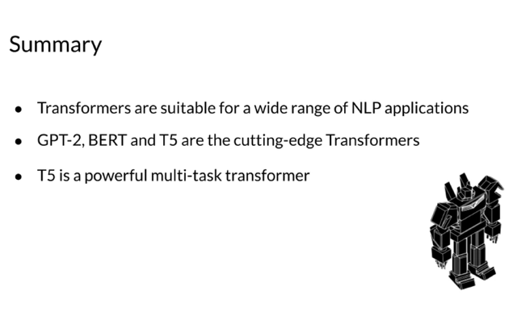</kbd>

   

## Scaled And Dot-product Attention

 

### Sure, here is the main information extracted from the transcript with numerical

> [!NOTE]
> Sure, here is the main information extracted from the transcript with numerical 
> index references:
>
> 1. The main operation in \**transformers\** is the \**scaled dot-product attention\** mechanism.
> 2. Attention involves \**queries, keys, and values\**, producing \**context vectors\** for 
> \**each query.\**
> 3. Context vectors are \**weighted sums of values\** based on \**query-key similarity\**.
> 4. \**Softmax\** ensures \**weights sum up to 1\**; \**division by square root of key dimension 
> improves performance.\**
> 5. Scale dot-product attention is \**efficient\**, relying on \**matrix multiplication and Softmax.\**
> 6. It can be implemented on \**GPUs or TPUs for faster training\**.
> 7. To construct matrices, \**transform words to embeddings\** (query, key, value matrices).
> 8. \**Query\** matrix contains embedding vectors for each word in a sequence.
> 9. \**Key\** matrix is formed similarly from word embeddings.
> 10. \**Value\** matrix often uses the same vectors as the key matrix.
> 11. The \**dimensions of matrices\** play a role in scale dot-product attention formula.
> 12. Compute \**product of query and transpose of key matrix\**.
> 13. \**Scale by inverse square of dimension of key vectors\** and \**apply Softmax.\**
> 14. \**Weights matrix represents relationships between queries and keys.\**
> 15. Weight matrix has elements \**corresponding to query-key relationships\**.
> 16. After weights computation, \**multiply with value matrix\** to get \**context vectors\**.
> 17. Context vectors correspond to queries; columns match value vector size.
> 18. \**Scale dot-product attention is essential\** in transformers.
> 19. It involves \**queries, keys, and values\** as\**embedding matrices\**.
> 20. \**Comprises two matrix multiplications\** and a\**Softmax function.\**
> 21. \**GPUs and TPUs\** can accelerate training using this mechanism.

 

  
  
<kbd>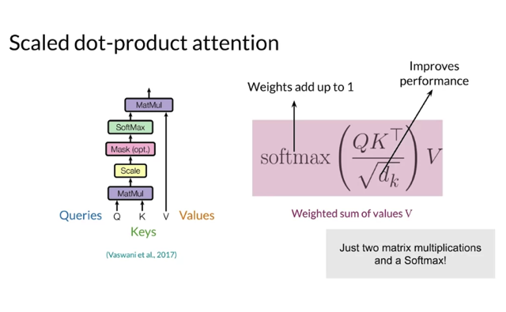</kbd>

> [!NOTE]
> Recall that in**scale dot-products attention**, you have **queries, keys and values**. The attention
> layer outputs**contexts vectors** for **each query**. And the **context vectors are weighted sums of
> the values** where the **similarity between the queries and keys determines the weights**
> assigned to each value.
>
> The **SoftMax** **ensures** that the **weights add up to 1** and the **division by the square roots of the
> dimension of the key** factors is used to**improve performance**.
>
> The scale dot-product attention mechanism is **very efficient**since it relies **only on matrix
> multiplication** and **SoftMax**. Additionally, you could implement this attention mechanism to run
> on GPUs or TPUs to speed up training.

> [!NOTE]
> Nhắc lại về **Scaled Dot Product Attention**.
>
> **Context vector** sẽ tính bởi **weight sum của value với
> weight** tính từ **query và key** thể hiện**sự giống nhau giữa
> query và key**.
>
> **Softmax** biến kết quả từ phép tính dot product thành **weight
> có sum = 1**. Còn **chia cho sqrt of dk là giúp ổn định tính
> toán**.
>
> Vì vì nó **chỉ gồm việc matrix multiplication nên nó rất
> computational efficient**

   

  
  
<kbd>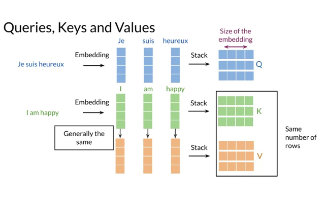</kbd>

> [!NOTE]
> Đại khái là **cách hình thành ra Queries, Keys và Values**. Là từ **embedding**.
> Cái này có thể là phiên bản gọn hơn so với DLSpec khi Embedding được
> đưa qua linear transformation với W_Q, W_K, W_V  của Linear layers mới
> tạo thành Q, K, V

   

  
  
<kbd>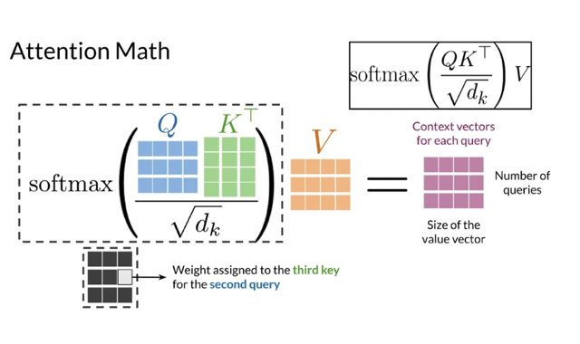</kbd>

> [!NOTE]
> Hiểu như bên DLSpec được rồi. Ở
> đây nó cũng nói lại thôi

   

  
  
<kbd>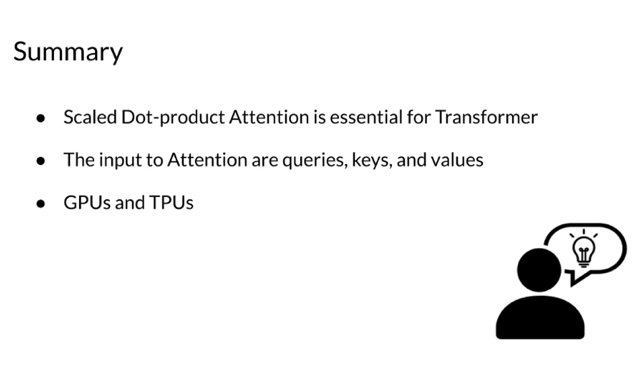</kbd>

   

## Masked Self-attention

 

### Sure, here are the main points from the text:

> [!NOTE]
> Sure, here are the main points from the text:
>
> 1. **Introduction to \**Attention Mechanisms\**:** The video discusses \**different 
> attention mechanisms\** in the\**transformer model\** and how to \**compute masked 
> self-attention.\**
>
> 2. **Types of Attention in Transformer:**
>
>    - **\**Encoder-Decoder Attention\**:** It connects \**words from one sentence\** to
>  \**all words in another\**. Used in translation tasks.
>
>    - **\**Self-Attention\**:** \**Queries, keys, and values\** come from the \**same sentence\**. 
> \**Each word attends to every other word\** for \**contextual representations\**.
>
>   - **\**Masked Self-Attention\**:** Similar to self-attention, but \**queries can't attend to 
> future positions\**. Used in the decoder to \**ensure predictions depend on known outputs\**.
>
> 3. **\**Mathematics of Self-Attention\**:** Self-attention uses \**scaled dot-product attention\**, i
> nvolving \**softmax of scaled products between queries and transpose of the key matrix\**.
>
> 4. **\**Masked Self-Attention Process\**:**
>    - \**Add a mask matrix within the softmax operation\**.
>    - \**Mask has zeros on or below the diagonal\** and\**large negative values above\**.
>    - \**Ensures that queries cannot attend to future positions.\**
>    - Resultant weights matrix makes elements zero for keys and subsequent positions 
> to the query.
>
> 5. **Conclusion:** The video covered three types of attention: \**encoder-decoder attention, 
> self-attention, and masked self-attention\**. Masked self-attention is used in the decoder and 
> prevents queries from attending to future positions. Multi-headed attention, a powerful form 
> of attention allowing parallel computing, will be discussed in the next video.
>
> Let me know if you need further clarification or assistance!

 

  
  
<kbd>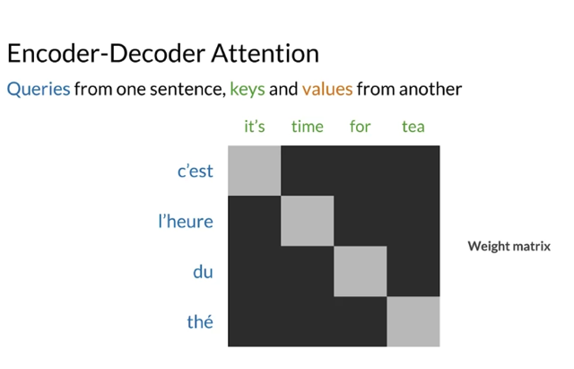</kbd>

> [!NOTE]
> Trong **Encoder-Decoder Attention:** **Queries là từ Decoder's states** còn
> **Keys và Values là từ Encoder**. Ý nghĩa là **với mỗi từ của Decoder thì
> nên chú ý nhiều đến từ nào của Encoder hơn**

   

  
  
<kbd>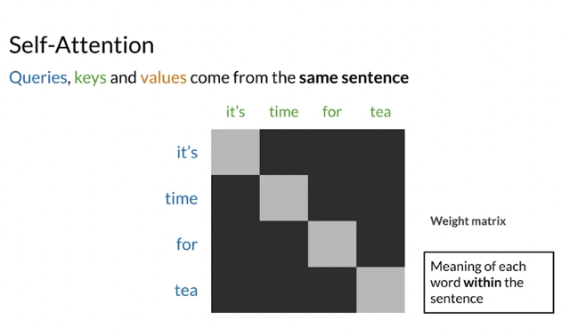</kbd>

> [!NOTE]
> Còn trong**Self-Attention**, cả **Queries, Keys, Values đều đến
> từ cùng Encoder hoặc Decoder**. Ý nghĩa là **tạo contextual
> embedding trong đó mỗi từ nắm bắt thông tin ngữ nghĩa
> của các từ khác**

   

  
  
<kbd>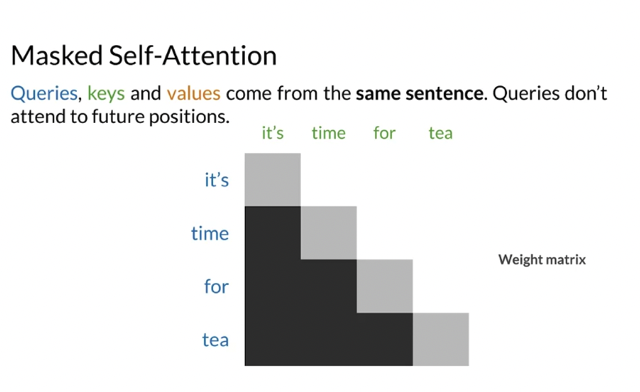</kbd>

> [!NOTE]
> Masked Self-Attention thì tương tự, như
> Self-Attention nhưng mỗi từ chỉ attent tới
> các từ trước đó thôi

   

  
  
<kbd>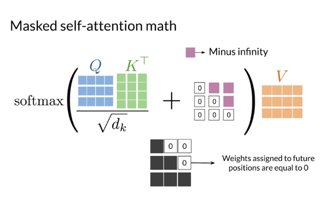</kbd>

> [!NOTE]
> Cách dùng đơn giản là **add cái mask vào kết quả của scaled
> dot-product**. Trong đó **mask là matrix cùng shape có value = 0
> ở mọi entry,**ngoại trừ **trên đường chéo là số âm vô cùng bé**
>
> Để rồi sau khi qua softmax, **những weights assigned cho future position
> sẽ là 0**

   

  
  
<kbd>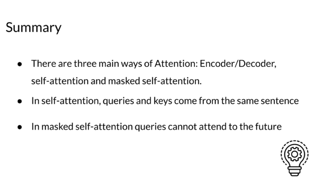</kbd>

   

## Multi-head Attention

 

### Sure, here are the main ideas presented in the lecture, organized in numerical

> [!NOTE]
> Sure, here are the main ideas presented in the lecture, organized in numerical 
> index order:
>
> 1. You've learned the\**basics of attention \**and how to build a transformer. 
> But for better performance and results, you need \**multi-head attention.\**
>
> 2. Multi-head attention allows the model to\**attend to different aspects of 
> the input sequence simultaneously\**.
>
> 3. Intuition: \**Different heads capture different relationships\**, enhancing the 
> model's capabilities.
>
> 4. Math behind multi-head attention: \**Queries, keys, and values need word 
> embeddings\** and \**scale dot-product attention.\**
>
> 5. In multi-head attention, \**apply attention to multiple sets of matrices\** obtained 
> by\**transforming original embeddings\**.
>
> 6. Number of attention applications equals the\**number of heads in the model\**.
>
> 7. \**Different heads\** use \**distinct sets of representations,\** learned by\**linear 
> transformations (W^Q, W^K, W^V) for each head\**.
>
> 8. Input to multi-head attention: \**value, key, and query matrices.\**
>
> 9.\**Transform each matrix into multiple vector spaces based on the number of 
> heads.\**
>
> 10. Apply\**scale dot-product attention\** mechanism to \**each set of value, key, and 
> query\** transformations.
>
> 11. \**Concatenate results from each head\** into a\**single matrix.\**
>
> 12. \**Linearly transform\** the \**concatenated matrix\** to get \**output context vectors.\**
>
> 13. \**Each linear transformation\** has\**learnable parameters.\**
>
> 14. Details on transformation matrix dimensions: \**rows and columns.\**
>
> 15. \**Parallel attention mechanism application for each head\**.
>
> 16. \**Concatenation leads to a matrix with context vectors.\**
>
> 17. \**Linear transformation (W^O) \**on the \**concatenated matrix yields final context vectors.\**
>
> 18. Implementation note: Multi-head attention allows parallel computations, 
> similar to single-head attention.
>
> 19. The lecture series covered basic dot-product attention, causal attention, 
> and multi-head attention.
>
> 20. You're ready to build a transformer decoder using these concepts.

 

  
  
<kbd>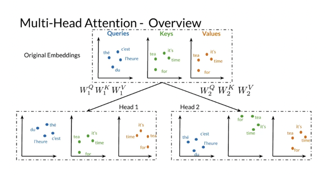</kbd>

> [!NOTE]
> Đại khái như đã biết ở DLSpec, ta sẽ **sử dụng các learnable weights**
> **WQ,WK, WV** của các Linear layer **để linear transformation cái
> embedding thành Q, K, V**. Mà ta hay nói là cho embedding đi qua
> cổng Query, Key, Value để trở thành Q, K, V cho quá trình tính
> scaled dot-product attention.
>
> Thì **multi-head attention** có nghĩa là \_**có nhiều bộ WQ, WK, WV khác
> nhau**\_, để **transform embedding thành nhiều Q,K,V khác nhau** để \_**thực
> hiện nhiều lần phép tính scaled dot-product attention**\_.
>
> Gọi là **multi-head**. Ý nghĩa của nó là nó sẽ**trích xuất nhiều dạng ngữ
> cảnh khác nhau ở mỗi head.**
> Ví dụ như trong DLSpec khi tính **mức độ nhiều ít của chữ l'Afrique nên chú ý
> đến các chữ khác trong câu** (Jane visite l'Afrique on Setembre'
>
> Thì khi ý đang hỏi là**"Chuyện gì"**thì nó sẽ chú ý đến **"visite"** nhiều hơn, 
> nếu ý đang hỏi là **"Khi nào"** thì nó sẽ chú ý đến **"Septembre"** nhiều hơn
> và nếu ý đang hỏi là **"Ai"** thì nó sẽ chú ý đến **"Jane"** nhiều hơn.
>
> Thì đại ý là với Multi-head attention thay vì chỉ có mỗi một head attention
> thì **contextual vector sẽ nắm bắt được thông tin ngữ cảnh ở nhiều khía 
> cạnh hơn**

   

  
  
<kbd>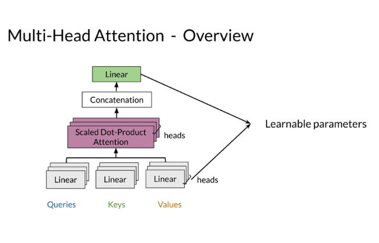</kbd>

   

  
  
<kbd>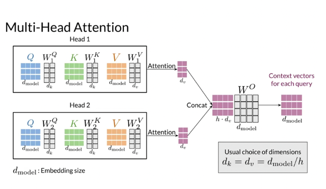</kbd>

> [!NOTE]
> Đại khái là thay vì nếu như thông thường: Ta có Embedding (**seq, dmodel**) qua WQ,WK,
> WV có shape là (**dmodel, dmodel**) để thành Q,K,V đều có shape: (**seq, dmodel**) để đi qua
> S.D.P.A trong đó phép tính sẽ có các shape: 
>
> (seq, dmodel)@(dmodel, seq)].(seq, dmodel) 
> (seq, seq).(seq, dmodel) = (seq, dmodel) 
>
> -> Context vector sẽ có shape vẫn là seq, dmodel
>
> seq - sequence length. 
>
> dmodel = embedding length. 
>
> S.D.P.A là  Scaled Dot Product Attention.
>
> ====
>
> Thì với multi-head: ta dùng các bộ (W1Q, W1K, W1V), (W2Q, W2K, W2V),... có shape
> (**dmodel, dk = dmodel/h**) để **linear transformation Embedding** thành các bộ **(Q1,K1,V1) (Q2,
> K2, V2)** ...đều có shape là (**seq, dk = dmodel/h**)
>
> Và sau khi thực hiện các phép tính scaled-dot product attention với các bộ này (head) ví dụ
> [softmax (Q1.K1_T)/sqrt(dk)]*V1, [softmax (Q2.K2_T)/sqrt(dk)]*V2...
>
> Kết quả của chúng sẽ đều có shape là (**seq, dk**). Và ta sẽ concatenate chúng nó lại thành 
> ra (**seq, dk*h**) = (**seq, dmodel**).****Sau đó **cho qua thêm một linear transformation** nữa với Wo để thành **contextual embedding**, 
> shape vẫn là (**seq, dmodel**)
>
> (softmax{[(seq, dk)@(dk, seq)]/scalar}@(seq, dk) = (seq, dk))
>
> (*) Ở đây ta có thể thấy tại sao ta nên hiểu **dk không phải là luôn là embedding dimension** mà là
> **chiều dài của key vector**, vì trong multi-head attention thì **chiều dài của key vector là
> dk = dmodel/h - h là số head**
>
> Và các phép tính Scaled Dot Product Attention với các head này sẽ **xảy ra cùng lúc.**
>
> (**) Trong hình ổng để kiểu (Q1,K1,V1),.thì có size Q1 - (seq, dq), K1 = (seq, dk), V1 = (seq, dv)
> Cho phân biệt nhưng ta nên hiểu là thường thì **dq=dk=dv=dmodel/h** hết
>
> ====
>
> Như vậy, vẫn là thông qua các WQ, WK, WV khác nhau để thành các Q,K,V khác nhau nhưng có thêm
> chi tiết là: 
>
> Và quá trình thực sự**cũng không phải là có tách biệt các W1Q, W2Q...**mỗi cái có shape (seq, dmodel/h)
> mà **vẫn chỉ là 1 cái WQ (seq, dmodel)** duy nhất, nhưng**ý là mỗi phần của nó hành xử như một cái riêng**.
>
> **Để rồi quá trình có vẻ nhiều phần:**
> embedding ---qua W1Q, W1K, W1V--> Q1, K1, V1 => [softmax(Q1@K1_T)/sqrt(dk)]@V1
> embedding ---qua W2Q, W2K, W2V--> Q2, K2, V2 => [softmax(Q2@K2_T)/sqrt(dk)]@V2
> ...  
>
> **Thật ra vẫn chỉ là 'làm với' một bộ lớn** Q,K,V qua WQ,WK,WV.
>
> embedding ---qua WQ, WK, WV--> Q, K, V => [softmax(Q@K_T)/sqrt(dk)]@V

   

  
  
<kbd>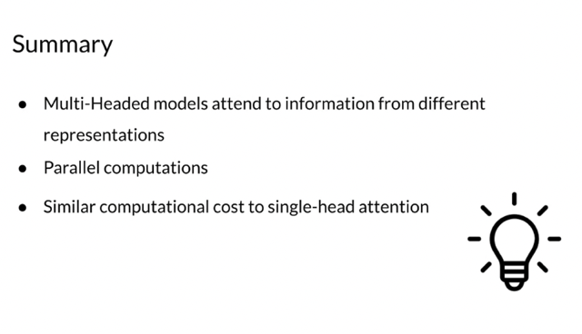</kbd>

   

## Reading: Multi-head Attention

 

<kbd>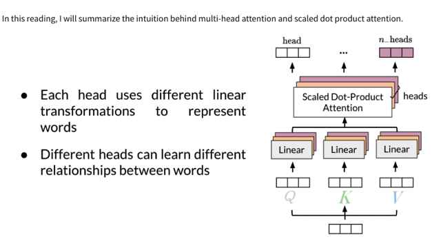</kbd>

 

<kbd>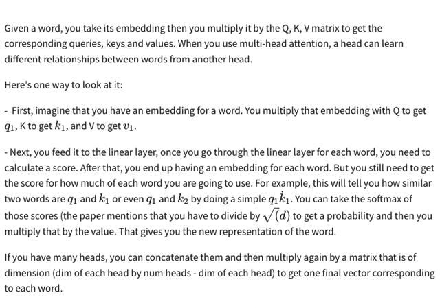</kbd>

 

<kbd>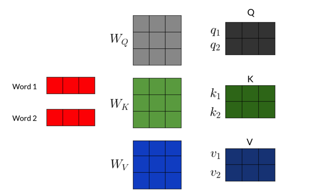</kbd>

 

<kbd>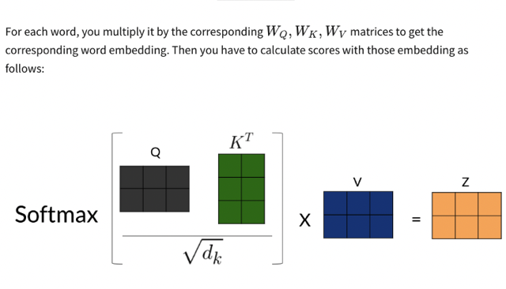</kbd>

 

<kbd>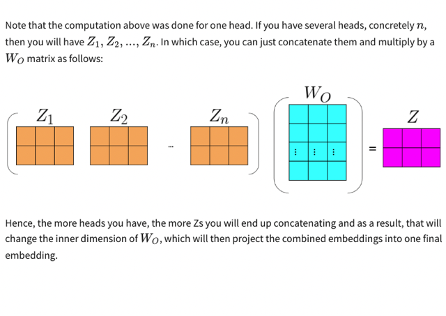</kbd>

 

## Lab: Attention

 

### In this notebook you'll explore the \\*three ways of attention\\*

> [!NOTE]
> In this notebook you'll explore the \**three ways of attention\**
> (\**encoder-decoder attention\**, \**causal attention\**, and
> \**bi-directional self attention\**) and how to implement the
> latter two with dot product attention.

 

  
  
<kbd>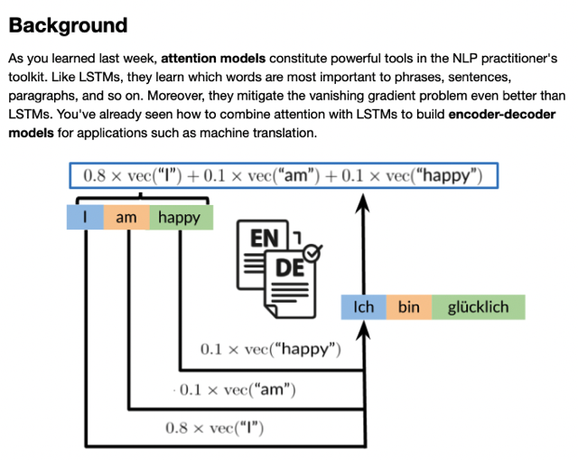</kbd>

> [!NOTE]
> Đại khái thì ta đã thấy **Attention có ưu điểm** như thế nào trong việc
> giúp model learn từ nào thì **nên chú ý nhiều ít đến từ nào**, từ đó khắc
> phục hiện tượng **vanishing gradient**tốt hơn cả LSTM cũng như là**mất
> thông tin khi câu quá dài khiến performance giảm**

   

  
  
<kbd>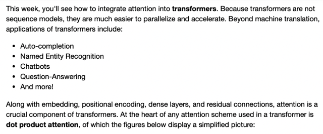</kbd>

> [!NOTE]
> Đại khái như ta đã biết, ngoài những những ưu điểm trên
> Attention mechanism còn mang lại một khả năng là **sử lý song
> song** vốn là điều mà sequence model bị hạn chế. Cùng với
> **embedding, positional encoding, residual connection, attention** là
> trái tim là**dot product attention**

   

  
  
<kbd>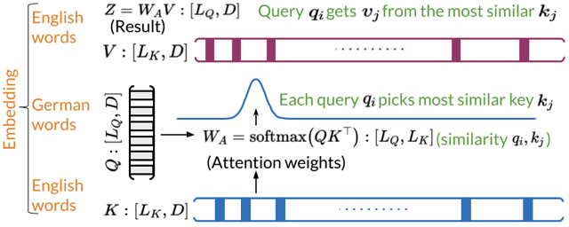</kbd>

  
<kbd></kbd>

  
<kbd>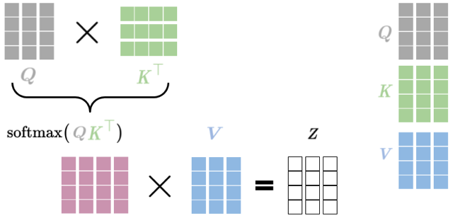</kbd>

   

  
  
<kbd>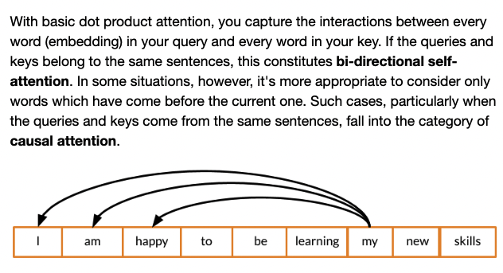</kbd>

> [!NOTE]
> Nếu Self-Attention mà trong đó mỗi từ attention với mọi từ
> khác thì gọi là **Bi-directional Self-attention**, còn nếu chỉ
> attention với những từ trước nó thì gọi là**Causal attention
> (Future masked attention)**

   

  
  
<kbd>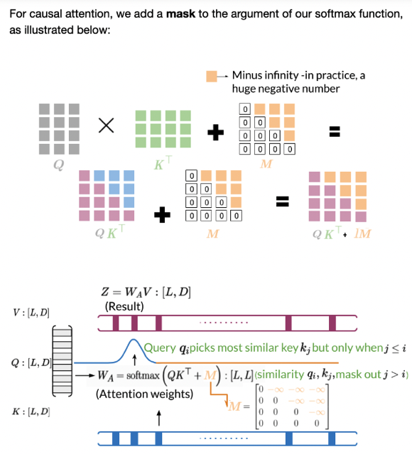</kbd>

   

- Now let's see how to implement attention with NumPy. When you integrate attention into a transformer network defined with trax, you' ll have to use \\*trax.fastmath.numpy \\*instead, since trax's arrays are based on \\*JAX DeviceArrays\\*. Fortunately, the function interfaces are often identical.
   

  
  
<kbd>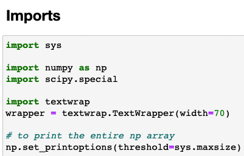</kbd>

   

  
  
<kbd>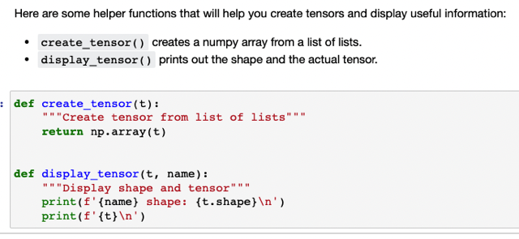</kbd>

   

  
  
<kbd>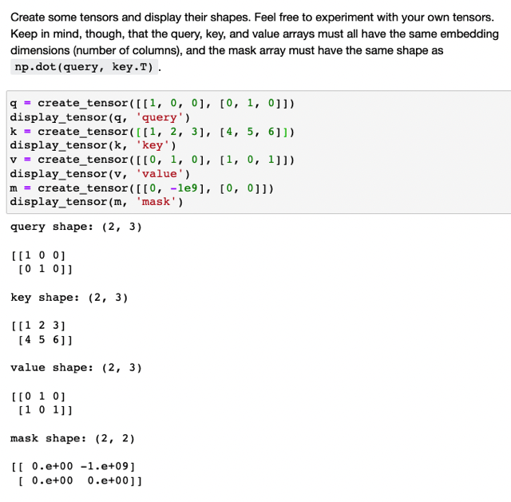</kbd>

   

  
  
<kbd>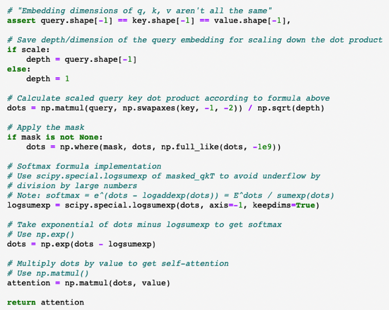</kbd>

  
<kbd></kbd>

  
<kbd>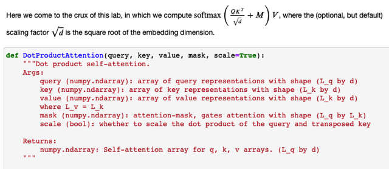</kbd>

> [!NOTE]
> **dk** chính là**length của key vector**, nhưng tất nhiên ta hiểu **cũng
> bằng query vector hay value vector**. Nên ở đây ổng **lấy depth là
> value của last dimension của query tensor.**
>
> ====
>
> **np.swapaxes(key, -1,-2)** chính là **transpose cho K**, vì K tensor có
> shape (batch, seq, dk) hoặc (batch, head, seq, dk) nôm na là nếu mà
> matrix thì transpose chính là phép swapaxes(0,1) còn với 3D hay 4D
> tensor ta swap 2 trục cuối
>
> ====
>
> Chỗ apply mask hiểu nôm na là fill dots với quy tắc:**Chỗ nào trong
> mask mà bằng 1** thì**trong dots giữ nguyên**, **ngược lại thì biến
> thành negative infinity.**
>
> Cái này cũng tương tự như**đầu tiên biến mask thành chỗ nào bằng
> 1 thì biến thành 0 chỗ nào = 0 thì biến thành negative infi** rồi cộng
> với dots vậy. CƠ bản là có thể có nhiều cách làm thôi, lý thuyết vẫn
> vậy
>
> ====
>
> Rồi softmax, thì ở đây làm bằng cái kiểu này: 
>
> softmax([x1,x2,x3]) = [e^x1/S, e^x2/S, e^x3/S] = e^([x1,x2,x3]) / S  
> với S = sum(e^x1/S, e^x2/S, e^x3/S) 
> mà S cũng = e^(log(S)). Cái này giống như 3 = e^log(3) vậy. Vì log không nói gì tự
> tự hiểu là log cơ số e.
>
> Nên e^([x1, x2, x3]) / S = e^([x1, x2, x3]) / e^log(S)  
> = e^{([x1, x2, x3]) - log(S)} (vì a^m / a^n = a^(m/n))
>
> Mà ý là có function tính log(S) = **scipy.special.logsumexp**.
>
> Nên thành ra là**e^(dots - logsumexp)**
>
> Cuối cùng tính dots. và value để ra attention

   

  
  
<kbd>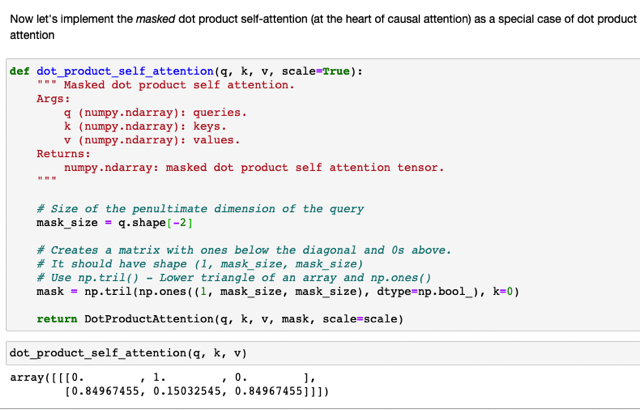</kbd>

> [!NOTE]
> Đầu tiên nó tính cái **mask_size** = **queries vector length dk** (cũng là của
> keys hay values).
>
> Dùng function **np.tril()** với input là **one tensor** tạo bởi function **np.
> ones** và d**type=np.bool** sẽ cho **matrix với phần dưới đường chéo là 1,
> và phần trên là 0**

   

  
  
<kbd>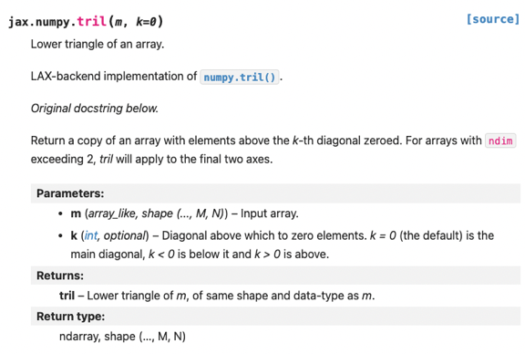</kbd>

   

## Transformer Decoder

 

<kbd>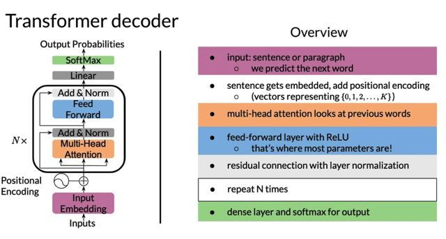</kbd>

 

<kbd>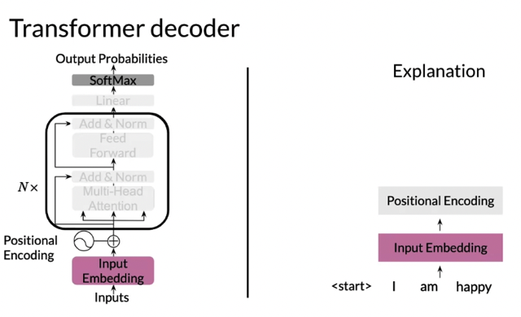</kbd>

> [!NOTE]
> Here on the right, you'll see the core of the transformer model, it has **three layers
> at the beginning**. Then the **shift right**, this**introduces the start token** which your
> model will use to predict the next word. You have the **embedding** which drains a
> word to vector embedding, and **positional encoding** which drains the vectors for 1,
> 2 and so on as explained before. If the input to the model was a tensor of shape
> **batch by length**, then after the embedding layer it will be tensor of shape **batch by
> length by D model**. Where **D model is the size of these embeddings**, and they
> usually go to **512, 1024** ,and nowadays up to **10-K** or more

> [!NOTE]
> Đề cập đến các layer đầu tiên của Decoder. Bao gồm **ShiftRight** - **chèn
> SOS token vào đầu sequence** input. Sau đó là **Embedding** và
> **Positional Encoding**.
>
> Kết quả sẽ từ **(batch_size , sequence_length)** thành **(batch_size,
> sequence_legnth, d_model = embedding)**.
>
> Đáng chú ý đây mới là lần đầu tiên kể cả DLSpec có người nói rõ **d-model 
> chính là embedding length**, trước giờ chỉ tự hiểu. Và nói thêm
> rằng, **thông thường có thể là 512, 1024 nhưng ngày nay có thể lên tới
> 10k units.**
>
> Ta gọi nó là **positional input embedding** hay **embedding encoding**

 

<kbd>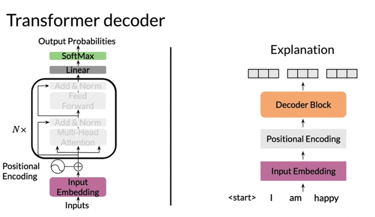</kbd>

> [!NOTE]
> Sau đó "**positional embedding**" đi qua Decoder block và đi ra
> với các Linear layer và softmax giúp output dạng **(batch size,
> sequence length, vocab size)**: **Probability scores cho ứng cử
> viên cho correct word tại các vị trí**

 

<kbd>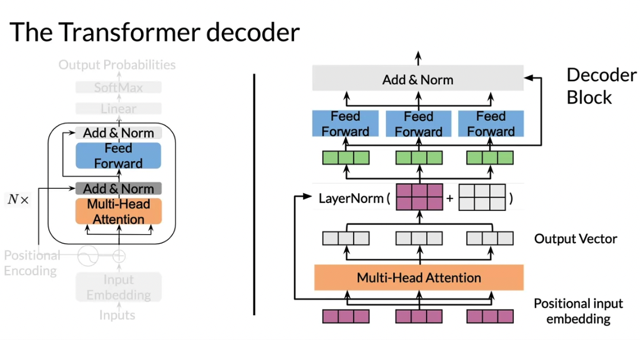</kbd>

> [!NOTE]
> Now let's see how the decoder block is built. It starts with a **set of vectors as an
> input sequence**, which are **added to the corresponding positional coding** vectors,
> producing the so called **positional inputs embedding**.
>
> After embedding, the input sequence passes through a **multi headed attention
> model**. And while this model processes each word, each position and the input
> sequence. **The attention itself searches other positions in the sequence to help
> identify relationships**. Each of the words and the sequence is weighting. Then in
> each layer of attention there is a **residual connection** around it, followed by a
> **layer normalization** step to **speed up** the training, and significantly reduce the
> overall processing time.
>
> Then each word is passed through a **feed forward layer,** that is **embeddings are
> fed into a neural network**. And then you have a**drop out** as a form of
> regularization. Next, a layer **normalization** step is **repeated capital N times**.
> Finally, the encoder layer output is obtained

> [!NOTE]
> Đề cập đến thành phần của Decoder block, đó là positional
> embedding sẽ đi qua Multi-head attention (mà trong đó sẽ có vụ biến
> thành Q,K,V bằng các Linear transformation WQ,WK,WV) để tạo ra
> contextual embedding. Lại được 'Add' với Skip Connection rồi
> Normalization, Feed Forward

 

<kbd>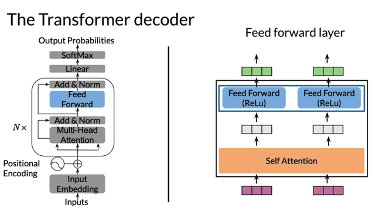</kbd>

> [!NOTE]
> After the **attention mechanism** and the **normalization step**, some **non linear
> transformations** are introduced by including**fully connected feet forward
> layers**. 
>
> With simple but not only in your radio activation functions for each
> input, and you have **shared parameters for efficiency**. The feed forward neural
> network**output vectors will essentially replace the hidden states of the original
> RN encoder.**

> [!NOTE]
> Nói không rõ lắm nhưng đại khái là nói về vai trò của
> Feed Forward layers. vào lab hay pa sẽ hiểu rõ hơn

 

<kbd>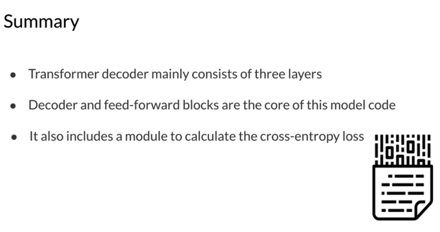</kbd>

 

## Reading Transformers Decoder

 

## Transformers Summarizer

 

### Certainly, here are the main ideas presented in the lecture, organized in numerical index order:

> [!NOTE]
> Certainly, here are the main ideas presented in the lecture, organized in numerical index order:
>
> 1. The focus is on \**building a summarizer\** using the transformer model.
> 2. Overview of the \**transformer model's code structure\**.
> 3. Technical details about \**data processing for summarization\**.
> 4. For the assignment, the \**input is news article\**s, and the model \**produces summaries\**.
> 5. \**Concatenate\** the \**article and summary\** for \**input to the transformer\**.
> 6. Input features are \**tokenized sequences\** with \**EOS tags and padding\**.
> 7. \**Weighted loss\** is used to \**focus the model on the summary during training\**.
> 8. Consider \**weighting the article loss\** with \**non-zero values\** to learn common word relationships.
> 9. Cost function \**sums losses over words in the summary\**, \**ignoring article words.\**
> 10. Train the transformer summarizer using \**constructed inputs and the mode\**l.
> 11. At inference, \**input the article with EOS token and predict next words for summary.\**
> 12. Transformer generates a \**probability distribution over possible words.\**
> 13. \**Sampling from this distribution\** yields different summaries each time.
> 14. Implementing this is part of the coding exercise.
> 15. Implementation involves \**optimizing a weighted cross-entropy function.\**
> 16. Summarization is a \**form of text generation using the entire article as input.\**
> 17. The journey involve\**d building a transformer\** and using it to\**create a summarizer.\**
> 18. The transformer is powerful and comprehensible.
> 19. Next week's content will focus on an enhanced version of the transformer with pre-training.

 

  
  
<kbd>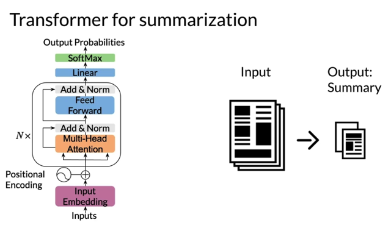</kbd>

> [!NOTE]
> As **input**, you get **whole news articles**. As output, your model is expected to **produce the
> summary of the articles**, that is, **few sentences that mention the most important ideas**. To do
> this, you'll use the transformer model that I showed you in previous videos but one thing may
> immediately stand out to you, **transformer only takes text as input and predicts the next word.**
> For summarization, it turns out you**just need to concatenate the input**, in this case, **the article
> and put the summary after it**

   

  
  
<kbd>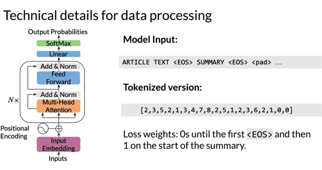</kbd>

> [!NOTE]
> Đại khái là, **input đưa vào model** sẽ là: **Article text - Nội dung bài báo, <EOS>
> Summary - Là summary của human <EOS> <pad>**. 
>
> Thì cái vụ **loss weight** ý là
> **gán weight = 0** đối với **từ thuộc về article**, và **= 1 đối với từ thuộc về summary**.
>
> Mục đích là để **model nó focus vào generate summary** chứ **không phải là
> article**. 
> Có lẽ lúc làm PA sẽ hiểu rõ hơn

   

  
  
<kbd>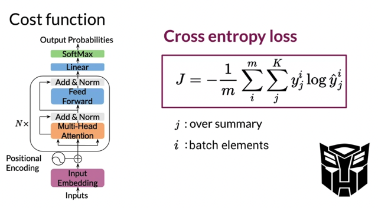</kbd>

   

  
  
<kbd>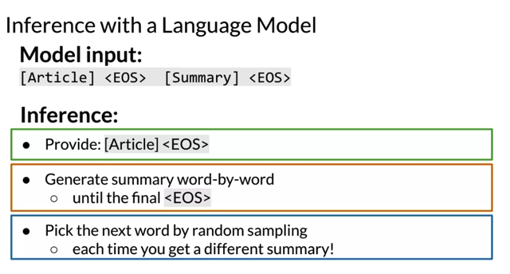</kbd>

   

  
  
<kbd>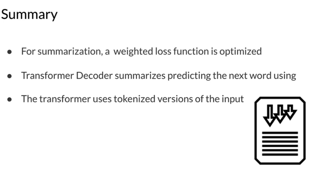</kbd>

   

- As of my last update in September 2021, GPT-3 was trained using a method known as "unsupervised learning," which involves  predicting the next word in a sequence. However, I can certainly provide you with a step-by-step breakdown of how training for  summarization tasks typically works:  1. **Data Collection and Preprocessing**:    - Gather a large dataset of news articles along with their corresponding human-written summaries.    - Preprocess the text data by tokenizing it into smaller units, such as words or subwords. This is typically done using methods  like Byte-Pair Encoding (BPE) or SentencePiece.     2. **Data Format for Summarization**:    - Organize the data into pairs of articles and their corresponding summaries.    - Tokenize both the articles and summaries into numerical representations (tokens or IDs) using a tokenizer specific to the  language model.  3. **Model Architecture**:    - Choose a transformer-based architecture like GPT-3 for the summarization task.    - Decide whether to use the full transformer (encoder-decoder) architecture or a variant of it (e.g., decoder-only for autoregressive  language modeling).  4. **Input-Output Mapping**:    - In the context of summarization, the task is typically treated as a sequence-to-sequence problem.    - The article becomes the input sequence, and the goal is to generate the summary as the output sequence.  5. **Token Weighting for Summary Focus**:    - Assign different weights to tokens in the input sequence based on whether they belong to the article or the summary.    - This weighting scheme guides the model's focus during training, encouraging it to prioritize the summary generation.  6. **Loss Function**:    - Define a suitable loss function for the summarization task, often based on cross-entropy.    - Apply the weighted loss scheme, where tokens from the article might have zero weight and tokens from the summary have  non-zero weight.  7. **Training Process**:    - Initialize the transformer model's parameters randomly or using pretrained weights.    - Feed the article sequences into the model and train it to predict the summary sequences.    - Backpropagate the error through the network and update the model's parameters using optimization algorithms like Adam.  8. **Fine-Tuning and Evaluation**:    - After initial training, fine-tune the model on the summarization-specific task.    - Use evaluation metrics like ROUGE (Recall-Oriented Understudy for Gisting Evaluation) to assess the quality of generated  summaries.  9. **Iterative Training and Optimization**:    - Train the model iteratively, adjusting hyperparameters and architecture as needed.    - Monitor the model's performance on validation data to prevent overfitting.  10. **Inference**:     - After training, use the trained model for inference.     - Given an input article, generate a sequence of tokens for the summary using techniques like greedy decoding or beam search.  11. **Post-Processing**:     - Convert the generated token sequence back into human-readable text.     - Clean up the generated summary to ensure coherence and readability.  12. **Model Deployment**:     - Deploy the trained summarization model in applications that require automated summarization of news articles.  It's important to note that the training process can vary based on the specific architecture, dataset, and goals of the  summarization task. Additionally, advancements in AI and training methodologies might have occurred since my last  update in September 2021.
> [!NOTE]
> GPT nói về các bước training
> Summarization Task

   

## Lab: The Transformers Decoder

 

<kbd>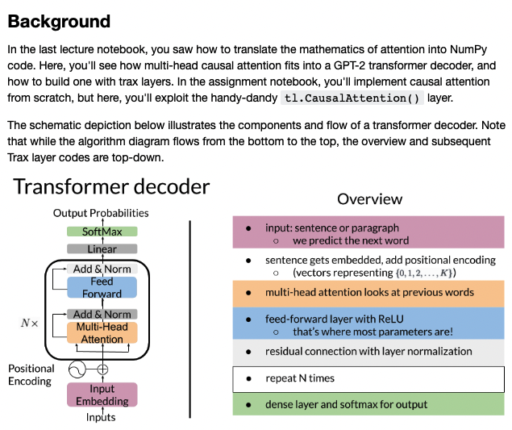</kbd>

 

### Imports

 

  
  
<kbd>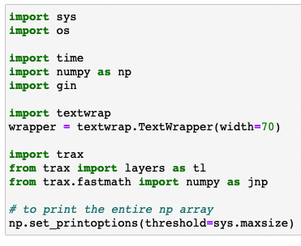</kbd>

   

### Sentence gets embedded,

> [!NOTE]
> Sentence gets embedded,
> add positional encoding

 

  
  
<kbd>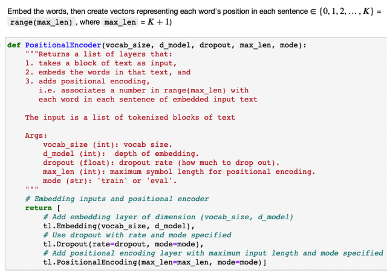</kbd>

> [!NOTE]
> Đại khái là **function** này nó sẽ tạo một cái gọi là **PositionalEncoder**
> block, cấu thành bởi l**ayer Embedding, Dropout và PositionalEncoding**
> layer của Trax.
>
> Cơ bản là tensor khi đi vào component này ở dạng [**batch size, sequence**]**length** sẽ đi ra là [**batch size, sequence length, dmodel**]. Trong đó từ **một
> token trong sequence** of token, nó sẽ**trở thành embedding vector** of
> length dmodel,
>
> Sau đó qua **dropout**, (chỗ này chưa hiểu nó work như thế nào ở đây) , rồi
> được **add với positional encoding** để**'bổ sung' positional information như
> đã biết.**

   

### Multi-head

> [!NOTE]
> Multi-head
> causal attention

 

  
  
<kbd>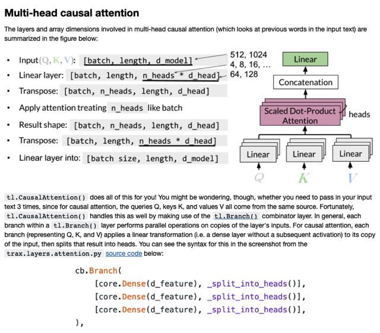</kbd>

> [!NOTE]
> Hiểu:
>
> [**batch, length, dmodel**] qua Linear WQ, WK, WV để thành 
> Q,K,V [**batch, length, n_head*dhead=dmodel**] mà ta có thể ví von cho dễ hiểu như 
> **n_head** bộ Qi, Ki, Vi có shape [**batch, length, dk**].
>
> dhead = d_model/n_head
>
> Như trong series về Transformer của Ketan có nói rõ, việc thực hiện
> Multi-head Attention sẽ có bản chất là như sau:
>
> [**batch, length, n_head*dhead**] reshape thành [**batch, n_head, length, dhead**]
>
> Thực hiện Scaled Dot Product Attention **coi n_heads như batch** tức là giống như
> tính softmax[(Q1.K1_T)/sqrt(dhead)]*V1, softmax[(Q2.K2_T)/sqrt(dhead)]*V2....
> với các Q1,K1,V1,Q2,K2,V2..đều có shape là (length, dhead)
>
> Kết quả vẫn là [**batch, n_heads, length, dhead**]
>
> Sau đó lại **reshape** về [**batch, length, n_head*dhead**]
>
> Và q**ua tiếp Linear layer [batch, length, dmodel]**
>
> Thì ở đây ý nói là tương tự bên DLSpec, ta đã hiểu embedding [**batch, length, dmodel**] 
> qua Linear WQ, WK, WV để thành Q,K,V thì trong **Trax's CausalAttention** handle
> cái này bởi **tl.Branch(với 3 Dense layer không có activation)**

   

### Feed-forward layer

 

  
  
<kbd>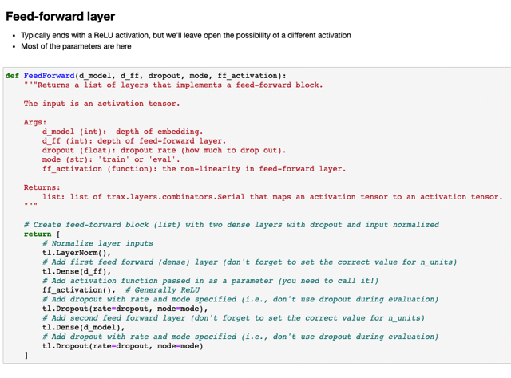</kbd>

   

### Decoder block

 

  
  
<kbd>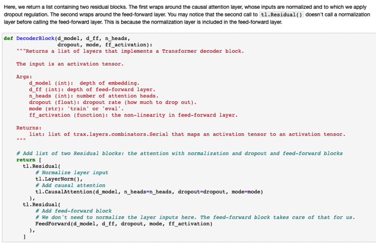</kbd>

   

### The transformer decoder:

> [!NOTE]
> The transformer decoder:
> putting it all together

 

  
  
<kbd>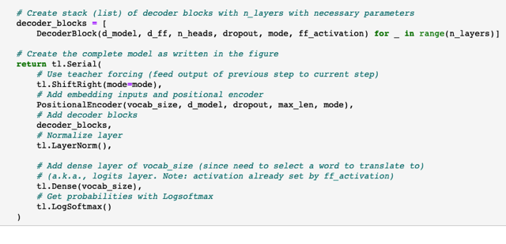</kbd>

  
<kbd></kbd>

  
<kbd>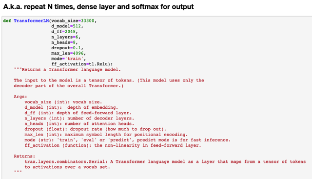</kbd>

> [!NOTE]
> Ghép lại hết để build Transformer language
> model Decoder-only structure đây
>
> Bắt đầu với **ShiftRight**, Rồi **PositionalEncoder** cho ra '**positional embedding**'
>
> Tiếp theo qua decoder_blocks là list n_layers cái DecoderBlock
>
> Kết quả cho qua LayerNorm trước khi qua Dense(vocab_size) để
> biến [**batch, length, dmodel**] thành [**batch, length, vocab size**] mang giá trị
> logits.
>
> Cuối cùng là **LogSoftmax** để thành**log probabilities**

   

### Concluding remarks

 

- In this week's assignment, you'll see how to train a transformer decoder on the \\*cnn_dailymail\\* dataset, available from \\*TensorFlow Datasets\\* (part of TensorFlow Data Services). Because training such a model from scratch is \\*time-intensive\\*, you'll use a \\*pre-trained model to summarize documents\\* later in the assignment.  Due to time and storage concerns, we will also not train the decoder on a \\*different summarization dataset\\* in this lab. If you have the time and space, we \\*encourage you to explore the other summarization datasets at TensorFlow Datasets\\*. Which of them might \\*suit your purposes bette\\*r than the \\*cnn_dailymail\\* dataset? Where else can you find datasets for text summarization models?
> [!NOTE]
> Đại khái là trong PA mình sẽ **train transformer decoder** dùng
> **cnn_dailymail** dataset có sẵn trên **TSDS** nhưng vì giới hạn thời gian
> ta sẽ **load pre-trained model để tést**. Người ta cũng khuyên nếu rảnh
> quay lại **thử train các summarization dataset** khác có thể phù hợp với
> nhu cầu hơn của cnn

   

## Week Conclusion

 

## Quiz

 

<kbd>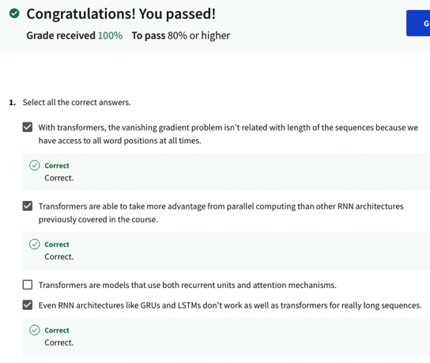</kbd>

 

<kbd>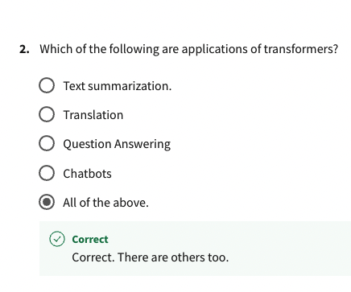</kbd>

 

<kbd>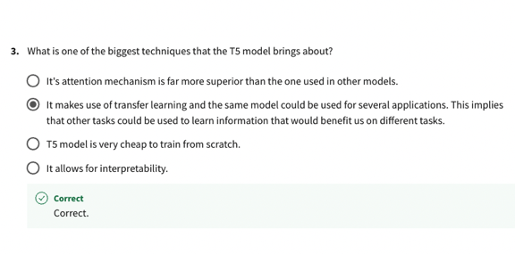</kbd>

 

<kbd>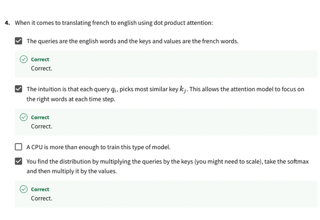</kbd>

 

<kbd>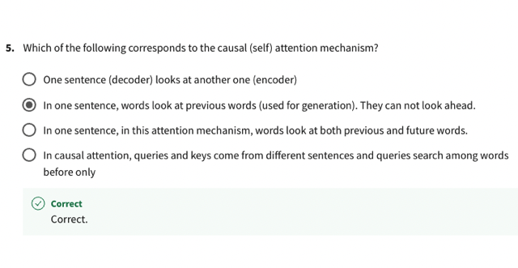</kbd>

 

<kbd>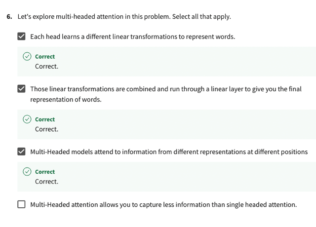</kbd>

 

<kbd>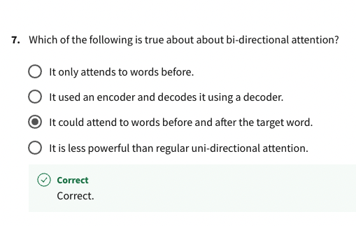</kbd>

 

<kbd>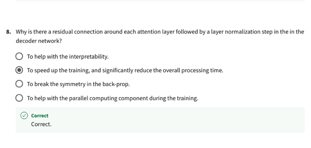</kbd>

 

<kbd>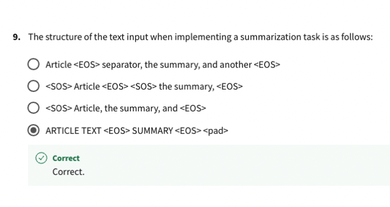</kbd>

 

<kbd>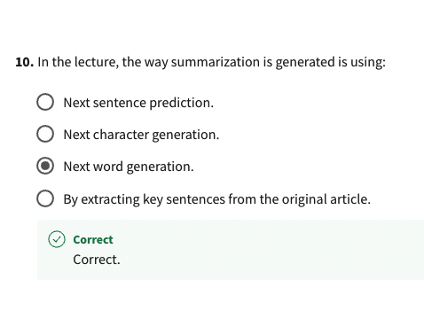</kbd>

 

## PA: Transformer Summarizer

 

### Welcome to the second assignment of course 4. In this assignment you will explore

> [!NOTE]
> Welcome to the second assignment of course 4. In this assignment you will explore
> \**summarization\** using the \**transformer model\**. Yes, you will implement the\**transformer decoder from scratch\**, but we will \**slowly walk you through it\**. There are
> \**many hints in this notebook so feel free to use them as needed.\**

<kbd>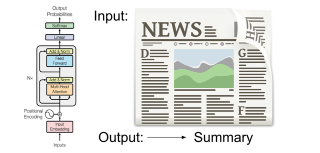</kbd>

 

- Introduction
   

    
    
<kbd>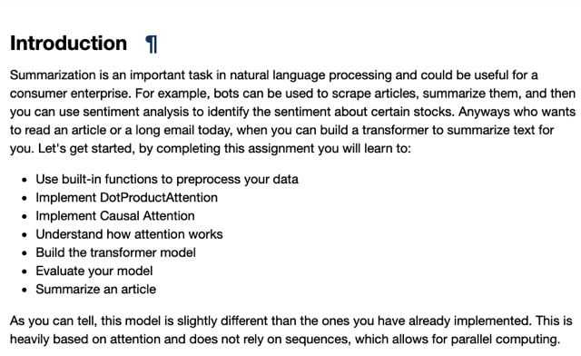</kbd>

     

    
    
<kbd>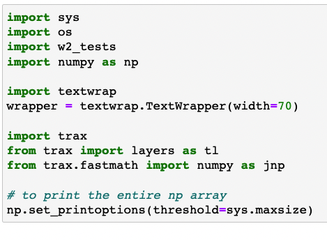</kbd>

     

- 1 - Importing the Dataset
   

    
    
<kbd>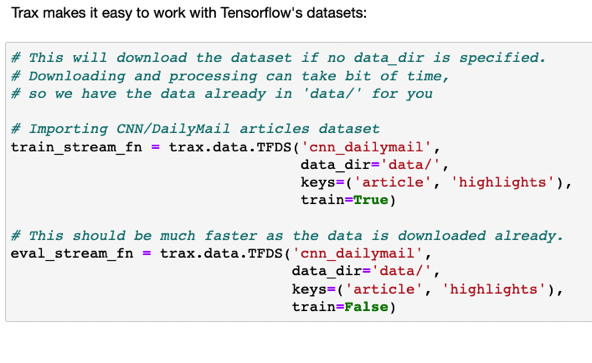</kbd>

> [!NOTE]
> Dùng TFDS 'lấy' bộ
> cnn_dailymail dataset.

     

- 1.1 - Tokenize & Detokenize Helper Functions
   

    
    
<kbd>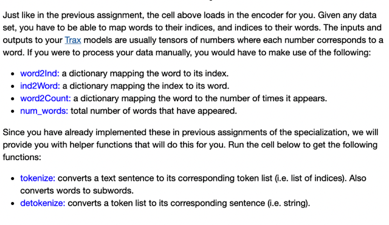</kbd>

> [!NOTE]
> Như thường lệ, khi train một language model, luôn phải bắt đầu từ
> một dataset text corpus, để rồi từ đó phải chuẩn bị các bộ
> dictionary map giữa từ và index và ngược lại.
>
> Ở đây tương tự bữa trước, người ta chuẩn bị sẵn cho mình các
> dictionary này để rút ngắn thời gian, vì dù sao cũng đã làm qua rồi

     

    
    
<kbd>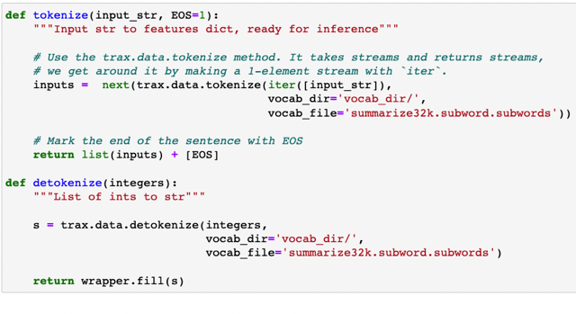</kbd>

> [!NOTE]
> Với lại chuẩn bị sẵn cho 2 function giúp tokenize giúp
> tokenize một text sequence và detokenize giúp convert
> token sequence thành text sequence

     

- 1.2 - Preprocessing for Language Models: Concatenate It!
   

  
  - This week you will use a language model -- \\*Transformer Decoder\\* -- to solve an input-output problem. As you know, \\*language models only predict the next word\\*, they have \\*no notion of inputs\\*.  To \\*create a single input suitable\\* for a language model, we \\*concatenate inputs with targets putting a separator in between\\*. We also need to \\*create a mask -- with 0s at inputs\\* and \\*1s at targets\\* -- so that the model is \\*not penalized for mis-predicting the article\\* and \\*only focuses on the summary\\*.  See the preprocess function below for how this is done
> [!NOTE]
> Đại khái là đối với "**summarization** model" này thì có **một cái mới**
> so với các language model trước đây.
>
> Ví dụ như **Translation** model thì:  X là câu English ví dụ "Jane visit
> Africa in September" ,  Y là câu French ví dụ: "Jane visite l'Africa in
> Septembre"
>
> Còn với **Summarization** task, thì X là cái prompt chứa yêu cầu và
> content cần summarize. Còn**Y CÓ VẺ NHƯ là sẽ chứa article +
> summary do human tạo**.
>
> Thì ý là **phải cho model biết chỗ nào (trong label) là article gốc**, **chỗ
> nào là phần 'target' summary** mà model phải 'so sánh với'  để
> **minimize loss**. Có nghĩa là khi model bắt đầu generate và từ đó so
> với target để **tính loss và backprop** thì nó **chỉ tính với phần
> summary thôi, không cần để ý đến phần article content.**
>
> Nôm na là vậy, nên tiếp ta sẽ làm một cái function để **preprocess,  sao
> cho từ (token) của article sẽ được masked với 0, để  nó không bị tính
> vào khi tính loss**

     

      
      
<kbd>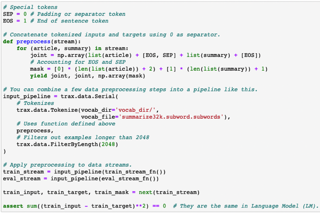</kbd>

> [!NOTE]
> Giải thích: Đầu tiên là preprocess(stream) function,
> thì nó expect input là streaming (data stream về)
> các tuple (article, summary)
>
> joint (combine) article, EOS token, SEP, summary, EOS
>
> Rồi tạo mask với [0]*(len((list(article)) + 2) chính là tạo chuỗi
> số 0 để 'cover' | 'mask' cho article và 2 cái EOS, SEP.
>
> Sau đó ([1]*(len(list(summary)) + 1) là chuỗi số 1 mask cho 
> phần summary.
>
> ====
>
> Sau đó dùng Serial để kết hợp các công đoạn của preprocessing
> bắt đầu bằng Tokenize, tới preprocess, cuối cùng là filter bớt sequence
> nào dài quá 2048. Đây không phải là max_len mà chỉ là limit đặt ra,
> max_length là chiều dài của seq dài nhất có thể nhỏ hơn 2048 nhiều
> ====
>
> Gọi input_pipeline này với input là train_strean_fn và eval_stream_fn
> chuẩn bị ở trên để preprocess data.

       

      
      
<kbd>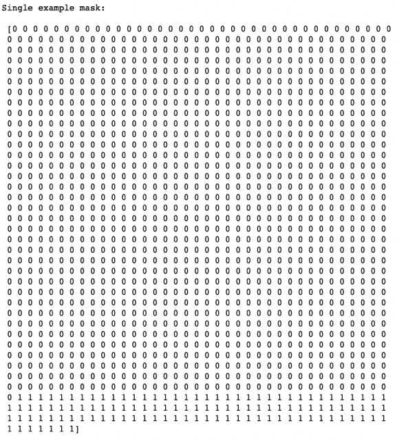</kbd>

       

    
    - # prints: \\*[Example][<EOS>][<pad>][Example Summary][<EOS>]\\* print(f'Single example:\\\ \\\  {detokenize(\\*train_input\\*)}')  Single example:  By . Becky Barrow . PUBLISHED: . 03:39 EST, 8 May 2012 . | . UPDATED: . 18:10 EST, 8 May 2012 . Andrew Moss: He will be paid £80,000 a month for the next year . The boss of Britain’s biggest insurance company will continue to receive his salary of £80,000 a month for the next year despite his humiliating resignation yesterday. Andrew Moss, who has quit as chief executive of Aviva after a shareholder revolt, will receive a golden goodbye worth around £1.75million in total. Last Thursday, 59 per cent of shareholder votes failed to back his gold- plated pay package worth up to £5.2million last year. It was the latest chapter in the growing backlash against boardroom greed, nicknamed the Shareholder Spring. Yesterday the 54-year-old chief executive said he ‘felt it was in the best interests of the company that he step aside to make way for new leadership’. But Mr Moss, who has also sparked public criticism for leaving his wife of 25 years and their four children for a junior married colleague, Deidre Galvin, in 2009, will not be leaving empty-handed. Walked: Aviva Group chief executive Andrew Moss, who is to step down with immediate effect . He will be paid his £960,000 ‘basic’ annual salary for the next year, equal to £80,000 a month, unless he finds another job. Mr Moss will also get a £300,000 bonus payment, a cash injection of £209,000 into his pension pot in five years’ time, deferred shares from a 2009 bonus, currently worth around £236,000, and a maximum of £45, 000 in legal and other expenses. He has two pensions from Aviva: one worth around £530,000 and one worth around £2. 75million, including the £209,000 payment. Mr Moss’s departure was announced on the eve of today’s Queen’s Speech, which is expected to fire the starting gun on a crackdown on boardroom excess and empower shareholders to veto any examples of corporate excess. Bounce: Shares in the UK's largest insurer jumped five per cent following the announcement, suggesting investors approve of Mr Moss's departure . Investor backing: The announcement was immediately followed by a spike in Aviva's shares . At present, shareholders can vote . against pay deals, but their votes are not binding on the company and . directors can still receive the controversial pay and bonuses. The main . role of such votes is to embarrass bosses and damage the firm’s . reputation. The mood of investors has turned ugly recently, triggering . the departure of bosses at drugs company AstraZeneca and newspaper group . Trinity Mirror. Turmoil: Aviva's St Helen's skyscraper looms in the City, where three CEOs have quit amid recent shareholder anger . Yesterday, . the chief executive of William Hill, Ralph Topping, was the latest . victim, with nearly 50 per cent of the betting firm’s shareholders . voting against a £1.2million bonus and a 8.3 per cent pay rise. At its . annual meeting, one angry shareholder said: ‘Chief executives are dining . in the last chance saloon trying to take as much as they can as soon as . possible.’ Business . Secretary Vince Cable, who has heavily criticised boardroom excess, said . bosses are finally being ‘brought back to reality’. He welcomed the . ‘uprising’ by shareholders as ‘a healthy development’, and said he is . determined to stamp out ‘rewards for failure’. Since . Mr Moss became chief executive in July 2007, Aviva’s share price has . more than halved, decimating the nest eggs of thousands of its smaller . shareholders. Liberal Democrat . Lord Oakeshott said: ‘Shareholder votes must be binding, otherwise it . just like a jury who acquit a man of a murder charge but the judge still . gives him 20 years. What’s the point?’ Deborah . Hargreaves, of the High Pay Centre campaign group, said: ‘The irony is . that Aviva was behind some of the recent pay revolts but, at the same . time, they were not looking after their own backyard. ‘This . is what makes Mr Moss’s payoff so intolerable. Aviva’s corporate . governance arm was lecturing others about pay and yet the company was . ignoring its own advice.’ Mr . Moss ceased to be chief executive ‘with immediate effect’ yesterday, but . he will not officially leave until the end of the month. Meanwhile, the average pay of bosses at Britain’s biggest public companies rose by 11 per cent last year to £3.65million, according to research published yesterday. The study, compiled for the BBC by Manifest, the adviser to shareholders, looked at the annual reports of 60 of the companies in the FTSE 100 index. On average, a chief executive gets a basic annual salary of £840,000, a long-term incentive plan of £1.14million, a cash bonus of £689,000 plus several other lucrative perks, according to the research. But the average worker in the private sector is losing ground, according to a report from the pay experts Incomes Data Services. The average pay rise handed out by bosses to their cash- strapped workers between January and March was 3 per cent, it says. It comes at a time when inflation is 3.5 per cent. The report found that 8 per cent of workers, who typically are employed in manufacturing, construction or the not-for-profit sector, had their pay frozen.\\*<EOS><pad>\\*\\/AndrewMoss is third victim of recent discontent after departures at Trinity Mirror and AstraZeneca . Investors back the move as shares jump 5 per cent . Small savers and pension investors can have a voice on excessive executive pay. The Mail has teamed up with . the FairPensions campaign to offer a tool that allows you to send your views to . your pension fund or ISA provider. Vote no on fat cat pay: Find out . more .\\/\\*<EOS>\\*
> [!NOTE]
> Nhưng không hiểu tại sao training data
> - x cũng phải có summary'

       

      
      - print(f"train_target: \\\ {detokenize(\\*train_target\\*)}")  train_target:  By . Becky Barrow . PUBLISHED: . 03:39 EST, 8 May 2012 . | . UPDATED: . 18:10 EST, 8 May 2012 . Andrew Moss: He will be paid £80,000 a month for the next year . The boss of Britain’s biggest insurance company will continue to receive his salary of £80,000 a month for the next year despite his humiliating resignation yesterday. Andrew Moss, who has quit as chief executive of Aviva after a shareholder revolt, will receive a golden goodbye worth around £1.75million in total. Last Thursday, 59 per cent of shareholder votes failed to back his gold- plated pay package worth up to £5.2million last year. It was the latest chapter in the growing backlash against boardroom greed, nicknamed the Shareholder Spring. Yesterday the 54-year-old chief executive said he ‘felt it was in the best interests of the company that he step aside to make way for new leadership’. But Mr Moss, who has also sparked public criticism for leaving his wife of 25 years and their four children for a junior married colleague, Deidre Galvin, in 2009, will not be leaving empty-handed. Walked: Aviva Group chief executive Andrew Moss, who is to step down with immediate effect . He will be paid his £960,000 ‘basic’ annual salary for the next year, equal to £80,000 a month, unless he finds another job. Mr Moss will also get a £300,000 bonus payment, a cash injection of £209,000 into his pension pot in five years’ time, deferred shares from a 2009 bonus, currently worth around £236,000, and a maximum of £45,000 in legal and other expenses. He has two pensions from Aviva: one worth around £530,000 and one worth around £2.75million, including the £209,000 payment. Mr Moss’s departure was announced on the eve of today’s Queen’s Speech, which is expected to fire the starting gun on a crackdown on boardroom excess and empower shareholders to veto any examples of corporate excess. Bounce: Shares in the UK's largest insurer jumped five per cent following the announcement, suggesting investors approve of Mr Moss's departure . Investor backing: The announcement was immediately followed by a spike in Aviva's shares . At present, shareholders can vote . against pay deals, but their votes are not binding on the company and . directors can still receive the controversial pay and bonuses. The main . role of such votes is to embarrass bosses and damage the firm’s . reputation. The mood of investors has turned ugly recently, triggering . the departure of bosses at drugs company AstraZeneca and newspaper group . Trinity Mirror. Turmoil: Aviva's St Helen's skyscraper looms in the City, where three CEOs have quit amid recent shareholder anger . Yesterday, . the chief executive of William Hill, Ralph Topping, was the latest . victim, with nearly 50 per cent of the betting firm’s shareholders . voting against a £1.2million bonus and a 8.3 per cent pay rise. At its . annual meeting, one angry shareholder said: ‘Chief executives are dining . in the last chance saloon trying to take as much as they can as soon as . possible.’ Business . Secretary Vince Cable, who has heavily criticised boardroom excess, said . bosses are finally being ‘brought back to reality’. He welcomed the . ‘uprising’ by shareholders as ‘a healthy development’, and said he is . determined to stamp out ‘rewards for failure’. Since . Mr Moss became chief executive in July 2007, Aviva’s share price has . more than halved, decimating the nest eggs of thousands of its smaller . shareholders. Liberal Democrat . Lord Oakeshott said: ‘Shareholder votes must be binding, otherwise it . just like a jury who acquit a man of a murder charge but the judge still . gives him 20 years. What’s the point?’ Deborah . Hargreaves, of the High Pay Centre campaign group, said: ‘The irony is . that Aviva was behind some of the recent pay revolts but, at the same . time, they were not looking after their own backyard. ‘This . is what makes Mr Moss’s payoff so intolerable. Aviva’s corporate . governance arm was lecturing others about pay and yet the company was . ignoring its own advice.’ Mr . Moss ceased to be chief executive ‘with immediate effect’ yesterday, but . he will not officially leave until the end of the month. Meanwhile, the average pay of bosses at Britain’s biggest public companies rose by 11 per cent last year to £3.65million, according to research published yesterday. The study, compiled for the BBC by Manifest, the adviser to shareholders, looked at the annual reports of 60 of the companies in the FTSE 100 index. On average, a chief executive gets a basic annual salary of £840,000, a long-term incentive plan of £1. 14million, a cash bonus of £689,000 plus several other lucrative perks, according to the research. But the average worker in the private sector is losing ground, according to a report from the pay experts Incomes Data Services. The average pay rise handed out by bosses to their cash- strapped workers between January and March was 3 per cent, it says. It comes at a time when inflation is 3.5 per cent. The report found that 8 per cent of workers, who typically are employed in manufacturing, construction or the not-for-profit sector, had their pay frozen.\\*<EOS><pad>\\*\\/AndrewMoss is third victim of recent discontent after departures at Trinity Mirror and AstraZeneca . Investors back the move as shares jump 5 per cent . Small savers and pension investors can have a voice on excessive executive pay. The Mail has teamed up with . the FairPensions campaign to offer a tool that allows you to send your views to . your pension fund or ISA provider. Vote no on fat cat pay: Find out . more .\\/\\*<EOS>\\*
> [!NOTE]
> Như vậy đúng như dự đoán , target cũng là chứa cả article và
> summary, do đó phải padding để model biết chỗ nào là article
> content mà ignore khi tính loss

         

- 1.3 - Batching with Bucketing
   

    
    
<kbd>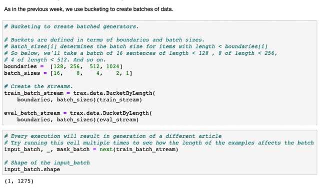</kbd>

> [!NOTE]
> Tương tự như PA tuần trước, ta cũng dùng **'bucketing batching'**, đó là
> **chia các sequence trong dataset thành các nhóm (bucket)** có range **seq
> length** khác nhau để rồi **batch tạo bởi seq của các nhóm tương ứng cũng
> khác nhau**.
>
> Ví dụ Seq mà ngắn hơn 128 thì sẽ được batch với batch_size 16, dài hơn
> 128 và ngắn hơn 256 thì batch với batch_size 8...
>
> Mục đích như ta đã biết là để **giảm thiểu những chỗ phải pad**.
>
> Như tuần trước cũng đã làm dùng **trax.data.BucketByLength** để giúp làm
> bucketing batching
>
> In thử shape của 1 batch, ta thấy seq dài tới 1275 > 1024 (nhưng vẫn <
> 2048  max_len) nên theo define bởi boundaries và batch_sizes **chỉ có một
> sequence  trong batch**

     

    
    
<kbd>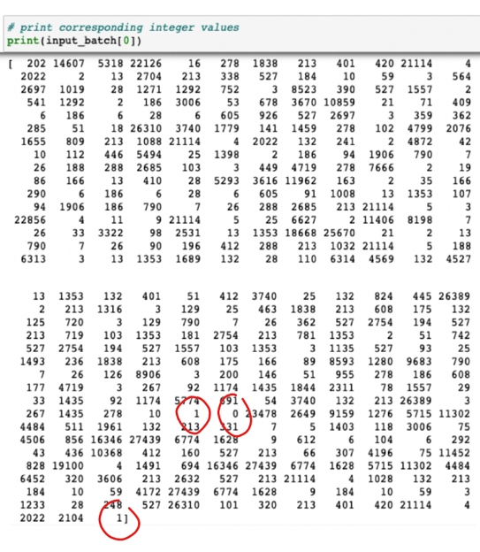</kbd>

     

    
    
<kbd>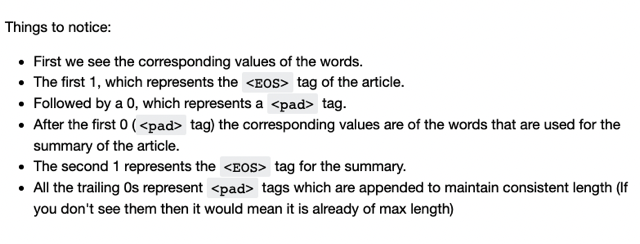</kbd>

> [!NOTE]
> Thì số **1** chính là **(index of) EOS token**, **0 là padding token**
> giúp**phân tách giữa phần article content và summary**.
>
> Và **số 1 đầu tiên báo hiệu kết thúc phần article content**, **số 1
> thứ 2 kết thúc phần summary** (human summary).
>
> Ở đây **sau số 1 của summary thì không có thêm số 0 nào chứng
> tỏ seq này đã đạt max_length** (nó chính là seq dài nhất, nếu là
> batch khác, ta sẽ thấy các số **0 padding** nhưng với vai trò khác là
> padding để **đủ max_length**

     

    
    
<kbd>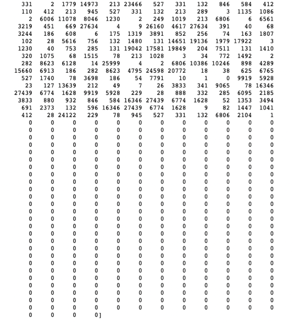</kbd>

    
<kbd></kbd>

    
<kbd>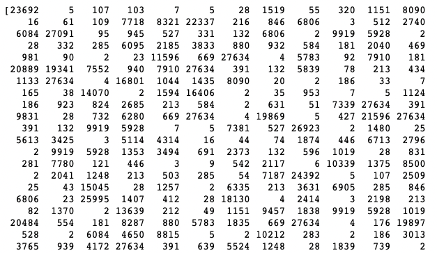</kbd>

> [!NOTE]
> In thử batch thử 2 sẽ thấy nó có
> zeros padding cho đủ max_len

     

    
    
<kbd>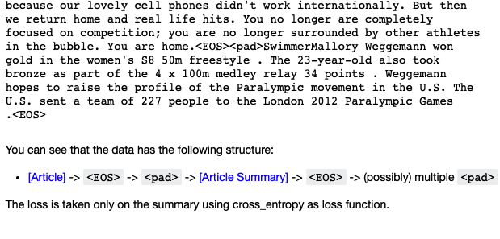</kbd>

    
<kbd></kbd>

    
<kbd></kbd>

> [!NOTE]
> Như đã nói ở trên, **mask** giúp khi **tính loss**
> (cross_entropy) thì nó **chỉ tính với phần
> summary thôi, không so với phần article**

     

- 2 - Summarization with Transformer
   

  
  - Now that we have given you the \\*data generator \\*and have handled the \\*preprocessing\\* for you, it is time for you to build your own model. We saved you some time because we know you have already preprocessed data before in this specialization, so we would rather you \\*spend your time doing the next steps.\\*  You will be implementing the \\*attention from scratch\\* and then \\*using it in your transformer model\\*. Concretely, you will understand \\*how attention works\\*, how you use it to \\*connect the encoder and the decoder\\*
> [!NOTE]
> giờ tới lượt build model

     

      
      
<kbd>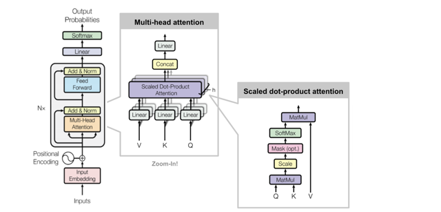</kbd>

       

- 2.1 - Dot Product Attention
   

    
    
<kbd>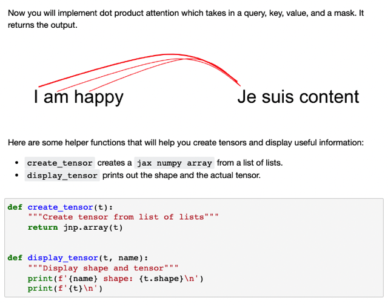</kbd>

> [!NOTE]
> Cái này nên nhớ để bắt chước, đó là chuẩn bị sẵn function để
> **giúp in ra tensor shape** vì rõ ràng đây là việc thường xuyên
> làm. Việc thứ hai cũng rất hay làm là **chuyển list thành tensor.**

     

    
    
<kbd>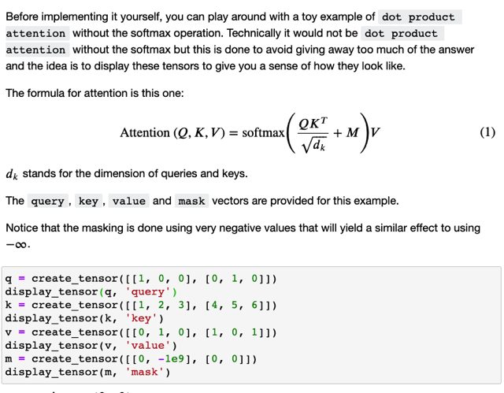</kbd>

> [!NOTE]
> Đại khái là trước hết làm thử với vài cái**fake tensor q, k, v** để có intuition
> về cách hoạt động của nó.
>
> Công thức Scaled Dot Product Attention với mask sẽ là như ri.
>
> **dk là chiều dài của vector keys** mà ta cũng biết cũng là vector
> queries, và cả values, vì cơ bản thường người ta chọn giống nhau.

     

    
    
<kbd>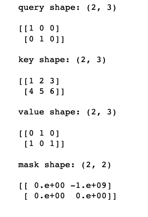</kbd>

> [!NOTE]
> [seq_len, dk] (dk = dq dv)

     

    
    
<kbd>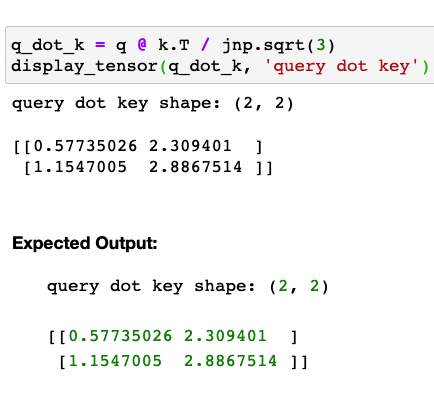</kbd>

> [!NOTE]
> Chỉ là ví dụ, nên không tính softmax,
> chủ yếu để thấy shape sau phép S.D.
> P là [seq_len, seq_len]

     

    
    
<kbd>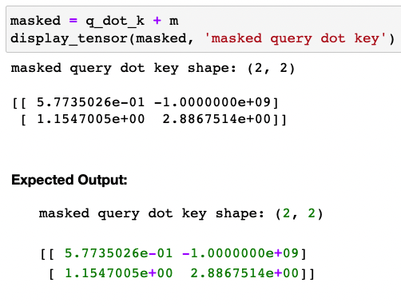</kbd>

> [!NOTE]
> Sau đó cộng với Mask cũng có
> shape [seq_len, seq_len]

     

    
    
<kbd>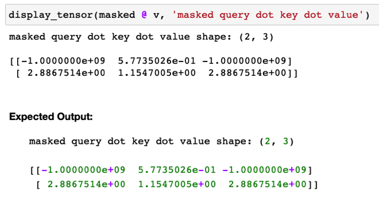</kbd>

> [!NOTE]
> Sau khi softmax thì @ value để ra Context shape
> [seq, seq][seq, dv = dk] = [seq, dv = dk]

     

    
    
<kbd>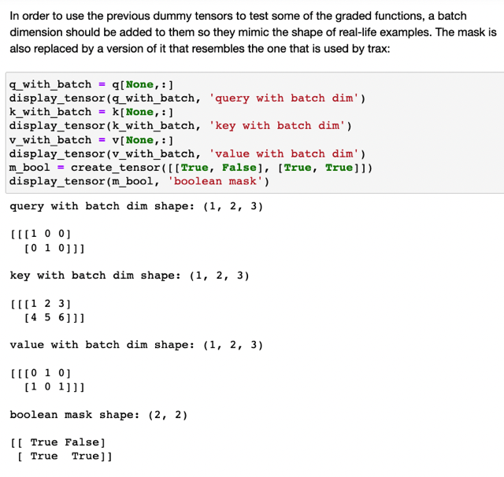</kbd>

> [!NOTE]
> Để mô phỏng sát hơn với thực tế, add
> thêm batch dimension vài nữa để q,k,v
> có shape [batch, seq, dk]

     

- Exercise 1 - DotProductAttention (UNQ_C1)
   

    
    
<kbd>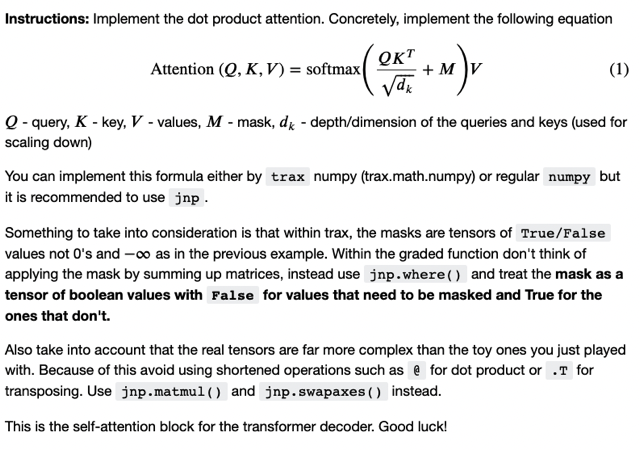</kbd>

> [!NOTE]
> Giải thích mấy cái lưu ý:
>
> Đầu tiên là nói **việc apply mask:** Tuy theo công thức là **(kết quả của s.d.p) +
> mask** nhưng làm **có thể tuỳ cách**, miễn sao kết quả nó ra là: **"Chỗ nào cần mask
> thì trong kết quả thành (-Infinity), chỗ nào không cần mask thì giữ nguyên"**
>
> Thành ra có thể làm theo kiểu:
>
> Mask là tensor kiểu các entry value = **-Infi chỗ nào cần mask, còn lại = 0.** Thì đúng
> là ta c**hỉ  cần cộng vào (kết quả của s.d.p = QK_t/sqrt dk)**
>
> Nhưng cũng có thể làm theo cách mask **chỉ gồm các entry value = 1 chỗ nào cần
> mask, còn lại = 0**. Thì trường hợp này ta sẽ theo gợi ý dùng **jaxnumpy. where()**
> giúp conveniently **update giá trị của (kết quả s.d.p)  để chỗ nào cần mask (entry
> trong Mask = 1) thì cho bằng -Inf** 
>
> ====
>
> Lưu ý thứ 2 l đại khái là **đừng dùng transpose()** hay**.T** vì t**ensor thực tế có thể
> nhiều dimension** ví dụ như trong multi-head nó sẽ là **[batch, n_heads, length,
> dhead = dmodel/n_head]** đủ kiểu nên để **đảm bảo "transpose đúng" dimension thì
> nên dùng swapaxis .**
>
> Tương tự nên dùng **matmul() thay vì @**

     

    
    
<kbd>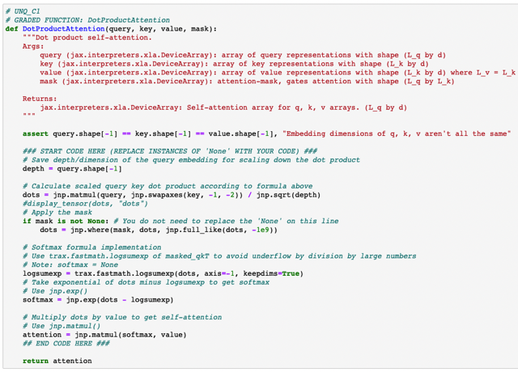</kbd>

     

    
    
<kbd>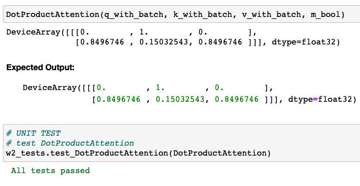</kbd>

     

- 2.2 - Causal Attention
   

    
    
<kbd>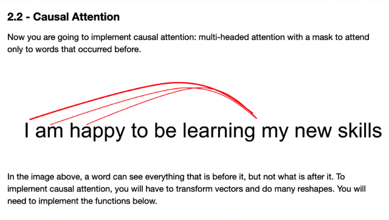</kbd>

     

- Exercise 2 - Causal Attention
   

    
    
<kbd>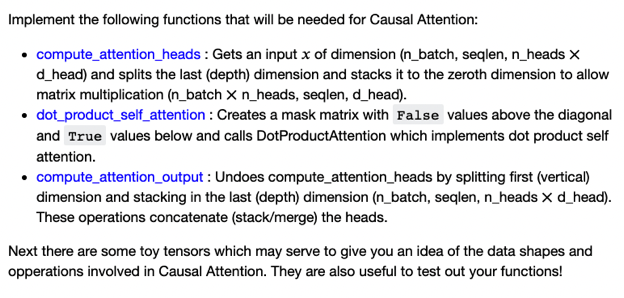</kbd>

     

    
    
<kbd>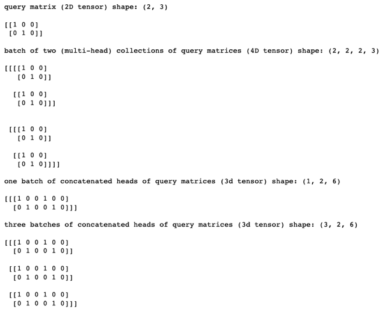</kbd>

    
<kbd></kbd>

    
<kbd>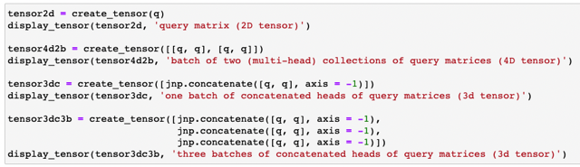</kbd>

     

  
  - It is important to know that the following 3 functions would normally be \\*defined within the CausalAttention function\\* further below.  However this makes these functions \\*harder to test\\*. Because of this, these functions are shown \\*individually using a closure\\* (when necessary) that \\*simulates them being inside of the CausalAttention function\\*. This is done because they \\*rely on some variables that can be accessed from within CausalAttention.\\*
     

- Exercise 2a - compute_attention_heads (UNQ_C2)
   

    
    
<kbd>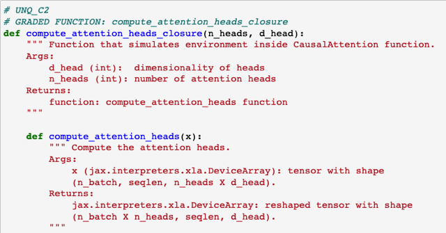</kbd>

    
<kbd>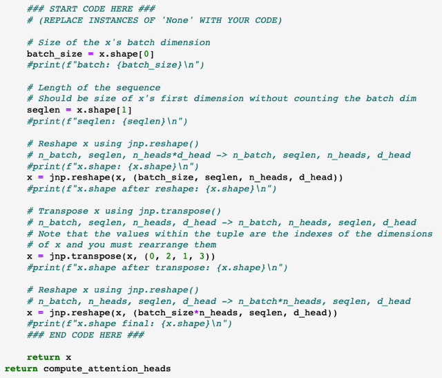</kbd>

    
<kbd></kbd>

    
<kbd></kbd>

    
<kbd>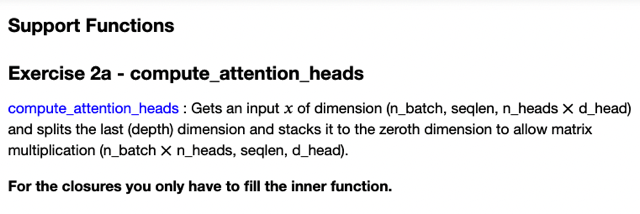</kbd>

     

    
    
<kbd>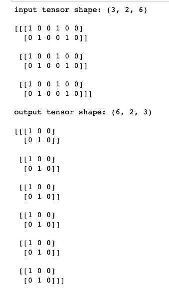</kbd>

     

    
    
<kbd>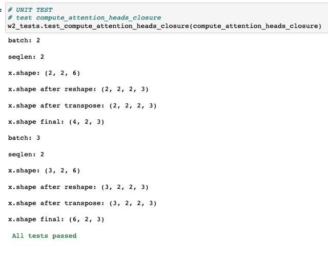</kbd>

     

- Exercise 2b - dot_product_self_attention(UNQ_C3)
   

    
    
<kbd>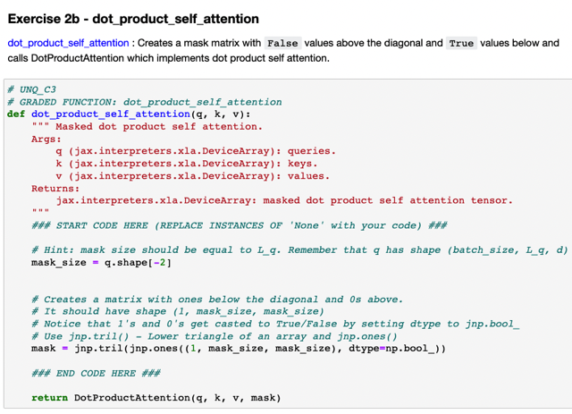</kbd>

> [!NOTE]
> Đầu tiên tính cái **mask_size** = **queries vector length dk** (cũng là của
> keys hay values) dùng [-2] thay vì [1] vì đảm bảo hơn vì seq_len luôn là  
> dimension ở áp chót.
>
> Dùng function **np.tril()** với input là **one tensor** tạo bởi function **np.
> ones** và **dtype=np.bool_** sẽ cho **matrix với phần dưới đường chéo là 1,
> và phần trên là 0**

     

    
    
<kbd>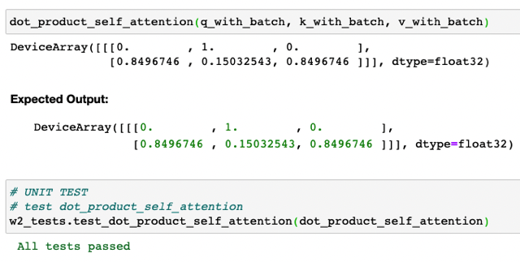</kbd>

     

- Exercise 2c - compute_attention_output (UNQ_C4)
   

    
    
<kbd>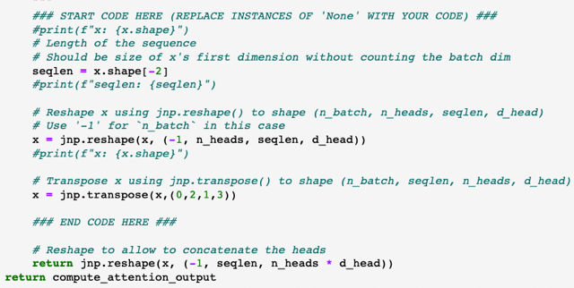</kbd>

    
<kbd></kbd>

    
<kbd>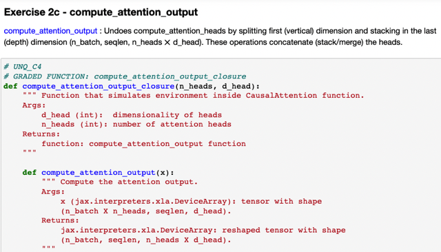</kbd>

     

    
    
<kbd>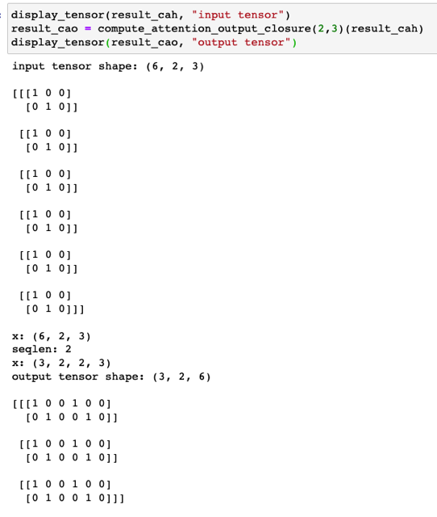</kbd>

     

    
    
<kbd>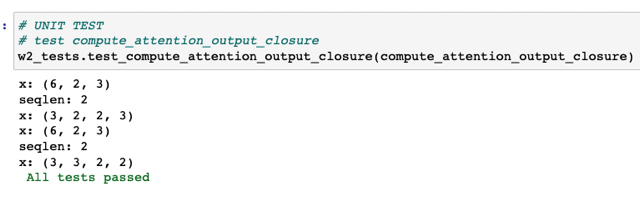</kbd>

     

- Exercise 2d - CausalAttention (UNQ_C5)
   

    
    
<kbd>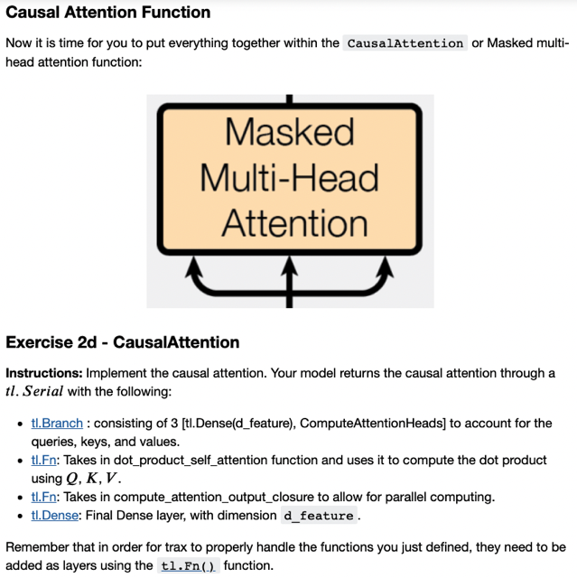</kbd>

     

    
    
<kbd>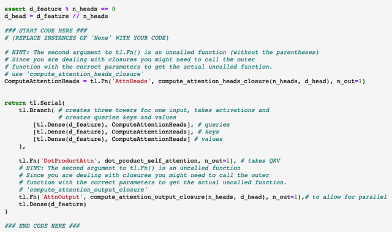</kbd>

    
<kbd></kbd>

    
<kbd>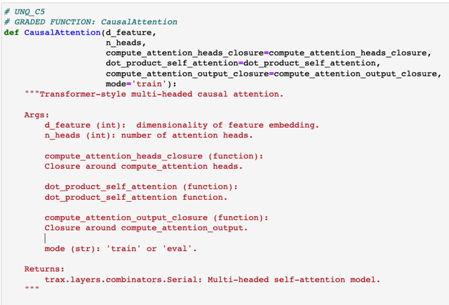</kbd>

> [!NOTE]
> Cái kiểu của Trax nó hơi lạ,
> nhưng làm quen thôi

     

    
    
<kbd>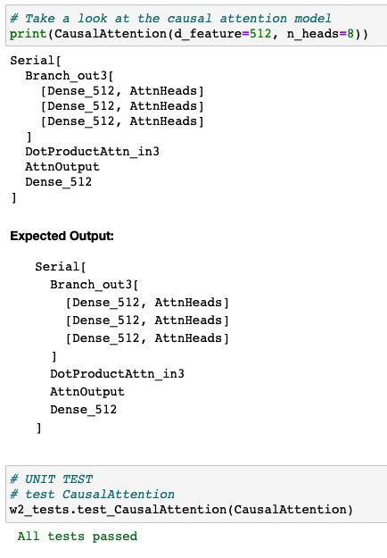</kbd>

     

- 2.3 - Transformer Decoder Block
   

    
    
<kbd>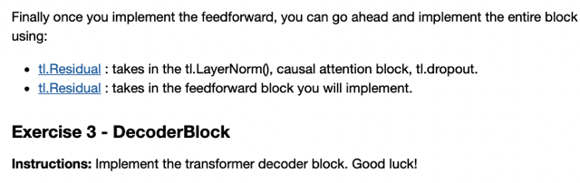</kbd>

    
<kbd></kbd>

    
<kbd>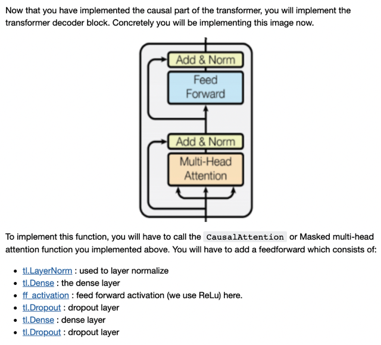</kbd>

     

- Exercise 3 - DecoderBlock (UNQ_C6)
   

    
    
<kbd>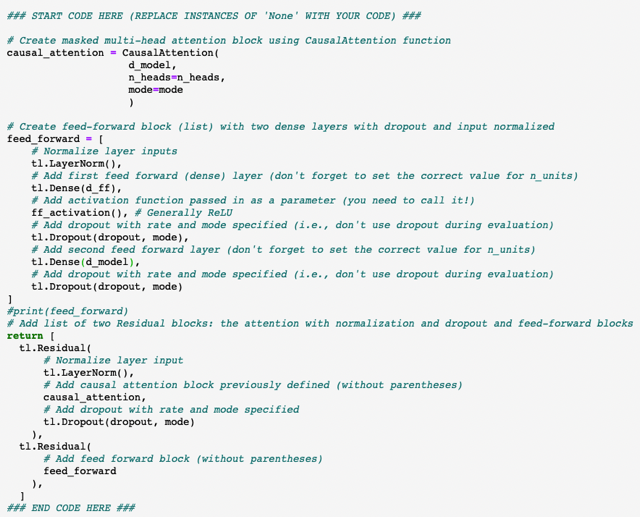</kbd>

    
<kbd></kbd>

    
<kbd>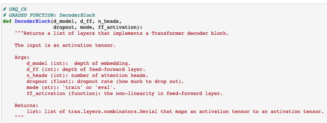</kbd>

> [!NOTE]
> 1 Chỗ cần chú ý (lần đầu làm sai) là Cái Dense thứ 2
> trong feed_forward phải n_units = d_model. Cái d_dd
> chỉ dành cho cái Dense thứ 1. Lí do là vì kiến trúc nó vậy

     

    
    
<kbd>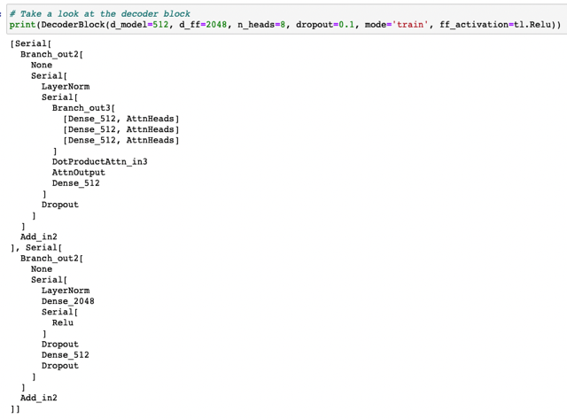</kbd>

     

    
    
<kbd>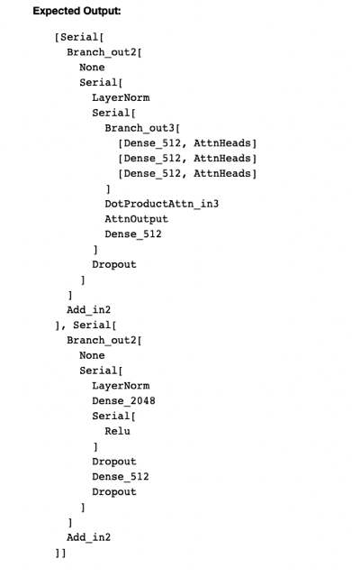</kbd>

     

    
    
<kbd>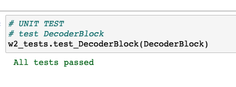</kbd>

     

- 2.4 - Transformer Language Model
   

    
    
<kbd>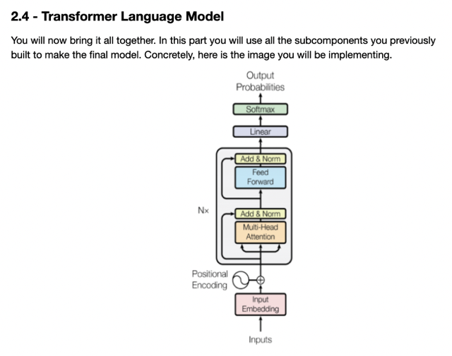</kbd>

     

- Exercise 4 - TransformerLM (UNQ_C7)
   

    
    
<kbd>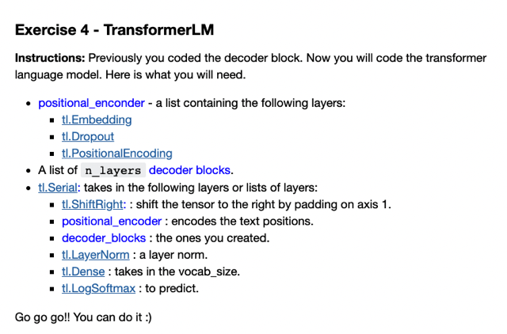</kbd>

     

    
    
<kbd>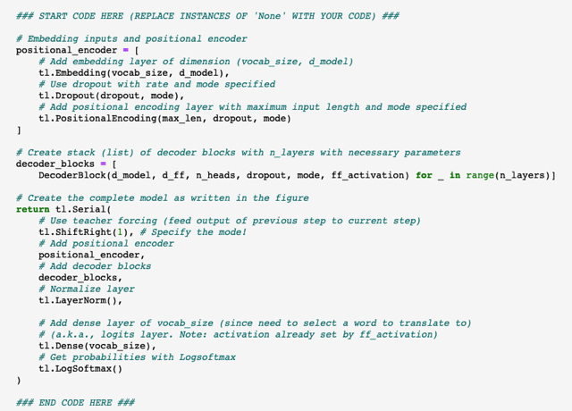</kbd>

    
<kbd></kbd>

    
<kbd>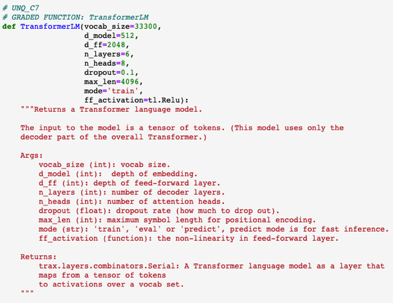</kbd>

     

    
    
<kbd>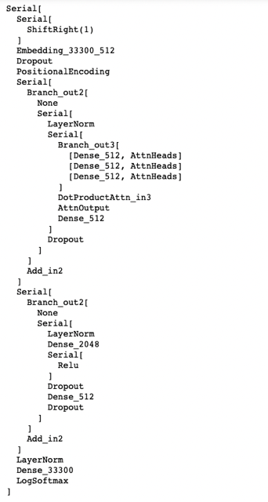</kbd>

     

    
    
<kbd>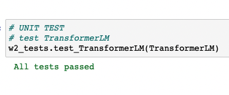</kbd>

     

- 3 - Training
   

  
  - Now you are going to train your model. As usual, you have to \\*define the cost function, the optimizer, and decide whether you will be training it on a gpu or cpu. \\*In this case, you will train your model on a cpu for a few steps and we will \\*load in a pre-trained model\\* that you \\*can use to predict with your own words.\\*
     

- 3.1 - Training the Model
   

    
    
<kbd>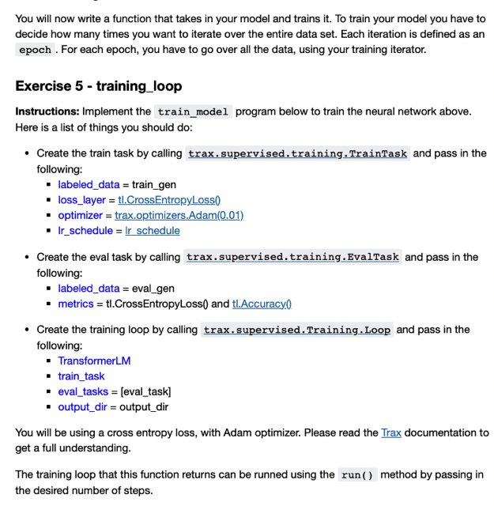</kbd>

     

- Exercise 5 - training_loop (UNQ_C8)
   

    
    
<kbd>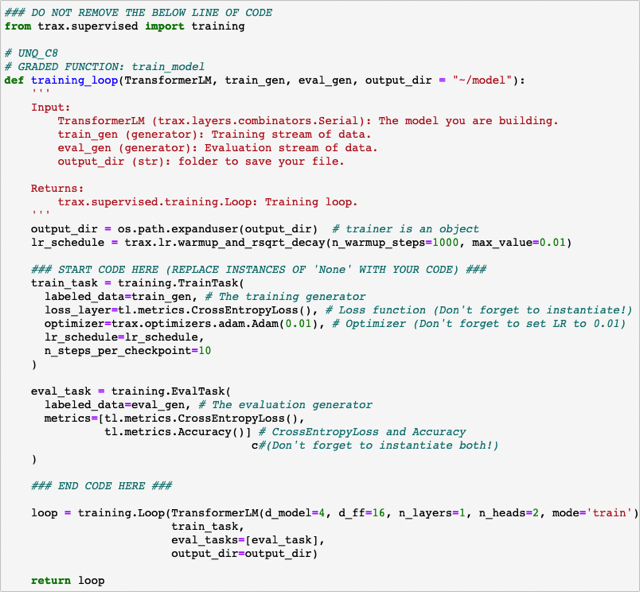</kbd>

> [!NOTE]
> Ở đây có một kinh nghiệm quan trọng: THỨ TỰ CÁC
> ARGUMENT KHI GỌI LAYER nên explicitly chỉ định
> argument, ví dụ Dropout(dropout = dropout_rate, mode =
> mode) thay vì Dropout(dropout_rate, mode): Sẽ tránh
> nhiều issue.

     

    
    
<kbd>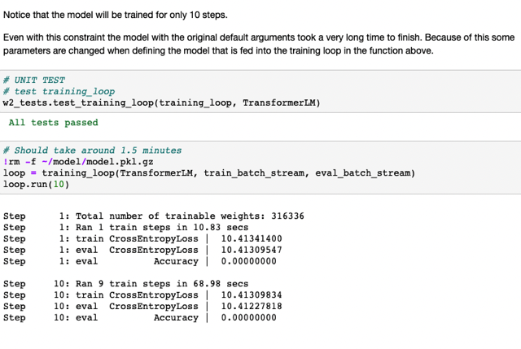</kbd>

     

- 4 - Evaluation
   

- 4.1 - Loading in a Trained Model
   

    
    
<kbd>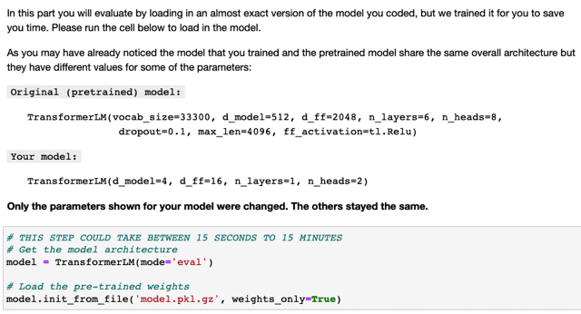</kbd>

> [!NOTE]
> Kế tiếp ta sẽ load **pre-trained model** (y như trên nhưng train lâu hơn).
> Khởi tạo model, và gọi **ini_from_file**(file pre-trained model' s weights)

     

- 5 - Testing with your Own Input
   

  
  - You will now test your input. You are going to implement \\*greedy decoding\\*. This consists of two functions. The first one allows you to \\*identify the next symbol\\*. It gets the \\*argmax\\* of the output of your model and then\\* returns that index\\*
     

- Exercise 6 - next_symbol (UNQ_C9)
   

    
    
<kbd>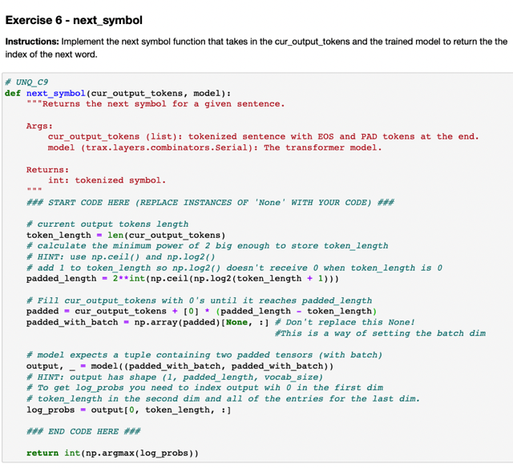</kbd>

> [!NOTE]
> Function sẽ được dùng trong vòng lặp giúp liên tục bỏ chuỗi hiện tại vào model
> để generate token tiếp theo. Function này nhận chuỗi token và model.
>
> Bắt đầu bằng tính chiều dài của current output token
>
> Từ đó, tính ra chiều dài của batch. Chỗ này thật ra không khó hiểu. Như đã biết
> trong PA này và PA Attention trước, các câu sẽ được padding không phải cho
> bằng length của câu dài nhất, mà cho bằng LUỸ THỪA CỦA 2 GẦN NHẤT.
> Mục đích như đã nói là để giảm thiểu số pad. Và mỗi batch sẽ có số câu khác nhau
> (cái này không liên quan lắm) 
>
> Thì ở đây nó cũng đại khái là ..chuỗi current output đang là ví dụ 15 thì xem thử
> với chuỗi 15 thì sẽ pad để thành chuỗi dài bao nhiêu -> ví dụ là 32 đi. Thì từ đó padding
> nó với 32 - 15 = 17 cái zero pad. Đó chính là ý nghĩa của 2 dòng code padded_length
> và padded
>
> Dòng tiếp theo đơn giản là biến list (nãy giờ là list) thành np.array. Và sẵn thì kiểu như
> reshape để có thêm một dimension cho batch size thành (batch, seq_len) trước khi
> inference vào model
>
> Sau khi model trả kết quả ra thì output có dạng là batch có 1 sequence (vì ta đưa vào 
> chỉ có 1 sequence), chiều dài sẽ là padded_length như tính ở trên đó, và tại mỗi time-step
> sẽ là vector dài vocab_size chứa các class log probability scores như đã quen thuộc.
>
> Thì do đó, để lấy log probability scores vector tại 'next time step' thì phải là token_length
> ở dimension thứ 2, chứ không phải cái cuối

     

    
    
<kbd>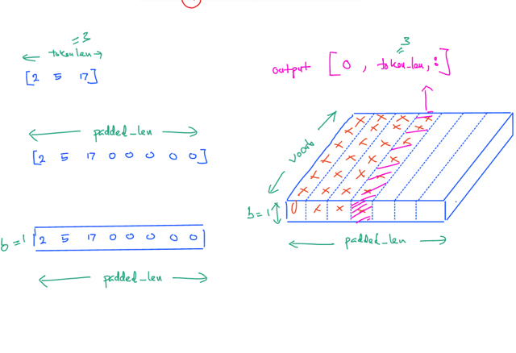</kbd>

     

    
    
<kbd>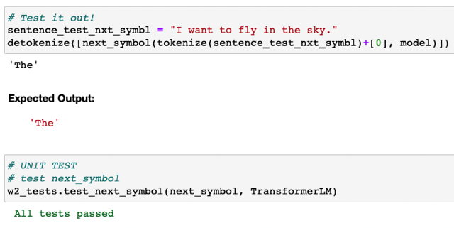</kbd>

     

- 5.1 - Greedy Decoding
   

  
  - Now you will implement the greedy_decode algorithm that will call the next_symbol function. It takes in the input_sentence, the trained model and returns the the decoded sentence
     

- Exercise 7 - greedy_decode (UNQ_C10)
   

    
    
<kbd>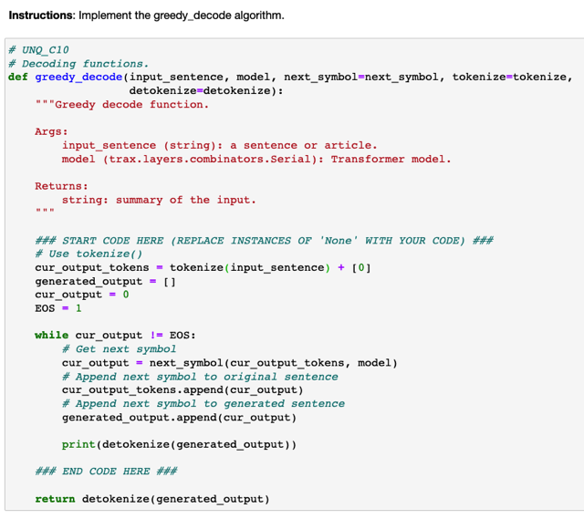</kbd>

> [!NOTE]
> Bắt đầu với input_sentence (text/string), dùng tokenizer để
> tokenize nó, và append với [0] (= zero pad đóng vai trò ngăn cách
> giữa phần content và phần summary).
>
> Bắt đầu phòng lặp và cho đến khi output ra EOS token trong đó:
> Dùng function next_symbol với chuỗi output token hiện tại và model
> như đã biết function này sẽ thực hiện inference model, để generate 
> next output token.
>
> Appen  token vào list cur_output_tokens để tiếp tục cho vòng lặp sau, 
> và generated_output, detokenize generated_output để xem

     

