# C1w1_logistic Regression

📊 **Progress:** `46` Notes | `121` Screenshots

---

Learn to extract features from text into numerical vectors, then build a binary 
classifier for tweets using a logistic regression!

Learning Objectives

 • Sentiment analysis
 • Logistic regression
 • Data pre-processing
 • Calculating word frequencies
 • Feature extraction
 • Vocabulary creation
 • Supervised learning

Learn to extract features from text into numerical vectors, then build a binary classifier for tweets using a logistic regression!
**Learning Objectives**
 • Sentiment analysis
 • Logistic regression
 • Data pre-processing
 • Calculating word frequencies
 • Feature extraction
 • Vocabulary creation
 • Supervised learning

## Welcome To NLP Spec

 

### 1 Introduction of Younes and Lukasz as instructors of the

> [!NOTE]
> 1 Introduction of Younes and Lukasz as instructors of the
> specialization.
>
> 2 Overview of the development of NLP from rule-based systems to
> deep learning-based systems.
>
> 3 The rise of end-to-end systems and attention models in NLP.
>
> 4 Overview of the four courses in the specialization, starting with
> classification and vector spaces in the first course.
>
> 5 The second course focuses on probabilistic models in NLP.
>
> 6 The third course teaches sequence models.
>
> 7 The fourth course focuses on attention models and their applications
> in chatbots, question answering, and text summarization.
>
> 8 The potential impact of these models in industry, including call
> centers and data analysis.
>
> 9 Excitement about learning and building NLP systems.

 

## Welcome To Course 1

 

### 1 Introduction to NLP course

> [!NOTE]
> 1 Introduction to NLP course
>
> 2 Topics covered: classification and vector spaces
>
> 3 Applications of NLP to sentiment analysis and word translation
>
> 4 Example problem of building a system to classify positive and negative
> product reviews
>
> 5 Week 1: **Representing text as a vector** and using**logistic regression** to
> classify sentiment
>
> 6 Week 2: Using the **Naive Bayes classifier** for sentiment classification
>
> 7 Week 3: Learning about **vector space models** and their applications in
> **information retrieval, indexing, relevancy ranking, and information
> filtering**
>
> 8 Week 4: Building a simple **machine translation** system and using
> **locality sensitive hashing** to improve **nearest neighbor search**
>
> 9 Importance of NLP concepts in search engine algorithms

 

## Acknowledgement - Ken Church

 

<kbd></kbd>

 

## Week Introduction

 

### Welcome to the first week of Course 1.

> [!NOTE]
> Welcome to the first week of Course 1.
>
> This week is all about **logistic regression**, which is a very
> important tool used in many applications in NLP.
>
> Logistic regression algorithms are **particularly useful** because
> they are **easy to train** and provide you with a **good baseline
> result**.
>
> This week you'll use logistic regression for **sentiment analysis of
> tweets**.
>
> You will first **process your data**, then you **train your model** and
> finally, you will **test the accuracy**of your model.

 

## Supervised Ml & Sentiment Analysis

 

### 1 The **goal** of supervised machine learning is to **minimize error rates or cost**

> [!NOTE]
> 1 The **goal** of supervised machine learning is to **minimize error rates or cost**
> by **mapping input features X to output labels Y hat.**
>
> 2 **Logistic regression** is a **classification** algorithm used to assign
> observations to two distinct classes.
>
> 3 In the context of **sentiment analysis**, logistic regression can be used to
> predict whether a tweet has a positive or negative sentiment.
>
> 4 The steps for building a logistic regression classifier for sentiment analysis
> include: p**rocessing raw tweets to extract useful features**, **training** the
> **classifier** to**minimize the cost,** and **making predictions** based on the trained
> model.
>
> 5 The next video will cover how to extract features from tweets for sentiment
> analysis.

 

<kbd>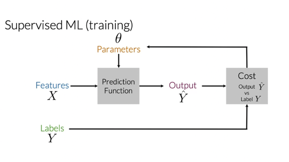</kbd>

 

<kbd>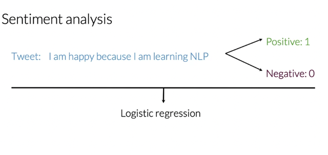</kbd>

 

<kbd>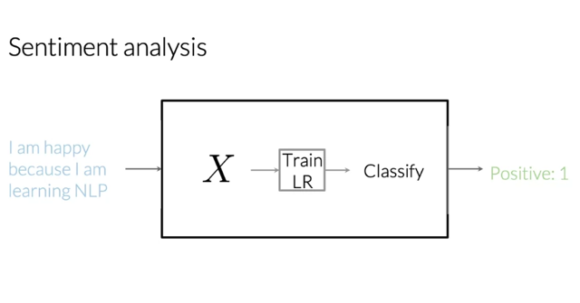</kbd>

> [!NOTE]
> Đại khái là: Preprocess để **extract feature** from text rồi
> bỏ vào Lo.Re model để **train** và **classify**

 

## Vocabulary & Feature Extraction

 

### 1 Introduction: Learning to **represent text as a vector**

> [!NOTE]
> 1 Introduction: Learning to **represent text as a vector**
>
> 2 Building a vocabulary: Creating a **list of unique words**
>
> 3 Extracting features: Assigning values to features in a tweet
> based on the vocabulary
>
> 4 **Sparse** **representation**: Representation with a small relative
> number of non-zero values
>
> 5 Problems with large vocabularies: Model training takes
> **excessive time**
>
> 6 Conclusion: Recap of representing text as a vector and
> introduction to identifying problems with large vocabularies in
> the next video.

 

<kbd>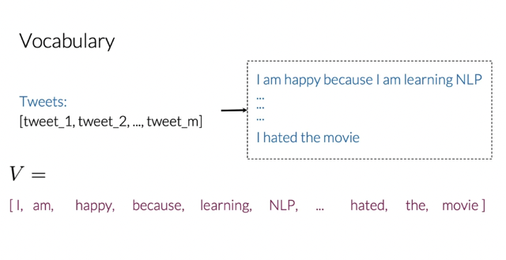</kbd>

> [!NOTE]
> Đại khái là tạo bộ dictionary/ list các unique words

 

<kbd>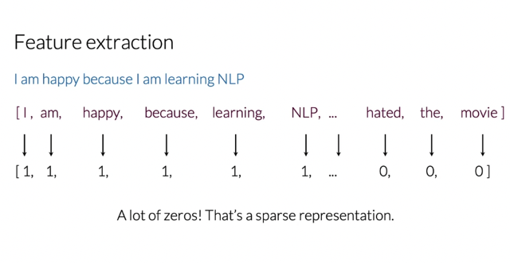</kbd>

> [!NOTE]
> Một cách để 'extract feature' - tức là tạo feature vector gọi là **sparse**
> **representation** (từ nào có trong dic thì gán 1, không có thì gán 0
>
> Cách xây dựng vector kiểu này khiến số 0 nhiều nên gọi là "sparse"
> tạm dịch là "trống trải" / "thưa thớt"

 

<kbd>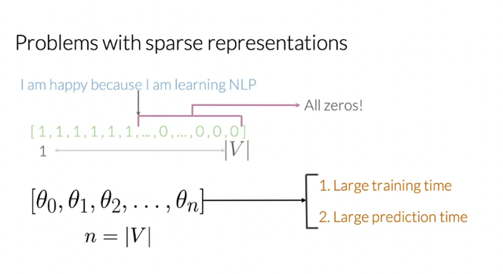</kbd>

> [!NOTE]
> Vấn đề đ.v làm kiểu này là số params phải learn là rất lớn - độ
> dài của feature vector = V và V thường rất lớn do bộ vocab
> size lớn

 

<kbd>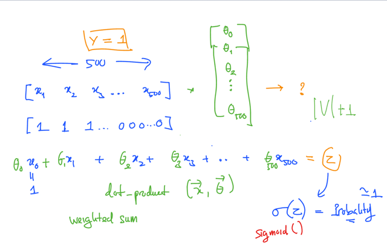</kbd>

 

<kbd>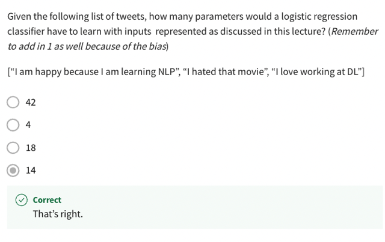</kbd>

> [!NOTE]
> 13 từ - the0-theta13 = 14

 

## Negative & Positive Frequencies

 

<kbd>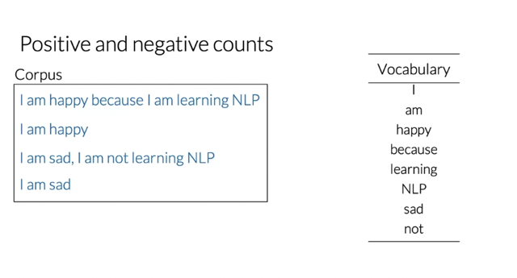</kbd>

> [!NOTE]
> Đại khái cách feature extraction này, đối với từng từ trong
> vocabulary list, ta đếm số lần nó xuất hiện trong positive và
> negative câu

 

<kbd>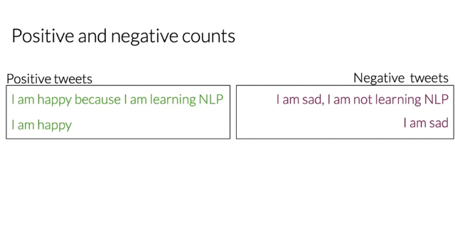</kbd>

> [!NOTE]
> Các câu trong corpus dc gắn label
> positive / negative

 

<kbd>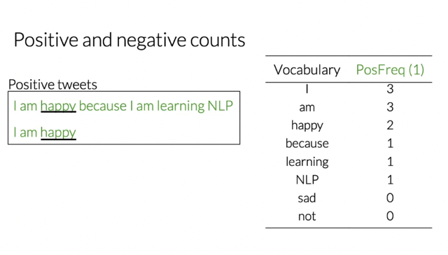</kbd>

> [!NOTE]
> Thì happy xuất hiện 2 lần trong các
> câu positive -> posFreq = 2

 

<kbd>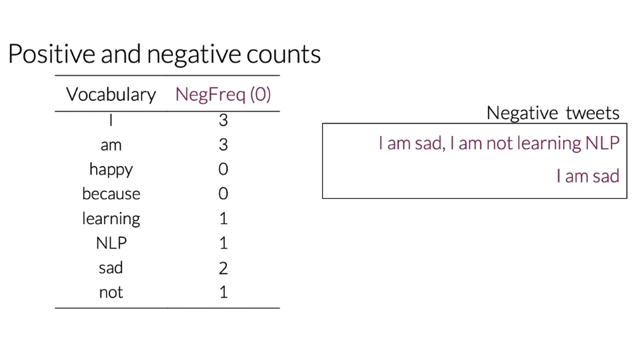</kbd>

> [!NOTE]
> "sad" xuất hiện 2 lần trong
> negative câu -> negFreq = 2

 

<kbd>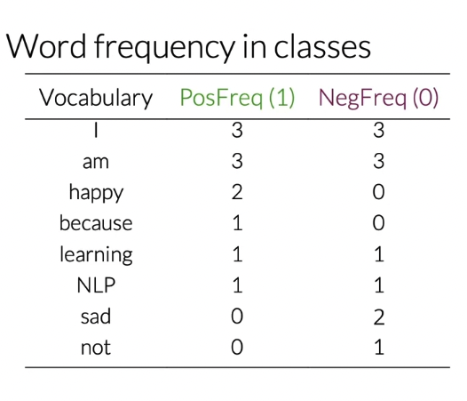</kbd>

 

## Feature Extraction With Frequencies

 

<kbd>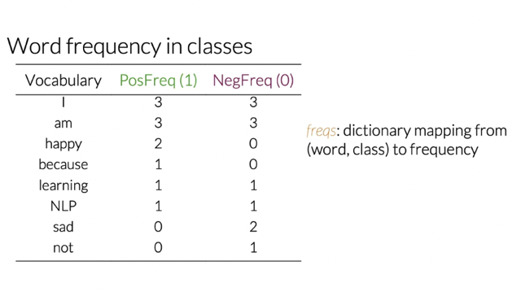</kbd>

 

<kbd>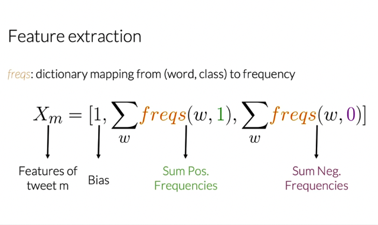</kbd>

> [!NOTE]
> Đại khái là encode feature theo 3 dimension thay
> vì V dimension như cách làm trước

 

<kbd>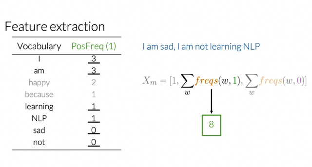</kbd>

> [!NOTE]
> Đại khái là tổng các PosFreq của
> các từ trong câu này là 8

 

<kbd>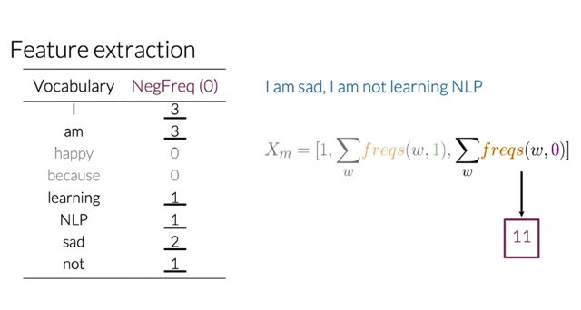</kbd>

> [!NOTE]
> Đại khái là tổng các NegFreq của
> các từ trong câu này là 11

 

<kbd>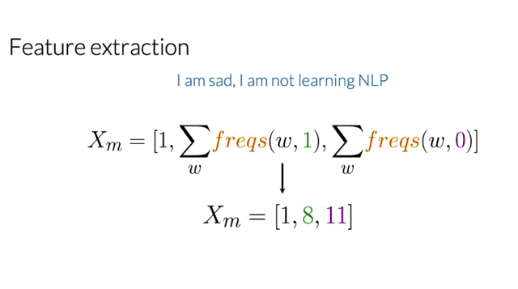</kbd>

> [!NOTE]
> Nên feature representation (encode) của câu này là [1,8,11]

 

## Preprocessing

 

<kbd>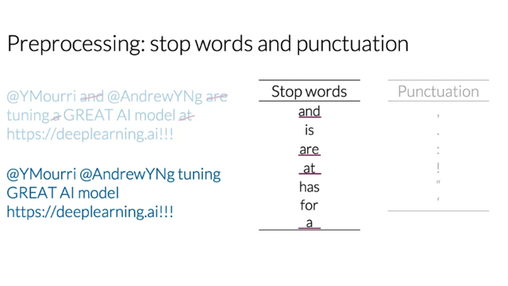</kbd>

> [!NOTE]
> Đại khái preprocess đầu tiên là bỏ đi 'stop word' vốn
> không thay đổi lắm thông tin

 

<kbd>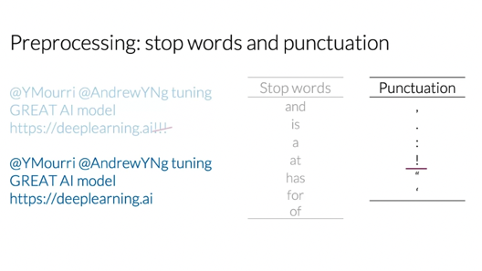</kbd>

🔗 **Related:** [1 \\*NLP errors\\* are \\*inevitable\\* no matter what method you use  2 Errors in NLP can be caused by \\*loss of semantic meaning\\*, \\*word\\* \\*order\\*, and \\*language quirks\\* that are \\*difficult for machines\\* to understand  3 It's important to \\*analyze processed text\\* to ensure accurate results, including \\*checking for punctuation and word removal\\*  4 \\*Naïve base classification\\* relies on word \\*frequency\\* \\*counts\\* and can lead to \\*errors due to its independence assumption\\*  5 \\*Word vectors\\* can be used to improve NLP results  6 Naïve base classification may fail in cases of \\*adversarial attacks,\\* which are \\*language phenomena like sarcasm, irony, and euphemism\\* that machines have\\* difficulty understanding.\\*](error_analysis.md#node-277)

> [!NOTE]
> Sau đó là punctuation tuy nhiên
>
> Đôi khi phải cân nhắc giữ lại punctuation nếu
> nó thể hiện thông tin cần thiết cho nlp task cụ thể đang làm

 

<kbd>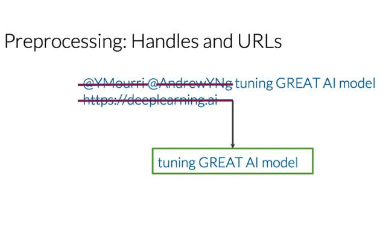</kbd>

> [!NOTE]
> Bỏ luôn handles và URLS, còn lại câu này mang ý nghĩa positive, thì
> một ML model tốt sẽ detect dc là positive

 

<kbd>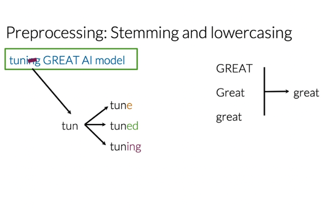</kbd>

> [!NOTE]
> Cuối cùng là 'Stemming' - bỏ đi mấy cái hậu tố (suffix) chỉ giữ
> lại cái từ gốc và giúp giảm bớt vocab list
>
> Và lowercase hết

 

<kbd>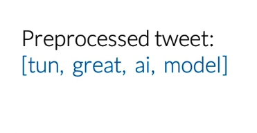</kbd>

> [!NOTE]
> Kết quả sau khi
> preprocessed

 

## Preprocessing Reading

 

### When preprocessing, you have to perform the following:

> [!NOTE]
> When preprocessing, you have to perform the following:
>
> 1 Eliminate handles and URLs
>
> 2 Tokenize the string into words.
>
> 3 Remove stop words like "and, is, a, on, etc."
>
> 4 Stemming- or convert every word to its stem. Like dancer, dancing, danced,
> becomes 'danc'. You can use porter stemmer to take care of this.
>
> 5 Convert all your words to lower case.
>
> For example the following tweet "@YMourri and @AndrewYNg are tuning a GREAT AI
> model at https://deeplearning.ai!!!" after preprocessing becomes
>
> [\\/tun\\/,\\/great\\/,\\/ai\\/,\\/model\\/]. Hence you can see how we eliminated handles,
> tokenized it into words, removed stop words, performed stemming, and converted
> everything to lower case.

 

## Lab: Nl Preprocessing

 

### In this lab, we will be exploring how to preprocess tweets for

> [!NOTE]
> In this lab, we will be exploring how to preprocess tweets for
> sentiment analysis. We will **provide a function for
> preprocessing tweets** during this week's assignment, but it is
> **still good to know what is going on** under the hood.
>
> By the end of this lecture, you will see **how to use the NLTK
> package to perform a preprocessing** pipeline for Twitter
> datasets.

 

#### Setup  Đại khái là sẽ dùng thư viện Python NLTK dùng để natural language preprocessing, có các modules để collect, handling và processing Twitter data

 

<kbd>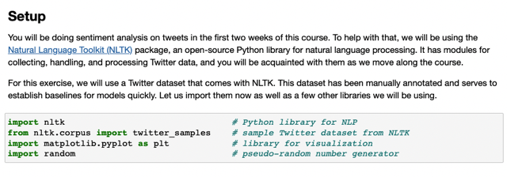</kbd>

> [!NOTE]
> Đại khái là sẽ dùng thư viện Python NLTK dùng để natural
> language preprocessing, có các modules để collect,
> handling và processing Twitter data

 

#### About the Twitter dataset

 

<kbd>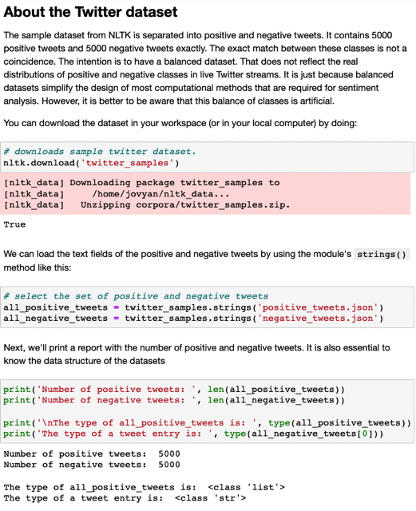</kbd>

> [!NOTE]
> Đại khái là 5000 positive 5000 negative, chia đều vậy là để
> tạo một dataset cân bằng chứ nhớ là nó không phản ánh
> distribution trong thực tế (dĩ nhiên)
>
> Đại khái là có 2 list, mỗi entry là string

 

<kbd>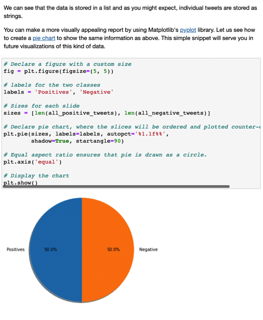</kbd>

 

#### Looking at raw texts

 

<kbd>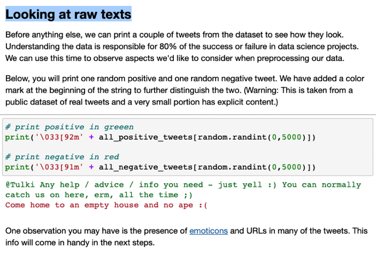</kbd>

> [!NOTE]
> Xem để có cái hiểu data chiếm 80% thành công của một data science
> project. Đại khái nhận thấy tweet hay chứa url và emoticon ví dụ :)

 

#### Preprocess raw text for Sentiment analysis

 

#### Remove hyperlinks, Twitter marks and styles

 

<kbd>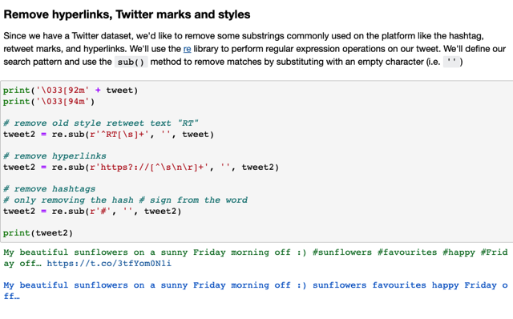</kbd>

 

#### Tokenize the string

 

<kbd>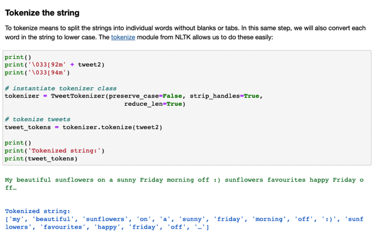</kbd>

 

#### Remove stop words and punctuations

 

<kbd>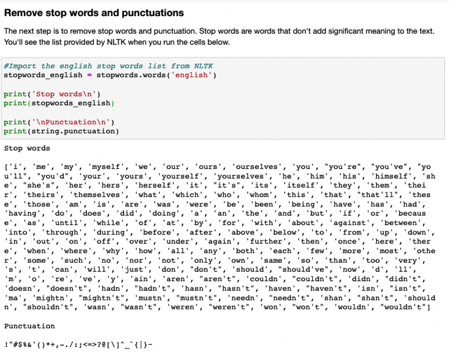</kbd>

> [!NOTE]
> Xem những stop word và punctuation có gì

 

<kbd>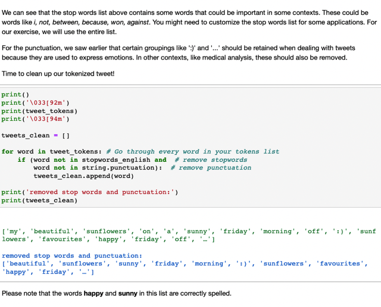</kbd>

> [!NOTE]
> Một số trường hợp stop word cần phải được customize
> lại vì mang thông tin quan trọng, còn ở đây ổng bỏ hết,
> emoticon cũng vậy

 

#### Stemming

 

<kbd>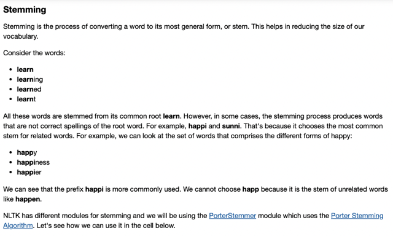</kbd>

> [!NOTE]
> Stemming như trong bài giảng đã hiểu là convert về cái từ gốc mà nếu add
> mấy cái suffix râu ria sẽ ra nhiều từ khác nhau như ed, ing thì stemming sẽ
> **giúp giảm vocab size rất nhiều**, mà vẫn **giữ phần lớn ý nghĩa của từ vựng**
>
> Có nhiều module để **stemming** nhưng ở đây ổng chọn **Porter**

 

<kbd>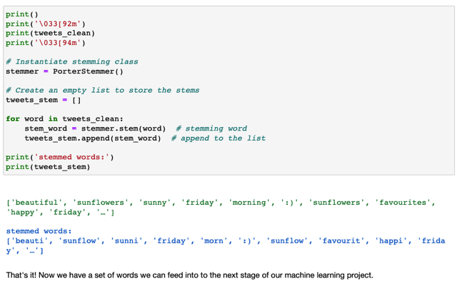</kbd>

 

#### process_tweet()

 

<kbd>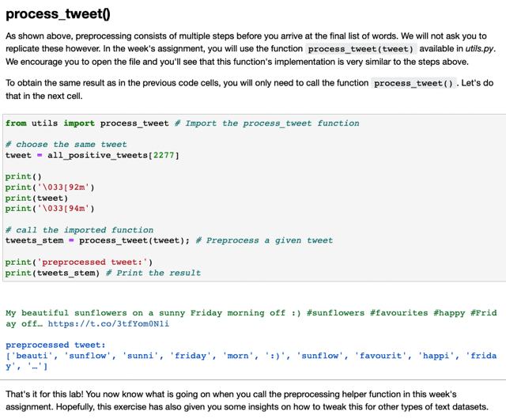</kbd>

> [!NOTE]
> Đai khái là mấy step trên sẽ làm sẵn trong funciton **process_tweet**()
> **khi làm assignment chỉ việc gọi function** này thôi nhưng **quan trọng là
> đã hiểu nó làm cái gì**

 

<kbd>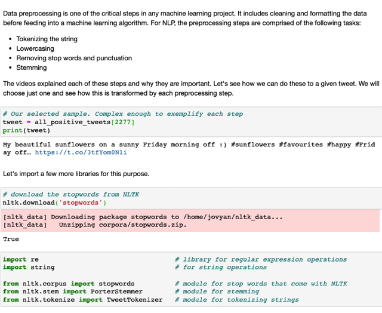</kbd>

> [!NOTE]
> Chọn một câu mà ta thấy complex. Download một số tool
> preprocessing từ NLTK để làm

 

## Putting It All Together

 

<kbd>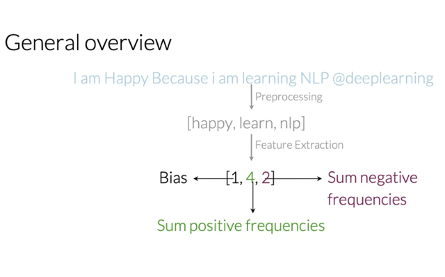</kbd>

> [!NOTE]
> Mỗi 1 câu sẽ được represented/encoded
> bởi một 3 dimensions vector

 

<kbd>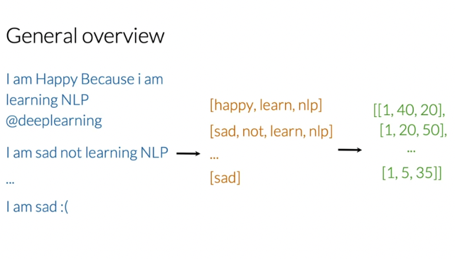</kbd>

 

<kbd>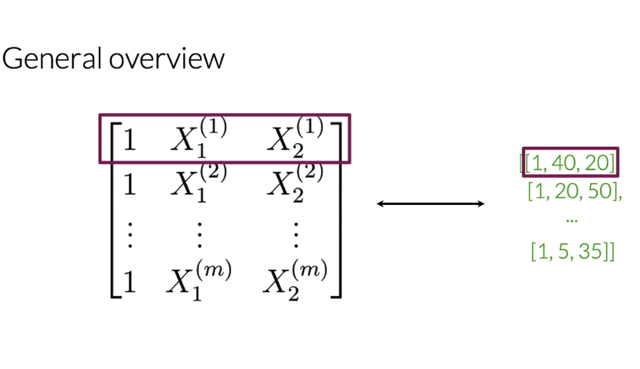</kbd>

> [!NOTE]
> Và làm vậy với 1 một bộ m
> câu, ta được 1 matrix

 

<kbd>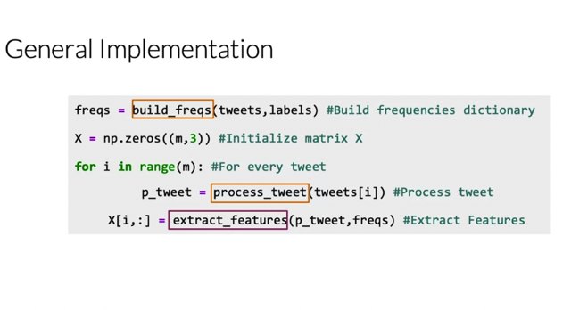</kbd>

> [!NOTE]
> - Bước build_freqs:
>
> Với tất cả các tweets và label tương ứng (positive hay negative), nó tạo
> 1 bộ vocab và tương ưng mỗi vocab là chỉ số positive và negative
> frequency ví dụ ' happy' pos = 200, neg = 50 tức là nó xuất hiện 200 lần
> trong các câu có label positive và 50 lần trong các câu gắn label
> negative
>
> Ini matrix X  = shape (m,3) tức là có m row, 3 columns
>
> - Bước process_tweet như đã xem ở lab trước nó sẽ xử lý các bước
> như loại bỏ stop word, punctuation, stemming,,
>
> - Bước extract_features sẽ là cái mình sẽ làm trong programming
> assignment : Dựa vào frequency dictionary, mình sẽ tạo representative
> vector cho mỗi tweet đã được preprocessed.
>
> Thì đại khái là tính tổng positive count và negative của các từ trong câu

 

## Visualization Word Frequencies

 

### Building and Visualizing word frequencies

> [!NOTE]
> Building and Visualizing word frequencies
>
> In this lab, we will focus on the **build_freqs**() helper
> function and visualizing a dataset fed into it. In our goal of
> tweet sentiment analysis, this function will **build a
> dictionary where we can lookup how many times a word
> appears in the lists of positive or negative** tweets. This
> will be very helpful when extracting the features of the
> dataset in the week's programming assignment. Let's see
> how this function is implemented under the hood in this
> notebook.

 

#### Setup

 

<kbd>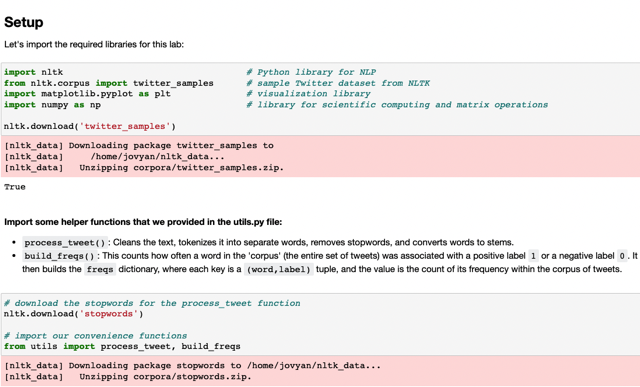</kbd>

 

#### Load the NLTK sample dataset

 

<kbd>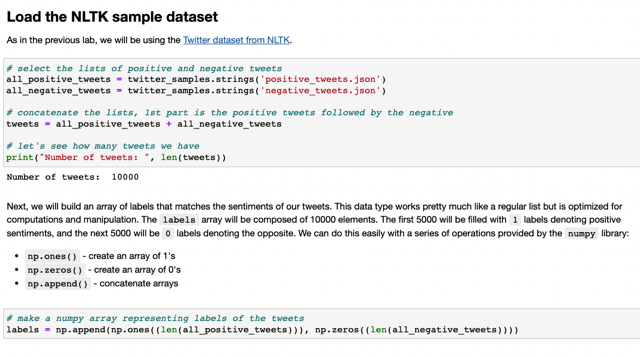</kbd>

> [!NOTE]
> Đại khái là ổng load bộ twitter dataset from NLTK, rồi lấy ra các
> positive tweets và negative tweets rồi concat lại thì 5000 câu đầu
> là positive, 5000 câu sau là negative. Xong tạo 2 array 5000 số 1
> và 5000 số 0 rồi concat lại để thành cái vector label

 

#### Dictionaries

 

<kbd>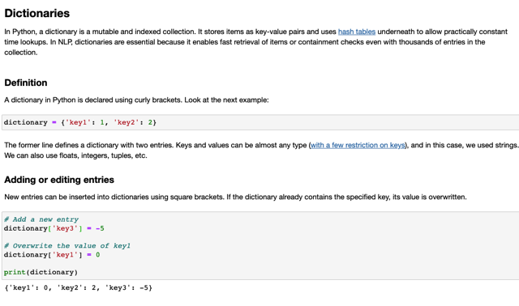</kbd>

 

<kbd>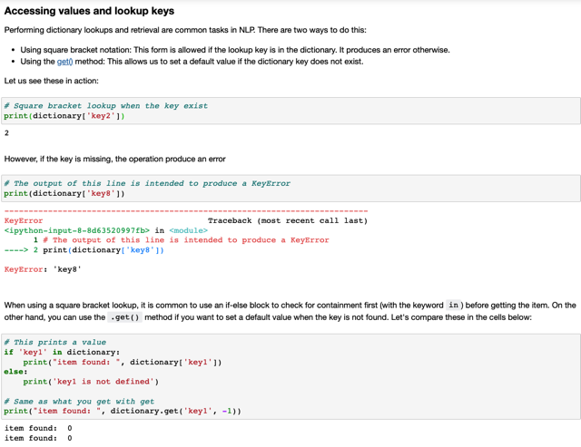</kbd>

> [!NOTE]
> Đại khái là một số tính chất của Python dictionary có thể
> get() để có default value nếu ko có key trong dic còn
> dùng [] thì ko có nó báo lỗi.

 

#### Word frequency dictionary

 

<kbd>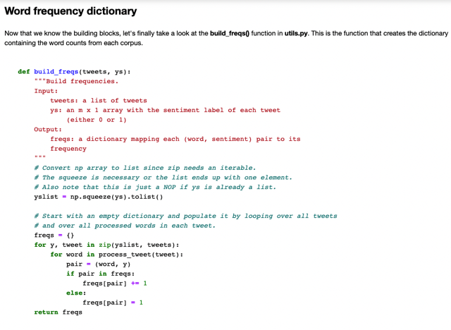</kbd>

> [!NOTE]
> Cũng dễ hiểu chỉ lưu ý chỗ này là có cái vụ 2 element key, tức là ví dụ
> (word, y) là key freqs[('happy',1)] = 10 tức là từ 'happy', cột positive thì
> bằng 10.

 

<kbd>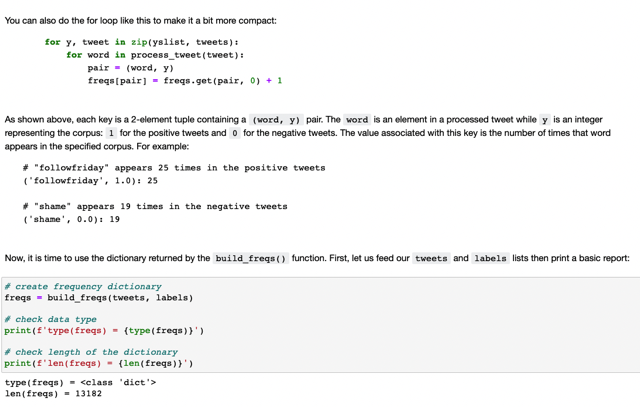</kbd>

 

<kbd>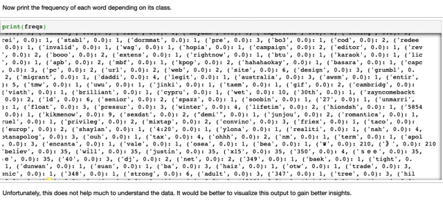</kbd>

 

#### Table of word counts

 

<kbd>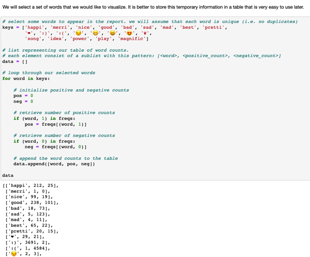</kbd>

 

<kbd>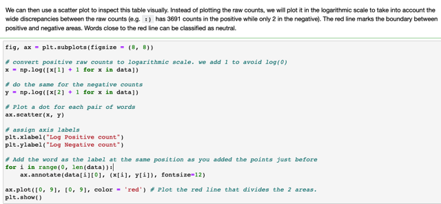</kbd>

 

<kbd>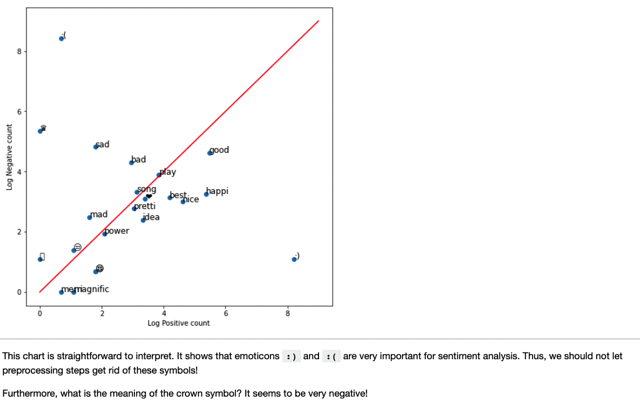</kbd>

> [!NOTE]
> Đại khái là:
>
> Plot một số từ theo 2 thông số log của positive count và log
> của negative count
>
> Cho ta cái nhìn trực quan (visualizing) về 'mức độ' positive
> và  negative của chúng  ('\/scatter plot to inspect this table
> visually')
>
> \/Và dùng hàm log '\/take into account the wide discrepancies
> between the raw counts' \/hiểu đại khái là để cho giảm bớt
> sự quá chênh lệch giữa các giá trị pos và neg sẽ khiến plot
> bị stretch

 

## Logistic Regression Overview

 

<kbd>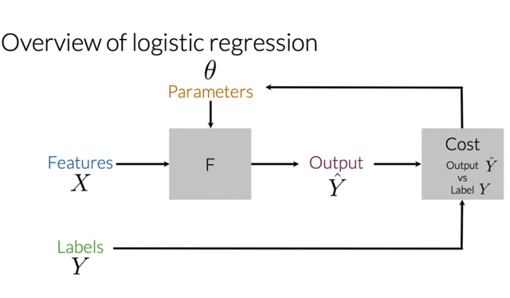</kbd>

 

<kbd></kbd>

 

<kbd></kbd>

> [!NOTE]
> Có vector representation x, nhân với theta transpose rồi
> bỏ vào sigmoid tính ra probability x là positive bằng bao
> nhiêu đem so với threshold = 0.5

 

## Lo.re Training

 

<kbd></kbd>

 

<kbd></kbd>

> [!NOTE]
> Gradient descent

 

## Lab: Visualizing Tweets And Lo.re Models

 

### **Objectives:** Visualize and interpret the logistic

> [!NOTE]
> **Objectives:** Visualize and interpret the logistic
> regression model
>
> **Steps:**  • Plot tweets in a scatter plot using their
> positive and negative sums.
>
> • Plot the output of the logistic regression model in the
> same plot as a solid line

 

#### Import the required libraries

 

<kbd></kbd>

 

#### Load the NLTK sample dataset

 

<kbd></kbd>

 

#### Load the extracted features

 

<kbd></kbd>

> [!NOTE]
> Ý là do cuối tuần sẽ làm function extract feature này nên để khỏi ' lộ đáp án' ổng
> load sẵn các prep vector từ CSV file

 

<kbd></kbd>

 

#### Load a pretrained Logistic Regression model

 

#### In the same way, as part of this week's assignment, a Logistic regression model must be trained. The next cell contains the resulting model from such training. Notice that a list of 3 numeric values represents the whole model, that we have called theta  𝜃  theta = [6.03518871e-08, 5.38184972e-04, -5.58300168e-04]

 

#### Plot the samples in a scatter plot

 

<kbd></kbd>

> [!NOTE]
> Đại khái là plot các data instance ra dù là 3D đáng lẽ phải vẽ trong
> không gian 3 chiều thì ổng nói khi đó 3 giá trị của theta (đã trained) sẽ
> cho ra 1 plane phân tách các instance thành 2 class, nhưng ở đây do
> cái feature đầu là bias đều bằng 1 nên vẽ mỗi instance bằng 2 feature
> sau lên Cartesian (2D)

 

<kbd></kbd>

 

#### Plot the model alongside the data

 

<kbd></kbd>

> [!NOTE]
> Nói chung là nhừ theta vẽ ra cái đường phân chia (Decision Boundary?) rồi 2 cái
> arrow vuông góc với nó. Chưa hiểu cụ thể lắm nhưng chắc cũng ko quan trọng.

 

<kbd></kbd>

 

<kbd></kbd>

 

## Log.re: Testing

 

### 1 Using data to predict new data points

> [!NOTE]
> 1 Using data to predict new data points
>
> 2 Analyzing model generalization
>
> 3 Computing accuracy of a model
>
> 4 Process of computing sigmoid function for X_val with parameters
> Theta
>
> 5 Evaluating whether each value of h of Theta is greater than or
> equal to a threshold value
>
> 6 Building a predictions vector with zeros and ones
>
> 7 Computing accuracy by comparing predictions with true values
>
> 8 Dividing number of correct predictions by the total number of
> observations to estimate model's performance on unseen data
>
> 9 Summary of concepts learned in the first week of specialization
>
> 10 Implementation of concepts in programming exercise

 

<kbd></kbd>

 

<kbd></kbd>

 

<kbd></kbd>

 

<kbd></kbd>

 

<kbd></kbd>

 

## Lo.re Cost Function

 

### 1 Introduction to logistic regression cost function and its

> [!NOTE]
> 1 Introduction to logistic regression cost function and its
> intuition
>
> 2 Components of the logistic regression cost function
> equation
>
> 3 Explanation of the two terms in the cost function equation
> and their relevance to label values of 0 and 1
>
> 4 Visualization of the cost function for label values of 0 and 1
>
> 5 Understanding the impact of prediction accuracy on overall
> cost
>
> 6 Mention of Naive Bayes as a different classification
> algorithm for predicting sentiment in tweets

 

<kbd></kbd>

<kbd></kbd>

<kbd></kbd>

<kbd></kbd>

<kbd></kbd>

<kbd></kbd>

<kbd></kbd>

> [!NOTE]
> Trung bình cộng của loss cho từng data sample
>
> Và vì loss này tính bởi hàm log nên luôn âm nên thêm dấu trừ ở phía trước để
> chuyển cost function thành dương

 

<kbd></kbd>

<kbd></kbd>

<kbd></kbd>

> [!NOTE]
> Ôn lại thôi chứ biết rồi, 2 vế kiểu như sẽ phụ trách cho 2
> trường hợp y = 1 hay = 0. 
> Nếu y = 1 (thì vế 2 = 0, bỏ): 
> Nếu y^ cũng càng gần 1 thì log của (y^) sẽ càng gần bằng 0
> -> Loss gần 0. 
> Nếu y^ càng gần 0, log (0) sẽ về vô cùng -> Loss về vô cùng

 

<kbd></kbd>

<kbd></kbd>

<kbd></kbd>

> [!NOTE]
> Tương tự khi y = 0

 

## Optional Logistic Regression: Cost Function

 

### 1. Đại khái xây dựng function P(y(i)) cho 1 instance như này sẽ đảm bảo

> [!NOTE]
> 1. Đại khái xây dựng function P(y(i)) cho 1 instance như này sẽ đảm bảo
> nếu tối đa được P sẽ cho ra predict chính xác
>
> 2. Xây dựng objective như này (tối đa tích của các P(i)) - PI sẽ  đảm bảo
> muốn PI lớn thì tất cả (P(y(i)) phải lớn = phải 'ráng' mà predict đúng cho mọi
> instance mới được.
>
> 3. Và để cho PI lớn nhất thì cũng tương đương làm log(PI) của nó lớn  nhất
>
> 4. Và dựa vào phép tính lôgarit, có thể chuyển nó thành dạng tổng log
>
> 5. Và Làm nó nó lớn nhất cũng chính là làm cho (Trừ của nó) nhỏ nhất ->
> Hoá ra hàm J

> [!NOTE]
> Hiểu được cái này rồi, rất hay

 

<kbd></kbd>

 

<kbd></kbd>

 

<kbd></kbd>

 

<kbd></kbd>

 

## Week Conclusion

 

## Lo.re: Gradient

 

<kbd></kbd>

 

<kbd></kbd>

 

<kbd></kbd>

 

<kbd></kbd>

 

<kbd></kbd>

<kbd></kbd>

<kbd></kbd>

<kbd></kbd>

<kbd></kbd>

<kbd></kbd>

<kbd></kbd>

> [!NOTE]
> Tự triển khai

 

## Quiz: Log.re

 

## Programming Assignment: Log.re

 

### Welcome to week one of this specialization. You will learn about

> [!NOTE]
> Welcome to week one of this specialization. You will learn about
> logistic regression. Concretely, you will be implementing logistic
> regression for sentiment analysis on tweets. Given a tweet, you
> will decide if it has a positive sentiment or a negative one.
> Specifically you will:
>
> • Learn how to \\/extract features\\/ for logistic regression given
> some text
>
> • Implement \\/**logistic regression from scratch**\\/
>
> • Apply logistic regression on a \\/**natural language processing
> task**\\/
>
> • \\/**Test**\\/ using your logistic regression
>
> • Perform \\/**error analysis**\\/

 

#### Import Functions and Data

 

<kbd></kbd>

 

<kbd></kbd>

 

<kbd></kbd>

 

<kbd></kbd>

 

<kbd></kbd>

 

#### 1 - Logistic Regression

 

#### 1.1 - Sigmoid

 

<kbd></kbd>

 

#### Exercise 1 - sigmoid (UNQ_C1)

 

<kbd></kbd>

 

<kbd></kbd>

 

#### 1.2 - Cost function and Gradient

 

<kbd></kbd>

 

<kbd></kbd>

 

#### Exercise 2 - gradientDescent (UNQ_C2)

 

<kbd></kbd>

 

<kbd></kbd>

 

<kbd></kbd>

 

#### 2 - Extracting the Features

 

#### Exercise 3 - extract_features (UNQ_C3)

 

<kbd></kbd>

 

<kbd></kbd>

> [!NOTE]
> Phải dùng get để còn handle case nếu
> word ko có trong dictionary

 

<kbd></kbd>

 

#### 3 - Training Your Model

 

<kbd></kbd>

 

#### 4 - Test your Logistic Regression

 

#### Exercise 4 - predict_tweet (UNQ_C4)

 

<kbd></kbd>

 

<kbd></kbd>

 

#### 4.1 - Check the Performance using the Test Set

 

<kbd></kbd>

 

#### Exercise 5 - test_logistic_regression (UNQ_C5)

 

<kbd></kbd>

 

#### 5 - Error Analysis

 

<kbd></kbd>

 

<kbd></kbd>

 

#### 6 - Predict with your own Tweet

 

<kbd></kbd>

 

## Andrew Ng & Chris Manning

 

