# C1w4 - Machine Translation & Document Search

📊 **Progress:** `77` Notes | `126` Screenshots

---

Learn to transform word vectors and assign them to subsets using locality 
sensitive hashing, in order to perform machine translation and document search.

Learning Objectives

 • Gradient descent
 • Approximate nearest neighbors
 • Locality sensitive hashing
 • Hash functions
 • Hash tables
 • K nearest neighbors
 • Document search
 • Machine translation
 • Frobenius norm

## Week Introduction

 

### Week 4 of the course is focused on preparing learners to perform a

> [!NOTE]
> Week 4 of the course is focused on preparing learners to perform a
> quick \**nearest neighbor search\** using \**locally sensitive hashing.\**
>
> One practical application of this technique is \**translating\** \**words\** from
> one language to another by manipulating word vectors and learning a
> mapping from an English vector to the French vector.
>
> The course will teach learners how to perform \**k-nearest neighbor
> searches\** quickly using \**locality sensitive hashing\**.
>
> Locality sensitive hashing is a technique that \**allows a search range to
> be split into similar region\**s, making it \**easier to locate a given input in
> the most likely region.\**

 

<kbd></kbd>

   

<kbd>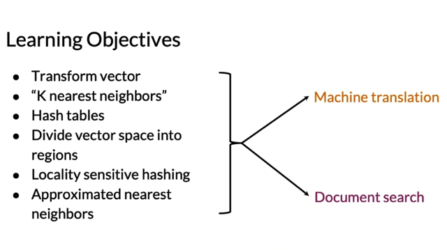</kbd>

   

## Overview

 

## Transforming Word Vectods

 

### 1 Word vectors and their importance in \\*capturing the properties of words.\\*

> [!NOTE]
> 1 Word vectors and their importance in \**capturing the properties of words.\**
>
> 2 \**Using word vector\**s to\**learn to align words in two different language\**s,
> leading to the development of a \**basic translation program\**.
>
> 3 Defining the \**transformation matrix R\** to convert the \**English word vector\**
> \**space\** to the\**French word vector space\**.
>
> 4 Training the model to translate English words to French by \**comparing\** the
> \**translation X times R \**with the \**actual French word embeddings in Y\**, and
> gradually \**improving matrix R\** in a loop.
>
> 5 Using the \**Frobenius norm\** to measure the \**magnitude\** or the \**norm\** of a
> matrix.
>
> 6 The \**squared Frobenius norm\** is easier to work with than the actual
> Frobenius norm.

 

<kbd>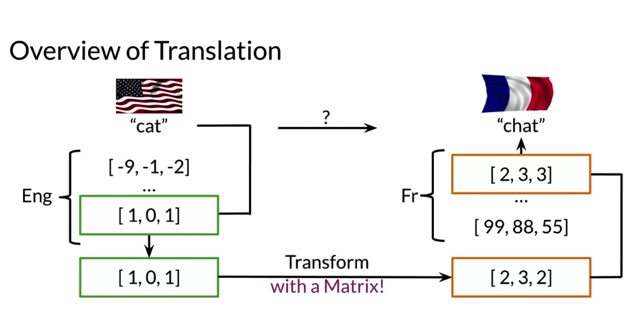</kbd>

> [!NOTE]
> Đại khái là lấy **word embedding vector** 'cat' dùng **Transformed
> matrix** - **được train** để tính ra **prediction vector**. Sau đó tìm trong
> bộ các French word embedding vector **từ nào gần với prediction**
> nhất (dùng cosine similarity)

   

<kbd>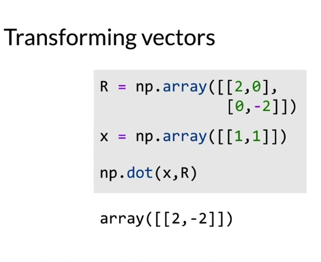</kbd>

> [!NOTE]
> Ý là **R** là **transforming matrix**, có tác dụng transform vector
> x - kiểu như một từ bằng English ví dụ [2,0] sang vector khác kiểu như
> từ tương đương trong French ví dụ [2,-2]

   

<kbd>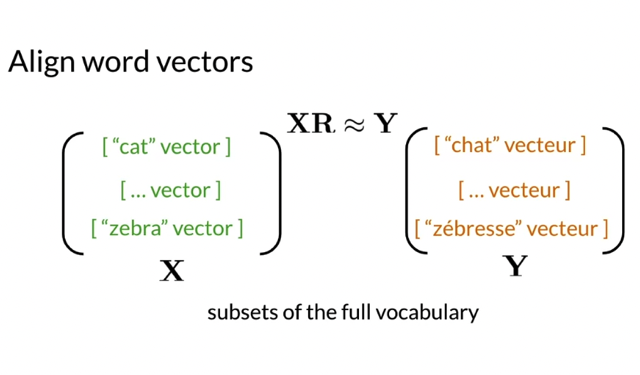</kbd>

> [!NOTE]
> Rồi đại khái là vầy, ta sẽ dựa vào training set là dictionary map giữa  X - list
> các English word embedding vector và  Y - list các equivalent French word
> embedding vector
>
> để **tìm ra** **transformation R** sao cho prediction **XR gần với Y nhất có thể**
>
> Khi R đủ tốt thì có thể **dùng R để 'transform' các từ không có trong list** để
> translate

   

<kbd>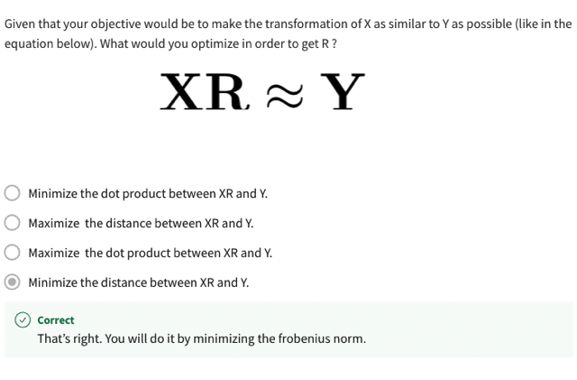</kbd>

   

<kbd>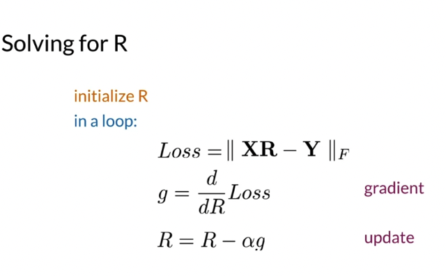</kbd>

> [!NOTE]
> Dùng **Gradient Descent** để **update R**.
>
> Tính **loss** bằng công thức **Frobenius** norm sẽ giải thích sau
>
> Tính **derivative của Loss w.r.t R**
>
> **Update R** với **derivative** với hệ số **lr** alpha.
>
> Có thể **define số iteration** hay **chủ động stop khi loss giảm xuống mức cần thiết**

   

<kbd>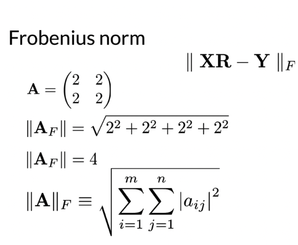</kbd>

> [!NOTE]
> Công thức tính Frobenius norm (chính là L2 norm chứ không có gì) trong
> Euclidean distance cũng tính bằng cái này có điều đây là đv matrix

   

<kbd>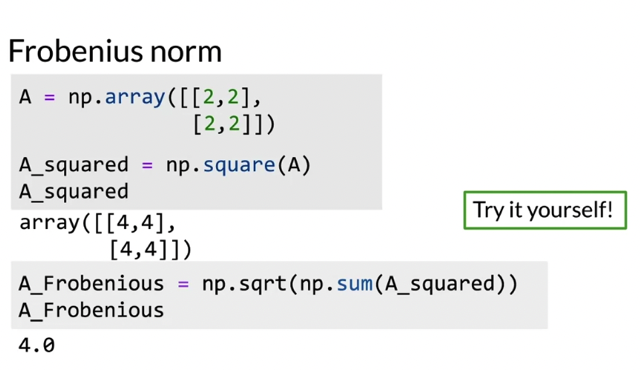</kbd>

> [!NOTE]
> Trong code: Dùng np.square - np.sum - np.sqrt

   

<kbd>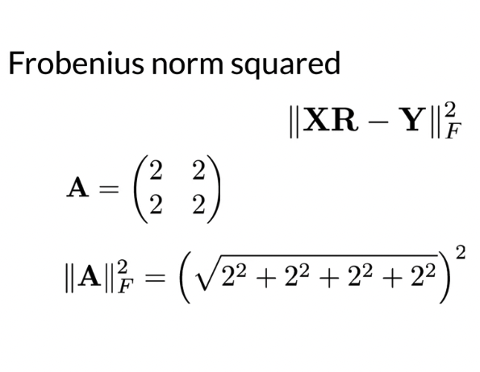</kbd>

> [!NOTE]
> Tính F norm squared
> thì khỏi lấy sqrt

   

<kbd>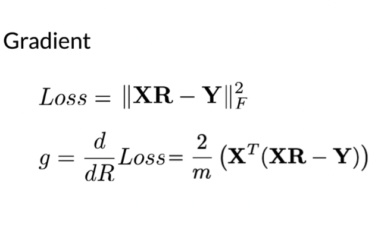</kbd>

   

<kbd>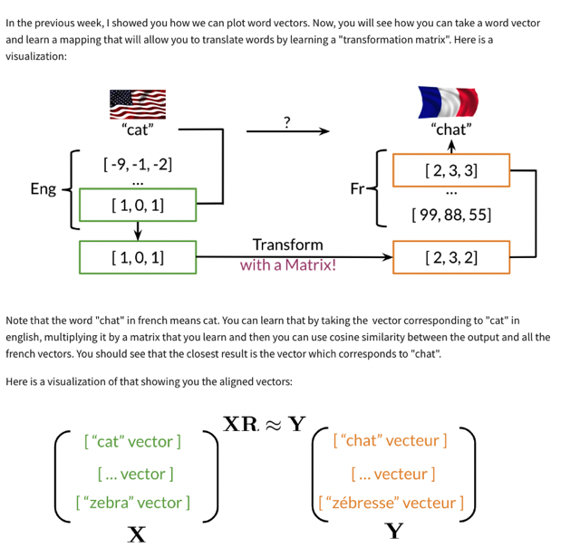</kbd>

   

<kbd>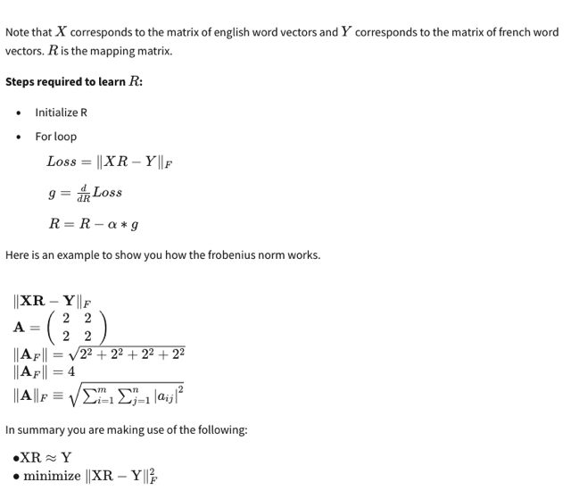</kbd>

   

## Rotation Matrices In R2

 

### In this lab, you will have the opportunity to practice once

> [!NOTE]
> In this lab, you will have the opportunity to practice once
> again with the NumPy library. This time, we will explore some
> \**advanced operations\** with \**arrays\** and \**matrices\**.
>
> At the end of the previous module, we used \**PCA\** to \**transform\**
> a set of \**many variables\** into a set of only \**two uncorrelated
> variables\**. This was done by means of a transformation of the
> data called \**rotation\**.
>
> In this week's assignment, you will need to find a
> \**transformation matrix \**from English to French vector space
> embeddings. Such a transformation matrix is nothing else but
> a \**matrix\** that \**rotates\** and \**scales\** vector spaces.
>
> In this notebook, we will explain in detail the\**rotation
> transformation.\**

> [!NOTE]
> Nói chung đại khái là ở này sẽ giảng về khái niệm '
> **rotation transformation**' đ.v vector dịch sang tiếng
> việt gọi là 'phép xoay vector'

 

- Transforming vectors  There are three main vector transformations:  • \\*Scaling\\*  • \\*Translation\\*  • \\*Rotation\\*  In previous notebooks, we applied the first two kinds of transformations. Now, let us learn how to use a fundamental transformation on vectors called \\/\\*rotation\\*\\/.  The rotation operation \\*changes the directio\\*n of a vector, leaving \\*unaffected\\* its  \\*dimensionality\\* and its \\*norm\\*. Let us explain this with some examples.  In the following cells, we will define a NumPy matrix and a column vector as a NumPy array. Soon we will explain how this is related to matrix rotation.
> [!NOTE]
> Thì rotation transformation chỉ
> xoay mà ko động tới size và
> dimensionality của nó

   

  
  - import numpy as np                     # Import numpy for array manipulation import matplotlib.pyplot as plt        # Import matplotlib for charts from utils_nb import plot_vectors      # Function to plot vectors (arrows)
     

      
      
<kbd>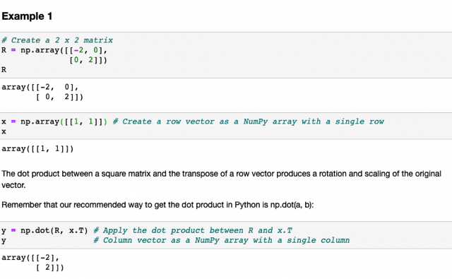</kbd>

      > Đại ý là khi **dot product** **1 vector** với 1
      > s**quared matrix** thì sẽ **Rotate** + **scale**
      > vector đó [1, 1] -> [[2-],[2]]

       

      
      
<kbd>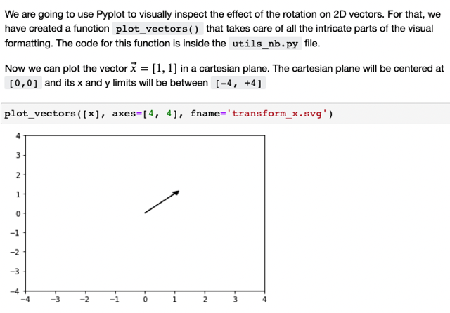</kbd>

       

      
      
<kbd>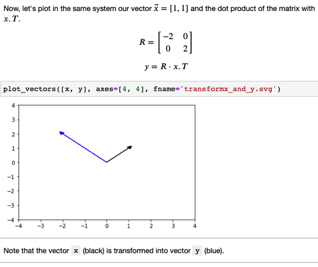</kbd>

      > Visualize để thấy sự
      > rotate + scale

       

      
      
<kbd>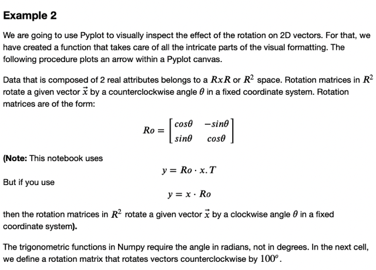</kbd>

       

      
      
<kbd>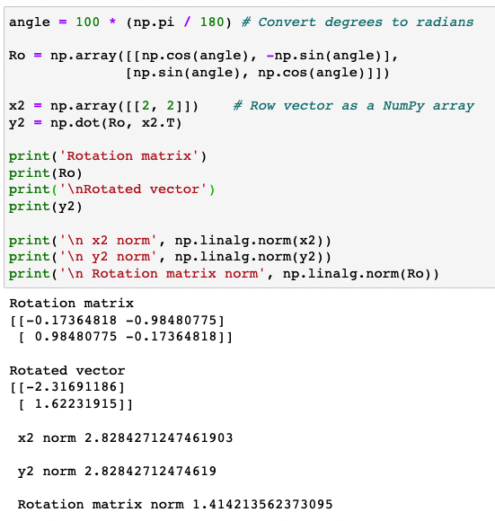</kbd>

       

      
      
<kbd>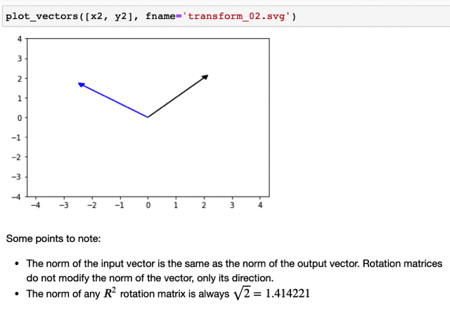</kbd>

      > Còn với Rotation matrix thì nó **chỉ rotate**
      > chứ **không làm scale vector**

       

      
      
<kbd>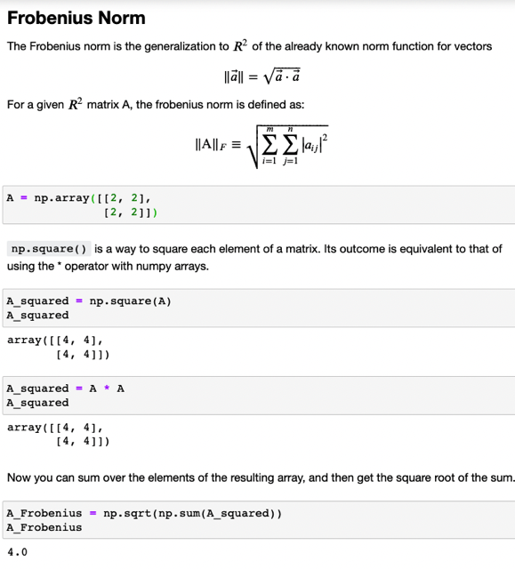</kbd>

       

      
      
<kbd>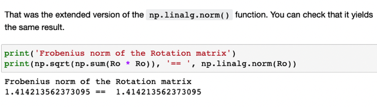</kbd>

      > Tính bằng tay thì vậy còn không
      > nó có **np.linalg.norm** đó

       

## K-nearest Neighbors

 

### 1 The importance of finding the\\* k nearest neighbors\\* of a vector

> [!NOTE]
> 1 The importance of finding the\**k nearest neighbors\** of a vector
> in NLP techniques
>
> 2 Finding \**similar word vectors\** is\**crucial for translation\**
>
> 3 Finding similar word vectors is similar to \**finding friends who
> are living nearby\**
>
> 4 \**Efficiently organizing subsets of a data-set\** can be achieved
> by using \**hash tables\**
>
> 5 \**Hash tables\** are a useful data structure for any kind of work
> involving data
>
> 6 Hashing is an effective technique that allows for \**faster lookup
> of queries than simple linear search\**.

 

<kbd>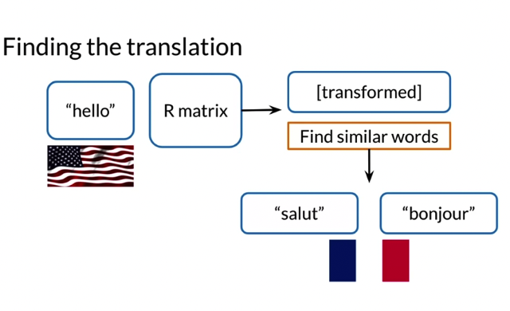</kbd>

> [!NOTE]
> Đại khái là sau khi transform để ra được **predicted word embedding
> vector** thì làm sao để trong French corpus vector **tìm được từ nào gần nhất**với prediction. Nếu linear search sẽ rất chậm nên có cách nhanh hơn là
> dùng **KNN** với **hash-table**

   

<kbd>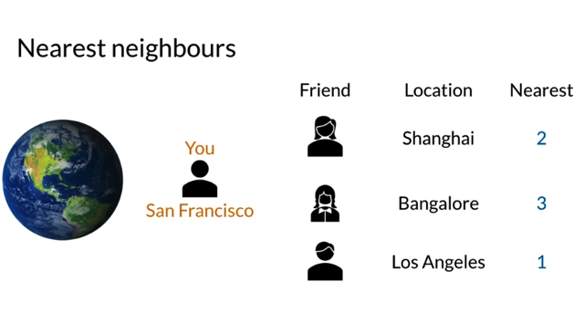</kbd>

   

<kbd>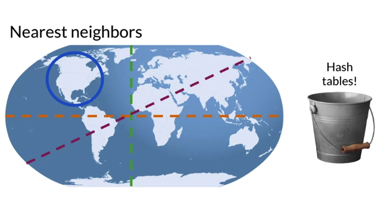</kbd>

> [!NOTE]
> Ý tưởng ở đây là làm sao đó để chia ..dc thành các
> bucket, khi đó việc tìm thằng gần nhất với mình sẽ dễ hơn
> bằng cách tìm trong cái bucket của mình thay vì phải tìm
> hết trong toàn bộ không gian

   

<kbd>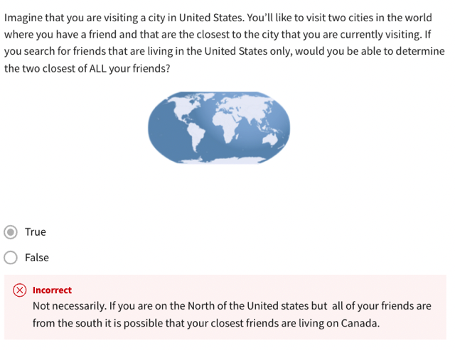</kbd>

   

<kbd>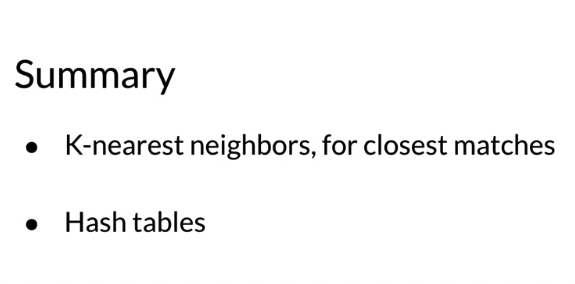</kbd>

   

<kbd>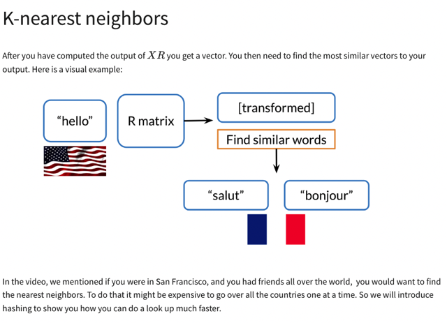</kbd>

   

## Hash Tables And Hash Functions

 

### 1 Introduction to hash \\*tables\\* and \\*hash\\* functions

> [!NOTE]
> 1 Introduction to hash \**tables\** and \**hash\** functions
>  2 Using hash functions to \**group data items into buckets\**
>  3 Using a \**hash table\** to \**store word vectors\**
>  4 Creating a \**basic hash table code\**
>  5 \**Locality-sensitive hashing\** and its importance in \**assigning items\** 
> \**based on location in vector space\**
>  6 Learning new terms such as \**hash values\**, \**hash functions\**, and 
> \**buckets\**
>  7 Future topic: exploring \**locality-sensitive hashing\** in more detail.

 

<kbd>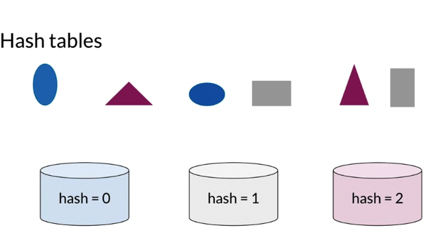</kbd>

   

<kbd>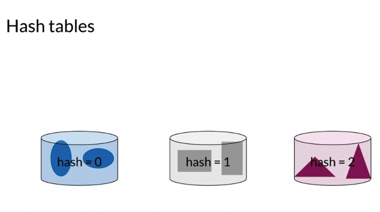</kbd>

   

<kbd>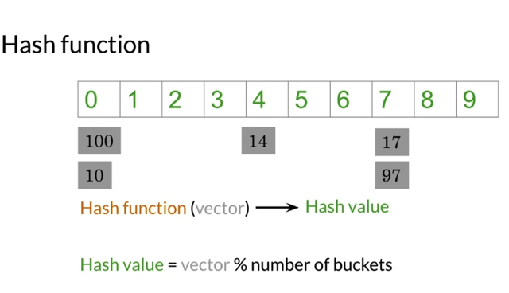</kbd>

> [!NOTE]
> Lấy ví dụ word embedding vector là 1D cho gọn thì cách
> để tạo **hash value - để biết từ nào thuộc bucket nào** là
> dùng **hash function** mà ở đây nói phiên bản rất simple/basic là
> lấy phần dư của phép chia với **số bucket**
>
> Ví dụ với hash function như vậy thì số 100, và 10 đều chung một
> bucket là bucket 0. Số 17, 97 chung bucket 7

   

<kbd>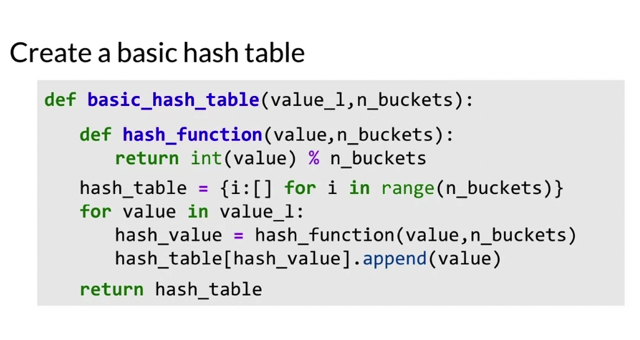</kbd>

> [!NOTE]
> def **basic_hash_table**(value_l, n_buckets):
>
>     def **hash_function**(value, n_buckets):
>         return **int(value) %** **n_buckets**%lấy **phần dư** của phép chia 
>
>     hash_table = **{i:[] for I in range(n_buckets)}**# Initialize all the buckets in the hash table as empty lists
>     %Đại khái là tạo một **dictionary**, với key là mỗi **1 số trong range (n_buckets)** và value là **empty list**
>
>
>     for **value** in **value_l**: %value_l là 1 list các number, loop trong đó.
>         %Với mỗi value.**Tính ra hash_value bằng hash_function**
>         **hash_value** = **hash_function**(value, n_buckets) # Get the hash key for the given value
>
>         %Rồi lấy list tương ứng với key là **hash_value** từ dictionary**append value vào.**
>         **hash_table[hash_value].append(value)** # Add the element to the corresponding bucket
>
>     return hash_table

   

<kbd>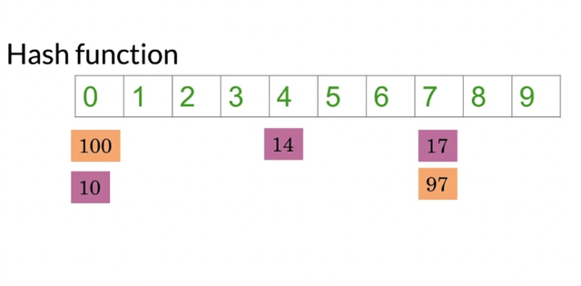</kbd>

> [!NOTE]
> Đại khái là **hash function này** (hash value = lấy phần dư của
> phép chia vector và số lượng bucket = 10) kiểu này**không gom
> các word vector giống nhau / gần nhau vào cùng bucket**
>
> ví dụ **14, 17,10 phải gần nhau hơn 97, 100** mà lại nằm ở khác
> bucket

   

<kbd>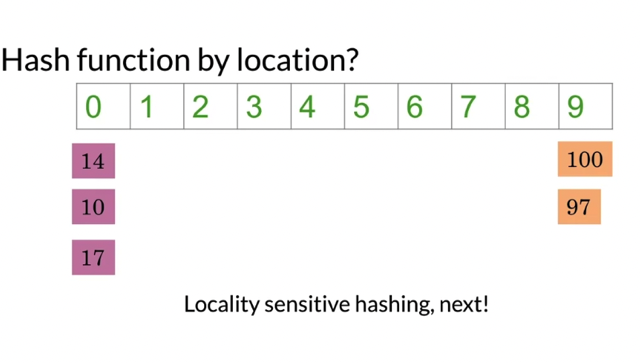</kbd>

> [!NOTE]
> Do đó, muốn làm dc như trong hình này - các số gần nhau tương đối
> như 10,14,17 sẽ chung một bucket. 97,100 chung một bucket
>
> Thì solution là dùng **Locality Sensitive Hashing** - kiểu như **kiểu
> hashing** mà **quan tâm đến vị trí của word trong vector space**
> - để giúp hashing value - thông tin giúp chia các từ vào bucket sao cho
> **các từ gần nhau nằm trong 1 bucket**
>
> Sensitive is another word for caring. So **locality-sensitive hashing**
> is a hashing method that **cares very deeply** about assigning
> items based on **where they're located in vector space.**

   

## Locality Sensitive Hashing

 

### 1 \\*Locality sensitive hashing\\* \\*reduces computational cost\\* for\\* finding Neighbors in

> [!NOTE]
> 1 \**Locality sensitive hashing\** \**reduces computational cost\** for\**finding Neighbors in
> high dimensional spaces.\**
>
> 2 To understand locality sensitive hashing, the concept of \**hashes\** and \**planes\** in
> two-dimensional space is introduced.
>
> 3 \**Planes\** can be used to \**partition vectors\** \**into\** \**subsets\** based on their location,
> which is \**helpful in designing a hashing function that is sensitive to the location\** of
> items.
>
> 4 The\**normal vector \**to a plane is \**perpendicular\** to \**any vectors that lie on the plane,\**
> and the d\**ot product between a normal vector and a vector\** indicates whether the
> vector is on \**one side of the plane or the other.
> \**
> 5 The \**sign of the dot product\** indicates the \**direction of the projection with respect to
> the normal vector\**, and whether the vector is \**above or below\** the plane.
>
> 6 The f\**unction side\** of plane takes in a normal vector and a vector, and returns a
> \**plus one if the dot product is positive\**, a\**negative one if it is negative, and zero if it
> is zero.\**
>
> 7 The \**sign of the projection of two vectors\** tells you which parts of the line the point
> lies, such as\**above or below\** it.
>
> 8 In the next video, combining the \**concept of multiple planes\** will be introduced to
> \**better approximate where a data point might be located.\**

 

<kbd>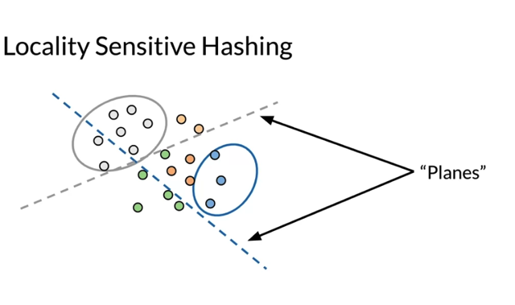</kbd>

> [!NOTE]
> Instead of the **typical buckets** we have been using, you can think of
> **clustering the points** by deciding **whether they are above or below the line**.
> Now as we go to **higher dimensions** (say n-dimensional vectors), you
> would be using **planes** instead of lines
>
> Đại khái là đưa ra concept: Chia thành bucket bằng cách **xác định nhiều
> cái plane / line để phân định 1 nhóm các data nằm trên hay dưới cái plane**

   

<kbd>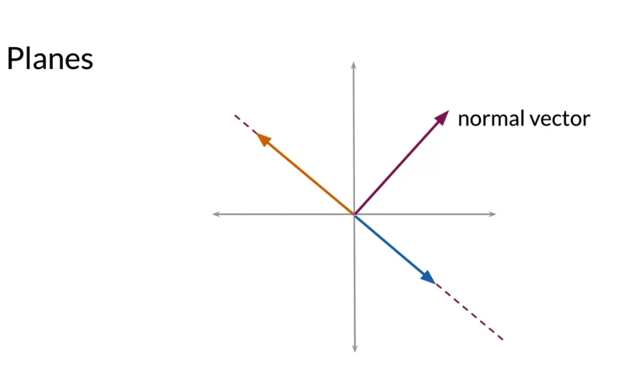</kbd>

> [!NOTE]
> 1 vector vuông góc với plane
> thì gọi là **normal vector**

   

<kbd>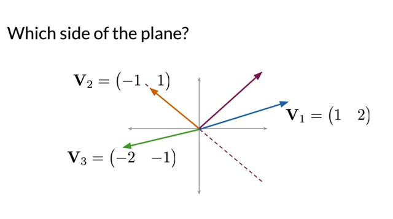</kbd>

> [!NOTE]
> Và **dot** của vector vơi **normal vector**
> sẽ giúp xác định nó nằm **trên** hay
> **dưới** hay **trong** plane

   

<kbd>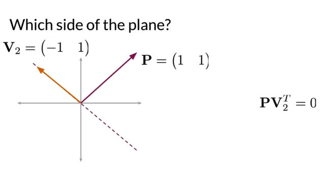</kbd>

<kbd>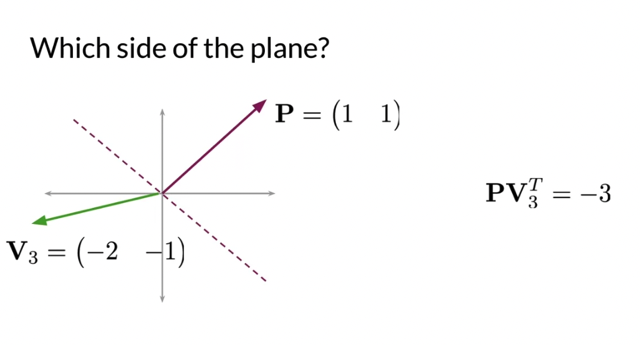</kbd>

<kbd></kbd>

<kbd></kbd>

<kbd>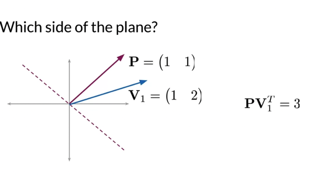</kbd>

   

<kbd>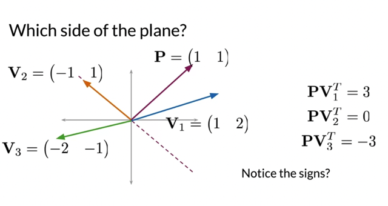</kbd>

> [!NOTE]
> Để ý cái dấu của phép tính: Dương là trên, âm là
> dưới 0 là năm trong

   

<kbd>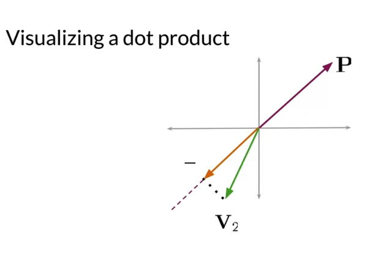</kbd>

<kbd>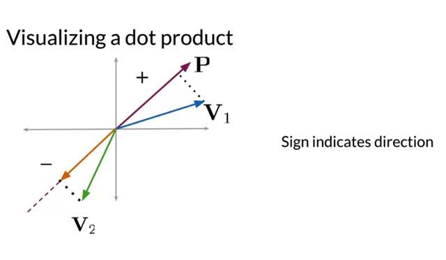</kbd>

<kbd></kbd>

<kbd></kbd>

<kbd>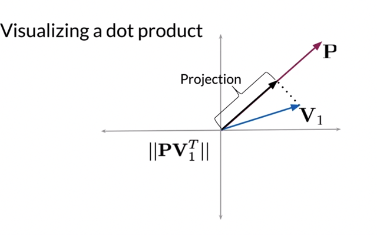</kbd>

   

<kbd>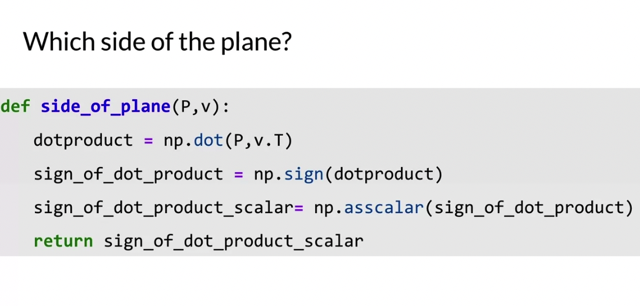</kbd>

> [!NOTE]
> viết code xác định size của vector đ.v
> plane tính **dot** xong dùng **sign** để dương
> thì = 1, âm thì bằng -1 và **asscalar** để ra 1 số thực scalar

   

## Multiple Planes

 

### 1 Introduction to \\*combining multiple planes\\* to\\* identify a hash value\\*

> [!NOTE]
> 1 Introduction to \**combining multiple planes\** to\**identify a hash value\**
>
> 2 Using the \**dot product\** of a \**vector and the normal vecto\**r of a plane to get a \**relative
> position\**
>
> 3 Using \**multiple planes\** to \**divide the vector space into manageable regions\**
>
> 4 Combining the \**signals\** from all planes\**into a single hash value\** to know \**which
> bucket\** to assign the vector
>
> 5 Rules for \**assigning intermediate hash values\** based on the sign of the dot product
>
> 6 \**Formula\** for \**combining intermediate hash values\** to get a \**single hash value\**
>
> 7 Implementation of \**locality sensitive hashing\** in code
>
> 8 Importance of locality sensitive hashing in \**speeding up k nearest neighbor
> computation\**

 

<kbd>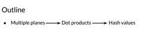</kbd>

   

<kbd>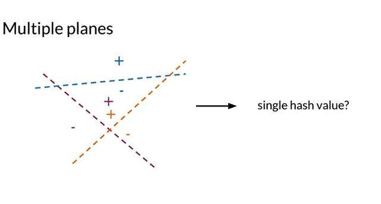</kbd>

> [!NOTE]
> Đại khái là với 3 cái plane như này sẽ **define ra hash value như thế nào**

   

<kbd>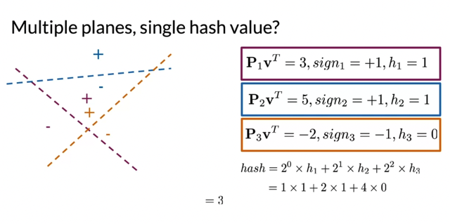</kbd>

> [!NOTE]
> Thì lần lượt tính **dot** -> **sign** của vector với các **normal
> vector** của 3 cái plane đó để xem sign bằng bao nhiêu.
>
> Xong từ sign tính ra hash_i của vector đv từng plane  như
> sau: sign = 1 or 0 thì hash_i = 1, sign = -1 thì hash_i = 0
>
> XOng hash sẽ là tính theo công thức với các hash_i value đó
> **Sum 2^i*hash_i**

   

<kbd>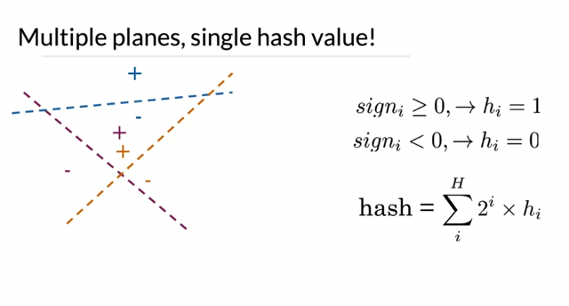</kbd>

> [!NOTE]
> Công thức khái
> quát hoá như vầy

   

<kbd>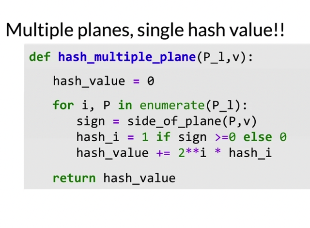</kbd>

> [!NOTE]
> Code nhu vầy

   

## Hash Tables

 

### In this lab, we are going to practice the \\*most important concepts \\*

> [!NOTE]
> In this lab, we are going to practice the \**most important concepts \**
> related to the \**hash functions\** explained in the videos. You will 
> be using these in this week's assignment.
>
> A \**key point\** for the \**lookup\** using \**hash functions\** is the calculation 
> of the \**hash key\** or \**bucket id\** that we \**assign for a given entry\**. 
> In this notebook, we will cover:
>
> \**Basic hash tables\**
> \**Multiplanes\**
> \**Random planes\**

 

- Basic Hash tables
   

  
  - Hash tables are \\*data structures\\* that allow \\*indexing data\\* to make \\*lookup tasks\\* more \\*efficient\\*. In this part, you will see the implementation of the \\*simplest hash function\\*.
    > hash table đại khái là một kiến trúc dữ liệu
    > cho phép index và look up data hiệu quả
    > và nhanh chóng

     

    
    - import numpy as np                # library for array and matrix manipulation import pprint                     # utilities for console printing  from utils_nb import plot_vectors # helper function to plot vectors import matplotlib.pyplot as plt   # visualization library  pp = pprint.PrettyPrinter(indent=4) # Instantiate a pretty printer
       

      
      - In the next cell, we will define a \\*straightforward\\* \\*hash function\\* for \\*integer numbers\\*. The function will receive a \\*list of integer numbers\\* and the \\*desired amount of buckets\\*.  The function will \\*produce a hash table\\* stored \\*as a dictionary,\\* where k\\*eys contain the hash keys\\*, and \\*the values will provide the hashed elements of the input list\\*.
         

        
        - def \\*basic_hash_table\\*(value_l, n_buckets):          def \\*hash_function\\*(value, n_buckets):         return \\*int(value) %\\* \\*n_buckets \\*%lấy \\*phần dư\\* của phép chia           hash_table = \\*{I:[] for I in range(n_buckets)} \\*# Initialize all the buckets in the hash table as empty lists     %Đại khái là tạo một \\*dictionary\\*, với key là mỗi \\*1 số trong range (n_buckets)\\* và value là \\*empty list \\*       for \\*value\\* in \\*value_l\\*: %value_l là 1 list các number, loop trong đó.         %\\*Với mỗi value. Tính ra hash_value bằng hash_function\\*         hash_value = hash_function(value, n_buckets) # Get the hash key for the given value          %\\*Rồi lấy list tương ứng với key là hash_value từ dictionary append value vào.\\*         hash_table[hash_value].append(value) # Add the element to the corresponding bucket          return hash_table
          > The hash function is just the **remainder** of the **integer division** between
          > **each element**and the **desired number of buckets**.

          > Kiểu hash table đơn giản nhất chỉ là dùng
          > key (bucket id) sẽ là phần dư của phép
          > chia của value và n_bucket

           

          
          - value_l =\\* [100, 10, 14, 17, 97]\\* # Set of values to hash hash_table_example = \\*basic_hash_table\\*(value_l, n_buckets=10) pp.pprint(hash_table_example)
            > Now let's see the hash table function in action.
            > The pretty print function (pprint()) will produce a
            > visually appealing output.

             

              
              
<kbd>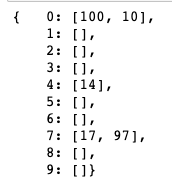</kbd>

              > In this case, the bucket key must be the
              > rightmost digit of each number.

              > value_l có 5 item. n_bucket = 10 thì nó sẽ tạo
              > dictionary với key là lần lượt là 0,...9 (range của n_bucket =10)
              >
              > Loop trong value_l (10, 14, 17, 97, 100)
              > Với mỗi cái, ví dụ value = 17, thì hash_value = phần dư của 17/n_bucket (= 10) 
              > là 7
              > Xong nó lấy list với key = 7 của dictionary ra, append số 17 vô
              >
              > Cứ vậy. Cuối cùng ta được 1 dictionary, key là 0-9, chứa các 
              > value trong value_l sao cho phần dư của phép chia 'value' cho 10 bằng với key

               

- Planes
   

  
  - \\*Multiplanes hash functions\\* are other types of hash functions. Multiplanes hash functions are \\*based on the idea\\* of \\*numbering every single region that is formed by the intersection of n planes\\*. In the following code, we show the most basic forms of the multiplanes principle. First, with a single plane:
    > Đại khái là 1**kiểu hash function khác** dựa trên ý
    > tưởng là **define 1 hoặc 1 vài plane (mặt phẳng)**
    > rồi dựa vào **vị trí của vector so với các plane** đó
    > mà tạo **hash value**

     

    
    - P = np.array([[1, 1]]) # \\*Define a single plane. #Tạo 1 plane (nhớ lại bằng cách define normal vector)\\* fig, ax1 = plt.subplots(figsize=(8, 8)) # Create a plot   plot_vectors([P], axes=[2, 2], ax=ax1) # Plot the plane P as a vector #Vẽ nó ra  # Plot  r\\*andom points. #Đại khái là vẽ đại 10 điểm ra\\* for \\*i in range(0, 10)\\*:          v1 = np.array(np.\\*random.uniform\\*(-2, 2, 2)) # Get a pair of random numbers between -2 and 2           #\\*Để biết nó ở đâu so với plan tính dot của nó với normal vector, rồi lấy sign \\*          #để quy thành 1,-1,0 cho dễ chứ không tính sign           #thì cũng biết được (dương thì positive, âm thì negative)         \\*side_of_plane\\* = np.\\*sign\\*(np.\\*dot\\*(P, v1.T))                   # \\*Color\\* the points depending on the sign of the result of np.dot(P, point.T)         if \\*side_of_plane\\* == 1:             ax1.plot([v1[0]], [v1[1]], '\\*bo'\\*) # Plot blue points         else:             ax1.plot([v1[0]], [v1[1]],\\* 'ro'\\*) # Plot red points  plt.show() 
      > Đại khái là ví dụ của 1 cái plane define bởi một vector chỉ hướng -
      > **normal vector** của nó. Plot các **điểm tuỳ tiện** và tính **sign**(**dot**(của các
      > điểm với normal vector) để **biết nó ở đâu** (**positive** size, **negative** size
      > hay nằm **ngay trên** plane (=0)

       

        
        
<kbd>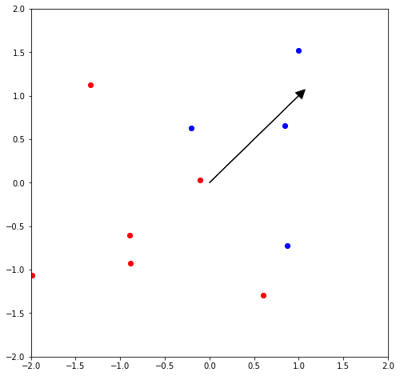</kbd>

         

      
      - The first thing to note is that the \\*vector that defines the plane \\*does \\*not mark the boundary\\* between the two sides of the plane. It \\*marks the direction\\* in which you find the ' \\*positive\\*' side of the plane. Not intuitive at all!  If we want to plot the \\*separation plane\\*, we need to plot a line that is perpendicular to our vector P. We can get such a line using a  \\*90\\*𝑜\\*   rotation matrix\\*.  Feel free to change the direction of the plane P.
        > Đại khái là normal vector chỉ chỉ hướng (positive) của plan
        > chứ không chỉ rõ cái plane ở đâu, giờ vẽ ra thêm cái
        > decision boundary của cái plane

         

        
        - P = np.array([[1, 2]])  # Define a single plane. You may change the direction  # Get a \\*new plane perpendicular to P\\*. We use a rotation matrix PT = np.dot([[0, 1], [-1, 0]], P.T).T    fig, ax1 = plt.subplots(figsize=(8, 8)) # Create a plot with custom size  plot_vectors([P], colors=['b'], axes=[2, 2], ax=ax1) # Plot the plane P as a vector  # \\*Plot the plane P as a 2 vectors\\*.  # We scale by 2 just to get the arrows outside the current box plot_vectors([\\*PT * 4\\*, \\*PT * -4\\*], colors=['k', 'k'], axes=[4, 4], ax=ax1)  # Plot 20 random points.  for \\*i in range(0, 20):\\*         v1 = np.array(np.\\*random.uniform(\\*-4, 4, 2)) # Get a pair of random numbers between -4 and 4          side_of_plane = np.\\*sign\\*(np.\\*dot\\*(P, v1.T)) # Get the sign of the dot product with P         # Color the points depending on the sign of the result of np.dot(P, point.T)         if side_of_plane == 1:             ax1.plot([v1[0]], [v1[1]], 'bo') # Plot a blue point         else:             ax1.plot([v1[0]], [v1[1]], 'ro') # Plot a red point  plt.show() 
           

            
            
<kbd>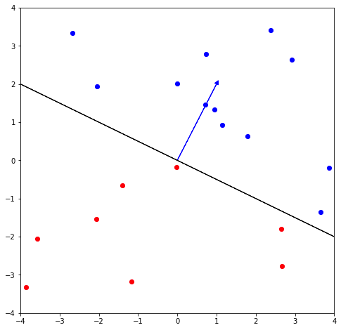</kbd>

             

            
            
<kbd>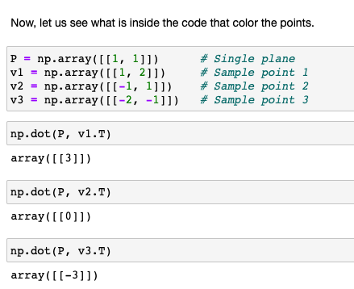</kbd>

            > Không có gì, chỉ là in ra để xem kết
            > quả của các phép tính dot của các
            > điểm với normal vector

             

          
          - def \\*side_of_plane\\*(P, v):     dotproduct = \\*np.dot(P, v.T)\\* # Get the dot product P * v'     sign_of_dot_product = np.\\*sign\\*(\\*dotproduct\\*) # The sign of the elements of the dotproduct matrix      sign_of_dot_product_scalar = sign_of_dot_product\\*.item()\\* # The value of the first item     return sign_of_dot_product_scalar
            🔗 **Related:** [# \\*Side of the plane function\\*. The\\* result is a matrix\\* def \\*side_of_plane_matrix\\*(P, v):     dotproduct = \\*np.dot(P, v.T)\\*     # Get a boolean value telling if the value in the cell is positive or negative     sign_of_dot_product = np.\\*sign\\*(\\*dotproduct\\*)      return \\*sign_of_dot_product\\*](hash_tables.md#node-690)

            > The **function** below checks in which side of the plane P is located the
            > vector v
            >
            > Đkl define cái function để define side đv plane P của vector v, dùng **dot**
            > và **sign** không có gì khó hiểu.
            >
            > chỉ có **.item()** là nó lấy giá trị của con số đầu tiên trong 1D array ra
            > thành 1 scaler, kiểu như chuyển 1D vector thành scaler thôi

            > In this code, item() is a method used to **obtain the scalar value of the first element of a
            > 1-dimensional numpy array.**
            >
            > In particular, sign_of_dot_product is a **1-dimensional numpy array** containing the signs of the
            > elements of the dotproduct matrix. sign_of_dot_product_scalar is set to the **scalar value of
            > the first element** of the sign_of_dot_product array using the item() method.
            >
            > This is **necessary** because the sign_of_dot_product array is a **1D array** and it is expected
            > that sign_of_dot_product_scalar **be a scalar value**. The i**tem() method ensures that we get a
            > scalar value instead of a 1D array.**

             

              
              
<kbd>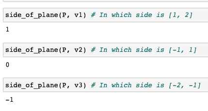</kbd>

              > rồi các sign

               

- Hash Function with multiple planes
   

  
  - P1 = np.array([[1, 1]])   # First plane 2D P2 = np.array([[-1, 1]])  # Second plane 2D P3 = np.array([[-1, -1]]) # Third plane 2D P_l = [P1, P2, P3]  # List of arrays. It is the multi plane  # \\*Vector to search\\* v = np.array([[2, 2]])
    > In the following section, we are going to
    > **define a hash function** with a list of**three
    > custom planes** in 2D.

    > tạo 3 plane cụ thể, ko phải random

     

    
    - The next function creates a \\*hash value\\* based on a \\*set of planes\\*. The output value is a \\*combination\\* of \\*the side of the plane\\* where the \\*vector is localized\\* with respect to the collection of planes.  We can think of this list of planes as a set of basic hash functions, each of which can produce only 1 or 0 as output.
      > Ở lần review mới hiểu chỗ này, đại khái là nó xác định sign
      > của một vector với một plane rồi thì tính **hash value** **đối
      > với vector đó - hash_value_i** bằng **1 nếu nó sign = 1 hay
      > 0 và 0 nếu sign <0**
      >
      > Nên ở đây ổng nói mỗi một plane thì như 1 basic hash
      > function trong đó chỉ xuất ra hash value 1 hay 0
      >
      > Rồi **hash value tổng hợp** sẽ tính the công thức dựa trên
      > các  Hash value riêng lẻ này (sum 2**i hash_i)

       

        
        
<kbd>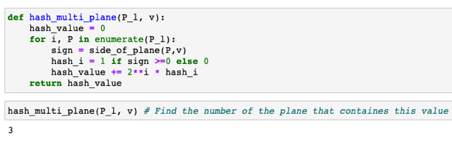</kbd>

        > Đại khá là **loop trong các plane** (tức các normal vectors), tính
        > **sign** of plane của v với các vector đó để tính hash_i = 1 nếu sign
        > >=0, 0 nếu sign < 0 rồi tính hash_value (hash value tổng hợp) theo
        > công thức
        >
        > 2^0*hash_0 + 2^1*hash_1+2^2*hash_2...

         

- Random Planes
   

  
  - np.random.seed(0) \\*num_dimensions\\* = 2 # is 300 in assignment \\*num_planes\\* = 3 # is 10 in assignment random_planes_matrix = \\*np.random.normal\\*(                        size=(\\*num_planes\\*,                              \\*num_dimensions\\*)) print(random_planes_matrix)
    > Tạo num_planes = 3 plane ngẫu nhiên

     

      
      
<kbd>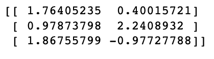</kbd>

       

    
    - # \\*Side of the plane function\\*. The\\* result is a matrix\\* def \\*side_of_plane_matrix\\*(P, v):     dotproduct = \\*np.dot(P, v.T)\\*     # Get a boolean value telling if the value in the cell is positive or negative     sign_of_dot_product = np.\\*sign\\*(\\*dotproduct\\*)      return \\*sign_of_dot_product\\*
      🔗 **Related:** [def \\*side_of_plane\\*(P, v):     dotproduct = \\*np.dot(P, v.T)\\* # Get the dot product P * v'     sign_of_dot_product = np.\\*sign\\*(\\*dotproduct\\*) # The sign of the elements of the dotproduct matrix      sign_of_dot_product_scalar = sign_of_dot_product\\*.item()\\* # The value of the first item     return sign_of_dot_product_scalar](hash_tables.md#node-681)

      > The next function is **similar** to the **side_of_plane**()
      > function, but it **evaluates** **more than a plane each
      > time**. The result is an array with the side of the plane
      > of v, for the **set of planes P**

      > Đại khái là cũng y chang cái **side_of_plane**() thôi có điều cái
      > này nó sẽ n**hận P là nhiều plane**, nên kết quả là ra **vector /
      > array** chứa 'vị trí' của v với các plane trong P nên để ý **không
      > có cái vụ .item()** như trong function **side_of_plane()** ở trên

       

        
        
<kbd>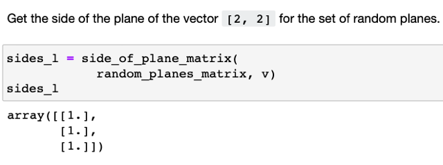</kbd>

        > Thử với vector [2,2] nó ra vector chứa 3 item chứa 
        > sign của vector [2,2]
        > với 3 plane

         

      
      - def \\*hash_multi_plane_matrix\\*(P, v, num_planes):     sides_matrix = \\*side_of_plane_matrix\\*(P, v) # Get the \\*side of planes for P and v\\*     hash_value = 0     for I in range(num_planes):         sign = sides_matrix[I].item() # Get the value inside the matrix cell         \\*hash_i = 1 if sign >=0 else 0\\*         hash_value +=\\* 2**I * hash_i\\* # sum 2^I * hash_i              return hash_value
        > Now, let us use the former function to
        > define our multiplane hash function

        > Đại khái là define cái **function  tính hash** dựa vào
        > **side_of_plane_matrix**, bỏ vào **1 vector cần tính**, **các plane**.
        >
        > Nó sẽ tính ra **array chứa các side_of_plane của v đối với các
        > plane trong P.**
        >
        > Rồi nó **loop** trong đó để tính**hash_i = 1 nếu sign >=0, 0 nếu
        > sign < 0** rồi tính **hash_value tổng hợp** theo công thức
        >
        > 2^0*hash_0 + 2^1*hash_1+2^2*hash_2...

         

          
          
<kbd>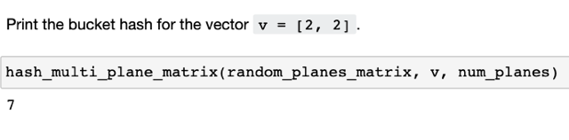</kbd>

           

        
        - Note: This showed you how to\\* make one set of random planes\\*. You will make \\*multiple sets of random planes\\* in \\*order to make the approximate nearest neighbors more accurate\\*
           

- Document vectors
   

  
  - word_embedding = {\\*"I"\\*: np.array([1,0,1]),                    "love": np.array([-1,0,1]),                    "learning": np.array([1,0,1])                   } words_in_document = ['I', 'love', 'learning', 'not_a_word'] document_embedding = np.array([0,0,0]) for word in words_in_document:     \\*document_embedding += word_embedding.get(word,0) \\*     print(document_embedding)
    > Before we finish this lab, remember that you can
    > **represent a document**as a **vector** by **adding up the word
    > vectors for the words inside the document**. In this
    > example, our embedding contains only **three words**, each
    > represented by a 3D array.

    > Đại khái rất dễ hiểu, ôn lại, embedding
    > vector của 1 câu thì là tổng embedding
    > words vector của câu đó. That's it
    >
    > Khi lấy word embedding vector từ embedding dictionary thì 
    > Dùng get (.., 0) để cho trường hợp dic không chứa từ thì nó trả về 0
    > Chứ dùng dic[,,,] là sẽ error

     

## Approximate Nearest Neighbors

 

### 1 \\*Locality sensitive hashing\\* can compute the \\*k nearest neighbors\\*

> [!NOTE]
> 1 \**Locality sensitive hashing\** can compute the \**k nearest neighbors\**
> \**faster\** \**than\** \**brute search.\**
>
> 2 \**Different sets of random planes\** can be used to \**divide the vector
> space\** into \**multiple independent sets of hash tables\**.
>
> 3 \**Multiple sets of random planes\** can help \**find a good set of nearest
> neighbors\** or \**approximate nearest neighbors\**.
>
> 4 \**Approximate nearest neighbors\** sacrifice \**precision\** for \**efficiency\**.
>
> 5 \**Random planes\** can be generated using \**np.random.normal\** to find
> out \**which side of the plane the vector is on.\**
>
> 6 \**Locality sensitive hashing\** is a \**powerful\** \**tool\** that can be used for
> many tasks related to vector spaces.

 

<kbd>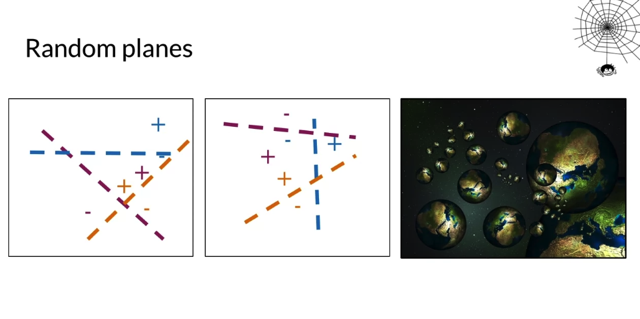</kbd>

> [!NOTE]
> Đại khái là với 3 vector thật ra
> không biết chia như nào, nên
> idea là lấy random

   

<kbd>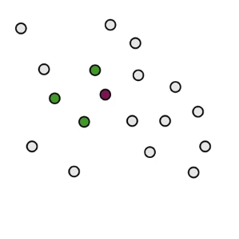</kbd>

<kbd>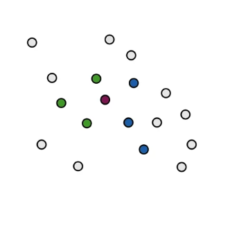</kbd>

<kbd>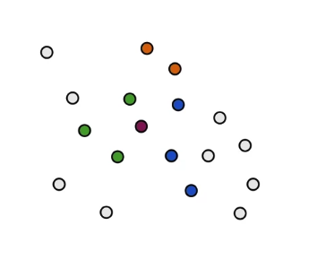</kbd>

<kbd>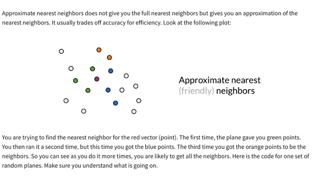</kbd>

<kbd></kbd>

<kbd></kbd>

<kbd></kbd>

<kbd></kbd>

<kbd>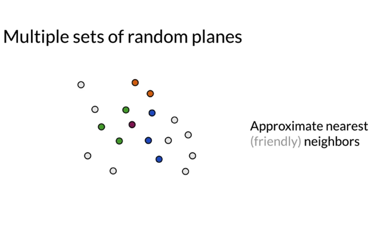</kbd>

> [!NOTE]
> Đại khái ý tưởng là với mỗi 1 random plane, sẽ giúp xác định vài thằng
> cùng side với cái thằng màu đỏ, ví dụ plane thứ 1 xác định được 3
> thằng xanh lá, plane thứ 2 xác định được 3 thằng xanh dương,,,,
>
> Thì ổng nói đại khái là nó sẽ giúp ta**xác định gần đúng các nearreast
> neighbor** mà không phải search toàn bộ vector space
>
> Gọi là **Approximate nearest neighbors**Và c**àng nhiều plane (random) thì càng dần dần đủ (chính xác)
> các nearest neighbor** nhưng sẽ **lâu hơn** nên mới nói là nó
> **Hy sinh precision để đổi lấy speed**

   

<kbd>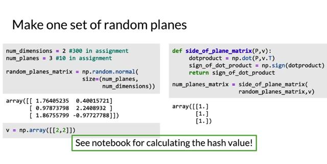</kbd>

> [!NOTE]
> Này ổng cho xem lại ví dụ để tạo ra **1 số random plane** và
> tính **side của v đ.v các plane đó**, cái này đã biết rồi trong lab,
> lecture sau sẽ nói về cách search

   

## Searching Document

 

### 1 The video discusses using \\*fast k-nearest neighbor\\* to \\*search\\* for \\*related

> [!NOTE]
> 1 The video discusses using \**fast k-nearest neighbor\** to \**search\** for \**related
> pieces of text\** in a \**collection of documents.\**
>
> 2 To perform \**document search\**, documents need to be \**represented\** as
> \**vectors\** instead of just words.
>
> 3 \**Word vectors\** for each individual word can be found and \**added together\** to
> create a \**document vector.\**
>
> 4 \**Document search\** can be performed using \**k-nearest neighbors.\**
>
> 5 A \**mini\** \**dictionary for word embeddings\** can be created to \**initialize\** the
> d\**ocument embedding\** as an \**array of zeros.\**
>
> 6 For each word in a document, the \**word vector is obtained\**, and if the word
> \**exists\** in the dictionary, \**it is added to the document embedding\**.
>
> 7 This method is a very \**general\** \**method\** of embedding text into vector spaces
> so that nearest neighbors refer to text with similar meaning.
>
> 8 \**More\** \**advanced\** \**ways\** of embedding text will be discussed in\**future lessons\**.

 

<kbd>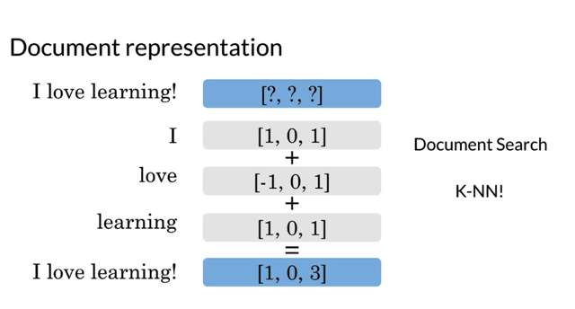</kbd>

> [!NOTE]
> Đại khái đầu tiên là represent 1
> document bằng vector bằng
> tổng các word vector

   

<kbd>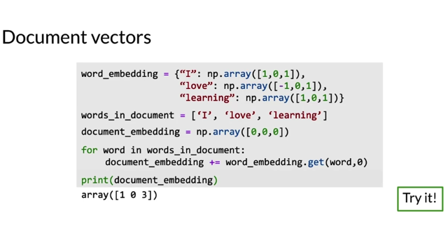</kbd>

> [!NOTE]
> Thì code như vầy để tính doc vector, không có gì khó hiểu,**ini bằng
> vector 0**, rồi **loop** trong các **từ**, với mỗi từ lấy **word embedding vector** từ
> embedding dictionary ra (nhớ dùng **get()** chứ không dùng [] vì còn handle
> trường hợp dic không có từ đó) xong**cộng dồn vô doc embedding vector**
> thôi

   

<kbd>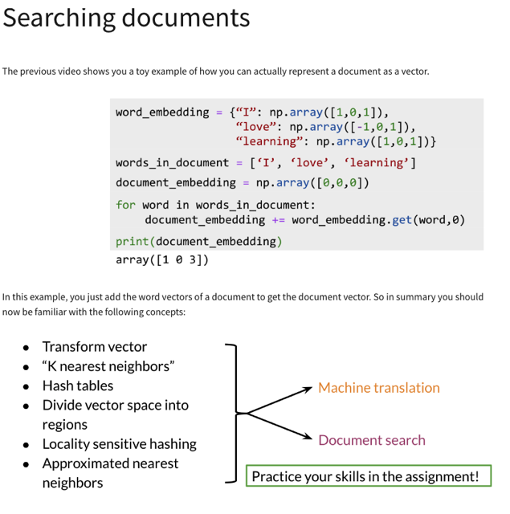</kbd>

   

## Week Conclusion

 

### Great work in getting through this week's materials, you know know how \\*Locality

> [!NOTE]
> Great work in getting through this week's materials, you know know how \**Locality
> sensitive hashing\** works and how you use it when \**approximating the nearest
> neighbors\**.
>
> In practice, the \**more regions you have\**, t\**he higher accuracy\** will be, but the
> \**slower\** your \**search\** gets, there is always a trade off.
>
> And this week's programming assignment you'll be learning the \**transformation
> matrix R\**. That allows you to find the \**mapping\** \**between words in different
> languages\**. You will then implement \**locality\** \**sensitive\** \**hashing\** and see
> how you can\**use it to hash different inputs into regions that tend to have similar
> content\**.
>
> In this course, you have learned a lot so far, you learned about \**logistic
> regression\** and \**naive bayes\** for \**sentiment analysis\**, \**vector space models\**,
> \**PCA\** and \**locality sensitive hashing\**.

 

## Quiz

 

<kbd></kbd>

 

<kbd>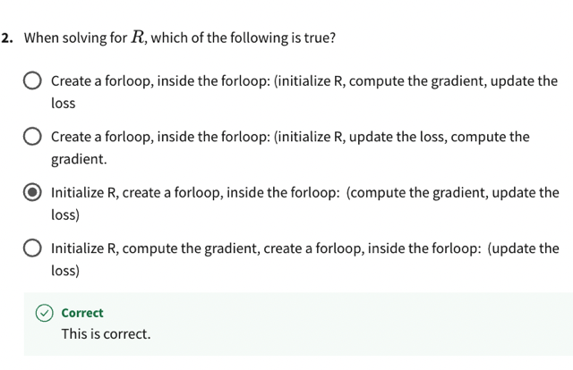</kbd>

 

<kbd>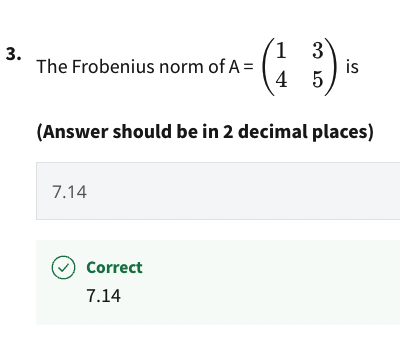</kbd>

 

<kbd>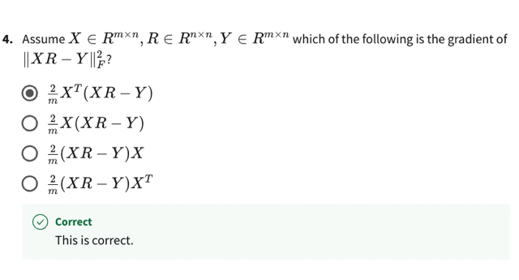</kbd>

 

<kbd>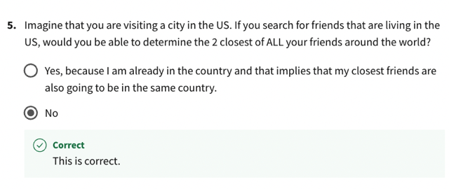</kbd>

 

<kbd>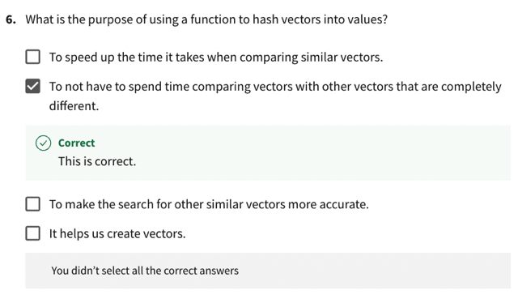</kbd>

 

<kbd>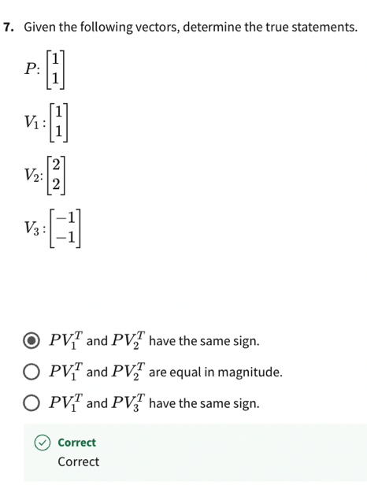</kbd>

 

<kbd>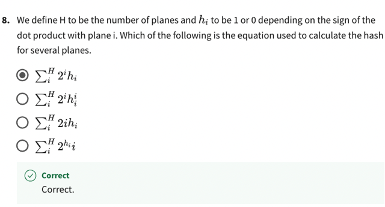</kbd>

 

<kbd>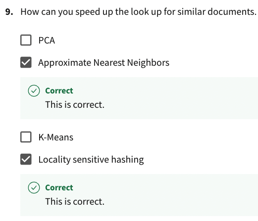</kbd>

 

<kbd>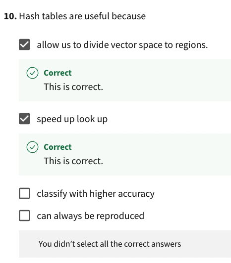</kbd>

 

## Programming Assignments: Machine Translation

 

### \\*

> [!NOTE]
> \**Assignment 4 - Naive Machine Translation and LSH
>
> \**You will now implement your first machine translation system and then
> you will see how\**locality sensitive hashing\** works. Let's get started by
> importing the required functions! If you are running this notebook in your
> local computer, don't forget to download the \**twitter samples\** and
> \**stopwords\** from \**nltk\**.
>
> \**nltk.download('stopwords')\**
>
> \**nltk.download('twitter_samples')\**

<kbd>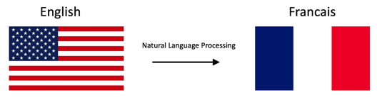</kbd>

 

- 1. The Word Embeddings Data for English and French Words
   

  
  - The Data
     

    
    - The full dataset for English embeddings is about \\*3.64\\* \\*gigabytes\\*, and the French embeddings are about \\*629\\* \\*megabytes\\*. To prevent the Coursera workspace from crashing, we've \\*extracted a subse\\*t of the \\*embeddings\\* for the words that you'll use in this assignment
       

      
      - \\*en\\*_embeddings_\\*subset\\* = pickle.load(open("./data/en_embeddings.p", "rb")) fr_embeddings_\\*subset\\* = pickle.load(open("./data/fr_embeddings.p", "rb"))
        > The subset of data: To do the assignment on the Coursera
        > workspace, we'll use the subset of word embeddings

         

        
        - \\*Look at the data  \\* • \\*en_embeddings_subset\\*: the \\*key\\* is an \\*English word\\*, and the value is a 3\\*00 dimensional array\\*, which is the embedding for that word. \\*'the'\\*: array([ 0.08007812,  0.10498047,  0.04980469,  0.0534668 , -0. 06738281, ....  • \\*fr_embeddings_subset\\*: the \\*key\\* is a \\*French word\\*, and the value is a \\*300 dimensional array\\*, which is the embedding for that word. \\*'la'\\*: array([-6.18250e-03, -9.43867e-04, -8.82648e-03,  3.24623e-02,...
          > Word embedding
          > vector is 300D

           

          
          - # \\*loading\\* the English to French \\*dictionaries\\* \\*en_fr_train\\* = \\*get_dict\\*('./data/en-fr.train.txt') print('The length of the English to French training dictionary is', len(en_fr_train)) \\*en_fr_test\\* = \\*get_dict\\*('./data/en-fr.test.txt') print('The length of the English to French test dictionary is', len(en_fr_test))  The length of the English to French training dictionary is \\*5000\\* The length of the English to French test dictionary is \\*1500\\*
            > Load two dictionaries mapping the English to French words
            > A training dictionary
            > and a testing dictionary.

             

            
            - \\*Looking at the English French dictionary  \\* • \\*en_fr_train\\* is a \\*dictionary\\* where the key is the English word  and the value is the  French translation of that English word.  {'the': 'la',  • 'and': 'et',  • 'was': 'était',  • 'for': 'pour',  • \\*en_fr_test\\* is similar to en_fr_train, but is a \\*test set.\\*  We won't look at it until we get to testing. 
               

  
  - 1.1 Generate Embedding and Transform Matrices
     

      
      
<kbd>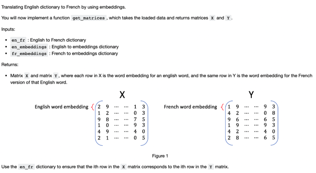</kbd>

       

    
    - Instructions: Complete the function get_matrices():  Iterate over English words in en_fr dictionary. Check if the word have both English and French embedding.  Instructions: Complete the function get_matrices():  \\*Hints\\*   • \\_Sets\\_ are useful data structures that can be used to check if an item is a  member of a group.  • You can get words which are embedded into the language by  using \\_keys\\_ method.  • Keep vectors in `X` and `Y` sorted in list. You can use \\_\\*np.vstack()\\*\\_ to merge  them into the numpy matrix.  • \\_\\*numpy.vstack\\*\\_ stacks the items in a list as rows in a matrix.
       

  
  - Exercise 1 - get_matrices (UNQ_C1)
     

      
      
<kbd>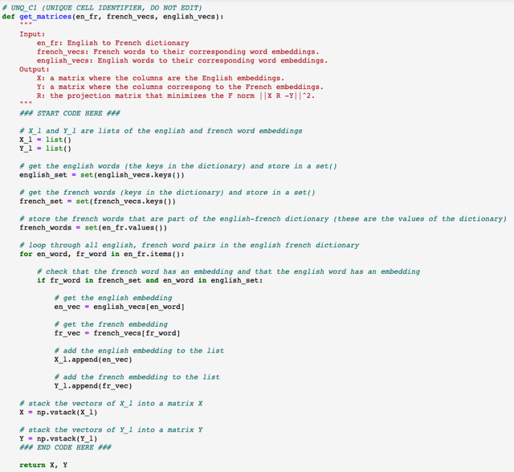</kbd>

       

    
    - Đại khái là  Loop trong cặp English word - French word của en_fr dictionary (là cái dic giữa từ - từ)  Check để chỉ làm tiếp nếu cả hai từ đó đều có embedding vector tương ứng (bằng cách check keys của english_vecs và french_vecs)  Xong nếu có thì add embedding vector của mỗi từ vào list tương ứng  Vậy là xong hết ta có 2 list chứa các embedding vectors của các cặp từ En-Fr.  Cuối cùng dùng np.vstack để stack vào matrix - Kiểu như biến một list các vector, mỗi vector 300D thành một matrix vậy
       

      
      - # UNQ_C2 (UNIQUE CELL IDENTIFIER, DO NOT EDIT) # You do not have to input any code in this cell, but it is relevant to grading,  so please do not change anything  # getting the training set: X_train, Y_train = \\*get_matrices\\*(     en_fr_train, fr_embeddings_subset, en_embeddings_subset)
        > Tạo X_train, Y_train bằng function này

         

- 2 - Translations
   

  
  - 2.1 - Translation as Linear Transformation of Embeddings
     

    
    - Given dictionaries of \\*English\\* and \\*French\\* \\*word embeddings\\* you will create a  \\*transformation matrix R\\*   • Given an English word embedding, 𝐞, you can multiply 𝐞𝐑  to get a new word embedding 𝐟  ▪ Both 𝐞 and 𝐟 are \\_row vectors\\_.  • You can then compute the \\*nearest neighbors\\* to \\*f\\* in the french embeddings  and recommend the word that is most similar to the transformed word embedding.
      > Dùng Dictionary English Embedding (X)
      > - French Embedding (Y) để train ra R - Transformation matrix
      >
      > Xong dùng R, với một English word vector e tính ra f = eR.
      >
      > Rồi dùng nearest neighbor để tìm ra (trong French words) từ có
      > vector gần nhất với f

       

        
        
<kbd>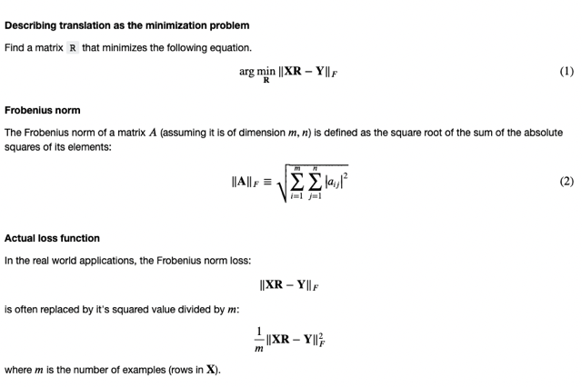</kbd>

         

      
      - • The \\*same R\\* is found when using this loss function versus the original Frobenius norm.  • The reason for taking the square is that it's \\*easier to compute the gradient\\* of the squared Frobenius.  • The reason for \\*dividing by \\*𝑚  is that we're more interested in the \\*average loss\\* per embedding than the loss for the  entire training set.  ▪ The loss for all training set increases with more words (training examples), so taking the average helps us to track the average loss\\* regardless of the size of the training set.\\*
        > Đại khái là tính loss bằng squared của F norm để dễ tính gradient
        > hơn mà vẫn ra cùng kết quả, và /m để tính average của loss cho
        > nó không bị ảnh hưởng bởi size (kiểu như thay vì tính loss tổng
        > thì ta dùng loss trung bình và kết quả cũng mục đích tìm dc R
        > giảm 2 thằng đó thì cũng như nhau thôi)

         

        
        - • The \\*norm\\* is always \\*nonnegative\\* (we're summing up absolute values), and so is the square.  • When we take the square of all non-negative (positive or zero) numbers, the order of the data is preserved.  • For example, if \\*3 > 2, 3^2 > 2^2\\*  • Using the norm or squared norm in gradient descent \\*results in the same \\/location\\/ of the minimum.\\*  • Squaring \\*cancels the square root \\*in the Frobenius norm formula. Because of the \\_\\*chain rule\\*\\_, we would have to do \\*more calculations\\* if we had a \\*square root\\* in our expression for summation.  • Dividing the function value by the positive number doesn't change the optimum of the function, for the same reason as described above.  • We're interested in transforming English embedding into the French. Thus, it is more important to measure \\*average loss per embedding\\* than the l\\*oss for the entire dictionary\\* (which increases as the number of words in the dictionary increases).
          > Giải thích thêm tại sao dể tính
          > gradient hơn là vì không phải tính đạo
          > hàm của hàm square root

           

  
  - Exercise 2 - compute_loss (UNQ_C3)
     

      
      
<kbd>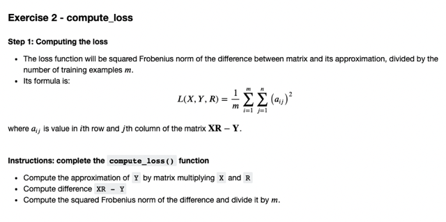</kbd>

       

    
    - \\*Hints\\*  • Useful functions: \\_Numpy dot \\_, \\_Numpy sum\\_, \\_Numpy square\\_, \\_Numpy norm\\_  • Be careful about which operation is \\*elementwise\\* and which operation is a \\*matrix multiplication\\*.  • Try to use matrix operations instead of the numpy norm function. If you choose to use norm function, take care of extra arguments and that it's returning loss squared, and not the loss itself.
       

        
        
<kbd>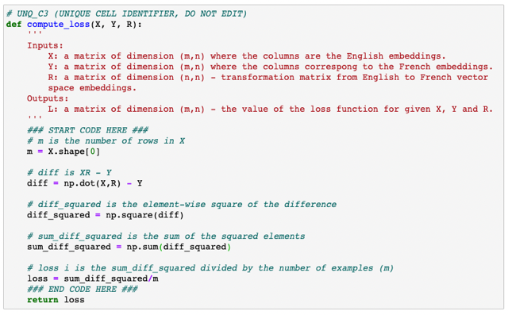</kbd>

         

        
        
<kbd>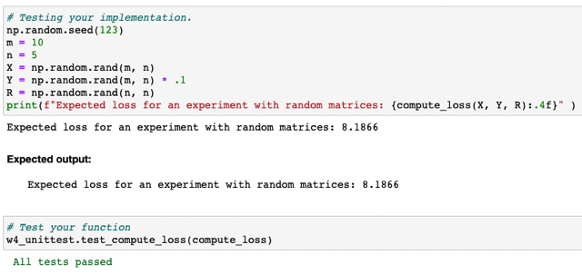</kbd>

         

  
  - Exercise 3 - compute_gradient (UNQ_C4)
     

      
      
<kbd>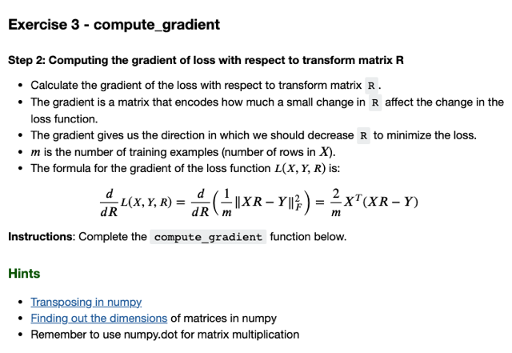</kbd>

       

      
      
<kbd>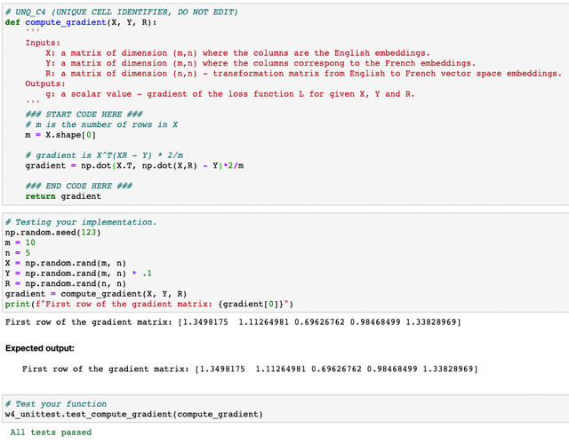</kbd>

       

  
  - Exercise 4 - align_embeddings (UNQ_C5)
     

    
    - \\*Step 3: Finding the optimal R with Gradient Descent Algorithm \\/Gradient Descent \\*\\/\\_ Gradient descent\\_ is an iterative algorithm which is used in searching for the optimum of  the function.  • Earlier, we've mentioned that the gradient of the loss with respect to the matrix  encodes how much a tiny change in some coordinate of that matrix affect the change of  loss function.  • Gradient descent uses that information to iteratively change matrix R until we  reach a point where the loss is minimized.  \\*Training with a fixed number of iterations \\* Most of the time we iterate for a fixed number of training steps rather than iterating until  the loss falls below a threshold
       

      
      - • You cannot \\*rely\\* \\*on\\* \\*training loss getting low\\* -- what you really want is the \\*validation loss to go down,\\* or \\*validation accuracy to go up\\*. And indeed - in some cases people train until \\*validation accuracy reaches a threshold\\*, or -- commonly known as "\\*early stopping\\*" -- until the \\*validation accuracy starts to go down\\*, which is a sign of \\*over-fitting.\\*  • \\*Why not always do "early stopping"?\\* Well, mostly because \\*well-regularized models\\* on larger data-sets \\*never stop improving\\*. Especially in \\*NLP\\*, you can often \\*continue training for months\\* and the model will continue getting \\*slightly\\* and \\*slightly better\\*. This is also the reason why\\* it's hard to just stop at a threshold\\* -- unless there' s an external \\*customer setting the threshold\\*, why stop, where do you put the threshold?  • \\*Stopping\\* \\*after a certain number of steps\\* has the \\*advantage\\* that you \\*know how long your training will take\\* - so you can keep some sanity and not train for months. You can then try to \\*get the best performance\\* within this \\*time budget\\*. Another \\*advantage\\* is that you can \\*fix your learning rate schedule\\* -- e.g., lower the learning rate at 10% before finish, and then again more at 1% before finishing. Such learning rate schedules help a lot, but are harder to do if you don't know how long you're training.
        > Đại khái là không thể tin tưởng và việc giảm training loss
        > vì nó sẽ giảm hoài dẫn tới overfit nên chú ý tới CV cost và
        > stop training khi nó có dấu hiệu tăng hoặc accuracy đạt
        > một threshold nào đó.
        >
        > Tuy vậy đối với NLP người ta thường không early stoping
        > vì model thường nó không bị overfit mà sẽ cứ improve từng
        > chút từng chút khi train càng lâu
        >
        > Do đó chỉ early stoping nếu: 
        > 1 là chỉ có một khoảng
        > thời gian nhất định để train và tìm ra model tốt nhất
        >
        > 2 là fix learning rate đại khái là với việc xác định sẽ train trong một
        > quảng thời gian nhất định
        > thì mới sét khi nào thì dùng lr bao nhiêu được

         

          
          
<kbd>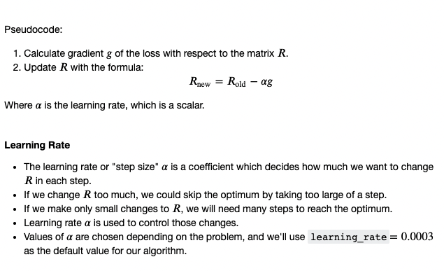</kbd>

           

          
          
<kbd>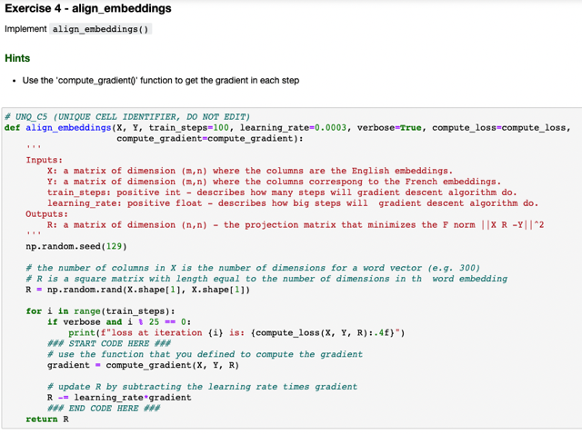</kbd>

           

          
          
<kbd>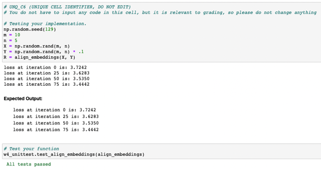</kbd>

           

  
  - Training
     

    
    - # UNQ_C7 (UNIQUE CELL IDENTIFIER, DO NOT EDIT) # You do not have to input any code in this cell, but it is relevant to grading, so please do not change anything R_train = align_embeddings(X_train, Y_train, train_steps=\\*400\\*, \\*learning_rate\\*=0.8)
      > Calculate Transformation matrix R
      > Using just the training set, find the transformation matrix  𝐑
      >   by calling the function align_embeddings().
      >
      > NOTE: The code cell below will take a few minutes to fully execute (~3 mins)

       

  
  - 2.2 - Testing the Translation
     

    
    - \\*2.2 - Testing the Translation  k-Nearest Neighbors Algorithm \\*\\_ \\_  • k-NN is a method which takes a vector as input and finds the other vectors in the dataset that are closest to it.  • The 'k' is the number of "nearest neighbors" to find (e.g. k=2 finds the closest two neighbors).  \\*   Searching for the Translation Embedding  \\*Since we're approximating the translation function from English to French embeddings by  a linear transformation matrix 𝐑, \\*most of the time we won't get the exact embedding of a  French word\\* when we transform embedding 𝐞 of some particular English word into the  French embedding space.  • This is where 𝑘-NN becomes really useful! By using 1-NN with 𝐞𝐑  as input, we can \\*search for an embedding 𝐟\\* (as a row) in the matrix 𝐘  which is the \\*closest\\* to the transformed vector 𝐞𝐑
       

        
        
<kbd>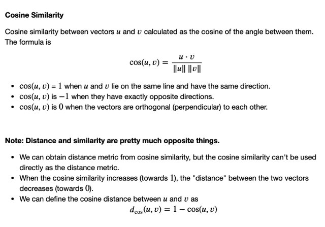</kbd>

        > Đại khái là vì khi 2 vector càng gần nhau (khoảng cách càng nhỏ) thì
        > chỉ số cosine-similarity càng lớn (max = 1, min = -1), thành ra không
        > song hành được, phải define chỉ số khác là 1 - cosine similarity
        > (distance càng nhỏ thì chỉ số này càng nhỏ theo) để dùng

         

  
  - Exercise 5 - nearest_neighbor (UNQ_C8)
     

    
    - Complete the function \\*nearest_neighbor\\*() Inputs:  • Vector v,  • A set of \\*possible nearest neighbors candidates\\*  • \\*k nearest neighbors to find\\*.  • The distance metric should be based on \\*cosine similarity\\*.  • \\*cosine_similarity\\* function is \\*already implemente\\*d and \\*imported\\* for you. It's  arguments are two vectors and it returns the cosine of the angle between them.  •\\* Iterate over rows in candidates\\*, and save the result of similarities between  current row and vector v in a python list. Take care that similarities are in the same  order as row vectors of candidates.  • Now you can use \\_\\*numpy argsort\\*\\_ to \\*sort\\* the indices for the rows of candidates. \\* Hints\\*   • \\*numpy.argsort\\* sorts values from \\*most negative to most positive\\* (smallest to  largest)  • The candidates that are \\*nearest\\* to 'v' should have the \\*highest cosine similarity\\*  • To \\*reverse the order\\* of the result of \\*numpy.argsort\\* to get the element with  highest cosine similarity as the first element of the array you can use \\*tmp[::-1]\\*. This  \\*reverses the order of an array\\*. Then, you can extract the first k elements.
       

        
        
<kbd>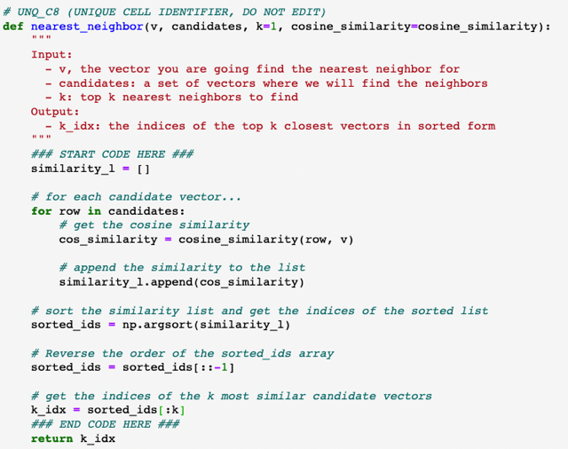</kbd>

        > Loop trong candidates để tính cosine_similarity của candidate với vector v,
        > bỏ vào 1 list
        >
        > Xong dùng **argsort** để sort - nó sẽ sort từ nhỏ tới lớn, và trả ra list các
        > index. Mà mình cần lấy thằng gần nhất, thì phải lấy thằng có
        > cosine_similarity lớnnhất.
        >
        > Nên phải reverse sort lại bằng [::-1]. Cũng có cách lấy k thằng cuối cũng
        > được nhưng ở đây nên dùng cách reverse sort rồi lấy k thằng đầu cho dễ

         

        
        
<kbd>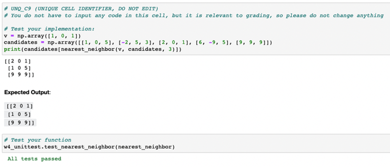</kbd>

         

  
  - Exercise 6 - test_vocabulary (UNQ_C10)
     

      
      
<kbd>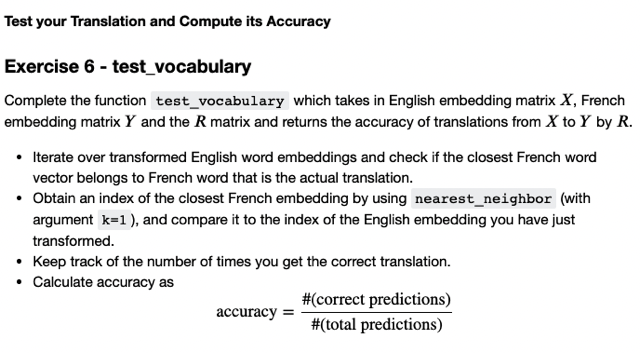</kbd>

      > Nói chung là train xong, và define function lấy ra cái từ closest thì
      >  giờ test lại training set accuracy
      >
      > Với mỗi **English word vector e** trong **X**, tương ứng với nó là French
      > word vector **f** trong **Y**
      >
      > Ta tính ra prediction (tính eR). 
      >
      > Tìm closest với eR trong Y, nếu ra đúng là f thì là predict đúng,
      > không thì là sai. (Ở đây chỉ so index thôi, tức là func closet giúp tìm
      > ra index trong Y của closet, đem so với index của ground true label f)
      >
      >
      > Tính tổng đúng bao nhiêu trong m (accuracy)
      >
      > *Đó là hiểu như vậy, còn làm thì vectorize tính 1 phát ra các prediction
      > của X luôn XR rồi mới loop trong các prediction này ..

       

      
      
<kbd>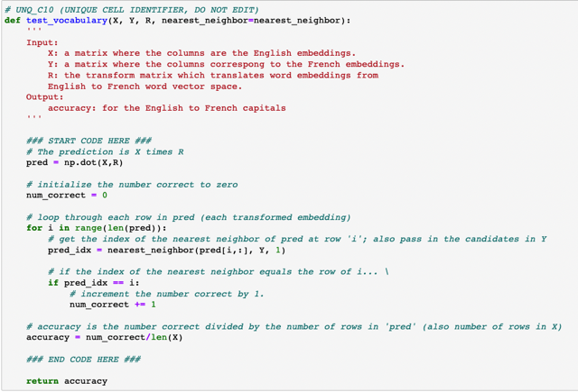</kbd>

       

      
      
<kbd>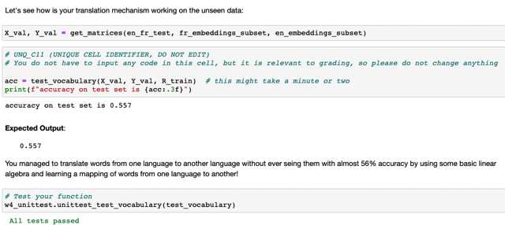</kbd>

       

    
    - You managed to translate words from one language to another language without ever seing them with almost 56% accuracy by using some basic linear algebra and learning a mapping of words from one language to another!
      > Dịch đúng tới 56% trong khi chỉ
      > dùng vài phép toán cơ bản

       

- 3 - LSH and Document Search
   

  
  - LSH and Document Search
     

    
    - In this part of the assignment, you will implement a \\*more efficient version\\* of \\*k-nearest  neighbors\\* using \\*locality sensitive hashing\\*. You will then apply this to \\*document search\\*.  • \\*Process the tweets \\*and \\*represent each tweet as a vector\\* (represent a document with a  vector embedding).  • Use \\*locality sensitive hashing\\* and \\*k nearest neighbors\\* to \\*find tweets\\* that are \\*similar to  a given tweet.\\*
       

      
      - # get the positive and negative tweets \\*all_positive_tweets\\* = \\*twitter_samples\\*.strings('\\*positive_tweets.json\\*') \\*all_negative_tweets\\* = \\*twitter_samples\\*.strings('\\*negative_tweets.json\\*') \\*all_tweets\\* = all_positive_tweets + all_negative_tweets
         

  
  - 3.1 - Getting the Document Embeddings
     

    
    - \\*Bag-of-words (BOW) Document Models  \\*Text documents are s\\*equences of words\\*.   • The ordering of words makes a difference. For example, sentences "Apple pie  is better than pepperoni pizza." and "Pepperoni pizza is better than apple pie" have  \\*opposite meanings\\* due to the \\*word ordering\\*.   • However, \\*for some applications\\*, \\*ignoring the order of words\\* can allow us to  \\*train an efficient and still effective model.\\*   • This approach is called \\*Bag-of-words document model\\*. \\* Document Embeddings \\*  • \\*Document embedding\\* is created by \\*summing up\\* the \\*embeddings of all words \\* in the document.   • If we d\\*on't know\\* the embedding of some word, we \\*can ignore that word.\\*
      > Đại khái là đối với một số ứng dụng nhất định có
      > thể cho phép ta ignore word order mà vẫn giúp
      > train 1 effective model, goị chung là
      > Bag-of-words document model

       

  
  - Exercise 7 - get_document_embedding (UNQ_C12)
     

    
    - Complete the \\*get_document_embedding\\*() function.  • The function get_document_embedding() encodes entire document as a  "document" embedding.  • It takes in a \\*document\\* (as a string) and \\*a dictionary\\*, \\*en_embeddings\\*  • It processes the document, and looks up the \\*corresponding embedding of  each word.\\*  • It then \\*sums them up\\* and returns the sum of all word vectors of that processed  tweet.  \\*Hints\\*   • You can handle missing words easier by using the `\\*get()\\*` method of the \\*python  dictionary \\*instead of the \\*bracket notation (i.e. "[ ]")\\*. See more about it \\_here\\_  • The default value for \\*missing word\\* should be the \\*zero vector\\*. Numpy  will \\_\\*broadcast\\* \\_simple 0 scalar into a vector of zeros during the summation.  • Alternatively, \\*skip\\* the addition if a word is not in the dictionary.  • You can use your `\\*process_tweet\\*()` function which allows you to process the  tweet. The function just takes in a tweet and \\*returns a list of words.\\*
       

        
        
<kbd>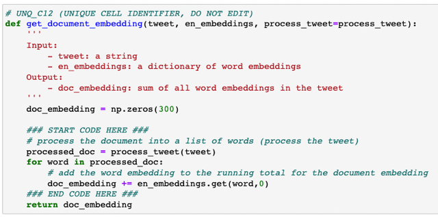</kbd>

         

        
        
<kbd>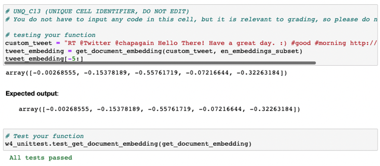</kbd>

         

  
  - Exercise 8 - get_document_vecs (UNQ_C14)
     

      
      
<kbd>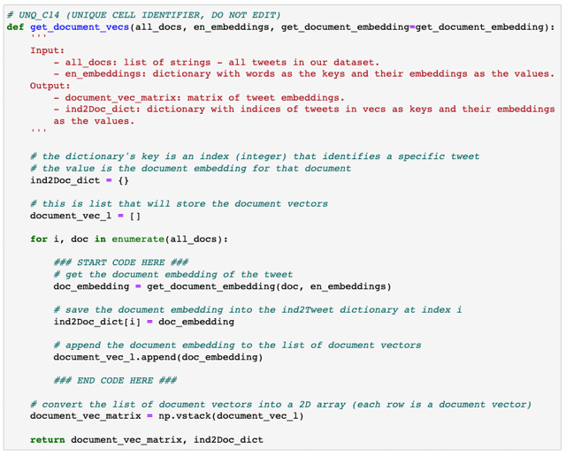</kbd>

       

      
      
<kbd>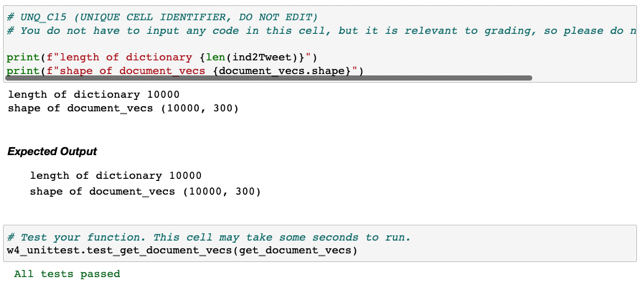</kbd>

       

  
  - 3.2 - Looking up the Tweets
     

    
    - Now you have a vector of dimension (m,d) where m is the number of tweets (10,000)  and d is the dimension of the embeddings (300). Now you will input a tweet, and use  cosine similarity to see which tweet in our corpus is similar to your tweet.
       

      
      - my_tweet = 'I am sad' process_tweet(my_tweet) tweet_embedding = get_document_embedding(my_tweet, en_embeddings_subset)  -> @hanbined sad pray for me :(((
        > Này không làm, chỉ làm xem thử với function ổng làm sẵn
        > giúp tìm ra 1 tweet có gần nhất (bằng cosine similarity) với
        > input tweet embedding vector

         

  
  - 3.3 - Finding the most Similar Tweets with LSH
     

      
      
<kbd>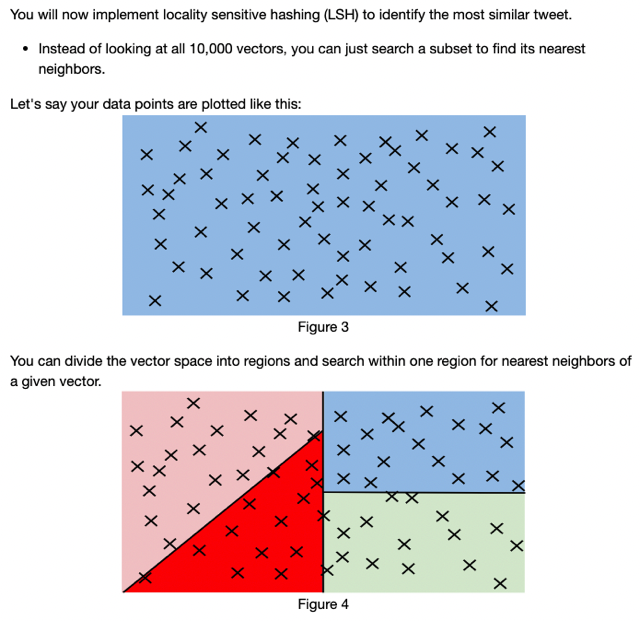</kbd>

       

      
      
<kbd>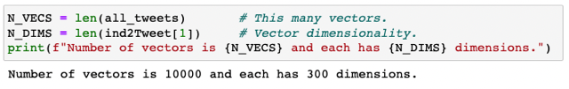</kbd>

       

      
      
<kbd>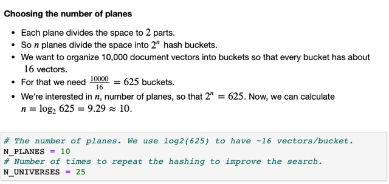</kbd>

      > Cái này đáng chú ý nè, ổng nói muốn chia
      > sao cho mỗi bucket chưa 16 vector. Từ đó
      > tính được cần 10 plane
      >
      > Và sẽ làm 25 lần (tức lặp lại 25 lần cái việc tạo hash
      > table bằng LSH)

       

  
  - 3.4 - Getting the Hash Number for a Vector
     

      
      
<kbd>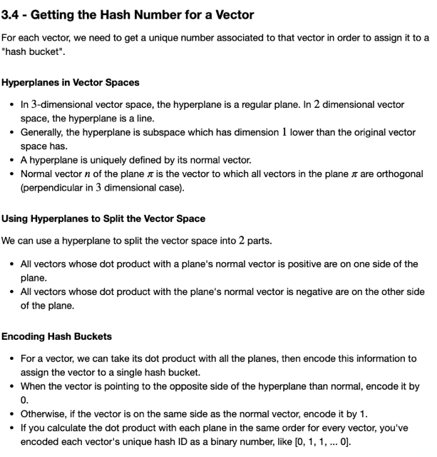</kbd>

       

  
  - Exercise 9 - hash_value_of_vector (UNQ_C17)  Như đã hiểu cách thức, chỉ là làm theo kiểu vectorize thôi.  Thì đại khái tính 1 phát đợt product với tất cả các normal vector để dc 1 vector chứa hết các kết quả. Áp dụng np.sign với vector kết quả này để nó tính sign cho từng cái trong đó.  Tính h là tạo 1 vector mới mà mỗi element là kết quả của phép so sánh của từng vị trí với 0, nên ra thành 0, 1 chính là các hash_i.  Rồi cuối cùng là loop ở trong đó để tính hash_value theo công thức
     

    
    - We've initialized hash table hashes for you. It is list of N_UNIVERSES matrices, each describes its own hash table. Each matrix has N_DIMS rows and N_PLANES columns. Every column of that matrix is a N_DIMS-dimensional normal vector for each of N_PLANES hyperplanes which are used for creating buckets of the particular hash table
      > Đại khái là, mỗi matrix tượng trưng cho một các bộ plane để 'làm' cái việc
      > locality sensitive hashing này. Mỗi bộ plane có 10 vector chính là 10
      > column của matrix. Mỗi normal vector có side là N-DIMS. Và có 25 cái
      > matrix như vậy để thể hiện ta sẽ lặp lại 25 lần. Kiểu như mỗi bộ được
      > generate random, nên repeat nhiều lần để tăng hiệu quả kiểu kiểu như
      > RandomForest vậy

       

        
        
<kbd>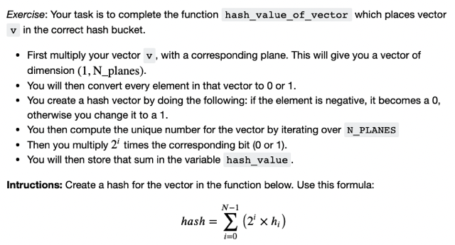</kbd>

         

      
      - \\*Create the sets of planes \\*  • Create multiple (25) sets of planes (the planes that divide up the region).   • You can think of these as \\*25 separate ways\\* of dividing up the vector space  with a \\*different set of planes.\\*   • Each element of this list contains a \\*matrix\\* with \\*300 rows\\* (the word vector have  \\*300 dimensions\\*), and \\*10 columns\\* (there are \\*10 planes \\*in each "universe").
         

        
        - np.random.seed(0) planes_l = [np.random.normal(size=(N_DIMS, N_PLANES))             for _ in range(N_UNIVERSES)]
           

          
          - \\*Hints\\*: numpy.squeeze() removes unused dimensions from an array; for instance, it converts a (10,1) 2D array into a (10,) 1D array
             

              
              
<kbd>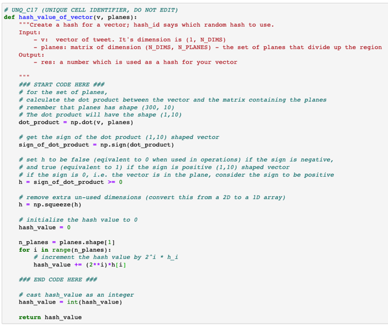</kbd>

              > Như đã hiểu cách thức, chỉ là làm theo kiểu vectorize thôi.  Thì đại khái tính 1 phát
              > đợt product với tất cả các normal vector để dc 1 vector chứa hết các kết quả. Áp
              > dụng np.sign với vector kết quả này để nó tính sign cho từng cái trong đó.  Tính h là
              > tạo 1 vector mới mà mỗi element là kết quả của phép so sánh của từng vị trí với 0,
              > nên ra thành 0, 1 chính là các hash_i.  Rồi cuối cùng là loop ở trong đó để tính
              > hash_value theo công thức

               

              
              
<kbd>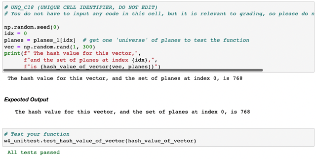</kbd>

               

  
  - 3.5 - Creating a Hash Table
     

      
      
<kbd>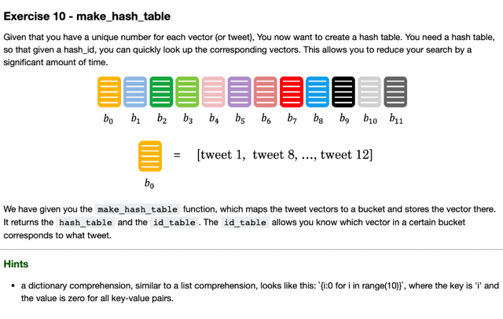</kbd>

       

  
  - Exercise 10 - make_hash_table (UNQ_C19)
     

    
    - # UNQ_C19 (UNIQUE CELL IDENTIFIER, DO NOT EDIT) # This is the code used to create a hash table: feel free to read over it def make_hash_table(vecs, planes, hash_value_of_vector=hash_value_of_vector):     """     Input:         - vecs: list of vectors to be hashed.         - planes: the matrix of planes in a single "universe", with shape (embedding dimensions, number of planes).     Output:         - hash_table: dictionary - keys are hashes, values are lists of vectors (hash buckets)         - id_table: dictionary - keys are hashes, values are list of vectors id's                             (it's used to know which tweet corresponds to the hashed vector)     """     ### START CODE HERE ###      # number of planes is the number of columns in the planes matrix     num_of_planes = planes.shape[1]      # number of buckets is 2^(number of planes)     # ALTERNATIVE SOLUTION COMMENT:     # num_buckets = pow(2, num_of_planes)     \\*num_buckets = 2**num_of_planes\\*      # create the hash table as a dictionary.     # Keys are integers (0,1,2.. number of buckets)     # Values are empty lists     \\*hash_table = {I: [] for I in range(num_buckets)}\\*      # create the id table as a dictionary.     # Keys are integers (0,1,2... number of buckets)     # Values are empty lists     id_table = {I: [] for I in range(num_buckets)}      # for each vector in 'vecs'     for I, v in enumerate(vecs):         # calculate the hash value for the vector         \\*h = hash_value_of_vector(v, planes)\\*          # store the vector into hash_table at key h,         # by appending the vector v to the list at key h         \\*hash_table[h].append(v)\\* # @REPLACE None          # store the vector's index 'I' (each document is given a unique integer 0,1,2...)         # the key is the h, and the 'I' is appended to the list at key h         \\*id_table[h].append(i)\\* # @REPLACE None      ### END CODE HERE ###      return hash_table, id_table
       

      
      - # UNQ_C20 (UNIQUE CELL IDENTIFIER, DO NOT EDIT) # You do not have to input any code in this cell, but it is relevant to grading, so please do not change anything planes = planes_l[0]  # get one 'universe' of planes to test the function tmp_hash_table, tmp_id_table = make_hash_table(document_vecs, planes)  print(f"The hash table at key 0 has {len(tmp_hash_table[0])} document vectors") print(f"The id table at key 0 has {len(tmp_id_table[0])} document indices") print(f"The first 5 document indices stored at key 0 of id table are {tmp_id_table[0][0:5]}")
         

          
          
<kbd>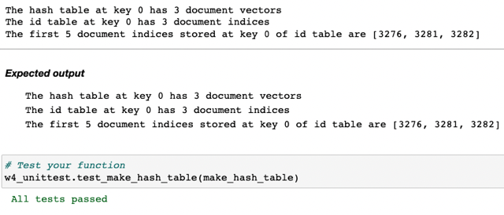</kbd>

           

  
  - 3.6 - Creating all Hash Tables
     

    
    - You can now \\*hash your vectors\\* and \\*store\\* them in a \\*hash table\\* that would allow you to \\*quickly look up\\* and \\*search for similar vectors\\*. Run the cell below to create the hashes. By doing so, \\*you end up having several tables which have all the vectors\\*. \\*Given a vector, \\*you then \\*identify the buckets in all the tables\\*. You can then \\*iterate\\* over the \\*buckets\\* and \\*consider much fewer vectors.\\* The \\*more tables you use\\*, the \\*more accurate\\* your lookup will be, but also the\\* longer it will take\\*
       

      
      - # Creating the hashtables def create_hash_id_tables(n_universes):     hash_tables = []     id_tables = []     for universe_id in range(n_universes):  # there are 25 hashes         print('working on hash universe #:', universe_id)         planes = planes_l[universe_id]         hash_table, id_table = make_hash_table(document_vecs, planes)         hash_tables.append(hash_table)         id_tables.append(id_table)          return hash_tables, id_tables  hash_tables, id_tables = create_hash_id_tables(N_UNIVERSES)
         

  
  - Exercise 11 - approximate_knn (UNQ_C21)
     

      
      
<kbd>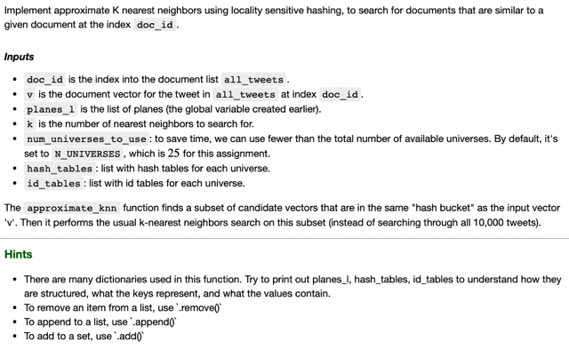</kbd>

       

      
      
<kbd>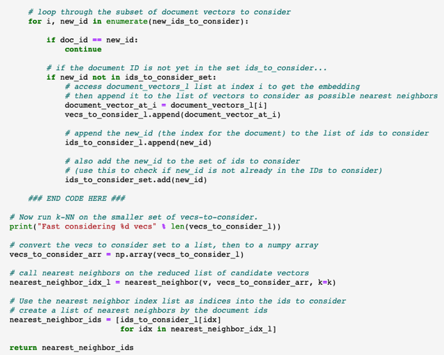</kbd>

      
<kbd>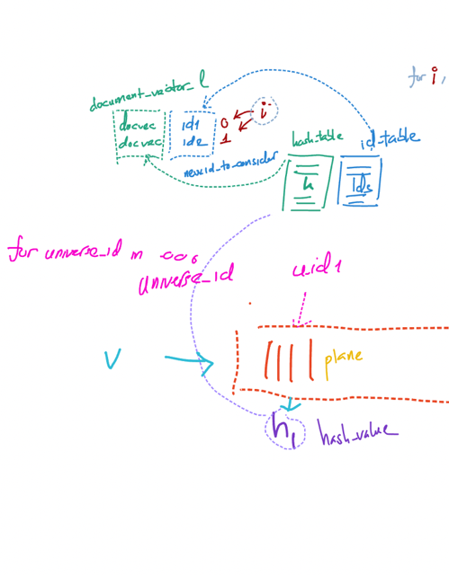</kbd>

      
<kbd>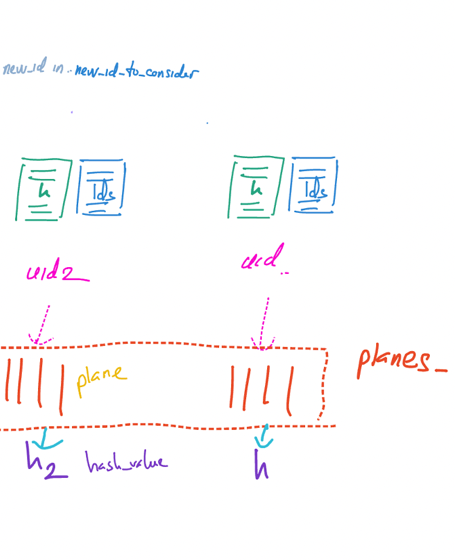</kbd>

      
<kbd></kbd>

      
<kbd></kbd>

      
<kbd></kbd>

      
<kbd>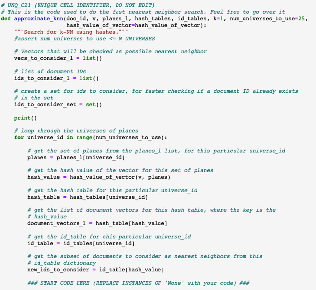</kbd>

       

      
      
<kbd>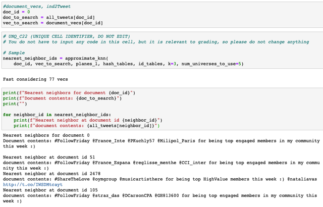</kbd>

       

