# C3w2_recurrent Neural Networks For Language Modeling

📊 **Progress:** `67` Notes | `146` Screenshots

---

Learn about the limitations of traditional language models and see how RNNs and GRUs 
use sequential data for text prediction. Then build your own next-word generator using a 
simple RNN on Shakespeare text data!

Learning Objectives

 • N-grams
 • Gated recurrent units
 • Recurrent neural networks

## Traditional Languages Models

 

### 1 N-gram language models have **limitations** in terms of **space** and **memory requirements.**

> [!NOTE]
> 1 N-gram language models have **limitations** in terms of **space** and **memory requirements.**
>
> 2 To compute the **probability of a sequence of word**s,**N-gram models require computing conditional
> probabilities for bigrams** or higher-order N-grams.
>
> 3 The p**robability of a sentence** in an N-gram model is obtained by **multiplying the probabilities of each
> word using its previous (N-1) words**.
>
> 4 N-gram models **struggle to capture dependencies between words that are far apart**, as they would
> **require accounting for conditional probabilities in very long word sequences.**
>
> 5 **Estimating** these probabilities **becomes challenging** with **large corpora**, and **storing all possible
> combinations of probabilities** would **require significant space and memory**.
>
> 6 **Recurrent Neural Networks (RNNs)** and **Gated Recurrent Units (GRUs)** are **more efficient models**
> for **natural language processing (NLP)** tasks like **machine translation.**
>
> 7 **RNNs and GRUs** are **more suitable for scenarios with limited space**, such as **mobile applications**,
> as they do**not require storing the entire probability distribution** like N-gram models.
>
> 8 **RNNs** are introduced as an alternative to traditional N-gram language models in this video, offering
> more efficient approaches for NLP tasks.

 

<kbd>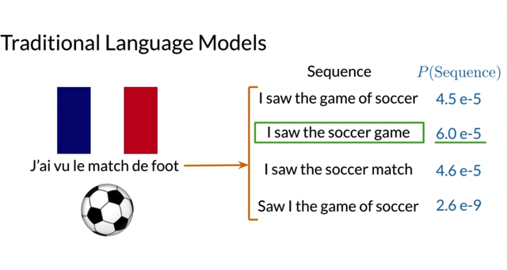</kbd>

> [!NOTE]
> Đại khái là với N-Gram model ra được câu này là có P(sen) cao nhất.

   

<kbd>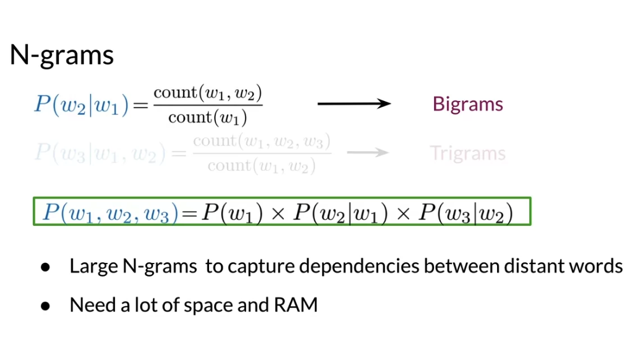</kbd>

> [!NOTE]
> Xác suất của từ tiếp theo sẽ phụ thuộc vào n-1 từ trước đó (N-gram). Hạn
> chế của phương pháp này là nó khó nắm bắt được dependencies của
> những từ ở xa và nếu có làm được cũng cần rất nhiều space và RAM

   

## RNN

 

### 1 **Recurrent Neural Networks (RNNs)** have **advantages** over \\*traditional N-gram language

> [!NOTE]
> 1 **Recurrent Neural Networks (RNNs)** have **advantages** over **traditional N-gram language
> models** in **capturing dependencies** that **N-grams cannot capture**.
>
> 2 **RNNs** can **propagate information** **from the beginning to the end of a sequence**, allowing for
> **better predictions**.
>
> 3 Traditional language models, like **trigrams**, may **select the most probable word based on the
> previous context**, but it **may not make sense in the context of the sentence.**
>
> 4 RNNs are **not limited to considering only the previous n words** and **can use information from the
> entire sequence.**
>
> 5 To capture dependencies for sentence completion using an N-gram model, one would need to
> account for impractical and lengthy sequences of words.
>
> 6 RNNs propagate information through a sequence by computing values at each step, **using
> information from previous computations** and the **current word**.
>
> 7 The computations in an RNN are **repeated for each word in the sequence**, with the **same
> weights**multiplied to propagate information.
>
> 8 RNNs are called **recurrent** because they \\_**repeatedly feed the computed values to
> themselves**\\_ **until** a **prediction is made**.
>
> 9 The main advantage of RNNs is **their ability to propagate information within sequences**, **sharing
> most of the parameters in the computations**.
>
> 10 **Different types of RNN architectures** will be explored in the next video, along with guidelines on
> when to use each type.

 

<kbd>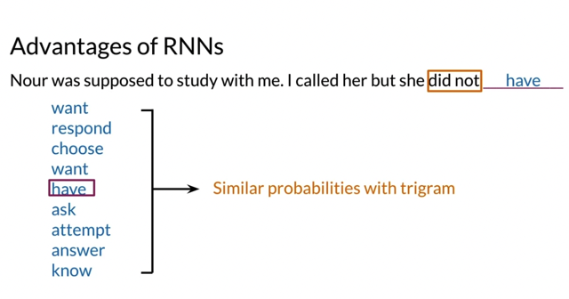</kbd>

> [!NOTE]
> Đại khái là nếu dùng **N-gram ví dụ 3-gram** trong bài toán này nó
> sẽ chọn từ have vì "did not have" có **xác suất cao trong corpus**
> nhưng **rõ ràng là sai bét.**

   

<kbd>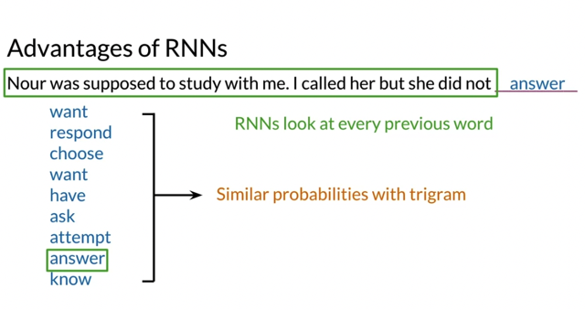</kbd>

> [!NOTE]
> Ý nói **để làm đúng được** nó phải **dựa trên context là cả
> câu chứ không thể chỉ dựa vào vài từ trước đó**.

   

<kbd>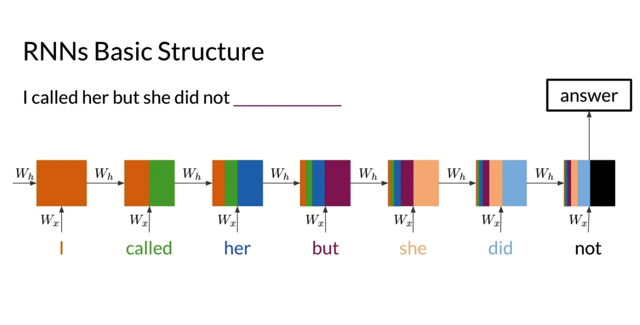</kbd>

> [!NOTE]
> **Mỗi lần tính toán (cho một từ, một time step)** nó sẽ lấy thông
> tin từ trước đó và hiện tại do đó kết quả của từ cần tìm sẽ được
> dựa trên thông tin từ tất cả các từ trong câu giúp tạo ra kết quả
> chính xác hơn N-gram

   

<kbd>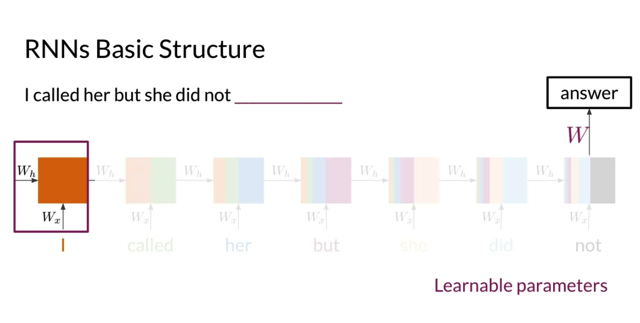</kbd>

> [!NOTE]
> Chữ recurrent là vì các **time-step** đều được **share cùng một
> Wh**, kiểu như tính toán lặp đi lặp lại với input từ time-step trước và
> current word cho đến khi hoàn thành (tìm được từ, hay hoàn thành
> câu)

   

<kbd>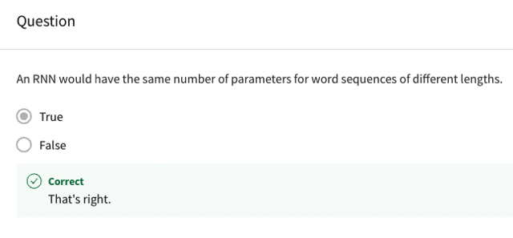</kbd>

   

<kbd>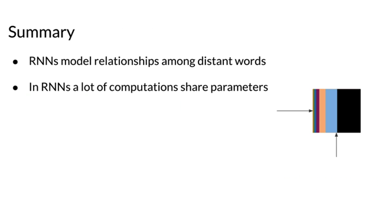</kbd>

   

## Applications Of RNN

 

### 1 **Different tasks in A**I can be **categorized** based on their **input and output nature.**

> [!NOTE]
> 1 **Different tasks in A**I can be **categorized** based on their **input and output nature.**
>
> 2 **One-to-One task**s involve taking a **set of input features** and **returning a single output**.
>
> 3 Fo**r tasks like predicting a team's position on a leaderboard** using **input scores**, a recurrent neural
> network (RNN) isn't significantly different from a conventional neural network.
>
> 4**One-to-Many** tasks involve **taking a single input (e.g., an image)** and **generating multiple outputs (e.g.,
> a caption describing the image).**
>
> 5 **Sentiment analysis** is an example of a**Many-to-One task**, where a **sequence of words is inputted**, and
> the **RNN outputs the sentiment (positive or negative).**
>
> 6**Many-to-Many tasks** involve **multiple inputs and multiple outputs**, such as **machine translation**, where a
> **sequence of words in one language is translated to another language**.
>
> 7 The **encoder-decoder architecture** is commonly **used in machine translation**, with the**encoder capturing
> the overall meaning of the input sentenc**e and the **decoder generating the translated sequence.**
>
> 8 **RNNs** are **powerful architectures** that can be **used to solve various problems in natural language
> processing (NLP)**, including **machine translation and caption generation.**
>
> 9 **RNNs** are **versatile tools**that can be **shaped according to the specific task requirements.**
>
> 10 Choosing the appropriate RNN architecture depends on the task at hand.
>
> 11 The next video will cover a simple recurrent neural network, which can be applied to the different
> architectures discussed.

 

<kbd>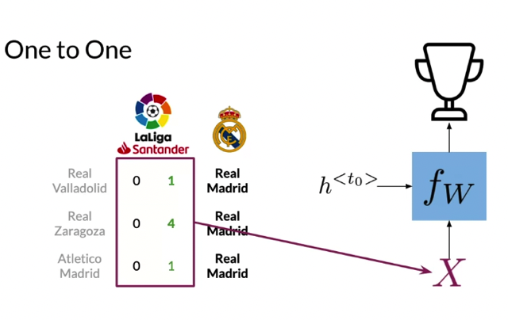</kbd>

   

<kbd>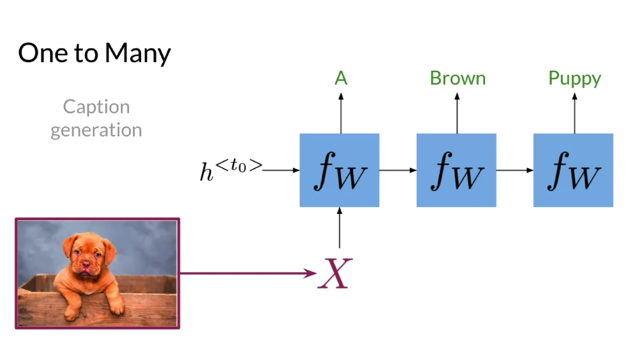</kbd>

   

<kbd>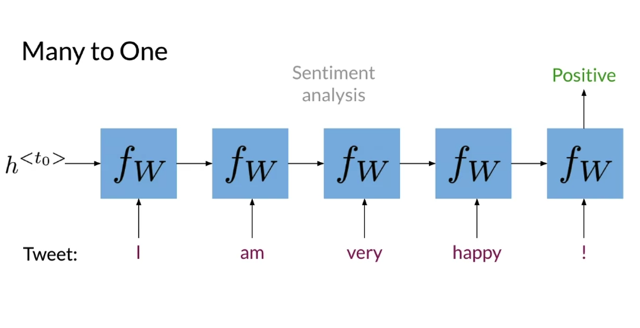</kbd>

   

<kbd>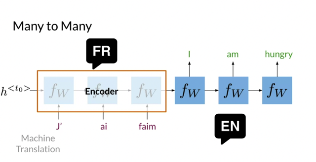</kbd>

<kbd></kbd>

<kbd>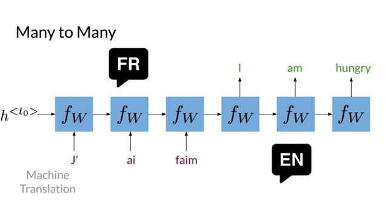</kbd>

   

<kbd>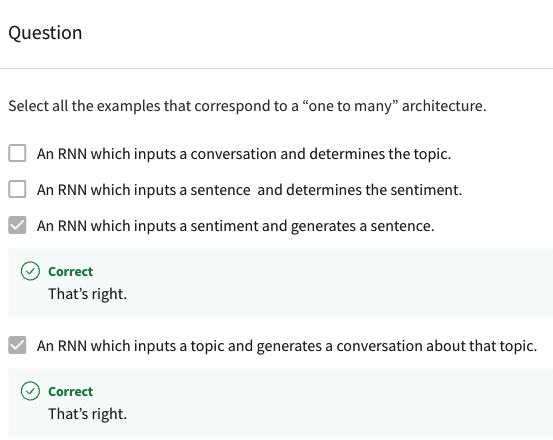</kbd>

   

<kbd>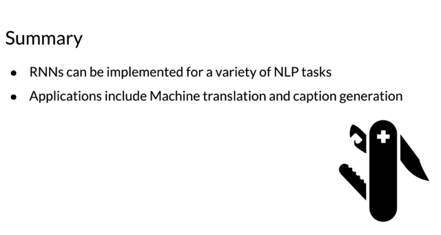</kbd>

   

## Math In RNN

 

### 1 **Recurrent Neural Networks**(RNNs) are **powerful models** for **processing sequential data** and \\*making sequential

> [!NOTE]
> 1 **Recurrent Neural Networks**(RNNs) are **powerful models** for **processing sequential data** and **making sequential
> predictions**.
>
> 2 The computation in a **plain or vanilla RNN** involves taking an **input x**, a**hidden state h**, and producing a
> p**rediction y^** at each**time step <t>**
> 3 The hidden state at each time step is computed using an **activation function g**, which takes the **product of a
> weight matrix Wh** and the previous **hidden state h<t-1>, concatenated with the input
> variable x<t>** and **a bias term bh**
>
> 4 The **prediction y^** is obtained by using an **activation function g** with the **product** of the **hidden state h<t>** and
> another set of parameters **Wy** plus a **bias term by.**
>
> 5 These equations represent the **mathematical operations** performed in a simple RNN.
>
> 7 The hidden states in RNNs enable the **propagation of information through time**, allowing the network to
> **capture dependencies across different positions** **within a sequence.**
>
> 8 Diagrams similar to the one presented in the video are often used in RNN literature to illustrate the
> **computation flow** and **information propagation** within a recurrent unit.
>
> 9 **Hidden states** serve as the **variables that facilitate information propagation in RNNs.**
>
> 10 The video provides an introduction to the forward propagation equations and the concept of hidden states in
> RNNs, with the promise of explaining the cost function in the next video.

 

<kbd>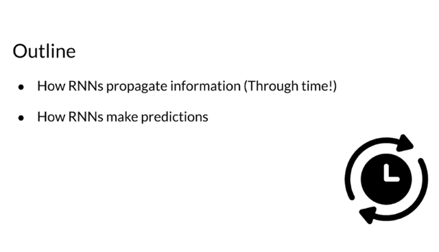</kbd>

   

<kbd>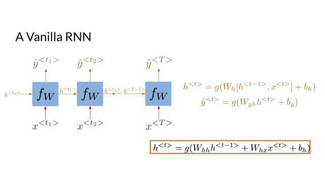</kbd>

> [!NOTE]
> [h<t-1>, x<t>] tức là h<t-1> sẽ được concatenate với x<t> hoặc cũng
> có thể được triển khai ở dạng riêng biệt Whh và Whx mà trong
> DLSpec mr Andrew ghi là Waa và Wax.
>
> Wh chính là Whh (hay Waa) stack theo phương horizontally với Whx
> (hay Wax).
>
> Activation function là tanh hay reLU (DLSpec).
>
> h<t0) hay a<0> theo DLSpec được initialize là Zeros vector

   

<kbd>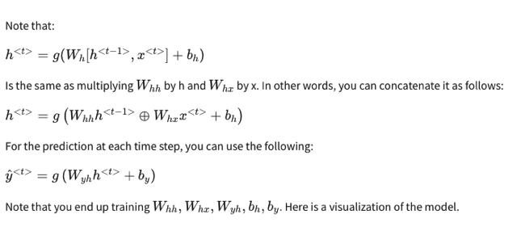</kbd>

   

<kbd>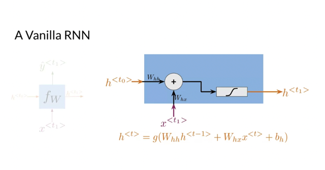</kbd>

> [!NOTE]
> Sơ đồ thể hiện các bước tính
> toán của một RNN unit

   

<kbd>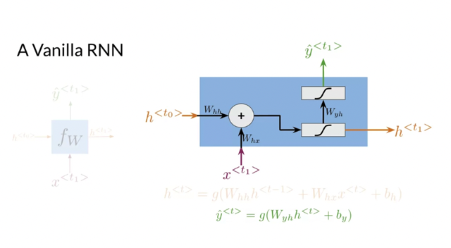</kbd>

   

<kbd>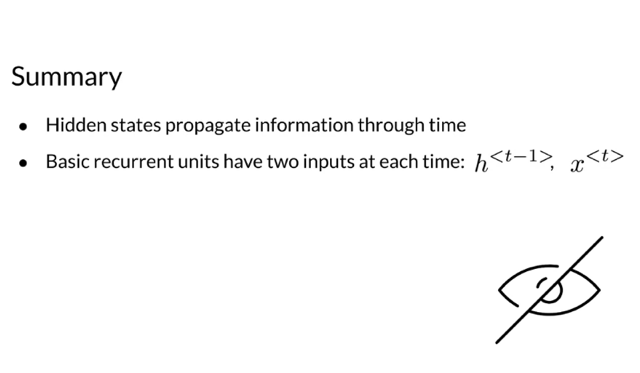</kbd>

> [!NOTE]
> Hidden state h<t> sẽ có vai trò trong việc mang / lưu thông
> tin through time giúp model nắm bắt được các quan hệ của
> các unit / time-step ở xa nhau

   

<kbd>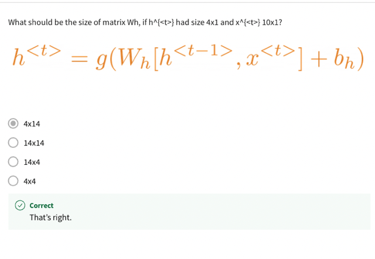</kbd>

> [!NOTE]
> Theo DLSpec ta đã biết h<t-1> sẽ stack theo vertically với
> x<t> nên kết quả là 4+10 x 1 = 14x1. Nên để nhân matrix
> được thì Wh phải là 4x14 hoặc 14x14.

   

## Lab: Hidden State Activation

 

<kbd>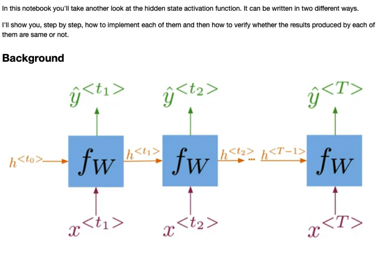</kbd>

 

<kbd>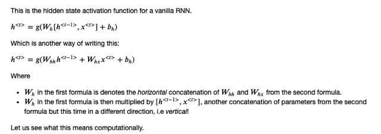</kbd>

> [!NOTE]
> Wh là horizontally stack của Whh và Whx.
> Còn [ h<t-1>, x<t>] là vertically stack của
> h<t-1> và x<t>

 

<kbd>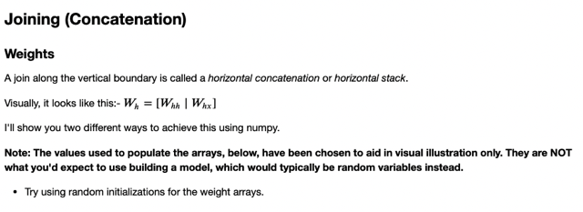</kbd>

 

<kbd>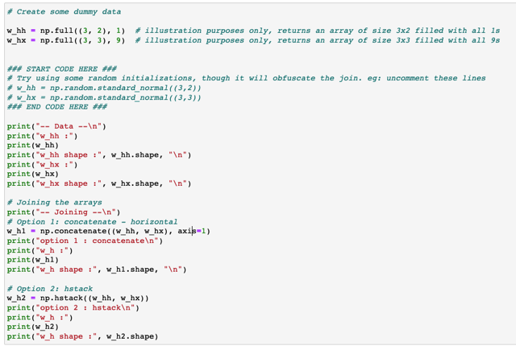</kbd>

> [!NOTE]
> Để horizontally stack ta dùng concatenate ((matrix 1, matrix 2), axis=)
> axis = 1 tức là "concate theo cột" tức là horizontally ||| + || -> |||||
>
> Cách khác là hstack (horizontally stack)

 

<kbd>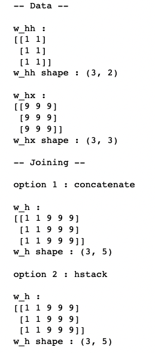</kbd>

 

<kbd>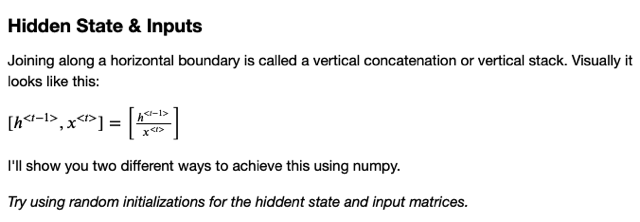</kbd>

> [!NOTE]
> [ h<t-1>, x<t>] là vertically stack của h<t-1> và x<t>

 

<kbd>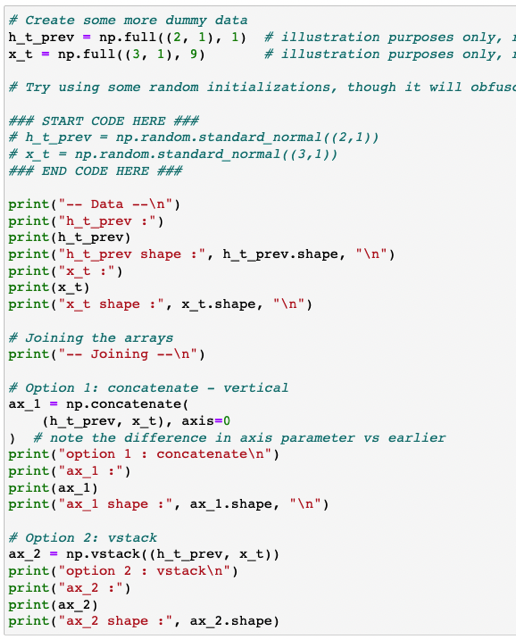</kbd>

> [!NOTE]
> Để vertical stack ta dùng
> concatenate (axis = 0) hoặc vstack()

 

<kbd>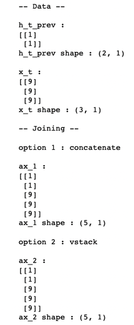</kbd>

 

<kbd>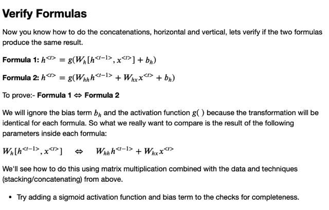</kbd>

> [!NOTE]
> Đại khái là so sánh thử xem có đúng là hai công thức nhân (nhân
> matrix) Wh là horizontlly stack của Whh và Whx với vertically stack của
> h<t-1> và x<t> có chính là tổng của Whh.h<t-1> và Whx.x<t> hay
> không.

 

<kbd>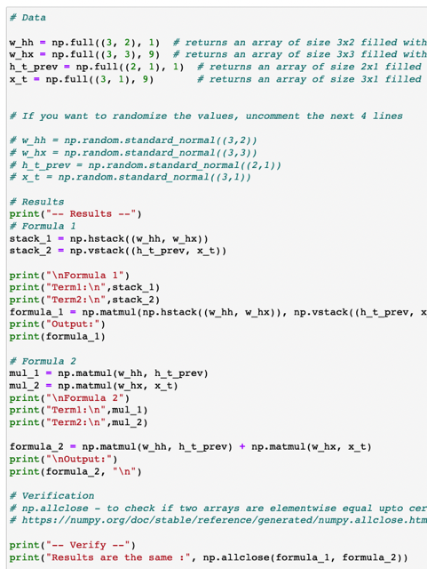</kbd>

 

<kbd>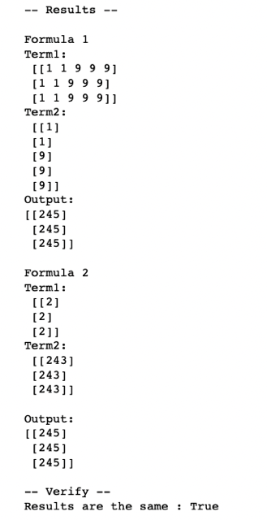</kbd>

> [!NOTE]
> Kết qủa đúng là
> giống nhau

 

### Summary That's it! We've verified that the \\*two formulas

> [!NOTE]
> Summary That's it! We've verified that the **two formulas
> produce the same results**, and seen how to combine
> matrices vertically and horizontally to make that happen.
> We now have all the intuition needed to understand the
> math notation of RNNs.

 

## Cost Function For RNN

 

<kbd>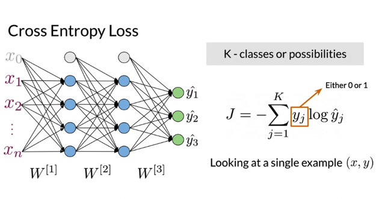</kbd>

> [!NOTE]
> Cross entropy loss là loss function cho bài toán **multi-class classification**
> Ví dụ **y = [1, 0, 0]** - thể hiện **ground-truth label** là con **mèo** trong bộ 3
> class [mèo gà, chó] và **y^ = [y^_1 y^_2 y^_3]**.
>
> Thì loss (cho training example này) sẽ là **- (1*y^_1 + 0*y^_2 + 0*y^3)** = **- y^1**.
>
> Vậy **muốn giảm loss** thì model phải làm sao cho (**- y^_1)** càng nhỏ càng tốt,
> đồng nghĩa **y^_1** **phải** **càng lớn càng tốt.**
>
> Dẫn tới là nó sẽ adjust weight sao cho nó ra **y^ ví dụ = [0.99, 0.005, 0. 005]** để
> predict image là con mèo.
>
> Trong bài toán này, **nếu nó là mèo thì không thể là gà hay chó**, nên label y là
> **[1 0 0] hoặc [0 1 0]** chứ không thể **[1 1 0]** được.
>
> Và**tổng ba giá trị y^_1, y^_2, y^_3 phải = 1** nên layer cuối sẽ chọn **Softmax**
> activation function và cross function sẽ là **Categorical Cross Entropy**
>
> ===Tuy nhiên nếu là bài toán khác, **multi-label classification** === label cho 1
> example y(i) viết gọn là y sẽ là [1 1 1] thì y^ sẽ có thể là [0.99 0.98 0.98] thì
> activation function sẽ là: **Sigmoid** và loss function tương ứng sẽ là **Binary Cross
> Entropy**

 

### So sánh, ôn lại hai bài toán

> [!NOTE]
> So sánh, ôn lại hai bài toán
> Multi-class và Multi-label

 

<kbd>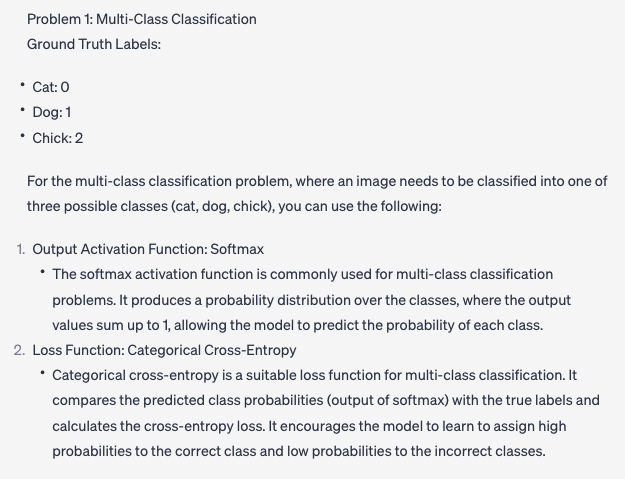</kbd>

   

<kbd>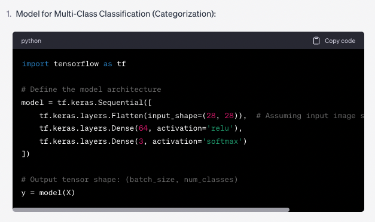</kbd>

   

<kbd>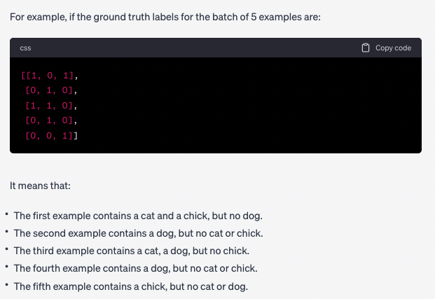</kbd>

   

<kbd>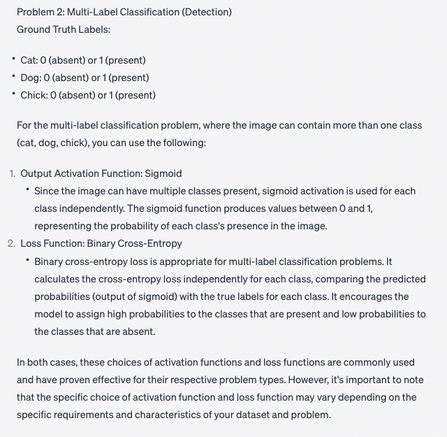</kbd>

   

<kbd>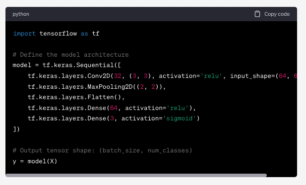</kbd>

   

<kbd>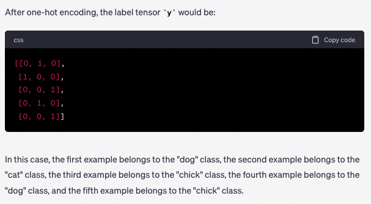</kbd>

   

<kbd>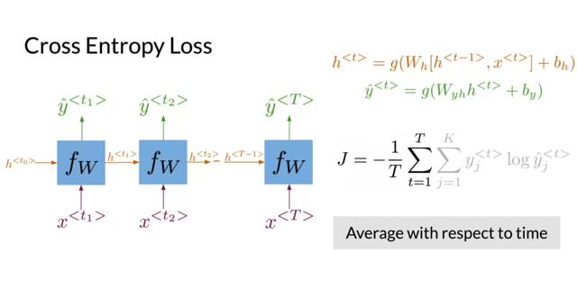</kbd>

> [!NOTE]
> Đối với RNN ta tính trung bình
> loss của các time-step

 

## Implementation Note

 

<kbd>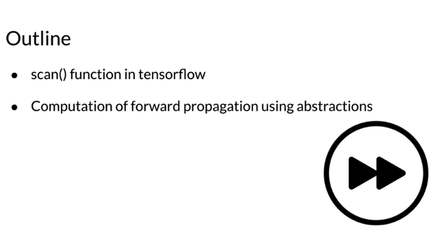</kbd>

 

<kbd>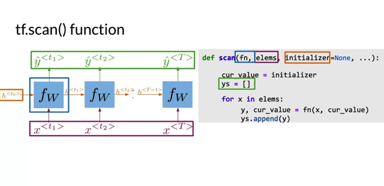</kbd>

> [!NOTE]
> Đại khái là nó như một function bình thường làm cái việc là **loop
> trong tất cả các time-step của sequence** (**elements**, **chính là x**
> tensor) để **tính toán các bước của một RNN unit / time-step** dùng
> function **fn** với input là **x** và **previous hidden state là cur_value** để
> được **y<t> = y và h<t> = cur_value** (hay a<t> trong DLSpec).
>
> **Append** y vào ys là một list chứa các y<t>.
>
> Ổng nói sở dĩ phải có cái scan function như này là kiểu như tạo
> một **abstraction function để TF nó tối ưu bằng cách run trên GPU**

 

<kbd>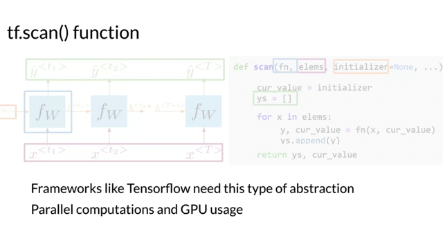</kbd>

 

<kbd>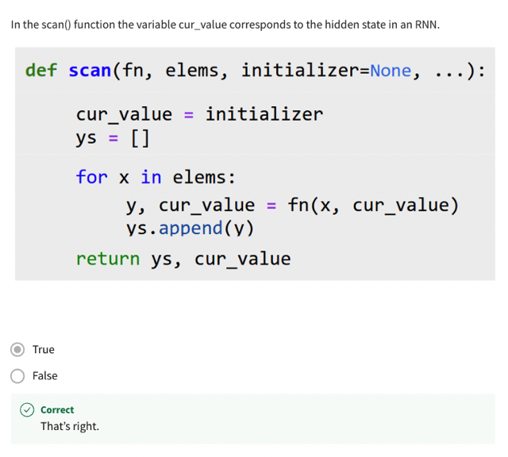</kbd>

 

<kbd>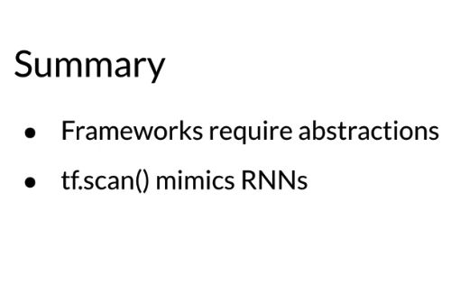</kbd>

 

## Lab: Vanilla RNN, Gru And The Scan

> [!NOTE]
> LAB: VANILLA RNN, GRU AND THE SCAN
> FUNCTION

 

<kbd>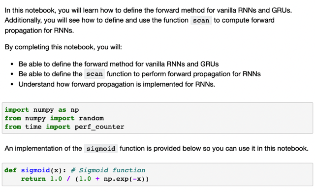</kbd>

 

### Part 1: Forward method for

> [!NOTE]
> Part 1: Forward method for
> vanilla RNNs and GRUs

 

<kbd>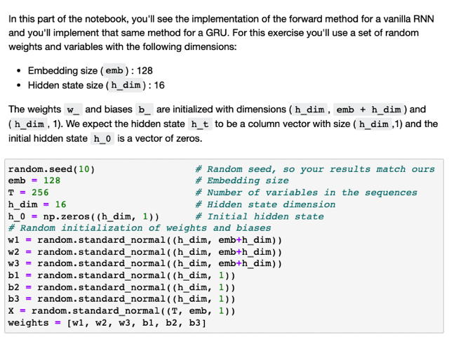</kbd>

> [!NOTE]
> Embedding size (emb) 128 là**size của embedding vector x<t>**
> (Tất nhiên **nếu xử lý một batch** thì x<t> sẽ là (**batch_size, emb**).
> Hidden state size **h_dim** hoặc **(batch_size, h_dim**) là size của
> **h<t> (hay a<t>** theo DLSpec)

   

<kbd>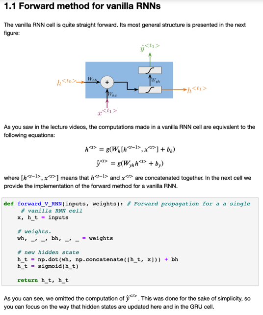</kbd>

> [!NOTE]
> Nhận xét, họ không define axis cho np.
> concatenate như trong DLSpec

   

<kbd>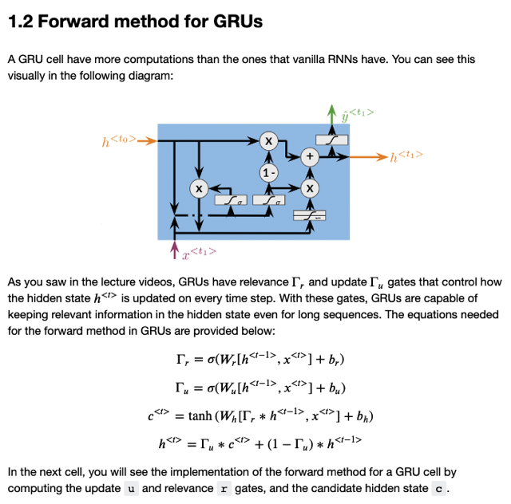</kbd>

> [!NOTE]
> **Reset gate** thì kiểu như cho**phép model quyết định** thông tin của **c<t>**
>  **có cần phải lấy từ previous hidden state h<t-1> hay không**.
> Ta thấy nếu value (của element trong Reset gate tensor) **gần 1**
> tức là **model nhận thấy h<t-1> quan trọng** cần (cùng với x<t>)
> để tính toán c<t>.
> Còn ngược lại, nó sẽ adjust weight để **Reset gate value ~=0**và
> **c<t> sẽ chỉ ảnh hưởng bởi x<t>**
> Có thể thấy **Update gate** trong GRU với sigmoid function sẽ
> khiến **h<t>** **một là giữ bằng hidden state trước h<t-1>** hoặc **bỏ đi
> thay mới bằng c<t>**. Tất nhiên sigmoid cho ra trong khoảng 0,1
> nhưng như Mr Andrew có nói thực tế nó sẽ ~=0 hoặc ~=1 để
> control việc dùng c<t> hay h<t-1>

   

<kbd>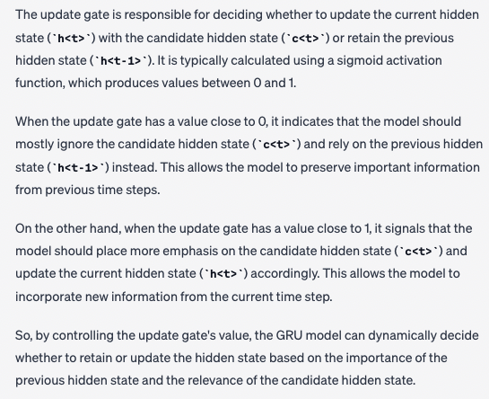</kbd>

> [!NOTE]
> Update gate của RNN

   

<kbd>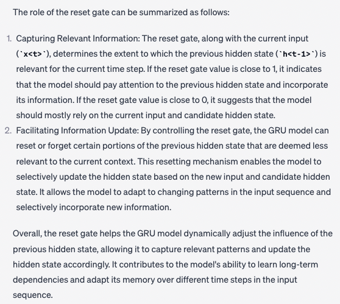</kbd>

> [!NOTE]
> Reset gate

   

<kbd>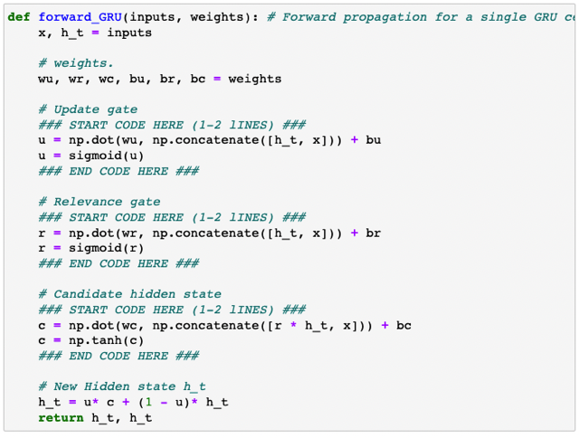</kbd>

   

### Part 2: Implementation of

> [!NOTE]
> Part 2: Implementation of
> the scan function

 

<kbd>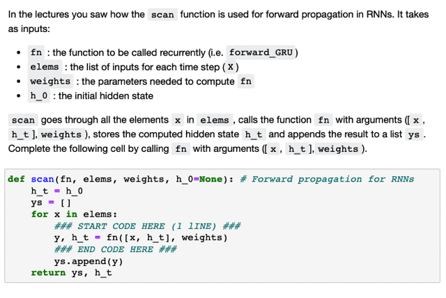</kbd>

   

### Part 3: Comparison between

> [!NOTE]
> Part 3: Comparison between
> vanilla RNNs and GRUs

 

<kbd>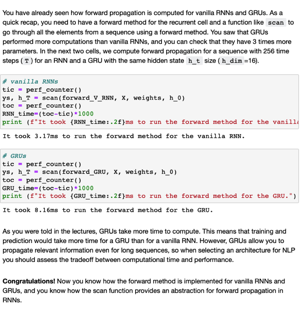</kbd>

> [!NOTE]
> Đại khái là cho thấy **GRU chậm hơn RNN tuy
> nhiên nó cho phép giữ thông tin liên quan cần
> thiết cho long sequence**s.

   

## Lab: Working With Jax Numpy And

> [!NOTE]
> LAB: WORKING WITH JAX NUMPY AND
> CALCULATING PERPLEXITY

 

### Jax numpy

 

<kbd>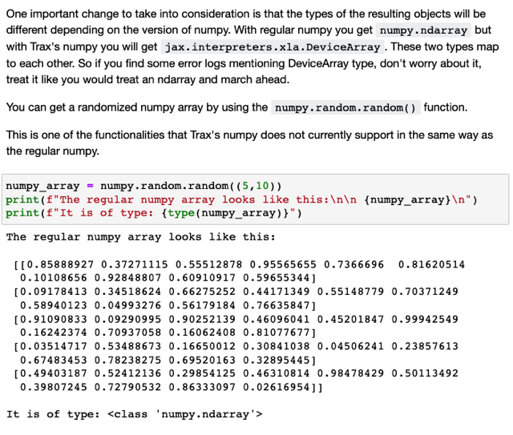</kbd>

   

<kbd>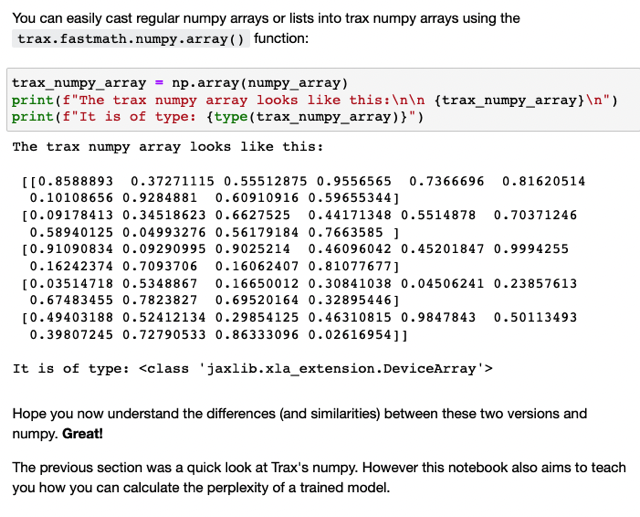</kbd>

   

### Calculating Perplexity

 

<kbd>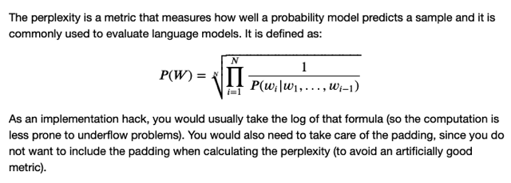</kbd>

> [!NOTE]
> Ôn lại perplexity là metric giúp đánh giá một language model xem khả
> năng nó tạo ra một sample (ví dụ như một câu) có giống thật hay
> không. Ta đã học qua, đại khái là nó tính chỉ số này dựa trên xác suất
> của cái câu mà nó tạo có cao hay không. Công thức của nó như vầy.
> Và để tránh "**underflow problems**" - khi số quá nhỏ, thì người ta
> **thường tính log của Perplexity** thay vì Perplexity.
>
> Theo sự hiểu, language model sau khi đ**ược huấn luyện từ một
> corpus** sẽ học được ... kiểu như **"xác suất của các từ trong corpus"**. Do đó **để test 'năng lực' của model**, người ta sẽ **đưa cho model
> xem một sequence các từ và bảo nó dự đoán từ tiếp theo, rồi so sánh
> nó với kết quả thực.**

   

<kbd>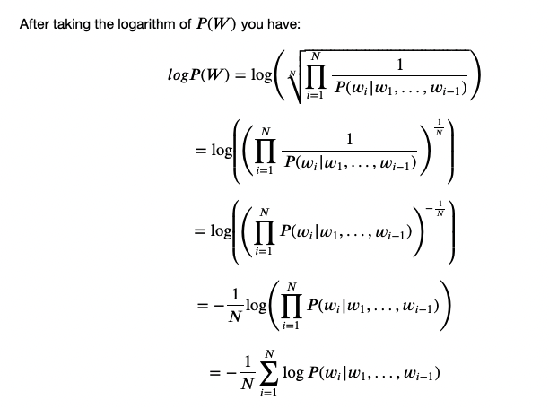</kbd>

> [!NOTE]
> Các biến đổi dưới dựa vào các công thức sau:
>
> 1. căn bậc N của a là a^(1/N)
>
> 2. 1/a là a^-1
>
> 3. (a^(-1))^(1/N) = a^(-1/N) vì (a^b)^c) = a^(b*c).
>
> 4. Log(a^b) = (1/b)*Log(a)
>
> 5. Log(a*b*c) = Log(a) + Log(b) + Log(c)

   

<kbd>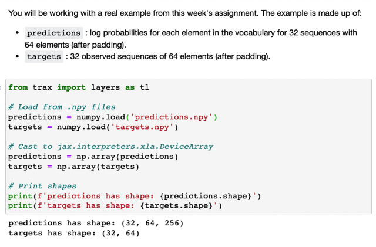</kbd>

> [!NOTE]
> Đại khái là bài toán của mình sắp tới sẽ là **dùng RNN hay GRU để build một
> language model**, trong đó model sẽ **predict một sequence** (hoặc chính xác
> hơn là **một** **batch các sequence**).
>
> Tất nhiên **ground truth label cũng là môt sequence hay batch các sequence**.
> Ở đây là một kiểu như **cho ví dụ một "bộ" predictions và label**. **Batch size là
> 32**, chiều dài **sequence là 64**. Tuy nhiên để ý predictions có shape là (32 x
> 64 x **256)**
>
> Cái dimension cuối là bởi vì, model không **"một phát" cho ra luôn "từ thứ nhất
> là 5 (**ứng với từ thứ 5 trong vocab là "I" ví dụ vậy), **từ thứ hai là 7**, **từ thứ
> ba là 11**... để rồi một prediction **y^(i)** của nó có dạng **[5 7 11 ...**]
>
> Mà thay vào đó, **tại mỗi vị trí,** nó sẽ cho ra**một array/vector các giá trị xác
> suất** của **các từ trong vocab**, t**ổng các giá trị p này sẽ bằng 1** và để kết
> luận ta sẽ **lấy từ tương ứng với vị trí có p lớn nhất.**
>
> Và ở đây ví dụ vocab có **256 từ. Đó là lí do predictions có shape như vậy**Nói thêm chút xíu không ảnh hưởng đó là, ở ví dụ này, **predictions chứa log
> probabilities** chứ **không phải thuần tuý probabilities**.  Do đó các giá trị của
> y^(i)<1> prediction của example i, tại time-step (từ) thứ 1 sẽ là **một array có tổng
> không bằng 1 (vì là log của prob) chứ không phải prob**

   

<kbd>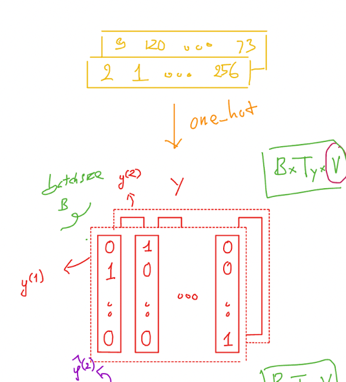</kbd>

<kbd></kbd>

<kbd>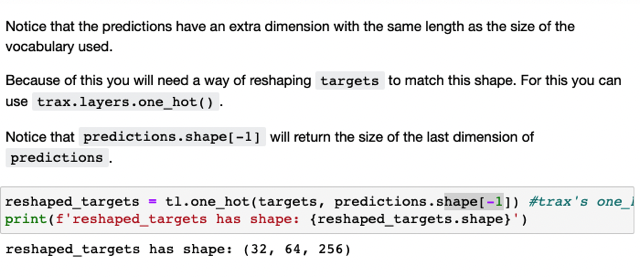</kbd>

> [!NOTE]
> Vậy thì, nói về **y**, có dạng một **tensor shape:** **m example x số từ
> trong sequence** ví dụ **y(1) có thể là [5 120 4 ...]** thể hiện **câu đúng
> của training example x(1) là [Anh muốn ăn cơm]** trong đó **'Anh' là từ
> thứ 5 trong vocab**, **'muốn' là từ thứ 120**...
>
> Muốn đưa vào model **để tính loss thì cũng phải biến ' Anh', 'muốn',...
> thành one-hot vector** có **độ dài bằng vocab size = 256,** như ta đã biết
> số 1 trong vector sẽ nằm tại index của từ 'Anh' trong vocab.
>
> Do đó ở đây giới thiệu function **tl.one_hot** để **thực hiện việc one-hot
> encoding này**. Người ta dùng **predictions.shape[-1]** để **lấy giá trị của
> last dimension** của predictions chính là **256**. Có thể cho tiện, **thay vì
> phải hard code là 256, hay một variable vocab size nào đó**

   

<kbd>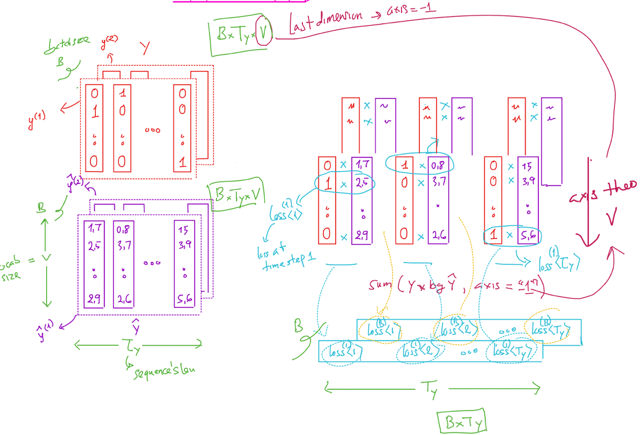</kbd>

<kbd></kbd>

<kbd>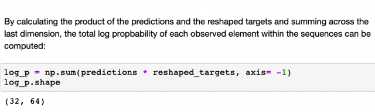</kbd>

> [!NOTE]
> Khúc này là nói về việc **tính log perplexity** theo công thức đây **rất giống
> cách tính loss function**. Hình vẽ lý giải tại sao axis = -1 và log_p sẽ là
> tensor batch_size (32) x Ty (64)

   

<kbd>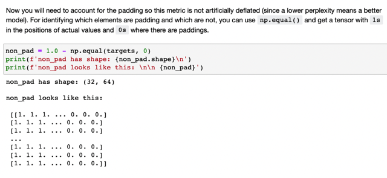</kbd>

> [!NOTE]
> Đại khái là **target** như ta nói ở trên **batch (32) x sequence_len
> (64)** khi chưa sử lý one-hot sẽ **có giá trị là index của từ đúng trong
> vocab**. Và **chỗ nào = 0 tức là padding** bởi **zeros padding**.
>
> Ví dụ câu **"I love you"** sẽ thành **[159 23 241 0 0 0 ...0]**với **3 vị
> trí đầu tiên** là **index của từ I, love, you trong vocab**, còn lại **fill 0
> vào cho đủ sequence_len**.
>
> Hiểu vậy rồi thì dễ hiểu tại sao nó tính cái **non_pad** như bên dưới.
> Mục đích của **non_pad có shape là (32x64)** sẽ là cái **filter để nhân
> nó với matrix log sẽ bỏ đi những log của padding**

   

<kbd>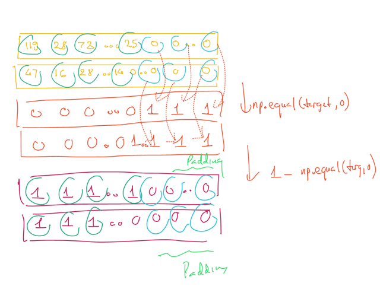</kbd>

   

<kbd>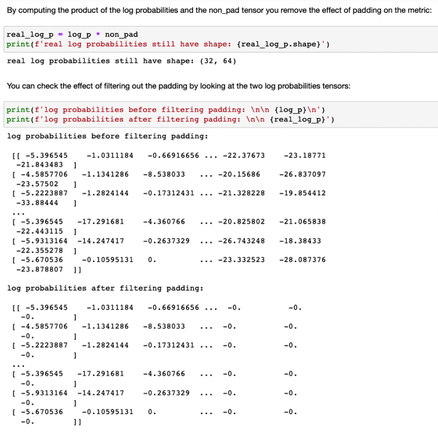</kbd>

> [!NOTE]
> Nhân với log_p để bỏ đi các effect của padding

   

<kbd>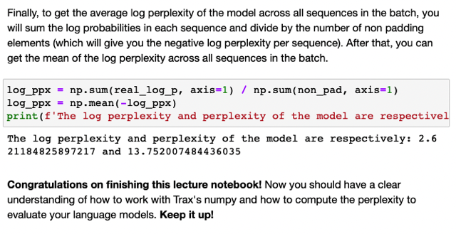</kbd>

> [!NOTE]
> Chỗ này lạ nè, tính perplexity nhìn giống như tính loss
> vậy. Chưa hiểu lắm. Nhưng cứ theo đó mà tính

   

<kbd>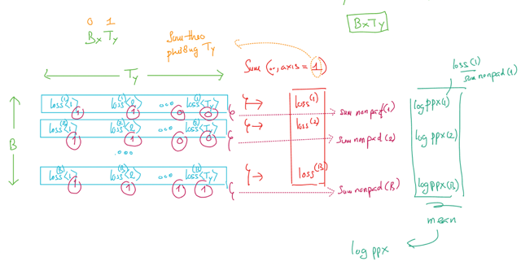</kbd>

   

<kbd>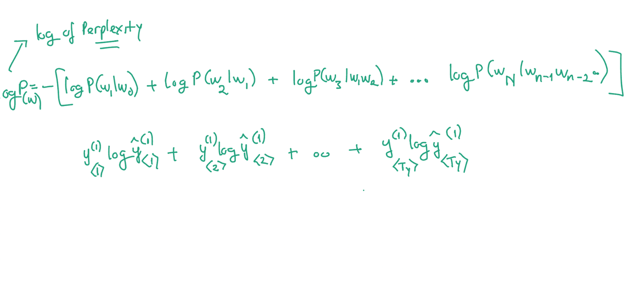</kbd>

> [!NOTE]
> Chưa hiểu những mang máng hiểu (tại sao tính perplexity lại như vậy) .
> Giả sử tại một từ có G.T là [0 1 0 0] model predict ra là [a b c d] thì để P
> cao thì b phải cao, không việc nhân với y sẽ khiến trong loss function chỉ
> quan tâm đến b, và muốn giảm loss thì b phải cao lên = tăng khả năng
> đoán đúng. Và ở khía cạnh đánh giá bằng Perplexity, model có muốn có
> Perplexity cao thì cũng phải cho ra con số b cao. Ý nói logic giống nhau,
> khi dùng ylogy^ để xây dựng loss function cũng như là perplexity score.

   

<kbd>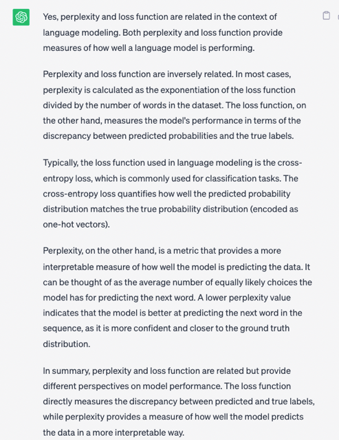</kbd>

   

## Gru - Gated Recurrent Units

 

<kbd>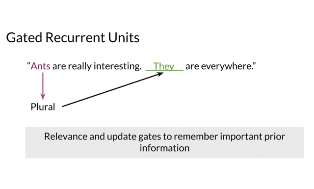</kbd>

 

<kbd>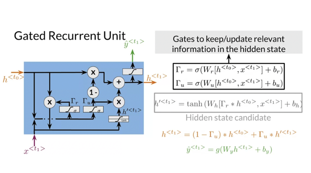</kbd>

> [!NOTE]
> 1 Vanilla RNNs are powerful but suffer from the **vanishing information problem** for
> **long sequences.**
>
> 2 Gated Recurrent Units (GRUs) are **more complex models** that can **handle long
> sequences effectively.**
>
> 3 GRUs **allow relevant information to be preserved** in the**hidden state** over **long
> sequences.**
>
> 4 GRUs can be used for tasks such as predicting missing words in a sentence
> based on context.
>
> 5 GRUs use **relevance** and**update gates** to **control the flow of information in the
> hidden state**.
>
> 6 GRUs are an extension of vanilla RNNs with additional computations.
>
> 7 GRUs take inputs of the current variable (X) and the previous hidden state (h)
> at each time step.
>
> 8 **Relevance gates (Gamma subscript r)** and **update gates (Gamma subscript u)**
> are computed using **sigmoid activation functions**.
>
> 9 **Relevance gates** determine **which information from previous hidden states is
> relevant**.
>
> 10 A **candidate hidden state (h prime)** is computed based on the**previous hidden
> state and the relevance gates.**
>
> 11 A n**ew hidden state** is calculated using the **previous hidden stat**e, **candidate
> hidden state, and update gates.**
>
> 12 **Update gate**s determine h**ow much information from the  previous hidden state
> will be overwritten.**
> 13 A prediction (y hat) is computed using the current hidden state.
>
> 14 GRUs overcome the vanishing information problem and allow for better
> long-term dependency modeling compared to vanilla RNNs.

> [!NOTE]
> Có nói trong DLSpec, nói lại cho nhớ rõ không thừa. Điểm quan trọng
> thứ nhất chính là **Relevant gate** (trong DLSpec mình note là
> **Reset gate**, cũng không sai) cho phép model **đánh giá sự "
> relevant" của các thông tin trước đó h<t0> với thông tin đưa vào hiện
> tại x<t1>** để quyết định sẽ **có hay không nhiều hay ít phần thông tin
> trước đó để kết hợp với thông tin hiện tại để tính ra h'<t1>** tạm gọi là
> **candidate cho hidden state** ở time-step hiện tại.
>
> Và **Update gate** sẽ q**uyết định phần thông tin nào là lấy từ
> candidate này hay từ previous hidden state.** Tức ở đây nó sẽ **dùng
> cả relevant gate và update gate** để **cân nhắc kết hợp thông tin cũ
> và mới dựa theo sự liên quan**.

 

<kbd>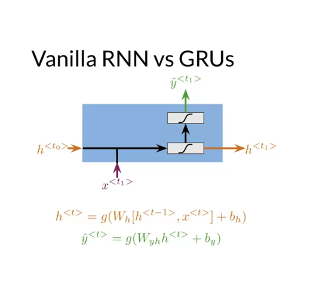</kbd>

> [!NOTE]
> Remember that a **vanilla RNN** such as this one computes an activation function
> with the previous hidden states and currents variable X's parameters to get the
> current hidden state. With the current hidden state, another activation function
> is computed to get the current prediction y hat. **This architecture is updating the
> hidden state at every time step, for long sequences, the information tends to
> vanish**. This is one cause of the so-called vanishing gradients problem.

 

<kbd>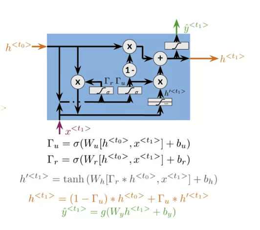</kbd>

 

<kbd>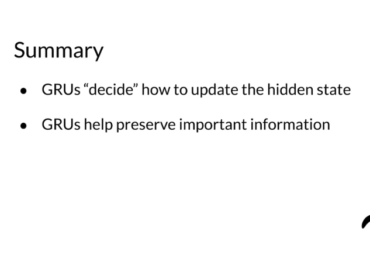</kbd>

 

## Lab: Creating A Gru Model Using Trax

 

<kbd>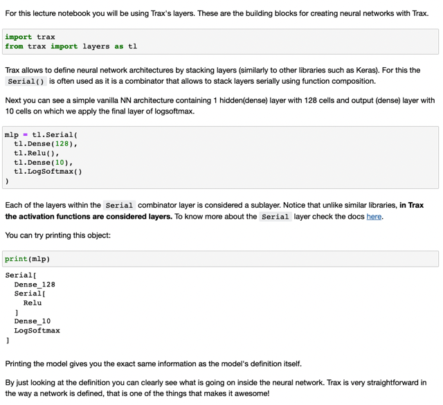</kbd>

> [!NOTE]
> Đại khái ngắn gọn là minh hoạ **một simple Vanilla neural network
> define với Trax dùng Serial layers combinator**. Trong Trax thì
> **activation function cũng là một layer riêng biệt**. Và cuối cùng nói
> **Trax rất dễ hiểu**, lệnh **print model** sẽ **cho ra ngay cấu trúc
> của model define thế nào thì thấy thế đó** không lòng vòng giấu
> diếm

 

<kbd>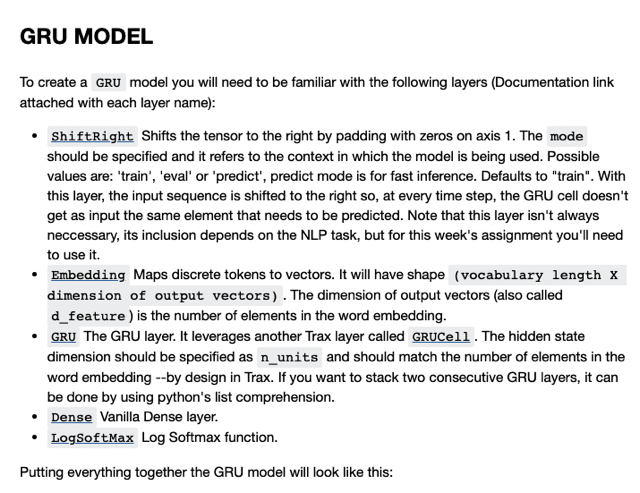</kbd>

 

<kbd>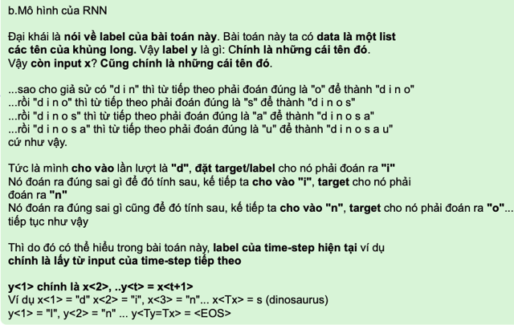</kbd>

<kbd></kbd>

<kbd>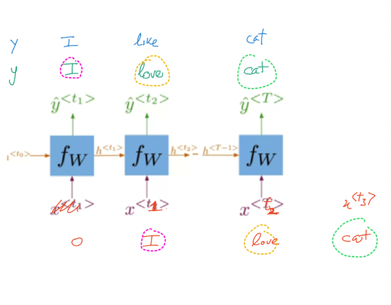</kbd>

> [!NOTE]
> Giải thích ShiftRight: Tương tự bài toán tạo ra tên khủng long ở DLSpec.
> Nhưng ở đây ta không tự làm quá trình loop (forward) nên không làm như
> trong bài toán đó trong đó define **y<t> = x<t+1>** mà ta sẽ dùng **ShiftRight
> layer n_shifts = 1**. Nói **ngắn gọn lại** cho mục đích của việc này là **để
> model predict một time-step y^<t>** dựa vào **những từ / kí tự trước đó**. Do
> đó ban đầu (time-step 1, chưa có gì), thì đương nhiên phải input vào model
> (x<1>) để predict phải là "chưa có gì", tức x<t> phải = 0. Và ta làm vậy bằng
> cách insert một số 0 vào vị trí đầu của tensor x. Chứ nếu không ShiftRight
> hoá ra model predict lại nhận / dựa vào chữ đầu tiên để predict ra chữ đầu
> tiên à? (Như trong tên khủng long, nhận chữ d rồi predict chữ d thì rõ ràng là
> không đúng)

 

<kbd>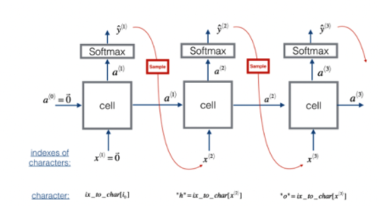</kbd>

<kbd></kbd>

<kbd>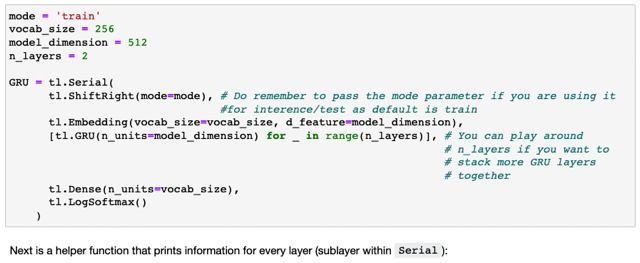</kbd>

> [!NOTE]
> Define một GRU network, lí do **Dense layer có n_units = vocab_size**
> là vì cái này là họ kiểu như nói trước (hướng dẫn) về bài toán dự đoán kí
> tự / generate chuỗi kí tự trong P.A. tương tự như trong bài toán generate
> tên khủng long của DLSpec, trong đó ta tạo một RNN học các pattern
> trong tên khủng long bằng một bộ data tên khủng long. để khi training
> xong, sampling từ model để có tên khủng long mới để mà đặt cho một
> loại khủng long mới phát hiện.
>
> Và **activation z<t> của mỗi time-step tính từ hidden state là một vector
> có size bằng vocab size** (cho dù là bài toán ở cấp kí tự, cũng gọi là
> vocab size),**gọi là logit.**
>
> Và **cái softmax tính với z<t> sẽ cho ra output y<t>**, đương nhiên là
> một **vector dài vocab size, chứa các chỉ số probability score của các kí
> tự**, để rồi cái nào có**p cao nhất sẽ là cái được chọn.** Thì ở đây, **họ còn
> cho z<t> qua một Fully Connected layer trước khi qua softmax** nên có
> thể hiển**độ dài của output từ F.C layer cũng phải bằng vocab size,** do đó
> **số hidden unit của F.C (hay Dense) layer cũng bằng vocab size là
> vậy**.

 

<kbd>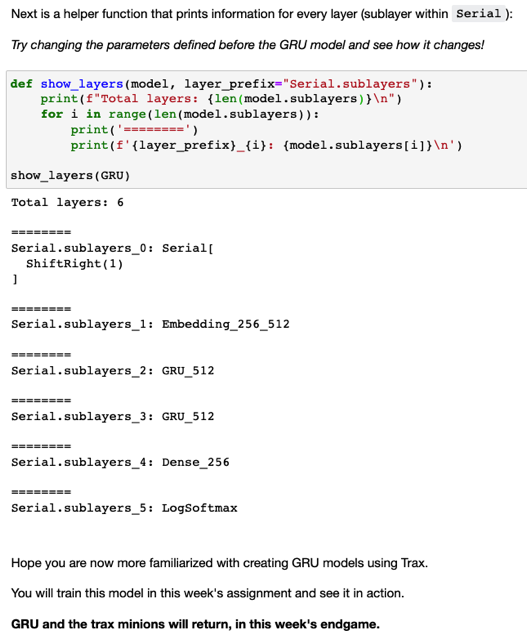</kbd>

> [!NOTE]
> một helper function giúp print
> các layer của model (access
> bằng model.sublayers)

 

## Deep And Bi-directional Rnns

 

### 1 **Deep recurrent neural networks (RNNs)** are useful for \\*capturing dependencies that shallow

> [!NOTE]
> 1 **Deep recurrent neural networks (RNNs)** are useful for **capturing dependencies that shallow
> RNNs cannot capture.**
>
> 2 Equations used in implementing deep RNNs and their relation to the cost function are explained.
>
> 3 Bidirectional neural networks and their importance are introduced.
>
> 4 **Bidirectional RNNs** **propagate information both from the beginning to the end of a sequence** and
> f**rom the end to the beginning**, allowing predictions to be made for missing information.
>
> 5 Bidirectional RNNs are r**epresented as acyclic graphs**where information**flows independently in
> both directions.**
>
> 6 Computation of **hidden states** and **predictions** in a bidirectional RNN involves **propagating
> information from both direction**s.
>
> 7 **Deep RNNs**consist of **multiple hidden layers,** similar to **regular deep neural networks**.
>
> 8 Information**flows through time in deep RNNs**, followed by **propagation through the layers** to
> obtain predictions.
>
> 9 Bidirectional RNNs and deep RNNs are **variations** of the **vanilla RNN model**, offering **more
> complex capabilities.**
>
> 10 The passage concludes by summarizing the topics covered: RNNs, gated recurrent units,
> bidirectional RNNs, and deep RNNs. It mentions that in the assignments, learners will have the
> opportunity to work with RNNs and understand their implementation.

 

<kbd>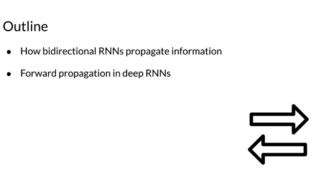</kbd>

   

<kbd>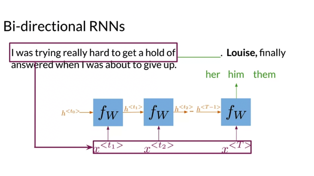</kbd>

> [!NOTE]
> An RNN that's **propagates information**from the **beginning to the end**of sequences, would be able to make a prediction tool. It would **take
> the words before the blank as inputs** and **do its best to predict the
> missing word**. However, because **Louise** **doesn't appear until the
> beginning of the next sentenc**e, it would have to guess between **her,
> him and them**

> [!NOTE]
> Như đã biết từ DLSpec, bài toán như thế này sẽ không
> giải quyết được bằng uni-directional RNN vì thông tin
> quan trọng cần thiết lại nằm ở sau.

   

<kbd>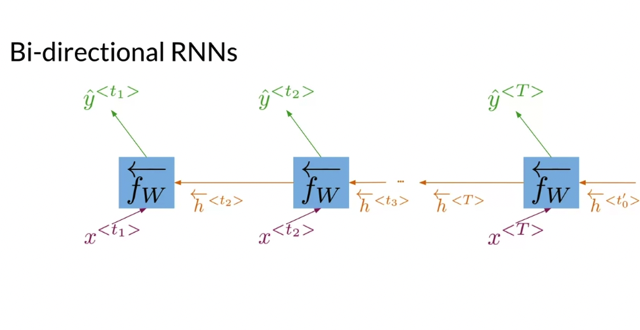</kbd>

<kbd></kbd>

<kbd>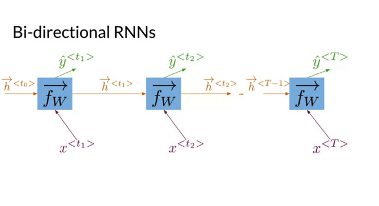</kbd>

> [!NOTE]
> Thì nếu 'làm' ở chiều ngược lại bắt đầu với
> zeros và tính với các time-step từ T đến t1.
> Hoàn toàn tương tự.

   

<kbd>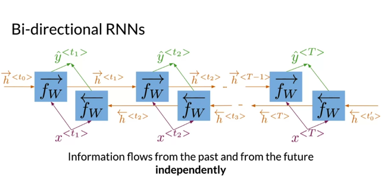</kbd>

> [!NOTE]
> Và bi-directional RNNs sẽ combine
> cả hai chiều đi và về lại.

   

<kbd>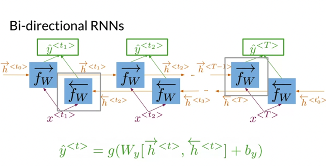</kbd>

> [!NOTE]
> và prediction y^<t> sẽ được tính
> từ combination cả hidden state
> <t> ở cả hai chiều.

   

<kbd>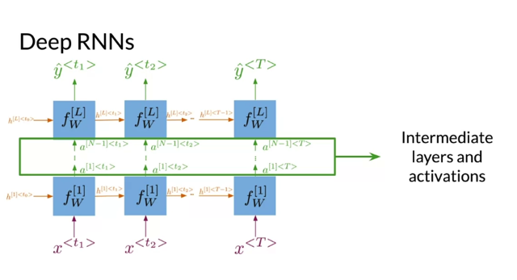</kbd>

> [!NOTE]
> Deep RNNs sẽ stack các RNNs lại với nhau, thay vì dùng
> Wy tính y^ từ hidden state h<t>, nó sẽ có Wa để tính a<t>
> từ h<t> và dùng a<t> bỏ vào thay cho x của RNNs layer tiếp
> theo.

   

<kbd>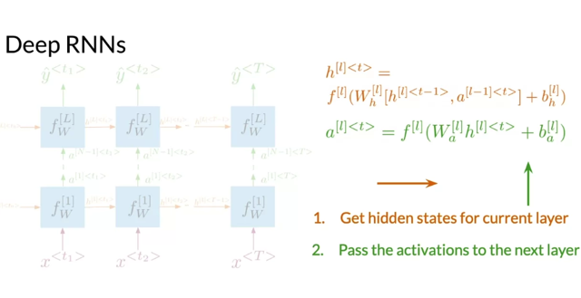</kbd>

   

<kbd>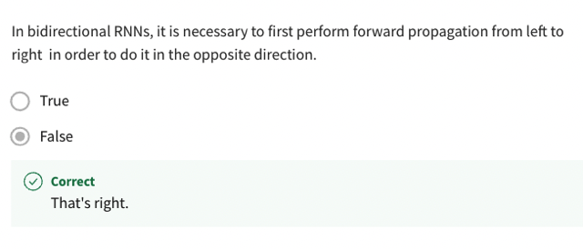</kbd>

   

<kbd>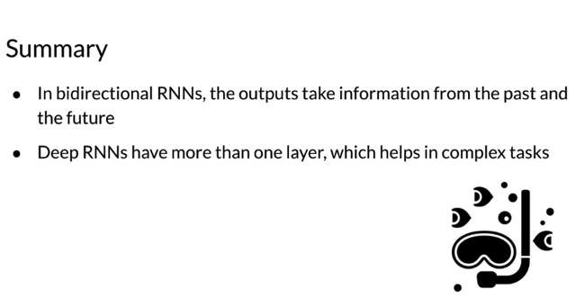</kbd>

   

## Week Conclusion

 

## Quiz

 

<kbd>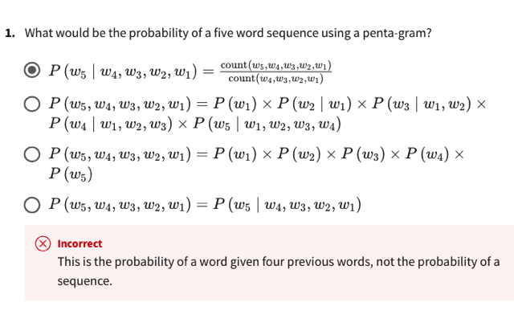</kbd>

 

<kbd>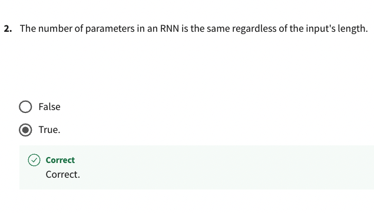</kbd>

 

<kbd>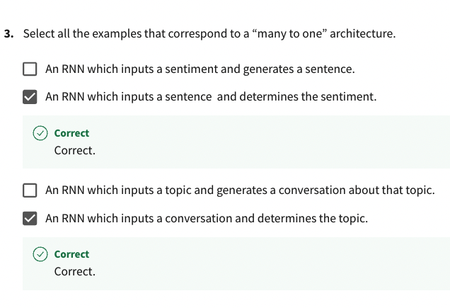</kbd>

 

<kbd>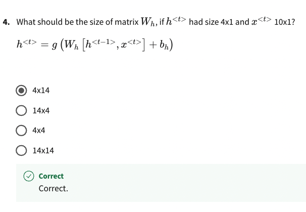</kbd>

 

<kbd>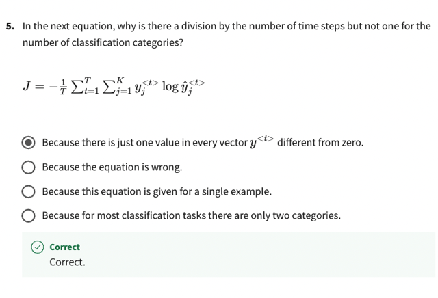</kbd>

> [!NOTE]
> Ý là mỗi từ cần dự đoán tại một time-step chỉ có 1 đáp án đúng chứ
> không phải nhiều đáp án đúng. Nếu nhiều đáp án đúng, hay y<t> là
> multi-hot vector, thì phải tính loss trung bình của nhiều class tại time-step
> đó. Còn phải chia T là vì để tính trung bình loss trên tất cả các time-step
> mới có thể coi là loss của model trên training example x(i). Mỗi time-step
> predict ra một từ, nó cho ra y^(i)<t> là một probability scores vector, để
> so vối y(i)<t> được loss trên time-step <t>. Và loss tính trung trên toàn
> time-step là loss trên training example đó

 

<kbd>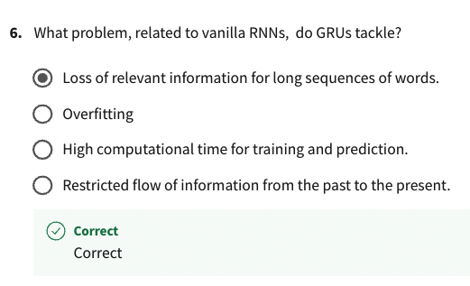</kbd>

 

<kbd>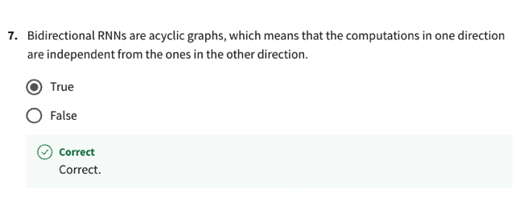</kbd>

 

<kbd>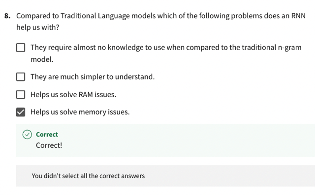</kbd>

 

<kbd>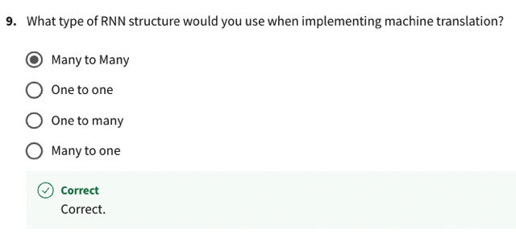</kbd>

 

<kbd>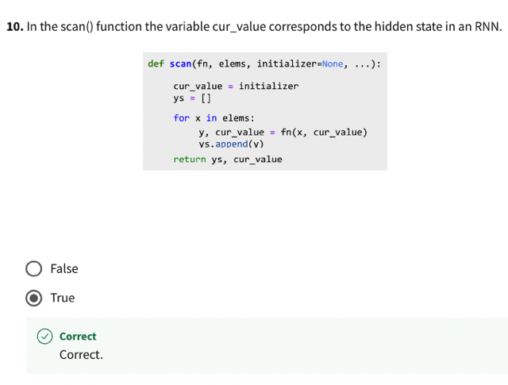</kbd>

 

## P.a Deep N-grams

 

### Welcome to the second assignment of course 3. In this assignment you will explore

> [!NOTE]
> Welcome to the second assignment of course 3. In this assignment you will explore 
> **Recurrent Neural Networks RNN**.
>
>  • You will be using the fundamentals of google's \\_**trax**\\_ package to implement any 
> kind of deeplearning model.
>
> By completing this assignment, you will learn how to implement models from scratch:
>  • How to **convert a line of text** into a **tensor**
>  • **Create an iterator** to **feed data to the model**
>  • Define a **GRU** **model** using **trax**
>  • **Train the model** using **trax**
>  • **Compute the accuracy** of your model using the **perplexity**
>  • **Predict** using your own model

 

- Overview
   

  
  - Your task will be to **predict the next set of characters** using the **previous characters.**  • Although this task **sounds simple**, it is **pretty useful.**  • You will start by **converting a line of text** into a **tensor**  • Then you will **create a generator** to **feed data into the model**  • You will **train a neural network** in order to **predict the new set of characters** of  defined length.  • You will **use embeddings** for each character and **feed them as inputs** to your  model.  ▪ Many **natural language task**s rely on **using embeddings for predictions.**  • Your model will **convert each character to its embedding**, run the embeddings  through a **Gated Recurrent Unit GRU**, and **run it through a linear layer** to predict the next  set of characters.
    > [!NOTE]
    > Đại khái là bài toán **predict một chuỗi kí tự** dựa trên **những kí tự
    > trước đó,** qua đó học được **cách "chuẩn bị" chuỗi kí tự thành một
    > tensor**, tạo một **generator để feed data vào model,** **xây dựng
    > và train một GRU neural network** dùng **trax** cũng như là làm việc
    > với **embedding**.

     

      
      
<kbd>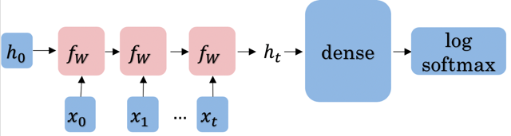</kbd>

       

    
    - The figure above gives you a summary of what you are about to implement.  • You will **get the embeddings**;  • **Stack the embeddings on top of each other**;  • Run them through **two layers** with a **relu activation** in the middle;  • Finally, you will **compute the softmax**.  To predict the next character:   • **Use the softmax output**and **identify the word** with the**highest probability.** • The word with the highest probability is the prediction for the next word.
       

        
        
<kbd>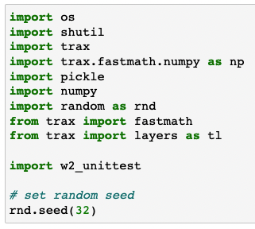</kbd>

         

- 1 - Importing the Data
   

- 1.1 - Loading in the Data
   

  
  - Now **import the dataset** and do some **processing**.  • The dataset has **one sentence per line.**  • You will be **doing character generation**, so you have to process each sentence  by **converting each character (and not word) to a number.**  • You will use the **ord** function to c**onvert a unique character** to a**unique integer  ID.**  • **Store** **each line** in a **list**.  • Create a **data generator** that takes in the **batch_size** and the **max_length**.  ▪ The **max_length** corresponds to the **maximum length of the sentence**.
     

      
      
<kbd>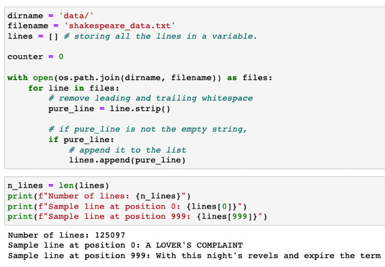</kbd>

      > [!NOTE]
      > **Define path** và **filename** để**open file, load data** bỏ
      > đi khoảng trống đầu cuối câu và **add vào lines -
      > dạng một list các sentence.**

       

      
      
<kbd>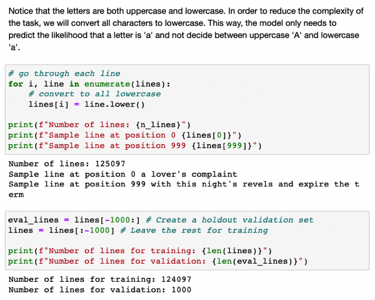</kbd>

      > [!NOTE]
      > **lowercase hết**, và chia ra thành **hai bộ**: **training**
      > set và **validation** set. Validation set lấy **1000 item
      > (sentence | text) cuối cùng** (**[-1000:]**) còn lại là training set.

       

- 1.2 - Convert a Line to Tensor
   

    
    
<kbd>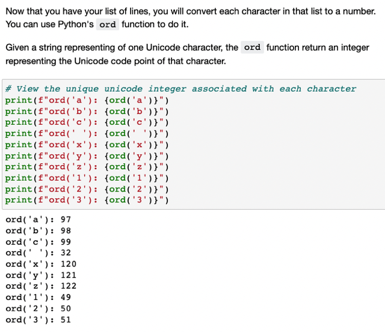</kbd>

    > [!NOTE]
    > Đại khái là ta sẽ **convert từng character thành
    > number** dùng function **ord**() của Python
    > giúp làm việc này. Nó sẽ **biến kí tự** thành
    > **unicode integer tương ứng.**

     

- Exercise 1 - line_to_tensor (UNQ_C1)
   

  
  - **Instructions:** **Write a function** that **takes in a single line** and **transforms each character**  into **its unicode integer.** This returns **a list of integers**, which we'll refer to as a **tensor**.  • Use a **special integer** to represent the **end of the sentence** (the end of the line).  • This will be the **EOS_int** (end of sentence integer) parameter of the function.  • Include the **EOS_int**as the **last integer** of the  • For this exercise, you will **use the number 1** to **represent the end of a  sentence.**
    > [!NOTE]
    > Đại khái là **viết một function** nhận một **single line of text** và "
    > chuyển" **character của nó** thành **unicode** integer và **thêm một
    > con số đặc biệt**đóng vai trò đại diện cho **End of Sentence**,
    > mà ở đây sẽ dùng số **1**.

     

      
      
<kbd>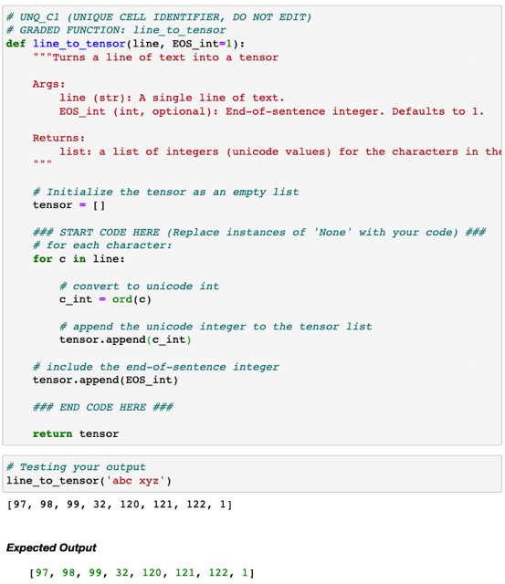</kbd>

       

- 1.3 - Batch Generator
   

  
  - Most of the time in **Natural Language Processing**, and **AI** in general we use **batches** when  training our data sets. Here, you will **build a data generator** that **takes in a text** and  r**eturns a batch of text lines** (lines are **sentences**).   • The **generator** converts **text lines** (sentences) into n**umpy arrays of integers**  **padded by zeros** so that **all arrays have the same length**, which is the **length of the  longest sentence** in the entire data set.  Once you create the generator, you can**iterate on it**like this: **next(data_generator)**  This generator r**eturns the data** in a **format** that you could **directly use in your model** when  computing the **feed-forward of your algorithm**. This iterator returns a **batch of lines** and  **per token mask**. The batch is a tuple of three parts: **inputs**, **targets**, **mask**. The **inputs** and  **targets** are **identical**. The **second column** will be u**sed to evaluate your predictions**. **Mask  is 1 for non-padding tokens.**
    > [!NOTE]
    > Đại khái là thường trong ML và NLP model sẽ "xử lý" từng batch nhiều training
    > sample thay vì chỉ một mỗi lần. Mình sẽ viết một function đóng vai trò là một
    > generator nhận một đoạn text và xử lý sao cho trả về nhiều list (arrays) các tensor,
    > mỗi tensor như nói ở trên là một list các integer đại diện cho character mà bên trên ta
    > đã làm. Function này sẽ dùng một keyword đặc biệt là yield thay vì return mà ta đã
    > biết để có thể giống như trả kết quả về từng batch theo yêu cầu - cho phép có thể "
    > iterate" trong function.
    >
    > Trong function, ta sẽ phải làm sao đó để các tensor có cùng chiều dài lấy bằng chiều
    > dài của tensor dài nhất (câu dài nhất) trong dataset chính là input text (tức là function
    > generator này sẽ nhận nguyên một bộ training dataset mà ta đã chuẩn bị ở trên ~
    > sương sương hơn 100k lines). Các câu sẽ được padding (fill) với số 0 để đạt đủ
    > chiều dài. Và tương ứng ta cũng sẽ trả về một cái mask - kiểu như một cái matrix
    > bằng shape với batch of tensor mà ta trả ra nhưng chỗ nào là padding sẽ là 0, còn
    > không phải padding sẽ là 1.

     

    
    - **Instructions:** Implement the data generator below. Here are some things you will need.  • **While True loop**: this will **yield one batch** at a time.  • **if index >= num_lines**, **set index to 0**.  • The generator should return **shuffled** batches of data. To achieve this **without  modifying the actual lines** a **list containing the indexes of data_lines** is created. This list  can be **shuffled** and **used to get random batches** everytime the index is reset.  • **if len(line) < max_length** **append line to cur_batch**.  ▪ Note that a line that has **length equal** to **max_length** should **not be appended**  to the batch.  ▪ This is because **when converting the characters into a tensor of integers**, an  **additional end of sentence token id will be added**.  ▪ So if max_length is 5, and a line has 4 characters, the tensor representing  those 4 characters plus the end of sentence character will be of length 5, which is the  max length.  • if **len(cur_batch) == batch_size**, go over every line, convert it to an int and  store it. **Remember that when calling np you are really calling trax.fastmath.numpy which is  trax’s version of numpy that is compatible with JAX. As a result of this, where you  used to encounter the type numpy.ndarray now you will find the type  jax.interpreters.xla.DeviceArray.**
       

- Exercise 2 - data_generator (UNQ_C2)
   

    
    
<kbd>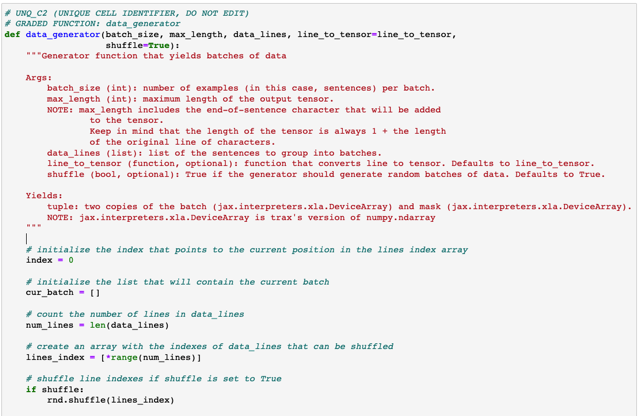</kbd>

     

    
    
<kbd>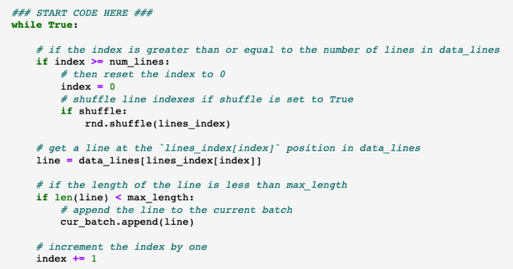</kbd>

     

    
    
<kbd>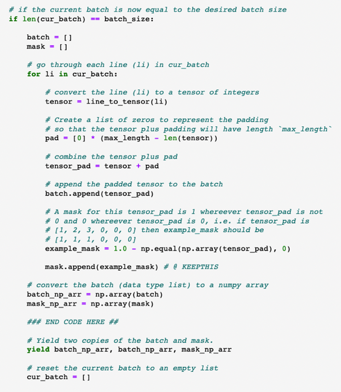</kbd>

     

    
    
<kbd>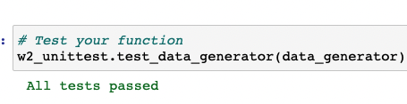</kbd>

     

  
  - Now that you have your generator, you can just call them and they will return tensors which correspond to your lines in Shakespeare. The**first column and the second column are identical**. Now you can go ahead and start building your neural network
     

- 1.4 - Repeating Batch Generator
   

  
  - The way the iterator is currently defined, it will **keep providing batches forever.**  Although it is not needed, we want to show you the**itertools.cycle function** which is really  **useful when the generator eventually stops**  Notice that **it is expected to use this function within the training function** further below  Usually we want to**cycle over the dataset multiple times during training** (i.e. train for  **multiple \\/epochs**\\/).  For small datasets we can use \\_**itertools.cycle**\\_ to achieve this easily.
    > [!NOTE]
    > Chưa hiểu lắm đại khái là giới thiệu một cách tiện lợi để
    > chạy qua / lướt qua dataset nhiều lần kiểu như nhiều
    > epoches

     

      
      
<kbd>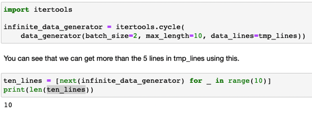</kbd>

      > [!NOTE]
      > Đại khái hiểu là giúp khi cycle
      > qua dataset nhiều lần

       

    
    - The purpose of using itertools.cycle in this context is to create an iterator that can provide  an infinite sequence of batches of data. The iterator keeps cycling through the provided data repeatedly, allowing for easy repetition of the dataset during training.  In the given code, the infinite_data_generator is created using itertools.cycle. It takes the output of the data_generator function, which likely generates batches of data for training a machine learning model. By using itertools.cycle, the data generator is transformed into an infinite iterator.  This is particularly useful when training a model for multiple epochs or repeatedly cycling over the dataset. During each iteration, the next function is called on the infinite_data_generator to retrieve the next batch of data. Since itertools.cycle ensures that the iterator keeps cycling indefinitely, it allows for seamless access to the dataset without explicitly handling the end of the data.  The use of itertools.cycle **simplifies** the **process of iterating over the dataset** **multiple times**, especially when dealing with small datasets. It **eliminates t**he need to **manually reset or handle the end of the dataset**, making it **convenient**for**training functions**that **require repeated access to the data.**
       

- 2 - Defining the GRU Model
   

  
  - Now that you have the input and output tensors, you will go ahead and **initialize your  model**. You will be implementing the **GRULM**, **gated recurrent unit**model. To implement  this model, you will be using **google's trax package**. Instead of making you implement the GRU from scratch, we will give you the **necessary method**s from a build in package.  You can use the following packages when constructing the model:
    > [!NOTE]
    > Rồi bây giờ đến build
    > GRU model với trax

     

      
      
<kbd>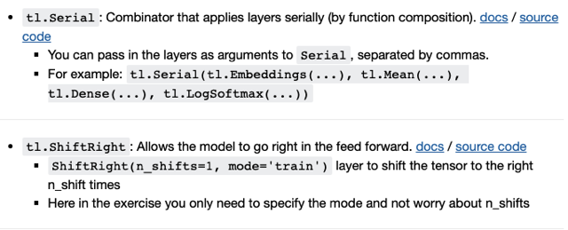</kbd>

      > [!NOTE]
      > Thì đại khái là ta sẽ dùng những cái này, đầu tiên là Serial layer giúp combine các layer serially
      > (tuần tự) chỉ việc bỏ các layer vào, cách nhau bởi dấu phẩy. Còn ShiftRight thì man mán hiểu là
      > giúp shift "chuyển dịch" input sentence qua bên phải 1 vị trí (default n_shifts = 1) bằng cách chèn
      > số 0 vào trước, nhằm mục đích gì chưa hiểu lắm

       

      
      
<kbd></kbd>

      
<kbd></kbd>

      
<kbd></kbd>

      > [!NOTE]
      > Tương tự bài toán tạo ra tên khủng long ở DLSpec. Nhưng ở đây ta
      > không tự làm quá trình loop (forward) nên không làm như trong bài toán
      > đó trong đó define **y<t> = x<t+1>** mà ta sẽ dùng **ShiftRight layer
      > n_shifts = 1**. Nói **ngắn gọn lại** cho mục đích của việc này là **để
      > model predict một time-step y^<t>** dựa vào **những từ / kí tự trước
      > đó**. Do đó ban đầu (time-step 1, chưa có gì), thì đương nhiên phải input
      > vào model (x<1>) để predict phải là "chưa có gì", tức x<t> phải = 0. Và ta
      > làm vậy bằng cách insert một số 0 vào vị trí đầu của tensor x. Chứ nếu
      > không ShiftRight hoá ra model predict lại nhận / dựa vào chữ đầu tiên để
      > predict ra chữ đầu tiên à? (Như trong tên khủng long, nhận chữ d rồi
      > predict chữ d thì rõ ràng là không đúng)

       

      
      
<kbd>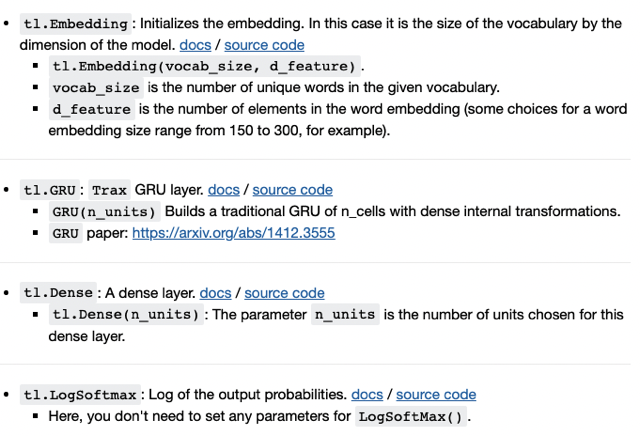</kbd>

       

- Exercise 3 - GRULM (UNQ_C3)
   

    
    
<kbd></kbd>

    
<kbd></kbd>

    
<kbd>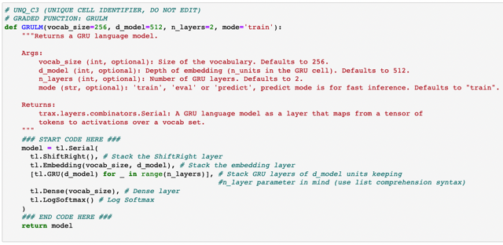</kbd>

    > [!NOTE]
    > Define một GRU network, lí do **Dense layer có n_units = vocab_size**
    > là vì cái này là họ kiểu như nói trước (hướng dẫn) về bài toán dự đoán kí
    > tự / generate chuỗi kí tự trong P.A. tương tự như trong bài toán generate
    > tên khủng long của DLSpec, trong đó ta tạo một RNN học các pattern
    > trong tên khủng long bằng một bộ data tên khủng long. để khi training
    > xong, sampling từ model để có tên khủng long mới để mà đặt cho một
    > loại khủng long mới phát hiện.
    >
    > Và **activation z<t> của mỗi time-step tính từ hidden state là một vector
    > có size bằng vocab size** (cho dù là bài toán ở cấp kí tự, cũng gọi là
    > vocab size),**gọi là logit.**
    >
    > Và **cái softmax tính với z<t> sẽ cho ra output y<t>**, đương nhiên là
    > một **vector dài vocab size, chứa các chỉ số probability score của các kí
    > tự**, để rồi cái nào có**p cao nhất sẽ là cái được chọn.** Thì ở đây, **họ
    > còn cho z<t> qua một Fully Connected layer trước khi qua softmax** nên
    > có thể hiển**độ dài của output từ F.C layer cũng phải bằng vocab size,**
    > do đó **số hidden unit của F.C (hay Dense) layer cũng bằng vocab size
    > là vậy**.

     

    
    
<kbd>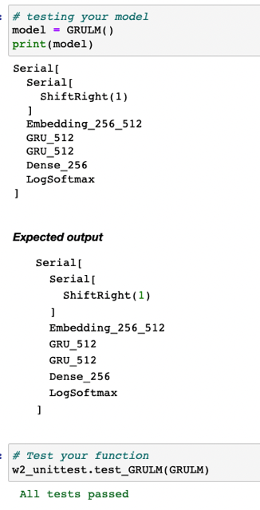</kbd>

     

- 3 - Training
   

  
  - Now you are **going to train your model**. As usual, you have to **define the cost function**, the **optimizer**, and **decide whether you will be training it** on a **gpu** or **cpu**. You also have to**feed in a built model**. Before, going into the training, we re-introduce the **TrainTask** and **EvalTask** **abstractions** from the**last week's assignment.**  To train a model on a task, Trax defines an **abstraction** t**rax.supervised.training**.**TrainTask** which **packages the train data, loss and optimizer (among other things) together into an object.**  Similarly to evaluate a model, Trax defines an abstraction **trax.supervised.training.EvalTask** which **packages the eval data and metrics** (among other things) into another object.  The final piece tying things together is the **trax.supervised.training.Loop abstraction** that is a very **simple and flexible** way to **put** **everything together** and train the model, all the while **evaluating it and saving checkpoint**s. Using **training.Loop** will **save you a lot of code** compared to always **writing the training loop by hand**, like you did in **courses 1 and 2.** More importantly, you are**less likely to have a bug** in that code that would **ruin your training**
    > [!NOTE]
    > Đại khái là nhắc lại những **cái abstraction TrainTask, EvalTask** giúp **đóng gói
    > training/evaluation data, optimizer và loss** lại thành một **object**, và **Loop giúp
    > handle phần training loop, save checkpoint..**. t**hay vì phải tự viết giúp giảm
    > nguy cơ bug.**

     

    
    - An **epoch** is traditionally defined as **one pass through the dataset.**  Since the **dataset was divided in batches** you need **several steps (gradient evaluations)** in order to complete an epoch. So, one epoch corresponds to the **number of examples in a batch** times the **number of steps**. In short, in **each epoch** you **go over all the dataset.**  The **max_length** variable defines the **maximum length of lines** to be used in training our data, **lines longer than that** length **are discarded.**  Below is a function and results that indicate **how many lines conform to our criteria of maximum length** of a sentence **in the entire dataset** and **how many steps are required in order to cover the entire dataset** which in turn corresponds to an **epoch**..
      > [!NOTE]
      > Đại khái là nói lại về **định nghĩa của một epoch** là sao, nó là **một lần loop qua
      > hết toàn bộ training** data. Vì **bộ data chia thành nhiều batch**, trong đó **model
      > sẽ xử lý từng batch và gradient descent update**, nên **một epoch là bằng số step
      > (tức là số batch) nhân với số training data trong batch**. Ở đây đại khái là **viết
      > function tính thử xem sẽ có bao nhiêu batch / hay bao nhiêu step trong toàn bộ
      > dataset**, vì ta không dùng toàn bộ dataset mà **bỏ đi những câu dài hơn
      > max_len** (phần tạo generator có làm) khi tính function này phải trừ đi những câu
      > dài hơn max_lenght

       

        
        
<kbd>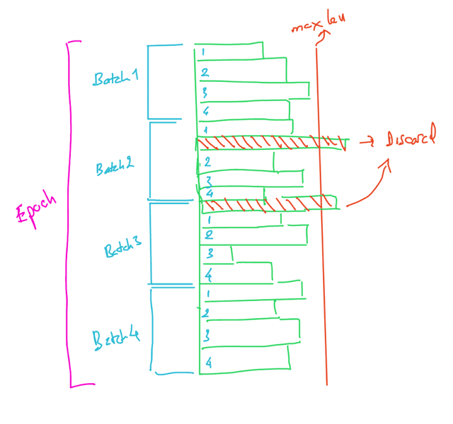</kbd>

        > [!NOTE]
        > Ví dụ batch_size = 4.

         

        
        
<kbd>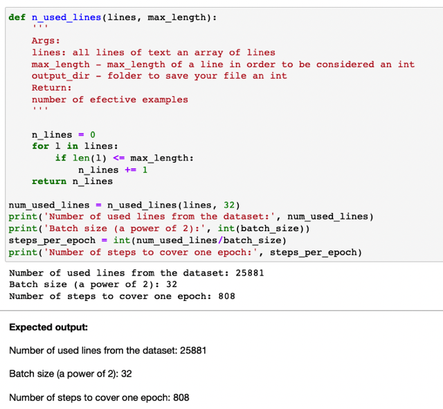</kbd>

         

- 3.1 - Training the Model
   

    
    
<kbd>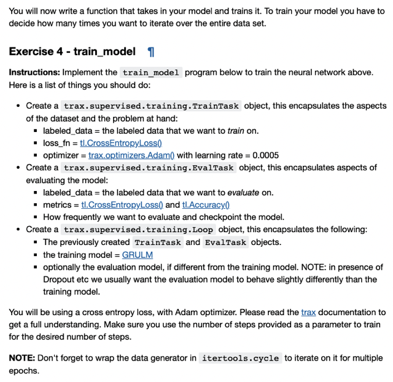</kbd>

     

- Exercise 4 - train_model (UNQ_C4)
   

    
    
<kbd>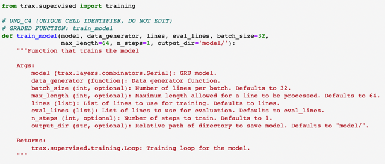</kbd>

     

    
    
<kbd>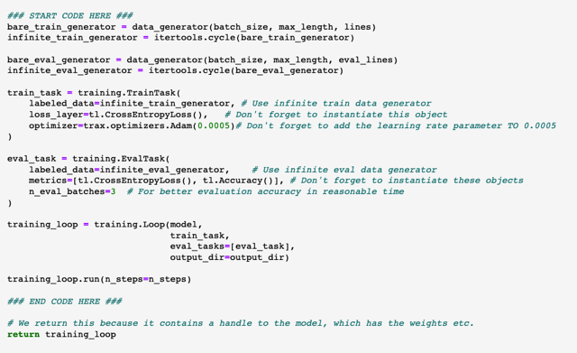</kbd>

     

    
    
<kbd>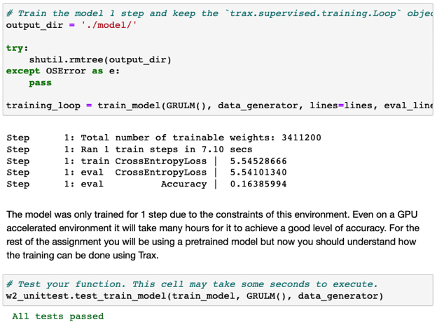</kbd>

     

- 4 - Evaluation
   

    
    
<kbd>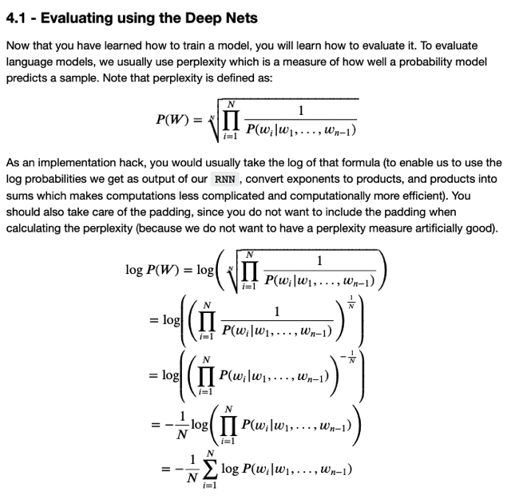</kbd>

     

- 4.1 - Evaluating using the Deep Nets
   

- Exercise 5 - test_model (UNQ_C5)
   

    
    
<kbd>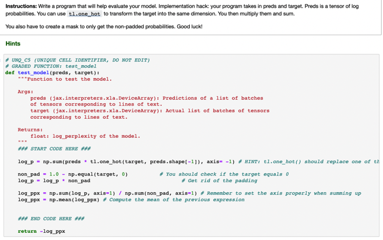</kbd>

    > [!NOTE]
    > Nếu thấy khó hiểu, xem lại Lab
    > trước, đã giải thích rất rõ

     

    
    
<kbd>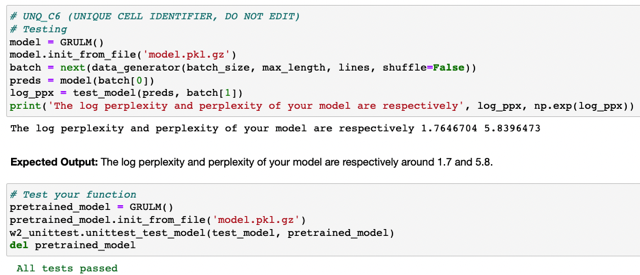</kbd>

     

- 5 - Generating the Language with your Own Model
   

    
    
<kbd>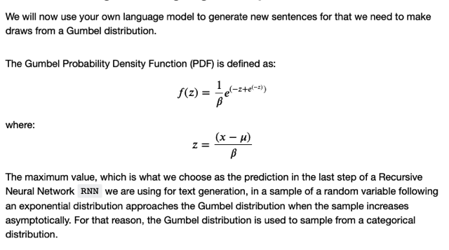</kbd>

     

    
    
<kbd>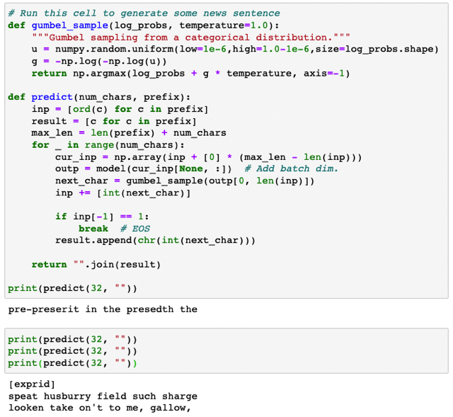</kbd>

    > [!NOTE]
    > In the generated text above, you can see that the model
    > generates text that **makes sense capturing dependencies
    > between words and without any input.** A**simple n-gram
    > model would have not been able to capture all of that in
    > one sentence.**

     

    
    
<kbd></kbd>

     

    
    
<kbd>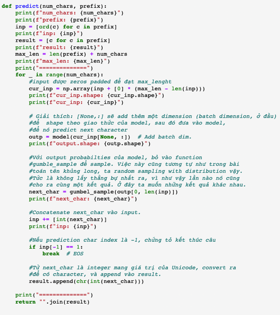</kbd>

     

    
    
<kbd>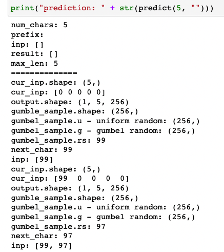</kbd>

     

    
    
<kbd>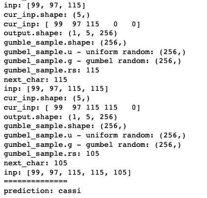</kbd>

     

    
    
<kbd></kbd>

     

    
    
<kbd></kbd>

     

  
  - in the predict() function above, why don't we use the max probability to get the next character?  ChatGPT  In the predict() function, the max probability is not used directly to select the next character because the goal is to introduce randomness and diversity in the generated text. By using Gumbel sampling instead of directly choosing the maximum probability, the generated text becomes less deterministic and more varied.  If the maximum probability were always chosen, the generated text would be more predictable and repetitive. The Gumbel sampling process adds randomness by considering the probabilities along with the Gumbel noise, controlled by the temperature parameter. This randomness allows the model to explore different possibilities and generate more diverse text.  In essence, Gumbel sampling with the temperature parameter provides a way to balance between exploration and exploitation. Higher temperatures result in more exploration and randomness, while lower temperatures make the sampling process more focused on exploiting the highest probabilities.  By using Gumbel sampling instead of relying solely on the maximum probability, the generated text becomes more interesting and less predictable, capturing a broader range of possibilities and allowing for more creative outputs.
     

    
    - is is  the similar 'random sampling with distribution" technique?  ChatGPT  Yes, Gumbel sampling with temperature can be considered a form of random sampling with a specific distribution. In this case, the Gumbel distribution is used as the underlying distribution for sampling. Random sampling with distribution involves drawing samples from a given probability distribution. In the case of Gumbel sampling, the goal is to sample from a categorical distribution. The Gumbel distribution is utilized to introduce randomness and exploration in the sampling process. The Gumbel distribution is often used to model extreme values and is defined by its shape and location parameters. By transforming uniform random numbers through the Gumbel distribution, Gumbel sampling allows us to select a category or item from a categorical distribution in a probabilistic manner. The temperature parameter in Gumbel sampling controls the level of randomness in the sampling process. Higher temperatures lead to more diverse and random samples, while lower temperatures make the sampling process more focused and deterministic. Therefore, Gumbel sampling with temperature can be seen as a form of random sampling with the Gumbel distribution, where the temperature parameter determines the level of exploration and randomness in the generated samples.
       

- Summary
   

  
  - **On statistical methods** Using a **statistical method** like the one you implemented in **course 2** will **not give you  results that are as good.** Your model will **not be able to encode information seen  previously in the data set** and as a result, the **perplexity will increase**. Remember from  course 2 that the**higher the perplexity, the worse your model** is. Furthermore, **statistical  ngram models** take up t**oo much space and memory**. As a result, it will be **inefficient** and  too **slow**. Conversely, with **deepnets, you can get a better perplexity**. Note, l**earning about  n-gram language models is still important** and allows you to better understand deepnets.
    > [!NOTE]
    > Đại khái là những**statistical method như N-gram ở course 2** **không đạt kết quả
    > tốt**được như này. Vì nó **không nắm bắt và "nhớ" được thông tin mà nó gặp ở
    > trước đó**, dẫn tới **perplexity cao**, đồng nghĩa **model tệ**. Ngoài ra nó còn **đòi hỏi
    > nhiều memory** nên **không hiệu quả** và chạy **chậm**. Còn với **Deep Net**, những
    > **vấn đề này được cải thiện đáng kể**. Tuy vậy ổng nói **việc hiểu về các statistical
    > model** đóng vai trò **quan trọng** trong việc **giúp ta hiểu hơn về Deepnet**

     

