# C3w4 - Siamese Network

📊 **Progress:** `73` Notes | `128` Screenshots

---

Learn about Siamese networks, a special type of neural network made of two identical 
networks that are eventually merged together, then build your own Siamese network that 
identifies question duplicates in a dataset from Quora.

Learning Objectives

 • One shot learning
 • Triplet loss
 • Cosine similarity
 • Siamese networks
 • Data generators

## Week Introduction

 

### This week you'll learn about **Siamese Networks** and the **triplet loss**. A Siamese

> [!NOTE]
> This week you'll learn about **Siamese Networks** and the **triplet loss**. A Siamese
> Network is a neural network which **uses the same weights** while **working in tandem
> on two different input vectors** to **compute comparable output vectors**. You can then
> **compare those output vectors** and **see if they are similar**. You will use these
> methods to **identify question duplicates**. This is important because you do not want
> to have a forum full of question duplicates. So platforms like Stack Overflow or
> Quora actually implement techniques like this. You can also use it to **identify two
> signatures that are similar.** Jonas, we'll go over it in more detail. Yes. Let's get
> started. This is one of my favorite topics in the specialization.

> [!NOTE]
> Đại khái Siamese network là **neural network dùng cùng weights** nhưng với
> **2 input vector khác nhau**để **tính toán ra một comparable output vector.**
> Sau đó ta có thể **dùng output vector này để so sánh với nhau để xem chúng
> có giống nhau không**. Cụ thể thế nào chưa rõ nhưng đại khái là ta sẽ dùng
> cái này để build một model giúp tìm các question trùng lặp nhau ví dụ trên
> một nền tảng như Quora. DLSpec đã học qua về Siamese network ở C4W4.

 

## Siamese Network

 

### 1. The video introduces**Siamese networks**, a **special type of neural network** architecture with \\*two identical

> [!NOTE]
> 1. The video introduces**Siamese networks**, a **special type of neural network** architecture with **two identical
> neural networks merged at the end.**
>
> 2. Siamese networks **have numerous applications** in Natural Language Processing (NLP).
>
> 3. The example of comparing questions "How old are you?" and "What is your age?" illustrates the need to
> **compare meaning rather than just individual words** in NLP tasks.
>
> 4. Siamese networks can be used to **compare the meaning of word sequences and identify question
> duplicates**, a crucial application in platforms like Stack Overflow or Quora.
>
> 5. The goal of Siamese networks is to **determine the similarity or difference between two inputs by
> computing a single similarity score.**
>
> 6. Siamese networks are used in **sentiment analysis** for \\_**identifying what features contribute to positive or
> negative sentiment\\_.**
>
> 7. **Various applications** of Siamese networks in NLP include **signature authentication, search query
> similarity prediction, and more.**
>
> 8. The**architecture of Siamese networks** will be explored in the next video, demonstrating how they can be
> used in t**ext-related tasks.**
>
> The main ideas cover the concept of **Siamese networ**ks, their applications in NLP, and the need for
> **comparing meaning in various text-related tasks**. It emphasizes the **efficiency of Siamese networks in
> identifying similarities** and **differences between input sequences.**

 

<kbd>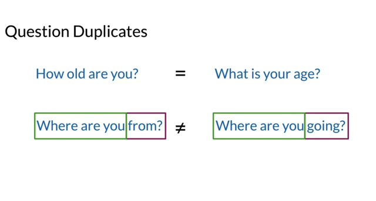</kbd>

> [!NOTE]
> Đại khái là một ví dụ cho thấy **so sánh hai câu không thể dựa vào việc
> so sánh các từ**. Như hai câu đầu **nhìn** **rất khác nhau nhưng thực ra
> chung một ý**, còn **hai câu dưới thì ngược lại**. **Siamese network** có thể
> giúp giải quyết vấn đề này - vốn là một vấn đề rất quan trọng trong NLP

 

<kbd>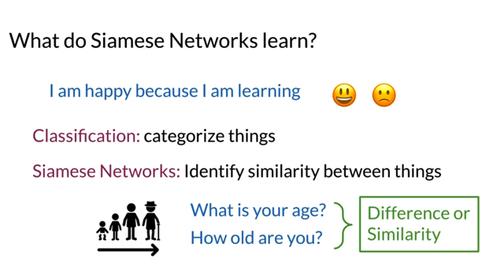</kbd>

> [!NOTE]
> **Classification** giúp giải quyết **bài toán categorize data**, phân
> loại. Còn **Siamese network** giúp giải quyết b**ài toán xác định sự
> giống nhau** giữa các data sample.

 

<kbd>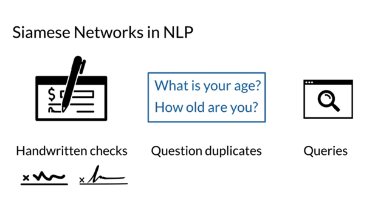</kbd>

> [!NOTE]
> Siamese network có nhiều ứng dụng, như là **so sánh chữ
> kí xem có phải là của một người không**, hoặc **check xem
> câu hỏi có bị trùng lặp không ...**

 

## Architecture

 

### The main ideas from these passages are as follows:

> [!NOTE]
> The main ideas from these passages are as follows:
>
> 1. ****Siamese Network Architecture**:** Siamese networks have a **unique architecture** **comprising two
> identical subnetworks**. Each subnetwork takes an **input** (e.g., two questions) and **transforms it into an
> embedding** using an **LSTM layer** to **capture the meaning of the input**. The subnetworks **share identical
> parameters**, meaning only one set of weights needs to be trained.
>
> 2. ****Cosine Similarity**:** The **output vectors**from the two subnetworks **are compared using cosine
> similarity**, which is a **measure of similarity between two vectors**. A cosine similarity value **close to 1**
> indicates **high similarity**, while a **value close to -1 suggests dissimilarity.**
>
> 3. ****Prediction** and **Thresholding**:** The **cosine similarity value**, denoted as **"y hat,"** serves as the
> p**rediction of the Siamese network**. A threshold "**TAU**" is chosen to **interpret the similarity or dissimilarity**
> between the inputs. If **y hat is less than or equal to TAU**, the **input questions are considered different**; if **y
> hat is greater than TAU**, they are **considered the same**.
>
> 4. **Series of Steps in Siamese Network Process:** The process of Siamese network operation
> involves **passing the inputs** (e.g., questions) **through the subnetworks**,**transforming them into
> embeddings** using **LSTM layers**, and then c**omparing the outputs using cosine similarity** to get the final
> prediction (y hat).
>
> 5. **Different **Cost Function**s:** The second video touches on different **cost functions** that can be used
> for this type of Siamese network architecture. These cost functions are crucial in training the model and
> optimizing its performance.
>
> Overall, the passages explain the **architecture and working of Siamese networks**, including **cosine
> similarity** as a measure of similarity between vectors and the use of a **threshold** to determine similarity
> between inputs. They also hint at the importance of cost functions for training the model effectively.

 

<kbd>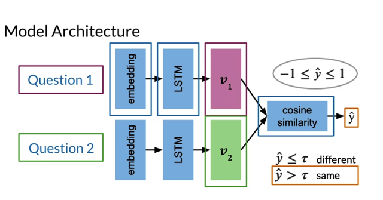</kbd>

> [!NOTE]
> Nếu set **tiêu chuẩn so sánh Tau** lớn có nghĩa là ta cho **nó phải đạt "
> độ" giống nhau nhiều thì mới kết luận là giống nhau** - còn không đạt là
> khác nhau.
>
> Hai nhánh nhưng **chung 1 network's params**. **Không nhất thiết phải
> có LSTM**, đây chỉ là một ví dụ. Chủ yếu là nói **Siamese network là
> chứa hai nhánh merge lại ở cuối để tính ra Similarity score**. bằng
> **Cosine similarity trên input là v1, v2.**
>
> Hiểu nôm na là **qua các layer của hai nhánh**, từ question 1, 2 ban đầu,
> **model sẽ extract ra hai embedding vector chứa / đại diện cho những
> thông tin cốt lõi của hai message**. Và **so sánh v1 v2 sẽ cho ta thấy độ
> giống nhau của ý nghĩa giữa chúng**Và so sánh hai vector bằng cách tính **Cosine Similarity** như ta đã
> biết nếu **tiến về 1 thì chứng tỏ hai véctơ gần nha**u còn **tiến về -1 thì
> khác nhau,**

 

<kbd>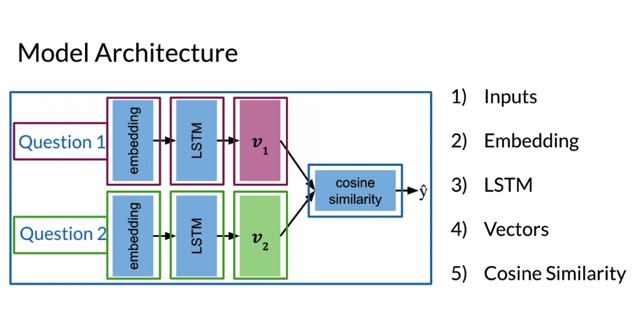</kbd>

> [!NOTE]
> Các bước thực hiện

 

## Lab: Create Siamese Model Using Trax

 

<kbd>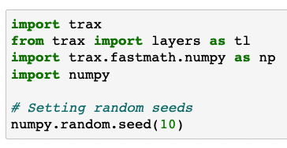</kbd>

> [!NOTE]
> Import cả numpy và
> trax's numpy

 

<kbd>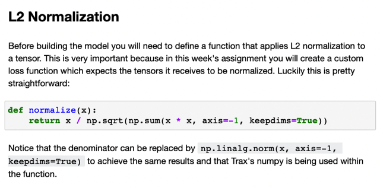</kbd>

> [!NOTE]
> Đại khái là trong P.A sẽ tính**loss function của Siamese network**
> trong đó yêu cầu **input tensor phải được L2 Normalization**. để tính
> L2 normalization đơn giản chỉ là **chia tensor cho L2 norm của nó**. L2
> norm là **sqrt của tổng bình phương các vector value. L2 norm of x =
> sqrt(x1**2 + x2**2+x3**3..)**
>
> Trong function chính là**x.x**tức là **dot product of x, với chính nó**
> - và lấy **sqrt chính là norm của vector x**. Cái này đã học bên Math
> for ML. Trong function sử dùng Trax's numpy function sqrt, và sum.
> Ổng cũng nói có thể dùng **np.linalg.norm** để tính norm.

 

### L2 normalization, also known as **Euclidean normalization** or L2 normalization, is

> [!NOTE]
> L2 normalization, also known as **Euclidean normalization** or L2 normalization, is
> a mathematical technique used to scale vectors to have a unit norm, specifically
> an L2 norm of 1. In other words, it is a normalization method that transforms the
> values of a vector so that their squared sum becomes equal to 1.
>
> Mathematically, given a vector x with n elements (x1, x2, ..., xn), the**L2 norm**
> (also known as the **Euclidean norm**) of x is calculated as follows:
>
> **||x||2 = √(x1^2 + x2^2 + ... + xn^2)**
>
> L2 normalization involves **dividing each element of the vector by the L2 norm of
> the vector**:
>
> x_normalized = x / **||x||2**
>
> After L2 normalization, the**resulting vector x_normalized will have an L2 norm of
> 1**. This means that the **squared sum of the elements in the normalized vector will
> be equal to 1.**
>
> L2 normalization is commonly used in machine learning, particularly in cases
> where it is **desirable to scale the features or vectors to have equal importance or
> to normalize the data for numerical stability**. It is often applied to feature vectors
> in various machine learning algorithms, such as in **image processing, natural
> language processing, and recommendation systems**. By normalizing the feature
> vectors, the model can be l**ess sensitive to the magnitude of individual features**
> and **focus on the relative relationships between them**.

> [!NOTE]
> Chính xác L2 normalization là chia
> vector cho L2 norm của nó.

 

<kbd>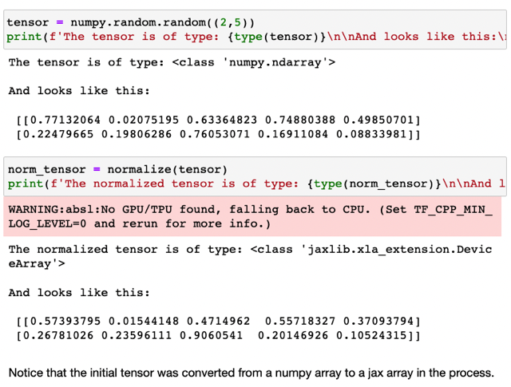</kbd>

> [!NOTE]
> Define 1 random **numpy** tensor
> và thực hiện normalize() kết quả nó thành ra **jax array.**

 

<kbd>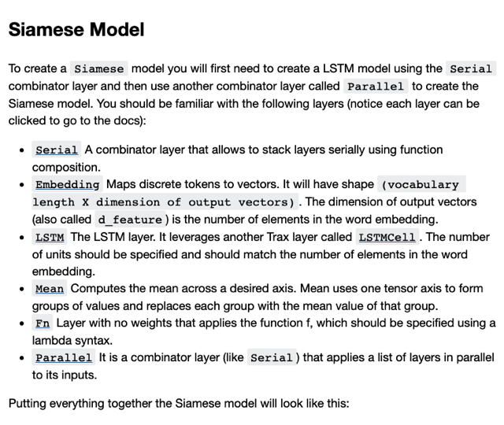</kbd>

> [!NOTE]
> **Serial** và **Parallel** là combinator, một cái cho tuần tự 1 cái cho song song.
>
> **Embedding** như đã biết sẽ 'biến' hoặc 'map' một **discrete token** - tức là
> **index của word trong vocab dictionary** với một **embedding vector** có
> **length** = **d_feature**.
>
> **LSTM** đã biết, **trong trax,** **number of unit nên cho bằng d_feature** (tức là
> **hidden state h<t>** và **cell state c<t>** đều có **chiều dài bằng với embedding
> input x<t>**.
>
> **Mean** thì nó tính mean.
>
> **Fn** là layer nhận function để thực hiện việc tính toán (**lambda function**).

 

<kbd>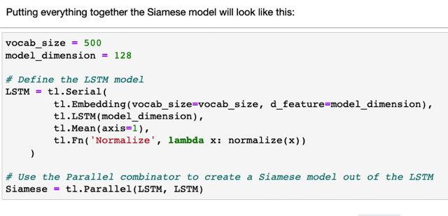</kbd>

 

<kbd>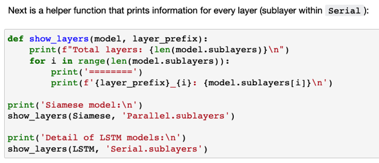</kbd>

 

<kbd>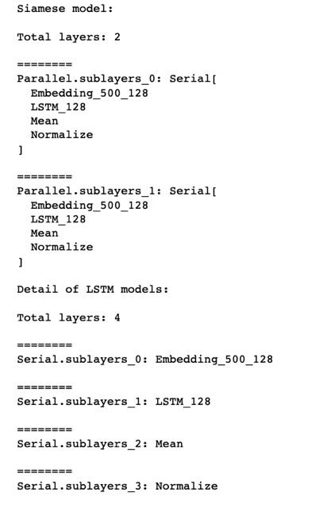</kbd>

 

## Cost Function

 

### Main ideas from the given text:

> [!NOTE]
> Main ideas from the given text:
>
> 1. Introduction to **Siamese Network**: The text introduces the **concept of a Siamese network**
> used for **predicting whether two questions are similar or different**.
>
> 2. **Triplet Loss Function**: The cost function used in a Siamese network is explained, known as
> the **triplet loss**. It helps in **comparing and training the network using anchor, positive, and
> negative examples**.
>
> 3. **Anchor, Positive, and Negative** Questions: The **anchor question is the reference question**,
> **positive questions** are those with the **same meaning as the anchor**, and **negative questions**
> are those**without the same meaning.**
>
> 4. Similarity Function: A **similarity function S** is **defined to measure the similarity between two
> vectors**, and it is used to **compare the anchor and positive vectors and the anchor and
> negative vectors**.
>
> 5. Range of **Similarity**: **Similarity values** are **bounded between -1 and 1**, **where -1 indicates
> completely different vectors** and **1 indicates nearly identical vectors**.
>
> 6. **Loss Calculation:** The loss function is **derived by subtracting the similarity of the anchor
> and positive vectors** from the **similarity of the anchor and negative vectors.**
>
> 7.**Minimizing Loss in Training**: Minimizing the **loss during training helps in making the model
> effectively differentiate between similar and dissimilar question pairs**.
>
> 8. Introduction to Triplets: The text mentions that the next video will introduce triplets, likely
> explaining another aspect of training in Siamese networks.

 

<kbd>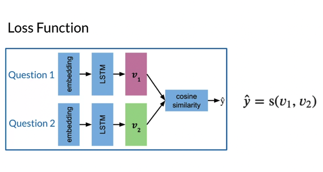</kbd>

 

<kbd>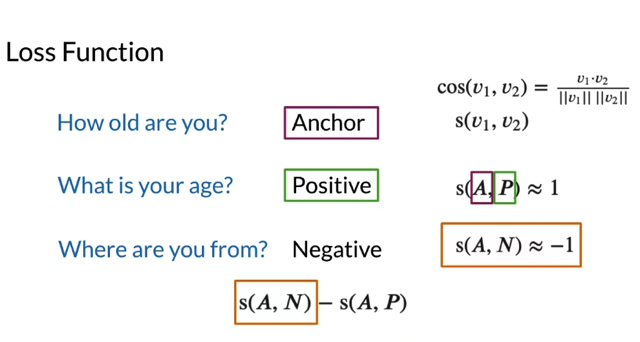</kbd>

> [!NOTE]
> Đại khái là ta define loss function sao cho **cái similarity của anchor và
> positive s(A,P) phải cao** hoặc **negative của nó phải thấp** -> **- s(A,P)**
> đồng thời ta muốn **similarity của anchor và negative s(A,N) phải thấp**. Nên
> **gom lại loss function sẽ là s(A,N) - s(A,P).** Similarity thường dùng **Cosine
> Similarity trong khi DLSpec dùng L2 distance**. Và **minimize loss function
> này sẽ giúp train model phân biệt được sự khác và giống nhau giữa các
> câu**

 

<kbd>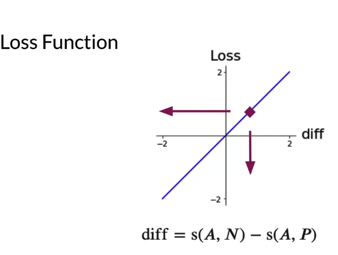</kbd>

> [!NOTE]
> Cái này ý là để loss nhỏ, thì model phải đạt được cả hai
> tiêu chí là đồng thời học được duplicate sentence là giống
> nhau và ngược lại là khác nhau.

 

## Triplets

 

### Main ideas from the given text:

> [!NOTE]
> Main ideas from the given text:
>
> 1. Introduction to Siamese Neural Network: The text introduces the concept of **building a model to
> identify if two inputs are equivalent**, instead of **classifying inputs into multiple categories**.
>
> 2. **Triplet Loss and Triplets**: The triplet loss is a **loss function used in Siamese networks**, and **triplets are
> groups of anchor, positive, and negative examples** used in training.
>
> 3. **Minimizing Difference** and **Maximizing Similarity**: The goal of the triplet loss is to **minimize the
> difference**between**the similarity of anchor and negative** examples and**similarity between
> anchor and positive examples.**
>
> 4. **Margin Alpha** for Triplet Loss: To **ensure that learning happens until the difference between similarities
> is close to a specific margin value**, a **margin alpha** is used in the triplet loss.
>
> 5. Cosine Similarity and Distance Metrics: **Cosine similarity** is used in the explanations, **but other
> similarity functions or distance metrics can also be use**d with **appropriate modifications** to the **loss
> function**.
>
> 6. Selecting Hard Triplets: **Instead of choosing triplets randomly**, it's **more efficient to select hard triplets**
> that create a **challenge for the model** in**telling apart negative and positive examples**.
>
> 7. **Efficient** **Training**: By using hard triplets, the **training process can focus on problematic cases,**
> **providing the model with the most information** on how to improve its performance.
>
> 8. Concepts Coming Together: The text mentions that all these concepts will come together to create a
> cost function for training the Siamese model, which will likely be explained in the following video.

 

<kbd>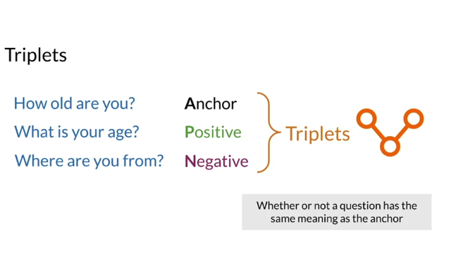</kbd>

 

<kbd>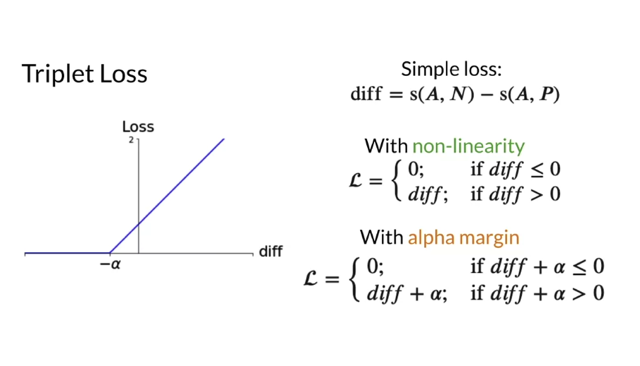</kbd>

> [!NOTE]
> Như đã nói, mục tiêu của loss function là (làm sao khi giảm
> loss) **khiến cho thằng P giống thằng A**bằng cách cho
> **cos(A, P) cao**, **hay -cost(A,P)** thấp và**thằng P khác
> thằng N** bằng cách **cho cos(A, N) thấp**. Từ đó loss
> function là **cos(A, N) - cos(A, P)**
>
> Người ta add **alpha** là margin, kiểu như khiến model **tiếp tục
> learning cho đến khi difference giữa hai cái giống nhau nhỏ
> hơn một mức nào đó** chứ **không chỉ loss giảm về bằng 0 là
> dừng**

 

<kbd>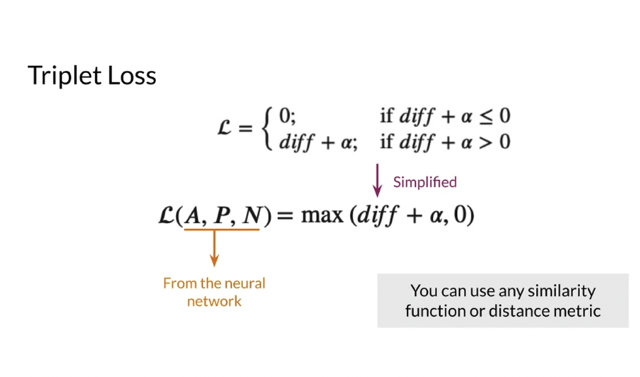</kbd>

> [!NOTE]
> Có thể dùng các **similarity function** hoặc **distance metric**
> khác (như DLSpec dùng L2 distance) nhưng phải cẩn thận và
> **sửa lại chút xíu** vì nếu dùng distance metric thì **phải đổi
> dấu** vì **hai cái càng giống nhau** nhau thì **similarity nó lớn**
> nhưng d**istance nó nhỏ.**

 

#### Tại sao lại dùng max(diff + alpha, 0) trong triplet loss. Lí do là vì nếu chỉ dùng loss = diff. Việc train model để nó ngày càng giảm loss sẽ không ổn vì khi loss mà bắt đầu âm thì s(A, P) sẽ ngày càng lớn là không đúng với yêu cầu.  Nên phải cho loss là max(diff, 0) để giảm diff nhưng khi diff âm thì loss = 0 là cho stop, converge.

 

<kbd>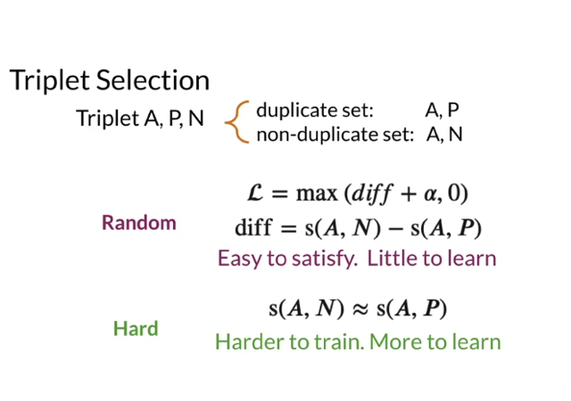</kbd>

> [!NOTE]
> Đại khái bắt đầu bằng việc**tạo các bộ training data** - **triplet**.
> Trong đó **chọn ra những cặp giống nhau làm A-P** và **một cái
> khác để làm A-N**. Nhưng có điều nếu chọn dùng các duplicate
> data làm A-P rồi và c**họn ngẫu nhiên một cái ất ơ nào đó** để
> làm N thì kiểu như nó **qúa dễ dàng để phân biệt**, khiến **model
> không học được mấy**. Thay vào đó người ta sẽ **chọn các cặp
> nhìn có vẻ giống nhau để đưa vào làm triple**t. Khiến**gây khó
> cho model bắt nó phải tìm cách nhận biết sự khác biệt giữa
> chúng**

 

<kbd>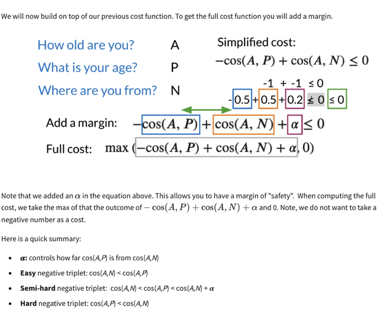</kbd>

 

## Computing Cost Function 1

 

### Main ideas extracted from the provided text:

> [!NOTE]
> Main ideas extracted from the provided text:
>
> 1. Building a **Siamese Network**: The text discusses **the construction of a Siamese network** for a specific
> task, likely related to **question similarity** or **duplicate detection**.
>
> 2. **Cost Function** and **Gradient Descent**: The process begins with **defining a cost function**, which likely
> **measures the similarity between pairs of questions**. Gradient descent is then used to optimize this cost
> function.
>
> 3. **Data Preparation**: The data is **organized into batches**, each **containing duplicate pairs of questions**.
> The batch size is denoted as 'b'.
>
> 4. **Embedding Layer and Model**: The Siamese network uses an **embedding layer with a dimension of five**
> for each question in the batch. The embedding layer determines **the size of the output vector.**
>
> 5. **Similarity Calculation**: The Siamese network **calculates the similarity between vector pairs (v1 and v2)**
> of questions using the c**osine similarity** or **another similarity metric**.
>
> 6. **Positive** and **Negative Examples**: The**\\_diagonal of the similarity matrix** represents **similarities for
> positive examples (question duplicates)**\\_, while the \\_**off-diagonal represents similarities for negative
> examples**\\_ (non-duplicates).
>
> 7. **Triplet Loss Function**: The triplet loss function is introduced as a way to **compute the cost for the
> Siamese network** based on the similarities of question pairs.
>
> 8. **Hard Negative Mining**: The text mentions that **hard negative mining** is used during training to improve
> model performance, where **non-duplicate pairs are used as negative examples**.
>
> 9. Techniques for Model Performance: The text suggests that there are **additional techniques** available to
> **improve the model's performance beyond using the triplet loss function** and **hard negative mining.**
>
> 10. Focus on Duplicate Questions: By **creating non-duplicate pairs within the batches**, the **need for
> additional non-duplicate examples in the input data is reduced.**
>
> 11. Training and Cost Computation: The **overall cost for the Siamese network** during training is the **sum of
> the individual losses over the training set**, involving a set of **m observations.**

 

<kbd>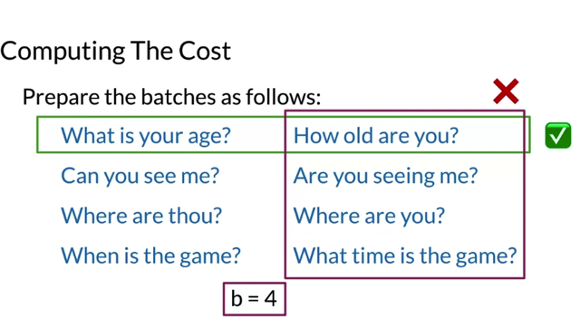</kbd>

> [!NOTE]
> Đại khái là chuẩn bị một batch như sau:
>
> Một batch có b câu (mỗi hàng một câu) sẽ đưa vào nhánh 1.
>
> Và một batch các câu đồng nghĩa với các câu trước sẽ được
> đưa vào nhánh 2.

 

<kbd>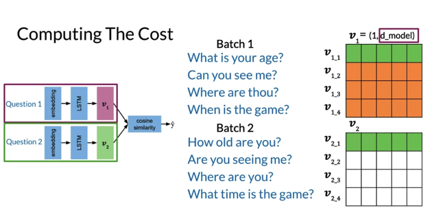</kbd>

> [!NOTE]
> Như vậy v1,v2 sẽ là tensor có b hàng ứng với b câu, và d_model
> cột - số dimension của embedding vector. Tức là mỗi câu trong
> batch sẽ trở thành một embedding vector dài d_model.
>
> Và 2 vị trí tương ứng trong batch của hai tensor v1, v2 là embedding
> vector của hai câu đồng nghĩa

 

<kbd>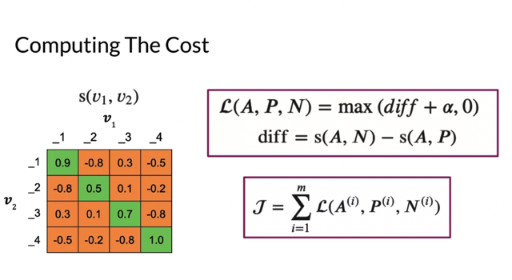</kbd>

 

<kbd>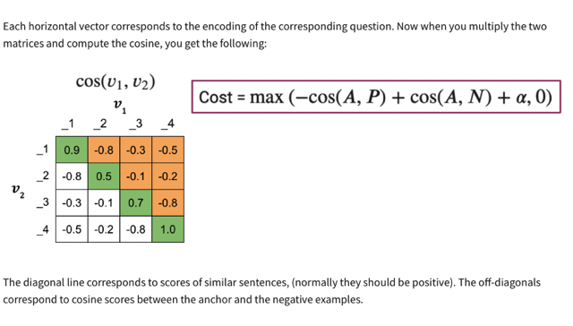</kbd>

> [!NOTE]
> Đầu tiên phải hiểu là ta **tính các giá trị s(v1,v2)** - **cosine similarity**
> của **các embedding vector trong v1** **lần lượt với các embedding
> vector trong v2**. Thì vì **đã sắp xếp các duplicate sentence cùng vị trí
> tương ứng trong 2 batch** nên nhận xét đầu tiên là **giá trị cosine
> similarity của các embedding vector cùng vị trí** trong v1,v2 - **chính là
> các ô đường chéo của matrix sẽ cao hơn các ô khác**. Trong range của
> chỉ số cosine similarity là -1:1 thì**càng gần 1 thì càng giống nhau** và
> ngược lại càng **gần -1 thì càng khác nhau**.
>
> Cái nữa là dù các số ngoài đường chéo cũng có số dương nhưng
> **không có quy định nào bắt buộc rằng số dương thì duplicate**, số âm
> thì không. Mà **cái chính ở đây là model sẽ được training sao cho
> duplicate sẽ có chỉ số cosine similarity cao hơn không duplicate.**
>
> Cuối cùng là tính loss của mỗi example và cost là trung bình của toàn
> bộ example. Thì đại khái để tính loss trên mỗi example,  s(A, P) =
> similarity giữa Anchor và Positive  s(A, N) = similarity giữa Anchor và
> Negative
>
> Thì **Anchor và Positive là hai câu duplicate nhau cùng vị trí  trong 2
> batch**. \_**Còn Negative là câu khác trong batch đó**\_. Thì ý  ổng là
> như vậy ta \_**khỏi phải chuẩn bị một bộ negative example \_nữa.**Ở đây có nói những **giá trị trên đường chéo chính là cosine similarity
> của các duplicate sentence s(A,P)** và **các ô ngoài đường chéo chính là
> cosine similarity của anchor và negative example. s(A,N)**
>
> Nhưng cụ thể tính như thế nào thì có thể bài sau nói rõ hơn.

 

## Computing Cost Function 2

 

### 1. **Similarity Matrix and Diagonals**: The text describes the **similarity matrix** obtained from the Siamese

> [!NOTE]
> 1. **Similarity Matrix and Diagonals**: The text describes the **similarity matrix** obtained from the Siamese
> network, with **similarities along the green diagonal representing duplicate questions** and **orange values in
> the upper-right and lower-left representing non-duplicate questions**.
>
> 2. Mean Negative: The **mean negative** is the **average of off-diagonal values (negative examples) in each
> row of the similarity matrix**. It represents the **mean similarity of negative examples for each positive
> example.**
>
> 3. **Closest Negative**: The closest negative is the **off-diagonal value that is closest to, but less than, the
> similarity on the diagonal in each row of the similarity matrix**. It represents the **negative example that offers
> the most learning opportunity**.
>
> 4. Loss Function **Modifications**: Two new loss functions are introduced - **loss one and loss two**. **Loss one**
> replaces the **similarity of the anchor and negative example with the mean negative**, helping to **reduce
> noise and converge faster** during training. **Loss two replaces the similarity of the anchor and negative
> example with the closest negative,** creating a **larger penalty for more difficult examples.**
>
> 5. Full Loss Function: The**full loss function** is defined as the**sum of loss one and loss two**. **This improved
> triplet loss** is used for training the Siamese network.
>
> 6. **One-Shot Learning**: The text mentions that the **full loss function will be used in one-shot learning**, a
> technique for efficiently comparing the authenticity of inputs like checks or other types of data.
>
> Overall, this section of the text focuses on **modifying the loss function** using the **mean negative** and **closest
> negative** concepts to **improve the model's performance during training**, with the goal of **applying it in
> one-shot learning scenarios.**

 

<kbd>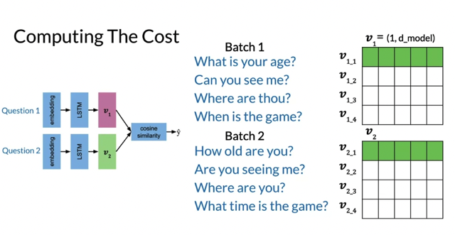</kbd>

> [!NOTE]
> Đại khái là nhắc lại qúa trình tính ra hai matrix v1, v2 có shape
> (b, dmodel). Trong đó mỗi hàng là một embedding vector của
> câu input. Ta sẽ**tính cosine similarity của từng vector trong v1
> với từng vector trong v2.**

 

<kbd>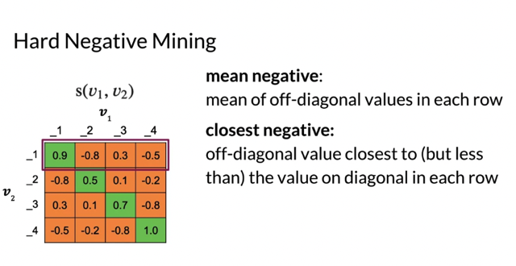</kbd>

> [!NOTE]
> Đại khái là chuẩn bị hai khái niệm để tính triplet loss
>
> **Mean negative** của một hàng là **mean của tất cả các ô không phải
> đường chéo của hàng đó**. Ví dụ hàng 1 sẽ là mean của -0.8, 0.3, và -0.
> 5.
>
> Còn **Closet negative** là **số không phải đường chéo mà có giá trị GẦN
> NHẤT VÀ NHỎ HƠN với đường chéo**. Ở đây đối với hàng 1 là 0.3

> [!NOTE]
> Lí do phải chọn GẦN NHẤT VÀ \_**NHỎ HƠN**\_ là vì:
>
> Ta đang kiểu như  làm khó model với việc chọn một câu negative
> (không giống câu anchor) để mong muốn model cho điểm
> (similarity) thấp. Nhưng ta chọn cái câu có điểm kém hơn mà nó
> đang cho cho rằng khá là giống với anchor nhất trong các câu.
>
> Nếu lỡ trong batch có một câu mà nó cho điểm còn cao hơn cả
> câu positive (đường chéo) thì việc chọn nó sẽ kiểu như conflict
> không phải gây khó cho model nữa mà là khiến nó tẩu hoả nhập
> ma Khi cái câu nó cho rằng còn giống hơn cả câu positive mà lại
> không

 

<kbd>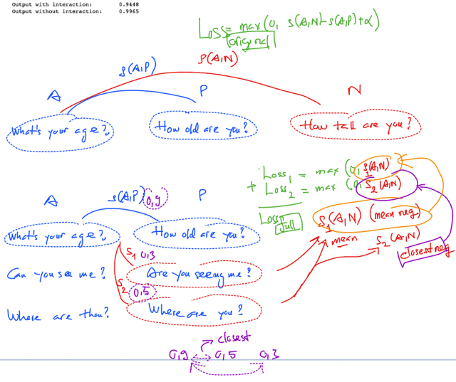</kbd>

<kbd></kbd>

<kbd>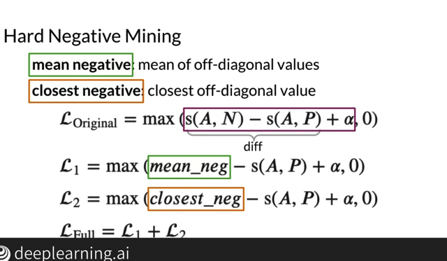</kbd>

> [!NOTE]
> Như vậy là thay vì tính toán Triplet loss bằng công thức gốc, trong đó dùng
> similarity score của Anchor và Positive và Negative, thì ở đây dùng **function
> thay thế s(A, N) bởi mean negative và closest negative.**Ta hiểu cách này, **thay vì phải chuẩn bị một negative sample cụ thể** ví dụ có
> thêm **v3 chứa các câu negative của v1** (v2 chứa positive) thì bây giờ **sẽ xem
> mấy câu khác hàng trong batch v2 là negative và tính s(A, N) là trung bình của
> các s giữa câu v1 với các câu khác hàng trong v2.** Tương tự với closest
> negative, nhưng tính s(A, N) là s của câu trong v1 với câu khác hàng trong v2 mà
> có s gần với s (A, P) nhất
>
> Ổng nói tính kiểu này **giảm noise khiến converge nhanh hơn** (nhờ L1 dùng
> **average negative**)
>
> Và việc dùng **closest negative** chính là **đóng vai trò của hard-triplet** trong đó
> negative được chọn là không quá khác so với positive khiến model phải tìm cách
> **học được sự khác biệt giữa negative và positive tốt hơn.**
>
> Và cũng nhắc lại rằng, với cách làm này ta**không cần phải có một bộ negative /
> non-duplicate riêng** mà thay vào đó **dùng chính non-duplicate có sẵn làm
> negative.**

> [!NOTE]
> Chỗ này ghi sai chút xíu trong công thức  Loss 1 và Loss
> 2 đều phải có - s (A, P)

 

<kbd>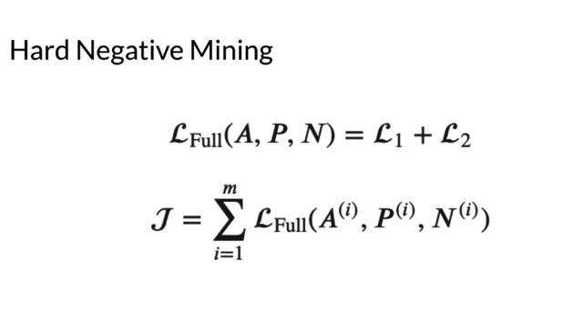</kbd>

> [!NOTE]
> Và cost function sẽ là mean
> của loss như đã biết

 

## Lab: Modified Triplet Loss

 

<kbd>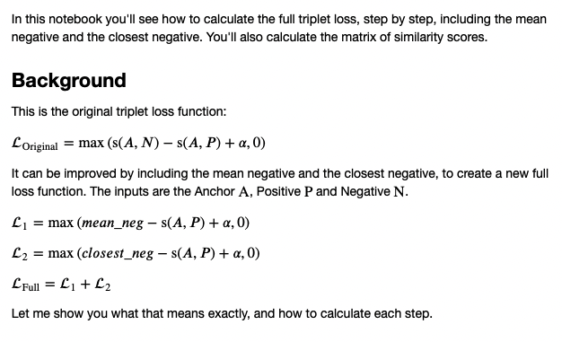</kbd>

> [!NOTE]
> Nhắc lại công thức Triplet loss gốc và bản modified

 

### Similarity Scores

 

<kbd>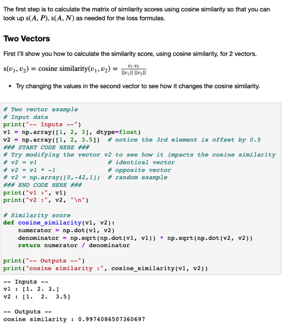</kbd>

> [!NOTE]
> công thức tính
> Cosine similarity
>
> Từ thì biết rồi 
> Để ý mẫu là tích của (product of) norm của v1 và v2.
> Norm đây đương nhiên là Euclidean norm. 
> Ví dụ của vector a = [a1, a2, a3,..an] thì norm a = sqrt (a1**2 + a2**2 + ...an**2)
> Thì a1*a1 + a2*a2 + an*an cũng chính là dot (a, a).
> Nên norm a = sqrt (dot(a,a)). Cái này đã gặp ở MLSpec, MathSpec

 

<kbd>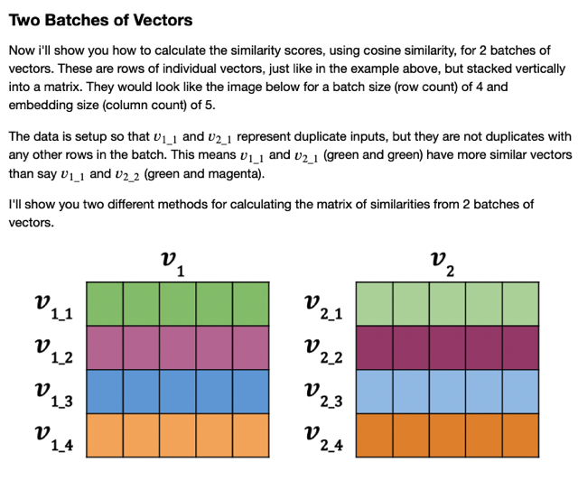</kbd>

> [!NOTE]
> Kế đến tính **similarity của 2 batches of vector v1, v2**. Thì
> nhắc lại cho ta nhớ rằng trong cách chuẩn bị dữ liệu thành
> batch, các duplicate sentence sẽ chia ra ở cùng vị trí của hai
> batch. **1 câu của batch này chỉ duplicate với duy nhất 1 câu
> của batch kia (ở cùng vị trí) thôi**

 

<kbd>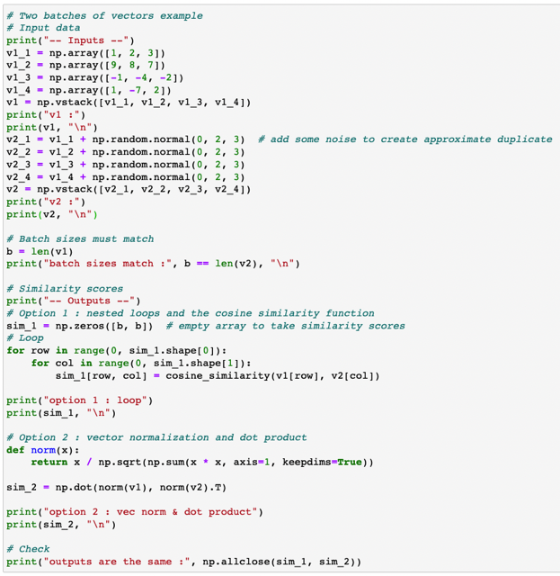</kbd>

> [!NOTE]
> Thì đại khái là để tính similarities matrix giữa batch 1 và batch 2 có
> 2 cách:
>
> Cách 1 là loop trong v1 v2 và lần lượt tính cosine similarity của các
> vector tương ứng.
>
> Cách 2 đó là vectorization, = **dot product của norm v1 và norm v2.
> transposed np.dot(norm(v1), norm(v2).T)**

 

<kbd>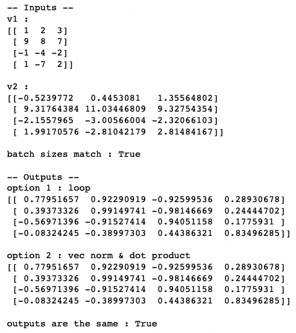</kbd>

 

### Hard Negative Mining

 

<kbd>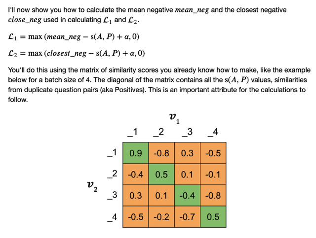</kbd>

 

<kbd>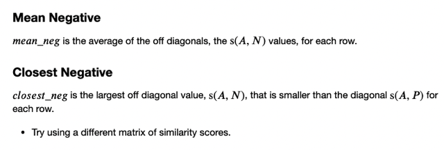</kbd>

> [!NOTE]
> Nhắc lại
>
> Mean negative của một hàng là **mean của tất cả các ô không
> phải đường chéo của hàng đó**. Ví dụ hàng 1 sẽ là mean của
> -0.8, 0.3, và -0.5.
>
> Còn closet negative là **ô không phải đường chéo mà có giá
> trị gần nhất với đường chéo**. Ở đây đối với hàng 1 là 0.3

 

<kbd>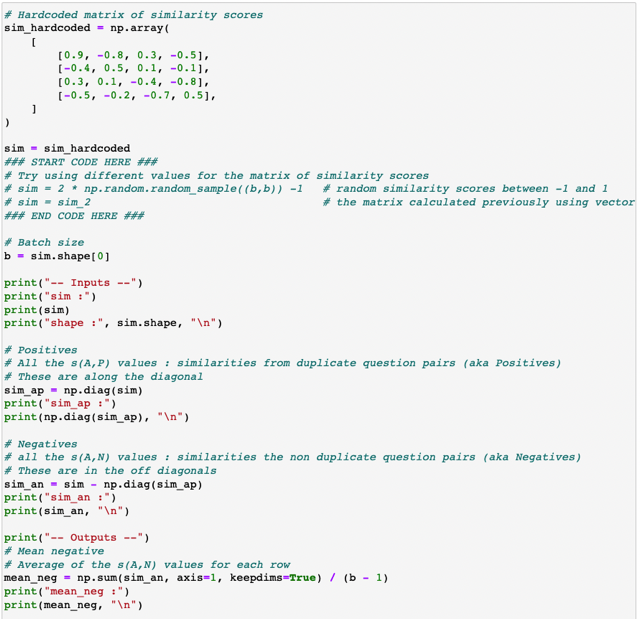</kbd>

 

<kbd>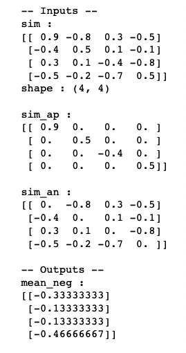</kbd>

> [!NOTE]
> Tính **mean negative thì không khó hiểu:
>
> Đ**ầu tiên là lấy **đường chéo ra thành dùng np.diag()** để được **matrix
> cùng shape, 0 hết ngoài đường chéo là bằng matrix gốc**.
>
> Xong **lấy cái matrix gốc trừ cái matrix đó đi** để được **matrix đã "bỏ
> đường chéo"**.
>
> Cuối cùng**mean thì đầu tiên là sum, axis = 1** thì hiểu rồi, sau đó chia
> cho b-1 là bởi b là số cột, trừ đường chéo nên còn b - 1 (số ô không phải
> đường chéo trong hàng).
>
> Chú ý bước cuối không thể dùng np.mean (axis=1) vì nó sẽ bao gồm
> luôn đường chéo (tuy tử số / sum sẽ ko ảnh hưởng vì giá trị đường chéo
> đã set = 0 nhưng mẫu số sẽ chia cho b thay vì b-1)

 

<kbd>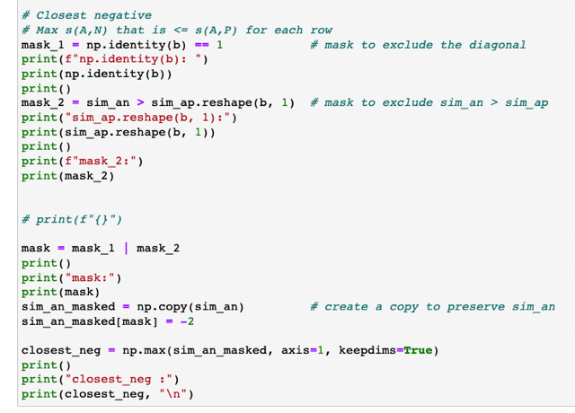</kbd>

> [!NOTE]
> Còn tính cái closest
> negative thì khó hiểu hơn. Chắc tìm hiểu sau

 

### The Loss Functions

 

<kbd>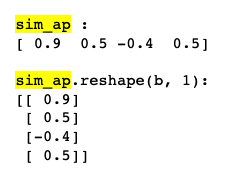</kbd>

<kbd></kbd>

<kbd>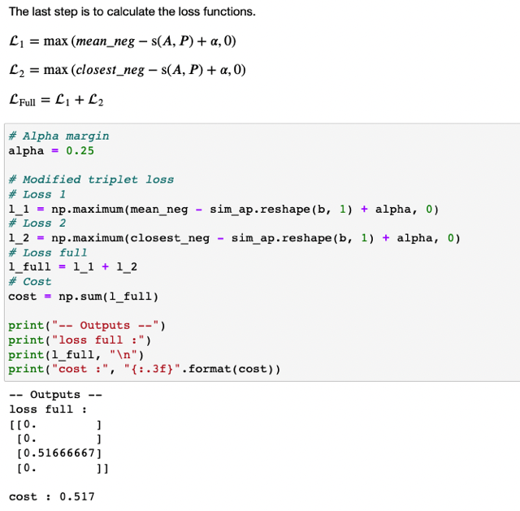</kbd>

> [!NOTE]
> **mean_neg** sẽ là**4x1** - 4 hàng 1 cột, **giá trị mỗi hàng là mean negative của hàng
> đó.
>
> closest_neg** sẽ là**4x1** - 4 hàng 1 cột, **giá trị mỗi hàng là closest neg của hàng
> đó.**
>
> Còn **sim_ap** là vector 1x4 lấy đường chéo ra bằng function **np.diag()**. Nó ra
> **vector hàng** nên cần**reshape để chuyển thành cột tương ứng với mean_neg**
> **4x1.**
>
> Áp dụng công thức trừ nhau và lấy max ta được loss trên các sample data đó.
>
> Có nghĩa là l1, l2 vẫn là hai vector cột 4x1. Tổng lại được một
> vector l_full (4x1).
>
> Như đã note ta hiểu cách này, **thay vì phải chuẩn bị một negative sample cụ
> thể** ví dụ có thêm **v3 chứa các câu negative của v1** (v2 chứa positive) thì
> bây giờ **sẽ xem mấy câu khác hàng trong batch v2 là negative và tính s(A, N)
> là trung bình của câu v1 với các câu khác hàng trong v2.**Tổng hết các hai giá trị của l_1 và l_2 chính là loss của b cái data sample

 

## One-shot Learning

 

### 1. The scenario presented involves**identifying whether a certain poem's author is Lucas or not**.

> [!NOTE]
> 1. The scenario presented involves**identifying whether a certain poem's author is Lucas or not**.
>
> 2. **Two approaches** are discussed for this identification task: **classification** and **one-shot learning**.
>
> 3. In classification, **poems are categorized into K possible classes**, where **K represents the number
> of authors**, and a **model is trained using a softmax function to classify new poems**.
>
> 4. **One-shot learning** is introduced as an **alternative to classification** when **dealing with new poems
> or signatures.**
> 5. One-shot learning focuses on **recognizing an author's signature or style** from **just one example**,
> making it **more efficient** **and** **effective** when **few examples are available**.
>
> 6. **The key in one-shot learning is to \\_use a learned similarity function\\_ that \\_compares the similarity
> between two signatures (or poems)\\_ \\_instead of predicting classes\\_ directly.**
>
> 7. The **goal in one-shot learning** is to **determine which class (author) a new poem belongs to** by
> \\_**measuring its similarity to known examples**\\_, \\_rather than **training a classification model**\\_ on all
> possible classes.

 

<kbd>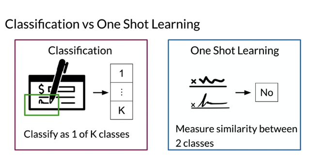</kbd>

> [!NOTE]
> Đại khái là giả sử **yêu cầu cho model là check xem chữ kí có phải là của ông A** hay không.
>
> Thì với **bài toán classification** là ta sẽ train model với data là chữ kí, label - là class (A, B,C...) Xong thì **khi cần predict ta
> đưa cái chữ kí** vào nó sẽ **predict ra một vector các probability scores** là nó thuộc về class nào (1,2..K)  Và**lấy class có
> p lớn nhất ra**. Nếu là A thì đúng (**có thể yêu cầu p cao hơn một threshold nào đó nữa**).
>
> Làm vậy cũng được, nhưng **giả sử có thêm một ông khách hàng mới**, thì rõ ràng **phải train lại model với data mới có
> thêm chữ kí của ông đó**. Và lần sau khi kiểm tra thì model nhận chữ kí và tính toán ra vector có K+1 probability scores.
>
> Rồi lại lần sau nữa **có thêm khách hàng B** lại phải **train model với dataset có thêm chữ kí ông B** được gắn label là ông
> B.
>
> Và **một ý quan trọng rằng** **để train classification model** như vậy  **không thể chỉ có một chữ kí - một ngườ**i, **mà phải
> cần nhiều chữ kí** thì model mới học tốt được (giống như training**bài toán dog cat classifier thì phải có nhiều hình khác
> nhau  của chó và mèo** **chứ không chỉ có mỗi loại một tấm**) Thì rõ ràng **điều này rất khó, vì chữ kí hoặc ảnh chụp khuôn
> mặt lấy đâu ra nhiều**
>
> Thì ý tưởng là nếu ta có thể có một cái model **học được cách đưa vào hai chữ kí bất kì**, **hoặc 2 cái mặt người bất kì**
> thì nó \_**có thể nhận ra 2 chữ kí đó, hay 2 cái mặt đó có phải là của cùng 1 người hay không (không cần biết là người đó là
> ai),**\_ dựa trên việc model học được các **yếu tố, pattern nào đó của chữ kí hay khuôn mặt**.
>
> Thì nếu làm được như vậy, thì với ví dụ trên,**có bao nhiêu ông khách hàng mới cũng không cần train lại model**, vì khi cần
> check **chỉ cần lấy chữ kí gốc trong hồ sơ cùng với chữ kí cần check bỏ vào model,**và **vì nó đã học được những pattern
> nào đó cho thấy hai chữ kí có phải cùng 1 người** không nên nó có thể cho ra dự đoán là yes hay no hai chữ kí này thuộc
> về cùng 1 người, không cần biết người nào.
>
> Còn nếu **muốn check xem chữ kí hay khuôn mặt này là của ai** chỉ cần "**chạy" qua hết** - **bỏ từng cặp chữ kí gốc + chữ
> kí cần check)** qua model**để tính điểm (similarity score)**, **cái nào lớn nhất và lớn hơn một threshold nào đó** thì **suy ra
> chữ kí hay khuôn mặt là của người đó. (**Nếu model được train tốt thì nó sẽ chỉ cho điểm cao nếu cặp chữ kí đó của cùng 1
> người)
>
> Tóm lại là **không cần phải retrain model mỗi khi thêm người mới  vào công ty (để nhận diện khuôn mặt) hay khách hàng
> (nhận diện chữ kí)** (mà **có muốn train cũng khó vì không có nhiều dữ liệu**) **mà chỉ cần add thêm face image hay chữ kí
> người mới vào dữ liệu** (để khi check thì lấy ra + hình chụp khuôn mặt từ cam, chữ kí cần check đưa vào model để xem có
> phải là cùng 1 nguời không) là xong.

 

<kbd>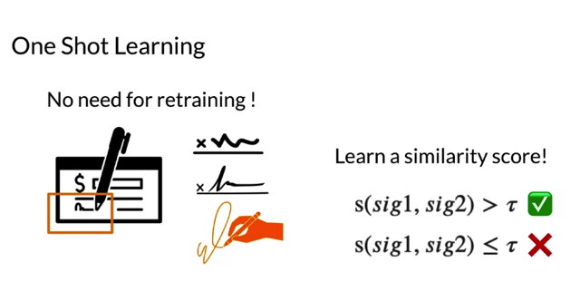</kbd>

> [!NOTE]
> 6. **The key in one-shot learning is to \_use a learned similarity function\_ that \_compares
> the similarity between two signatures\_ (or poems) instead of predicting classes directly.**
>
> 7. The **goal in one-shot learning** is to **determine which class (author) a new poem
> belongs to** by **measuring its similarity to known examples**, rather than **training a
> classification model** on all possible classes.

 

## Training & Testing

 

### 1. Introduction to **Siamese Network**: The passage introduces the concept of a \\*Siamese network, which is

> [!NOTE]
> 1. Introduction to **Siamese Network**: The passage introduces the concept of a **Siamese network, which is
> designed to determine the similarity between pairs of inputs**. In this case, it will be **used to identify whether
> two questions are duplicates.**
>
> 2. **Quora Question Duplicate Dataset**: The**dataset used for training** the Siamese network **contains pairs of
> questions labeled with a Boolean value** indicating **whether they are duplicates or not.**
>
> 3. **Preprocessing and Batch Formation**: The **dataset** is **preprocessed into batches** of size **"b"** in such a way
> that the \\_**corresponding questions from each batch are duplicates**\\_. However, \\_**there are no duplicates within
> an individual batch**\\_.
>
> 4. **Siamese Model Architecture**: The Siamese network c**onsists of two subnetworks**, each having the**same
> learned parameters.** The subnetworks**take the question embeddings** and **process them using an LSTM**
> layer to **obtain output vectors**. The **cosine similarity between the output vectors is calculated.**
>
> 5. **One-Shot Learning**: During testing, the Siamese network **performs one-shot learning**, where **it converts
> each input question into an array of numbers**, **computes the similarity score** using cosine similarity, and
> **classifies questions as duplicates** if the similarity score **exceeds a threshold "Tau."**
>
> 6. **Hyperparameters**: The **threshold "Tau"** and the **margin "Alpha"**from the**loss function** are **tunable
> hyperparameters** that can be **adjusted to optimize the model's performance.**
>
> 7. Implementation in Programming Exercise: In the programming exercise, participants will use the Siamese
> network with the **Quora question duplicate dataset** to achieve **high accuracy in classifying duplicate
> questions.**

 

<kbd>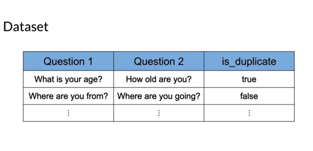</kbd>

> [!NOTE]
> Dataset để train Siamese network ở P.A sẽ là bộ câu có
> đánh label là is_duplicate hay không như vầy. Ta sẽ dùng
> nó để train. Cụ thể là bộ **Quora Duplicate Question Dataset.**

 

<kbd>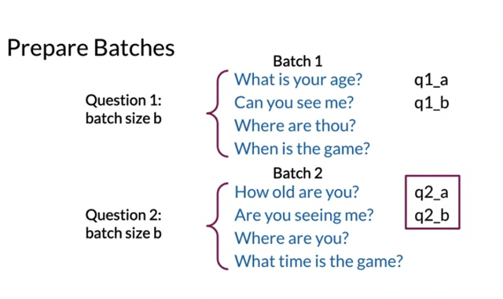</kbd>

> [!NOTE]
> Đại khái ta sẽ c**huẩn bị data thành từng bộ 2 batch**, **mỗi câu trong batch
> này là duplicate với câu ở vị trí tương ứng trong batch kia**. Nhưng**các
> câu trong cùng batch không duplicate nhau**. Yêu cầu này là để ta có thể
> thực hiện phương pháp gọi là "**modified triplet loss**" với **mean neg** và
> **closest neg** thay vì phải có negative sample như đã biết.

 

<kbd>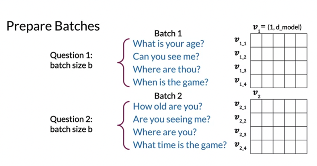</kbd>

> [!NOTE]
> Sau đó **đưa batch các câu vào model** để **forward pass ra các
> embedding vectors v1, v2** (batch các embedding vector của input
> sentence). Rồi **tính cosine similarity giữa chúng.**

 

<kbd>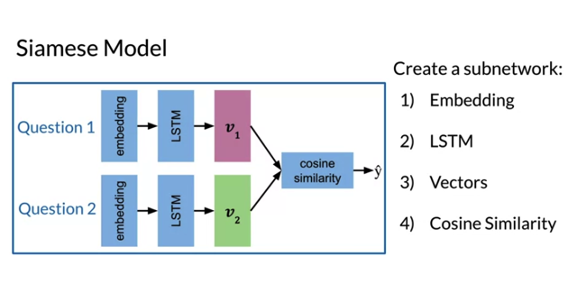</kbd>

> [!NOTE]
> Các step như sau, chú ý là hai nhánh
> (subnetwork) có cùng weights

 

<kbd>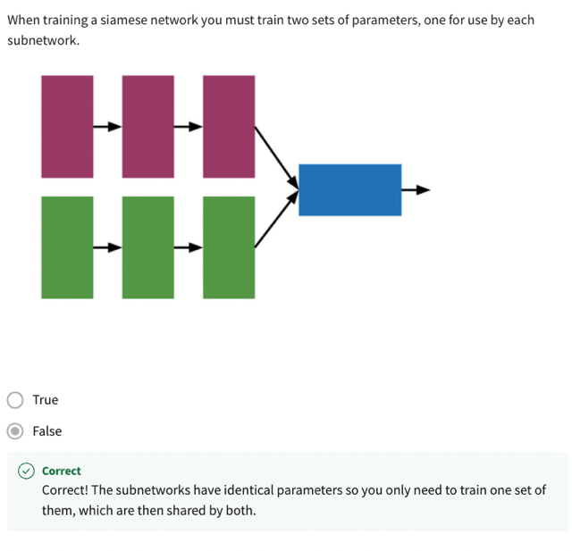</kbd>

 

<kbd>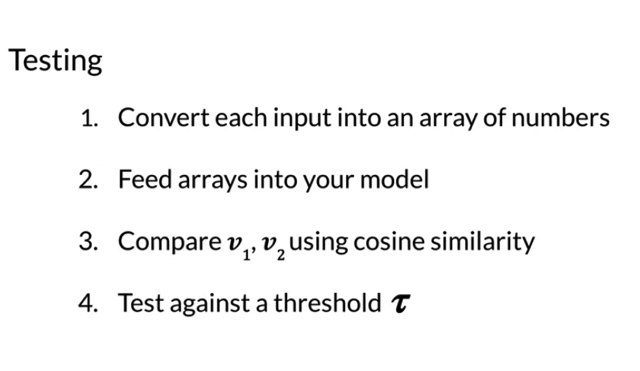</kbd>

> [!NOTE]
> Sau khi train model xong, để test thì theo các bước này. Với **mỗi cặp
> câu cần check xem có similar (duplicate) nhau không**.
>
> Đầu tiên là **convert thành array of number** mỗi **từ thay bằng index
> của nó trong vocab**. Sau đó mới **đưa vào model** (mà **layer đầu
> tiên là Embedding rồi LSTM, Dense**).
>
> Đầu ra của **hai nhánh là embedding vectors v1, v2**. Ta (model) mới
> tính **cosine similarity của hai vector này**. Rồi**dùng threshold Tau để
> quyết định có hay không** duplicate.
>
> Tham số **alpha** trong triplet loss và **Tau** là hyper parameters.

 

## Lab: Evaluating Siamese Model

 

<kbd>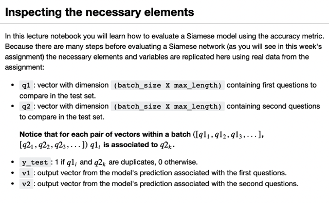</kbd>

> [!NOTE]
> Đại khái là đầu tiên, **đây là bước đánh giá (evaluate)** **model** (siamese network) **đã
> trained xong**. Ta sẽ đưa vào model (vì kiến trúc của model) **2 batch q1,q2.**
>
> Mỗi **batch có batch_size câu**, **mỗi câu dài max_length**. Tức là đưa 2 bộ câu vào,
> **thì tất nhiên phải preprocess với việc biến text thành index** và **zeros padded để các
> câu đều có cùng một size là max_length**.
>
> Và với **output của mỗi batch sẽ tương ứng là v1,v2**, ta sẽ**tính cosine similarity của
> các vector trong v1 với vector tương ứng vị trí trong v2 và so với threshold TAU** để **kết
> luận có duplicate không**.
>
> Cuối cùng **so sánh với ground truth label để đánh giá accuracy.**

 

<kbd>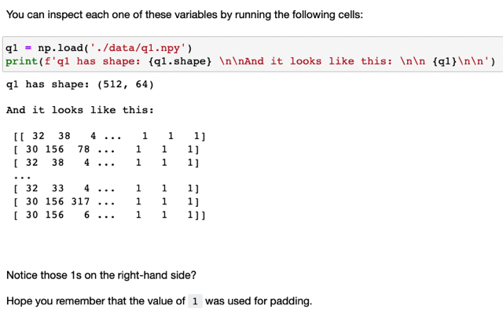</kbd>

> [!NOTE]
> ví dụ batch q1 **batch_size = 512**, mỗi câu **có 64 token** đã được preprocessed. **Số 1 ở cuối
> ta hiểu là padding** để đều có length = max_length = 64, như vậy là nó padded
> bằng 1 chứ không phải 0

 

<kbd>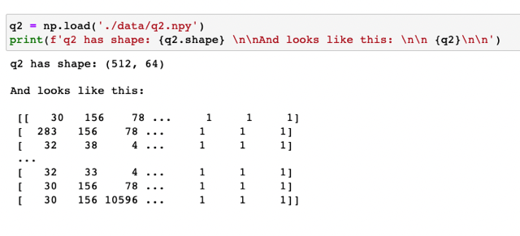</kbd>

> [!NOTE]
> Tương tự q2

 

<kbd>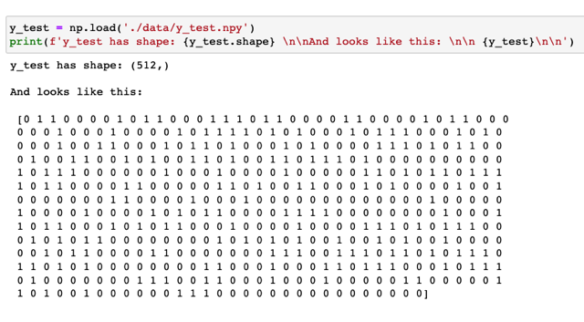</kbd>

> [!NOTE]
> Còn **ground truth label là 1D array dài 512 (batch size)**
> chứa 1 hay 0 thể hiện là cặp câu tương ứng ở cùng vị trí
> trong q1 và q2 có duplicate không.

 

<kbd>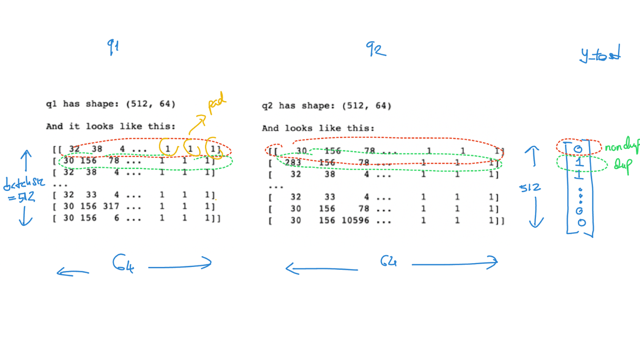</kbd>

 

<kbd>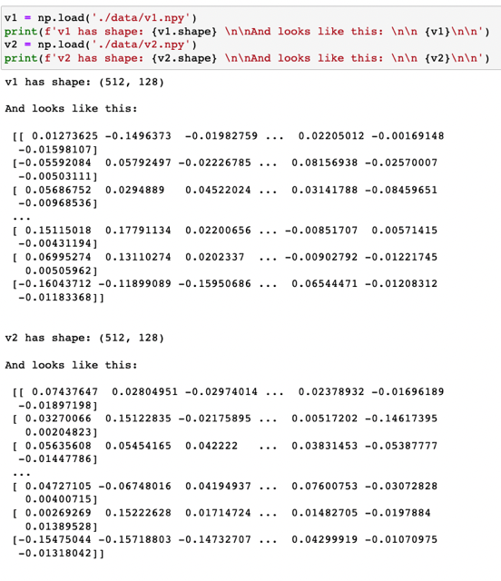</kbd>

> [!NOTE]
> v1 và v2 là hai batch of 512 embedding vector
> mỗi vector dài d_model = 128.

 

<kbd>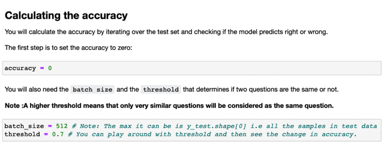</kbd>

> [!NOTE]
> Thì đại khái là để tính accuracy thì ta **loop trong các cặp tương ứng vị trí
> của v1 và v2** và **tính cosine similarity**, **so với threshold để kết luận để tạo
> ra y_pred** cũng có **length = 512**. **So y_pred với y_test để tính accuracy**

 

<kbd>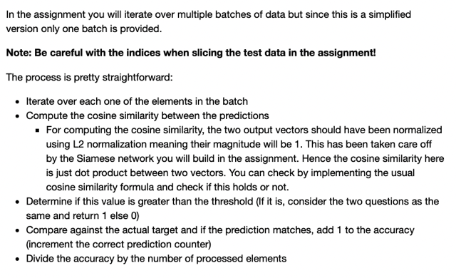</kbd>

> [!NOTE]
> Đại khái cách làm cũng rất rõ ràng, như vừa mới nói, ta sẽ**loop (iterate) qua các cặp
> embedding vector v1, v2**. Dùng nó để**tính cosine similarity** rồi **so với TAU** để
> ra **prediction** là **true hay false.** **Check với label**nếu **đúng thì +1 vào correct
> prediction count** (ở đây **dùng luôn biến accuracy**). Xong hết thì c**hia accuracy
> cho tổng số câu để ra chỉ số accuracy**.
>
> Chỉ có lưu ý là khi tính **cosine similarity** thì **hai vector phải đượ**c**L2
> normalization** - như lab trước đã làm qua - **đơn giản là chia vector cho L2 norm
> của nó để thành 2 ra vector mới normalized_v1 đều có norm = 1 lí do là để việc tính
> Cosine similarity không bị ảnh hưởng bởi norm - độ lớn của 2 vector mà chỉ focus bởi
> hướng của chúng thôi**. Có điều việc này **đã được take cared bởi Siamese
> network** mà mình build trong assignment rồi.
>
> Nên khi tính Cosine similarity**chỉ còn là dot product của normalized v1 và
> normalized v2** thôi. Vì công thức của Cosine Similarity là dot(u, v)  / (norm u * norm
> v) mà norm u, norm v = 1 chỉ còn dot (u, v)

> [!NOTE]
> L2 normalization of the embedding vectors from two branches of a Siamese network is
> often performed before computing cosine similarity to **ensure that the cosine similarity
> metric is effective and meaningful** for comparing the similarity between the two vectors.
> Let's break down the reasons for this:
>
> 1. Unit Length Vectors: Cosine similarity is based on the cosine of the angle between
> two vectors. To compute this metric, **it is important to have unit-length vectors**. L2
> normalization (also known as L2 normalization or unit normalization) **scales the vectors
> to have a magnitude of 1** while **preserving their direction**. This normalization step
> ensures that the vectors are on the surface of a hypersphere and \_**eliminates the effect
> of their magnitude, focusing solely on their orientation**\_.
>
> 2. Insensitivity to Vector Magnitude: **Cosine similarity measures the similarity** between
> vectors \_**based on their direction rather than their magnitude**\_. By normalizing the vectors,
> the **impact of the vector's magnitude is removed**, and the **focus is solely on the
> orientation of the vectors**. This is particularly useful when you want to **compare vectors
> that might have different magnitudes** but still represent similar concepts or features.
>
> 3. Improved Distance Metric: After L2 normalization, the \_**cosine similarity essentially
> becomes the dot product of the two unit vectors**\_, which **ranges from -1 to 1**. A **value of 1**
> indicates that the two vectors have the **same direction (maximum similarity)**, a value of
> **-1** means they have **opposite directions (maximum dissimilarity)**, and a **value of 0**indicates they are **orthogonal (no similarity)**. This makes cosine similarity an effective
> distance metric for comparing the similarity between vectors.
>
> 4. Invariant to Scale: L2 normalization\_**makes the similarity computation invariant to
> scaling of the vectors**\_. If the embeddings are multiplied by a constant factor, the
> resulting cosine similarity will remain unchanged. This property can be beneficial in
> scenarios where the magnitude of the embeddings may vary due to different factors.
>
> In summary, L2 normalization of the embedding vectors is a **crucial step** before
> computing cosine similarity in a Siamese network (or any other scenario) to \_**ensure that
> the similarity metric focuses solely on the orientation**\_ of the vectors, i\_**s insensitive to
> their magnitudes**\_, and provides a meaningful similarity measurement.

 

<kbd>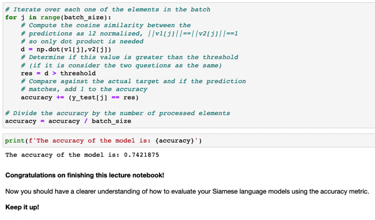</kbd>

> [!NOTE]
> Rất dễ hiểu ko có gì phải nói

 

## Week Conclusion

 

## Quiz

 

<kbd>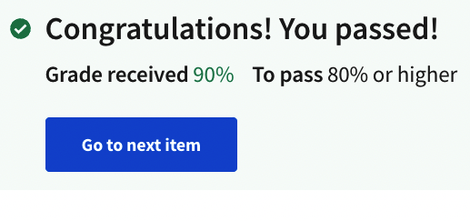</kbd>

 

<kbd>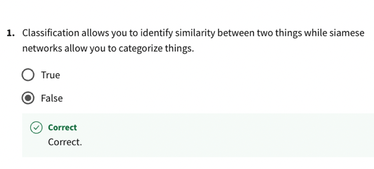</kbd>

 

<kbd>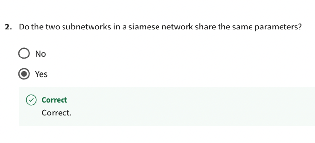</kbd>

 

<kbd>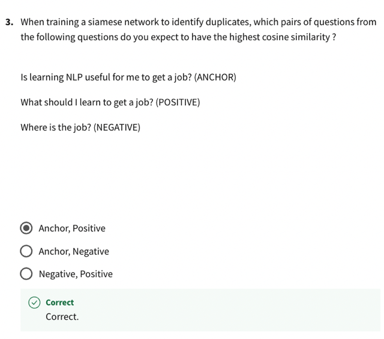</kbd>

 

<kbd>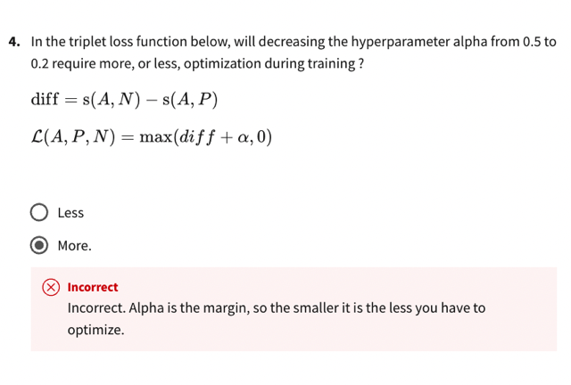</kbd>

> [!NOTE]
> Câu này hiểu đúng mà đánh
> lộn, 0.5 -> 0.2 làm giảm, tức là
> phải less optimized

 

<kbd>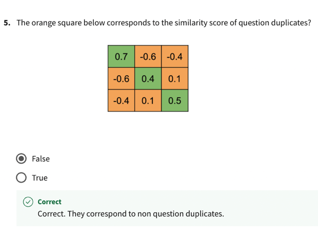</kbd>

 

<kbd>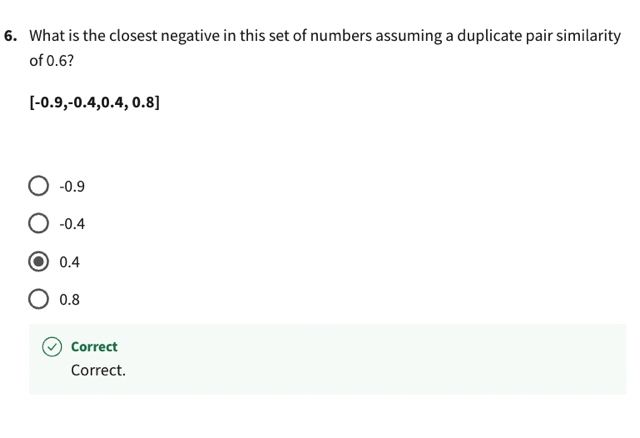</kbd>

 

<kbd>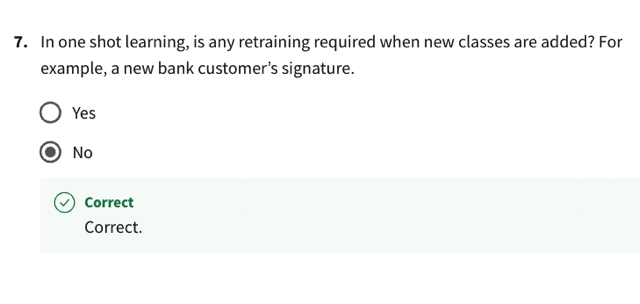</kbd>

 

<kbd>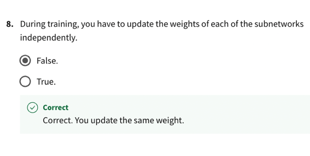</kbd>

 

<kbd>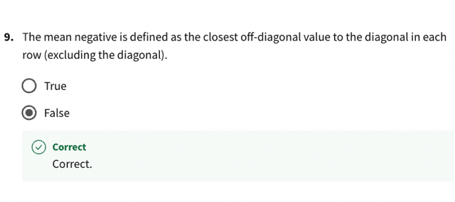</kbd>

 

<kbd>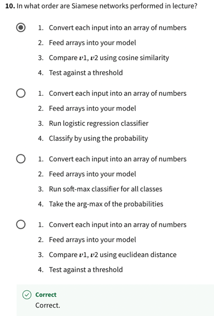</kbd>

 

## Programming Assignment: Siamese Model On Question Duplicates

 

### Welcome to the fourth assignment of course 3. In this

> [!NOTE]
> Welcome to the fourth assignment of course 3. In this
> assignment you will explore **Siamese networks** applied to
> **natural language processing**. You will further explore the
> **fundamentals of Trax** and you will be able to **implement a more
> complicated structure** using it. By completing this assignment,
> you will learn **how to implement models with different
> architectures.**

 

#### Overview

 

<kbd></kbd>

 

#### 1 - Importing the Data

 

#### 1.1 - Loading in the Data

 

#### You will be using the **Quora question answer dataset** to build a model that could**identify similar questions**. This is a **useful task** because you **don't want to have several versions of the same question posted**. Several times when teaching I end up responding to similar questions on piazza, or on other community forums. This data set **has been labeled** for you. Run the cell below to **import some of the packages** you will be using.

 

<kbd>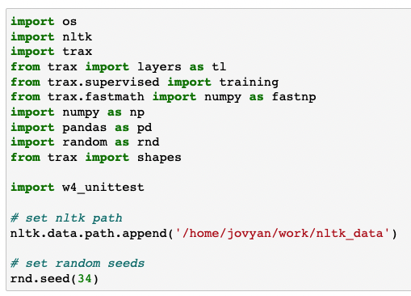</kbd>

> [!NOTE]
> Notice that for this assignment Trax's numpy is referred to as
> fastnp, while regular numpy is referred to as np.
>
> Import các lib quen thuộc như nltk giúp tokenize word, trax..

 

<kbd>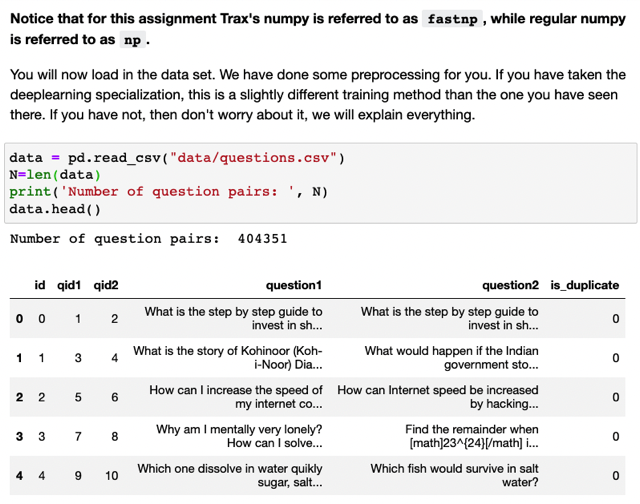</kbd>

> [!NOTE]
> Load dataset 404351 data point, mỗi cái là
> một cặp câu với label là 1 hay 0 thể hiện
> hai câu có duplicate hay không.

 

<kbd>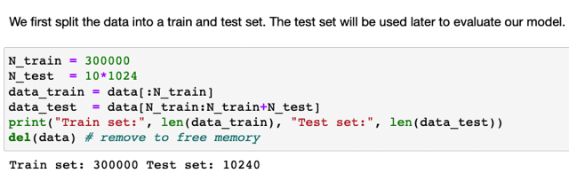</kbd>

> [!NOTE]
> Split thành 2 bộ train-test

 

<kbd>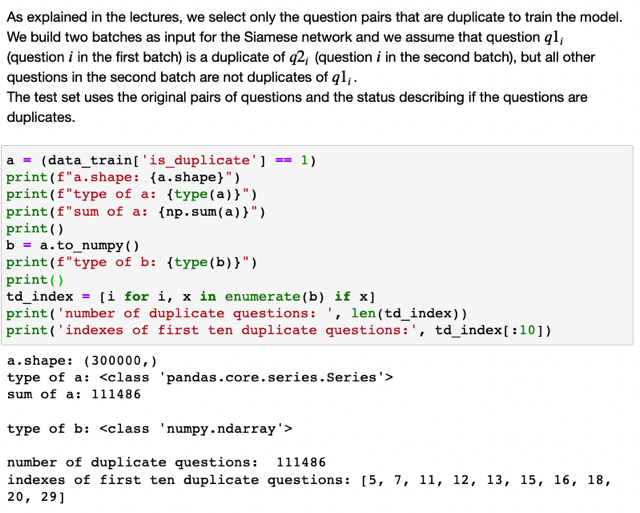</kbd>

> [!NOTE]
> Ok đoạn này quan trọng. Như trong bài đã hiểu, training data sẽ được chuẩn bị như sau: 1.
> Chia thành từng cặp 2 batches. Trong đó, chỉ có 2 câu ở cùng vị trí trong 2 batch sẽ
> duplicate nhau thôi. Do đó ta sẽ hiểu rằng, từ bộ data ban đầu, ta sẽ chỉ lấy những data
> sample mà 2 câu duplicate, vì những câu kia không dùng được.
>
> Đoạn code ở dưới đầu tiên là lấy cái column is_duplicate từ pandas DataFrame data_train
> ra ta được isDuplicateCol là một pandas Series kiểu như vector.
>
> Thực hiện phép so sánh isDuplicateCol với True, ta được a là một pandas Series mới mà
> chỗ nào trong isDuplicateCol là True thì nó là True (1) và ngược lại.
>
> Xong ta mới biến a từ dạng Series sang numpy array b bằng to_numpy()
>
> Dùng list comprehension, loop trong b, check chỗ nào b = True thì add index vào list.
>
> Nói chung ta sẽ có môt list các index trong training set mà label is_duplicate = 1.

 

<kbd>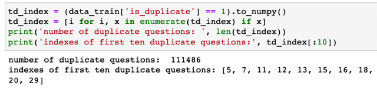</kbd>

> [!NOTE]
> Đoạn code trước là mình triển khai ra cho dễ
> hiểu chứ làm gọn thì chỉ cần 2 dòng.

 

<kbd>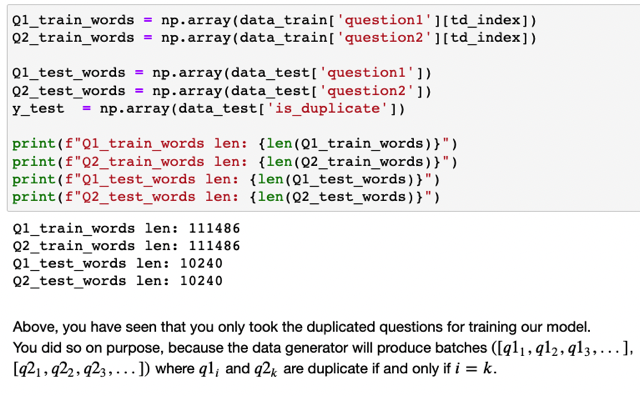</kbd>

> [!NOTE]
> Dùng cái list index td_index đó để tạo bộ training set "thật sự" (chỉ dùng
> duplicate question thôi từ 30000 giờ chỉ còn 111486), còn test set thì vẫn
> giữ nguyên (vẫn 10240)

 

<kbd>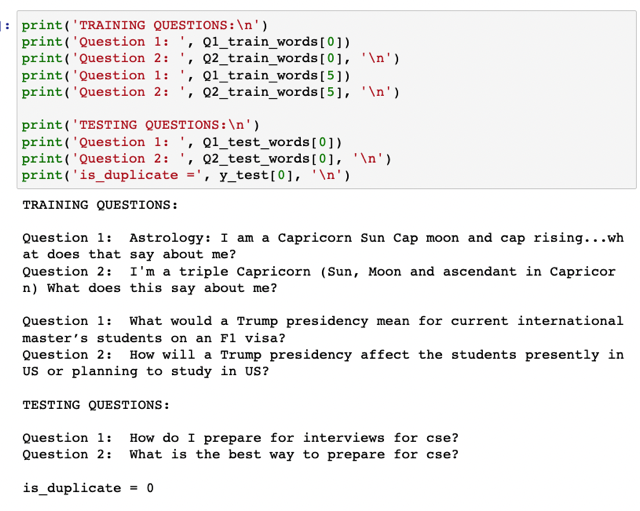</kbd>

> [!NOTE]
> Tóm lại là trong bộ training set, ground
> truth label của hai câu cùng index luôn
> duplicate, còn test thì không.

 

<kbd>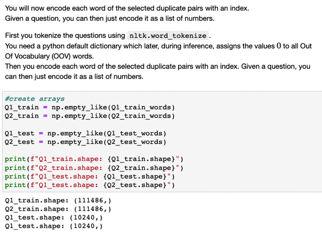</kbd>

> [!NOTE]
> Đại khái là mỗi câu sẽ "biến thành" một vector
> mỗi từ trong câu sẽ "được biến" thành một con
> số index (trong bộ vocab dict). Chuẩn bị mấy
> cái empty array sẵn.

 

<kbd>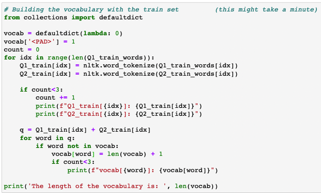</kbd>

> [!NOTE]
> Đoạn code này làm gì đơn giản chỉ là**loop trong các câu của mỗi bộ**Q1_train_words
> và Q1_train_words, dùng nltk để tokenize **biến mỗi câu thành một list các từ** để bỏ
> vào Q1_train và Q2_train.
>
> Rồi sẵn có các từ, thì tạo bộ vocab là một cái dictionary, **map từ và index (index tăng
> dần thôi) từ nào gặp trước thì vào trước (vị trí đầu là thằng <PAD> xí chỗ trước)**Chú ý đây là dictionary, map giữa**word - index** và khi mình b**ắt đầu với index = 1 là
> <PAD> (<PAD>:1)**, những từ sau sẽ là 2 (Astrology: 2), 3 (":" : 3)...Tức là**trong vocab
> dic không có value = 0**, và mình sẽ **return 0 nếu từ không có trong vocab.**Ví dụ**vocab.get("askdfh", 0)**

 

<kbd>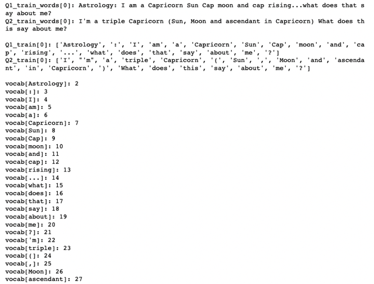</kbd>

 

<kbd>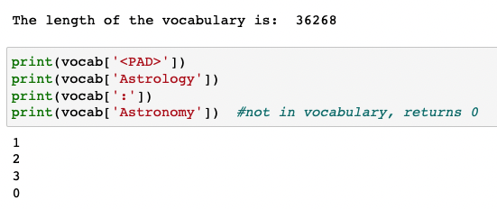</kbd>

 

<kbd>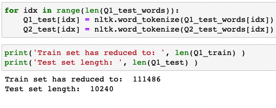</kbd>

> [!NOTE]
> Tương tự, tokenize test set. Nhưng không update
> vocab vì vocab chỉ dùng cho training. Trong test sét,
> từ nào vocab không có sẽ là OOV

 

#### 1.2 - Converting a Question to a Tensor

 

<kbd>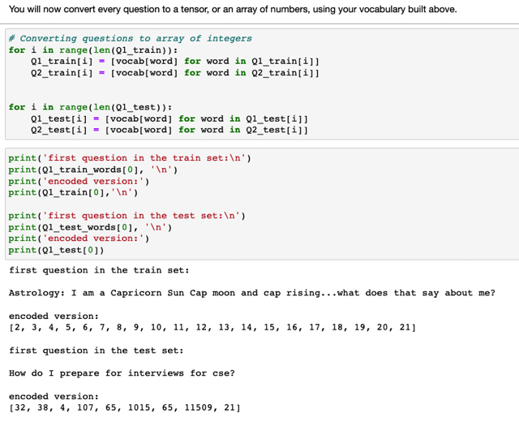</kbd>

> [!NOTE]
> Sau khi đã có vocab dict, ta loop trong các Q1_train,
> Q2_train. Mỗi vị trí trong đó là một cái list các từ, dùng list
> comprehension biến nó thành líst các index. và assign lại
> vào vị trí cũ.

 

<kbd>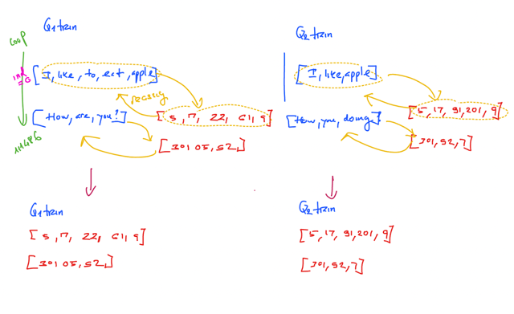</kbd>

 

<kbd>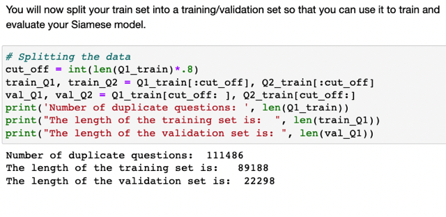</kbd>

> [!NOTE]
> Dùng 20% train set
> làm validation set

 

#### 1.3 - Understanding the Iterator

 

<kbd>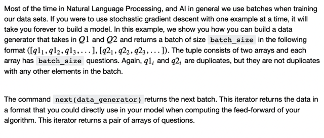</kbd>

> [!NOTE]
> Đại khái là ta sẽ build một cái**data generator** giúp **nhận nguyên bộ
> data Q1 và Q2** trong training set và**trả ra từng cặp 2 batch:** **mỗi
> batch chứa batch_size câu**, trong đó **các câu cùng vị trí và chỉ có
> cùng vị trí trong hai batch sẽ duplicate nhau.**

 

#### Exercise 1 - data_generator (UNQ_C1)

 

<kbd>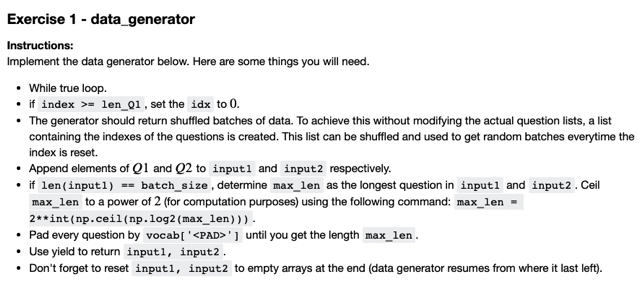</kbd>

 

<kbd>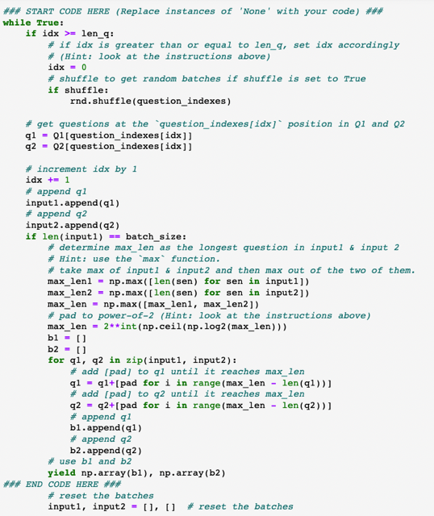</kbd>

<kbd></kbd>

<kbd>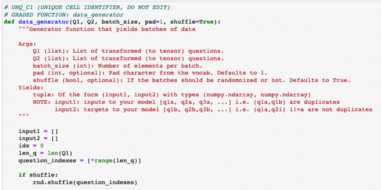</kbd>

 

<kbd>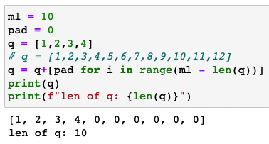</kbd>

 

<kbd>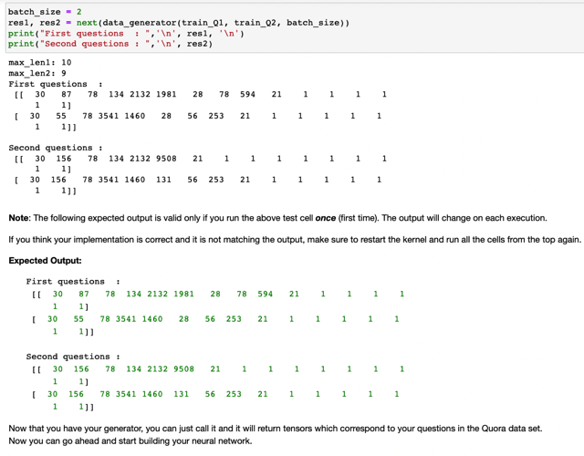</kbd>

 

<kbd>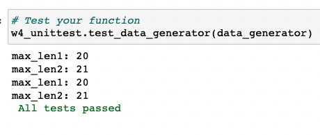</kbd>

 

#### 2 - Defining the Siamese Model

 

#### 2.1 - Understanding Siamese Network

 

<kbd>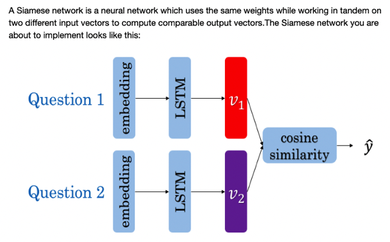</kbd>

 

<kbd>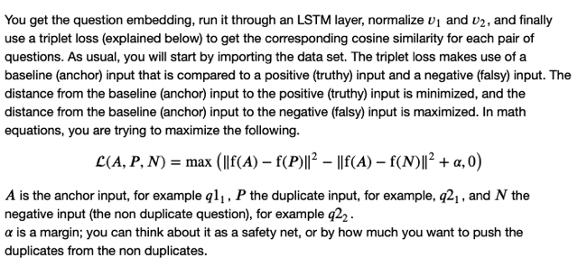</kbd>

 

#### Exercise 2 - Siamese (UNQ_C2)

 

<kbd>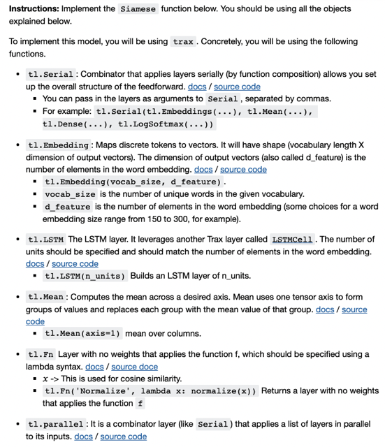</kbd>

 

<kbd>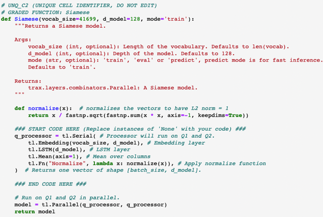</kbd>

> [!NOTE]
> Ví dụ b = 10, Tx = max_len = 30, v là vocab_size = 10000, d = 300
>
> 1.**(b, Tx, v):** Input là từng batch có 10 câu, mỗi câu có 30 token, 
> mỗi token được "biến" thành one-hot vector dài 10000.
>
> 2. **(b, Tx, v) -> Embedding -> (b, Tx, d)**: Qua embedding, mỗi token
> từ one-hot vector dài v trở thành embedding vector dài d
>
> 3.**(b, Tx, d) -> LSTM -> (b, Tx, d)**: Qua LSTM, input x<t> tại mỗi timestep
> (b, d) sẽ output ra y<t> cũng là (b, d) vì chọn number of units được
> khuyên nên match với word embedding's size tức là bằng d.
>
> Nên output của LSTM tại mỗi timestep y<t> cũng là vector dài d.
> Tính trong batch và toàn bộ timestep = toàn bộ chuỗi sẽ là (b, Tx, d)
>
> 4. **(b, Tx, d) -> Mean(axis=1) ->** **(b, d)**: Ý nghĩa: Đó là từ 30 (Tx) cái
> vector đại diện của 30 từ trong một sequence, mỗi vector dài 300.
> Ta tính mean để thành vector đại diện cho cái câu đó. Vector cũng dài 
> 30.
> Thành trong 10 câu trong batch thì được 10 vector.
>
> 5. Và cuối cùng normalize để các vector có norm = 1.
> Như vậy mỗi câu đã trở thành một embedding vector đại diện chứa
> thông tin ngữ nghĩa của câu đó. Đó chính là v1 (ở một batch khác đi
> nhánh kia là v2)

 

<kbd>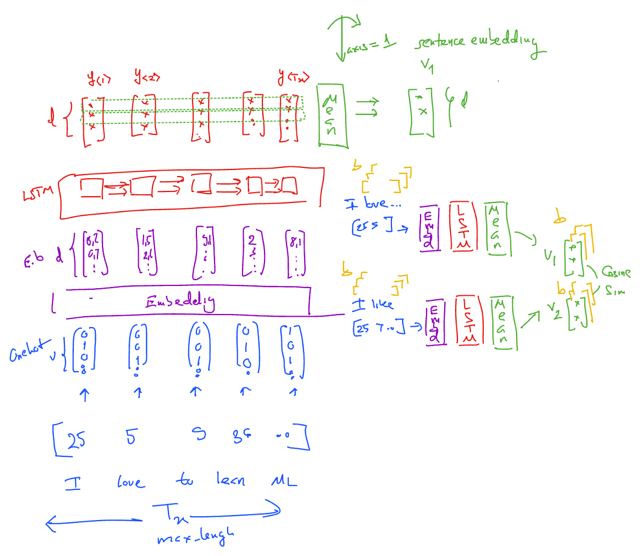</kbd>

 

<kbd>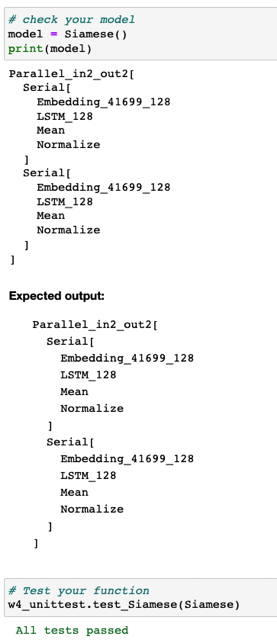</kbd>

 

#### 2.2 - Hard Negative Mining

 

<kbd>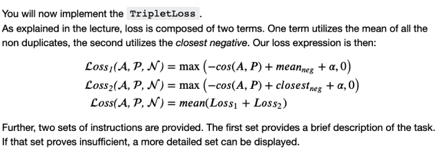</kbd>

> [!NOTE]
> Như đã biết trong lecture, ta sẽ tính một phiên bản modified của Triplet loss trong
> đó dùng chính những câu không duplicate trong data làm negative. Có điều ở đây
> nói dùng mean của Loss 1 và Loss 2 chứ không phải sum. Tuy nhiên mean hay
> sum thì cũng như nhau trong optimize model

 

#### Exercise 3 - TripletLossFn (UNQ_C3)

 

<kbd>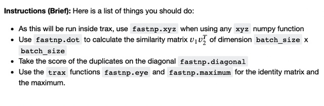</kbd>

 

<kbd>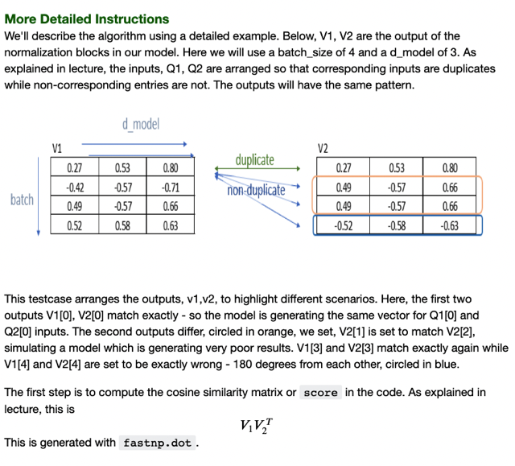</kbd>

 

<kbd>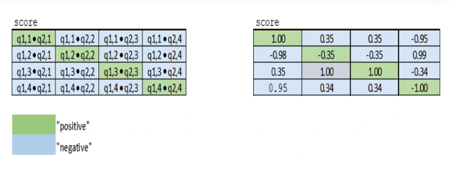</kbd>

 

<kbd>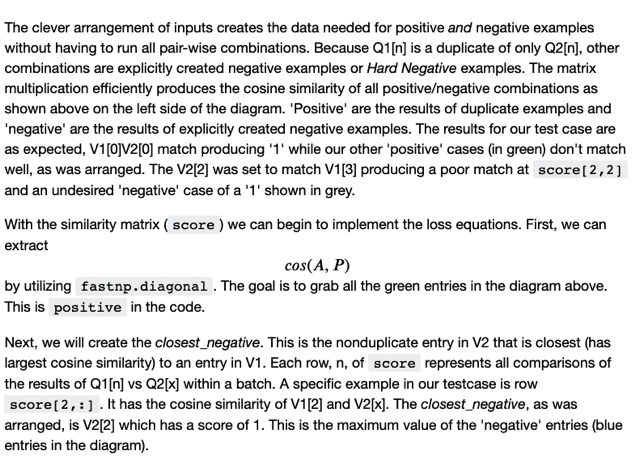</kbd>

 

<kbd>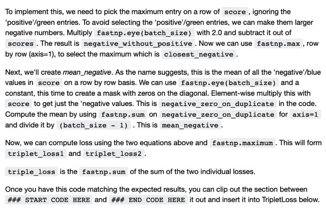</kbd>

 

<kbd>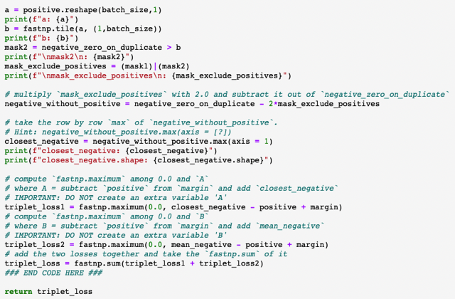</kbd>

<kbd></kbd>

<kbd>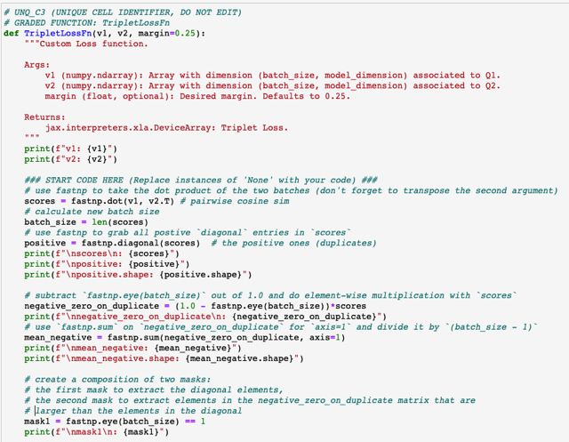</kbd>

> [!NOTE]
> Những điểm mấu chốt:
>
> ***Tính cos(A,P)** là lấy đường chéo ra (dùng .diagonal(scores)) nó sẽ ra 1D vector (b,)
>
> ***Tính mean_neg**: Huỷ đường chéo (set sao cho đường chéo = 0) Đó chính là
> negative_zero_on_duplicate. Lấy sum qua axis 1 rồi chia cho batch_size - 1 là được
> mean_neg vector cũng 1D vector (b,). *Lí do chia batch_size - 1 là vì Ta đang tính
> trung bình các negative score nên không tính cái positive score ở đường chéo nên
> trong 1 hàng của score có b, thì bỏ cái ô của đường chéo là còn b -1 ô.
>
> ***Tính closest_neg**: Thì phải chú ý rằng: Theo công thức là phải lấy cái negative MÀ
> GẦN NHẤT NHƯNG NHỎ HƠN (**) positive score chứ không phải chỉ là gần nhất
> không thôi.
>
> Đầu tiên, ý tưởng làm đó làm tạo ra một cái matrix mà chỗ nào là đường chéo, hoặc
> có giá trị lớn hơn giá trị của đường chéo trong hàng của nó thì cho bằng 1. Còn lại
> bằng 0.
>
> Thì để làm vậy ta cho nó chính là phép OR (|) của hai matrix:
>
> Cái thứ nhất mask1 là chỗ nào đường chéo thì 1, còn lại 0. Rất dễ dàng, dùng fastnp.
> eye(batch_size) thôi.
>
> Cái thứ hai mask2 thì đầu tiên ta phải tạo một cái matrix mà giá trị mỗi hàng đều bằng
> ô đường chéo của hàng đó. Ta làm vậy bằng  cách lấy cái vector đường chéo đang là
> 1D (b,), đem reshape thành 2D vector cột (b,1) rồi duplicate lên b lần và stack lại.
>
> Quá trình này chính là đoạn tính a, và b. Dùng function fastnp.tile(a, (1, batch_size))
>
> Có mask2 rồi thì lấy phép OR với mask1 và mask2 sẽ cho ra cái
> mask_exclude_positive = là cái matrix mà chỗ nào là đường chéo, hoặc có giá trị lớn
> hơn ô đường chéo của hàng của nó.
>
> Cuối cùng bước quan trọng là DÌM HÀNG NHỮNG Ô NÀY, bằng  cách nhân cho 2 rồi
> nhân cho scores matrix để tạo thành score matrix mà chỗ nào có hai yếu tố trên sẽ có
> giá trị = 2, những chỗ khác vẫn = 0.
>
> Rồi lấy cái matrix score đã huỷ đường chéo ở trên trừ đi cho nó. Mục đích là những
> chỗ không có hai tính chất trên vẫn giữ nguyên, còn ngược lại (là đường chéo hoặc có
> giá trị lớn hơn đường chéo) sẽ biến thành -2 - là thấp nhất trong các  ô trong hàng vì
> vốn các ô chỉ có range -1:1.
>
> Đến lúc này lấy max với axis = 1 thì ta sẽ được thằng cao nhất trong hàng nhưng trừ
> thằng đường chéo và thằng to hơn đường chéo. Thì đó chính là thằng "closest but
> less than" để dùng là closest negative.
>
>
> *Còn lại là tính theo công thức thôi. Để positive, mean_neg hay closest_neg đều là 1D vector (b,)
>
> ===================================
>
>
> **Tại sao: Vì sao thì xem lại note màu xanh trong bài giảng nhưng cũng chưa rõ ràng
> mà chỉ thấy rằng có vẻ bất hợp lý khi chọn  negative là câu có score gần nhất nhưng
> lại lớn hơn. Vì đã negative thì phải nhỏ hơn thì model mới mới tìm cách phân biệt sao
> cho kéo điểm của câu nhỏ xuống. Còn nếu trong batch có một câu mà điểm nó còn
> cao hơn đường chéo thì việc kéo câu này xuống trong khi lại kéo câu positive lên thì
> có vẻ conflict nhau.

 

<kbd>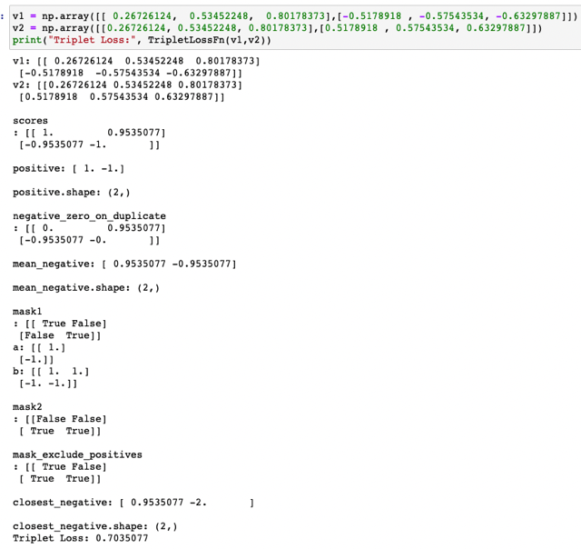</kbd>

 

<kbd>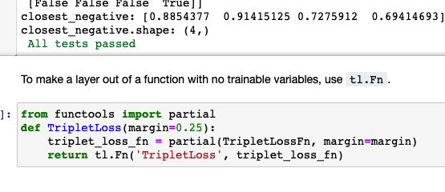</kbd>

 

#### 3 - Training

 

#### 3.1 - Training the Model

 

<kbd>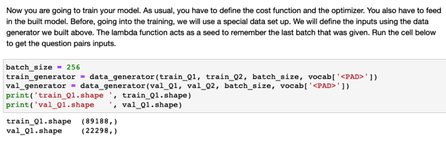</kbd>

 

<kbd>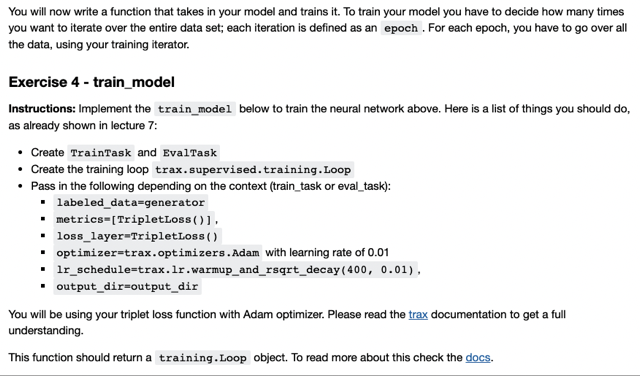</kbd>

 

#### Exercise 4 - train_model (UNQ_C4)

 

<kbd>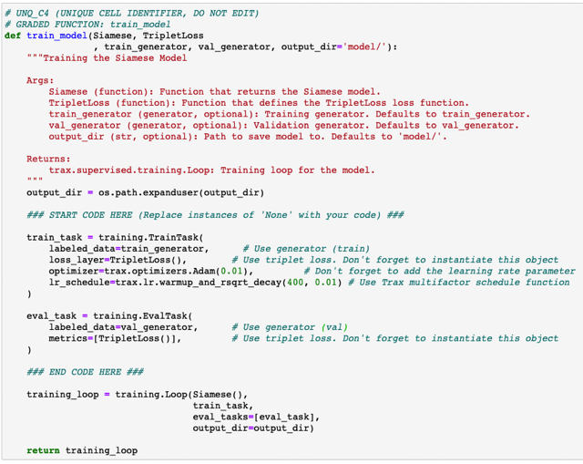</kbd>

 

<kbd>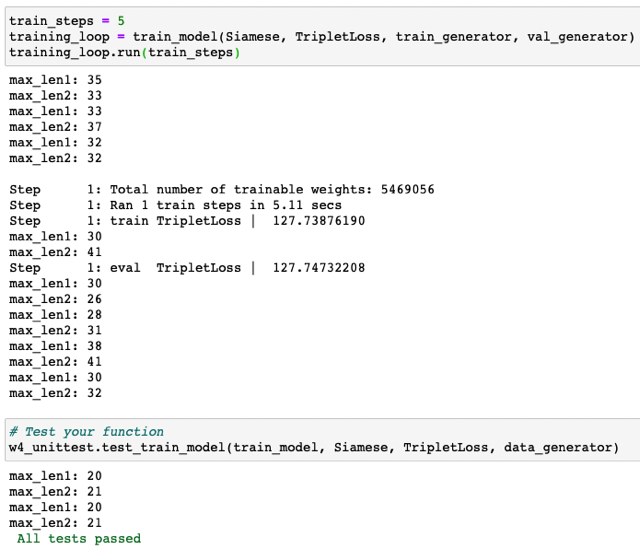</kbd>

 

#### The model was only trained for 5 steps due to the constraints of this environment. For the rest of the assignment you will be using a pretrained model but now you should understand how the training can be done using Trax.

> [!NOTE]
> Đại khái là train thử 5 epochs thôi còn lại dùng pre-trained
> model vì điều kiện environment không cho phép

 

#### 4 - Evaluation

 

#### 4.1 - Evaluating your Siamese Network

 

<kbd>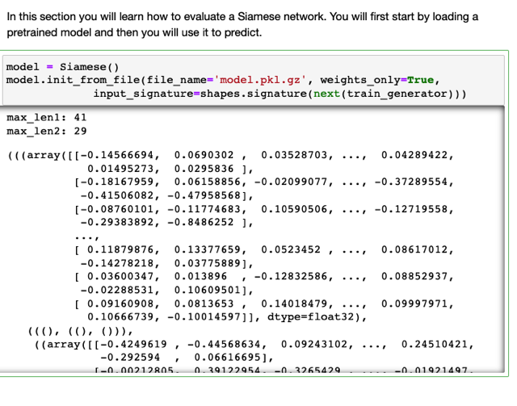</kbd>

> [!NOTE]
> Load pretrained model

 

#### 4.2 - Classify

 

#### To determine the accuracy of the model, we will **utilize the test set** that was configured  earlier. While in training we used only positive examples, the test data, Q1_test, Q2_test  and y_test, is setup as pairs of questions, some of which are duplicates some are not.  This routine will **run all the test question pairs** **through the model**, **compute the cosine  simlarity of each pair**,**threshold it** and **compare the result to y_test** - the correct response  from the data set. The results are **accumulated to produce an accuracy.**

> [!NOTE]
> Khác với training set chỉ dùng các duplicate sentence (việc sử lý ở lúc đầu) thì ở test
> set ta sẽ giữ nguyên. Cách làm rất rõ ràng: Đó là ta sẽ loop trong test sét, lấy từng
> cặp câu ra, tokenize để thành sequence các index trong vocab. Rồi đưa vào model
> để nó tính ra cosine similarity, xong ta so với threshold để có kết luận y^ là có
> duplicate (1) hay không (0). Rồi so với ground truth label y (1 hoặc 0). Update
> accuracy.

 

#### Exercise 5 - classify (UNQ_C5)

 

<kbd>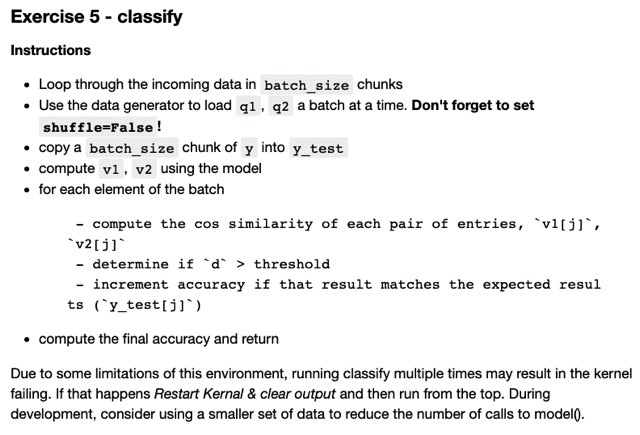</kbd>

 

<kbd>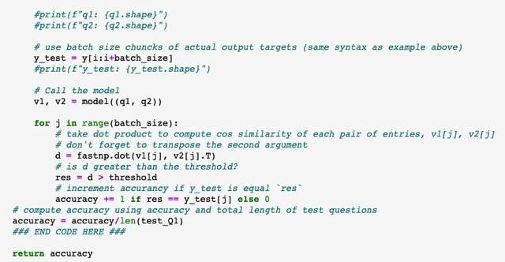</kbd>

<kbd></kbd>

<kbd>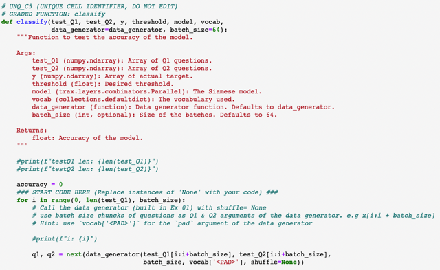</kbd>

> [!NOTE]
> Hai chỗ khó khi làm bị stuck đó là phải dùng
> **next**(data_generator(...)) . 2. Đưa q1, q2 vào
> model dưới dạng**tuple model((q1,q2))**

 

<kbd>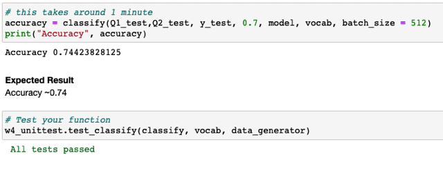</kbd>

 

#### 5 -Testing with your Own Questions

 

#### Exercise 6 - predict (UNQ_C6)

 

<kbd>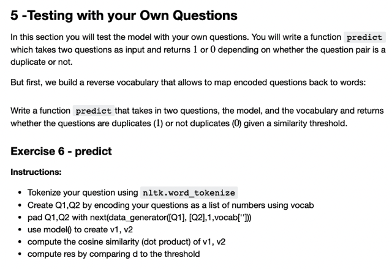</kbd>

 

<kbd>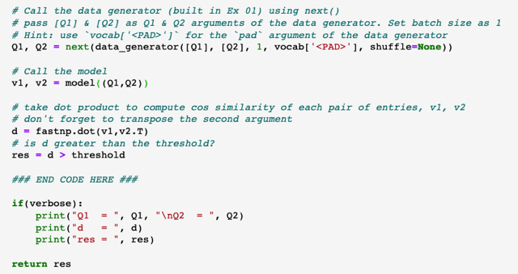</kbd>

<kbd></kbd>

<kbd>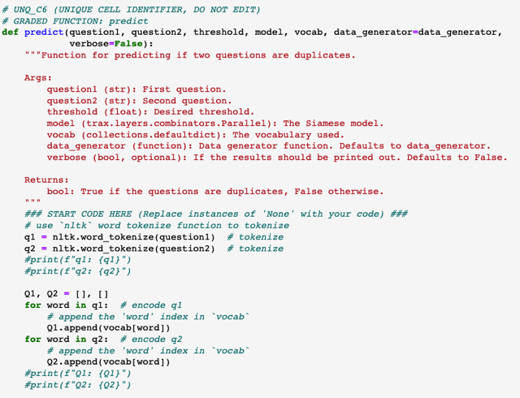</kbd>

> [!NOTE]
> Làm theo hint những cũng không khó hiểu. Chỉ có
> cái là chưa rõ tại sao đưa Q1 Q2 vào
> data_generator dưới dạng [Q1], [Q2]

 

<kbd>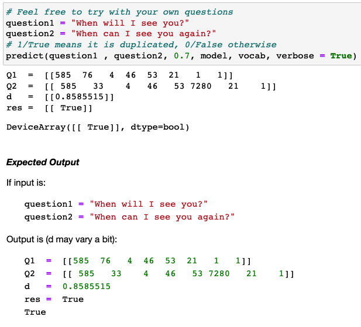</kbd>

 

<kbd>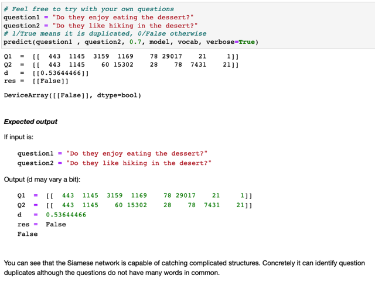</kbd>

> [!NOTE]
> Kết quả: Nó có thể nhận ra hai
> câu này là khác nhau

 

#### On Siamese Networks

 

#### Siamese networks are **important** and **useful**. Many times there are several questions that are already asked in quora, or other platforms and you can use Siamese networks to avoid question duplicates.  Congratulations, you have now **built a powerful system that can recognize question duplicates**. In the next course we will use **transformers** for **machine translation**, **summarization**, question answering, and chatbots.

 

