# C3w4_word Embeddings With Neural Networks

📊 **Progress:** `134` Notes | `223` Screenshots

---

Learn about how word embeddings carry the semantic meaning of words, which makes 
them much more powerful for NLP tasks, then build your own Continuous bag-of-words 
model to create word embeddings from Shakespeare text.
Learning Objectives

 • Gradient descent
 • One-hot vectors
 • Neural networks
 • Word embeddings
 • Continuous bag-of-words model
 • Text pre-processing
 • Tokenization
 • Data generators

## Week Introduction

 

### Welcome to week four. You've done a great job so far. This course is really foundational

> [!NOTE]
> Welcome to week four. You've done a great job so far. This course is really foundational 
> for the upcoming courses. And now Jonas and I will show you another powerful 
> technique, how to train word vectors from scratch.
>
> I am excited for this week, because word vectors are foundational to so many 
> applications in NLP. And you will learn how to build them from scratch. That way you not 
> only know how to load them and manipulate them as you did in the previous course, but 
> you know exactly how they are built. The technique we decided to show you is called the 
> continuous bag of words or CBOW. And the CBOW model, we try to predict the particular 
> word given a few current text words. The weights used to predict each word eventually 
> become your word vectors. Since there are two sets of weights, one for the words you 
> want to predict and one for the context words. You can choose which one to use or 
> perhaps even combine them. Without further ado let Jonas show you the details. &gt;&gt;
> Okay great. Come with me and let's build this together.

 

## Overview

 

### 1 Introduction to \\*word vectors\\* and \\*training them from scratch\\*.

> [!NOTE]
> 1 Introduction to \**word vectors\** and \**training them from scratch\**.
>
> 2 The \**significance of word vectors\** in \**NLP applications\** and their use in tasks such as
> \**semantic analogies\**, \**similarity calculations\**, \**sentiment analysis\**, \**machine translation\**,
> \**information extraction\**, and \**question answering\**.
>
> 3 Learning objectives for the week, including \**understanding word representations\**
> and \**their numeric representation\**, \**generating word embeddings\**, and \**preparing text
> for machine learning\**.
>
> 4 Implementation of the \**continuous bag-of-words model\** for creating word
> embeddings, with an emphasis on its \**simplicity and efficiency\**.
>
> 5 Mention of other techniques like \**GloVec\** and \**Word2Vec\** for training word
> embeddings, but focusing on the \**continuous bag-of-words model\** in this week.
>
> 6 Recommendation to have\**familiarity with neural networks\**, suggesting completion
> of the first course of the deep learning specialization by deeplearning.ai.
>
> 7 Excitement and anticipation for the upcoming videos and the learning experiences
> throughout the week.

 

  
  
<kbd>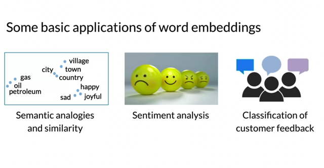</kbd>

  > Đại khái là word vector hay **word embedding**s là **nền tảng
  > quan trọng** của NLP. Ta đã biết, nó giúp **chắt lọc và
  > capture những thông tin về quan hệ ngữ nghĩa** của từ
  > vựng (semantic).**Rất nhiều ứng dụng** trong NLP có nền
  > móng từ word embedding

   

  
  
<kbd>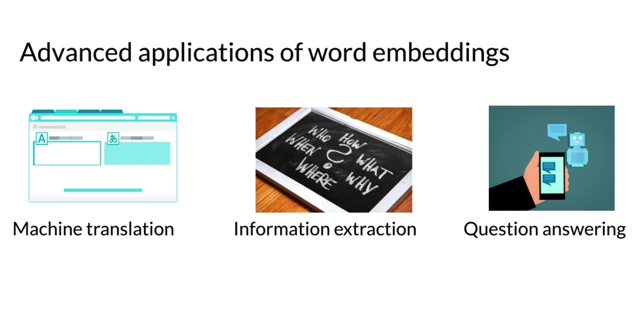</kbd>

   

  
  
<kbd>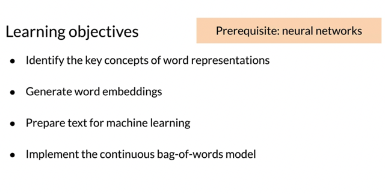</kbd>

   

## Basic Word Representations

 

### 1 Introduction to creating a matrix to represent words in a vocabulary, where  each

> [!NOTE]
> 1 Introduction to creating a matrix to represent words in a vocabulary, where  each
> vector corresponds to a word.
>
> 2 Exploring the\**simplest way of representing words\** as numbers using a \**unique
> integer\** assigned to each word in the vocabulary.
>
> 3 \**Limitations of numerical indexing\** in terms of s\**emantic perspective\** and l\**ack of
> meaningful order\**.
>
> 4 Introducing the \**concept of using column vectors\** as \**"one hot vectors"\** to
> represent words, where \**each element corresponds to a word in the vocabulary.\**
>
> 5 Encoding words with \**one hot vectors,\** with a value of 1 in the corresponding row
> and 0 elsewhere.
>
> 6 \**Mapping between integers and one hot vectors\** for easy conversion.
>
> 7 \**Advantages\** of one hot vectors in terms of representing \**categorical variables\**
> \**without implying relationships between words.\**
>
> 8 \**Limitations\** of one hot vectors, including their l\**arge size for complex vocabularies\**
> and the \**lack of capturing word meaning or semantic similarity.\**
>
> 9 Teasing the upcoming topic of \**word embeddings\** as a solution to the limitations of
> one hot vectors.
>
> 10 Recap of the \**pros and cons of one hot vectors\** and a promise to explore word
> embeddings in the next video.

 

  
  
<kbd>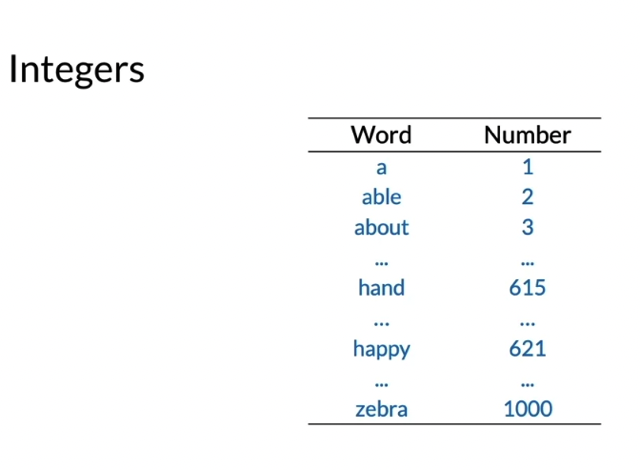</kbd>

  > Đại khái là cách đầu tiên để represent word, là **đánh số** tụi nó

   

  
  
<kbd>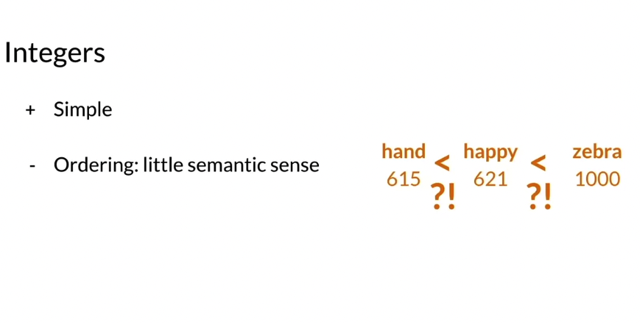</kbd>

  > Cách này thì **đơn giản**, tuy nhiên vấn đề là với cách này thì
  > **quan hệ dựa trên thứ tự abc của chúng không giúp ích gì**vì nó
  > **vô nghĩa,** **không biểu trưng bất cứ quan hệ ngữ nghĩa** thực
  > nào của các từ với nhau. **không có lí do gì để zebra lớn hơn
  > happy và happy lớn hơn hand cả**

   

  
  
<kbd>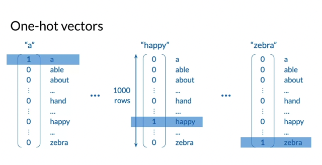</kbd>

  > Một cách khác để encode (represent) từ mà **loại bỏ các thứ tự lớn
  > nhỏ** như cách trước là **one-hot-encoding**. Mỗi từ sẽ được
  > represent bởi một **vector dài bằng số từ trong vocab** chứa **toàn
  > số 0, chỉ có số 1 ở vị trí của từ** trong vocab
  >
  > Thì với cách này, coi mỗi word như 1 category. **One-hot encoding**
  > là cách hay dùng khi **encode categorical feature**

   

  
  
<kbd>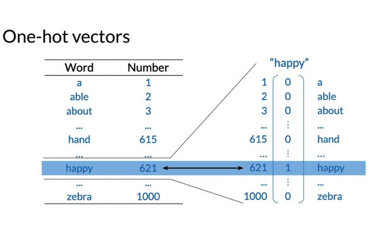</kbd>

  > representation theo kiểu đánh số (integers) và
  > one-hot vector đại khái là **có thể chuyển đổi qua
  > lại với nhau**

   

  
  
<kbd>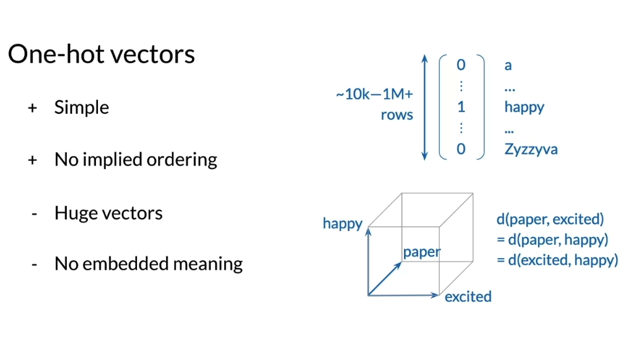</kbd>

  > Đại khái là one-hot vectors có ưu điểm là **simple**, và **không có cái vụ
  > thứ tự** như cách đánh số thứ tự theo alphabet. Nhưng nhược điểm là vì
  > **độ dài của vector bằng số lượng từ trong vocab** nên nếu khi encode bộ
  > vocab thật thường chứa cả **triệu từ** thì **size sẽ rất lớn** khiến tăng yêu
  > cầu về tính toán. Và cuối cùng là nó **không chứa đựng những ý nghĩa
  > quan hệ ngữ nghĩa**. Mỗi vector **chỉ là thể hiện yes or no có phải là một
  > từ nào đó không**, còn lại nó không mang ý nghĩa nào khác.

   

## Word Embeddings

 

### 1 Introduction to a method that can encode meaning in a\\* low-dimensional vector\\*,

> [!NOTE]
> 1 Introduction to a method that can encode meaning in a\**low-dimensional vector\**,
> allowing for \**representation of words along different dimensions\**.
>
> 2 Explanation of using number lines to represent positive and negative words, as
> well as concrete and abstract words.
>
> 3 Use of \**decimal values\** to capture \**proximity\** and \**similarity\** between words.
>
> 4 \**Representing vocabulary\** with \**small vectors of length 1 or 2\**, creating \**word
> embeddings.\**
>
> 5 \**Benefits\** of word embeddings, including practicality for calculations, \**carrying
> meaning\**, \**determining semantic\** closeness, and \**enabling analogies\**.
>
> 6 Importance of word embeddings for \**more complex NLP tasks\** like question
> answering and translation.
>
> 7 Objectives of the module, focusing on\**creating word embeddings\** through
> \**simpler to more advanced methods\**.
>
> 8 \**Terminology clarification\** regarding word vectors and word embeddings.
>
> 9 \**Advantages of word embeddings\** over other representations, such as one-hot
> vectors, in real-world NLP applications.
>
> 10 Introduction to the idea of \**learning the coordinates of word embeddings\** in the
> next video.

 

  
  
<kbd>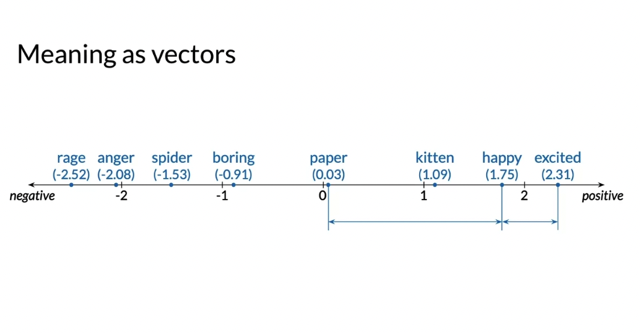</kbd>

  > Đại khái đang nói về một ví dụ **thể hiện các từ trên trục số
  > (không gian 1D) thể hiện sự negative/positive**. Trong đó các từ
  > negative meaning có xu hướng nằm bên trái, và positive có xu
  > hướng nằm bên phải. **Mỗi từ kiểu như là một vector có 1 item là '
  > bất cứ số thực nào, không nhất thiết integer'** như vậy **khoảng
  > cách giữa chúng** có thể **biểu thị mối quan hệ ngữ nghĩa** nào
  > đó ví dụ như happy gần với excited hơn với paper

   

  
  
<kbd>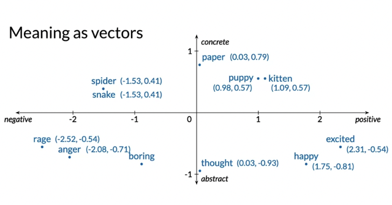</kbd>

  > Đại khái là **thêm một trục không gian nữa** đồng nghĩa **mỗi từ (hay mỗi
  > vector đại diện cho từ) có thể một chỉ số nữa**, thể hiện sự abstract hay
  > concrete. Ví dụ những từ mang ý nghĩa concrete (hữu hình) như paper,
  > puppy sẽ nằm bên trên, còn những từ mang ý nghĩa 'Trừu tượng' như
  > thought sẽ ở dưới.
  >
  > Thì đại khái là cách represent này **không chính xác như one-hot**, có
  > nghĩa là **có những từ khác nhau có thể dc encode trùng hoặc, rất gần
  > nhau**. Ta hiểu đại khái giống như hình chiếu, ở không gian 2D thì spider
  > và snack nó trùng nhau, nhưng giả sử thêm một trục feature nữa ví dụ như
  > 'Nhiều chân, ít chân' thì trong không gian 3D đó, có thể sẽ thấy spider và
  > snake sẽ tách ra riêng biệt

   

  
  
<kbd>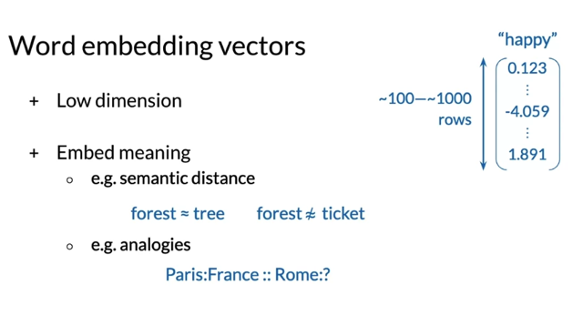</kbd>

  > Đại khái là nói các **ưu điểm của word embedding** là nó giúp
  > **condense feature** thành **dense vector** với **ít dimension hơn**, ví
  > dụ chỉ khoảng 100-1000 thay vì cả triệu nếu là one-hot vector. Và cái
  > quan trọng nhất chính là nó **capture được các semantic meaning** của
  > các từ ví dụ như **những từ thật sự có nghĩa gần nhau sẽ được
  > embedded thành các vector gần nhau** trong không gian feature vector
  > và **quan hệ giữa chúng còn tạo ra các vector đại diện cho các khái
  > niệm như thủ đô, giới tính**

   

  
  
<kbd>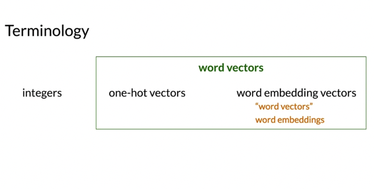</kbd>

  > Đại khái là dù one-hot encoding vector cũng là word
  > vector như**thực tế người ta thường ám chỉ word
  > embedding vector khi nói word vecto**r

   

  
  
<kbd>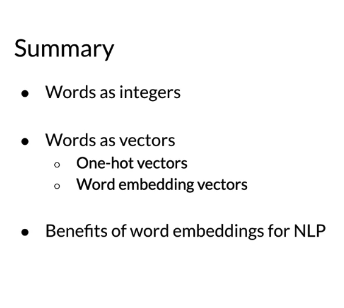</kbd>

   

  
  
<kbd>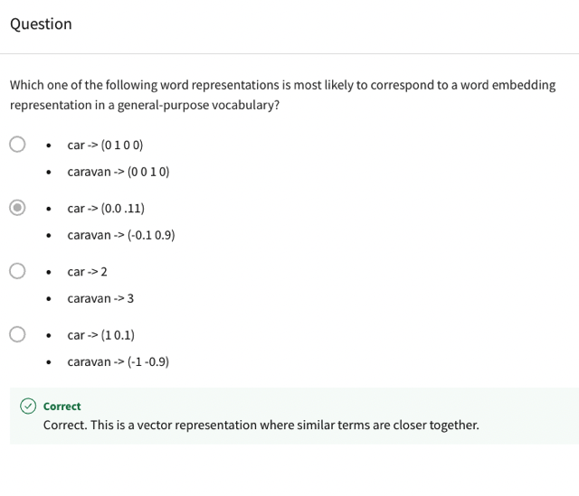</kbd>

  > Cái 1 là one-hot. Loại. Cái 3 là Integer representation. Loại.
  > Giữa 2 và 4 thì tính nhẩm Euclidean distance sẽ thấy cái 2 nó
  > nhỏ hơn

   

## How To Create Word Embeddings

 

### 1 To create \\*word\\* \\*embeddings\\*, two main components are required: a \\*corpus\\* of text and an

> [!NOTE]
> 1 To create \**word\** \**embeddings\**, two main components are required: a \**corpus\** of text and an
> embedding \**method\**.
>
> 2 The corpus contains the words that need to be embedded, and it should reflect the \**desired
> context\**. For example, using the \**full and original text of Shakespeare \**would be suitable for
> generating \**Shakespeare-related embeddings\**.
>
> 3 The \**context of a word\** refers to the \**words or combinations of words\** that \**commonly occur
> around it\**. \**Understanding the context is crucial \**for giving meaning to word embeddings.
>
> 4 \**A simple vocabulary list\** of common words is\**not sufficient for creating embeddings\**. The
> corpus should consist of comprehensive sets of documents, such as \**Wikipedia articles\** or
> \**domain-specific texts like legal contracts\** for specific NLP use cases.
>
> 5 The \**embedding method \**is responsible for \**generating the word embeddings from the corpus\**.
> Modern methods based on \**machine learning models\** are commonly used for this purpose.
>
> 6 The \**machine learning model\** performs a l\**earning task\**, and\\/\**word embeddings are\** \**by-products
> of this task\**\\/. For example, the model may l\**earn to predict a word based on the surrounding
> words\** in a sentence using approaches like the \**continuous bag of words\**.
>
> 7 The\**specific task \\/performed by the model determines the meaning of individual words in the
> embeddings\**\\/. The task is considered \\/\**self-supervised\**\\/, as the input \**corpus is unlabeled\**, \\/\**but the
> data itself provides the necessary context.\**\\/
>
> 8 Word embeddings can be \**fine-tuned using hyperparameters\**, including the \**dimension of the
> embedding vectors\**. Higher dimensions capture \**more nuanced meanings\** but require \**more
> computational resources\**.
>
> 9 \**Before feeding\** the corpus into the machine learning model, the t\**ext contents need to be
> transformed into a suitable mathematical representation\**, such as i\**nteger-based indices\** or
> \**one-hot vectors\**, depending on the \**specific model requirements.\**
>
> 10 The next step involves introducing v\**arious word embedding  methods\**, including the
> \**continuous bag of words approach\**, which will be implemented in the assignment for the week.

 

  
  
<kbd>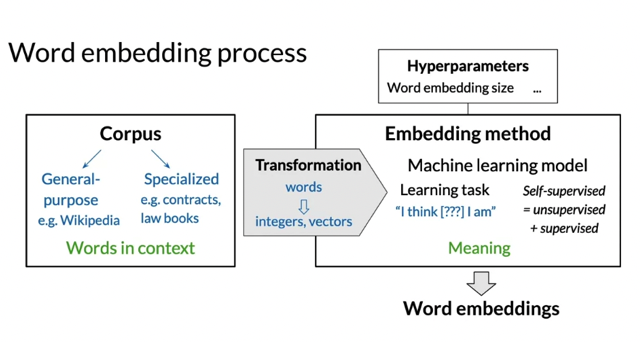</kbd>

  > Vài ý quan trọng sau, file tóm tắt đã tóm gọn đầy đủ rồi.
  >
  > 1.Như đã biết, ôn lại thôi đó là **word embedding** là **phụ phẩm (bi-product)**của quá
  > trình training một **model cho một mục đích cụ thể**. Ví dụ model NLP **predict 1 từ
  > chỗ trống trong một câu / phrase nào đó.**
  >
  > Trong quá trình learn để làm được việc này, **model sẽ phải tìm được cách để
  > embedding word sao cho nắm bắt được quan hệ ngữ nghĩa giữa chúng**. Nôm na là
  > model phải thật sự hiểu các từ có nghĩa là gì thì mới giải bài toán đó được.
  >
  > 2. Để tạo word embedding, thì cần **corpus** và **embedding method**. Thì c**orpus
  > phải là y nguyên, không được tách thành từ**, hay chứa các note / comment - đại khái
  > nó sẽ**gây nhiễu qua hệ ngữ nghĩa vốn có** của từ.
  >
  > 3.**Embedding method khác nhau** - dựa trên**model có main task khác nhau** thì
  > **embedding word sẽ khác**. Chưa rõ lắm
  >
  > 4. Bài toán này gọi là **Self-supervised**vì tuy corpus **không có label gì cả**, nhưng
  > **bản thân nó đã chứa những thông tin ngữ nghĩa của từ vựng rồ**i, chỉ cần khai thác /**extract ra thôi.**
  >
  > 5. Có thể có**h.p để control**như word vector **size**, **dài thì chưa đựng nhiều thông
  > tin** hơn nhưng **tính toán nhiều hơn**.

   

## Word Embedding Methods

 

### 1 \\*Various word embedding methods\\* exist and continue to evolve over time.

> [!NOTE]
> 1 \**Various word embedding methods\** exist and continue to evolve over time.
>
> 2 \**Word2vec\** is a \**shallow neural network mode\**l with two architectures: \**continuous
> bag-of-words\** and \**continuous skip-gram\**.
>
> 3 \**Global vectors (GloVe)\** involves\**factorizing the word co-occurrence matrix\**.
>
> 4 \**FastText\** considers the \**structure of words\** by representing them as \**character n-grams.\**
>
> 5 \**FastText\** s\**upports previously unseen words\** and allows \**averaging of word embedding
> vectors for phrases and sentences\**.
>
> 6 \**Advanced\** models use \**deep neural network architectures\** and \**context-dependent word
> embeddings.\**
>
> 7 Advanced models address \**polysemy\** and capture \**different meanings of words based on their
> contexts.\**
>
> 8 Examples of advanced models include \**BERT, ELMo, and GPT-2\**.
>
> 9 \**Pretrained\** models of advanced methods are \**available for use\**, leveraging \**domain-specific
> word embeddings\**.
>
> 10 The \**continuous bag-of-words model\** will be introduced for this week's assignments.
>
> 11 The history of word embedding methods spans from \**word2vec\** to the latest \**transformer\**
> methods.
>
> 12 \**Transformers\** are considered one of the \**most advanced AI methods.\**

 

  
  
<kbd>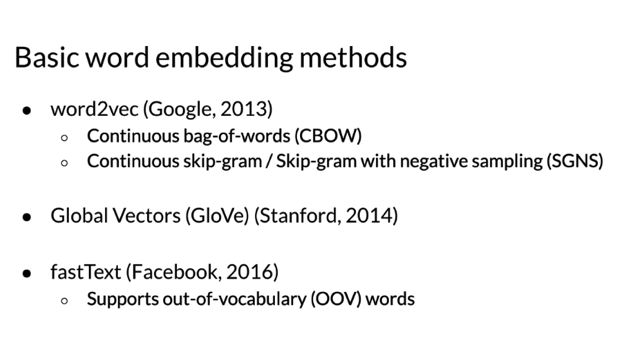</kbd>

  > 1 Word2vec: **Word2vec** is a **popular method** that uses a **shallow neural network** to
  > learn word embeddings. It offers two model architectures:
  >
  > 2 a. **Continuous Bag-of-Words (CBOW)**: This approach aims to **predict a missing
  > word** **based on the surrounding words** in a given context.
  >
  > 3 b. Continuous **Skip-gram**: In **contrast to CBOW**, this method learns to **predict the
  > surrounding words** given an**input word**.
  >
  > 4 **Global Vectors (GloVe)**: GloVe, developed by **Stanford**, involves **factorizing the
  > logarithm of the word co-occurrence matrix** in the corpus. It is similar to the **count
  > matrix** used in previous methods.
  >
  > 5 **FastText**: FastText, developed by **Facebook**, is **based on the skip-gram model**. It
  > takes into account the **structure of words** by representing them as **n-grams of
  > characters**. This enables the model to **handle previously unseen words** (outer
  > vocabulary words) by \/**inferring their embeddings from the character sequences
  > they consist of.**\/ FastText also allows for **averaging word embedding vectors** to
  > obtain \/**vector representations of phrases and sentences.**\/
  >
  > These methods represent**different approaches** to **learning word embeddings**, and
  > each has its **own strengths** and **characteristics**. Word2vec, GloVe, and FastText
  > are widely used and have contributed significantly to the field of natural language
  > processing.

  > Đại hái có mấy pp sau:
  >
  > **word2Vec** - **Continuous bag of words** thì (train model) điền
  > vào chỗ trống - tức **predict từ dựa vào các từ xung quanh**.
  >
  > **word2Vec** - **Negative sampling** hay **skip-gram**: thì **cho trước
  > context word**, và lấy các từ **gần nó** cũng như**các từ random**
  > để tạo **cặp label 1 - 0** và train bài toán **classification**. Ví dụ
  > chọn context word c, 1 từ gần nó t thì c-t có label 1, một từ
  > ngẫu nhiên đâu đâu f thì c-f có label 0.
  >
  > Kiến thức này là từ DLSpec
  >
  > **Glovec**: Đại khái là hơi khó giải thích nhưng **nôm na là xây
  > dựng  optimization objective sao cho nếu từ xuất hiện gần
  > nhau nhiều thì word embedding của chúng càng gần nhau**
  >
  > **fastText** thì kiểu như **tính đến characters luôn** để từ đó có
  > thể **handle OOV words**

   

  
  
<kbd>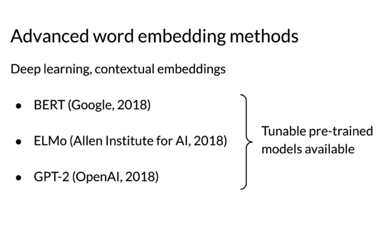</kbd>

  > 1 BERT (**Bidirectional** **Encoder** **Representations** from **Transformers**):
  > Developed by Google, BERT is a powerful model that uses a **bidirectional approach**
  > to **capture context** and generate **word embeddings**. It has been widely adopted in
  > various natural language processing tasks.
  >
  > 2 ELMo (**Embeddings** from **Language Models**): Created by the Allen Institute for
  > AI, ELMo leverages language models to generate c**ontextualized word embeddings**.
  > It **takes into account** the **entire input sentence** and **assigns different embeddings
  > to each word based on the context**.
  >
  > 3 **GPT-2** (Generative Pretraining 2): Developed by OpenAI, GPT-2 is a**state-of-the-art language model** that can also be used to generate word embeddings. It
  > utilizes a **transformer-based architecture** and has been **pretrained** on a **large
  > corpus to capture contextual information**.
  >
  > These advanced models provide **highly accurate** and **context-specific word
  > embeddings.** **Pretrained** versions of these models are **available online**, allowing
  > users to **leverage them for various applications**. By using your **own corpus**, you
  > can **fine-tune these models** to **generate high-quality, domain-specific word
  > embeddings**.
  >
  > These advanced methods have **significantly advanced the field of natural language
  > processing** and have improved the representation of word meanings in a range of
  > applications.

  > Mấy cái này còn xịn xò hơn: như dựa trên **Transformers** network
  > giúp embedding word **tuỳ theo câu / context** chứ **không chỉ là
  > fixed embedding**
  >
  > Và ổng nói có thể **download pre-trained version của các model**
  > này về **finetune thêm cho bài toán của mình**.

   

  
  
<kbd>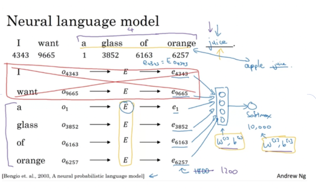</kbd>

  
<kbd></kbd>

  
<kbd>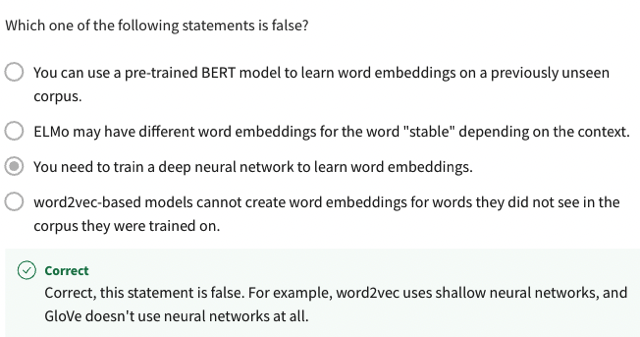</kbd>

  > Nhớ lại Word2vec nó chỉ có 1 dense layer
  > và output ra softmax layer thôi

   

## Continous Bag Of Words Model

 

### 1 \\*Overall process\\* for \\*machine learning model-based word embeddings\\*: To create word

> [!NOTE]
> 1 \**Overall process\** for \**machine learning model-based word embeddings\**: To create word
> embeddings, you need a \**corpus\** (a collection of text) and a \**machine learning model\** that
> \**performs a learning task\**. The model \**learns from the corpus\** and \**generates a set of word
> embeddings\** as a \**byproduct\**. You also need to \**transform the corpus into a representation
> suitable\** for the machine learning model.
>
> 2 \**Continuous Bag-of-Words (CBOW)\** model instantiation: The CBOW model's \**objective\** is to
> \**predict a missing word based on the surrounding words\** in a sentence. The \**assumption\** is that
> \\/\**words with similar contexts are semantically related\**\\/. For example, given the sentence "The little
> something is barking," the model can learn that the missing word is related to dogs, such as "dog," "
> puppy," "hound," etc. The model l\\/\**earns the meaning of words based on their contexts\**\\/.
>
> 3 \**Creating training data\** for the prediction task: To train the CBOW model, you need to create
> training examples. For a \**given center word\** in the corpus (e.g., "happy"), the \**context words are
> defined as the words before and after the center word\**. The \**size of the context (C) is a
> hyper-parameter of the model.\** The \**window \**is defined as \**the count of the center word plus the
> context words\**. \\/\**Each training example consists of the context words and the center word to be
> predicted.\**\\/
>
> 4 Training examples and sliding the window: The \**training examples are created\** by \**sliding the
> window by one word\** at a time. Each example includes the \**context words\** and the \**corresponding
> center word to predict\**. For example, given the sentence "I am happy because I'm learning," the first
> training example has the window "I am happy because I" with the center word "happy." The next
> example has the window " I'm happy because I'm" with the center word "something." This \**process
> continues for the entire corpus. \** 
>
> 5 Model architecture: The \**CBOW\** model architecture involves
> \**using the context words as inputs\** and \**predicting the center word as the output\**. The \\/\**original
> paper on CBOW describes this architecture\**\\/, where the model learns to associate the context words
> with the center word.
>
> 6 Recap and next steps: The CBOW model \**predicts the center word\** \**based on the surrounding
> context word\**s and \**produces word embeddings as a result.\** The focus for the rest of the week will
> be on \**preparing a training dataset from a corpus\** and \**delving into the mathematics behind the
> model\**.
>
> In summary, the \**CBOW model predicts the center word using the surrounding context words\**. By
> \**training the model on a corpu\**s\**, word embeddings are obtained as a byproduct\**. The \**training
> data\** consists of \**examples with context words\** and \**corresponding center word\**s. The \**CBOW
> model architecture\** takes \**context words as inputs and aims to predict the center word\**.

 

  
  
<kbd>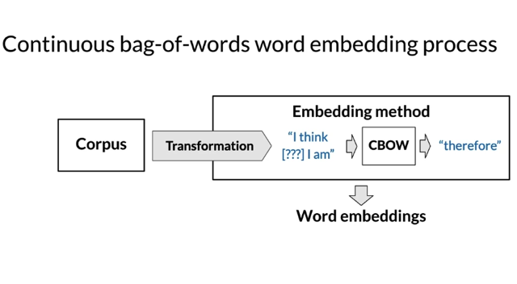</kbd>

  > Đại khái như biết, **word embedding** là **by-product của việc training
  > một model** **cho một bài toán cụ thể**nào đó mà trong trường hợp
  > của **Bag of words model**là **predict từ dựa vào các từ xung quanh**.
  > Và t**ừ một corpus**, ta phải **transform data thành dạng mà model có
  > thể dùng được**

   

  
  
<kbd>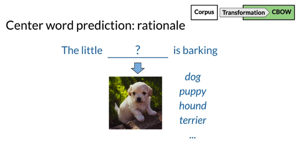</kbd>

  > Đại khái **ý tưởng của phương pháp bag-of-words** đó là **những từ hay
  > ở gần nhau trong corpus** - hoặc là **hay có chung context** tức là **được
  > bao quanh bởi những từ xung quanh giống giống nhau** sẽ có **xu hướng
  > có ý nghĩa liên quan đến nhau về mặt ngữ nghĩa** - gọi là **relate
  > semantically.
  >
  > \/Thông qua việc học và predict các từ trong bài toán này, model sẽ học dc
  > cách embedding các từ gần gũi về mặt ý nghĩa thành các vector thật sự
  > gần nhau trong không gian vector**\/

   

  
  
<kbd>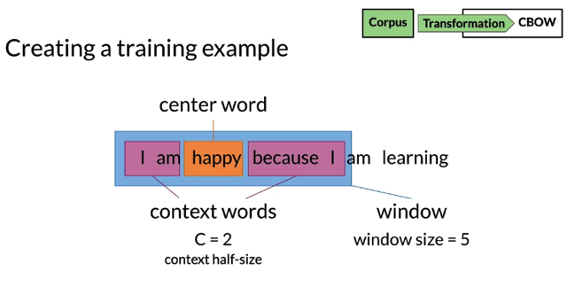</kbd>

  > Đại khái là '**bố trí / sắp xếp' bài toán** như thế nào: Thì đầu tiên **chọn một
  > từ gọi là center word**. Sau đó c**họn 2 từ trước nó và 2 từ sau** nó để làm
  > **context words**, các **window chứa 5 từ gọi là window size = 5**
  >
  > Nếu **chọn 2 từ thì gọi là context haft-size = 2**, và có thể chọn **3,4 từ gì đó**,
  > và đây sẽ là một **h.param**.

   

  
  
<kbd>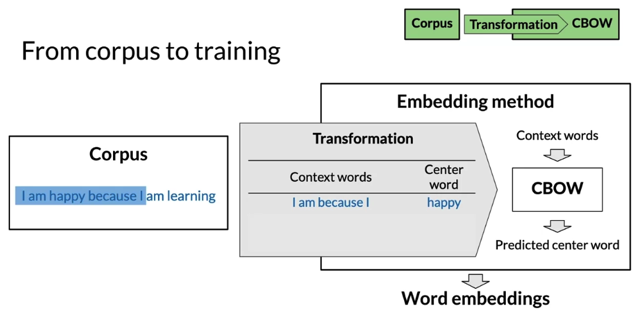</kbd>

   

  
  
<kbd>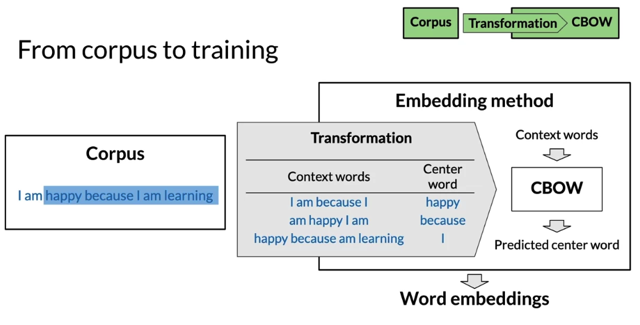</kbd>

  > Đại khái là với window có size = 5, **slide cái
  > window đi** để ta tạo training data là **một collection các bộ
  > context word và center word**

   

  
  
<kbd>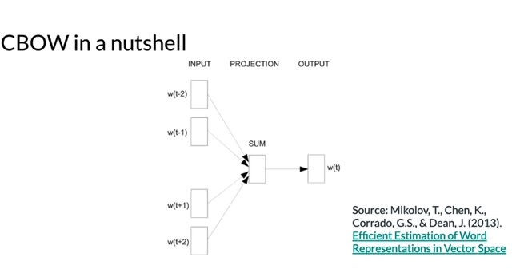</kbd>

  > Và đây chính là cách mà **Continuous
  > bag-of-word model** work. Chi tiết ổng nói
  > xem trong Paper của **Mikolov**.

   

  
  
<kbd>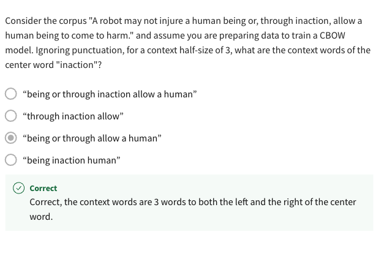</kbd>

   

## Efficient Estimation of Word Representations in Vector Space

 

## Cleaning And Tokenization

 

### 1 \\*Cleaning\\* and \\*tokenization\\* are important steps in processing a corpus.

> [!NOTE]
> 1 \**Cleaning\** and \**tokenization\** are important steps in processing a corpus.
>
> 2 Consider the words of the corpus as \**case\** \**insensitive\** by converting it to either \**all lowercase\** or
> \**all uppercase\**.
>
> 3 Handle \**punctuation\** by representing \**interrupting punctuation marks\** as a \**single special word\**,
> \**ignoring non-interrupting punctuation marks\**, and collapsing multi-sign marks into a single mark.
>
> 4 Decide how to handle \**numbers\** based on t\**heir relevance to the use case.\** Numbers \**without
> important meaning\** can be \**dropped\**, while \**significant numbers\** can be \**kept or replaced with a
> special token like "<NUMBER>"\**.
>
> 5 Handle \**special characters\** like \**mathematical symbols\**, \**currency symbols\**, section and
> paragraph signs, and online markup signs. It is usually \**safe to drop them.\**
>
> 6 When working with \**modern corpora\** that include user inputs like \**tweets\** or \**consumer reviews\**,
> handle \**special words\** such as \**emojis\** and \**hashtags\** based on the \**intended meaning\**. Consider
> \**treating each emoji or hashtag\** as an \**individual word\**.
>
> 7 A \**Python example\** \**demonstrates\** some of these \**recommendations\**, including \**collapsing
> interrupting punctuation\**, \**tokenizing using NLTK library\**, and keeping \**lowercase\** tokens that are
> \**alphabetical, full stops, or emojis\**.
>
> 8 The next part of the \**continuous bag-of-words model \**is the \**sliding window\**, which involves a
> window moving over the text corpus.

 

  
  
<kbd>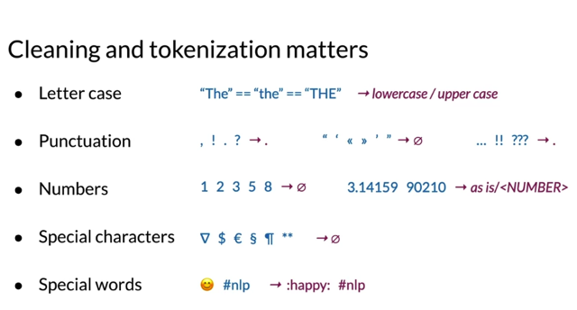</kbd>

  > 1 **Cleaning** and **tokenization** are i**mportant steps** in**processing a corpus.**
  >
  > 2 Words in the corpus should be considered **case insensitive**, and converting the
  > corpus to either **all lowercase** or **all uppercase is recommended**.
  >
  > 3 Handling **punctuation** involves representing **interrupting punctuation marks** (e.g., full
  > **stops**, **commas**, **question** marks) as a **single special word** and **ignoring non-interrupting
  > punctuation marks** (e.g., quotation marks).
  >
  > 4 Dealing with **numbers** **depends** on their relevance to the use case. Numbers **without
  > important meaning** can be **dropped**, while **significant numbers** should be **kept** in the
  > corpus. For **numerous unique numbers**, replacing them with a special token like "
  > **<NUMBER>**" can be beneficial.
  >
  > 5 **Special characters** such as **mathematical**symbols, **currency** symbols, and **online
  > markup signs** can generally be **dropped** from the corpus.
  >
  > 6 When working with **modern corpora** that include user inputs like **tweets** or **consumer
  > reviews**, **special words** such as **emojis** and **hashtags** should be handled **based on their
  > intended meaning**. Emojis and hashtags can be considered as individual words if
  > desired.

  > Nên chuyển thành **lowercase hoặc uppercase hết**
  >
  > **Interrupting mark thì giữ lại**, biến thành**'.'** hết, còn **non-interrupting mark
  > như ','/';' thì bỏ đi**
  >
  > Đối với number thì **number nào không quan trọng thì bỏ đi**, **quan trọng
  > thì giữ lại**. Nếu có **nhiều unique number** nhưng giá trị của nó thì không
  > cần phải phân định rõ thì thay bằng **<NUMBER>**
  >
  > **Special char** như $ ..nên **bỏ**
  >
  > Còn các**emoji, hashtag** thì tuỳ vào **intended meaning** mà có thể giữ

   

  
  
<kbd>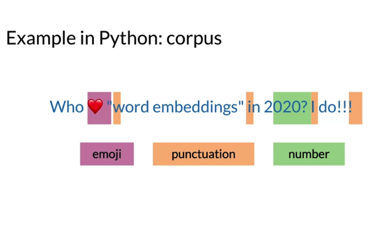</kbd>

   

  
  
<kbd>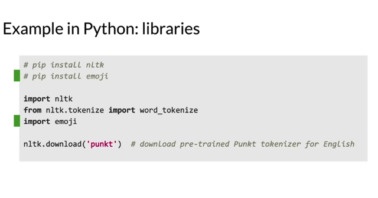</kbd>

  > Đại khái là ổng sẽ dùng **nltk**, có cái **punkt tokenizer** rất tốt,
  > ổng nói nó **có thể biết dấu chấm ở middle name không
  > phải là dấu chấm kết thúc câu**. Ngoài ra thì dùng **emoji lib** để
  > demonstrate việc **xử lý emoji**

   

  
  
<kbd>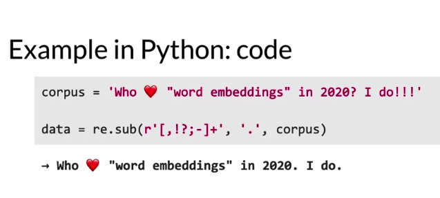</kbd>

  > Các punctuation
  > biến thành '.' hết

   

  
  
<kbd>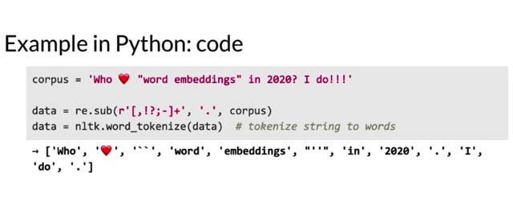</kbd>

  > Kế đến dùng nltk.word_tokenizer() giúp
  > tokenize sequence thành các token.

   

  
  
<kbd>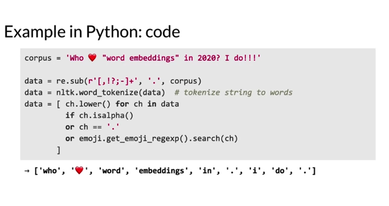</kbd>

  > Kế dùng list comprehension để tạo một list token mới
  > mà trong đó những token mong muốn được
  > lowercase (alphabet - tức là bắt đầu với chữ, dấu
  > chấm và emoji) còn số ..thì không

   

## Sliding Window Of Words In Python

 

### 1 Introduction to\\* context words\\* and \\*center words\\*: The transcript mentions the importance of

> [!NOTE]
> 1 Introduction to\**context words\** and \**center words\**: The transcript mentions the importance of
> \**context words\** and \**center words\** for training a \**continuous bag-of-words model.\**
>
> 2 Extraction of context words and center words: The \**get_windows\** function in. Python is
> introduced, which \**takes a corpus of words\** and the \**context size\** as arguments. It initializes a
> counter and\**iterates through the corpus\** to \**extract the center word\** and \**its corresponding
> context words\**.
>
> 3 Function explanation: The transcript provides a \**step-by-step explanation\** of the \**get_windows\**
> \**function\**, including how it \**identifies the first usable center word\**, loops through the corpus,\**creates arrays of context words\**, and \**uses the yield keyword\** to return values.
>
> 4 Usage of the \**get_windows\** function: The transcript demonstrates how to \**use the get_windows
> function in a loop to obtain tuples of context words and center words\**. It shows the output for the
> example sentence "I am happy because I am learning" with a context size of 2.
>
> 5 Recap of the \**get_windows\** function: The transcript summarizes the purpose of the get_windows
> function, which \**takes a corpus and context size as input and returns the context words and center
> words for each sliding window.\**
>
> 6 Introduction to \**converting words into vectors\**: The transcript mentions that the next step will
> involve \**converting the sets of words into vectors\** to be used by the continuous bag-of-words
> model.
>
> 7 Use of \**yield\** in Python: The transcript explains the use of the y\**ield keyword\**,  highlighting its\**ability to pause the function and return values multiple times\**, making it useful for \**data generators
> or functions that provide data in small batches\**.
>
> 8 Significance for programming assignments: The transcript notes that the process of \**extracting
> context words and center words using a sliding window in Pytho\**n is relevant for programming
> assignments related to the continuous bag-of-words model.

 

  
  
<kbd>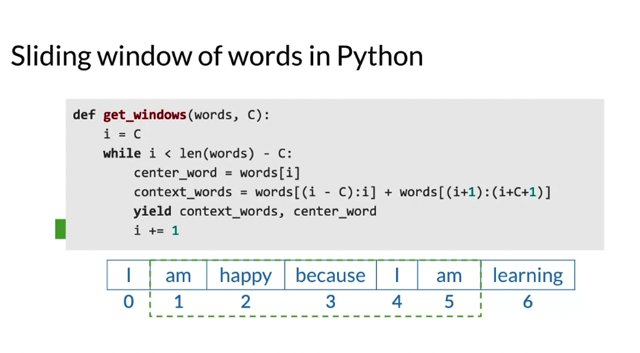</kbd>

  > **Cách 'làm' sliding window of words**: **C stand for context**, là **số từ
  > ta lấy trước và sau mỗi target word**. Ví dụ **2** thì lấy **2 từ trước** và
  > **2 từ sau** một từ để **predict từ đó**.
  >
  > **Loop i** trong range mà có thể có **valid context**, ở đây mình thấy
  > nó cho **i = C trước**, và loop **i đến khi nào nó bằng len(words) - C**.
  >
  > Thì đại khái **từ đầu tiên có thể có đủ C từ trước nó** để lấy làm
  > context chính là **từ có index = C**, và tương tự **từ cuối cùng có đủ C
  > từ đứng sau nó** để lấy làm context là **từ có index = len(words) - C**.
  >
  > Kế tiếp là **lấy các từ context ra**, **add lại thành một list**. Và **yield** có
  > chức năng như return nhưng **cho phép return nhiều lần**

   

  
  
<kbd>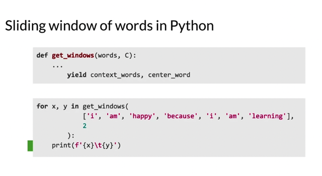</kbd>

   

  
  
<kbd>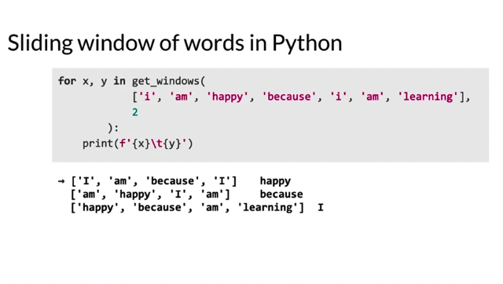</kbd>

  > Cái chính đáng chú ý là xem function
  > **get_windows**() với **yield keyword** giống như function
  > cung **cấp từng batch data** từng chút vậy

   

## Transforming Words Into Vectors

 

### 1 Introduction to \\*representing context words\\* and \\*central word\\*: The transcript states that in order to

> [!NOTE]
> 1 Introduction to \**representing context words\** and \**central word\**: The transcript states that in order to
> predict the central word given context words, we need to \**find a way to represent them mathematically\**.
>
> 2 \**Creation of vocabulary\**: The transcript explains that \**a vocabulary is created\**, which \**consists of all the
> unique words\** in the corpus. Each word is \**encoded as a column in a one-hot vector,\** where \**each row
> corresponds to a word in the vocabulary\**.
>
> 3 \**Encoding central words\**: The transcript describes how \**central words are represented using one-hot
> vectors\**. Each word in the vocabulary has a \**value of 1 in its corresponding row\**, while\**all other rows
> contain zeros.\**
>
> 4 \**Encoding context words\**: The transcript explains that a \**single vector is created to represent the
> context words\**. This is done by taking the \**average of the one-hot vectors of each context word\**. The
> \**resulting vector is the representation of the entire context.\**
>
> 5 Example of vector representation: The transcript provides an example of encoding context words and
> central word using one-hot vectors. It shows the \**vocabulary\** and the \**corresponding one-hot vectors for
> context words\**, as well as the \**averaged vector  representation for the entire context\**.
>
> 6 \**Preparation\** \**phase completion\**: The transcript states that the \**preparation phase\**, starting from the r\**aw
> corpus, has been concluded\**. The \**data is now ready to be used for training\** a continuous bag-of-words
> (CBOW) model.
>
> 7 Introduction to the CBOW model: The transcript mentions that in the next video, the\**architecture of the
> CBOW model will be explained\**, preparing for the application of the newly acquired skills in the upcoming
> assignment.

 

  
  
<kbd>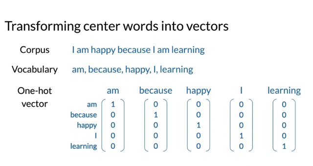</kbd>

  > Transform **center word** thành dạng
  > **one-hot encoding vector.**

   

  
  
<kbd>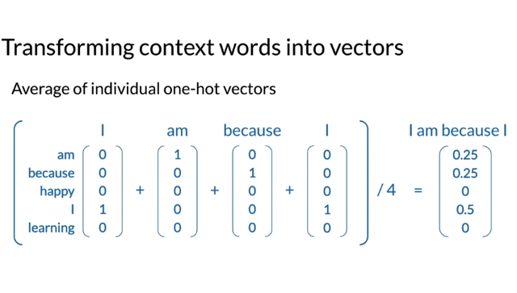</kbd>

  > Còn **một bộ các context words** của **mỗi center word** thì encode thành
  > **vector** nhưng bằng cách **tính trung bình các one-hot vector** của các
  > context words. Ví dụ context vector của center word 'happy'

   

  
  
<kbd>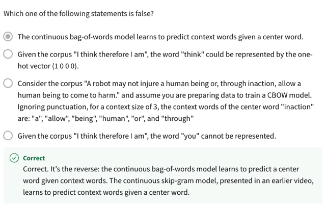</kbd>

   

  
  
<kbd>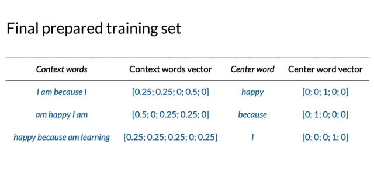</kbd>

  > Final training set sẽ như vầy, mỗi data sample là một bộ
  > gồm một **context words vector** (column vector, ở đây
  > ổng ghi vậy là để tiết kiệm chỗ thôi) và**một center
  > word (one-hot) vector**

   

## Lab: Data Preparation

 

### In this series of ungraded notebooks, you'll \\*try out all the individual techniques that

> [!NOTE]
> In this series of ungraded notebooks, you'll \**try out all the individual techniques that
> you learned about\** in the lectures. Practicing on \**small examples will prepare you for
> the graded assignment\**, where you will combine the techniques in more advanced
> ways to create word embeddings from a real-life corpus.
>
> This notebook focuses on data preparation, which is the first step of any machine
> learning algorithm. It is a very important step because \**models are only as good as
> the data they are trained on\** and the models used \**require the data to have a
> particular structure\** to process it properly.
>
> To get started, import and initialize all the libraries you will need.

 

- Import
   

  
  - import re import \\*nltk\\*  nltk.download('\\*punkt\\*')  import \\*emoji\\* import \\*numpy\\* as np from nltk.tokenize import \\*word_tokenize\\* from utils2 import \\*get_dict\\*
     

- Data preparation
   

  
  - In the \\*data preparation phase\\*, starting with a\\* corpus of text\\*, you will:  • Clean and tokenize the corpus.  • Extract the \\*pairs of context words and center word\\* that will make up the  training data set for the CBOW model. The context words are the features that will be fed  into the model, and the \\*center words\\* are the target values that the model will learn to  predict.  • Create \\*simple vector representations\\* of the context words (features) and  center words (targets) that can be used by the neural network of the CBOW model.
     

- Cleaning and tokenization
   

    
    
<kbd>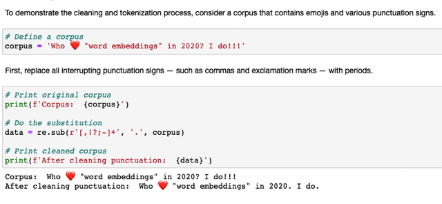</kbd>

    > Defne một text corpus và dùng function này (sub)
    > để thay các **exclamation mark** (!,?..) gọi là**interrupting punctuation**
    >
    > data = re.sub(r'[,!?; -]+', '.', corpus)

     

    
    
<kbd>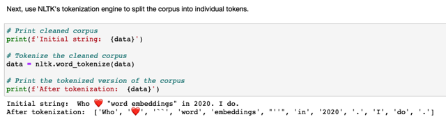</kbd>

    > Tiếp dùng nltk để tokenize
    > thành các token - split thành các từ

     

    
    
<kbd>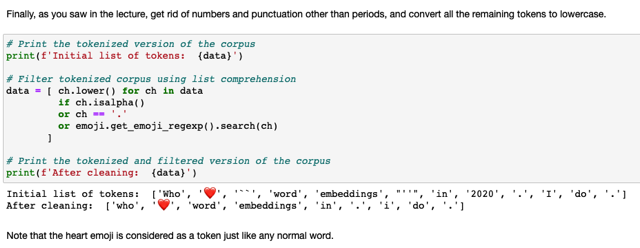</kbd>

    > Kế đến, **filter** các token để **loại bỏ number**. Ta thấy họ dùng
    > **list comprehension** rất gọn, dùng **ch.isalpha()** để check xem
    > **có phải string start with chữ** hay không và dùng **emoji library**
    > để check **emoji character**

     

    
    
<kbd>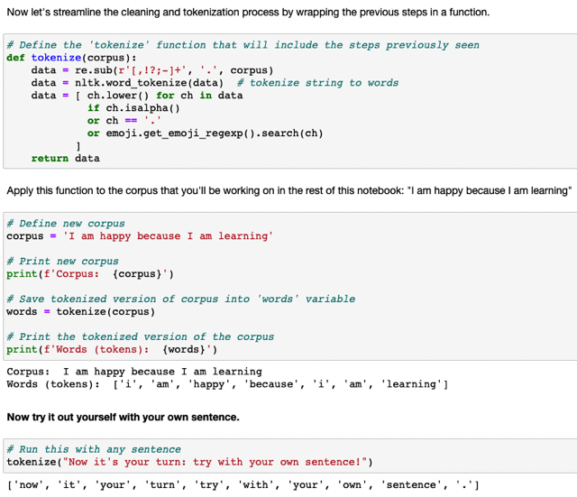</kbd>

    > Define **function tokenize()
    > làm tổng hợp cái trên**

     

- Sliding window of words
   

    
    
<kbd>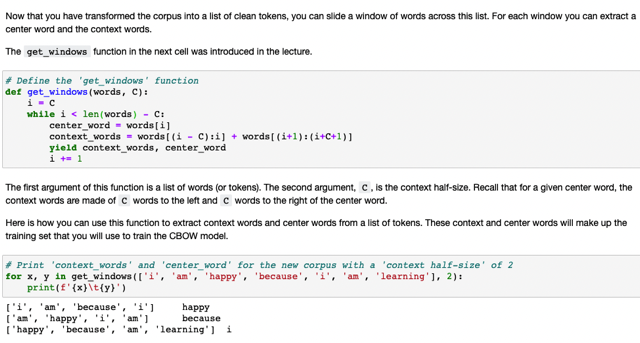</kbd>

    > Đại khái là function **get_windows()** có giải thích ở lecture, nó sẽ**loop trong cái words list** để **lấy từ làm** **target word** với **start
    > index và end index** sao cho có thể **lấy C từ trước nó** và **C từ sau
    > nó** để làm **context words**. Rồi nó dùng keyword **yield**giúp**trả
    > về kết quả từng chút từng chút.**Để ý output được in ra thấy nó
    > **return từng bộ tuple (context words list, target word)**

     

    
    
<kbd>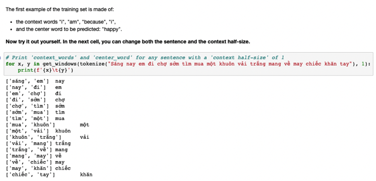</kbd>

     

- Transforming words into vectors for the training set
   

- Mapping words to indices and indices to words
   

    
    
<kbd>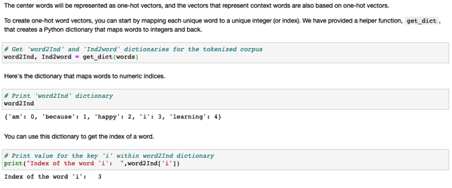</kbd>

    > Đại khái là ta sẽ **cần tạo one-hot encoding cho target word**, và cả
    > **context words** rồi tính **trung bình cộng** lại để tạo **vector của cả
    > đám context words**. Thì trước hết phải có cách để **tính ra index của từ
    > trong vocab** thì mới tạo one-hot vector được, Thì ở đây ổng cho sẵn
    > function **get_dict(bộ corpus)** để cho ra 2 cái **dict từ-> id, và id-> từ**

     

    
    
<kbd>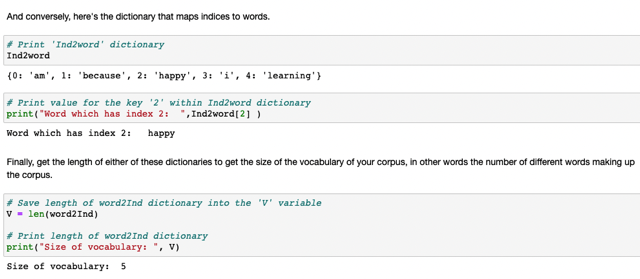</kbd>

     

- Getting one-hot word vectors
   

    
    
<kbd>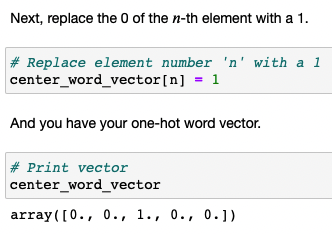</kbd>

    
<kbd></kbd>

    
<kbd>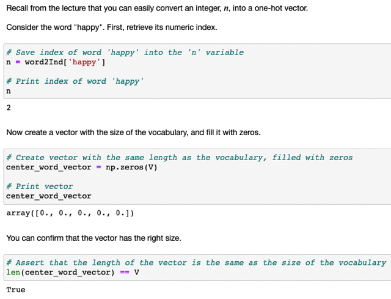</kbd>

    > Khi có thể **biết index của từ** là bao nhiêu rồi thì **tạo
    > one-hot encoding vector dễ ẹc** bằng cách **tạo một
    > vector đầy số 0** có**len bằng len của vocab**, rồi **điền
    > số 1 vào index của từ**

     

    
    
<kbd>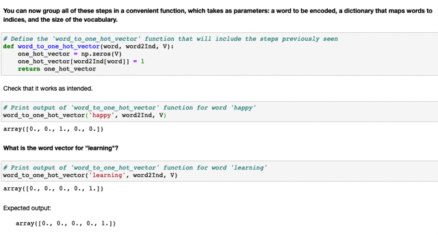</kbd>

    > Đại khái là viết một function **word_to_one_hot_vector** nhận**word,
    > word2Ind dict**, và **số lượng từ trong vocab V**, để nó dùng các step
    > trên cho ra one-hot vector. 3 bước làm cũng như vậy, **tạo zeros vector
    > size V**, lấy **index của từ ra bằng word2Ind dict** và **gán 1 cho vector
    > tại index đó**

     

- Getting context word vectors
   

    
    
<kbd>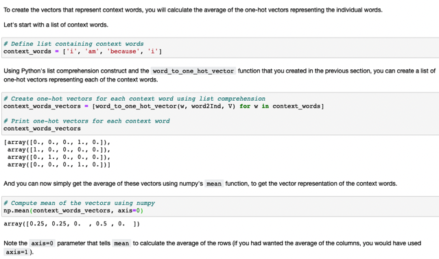</kbd>

    > Kế tiếp đại khái là tạo dùng **list comprehension** và function
    > **word_to_one_hot_vector** để **tạo bộ one-hot vector của các từ
    > context**. Sau đó ta dùng **mean(dim=1)** để tạo **average vector** -
    > đại diện cho **cả bộ các từ context**. Nhớ lại cách hiểu để biết axis =
    > mấy: mỗi vector của từ là một hàng, ta cần tính sum / hay mean của
    > tất các hàng, tức là **mỗi vị trí của vector kết quả** là **sum/mean
    > của các HÀNG ở trên**, vậy **HÀNG -> axis = 0.**

     

    
    
<kbd>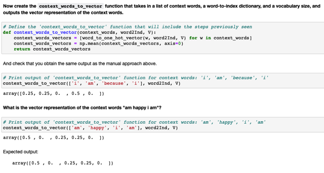</kbd>

    > Sau đó, ta cũng **tạo một convenient
    > function** để **chuyển một bộ các context
    > words** thành một**word vector.**

     

- Building the training set
   

    
    
<kbd>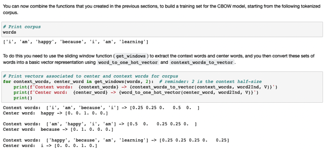</kbd>

    > Combine **get_windows** và các function **context_words_to_vector**
    > và **word_to_one_hot_vector**, ta có thể dễ dàng 'slide' cái window
    > **đi hết bộ text corpus** và **với mỗi bộ context words, target word**
    > **tạo ra vector của chúng**.

     

    
    
<kbd>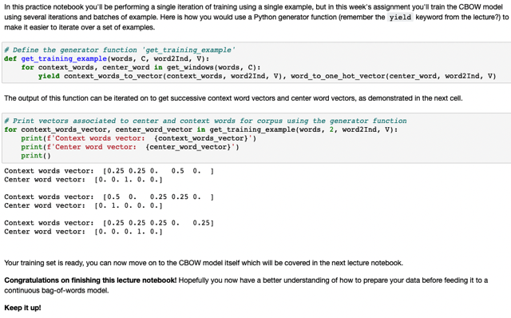</kbd>

    > Đại khái là dùng **yield** keyword. Viết một function trong đó **mỗi lần slide
    > window**, **tính bộ vector xong** thì **'yield' kết quả về**, như vậy function
    > **get_training_example** nó sẽ có cái kiểu **trả kết quả từng chút từng chút
    > (từng bộ một)** chứ không phải nó chạy xong hết nó trả 1 cục ra

     

## Architecture Of Cbow Model

 

### 1 The \\*continuous bag of words (CBOW)\\* model uses a\\* shallow dense neural network

> [!NOTE]
> 1 The \**continuous bag of words (CBOW)\** model uses a\**shallow dense neural network
> architecture\**.
>
> 2 The model consists of an \**input layer, a single hidden layer, and an output layer.\**
>
> 3 The input layer takes a vector of \**context words (x) as input\**, and the \**output layer predicts the
> center word (y hat).\**
>
> 4 The \**size of the input and output vectors\** is equal to the \**vocabulary size (V).\**
>
> 5 The \**hidden layer's size\** is determined by the \**chosen word embedding size (N)\** and is
> typically set to match N.
>
> 6 The neural network is\**fully connected,\** with weights \**(W_1 and W_2)\** and bias vectors \**(b_1
> and b_2)\** between the layers.
>
> 7 \**Word embeddings\** are \**derived from the weights matrices\** of the neural network.
>
> 8 The activation function used for the hidden layer is \**rectified linear units (ReLU)\**, and \**softmax\**
> is used for the output layer.
>
> 9 The activation functions play a crucial role in the model's predictions but will be discussed in detail
> in a future video.
>
> 10 \**Understanding the dimensions of the matrices and vectors\** is important for completing the
> assignments.
>
> 11 \**Logistic regression cannot be used in this case as there are multiple possibilities for prediction
> (V possible ways).\**

 

  
  
<kbd>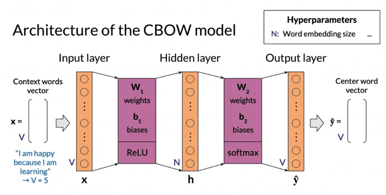</kbd>

  > Input có len = V, input là vector của **context words (average của các
  > one-hot vector của các context words**). **Output** là **class probability
  > vector** có len cũng **V** vì chứa **xác suất của từ đang dự đoán là 1 trong
  > V từ của vocab**. **Hidden layer 's size** sẽ chính là **size của embedding
  > vector**. Ta sẽ lấy **từ nào có giá trị p cao nhất trong y^**
  >
  > Cái cuối ổng nói **Logistic Regression** không thể dùng ở bài toán này
  > đơn giản vì nó **output chỉ có 1 or 0.**

   

  
  
<kbd>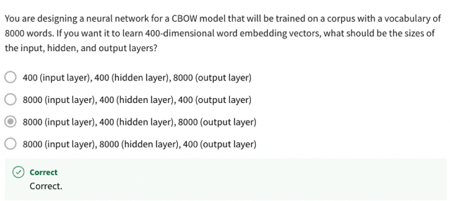</kbd>

   

## Architecture Of Cbow Model - Dimensions

 

### 1 Understanding the \\*dimensions of the layers\\* in a model can \\*help in comprehending how the model works\\*

> [!NOTE]
> 1 Understanding the \**dimensions of the layers\** in a model can \**help in comprehending how the model works\**
> and following along with the equations.
>
> 2 The \**continuous bag of words (CBOW) model\** consists of an\**input layer, hidden layer, and output layer.\**
>
> 3 The \**input layer\** is represented by a \**column vector x\** with a \**size equal to the vocabulary (V)\**.
>
> 4 The \**weighted sum of the values from the input layer\**, along with the bias vector, \**gives the results z1 in the
> hidden layer\**.
>
> 5 The weighting matrix W1 between the input layer and hidden layer has \**N rows\** (\**word embedding size\**) and \**V\**
> c\**olumns (vocabulary size)\**.
>
> 6 The bias vector b1 for the hidden layer has N rows (neurons in the hidden layer).
>
> 7 Applying the ReLU \**activation function\** \**preserves the dimensions\**, resulting in a hidden layer represented by
> a column vector with N rows.
>
> 8 The weighted sum of the values from the hidden layer, along with the bias vector, gives the results z2 in the
> output layer.
>
> 9 The weighting matrix W2 between the hidden layer and output layer has V rows (vocabulary size) and N
> columns (word embedding size).
>
> 10 The bias vector b2 for the output layer has V rows (output neurons).
>
> 11 Applying the \**softmax activation function preserves the dimensions\**, resulting in an output column vector y
> hat with V rows.
>
> 12 \**If working with row vectors instead of column vectors, the calculations involve transposed matrices and
> inverted terms in matrix multiplication.\**
>
> 13 Understanding the dimensions is essential when working with \**batches of examples \**instead of \**one example\**
> at a time.
>
> 14 Knowing the dimensions helps in programming assignments and prevents dimension mismatches.

 

  
  
<kbd>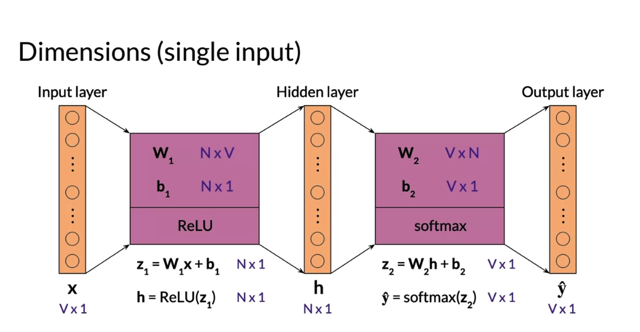</kbd>

  > Đại khái là nói về
  > shape của thứ.

   

  
  
<kbd>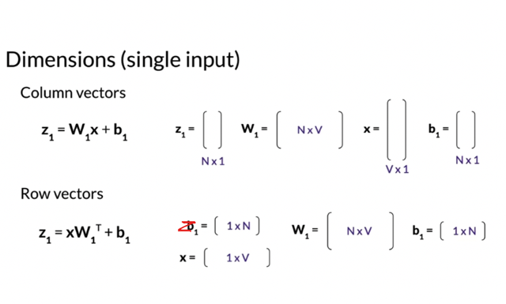</kbd>

  > Thì nếu x,z1 theo column vector thì  thì tính z1 =  W1x +
  > b1. Còn nếu tính x,z1 theo row vector thì z1 = xW1.T +
  > b1

   

## Architecture Of Cbow Model - Dimensions 2

 

### 1 In the \\*continuous bag of words (CBOW) model\\*,\\* feeding several examples\\* into the neural network at the

> [!NOTE]
> 1 In the \**continuous bag of words (CBOW) model\**,\**feeding several examples\** into the neural network at the
> same time is known as \**batch processing\**, which can \**speed up the learning process.\**
>
> 2 The \**batch size\** is denoted as \**m\** and is a \**hyperparameter \**defined at training time.
>
> 3 To \**process multiple inputs simultaneously\**, the\**individual input context word vectors\** can be \**joined\** side
> by side to form a \**matrix X with m columns.\**
>
> 4 Passing this \**matrix X\** through the network results in a \**matrix H\**, representing the \**values of the hidden
> layer\**.
>
> 5 Matrix H is obtained by \**applying the ReLU activation function\** to the \**weighted sum matrix Z1\**, where Z1 is
> the result of the \**matrix multiplication W1 times X plus the bias matrix B1\**.
>
> 6 \**The bias matrix B1\** is created by \**duplicating the bias vector b1 m times\** to have an \**N by m matrix\** (where
> N is the size of word embeddings and m is the batch size).
>
> 7 \**Broadcasting the vector to a matrix\** is performed \**automatically by numpy\** when\**adding a matrix to a
> column vector\** with the \**same number of rows.\**
>
> 8 The \**output matrix Y hat\**, \**containing the m outputs\**, is obtained by\**applying the softmax function\** to the\**weighted sum matrix W2H plus the bias matrix B2.\**
>
> 9 The \**bias matrix B2\** is created by r\**eplicating the bias vector b2 m times\** to have an \**output bias matrix with
> m columns.\**
>
> 10 The \**output matrix Y hat\** can be\**broken down into m column vectors,\** each corresponding to \**one of the
> input context word vectors.\**
>
> 11 Each input context word vector from the input matrix X is transformed into the corresponding output vector from
> the output matrix Y hat.
>
> 12 Understanding \**how to vectorize inputs\** and \**outputs in batch processing\** is an important step toward
> building a working CBOW model.
>
> 13 The next video will dive into the activation functions used in the CBOW model.

 

  
  
<kbd>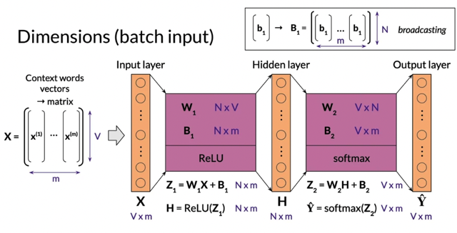</kbd>

   

  
  
<kbd>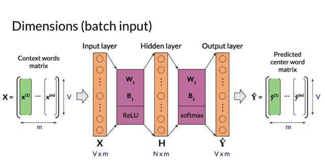</kbd>

   

  
  
<kbd>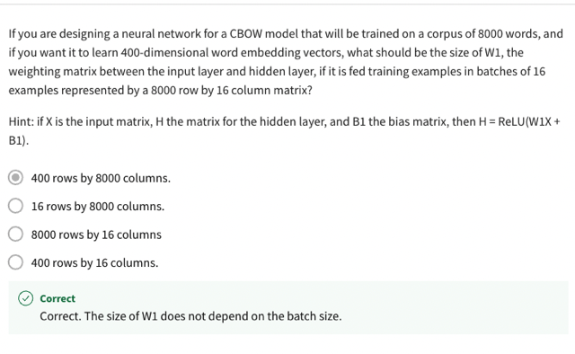</kbd>

   

  
  
<kbd>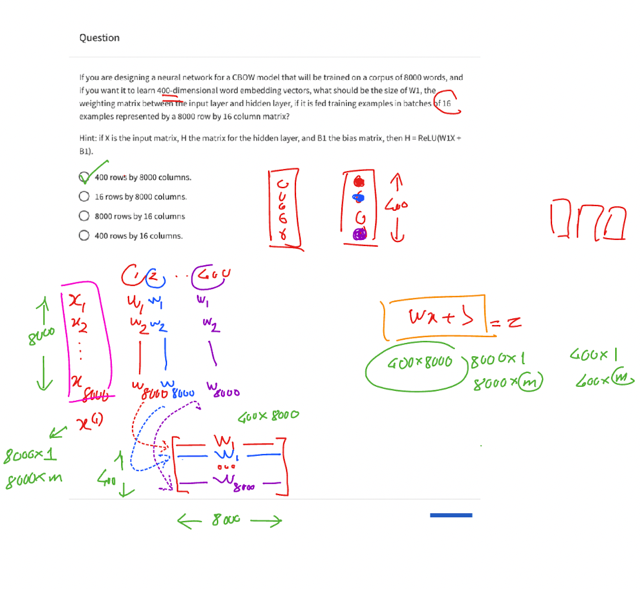</kbd>

   

## Architecture Of Cbow Model - Activation Functions

 

### 1 The \\*rectified linear unit (ReLU)\\* is an \\*activation function\\* used in neural networks. It calculates the \\*weighted sum of

> [!NOTE]
> 1 The \**rectified linear unit (ReLU)\** is an \**activation function\** used in neural networks. It calculates the \**weighted sum of
> inputs\** for each layer and passes the result through the\**ReLU function\**. \**2 ReLU function activates a neuron only if the
> weighted sum of its inputs is positive\**. It returns the \**maximum of 0 and the input value.\**
>
> 3 ReLU function \**converts negative values to zero\**, while \**positive values remain unchanged\**.
>
> 4 The \**ReLU functio\**n is applied to the hidden layer in the continuous bag of words (CBOW) model after calculating the
> weighted sum \**Z1\** (W1 times X plus B1).
>
> 5 The \**ReLU function helps introduce non-linearity to the neural network\**, allowing it to\**learn complex patterns and
> relationships in the data\**.
>
> 6 The\**softmax function\** is an \**activation function\** used in the \**output layer of the CBOW model.\**
>
> 7 The softmax function \**takes a vector of real numbers\** as \**input\** and \**outputs a vector of real numbers between 0 and
> 1.\**
>
> 8 The softmax function \**normalizes the inputs to probabilities that sum up to one\**, \\/\**representing the likelihood of each
> event in the output vector.\**\\/
>
> 9 In the CBOW model, the \**softmax function is applied to the weighted sum Z2\** (W2H plus B2) to obtain the output vector
> Y hat.
>
> 10 The\**output vector Y hat has V rows\**, corresponding to the words in the vocabulary, and the \\/\**values represent the
> probabilities that the central word is assigned to each word in the vocabulary.\**\\/
>
> 11 The softmax function is calculated by \**exponentiating the input vector elements\** and \**normalizing them by the sum of
> all exponentiated values.\**
>
> 13 The \**highest probability value in the output vector\** indicates the\**predicted central word\**.
>
> 15 \**ReLU function introduces non-linearity and helps capture complex patterns,\** while \**softmax function provides
> probabilities for classification tasks.\**

 

  
  
<kbd>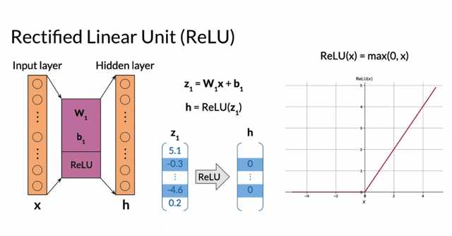</kbd>

  > Đại khái nói về reLU, nó biến thằng nào âm thì thành
  > 0, thằng nào dương thì giữ nguyên.

   

  
  
<kbd>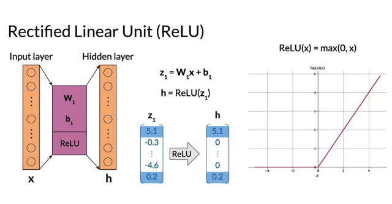</kbd>

   

  
  
<kbd>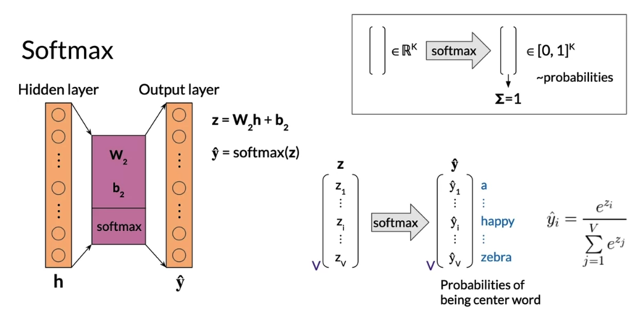</kbd>

  > Còn **softmax** thì từ vector z có V value tính ra **y^** cũng có V
  > value mà **mỗi item sẽ là P - xác suất của từ đang predict là cái từ
  > tương ứng của V**. **Tổng các giá trị p trong y^ là bằng 1**. Và có ý
  > này mình nên nhớ và hiểu là **y^ chính là probability distribution mà
  > model tạo ra cho cái từ đang predict.**

   

  
  
<kbd>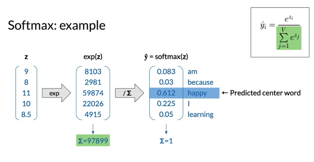</kbd>

   

  
  
<kbd>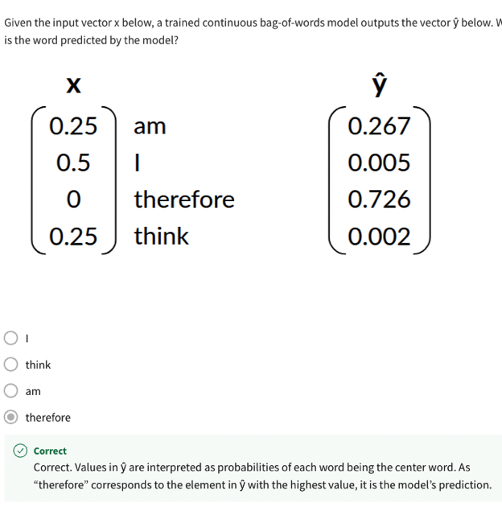</kbd>

   

## Lab: Intro To Cbow Model

 

<kbd>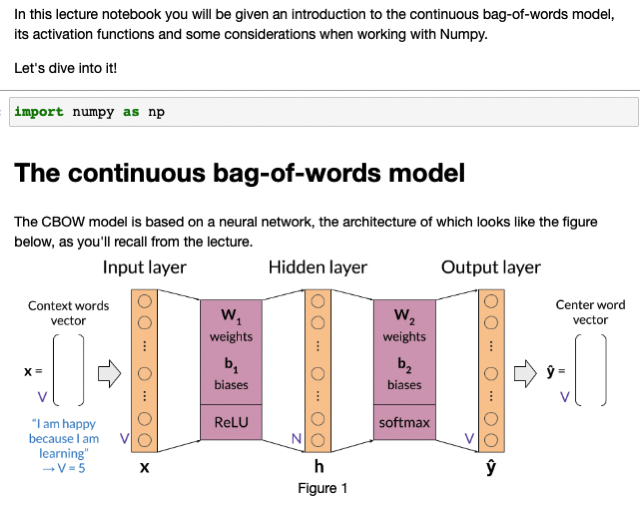</kbd>

 

### ReLu

 

  
  
<kbd>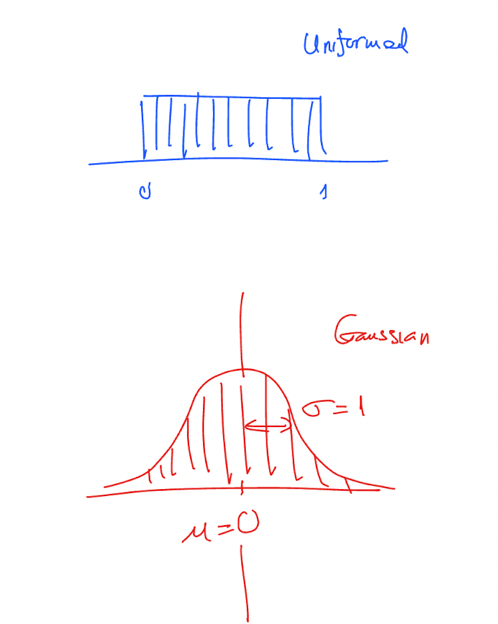</kbd>

  
<kbd></kbd>

  
<kbd>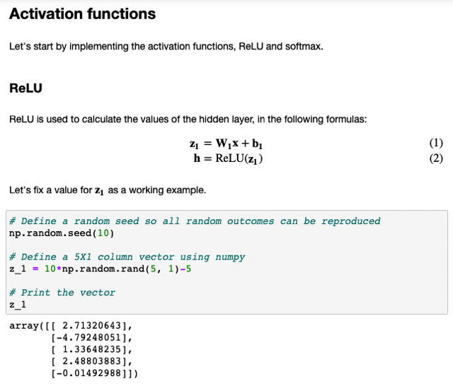</kbd>

  > Notice that using numpy's random.rand function returns a numpy
  > array filled with values taken from a **uniform distribution** over **[0,
  > 1)**. Numpy allows vectorization so each value is multiplied by 10
  > and then substracted 5.

  > Ở đây biết thêm cái là np.rand (input shape) sẽ tạo ra array
  > theo shape yêu cầu còn giá trị nó lấy random từ uniform
  > distribution trong khoảng 0,1. Nó không phải là Normal
  > (Gaussian Distribution) nhé

  > Is uniform distribution the same as normal distribution?
  >
  > ChatGPT No, a uniform distribution and a normal distribution are
  > different probability distributions.
  >
  > A uniform distribution, also known as a rectangular distribution, is
  > characterized by a constant probability density function (PDF) over a
  > specified range. In other words, every value within the range has an
  > equal probability of occurring. The PDF is a flat, constant line. On the
  > other hand, a normal distribution, also known as a Gaussian
  > distribution, is a bell-shaped probability distribution. It is characterized
  > by its mean (average) and standard deviation. In a normal distribution,
  > the values cluster around the mean, and the probability density
  > decreases symmetrically as you move away from the mean. The PDF
  > follows a specific mathematical formula, known as the Gaussian
  > function.
  >
  > In summary, a uniform distribution has a constant probability density
  > over a range, while a normal distribution has a bell-shaped probability
  > density centered around the mean. They have different characteristics
  > and applications in statistics and probability theory.

   

  
  
<kbd>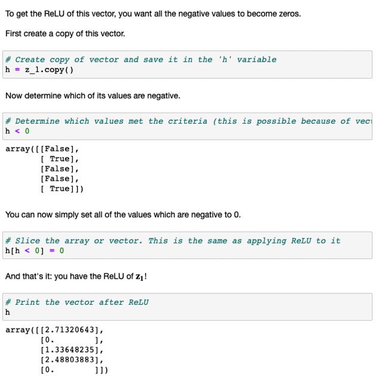</kbd>

  > Đại khái là **tự define một function relu**, khi **nhận một
  > input vector (array)**, **bất đầu bằng việc lấy index cũa những
  > item trong array có giá trị âm**, sau đó**dùng các index đó set
  > array value = 0. Vậy thôi**

   

  
  
<kbd>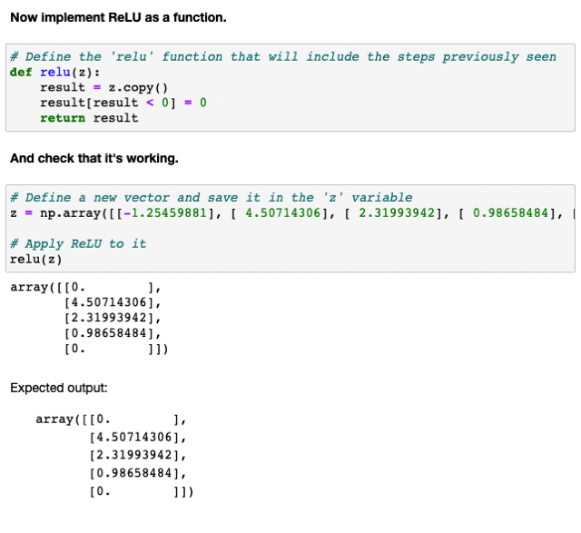</kbd>

   

### Softmax

 

  
  
<kbd>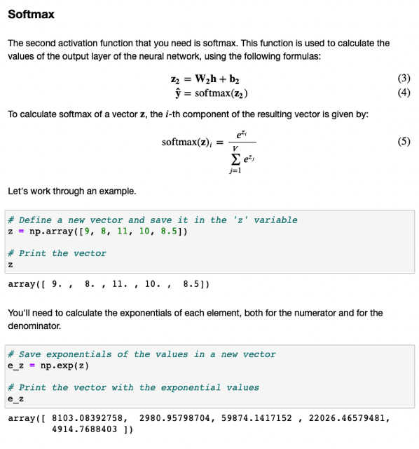</kbd>

  > Tương tự đối với softmax. nhận input
  > vector z, ta tính e^z (bằng np.exp()) để
  > có vector [e^z1, e^z2...] sau đó chia cho sum của vector này.

   

  
  
<kbd>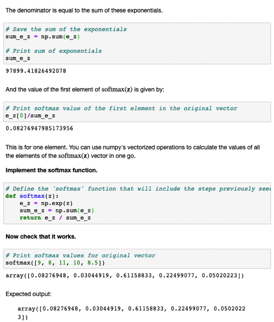</kbd>

   

  
  
<kbd>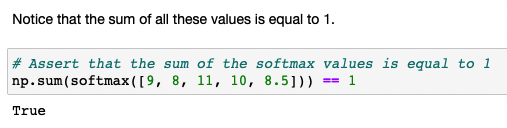</kbd>

   

### Dimensions: 1-D arrays vs

> [!NOTE]
> Dimensions: 1-D arrays vs
> 2-D column vectors

 

  
  
<kbd>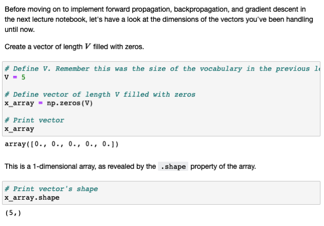</kbd>

  > Đại khái là để tính **matrix multiplication** thì **các shape
  > của W,x phải tương thích**, **W sẽ là matrix = 2D** array thì
  > **x cũng phải vậy**, (cái b - bias chỉ là phép cộng, nó sẽ
  > được numpy broadcast)

   

  
  
<kbd>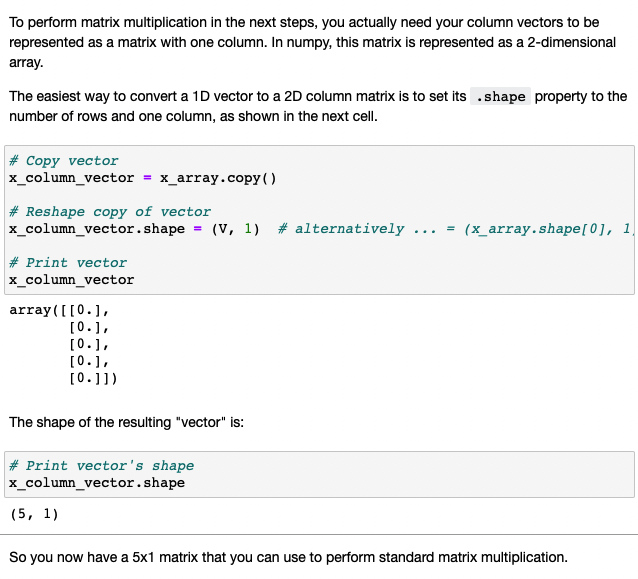</kbd>

  > Thì để **biến 1D thành 2D** ta dùng
  > **reshape** cũng được hoặc ở đây nó dùng
  > cách **set shape attribute**

   

- Congratulations on finishing this lecture notebook! Hopefully you now have a better understanding of the activation functions used in the continuous bag-of-words model, as well as a clearer idea of how to leverage Numpy's power for these types of mathematical computations.  In the next lecture notebook you will get a comprehensive dive into:  Forward propagation.  Cross-entropy loss.  Backpropagation.  Gradient descent.  See you next time!
   

## Training A Cbow Model: Cost Function

 

### 1 The cost function for \\*Softmax\\* is used to predict one of the possible words in a machine learning

> [!NOTE]
> 1 The cost function for \**Softmax\** is used to predict one of the possible words in a machine learning
> model.
>
> 2 The objective is to\**minimize the cost function\** in order to \**make accurate predictions.\**
>
> 3 A machine learning model consists of training examples with \**inputs, true targets, and predicted
> values\**.
>
> 4 The loss function measures the \**difference between the prediction and the true value\** for a
> \**single training example\** in the continuous bag of words model.
>
> 5 The \**parameters being adjusted\** in the continuous bag of words model are the weight matrices
> (W1 and W2) and the bias factors (B1 and B2).
>
> 6 The\**cross-entropy loss function\** is commonly used with \**classification models\**, including the
> continuous bag of words model.
>
> 7 The \**cross-entropy\** loss is calculated using the \**negative sum of the product of the actual value
> (Y) and the logarithm of the predicted value (Ŷ).
> \**
> 8 An example is given with input context "I am because I were" and the actual central word "
> happy" with corresponding vectors Y and Ŷ.
>
> 9 The \**cross-entropy loss\** is computed as the \**negative sum\**, resulting in a \**loss value.\**
>
> 10 When the prediction is incorrect, the loss is larger, and the cross-entropy loss is positive.
>
> 11 The \**cross-entropy loss rewards correct predictions and penalizes incorrect predictions.\**
>
> 12 The l\**oss approaches positive infinity\** as the \**predicted value approaches zero.\**
>
> 13 The c\**ross-entropy loss\** is used in the \**forward propagation\** of the continuous bag of words
> model.

 

  
  
<kbd>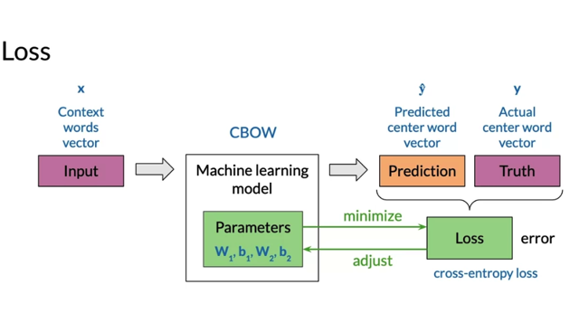</kbd>

  > 1 The cost function for Softmax is important for predicting one of the possible words
  > in a machine learning model.
  >
  > 2 The cost function needs to be minimized in order to make accurate predictions.
  >
  > 3 A machine learning model consists of training examples with inputs, true targets,
  > and predicted values.
  >
  > 4 The loss function measures the difference between the prediction and the true
  > value for a single training example.
  >
  > 5 The continuous bag of words model uses a vector representation for input context
  > words and a vector for the actual  central word.
  >
  > 6 The objective of the learning process is to find the parameters that minimize the
  > loss using the training dataset.
  >
  > 7 The parameters being adjusted in the continuous bag of words model are the
  > weight matrices (W1 and W2) and the bias factors (B1 and B2).
  >
  > 8 The cross-entropy loss function is commonly used with classification models and
  > softmax output layers.
  >
  > 9 The cross-entropy loss function is a more general form of the log loss used in
  > logistic regression.
  >
  > 10 Softmax output layers are often used in neural networks, including the
  > continuous bag of words model.

   

  
  
<kbd>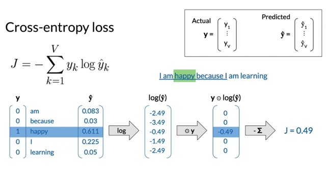</kbd>

  > 1 If you are familiar with**logistic regression**, you might already know the simple form
  > of the **cross entropy loss function**, also known as **log loss.**
  >
  > 2 The cross entropy loss function is applicable when there are **only two classes**.
  >
  > 3 The formula for cross entropy loss for a training example is **J = -∑(Yₖ * log(Ŷₖ))**,
  > where **K ranges from 1 to V.**
  >
  > 4 An example is given with an input**context "I am because I were"** and the**actual
  > central word "happy."**
  >
  > 5 The vectors **Y and Ŷ** are provided, representing the **actual values** and the
  > **predicted values**, respectively.
  >
  > 6 The **cross entropy loss** is calculated by taking the **logarithm of Ŷ** and **multiplying
  > each element by the corresponding element of Y.**
  >
  > 7 The resulting vector has only one **non-zero value, which is -0.49.**
  >
  > 8 The **sum of the vector is -0.49**, and the loss is the **negative of this sum**, resulting in
  > a l**oss value of 0.49**.

  > Các step ví dụ**tính ra loss** cho một trường hợp
  > **predict đúng**. Từ đúng là 'happy' và nó predict y^
  > có P tại vị trí tương ứng với 'happy' là cao nhất **0.611.** 
  >
  > Tính loss cho ra J = 0.49

   

  
  
<kbd>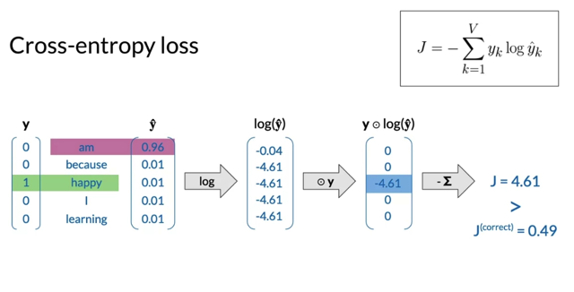</kbd>

  > Ví dụ khi predict sai, cho thấy
  > loss sẽ cao hơn nhiều.

   

  
  
<kbd>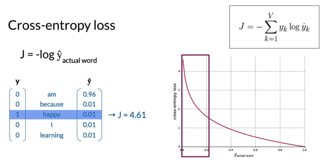</kbd>

  
<kbd></kbd>

  
<kbd>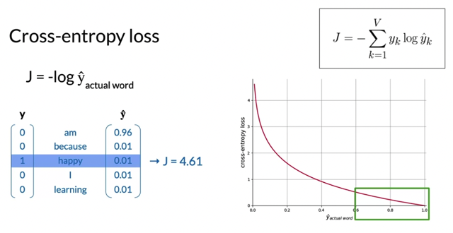</kbd>

  > Thì đại khái là **giá trị của loss** cuối cùng bằng / hoá ra bằng**-log của
  > prediction của từ tại vị trí của từ đó trong y^ vector**
  >
  > Nếu quay lại có khó hiểu thì để ý công thức y*logy^ thì những**vị trí trong y = 0 sẽ
  > khiến nhân với các vị trí tương ứng trong log y^ cũng bằng 0**. Nên giá trị **loss chỉ
  > còn là tính bằng giá trị của y và y^ tại vị trí target word**
  >
  > giả sử từ đúng (y) là happy và ta **plot J theo y^ tại vị trí của actual word này p("
  > happy")**  thì ta thấy nếu **p("happy") càng gần 1**, có nghĩa là model **càng chắc chắn**
  > về dự đoán của mình thì **loss sẽ càng nhỏ**.
  >
  > Ngược lại, nếu **p càng gần 0**, tức là nó không chắc (ví dụ p ở đâu đó giữa giữa)
  > thậm chí hoàn toàn chắc chắn rằng "happy" không phải đáp án đúng (bằng cách
  > cho p("happy") = 0 đồng nghĩa với nói rằng " không có khả năng nào "happy" là từ
  > đúng" thì khi đó **loss sẽ lớn vô cùng.**

   

  
  
<kbd>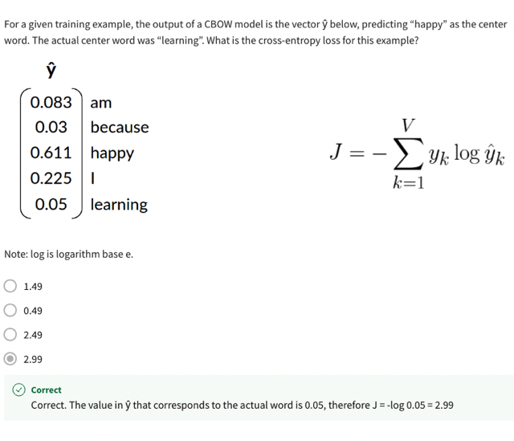</kbd>

  
<kbd></kbd>

  
<kbd>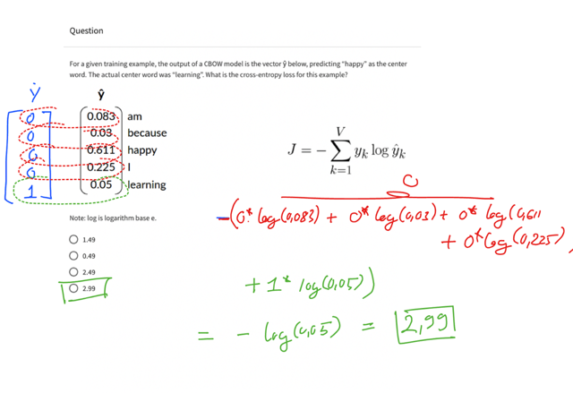</kbd>

   

## Training A Cbow Model: Forward Prop

 

### 1 \\*Forward propagation\\* of the CBOW model is explained, which shows the \\*transformation of inputs through

> [!NOTE]
> 1 \**Forward propagation\** of the CBOW model is explained, which shows the \**transformation of inputs through
> activation layers\** until a \**prediction\** is made.
>
> 2 The \**cross-entropy loss function\** is used to \**measure the error\** in the CBOW model's predictions for a
> single example.
>
> 3 Training is done using\**batches of examples\**, and \**forward propagatio\**n is applied to \**propagate inputs
> through the network\** and obtain the \**output matrix Ŷ.\**
>
> 4 \**Cost\** is an \**extension of loss to support a batch of training examples\**, and it is calculated based on the
> \**cross-entropy loss function.\**
>
> 5 The terms \**"loss" and "cost" are used interchangeably\**, with \**"loss" referring to a single example and "cost"
> to a batch of examples.\**
>
> 6 The cross-entropy cost for a batch of examples is the \**mean\** of the cross-entropy losses for each individual
> example.
>
> 8 The \**cost function\** is used to \**optimize the parameters of the neural network\** through \**backpropagation\**
> and \**gradient descent.\**

 

  
  
<kbd>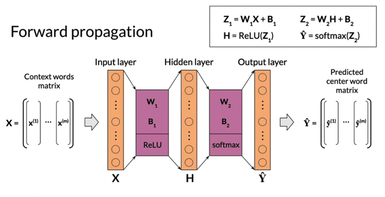</kbd>

  > Forward prop: từ **một hoặc một batch_size** training
  > example, tính các **activation** qua các layer và**y^**

   

  
  
<kbd>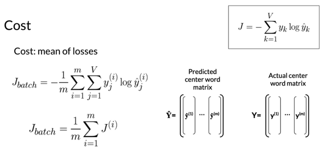</kbd>

  > Từ **y và y^** tính ra **loss của từng
  > example** và**cost của cả batch là
  > mean của các example's loss**

  > Làm lại để ra
  > công thức này

   

## Training A Cbow Model: Backprop And G.d

 

### 1 The \\*goal\\* is to learn the weights and biases of the linear layer and word embeddings by \\*minimizing

> [!NOTE]
> 1 The \**goal\** is to learn the weights and biases of the linear layer and word embeddings by \**minimizing
> the cost function. \** 
>
> 2 \**Backpropagation\** is an algorithm that \**calculates the partial derivatives or
> gradients of the cost function with respect to the weights and biases\** of the neural network.
>
> 3 Backpropagation involves using the \**chain rule for derivatives \**to \**calculate derivatives starting from
> the output layer and working backward through the layers\**.
>
> 4 \**Gradient Descent\** is a technique that\**adjusts the weights and biases of the neural network using the
> gradients to minimize the cost\**.
>
> 5 The\**partial derivatives of the cost function with respect to the weights and biases (W1, W2, b1, b2)\** are
> provided.
>
> 6 The \**formulas for updating the weights and biases using Gradient Descent\** are given, including the
> \**learning rate (alpha) as a hyperparameter.\**
>
> 7 The \**learning rate determines the size of the step taken during each parameter update\**, with a
> \**smaller\** value leading to \**more gradual updates\** and a \**larger\** value allowing for \**faster updates\**.
>
> 8 The \**updated weights\** and \**biases\** are obtained by \**subtracting alpha times their respective
> gradients from their original values\**.
>
> 9 Understanding the\**mathematical derivation of the formulas\** is not necessary for this course.
>
> 10 With the knowledge of \**backpropagation\** and g\**radient descent\**, one has the  necessary tools to train a
> continuous bag-of-words model.
>
> 11 The next video will cover \**how to extract word embedding vectors\** from a \**trained continuous
> bag-of-words model.\**

 

  
  
<kbd>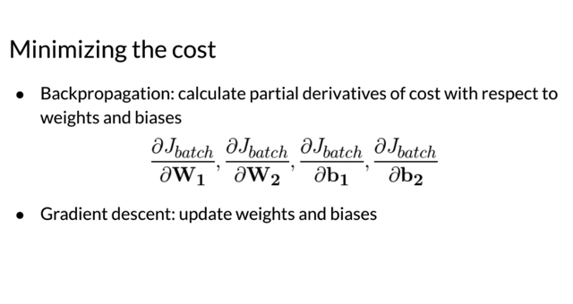</kbd>

  > **Backprop**: Cơ bản như ta đã biết là tính đạo
  > hàm (**partial derivative**) của cost function **w.r.t
  > weights**. Và **Gradient Descent** update weights
  > với **partial derivative** đó

   

  
  
<kbd>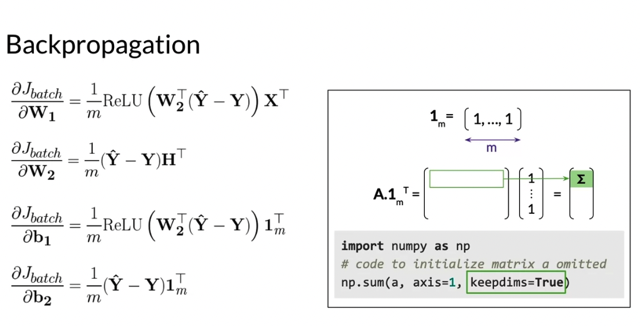</kbd>

  > Ổng để sẵn công thức tính p.d nhưng
  > mình vì đã học nên có thể hiểu tại
  > sao ra công thức này.

   

  
  
<kbd>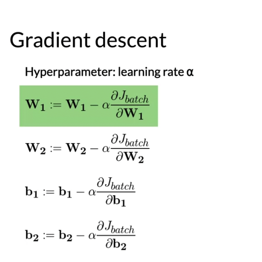</kbd>

   

  
  
<kbd>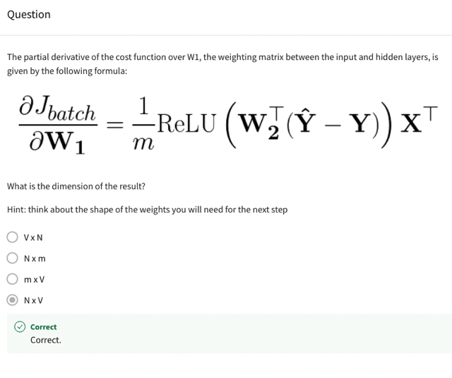</kbd>

  > Từ DLSpec mình đã biết derivative of J w.r.t
  > W1 thì có cùng shape với W1 là N*V

   

  
  
<kbd>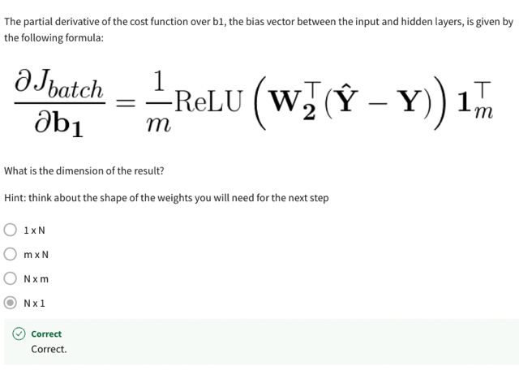</kbd>

  > Tương tự, cùng
  > shape với b1 = NxV

   

## Lab: Training The Cbow Model

 

### In previous lecture notebooks you saw how to \\*prepare data\\* before feeding it to a

> [!NOTE]
> In previous lecture notebooks you saw how to \**prepare data\** before feeding it to a 
> continuous bag-of-words model, the model itself, its architecture and activation functions. 
> This notebook will walk you through:
>  • \**Forward propagation\**.
>  • \**Cross-entropy loss\**.
>  • \**Backpropagation\**.
>  • \**Gradient descent.\**
>
> Which are concepts necessary to understand how the training of the model works.
>
> Let's dive into it!

<kbd>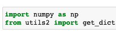</kbd>

<kbd></kbd>

 

- Forward propagation
   

    
    
<kbd>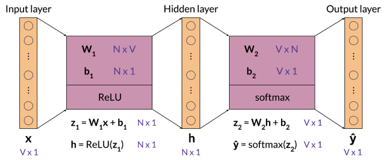</kbd>

     

    
    
<kbd>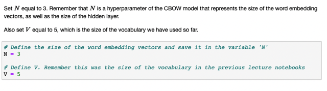</kbd>

    > **N là số unit của hiden layers** và **cũng sẽ là số item của embedding
    > layer**. Là một **h. param** ta set nó bằng 3.
    >
    > Còn số **V chính là số feature của input vector** và chính là **số từ của
    > vocab size**
    >
    > (ôn lại nhanh: **context word sẽ dc one-hot encoded** - thành vector có
    > **len = vocab size**, từ đó tính**ra vector của một group context words**
    > (của một target word)  bằng cách tính **trung bình các từ** thì cũng là
    > vector len = vocab size và đó chính là i**nput của N.N**

     

    
    
<kbd>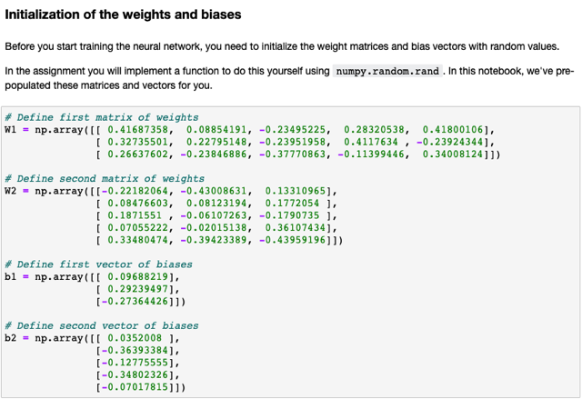</kbd>

    > Bước đầu là **initialize weights và
    > bias**, trong P.A sẽ dùng **np.
    > random.rand** ở đây làm sẵn

     

    
    
<kbd>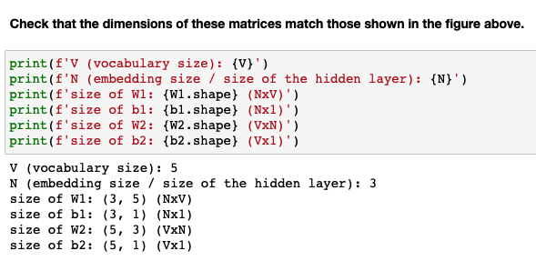</kbd>

    > Ở đây remind cho vui là output cũng là vector len 5 =
    > vocab size vì là chứa các gía trị class probabilities của 5
    > class (5 words trong vocab)
    >
    > Nên W2 có shape là VxN, b2 là Vx1

     

  
  - # Define the\\* tokenized version of the corpus\\* words = ['i', 'am', 'happy', 'because', 'i', 'am', 'learning']  # Get '\\*word2Ind\\*' and '\\*Ind2word\\*' dictionaries for the tokenized corpus \\*word2Ind\\*, \\*Ind2word\\* = \\*get_dict(words)\\*  # Define the '\\*get_windows\\*' function as seen in a previous notebook def \\*get_windows\\*(words, C):     i = C     while i < len(words) - C:         center_word = words[i]         context_words = words[(i - C):i] + words[(i+1):(i+C+1)]         yield context_words, center_word         i += 1  # Define the '\\*word_to_one_hot_vector\\*' function as seen in a previous notebook def \\*word_to_one_hot_vector\\*(word, word2Ind, V):     one_hot_vector = np.zeros(V)     one_hot_vector[word2Ind[word]] = 1     return one_hot_vector  # Define the '\\*context_words_to_vector\\*' function as seen in a previous notebook def context_words_to_vector(context_words, word2Ind, V):     context_words_vectors = [word_to_one_hot_vector(w, word2Ind, V) for w in context_words]     context_words_vectors = np.mean(context_words_vectors, axis=0)     return context_words_vectors  # Define the generator function 'get_training_example' as seen in a previous notebook def \\*get_training_example\\*(words, C, word2Ind, V):     for context_words, center_word in get_windows(words, C):         yield context_words_to_vector(context_words, word2Ind, V), word_to_one_hot_vector(center_word, word2Ind, V)
    > Mấy function này đã 'làm qua' ở lab
    > trước, đây dùng lại thôi

     

- Training Example
   

    
    
<kbd>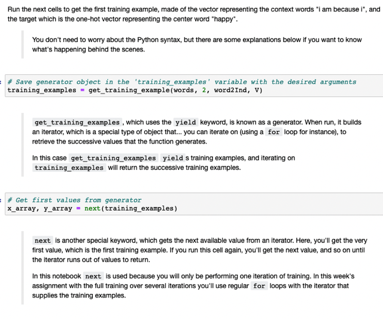</kbd>

    > Nói về function get_training_example mà mình đã note ở trong lab
    > trước, rằng có cái keyword yield đáng chú ý., đó là nó trả về data từng
    > chút từng chút (retrieve the successive values that the function
    > generates)
    >
    > Biết thêm về một special keyword khác là **next()** kiểu như nó lấy
    > từng cái từng cái nhưng trong P.A ta sẽ dùng for loop. Chưa biết thế
    > nào.

     

    
    
<kbd>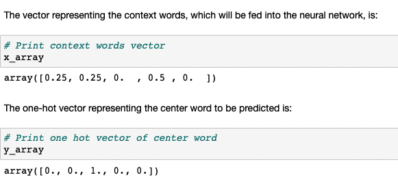</kbd>

    > x ta có thể thấy là vector đại diện cho một
    > group các context words. Còn label là
    > one-hot vector của từ target word.

     

    
    
<kbd>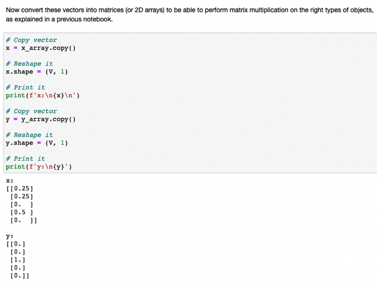</kbd>

    > Như cái lab bữa cũng nói, phải chuyển
    > x,y về dạng 2D vector để matrix
    > multiplication với W được.

     

    
    
<kbd>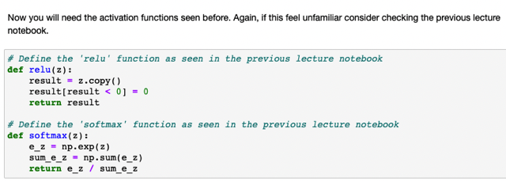</kbd>

    > Và xài lại activation function
    > đã define bữa trước

     

    
    
<kbd>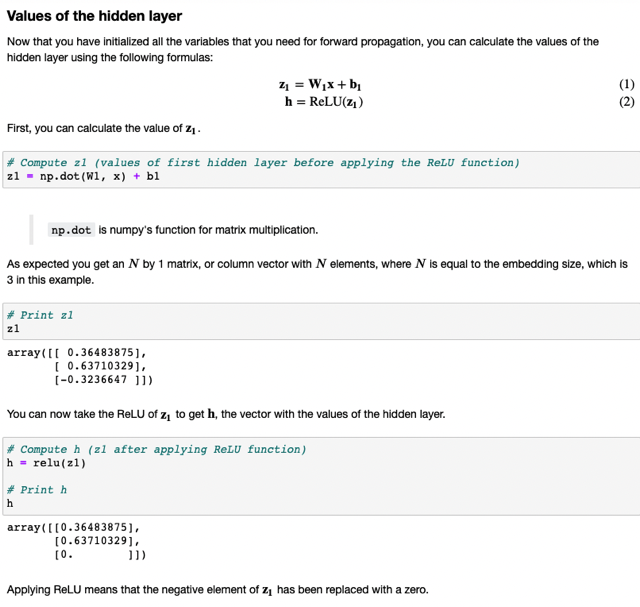</kbd>

    > Rồi, tính z1 với W1, x, b1
    > dùng reLu tính h từ z1

     

    
    
<kbd>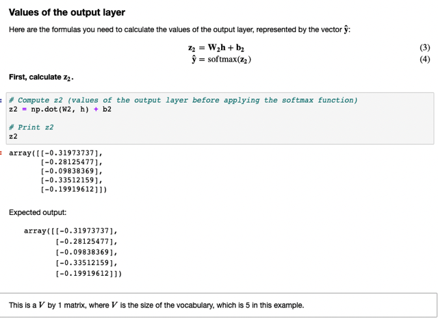</kbd>

    > Rồi kế tính z2 từ h, W2, b2.

     

    
    
<kbd>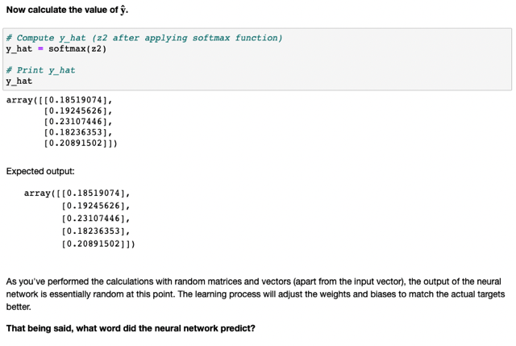</kbd>

    > bỏ z2 vào softmax tính ra y^. Như đã nói y^ sẽ là vector dài V chứa
    > probability của các từ trong v là từ đúng.
    >
    > Và tất nhiên với random weight thì prediction này chắc chắn là random.
    > Cứ xem thử, ta thấy p ở vĩ trí (index) 2 là 0,23 cao nhất. Bỏ vào function
    > IntToWord ta sẽ thấy nó là từ 'happy'
    >
    > Có bối rối thì nhớ, one hot vector được (tạo) dựa trên vocab list , nên
    > thứ tự/ index của các p trong y^ cũng tương ứng với index của các từ
    > trong vocab, nên ta lấy index của một vị trí nào đó trong y^ để "tra" bằng
    > Int2word sẽ ra từ tương ứng.

     

- Cross-entropy loss
   

    
    
<kbd>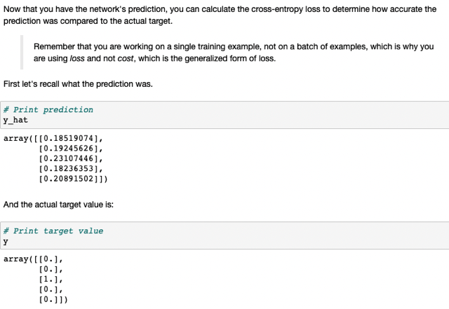</kbd>

    > Rồi đại khái là có y^ rồi, ta sẽ tính ra loss (của một example) Trong
    > đây ổng gọi loss của 1 example là loss, còn của 1 batch là cost
    > (thông thường thì cost chỉ loss tổng của tất cả toàn bộ training data
    > như thôi không quan trọng lắm.

     

    
    
<kbd>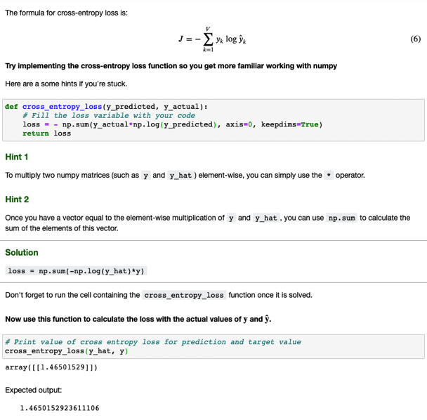</kbd>

    > Theo công thức, với y, và y^ là
    > vector thì ta cứ element-wise
    > multiply và sum thôi.

     

- Backpropagation
   

    
    
<kbd>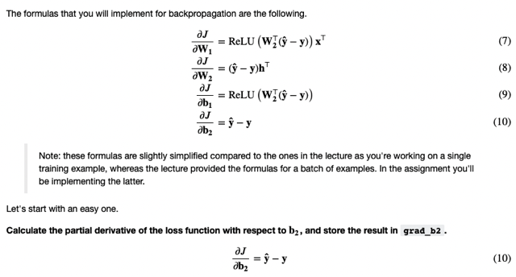</kbd>

     

    
    
<kbd>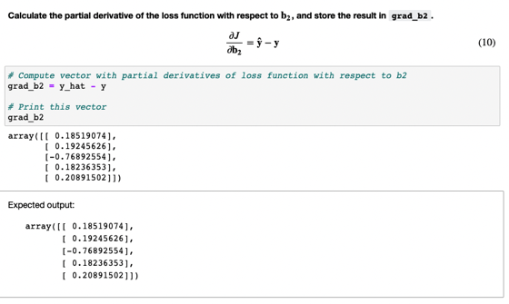</kbd>

     

    
    
<kbd>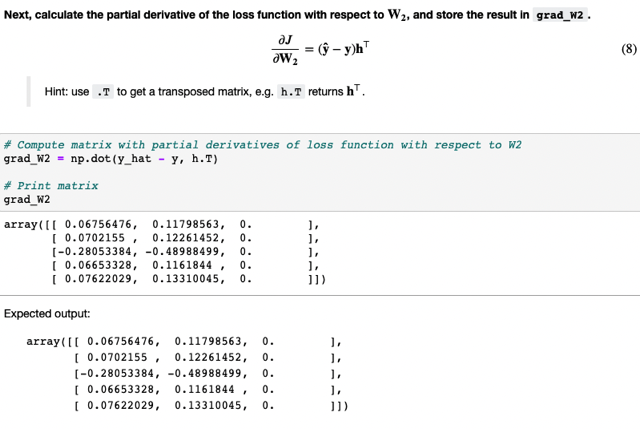</kbd>

     

    
    
<kbd>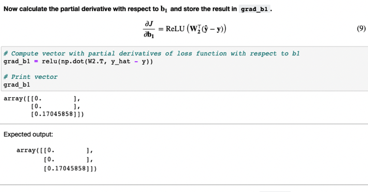</kbd>

     

    
    
<kbd>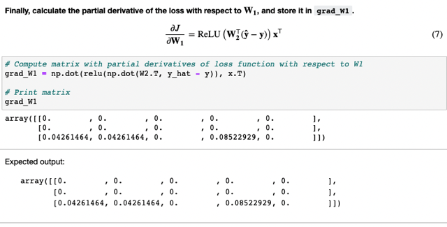</kbd>

     

    
    
<kbd>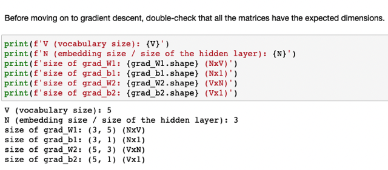</kbd>

     

- Gradient descent
   

    
    
<kbd>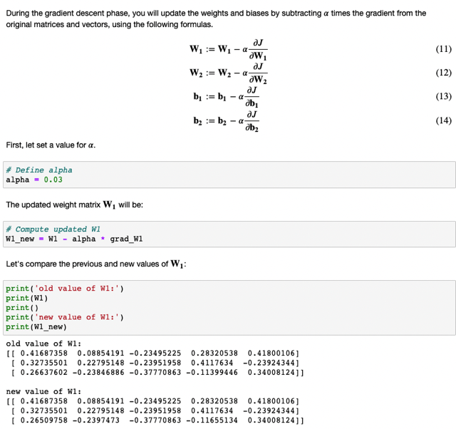</kbd>

     

    
    
<kbd>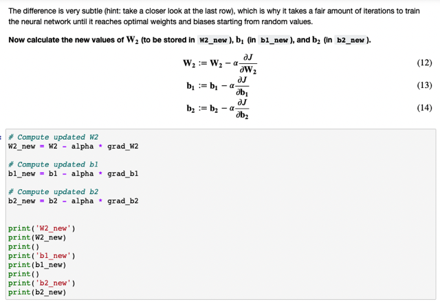</kbd>

     

    
    
<kbd>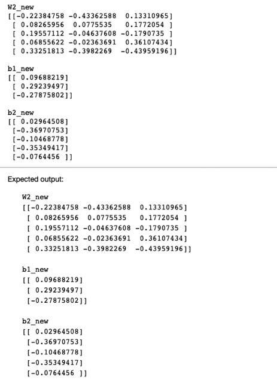</kbd>

     

- Conclusion
   

  
  - Congratulations, you have completed one iteration of training using one training example!  You'll need many more iterations to fully train the neural network, and you can optimize the learning process by training on batches of examples, as described in the lecture. You will get to do this during this week's assignment. \\* How this practice relates to and differs from the upcoming graded assignment \\*  • In the assignment, for each iteration of training \\*you will use batches of examples\\* \\*instead\\* of a single example. The formulas for forward propagation and backpropagation will be modified accordingly, and you will use \\*cross-entropy\\* \\*cost\\* instead of \\*cross-entropy loss.\\*  • You will also complete \\*several iterations of training\\*, until you \\*reach an acceptably low cross-entropy cost\\*, at which point you can \\*extract good word embeddings\\* from the weight matrices.
    > Đại khái trong P.A sẽ xử lý 1 batch
    > các sample thay vì 1 cái một.

     

## Extracting Word Embedding Vectors

 

### 1\\* Word embeddings are not directly output\\* by the training process but are a\\* by-product of

> [!NOTE]
> 1\**Word embeddings are not directly output\** by the training process but are a\**by-product of
> it\**. Word embeddings are \**vectors that carry the meaning of words based on the context
> words in the corpus\**.
>
> 2 After training a neural network, there are \**three alternative methods to extract word
> embeddings from the trained model\**:
>
> 3 a. Extract the \**column vectors of the weight matrix W_1\** as word embeddings. Each
> column corresponds to a word in the vocabulary.
>
> 4 b. Extract the \**row vectors of the weight matrix W_2\** as word embeddings. Each row
> corresponds to a word in the vocabulary.
>
> 5 c. \**Take the average of the previous two representations\** by averaging W_1 and the
> transpose of W_2 to obtain a new matrix W_3. Word embeddings can then be extracted
> from each column of W_3.
>
> 8 In the following week's video, there will be a discussion about \**evaluation metrics for word
> embeddings\**, specifically intrinsic evaluation and extrinsic evaluation.

 

  
  
<kbd>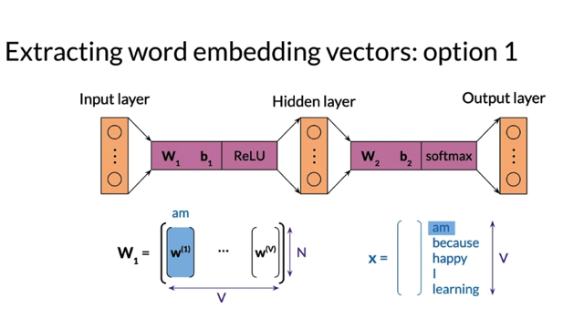</kbd>

   

  
  
<kbd>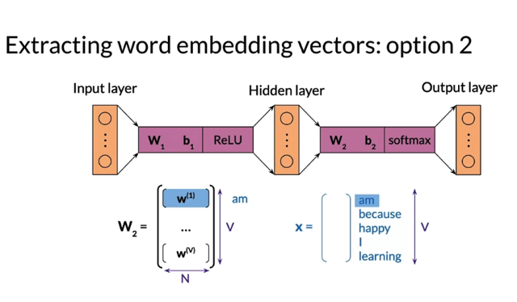</kbd>

   

  
  
<kbd>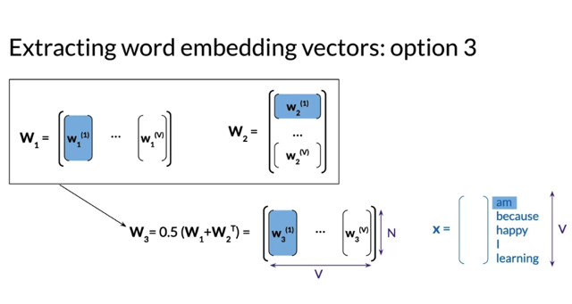</kbd>

   

## Lab: Word Embeddings

 

### In previous lecture notebooks you saw all the steps needed to

> [!NOTE]
> In previous lecture notebooks you saw all the steps needed to
> train the CBOW model. This notebook will walk you through
> \**how to extract the word embedding vectors\** from a model.
>
> Let's dive into it!

 

  
  
<kbd>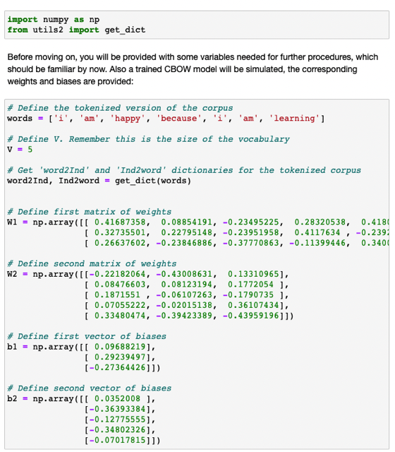</kbd>

  > Đại khái là cho W1,W2 giả bộ là
  > weights & bias matrix của model CBOW
  > đã được trained xong.

   

  
  
<kbd>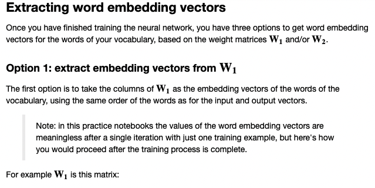</kbd>

  > Như đã biết trong lecture, cách 1 là dùng **CỘT
  > CỦA W1** mỗi cột tương ứng với mỗi từ theo thứ
  > tự của vocab list

   

  
  
<kbd>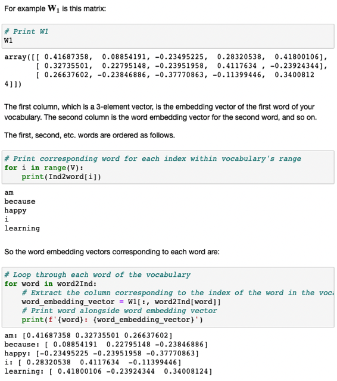</kbd>

   

  
  
<kbd>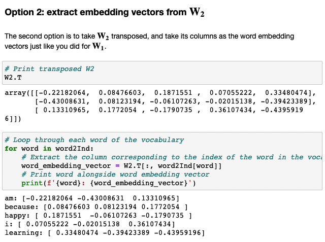</kbd>

  > Cách 2 là dùng HÀNG CỦA W2,
  > HAY **CỘT CỦA W2.T**

   

  
  
<kbd>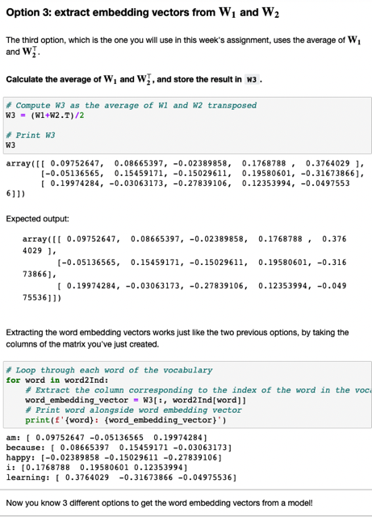</kbd>

  > Và cách thứ 3 dùng **CỘT CỦA W3** là 
  > mean của W1 và W2.T

   

## Evaluating Word Embeddings: Intrinsic Evaluation

 

### 1 There are \\*two types of evaluation metrics\\* for word embeddings: \\*intrinsic\\* evaluation and \\*extrinsic\\*

> [!NOTE]
> 1 There are \**two types of evaluation metrics\** for word embeddings: \**intrinsic\** evaluation and \**extrinsic\**
> evaluation.
>
> 2 \**Intrinsic evaluation\** focuses on \**assessing how well word embeddings capture semantic and syntactic
> relationships between words\**. \**Semantic analogies\**, such as \**finding missing words in analogies\** like "
> France is to Paris as Italy is to ____," and \**syntactic analogies\**, such as identifying \**patterns in tenses or
> comparatives\**, can be used for evaluation.
>
> 3 \**Intrinsic evaluation\** can also \**involve clustering similar word embedding vectors\** and \**assessing the
> quality of the clusters\** by \**comparing them to a human-made reference\**, like a \**thesaurus\**.
>
> 4 It is important to note that \**in some cases, there may be multiple correct answers\** or instances where
> \**word embeddings fail to capture certain relationships accurately.\**
>
> 5 \**Visualization\** of word embedding vectors can \**be a part of intrinsic evaluation\**, allowing for a \**basic
> assessment of the embeddings using human judgment\**.
>
> 7 \**Intrinsic\** evaluation methods include \**clustering, analogies, and visualization\**, while \**extrinsic\**
> evaluation focuses on \**evaluating the performance of word embeddings in specific downstream tasks\**.
>
> Overall, the text introduces the \**concepts of intrinsic and extrinsic evaluation\**, discusses intrinsic
> evaluation methods such as \**analogies and clustering, \**and mentions that\**visualization\** and basic
> intrinsic evaluation will be part of the assignment. It also sets the stage for the next video, where
> extrinsic evaluation will be explored.

 

  
  
<kbd>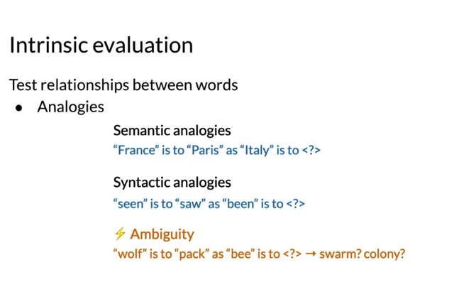</kbd>

  > Đại khái là đánh giá bằng **khả năng embedding chứa đựng
  > những Semantic analogies** (ý nghĩa về ngữ nghĩa của từ) và
  > **Syntactic analogies** kiểu như**thì, dạng từ .**...

   

  
  
<kbd>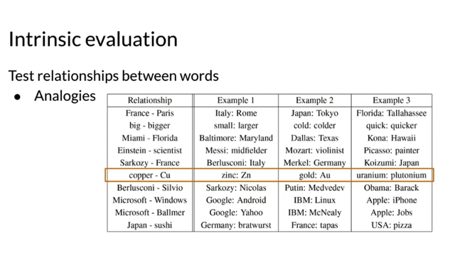</kbd>

  > Một ví dụ cho thấy embedding chưa ok

   

  
  
<kbd>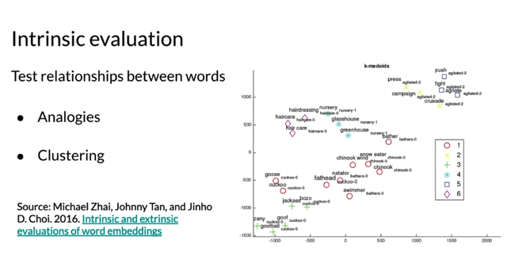</kbd>

  > Cách thứ hai đó là**clustering chúng lại** và **so sánh những cụm
  > gần gần nhau** này với **các kết quả tương tự nhưng do người làm
  > (như các bộ thesaurus)**. Và**visualizing** cho phép **đánh giá sơ bộ
  > được ngay** (dùng human đánh gía)

  > Intrinsic evaluation can also involve clustering similar word embedding vectors and assessing the
  > quality of the clusters by comparing them to a human-made reference, like a thesaurus.

   

  
  
<kbd>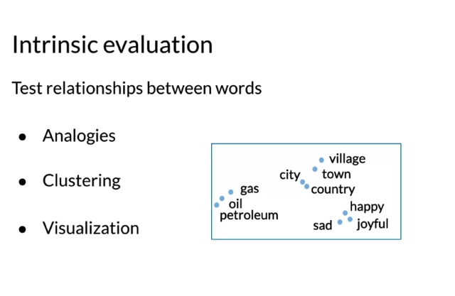</kbd>

   

## Evaluating Word Embeddings: Extrinsic Evaluation

 

### 1 \\*Extrinsic evaluation\\* is a method used to \\*test word embeddings\\* on \\*external tasks\\*, which are typically

> [!NOTE]
> 1 \**Extrinsic evaluation\** is a method used to \**test word embeddings\** on \**external tasks\**, which are typically
> r\**eal-world tasks\** that \**require the use of word embeddings\**. It evaluates the \**performance of the word
> embeddings by using the performance metric of the external task\** as \**a proxy for the quality of the embeddings\**.
>
> 2 Examples of useful \**word-level tasks for extrinsic evaluation\** include \**named entity recognition\** and
> \**parts-of-speech tagging\**. Named entity recognition involves i\**dentifying and categorizing named entities in a
> sentence\**, such as \**identifying persons, organizations, locations, \**etc.
>
> 3 To perform \**extrinsic evaluation\**, you \**train a model using word embeddings\** and\**evaluate its performance on a
> test set using selected evaluation metrics\** like \**accuracy\** or \**F1 score\**. The \**performance of the model \**on the
> evaluation metric \**represents\** the \**combined performance of both the word embeddings\** and the \**classification
> task\**.
>
> 4 \**Extrinsic evaluation\** is considered the \**ultimate test to ensure the actual usefulness of word embeddings.\**
> However, it has some \**drawbacks\**, including being \**more time-consuming\** than intrinsic evaluation and \**not
> providing specific information\** about \**which part \**of the end-to-end process (word embeddings or the external
> task) \**is  responsible\** if the performance is poor.
>
> 5 Extrinsic evaluation is\**more challenging\** to\**troubleshoot\** compared to intrinsic evaluation.
>
> 6 The text suggests referring to a \**comprehensive\** and \**readable paper\** on \**evaluating word embeddings\** for
> \**further exploration\** of the topic.
>
> 7 The summary emphasizes that \**extrinsic evaluation\** evaluates the \**actual usefulness of word embeddings\** but
> acknowledges that it is \**more time-consuming\** and \**difficult to troubleshoot\** compared to intrinsic evaluation.

 

  
  
<kbd>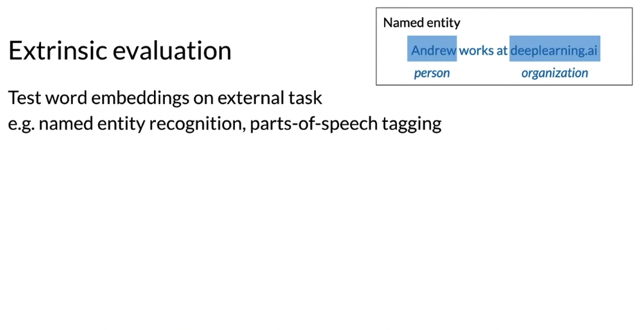</kbd>

   

  
  
<kbd>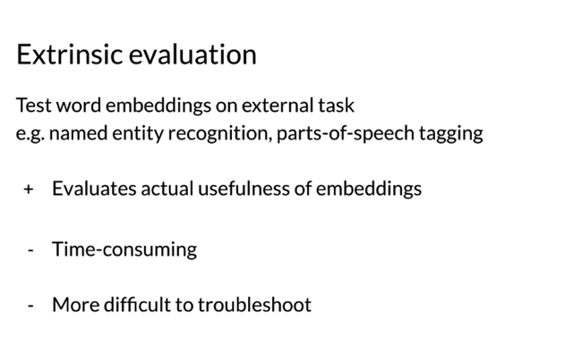</kbd>

  > Đại khái là đánh giá nó t**hông qua các downstream task** như
  > named entity recognition, sentiment classification, translation
  > **nôm na là những bài toán thật sự**, **những vấn đề cụ thể mà
  > ta cần có những thông tin semantic/syntactic của từ để giải
  > quyết tốt**. Thì **nếu những downstream task đó mà work ok thì
  > cũng đồng nghĩa là word embedding ok**
  >
  > Chỉ có điều là cách đánh giá này phải **tốn thời gian hơn** và
  > cũng **khó để detect vấn đề hơn** (troubleshoot)

   

  
  
<kbd>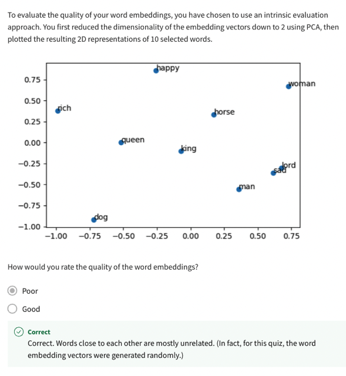</kbd>

   

## Lab: Word Embedding Step By Step

 

### In this ungraded notebook, you'll try out all the individual techniques that you learned

> [!NOTE]
> In this ungraded notebook, you'll try out all the individual techniques that you learned
> about in the lecture. Practicing on small examples will prepare you for the graded
> assignment, where you will combine the techniques in \**more advanced ways\** to
> create \**word embeddings\** from a \**real-life corpus.\**
>
> This notebook is made of two main parts: \**data preparation\**, and the \**continuous
> bag-of-words (CBOW) model.\**
>
> To get started, \**import and initialize all the libraries\** you will need.

 

- Import
   

    
    
<kbd>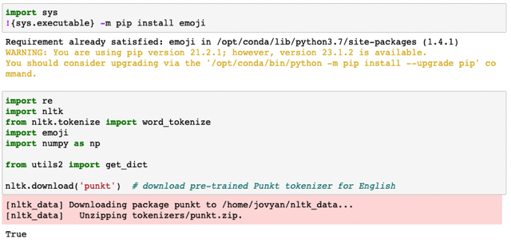</kbd>

     

- Data preparation
   

  
  - In the data preparation phase, starting with a \\*corpus of text\\*, you will:  • \\*Clean\\* and \\*tokenize the corpus.\\*  • \\*Extract the pairs of context words\\* and \\*center word\\* that will \\*make up the training data set\\* for the \\*CBOW model\\*. The \\*context words\\* are the \\*features\\* that will be \\*fed into the model\\*, and the \\*center words\\* are the \\*target values\\* that the \\*model will learn to predict.\\*  • Create \\*simple vector representations\\* of the \\*context words\\* (features) and \\*center words\\* (targets) that can be used by the \\*neural network of the CBOW model.\\*
     

  
  - Cleaning and tokenization
     

    
    - To demonstrate the \\*cleaning\\* and \\*tokenization\\* process, consider a \\*corpus\\* that contains \\*emojis\\* and various \\*punctuation signs\\*.
       

      
      - corpus = 'Who ❤️ "word embeddings" in 2020? I do!!!'
         

          
          
<kbd>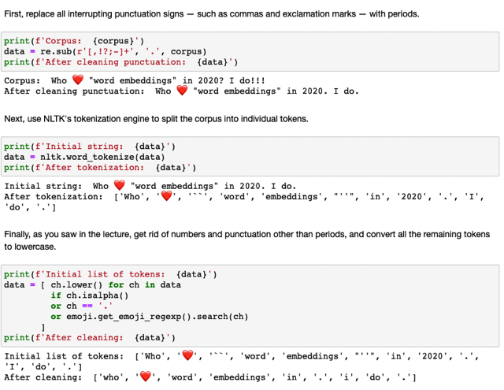</kbd>

          > 1. Thay punctuation sign thành "."
          >
          > 2. Là dùng thư viện NLTK để tokenize bộ corpus thành từng token
          > (nhận xét cái NLTK này khá hữu dụng khi rất hay dùng, nhớ lại lúc
          > làm n-gram model cũng dùng nó để tokenize sentence thành token.
          >
          > 3. Là như đã nói trong lecture cũng như lab trước, bỏ đi number, và
          > lowercase hết

           

          
          
<kbd>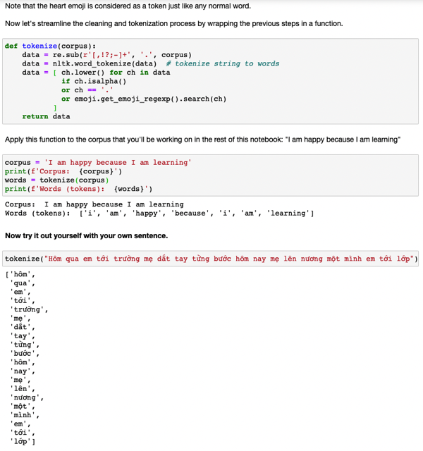</kbd>

          > Cuối cùng là viết thành một function
          > tokenize() rồi apply cho corpus

           

  
  - Sliding window of words
     

      
      
<kbd>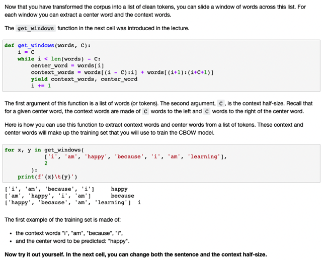</kbd>

      > Function get_windows như đã. gặp qua ở lab trước, sẽ nhận một
      > token list và tham số C gọi là context haft size. Nhắc lại sơ thì
      > function này nó sẽ loop trong token list sao cho mỗi từ (gọi là target
      > word) khi loop đều có C từ trước và sau nó để lấy ra thành 1 bộ
      > context words gọi là context words. Function sử dụng keyword yield
      > giúp kiểu như trả về từng bộ context words, target word mỗi lần chứ
      > không phải một cục.

       

      
      
<kbd>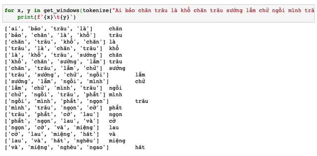</kbd>

       

  
  - Transforming words into vectors for the training set
     

    
    - To finish preparing the training set, you need to transform the context words and center words into vectors.
       

  
  - Mapping words to indices and indices to words
     

      
      
<kbd>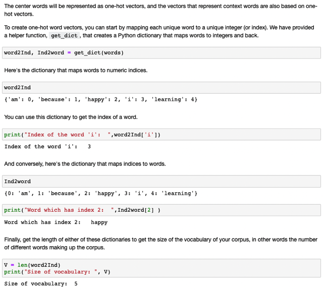</kbd>

      > Đại khái là người ta để sẵn cho function word2Ind và
      > Ind2word để ' biến' word thành index dành cho các mục đích
      > tạo represented vector cho context words và target word

       

  
  - Getting one-hot word vectors
     

      
      
<kbd>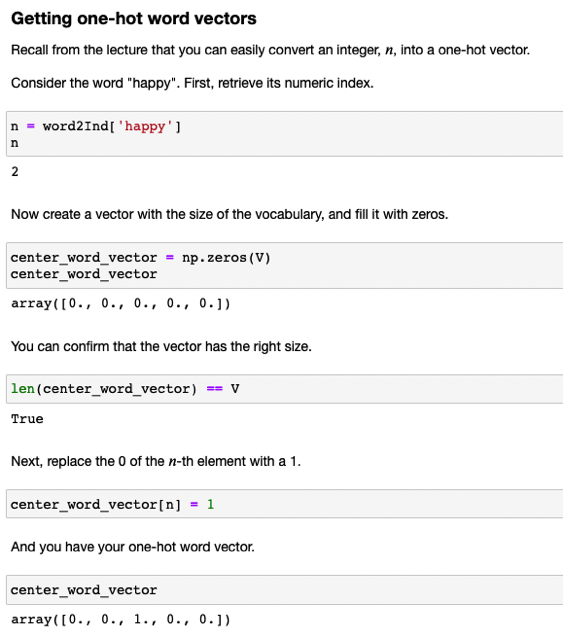</kbd>

      > Từ hai cái dict word2Int và int2Word, tạo one-hot vector
      > cho một từ có thể được thực hiện dễ dang bằng cách tạo
      > một zeros vector size Vocab's size, dùng word2In lấy
      > index của word ra, và dùng index update vào zeros vector
      > tại index đó = 1.

       

      
      
<kbd>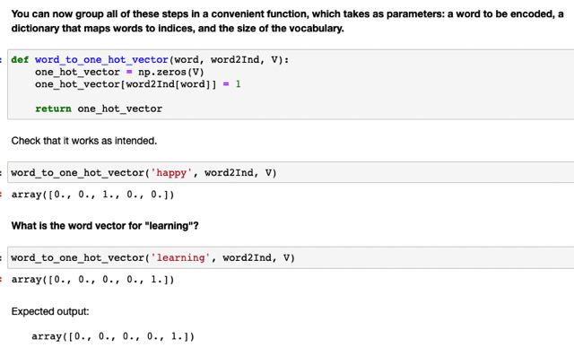</kbd>

      > Với các step làm như vậy tạo một helper function
      > word_to_one_hot_vector() nhận một word và word2Ind,
      > vocab's size V tạo one hot vector
      >
      > Và như vậy với một target word, nhanh chóng tạo được one-hot vector.

       

  
  - Getting context word vectors
     

      
      
<kbd>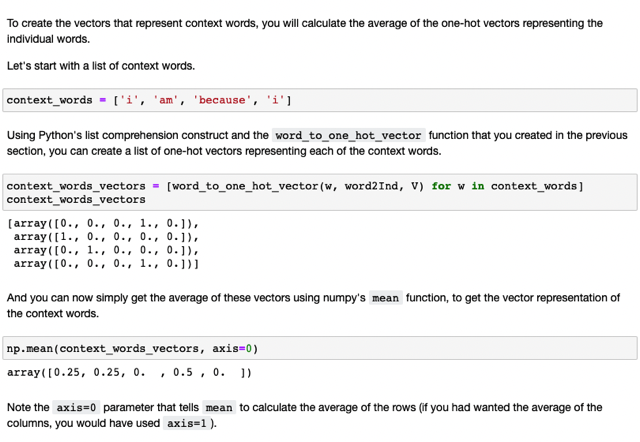</kbd>

      > Còn đối với các **context words của một target words**, cũng dùng
      > function trên để **tạo one-hot vector của mỗi từ**, sau đó **average**.
      > Ta dùng **np.mean()**. Và vì m**ỗi one-hot vector là một row (1xn)** nên
      > **mean là sum của các row**, index tương ứng với row là 0, nên
      > argument **axis = 0.**

       

      
      
<kbd>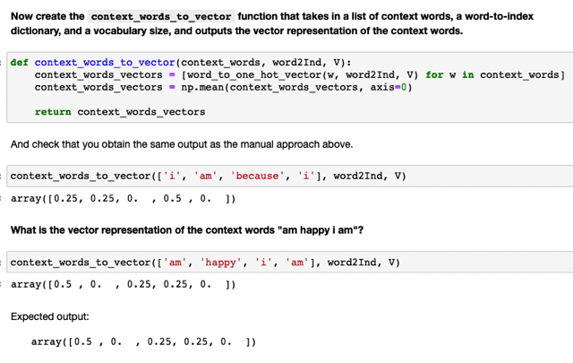</kbd>

      > Viết một helper function làm việc này, nhận một
      > list các context words, word2Ind, vocab's size V.
      > dùng list comprehension,

       

  
  - Building the training set
     

      
      
<kbd>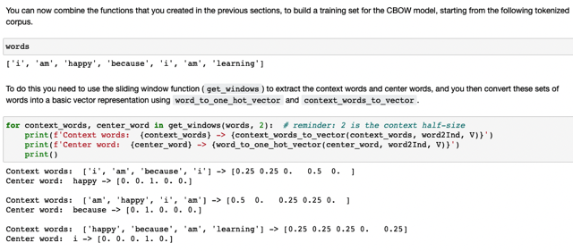</kbd>

       

      
      
<kbd>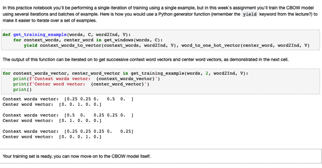</kbd>

      > cuối cùng, kiểu như viết một function để trả ra
      > kết quả có thể iterated chỗ này hiểu đại khái là
      > tiếp tục nhờ yield keyword

       

- The continuous bag-of-words model
   

  
  - The continuous bag-of-words model
     

      
      
<kbd>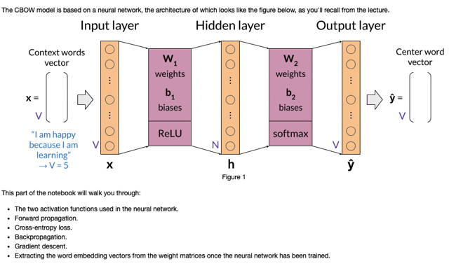</kbd>

       

  
  - Activation functions - reLu
     

      
      
<kbd>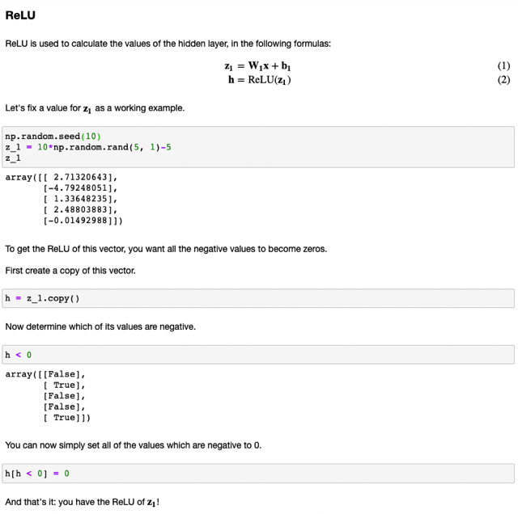</kbd>

      > Đại khái là từng bước để manually tính reLu, khi nhận một
      > vector h, dùng k = h < 0 để ra một kiểu như vector cho biết vị
      > trí nào trong h là < 0. Xong dùng h[k] để access các vị trí đó để
      > update thành 0. h[h<0] = 0 sẽ update những chỗ nào của h
      > nhỏ hơn 0 thành 0

       

      
      
<kbd>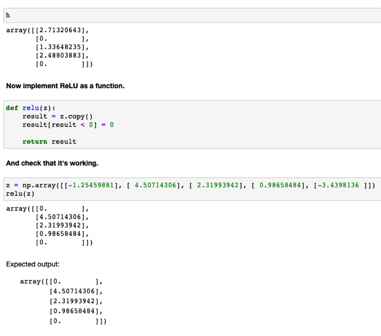</kbd>

      > Thì cơ bản function relu chỉ là vậy, nhận
      > một input vector, chỗ nào < 0 thì update lại
      > thành 0, còn lại để nguyên,

       

  
  - Activation functions - softMax
     

      
      
<kbd>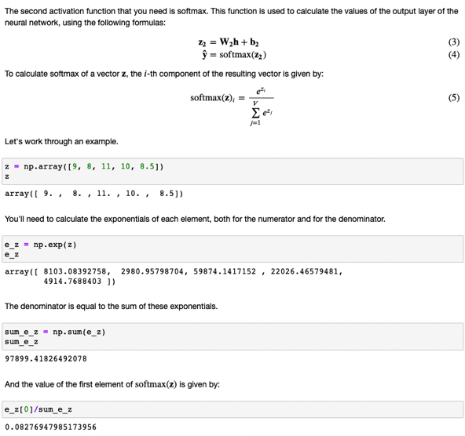</kbd>

      > Đến hàm softmax, theo công thức ta sẽ tính exp của từng
      > element trong vector chia cho tổng các exp. Vậy nhận một
      > vector, dùng np.exp để thực hiện luỹ thừa e cho mỗi element.
      > Sau đó dùng sum để tính sum và cuối cùng chia cho sum

       

      
      
<kbd>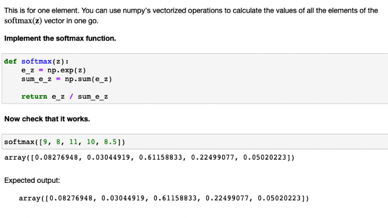</kbd>

      > viết thành function softmax()

       

  
  - Dimensions: 1-D arrays vs 2-D column vectors
     

      
      
<kbd>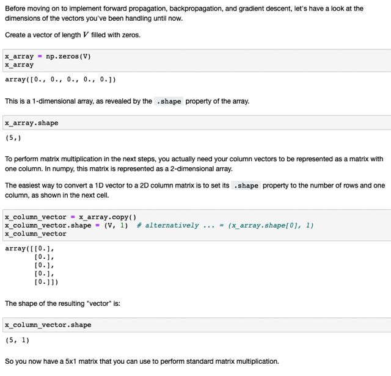</kbd>

      > Cuối cùng, ta nhớ cần phải tính matrix multiplication khi
      > forward pass, nên W và input phải cùng là 2D array, nên ta
      > dùng cách set .shape của x thành 2D.

       

  
  - Forward propagation
     

      
      
<kbd>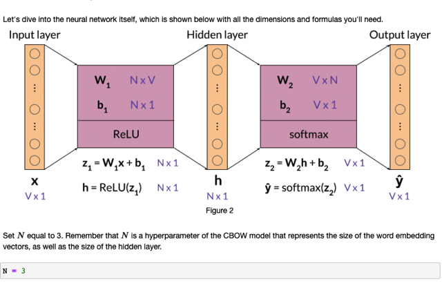</kbd>

      > Cho N = số unit của hidden layer, bằng 3.
      > Nhớ là N là một h.p và N cũng sẽ chính là số
      > item của embedding vector.

       

  
  - Initialization of the weights and biases
     

      
      
<kbd>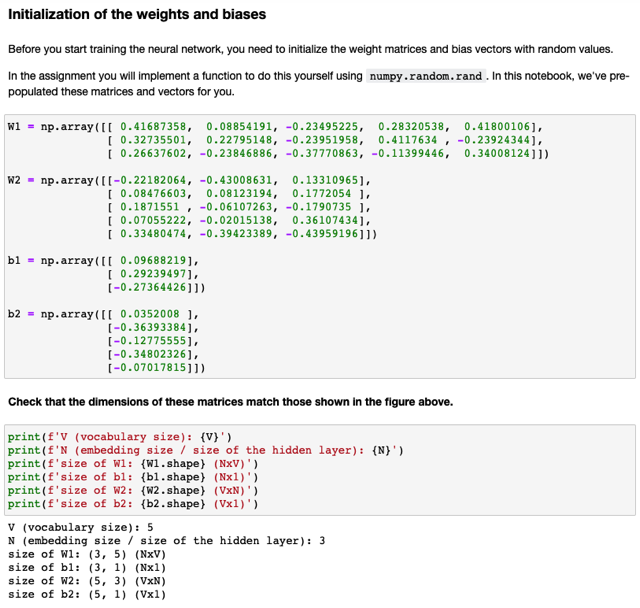</kbd>

      > Trước tiên cần initialize các params matrix W1 b1, W2 b2. Ổng nói ở đây
      > pre-populated chứ trong assignment phải dùng np.random.rand
      >
      > Lanh chanh một chút ta nói thêm initialization giúp NN giảm hiện tượng Vanishing
      > Gradient và có nhiều phương pháp initialization được phát triển như He Glorot,
      > LeCun Initialization.

       

  
  - Training example
     

      
      
<kbd>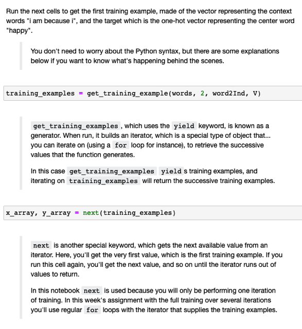</kbd>

      > Nói về function get_training_example mà mình đã note ở
      > trong lab trước, rằng có cái keyword yield đáng chú ý., đó là
      > nó trả về data từng chút từng chút (retrieve the successive
      > values that the function generates)
      >
      > Biết thêm về một special keyword khác là **next()** kiểu như
      > nó lấy từng cái từng cái nhưng trong P.A ta sẽ dùng for loop.
      > Chưa biết thế nào.

       

      
      
<kbd>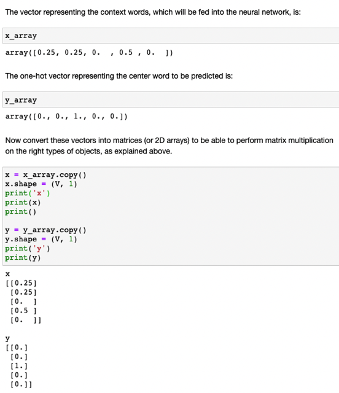</kbd>

      > Kiểu như chạy thử, lấy thử một bộ context
      > words's vector và center word's one-hot vector
      > ra. Chuyển thành 2D array

       

  
  - Values of the hidden layer
     

      
      
<kbd>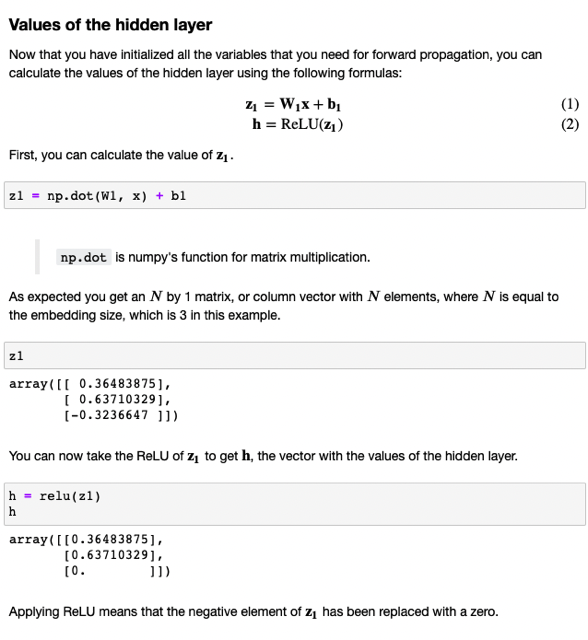</kbd>

      > Thực hiện forward pass, tính hidden
      > layer's output. Dùng np.dot và function
      > reLu đã define ở trên

       

  
  - Values of the output layer
     

      
      
<kbd>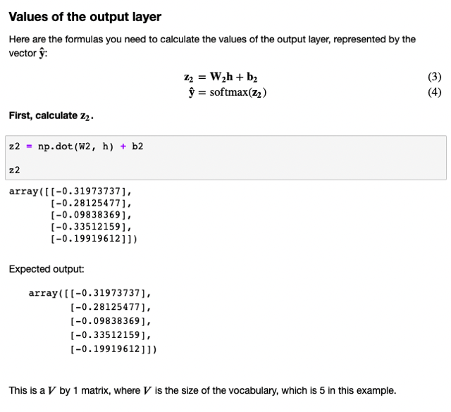</kbd>

      > Tiếp tục forward pass tính output
      > với np.dot và softmax

       

      
      
<kbd>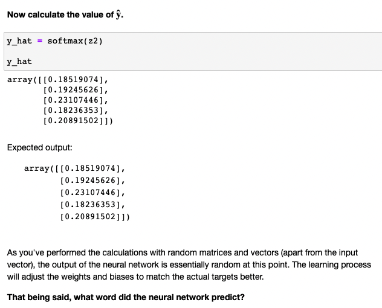</kbd>

      > Tất nhiên đây là forward pass lần đầu với random weights nên
      > prediction y^ sẽ có thể sai bét, nhưng cứ thử dựa vào y^ -
      > classes probability vector để xem nó predict ra từ gì. thì thấy 0.
      > 23 ở index 2 là cao nhất nên có nghĩa là nó predict ra từ
      > int2Word(2) = 'happy'

       

  
  - Cross-entropy loss
     

      
      
<kbd>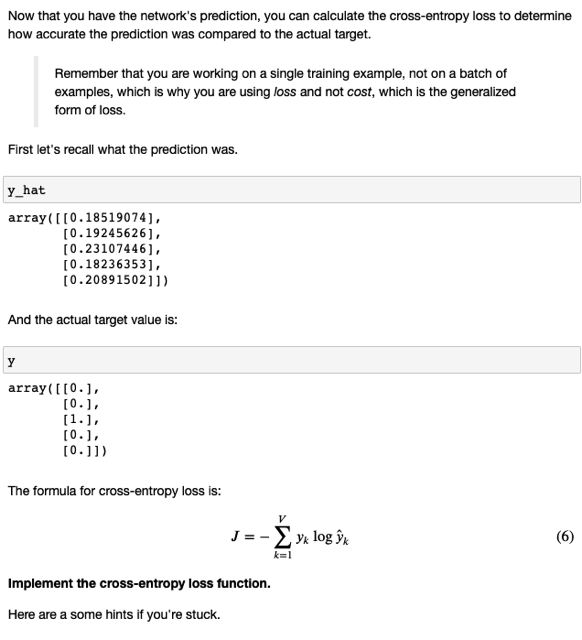</kbd>

      > Viết function tính loss
      > function của 1 sample.

       

      
      
<kbd>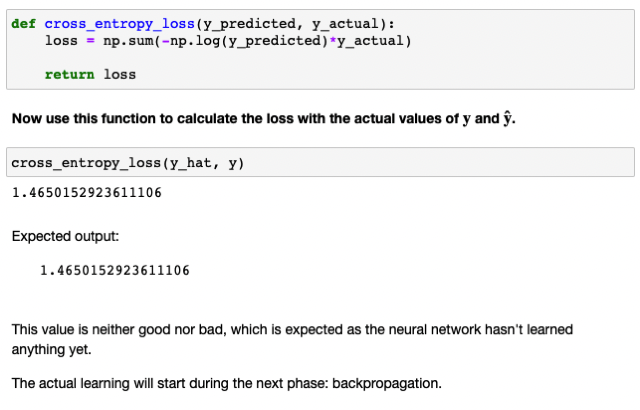</kbd>

      > Ta sẽ dùng element-wised
      > multiply (*) và np.log.

       

  
  - Backpropagation
     

      
      
<kbd>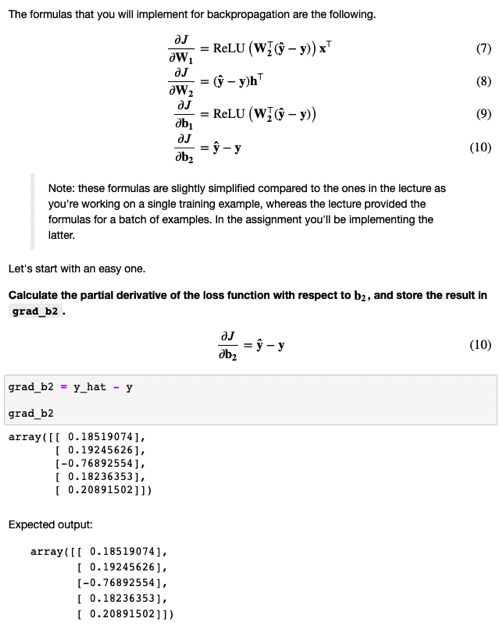</kbd>

      > Dùng công thức tính partial derivative of
      > cost function w.r.t W1, b1, W2, b2

       

      
      
<kbd>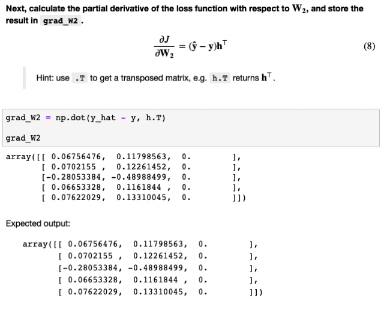</kbd>

       

      
      
<kbd>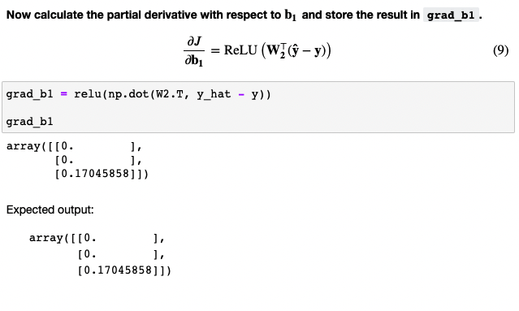</kbd>

       

      
      
<kbd>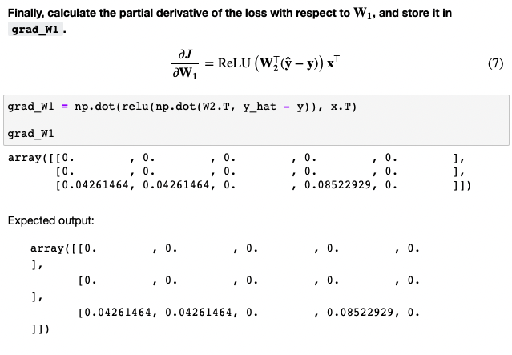</kbd>

       

      
      
<kbd>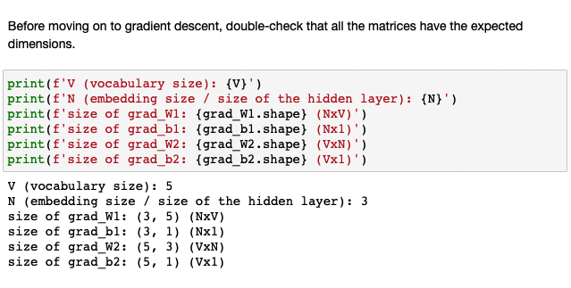</kbd>

      > Check thử shape
      > các gradient

       

  
  - Gradient descent
     

      
      
<kbd>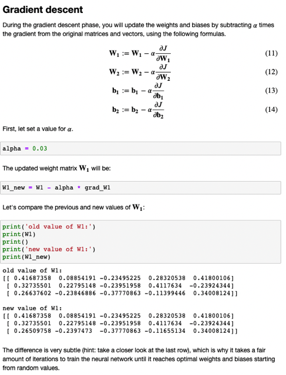</kbd>

       

      
      
<kbd>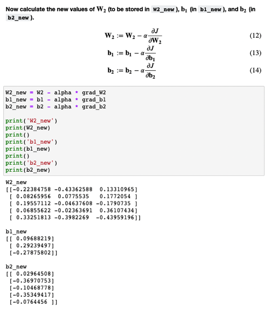</kbd>

       

    
    - Congratulations, you have completed one iteration of training using one training example!  You'll need many more iterations to fully train the neural network, and you can optimize the learning process by training on batches of examples, as described in the lecture. You will get to do this during this week's assignment.
      > Đại khái tới đây là xong 1 iteration (update các weight và bias 1 lần). Ta nhớ
      > rằng iteration là một lần update weight, có thể sau khi "chạy" 1 data sample
      > đối với stochastic G.D, hoặc một mini-batch các sample đối với mini-batch G.
      > D thậm chí toàn bộ data đối với batch G.D) còn môt epoch là một lần nó chạy
      > hết toàn bộ data. Vậy nếu mà cho 5 epoch, thì đối với batch G.D nó update
      > có 5 lần thôi, Nhưng đối với mini-batch giả sử 1 batch có 100 mini-batch, thì
      > nó update 100&5 = 500 lần. Và giả sử 1 batch có 1000 sample thì với
      > stochastic G.D nó update weight 1000*5 = 5000 lần

       

  
  - Extracting word embedding vectors
     

      
      
<kbd>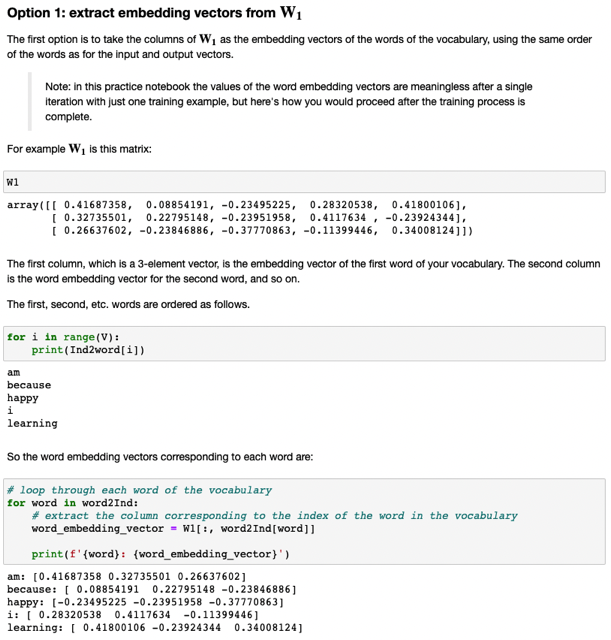</kbd>

       

      
      
<kbd>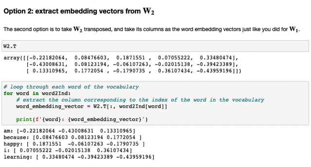</kbd>

       

      
      
<kbd>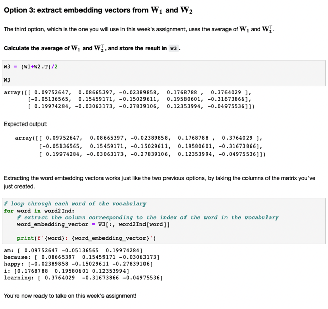</kbd>

       

  
  - How this practice relates to and differs from the upcoming graded assignment
     

      
      
<kbd>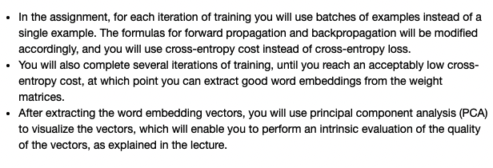</kbd>

       

## Conclusion

 

### 1 Word \\*embeddings\\* are vectors that \\*capture the meaning of words\\* and can be used in various

> [!NOTE]
> 1 Word \**embeddings\** are vectors that \**capture the meaning of words\** and can be used in various
> \**NLP applications\**.
>
> 2 The week's focus was on \**word embeddings\** and \**their applications in NLP.\**
>
> 3 The covered topics include \**training word embeddings from scratch\**, \**tokenizing a corpus\** to \**build
> a vocabulary\**, \**converting words to indices\** and \**one-hot vectors\**, creating \**word representations\**
> using continuous bag of words model, \**training neural networks\** for word embeddings, and
> \**visualizing\** word embedding vectors.
>
> 4 The final assignment allows practicing all the learned skills, including \**data preparation\**,\**building
> a vocabulary\**, \**training word embeddings, and evaluating them through visualization.\**
>
> 5 \**Advanced language modeling\** and word embedding approaches can handle \**out-of-vocabulary
> words\** and \**multiple word meanings\**, making them suitable for \**real-world NLP applications\**.
>
> 6 While implementing everything from scratch for the assignment, in practice, NLP and machine
> learning libraries like \**Keras\**, \**PyTorch\**, and \**TensorFlow\** can \**simplify the process with built-in
> embedding layers.\**
>
> 7 \**Exploring these libraries\** is \**recommended\** as they provide \**efficient ways to incorporate word
> embeddings into neural networks\** with just a \**few lines of code.\**
>
> 8 Acquiring the \**ability to use and train word embeddings from scratch\** is a \**valuable skill for NLP
> practitioners.\**
>
> Overall, the main ideas \**revolve around the importance\** and \**practicality of word embeddings\** in
> NLP, the skills learned throughout the week, and the suggestion to utilize NLP libraries for
> efficient implementation.

 

  
  
<kbd>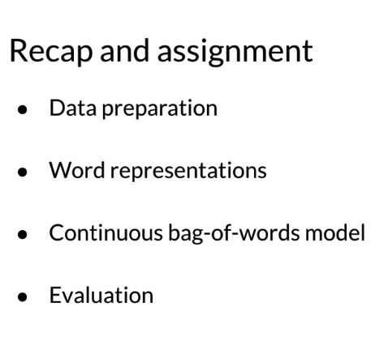</kbd>

   

  
  
<kbd>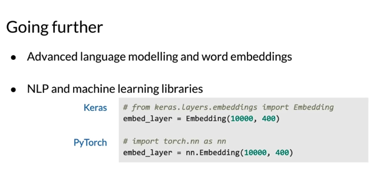</kbd>

   

## Quiz

 

<kbd></kbd>

 

<kbd>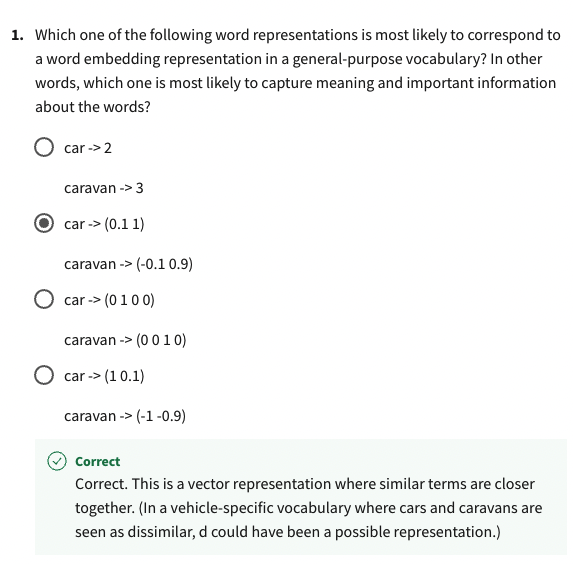</kbd>

 

<kbd>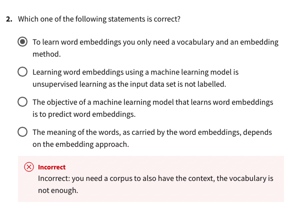</kbd>

 

<kbd>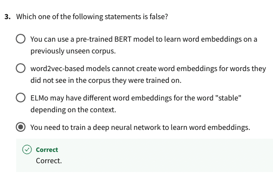</kbd>

 

<kbd>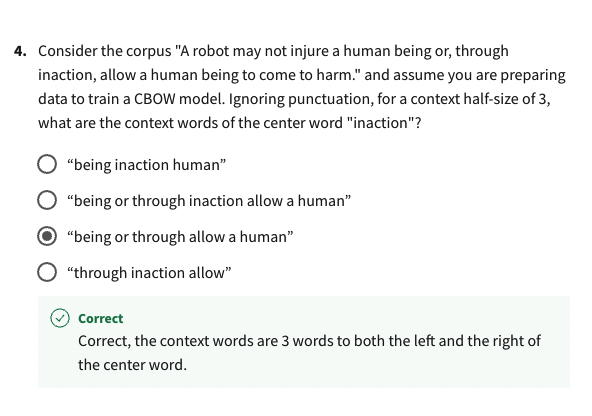</kbd>

 

<kbd>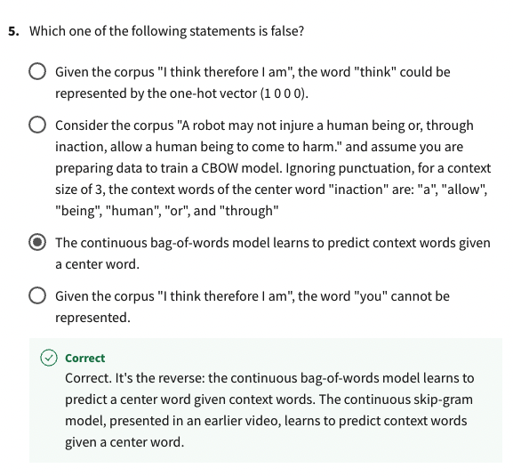</kbd>

 

<kbd>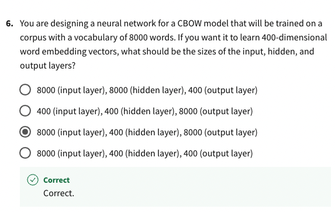</kbd>

 

<kbd>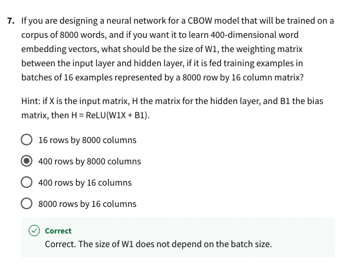</kbd>

 

<kbd>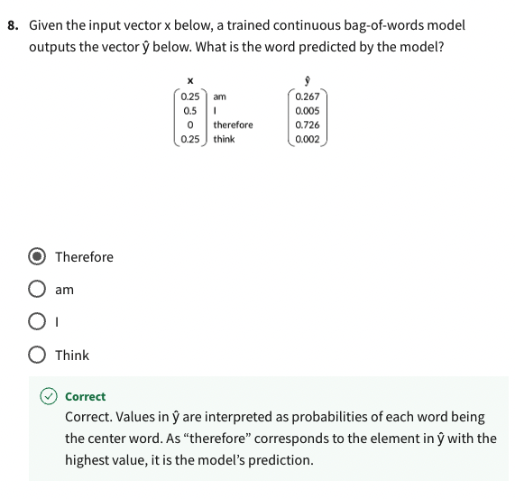</kbd>

 

<kbd>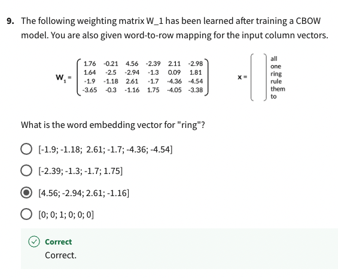</kbd>

 

<kbd>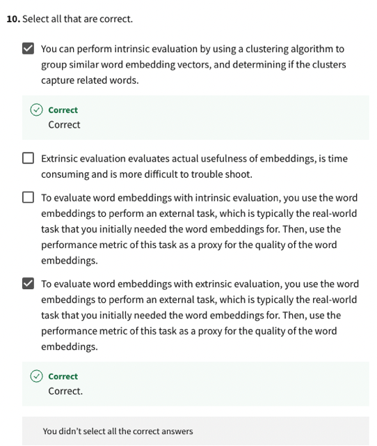</kbd>

 

## Programming Assignment: Word Embeddings

 

### Welcome to the fourth (and last) programming assignment of Course 2!

> [!NOTE]
> Welcome to the fourth (and last) programming assignment of Course 2!
>
> In this assignment, you will practice how to \**compute word embeddings\** and use them for  \**sentiment
> analysis.\**
>
> • To implement sentiment analysis, you can g\**o beyond counting the number of  positive words\** and
> \**negative words.\**
>
> • You can find a way to \**represent each word numerically\**, by a \**vector\**.
>
> • The vector could then \**represent syntactic\** (i.e. \**parts of speech\**) and \**semantic  \**(i.e. \**meaning\**)
> structures.
>
> In this assignment, you will explore a \**classic way\** of\**generating word embeddings\** or  representations.
>
> • You will implement a \**famous model \**called the \**continuous bag of words  (CBOW) model.\**
>
> By completing this assignment you will:  • \**Train word vectors\** from \**scratch\**.  • Learn \**how to create
> batches of data\**.  • Understand how \**backpropagation\** works.  • \**Plot and visualize your learned word
> vectors\**.
>
> Knowing how to train these models will \**give you a better understanding of word vectors\**,  which are
> \**building blocks to many applications\** in \**natural language processing.\**

 

- 1 - The Continuous Bag of Words Model
   

    
    
<kbd>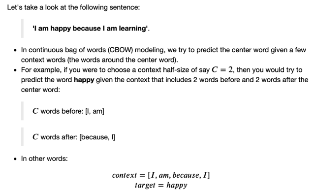</kbd>

     

    
    
<kbd>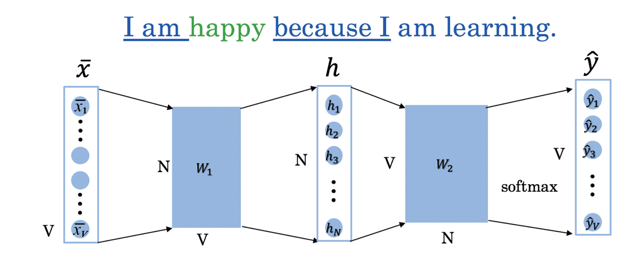</kbd>

     

    
    
<kbd>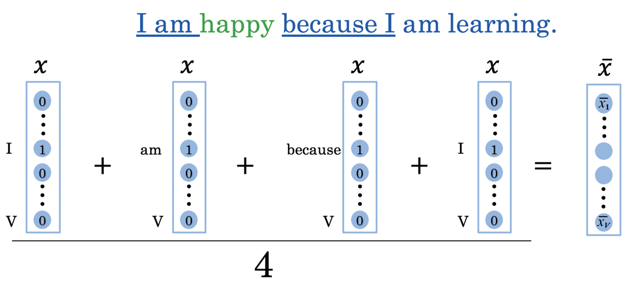</kbd>

    > Where  𝑥¯ is the average of all the one hot
    > vectors of the context words.

     

    
    
<kbd>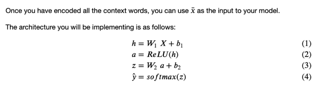</kbd>

     

  
  - # Import Python libraries and helper functions (in utils2)  import nltk from nltk.tokenize import \\*word_tokenize\\* import numpy as np from collections import \\*Counter\\* from utils2 import \\*sigmoid\\*, \\*get_batches\\*, \\*compute_pca\\*, \\*get_dict\\* import \\*w4_unittest\\*  nltk.download('\\*punkt\\*')
     

    
    - # Download sentence tokenizer \\*nltk.data.path.append('.')\\*
       

      
      - # Load, tokenize and process the data import \\*re\\*                                                           #  Load the \\*Regex-modul\\* \\*with open('./data/shakespeare.txt') as f:     data = f.read()                                                 \\*#  Read in the data data = \\*re.sub(r'[,!?;-]', '.',data) \\*                                #  \\*Punktuations\\* are replaced by \\*.\\* data = \\*nltk.word_tokenize(data)\\*                                     #  \\*Tokenize string to words\\* data = \\*[ ch.lower() for ch in data if ch.isalpha() or ch == '.']\\*    #  \\*Lower case\\* and \\*drop non-alphabetical tokens \\*print("Number of tokens:", len(data),'\\\ ', data[:15])               #  print data sample
        > Đại khái là làm các việc sau:
        >
        > Open và load data từ trong file Shakespeare.txt,
        >
        > Dùng punkt lib thay các interrupted punctuation thành "." hết.
        >
        > Dùng nltk để tokenize data thành từng token (word).
        >
        > Và cuối dùng for loop với list comprehension, lowercase và loại bỏ các token không phải
        > chữ  (tức là trừ word, và ".", còn lại số má gì bỏ hết)

        > Number of tokens: **60996** 
        >  ['o', 'for', 'a', 'muse', 'of', 'fire', '.', 'that', 'would', 'ascend', 'the', 'brightest', 'heaven', 'of', 'invention']

         

        
        - # \\*Compute the frequency distribution\\* of the \\*words\\* in the dataset (vocabulary) \\*fdist\\* = \\*nltk.FreqDist\\*(word for \\*word\\* in \\*data\\*) print("Size of vocabulary: ",\\*len(fdist)\\* ) print("Most frequent tokens: ",\\*fdist.most_common(20) )\\* # print the 20 most frequent words and their freq.
          
<kbd>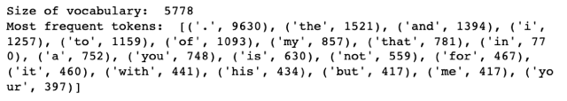</kbd>

          
<kbd></kbd>

          > Dùng **nltk.FreqDist** rất tiện lợi tạo ra gọi là**frequency distribution**:
          > Kiểu như một **list các tuple**, mỗi tuple chứa **token và số lần
          > token xuất hiện** trong dataset. **Quá tiện lợi**. In thử ra **20 cái
          > xuất hiện nhiều nhất**

           

            
            
<kbd>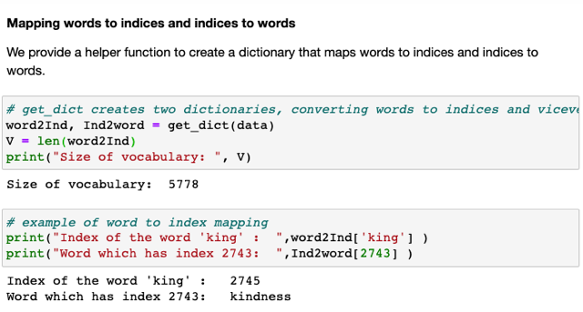</kbd>

            > Như đã gặp ở lab, cho sẵn function **get_dict**() để
            > mình **tạo ra 2 cái dictionary** map giữa **word-index** và
            > **index-word** **word2Ind** và **Ind2Word** để tiện sử dụng
            > trong việc **tạo các one-hot vector**

             

- 2 - Training the Model
   

- 2.1 - Initializing the Model
   

    
    
<kbd>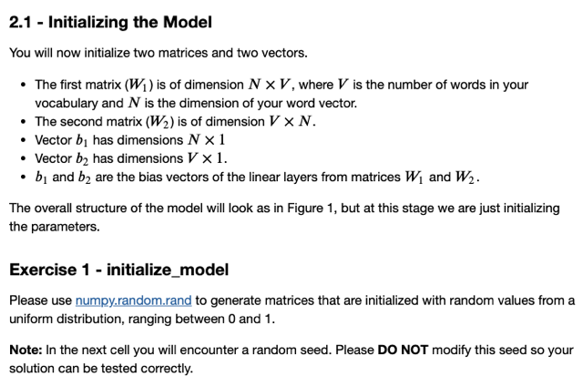</kbd>

    > Ok, bắt đầu với weight
    > initialization. Dùng np.random.
    > rand để initialize W1,W2,b1,b2

     

- Exercise 1 - initialize_model (UNQ_C1)
   

    
    
<kbd>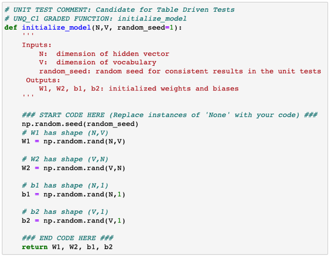</kbd>

    > Với các shape đã biết của các weight matrix
    > và bias vector, thì gọi function np.random.rand
    > với shape tương ứng thôi

     

    
    
<kbd>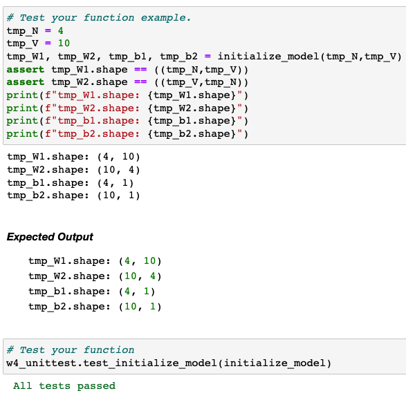</kbd>

     

- 2.2 - Softmax
   

    
    
<kbd>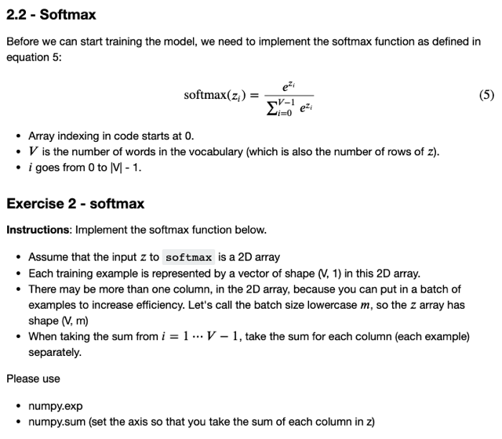</kbd>

    > Vì softmax sẽ apply cho **output layer có V (vocab's size) unit** - mỗi
    > unit ví dụ **unit thứ i** cho ra **một con số (z_i)** gọi là **logit** của
    > **class tương ứng - từ thứ i trong vocab** , bỏ vào **softmax**
    > activation function để **chuyển** các con số này thành **Probability
    > p(i)** - \/**Xác suất của việc cái từ đang tìm là cái từ thứ i**\/ \/**trong
    > vocab**\/Ở đây mỗi training sample khi input vào model là một vector cột
    > x(i) có độ dài bằng V, nó qua các layer cho ra mỗi z(i) là vector cột
    > cũng có độ dài V.
    >
    > Nhưng thay vì xử lý từng training sample, ta sẽ xử lý một batch - m
    > cái. Nên Input sẽ có m cái vector cột x stack lại thành shape (V, m)
    > và tương ứng cũng sẽ có m cái vector z stack lại thành matrix shape
    > (V, m)

     

- Exercise 2 - softmax (UNQ_C2)
   

    
    
<kbd>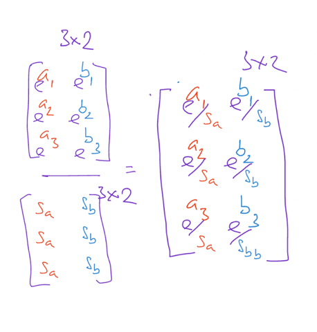</kbd>

    
<kbd>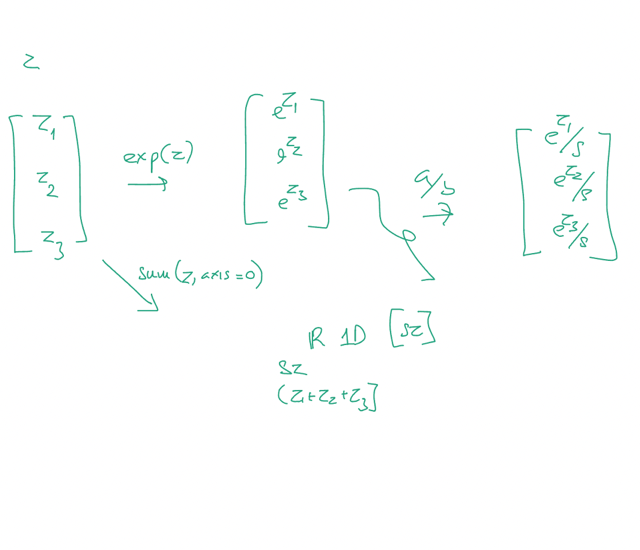</kbd>

    
<kbd>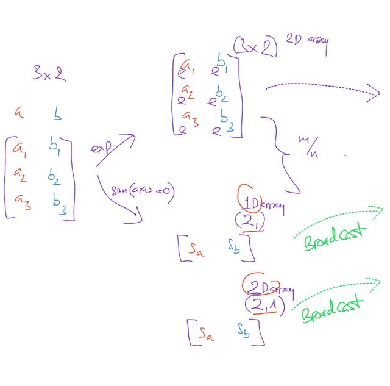</kbd>

    
<kbd></kbd>

    
<kbd></kbd>

    
<kbd></kbd>

    
<kbd>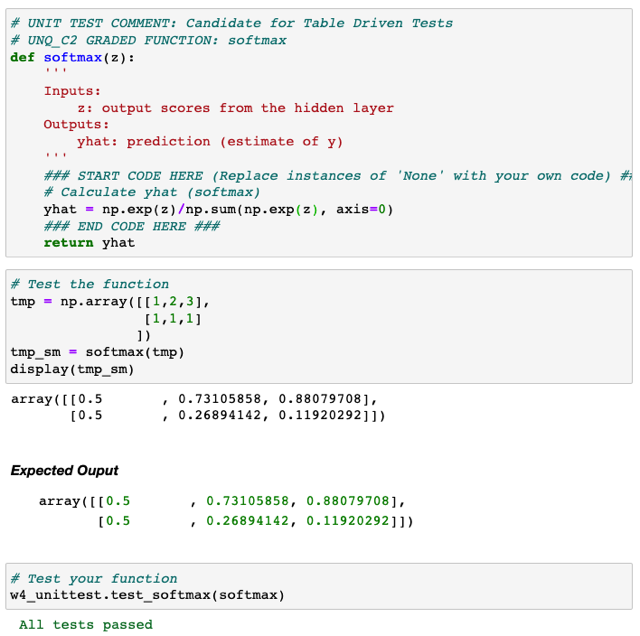</kbd>

    > Có chỗ broadcast xảy ra
    > giải thích trong hình

     

    
    
<kbd>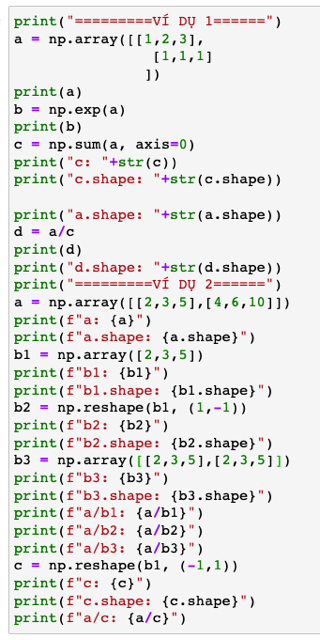</kbd>

     

    
    
<kbd>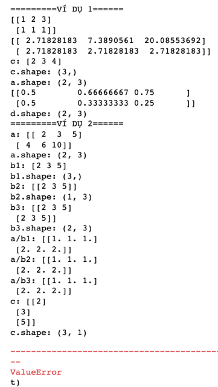</kbd>

    > Trong ví dụ 2, b1 là 1D array (2,) hoặc b2 là 2D array (2x1)
    > tự động được broadcast thành 2x3 để phép chia a/b1 và
    > a/b2 bằng có kết quả như a/b3.

     

- 2.3 - Forward Propagation
   

    
    
<kbd>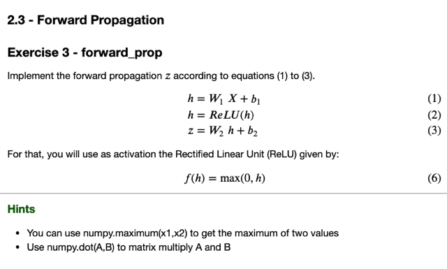</kbd>

     

- Exercise 3 - forward_prop (UNQ_C3)
   

    
    
<kbd>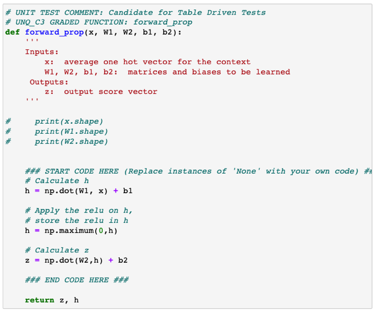</kbd>

     

    
    
<kbd>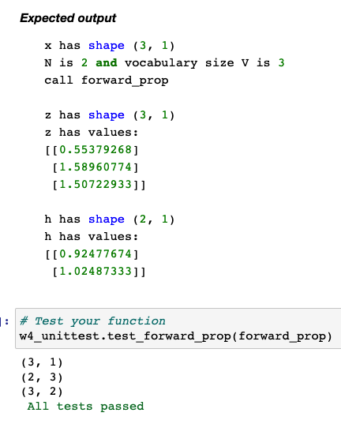</kbd>

     

- 2.4 - Cost Function
   

  
  - # compute_cost: cross-entropy cost function def \\*compute_cost\\*(y, yhat, batch_size):      # cost function      logprobs = np.multiply(np.log(yhat),y)     cost = - 1/batch_size * np.sum(logprobs)     cost = np.squeeze(cost)     return cost
    > Làm sẵn cho **cross entropy cost function** rồi thì đại khái cũng không có
    > gì, theo công thức,  **loss của một data sample** x(i) là là **-y(i)*log(y^(i)).**
    > Thì trên một **batch_size các sample**, loss sẽ tính là **mean của các loss**
    > của các sample đó.
    >
    > nên tính **ylog(y^)** là **np.multiply() để tính element-wised multiplication**
    > Sau đó**tính sum (bằng np.sum)** rồi **chia cho batch_size** ra
    > **mean**. Dòng cuối **np.squeeze là để biến array thành scaler** (số thực)

     

- 2.5 - Training the Model - Backpropagation
   

    
    
<kbd>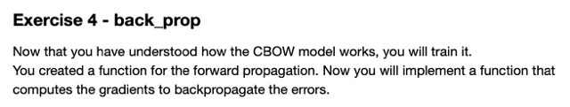</kbd>

     

- Exercise 4 - back_prop (UNQ_C4)
   

    
    
<kbd>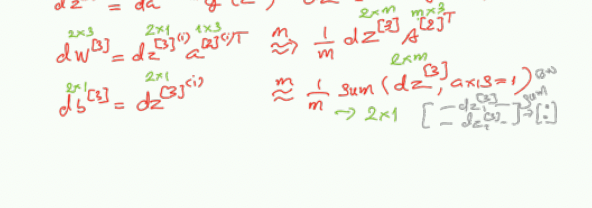</kbd>

    
<kbd>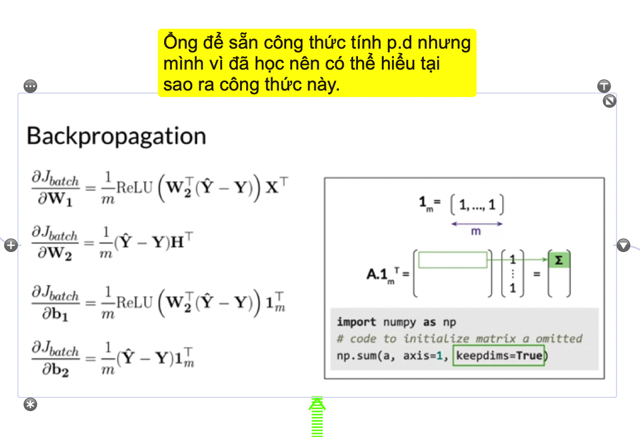</kbd>

    
<kbd></kbd>

    
<kbd></kbd>

    
<kbd>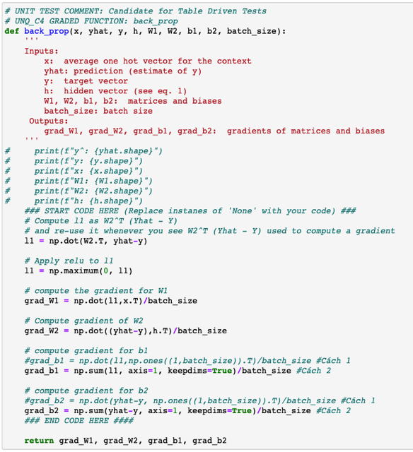</kbd>

    > Thật ra chỗ tính grad_b1,b2 chỉ cần: Tính sum rồi chia cho m.
    >
    > Ta biết các vector b1,b2 sẽ được broadcast khi tính cho 1 batch các data sample.
    >
    > Kiểu như h(i) = W1x(i) + b1  Với W1: NxV, x(i) Vx1, b1: Nx1  NxV . Vx1 + Nx1 = Nx1
    >
    > Nếu là 1 batch H = W1X + b1. X: Vxm NxV . Vxm + Nx1 = Nxm + Nx1
    >
    > Tới đây Python sẽ broadcast b1 từ Nx1 Thành B1 bằng cách "copy" vector cột b1 và concate lại
    > để thành Nxm Từ đó Nxm + Nx1 = Nxm + Nxm = Nxm.
    >
    > Do đó, trong quá trình Backprop sẽ đưa ta về grad_B1 matrix chứ không phải grad_b1 vector -
    > mà grad_b1 mới là cách ta cần để update bias b1. Vậy để tính grad_b1 vì ta biết B1 chỉ là các
    > b1 stack theo cột lại m lần nên grad_B1 cũng chỉ là grad_b1 stack lại m lần. Nên grad_b1 sẽ
    > bằng sum theo cột của grad_B1 và chia cho m là xong. (Có thể thắc mắc tại sao không chỉ đơn
    > giản là lấy ra theo kiểu grad_B1[:,0] - thì tạm thời chưa biết chính xác tại sao, nhưng thấy nó có
    > vẻ sai sai, không có tính chuẩn hoá, khái quát)
    >
    > Trong P.A làm theo cả hai cách, dùng cái kiểu sum theo cột và chia cho m (Cách 2, dòng dưới)
    > Và ở trong Course 2, DLSpec lúc tự triển khai công thức backprop mình cũng đã gặp vụ này,
    > còn cách 1 cũng chỉ đơn giản là kiểu để tính sum, dựa vào việc nhân matrix thay vì dùng
    > function np.sum chứ không có gì
    >
    > Như vậy ta đã có thể hiểu cái công thức dJbach/db1 trong slide là vậy

    > Như vậy ta đã có thể hiểu cái công
    > thức dJbach/db1 trong slide là vậy

     

    
    
<kbd>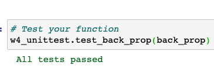</kbd>

     

- 2.6 - Gradient Descent
   

    
    
<kbd>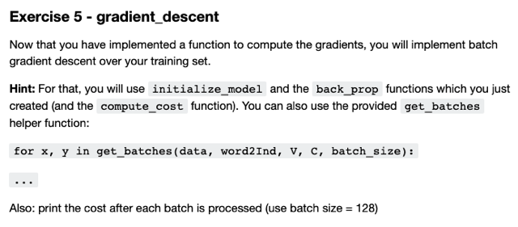</kbd>

     

- Exercise 5 - gradient_descent (UNQ_C5)
   

    
    
<kbd>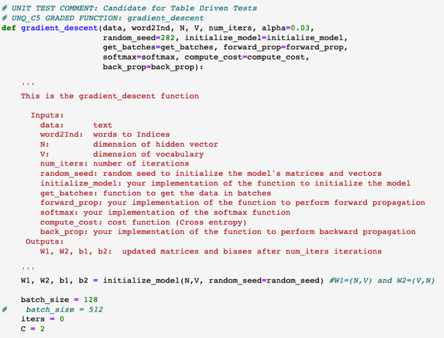</kbd>

     

    
    
<kbd>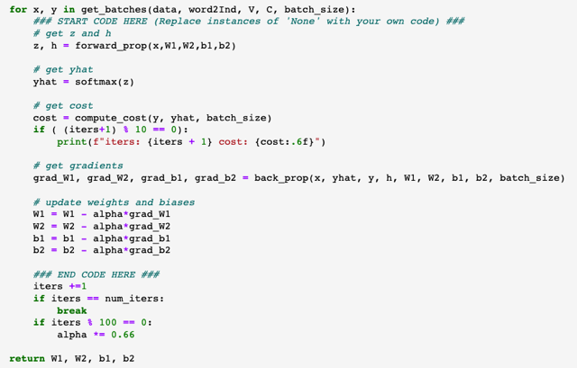</kbd>

     

    
    
<kbd>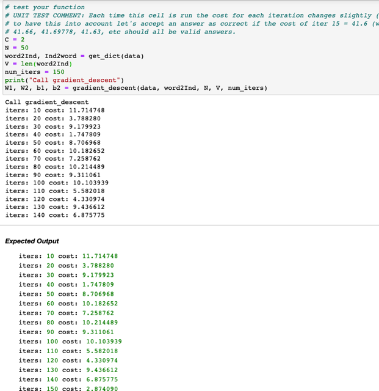</kbd>

     

    
    
<kbd>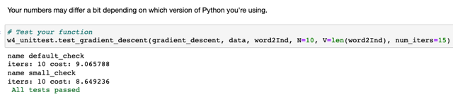</kbd>

     

- 3 - Visualizing the Word Vectors
   

  
  - # visualizing the word vectors here from matplotlib import pyplot %config InlineBackend.figure_format = 'svg' words = ['king', 'queen','lord','man', 'woman','dog','wolf',          'rich','happy','sad']  embs = (W1.T + W2)/2.0   # given a list of words and the embeddings, it returns a matrix with all the embeddings idx = [word2Ind[word] for word in words] X = embs[idx, :] print(X.shape, idx)  # X.shape:  Number of words of dimension N each
    > Lấy (extract) word embedding Theo cách lấy
    > trung bình của column W1 và row W2

     

      
      
<kbd>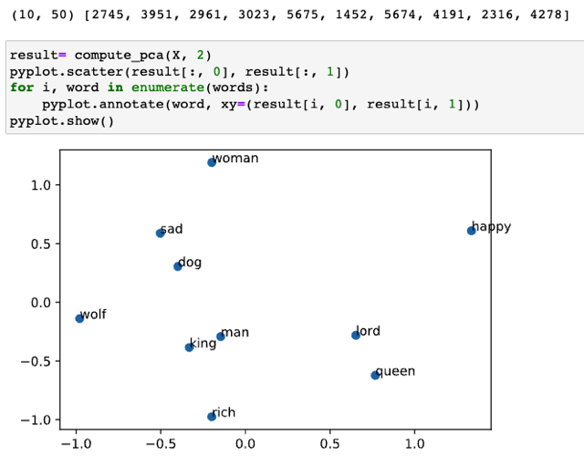</kbd>

      > You can see that **man and king are next to each other**. However,
      > we **have to be careful with the interpretation of this projected** word
      > vectors, since the **PCA depends on the projection** -- as shown in
      > the following illustration.

       

      
      
<kbd>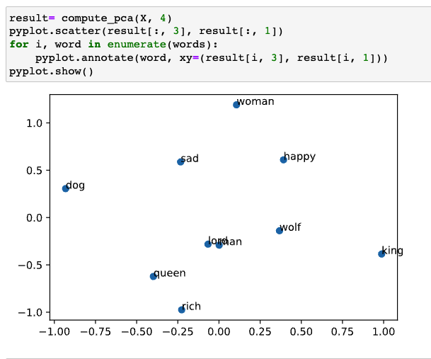</kbd>

       

