# C4w1_neural Machine Translation

📊 **Progress:** `170` Notes | `241` Screenshots

---

Discover some of the shortcomings of a traditional seq2seq model and how to solve for 
them by adding an attention mechanism, then build a Neural Machine Translation model 
with Attention that translates English sentences into German.
Learning Objectives

 • Explain how an Encoder/Decoder model works
 • Apply word alignment for machine translation
 • Train a Neural Machine Translation model with Attention
 • Develop intuition for how teacher forcing helps a translation model check its 
predictions
 • Use BLEU score and ROUGE score to evaluate machine-generated text 
quality
 • Describe several decoding methods including MBR and Beam search

## Course 4 Introduction

 

### Main ideas from the provided text:

> [!NOTE]
> Main ideas from the provided text:
>
> 1. The Course Introduction: The text introduces the**4th and final course of a specialization**called "**Natural
> Language Processing with Attention Models**." This course is **positioned as the cutting edge of practical NLP**
> methods.
>
> 2. **Attention Mechanism**: The course**focuses on using a powerful technique** called "**attention**" to build different
> models. The a**ttention mechanism** is employed to **create language translation models**, **text summarization**
> algorithms, q**uestion-answering models**, and **chatbots**.
>
> 3. **Skills Development**: Completing this course equips learners with the**ability to build state-of-the-art NLP**
> **applications** similar to**those used in large companies in the industry**.
>
> 4. Instructors: The instructors for this course are Lukasz and Younes, who are excited about the topics covered
> in the course.
>
> 5. Significance of **Sentiment Analysis**: Sentiment analysis is d**iscussed as a crucial problem**, and it is
> **highlighted that determining the sentiment of a sentence**is relevant in many applications.
>
> 6. Building **Models from Scratch**: The course teaches learners how to **build NLP models from scratch**, which
> represents the **active areas of research in the field**.
>
> 7. **Pre-trained Models and Fine-Tuning**: The n**ew normal in modern deep learning** is to **use pre-trained models
> and fine-tune them for specific use cases**. The course provides c**ustom pre-trained models** and guides learners
> on how to **fine-tune them.**
>
> 8. **Access to Powerful TPU Clusters**: The course provides **access to powerful TPU clusters**, which are **currently
> only available to researchers at Google**.
>
> 9.**Industry Standard** **Workflow**: Learners will practice the **workflow used in the industry to fine-tune
> state-of-the-art pre-trained models.**
>
> 10. Introduction to Course Materials: The instructors briefly mention that the course will cover important
> materials related to NLP and encourage students to get started.
>
> 11. Conclusion: The text concludes with good luck wishes to the learners as they begin the course.

 

## Week Introduction

 

## Seq2seq

 

### 1. Introduction to**Neural Machine Translation (NMT)**: The text introduces **neural machine translation**,

> [!NOTE]
> 1. Introduction to**Neural Machine Translation (NMT)**: The text introduces **neural machine translation**,
> which involves **using an encoder and a decoder to translate text from one language to another**.
>
> 2. **Seq2seq** Model: The **traditional seq2seq model**, introduced by **Google in 2014**, uses **LSTMs for
> encoding and decoding**. It maps **variable-length sequences** to **fixed-length memory**, making it powerful
> for machine translation. The encoder takes **word tokens** as input and **returns its final hidden state** as
> output.
>
> 3. **Encoder** and **Decoder Architecture**: The encoder consists of an **embedding layer** and an **LSTM
> module** with **one or more layers**. The LSTM **receives inputs from the embedding layer** and **previous
> hidden states**, \\_**returning the final hidden state**\\_ that\\_**encodes the overall meaning of the sentence**\\_. The
> **decoder is constructed similarly** with an embedding layer and an LSTM layer.
>
> 4. **Limitation of Seq2seq Model:** The traditional seq2seq model\\_**suffers from an information bottleneck**\\_,
> **particularly with long input sequences**.\\_**Fixed-length memory**\\_ **restricts the model's ability to compress
> longer sequences**, leading to \\_**lower performance as sequence size increases.**\\_
>
> 5. Introducing **Attention Mechanism**: To overcome the limitations of seq2seq, **attention** is introduced as a
> new layer. \\_**Attention allows the model to focus on the most important words at each time step**\\_ during
> **decoding**.
>
> 6.**Benefits of Attention**: Attention**provides a way to \\_process information specific to each input word**,\\_
> enabling the model to \\_**focus its attention in the right place during the decoding process**\\_. This results in
> **improved accuracy and efficiency** for predicting from long sequences.
>
> 7. **Conceptual Understanding**: The text emphasizes that **attention is a crucial advancement in NMT,**
> allowing the model to\\_**pay attention to relevant parts of the input sequence**\\_ while translating to improve
> the overall translation quality.
>
> 8. Summary: The text concludes that the reader now has an overview of **neural machine translation**and
> a **conceptual understanding of the attention mechanism**, which enables the model to **focus on important
> words during translatio**n.

 

<kbd>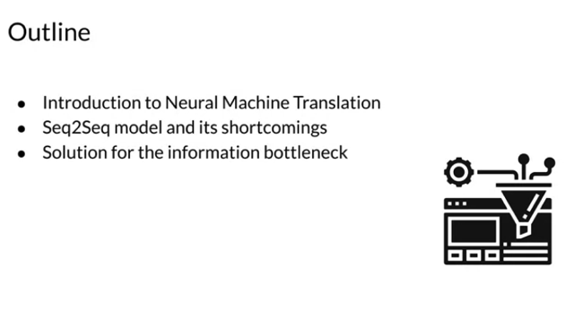</kbd>

   

<kbd>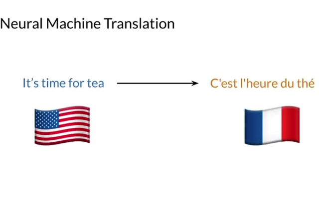</kbd>

   

<kbd>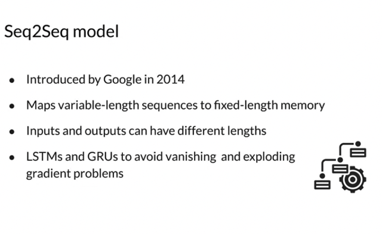</kbd>

> [!NOTE]
> In **neural machine translation**, you're using an **encoder** and a **decoder** to translate from
> **one language to another**. For example, you could translate, it's time for tea from English
> to French, C'est l'heure du the. To do this, you could use a machine translation system
> that has **LSTMs** for both **encoding** and **decoding**. The traditional **seq2seq** model was
> introduced by Google in **2014** and it was a revelation at the time. Basically, it works by
> taking **one sequence of items** such as words and its output, **another sequence**. The way
> this is done is by **mapping variable length sequences to a fixed length memory**, which in
> machine translation, **encodes the overall meaning of sentences**. For example, you can
> have a **text of length that varies** and you **can encode it into a vector or fixed dimension
> like 300**, for example. This feature is what's made this model a powerhouse for machine
> translation. Additionally, the**inputs and outputs don't need to have matching lengths,**
> which is a **desirable feature when translating texts**. Then you might recall the **vanishing
> and exploding gradients problems from earlier in the specialization**. In **seq2seq** model,
> **LSTMs and GRUs are typically used to avoid these problems.**

> [!NOTE]
> Đại khái là nói về **Seq2Seq model**ra mắt năm 2014 là xịn xò nhất lúc
> bấy giờ. Trong đó có những tiến bộ ví dụ như **các sequences có độ dài
> khác nhau** sẽ**được embedding thành các vector fixed-length**. **Encoder**
> và **Decoder** đều có dạng kiến trúc **LSTM.** Cuối cùng là **input và output
> không nhất thiết phải dài bằng nhau,**

   

<kbd>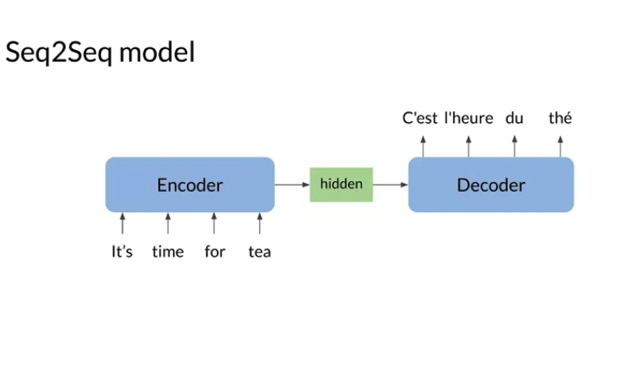</kbd>

> [!NOTE]
> As I mentioned, in a seq2seq model, you have an **encoder** and a **decoder**. The
> encoder **takes word tokens as input**, and it**returns its final hidden states as outputs**.
> This **hidden state is used by the decoder** to generate the translated sentence in the
> target language.

   

<kbd>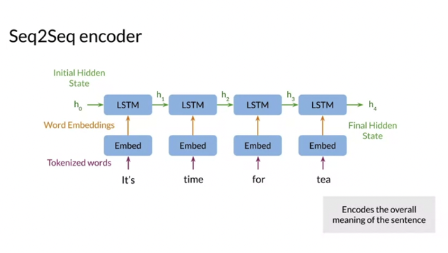</kbd>

> [!NOTE]
> Before moving on, let's look closer at the encoder and decoder. The encoder **typically
> consists of an embedding layer** and an**LSTM module with one or more layers**. The
> **embedding laye**r transforms **words tokenized first into a vector for input** to the **LSTM**
> module. At e**ach step** in the input sequence, the LSTM module receives**inputs from the
> embedding layer**, as well as the**hidden states from the previous step**. The encoder
> returns the **hidden states of the final step**, shown here as **h_4**. This final hidden state
> \_**has information from the whole sentence**\_ and it encodes its overall meaning.

> [!NOTE]
> Seq2Seq 's **Encoder** sẽ có dạng quen thuộc như này, **word sequence
> được tokenize (tách thành từ)** rồi**transform thành index** rồi **đưa vào
> Embedding layer** để biến thành **embedding vector** (của mỗi từ). Tiếp đưa
> vào **LSTM** để qua các timesteps **cuối cùng ra cái hidden state cuối**kiểu
> như sẽ **chứa hết những thông tin của cái câu.**

   

<kbd>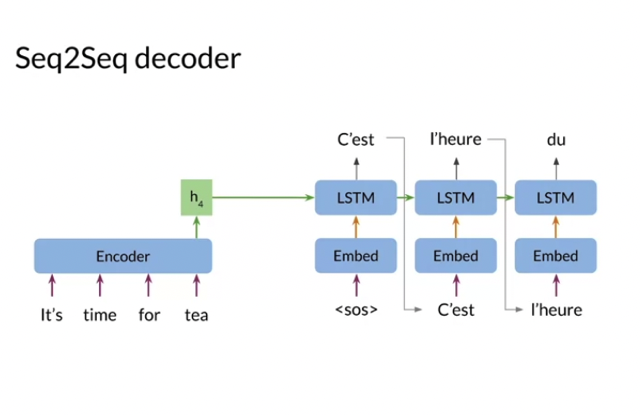</kbd>

> [!NOTE]
> The **decoder** is **constructed similarly** with an **embedding layer** and an **LSTM**
> layer. You use the \_**output word of a step as the input word for the next step**\_. You
> also **pass the LSTM hidden state to the next step**. You start the input sequence
> where there is start of sequence token denoted as SOS here. The first step, C'
> est, as the most probable next word. Then you use C'est as the input word for
> the next step and repeat to generate the rest of the sentence l'heure du the.

> [!NOTE]
> **Decoder** cũng có kiến trúc tương tự, nó sẽ**nhận cái output từ encoder đưa
> vào LSTM**, còn **Embedding layer thì bắt đầu với <SOS> token.** Qua từng
> timestep nó **lấy output của timestep trước đưa vào timestep tiếp theo cho đến
> khi hết**  - tạo <EOS> token.
>
> Cái này khá giống Transformer, nhưng nên nhớ phải ngược lại,  vì cái này có
> trước. Và **Transformer** với **Self Attention sẽ nâng cấp  cái này lên.**

   

<kbd>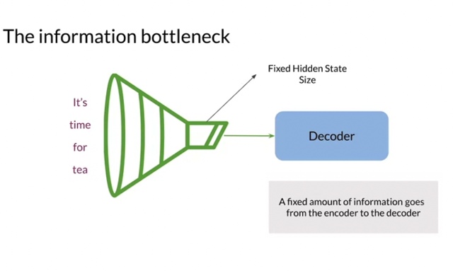</kbd>

> [!NOTE]
> One **major limitation of the traditional seq2seq** model is what's referred
> to as the **information** **bottleneck**. Since seq2seq uses a **fixed length
> memory for the hidden states**, l**ong sequences become problematic**.
> This is due to the fact that in traditional seq2seq models, \_**only a fixed
> amount of information can be passed from the encoder to the decoder
> no matter how much information is contained in the input sequence.**\_

> [!NOTE]
> Cái **nhược điểm** chí tử của seq2seq nguyên thuỷ đó là **giới hạn
> của chiều dài vector hidden state** chứa**toàn bộ thông tin từ Input
> sequence**. **Câu càng dài giới hạn này sẽ khiến thông tin pass
> qua decoder bị hạn chế.**

   

<kbd>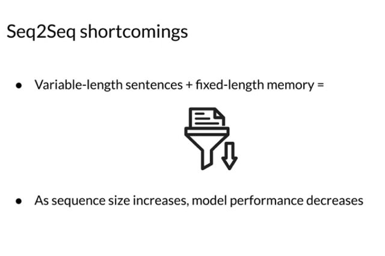</kbd>

> [!NOTE]
> The **power** of **seq2seq**, which allows for inputs and outputs to be different
> sizes, becomes **not effective when the input sequence is long**. The result
> is **lower model performance**, a **sequence size increases** and that's no
> good. The issue with having one **fixed size encoder hidden states** is that it
> \_**struggles to compress longer sequences and it ends up throttling itself
> and punishing the decode**\_r who only wants to make a good prediction

> [!NOTE]
> Như đã nói nhược điểm của nó là **giới hạn của hidden state
> véctơ length khiến câu càng dài performance càng kém** đi do
> thông tin bị hạn chế. Nhưng ư**u điểm của nó là có thể cho ra
> output khác size với input.**

   

<kbd>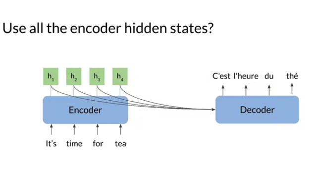</kbd>

> [!NOTE]
> One workaround is to **use the encoder hidden states for each word**
> instead of**trying to smash it all into one big vector**. But this model
> would have **flaws** **with memory and contexts.** How could you build a
> time and memory efficient model that predicts accurately from a
> long sequence?

> [!NOTE]
> Một cách đó là**dùng hidden states của mọi từ
> thay vì dồn thành 1 cái ở cuối**. Nhưng cái này
> bị **vấn đề khả năng bộ nhớ phải chứa hết
> hidden state** là không ổn.

   

<kbd>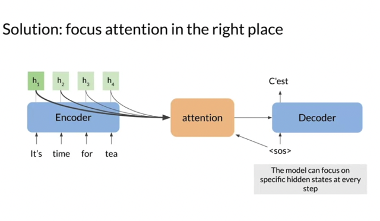</kbd>

> [!NOTE]
> This becomes possible if the model \_**has a way to select and focus on the most
> important words at each time step**\_. You can think of this as **giving the model a
> new layer to process this information**, which in the slide is called \_**attention**\_. If
> you p**rovide the information specific to each input word**, you can give the
> model **a way to focus it's attention in the right place at each step**of the
> decoding process.

> [!NOTE]
> Và giải pháp chính là**Attention mechanism**, thay vì **đem toàn bộ thông
> tin của cả câu nhét vào một hidden state vector** để rồi bị giới hạn,**thì
> Attention sẽ kiểu như giúp extract và pass qua Decoder các thông tin cần
> thiết / cần chú ý ở mỗi timestep (word) thôi.**

   

## Seq2seq Model With Attention

 

### 1. **Attention** is a **crucial concept**in machine learning that\\* allows models to focus on specific

> [!NOTE]
> 1. **Attention** is a **crucial concept**in machine learning that**allows models to focus on specific
> inputs** when making predictions.
>
> 2. Attention was originally introduced in a **landmark** paper by **Dzmitry Bahdanau, KyungHyun
> Cho, and Yoshua Bengio** to improve machine translation models.
>
> 3. Traditional "**Seq2Seq**" models **use the final hidden state of the encoder** for the decoder,
> which can **lead to inefficiencies in handling longer sentences**.
>
> 4. **Attention** solves this problem by **allowing the decoder to consider all the hidden states of the
> encoder** but **with weighted importance on each state**.
>
> 5. The attention layer calculates **alignments** between the **decoder and encoder hidden states**,
> **producing weights** that**represent the importance of each input word for the prediction.**
>
> 6. The **context vector,** obtained by s**umming the encoder states weighted** by their **respective
> importance scores**, **holds relevant information for the decoder's next prediction**.
>
> 7. **Models with attention**, such as the **RNN search model**s, **outperform traditional "Seq2Seq"
> models across all sentence lengths** by focusing on **specific inputs rather than memorizing the
> entire input sentence.**
>
> 8. Attention has applications beyond machine translation and is successfully used in various
> domains.

 

<kbd>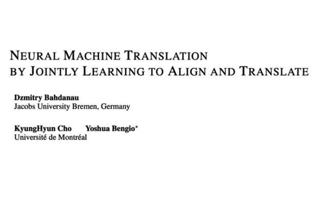</kbd>

   

<kbd>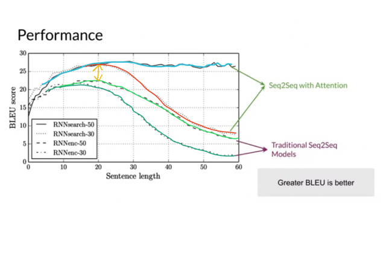</kbd>

> [!NOTE]
> Before we move forward, I want to skip ahead a bit and **show you how well attention
> works**. It's surprising. Here's a comparison of the performance between different
> models from the **Bahdanau paper** using the **bleu score**, a performance metric that
> you'll learn about later. In brief, higher scores are better, indicating more correct
> translations. The **dashed lines**, they showed the **scores for bidirectional Seq2Seq
> model**as the **length of the input sentence is increased**. The **30 and 50 denotes the
> maximum sequence length** used to **train** the models. As you can see, the **seek to
> seek** models perform well wien sentences with about **10-20 words**, but they fall off
> beyond that. This is what you should expect. A Seq2Seq models **must store the
> meaning of the entire input sequence, any single vector**. The models developed in
> this paper, **RNNSearch30-50**, use **bidirectional encoders and decoders**, but with
> **attention**. First, t**hese models perform better than the traditional Seq2Seq models**
> **across all sentence length**. The **RNNSearch50 model has basically no fall off** in
> performance **as sentence lengths increase**. As you will see, this is because the
> models are **able to focus on specific inputs to predict words in the output translation**,
> instead of **having to memorize the entire input sentence.**

> [!NOTE]
> Đại khái là đồ thị cho thấy các **Seq2Seq model nguyên bản** chỉ làm tốt khi câu **không dài
> quá 20-25 từ**. Vượt quá mức đó **performance thể hiện qua BLEU score giảm đi**. Ta có thể
> dễ dàng hiểu như bữa trước đã biết là do **bottleneck** của Seq2Seq model khi phải
> **compress toàn bộ thông tin của cả câu trong một vector hidden state của timestep cuối**
> trước khi pass qua Decoder. Nên câu **dài quá thông tin bị mất dần**. Trong hai cái đó, cái
> **RNN50** (đường xanh lá cây sáng) đỡ hơn vì được **train với câu dài 50 từ** (cái kia - xanh
> lá cây đậm train với câu 30 từ).
>
> Với **Attention** thì ta thấy phiên bản train với 30 từ vẫn tốt hơn đáng kể **thể hiện ở BLEU
> score vượt lên xa hai đường kia ở mức 20 từ**. Và đỉnh của đỉnh đó là **RNNSearch50 giữ
> vững điểm BLUE dù câu có dài thiệt dài**

   

<kbd>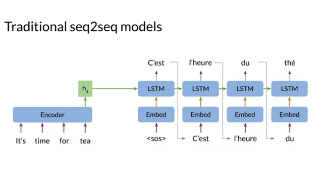</kbd>

> [!NOTE]
> Traditional Sed2Seq models, use the **final hidden states of the encoder** as the
> **initial hidden state of the decoder.** This forces the encoder to \_**store the
> meaning of the entire input sequence into this one hidden states.**\_

> [!NOTE]
> Nhắc lại trong **Sed2Seq nguyên bản**, **hidden state của last time-step**
> **chứa thông tin của toàn bộ input sequence** - sẽ được pass cho Decoder.

   

<kbd>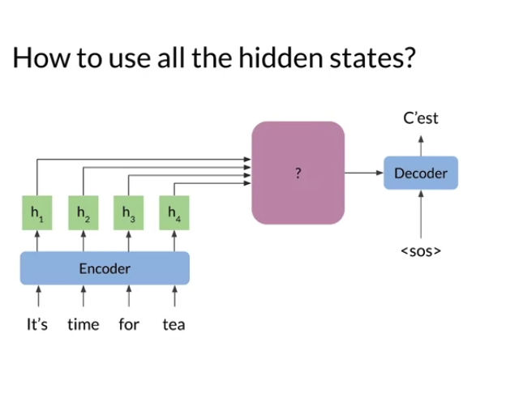</kbd>

> [!NOTE]
> Instead of using **only the final hidden states**, you can pass \_**all the
> hidden states**\_ to the decoder. However, this **quickly becomes
> inefficient** as you must retain the hidden states for each input step in
> memory

> [!NOTE]
> Tuy nhiên **giới hạn của độ dài vector hidden state** chính là
> **bottleneck khiến thông tin bị mất đi khi câu quá dài**. Một cách khác
> là **pass hidden states của mọi time-steps của Encoder qua cho
> Decoder**, nhưng cũng nhanh chóng nhận ra cách này **không ổn khi
> phải tốn quá nhiều memory**

   

<kbd>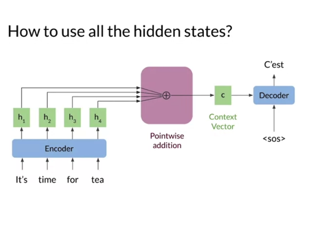</kbd>

> [!NOTE]
> To solve this, you can \_**combine the hidden states into one vector**\_, typically called
> the **context vector**. The samples operation here is the **point-wise addition**. Since the
> hidden vectors are all the **same size**, you can **just add up these vector elements by
> elements** to produce another vector of the same size. But now the decoder is getting
> information about each step.

> [!NOTE]
> Thay vì **pass tất cả các hidden states của mọi time-step qua cho Decoder**, thì có thể
> cộng chúng lại (**point-wise addition**) để được một cái gọi là **context vector** rồi
> **pass qua cho Decoder**.
>
> Chú ý nó khác với **hidden state của last step**như traditional Seq2Seq, là một **hidden
> state chứa toàn bộ thông tin của câu**. Còn đây là **phiên bản point-wise addition của tất
> cả các vector tức là add tất cả các hidden state vector**

   

<kbd>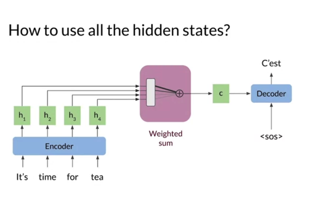</kbd>

> [!NOTE]
> But **It really only needs information from the first few inputs steps to predict the first word.**
> This**isn't that much different from using the last hidden states** from **LSTM or GRU.**
>
> The solution here is to **weight certain encoder vectors more than others** before the**point-wise addition**, \_**words are more important for the next decoder outputs would have
> larger weights.**\_ That this way, the \_**context vector holds more information about the most
> important words and less information about other words.**\_

> [!NOTE]
> Tuy nhiên ý tưởng ở đây đó là Decoder khi translate một từ **không cần phải có
> information của tất cả các time-step**, mà như DLSpec đã  biết, **mà nó chỉ cần chú ý
> (attention) vào một số từ nào đó thôi.**Thì cái này cũng không khác mấy việc LSTM hay
> GRU **trong đó từ tiếp theo sẽ sử dụng thông tin từ một số từ nào đó gần đó.**
>
> Tuy nhiên cái chính ở đây là \_**chú ý nhiều hơn đến một số từ quan trọng\_, tức là \_gán
> trọng số cao cho một số từ nào đó ảnh hưởng nhiều\_ và \_giảm bớt trọng số đối với các từ
> khác**\_

   

<kbd>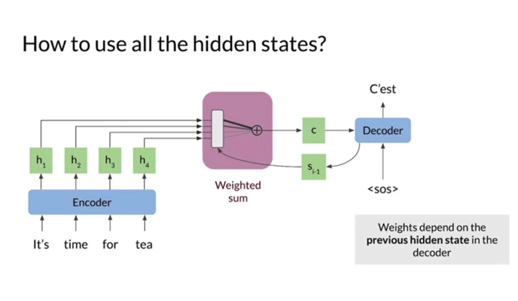</kbd>

> [!NOTE]
> But how are these **weights** calculated to **determine which input words are important at each
> step**? The **decoders previous hidden states, denoted as s<i-1>**, contains information
> about the **previous words** in the**output translation**. This means, you can \_**compare the
> decoder states with each encoder state to determine the most important inputs**\_. Intuitively,
> the **decoder can set the weights such that if it focuses on only the most important inputs
> words for the next prediction**, it **decides which parts of the input sequence to pay attention
> to.**

> [!NOTE]
> Thì làm sao để **xác định từ nào là quan trọng hơn từ nào khi tính / predict ra từ tiếp theo
> của Decoder**. Thì ý tưởng là ta sẽ **so sánh cái \_previous hidden state của Decoder** \_-
> **chứa thông tin về cái từ output translation gần nhất**.
>
> Có nghĩa là, ta sẽ **so sánh cái \_decoder's previous hidden state này**\_ với **các encoder
> states - tức các \_hidden state của các time-step của encoder**\_ để xác định **cái nào là quan
> trọng nhất cần chú  ý nhiều** khi generate từ tiếp theo.

   

<kbd>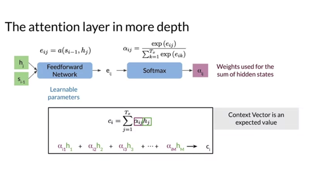</kbd>

> [!NOTE]
> The goal of the attention layer is to **return a context vector that contains the relevant
> information from the encoder states**.
>
> The first step is to calculate the **alignments** - **e_ij**, which is **a score of how well the
> inputs around j match the expected output its i**. The more the match, the higher of his score
> we will expect. This is done using the **feedforward neural network**with the encoder and
> decoder hidden states as inputs, where the **weights for the feedforward network are
> learned** along with the rest of the Seq2Seq model.
>
> The**scores are then turned into weights which range from 0 to 1 using the softmax
> function**. This means **the weights can be thought of as a probability distribution which sum
> to one**.
>
> Finally, **each encoder states is multiplied by its respective weights and sum together into
> one context vector**. Since the weights are the probability distribution, this is equivalent to
> calculating an expected value across word alignments.

> [!NOTE]
> Như đã nói **mục tiêu của Attention layer** là cũng **tính ra context vector** nhưng **thay vì
> chứa (sum) hidden state của mọi time-steps** thì đây nó sẽ**\_gán trọng số\_ cao thấp khác
> nhau** khi sum (gọi là weighted sum) \_**dựa trên "mức độ liên quan" của từ đang cần predict
> và các từ của input sequence.**\_
>
> Vậy nó tính mức độ liên quan này như thế nào. Đó là đầu tiên nó sẽ**dùng Feedforward
> Neural Network, với input là Decoder's previous hidden state và Encoder's hidden state
> (mọi time-step)** và qua đó sẽ cho ra gọi là **alignment e_ij** - kiểu như **vector chứa các score
> đo độ match hay relevant của các Encoder's hidden state h_j và Decoder's previous
> hidden state s_i-1**. Dĩ nhiên **model sẽ train để learn weight của cái FNN này**.
>
> Sau đó các score này được **thông qua hàm Softmax để "biến thành" các tỉ trọng, tổng
> bằng 1** hay hiểu theo nghĩa xác suất là **probability scores** cũng được.
>
> Cuối cùng,**các hidden states cũng được sum** nhưng **với trọng số  (Weights) là các
> probability score từ Softmax để tạo ra Context vector.**

   

## Bsckground On Seq2seq

 

### Recurrent models typically take in a sequence in the order it is written and use that to

> [!NOTE]
> Recurrent models typically take in a sequence in the order it is written and use that to 
> output a sequence. Each element in the sequence is associated with its step in 
> computation time \\/t\\/. (i.e. if a word is in the third element, it will be computed at \\/t\\/3). 
>
> These models generate a sequence of hidden states \\/h\\/<\\/t>\\/, as a function of the previous 
> hidden state h<t-1> and the input for position t. 
>
> The **sequential nature** of models you learned in the previous course (RNNs, LSTMs, 
> GRUs) **does not allow for parallelization** within training examples, which becomes critical 
> at longer sequence lengths, as memory constraints limit batching across examples. In 
> other words, if you rely on sequences and you need to know the beginning of a text 
> before being able to compute something about the ending of it, then you **can not use 
> parallel computing**. You would have to **wait until the initial computations are complete**. 
> This is not good, because **if your text is too long**, then 1) it will **take a long time** for you to 
> process it and 2) you will **lose a good amount of information mentioned earlier**in the text 
> as you approach the end.  
>
> Therefore, **attention mechanisms** have become **critical**  for sequence modeling in various 
> tasks, **allowing modeling of dependencies without caring too much about their distance** in 
> the input or output sequences. 
>
> In this course, you will learn about these attention mechanisms and see how they are 
> implemented. Welcome to Course 4!

> [!NOTE]
> Đại khái như đã biết, attention mechanism đem đến một
> tính chất quan trọng, đó là khả năng **parallelism** - **xử lý
> cùng lúc cho sequence data**

 

## Queries, Keys, Values And Attention

 

### 1. **Introduction and Attention Concepts:**

> [!NOTE]
> 1. **Introduction and Attention Concepts:**
>    - **Attention** involves the use of **queries**, **keys**, and **values**.
>    - The **original attention paper** was published in 2014, leading to **various attention 
> variations.**
>    - Some models **don't rely on recurrent neural networks**.
>
> 2. **Transformer Model and Attention Mechanism:**
>    - The 2017 paper "**Attention Is All You Need**" introduced the **transformer** model and 
> **attention**.
>    - Attention is based on **information retrieval with queries, keys, and values.**
>    - This form of attention is efficient and powerful.
>    - **Alignment between languages** is a key concept.
>
> 3. ****Queries, Keys, and Values** Concept:**
>    - **Queries are matched with keys** to **retrieve associated values**.
>    - Keys and values can be thought of as **lookup tables**.
>    - **Embedding vectors** represent queries, keys, and values.
>    - **Similarity between words is alignment**.
>
> 4. **Alignment and Attention Vector:**
>    - **Alignment scores** are calculated using **query** and **key** vectors.
>    - Alignment scores become **weights** for **weighted sum of value vectors**.
>    - Attention vector is the result of this process.
>
> 5. ****Scale Dot-Product Attention**:**
>    - **Scale dot-product** attention involves matrices**Q, K, and V**.
>    - **Queries and keys are multiplied**, then **scaled**.
>    - **Alignment scores** become **weights** using **softmax**.
>    - **Weights** and **value matrices** are multiplied to **get attention vectors**.
>    - **Only two matrix** **multiplications** in **scale dot-product attention**.
>    - **Alignment is learned elsewhere**, often in **input embeddings** or linear layers.
>
> 6. ****Alignment** and **Translation**:**
>    - **Alignment weight**s form a matrix indicating**similarities between word pairs**.
>    - \\_**Model learns word similarities**\\_ and \\_**encodes them in query and key vectors**\\_.
>    - Beneficial for translating **languages with different structures.**
>    - **Attention** handles **word order variations.**
>
> 7. **Summary and Future Topics:**
>    - Attention layer's purpose and relation to **information retrieval.**
>    - **Effective performance**even with **different language structures**.
>    - Introduction to q**ueries, keys, and value**s for research paper understanding.
>    - Upcoming topic: setup for **neural machine translation** and **data** **preprocessing**.

 

<kbd>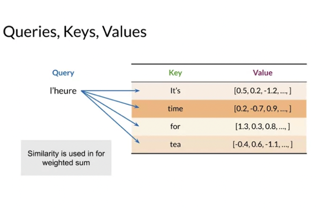</kbd>

> [!NOTE]
> Đại khái là như bài trước đã nói, **previous hidden state của Decoder** sẽ được **compare**
> với các **hidden state của Encoder** để tính ra **attention weights** để từ đó ta **tính ra
> context vector** là **weighted sum của các Encoder hidden states**, **passed qua Decoder.**
>
> Thì ở đây, để chuẩn bị, người ta nói đến cách**"bố trí"**như thế này với **Query**, **Key** và
> **Value**. Có thể hiểu hình tượng là Q,K,V như **kiểu một look Up table** - tức là cho một
> **Query**, **với các Key khác nhau** ta sẽ l**ấy ra các Value tương ứng**.
>
> Ví dụ đưa ra một **Query "I'heure"**, với cách **Key khác nhau** như  **"It's", "time", "for"**, ...sẽ
> **lấy ra các value khác nhau**.
>
> Nhưng đó là cách hiểu hình tượng cho dễ, chứ nó không phải là từ. Mà **cả query,
> value và key đều là vector.**

   

<kbd>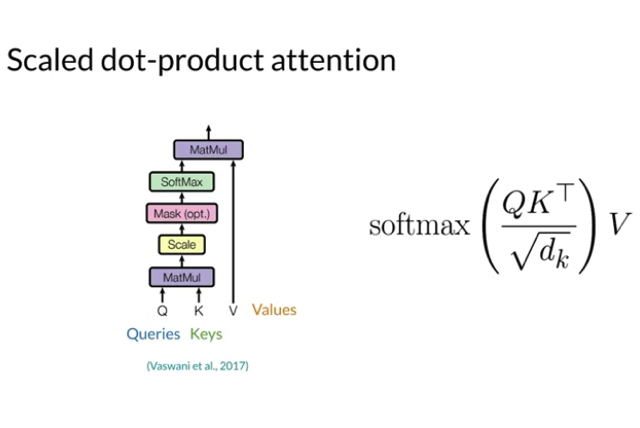</kbd>

> [!NOTE]
> This process can be performed using **scale dot-product** attention. The \_**queries for each
> step**\_ are \_**packed together**\_ into a matrix **Q**. So **attention can be \_computed
> simultaneously for each query**\_. The **keys and values are \_also packed into matrices K and
> V**\_. These matrices are the inputs for the attention function shown as a diagram on the left and
> mathematically on the rights.
>
> First, the **queries** and **keys** matrices are **multiplied together to get a\_ matrix of
> alignments**\_ scores. These are then \_**scaled**\_ by the square root of the key vector
> dimension, dk the scaling **improves the model performance** for larger model sizes and could
> be seen as a **regularization** constants.
>
> Next the **scale scores** are \_**converted to weights**\_ using the **softmax** function. Such that
> the weights for each query **sum to one**. Finally the **weights** and the **value** **matrices** are
> multiplied to get the **attention vectors for each query**, you can think of the **keys and the values
> as being the same**. So when you multiply the softmax output with V you are taking a
> linear combination of your initial input which is then being fed to the decoder.
>
> No, that unlike the **original form of attention**, **scale dot-product  attention** consists of only
> **two Matrix multiplications and no neural networks**. Since **matrix multiplication is highly
> optimized** in modern deep learning frameworks. This form of attention is much **faster** to
> compute but this \_**also means that the alignments between the source and target languages
> must be learned elsewhere.**\_ Typically, **alignment is learned in the input embeddings** or in
> **other linear layers before the attention layer**. Before moving on, I want to look a bit closer at
> alignment. The alignment weights form a matrix with queries, targets words on the roads
> and keys or source words on the columns.

> [!NOTE]
> Từ khoá: **nhiều query stack lại thành Q** để làm cùng lúc. **nhiều keys và values cũng
> vậy**. **Queries Q nhân (product) với Keys K**chính là để **tính ra các chỉ số relevant
> score giữa các queries và các keys**.
>
> Việc **scale xuống bởi sqrt dk là để ổn định quá trình training** và vai trò **regularization**
> thôi. Dk là chiều dài của vector Value hay giá trị last dimension của value
>
> Kết quả chính là các **" relevant scores"** của các keys với queries chỉ có cái là **tính
> cùng lúc cho nhiều queries**. Bỏ qua **softmax** để **biến thành trọng số** có **sum = 1**.
> Cuối cùng**nhân các trọng số này cho value V** chính là **embedding** để được
> **weighted sum**- **Context vector.**
>
> Tức là nó y như ý nghĩa bài trước đã nói, chỉ là đây là cách thức triển khai, với việc **mỗi
> một từ bên cạnh có embedding** của nó **chính là value** (*) giờ sẽ có thêm**query
> vector và key vector** (và **cũng được learn khi training** như value - embedding) để phục
> vụ cho việc **tính "độ liên quan" với các từ khác** từ đó để ra **trọng số WEIGHT**.
>
> (*) Nếu VALUE từ Decoder (previous hidden sate) và  QUERY VÀ KEY thì từ Embedding.
> Thì gọi là Decoder-Encoder Self Attention
>
> Nhưng nếu VALUE cũng lấy từ Embedding thì gọi là Self-Attention.
>
> Cái này khác một chỗ ở bài trước nói về **original form of attention** đó là dùng một **feed
> forward neural network** để **learn ra chỉ số relevant e_ij** của **các input** (bài trước như
> đã biết là giữa **previous hidden state của Decoder** và **hidden state của Encoder**) mà
> là dùng **learnable queries** và **keys matrix** và **product tụi nó lại để ra relevant scores**Và điều đó cũng đồng nghĩa**Q, và K này phải được learn ở đâu đó**cụ thể chính là ở
> ba cổng Query, Key và Value sau **Embedding layers trước khi qua Attention layers. Và ta
> biết nó thực chất là 3 Linear layer với weight matrix W_Q, W_K, W_V**

   

<kbd>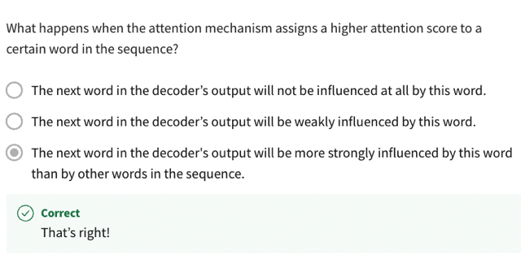</kbd>

> [!NOTE]
> Khi attention mechanism đã gán trọng số
> cao cho 1 từ tức là từ đó sẽ ảnh hưởng
> nhiều đến next predicted word

   

<kbd>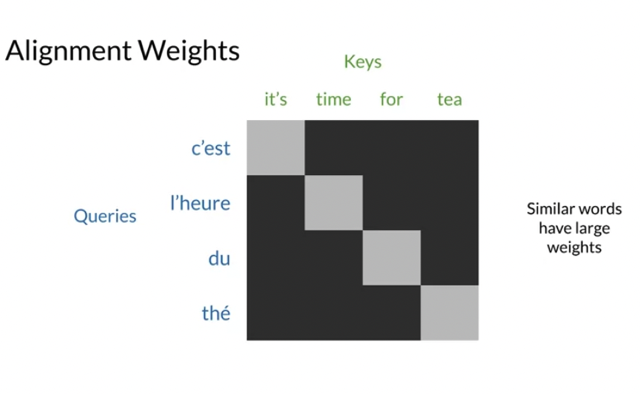</kbd>

> [!NOTE]
> Each entry in this matrix is the **weight** for the **correspondent query-key pair** word
> pairs that have **similar meanings**, "thé" and "tea", for example, will have **larger weights**
> than the **similar words like "day" and "time"**. Through training, the **model learns
> which words have similar meanings** and encodes that information and the query
> and key vectors.

> [!NOTE]
> Key và Query Value sẽ được**train / learn bởi model ở các
> component trước Attention** để **những từ có ý nghĩa gần
> nhau sẽ có dot product cao (-> 1)**

   

<kbd>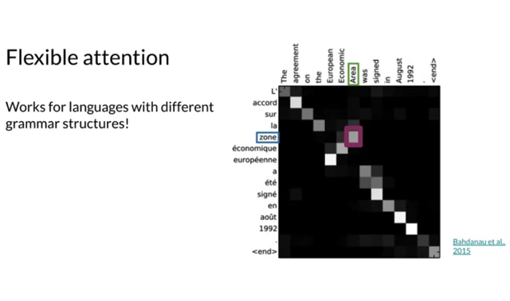</kbd>

> [!NOTE]
> **Learning** **alignment** like this is beneficial for translating between **languages** with **different
> grammatical structure**s. Since attention **looks at the entire input** and **target sentences at
> once** and **calculates alignments based on word pairs**, **weights are assigned appropriately
> regardless of word order**. For example, In the sentence, "the agreement on the European
> Economic Area was signed in August 1992" and this other sentence "câu tiếng pháp", you can see
> that **zone** in the **area** are at **different positions**, let's have the **same meaning**. **The
> model has learned to align them appropriately,** allowing the \_**decoder to focus on the
> appropriate inputs words despite different ordering.**\_

> [!NOTE]
> Đại khái là cách **learning alignment** - tức là các **chỉ số relevant giữa các từ** như vậy
> cho phép **model học được sự relevant** của các từ **không nhất thiết phải cùng vị trí**. Ví
> dụ trong đây từ **Area** trong câu tiếng Anh **không cùng vị trí** với từ **Zone** trong câu tiếng
> Pháp **nhưng model vẫn học được** để cho ra **sự alignment của hai từ này là cao.**

   

<kbd>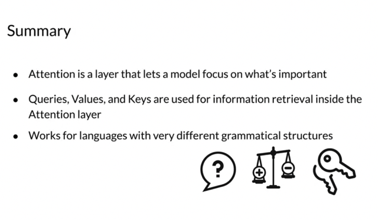</kbd>

> [!NOTE]
> Congrats on absorbing all these new concepts. I introduced you to the purpose of an
> **attention layer**. You saw how it is related with **information retrieval** and I showed you
> **how well it works** even for **languages with very different structures**. In the next video,
> I'll be talking about n**eural machine translation** and show you **what the setup looks
> like for the system**. I'll show you what the data set looks like and the steps required
> for **pre processing your data sets**. You have now seen what key square ease and
> values are. These are important because if you read a research paper you might
> come across these terms and you will understand them. In the next video. I will talk
> about the setup for machine translation.

   

## Lab: Basic Attention

 

### As you've learned, attention allows a seq2seq decoder to \\_use

> [!NOTE]
> As you've learned, attention allows a seq2seq decoder to \\_use
> information from\\_ **e\\_ach encoder step** instead of**just the final encoder
> hidden state**\\_. In the attention operation, the \\_**encoder outputs are
> weighted based on the decoder hidden state**\\_, then c**ombined into
> one context vector**. This vector is then **used as input to the decoder
> to predict the next output step**.
>
> In this ungraded lab, you'll implement a basic attention operation as
> described in Bhadanau, et al (2014) using Numpy. I'll describe each
> of the steps which you will be coding.

> [!NOTE]
> Nhắc lại cũng như là confirm lại lần nữa **ý tưởng của Attention mechanism** đó là thay vì
> predict next word bởi thông tin từ hidden state của last time-step, vốn sẽ bị giới hạn bởi
> bottle-neck là chiều dài vector thì nay ta sẽ **sử dùng toàn bộ hidden state của các time-steps
> (sum lại) nhưng với trọng số** được tính dựa trên **sự relevant của previous Decoder hidden
> state và các Encoder hidden state.**
> Nên Context vector **thay vì chứa toàn bộ thông ti**n nhưng theo cách  bị nén và câu quá dài thì
> thông tin bị mất nhiều thì bây giờ nó **chỉ quan tâm nhiều đến các từ cần thiết,** q**uan tâm ít hơn
> (trọng số nhỏ hơn) với các từ khác**. Như vậy nó vẫn chứa toàn bộ thông tin từ các timestep
> nhưng hiệu qủa hơn.

 

<kbd>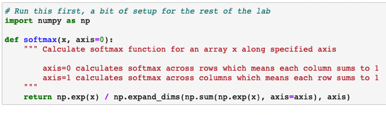</kbd>

   

- 1: Calculating alignment scores
   

    
    
<kbd>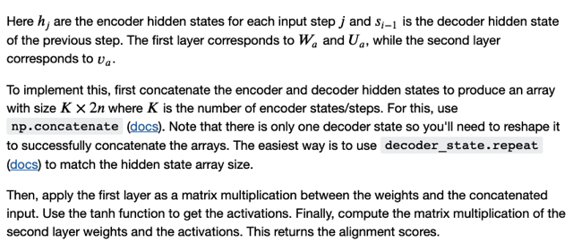</kbd>

    
<kbd></kbd>

    
<kbd>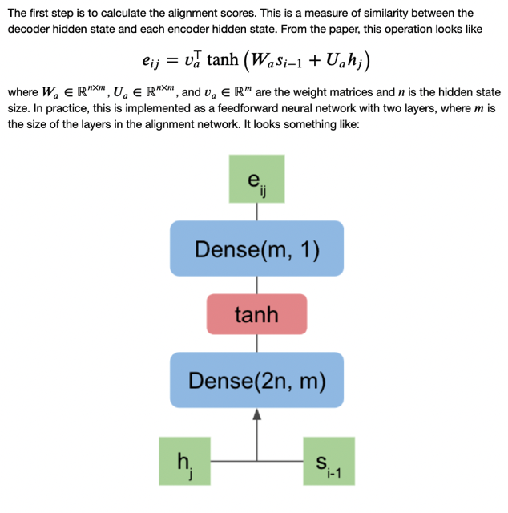</kbd>

    > [!NOTE]
    > m size của layers tức là số hidden unit của hai cái dense layer và weight của 
    > layer đầu tiên tương đương 2 cái weight matrix Wa (m, n) và Ua (m, n) stack 
    > vertically với nhay để có shape là (m, 2n)
    >
    > hj, có shape là (K, n) = (Số từ | hay time-step, size của hidden state vector)
    > là tất cả các hidden states của Encoder. Tức là K chính là sequence's length
    >
    > s(i-1) có shape (1, n) = (1, size của hidden state vector) là hidden state của
    > previous step của Decoder. Nhưng s(i-1) được repeat lên K lần để trở thành
    > (K, n) luôn.
    >
    > Thì khi đưa vào Dense layer hj (K,n) thì nó sẽ nhân với Wa để:
    > Wa x hj = (m, n) x (n, K) = (m, K)
    >
    > Đưa s(i-1) Đã repeat (K,n) vào Dense layer nó sẽ nhân với Ua:
    > Ua x s(i-1) = (m, n) x (n, K) = (m, K)
    >
    > Thì nếu ta stack hj và s(i-1) theo chiều horizontally để (K, n) + (K, n) = (K, 2n)
    > và stack Wa và Ua vertically để thành (m, n) + (m, n) = (2m, n) thì
    > phép tính cũng tương đương,

     

    
    
<kbd>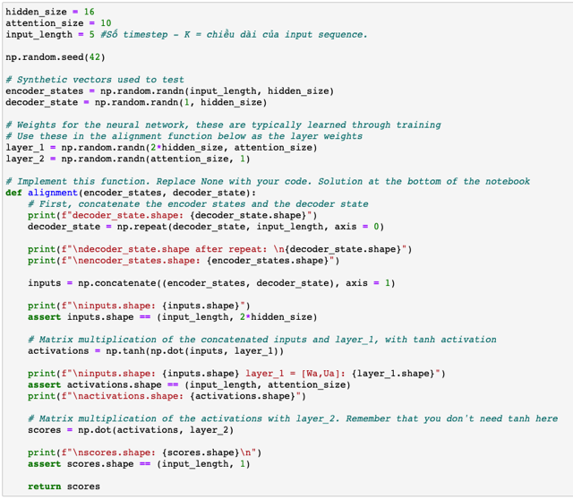</kbd>

     

    
    
<kbd>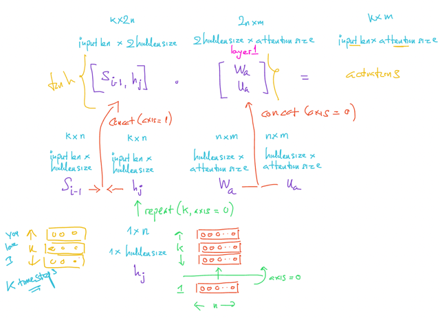</kbd>

    > [!NOTE]
    > *Mấy cái khác nhìn hình vẽ là hiểu
    >
    > ***Wa và Ua** vì có **cùng shape (n, m)**= **(hidden_size, attention_size)** và 
    > dù sao cũng là trainable cũng cơ bản là ini với random n, m = hidden_size, attention_size
    >
    > Sau đó vertically concat để thành shape (2n, m = (2*hidden_size, attention_size)
    >
    > Nên ta hiểu là ở đây người ta gọi luôn là layer1 và init randomly với
    > shape là (2n, m) luôn
    >
    > *activations (k,m) . Layer2 (m, 1) cho ra scores = eij (k,1) . Là vector 
    > chứa alignment scores cùng len = input_length K với Encoder states. 
    > là các chỉ số thể hiện độ relevant của previous Decoder hidden state
    > s_i-1 với K cái Encoder hidden state h_j.
    >
    > Tí nữa sẽ bỏ qua **softmax** để **biến thành trọng số weights alpha<j>**
    > để rồi tính **weight sum của Encoder hidden state alpha<j>h<j>** chính là **Context vector**

     

    
    
<kbd>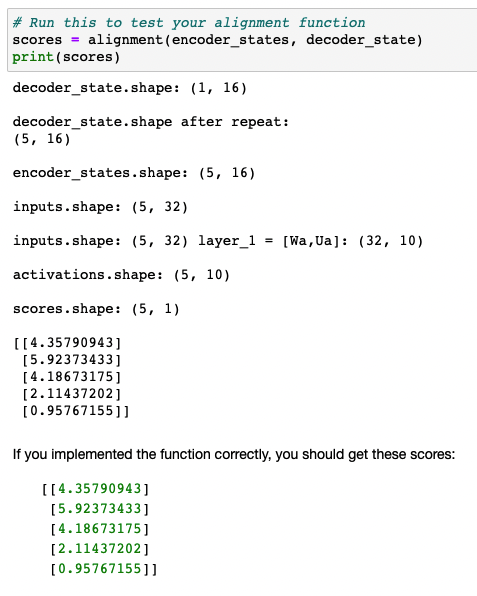</kbd>

     

    
    
<kbd>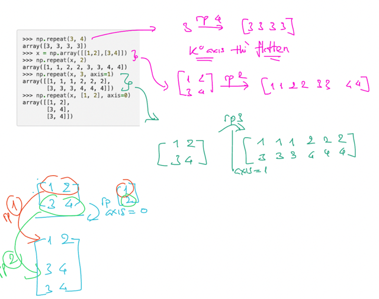</kbd>

    > [!NOTE]
    > Vì np.repeat() Không
    > có axis thì flatten

     

- 2: Turning alignment into weights
   

    
    
<kbd>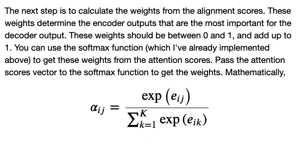</kbd>

    > [!NOTE]
    > Bước kế tiếp là biến alignment scores
    > thành weight bằng Softmax

     

- 3: Weight the encoder output vectors and sum
   

    
    
<kbd>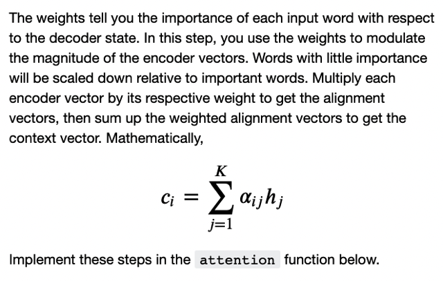</kbd>

    > [!NOTE]
    > Sau khi có **weights α<j>**, **mỗi weight cho mỗi Encoder hidden
    > state h<j>** ta sẽ **tính weighted sum các Encoder hidden states**
    > α<j>*h<j> để ra Context vector

     

    
    
<kbd>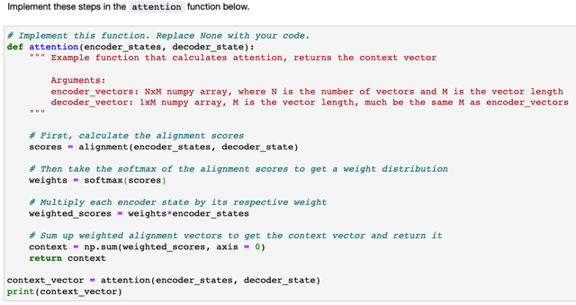</kbd>

     

    
    
<kbd>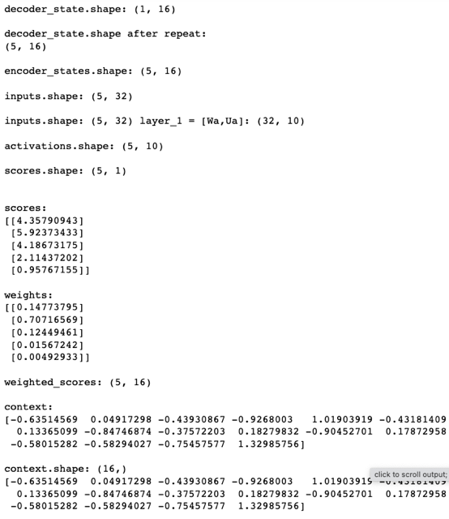</kbd>

     

    
    
<kbd>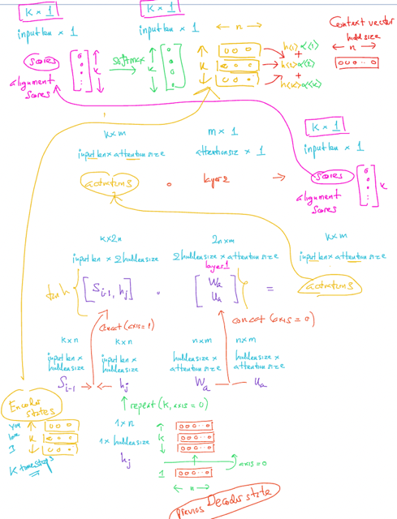</kbd>

     

    
    
<kbd>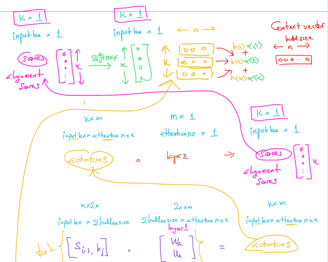</kbd>

    > [!NOTE]
    > Bỏ qua softmax để biến thành trọng số weights α<ij> j=1,2..K
    > để rồi tính weight sum của Encoder hidden state: 
    > α<i1>h<1> +  α<i2>h<2> + .. α<iK>h<K> cho ra Context vector
    > Cũng có len hidden size.

     

## Setup For Machine Translation

 

### 1. **Introduction to Neural Machine Translation (NMT)**:

> [!NOTE]
> 1. **Introduction to Neural Machine Translation (NMT)**:
>    - **Explanation of how words are represented** in the **neural machine translation setting**.
>    - Introduction to the **data set used for NMT**.
>
> 2. **Data Set and Examples**:
>    - Description of the structure of the input data set.
>    - **Example of input sequences in English** and**their corresponding French translations**.
>    - **Mention of occasional inputs in Spanish** within the data set.
>
> 3. **Word Representation and Mapping**:
>    - Mention of **state-of-the-art models** using **pre-trained vectors for word representation**.
>    - Explanation of using **one-hot vectors** to **represent words**.
>    - Introduction of **word-to-index (word2ind)** and**index-to-word (ind2word)** **dictionaries** for 
> mapping.
>    - Transformation of **input words into indices** and vice versa for predictions.
>
> 4. **Special **Tokens** and **Padding****:
>    - Usage of an **end-of-sequence token** to mark the**end of sentences.**
>    - **Padding token vectors** with **zeros** to match the **length of the longest sequence**.
>
> 5. **Example from Assignments**:
>    - Demonstration of tokenization and indexing for an English sentence.
>    - Showing the **EOS token** and **padding for the English tokenized version**.
>    - **Displaying the French translation** and**its tokenized version with EOS token and 
> padding.**
>
> 6. **Preparing for Model Training**:
>    - Recap of **understanding word representation**, **model initialization**, and **dataset 
> structure**.
>    - **Encouragement to start training the NMT model based on the knowledge gained.**
>    - Mention of the upcoming video tutorial for training the model.

 

<kbd>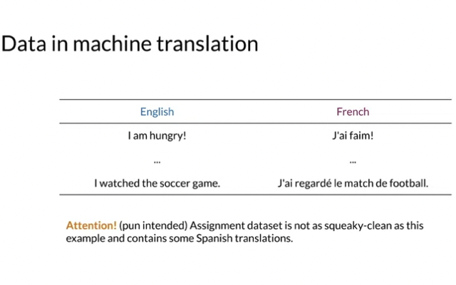</kbd>

> [!NOTE]
> Đại khái là nói data cho việc huấn luyện machine
> translation sẽ có dạng như thế này. Nhưng đôi khi sẽ có
> lẫn câu tiếng Spanish vào.

   

<kbd>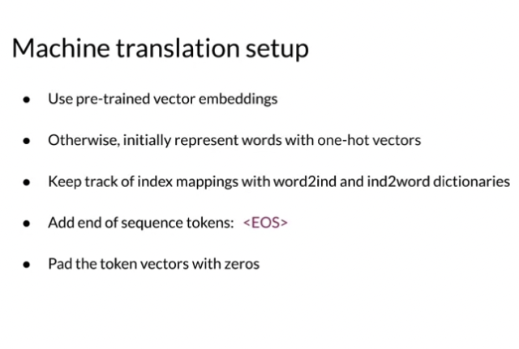</kbd>

> [!NOTE]
> Các bước setup bao gồm: Đại khái ổng nói thông thường
> người ta sẽ sử dụng **pre-train embedding vector** để đại
> diện các từ. Nhưng cũng có thể **dùng one-hot encoding vector**.
>
> Rồi sử dụng 2 dictionary **word2ind** và **ind2word** để map giữa **từ và index**.
>
> Token đặc biệt **EOS** sẽ được dùng để biểu thị **chấm dứt câu**.
>
> Và **zero padding** sẽ được thêm vào để các câu có cũng chiều dài **max_length**

   

<kbd>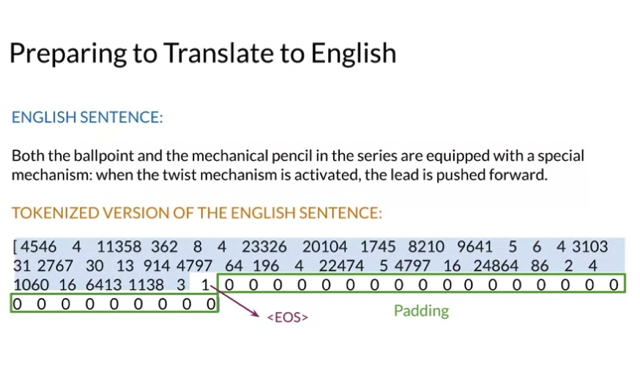</kbd>

   

<kbd>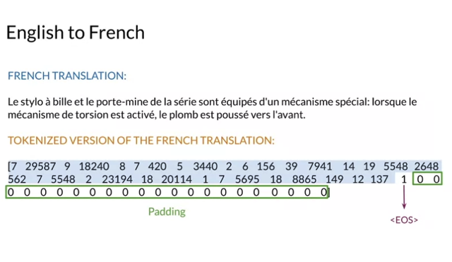</kbd>

   

<kbd>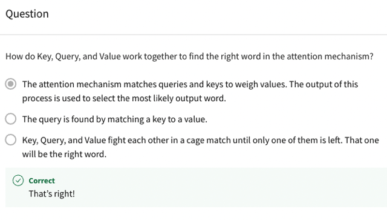</kbd>

   

## Lab: Scaled Dot-product Attention

 

### The 2017 paper \\_Attention Is All You Need  (\\_\\/https://arxiv.org/abs/1706.03762\\/)  introduced

> [!NOTE]
> The 2017 paper \\_Attention Is All You Need  (\\_\\/https://arxiv.org/abs/1706.03762\\/)  introduced
> the **Transformer model** and **scaled  dot-product attention**, sometimes also called
> **QKV** (**Q**ueries, **K**eys, **V**alues) attention.  Since then, Transformers have come to
> dominate **large-scale natural language**  applications. Scaled dot-product attention can be
> used to improve **seq2seq** models as  well. In this ungraded lab, you'll implement a
> **simplified version of scaled dot-product  attention** and replicate word alignment between
> English and French, as shown  in \\_Bhadanau, et al. (2014)\\_. (\\/https://arxiv.org/abs/1409.0473)\\/
>
> The Transformer model **learns how to align words in different languages**. You won't be
> training any weights here, so instead I've prepared some \\_p**re-trained aligned word
> embeddings from here**\\_. https://fasttext.cc/docs/en/aligned-vectors.html 
> Run the cell below to l**oad the embeddings** and set up the rest of
> the notebook.

> [!NOTE]
> Trong lab này ta sẽ thực hành build một phiên bản đơn giản
> hơn của scaled dot-product attention

 

<kbd>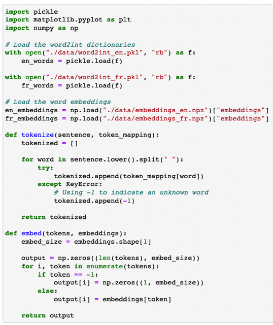</kbd>

> [!NOTE]
> Cơ bản là họ load hai bộ**dictionary map từ và index**trong English và French cũng
> như là **hai bộ word embedding**
>
> Đồng thời chuẩn bị hai f**unction giúp tokenize()** - nhận sentence,**trả về tensor mỗi
> word trong sentence thay bằng token (index)**
>
> và **embed()** - nhận vector các tokens thay bằng tensor trong đó mỗi **token được thay
> bằng embedding vector**

   

<kbd>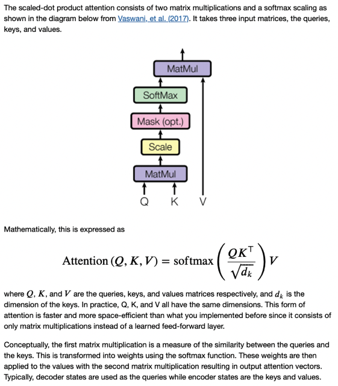</kbd>

> [!NOTE]
> Đáng chú ý đại khái nhắc lại phương pháp tính attention này gọi là **scaled
> dot-product** nó nhanh hơn **basic attention** (tính alignment score **thông qua một
> feed forward network**) vì nó chỉ thực hiện **phép tính matrix multiplication.**
>
> Trong practice thì **Q, K, V** là những **trainable / learnable** **matrix** có **cùng shape**
> (sequence length x embedding dimension)
>
> ====
>
> **Q.(K.T)** là tính ra **similarity scores giữa các queries và keys**.
>
> Nếu là Attention cũ thì Q là hidden state của Decoder, K là hidden state của Encoder 
> và V là hidden state cũng của Encoder.
>
> ====
>
> Trong đó theo như DLSpec **Transformer**: Các embedding (chính xác là semantic embedding
> + positional encoding) sẽ được qua 3 cổng Query, Key, Value là các Linear layer với các
> learnable weight matrix W_Q, W_K, W_V.
>
> Nếu là Self-Attention (Encoder hoặc Decoder) thì input vào Query và Key và Value đều 
> là embedding của Encoder hoặc Decoder.
>
> Nếu là Decoder-Encoder Self-Attention thì input vào Query và Key là embedding của
> Encoder, và Value là embedding của Decoder.
>
> Có nghĩa là trong Transformer không dùng LSTM mà chỉ dùng trực tiếp embedding tensor
>
> ====
>
> Nói chung cũng giống basic attention ở chỗ ta tìm các **tính ra sự alignment /
> relevant** giữa **previous hidden state của Decoder** với **các (toàn bộ) hidden state
> của Encoder** để từ đó**biến nó thành  attention weights** thông qua **Softmax**. (mà
> ở Scaled dot-product attention này việc này chính là bước
> softmax(QK**T/sqrt(dk)))
>
> **dk** là dimension của key vector chính mà như trong Transformer thì nó là length của 
> **embedding vector** luôn vì các tensor Q,K,V đều có shape là 
> **(sequence length x embedding dimension)**
>
> ====
>
> Cuối cùng là **dùng attention weight** để tính **weighted sum cho ra context vector**
> để **pass qua Decoder**dùng làm thông tin để predict từ tiếp theo.

   

- **Implement the softmax** function with Numpy and use it to **calculate the weights** from the **queries and keys**. Assume the queries and keys are**2D arrays**(matrices). Note that since the **dot-product of Q and K** will be a matrix, you'll need to take care to calculate **softmax** over a **specific axi**s. See the end of the notebook for solutions.
   

    
    
<kbd>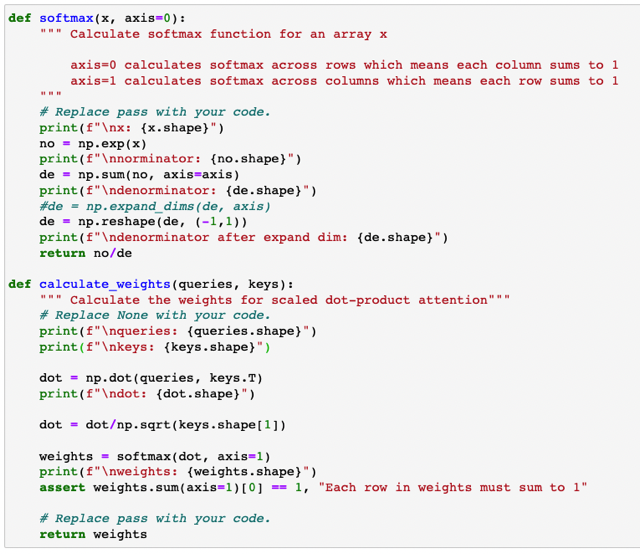</kbd>

     

    
    
<kbd>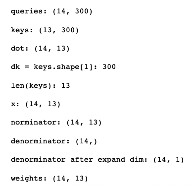</kbd>

    > [!NOTE]
    > Không có gì, chỉ theo công thức mà làm sử dụng np.exp(), np.
    > sum().
    >
    > Riêng chỉ có chú ý là: khi tính Softmax với input là matrix thì **tuỳ
    > vào axis yêu cầu** mà dùng **trong sum(axis) thì không khó hiểu**.
    >
    > Chỉ có điều**tính sum() xong thì nó sẽ thành 1D array**(vì lấy sum
    > theo hàng hoặc cột của matrix thì từ 2D nó thành 1D).
    >
    > Còn **tử số nominator vẫn là 2D sau khi exponential bằng np.exp()**.
    > Và c**hia 2D cho 1D bị lỗi không broadcast được**, nên phải dùng
    > **expand_dim()** hoặc **reshape()** để biến mẫu số về dạng 2D lại.
    >
    > =====
    >
    > Dk là dimension của keys. Chính là chiều dài của vector embedding
    > trong keys. Nên ta phải lấy dimension cuối của tensor, không phải là
    > len(keys)

     

    
    
<kbd>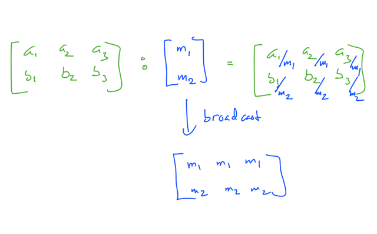</kbd>

     

    
    
<kbd>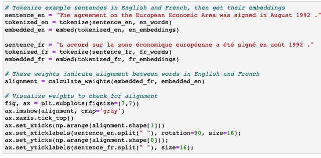</kbd>

     

    
    
<kbd>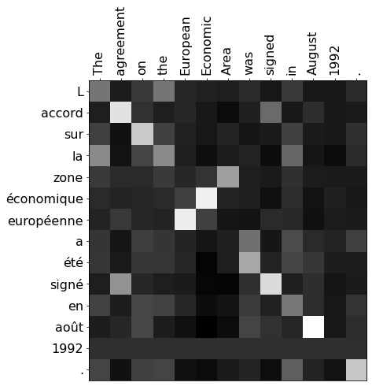</kbd>

    > [!NOTE]
    > Thì đại khái là sau quá trình huấn luyện **nó train được các giá trị
    > embedding vector** của các từ**trong câu tiếng Anh và tiếng Pháp** sao đó
    > khiến **attention weights**- t**hể hiện quan hệ relevant của mỗi từ với các từ
    > khác** **đúng là như ý nghĩa thật của nó**. Kiểu như là từ **économique** đúng
    > là p**hải có attention weight cao cho Economic** (**và ngược lại**)...Mức độ
    > relevant cao giữa các từ được xác định đúng sẽ giúp khi translate từ tiếp
    > theo sẽ chú ý nhiều đến đúng từ có relevant cao.

     

    
    
<kbd>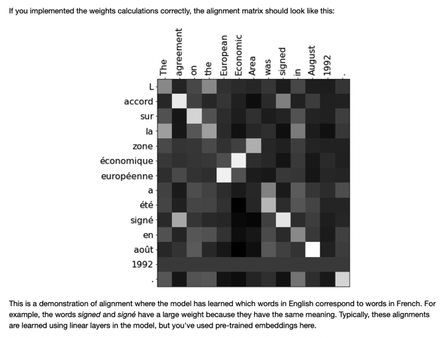</kbd>

     

    
    
<kbd>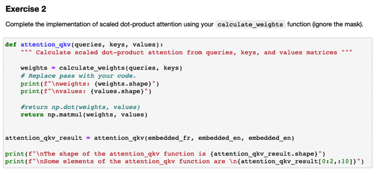</kbd>

     

    
    
<kbd>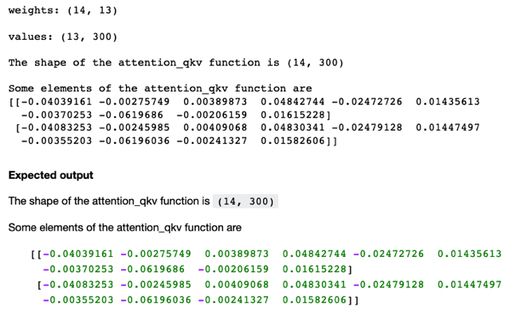</kbd>

     

## Teacher Forcing

 

### 1. Introduction to training a neural machine translation (NMT) system.

> [!NOTE]
> 1. Introduction to training a neural machine translation (NMT) system.
>
> 2. Concepts like **"teacher forcing"** in **NMT** **training** and **its advantages**.
>
> 3. **Training an NMT model** with **attention**, specifically**focusing on teacher
> forcing.**
>
> 4. **Sequence-to-sequence** models generate **translations by using decoder
> outputs as next  inputs.**
>
> 5. In training, **comparing decoder output to target sequence to calculate loss
> (cross entropy).**
>
> 6. **Limitation**: **Early-stage naive model makes wrong predictions**, **leading to
> compounding errors**.
>
> 7. **Solution**: **Use ground truth words as decoder inputs to mitigate early errors**.
>
> 8. **Teacher forcing** method: Using **correct predictions as inputs**, **regardless of
> model errors.**
>
> 9. Teacher forcing makes**training faster and more efficient**.
>
> 10. Variations like **curriculum learning**: **Gradually transitioning from ground
> truth to model outputs.**
>
> 11. Teacher forcing is a technique to**improve NMT training accuracy.**
>
> 12. Importance of adding teacher forcing to the toolbox for better model
> training and accuracy

 

<kbd>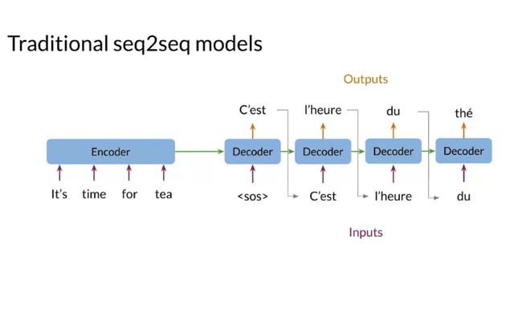</kbd>

> [!NOTE]
> Đại ý là trong **seq2seq** model thì output của Decoder sẽ được **bỏ
> vào thành input của time-step tiếp theo** nên không có định trước
> chiều dài của Decoder output

   

<kbd>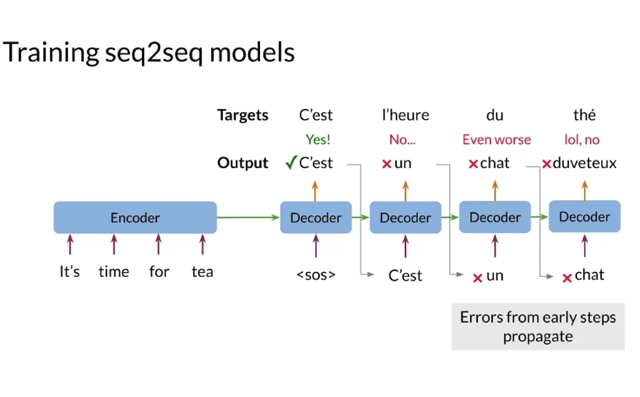</kbd>

> [!NOTE]
> Đại khái là trong quá trình trainni ta phải **so sánh với ground-truth label (ví
> dụ câu dịch đúng) để tính loss**. 
>
> Nhưng ở trường hợp này việc ta
> bỏ predict của time-step trước vào input của time-step sau trong
> qúa trình training **khiến việc training model không hiệu quả**.
>
> Bởi lẽ **ở những time-step đầu tiên** kiểu như model **chưa nắm bắt được 
> thông tin của câu cần dịch** nên nó **predict sai ở time-step trước**.
>
> Điều này khi n**ó càng sai ở những time-step tiếp theo** khiến **loss trở nên
> bị lớn dần qua các time-step.**

   

<kbd>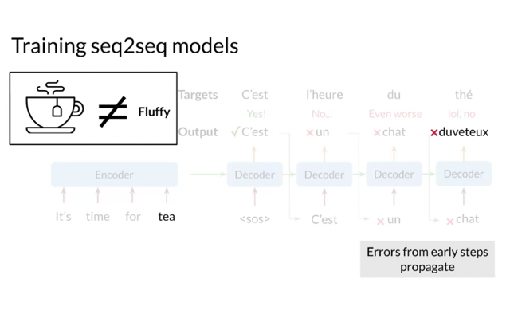</kbd>

> [!NOTE]
> Ví dụ việc predict sai bị cộng dồn khiến ở những time-step sau càng sai
> bạo như predict ra chữ 'duveteux' có nghĩa là Fluffy hoàn toàn chẳng liên
> quan gì tới từ cần dịch đúng là ' tea'
>
> Tức là loss rất lớn

   

<kbd>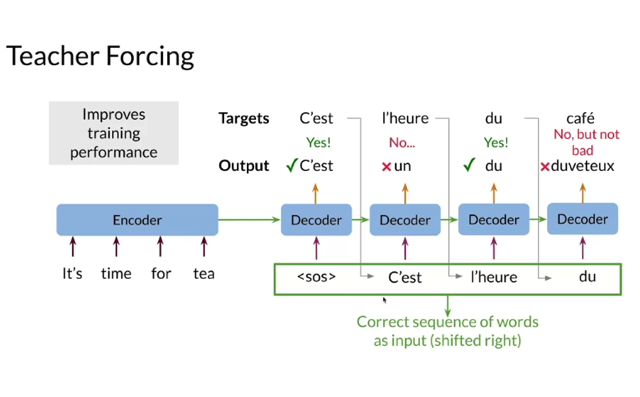</kbd>

> [!NOTE]
> Do đó**teacher forcing** giúp training nhanh và hiệu quả hơn:
>
> Đại khái là **dù tại một time-step nó có predict sai** thì **ở time-step
> tiếp theo vẫn coi như nó predict đúng ở time-step trước.**

   

## (optional) What Is Teacher Forcing?

> [!NOTE]
> (OPTIONAL) WHAT IS TEACHER FORCING?
>
> https://towardsdatascience.com/what-is-teacher-forcing-3da6217fed1c

 

<kbd>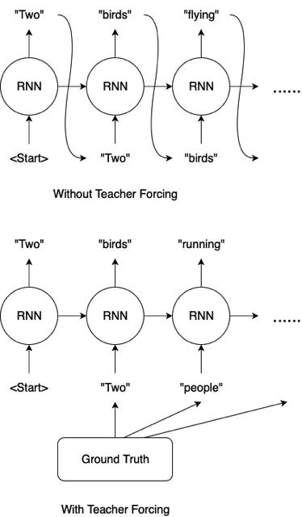</kbd>

> [!NOTE]
> Không có gì khó hiểu, khái niệm này chỉ là **sau khi
> model predict ra một từ tại một time-steps** t thì **dù
> đúng hay sai** (ta so với ground-truth label để tính
> loss tại time-step đó) thì ta **vẫn chỉ lấy từ đúng (g.t label) 
> bỏ vào input của time-step tiếp theo**.
>
> Điều này **giúp error của model không bị tích tụ** và
> lớn dần khiến quá trình học trở nên chậm từ đó **converge
> nhanh hơn**
> Nhưng **nhược điểm** là kiểu như quá trình reference
> thì không có ground truth label nào, nên tất nhiên phải
> feed prediction của model ở time-step trước vào. Điều 
> này kiểu như gây **một sự khác nhau (discrepancy) giữa 
> training và reference khiến model perform kém.**

 

<kbd>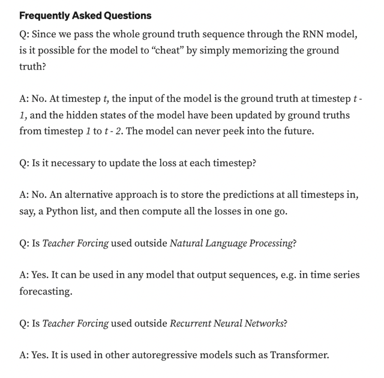</kbd>

 

## NMT Model With Attention

 

### 1. Training a **neural machine translation** system\\* from scratch.

> [!NOTE]
> 1. Training a **neural machine translation** system**from scratch.**
> 2. Overview of the **model architecture** for this week's assignments.
>
> 3. Components of the model: **Encoder, Pre-Attention Decoder, Attention
>  Mechanism, Post-Attention Decoder**. 
>
> 4. **Encoder** transforms **input tokens** into **key** and **value** vectors.
>
> 5. **Pre-Attention Decoder** handles **target tokens** and implements **teacher
>  forcing**.
>
> 6. **Input and target tokens** go through an **Embedding** layer and **LSTMs**.
>
> 7. **Attention layer** uses **query, key, value** vectors and a **padding mask.**
>
> 8. **Context vector**and **mask** are output from the attention layer.
>
> 9. **Decoder processes context vectors through LSTM, dense layer, and LogSoftmax**.
>
> 10. Model returns**log probabilities** and c**opy of target tokens.**
>
> 11. Computation in encoder and pre-attention decoder can be **parallelized**.
>
> 12. Overview of the entire process and how components interact.
>
> 13. Intuition behind the architecture and steps explained.
>
> 14. More details will be covered in programming assignments.
>
> 15. Next video will focus on evaluating the system.

 

<kbd>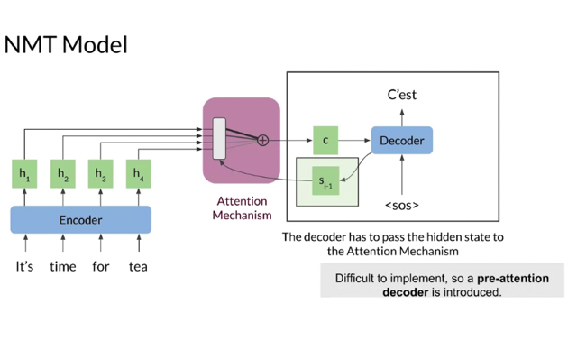</kbd>

> [!NOTE]
> Đại khái là:  Như đã biết trong các bài trước, trong bài toán **machine
> translation**. Encoder sẽ**pass các hidden states ở mọi time-steps**, và
> **Decoder cũng pass previous hidden state** vào **Attention mechanism**
> để tính ra **Context vector** chứa những **thông tin hữu ích giúp Decoder
> generate từ tiếp theo.**
>
> Tuy nhiên việc **pass previous hidden state của Decoder vào Attention
> mechanism không dễ** (ý nói cách làm). Do đó người ta chia làm hai bước
> **Pre Attention Decoder** và **Post Attention Decoder**

   

<kbd>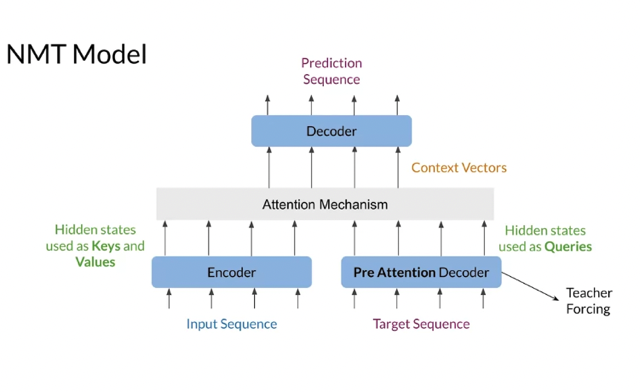</kbd>

> [!NOTE]
> **Encoder's hidden-states** sẽ đóng vai trò là **Keys và Values**.
> **Pre Attention Decoder's hidden-states** sẽ đóng vai trò là 
> **Queries**.
>
> **Attention mechanism** tính ra **Context vector** và pass qua
> **Post Attention Decoder** để make prediction.

> [!NOTE]
> Teacher Forcing trong Pre-Attention
> Decoder là ntn chưa hiểu lắm

   

<kbd>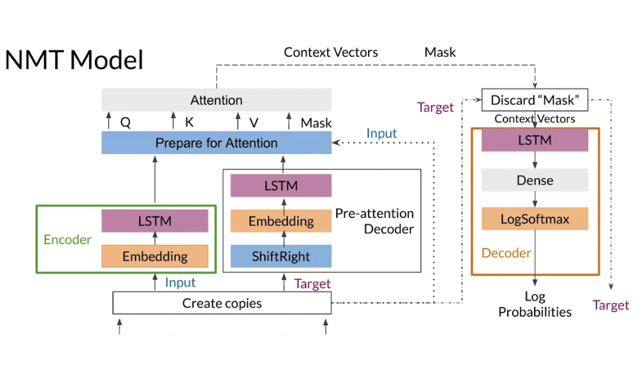</kbd>

> [!NOTE]
> Bước đầu tiên là "**Create copy**" component nơi một bản copy của
> **input** sẽ được **pass vào Encoder**, một bản **copy của Target** (ground
> Truth label) được **pass vào Decoder**.
>
> Trong Encoder, input tất nhiên cũng là dạng **padded index** của từ trong
>  vocab sẽ **qua Embedding layer để "biến thành" word embedding vectors**.
> Tiếp sau đó bỏ embedding **vào LSTM** và **output (hidden-state) tại mọi 
> time-step của LSTM** được pass vào "Prepare for Attention" component.
>
> Ở phía **Pre Attention Decoder**, **target** tất nhiên cũng là dạng **padded index**
> - ý là các câu được chuyển thành list các index của từ và zeros padded
> để có cùng length.
>
> Thì nó sẽ **ShiftRight** không có gì khó hiểu chính là **chèn một None token
> vào trước**(như trong DLSpec P.A Dinosaur name generator).
> Tiếp sau đó tương tự cũng là**Embedding**layer để biến (hay map) token
> index thành embedding vector, rồi **LSTM**.
>
> Cái bước **LSTM** ở cả Encoder và Decoder đều g**iúp tạo ra các hidden state
> tại các time-step** mang trong mình những **thông tin ngữ nghĩa quan hệ giữa
> các từ trong câu**.
>
> Tới **Prepare for Attention**, thì như đã nói **Encoder's hidden states** sẽ được chuyển
> thành dạng **Keys** và **Values**còn **Pre Attention Decoder's hidden state** sẽ là **Queries**.
> (nếu như giống trong Transformer thì nó chính là 3 Linear layer với weight WQ, WK, WV)
>
> *Như vậy có thể hiểu là Keys, Values hay Queries đều là những tensor có cùng
> shape là **(None - hay batch, max_len, hidden state vector dimension)** 
> Ở tại đây, nó sẽ **dùng một mask function để tạo padding mask** **giúp attention layer
> biết được cái nào là padding token** để mà ignore chúng đi. Để làm vậy thì ở
> cần phải có một bản **copy của input.**
>
> Tới đây ta sẽ bỏ**K, Q, V và mask vào Attention layer**. Như đã biết nó sẽ**tính ra
> Context vector** chứa thông tin ngữ nghĩa sao đó mà **mỗi từ sẽ quan tâm nhiều ít
> đến các từ khác nhau**. 
>
> **Context vector**sẽ được **bỏ cái Mask đi** trước khi **pass vào Post Attention Decoder.**
> Rồi qua **LSTM**, **Dense** và output với **LogSoftmax** để ra **log probabilities - cho từ tiếp
> theo của Decoder output**

   

## Bleu Score

 

### 1. **Importance of **Model Assessmen**t**: After**building and training a machine translation model**, it's

> [!NOTE]
> 1. **Importance of **Model Assessmen**t**: After**building and training a machine translation model**, it's
> crucial to **assess its performance**using **appropriate metrics**.
>
> 2. **BLEU Score and Its Purpose**: The **BLEU Score** (**Bilingual Evaluation Understudy**) is a metric
> **specifically designed for evaluating machine translation models**. It addresses challenging issues in
> NLP, such as **machine translation quality**.
>
> 3. **BLEU Score Calculation**: The BLEU Score **compares a candidate translation to one or more
> reference translations**. It **quantifies the quality of the candidate** by measuring the **precision of its
> n-grams** (e.g., unigrams) that**match those in the references**.
>
> 4. **Scoring Interpretation**: The BLEU Score **ranges from 0 (worst) to 1 (best)**. Higher scores
> indicate better model performance in terms of translation quality.
>
> 5. **Issues with **Vanilla BLEU** Score**: The **vanilla BLEU Score** **has limitations**. It can **give high
> scores to models that generate common words and phrases**, even if the translation is far from the
> reference.
>
> 6. ****Modified BLEU** Score Approach**: A modified version of the BLEU Score addresses some
> issues. It **exhausts matching words in the references as they are encountered** in the candidate
> translation, resulting in a**more reasonable evaluation.**
>
> 7. ****Limitations** of BLEU Score**: The BLEU Score has drawbacks. It d**oesn't account for semantic
> meaning** or **sentence structure**, which can**lead to misleading scores** in cases where the translation
> doesn't accurately capture these aspects.
>
> 8. ****Widely Adopted Metric****: Despite its limitations, the BLEU Score **remains a widely used
> evaluation metric**for machine translation models.
>
> 9. **Awareness Needed**: Users s**hould be aware of the caveats of the BLEU Score** before relying
> solely on it for evaluating machine translation performance.
>
> 10. **Upcoming Metric**: The text mentions that **there's another metric** to be discussed in a
> following video, which could provide a **better estimate of model performance**.
>
> Overall, the text introduces the BLEU Score as a **common metric** for **evaluating machine translation**
> models, **explains its calculation**, **discusses its limitations**, and emphasizes the importance of
> **considering its drawbacks** when **interpreting model performance.** It also hints at the introduction of
> an alternative metric for evaluation.

 

<kbd>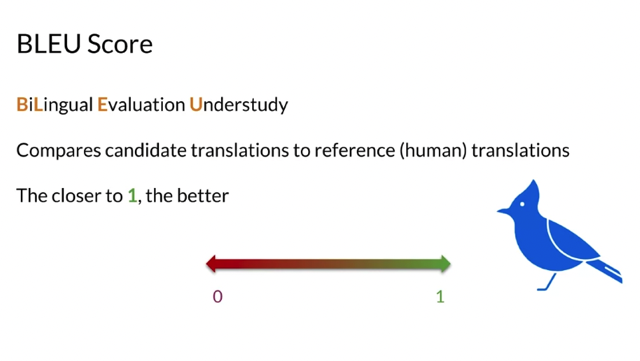</kbd>

> [!NOTE]
> Chỉ số **BLEU score** được tạo ra để **đánh giá các language
> model như Neural Machine Translation** giúp **so sánh các
> Model khác nhau**
>
> Chỉ số **càng gần 1 thì là càng tốt.**

   

<kbd>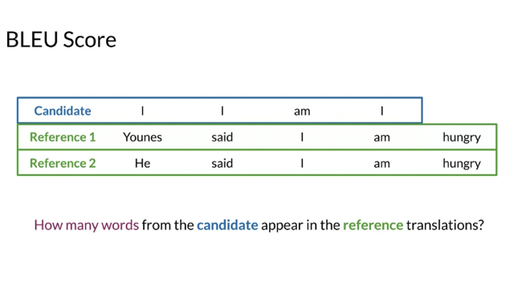</kbd>

> [!NOTE]
> Để tính BLEU score, ta sẽ**tính số lần một từ trong Candidate**
> **xuất hiện trong bất cứ câu reference nào**, **chia cho tổng số từ**
> trong candidate

   

<kbd>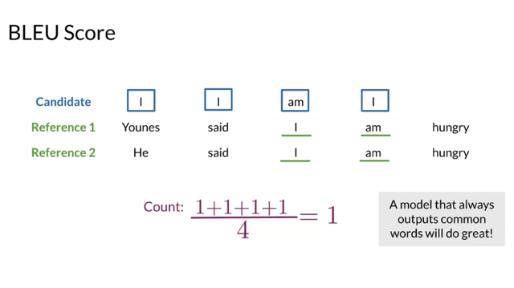</kbd>

> [!NOTE]
> Thử tính với một câu **candidate rất tệ** này: 
>
> Ta sẽ **loop qua các từ** trong candidate, và **check xem từ đó có nằm trong
> Reference** hay không, **có thì tính 1.**
>
> Như đã nói các từ 'I' và 'am' trong candidate đều xuất hiện trong một trong
> hai câu Reference thành ra ta có 4. Tổng số từ trong candidate là 4.
> Ta tính được BLEU score là 1. 
>
> Cho thấy n**ếu dùng vanilla BLEU score** như thế này thì **một model chỉ
> generate các từ chung chung** sẽ có **xu hướng đạt BLEU score rất cao**.
> Điều này rõ ràng không ổn

   

<kbd>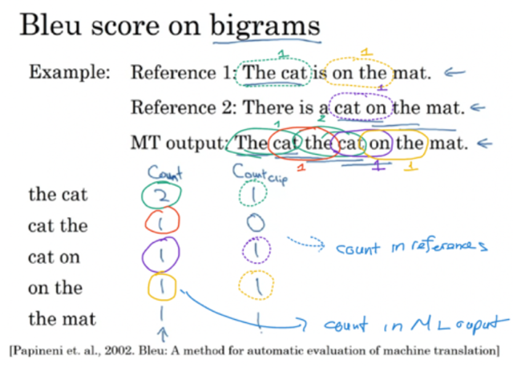</kbd>

<kbd></kbd>

<kbd>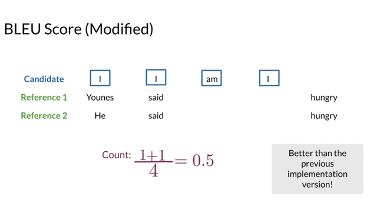</kbd>

> [!NOTE]
> Đại khái là ta sẽ **tính BLEU score theo kiểu khác một chút**, đó là ví dụ
>  \_**sau khi từ I đã được "cộng 1" thì ta sẽ delete các từ "I" có trong reference**\_
> để **từ I tiếp theo trong candidate sẽ không được tính.**
>
> Với cách này BL**EU score là 0.5 phản ánh đúng hơn chất lượng của candidate**

> [!NOTE]
> Trong DLSpec thì gọi là **clipped count**, ý nghĩa cũng tương tự. 
>
> Ví dụ cái câu dù câu **candidate có 2 lần 'the cat' - và bi-gram này có xuất
> hiện trong câu ref nhưng thay vì cộng 2 điểm thì chỉ được 1** thì cái này
> cũng như là sau khi +1 thì remove 'the cat' khỏi ref để  lần 'the cat' thứ 2
> của candidate sẽ không được + nữa.

   

<kbd>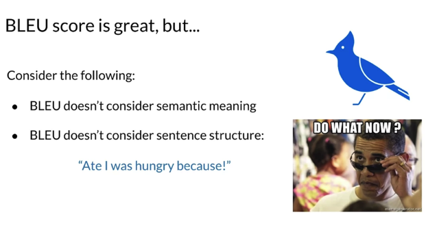</kbd>

> [!NOTE]
> Đại khái là dù nó tốt nhưng vẫn có những **điểm yếu** đó là nó không đếm xỉa đến
> **Semantic meaning** và **sentence structure.**

   

## Lab: Bleu Score

 

### In this ungraded lab, we will implement a popular metric for

> [!NOTE]
> In this ungraded lab, we will implement a popular metric for
> evaluating the quality of machine-translated text: **the BLEU
> score**proposed by **Kishore Papineni**, et al. in their 2002 paper "
> **BLEU: a Method for Automatic Evaluation of Machine
> Translation**", the BLEU score works by **comparing " candidate"
> text to one or more "reference" translations**. The result is better
> the closer the **score is to 1**. Let's see how to get this value in the
> following sections

 

- 1.1 Importing the Libraries
   

    
    
<kbd>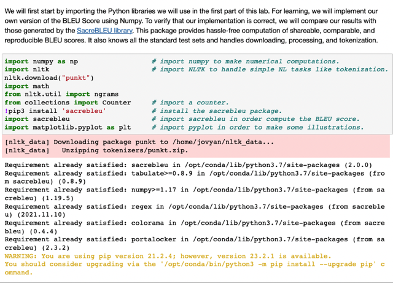</kbd>

    > [!NOTE]
    > Đại khái là trong lab này ta sẽ **tự làm
    > function tính BLEU score**. Và so sánh với
    > kết quả từ **SarceBLEU lib**.

     

- 1.2 Defining the BLEU Score
   

    
    
<kbd>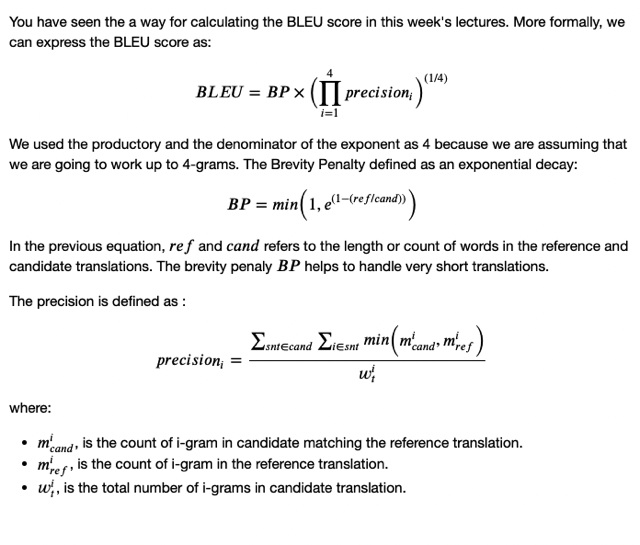</kbd>

    > [!NOTE]
    > Không khó hiểu. **precision_i** là các chỉ số precision (tính như trong bài, đó
    > là **loop qua các từ trong câu candidate**, nếu t**ừ của nó có trong
    > references thì + 1**, l**oại bỏ từ này ra khỏi references.** Cuối cùng chia cho
    > số từ trong candidate.
    >
    > Thì với **i = 1** thì là ta check từ đơn - **unigram**) ta có precision_1 hay p1
    >
    > **Tính thêm với i = 2,3,4** - khi tính **dùng bi-gram, 3-gram và 4-gram**. Để
    > được**p2, p3, p4.**
    >
    > Nhân lại **p1*p2*p3*p4** và l**ấy luỹ thừa 1/4** (căn bậc 4) và nhân thêm với
    > **BP** - là term có mục đích **ngăn model ăn gian chỉ tạo câu ngắn để được
    > điểm cao**

     

- 1.3 Explaining the BLEU score
   

    
    
<kbd>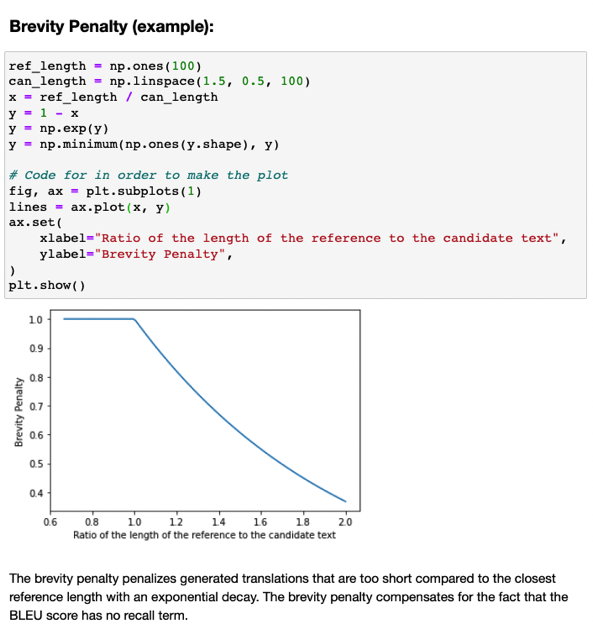</kbd>

    > [!NOTE]
    > Đại khái là **cho chiều dài của Ref fix = 1**. Và **Candidate's length giảm dần
    > từ 1.5 về 0.5** Ta thấy khi **câu candidate càng ngắn so với reference**,
    > **Brevity Penalty càng nhỏ** lại **khiến BLEU score cũng nhỏ lại** 
    >
    > hiểu nôm na là**án phạt dành cho câu ngắn** - tức là nó có**mục đích là ngăn
    > xu hướng tạo câu ngắn để đạt BLEU score cao của model**

     

    
    
<kbd></kbd>

    
<kbd></kbd>

    
<kbd>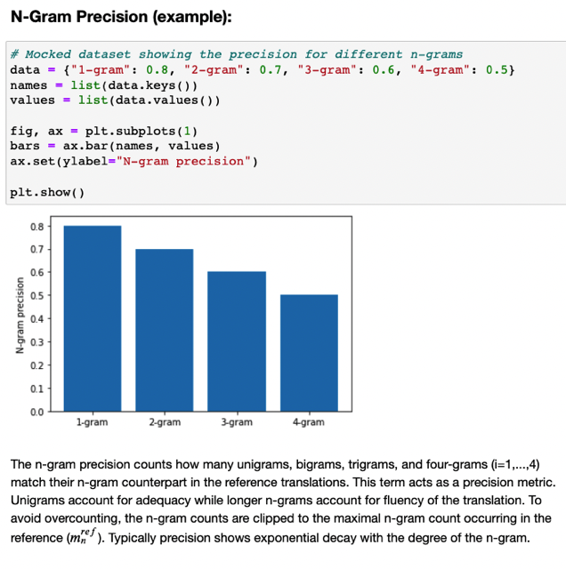</kbd>

    > [!NOTE]
    > Đại khái là **n càng tăng thì precision giảm theo exponentially**. họ nói **"
    > the n-gram \_count are clipped.\_.."** thì không có gì, **nó chính là cái vụ khi
    > tính + 1** cho một n-gram của candidate mà có xuất hiện trong references
    > rồi thì remove nó khỏi reference hay nói như DLSpec là chỉ tính lấy 1 lần
    > xuất hiện thôi.
    >
    > Ví dụ cái câu dù câu **candidate có 2 lần 'the cat' - và bi-gram này có xuất
    > hiện trong câu ref nhưng thay vì cộng 2 điểm thì chỉ được 1** thì cái này
    > cũng như là sau khi +1 thì remove 'the cat' khỏi ref để  lần 'the cat' thứ 2
    > của candidate sẽ không được + nữa.

     

    
    
<kbd>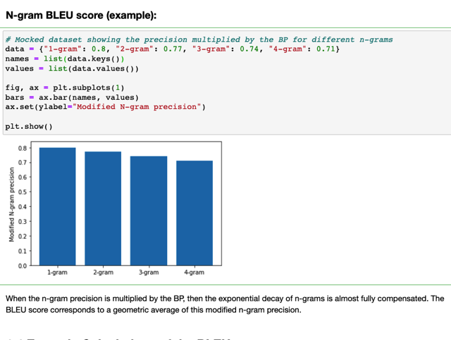</kbd>

    > [!NOTE]
    > Đại khái là **với BP thì hiện tượng precision giảm dần** khi **n
    > tăng lên được đền bù** (bù lại - compensate) nên **nó không
    > giảm exponentially nữa (ý là giảm nhanh)**

     

- 1.4 Example Calculations of the BLEU score
   

    
    
<kbd>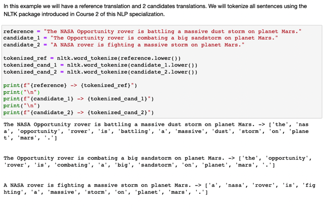</kbd>

    > [!NOTE]
    > Đại khái là ví dụ tính thử BLEU score với candidate và 2
    > câu reference như vầy. Trước hết ta dùng NLTK lib để
    > tokenize - tách thành list các từ

     

    
    
<kbd>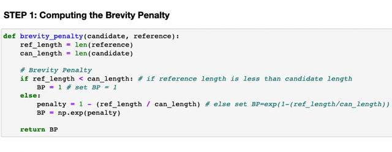</kbd>

    > [!NOTE]
    > Bước 1 đại khái là viết fucntion
    > tính BP với candidate và
    > reference. Theo công thức thôi.

     

    
    
<kbd>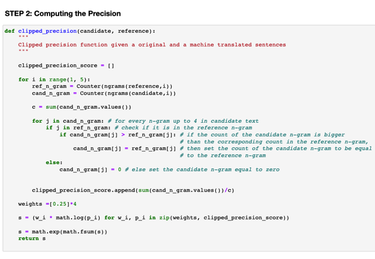</kbd>

    > [!NOTE]
    > Function tính precision, cơ bản là ta sẽ chỉ tính p1,p2,p3, p4. (nên chỉ
    > loop range (1,5) - nhớ lại python nó không tính số 5).
    >
    > Cách làm thì ta sẽ dùng cái Counter (đã gặp trong Course 2) để lấy và
    > đếm các n-gram trong candidate và reference.
    >
    > Loop trong các candidate n-gram check xem nó có trong  reference
    > n-grams list không thì đếm: Và đếm thì chỉ tính bằng max số lần của
    > n-gram đó xuất hiện trong reference thôi. Ví dụ trong candidate có 3,
    > mà trong ref có 2 thì chỉ tính 2. (Nhắc lại đây chính là cái vụ "clipped
    > count" hay "tính rồi remove"
    >
    > Theo công thức tính ra precision. Chưa hiểu cái vụ tính log và exp ở
    > dưới

     

    
    
<kbd>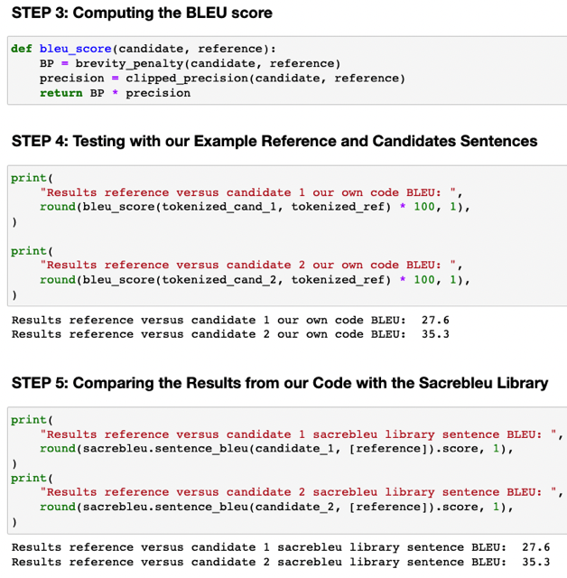</kbd>

     

- BLEU computation on a corpus
   

    
    
<kbd>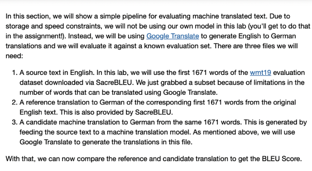</kbd>

     

    
    
<kbd>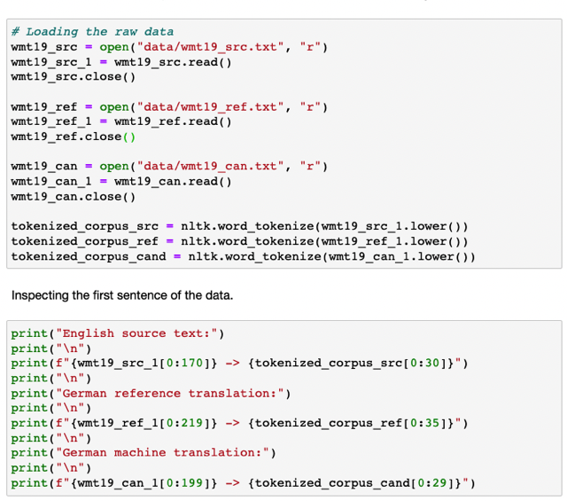</kbd>

     

    
    
<kbd>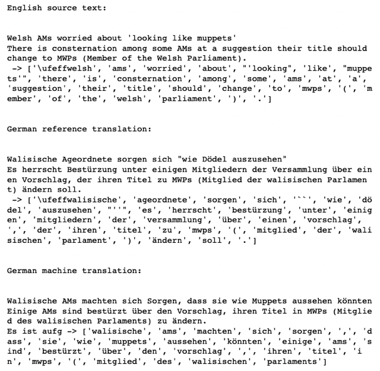</kbd>

     

    
    
<kbd>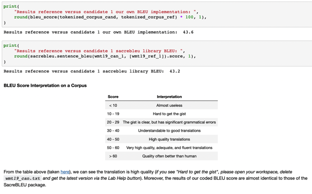</kbd>

    > [!NOTE]
    > Tính thử

     

## Rouge-n Score

 

### The main ideas from this portion of the lecture are:

> [!NOTE]
> The main ideas from this portion of the lecture are:
>
> 1. **Introduction to **ROUGE Score****: The lecture introduces the **ROUGE score** as an
> **alternative performance metric to BLEU** for **evaluating machine translation** systems. It
> **emphasizes that ROUGE is recall-oriented**, focusing on the **presence of human references
> in candidate translations.**
>
> 2. **ROUGE-N Metric**: Among various versions of the ROUGE score, the lecture
> highlights **ROUGE-N,** which involves **counting n-gram overlaps between candidates and
> reference translations**, similar to BLEU.
>
> 3. **Basic ROUGE-N Calculation**: The basic ROUGE-N calculation involves**counting
> word matches between candidate and reference translations** and **dividing by the number of
> words in the reference**. The process is illustrated through an example.
>
> 4. **Comparison with BLEU**: The lectur**e contrasts ROUGE-N's recall-oriented nature
> with BLEU's precision-oriented approach**, and suggests **combining both metrics** to get an
> **F1 score** for a**more comprehensive evaluation**.
>
> 5. **F1 Score Calculation**: The F1 score is explained as **a combination of precision and
> recall,** with formulas presented using **modified BLEU and ROUGE-N scores**. An example
> calculation is shown, resulting in an F1 score.
>
> 6. **Considerations**: While BLEU and ROUGE-N are **commonly reported metrics**, it's
> noted that they **do not account for sentence structure and semantics**, **only focusing on
> n-gram matching** between candidates and references.
>
> 7. **Evaluation Metrics**: The lecture **emphasizes the use of modified BLEU, ROUGE-N,
> and F1 score for evaluating machine translation models**. It's highlighted that**F1 scores can
> offer a better assessment of model performance** in some cases.
>
> 8. **Limitations**: The lecture concludes by reminding the audience that current evaluation
> metrics d**o not encompass sentence structure and semantics**, indicating a**potential for
> further refinemen**t in the evaluation process.
>
> Overall, this section of the lecture explains the ROUGE score, introduces its recall-oriented
> nature, demonstrates how ROUGE-N is calculated, suggests combining it with BLEU for
> an F1 score, and discusses the limitations of existing evaluation metrics in capturing all
> aspects of translation quality.

 

<kbd>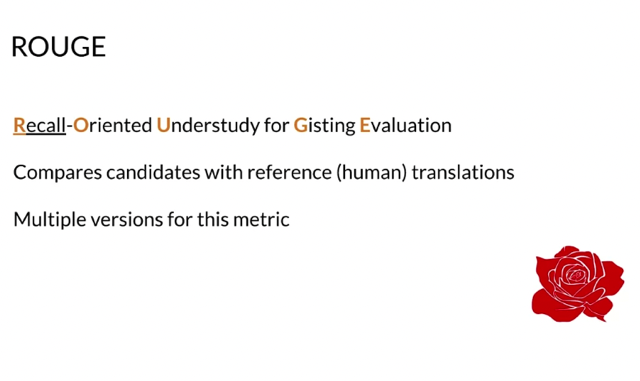</kbd>

> [!NOTE]
> 1. **Introduction to **ROUGE** Score**: The lecture introduces the ROUGE score as**another
> evaluation metric for assessing the quality of machine translation systems**. It's presented
> as an **alternative to the BLEU score**.
>
> 2. **ROUGE Acronym and Focus**: ROUGE stands for "**Recall-Oriented Understudy of
> Gisting Evaluation**." The acronym emphasizes that ROUGE is **recall-oriented**, which
> means it\_**emphasizes the presence of human-created references in candidate translations**\_.
>
> 3. ****Contrast with BLEU****: **ROUGE's focus on recall is contrasted with BLEU's
> precision-oriented nature**, which measures **how many words from candidate translations
> match the references**.
>
> 4. ****Purpose of ROUGE****: Originally developed to **assess the quality of
> machine-summarized texts**, ROUGE is also **applicable for evaluating machine translation**
> quality by**comparing candidate translations against reference translations created by
> humans**.
>
> 5. ****ROUGE-N****: Among the different versions of the ROUGE score, the lecture
> specifically mentions ROUGE-N. This involves **counting the overlaps of n-grams between
> candidate and reference translations**, similar to how n-gram overlaps are counted for
> BLEU.
>
> 6. **Example**: The lecture mentions demonstrating how ROUGE-N works with uni-grams,
> suggesting that an example will be provided to illustrate the metric's application.
>
> Overall, this section of the lecture **explains the ROUGE score** as an **evaluation metric**, its
> \_**focus on recall**\_, its application to machine translation assessment, and its **similarity to
> BLEU in terms of counting n-gram overlaps**. The example mentioned indicates that the
> lecture will likely provide a practical illustration of how ROUGE-N functions.

> [!NOTE]
> Đại khái là **ROUGE** này **nhấn mạnh vào Recall** tức là nhấn mạnh
> vào việc c**ó bao nhiêu từ trong câu chuẩn reference** **xuất hiện trong
> candidate**
>
> (ngược lại với **BLEU score - nhấn mạnh vào Precision là có bao nhiêu
> từ trong candidate xuất hiện trong reference**).
>
> Cũng sẽ được tính bằng cách **đếm các n-gram overlap với reference**
> (là câu dịch do human tạo ra).

   

<kbd>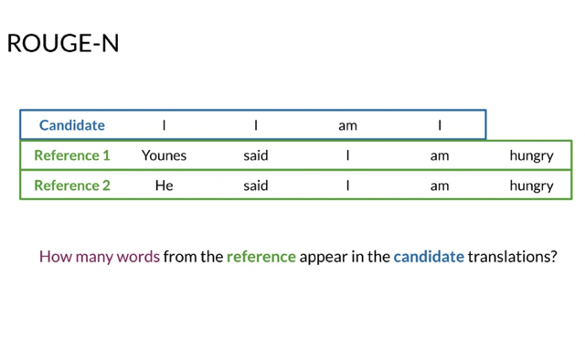</kbd>

> [!NOTE]
> To see the difference between the two metrics, I'll show You an example of how
> ROUGE-N works with uni-grams. To get the basic version of the ROUGE-N score
> based only on recall so you must **count word matches between the reference and the
> candidates**, and **divide by the number of words in the reference**. If you **had multiple
> references**, you would need to **get a ROUGE-N score using each reference** and **get
> the maximum**. Now, let's go through the example that you already solved for the
> BLEU score. Your candidate has the words I two times, the word M, and the word I
> again, for a total of four words. You also have a reference translation. Younes said, "I
> am hungry" and another slightly different reference

> [!NOTE]
> Sơ lược là ta sẽ **đếm số từ** (đang tính uni-gram trước nên đếm single
> word) trong**xuất hiện trong cả candidate và reference** rồi**chia cho tổng
> số từ của reference**. Nếu có nhiều reference thì **tính cho mỗi reference
> rồi lấy max**

   

<kbd>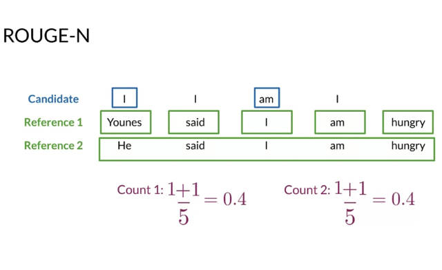</kbd>

> [!NOTE]
> Với loop trong ref 1, và check từ của ref 1 nếu có xuất hiện
> trong candidate thì + 1. Kết quả = 2. Chia cho tổng số từ
> trong ref 1 = 5. Ta có 0.4. Làm tương tự với ref 2 cũng ra 0.4
> nên lấy max cũng là 0.4

   

<kbd>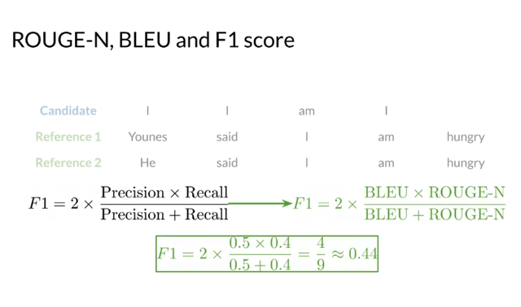</kbd>

> [!NOTE]
> Đại khái là**ROUGE score có thể coi như Recall** và với **BLEU score tương
> đương Precision** thì ta có thể **kết hợp để tính F1-score**. Tuy nhiên luôn phải nhớ
> rằng cả hai chỉ số này đều **chỉ quan tâm đến số lần matching của n-gram** trong
> candidate với reference k**hông tính đến semantic meaning và word order** nên có
> những **hạn chế nhất định**

   

## Sampling And Decoding

 

### The main ideas from this part of the lecture are:

> [!NOTE]
> The main ideas from this part of the lecture are:
>
> 1. **Introduction to **Decoding Methods****: The lecture introduces**two approach**es for
> constructing sentences using a sequence-to-sequence (seq2seq) model: **greedy
> decoding** and **random sampling**. It highlights the advantages and drawbacks of each
> method.
>
> 2. ****Greedy Decoding****: Greedy decoding involves **selecting the most probable word** at
> each step of decoding. However, this simple approach can**lead to repetitive or
> nonsensical sequences,** especially for l**onger outputs.**
>
> 3. ****Random Sampling****: Random sampling **assigns probabilities to words and samples
> accordingly** for the next outputs. This approach can**introduce randomness but might
> produce overly unpredictable results**.
>
> 4. ****Temperature** Parameter**: Temperature is introduced as a parameter that**controls the
> level of randomness in predictions**. A **lower value** makes predictions**more deterministic
> and cautious**, while a **higher value** increases e**xcitement and randomness.**
>
> 5. **Adjusting Temperature**: Lower temperature values lead to safer, more confident
> predictions, while higher values introduce more randomness and excitement but may
> result in more mistakes.
>
> 6. **T**rade-off**s**: The lecture acknowledges that the introduced methods for sampling and
> decoding, while providing sentence construction, may not always yield convincing
> outputs. It sets the stage for discussing more advanced methods in the following videos.
>
> Overall, this section of the lecture outlines the concepts of greedy decoding and random
> sampling, introduces the temperature parameter, and highlights the trade-offs between
> safety and randomness in generating sentence predictions using a seq2seq model.

 

<kbd>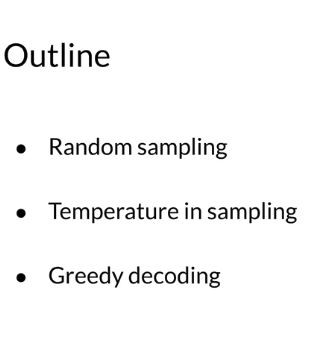</kbd>

   

<kbd>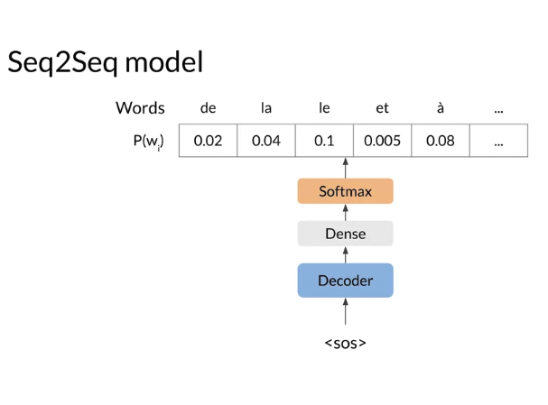</kbd>

> [!NOTE]
> First, a quick reminder on how a **seq2seq** model predicts words. The **output of
> the decoder** is produced from a dense layer and a **softmax** or **log softmax**
> operation. The output at each step then is the **probability distribution over all
> the words and symbols in the target vocabulary**. The final output of the model
> **depends on how you choose the words using these probability distributions at
> each step**.

> [!NOTE]
> Đại khái như đã qúa hiểu, **output tại mỗi time-step** của Decoder là
> một **probability distribution cover tất cả các từ và symbol trong bộ
> vocab**. Và "kết luận" hay từ **được chọn** có thể là **từ có p cao nhất**cũng có thể là r**andom with distribution** như ta đã làm trong bài toán
> **Dinosaur name.**

   

<kbd>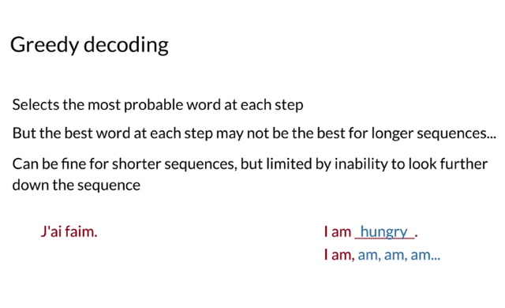</kbd>

> [!NOTE]
> Greedy decoding is the **simplest** way to decode the model's predictions as it
> selects the **most probable word** at every step. However, this approach has
> **limitations**. When you consider the highest probability for each prediction and
> concatenate all predicted tokens for the output sequence. As the greedy
> decoder does, you can end up with a situation where the output instead of, "I
> am hungry," gives you "I am, am, am" and so forth. You can see how this could
> be a problem, but not in all cases. F**or shorter sequences, it's going to be fine.**
> But if you have many other words to consider, then knowing what's coming up
> next might help you better predict the next sequence

> [!NOTE]
> Với **Greedy decoding**, ta **chỉ chọn từ có p cao nhất** ở mỗi
> time-step. Có điều như ở đây nói nó **có thể dẫn đến kết quả
> không phải là tốt nhất đối với các sequence dài.**

   

<kbd>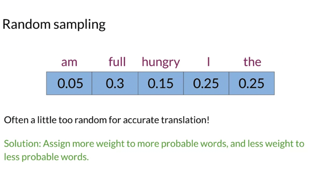</kbd>

> [!NOTE]
> Another option is known as r**andom sampling**. What random sampling does is it
> **provides probabilities for each word and sample accordingly for the next outputs**. One
> of the problems with this is that it **could be a little bit too random**. A solution for this is
> to **assign more weight to the words with higher probabilities and less weight to the
> others.**

> [!NOTE]
> Với **Random sampling**, như vấn đề Dinosaur đã biết ta sẽ **lấy
> random with distribution thay vì là từ có p cao nhất**. Cách này có
> **ưu điểm là câu trả lời linh hoạt hơn, đa dạng hơn**, nhưng **có
> thể trở nên qúa random**. Do đó người ta có thể **gán weight cao
> hơn cho p cao, thấp hơn cho p thấp để kiểm soát**

   

<kbd>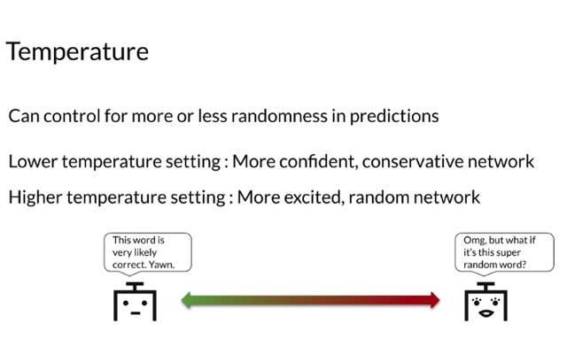</kbd>

> [!NOTE]
> In sampling, **temperature** is a **parameter** you can adjust to **allow for more or less
> randomness** in your predictions. It's measured on a **scale of 0-1**, indicating **low to high
> randomness**. Let's say you need your model to make **careful, safe decisions** about what
> to output. Then set you're **parameter lower** and get the prediction **equivalent of a very
> confident but rather a boring** person seated next to you at a dinner table. If you feel like
> taking more of a gamble, set your **temperature a bit higher**. This has the effect of **making
> your network more excited**. You may get some **pretty fun prediction**s. On the other hand,
> there will be probably **a lot more mistakes.**

> [!NOTE]
> Đại khái là một **hyperparams** **điều chỉnh độ randomness** như
> cũng đã học bên **LLM course**. Khi**set value cao ~=1** thì nó
> kiểu như **random hơn, từ đó cho nhiều prediction đa dạng hơn**
> nhưng cũng**nhiều error hơn**. Ngược lại**, random thấp** sẽ cho
> những **câu trả lời an toàn hơn nhưng cũng ít đa dạng hơn.**

   

## Beam Search

 

### 1. **Beam Search Technique**: Beam search is used to **identify best sequences** within a

> [!NOTE]
> 1. **Beam Search Technique**: Beam search is used to **identify best sequences** within a
> **fixed window size**, referred to as the **"beam width."**
>
> 2. ****Optimal Sequences****: Unlike **selecting the highest probability output** at each time
> step, beam search **aims to find sequences with better overall probabilities**.
>
> 3. ****Calculating Sequence Probabilities****: Beam search involves **computing probabilities
> for potential sequences** based on **previous outputs.**
>
> 4. ****Beam Width****: To **manage computational complexity**, a beam width (B) is set to **limit
> the number of sequences** **considered** at each step.
>
> 5. ****Conditional Probabilities****: At each step,**conditional probabilities of words are
> calculated** given the sequences kept so far (based on beam width).
>
> 6. ****Iterative Process****: The process **continues iteratively**, **generating new words** and
> **updating probabilities**.
>
> 7. ****Memory and Computational Cost****: Beam search can be **memory-intensive** and
> **computationally costly** due to **multiple calculations and sequence storage**.
>
> 8. ****Penalizing Longer Sequences****: Vanilla beam search can **penalize longer sequences**
> due to the **multiplication of conditional probabilities**.
>
> 9. ****Effective Tool****: Despite its limitations, beam search is a **widely used technique** with
> practical value.
>
> 10. **Next Steps**: In the upcoming video, a different technique known as **Minimum
> Bayes Risk (NBR)** will be introduced as another valuable tool.

 

<kbd>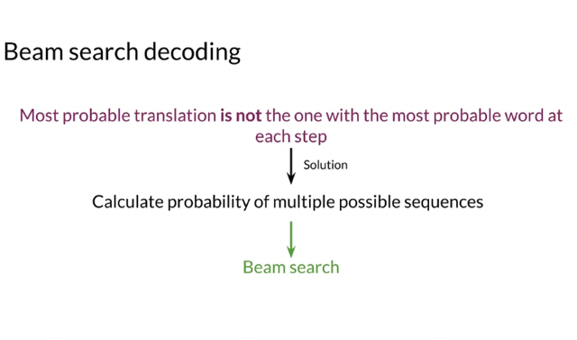</kbd>

> [!NOTE]
> Đại khái là việc c**họn từ có p cao nhất ở mỗi time-step** **chưa chắc đã
> tạo thành từ câu tốt nhất -** c**ó probability cao nhất.**
>
> Nếu có nhiều computational expense, có thể **thử tất cả và chọn câu
> có probability cao nhất.**

   

<kbd>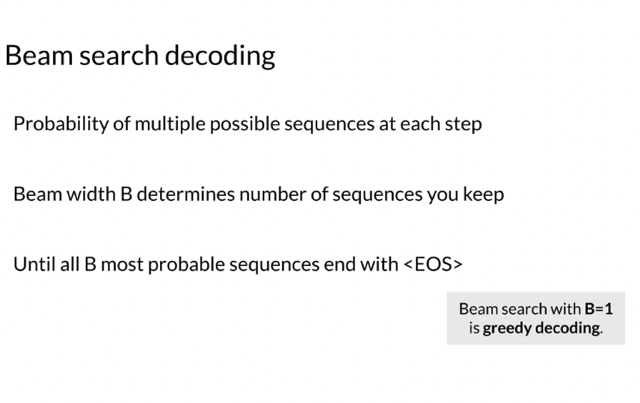</kbd>

> [!NOTE]
> Đại khái là **tại mỗi time-steps** ta sẽ **tính probability của mọi
> potential sequence**.
>
> Nhớ lại việc tính probability của sequence đã biết qua course 2. Tuy
> nhiên bởi vì ta k**hông thể đủ compute expense** nên sẽ **chỉ giữ
> vài cái sequence có p cao nhất thôi**. Đó là hyperparam gọi là.
> **Beam width**.
>
> Làm cho đến khi **câu có probability cao nhất end với <EOS>**

   

<kbd>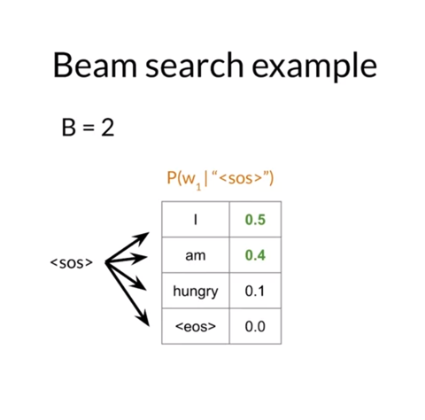</kbd>

> [!NOTE]
> Đại khái là time-step 1 model predict như vầy, **thay vì chọn từ
> có P cao nhất là "I"**, với beam search ta sẽ **chọn top B từ có
> p cao nhất**.
>
> Ở đây B = 2 nên ta chọn I, và am. Bỏ những từ kia và tính
> **P(sequence) của 2 chuỗi: <SOS> I**và**<SOS> am**

   

<kbd>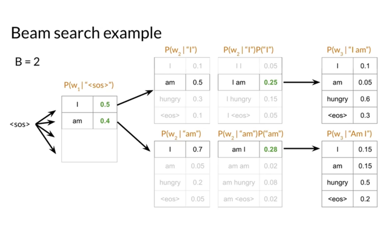</kbd>

> [!NOTE]
> Với từ "I" ở time-step 1, model predict từ time-step 2 như vầy.
> Thì có từ 'am' là có p cao nhất, và P của chuỗi (I am) là 0.25.
>
> Ở nhánh kia (với từ "am" ở time-step 1), thì model predict như
> bên dưới.  Thì từ "I" có P cao nhất và P của chuỗi (I I) là 0.28.
>
> Nhận xét đương nhiên chuỗi "I am" và "I I" là hai chuỗi có P cao
> nhất **của mỗi nhánh** tuy nhiên **chưa chắc chúng là hai chuỗi
> có P  lớn nhất trong toàn bộ.**
>
> Ví dụ giả sử trong nhánh trên "I hungry" có P cao hơn P của
> chuỗi "am I" của nhánh dưới thì ta sẽ **bỏ chuỗi "am I"**, và cho đi
> **tiếp 2 chuỗi I am và I hungry của nhánh trên.**
>
> Và vì B = 2 nên ta bỏ hết những từ khác, tiếp tục time-step 3 với
> 2 chuỗi này, **cho đến khi chuỗi có P cao nhất end với <EOS>**

   

<kbd>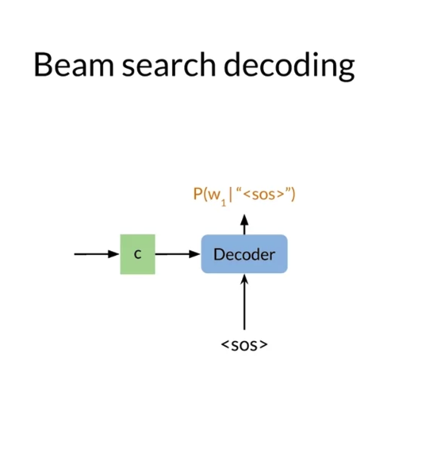</kbd>

> [!NOTE]
> Mô phỏng cách tính
> Beam search. Model predict vector of vocab size p scores

   

<kbd>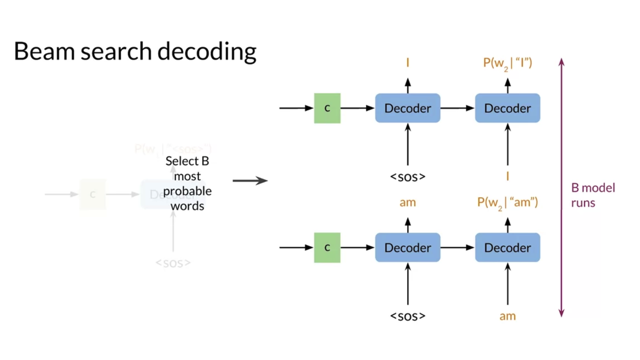</kbd>

> [!NOTE]
> Với các prediction cho từ của times-top 1, chọn B từ có P cao nhất.
>
> Với mỗi từ, run model để tính time-step tiếp theo.
>
> Chú ý, giả sử B = 2, và tại time-step tiếp, cả hai chuỗi có P cao nhất đều từ
> nhánh 1 thì ta bỏ nhánh 2 hoặc ngược lại. Có nghĩa là, giữ lại 2 nhánh có P cao
> nhất, và nó ko nhất thiết là chuỗi chứa các từ có p cao nhất ở mỗi time-step

   

<kbd>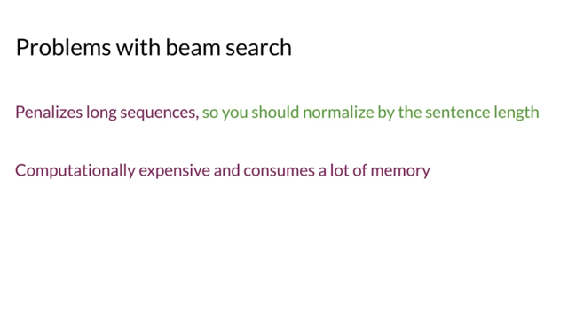</kbd>

> [!NOTE]
> Nhược điểm là nó ngại câu dài
> cũng như là tính toán nhiều

   

## Minimum Bayes Risk

 

### 1. Introduction to a Final Evaluation Technique: The narrator introduces the last technique for

> [!NOTE]
> 1. Introduction to a Final Evaluation Technique: The narrator introduces the last technique for
> **evaluating Neural Machine Translation** (NMT) systems. This technique is simple yet **effective
> compared to others**.
>
> 2. **Improving Decoding** with **Multiple Samples**: The narrator discusses the **limitations of random
> sampling** for decoding and suggests a method to improve it. By **generating multiple samples** (e.g.,
> 30) and **comparing them**, **decoding quality improves significantly.**
>
> 3. **Minimum Bayes Risk (MBR)** Decoding Method: **MBR** is introduced as a decoding method. It
> involves **comparing multiple candidate translations** to**find a consensus translation** that **maximizes
> similarity**. MBR uses a **similarity score or a loss function**, such as **ROUGE**, to **evaluate translations**.
>
> 4. **ROUGE** **Score** for Comparing Translations: ROUGE score is proposed as a suitable metric for
> comparing candidate translations. The goal is to **select the translation (E) that maximizes the average
> ROUGE score with other candidate translations (E prime)**.
>
> 5. Steps to Implement MBR with ROUGE: The steps for implementing MBR with ROUGE on a small
> set of candidate translations are outlined. These steps include **calculating ROUGE scores between
> candidates** and **selecting the translation with the highest average ROUGE score**.
>
> 6. Benefits of **MBR**: MBR provides a **contextually accurate translation** by **considering multiple
> candidates** and **choosing the one with the highest average similarity**. It **outperforms random sampling**
> and **greedy decoding**.
>
> 7. Conclusion and Preview of Next Week: The section concludes by congratulating the viewer on
> learning about implementing and evaluating machine translation systems. The narrator mentions that
> the next week's topic will be about the**transformer model,** a **state-of-the-art architecture** that uses an
> **encoder-decoder framework.**

 

<kbd>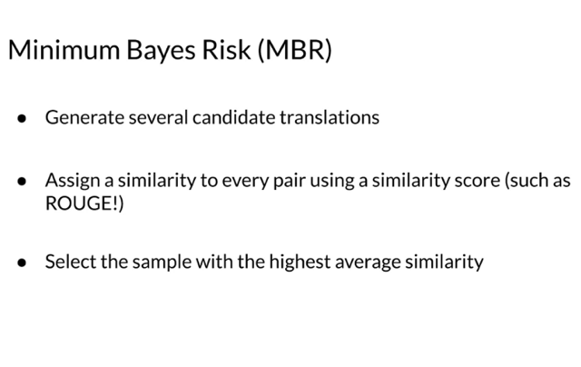</kbd>

> [!NOTE]
> Earlier, you encountered **random sampling** to choose a probable token 
> and the issues with that decoding method. But if you go a little further 
> with that, say by generating 30 samples and comparing them all 
> against one another. You'll see quite a bit of improvements in your 
> decoding. 
>
> You'll have to **compare multiple candidate translations** for the **minimum 
> bayes risk** decoding method, MBR for shorts. Implementing MBR is 
> pretty straightforward. Begin by **generating several random samples**, 
> then **compare each sample against each other** using a **similarity score** 
> or a loss function. **ROUGE would be a good choice** that you may recall 
> from a bit earlier.
>
> Finally, **choose the sample with the highest average similarity** or the 
> lowest loss. The translation that you get using this method is the 
> closest to all candidate translations. This process can be viewed as 
> some authors suggest, as **finding a consensus between all candidate**
> translation

> [!NOTE]
> Đại khái là dùng kĩ thuật **random sampling** theo kiểu khác:
>
> Cho nó **random sampling ra 30 câu**.
>
> Rồi dùng các công thức**tính similarity hay loss** để **tính các
> difference hay similarity giữa các cặp câu.**
>
> Và so sánh và **tìm ra cái câu mà có tổng độ khác nhau** (với các
> câu khác) **nhỏ nhất**. Thì nôm na kiểu như tìm ra một phiên bản
> đồng thuận của cả đám vậy.

   

<kbd>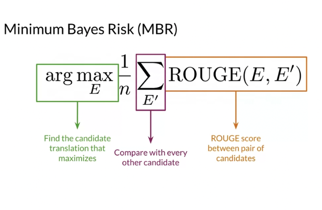</kbd>

> [!NOTE]
> Nếu dùng ROUGE để tính similarity cũng tốt. Thì công thức
> diễn đạt như sau. **Tìm Sequence E sao cho maximize trung
> bình các chỉ số ROUGE score giữa E và các candidate khác
> E'.**
>
> Học tới đây thấy đã thấm chữ **argument max**. Khác với
> **max** (ví dụ **max f(x)** là **tìm giá trị max của f**)
>
> còn **argument max f(x) (** chữ x để dưới) thì sẽ chú ý vào
> việc**tìm ra x để f(x) max**

   

<kbd>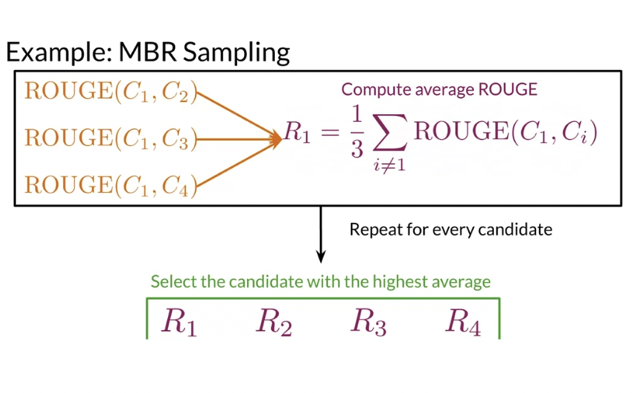</kbd>

> [!NOTE]
> Ví dụ với 3 candidate C1,C2,C3,C4 Đầu tiên là tìm R1 là trung
> bình của các chỉ số ROUGE giữa C1 và các C2,3,
> 4. Tương tự tính R2,R3,R4. Và so sánh chúng thằng nào lớn
> nhất thì lấy C đó
>
> Chú ý vì ROUGE là chỉ số tính độ giống nên ta sẽ lấy sequence nào
> có có R cao nhất - tức là giống mấy thằng kia nhất cũng đồng nghĩa 
> là ít khác nhất.
>
> Nếu dùng các thước đo khác như tính distance, khác biệt. Thì phải 
> lấy cái nhỏ nhất

   

<kbd>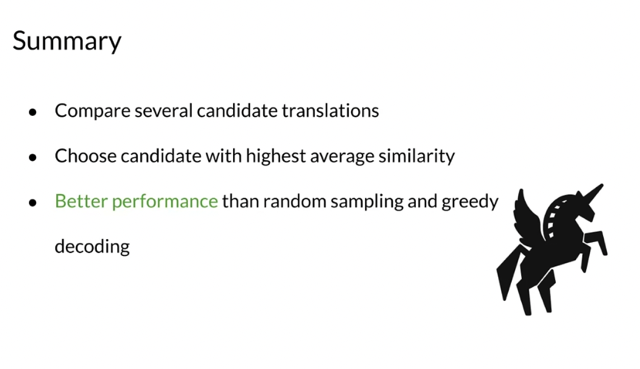</kbd>

> [!NOTE]
> Thì cách này cũng giống như Beam search sẽ cho kết quả
> tốt hơn greedy decoding và random sampling

   

## Lab: Stack Semantics

 

### In this ungraded lab, we will explain the**stack semantics** in **Trax**. This will

> [!NOTE]
> In this ungraded lab, we will explain the**stack semantics** in **Trax**. This will
> help in understanding **how to use layers** like **Select** and **Residual** which
> **operate on elements in the stack**.
>
> If you've taken a computer science class before, you will recall that a **stack** is a
> data structure that follows the **Last In, First Out (LIFO)**principle. That is,
> whatever is the **latest element that is pushed into** the stack will also be **the first
> one to be popped out**. 
>
> If you're not yet familiar with stacks, then you may find
> this short tutorial useful. In a nutshell, all you really need to remember is **it puts
> elements one on top of the other**. You **should be** **aware of what is on top of the
> stack to know which element you will be popping first**. You will see this in the
> discussions below. Let's get started!

> [!NOTE]
> Trải nghiệm khái niệm stack semantic
> trong Trax để hiểu cách dùng các layer
> như Select và Residual

 

- Import
   

    
    
<kbd>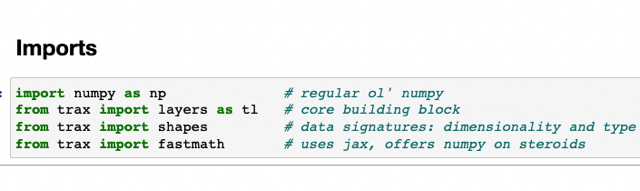</kbd>

     

- 1. The tl.Serial Combinator is Stack Oriented
   

    
    
<kbd>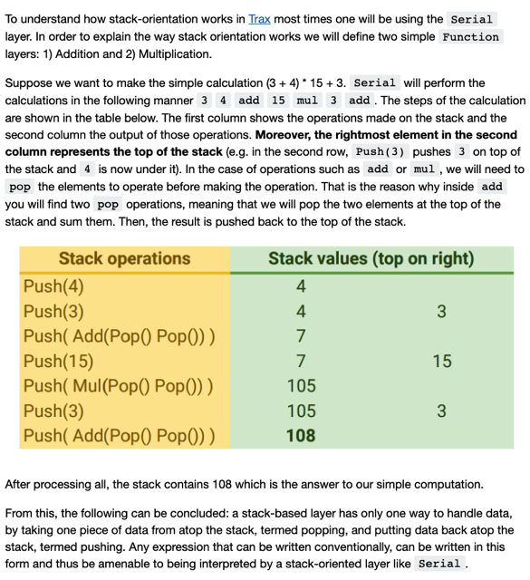</kbd>

    > [!NOTE]
    > Rất dễ hiểu thôi
    >
    > Push(4): Bỏ 4 vào stack, Push(3): Bỏ 3 vào stack. Lúc này stack sẽ có 3
    > nằm trên 4.
    >
    > Để thực hiện phép cộng 3+4: Nó sẽ pop(), pop() để hai thằng trên cùng của
    > stack ra  chính là 3, 4 ra. Sau đó add(với hai kết quả này) Và push() để bỏ
    > kết quả của add vào stack.
    >
    > Tiếp tục thực hiện các phép tính khác theo thứ tự của phép tính
    >
    > ===
    >
    > Nói đây là cách hoạt động của stack-based layer :Lấy data từ top của stack
    > - poping, và bỏ vào lại pushing.

     

    
    
<kbd>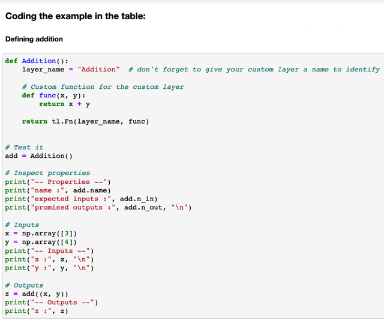</kbd>

     

    
    
<kbd>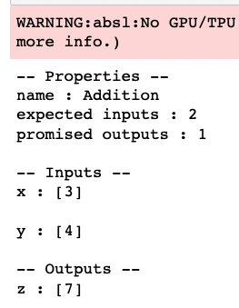</kbd>

     

    
    
<kbd>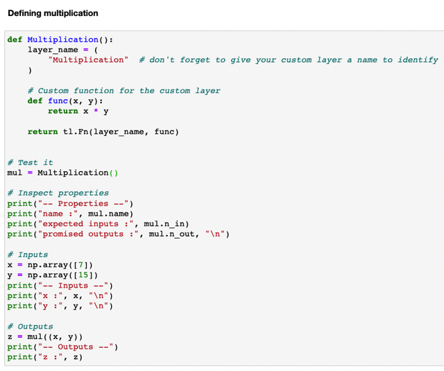</kbd>

     

    
    
<kbd>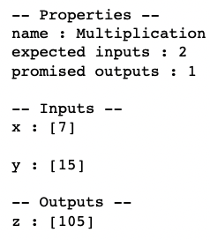</kbd>

     

    
    
<kbd>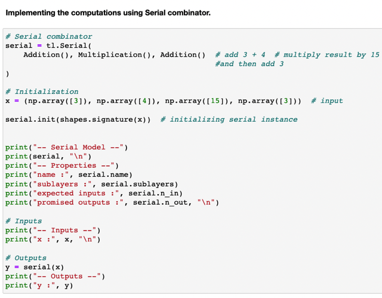</kbd>

     

    
    
<kbd>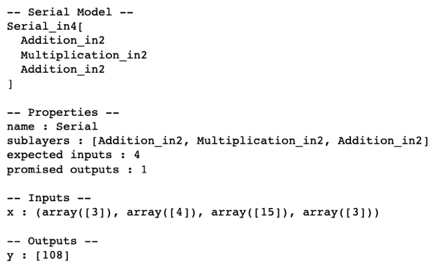</kbd>

    > [!NOTE]
    > The example with the two simple adition and multiplication functions that
    > where coded together with the serial combinator show **how stack
    > semantics work in Trax.**

    > [!NOTE]
    > Đại khái là từ việc đã **hiểu cái làm việc của stack** như lúc nãy thì  mục đích là để
    > nói về **stack-based layer** của Trax cũng hoạt động tương tự mà nếu không hiểu
    > sẽ thấy rất bối rối.
    >
    > Đầu tiên Addition, là **custom Trax layer** define bằng cách dùng **Fn layer** với
    > l**ambda function** expect **nhận 2 input** để trong đó nó **thực hiện phép cộng** và trả
    > kết quả. Tương tự **Multiplication cũng vậy** nhưng là làm **phép nhân**.
    >
    > **Serial** layer define (**Addition(), Multiplication(), Addition()**) và kiểu như quy định input
    > signature có dạng 4 số như vậy (chưa hiểu rõ lắm về signature)
    >
    > Thì nếu không hiểu stack hoạt động ra sao sẽ khó hiểu chỗ này,
    >
    > **Serial** sẽ **thực hiện việc tính toán** theo**lối stack** như ví dụ đầu bài:
    >
    > Ta **sẽ thấy nó theo đúng như trình tự** của ví dụ trên: **3 4 add 15 mul 3**
    > ====
    >
    > Đầu tiên nó push input thứ 1 - Push(3)
    >
    > Kế đến nó push input thứ 2 - Push(4)
    >
    > **Nhận ra đã đủ 2 number trong stack** cho **Addition**, nó **pop hai số này ra,** thực
    > hiện phép **addition**, rồi **bỏ kết quả lại vào stack**. **Lúc này stack có 1 số**, **chưa đủ
    > cho layer thứ 2 là multiplication tính toán**
    >
    > Tiếp,**push số tiếp theo trong input  = 15 vào stack.**
    >
    > Nhận ra **đủ 2 input trong stack**,**thực hiện Multiplication**, bằng cách cũng **pop hai
    > số ra**, **tính toán rồi push vào lại**. Stack lúc này có 1 số.
    >
    > **Push 3 vào**, **stack đủ 2 số**, **kích hoạt phép tính của Addition**
    >
    > **Đã hết các layer**, **kết thúc trả ra kết quả**
    >
    > Hiểu nôm na là nó work như vậy

     

- 2. The tl.Select combinator in the context of the serial combinator
   

    
    
<kbd>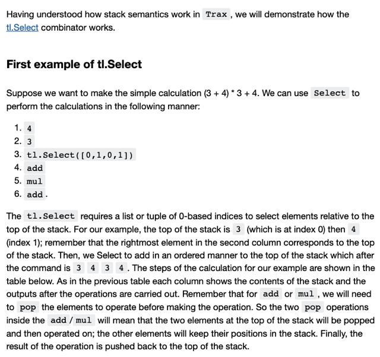</kbd>

     

    
    
<kbd>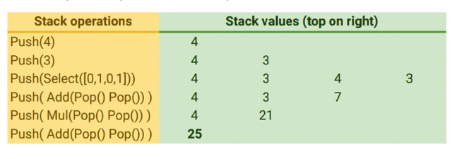</kbd>

    > [!NOTE]
    > Giải thích nó làm thế nào: Theo thứ tự 1 -> 6 sẽ như sau:
    >
    > 1.Push 4 -> stack có 1 số : 4
    >
    > 2.Push 3 -> stack có 2 số từ dưới lên (hay trong table là trái - phải) : 4 3
    >
    > 3.Push(Select [0,1,0,1])): TỨC LÀ: Lấy các số ở vị trí tương ứng trong
    > stack index = 0 và 1 trong stack chính là 3 và 4 và push vào stack
    >
    > Thì lúc này stack sẽ có 4 3 4 3.
    >
    > 4.Push(Add(Pop Pop)): Thực hiện 2 lệnh pop để lấy ra 2 số trên cũng của
    > stack là 4, 3 ra Cộng lại và push vào stack lại, lúc này stack có 4 3 7
    >
    > 5.Push(Mul(Pop, Pop)) lấy hai số trên cùng ra là 3, 7 . Nhân nhau rồi push
    > vào lại.  Stack hiện giờ có 4 và 21.

     

    
    
<kbd>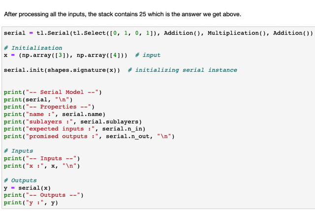</kbd>

    > [!NOTE]
    > Từ đó có thể hiểu cái này, tương tự như vậy
    >
    > Push(np.array([3])): [3]
    > Push(np.array([4])): [3] [4]
    > Select([0,1,0,1]) = [4] [3] [4] [3]
    > Push(Select([0,1,0,1])): [3] [4] [3] [4]

     

    
    
<kbd>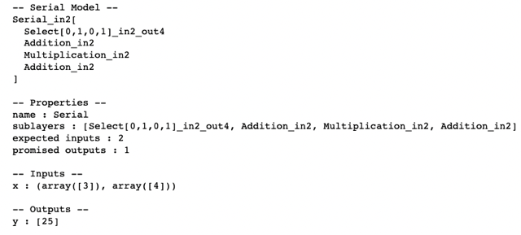</kbd>

     

    
    
<kbd>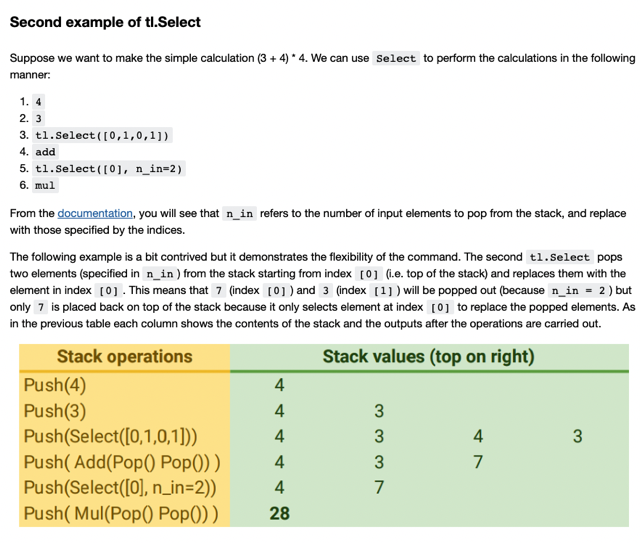</kbd>

    > [!NOTE]
    > Khúc trên tương tự ví dụ trước thì đã hiểu. Rắc rối là chỗ cái step 5 - Select([0],
    > n_in=2) là nó như vầy:
    >
    > Ý nghĩa của Select(**[0], n_in = 2**): **Lấy từ trong stack ra cho ta 2 số**, **bắt
    > đầu bằng index 0**.  **Nhưng sau đó, chỉ giữ lại cho ta thằng có index [0]** thôi.
    >
    > Thành ra nó sẽ lấy ra 7, 3. Rồi lại chỉ giữ lại 3 và push vô lại thành ra trong stack
    > có 4, 3.
    >
    > Tiếp theo thì không khó hiểu.

     

    
    
<kbd>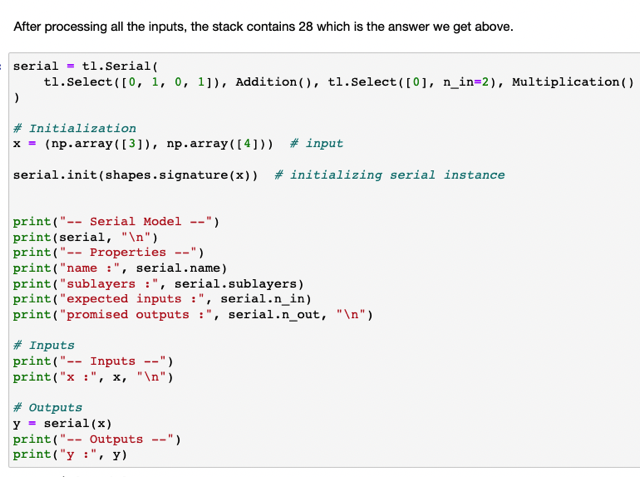</kbd>

     

    
    
<kbd>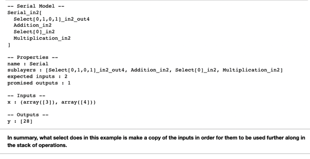</kbd>

     

- 3. The tl.Residual combinator in the context of the serial combinator
   

    
    
<kbd>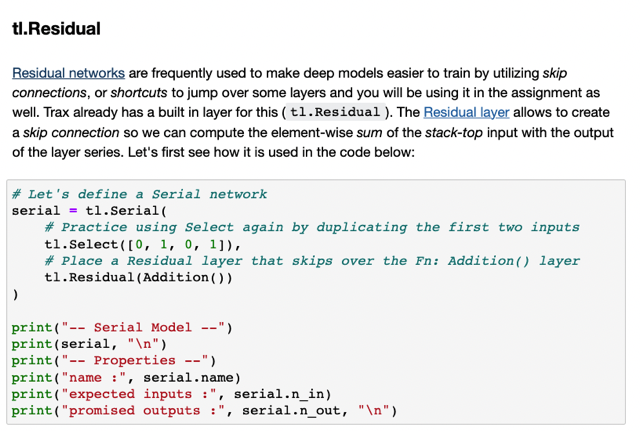</kbd>

     

    
    
<kbd>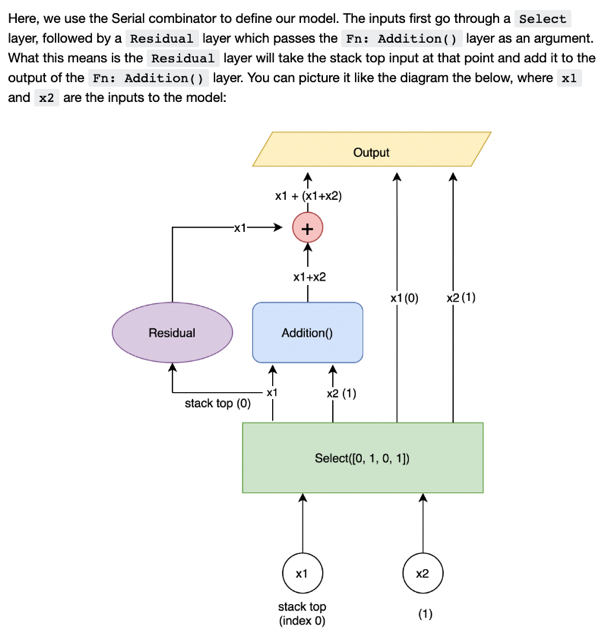</kbd>

    > [!NOTE]
    > Trời! Không hiểu nó làm phức tạp vậy làm gì.
    >
    > Sau Select thì trong stack có x2 x1 x2 x1 
    >
    > Thực hiện Addition, pop x1, x2 ra. Nhưng Vì Addition được gọi trong Residual
    > nên nó stack cái top lúc này là x1 ra để giữ lại, Addition x1,x2 tính xong thì 
    > nó cộng vào lại thành ra là x1 +(x1 + x2)...

     

    
    
<kbd>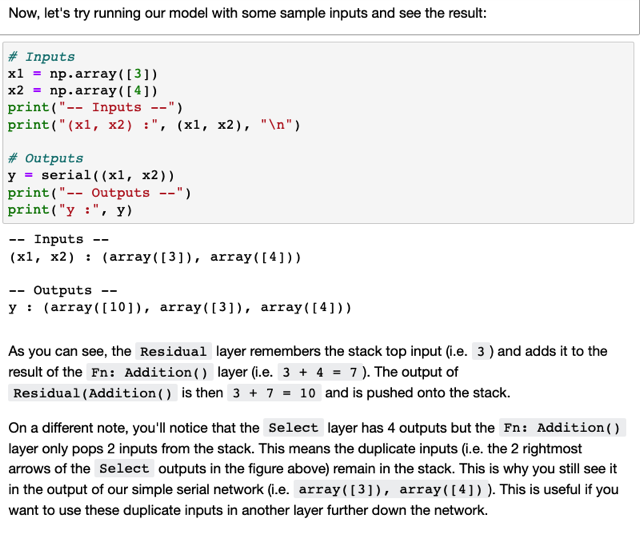</kbd>

    > [!NOTE]
    > Input: 3, 4
    >
    > Các số trong stack từ dưới lên sẽ thể hiện từ trái qua phải như
    > sau
    >
    > Sau Select: 4 3 4 3
    >
    > Addition: Pop 4, 3 trên top ra (trong stack còn lại: 4 3)
    >
    > thì, như đã nói vì Addition define trong Residual(...) nên  hiệu quả
    > là Residual thừa cơ lấy top trong bộ đó = 3 ra giữ lại, để sau đó
    > Addition thực hiện tính 4 + 3 = 7, residual cộng 3 vào lại thành ra
    > 10.
    >
    > Push lại vào stack, lúc này stack có: 4 3 10.
    >
    > In ra theo thứ tự sẽ là 10, 3, 4

     

    
    
<kbd>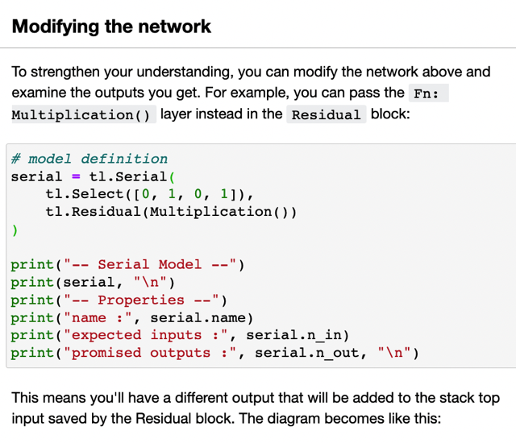</kbd>

    > [!NOTE]
    > Giờ thử đoán cái này sẽ ra như thế nào cho hiểu, thì tương tự. giả sử đưa x1, x2
    > vào.
    >
    > Nó sẽ work như sau:
    >
    > Push x1 -> Stack: x1
    >
    > Push x2 -> Stack: x2
    >
    > Đủ sở hụi 2 số ở vị trí 0,1 nên Select pop hai số trong stack (là 3, 4) ra và kiểu
    > như bỏ vào cái khai 4 chỗ theo index như define rồi push lại vào stack Stack lúc
    > này: x2 x1 x2 x1
    >
    > Sau Repeat, Residual(Multiplication()) được kích hoạt, với Multiplication trước nó
    > sẽ pop 2 số trên cùng (là x2, x1) của stack ra (vì theo define nó cần 2 input) Stack
    > lúc này còn lại [x2 x1].
    >
    > Ngay trước khi Multiplication tính toán thì Residual nhảy ra, pop cái đầu tiên của
    > Addition cái stack mà Multiplication đang giữ chứa x2, x1. Có nghĩa là x1 được
    > copy ra giữ lại Multiplication thực hiện tính x1*x2 xong thì Residual add x1 vào lại
    > để thành (x1*x2 + x1)
    >
    > Xong xuôi thì push vào lại stack (tổng): x2 x1 (x1*x2 + x1)
    >
    > Như vậy giả sử bỏ 3 4 vào thì print ra sẽ là: 15 3 4

     

    
    
<kbd>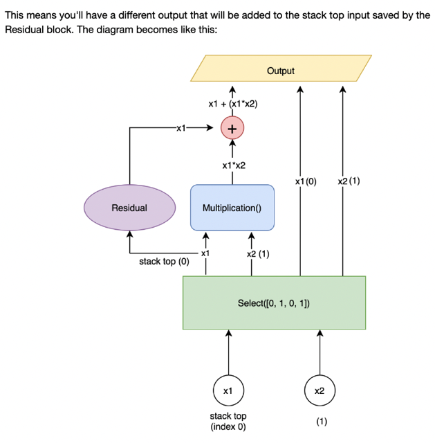</kbd>

     

    
    
<kbd>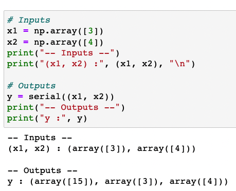</kbd>

    > [!NOTE]
    > Y chóc! : 15 3 4

     

## Week Conclusion

 

<kbd>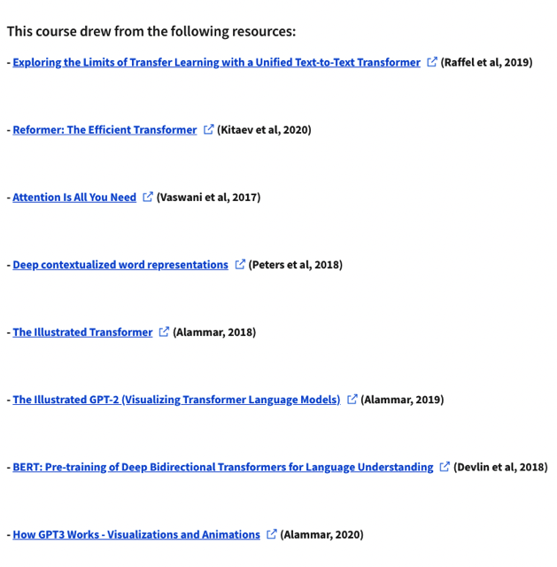</kbd>

> [!NOTE]
> \_Exploring the Limits of Transfer Learning with a Unified Text-to-Text Transformer\_
> https://arxiv.org/abs/1910.10683
>
> \_Reformer: The Efficient Transformer\_
> https://arxiv.org/abs/2001.04451
>
> \_Attention Is All You Need\_:
> https://arxiv.org/abs/1706.03762
>
> \_Deep contextualized word representations\_
> https://arxiv.org/pdf/1802.05365.pdf
>
> \_The Illustrated Transformer\_
> http://jalammar.github.io/illustrated-transformer/
>
> \_The Illustrated GPT-2 (Visualizing Transformer Language Models)\_
> http://jalammar.github.io/illustrated-gpt2/
>
> \_BERT: Pre-training of Deep Bidirectional Transformers for Language Understanding
> \_https://arxiv.org/abs/1810.04805
>
> \_How GPT3 Works - Visualizations and Animations\_
> http://jalammar.github.io/how-gpt3-works-visualizations-animations/

 

## Neural Machine Translation

 

<kbd>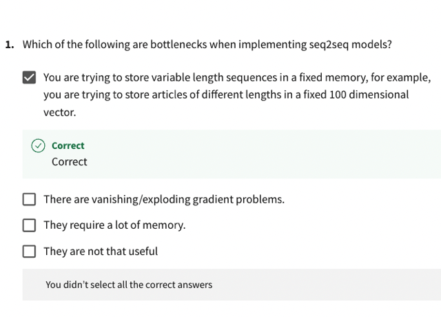</kbd>

 

<kbd>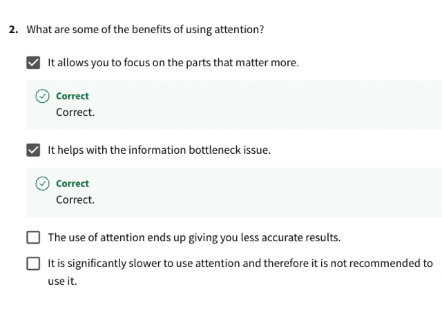</kbd>

 

<kbd>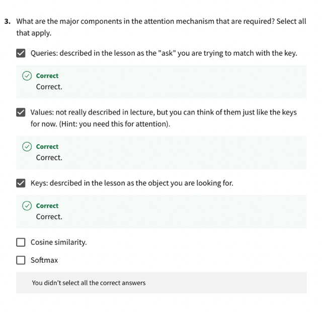</kbd>

 

<kbd>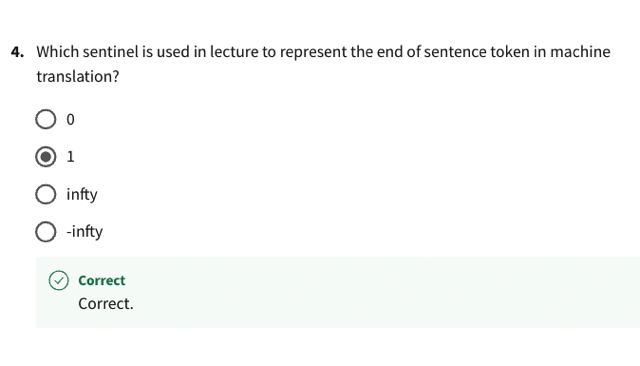</kbd>

 

<kbd>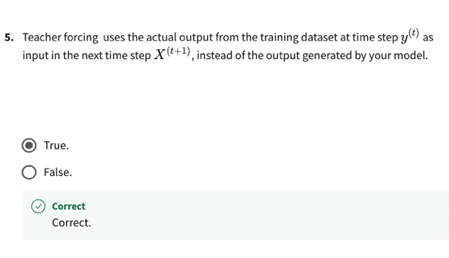</kbd>

 

<kbd>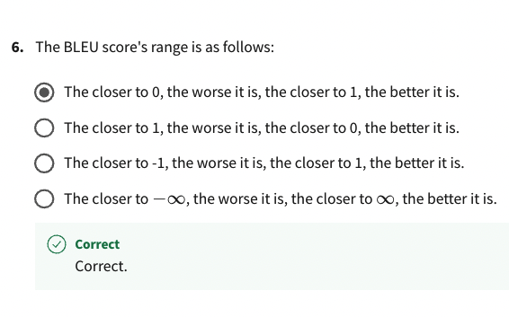</kbd>

 

<kbd>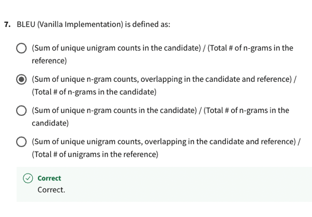</kbd>

 

<kbd>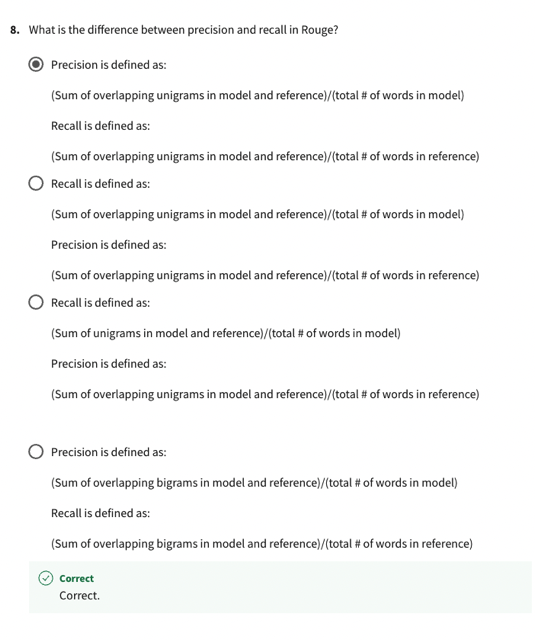</kbd>

 

<kbd>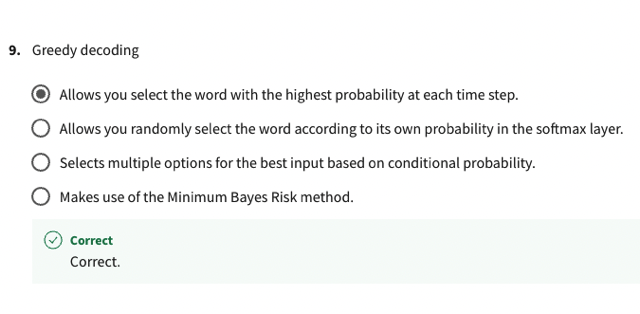</kbd>

 

<kbd>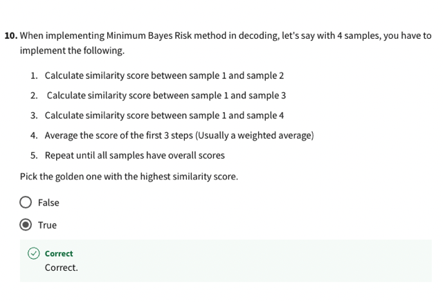</kbd>

 

## Pa. NMT With Attention

 

### Welcome to the first assignment of Course 4. Here, you will build an **English-to-German**

> [!NOTE]
> Welcome to the first assignment of Course 4. Here, you will build an **English-to-German**
> **neural machine translation (NMT)** model using **Long Short-Term Memory (LSTM)**
> networks with **attention**. 
>
> **Machine translation** is an important task in natural language 
> processing and could be useful not only for translating one language to another but also 
> for word **sense disambiguation** (e.g. determining whether the word "bank" refers to the 
> financial bank, or the land alongside a river). 
>
> Implementing this using just a **Recurrent 
> Neural Network (RNN) with LSTMs** can work for **short to medium length sentences** but 
> can result in **vanishing gradients** for **very long sequences**. To solve this, you will be 
> **adding an attention mechanism** to allow the decoder to **access all relevant parts of the 
> input sentence regardless of its length**. 
>
> By completing this assignment, you will:
>  • learn how to **preprocess your training and evaluation data**
>  • **implement an encoder-decoder system with attention** • understand **how attention works**
>  • **build the NMT model from scratch using Trax**
>  • generate translations using **greedy** and **Minimum Bayes Risk (MBR) decoding**

> [!NOTE]
> DLSpec ta đã làm Attention mechanism với model giúp translate ngày tháng năm ở
> dạng chữ thành dạng chuẩn ở đây ta sẽ build một model làm translate từ English sang
> German với LSTM network nhưng có thêm Attention mechanism.
>
> Như đã biết, các traditional sequence model như RNN, GRU, LSTM giúp nắm bắt các
> yếu tố ngữ nghĩa và khắc phục hiện tượng gradient vanishing. Tuy nhiên với câu rất dài,
> model vẫn không perform hiệu quả.

 

- 1 - Data Preparation
   

  
  - 1.1 - Importing the Data
     

      
      
<kbd>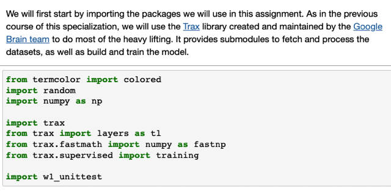</kbd>

       

    
    - Next, we will import the dataset we will use to train the model. To **meet the** **storage constraints** in this lab environment, we will just use a **small dataset from Opus  https://opus.nlpl.eu/**, a growing **collection of translated texts from the web**.  Particularly, we will get an **English to German translation subset** specified as **opus/medical** which has **medical related texts.**  If storage is not an issue, you can opt to get a **larger corpus** such as the English to German translation dataset from **ParaCrawl https://paracrawl.eu/**, a **large multi-lingual translation dataset created by the European Union**. Both of these datasets are available **via Tensorflow Datasets (TFDS)** and you can **browse through the other available datasets** here. https://www.tensorflow. org/datasets/catalog/overview   We have **downloaded the data for you** in the **data/ directory** of your workspace. As you' ll see below, you can**easily access this dataset from TFDS with trax.data.TFDS**.  The result is a **python generator function yielding tuples**. Use the k**eys argument** to select **what appears** at **which position** in the tuple. For example, keys=('en', 'de') below will return pairs as (English sentence, German sentence).
      > [!NOTE]
      > Đại khái là vì **hạn chế storage** của lab environment nên ở đây sẽ **chỉ
      > train một bộ dataset nhỏ** từ **Opus** là một collection of **translated text
      > English-German liên quan đến y học.** Nếu có **nhiều dung lượng hơn**
      > có thể thử **ParaCrawl** là một bộ dataset lớn hơn.
      >
      > Tất cả đều có thể access bằng **TensorFlow Datasets.**
      >
      > Ờ đây người ta **download sẵn về data/directory** cho rồi. Ta sẽ **dùng
      > TFDS để load nó**. Kết quả nó sẽ ở dạng một **generator function, trả về
      > kiểu tuple**

       

        
        
<kbd>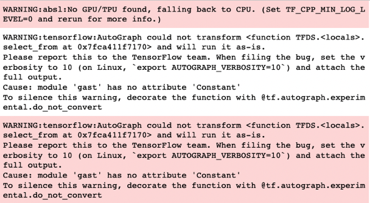</kbd>

        
<kbd></kbd>

        
<kbd>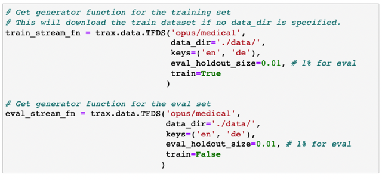</kbd>

        > [!NOTE]
        > Nhận thấy họ dùng **generator function trax.data.TFDS** take input là
        > **tên dataset (opus/medical)**, **directory path chứa data**, **keys = ('en', '
        > de')** có thể hiểu là **chỉ định rằng lấy dữ liệu English và German**,
        > **eval_holdout_size = 0.01** tức là **chia ra thành training và validation
        > set với tỉ lệ 99%-1%**, **train = True cho train_stream** (và **false cho
        > eval_stream**)

         

      
      - Notice that **TFDS** returns a **generator function**, not a **generator**. This is because in Python, you **cannot reset generators** so you **cannot go back to a previously yielded value**.  During deep learning **training**, you use **Stochastic Gradient Descent**and **don't actually need to go back** -- but it is **sometimes** good to be able to do that, and that's where the functions come in.  It is actually **very common to use generator functions in Python** -- e. g., **zip** is a **generator function**. You can read more about Python generators to understand **why we use them**.   https://book.pythontips.com/en/latest/generators.html   Let's print a a **sample pair** from our **train and eval data**. Notice that the **raw ouput is represented in bytes** (denoted by the **b**' prefix) and these will be **converted to strings internally in the next steps**.
        > [!NOTE]
        > Đại khái là TFDS là **generator function**, **không phải là generator**. Cho biết
        > thêm **nếu là generator thì sẽ không thể đi ngược để access các item/tuple
        > trước đó**. 
        >
        > Lí do là vì **khi training ví dụ với SGD** thì ta **chỉ việc loop qua dataset
        > từ đầu đến cuối** **không cần phải đi ngược lại** làm gì. Tuy nhiên **đôi khi vẫn
        > cần**, thì đó là lúc có thể dùng **generator function** - vốn cũng r**ất thông dụng**
        > trong Python.

         

          
          
<kbd>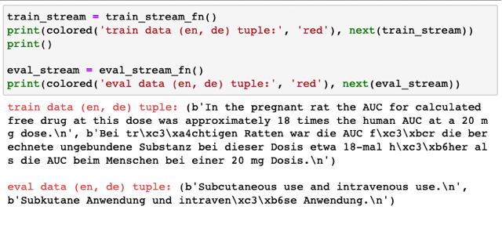</kbd>

          > [!NOTE]
          > Dùng **next(train_stream hay val_stream)** để access tới 1
          > tuple hai câu English, German

           

  
  - 1.2 - Tokenization and Formatting
     

    
    - Now that we have imported our corpus, we will be **preprocessing the sentences** into a  **format** that our model can accept. This will be composed of several steps:**Tokenizing the sentences using subword representations:** As you've learned in the earlier courses of this specialization, we want to **represent each sentence as an array of  integers instead of strings**.  For our application, we will use \\/**subword\\/ representations** to  **tokenize our sentences**. This is a **common technique to avoid out-of-vocabulary words** by **allowing parts of words to be represented separately**.  For example, instead of having  separate entries in your vocabulary for --**"fear", " fearless", "fearsome", "some"**, and  "less"--, you can simply store --**"fear", "some"**, and **"less"**-- then allow **your tokenizer to  combine these subwords when needed**. This allows it to be **more flexible** so you **won't  have to save uncommon words explicitly** in your vocabulary (e.g. \\/stylebender\\/, \\/nonce\\/,  etc).  Tokenizing is done with the **trax.data.Tokenize()** **command** and we have provided you the c**ombined subword vocabulary for English and German** (i.e. **ende_32k. subword**)  **saved in the data directory**. Feel free to open this file to**see how the subwords look like**.
      > [!NOTE]
      > Thì ở đây là ta sẽ thấy / **dùng một dạng tokenize mới** mà DLSpec không dùng và ở những
      > Course của NLPSpec trước từng nói qua đó l**à tokenize theo kiểu các phần của từ thay vì
      > nguyên một từ**. Cách này là kiểu tokenizer **được làm đầu tiên bởi Facebook.**
      >
      > Bằng cách này, ta chỉ token các subword -  **không cần phải dành mỗi chỗ cho mỗi từ** vì nhiều
      > từ vựng chỉ**cấu thành bởi những phần giống nhau** dẫn đến **giảm bớt số vocab size** cũng
      > như là **giảm khả năng bị out of vocab token** vì kiểu như **với các subword, có thể combine
      > thành nhiều từ dẫn đến tuy ít (vocab size) hơn  nhưng lại cover nhiều từ hơn là kiểu cũ**
      >
      > Sử dụng function trax.data.Tokenize(). Và họ cũng chuẩn bị sẵn các bộ subword này.

       

        
        
<kbd>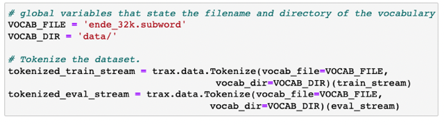</kbd>

        > [!NOTE]
        > Khởi tạo **trax.data.Tokenize** với input là **tên file chứa bộ subword**, và
        > **directory path** và gọi nó với **train_stream**.
        >
        > Nôm na là nó sẽ **sử dụng các subword trong file** để **tokenize dữ liệu
        > trong training set và val set thành dạng token**

         

        
        
<kbd>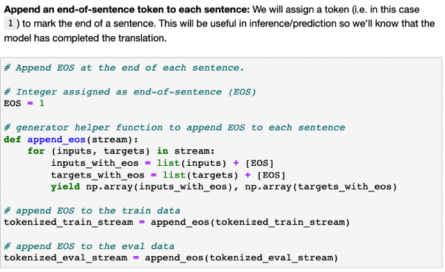</kbd>

        > [!NOTE]
        > Bước này ta sẽ **thêm <EOS> token id = 1 vào cuối câu** của **mỗi data sample.**
        >
        > Tức là hiện giờ sau khi tokenize, thì data đang có **dạng các bộ tuple** (câu english được
        > tokenize, câu german được tokenize) ví dụ **(45 12 13 43,  12 341 45 21)** Với mỗi số là
        > index của subword trong vocab.
        >
        > Thì bây giờ ta **thêm 1 vào cuối câu để thành (45 12 13 43 1,  12 341 45 21 1).**
        >
        > Việc này được thực hiện bằng cách**define function** **nhận data stream**. **Loop qua
        > từng tuple**.**Lấy từng phần của tuple** **biến thành python list**,
        >
        > Append với [EOS = 1] theo kiểu cộng hai list [1, 2] + [3] = [1, 2, 3].
        >
        > Sau đó biến list về lại np.array và trả về.

         

        
        
<kbd>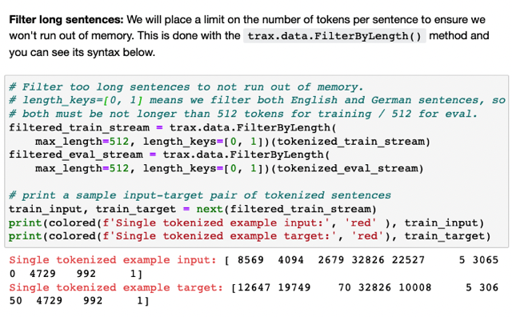</kbd>

        > [!NOTE]
        > Kế tiếp ta làm cái việc**"ấn định max_len và loại bỏ những câu dài hơn"**. Việc này thực hiện
        > bằng cách dùng **trax. data.FilterByLength**, khởi tạo với **max_length = 512**, **length_key**
        > là sao chưa rõ.
        >
        > Gọi nó với**train stream (đã tokenize)**. Nó sẽ**filter out các sequence dài quá 512** token.
        > Và qua đó ta cũng thấy ta sẽ **dùng max_length**hay**sequence_length = 512 trong model**

         

  
  - 1.3 - tokenize & detokenize Helper Functions
     

      
      
<kbd>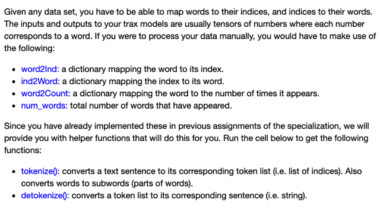</kbd>

      > [!NOTE]
      > Đại khái là, như đã biết **qua quá trình training của vài language model** thì **luôn
      > cần chuẩn bị các dictionary** giúp **map giữa word và index, index - word**, ...
      >
      > Những project trước ta cũng **đã làm qua** việc chuẩn bị các bộ dictionary này. Nên
      > ở đây **người ta chuẩn bị sẵn giùm**.
      >
      > **tokenize**() sẽ **convert text sentence thành dạng list các token** (index) và trước
      > đó là**convert word thành subword luôn**.
      >
      > Còn **detokenize**() thì ngược lại, nó **convert token list khôi phục thành sentence
      > dạng text**

       

      
      
<kbd>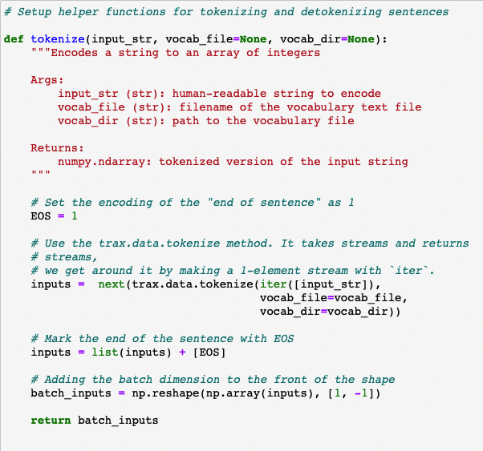</kbd>

      > [!NOTE]
      > Giải thích sơ:
      >
      > ta **đã thấy ở trên,** function**trax.data.tokenize() sẽ nhận input là stream**.
      >
      > Nên ở đây mình lại dùng trong function này**nhận input là text string**. Thành
      > ra phải **dùng iter(input string) để tạo một stream** (chỉ chứa 1 element) thì
      > mới**bỏ vào tokenize() được**.
      >
      > Nó sẽ**tokenize** như đã biết -**biến sentence text của input thành list các
      > subword index quy định bởi vocab_file**. Và nó cũng**không quên append
      > EOS token**.
      >
      > Cuối cùng dùng **np.reshape(...[1,-1])**để **nhét thêm 1 dimension ở đầu**
      > tương ứng **batch dimension** như đã biết là sẽ **cần thiết trước khi đưa data
      > tensor vào Deep Neural Network model.
      >
      > Cái lối "-1" trong [1,-1] cũng đã quen thuộc**

       

      
      
<kbd>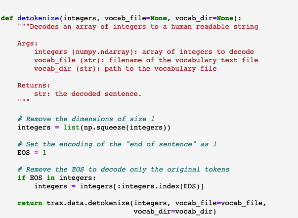</kbd>

      > [!NOTE]
      > Function này thì trước tiên nó bỏ cái dimension nào có size 1 đi
      > bằng np. squeeze để bỏ cái batch dimension đi.
      >
      > Ví dụ (1,4) sẽ thành (4,)
      >
      > Rồi check ở trong các intergers = các index của subword để check
      > có EOS token không. Có thì chỉ tạo list mới chừa nó ra
      > (integers[:integers.index(EOS)].
      >
      > Trước khi bỏ vào detokenize để khôi phục text string

       

      
      
<kbd>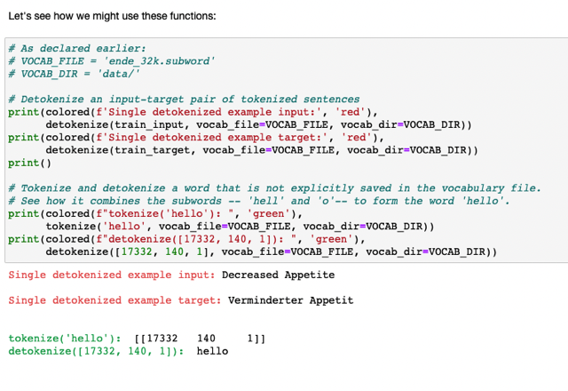</kbd>

      > [!NOTE]
      > Xem thử:  Ta bỏ**train_input là train data stream** vào **detokenize** để xem thử  nó
      > **detokenize (một mẫu data)** trong đó ra gì cho thấy:
      >
      > 'Decreased Appetite'
      >
      > Sau đó t**okenize từ 'hello'** thành **[[17332 140 1]]** có**shape (1,3)**, **số 1 ở cuối là
      > index của eos token.**
      >
      > Và lấy kết quả bỏ vào detokenize ngược lại ra text 'hello'

       

  
  - 1.4 - Bucketing
     

    
    - Bucketing the tokenized sentences is an important technique used to speed up training in  NLP. Here is a \\_nice article describing it in detail\\_ https://rashmi-margani.medium. com/how-to-speed-up-the-training-of-the-sequence-model-using-bucketing-techniques-9e302b0fd976 but the gist is very simple.  Our inputs  have **variable lengths** and you want to **make these the same when batching** groups of sentences together. One way to do that is to **pad each sentence to the length of the  longest sentence** in the dataset. This might l**ead to some wasted computation** though.  For  example, if there are **multiple short sentences with just two tokens**, do we want to **pad  these when the longest sentence is composed of a 100 tokens?** Instead of **padding with  0s to the maximum length of a sentence each time**, we can**group our tokenized sentences by length and bucket**, as on this image (from the article above):
      > [!NOTE]
      > Ideas cũng đơn giản thôi, trước giờ ta đã biết **max_length padding** - **padding  (với zeros) để tất cả
      > các sequence đều có length = câu dài nhất của data.**
      >
      > Tuy nhiên cách này sẽ g**ây lãng phí** như ví dụ đưa ra là **phần lớn câu chỉ có 2,3 từ** nhưng lại **lọt
      > chỉ có 1 câu dài 100** từ khiến  cả đám phải padded thành 100 **rất không hợp lí.**

       

        
        
<kbd>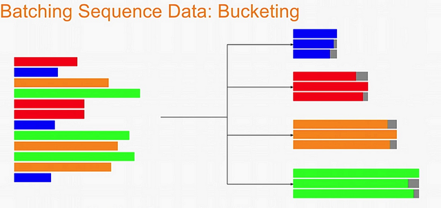</kbd>

        > [!NOTE]
        > We **batch** the sentences with **similar length together** (e.g. the blue sentences in the image
        > above) and **only add minimal padding** to make them have equal length (**usually up to the
        > nearest power of two)**. This allows to **waste less computation when processing padded
        > sequences**. In Trax, it is implemented in the **bucket_by_length** function.
        >
        > https://github.
        > com/google/trax/blob/5fb8aa8c5cb86dabb2338938c745996d5d87d996/trax/supervised/inputs.
        > py#L378

        > [!NOTE]
        > Nên cách này nó sẽ giúp **group từng bộ các câu xem xem nhau** và pad
        > sao cho s**ố lượng padding là tối thiểu**. Và người ta thường dùng cách
        > là \_**pad cho đủ kích thước tính bằng luỹ thừa 2 gần nhất**\_.
        >
        > Ví dụ: group các câu có số từ 2,3  -> pad thành 2**2 = 4
        > Group các câu có 5,6,7 -> pad thành 2**3 = 8
        > Group các câu có 9,10,..15 thì pad thành 2**4 = 16
        > ...
        >
        > Với cách làm này **các batch sẽ dài ngắn khác nhau (2,4,8,16,32...)** và mỗi
        > batch **chứa các câu có độ dài (khi chưa pad) nằm trong cùng một khoảng 
        > (bucket)** ví dụ**5,6,7** là cùng bucket (để cùng pad đến 8) , **9-15** là cùng bucket 
        > (để cùng pad đến 16). Hệ quả là **giảm thiểu số padding**.
        >
        > Để ý rằng trước đến giờ model không yêu cầu các batch phải dài bằng
        > nhau bởi lẽ mỗi lần forward prop nó xử từng batch riêng lẻ, chỉ cần các
        > câu trong batch dài bằng nhau thôi.

         

        
        
<kbd>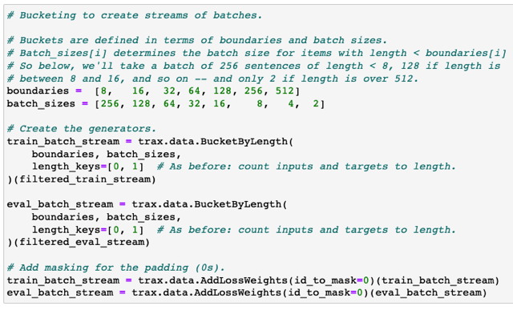</kbd>

        > [!NOTE]
        > Để làm việc này ta dùng **trax.data.BucketByLength** nhận input là
        > **boundaries** và **batch sizes** tương ứng.
        >
        > Nôm na là ứng **với mỗi boundary value**, nó sẽ **gom các câu có độ
        > dài không qúa số đó thành một batch có số sentence trong batch tương
        > ứng**.
        >
        > Ví dụ **câu nhỏ hơn 8 sẽ được pad thành đủ 8 và gôm thành các batch 256 
        > câu**,**từ 8-16 thì pad thành length = 16 rồi gom thành các batch có 128 câu...**
        >
        > Cuối cùng họ còn **dùng function AddLossWeights ids_to_mask = 0**.
        > Hiểu đại khái là nó sẽ **tạo mask cho những  padding token (=0)** này
        > để khi **tính loss nó không 'tính' padding token.**

         

  
  - 1.5 - Exploring the Data
     

      
      
<kbd>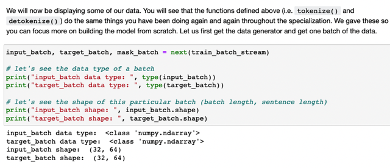</kbd>

      > [!NOTE]
      > Ok, giờ xem thử một batch data nó như thế nào:
      >
      > Ta thấy nó là dạng (type) **nparray**. Shape của batch này là **32x64.**
      >
      > Nhớ rằng c**ác batch khác** có các **batch dimension và cả padded
      > sequence dimension khác nhau** do vụ **bucketize** như đã biết.
      >
      > **Miễn là khi đưa batch data vào model** thì các **sequence trong batch đều
      > có length bằng nhau** bằng câu dài nhất trong batch.

       

    
    - The **input_batch** and **target_batch** are Numpy arrays consisting of tokenized English  sentences and German sentences respectively. These tokens will later be used to  produce **embedding vectors for each word** in the sentence (so the embedding for a  sentence will be a matrix). The number of sentences in each **batch is usually a power of 2 for optimal computer memory usage.**  We can now visually inspect some of the data. You can run the cell below several times  to shuffle through the sentences. Just to note, while this is a standard data set that is  used widely, it does have some known wrong translations. With that, let's pick a random  sentence and print its tokenized representation.
      > [!NOTE]
      > Ở đây nói thêm là **batch dimension** thường được chọn là **luỹ thừa của
      > 2** như 16, 32, 64,128 để tăng hiệu suất tính toán. (Ở đây là nói giá trị của
      > batch_size = số data trong batch, cũng thường được chọn là luỹ thừa 2)
      >
      > Thành ra các batch có số lượng (luỹ thừa 2) câu, và cũng được pad thành
      > một số luỹ thừa 2 nào nào đó. Ví dụ: tất cả các câu <= 8 (2**3) sẽ được 
      > batch thành các batch có 256 câu -> (256 , 8) 
      > Rồi tất cả các câu từ 9-16 sẽ được pad thành length 16 và batch thành các
      > batch có 128 câu. -> (128, 16)
      >
      > Và khi đưa qua **embedding layer**, các token (indices) sẽ được biến thành
      > các **embedding vector**. Nên mỗi sentence hiện giờ đang là list các indices
      > sẽ biến thành **matrix**. Cái này đã qua quen rồi
      >
      > Cuối cùng là lưu ý ta là vẫn có thể có sai sót trong dataset

       

        
        
<kbd>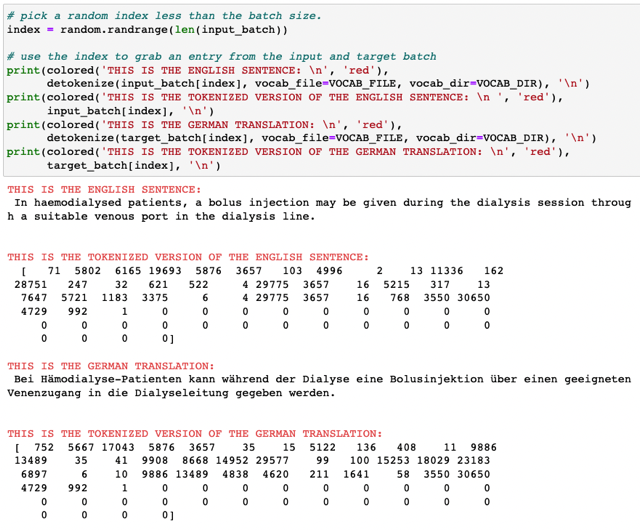</kbd>

        > [!NOTE]
        > Ta thấy text setence được preprocess thành dạng token list,
        > end bởi **<EOS> token = 1**, và **zeros padding cho đủ chiều dài
        > là luỹ thừa 2 gần nhất.**Ví dụ câu 'In heamodialysed..line' sau khi tokenize thành 38 token
        > indices. [71, 5802,...992]. Được add thêm <eos> token là 1 thành 39.
        > Thì nó sẽ được pad với 0 để dài đến số luỹ thừa 2 gần nhất là 2**6=64.

         

- 2 - Neural Machine Translation with Attention
   

  
  - 2.1 - Attention Overview
     

      
      
<kbd>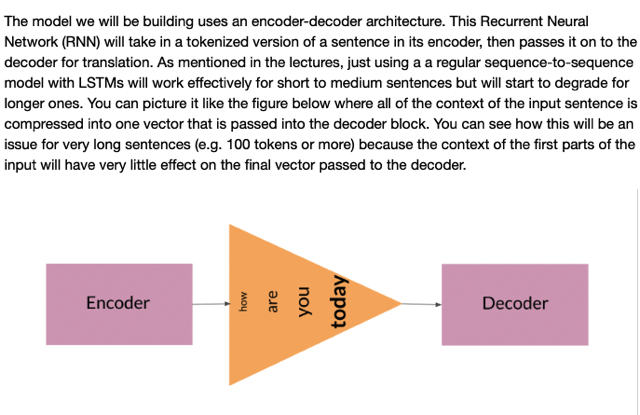</kbd>

      > [!NOTE]
      > Nhắc lại về ưu nhược điểm của traditional RNN / LSTM network hoạt
      > động theo kiểu Encoder-Decoder: Collect & learn info from input
      > sequence và pass qua cho Decoder. Thì nó cũng rất tốt nếu câu không
      > quá dài (nhớ lại LSTM hay GRU đã khắc phục đáng kể hiện tượng
      > vanishing và exploding gradient). Tuy nhiên với câu rất dài thì nó cũng
      > gặp vấn đề. Ví von là chúng ta có một nút thắt cổ chai khiến thông tin bị
      > mất dần khi câu càng dài trước khi pass qua Decoder.

       

      
      
<kbd>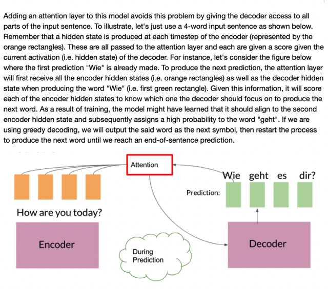</kbd>

      > [!NOTE]
      > Review lại 'Original Attention':
      >
      > **Mọi hidden states của Encoder** cùng với **current hidden state của
      > Decoder**(hay nói **previous time-step hidden state** cũng được vì ta biết
      > rằng trong quá trình làm, sau mỗi time-step ta sẽ re-assign hidden state vào
      > lại current state để làm input cho việc tính time-step tiếp theo nên nói là
      > current hidden state cũng được, mà previous time-step hidden state cũng
      > không sai)
      >
      > Ở đó, tính ra các chỉ số **alignment score gọi là energy** (thông qua **Feed
      > Forward layer** hoặc bằng **QKV method gọi là Scaled Dot-Product
      > Attention** - nói chung chỉ  khác nhau cách làm còn về mục đích thì như
      > nhau) để thể hiện **sự align giữa Decoder  state và các Encoder's state**.Từ
      > đó qua softmax chuyển thành **attention weights**.
      >
      > Giúp cho khi **generate probability scores của next time-step**, nó sẽ tính
      > toán với input từ context với trọng số attention **thể hiện nó nên chú ý nhiều
      > ít thế nào với các Encoder time-step**thay vì xem cái nào cũng như nhau
      > dẫn đến hiệu quả cao hơn.

       

      
      
<kbd>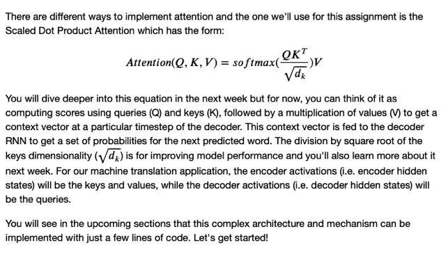</kbd>

      > [!NOTE]
      > Ok, như như mới nói xong, Attention mechanism có thể được thực hiện theo
      > nhiều cách, và ở đây ta dùng QKV attention hay Scaled Dot-Product Attention
      >
      > Trong đó, QK.T sẽ đóng vai trò tính toán ra alignment scores giữa query và key.
      > Chia cho dk là length của key vector. Giúp ổn định quá trình tính toán tuần sau sẽ
      > nói rõ hơn. Kết quả được bỏ qua hàm softmax để chuyển thành attention weight
      > trước khi nhân với Values (V) để thành context vector.
      >
      > Thì với Transformer, người ta sẽ dùng thêm 3 'cổng' là 3 Linear layer với learnable
      > weights W_Q,W_K,W_V để transform embedding ecoding (Semantic Embedding
      > & Positional Encoding) tensor thành Q,K,V. Với input lấy từ Encoder's embedding
      > hay Decoder's embedding khác nhau chút xíu tuỳ vào  việc đang tính Encoder
      > (hay Decoder) Self-Attention hay Decoder-Encoder Attention.
      >
      > Còn ở đây, đơn giản là K, V chính là Encoder's hidden state. Q là Decoder's
      > current hidden state. Đồng nghĩa dk là length của Decoder's hidden state vector

       

  
  - 2.2 - Helper Functions
     

  
  - 2.2.1 - Input Encoder
     

      
      
<kbd>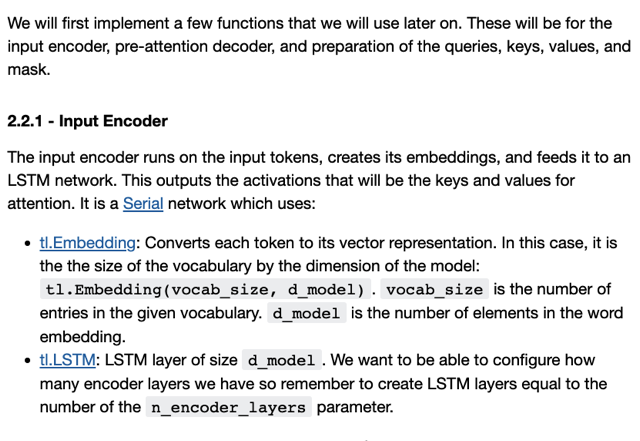</kbd>

      > [!NOTE]
      > Đầu tiên **input** (batch of **padded sequence of words token**) sẽ đi qua**Embedding layer** để **biến mỗi word token thành embedding vector**
      >
      > **Chiều dài của embedding vector** sẽ define bởi **d_model** khi construct
      > Embedding layer. (*Ta gặp lại d_model, đã từng gây ra sự không hiểu rất lớn
      > ở DLSpec Transformer project).
      >
      > Output của embedding layer sẽ đi vào **LSTM** với **chiều dài của hidden
      > state vector cũng dùng d_model luôn**.
      >
      > Tại đây như đã biết, **LSTM sẽ giúp model learn các thông tin ngữ nghĩa
      > quan hệ giữa các từ xa gần trong câu**.
      >
      > Sau đó tiếp tục cho nó qua LSTM nếu cần ( tổng số lượng LSTM sẽ tuỳ vào
      > hyper-params  n_encoder_layers)

       

      
      
<kbd>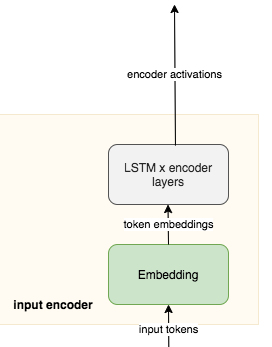</kbd>

       

  
  - Exercise 1 - input_encoder_fn (UNQ_C1)
     

      
      
<kbd>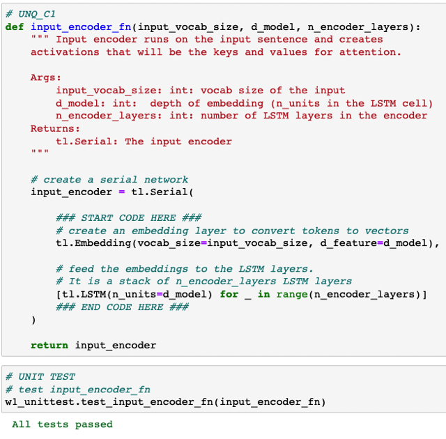</kbd>

       

  
  - 2.2.2 - Pre-attention Decoder
     

      
      
<kbd>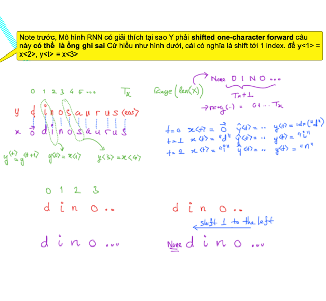</kbd>

      
<kbd></kbd>

      
<kbd>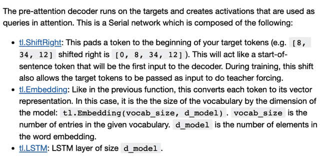</kbd>

      > [!NOTE]
      > Pre-attention decoder, đầu tiên target (cũng là một batch các zero padded vector of
      > word token) sẽ qua **ShiftRight** để **chèn thêm 1 token** index **đóng vai trò
      > <SOS> vào vị trí đầu**.
      >
      > Việc này như ta đã biết **kiểu như** **input của time-step đầu tiên x<0> là zeros
      > vector** trong model **Dinosaur** name generation hay Music generation vậy
      >
      > Từ**input x<1>,x<2>..của các time-step** sau**thay vì dùng prediction của time-step
      > trước** thì với **teacher forcing** sẽ là **ground truth label** **y<t-1> (tức lấy 'từ đúng'
      > )** Sau đó tương tự, cũng sẽ là **Embedding** và một vài **LSTM**.
      >
      > Ở đây biết thêm một việc cũng rất dễ đoán ra đó là người ta sẽ gọi **"Dimension của
      > model"** để **chỉ kích thước của embedding vector.** Do đó mới d_model chính là
      > embedding dimension

       

      
      
<kbd>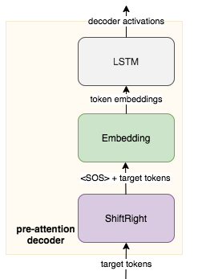</kbd>

       

  
  - Exercise 2 - pre_attention_decoder_fn (UNQ_C2)
     

      
      
<kbd>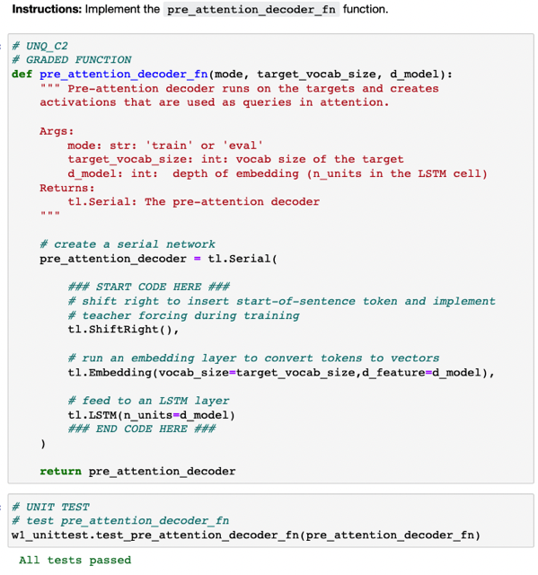</kbd>

       

  
  - 2.2.3 - Preparing the Attention Input
     

    
    - This function will prepare the inputs to the attention layer. We want to **take in the encoder  and pre-attention decoder activations** and **assign** it to the**queries, keys, and values**.   In  addition, another output here will be the **mask** to **distinguish real tokens from padding  tokens.** This mask will **be used internally by Trax** when **computing the softmax so padding  tokens will not have an effect on the computated probabilities**. From the data preparation  steps in Section 1 of this assignment, you should know which tokens in the input  correspond to padding.  We have filled the last two lines in composing the mask for you because it includes a  concept that will be discussed further next week. This is related to \\/**multiheaded  attention**\\/ which you can think of right now as**computing the attention multiple times** to  improve the model's predictions.  It is required to **consider this additional axis in the output** so we've included it already but you **don't need to analyze it just yet.** What's important  now is for you to know **which should be the queries, keys, and values**, as well as to **initialize the mask.**
      > [!NOTE]
      > Kế đến là viết một function nhận các kết quả **activation của encoder và pre-attention
      > decoder** (tức là **output từ các LSTM**của chúng) để **assign vào queries, keys và
      > values.**
      >
      > Thì ở đây sẽ **có thêm một cái nữa là padding mask**. Nhằm **giúp khi tính softmax, nó
      > không 'tính' đến padding**. Cái này họ sẽ làm giúp mình. Vì tuần sau sẽ nói rõ hơn
      > trong phần Transformer model.
      >
      > Còn bây giờ chỉ cần b**iết cách assign cái nào vào queries cái nào và keys và values
      > là được.**

       

  
  - Exercise 3 - prepare_attention_input (UNQ_C3)
     

      
      
<kbd>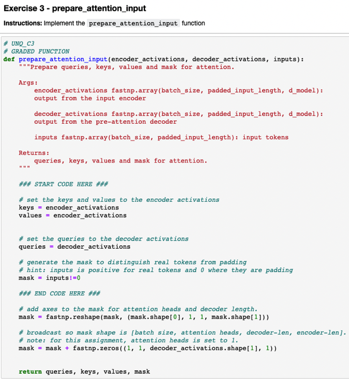</kbd>

      > [!NOTE]
      > Khúc assign vào đâu thì đã biết, Encoder' s state sẽ là keys và values, còn Decoder's
      > state sẽ là queries.
      >
      > Để ý là cả encoder's state và decoder's state đều có shape là  (batch_size,
      > padded_input_length = max_len, d_model = embedding dimension)
      >
      > ====
      >
      > Để tạo cái mask, cơ bản nó chỉ là cái tensor cùng shape với decoder's tensor. Để có giá
      > trị bằng 0 ở chỗ nào mà decoder's tensor value là word token tức là số >0 thì trong
      > mask là 1. Chỗ nào trong decoder's tensor value là pad = 0 thì trong mask sẽ là
      > 0.
      >
      > Ta dùng compare function với input là 'token tensor' không nói rõ những ta tự hiểu là
      > của Decoder để tạo mask.

      > [!NOTE]
      > Sau đó, là bước broadcast để mask có shape [batch size, attention heads, decoder-len,
      > encoder-len]
      >
      > Khúc này chưa hiểu lắm

       

  
  - 2.3 - Implementation Overview
     

    
    - We are now **ready to implement** our sequence-to-sequence model with attention. This will be a **Serial network** and is illustrated in the diagram below.  It shows the layers you'll be using in Trax and you'll see that **each step can be implemented quite easily with one line commands.** We' ve placed several links to the documentation for each relevant layer in the discussion after the figure below.
       

        
        
<kbd>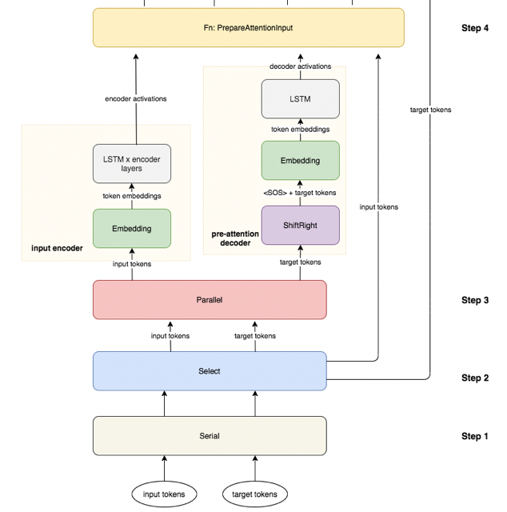</kbd>

        
<kbd></kbd>

        
<kbd>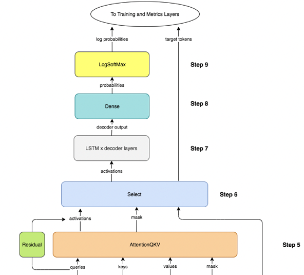</kbd>

         

  
  - Exercise 4 - NMTAttn (UNQ_C4)
     

      
      
<kbd>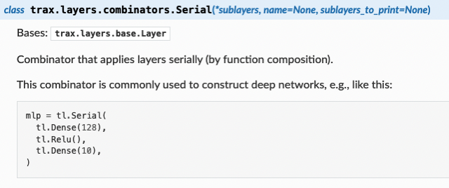</kbd>

       

      
      
<kbd>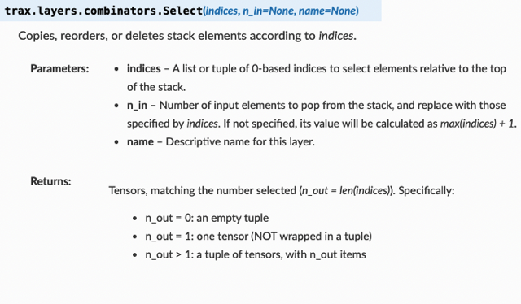</kbd>

       

      
      
<kbd>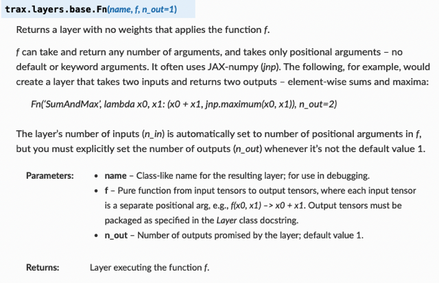</kbd>

       

      
      
<kbd>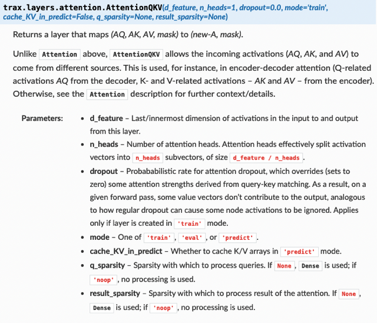</kbd>

       

      
      
<kbd>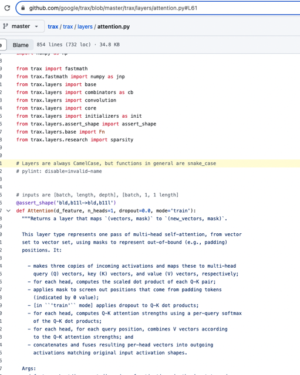</kbd>

      > [!NOTE]
      > https://github.com/google/trax/blob/master/trax/layers/attention.py#L61

       

      
      
<kbd>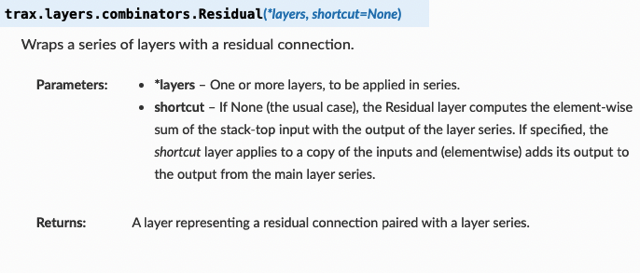</kbd>

       

      
      
<kbd>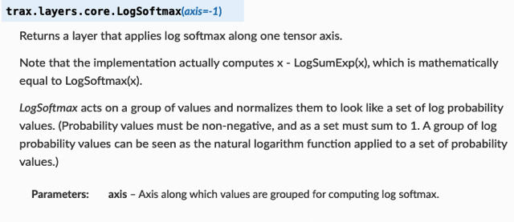</kbd>

       

      
      
<kbd>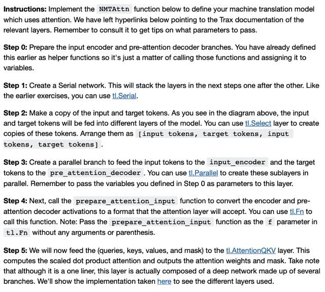</kbd>

       

      
      
<kbd>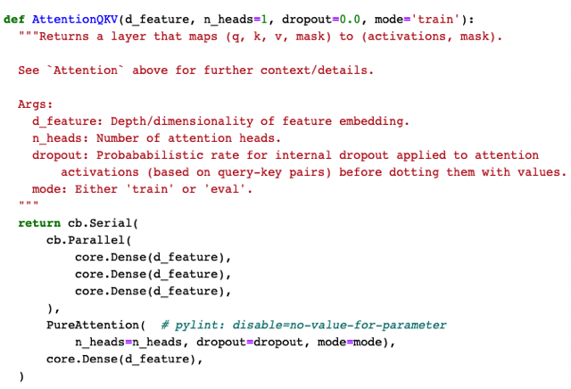</kbd>

      > [!NOTE]
      > Step 5: Đại khái là add skip connection (residual connection) bằng cách wrap
      > tl. AttentionQKV vào tl.Residual(), Như ta đã biết qua cái lab Semantic
      > Stacking, Khi đưa 3 input (Q,K,V) vào QKVAttention,  nó tranh thủ copy một
      > bản Q để riêng và add vào lại kết quả của QKVAttention. Khoan hãy nói tại sao
      > lại biết nó lấy Q để riêng mà không phải cái khác.
      >
      > Trước hết nói lại về bản chất mục đích của Residual Skip Connection. Đó là
      > nếu hiện tượng Gradient Vanishing xảy ra ở attention layer, tín hiệu (gradient)
      > sẽ bị mất, khiến quá trình backprop bị stop. Ở Attention layer này ta hiểu cơ
      > bản là Value (mọi encoder's hidden state) sẽ được weighted sum (theo
      > attention weights) để thành context vector (có shape vẫn y như hidden state,
      > thay thế cho last time-step hidden state của Original Seq2Seq model). Nói vậy
      > để nhấn mạnh rằng, Value mới là cái nhân tố chính, và việc giữ lãi Value nhờ
      > skip connection sẽ giúp nếu Vanishing Gradient có xảy ra, thì Value không bị
      > mất đi.
      >
      > Còn quay lại câu hỏi tại sao Residual nó lại lấy Value bỏ qua một bên thì bởi vì
      > khi đưa vào AttentionQKV, 3 tensor sẽ đưa vào theo thứ từ Q -> K -> V. Dẫn
      > đến trong stack sẽ lần lượt là (từ dưới lên trên) Q, K, V. Có nghĩa là cái trên
      > cùng của stack là V - Value. Và Residual nó sẽ lấy cái trên cùng, do đó chính
      > là Value được copy và "skip".

       

      
      
<kbd>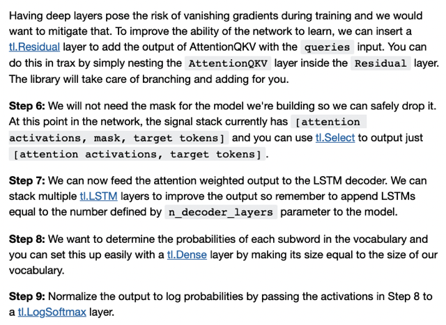</kbd>

      > [!NOTE]
      > Nói chung chỉ có cái vụ Select cũng như là hiểu rõ các cách hoạt
      > động của stack thôi. Còn những bước khác không khó. Để hiểu tham
      > khảo hình bên với ghi chút các element trong main stack

       

      
      
<kbd>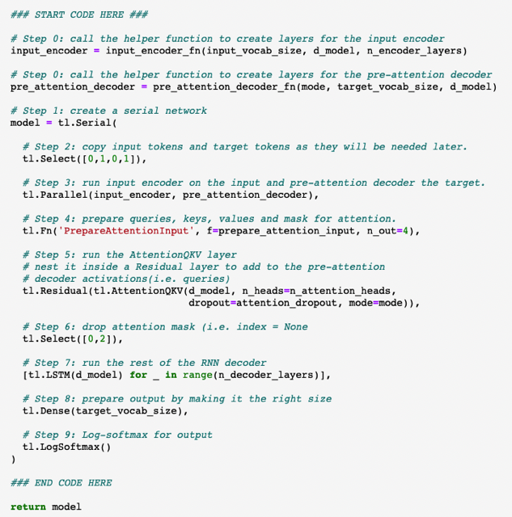</kbd>

      
<kbd></kbd>

      
<kbd>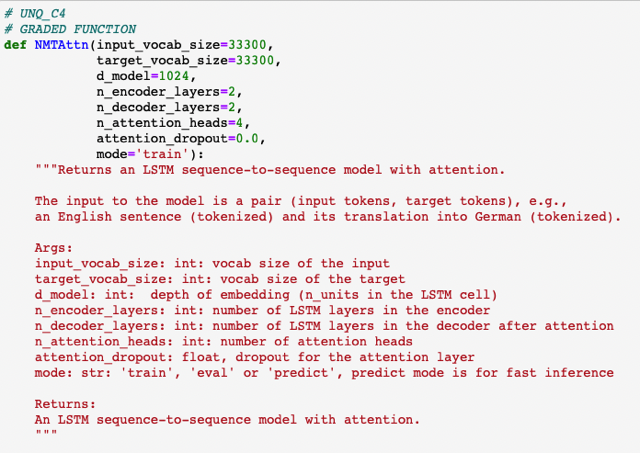</kbd>

       

      
      
<kbd>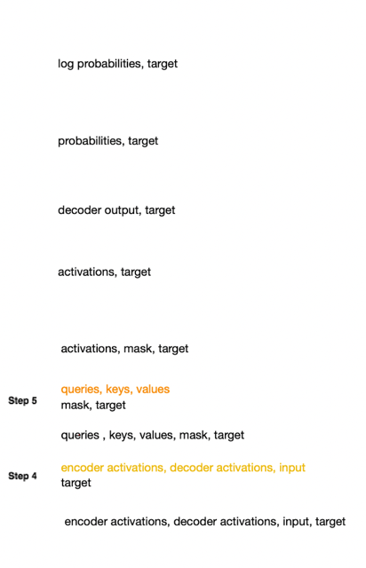</kbd>

      
<kbd>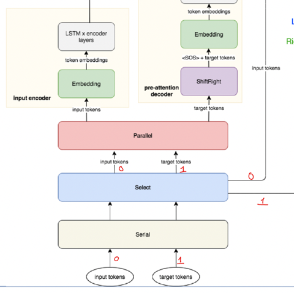</kbd>

      
<kbd>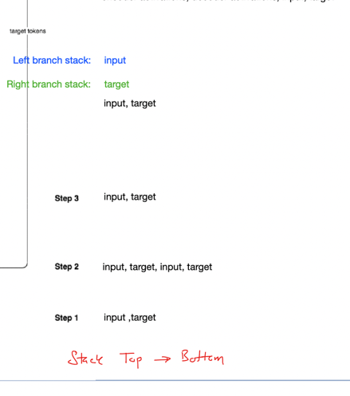</kbd>

      
<kbd>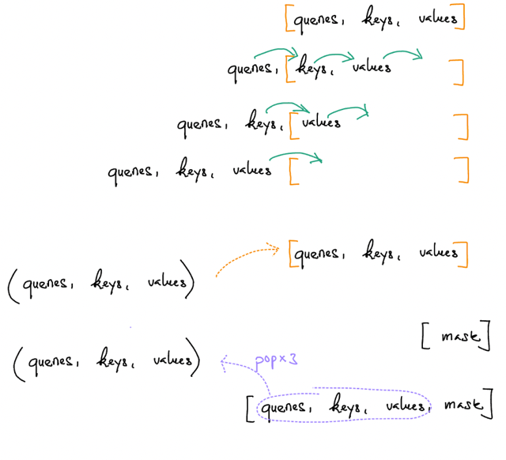</kbd>

      
<kbd>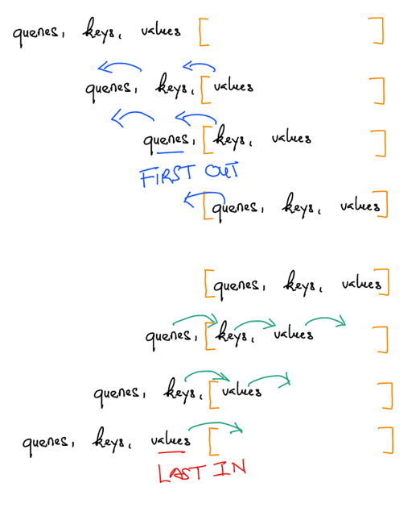</kbd>

      
<kbd></kbd>

      
<kbd></kbd>

      
<kbd></kbd>

      
<kbd></kbd>

      
<kbd></kbd>

      
<kbd>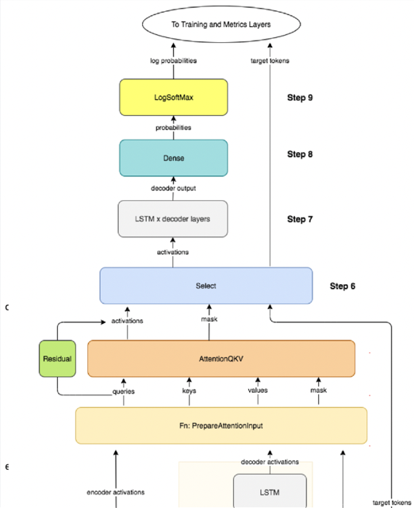</kbd>

      > [!NOTE]
      > Nguyên tắc: (đưa vào function (x0, x1)) thì x1 vào trước, x0 vào sau stack: x0 x1 -> [] = [x0 x1]
      >
      > Ví dụ:
      >
      > Trước Step 4: 
      > Main stack [**encoder activations, decoder activations**, **input**, target]
      >
      > ====
      >
      > Trong Step 4 là Fn layer với function prepare_attention_input được define như sau:
      >
      > def function prepare_attention_input(**encoder_activations, decoder_activations, inputs**):...
      >     ...
      >     return **queries, keys, values, mask**
      >
      > Do đó, tại đây nó lấy (Pop) ra 3 cái trên cùng là encoder activations, decoder activations, input
      > bỏ (Push) vào một sub stack theo thứ tự theo arg của function như trên:
      >
      > Sub stack: **[encoder activations, decoder activations, input]**
      > Main stack:**[target]**
      >
      > Tính toán xong, nó trả ra 4 cái **queries, keys, values, mask** theo thứ tự define trong function
      >
      > ====
      >
      > *Sau step 4, push 4 cái này vào main stack theo thứ tự (x1 x2 x3 x4) -> [x0] = [x1 x2 x3 x4 x0]
      > (queries, keys, values, mask) -> [inputs] = **[queries, keys, values, mask, target]**Main stack:**[queries, keys, values, mask, target]**

      > [!NOTE]
      > Trước step 5 Main stack:**[queries, keys, values, mask, target]**
      >
      > ====
      >
      > Trong step 5: Đầu tiên AttentionQKV nhận 3 input để cho qua 3 parallel Dense layers Do đó tại
      > đây nó sẽ lấy (Pop) 3 cái đầu trong stack ra là queries, keys, values.
      >
      > Rồi đưa vào sub stack (queries, keys, values) -> [] = **[queries, keys, values]** 
      > Main stack: [ mask, target]
      >
      > Rồi thằng
      > Residual, tranh thủ copy cái trên cùng ra để giữa lại cho skip connection thì chính là **queries.
      >
      > ====**Tính xong nó trả **ra attention activations**push vào lại main stack:
      >
      > Attention activation -> [mask, target] = **[Attention activation, mask, target]**
      >
      > Chính vì vậy khi qua Step 6 để bỏ mask đi thì Select([0, 2]

      > [!NOTE]
      > LAST IN, FIRST OUT: GIỜ MỚI THẬT SỰ HIỂU
      >
      > (X1 X2 X3) THEO THỨ TỰ X1 LÀ ĐẦU, X3 LÀ CUỐI
      >
      > ĐI VÀO STACK (PUSH) - LAST IN - THẰNG CUỐI X3 VÀO TRƯỚC
      >
      > LẤY RA STACK  (POP): FIRST OUT: THẰNG ĐẦU X1 RA TRƯỚC

      > [!NOTE]
      > LAST IN, FIRST OUT! THẰNG CUỐI VÀO TRƯỚC, THẰNG ĐẦU RA TRƯỚC

       

      
      
<kbd>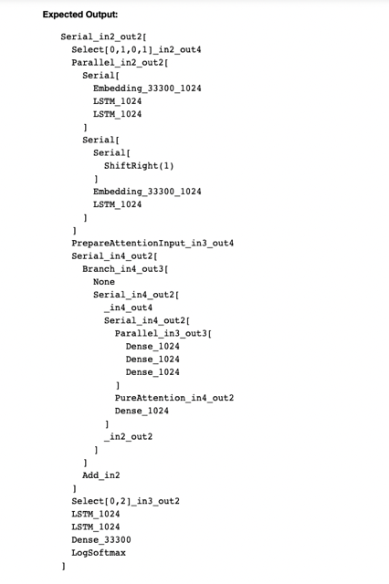</kbd>

      
<kbd></kbd>

      
<kbd>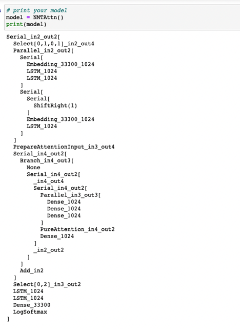</kbd>

       

- 3 - Training
   

  
  - 3.1 - TrainTask
     

  
  - Exercise 5 - train_task_function (UNQ_C5)
     

      
      
<kbd>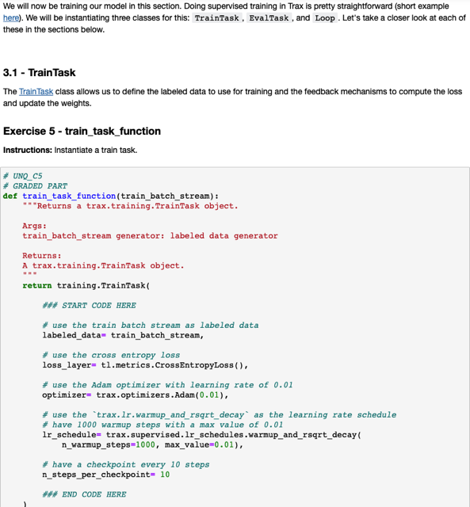</kbd>

      > [!NOTE]
      > Prepare function
      > create TrainTask với

       

      
      
<kbd>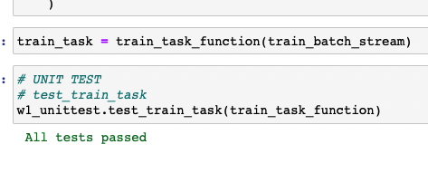</kbd>

       

  
  - 3.2 - EvalTask
     

      
      
<kbd>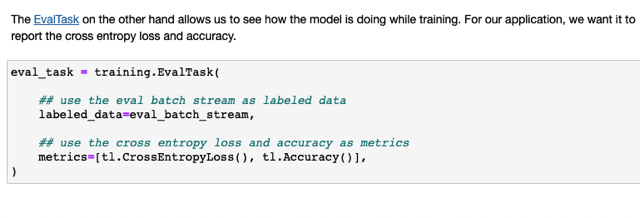</kbd>

       

  
  - 3.3 - Loop
     

      
      
<kbd>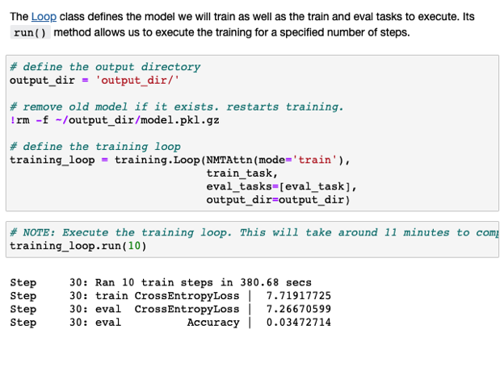</kbd>

       

- 4 - Testing
   

  
  - Testing
     

      
      
<kbd>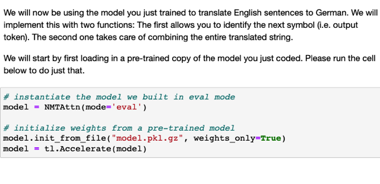</kbd>

      > [!NOTE]
      > Load pre-trained model (với
      > nhiều epoches hơn)

       

  
  - 4.1 - Decoding
     

      
      
<kbd>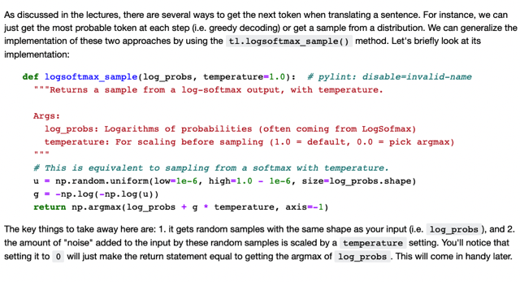</kbd>

      > [!NOTE]
      > Thì đại khái là như đã biết, với probability scores. Để 'kết luận' từ được dự
      > đoán của next time-step, có thể chọn từ có p cao nhất (greedy decoding) hoặc
      > random sampling (with distribution) như trong bài toán Dinosaur. Thì ở dưới
      > người ta cho function này có thể làm cả hai việc đó điều khiển bởi params
      > temperatures.
      >
      > Nếu temperature = 0, thì function cơ bản là greedy decoding (lấy
      > argmax(log_probs) - lấy index của cái có P cao nhất)  Nếu temperature = 1 thì
      > function nó trở thành random with distribution nhưng có thể gia giảm độ
      > random
      >
      > Cái này đã gặp ở P.A. Deep N-Gram rồi.

       

      
      
<kbd>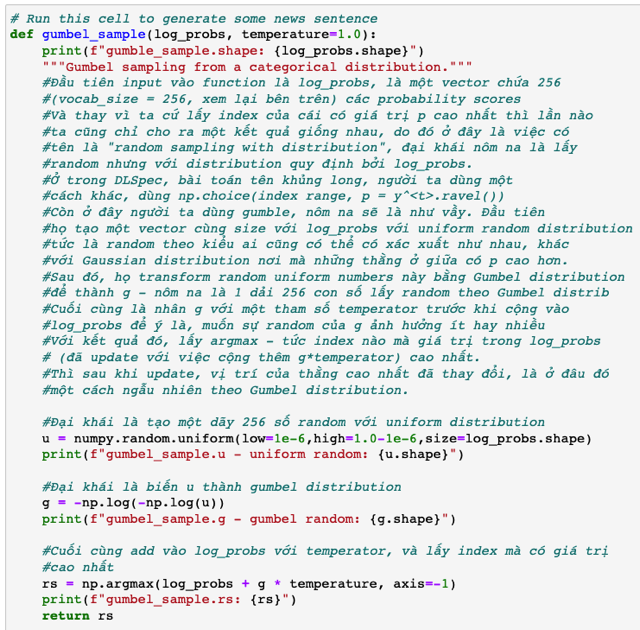</kbd>

      > [!NOTE]
      > Function từ P.A
      > Deep N-gram

       

      
      
<kbd>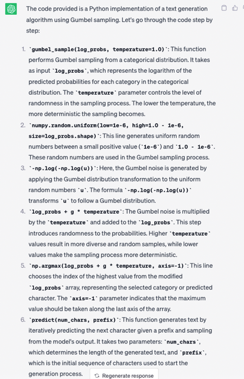</kbd>

       

      
      
<kbd>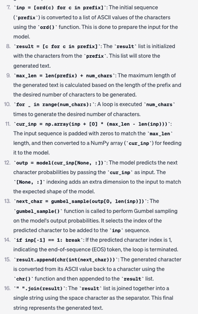</kbd>

       

    
    - is is  the similar 'random sampling with distribution" technique?  ChatGPT  Yes, Gumbel sampling with temperature can be considered a form of random sampling with a specific distribution. In this case, the Gumbel distribution is used as the underlying distribution for sampling. Random sampling with distribution involves drawing samples from a given probability distribution. In the case of Gumbel sampling, the goal is to sample from a categorical distribution. The Gumbel distribution is utilized to introduce randomness and exploration in the sampling process. The Gumbel distribution is often used to model extreme values and is defined by its shape and location parameters. By transforming uniform random numbers through the Gumbel distribution, Gumbel sampling allows us to select a category or item from a categorical distribution in a probabilistic manner. The temperature parameter in Gumbel sampling controls the level of randomness in the sampling process. Higher temperatures lead to more diverse and random samples, while lower temperatures make the sampling process more focused and deterministic. Therefore, Gumbel sampling with temperature can be seen as a form of random sampling with the Gumbel distribution, where the temperature parameter determines the level of exploration and randomness in the generated samples.
       

  
  - Exercise 6 - next_symbol (UNQ_C6)
     

      
      
<kbd>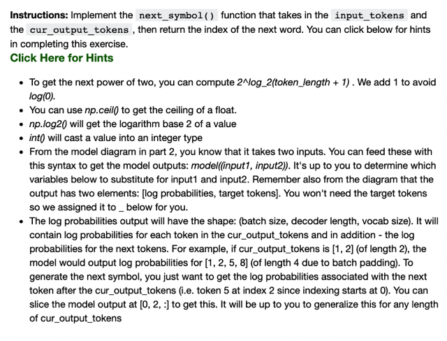</kbd>

       

      
      
<kbd>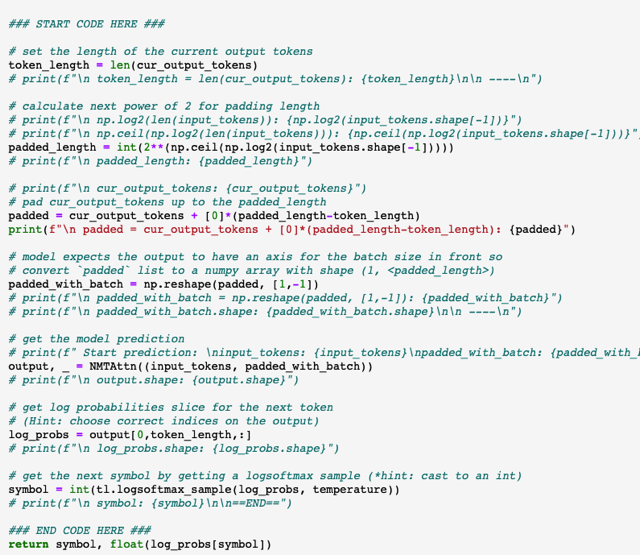</kbd>

      
<kbd></kbd>

      
<kbd>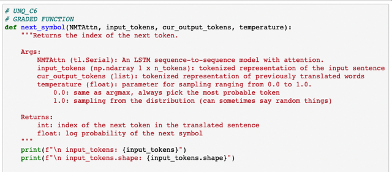</kbd>

      > [!NOTE]
      > T**ại sao lại không padding cho input tokens:**Lý do đó là vì KHÔNG
      > CẦN THIÊT vì thực ra model đang focus vào generating the translated
      > sequence thay vì processing cái input sequence. Vẫn chưa hiểu lắm, nhưng
      > mình hiểu rằng thật ra khi đưa input tokens vào model thì mục đích của việc
      > padding là để có thể đưa vào thành từng batch nhiều câu cùng lúc thì yêu
      > cầu phải padding để mọi câu đều bằng nhau.
      >
      > Còn nếu chỉ đưa vào 1 câu độc nhất thì rõ ràng là không cần padding làm
      > gì. (Nhưng vẫn phải có batch dimension.)
      >
      > Vậy câu hỏi lại là: **Tại sao phải padding cho current output?**

      > [!NOTE]
      > Giải thích: 
      >
      > Đầu tiên đại khái là add pad vào cái current_output_tokens 
      > Dựa vào input_tokens có shape = (batch, sequence length) = (1, n_tokens) 
      > ta lấy ra chiều dài của sequence's length bằng cách lấy kích thước của 
      > dimension cuối của nó input_tokens.shape[-1] = n_tokens.
      >
      > Với sequence length, ta mới 'tính' là nó thuộc loại (bucket) nào để tính ra
      > kích thước sẽ được pad (hay sau khi pad) tương ứng. Như đã nói, ở đây
      > người ta chia các câu thành các bucket để thực hiện pad đến kích thước
      > tương ứng lấy bằng luỹ thừa 2 gần nhất. Mục đích là để 'tiết kiệm' số lượng
      > padding. Ví dụ 5,6,7 sẽ pad để thành sequence length = 2**3 = 8.
      >
      > Do đó, với kích thước của input sequence là n_tokens, làm sao để tính được
      > kích thước sau khi padding tương ứng.
      >
      > Thì cách làm đó là: Ví dụ seq len = 5
      > Ta sẽ tính log base 2 của sequence's length = 2.33  (dùng np.log2(..))
      > Sau đó làm tròn lên thành số nguyên gần nhất = 3 (dùng np.ceil(..))
      > Thì kích thước sẽ hướng tới sau padding là 2**3 = 8
      >
      > ====
      >
      > Sau khi biết phải kích thước sau khi pad rồi thì thực hiện add pad:
      > padded = cur_output_tokens + [0]*(padded_length-token_length)
      >
      > Cách dùng [a]*5 = [a, a, a, a, a] đã quen thuộc.
      >
      > Kế tiếp như trong comment đã nói và cũng đã gặp nhiều đó là trước khi đưa
      > vào model phải có batch dimension ở đầu, nên dùng reshape(1,-1) để insert
      > một dimension vào để được (1, 8)
      >
      > ====
      >
      > Đến đây thì đưa inputs tokens và padded_with_batch vào model (và phải 
      > dưới dạng tuple mới đúng).

       

      
      
<kbd>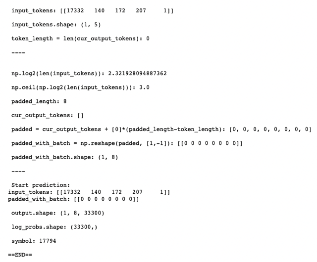</kbd>

       

    
    - In the provided code, it appears that padding is not added to the `input_tokens` before model inference. However, it does add padding to the `cur_output_tokens`. Let's go through the code and understand the reasoning behind this:  1. `input_tokens`: These are the tokens representing the input sentence. It seems that padding is not added to the `input_tokens` because the code is focused on generating the next symbol in the translated sentence (`cur_output_tokens`) rather than processing the input sequence. The model's attention mechanism takes care of aligning input and output tokens during inference.  2. `cur_output_tokens`: These are the tokens generated so far in the translated sentence. Padding is added to `cur_output_tokens` to ensure that they have the same length as the `input_tokens` before passing them to the model for generating the next symbol. This is done so that both the input and output sequences have consistent dimensions when passing them through the model.  3. Padding Length: The code calculates the next power of 2 for the padding length. This is determined by the length of the `input_tokens`. The purpose of padding with the next power of 2 is likely to optimize memory usage and computation efficiency in some contexts. By using the next power of 2, you ensure that the padded sequence length aligns well with hardware and software optimization strategies that leverage power-of-two sizes.  4. Model Inference: The padded `cur_output_tokens` are reshaped into a numpy array with shape `(1, padded_length)` to represent a batch of size 1. This shape is expected by the model's inference process.  5. Generating Next Symbol: The model is then used to predict the next token in the translated sentence based on both the input tokens and the padded output tokens. Log probabilities for the next token are extracted from the model's output.  6. Sampling: The `tl.logsoftmax_sample` function is used to perform probabilistic sampling based on the log probabilities of the next symbol. This sampling introduces controlled randomness, controlled by the `temperature` parameter.  To summarize, padding is added to the `cur_output_tokens` to ensure that they have the same length as the `input_tokens` before passing them to the model for generating the next symbol. Padding is not added to `input_tokens` likely because the focus of this code is on generating the translated sentence rather than processing the input sequence.
       

      
      
<kbd>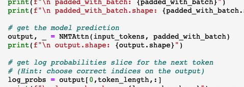</kbd>

      
<kbd></kbd>

      
<kbd>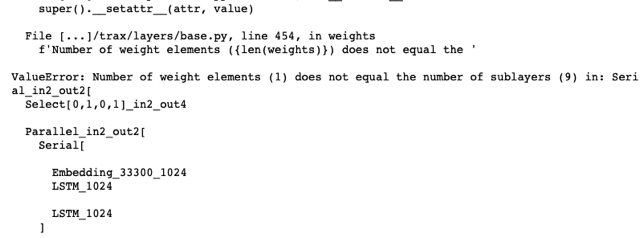</kbd>

      > [!NOTE]
      > ERROR: Không để 2 input vào model trong tuple thì nó ra lỗi này.
      > Không biết có phải hiểu đúng không nhưng mình hiểu là nó kêu chỉ
      > thấy có 1 element trong khi layer này Select[01,0,1] yêu cầu 2
      >
      > Bỏ vào dạng tuple thì Đúng

       

      
      
<kbd>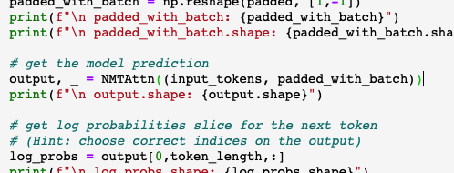</kbd>

      
<kbd></kbd>

      
<kbd>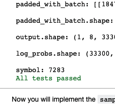</kbd>

       

  
  - Exercise 7 - sampling_decode (UNQ_C7)
     

    
    - Now you will implement the sampling_decode() function. This will call the next_symbol() function above several times until the next output is the end-of-sentence token (i.e. EOS). It takes in an input string and returns the translated version of that string.
       

        
        
<kbd>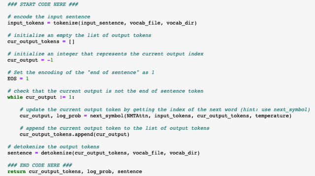</kbd>

        
<kbd></kbd>

        
<kbd>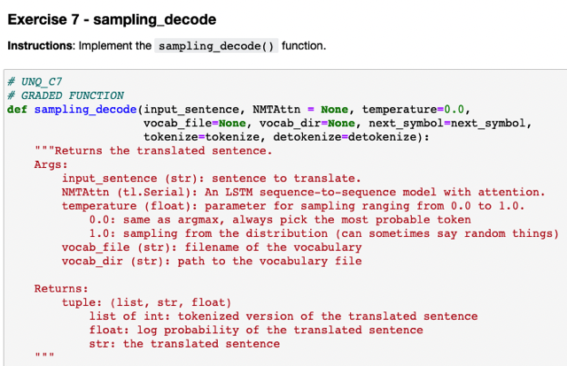</kbd>

        > [!NOTE]
        > Giải thích: 
        >
        > Dùng function **tokenize**() chuẩn bị ở lúc đầu **để tokenize, biến sentence text thành
        > sequence of token index.**
        >
        > Dùng function **next_symbol** ở trên với input_tokens và current_output_tokens bắt
        > đầu initialize với [] để function này nó..
        >
        > 1. Add **zero pad vào current_output_tokens**cho **đủ kích thước quy định** dựa vào
        > độ dài của **input_tokens**.
        >
        > 2. Bỏ **input_tokens và current_output_tokens vào model** để nó **predict ra tensor of
        > probability scores** cho mỗi token (time-step)
        >
        > 3. Dùng function **tl.logsoftmax_sample** để**'CHỌN' ra next token**theo greedy decoding
        > hay random sampling tuỳ theo temperature
        >
        > Add token được chọn vào **current_output_tokens**.
        >
        > Lặp lại cho đến khi gặp **<EOS>** token.

         

        
        
<kbd>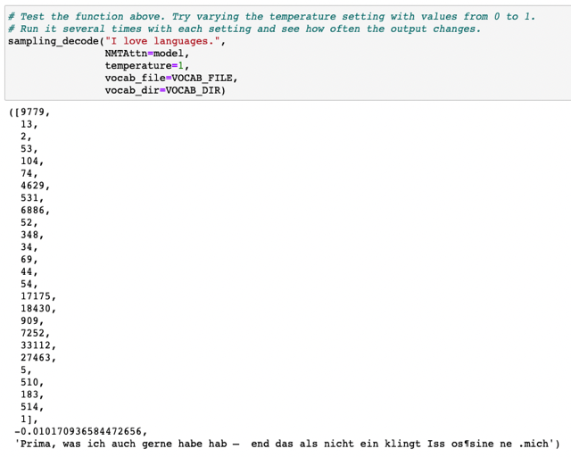</kbd>

        
<kbd></kbd>

        
<kbd>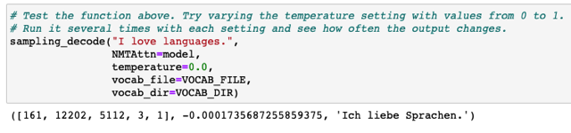</kbd>

         

        
        
<kbd>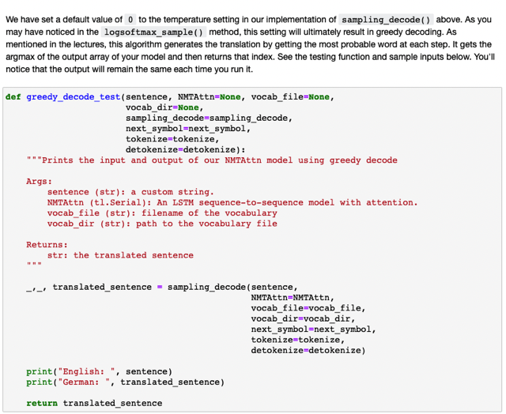</kbd>

        > [!NOTE]
        > Đơn giản là viết function thực hiện
        > greedy_decode_test trong đó nhận sentence, và
        > dùng sampling_decode với default temperature = 0
        > để model generate và lấy cái có p cao nhất.

         

        
        
<kbd>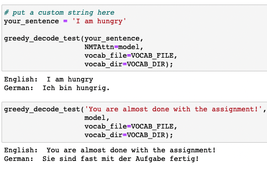</kbd>

         

  
  - 4.2 - Minimum Bayes-Risk Decoding
     

    
    - As mentioned in the lectures, **getting the most probable token**  at each step **may not necessarily produce the best results**.  Another approach is to do **Minimum Bayes Risk Decodin**g or MBR.   The general steps to implement this are:  1 **take several random samples**  2 **score each sample against all other samples**  3 **select the one with the highest score**  You will be building **helper functions** for these steps in the following  sections.
      > [!NOTE]
      > Như đã biết trong lecture, là dùng greedy decoding với mỗi từ
      > lấy từ p cao nhất tại mỗi time-step nhưng không phải luôn tạo ra
      > CÂU tốt nhất. Nên ở đây ta sẽ dùng phương thức MBR.
      >
      > Đại khái là tạo một số câu với sampling, sau đó chọn ra cái có
      > độ similarity trung bình với những cái khác cao nhất

       

  
  - 4.2.1 - Generating Samples
     

    
    - First, let's build a function to generate several samples. You can use the sampling_decode() function you developed earlier to do this easily. We want to record the token list and log probability for each sample as these will be needed in the next step.
       

        
        
<kbd>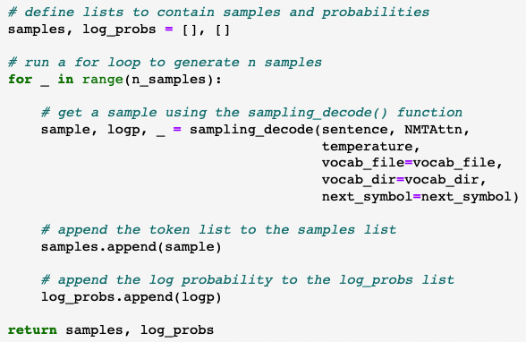</kbd>

        
<kbd></kbd>

        
<kbd>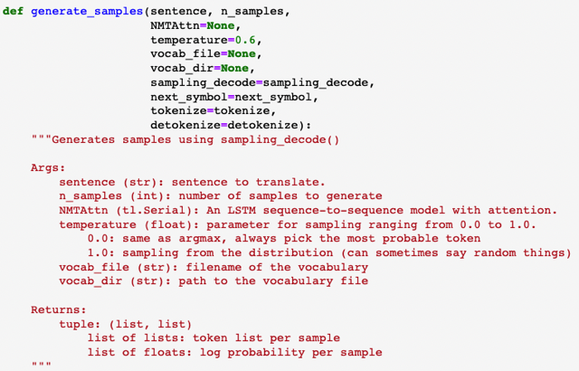</kbd>

        > [!NOTE]
        > Không có gì khó hiểu, chỉ loop trong n_samples để dùng
        > function sampling_decode với temperature default = 0.6 (để
        > random sampling) tạo các sampling.

         

        
        
<kbd>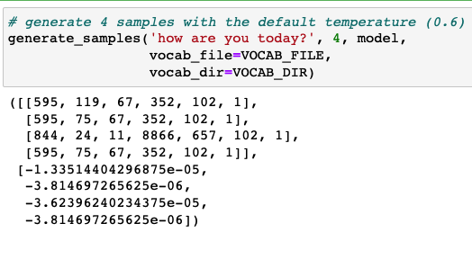</kbd>

         

  
  - 4.2.2 - Comparing Overlaps
     

      
      
<kbd>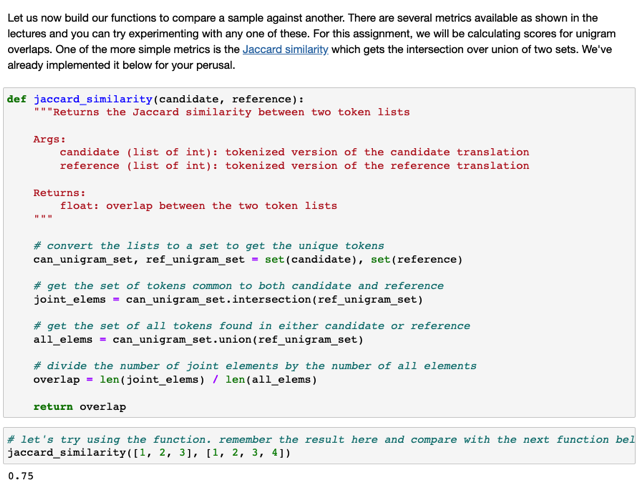</kbd>

      > [!NOTE]
      > Đại khái là để tính similarity score của các câu với nhau (để từ đó tính
      > average score của 1 câu với các câu khác và dùng nó để so sánh lấy ra
      > câu có average similarity score cao nhất) thì có nhiều cách. Ở đây người ta
      > chuẩn bị cho function làm theo cách Jaccard similarity.
      >
      > Cơ bản là nó sẽ **đếm các unigram mà overlap giữa hai câu - intersection,
      > chỉ cho tổng số tất cả các unigram - union**.  Chỉ số này y như IOU (cũng là
      > Intersection over Union) dùng trong Object detection để chọn bounding box
      > vậy.

       

    
    - One of the more commonly used metrics in machine translation is the ROUGE score. For unigrams, this is called **ROUGE-1** and as shown in class, you can **output the scores for both precision and recall** when comparing two samples. To get the final score, you will want to compute the **F1-score** as given by:
      
<kbd>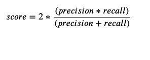</kbd>

      
<kbd></kbd>

       

  
  - Exercise 8 - rouge1_similarity (UNQ_C8)
     

      
      
<kbd>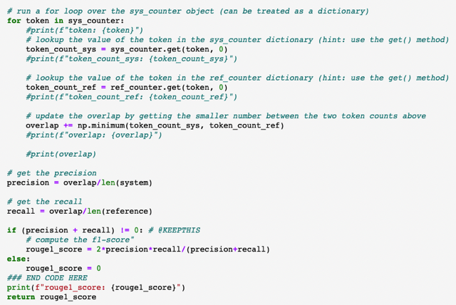</kbd>

      
<kbd></kbd>

      
<kbd>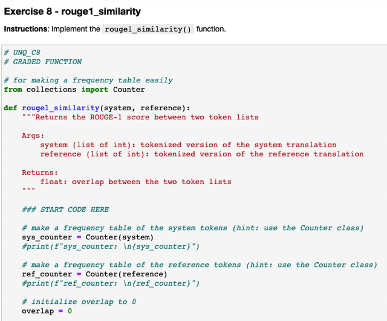</kbd>

      > [!NOTE]
      > Function này nhận 2 sequence of token indices. Ta sẽ bỏ vào Counter để nó tạo ra
      > kiểu như dictionary, map giữa token id với số lần xuất hiện trong sequence.
      >
      > Loop qua các token của system - model's generated sequence. Dùng counter.get() lấy
      > số lần xuất hiện của nó trong system sequence và reference sequence.
      >
      > Sau đó min của chúng chính là số overlap đối với token đó. Ví dụ system có 3 từ "apple"
      > mà reference có 5 từ "apple" thì có nghĩa là hai câu overlap nhau 3 từ "apple" (*)
      >
      > Đem cộng dồn vào overlap. Cuối cùng ta sẽ có overlap = Tổng số từ của câu system 
      > overlap với câu reference.
      >
      > Để tính precision, ta nhớ precision là "trong tổng số các prediction thì có bao nhiêu là 
      > prediction đúng" - tương đương là "trong tổng số các từ generate bởi model = tổng
      > số từ của system sequence = len(system), thì có bao nhiêu từ đúng = có xuất hiện trong
      > reference = overlap". Dẫn đến **Precision = overlap / len(system)**
      >
      > Để tính Recall, ta nhớ Recall là "trong tổng số các ca có ground truth là positive thì có 
      > bao nhiêu là prediction đúng" - tương đương là "trong tổng số các từ trong reference = tổng
      > số từ của reference sequence = len(reference), thì có bao nhiêu từ đúng = có xuất hiện trong
      > reference = overlap". Dẫn đến **Recall = overlap / len(reference)**
      >
      > ====
      >
      > (*) Chú ý quan trọng ở đây là **nếu tại một token nào đó không xuất hiện trong
      > reference** - đồng nghĩa **cũng không xuất hiện trong ref_counter** thì khi lấy
      > token_counter_ref = r**ef_counter.get(token)** sẽ ra **NONE**.
      >
      > Dẫn đến f**unction np.minimum()** giữa một None và một integer **sẽ bị lỗi.** Đó là lí do
      > khiến unit test không pass.

       

      
      
<kbd>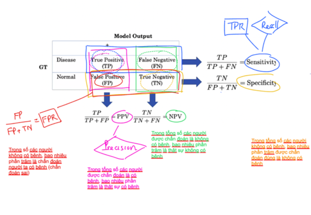</kbd>

       

      
      
<kbd>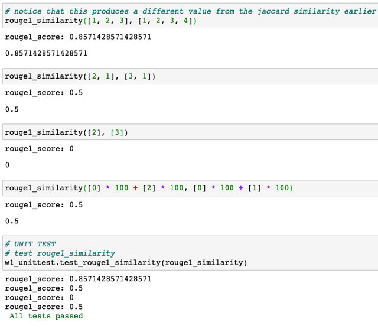</kbd>

       

  
  - 4.2.3 - Overall Score
     

      
      
<kbd>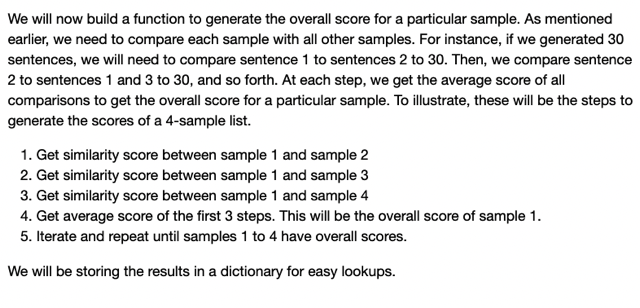</kbd>

       

  
  - Exercise 9 - average_overlap (UNQ_C9)
     

      
      
<kbd>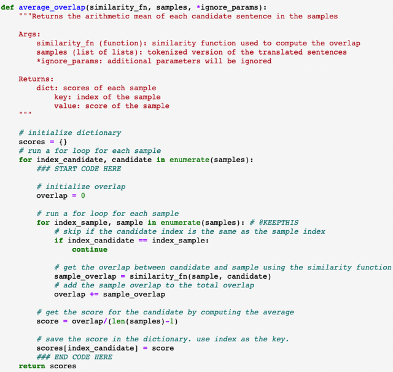</kbd>

      > [!NOTE]
      > Dùng hai loop để lần lượt tính " average similarity" giữa từng sample với tất
      > cả các sample khác
      >
      > CHÚ Ý LÀ VÌ TA KHÔNG "TÍNH" / INCLUDE SIMILARITY CỦA MỘT
      > SAMPLE VỚI CHÍNH NÓ NÊN KHI TÍNH AVERAGE THÌ PHẢI CHIA CHO
      > LEN(SAMPLES) - 1.
      >
      > Tuy là nếu không -1 thì chẳng ảnh hưởng gì vì không làm  thay đổi thứ tự
      > điểm số cao thấp nhưng không pass được unit test

       

      
      
<kbd>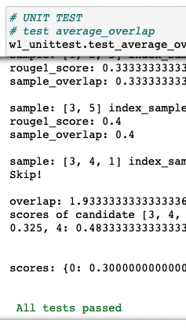</kbd>

       

    
    - In practice, it is also common to see the **weighted mean** being used to **calculate the overall score** instead of just the **arithmetic mean**. We have implemented it below and you can use it in your experiements to see which one will give better results.
       

        
        
<kbd>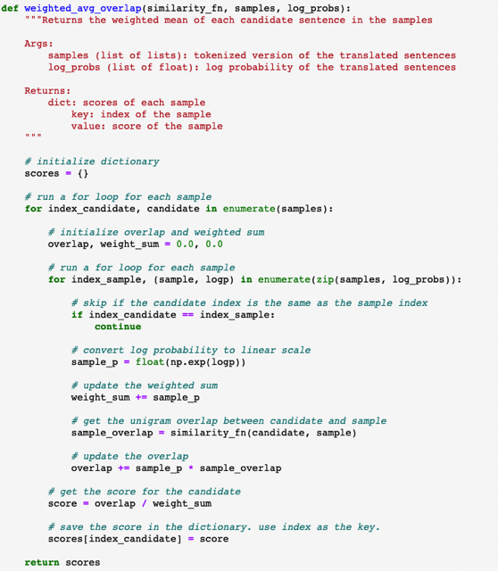</kbd>

        > [!NOTE]
        > Y như function trên, chỉ có khác đó là nó có tính
        > thêm probability cao hay thấp. Cụ thể
        >
        > Khi tính **similarity của sample a với sample b**
        > nó sẽ **nhân thêm với weight là np.exp(logprob của b)**Hiệu quả của việc này là nó sẽ tính đến ảnh hưởng của
        > probability nữa. Theo GPT là nó sẽ**tăng ảnh hưởng của
        > sample có probability cao lên**

         

  
  - 4.2.4 - Putting it all Together
     

    
    - We will now p**ut everything together** and develop the **mbr_decode**() function. Please use the helper functions you just developed to complete this. You will want to **generate samples**, **get the score for each sample**, **get the highest score among all samples**, then **detokenize this sample to get the translated sentence**
      > [!NOTE]
      > Ta sẽ generate samples, tính average similarity với mỗi
      > sample với các sample còn lại. Chọn ra thằng có avg
      > score cao nhất. Detokenize để chuyển lại thành text
      > sentence

       

  
  - Exercise 10 - mbr_decode (UNQ_C10)
     

      
      
<kbd>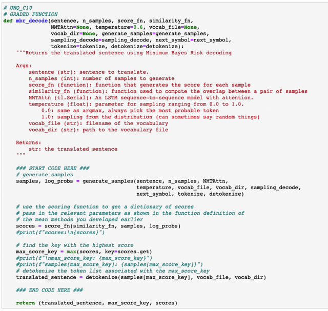</kbd>

      > [!NOTE]
      > Tổng hợp lại, chỉ có chỗ max_score_key là vì scores là
      > dictionary, nên phải dùng kiểu này để lấy key có max
      > value

       

      
      
<kbd>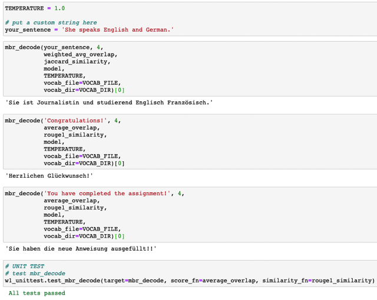</kbd>

       

  
  - Congratulations! Next week, you'll dive deeper into attention models and study the **Transformer** architecture. You will build another network but without the recurrent part. It will show that attention is all you need! It should be fun!
    > [!NOTE]
    > Tuần sau ta sẽ gặp lại
    > ông kẹ Transformer

     

<kbd></kbd>

> [!NOTE]
> Nghĩ về cách có labeled data. Và một cách rất hay là
> self-labeled data. Như predict future event và xem nó có
> đúng ko -> Label. Che từ đi và predict -> Label

 

