# C4w3 - Question Answering

📊 **Progress:** `119` Notes | `197` Screenshots

---

Explore transfer learning with state-of-the-art models like T5 and BERT, then build a 
model that can answer questions.

Learning Objectives

 • Gain intuition for how transfer learning works in the context of NLP
 • Identify two approaches to transfer learning
 • Discuss the evolution of language models from CBOW to T5 and Bert
 • Fine-tune BERT on a dataset
 • Implement context-based question answering with T5
 • Interpret the GLUE benchmark

## Week 3 Overview

 

### Here are the main ideas extracted from the lecture text in numerical order:

> [!NOTE]
> Here are the main ideas extracted from the lecture text in numerical order:
>
> 1. Introduction to**transfer learning** as a **new concept** in the course, which **improves results**
> and**speeds up training**.
>
> 2. Discussion of q**uestion answering**, both **context-based** and **closed book question
> answering**.
>
> 3. Highlighting the importance of **innovations in training methods**for improving
> performance.
>
> 4. Comparison of**classical training to transfer learning**, emphasizing **the use of pre-trained
> model weights.**
>
> 5. Demonstrating the **application of transfer learning to various tasks**, such as **sentiment
> classification** and **question answering**.
>
> 6. Explanation of **BERT** and its use of **bi-directional context.**
>
> 7. Comparison of **single task models to multi-task models using T5**.
>
> 8. Emphasis on **the importance of data size in transfer learning**, with examples of dataset
> sizes.
>
> 9. **Desirable goals for transfer learning**, including **reducing training time**, **improving
> predictions, and needing less data.**
>
> 10. Excitement for the upcoming exploration of transfer learning in the next video.

 

<kbd>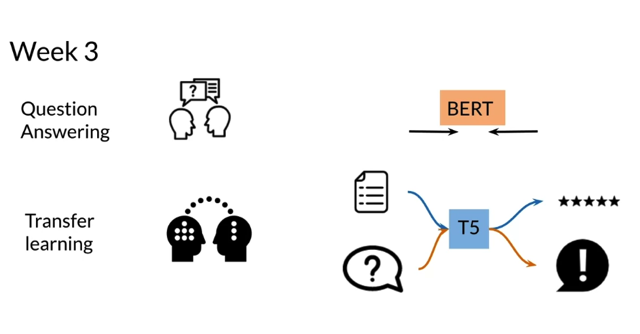</kbd>

   

<kbd>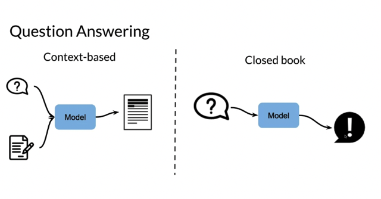</kbd>

   

<kbd>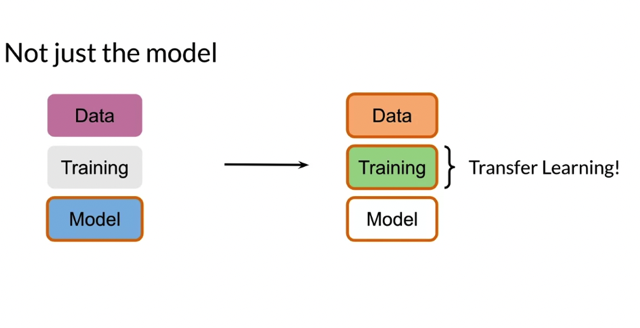</kbd>

   

<kbd>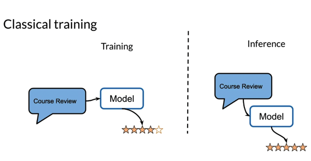</kbd>

   

<kbd>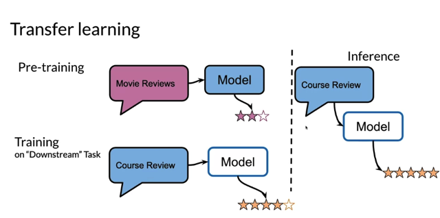</kbd>

   

<kbd>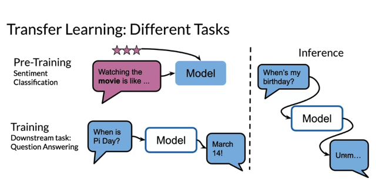</kbd>

   

<kbd>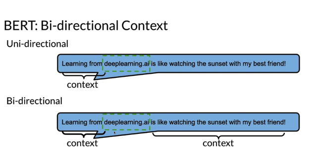</kbd>

   

<kbd>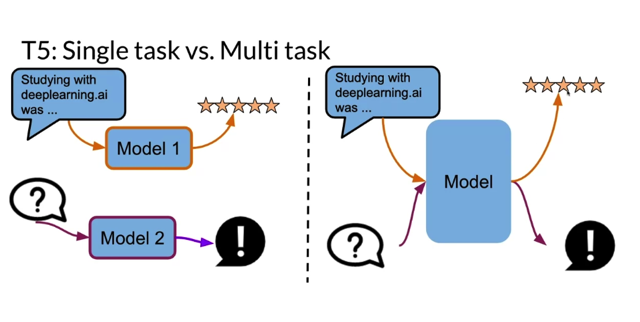</kbd>

   

<kbd>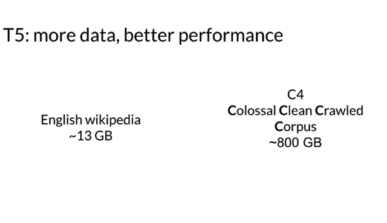</kbd>

   

<kbd>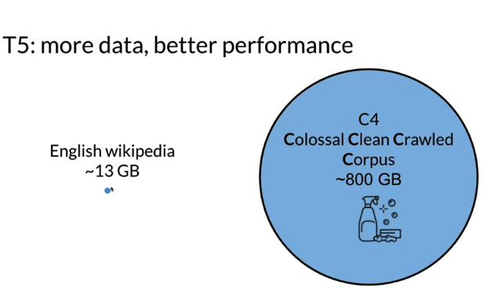</kbd>

   

<kbd>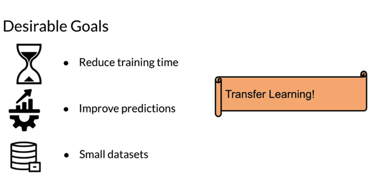</kbd>

   

## Transfer Learning In NLP

 

### Here are the main ideas extracted from the lecture text in numerical order:

> [!NOTE]
> Here are the main ideas extracted from the lecture text in numerical order:
>
> 1. Introduction to the lecture topics, including transfer learning with the full transformer, 
> **BERT** (Bidirectional Encoder Representation for Transformers), and the **T5** model.
>
> 2. Explanation of what**transfer learni**ng is and its relevance to NLP tasks.
>
> 3. Overview of **two basic forms**of transfer learning: **feature-based learning** and **fine-
> tuning.**
>
> 4. Discussion of **pre-trained data** and **pre-training tasks**, such as language modeling.
>
> 5. Exploration of**general-purpose learning**, including **word embeddings** and their 
> application to translation tasks.
>
> 6. Comparison between**feature-based** and **fine-tuning approaches**with visual examples.
>
> 7. Detailed explanation of**fine-tuning**, including how it can be added to a model and its 
> role in downstream tasks.
>
> 8. Emphasis on the significant **impact of data on model performance**, with examples 
> showing the relationship between data size and outcomes.
>
> 9. Explanation of the **availability of labeled and unlabeled data** and **their relevance in self-
> supervised tasks**.
>
> 10. Illustration of **self-supervised learning through language modeling**, using **unlabeled 
> data** to create **input features and targets.**
>
> 11. Discussion of fine-tuning a pre-trained model for various downstream tasks like 
> **translation, summarization, and question answering**.
>
> 12. Summary of key points, including the use of transfer learning for feature-based or 
> fine-tuning approaches, the importance of data, and the role of pre-training tasks.
>
> 13. Mention of the advantages of transfer learning.
>
> These points provide an overview of the lecture's main concepts and topics related to 
> transfer learning in NLP.

 

<kbd>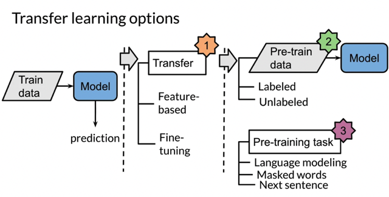</kbd>

> [!NOTE]
> Đại khái là **Transfer learning** có 2 dạng: **Feature-bases** ví dụ
> word embedding được tạo ra từ việc training model ví dụ
> như CBOW. **Fine-tuning** thì là dùng pre-trained model và
> thay đổi (tweak) weights của nó một chút để dùng nó cho
> bài toán của mình.

   

<kbd>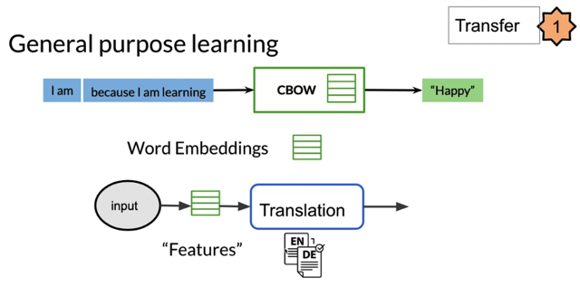</kbd>

> [!NOTE]
> Đại khái là nói về cái 'kiểu' Transfer learning thứ nhất
> khi dùng ví dụ như CBOW model để training Word
> Embeddings. Rồi dùng word embedding đó để
> training Translation model.

   

<kbd>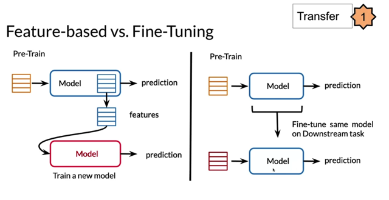</kbd>

> [!NOTE]
> Đại khái là với **feature-based** transferred
> learning thì ta sẽ sử dụng features của pre-trained
> model. Còn với **Fine-tuning**, thì ta sử dụng bản
> thân model cho một task khác.

   

<kbd>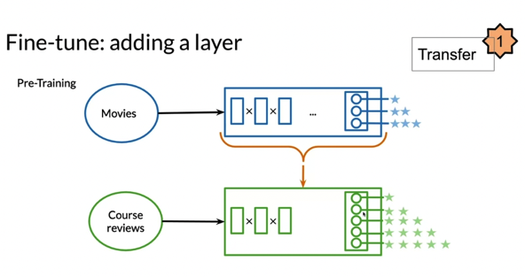</kbd>

> [!NOTE]
> Ví dụ, pre-train model dự đoán movies reviews sau đó
> freeze mọi weights layer của nó, và thêm FF layer ở cuối và
> train nó cho bài toán Course reviews.

   

<kbd>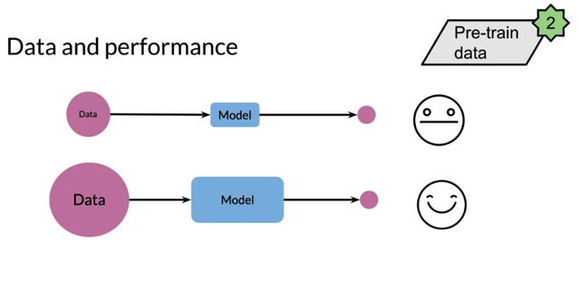</kbd>

> [!NOTE]
> Đại khái là với pre-train model, thì
> càng được train trên bộ data lớn
> thì model càng tốt.

   

<kbd>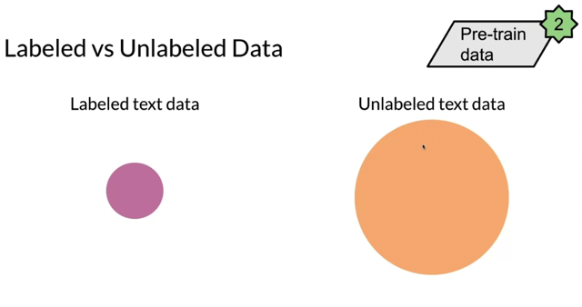</kbd>

> [!NOTE]
> Ý nói thường ta có nhiều
> unlabeled data hơn labeled data

   

<kbd>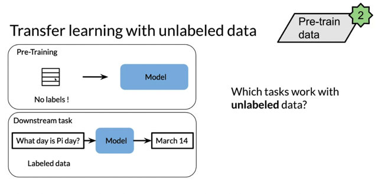</kbd>

> [!NOTE]
> Đây ý nói pre-trained model có thể được train theo kiểu
> un-supervised learning hay self-supervised learning. Rồi
> dùng nó để train tiếp downstream task với labeled data
> supervised learning.

   

<kbd>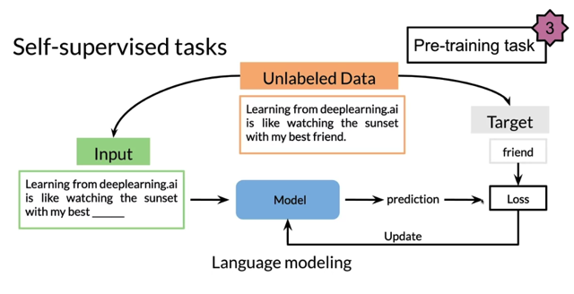</kbd>

> [!NOTE]
> Ví dụ về self-supervised tasks, ta dùng tuy là
> unlabeled data nhưng thực chất là
> self-labeled (che chữ đi, predict)

   

<kbd>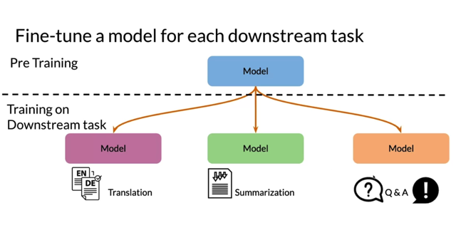</kbd>

> [!NOTE]
> Đại khái là dùng một model được pre-trained với task
> khác, train nó với các downstream task khác như
> translation, summarization, Q&A.

   

<kbd>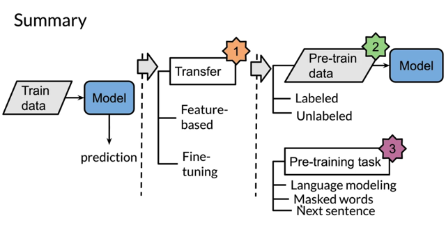</kbd>

   

## (reading) Transfer Learning

 

## Elmo, Gpt, Bertm T5

 

<kbd>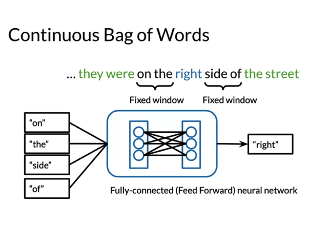</kbd>

 

<kbd>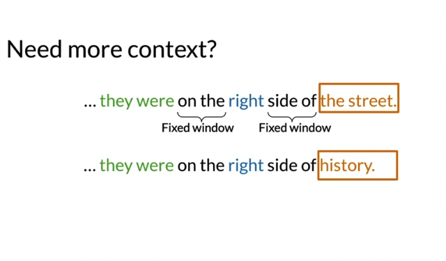</kbd>

> [!NOTE]
> Ý là hạn chế của CBOW là **đóng khung context
> của một từ trong phạm vi của một context window**

 

<kbd>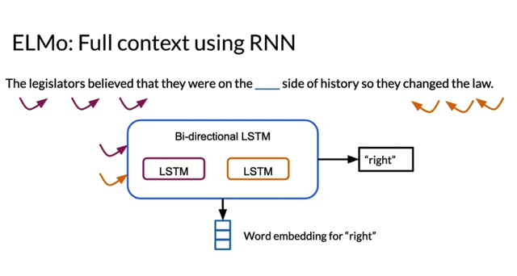</kbd>

> [!NOTE]
> Người ta khắc phục việc hạn chế context trong context
> window của CBOW bằng cách dùng **bidirectional
> RNN/LSTM**

 

<kbd>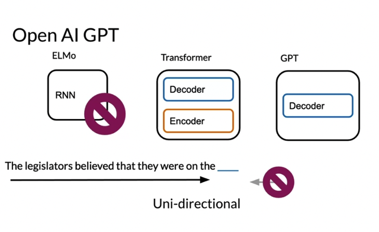</kbd>

> [!NOTE]
> Nhưng với **ELMO** thì nó
> chỉ có **1 direction**

 

<kbd>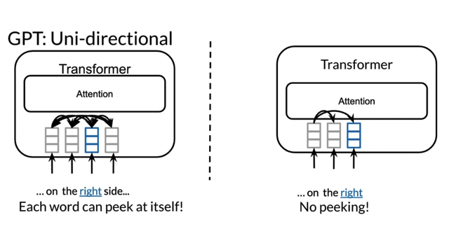</kbd>

> [!NOTE]
> Với GPT thì cũng ch**ỉ Uni-directional**- trong **Causal attention**

 

<kbd>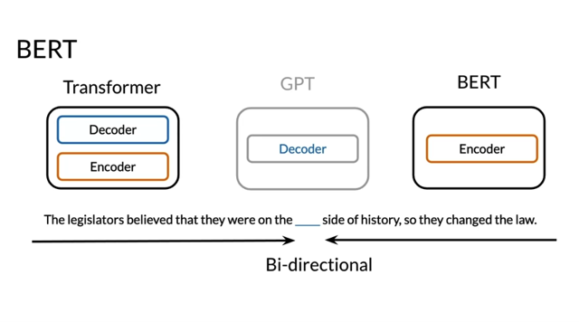</kbd>

> [!NOTE]
> BERT thì nó là
> **Bi-directional**

 

<kbd>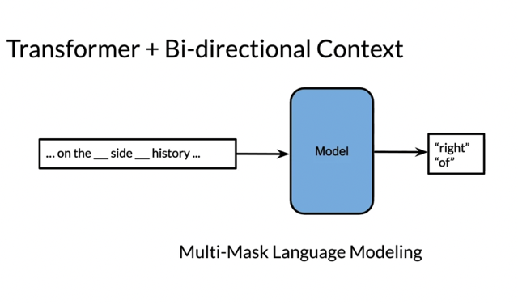</kbd>

 

<kbd>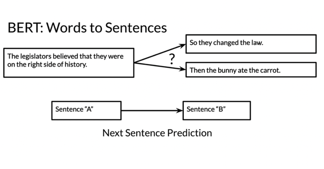</kbd>

 

<kbd>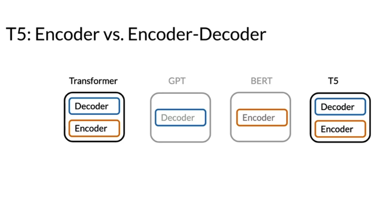</kbd>

 

<kbd>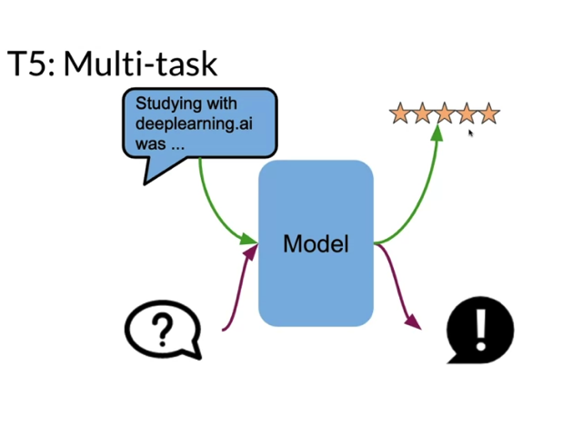</kbd>

 

<kbd>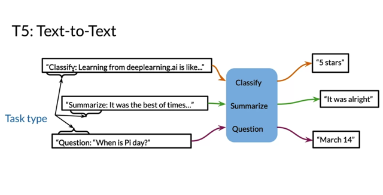</kbd>

> [!NOTE]
> Đại khái là với T5 ta có thể multi-task, với các task type
> (ideas của prompt trong LLM) khác nhau, model sẽ
> generate prediction tương ứng

 

<kbd>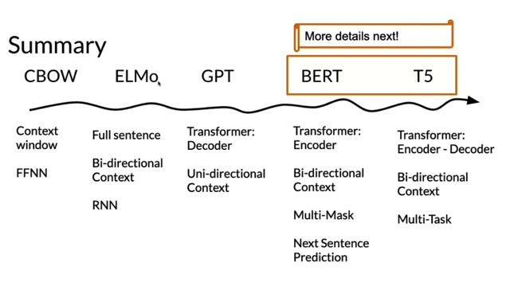</kbd>

 

## Bidirectional Encoder

> [!NOTE]
> BIDIRECTIONAL ENCODER
> REPRESENTATIONS FROM
> TRANSFORMERS (BERT)

 

### 1. **Introduction to BERT**: **Bidirectional Encoder Representations for Transformers**.

> [!NOTE]
> 1. **Introduction to BERT**: **Bidirectional Encoder Representations for Transformers**.
>
> 2. **Directionality**: BERT p**rocesses inputs from two directions**.
>
> 3. **Architecture**: BERT is a **multi-layer bidirectional transformer** utilizing **positional embeddings**. 
>
> 4. **BERT's Base**: Has 1**2 transformer blocks, 12 attention heads, and 110 million parameters**.
>
> 5. **Framework**: Comprises two main steps: 
>    -**Pre-training**: Training on **unlabeled data**.
>    - **Fine-tuning**: Uses p**re-trained parameters** and **fine-tunes with labeled data**.
>
> 6. **Input and Output**: Starts with**input embeddings** (E_1 to E_n), **goes through transformer 
> blocks**, and **results in outputs (T_1 to T_n).**
>
> 7. ****Pre-training Tasks****:
>    - ****Masked Language Mode**l**: **15% of words are masked**. These masked words are:
>      -**Replaced by a [MASK] token 80%** of the time.
>      -**Replaced by a random token 10%** of the time.
>      - **Left unchanged 10%** of the time.
>    - Objective is to **predict the original token**.
>    - Example given: "After school, Lucas does his [blank] in the library."
>
> 8. ****Prediction Mechanism****: Add a **dense layer** post the **token** and**classify after encoder outputs**. 
> **Multiplication by embedding matrix** transforms them into vocabulary dimension, ending with **softmax**.
>
> 9. ****Next Sentence Prediction****: Determines if two given sentences follow one another in a sequence or not.
>
> 10. **End Note**: The next video will formalize and explain BERT's loss function.

 

<kbd>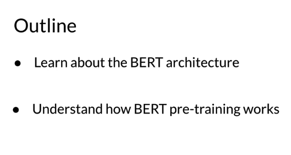</kbd>

   

<kbd>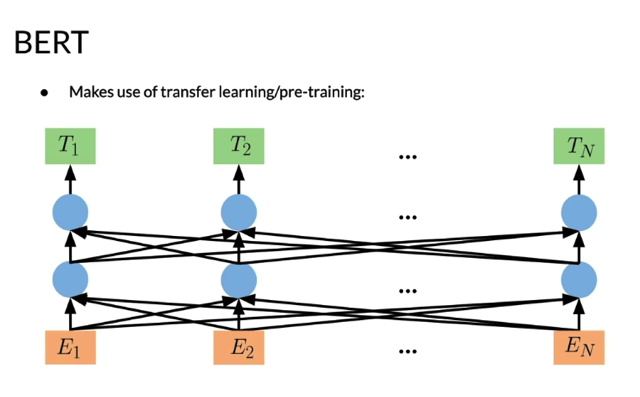</kbd>

> [!NOTE]
> Đại khái là BERT stand for **Bidirectional Encoder Representation from
> Transformer**.
>
> Kiến trúc của nó bao gồm **Embedding** theo sau bởi **nhiều tầng transformer
> thì cũng chính là nhiều Encoder tạo thành Encoder stack**như trong article
> Series của Ketan có nói.
>
> Người ta gọi transformer block chính là Encoder một bộ gồm các component sau: 
> Embedding + Positional Encoding, Multi-head attention, Skip connection,
> Feed forward và Normalization.
>
> ====
>
> Hai giai đoạn chính của nó là**pre-train với unlabeled data và fine-tuning với 
> specific task**
>
> Theo GPT nói thì nó task thứ nhất là **predict từ được che 'masked' dựa trên
> context** (những từ xung quanh) **ở cả 2 chiều** (nhờ vào **Transformer**
> architecture như đã biết).
>
> Task thứ 2 là n**ó predict next sentence**đại khái là nó sẽ được đưa vào các
> cặp câu sao cho 50% trường hợp là các câu liền kề nhau, và 50%  là các câu ở
> đâu đâu (không liền kề). Mục đích là để model predict liệu  chúng có phải là 2
> câu kế tiếp nhau hay không, giúp model nắm bắt được context - liên quan giữa
> các câu
>
> Sau đó, qua giai đoạn **fine-tuning với specific task nào đó.**

   

<kbd>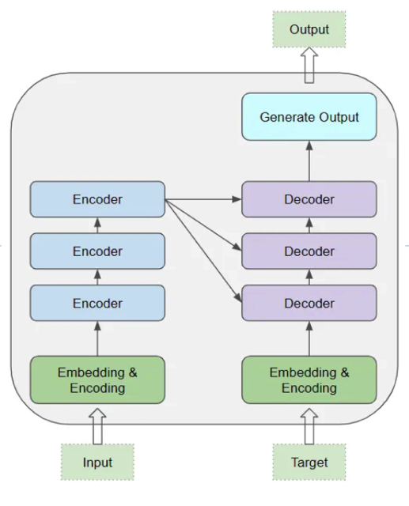</kbd>

<kbd></kbd>

<kbd>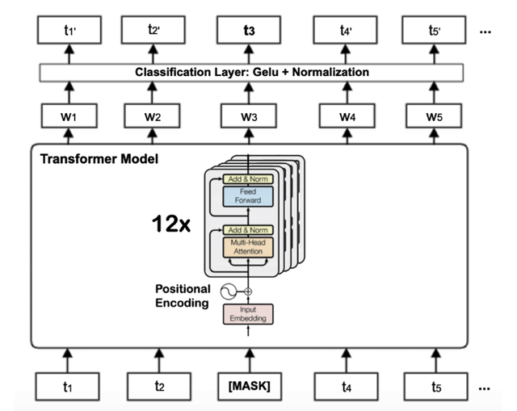</kbd>

   

<kbd>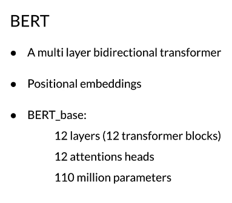</kbd>

> [!NOTE]
> Kiến trúc của BERT thật ra **y như ta đã học với
> Transformer** thì **BERT_base** có **12 transformer blocks**,
> **12 attention heads và 110 triệu params**.
>
> Các LLM sau này như GPT-3 cũng được xây dựng dựa trên
> kiến trúc tương tự nhưng có nhiều params hơn

   

<kbd>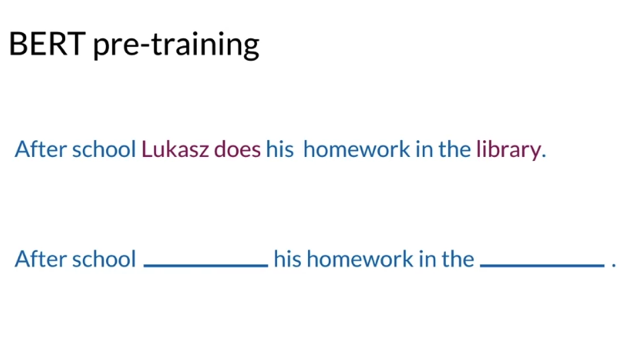</kbd>

<kbd></kbd>

<kbd>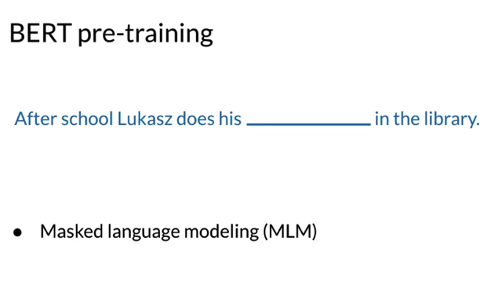</kbd>

> [!NOTE]
> Ổng nói gì đó đại khái liên quan đến **cách triển khai việc
> pre-train BERT model với unlabeled data**. Bằng cách **chọn một tỉ
> lệ những từ được 'masked' (randomly) để model predict.**
>
> Cụ thể là**15%** tokens được chọn randoms, trong đó sẽ có **80%
> được mask**. **10% được replace với token khác** randomly và
> **10% giữ nguyên.**

   

<kbd>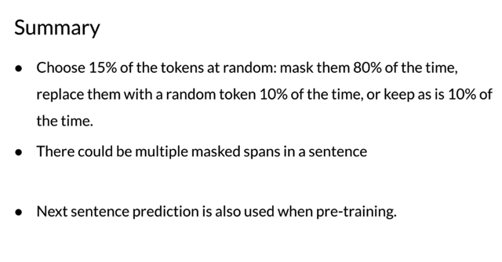</kbd>

> [!NOTE]
> Certainly! BERT (Bidirectional Encoder Representations from Transformers) is a transformative
> approach in the realm of natural language processing (NLP), and it's fundamentally based on the
> Transformer architecture. Let's delve into its architecture and pre-training process:
>
> ### BERT Architecture:
>
> 1. **Transformer Architecture**: BERT's architecture is built upon the Transformer model,
> specifically the encoder part of the Transformer. The Transformer model, originally introduced in the
> "Attention is All You Need" paper, uses attention mechanisms to draw global dependencies between
> input and output.
>
> 2. **Bidirectional Context**: Unlike traditional language models that predict the next word in a
> sequence (unidirectional), BERT is designed to consider both left and right contexts in all layers,
> making it bidirectional.
>
> 3. **Multiple Layers**: BERT comes in two sizes - **BERT-Base and BERT-Large.** BERT-Base has 12
> layers (**transformer blocks**), 768 hidden units, and 1**2 attention heads**, summing to 110M
> parameters. BERT-Large has 24 layers, 1024 hidden units, and **16 attention heads**, amounting to
> 340M parameters.
>
> 4. ****Positional Encoding****: Since the Transformer doesn't have a sense of order of words, positional
> encodings are added to the embeddings at the bottom of the model to give it some information
> about the relative positions of words.
>
> ### BERT Pre-training Process:
>
> BERT's pre-training is performed on a large corpus of text. The model is trained on a combined
> dataset of BooksCorpus (800M words) and English Wikipedia (2,500M words). Two main tasks are
> used for this:
>
> 1. ****Masked Language Model (MLM)****:
>
> - **Randomly masking out words from a sentence and asking the model to predict the masked word**.
>
> - For example, for the sentence "I love to read books", a possible masking might be "I love to
> [MASK] books", and BERT tries to predict "read" for the [MASK] token.
>
> - Around 15% of the words in each sequence are chosen to be masked.
>
> 2. ****Next Sentence Prediction (NSP)****:
>
> - Given two sentences, **A and B, the model is trained to predict if B comes after A in the corpus**.
>
> - This helps BERT **understand relationships between sentences and tackle tasks like
> question-answering** where understanding the context across sentences is vital.
>
> - For training, **50%**of the inputs are a **pair in which the second sentence is the subsequent
> sentence in the original document**, while in the other **50%, it's a random sentence**from the corpus.
>
> After the pre-training phase, BERT can be**fine-tuned on a specific task using a modest amount of
> labeled data** by adding an additional output layer and training on the downstream task.
>
> In summary, BERT's architecture and pre-training strategy have been pivotal in its ability to achieve
> state-of-the-art performance on numerous NLP benchmarks. Its bidirectional context and
> Transformer-based design, combined with the comprehensive pre-training tasks, enable it to
> capture intricate language patterns and relationships.

> [!NOTE]
> Certainly! The term "transformer blocks" refers to the repeated layers/modules in the
> Transformer architecture. To grasp the concept of transformer blocks, we need to delve
> into the inner workings of the Transformer model, particularly the encoder segment.
>
> Each transformer block in BERT (which uses only the encoder part of the original
> Transformer model) consists of the following components:
>
> 1. **Multi-Head Self-Attention Mechanism**:
>
> - **Attention Mechanism**: At its core, the attention mechanism allows the model to focus
> on different parts of the input text, to varying degrees, based on the given context.
>
> - **Self-Attention**: In self-attention, the model computes the attention scores using the
> same input sequence for keys, values, and queries. It helps the model to focus on
> different words within the same input.
>
> - **Multi-Head Attention**: Instead of having a single set of attention weights, the
> multi-head mechanism has multiple sets, allowing the model to focus on different parts of
> the input for different tasks or reasons. The outputs of these multiple heads are
> concatenated and linearly transformed.
>
> 2. **Position-wise Feed-Forward Networks**:
>
> - After the multi-head attention layer, the transformer block contains feed-forward neural
> networks that are applied position-wise, i.e., independently to each position.
>
> - These networks consist of two linear transformations with a ReLU activation in between.
>
> 3. **Residual Connection**:
>
> - Each sub-layer (like multi-head attention or feed-forward neural network) in the
> transformer block has a residual connection around it followed by layer normalization.
>
> - This means the output of the sub-layer is added to its input, which helps in avoiding the
> vanishing gradient problem and allows for deeper models.
>
> 4. **Layer Normalization**:
>
> - After the residual connection, layer normalization is applied. It's a normalization method
> where the mean and variance are computed across the features, and it helps stabilize
> and speed up the training.
>
> 5. **Positional Encoding**:
>
> - Since the Transformer model doesn't inherently understand the sequential order of input
> tokens (because it processes all tokens in parallel), positional encodings are added to the
> embeddings at the start to provide the model with positional context. This isn't unique to
> each transformer block but is crucial to the model's architecture.
>
> In BERT and other transformer-based architectures, these blocks are stacked on top of
> one another multiple times. For instance, BERT-Base uses 12 such transformer blocks,
> while BERT-Large uses 24.
>
> To understand transformer blocks deeply, visual diagrams and hands-on experimentation
> can be immensely helpful. They provide an intuitive sense of data flow and the
> transformations happening within the block.

   

## Bert Objective

 

<kbd>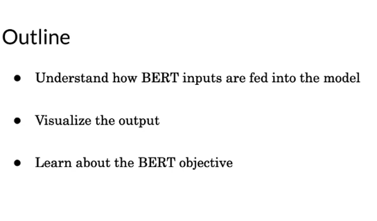</kbd>

 

<kbd>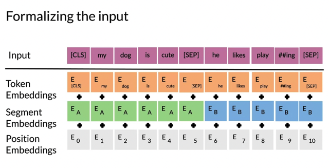</kbd>

> [!NOTE]
> Như vậy đại khái là bên cạnh **Token embedding** (semantic embedding),
> và **Positional embedding**. Ta còn có **Segment embedding** để chứa
> thông tin cho biết từ nào là của câu nào.
>
> **Combine cả 3 lại để thành input của BERT**

 

<kbd>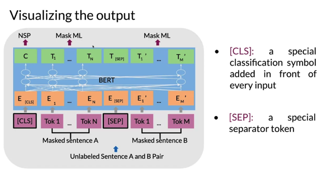</kbd>

> [!NOTE]
> Cùng với **[CLS] token** được add vào trước mọi input và **[SEP]**
> token để separate hai câu. Hình thành nên **input**.
>
> Qua model để **predict ra các vị trí bị masked**Hoặc **predict xem 2 câu đưa vào có phải là kế tiếp nhau**trong 
> corpus không

 

<kbd>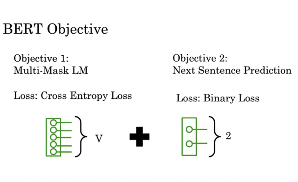</kbd>

> [!NOTE]
> BERT có 2 objective đó là reduce **Cross Entropy Loss** - bằng
> cách cố predict đúng từ được mask và reduce**Binary Loss**
> bằng cách predict hai câu là kế tiếp nhau trong corpus ban đầu  là
> đúng hay sai (nên mới dùng binary loss)
>
> Theo GPT cái việc train để predict hai câu có kế tiếp nhau hay
> không giúp nó học được kiểu như **hiểu được hai câu có phải là
> dạng hỏi - trả lời hay không**Còn predict masked word đương nhiên là để nó hiểu được yếu tố
> ngữ nghĩa language nói chung

 

<kbd>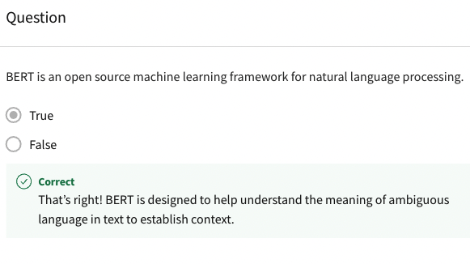</kbd>

> [!NOTE]
> Alright, let's dive deep into the input representation for BERT and its training process:
> **### Input Representation:**
>
> 1. ****Token Embeddings****: The input text is first tokenized. BERT uses **WordPiece tokenization**, which breaks words
> into commonly occurring subwords or characters. For example, "unaffordable" might be tokenized into ["un", "##aff", "
> ##ord", "##able"]. Each token is then mapped to a vector using an embedding lookup.
>
> 2. ****Segment Embeddings****: Since BERT can take two sentences as input for tasks like Next Sentence Prediction
> (NSP), segment embeddings are used to differentiate between the two sentences. If a token belongs to the first
> sentence, it gets a segment embedding `A`, and if it belongs to the second sentence, it gets segment embedding `B`.
>
> 3. ****Positional Embeddings****: Transformers do not have a built-in sense of order for sequences. To counter this,
> positional embeddings are added to provide information about a token's position in a sequence. BERT uses fixed
> positional embeddings to handle sequences up to a certain length (e.g., 512 tokens).
>
> The final input representation for each token is the sum of its token embedding, segment embedding, and positional
> embedding. This combined embedding is fed into the BERT architecture.
>
> **### Training Process:**
>
> BERT's training process comprises two main phases: pre-training and fine-tuning.
>
> **#### 1. Pre-training:**
>
> This phase involves training on a massive amount of unlabeled data over the following tasks:
>
> - **Masked Language Model (MLM)**:   - Randomly 15% of the tokens in the input are masked.   - BERT then tries to
> predict the original identity of the masked words, based on the context provided by the non-masked words.
>
> - **Next Sentence Prediction (NSP)**:   - BERT is provided pairs of sentences and must predict if the second
> sentence in the pair is the subsequent sentence from the original text.   - This task enables BERT to learn
> relationships between sentences.
>
> BERT is pre-trained on a combination of BooksCorpus (800M words) and English Wikipedia (2,500M words).
> **#### 2. Fine-tuning:**
>
> Once pre-training is complete, BERT can be fine-tuned on a specific task with a relatively small amount of labeled
> data.
>
> - A task-specific layer is added on top of the pre-trained BERT model.
> - The entire model (BERT + task-specific layer) is trained on the downstream task.
> - Examples of downstream tasks include text classification, named entity recognition, question-answering, etc.
>
> For fine-tuning, the general process is:
>
> 1. Load the pre-trained BERT model.
> 2. Add an additional output layer specific to the task (e.g., a dense layer for classification).
> 3. Train the entire model on the downstream task's data.
>
> During fine-tuning, all layers are slightly adjusted to better suit the specific task, leveraging the knowledge BERT
> gained during its pre-training phase.
>
> This two-step process—pre-training on a large corpus and then fine-tuning on a specific task—allows BERT to
> generalize well across a range of tasks by first learning a broad understanding of language and then adapting that
> knowledge to specific tasks.

 

## Bert Objective (reading)

 

<kbd>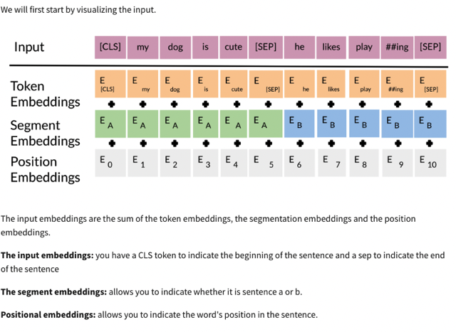</kbd>

 

<kbd>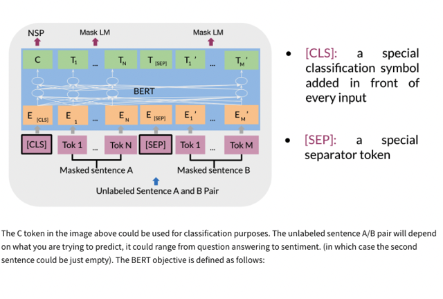</kbd>

> [!NOTE]
> Hiểu đại khái là nó bố trí như này để**train nhiều loại task khác nhau** từ
> question answering đến sentiment analysis.
>
> Ví dụ nếu là **sentiment analysis** thì **câu sau để trống**. Chưa hiểu rõ lắm
> nhưng đại khái là vậy

 

<kbd>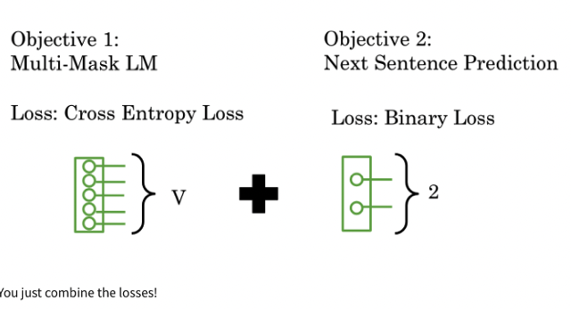</kbd>

 

## Fine Tuning Bert

 

<kbd>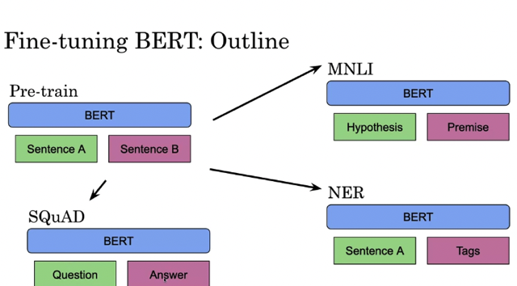</kbd>

> [!NOTE]
> Thì như nói ở bài trước,**tuỳ specific task được fine-tune** mà
> sentence #1 và sentence #2 sẽ khác nhau. Nếu là NER -
> **Name Entity Recognition** thì là **Sentences và Tags**,...

 

<kbd>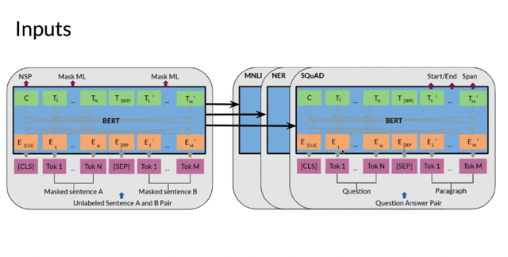</kbd>

 

<kbd>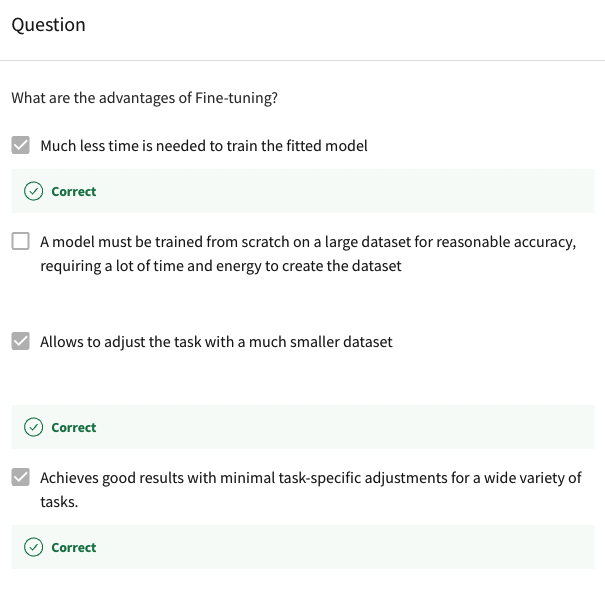</kbd>

 

<kbd>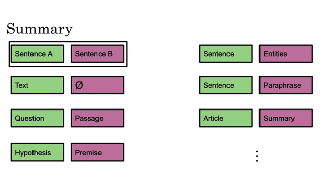</kbd>

> [!NOTE]
> That's it. Đại khái là **quá trình fine-tuning** với các **specific task
> khác nhau** thì **input vào sentence 1 và 2 sẽ khác nhau tương
> ứng**

 

## (reading) Fine Tuning Bert

 

## Transformer: T5

 

<kbd>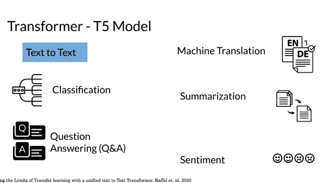</kbd>

 

<kbd>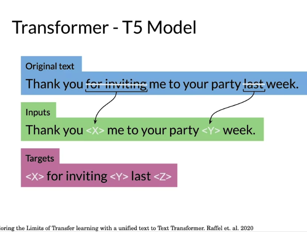</kbd>

> [!NOTE]
> One of the major techniques that allowed the T5 model to reach state of the art is the
> concept of masking:
>
> For example, you represent the “for inviting” with <X> and last with <Y> then the model
> predicts what the X should be and what the Y should be. This is exactly what we saw in
> the BERT loss. You can also mask out a few positions, not just one. The loss is only on
> the mask for BERT, for T5 it is on the target.

> [!NOTE]
> Đại khái là mấy cái LLM này đều được pre-train
> kiểu self-supervised với unlabeled data.

 

<kbd>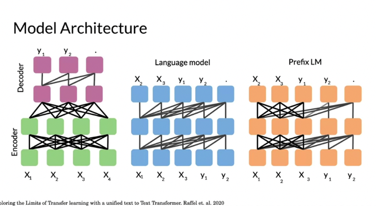</kbd>

> [!NOTE]
> So we start with the basic encoder-decoder representation.There you have a fully visible
> attention in the encoder and then causal attention in the decoder.  So light gray lines
> correspond to causal masking. And dark gray lines correspond to the fully visible masking.In
> the middle we have the language model which consists of a single transformer layer stack.
> And it's being fed the concatenation of the inputs and the target. So it uses causal masking
> throughout as you can see because they're all gray lines. And you have X1 going inside, you
> get X2, X2 goes into the model and you get X3 and so forth.To the right, we have prefix
> language model which corresponds to allowing fully visible masking over the inputs as you
> can see with the dark arrows. And then causal masking in the rest.

> [!NOTE]
> Kiến trúc chúng nó có thể khác nhau ở chỗ Encoder-Decoder
> hay chỉ Encoder / chỉ Decoder. Còn cơ bản vẫn là cấu thành
> bởi Transformer block unit.

 

<kbd>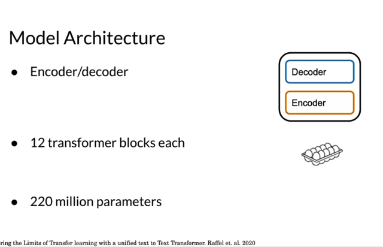</kbd>

 

<kbd>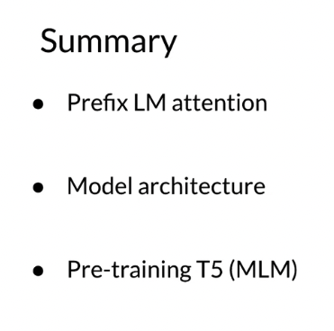</kbd>

 

## (reading) Transformer T5

 

## Multi-task Training Strategy

 

<kbd>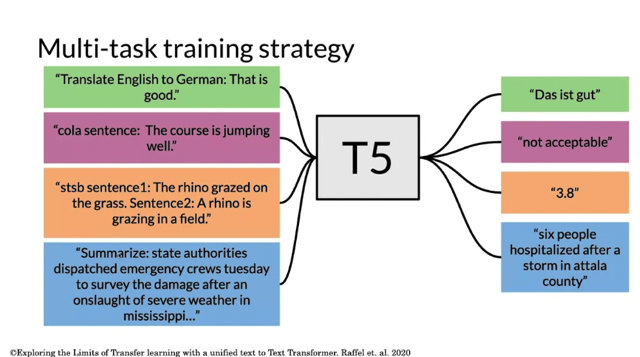</kbd>

> [!NOTE]
> Có nhiều cái mai
> phải search

 

<kbd>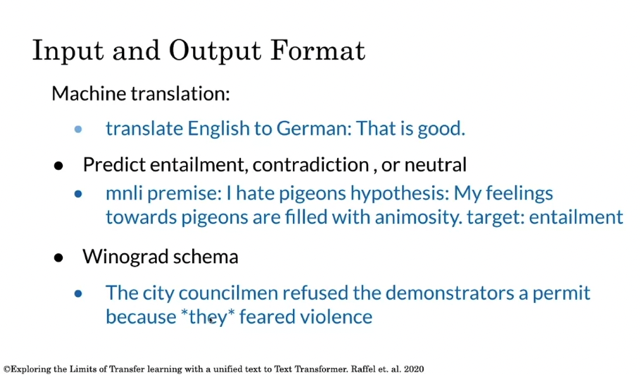</kbd>

 

<kbd>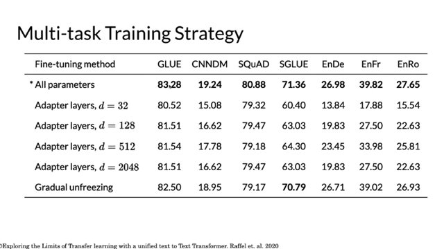</kbd>

 

<kbd>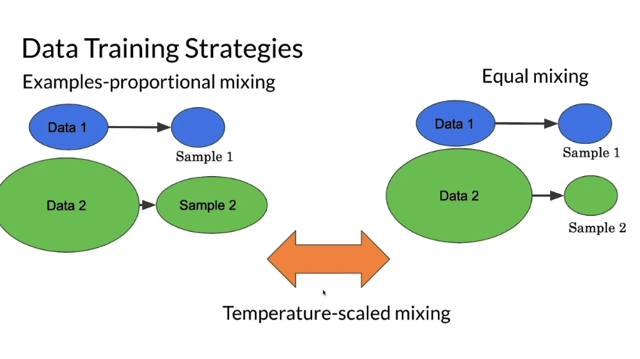</kbd>

 

<kbd>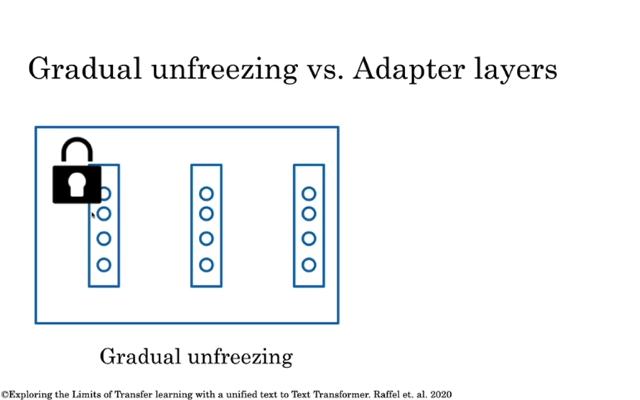</kbd>

 

<kbd>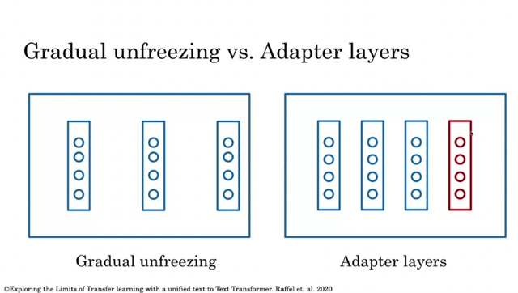</kbd>

 

<kbd>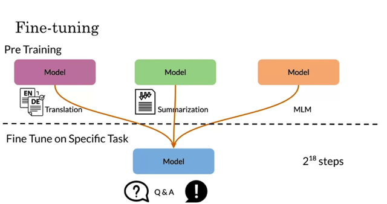</kbd>

 

## (reading) Multi-task Training

> [!NOTE]
> (READING) MULTI-TASK TRAINING
> STRATEGY

 

## Glue Bench-mark

 

<kbd>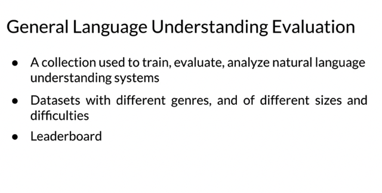</kbd>

> [!NOTE]
> GLUE scores là chỉ số đánh giá mức độ hiểu
> ngôn ngữ của model, bao gồm nhiều dataset
> trên nhiều vấn đề khác nhau.

 

<kbd>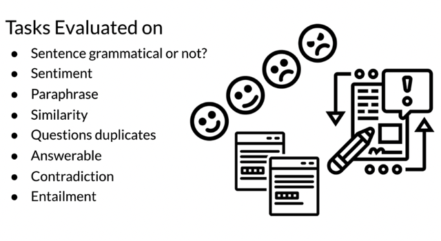</kbd>

 

<kbd>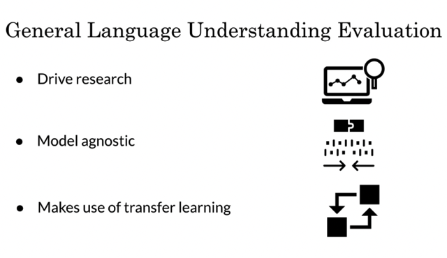</kbd>

> [!NOTE]
> GLUE dùng để đánh giá model trong quá trình research, nó có tính
> agnostic khi không care model cụ thể là gì. Và nó giúp transfer
> learning khi model evaluate bởi GLUE có thể giúp dẫn dắt việc tìm
> based model (pretrained) phù hợp

 

## (reading) Glue Benchmark

 

<kbd>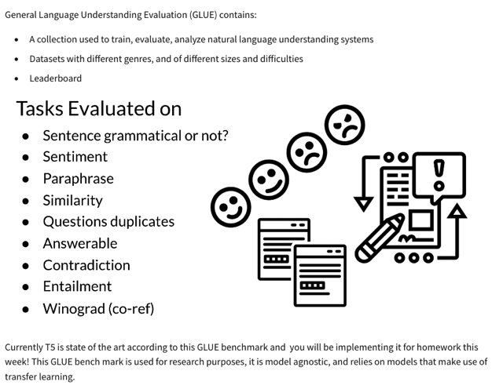</kbd>

 

## Question Answering

 

<kbd>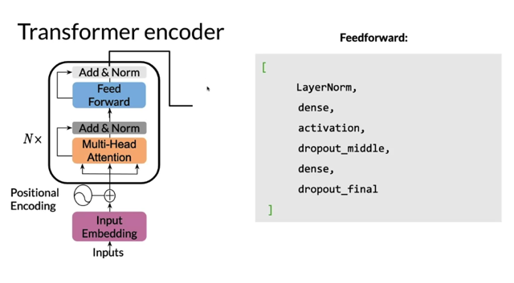</kbd>

 

<kbd>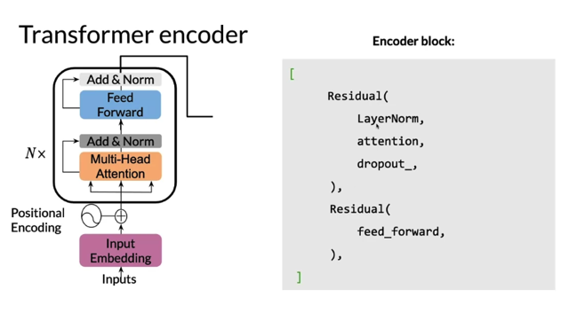</kbd>

 

<kbd>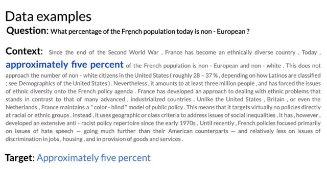</kbd>

> [!NOTE]
> Nói sơ về dataset
> sẽ làm trong PA

 

<kbd>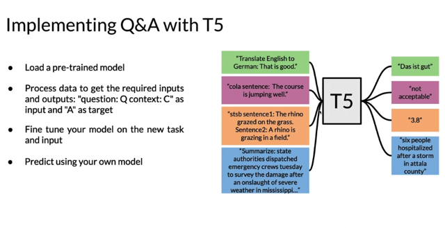</kbd>

> [!NOTE]
> Các bước sẽ làm trong PA. Cơ
> bản là ta dùng pre-trained T5
> model để fine-tuning

 

## Lab: **sentencepiece** And **bpe**

 

### Introduction to

> [!NOTE]
> Introduction to
> Tokenization

 

<kbd>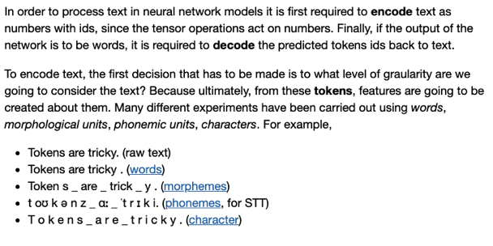</kbd>

> [!NOTE]
> Đại khái là nói về **tokenization** - quá trình c**huyển input text thành
> các token là các index number** trước khi đưa vào model.
>
> Cũng như là **de-tokenize** - chuyển index numbers thành text lại. Có
> nhiều thử nghiệm để tìm**cách làm hiệu quả nhất, như word,
> characters, phonemes...**

   

<kbd>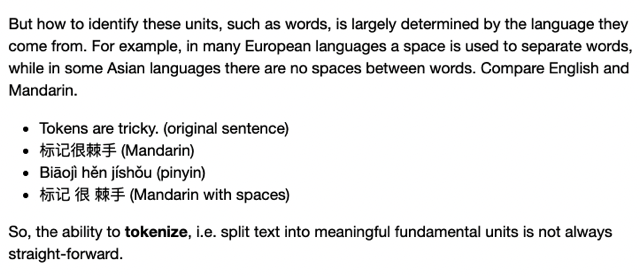</kbd>

> [!NOTE]
> Tuy nhiên các **ngôn ngữ khác nhau lại có quy luật khác nhau**,
> như **tiếng anh có thể dùng khoảng trống** **để split** thành từng
> từ n**hưng tiếng Trung thì không được.**

   

<kbd>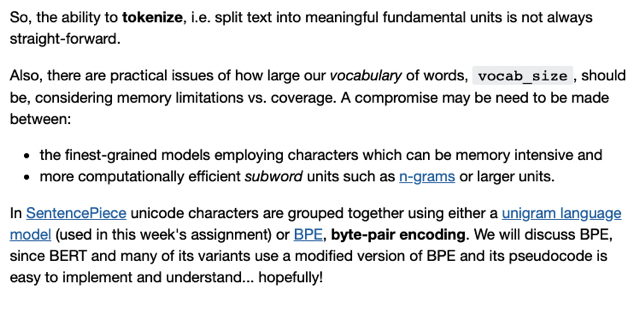</kbd>

> [!NOTE]
> Đại khái là ngoài vấn đề các ngôn ngữ khác nhau cho những cách tokenize
> khác nhau chứ không thống nhất được, thì còn vấn đề đặt ra đối với việc
> **bộ vocab size nên có kích thước bao nhiêu**.
>
> **Nhiều quá thì tất nhiên là tốt** cho kết quả của model hơn nhưng **lại gây
> vấn đề memory.**
>
> Thì ở đây ta sẽ khám phá **SentencePiece** với **BPE**, một **tokenization
> technique** được sử dụng trong **BERT.**Và **giải thuật pseudocode của
> nó cũng dễ hiểu và dễ làm**

   

### SentencePiece

> [!NOTE]
> SentencePiece
> Preprocessing

 

<kbd>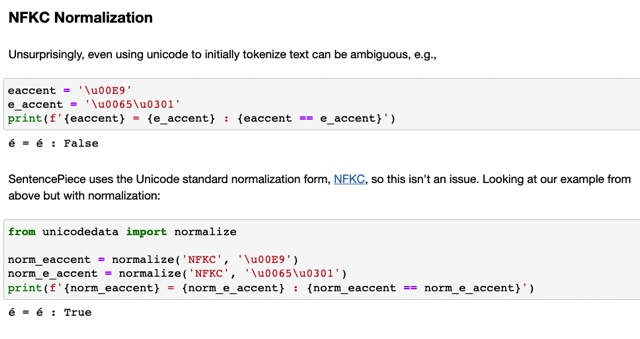</kbd>

> [!NOTE]
> Ngay cả khi dùng unicode để tokenize text cũng gây **vấn đề** **ambiguous**, ở
> đây ta thấy**hai chữ 'é' trông y hệt nhau, nhưng thật ra lại khác nhau**.
>
> Thì việc này được giải quyết bởi **normalization**.

   

<kbd>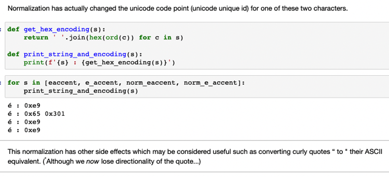</kbd>

> [!NOTE]
> Đại khái là normalization thật sự đã thay đổi "**unicode point**" của 1
> trong hai "é" (cụ thể là cái thứ 2 từ 0x65 0x31 thành 0xe9) từ đó
> đồng nhất hai cái "é" đều cùng một unicode point là "0xe9"
>
> Nói thêm là cái normalization này nó có nhiều side effect hữu ích 
> ví dụ như chuyển kí tự ngoặc kép sang dạng tương đương của ASCII
> tuy có thể làm mất dạng nghiêng

   

<kbd>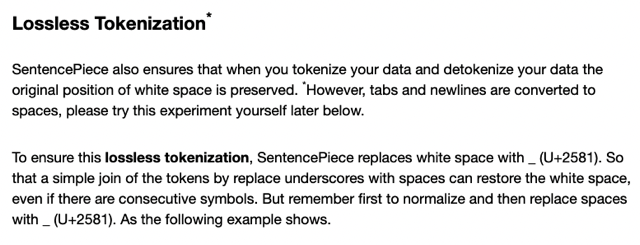</kbd>

> [!NOTE]
> Về cách SentencePiece xử lý vấn đề khoảng trắng bằng cách
> nó replace khoảng trắng bằng "_" để khi "khôi phục" khoảng
> trắng lại thì nó sẽ replace "_" lại thành khoảng trắng, với cách
> này thì những khoảng trắng liên tục nhau sẽ không  bị mất.

   

<kbd>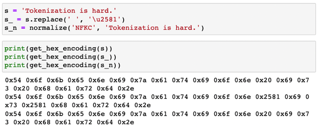</kbd>

   

<kbd>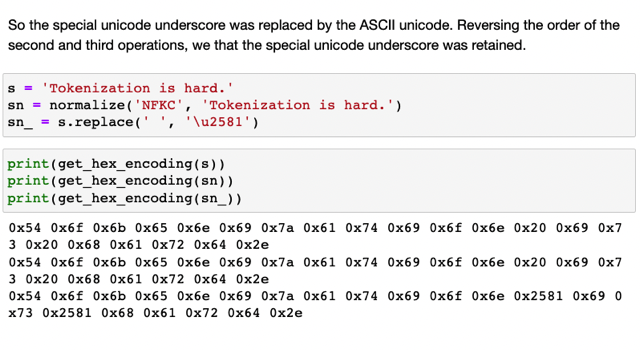</kbd>

   

### BPE Algorithm

 

<kbd>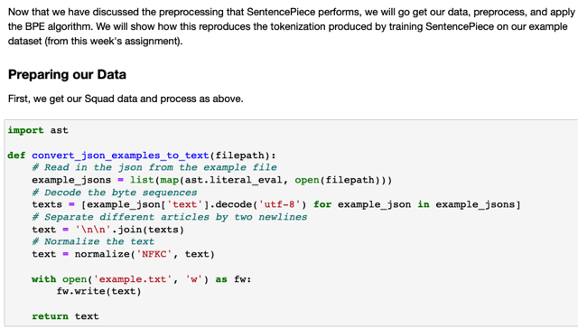</kbd>

> [!NOTE]
> Nãy giờ kiểu như nói về **cách mà SentencePiece hoạt động khi thực
> hiện việc tokenization**. Bây giờ mình sẽ lấy data, preprocess nó và
> **apply BPE algorithm** - tokenization.
>
> Function dưới đại khái là nhận filepath của file data chứa data json,
> Đầu tiên nó **mở file được chỉ định** bởi filepath với **open(filepath)**và đọc nội dung của file dưới dạng một list các **json-likes strings**.
>
> Sau đó nhờ thư viện **ast = Abstract Syntax Trees**import ở trên để
> dùng function .**literal_eval() của nó giúp convert Json-like string thành
> dạng Python dictionary.**Thì GPT nó nói là cái function này giúp
> convert an toàn hơn, tránh vấn đề "**code injection attacks**"
>
> Tiếp theo, **tạo một list** (texts variable) bằng cách **extracting 'text'
> fields từ mỗi bộ dictionary**, rồi **từ bytes decoding thành dạng UTF-8
> string**.  Để ý ở đây dùng Python **list comprehension**.
>
> Kế tiếp, function**"\ \ ".join(texts)** kiểu như sẽ join mọi text trong
> list lại, nối nhau bởi "\\n\\n" thành ra kết quả có dạng các articles
> separating nhau bởi "\\n\\n"
>
> Cuối cùng nói được **normalize**() bởi **Unicode normalization**
> (NFKC) như đã  thấy ở trên, giúp **ensure consistent character
> representation**. (Không bị tình trạng **mặt chữ in ra thì giống nhau
> nhưng representation thì khác nhau**)
>
> Cuối cùng, normalized text được **ghi vào file có tên 'example.txt'**

> [!NOTE]
> Đại khái là ta sẽ "bắt chước" BPE
> algorithm mà SentencePiece nó
> dùng để tokenize data.

   

<kbd>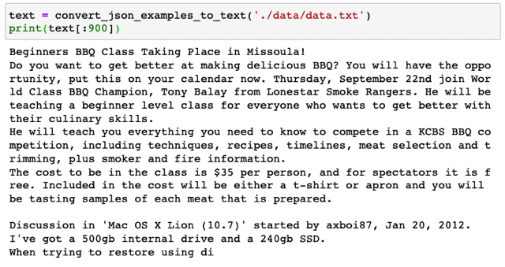</kbd>

   

<kbd>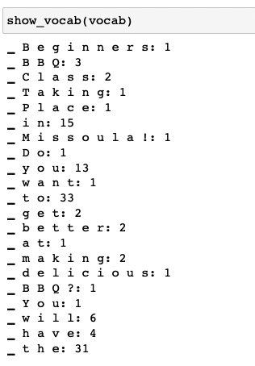</kbd>

<kbd></kbd>

<kbd>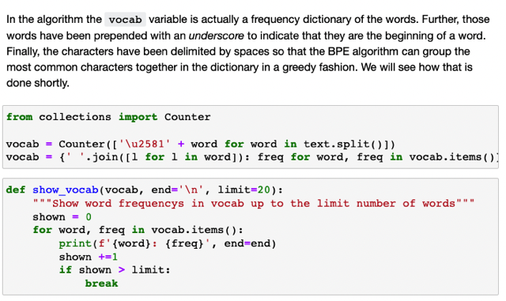</kbd>

> [!NOTE]
> Đại khái là bên trong cái tokenization algorithm, thực chất nó sẽ **tạo một
> dictionary map** **từ - tần suất xuất hiện** của nó. 
>
> Ngoài ra, **mỗi character được
> prepend với một kí tự '_'** để **indicate rằng đó là bắt đầu của một từ**. 
>
> Cuối cùng,
> **các characters được tách ra bởi space** để **BPE algorithm có thể nhóm các
> characters phổ biến nhất** trong dictionary theo một **'greedy fashion'.**
>
> Trong đoạn code dưới, ta thấy họ **tạo Counter**, bỏ vào đó một**list các word**: tạo
> bởi **text.split()** sau đó add **thêm underscore character ('\\u2581' = '_') ở đầu**
>
> Cái Counter sẽ **đếm xem mỗi word xuất hiện bao nhiêu lần.**
>
> Dòng thứ 2, **dùng Python list comprehension** tạo dictionary, map giữa **key-value,**
> Trong đó key là: **Từng kí tự trong word**, **joint với nhau** và **xen ' ' vào giữa**. Ví dụ
> **word = '_want' -> '_ w a n t', '_get' -> '_ g e t'**
>
> Còn value là: **freq = frequency = số lần xuất hiện của từ mà Counter nó đếm
> được.**

   

<kbd>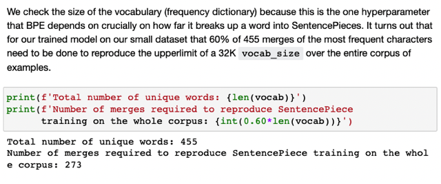</kbd>

> [!NOTE]
> CHƯA HIỂU LẮM, liên quan đến vocab size
> là một hyperparam quan trọng ảnh hưởng
> đến chất lượng của quá trình tokenization.

> [!NOTE]
> The provided text is explaining the importance of checking the size of the vocabulary (frequency
> dictionary) when using Byte Pair Encoding (BPE) for text tokenization. Here's a breakdown of the
> explanation:
>
> 1. **BPE and Tokenization**: BPE is a subword tokenization technique used in natural language
> processing (NLP) to **break down words** into **smaller units**, such as **subword pieces**. It's a popular
> approach for **handling out-of-vocabulary words** and **reducing the size of the vocabulary**, which can be
> helpful for NLP models. Tokenization refers to the process of **splitting text into smaller units**, like **words** or
> **subword pieces**.
>
> 2. **Vocabulary Size Matters**: The**size of the vocabulary**(the **number of unique tokens** or **subword
> pieces**) is a **crucial hyperparameter** when using BPE. The vocabulary size determines**how finely
> BPE will break down words into subword pieces**. A**larger vocabulary size**results in **smaller
> subword pieces**, while a s**maller vocabulary size leads to larger subword pieces**.
>
> 3. **Dependence on Vocabulary Size**: The explanation states that BPE depends crucially on the size of
> the vocabulary. In other words, the vocabulary size has a significant impact on how BPE operates.
>
> 4. **Specific Example**: In the specific case mentioned in the explanation, the author is working with a
> trained model and a small dataset. They have observed that to achieve a target vocabulary size of 32,
> 000 (vocab_size), approximately 60% of the 455 most frequent characters need to be merged or
> combined into subword pieces using BPE.
>
> 5. **Reproducing the Vocabulary Size**: The statement "need to be done to reproduce the upper limit of a
> 32K vocab_size" means that, in their experiments, they found that they had to perform a certain number
> of merges (breaking down words into subword pieces) to reach a vocabulary size of 32,000. This allows
> them to control the size of the vocabulary by adjusting the number of merges.
>
> 6. **Corpus-Wide Consideration**: The explanation also emphasizes that this observation applies " over
> the entire corpus of examples." This means that the choice of how many merges to perform is not made
> on a per-word basis but considers the entire dataset. The goal is to find a balance where the vocabulary
> size is manageable while still representing the data effectively.
>
> In summary, the explanation highlights that the vocabulary size is a critical factor in BPE tokenization, and
> it provides specific information about how the author determined the number of merges needed to
> achieve a target vocabulary size in their particular NLP task. Adjusting this hyperparameter can have a
> significant impact on the effectiveness of the tokenization process.

> [!NOTE]
> Vocab size lớn thì subword piece nhỏ và ngược lại vocab size càng nhỏ thì subword
> piece càng lớn
>
> Để hiểu cái này ta lấy phương pháp 1 là cách tokenize theo cấp word, tức 
> là mỗi từ là một token để làm mốc. Theo cách này thì "**in**depen**dent**, depend**ent**,
> depend, insuffici**ent**" thì mỗi từ đều phải có một token 
>
> Thì cách 2 - dùng sub-word ví dụ 'depend', 'in', 'ent' thì vì nó chung cho rất rất
> nhiều từ kiểu vậy cho nên số lượng token cần thiết, hay vocab size sẽ ít hơn so với
> cách 1. 
>
> Cách 3 là dùng sub-word theo kiểu tối đa là thu về cấp kí tự thì ta thấy vocab size 
> chỉ còn có mấy chục.
>
> Thì ý nói là vocab size nó sẽ có một mối liên quan nào đó khiến cách thức bẻ từ tạo 
> subword thay đổi. Hiểu đại khái tới đây thôi

   

<kbd>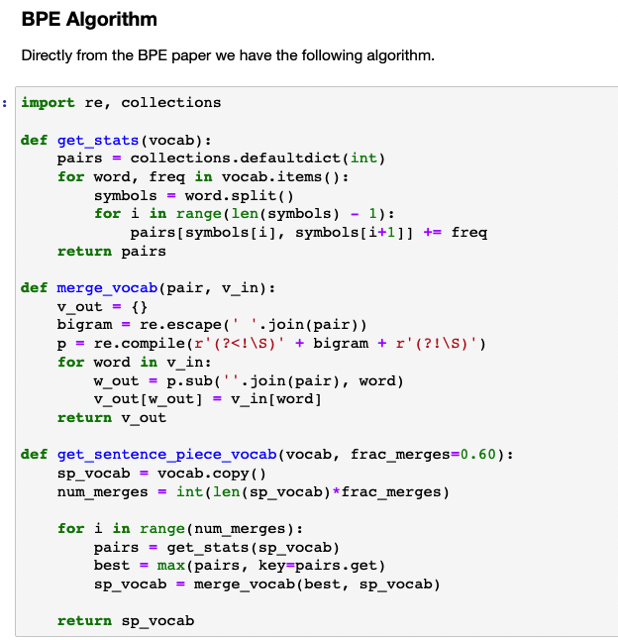</kbd>

> [!NOTE]
> Function **get_stats** đại khái là nó**tạo dict để đếm tần suất của các cặp
> symbols liền kề**
>
> Ta thấy nó nhận vocab, như đã biết ở trên là dict giữa key = '_ a p p l e' và số
> lần xuất hiện của nó. Ví dụ:  **{'_ a p p l e' : 5}**
>
> Nó loop trong các tuple (word, freq) đó, **split word ra thành các subword** 
> ví dụ '_ a p p l e' -> '_', 'a', 'p', 'l', 'e'.
>
> Rồi dùng một loop để update vào **pairs dict**cặp **symbols liền kề** - **số lần xuất
> hiện**. Ví dụ: { '_ a': 7,  'a p': 5, 'p p': 4, }
>
> Ở đây symbol đang ở cấp kí tự, nhưng nó có thể là bi-gram, tri-gram.
> Nên pair có thể là {'ap pl' : 3, 'jui ce': 5}
>
> ====
>
> Đại khái về function **get_sentence_piece_vocab()**: Đầu tiên, **dựa vào 'tỉ lệ
> merge' argument,** và **vocab's size** nó tính ra **số  'hành động merge' sẽ diễn ra**.
>
> Bắt đầu **thực hiện các 'hành động merge'** cho đến khi đủ **num_merges**, trong
> đó:
>
> Nó dùng function **get_stats**() ở trên để **tính ra pairs** là bộ dict map các cặp
> subword liền kề với tần suất của nó.
>
> Dòng tiếp theo **max(...)** kiểu như nó **lấy cái có tần suất cao nhất**.
>
> Rồi bỏ vào function **merge_vocab**, trong đây nôm na đại khái là nó sẽ **thay hai
> kí tự liền kề thành 1 subword**.  
>
> Ví dụ:  { '_ **a p** p l e': 5, '_ **a p** p l e j u i c e': 10 }
>
> ->  { '_ **ap** p l e': 5  '_ **ap** p l e j u i c e': 10 }

   

<kbd>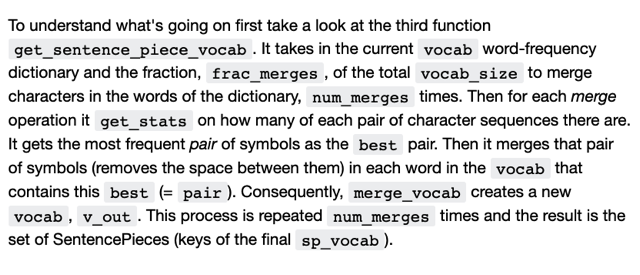</kbd>

   

<kbd>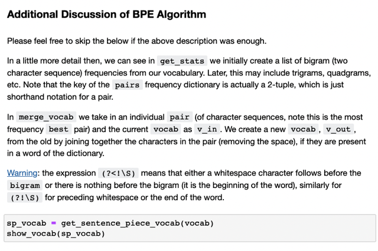</kbd>

   

<kbd>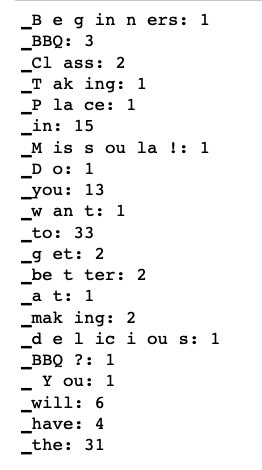</kbd>

> [!NOTE]
> Kết quả kiểu như các cặp subword
> liền kề mà xuất hiện nhiều sẽ được
> 'gom lại' dần dần.

   

### Train SentencePiece BPE

> [!NOTE]
> Train SentencePiece BPE
> Tokenizer on Example Data

 

<kbd>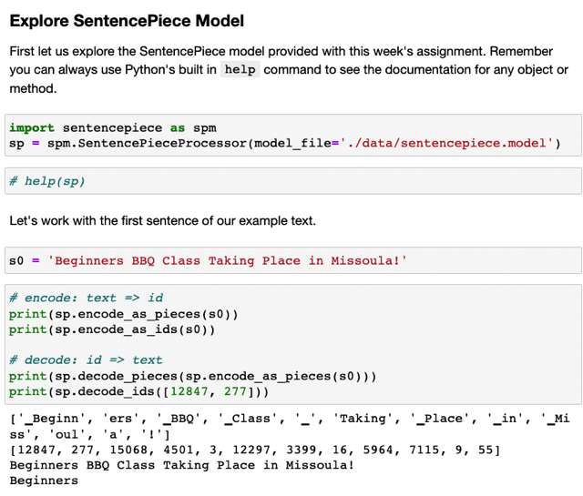</kbd>

> [!NOTE]
> Một ví dụ về **SentencePiece** lib sẽ dùng để tokenize trong P.A tuần này.
> Import và khởi tạo nó với path dẫn đến model (tức là model đã fit với
> bộ dataset, liên hệ như TensorFlow's tokenizer **fit_on_texts**(dataset))
>
> Sử dụng **encode_as_pieces** và **encode_as_ids** để encode/tokenize
> và **decode_pieces** / **decode_ids** để detokenize

   

<kbd>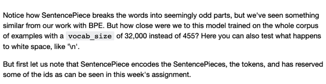</kbd>

   

<kbd>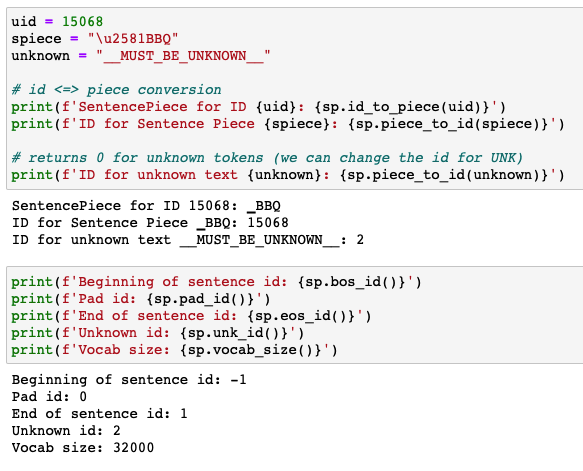</kbd>

> [!NOTE]
> Xem một số token đặc biệt của SentencePieces như
> BOS (Beginning of sentence) là -1, Pad là 0 như
> thường lệ, EOS là 1, UNK là 2

   

<kbd>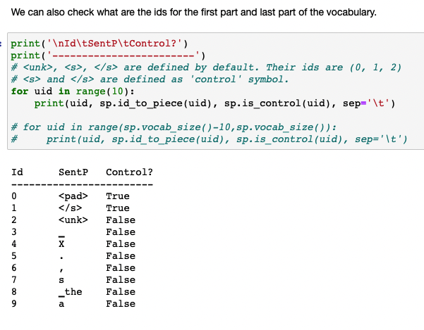</kbd>

> [!NOTE]
> Biết thêm về kí tự \t giúp separate thành khi print.

   

<kbd>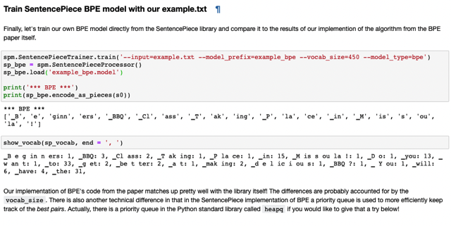</kbd>

> [!NOTE]
> Train BPE model trực tiếp từ SentencePiece lib" - Cái này khó hiểu, nhưng nôm
> na là so sánh cái BPE của cái library và cái "sự bắt chước BPE algorithm" mà ta
> làm ở trên.
>
> Kết quả thấy cũng tương đối giống nhau. Nếu có khác là do BPE của
> SentencePiece lib nó còn thực hiện thêm một cái vụ gọi là "priority queue" gì đó
> nữa giúp **"keep track of best pairs".**Và Python nó cũng có cái này, - **heapq** mà ta có thể thử

   

### Optionally try to implement BPE

> [!NOTE]
> Optionally try to implement BPE
> using a priority queue below

 

<kbd>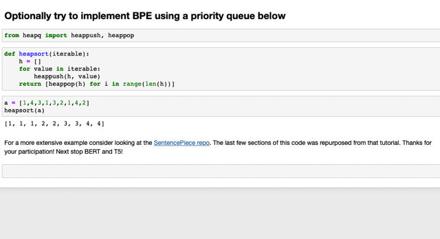</kbd>

   

## (reading) Welcome To Hugging Face

 

## Hugging Face Introduction

 

## Hugging Face I

 

## Hugging Face Ii

 

## Hugging Face Iii

 

## Lab: Question

> [!NOTE]
> LAB: QUESTION
> ANSWERING WITH HF 1

 

### You've seen how to use **BERT**, and other **transformer models** for a wide range of \\*natural

> [!NOTE]
> You've seen how to use **BERT**, and other **transformer models** for a wide range of **natural
> language tasks**, including machine translation, summarization, and question answering.
> **Transformers** have become the **standard model for NLP,** similar to **convolutional models in
> computer vision**. And all started with **Attention**!
>
> In practice, you'll **rarely train a transformer model from scratch**. Transformers tend to be
> very **large**, so they take **time, money, and lots of data** to train fully. Instead, you'll want to
> **start with a pre-trained model and fine-tune it**with your dataset if you need to.
>
> \\_Hugging Face\\_ (🤗) is the best resource for pre-trained transformers. Their **open-source
> libraries** simplify **downloading** and **using transformer models** like**BERT, T5, and GPT-2**.
> And the best part, you can**use them alongside either TensorFlow, PyTorch and Flax**. In this
> notebook, you'll use 🤗 transformers to download and use the **DistilBERT** model for
> question answering.
>
> First, let's install some packages that we will use during the lab.

> [!NOTE]
> Đại khái là ta đã biết BERT và các model dựa trên Transformer. Và vai trò của Transformer
> với NLP giống như Convolutional model với Computer vision vậy
>
> Tuy nhiên việc train một Transformer từ đầu rất tốn kém, thời gian, chi phí và data.
>
> Do đó thường người ta sẽ dùng một base - pretrained model và fine-tune nó với dataset của
> họ.
>
> Thì HuggingFace là một platform rất hữu ích cho việc này khi nó cung cấp các công cụ để
> download các pre-trained model.

 

<kbd>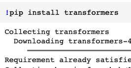</kbd>

   

- **Before fine-tuning a model**, you will look to the **pipelines** from Hugging Face to **use pre-trained transformer models** for **specific tasks**. The transformers library**provides pipelines for popular tasks** like sentiment analysis, summarization, and text generation. A pipeline consists of a **tokenizer**, a **model**, and the **model configuration**. All these are packaged together into an easy-to-use object. Hugging Face makes life easier.  Pipelines are intended **to be used without fine-tuning** and will **often be immediately helpful** in your projects. For example, transformers provides a pipeline for question answering that you can directly use to answer your questions if you give some context. Let's see how to do just that.  You will import pipeline from transformers for creating pipelines.
> [!NOTE]
> Một điểm hay đầu tiên của HuggingFace là chỉ việc search pipeline
> phù hợp với nhu cầu là có thể dùng được ngày (dạng task cần làm
> như sentiment analysis, question answering..)

   

    
    
<kbd>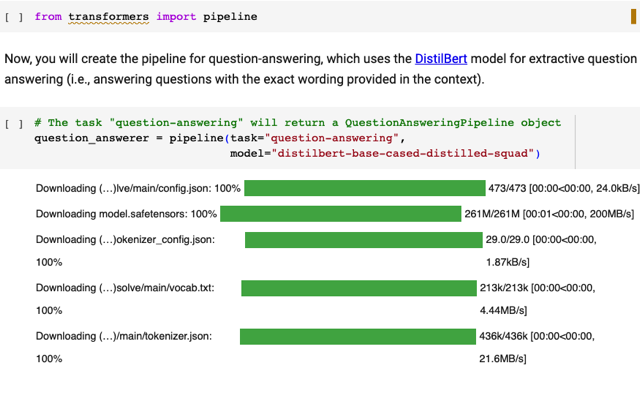</kbd>

    > [!NOTE]
    > Ví dụ, import **pipeline**, và dùng nó để load cái pipeline với
    > model**distilBert - base** (như ta đã biết nó là bản distilled của
    > BERT) và dùng với **task question-answering.**

     

    
    
<kbd>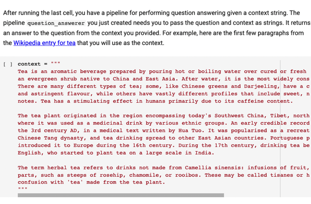</kbd>

    > [!NOTE]
    > Và với pipeline đã load, ta**chỉ việc inference nó với "câu
    > hỏi" mà ta cần hỏi ở dạng text**. **Pipeline** bên trong sẽ có **tokenizer phù
    > hợp để tokenize input** và**inference với model**, cũng như
    > **detokenize model's output**

     

    
    
<kbd>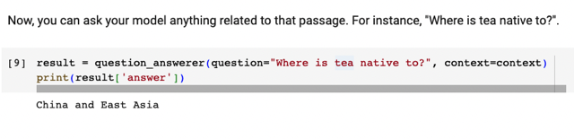</kbd>

    > [!NOTE]
    > Ví dụ hỏi nó extract thông tin
    > từ provided content

     

    
    
<kbd>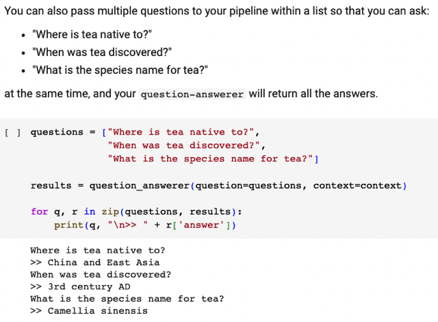</kbd>

    > [!NOTE]
    > Thậm chí có thể hỏi
    > nhiều câu cùng lúc

     

    
    
<kbd>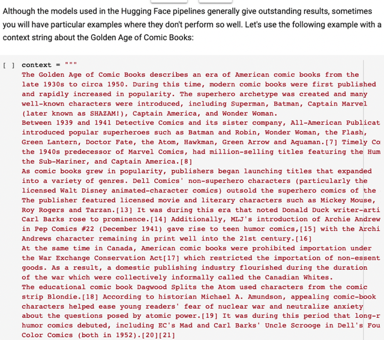</kbd>

     

    
    
<kbd>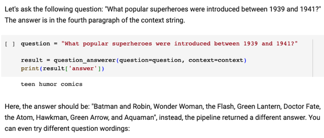</kbd>

    > [!NOTE]
    > Cái này ý nói là không phải model luôn
    > trả lời tốt cho mọi câu hỏi.

     

    
    
<kbd>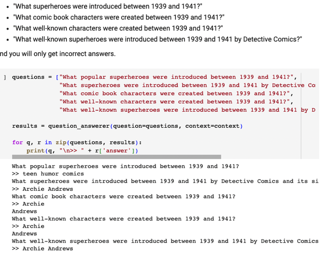</kbd>

     

  
  - It seems like this model is a huge fan of Archie Andrews. It even considers him a superhero!  The example that fooled your question_answerer belongs to the TyDi QA dataset, a dataset from Google for question/answering in diverse languages. To achieve better results when you know that the pipeline isn't working as it should, you need to consider fine-tuning your model.  In the next ungraded lab, you will get the chance to fine-tune the DistilBert model using the TyDi QA dataset.
    > [!NOTE]
    > Do đó, có thể ta cần
    > Fine-tune model

     

## Lab: Question

> [!NOTE]
> LAB: QUESTION
> ANSWERING WITH HF 2

 

### In the previous Hugging Face ungraded lab, you saw how to **use the pipeline objects** to

> [!NOTE]
> In the previous Hugging Face ungraded lab, you saw how to **use the pipeline objects** to 
> use **transformer models** for NLP tasks. I showed you that the **model didn't output the 
> desired answers** to a series of precise questions for a context related to the history of 
> comic books.
>
> In this lab, you will **fine-tune the model** from that lab to**give better answers** for that type of 
> context. To do that, you'll be using the \\_**TyDi QA dataset**\\_ but on a filtered version with only 
> English examples. Additionally, you will use a lot of the tools that Hugging Face has to 
> offer.
>
> You have to note that, in general, you will**fine-tune general-purpose transformer models** 
> to work for specific tasks. However, **fine-tuning a general-purpose** model can **take a lot of 
> time**. That's why you will be**using the model from the question answering pipeline** in this 
> lab.
>
> First, let's install some packages that you will use during the lab.

> [!NOTE]
> https://colab.research.google.com/drive/1P8COnbYLphJNaW3v8wS1AwpahnV-653A#scrollTo=u2UXutvEvpUj:~:text=In%20the%20previous,during%20the%20lab.

> [!NOTE]
> Đại khái là tiếp tục fine-tune với TyDi QA dataset để cải thiện khả năng
> thực hiện tác Question Answering

 

- Dataset
   

    
    
<kbd>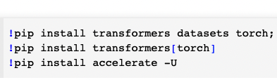</kbd>

     

    
    
<kbd>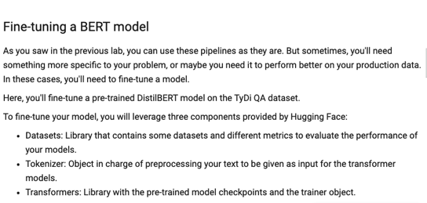</kbd>

    > [!NOTE]
    > Như đã nói, ta sẽ fine-tuning pre-trained distilled BERT model
    >
    > Trong quá trình đó ta sẽ sử dụng 3 lib của HuggingFace là Datasets
    > - giúp load  và access các bộ dataset cũng như là metrics. Tokenizer
    > chịu trách nhiệm preprocessing dataset và transformer cho ta tiếp
    > cận nhiều pre-trained model

     

    
    
<kbd>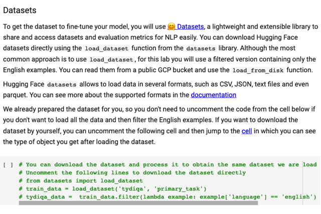</kbd>

    > [!NOTE]
    > Đại khái là có thể dùng **load_dataset**() để download dataset. Nó
    > support nhiều format như CSV, JSON, text.
    >
    > Ở đây thì người ta **chuẩn bị sẵn bộ dataset bằng cách filter  bộ gốc để
    > chỉ lấy tiếng Anh thôi**. Nên ta sẽ download và dùng **load_from_disk**
    > (thay vì bộ gốc từ**HuggingFace Dataset** với **load_dataset**())

     

    
    
<kbd>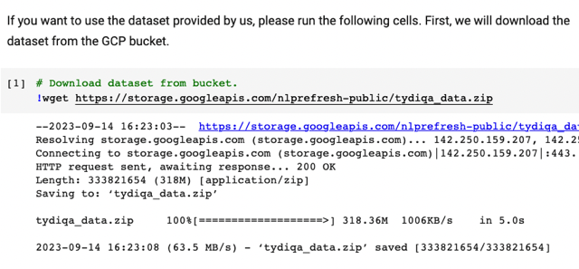</kbd>

    > [!NOTE]
    > Download bộ filtered dataset người ta chuẫn bị sẵn, để trên Google Cloud

     

    
    
<kbd>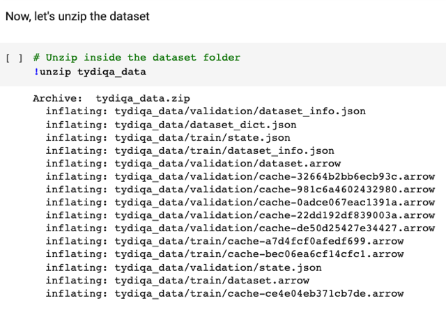</kbd>

     

    
    
<kbd>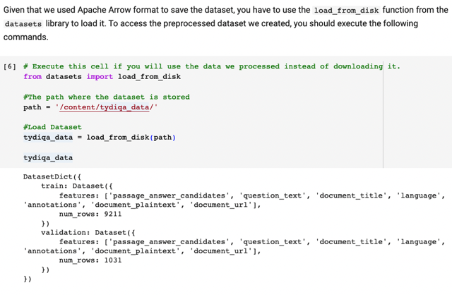</kbd>

    > [!NOTE]
    > Load data from disk

     

    
    
<kbd>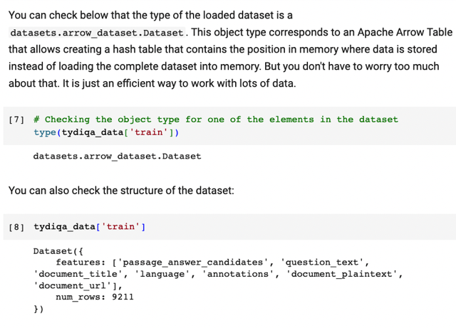</kbd>

    > [!NOTE]
    > Apache Arrow Table, là một loại dataset hiệu
    > quả hơn (efficient) khi làm việc với lots of data

     

  
  - You can see that **each example** is like a**dictionary object.** This dataset consists of **questions**, **contexts**, and **indices** that **point to the start and end position** of the answer**inside the context**. You can**access the index using the annotations key**, which is a kind of dictionary.
     

      
      
<kbd>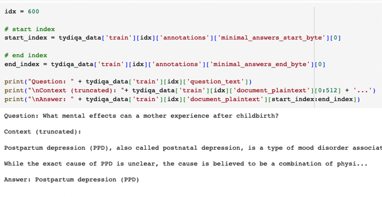</kbd>

      > [!NOTE]
      > Đại khái là **question** và **context** (inference vào pipeline) sẽ là **question_text,
      > document_plaintext**
      >
      > Và **thông tin về correct answer** (correct answer) sẽ kiểu như được đánh
      > dấu  **bằng start index và end index** trong document_text cụ thể là  **field
      > annotation - minimal_answers_start_byte và minimal_answer_end_byte**

       

    
    - The **question answering model** predicts **a start and endpoint in the context to extract as the answer**. That's why **this NLP task is known as extractive question answering.**  To train your model, you need to **pass start and endpoints as labels**. So, you need to**implement a function that extracts the start and end positions** from the dataset.  The dataset contains **unanswerable questions**. For these, the **start and end indices for the answer are equal to -1**
      > [!NOTE]
      > Đại khái là với dạng task này, model được train để extract
      > thông tin từ context ra bằng cách predict start và end point
      > trong context.
      >
      > Nên để train nó, ground truth label là start / end position
      > của câu trả lời đúng nằm trong context.
      >
      > Trong dataset có thể có câu hỏi không có câu trả lời, thì 
      > g.t. label của nó sẽ là start / end point đều là -1.

       

        
        
<kbd>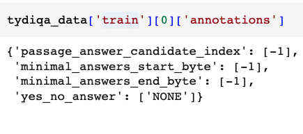</kbd>

         

        
        
<kbd>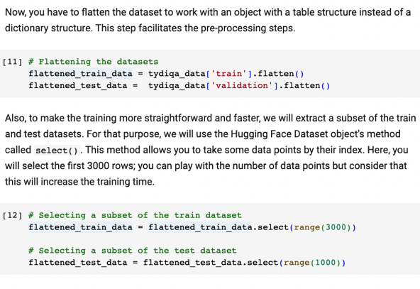</kbd>

        > [!NOTE]
        > Tiếp Theo là flatten the dataset để nó trở thành object có table
        > structure thay vì dictionary structure. Chưa hiểu lắm
        >
        > Đại khái là để giảm thời gian chờ đợi training, ta sẽ chỉ train trên
        > subset 3000 data samples.

         

- Tokenizer
   

  
  - Now, you will use the \\_**tokenizer**\\_ object from Hugging Face. You can **load a tokenizer** using  different methods. Here, you will **retrieve it from the pipeline object** you created in the  previous Hugging Face lab. With this tokenizer, you can **ensure that the tokens you get  for the dataset** will **match the tokens used in the original DistilBERT** implementation.  When **loading a tokenizer** with any method, you must **pass the model checkpoint** that you  want to fine-tune. Here, you are using the **'distilbert-base-cased-distilled- squad'** checkpoint.
    > [!NOTE]
    > Có nhiều cách để load tokenizer, ở đây ta load từ pipeline define ở
    > trên, việc này sẽ đảm bảo cái tokenizer là đúng cái được dùng trong
    > DistilBERT model. Và phải pass model check point vào.

     

    
    - # Import the AutoTokenizer from the transformers library from transformers import **AutoTokenizer** tokenizer = **AutoTokenizer**.**from_pretrained**("distilbert-base-cased-distilled-squad")
      > [!NOTE]
      > Có thể dùng AutoTokenizer để load tokenizer tương thích với model
      > distilBERT bằng cách gọi **from_pretrained**(tên model)

       

      
      - Given the**characteristics of the dataset** and the **question-answering task**, you will need to **add some steps to pre-process the data** after the tokenization:  When **there is no answer to a question** given a context, you will use the **CLS token**, a unique token used to represent the **start of the sequence.**  **Tokenizers** can **split a given string into substrings**, resulting in a subtoken for each substring, **creating misalignment between the list of dataset tags and the labels generated by the tokenizer**. Therefore, you will need to**align the start and end indices with the tokens associated with the target answer word.**  Finally, a tokenizer can **truncate a very long sequence**. So, if the **start/end position of an answer is None**, you will **assume that it was truncated** and **assign the maximum length of the tokenizer to those positions.**
         

        
        - # Processing samples using the 3 steps described. def **process_samples**(sample):     tokenized_data = tokenizer(sample['document_plaintext'], sample['question_text'], truncation="only_first", padding="max_length")      input_ids = tokenized_data["input_ids"]      # We will label impossible answers with the index of the CLS token.     cls_index = input_ids.index(tokenizer.cls_token_id)      # If no answers are given, set the cls_index as answer.     if sample["annotations.minimal_answers_start_byte"][0] == -1:         start_position = cls_index         end_position = cls_index     else:         # Start/end character index of the answer in the text.         gold_text = sample["document_plaintext"][sample['annotations.minimal_answers_start_byte'][0]:sample['annotations.minimal_answers_end_byte'][0]]         start_char = sample["annotations.minimal_answers_start_byte"][0]         end_char = sample['annotations.minimal_answers_end_byte'][0] #start_char + len(gold_text)          # sometimes answers are off by a character or two – fix this         if sample['document_plaintext'][start_char-1:end_char-1] == gold_text:             start_char = start_char - 1             end_char = end_char - 1     # When the gold label is off by one character         elif sample['document_plaintext'][start_char-2:end_char-2] == gold_text:             start_char = start_char - 2             end_char = end_char - 2     # When the gold label is off by two characters          start_token = tokenized_data.char_to_token(start_char)         end_token = tokenized_data.char_to_token(end_char - 1)          # if start position is None, the answer passage has been truncated         if start_token is None:             start_token = tokenizer.model_max_length         if end_token is None:             end_token = tokenizer.model_max_length          start_position = start_token         end_position = end_token      return {'input_ids': tokenized_data['input_ids'],           'attention_mask': tokenized_data['attention_mask'],           'start_positions': start_position,           'end_positions': end_position} 
           

            
            
<kbd>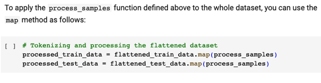</kbd>

             

- Transformer
   

    
    
<kbd>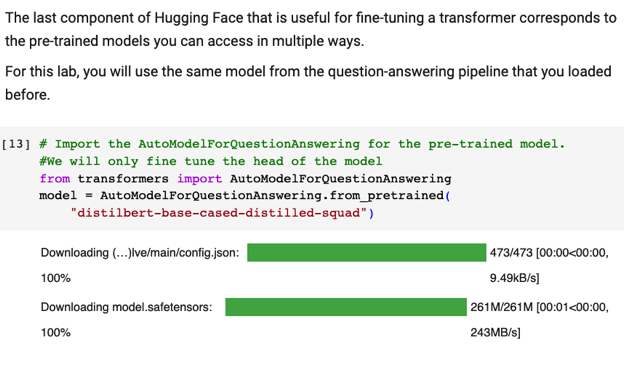</kbd>

    > [!NOTE]
    > Dùng **AutoModelForQuestionAnswering**.
    > **from_pretrained**(tên model  = distilBERT
    > model name) để **load model**

     

    
    
<kbd>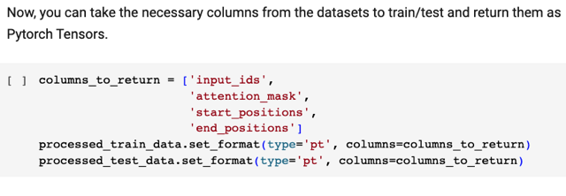</kbd>

    > [!NOTE]
    > Cơ bản là **sét định dạng của train/test dataset cụ thể là
    > các feature được define** thành **Pytorch Tensor.**

     

  
  - Here, we give you the **F1 score** as a **metric to evaluate** your model's performance. We will use this metric for simplicity, although it is based on the start and end values predicted by the model. If you want to dig deeper on other metrics that can be used for a question and answering task, you can also check this**colab notebook resource from the Hugging Face team.**
    > [!NOTE]
    > Đại khái là ở đây **chỉ dùng F1 score để evaluate cho nhanh**, nghiên cứu thêm **cách
    > khác evaluate 'Question Answering' model** bằng Notebook này:
    >
    > https://colab.research.google.
    > com/github/huggingface/notebooks/blob/master/examples/question_answering. ipynb

     

      
      
<kbd>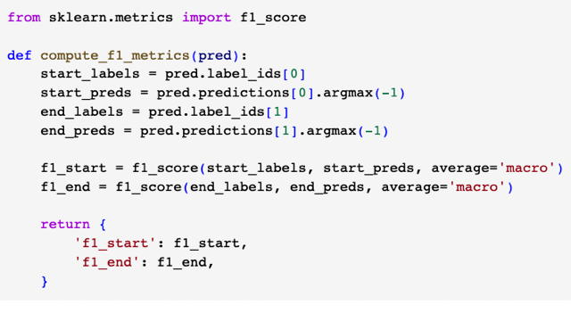</kbd>

      > [!NOTE]
      > Viết function tính F1 score, cơ bản là dùng f1_score của
      > Scikit Learn. Chưa hiểu lắm nó tính như thế nào

       

      
      
<kbd>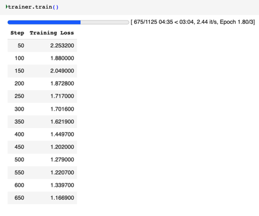</kbd>

      
<kbd>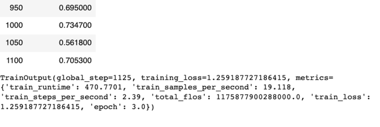</kbd>

      
<kbd></kbd>

      
<kbd></kbd>

      
<kbd>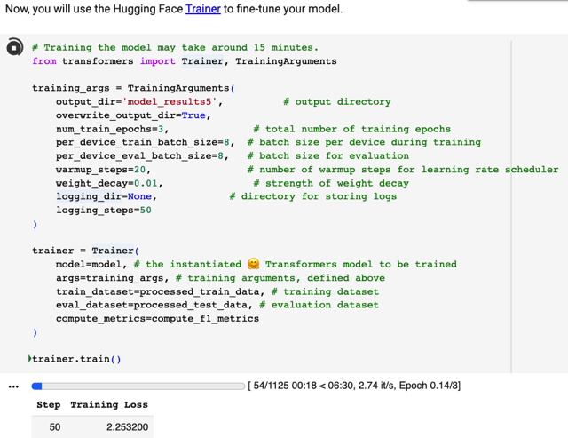</kbd>

      > [!NOTE]
      > Start Fine-tuning model, sử dụng **Trainer**. Take input là **model**, **training
      > argument**- define **output directory để save fine-tuned model**, số **epoch**, **batch
      > size**, l**earning rate decay**..
      >
      > Và **training/evaluation dataset** cũng như là **metric**, ở đây metric đưa vào là
      > một **function tính f1 score define ở trên** thay vì chỉ là một default metric nào
      > đó như Accuracy

       

      
      
<kbd>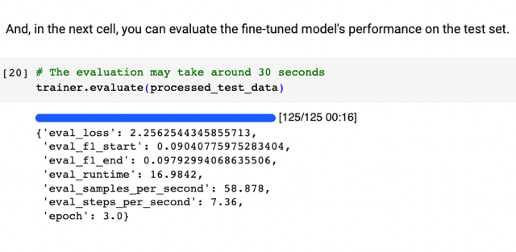</kbd>

      > [!NOTE]
      > Evaluate trên test set

       

- Using Your Fine-tunied Model
   

  
  - After **training and evaluating** your**fine-tuned model**, you can **check its results** for the same questions from the previous lab.  For that, you will tell **Pytorch** to use your **GPU or your CPU** to run the model. Additionally, you will need to t**okenize your input context and questions**.  Finally, you need to **post-process the output results to transform them from tokens to human-readable strings using the tokenizer.**
     

      
      
<kbd>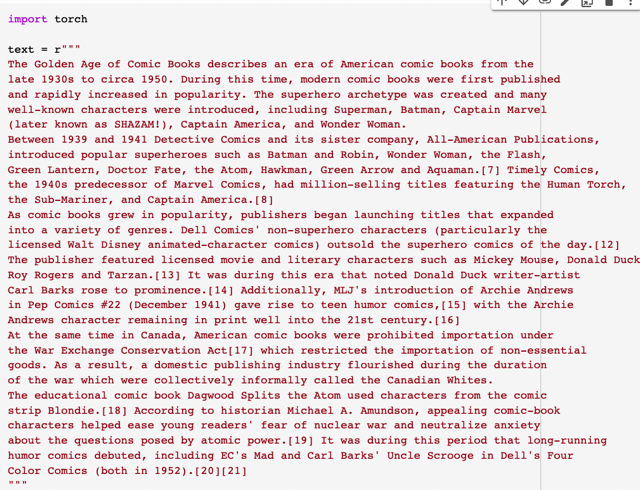</kbd>

       

    
    - questions = ["What superheroes were introduced between 1939 and 1941 by Detective Comics and its sister company?",              "What comic book characters were created between 1939 and 1941?",              "What well-known characters were created between 1939 and 1941?",              "What well-known superheroes were introduced between 1939 and 1941 by Detective Comics?"]  for question in questions:     inputs = tokenizer**.encode_plus**(question, text, **return_tensors="pt"**)     #print("inputs", inputs)     #print("inputs", type(inputs))     **input_ids** =**inputs["input_ids"].tolist()[0]**     **inputs.to("cuda")**      text_tokens = tokenizer.**convert_ids_to_tokens**(input_ids)     **answer_model** = **model(**inputs)**     # **Get the most likely beginning of answer** with the argmax of the score     answer_start = **torch.argmax(**         **answer_model['start_logits']**     )        # Get the most likely end of answer with the argmax of the score     answer_end = **torch.argmax**(answer_model['end_logits']) + 1        answer =****tokenizer.**convert_tokens_to_string**(                                          tokenizer.**convert_ids_to_tokens**(                                                             input_ids[answer_start:answer_end]))      print(f"Question: {question}")     print(f"Answer: {answer}\\\ ") 
      > [!NOTE]
      > Với mỗi câu hỏi, làm các bước sau:
      >
      > Dùng tokenizer để preprocess kiểu như tokenize question và context lại thành dạng Pytorch
      > Tensor
      >
      > Sau đó bảo Pytorch dùng GPU (inputs.to('cuda'))
      >
      > Rồi inference vào model,
      >
      > Lấy kết qủa và làm vài bước detokenize

       

      
      - Question: What superheroes were introduced between 1939 and 1941 by Detective Comics and its sister company? Answer: Superman, Batman, Captain Marvel ( later known as SHAZAM! ), Captain America, and Wonder Woman  Question: What comic book characters were created between 1939 and 1941? Answer: Superman, Batman, Captain Marvel ( later known as SHAZAM! ), Captain America, and Wonder Woman  Question: What well-known characters were created between 1939 and 1941? Answer: Superman, Batman, Captain Marvel ( later known as SHAZAM! ), Captain America, and Wonder Woman  Question: What well-known superheroes were introduced between 1939 and 1941 by Detective Comics? Answer: Superman, Batman, Captain Marvel ( later known as SHAZAM! ), Captain America, and Wonder Woman
         

          
          
<kbd>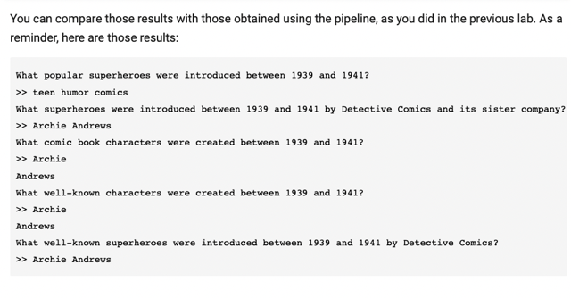</kbd>

          > [!NOTE]
          > So với những câu trả lời trước khi
          > fine-tune thì tốt hơn nhiều

           

## Week Conclusion

 

## Reference

 

### This course drew from the following resources:

> [!NOTE]
> This course drew from the following resources:
>
> - Exploring the Limits of Transfer Learning with a Unified Text-to-Text Transformer
>  (Raffel et al, 2019)
> https://arxiv.org/abs/1910.10683
>
> - Reformer: The Efficient Transformer (Kitaev et al, 2020)
> https://arxiv.org/abs/2001.04451
>
> - Attention Is All You Need (Vaswani et al, 2017)
> https://arxiv.org/abs/1706.03762
>
> - Deep contextualized word representations
> https://arxiv.org/pdf/1802.05365.pdf 
>
> - The Illustrated Transformer (Alammar, 2018)
> http://jalammar.github.io/illustrated-transformer/
>
> - The Illustrated GPT-2 (Visualizing Transformer Language Models)
>  http://jalammar.github.io/illustrated-gpt2/
>
> - BERT: Pre-training of Deep Bidirectional Transformers for Language Understanding
>  https://arxiv.org/abs/1810.04805
>
> - How GPT3 Works - Visualizations and Animations
>  http://jalammar.github.io/how-gpt3-works-visualizations-animations/

 

## Quiz

 

## P.a: Question Answering

 

### Welcome to this week's assignment of course 4. In this you will

> [!NOTE]
> Welcome to this week's assignment of course 4. In this you will
> explore **question answering**. You will implement the **"Text to Text
> Transfer from Transformers"** (better known as **T5**). Since you
> implemented **transformers** from scratch last week you will now be
> able to **use them.**

 

- Overview
   

  
  - This assignment will be different from the two previous ones. Due to **memory and time constraints** of this environment you will not be **able to train a model and use it for inference**. Instead you will **create the necessary building blocks** for the **transformer encoder model** and will use a **pretrained version of the same model** in two ungraded labs after this assignment.  After **completing these 3** (1 graded and 2 ungraded) labs you will:  • Implement the **code necessary** for **Bidirectional Encoder Representation from Transformer (BERT).**  • **Understand how the C4 dataset is structured**.  • **Use a pre-trained model**for **inference**.  • Understand how the **"Text to Text Transfer from Transformers"** or T5 model works.
    > [!NOTE]
    > Đại khái là vì giới hạn bộ nhớ và thời gian ở đây nên ta sẽ **không thể train một
    > cái model cỡ T5, hay BERT được**. Thay vào đó ta sẽ thực hành việc **tạo những
    > building blocks** cho Transformer encoder model. Sau đó **sử dụng pre-trained
    > version** của cùng model đó **để inference trong 2 cái lab cuối.**
    >
    > Từ đó, ta sẽ hiểu những **component** (code để tạo ra) của **BERT**, hiểu về bộ
    > dataset **C4**, và hiểu về **T5 model**

     

- Importing the Packages
   

    
    
<kbd>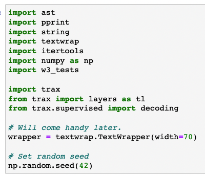</kbd>

     

- 1 - C4 Dataset
   

    
    
<kbd>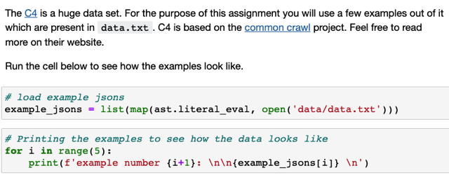</kbd>

    > [!NOTE]
    > Đại khái **C4 là một bộ dữ liệu khổng lồ** được thu thập từ **internet**.
    > Nó chính là b**ộ dữ liệu cơ bản để training ra các LLM như BERT,
    > GPT.**..
    >
    > Ở đây ta sẽ chỉ **sử dụng một vài example của nó** (trong file **data.
    > txt**)
    >
    > **Open file và tạo list**

     

    
    
<kbd>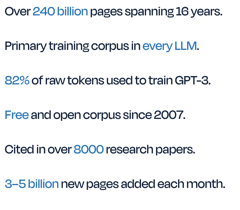</kbd>

    
<kbd></kbd>

    
<kbd></kbd>

     

    
    
<kbd>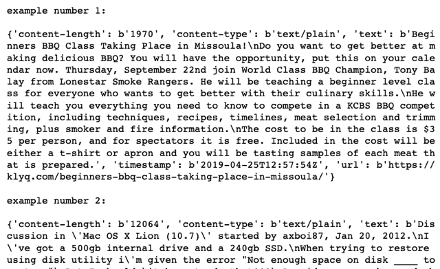</kbd>

    > [!NOTE]
    > Có thể thấy mỗi data sample là map với các key
    > **content-length, content-type, text, timestamp, url**

     

    
    
<kbd>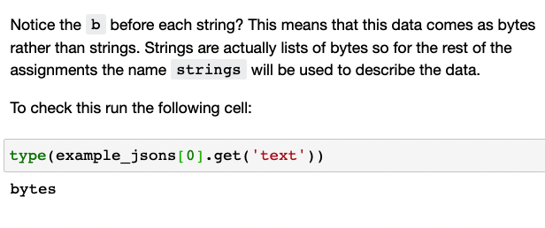</kbd>

    > [!NOTE]
    > Họ nói để ý sẽ thấy**kí tự 'b'** ở trước mỗi string ví dụ b'
    > 1970', b'text/plain'....Đó là vì thật ra nó là **dạng bytes**
    > (nhớ lại CS50 - byte=8 bit nhị phân)

     

  
  - 1.1 - Pre-Training Objective
     

      
      
<kbd>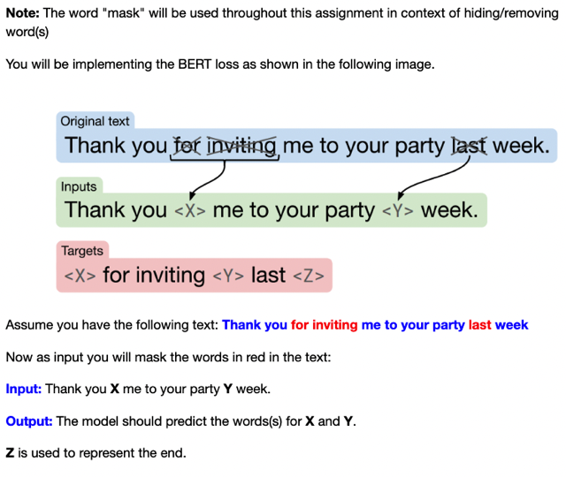</kbd>

      > [!NOTE]
      > Đại khái là để**tạo training data** sample, ta **lấy một câu** rồi
      > **mask** một hay vài phần (cụm từ) đi, để làm input, và
      > **dùng các cụm từ được mask đó để làm output**

       

  
  - 1.2 - Process C4
     

      
      
<kbd>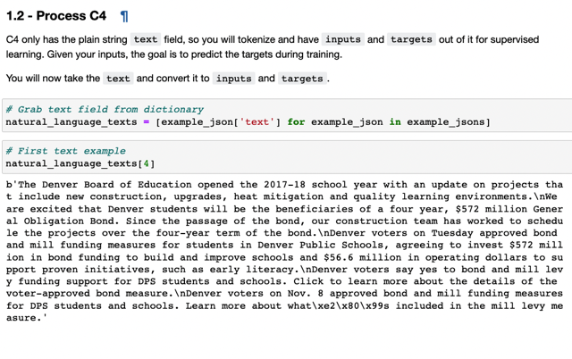</kbd>

      > [!NOTE]
      > Rất dễ hiểu, như đã thấy, một data sample của C4 chỉ có**content type,
      > content length, và text** - chứa nội dung của một web page hay bài báo gì
      > đó
      >
      > Có nghĩa là không có gì khác hết. Và ta sẽ **dùng phương thức nói ở trên**
      > (**che từ đi, và dùng nó làm label**) để train model predict. Cách này gọi là
      > **self-supervised learning** và thật ra ta đã dùng nó ở **CBOW** - Continuous
      > Bowl Of Words
      >
      > Đoạn code dưới **loop trong data và lấy content (text) ra bỏ vào thành một
      > list**

       

  
  - 1.2.1 - Decode to Natural Language
     

    
    - The following functions will help you **detokenize** and **tokenize** the text data.  The **sentencepiece** vocabulary was used to **convert from text to ids**. This vocabulary file  is **loaded and used in these helper functions**.  **natural_language_texts** has the **text from the examples we gave you.**  Run the cells below to see what is going on.
      > [!NOTE]
      > Đại khái nói là **họ chuẩn bị hai function** giúp **tokenize** và
      > **detokenize** data. Trong đó dùng **sentencepiece** vocabulary
      > được**fit từ bộ dataset C4.**
      >
      > Trong function nó sẽ load bộ vocab này (**vocab_file='
      > sentencepiece.model**' để dùng

       

        
        
<kbd>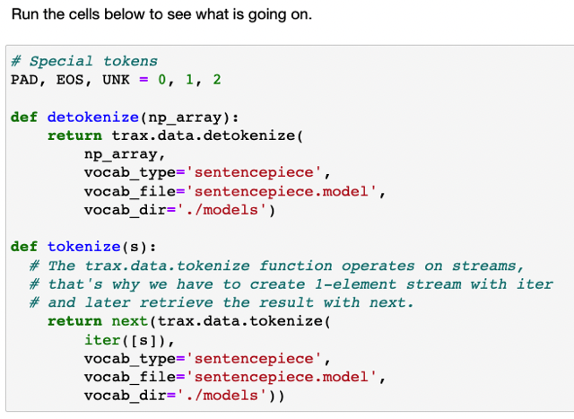</kbd>

         

        
        
<kbd>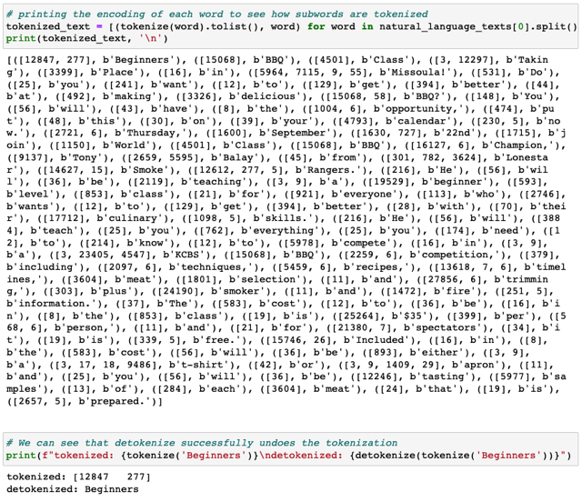</kbd>

        > [!NOTE]
        > Lấy cái data sample thứ 1st (trong list **natural_language_texts** đã chuẩn bị
        > ở trên), **split()** để thành **words list**.
        >
        > Rồi dùng **tokenize()** để thành **token**, ta thấy có **vụ tokenize(word).tolist()**
        > để rồi ví dụ từ **"Beginners" trở thành [12847, 277]** có nghĩa là như đã
        > biết trong cái **lab BPE, nó token theo kiểu subword.**
        >
        > Thành ra từ "**Beginners**" nó thành **2 tokens**
        >
        > Và **detokenize** ngược ra**[12847, 277] thành "Beginners"**

         

        
        
<kbd>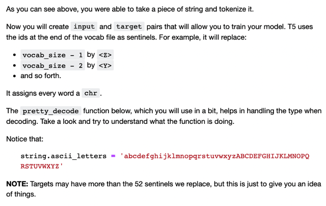</kbd>

         

        
        
<kbd>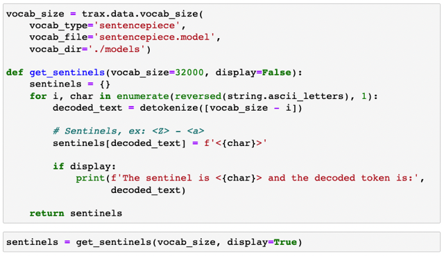</kbd>

        > [!NOTE]
        > Đại khái phần trên là mô phỏng một cách để 'masking'.
        >
        > string.ascii_letters = 'abcdefghijklmnopqrstuvwxyzABCDEFGHIJKLMNOPQRSTUVWXYZ'
        >
        > iterate chuỗi string.ascii_letters ở trên, theo chiều từ cuối lên đầu, ví dụ (1,'Z') (2,'Y') (3,'X') ...
        >
        > decoded_text sẽ lần lượt là: 
        >
        > detokenize([32000 - 1]) = 'International' 
        > detokenize([32000 - 2]) = 'erwachsene'
        > ...

        > [!NOTE]
        > Function get_sentinels này làm gì:
        >
        > Nó nhận vocab_size number, sử dụng chuỗi ascii_letters như sau: loop trong
        > các kí tự theo chiều ngược lại (Z -> Y -> X...).
        >
        > Với mỗi char = character trong chuỗi ASCII (Z -> Y -> X...), và i = 1, 2, 3...
        >
        > lấy cái index = vocab_size - i sẽ là **index và cũng là token** của các từ  ở
        > cuối vocab dict đi ngược dần lên: vocab_size -1, vocab_size -2...
        >
        > Nhắc lại khỏi bối rối, vocab_dict được tạo sẽ có dạng (ví dụ vocab_size =
        > 32000) "word a" - 1, "word b" - 2,....."word gì đó 1" - 31199, "word gì đó 2" -
        > 32000 Thì index 32000, 31199 cũng là token của các từ áp chót trong vocab
        > dict.
        >
        > Bỏ vào detokenize() để lấy ra từ (decoded_text)
        >
        > Kế tiếp sentinels[decoded_text] = f'<{char}>': Tạo cặp key=decoded_text,
        > value là kí tự trong chuỗi ASCII ở trên
        >
        > Tóm lại function này mục đích là tạo bộ dictionary, key là các từ trong vocab
        > size từ dưới lên, value là các kí tự trong ASCII cũng từ dưới lên.
        >
        > "Internațional" - "<Z>" 
        > "erwachsene" - "<Y>"

         

      
      - i: 1, char: **Z**[vocab_size - i] = [**31999**] -> decoded_text = **Internațional** The sentinel is <Z> and the decoded token is: Internațional i: 2, char: Y [vocab_size - i] = [31998] -> decoded_text = erwachsene The sentinel is <Y> and the decoded token is: erwachsene i: 3, char: X [vocab_size - i] = [31997] -> decoded_text = Cushion The sentinel is <X> and the decoded token is: Cushion i: 4, char: W [vocab_size - i] = [31996] -> decoded_text = imunitar The sentinel is <W> and the decoded token is: imunitar i: 5, char: V [vocab_size - i] = [31995] -> decoded_text = Intellectual The sentinel is <V> and the decoded token is: Intellectual i: 6, char: U [vocab_size - i] = [31994] -> decoded_text = traditi The sentinel is <U> and the decoded token is: traditi i: 7, char: T [vocab_size - i] = [31993] -> decoded_text = disguise The sentinel is <T> and the decoded token is: disguise i: 8, char: S [vocab_size - i] = [31992] -> decoded_text = exerce The sentinel is <S> and the decoded token is: exerce i: 9, char: R [vocab_size - i] = [31991] -> decoded_text = nourishe The sentinel is <R> and the decoded token is: nourishe i: 10, char: Q [vocab_size - i] = [31990] -> decoded_text = predominant The sentinel is <Q> and the decoded token is: predominant i: 11, char: P [vocab_size - i] = [31989] -> decoded_text = amitié The sentinel is 
 and the decoded token is: amitié i: 12, char: O [vocab_size - i] = [31988] -> decoded_text = erkennt The sentinel is <O> and the decoded token is: erkennt i: 13, char: N [vocab_size - i] = [31987] -> decoded_text = dimension The sentinel is <N> and the decoded token is: dimension i: 14, char: M [vocab_size - i] = [31986] -> decoded_text = inférieur The sentinel is <M> and the decoded token is: inférieur
         

          
          
<kbd>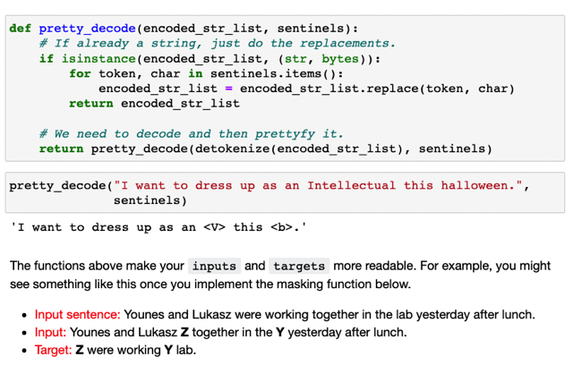</kbd>

          > [!NOTE]
          > Như vậy function này chỉ là nhận **một câu** và một **list các sentinels** chứa các
          > cặp **'từ' - sentinels,** ví dụ **'Intellectual' - '<V>'**
          >
          > Nó sẽ đơn giản là **loop trong sentinels list**, ví dụ: 
          >
          > token (= 'Intellectual') - (char = '<V>'), 
          > token (= 'halloween') - (char = '<b>'), 
          >
          > thực hiện **replace (token, char)** thì có nghĩa là**trong câu input mà có
          > từ 'Intellectual' thì từ đó sẽ bị replace bởi '<V>'**Thành ra câu "I want to dress up as an **Intellectual** this **halloween**" trở thành
          > "I want to dress up as an **<V>** this **<b>**"
          >
          > ====
          >
          > Ở trên nói T5 dùng các ids ở cuối vocab size làm sentinels, có thể bởi lập luận 
          > sau: Vì ta đã biết vocab dict sẽ được tạo theo kiểu - những từ xuất hiện nhiều
          > sẽ nằm ở trên (với id thấp) và cứ thế.
          >
          > Thì kiểu làm ở đây có thể là, họ sẽ chọn 1 con số (hyper-parameter) các sentinels
          > ví dụ 100, lấy từ dưới của vocab dict lên để dùng trong quá trình training sẽ che và 
          > đoán. Thì để thấy cách làm này có hiệu quả gì thì trước tiên xem thử có cách 
          > khác không.
          >
          > Thì một cách khác là, lấy từ trên xuống, (ngược lại với cách này). Ngay lập tức cách
          > này không ổn đó là nó sẽ chọn những từ thông dụng nhất, xuất hiện nhiều và khả năng
          > cao là những từ chung chung vô nghiã như may, can, ....
          >
          > Cách khác đó là lấy random, thì cũng có thể được nhưng cũng khó khống chế khả năng
          > vấp phải những từ chung chung vô nghĩa nhưng xuất hiện nhiều.
          >
          > Cơ bản là cách đầu là ổn nhất theo lập luận này

           

          
          
<kbd>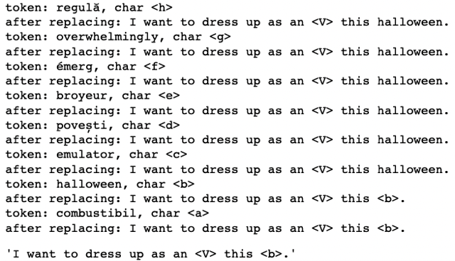</kbd>

          
<kbd></kbd>

          
<kbd>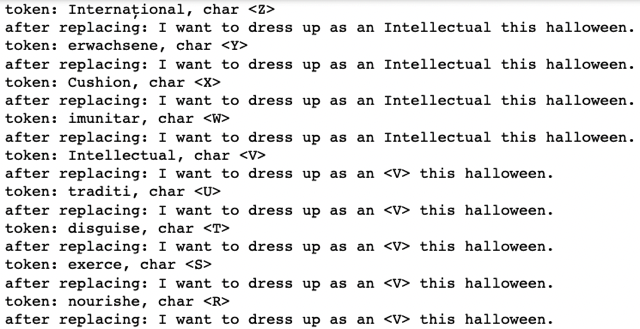</kbd>

          > [!NOTE]
          > Như ở câu này, có 2 từ xuất hiện trong sentinels là '
          > Intellectual' và 'halloween' đã bị replace bởi '<V>' và '<b>'

           

  
  - 1.3 - Tokenizing and Masking
     

    
    - Exercise 1 - tokenize_and_mask
       

        
        
<kbd>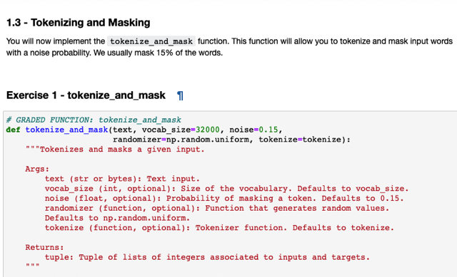</kbd>

         

        
        
<kbd>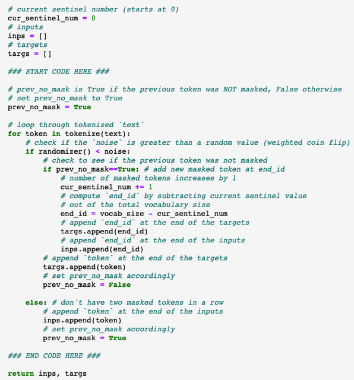</kbd>

        > [!NOTE]
        > Input sentence: Younes and Lukasz \_were\_ working together in the \_lab\_ yesterday after lunch.
        > Input:                Younes and Lukasz **Z** together in the **Y** yesterday after lunch.
        > Target:              **Z** \_were\_ working **Y** \_lab\_.
        >
        > Nhận đoạn text, vocab_size, noise vai trò như threshold để kiểm soát mức % từ được che,
        > randomizer dùng để tạo một random number từ 0-1 và theo default lấy từ Uniform
        > distribution, và tokenizer
        >
        > Đầu tiên chuẩn bị inps = list chứa các inputs - tức là inputs đưa vào model, đóng vai trò là
        > X đó. Và chuẩn bị targs = list chứa các targets, đóng vai trò ground truth label (Y).
        >
        > Bắt đầu với việc dùng tokenizer object để tokenize text thành các token , sau đó bắt đầu
        > loop trong các token đó.
        >
        > Tạo một random value bằng randomizer(), và so nó với noise = 0.15 Mục đích là với
        > default của randomizer là Uniform distribution (như đã biết sẽ có P(x) bằng nhau hết trên
        > các gía trị khả dĩ của x) thì giả sử gọi rất nhiều lần thì các giá trị của x sẽ xuất hiện chia
        > đều trong khoảng [0:1]. Đồng nghĩa là sẽ có 15% trong số đó mang  giá trị < 0.15.
        >
        > Nôm na là cho 100 số 1-100. với xác suất các số xuất hiện như nhau thì nếu bốc rất nhiều
        > lần ví dụ m lần thì sẽ có m/100 số lần bốc trúng số 1, m/100 lần bốc trúng số 2,..... m/100
        > lần bốc trúng số 15. Như vậy có (m+m+..m)/100 = 15m/100 lần bốc trúng số nhỏ hơn hoặc
        > bằng 15 Như vậy là trong m lần bốc, có 15/100 = 15% số lần bốc trúng số nhỏ hơn hoặc
        > bằng 15.

        > [!NOTE]
        > Check từ trước đó không có mask để đảm bảo không có vị 2 từ mask kế tiếp
        >
        > Nếu pass, tăng số sentinel_num lên 1, lấy end_id = vocab_size - cur_sentinel_num (với
        > cur_sentinel_num tăng lên dần từ 1, 2...thì end_id sẽ lần lượt là vocab_size -1,
        > vocab_size- 2...)
        >
        > và add end_id vào inputs, targets list : tức là đó là từ được chọn để mask
        >
        > ====
        >
        > Nói chung là mục đích là, với đoạn text đưa vào, biến thành list tokens, loop trong đó.
        >
        > Check điều kiện random < 0.15, và trước đó không có mask. 
        > ========
        >
        > Ví dụ tới chữ **"\_were\_"** trong ví dụ ở trên, random check passed -> ta sẽ bỏ **end_id** (ở đây sẽ 
        > là vocab_size - cur_sentinel_num = vocab_size - 1 = **31999**) vào**inputs, và targets**
        >
        > Inputs: ["Younese"(t) "and"(t) "Lukasz"(t) **31999**] ~> [Younese and Lokasz **Z**]
        >
        > Targets: [**31999**] ~> [**Z**]
        >
        > Ra ngoài, bỏ **token** vào targets, targets lúc này:
        > Targets:  [**31999** **"were"(t)**] ~> [Z were]
        >
        > ====
        >
        > Chạy tiếp qua từ **"working"**, 
        > + Ở đây pass random check, nhưng prev_no_mask đang là **False**, nên không pass điều kiện 
        > prev_no_mask, nó sẽ đi xuống add token = "working"(t) vào targets
        >
        > Inputs: ["Younese"(t) "and"(t) "Lukasz"(t) **31999**] ~> [Younese and Lokasz **Z**]
        > Targets: [**31999 "were"(t) "working"(t)**] ~>  [Z were working]
        >
        > (Ở đây nếu không pass random check) thì đơn giản là add "working" vào inputs)
        >
        > ====
        >
        > Chạy tiếp qua từ **"together", "in", "the"** đều không pass random check, nên chỉ add vào inputs 
        > (Ở đây nếu pass random check thì vì vẫn đang có prev_no_mask False nên nó sẽ tiếp tục nối vào chuỗi target [31999 "were"(t) "working"(t) "together"(t), "in"(t), "the"(t)])
        >
        > Inputs:  ["Younese"(t) "and"(t) "Lukasz"(t) 31999 "together"(t) "in"(t) "the"(t)] ~> [Younese and Lokasz Z together in the]
        > Targets: [31999 "were"(t) "working"(t)] ~>  [Z were working]
        >
        > ====
        >
        > Chạy tiếp qua từ "**lab**". Ở đây pass random check, và vì nãy giờ luôn ở nhánh không pass random check nên 
        > prev_no_mask là True, tiến hành update end_id = vocab_size - 2 = 31998, add vào inputs, targets:
        >
        > Inputs:  ["Younese"(t) "and"(t) "Lukasz"(t) 31999 "together"(t) "in"(t) "the"(t) 31998] ~> [Younese and Lokasz Z together in the Y]
        > Targets: [31999 "were"(t) "working"(t) 31998] ~>  [Z were working Y]
        >
        > Ra ngoài, bỏ token vào targets, targets lúc này:
        > [31999 "were"(t) "working"(t) 31998 "lab"(t)] ~>  [Z were working Y lab]
        >
        > ====
        >
        > Chạy tiếp qua từ "**yesterday**", không pass random check, nên chỉ add vào inputs
        >
        > Inputs:  ["Younese"(t) "and"(t) "Lukasz"(t) 31999 "together"(t) "in"(t) "the"(t) 31998 "yesterday"(t)] ~> [Younese and Lokasz Z together in the Y yesterday]
        > Targets: [31999 "were"(t) "working"(t) 31998 "yesterday"(t)] ~>  [Z were working Y yesterday] 
        >
        > Cứ thế tiếp tục. 
        > Kết luận có 2 tính chất quan trọng sau: 
        > Nếu pass random check, nhưng trước đó có mask, thì nó vẫn add vào targets để thành ra mask là 1 cụm nhiều từ ví dụ Z were working 
        > Nếu pass random check nhưng trước đó không có mask thì mới tạo mask mới.
        > Còn nếu không pass random check thì đưa từ vào input nhưng không vào target.

         

        
        
<kbd>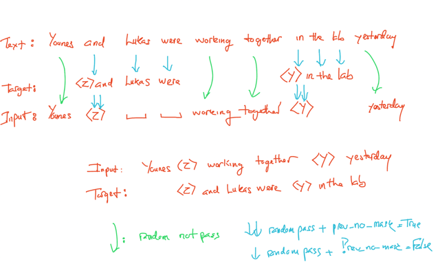</kbd>

         

        
        
<kbd>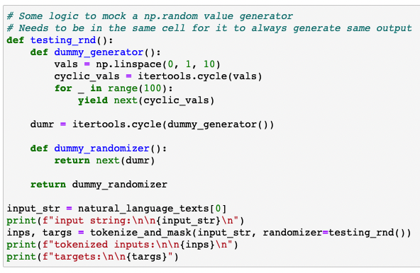</kbd>

         

        
        
<kbd>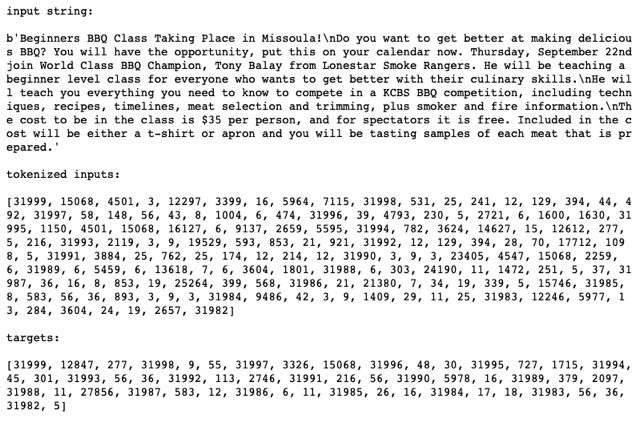</kbd>

         

        
        
<kbd>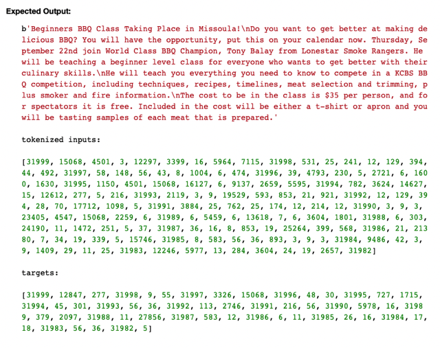</kbd>

        > [!NOTE]
        > input string:
        >
        > **b'Beginners** BBQ Class Taking Place in Missoul**a!**\\nDo you want
        > to get  better at making **delicious** BBQ? You will have the
        > opportunity, put **this  on** your calendar now. Thursday, September
        > 22**nd** **join** World Class  BBQ Champion, Tony Balay **from
        > L**onestar Smoke Rangers. **He will**be  teaching a beginner level
        > class for everyone who wants to get better  with their culinary skills.
        > \\nHe will teach you everything you need to  know to **compete in** a
        > KCBS BBQ competition, **including techniques**,  recipes, timelines,
        > meat selection **and trimming**, plus smoker and fire  information.
        > \\nThe **cost to** be in the class is $35 per person**, and** for
        > spectators it is free. Included **in** the cost **will be** either a t-shirt or
        > apron  and you will be tasting samples of each meat that is prepared.'
        >
        > Targets:
        >
        > <Z> Beginners <Y>a! <X> delicious BBQ <W> this on <V>nd join <U>
        > from L  <T> will be<S> who wants<R> He will <Q> compete in

        > including techniques <O> and trimming <N> cost to <M>, and <L>d in
        > <K>t- <J> will be <I>.

        > [!NOTE]
        > token: 12847 - "Beginners"(t)
        >
        > ===random passed!
        >
        > ==prev_no_mask: True
        > end_id = 32000 - 1 = 31999
        > inps: [31999]  
        > targs: [31999]
        >
        > inps: [31999] ~= ['Z']
        > targs: [31999, 12847] ~= ['Z', "Beginners"]
        >
        >
        > token: 277 
        >
        > ===random passed!
        >
        > ==prev_no_mask: False -> Reject, không cho 2 mask liên tục
        >
        > inps: [31999]
        > targs: [31999, 12847, 277] ~= ['Z', "Beginners"]
        >
        >
        >
        > token: 15068
        >
        > ===random not passed!
        >
        > inps: [31999, 15068]
        > targs: [31999, 12847, 277]
        >
        >
        >
        > token: 4501
        >
        > ===random not passed!
        >
        > inps: [31999, 15068, 4501]
        > targs: [31999, 12847, 277]

        > [!NOTE]
        > token: 3
        >
        > ===random not passed!
        >
        > inps: [31999, 15068, 4501, 3]
        > targs: [31999, 12847, 277]
        >
        >
        >
        > token: 12297
        >
        > ===random not passed!
        >
        > inps: [31999, 15068, 4501, 3, 12297]
        > targs: [31999, 12847, 277]
        >
        >
        >
        > token: 3399
        >
        > ===random not passed!
        >
        > inps: [31999, 15068, 4501, 3, 12297, 3399]
        > targs: [31999, 12847, 277]
        >
        >
        >
        > token: 16
        >
        > ===random not passed!
        >
        > inps: [31999, 15068, 4501, 3, 12297, 3399, 16]
        > targs: [31999, 12847, 277]
        >
        >
        >
        > token: 5964
        >
        > ===random not passed!
        >
        > inps: [31999, 15068, 4501, 3, 12297, 3399, 16, 5964]
        > targs: [31999, 12847, 277]
        >
        >
        >
        > token: 7115
        >
        > ===random not passed!
        >
        > inps: [31999, 15068, 4501, 3, 12297, 3399, 16, 5964, 7115]
        > targs: [31999, 12847, 277]

         

  
  - 1.4 - Creating the Pairs
     

      
      
<kbd>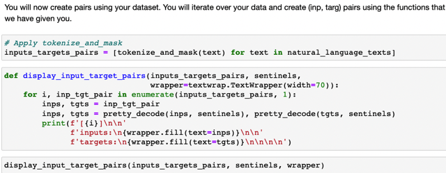</kbd>

       

    
    - token: **Internațional**, char **<Z>**  after replacing: Beginners BBQ Class Taking Place in Missoula! Do you **<Z>** to get better at making delicious BBQ? You will have the opportunity, put this on your calendar now. Thursday, September 22nd join World Class erwachsene Champion, Tony Ba Cushion from Lone imunitare Rangers. He will be teaching  Intellectual beginner level class for everyone who wants traditi get better with their culinary disguise. Heexerce teach you everything younourishe to know to compete in a KCBS BBQ competition, including techniques, predominant, timelines, amitié selection and erkennt, plus smoker and fire information. The cost to be in the class is $35 perdimension and for inférieurs it refugi free. cheddard in unterlieg will be either a t-shirt or  garanteazpron and you will be tasting samples of each meat that is prepared.  token: **erwachsene**, char **<Y>**  after replacing: Beginners BBQ Class Taking Place in Missoula! Do you **<Z>** to get better at making delicious BBQ? You will have the opportunity, put this on your calendar now. Thursday, September 22nd join World Class **<Y>** Champion, Tony Ba Cushion from Lone imunitare Rangers. He will be teaching  Intellectual beginner level class for everyone who wants traditi get better with their culinary disguise. Heexerce teach you everything younourishe to know to compete in a KCBS BBQ competition, including techniques, predominant, timelines,amitié selection and erkennt, plus smoker and fire information. The cost to be in the class is $35 perdimension and for inférieurs it refugi free. cheddard in unterlieg will be either a t-shirt or  garanteazpron and you will be tasting samples of each meat that is prepared.
       

- 2 - Transformer
   

    
    
<kbd>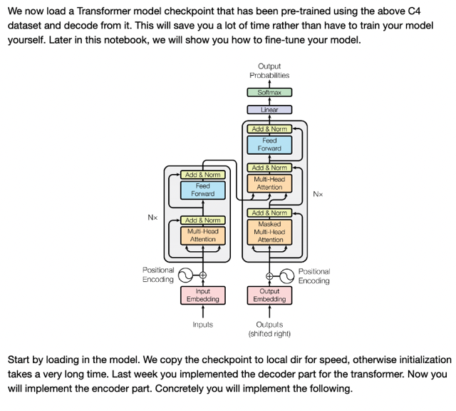</kbd>

     

    
    
<kbd>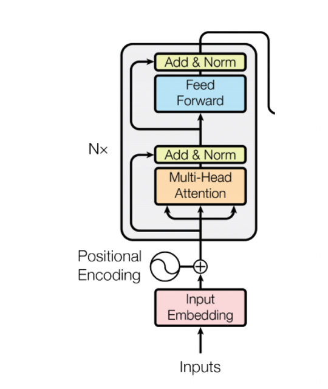</kbd>

     

  
  - 2.1 - Transformer Encoder
     

      
      
<kbd>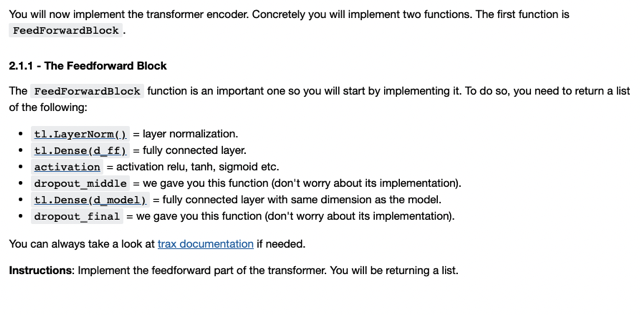</kbd>

       

  
  - 2.1.1 - The Feedforward Block
     

    
    - Exercise 2 - FeedForwardBlock
       

        
        
<kbd>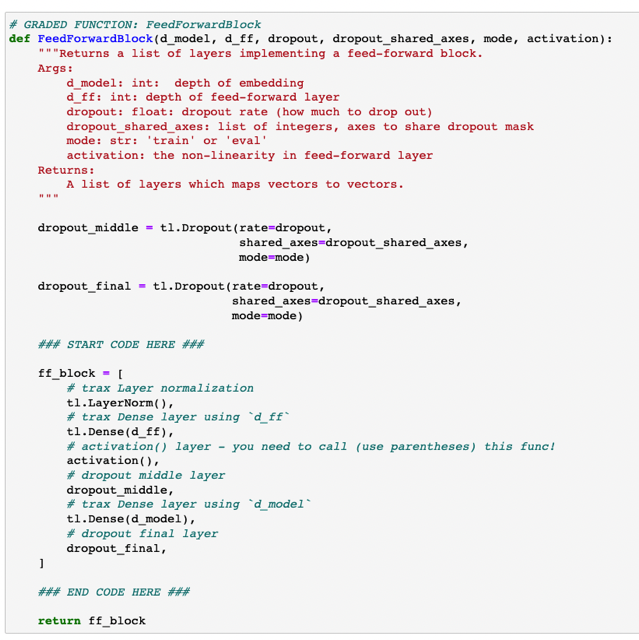</kbd>

         

        
        
<kbd>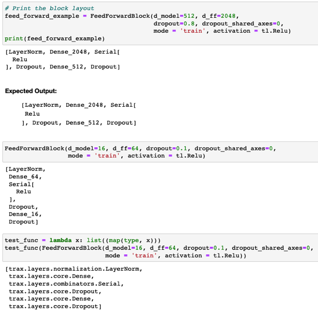</kbd>

         

  
  - 2.1.2 - The Encoder Block
     

      
      
<kbd>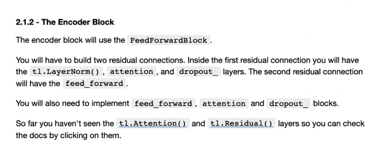</kbd>

       

    
    - Exercise 3 - EncoderBlock
       

        
        
<kbd>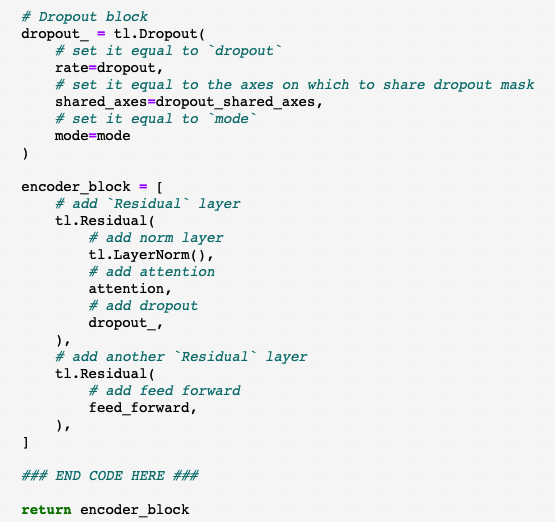</kbd>

        
<kbd></kbd>

        
<kbd>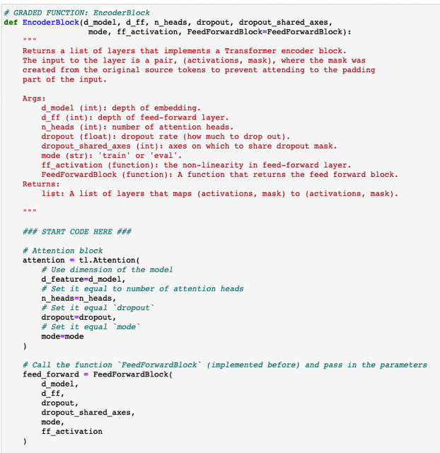</kbd>

         

        
        
<kbd>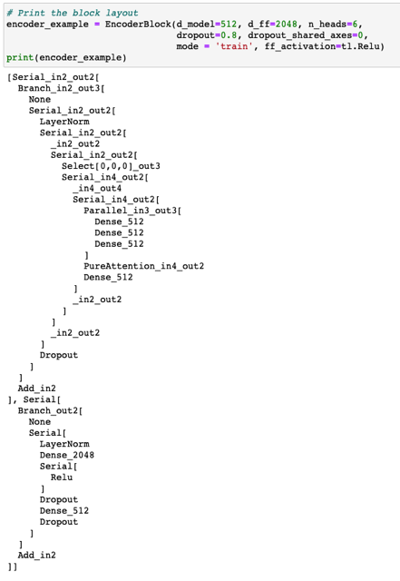</kbd>

         

        
        
<kbd>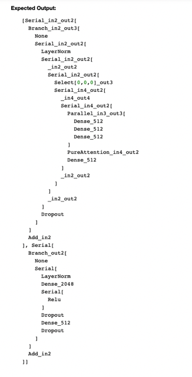</kbd>

         

  
  - 2.1.3 - The Transformer Encoder
     

    
    - Exercise 4 - TransformerEncoder
       

        
        
<kbd>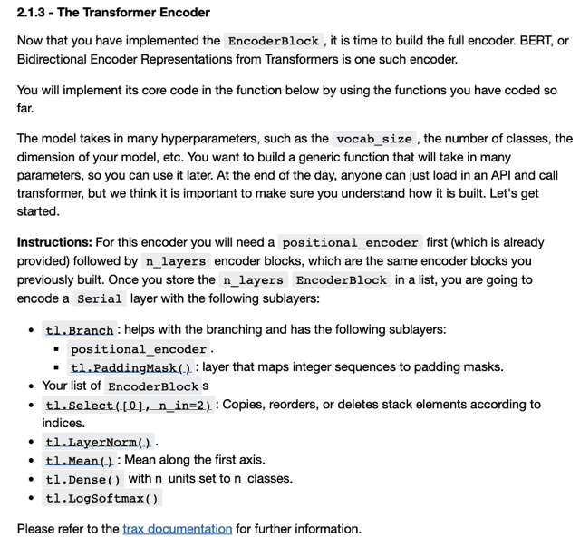</kbd>

         

        
        
<kbd>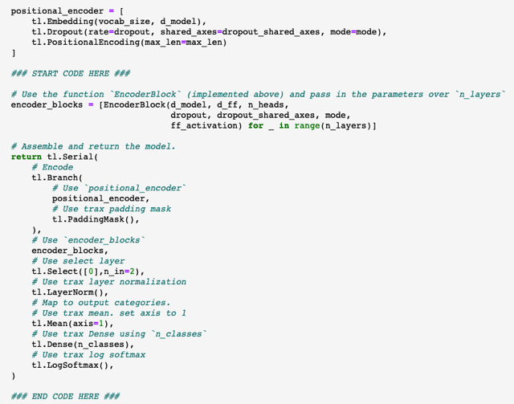</kbd>

        
<kbd></kbd>

        
<kbd>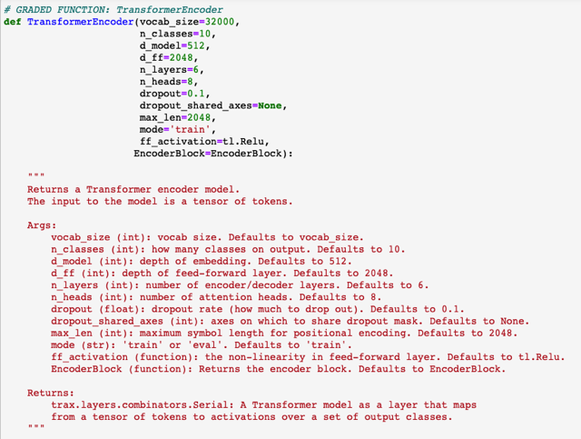</kbd>

         

        
        
<kbd>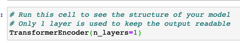</kbd>

        
<kbd></kbd>

        
<kbd>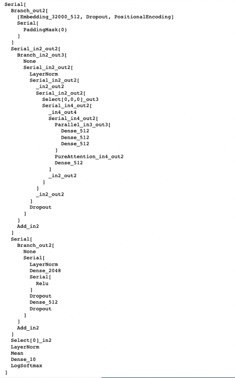</kbd>

         

## Lab: Bert Loss

 

<kbd>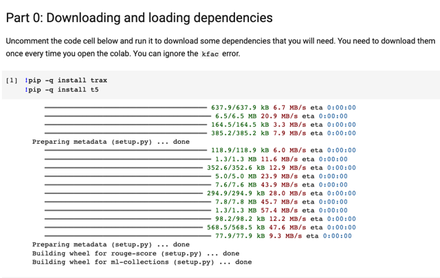</kbd>

 

<kbd>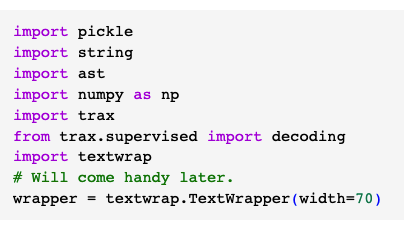</kbd>

 

<kbd>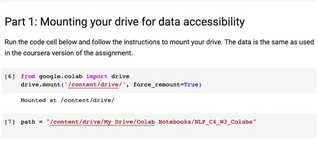</kbd>

 

<kbd>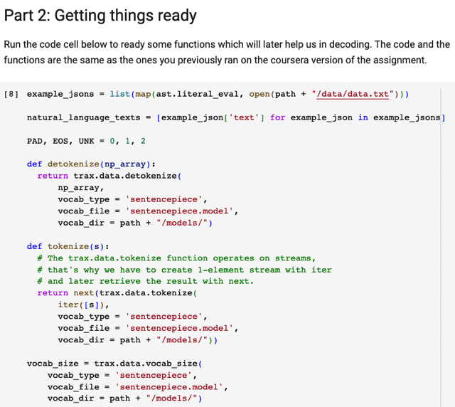</kbd>

> [!NOTE]
> Các bước đã làm trong PA: Load bộ dataset (C4), tạo list chỉ chứa
> các content (field text của json file)
>
> Chuẩn bị một số function: tokenize() và detokenize(), dùng tokenizer
> đã fit với  dataset để tokenize và detokenize

 

<kbd>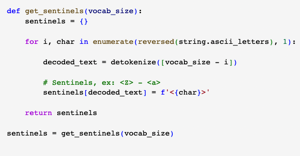</kbd>

> [!NOTE]
> Function get_sentinels này làm gì:
>
> Nó nhận vocab_size number, sử dụng chuỗi ascii_letters như sau: loop trong
> các kí tự theo chiều ngược lại (Z -> Y -> X...).
>
> Với mỗi char = character trong chuỗi ASCII (Z -> Y -> X...), và i = 1, 2, 3...
>
> lấy cái index = vocab_size - i sẽ là **index và cũng là token** của các từ  ở
> cuối vocab dict đi ngược dần lên: vocab_size -1, vocab_size -2...
>
> Nhắc lại khỏi bối rối, vocab_dict được tạo sẽ có dạng (ví dụ vocab_size =
> 32000) "word a" - 1, "word b" - 2,....."word gì đó 1" - 31199, "word gì đó 2" -
> 32000 Thì index 32000, 31199 cũng là token của các từ áp chót trong vocab
> dict.
>
> Bỏ vào detokenize() để lấy ra từ (decoded_text)
>
> Kế tiếp sentinels[decoded_text] = f'<{char}>': Tạo cặp key=decoded_text,
> value là kí tự trong chuỗi ASCII ở trên
>
> Tóm lại function này mục đích là tạo bộ dictionary, key là các từ trong vocab
> size từ dưới lên, value là các kí tự trong ASCII cũng từ dưới lên.

 

<kbd>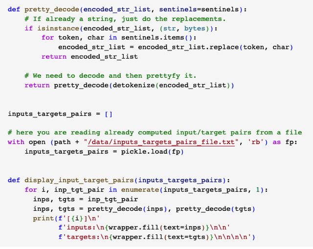</kbd>

> [!NOTE]
> Như vậy function này chỉ là nhận **một câu** và một **list các sentinels** chứa các
> cặp **'từ' - sentinels,** ví dụ **'Intellectual' - '<V>'**
>
> Nó sẽ đơn giản là **loop trong sentinels list**, ví dụ: 
>
> token (= 'Intellectual') - (char = '<V>'), 
> token (= 'halloween') - (char = '<b>'), 
>
> thực hiện **replace (token, char)** thì có nghĩa là**trong câu input mà có
> từ 'Intellectual' thì từ đó sẽ bị replace bởi '<V>'**Thành ra câu "I want to dress up as an **Intellectual** this **halloween**" trở thành
> "I want to dress up as an **<V>** this **<b>**"
>
> ====
>
> Ở trên nói T5 dùng các ids ở cuối vocab size làm sentinels, có thể bởi lập luận 
> sau: Vì ta đã biết vocab dict sẽ được tạo theo kiểu - những từ xuất hiện nhiều
> sẽ nằm ở trên (với id thấp) và cứ thế.
>
> Thì kiểu làm ở đây có thể là, họ sẽ chọn 1 con số (hyper-parameter) các sentinels
> ví dụ 100, lấy từ dưới của vocab dict lên để dùng trong quá trình training sẽ che và 
> đoán. Thì để thấy cách làm này có hiệu quả gì thì trước tiên xem thử có cách 
> khác không.
>
> Thì một cách khác là, lấy từ trên xuống, (ngược lại với cách này). Ngay lập tức cách
> này không ổn đó là nó sẽ chọn những từ thông dụng nhất, xuất hiện nhiều và khả năng
> cao là những từ chung chung vô nghiã như may, can, ....
>
> Cách khác đó là lấy random, thì cũng có thể được nhưng cũng khó khống chế khả năng
> vấp phải những từ chung chung vô nghĩa nhưng xuất hiện nhiều.
>
> Cơ bản là cách đầu là ổn nhất theo lập luận này

 

<kbd>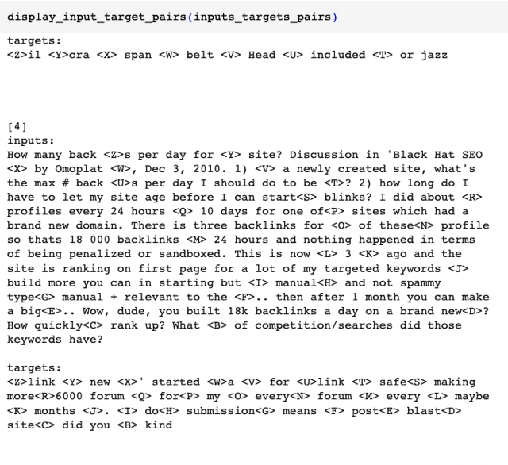</kbd>

 

<kbd>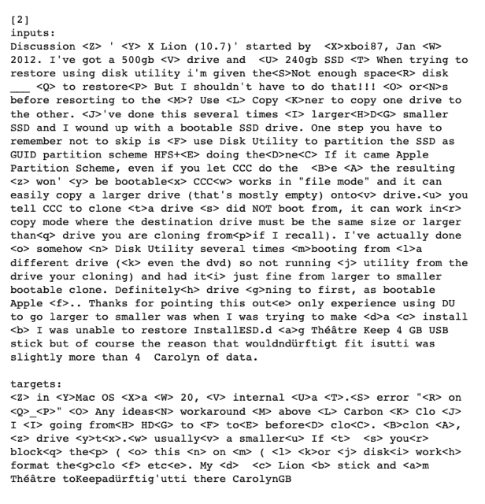</kbd>

 

<kbd>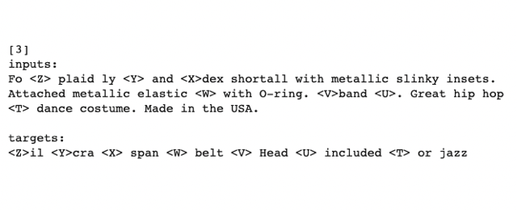</kbd>

 

<kbd>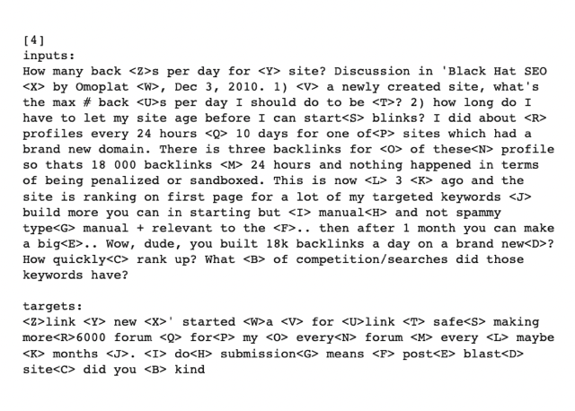</kbd>

 

<kbd>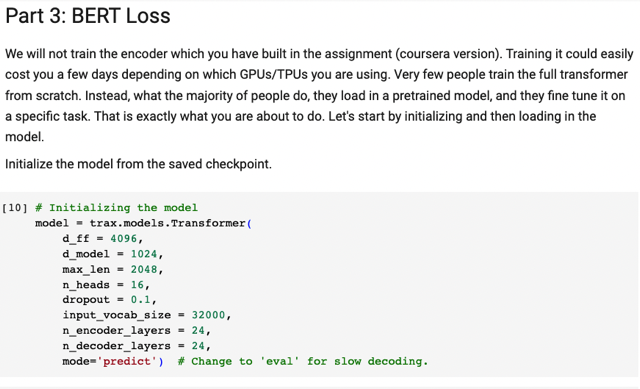</kbd>

> [!NOTE]
> Không ai train Transformer from scratch, vì tốn rất nhiều thời gian.
> Thường người ta download pre-trained model và fine-tune với
> specific task
>
> Ở đây trước tiên là khởi tạo Transformer model của Trax với các
> hyper-params  nà ta đã "dùng" khi build component cho model
> (Encoder block) như một cách để biết thật sự bên trong Trax's
> Transformer có gì.
>
> **d_ff** là **số unit của Feed Forward layers**,
>
> **d_model** là **kích thước embedding vector**,
>
> **max_len** là h.p quy định **max length** để giúp quá trình **padding và
> batching.**
>
> **n_heads** là **number of heads trong Multi-head attentions layers**.
>
> **dropout** đương nhiên là **dropout rate,**
> input vocab size là **vocab size,**
>
> **n_encoder_layers** = 24 tức có tới 24 Encoder kế tiếp nhau trong
> Encoder stacks,
>
> tương tự với **n_decoder_layers**

 

### Sure, here's an explanation for each of the hyper-parameters in the Transformer initialization using the Trax

> [!NOTE]
> Sure, here's an explanation for each of the hyper-parameters in the Transformer initialization using the Trax
> library:
>
> 1. **d_ff (Feedforward dimensionality)**: This represents the number of units in the feed-forward neural
> network that exists in each transformer block. It essentially denotes the inner hidden size of the pointwise
> feedforward networks. In the provided initialization, it is set to 4096.
>
> 2. **d_model (Model Dimensionality)**: This is the depth size or the number of units in the embeddings and
> also in the transformer blocks. In this model, the embeddings and outputs for each transformer block will
> have a size of 1024.
>
> 3. **max_len**: This represents the maximum sequence length that the model can handle. It's essentially
> the maximum number of tokens a sequence can have for processing by the transformer. In this instance, it's
> set to 2048 tokens.
>
> 4. **n_heads (Number of Heads)**: In the multi-head attention mechanism of the transformer, `n_heads`
> denotes the number of parallel sets of linear projections used for the attention computations. Here, 16
> heads means that the multi-head attention mechanism will process the input in parallel 16 times with
> different learned linear projections.
>
> 5. **dropout**: Dropout is a regularization technique where randomly selected neurons are ignored or "
> dropped out" during training. This helps in preventing overfitting. The value `0.1` indicates a 10% dropout
> rate.
>
> 6. **input_vocab_size**: This denotes the size of the vocabulary for the input sequences. Here, the model
> can handle input sequences with a vocabulary size of up to 32000 unique tokens.
>
> 7. **n_encoder_layers**: This indicates the number of transformer blocks in the encoder part of the
> transformer model. In this instance, there are 24 encoder layers.
>
> 8. **n_decoder_layers**: This specifies the number of transformer blocks in the decoder part of the
> transformer model. Like the encoder, there are 24 decoder layers here.
>
> 9. **mode**: This parameter determines how the model will be used. The modes can typically be:    - `'train'
> `: For training the model.    - `'eval'`: For evaluating the model. When set to 'eval', some functionalities like
> dropout will be turned off.    - `'predict'`: For generating predictions from the model. In the provided
> initialization, the mode is set to 'predict'. The comment also mentions that you can change it to `'eval'` for
> slow decoding.
>
> Each of these hyper-parameters plays a vital role in the functioning, capacity, and performance of the
> Transformer model. Adjusting them can have significant impacts on how the model learns and makes
> predictions.

 

<kbd>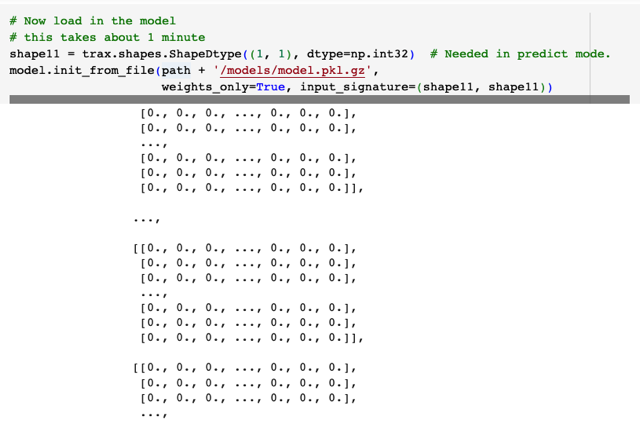</kbd>

> [!NOTE]
> Load pre-trained
> model từ filepath

   

<kbd>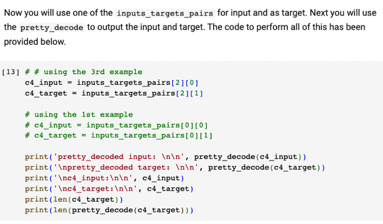</kbd>

> [!NOTE]
> Dùng function **inputs_targets_pairs**() để **tạo và lấy** một "bộ"
> input - target. Lấy text content ra, dùng cơ chế masking đã làm để
> thay từ trong text bằng sentinel,..để tạo ra input và targets
>
> Lấy lại ví dụ :
> Input sentence: Younes and Lukasz were working together in the **lab** yesterday after lunch.
> Input:                Younes and Lukasz **Z**                     together in the **Y**    yesterday after lunch.
> Target:               **Z were working** **Y lab**.
> (Ghi cách vậy cho dễ hiểu thôi chứ không phải nó có khoảng cách như vậy đâu)
>
> Và dùng pretty_decoded để decode ra xem

   

- **pretty_decoded input:**  Fo **<Z>** plaid ly **<Y>** and **<X>**dex shortall with metallic slinky insets. Attached metallic elastic **<W>** with O-ring. **<V>**band **<U>**. Great hip hop **<T>** dance costume. Made in the USA.  **pretty_decoded target:**  **<Z>il <Y>cra <X> span <W> belt <V> Head <U> included <T> or jazz**  c4_input:  [4452, 31999, 30772, 3, 120, 31998, 11, 31997, 26, 994, 710, 1748, 28, 18813, 3, 7, 4907, 63, 16, 2244, 7, 5, 28416, 15, 26, 18813, 15855, 31996, 28, 411, 18, 1007, 5, 31995, 3348, 31994, 5, 1651, 5436, 13652, 31993, 2595, 11594, 5, 6465, 16, 8, 2312, 5]  c4_target:  [31999, 173, 31998, 2935, 31997, 8438, 31996, 6782, 31995, 3642, 31994, 1285, 31993, 42, 9948] 15 64
   

    
    
<kbd>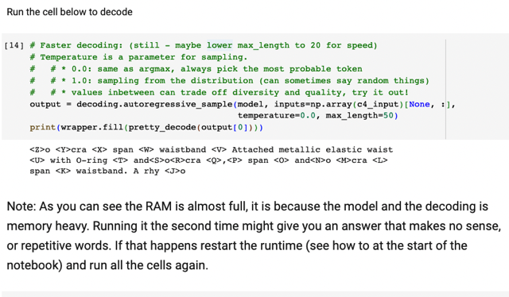</kbd>

    > [!NOTE]
    > Chưa hiểu lắm, họ dùng **trax.supervise.decoding**, gọi function
    > **autoregressive_sample** take input:
    >
    > - **pre-trained model** load ở trên,
    >
    > - **c4_input** là cái**token sequence của masked text**
    >
    > - Tham số **temperature** = 0 (để chỉ định dùng **most probable tokens**)
    >
    > Kết quả có được bỏ vào wrapper.fill() có tác dụng gì chưa rõ
    > So sánh với Target chưa hiểu sao lại có các sentinel khác như <S>, <R>..
    >
    > Target: <Z>il **<Y>cra** <**X> span** <W> belt <V> Head <U> included <T> or jazz
    >
    > Prediction: <Z>o **<Y>cra** **<X> span** <W> waistband <V> Attached metallic elastic
    > waist <U> with O-ring <T> and<S>o<R>cra <Q>,
 span <O> and<N>o
    > <M>cra <L> span <K> waistband. A rhy <J>o

     

## Lab: T5

 

### Welcome to the part 2 of testing the models for this week's

> [!NOTE]
> Welcome to the part 2 of testing the models for this week's
> assignment. This time we will perform **decoding using the T5
> SQuAD model**. In this notebook we'll **perform Question
> Answering** by **providing a "Question", its "Context"** and **see how
> well we get the "Target" answer.**

> [!NOTE]
> Thử **dùng** T5 đã **fine-tuned trên SqaAD dataset**. Đưa vào model
> **question + context** và xem thử answer của nó ra sao

 

<kbd>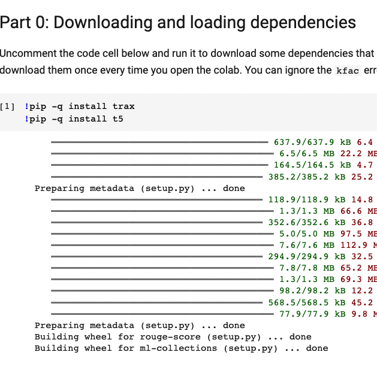</kbd>

> [!NOTE]
> Install Trax và t5

   

<kbd>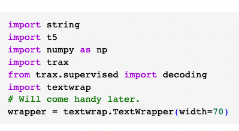</kbd>

   

<kbd>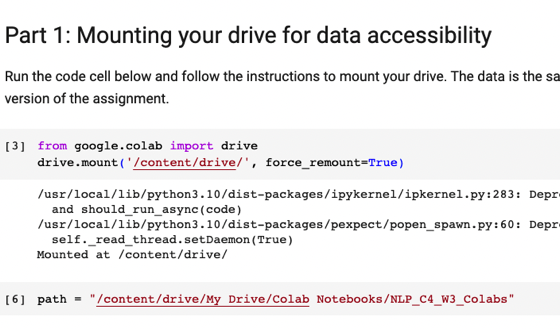</kbd>

   

<kbd>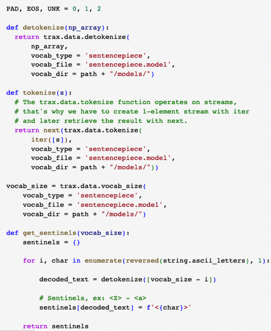</kbd>

> [!NOTE]
> Chuẩn bị mấy function như lab trước

   

<kbd>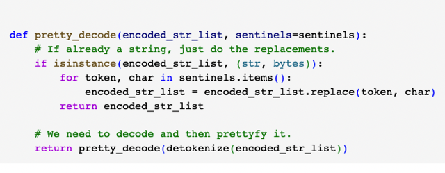</kbd>

   

- Now let's try to **fine tune on SQuAD** and see what becomes of the model. For this, we need to **write a function** that will **create and process the SQuAD tf.data.Dataset**. Below is how **T5 pre-processes SQuAD dataset** as a **text2text example**. Before we jump in, we will have to **first load in the data.**
> [!NOTE]
> Đại khái là lab này mình sẽ dùng **T5 model** đã được
> **fine-tuned với bộ dataset tên là SQuAD**.

   

    
    
<kbd>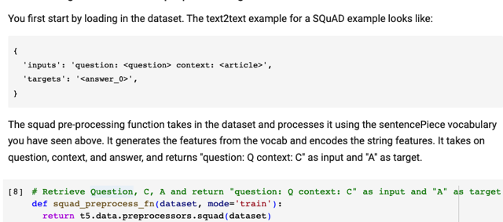</kbd>

    > [!NOTE]
    > Đại khái nó nói là mỗi text2text example của SQuAD dataset có dạng
    >
    > inputs: 'question: <question> context: <article>'
    > target: '<answer'
    >
    > Function squa_preprocess_fn() ở dưới nhận bộ dataset và xử lí nó 
    > sử dụng sentencePiece vocabulary như đã biết
    >
    > Chưa hiểu lắm nó preprocess kiểu gì

     

    
    
<kbd>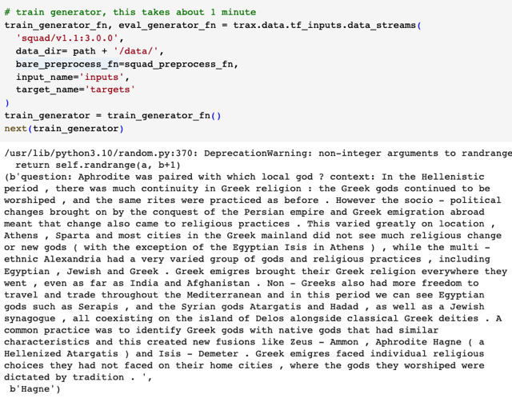</kbd>

    > [!NOTE]
    > Tạo train_generator_fn, và eval_generator_fn là **data_streams**define
    > data directory, **preprocess functions**, tên của feature làm inputs, tên của
    > feature làm targets. 
    >
    > Nói chung như đã gặp, nó sẽ dùng load data trong data directory, dùng 
    > pre_process_function để thực hiện preprocess

     

    
    
<kbd>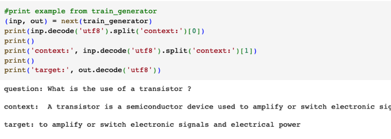</kbd>

    > [!NOTE]
    > In ra một example xem thử

     

  
  - **question**: What is the use of a transistor ?  **context**:  A transistor is a semiconductor device used to amplify or switch electronic signals and electrical power . It is composed of semiconductor material with at least three terminals for connection to an external circuit . A voltage or current applied to one pair of the transistor ' s terminals changes the current through another pair of terminals . Because the controlled ( output ) power can be higher than the controlling ( input ) power , a transistor can amplify a signal . Today , some transistors are packaged individually , but many more are found embedded in integrated circuits .  **target**: to amplify or switch electronic signals and electrical power
     

      
      
<kbd>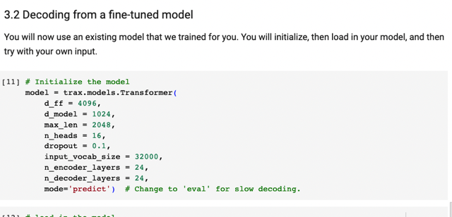</kbd>

      > [!NOTE]
      > Tạo Transformer model với các
      > hyper params như lab trước

       

      
      
<kbd>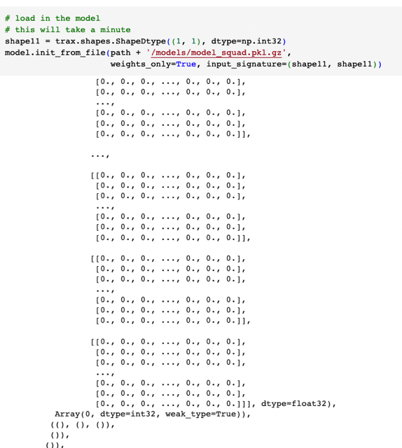</kbd>

      > [!NOTE]
      > Load pretrained-weight

       

      
      
<kbd>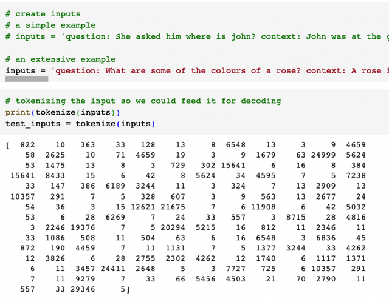</kbd>

      > [!NOTE]
      > **inputs** = '**question**: What are some of the colours of a rose? **context**: A rose is
      > a woody perennial flowering plant of the genus Rosa, in the family Rosaceae,
      > or the flower it bears.There are over three hundred species and tens of
      > thousands of cultivars. They form a group of plants that can be erect shrubs,
      > climbing, or trailing, with stems that are often armed with sharp prickles.
      > Flowers vary in size and shape and are usually large and showy, in colours
      > ranging from white through yellows and reds. Most species are native to Asia,
      > with smaller numbers native to Europe, North America, and northwestern
      > Africa. Species, cultivars and hybrids are all widely grown for their beauty and
      > often are fragrant.'

      > [!NOTE]
      > Tạo một input là question: ...context:....
      > Dùng tokenize() để tokenize nó

       

      
      
<kbd>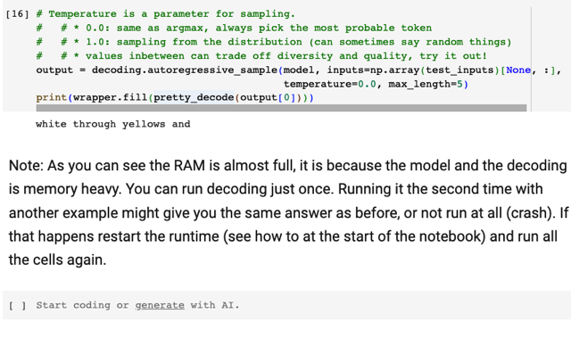</kbd>

      > [!NOTE]
      > Dùng decoding.autoregressive_sample như ở lab trước, bỏ vào
      > đó model, inputs (đã được chuyển thành np.array),
      > temperature, max_length) và dùng wrapper.fill, pretty_decode
      > để decode model's output
      >
      > Nói chung cái lab này giống như lab trên chẳng làm gì ngoài
      > việc load pre-trained model và thử inference nó để xem kết qủa
      > ra sao

       

