# C4w4_chatbot

📊 **Progress:** `78` Notes | `119` Screenshots

---

Examine some unique challenges Transformer models face and their solutions, 
then build a chatbot using a Reformer model.

Learning Objectives
Explain the motivation for reversible layers
Integrate locality sensitive hashing into attention layers
Describe the Reformer model

## Week Introduction

 

### Welcome to the final week of the specialization. I'm really excited that you

> [!NOTE]
> Welcome to the final week of the specialization. I'm really excited that you
> have come this far, but I'm so sad that it's almost the end. Before we are
> done, I want to tell you about the reformer model.
>
> This week, we will be talking about **chatbots** and you will be using a dataset
> called **Martin Voss**. This dataset has about **10,000 human annotated
> dialogues** and spans **multiple domains and topics**. You will be using it to**train
> your model**. The **Reformer** has **two main advantages** over the traditional
> transformer. First, it makes use of **reversible layers**. So in the former
> propagation, you **don't have to store the layer data** to use in the back
> propagation.
>
> It also makes use of l**ocality sensitive hashing**, which you learned about in
> the course 1. It **speeds up the attention search**

> [!NOTE]
> Đại khái là sẽ học về **Reformer model, có hai advantage so với Transformer.**là dùng **Reversible** layer giúp cải thiện **backpropagarion** và **Locality
> Sensitive Hashing** để tăng tốc attention mechanism

 

## Task With Long

> [!NOTE]
> TASK WITH LONG
> SEQUENCES

 

### 1/ This week focuses on **pushing the transformer model** to work on \\*longer

> [!NOTE]
> 1/ This week focuses on **pushing the transformer model** to work on **longer
> sequences**, which is essential for tasks like **writing books, storytelling, and
> chatbots.**
>
> 2/ It's **increasingly challenging** to distinguish between human-written
> content and AI-generated content.
>
> 3/ Many models for**long sequences,** like **GPT-3**, are e**xpensive to train**
> due to their size, **requiring industrial-scale compute**.
>
> 4/ The session will introduce the**"reformer" model**, also known as the
> **reversible transformer**, highlighting its significance and functionality.
>
> 5/ Participants will **build and train a chatbot** that can**handle extensive text
> sequences**, using all the **prior context** in a conversation to generate
> appropriate replies.
>
> 6/ The differences between**context-based Q&A** and c**losed-loop Q&A**are
> **revisited**, with **emphasis on how chatbots function similarly to the latter.**
>
> 7/ The assignment for the week will u**tilize the NLP knowledge** from
> previous courses, **harnessing transformers** for l**ong sequences**to develop
> a chatbot.
>
> 8/ **Long sequence tasks** are not easily addressed by **simply applying the
> transformer model**; reasons for this complexity will be discussed in the
> subsequent video.

 

<kbd>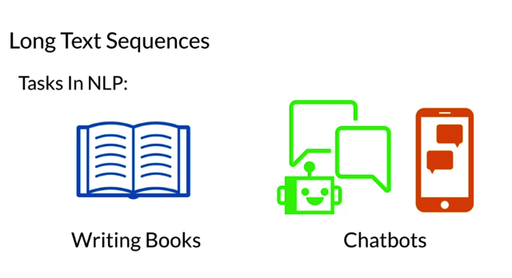</kbd>

> [!NOTE]
> Nói về các task mà **deal với long text sequences** như **viết sách**, và
> **chatbot** đặt ra thách thức là **un-trainable model**
>
> Thì tuần này họ sẽ nói về**Reformer = Reversible Transformer** giúp giải
> quyết thách thức này,

> [!NOTE]
> This week you will learn about the **bottlenecks** in these larger
> transformer models, and solutions you can use to **make them trainable**
> for you. You will also learn about the**re-former model** (AKA the
> r**eversible transformer**). Here is what you will be building for your
> programming assignment: A chatbot!

 

<kbd></kbd>

 

<kbd>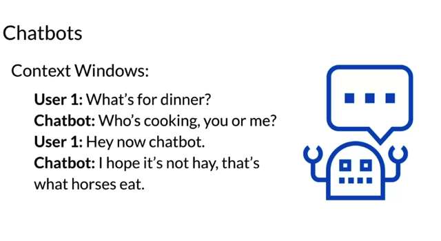</kbd>

 

## (optional) Ai

> [!NOTE]
> (OPTIONAL) AI
> STORY TELLING

 

<kbd></kbd>

 

## Transformer

> [!NOTE]
> TRANSFORMER
> COMPLEXITY

 

### 1/ Running a large transformer on **long sequences** often results in **memory issues.**

> [!NOTE]
> 1/ Running a large transformer on **long sequences** often results in **memory issues.**
>
> 2/ **Transformers' size** introduces various **engineering challenges**, particularly when
> **handling attention.**
>
> 3/ Attention on a sequence of **length L** demands **L squared time and memory**, mainly
> because of the **pairwise comparison of each word in two sentences**.
>
> 4/ The memory requirement is **compounded with increased layers**, as demonstrated by
> **GPT-3's 96 layers.**
>
> 5/ **Calculations** become **increasingly cumbersome** as sequence lengths grow, e.g., a
> sequence of **10,000 words** demands **100 million operations**.
>
> 6/ The **attention mechanism formula** involves the **softmax of Q times K transpose times
> V**, where Q, K, and V are all dimensions of (**L , d_model)**, resulting in a **square memory
> requirement**.
>
> 7/ For **longer sequences**, it's often **unnecessary to consider the entire length**; **focusing on
> specific areas or words can be more efficient.**
>
> 8/ **Memory usage increases** with **more layers** because of the **need to store forward pass
> activations for backpropagation**.
>
> 9/ Although one can **reduce memory** by **recomputing activations**, this can be
> **time-consuming**, especially for models like GPT-3.
>
> 10/ The goal is to **find efficient ways** to **speed up re-computation to save on memory.**
>
> 11/ The video underscores two **primary contributors** to **computational complexity** in
> transformers, and **subsequent content** will address improving these for handling long
> sequences.

 

<kbd>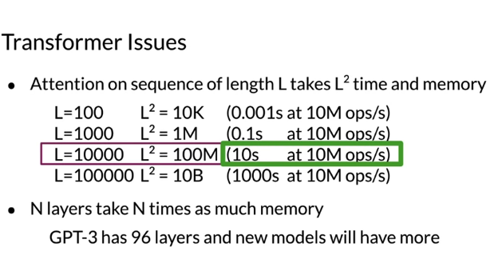</kbd>

> [!NOTE]
> đại khái là **cơ chế của attention mechanism** trong đó **mỗi từ attend với
> mọi từ khác** khiến **nếu câu có L từ** thì sẽ có **LxL phép tính** dẫn đến **L^2
> time và memory**
>
> Và vì **không chỉ có 1 mà là N layers** nên s**ố lượng sẽ được nhân lên
> nhiều nữa**
>
> Điều này tạo ra **thách thức về khía cạnh tính toán** trong quá trình training
> khi L lớn.

 

<kbd>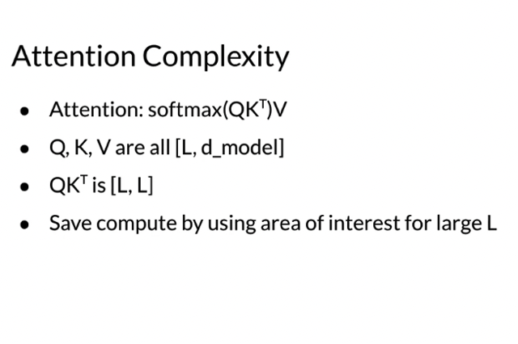</kbd>

> [!NOTE]
> Đại khái là nhắc lại **QKV attention** formula trong đó mỗi cái đều là
> **(L, d_model)** tensor.
>
> Nên các **kết quả của phép tính QK.T là tensor (LxL)**. Nên **nếu L lớn
> thì yêu cầu bộ nhớ và tính toán cũng lớn theo L^2**
> Tuy nhiên điều này có yếu tố chưa tối ưu, lãng phí khi thực tế ví dụ
> Khi dịch câu**, tại một từ thì đâu cần nhất thiết phải tính attention của
> MỌI từ với MỌI từ khác.**

 

#### When you are handling long sequences, you usually **don't need to consider all L positions**. You can**just focus on an area of interest** instead. For example, when translating a long text from one language to another, you **don't need to consider every word at once**. You can **instead focus on a single word being translated**, and **those immediately around it**, by using attention.  To overcome the **memory requirements** you can **recompute the activations**. As long as you do it efficiently, you will be able to save a good amount of time and memory. You will learn this week how to do it.  Instead of **storing N layers**, you will be **able to recompute them when doing the back-propagation**. That combined with **local attention**, will give you a **much faster model** that **works at the same level** as the transformer you learned about last week.

 

<kbd>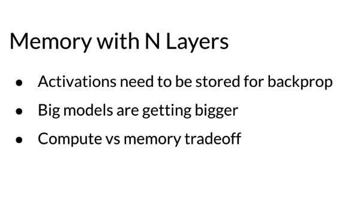</kbd>

> [!NOTE]
> Ý là có thể **dùng cách tính toán lại activation sao đó để khắc
> phục phần nào**

 

## Lsh Attention

 

<kbd>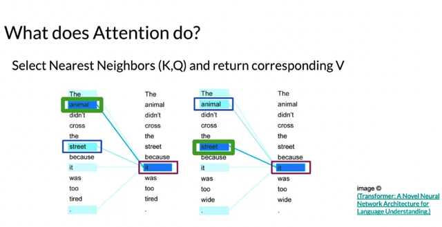</kbd>

> [!NOTE]
> Ví dụ 2 câu, thì từ **"it"** sẽ trong câu thứ nhất sẽ "chỉ" từ **"animal"** và trong câu thứ 2 sẽ chỉ từ **"street"**
>
> Đại khái là, trong 2 câu này, **"it" chỉ cần attend vào hai noun "
> animal" và " street"**  là đủ để biết nó đang có ý nghĩa gì
>
> Do đó ý ổng nói là với **pronoun** (ví dụ ở đây là "it") thì **nó chỉ
> cần chú ý (attent) tới các noun ở trong câu thôi**chứ k**hông cần
> phải attend tới mọi từ** khác như là didn't, the, was.....
>
> Nôm na là:  **"Attention is all you need" thì tốt nhưng cái gì cũng
> attention thì bộ nhớ không đủ** Ý nói là Attention mechanism đúng
> là đã tạo cuộc cách mạng, làm tiền đề cho Transformer model, rất
> tốt. Nhưng với câu dài thiệt dài, thì một từ attention MỌI TỪ là điều
> không cần thiết và gây tốn bộ nhớ

 

<kbd>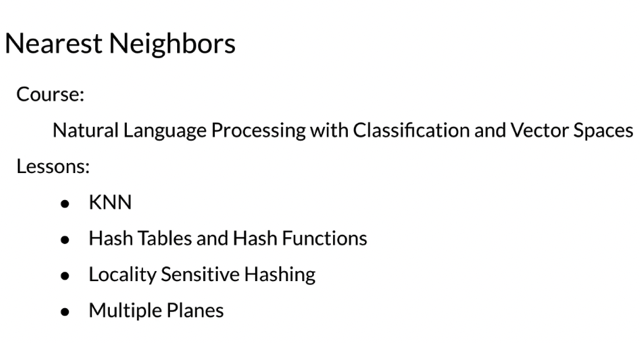</kbd>

> [!NOTE]
> Nên review lại **KNN** và **Locality Sensitive Hashing**
>
> Đại khái là ví dụ có **một word embedding vector** (trong bài tuần 4 course 1 là ta tìm ra
> predict vector của từ - word embedding vector, và **nhiệm vụ là tìm trong vocabulary,
> vector từ nào là gần nhất với vector từ trên)**
>
> **Gần xa ở đây là dựa vào các metric đo khoảng cách vector** như **Euclidean
> distance** hay **Cosine similarity...**
>
> Thì ý tưởng là nếu ta tìm theo **kiểu tuyến tính** - như từ trên xuống thì với dataset lớn
> hay high dimensional space với hàng triệu data point thì sẽ **rất mất thời gian** và
> computational cost.
>
> Do đó ta sẽ**dùng KNN để tìm các điểm gần nhất của nó**và**search trong đó thôi**
>
> Và một trong những cách để **tìm các điểm gần nhất (nearest neighbor)** là nếu có
> cách nào **chia cái đám data point đó thành nhiều nhóm** -  gọi là bucket dựa vào vị trí
> tương đồng của chúng trước, thì **khi cần tìm thằng gần nhất của một thằng ta chỉ việc
> tìm trong cái nhóm của thằng đó**Và**LSH là một cách**, đại khái là vầy. Ví dụ muốn chia 10 nhóm (số này cũng là
> hyper-param) ta sẽ t**ạo random 10 space**, và dựa vào **phép toán**  để **xác định
> xem các data point nằm trong nhóm nào**, có nghĩa là ta sẽ xếp các data points vào các
> bucket. Gọi là **hash table
>
> Cụ thể thì ví dụ trong C1W4 đại khái là có công thức  hash value = Sum I 2^I*(sign(...))
> NÔM NA LÀ với mỗi plan xác định nó (data point vector)  nằm trên hay dưới hay trong
> plane từ đó có một công thức tính ra điểm (giống như bucket id) cho vector đó vậy**
>
> Và **ta làm chừng N như vậy** (các plane tạo ngẫu nhiên) để **được N cái hash table**.
> (Số làm chia = số hash table cũng là hyper-param)
>
> Thì bây giờ **chỉ cần search trong những datapoint nào chung bucket với từ cần tìm** (**gom
> mọi datapoint cùng bucket với vector cần tìm của mọi table lại**)
>
> Thì ý tưởng là những data points chung bucket với vector này sẽ là**tạo thành gần đúng
> K-nearest  neighbor thật sự của vector**. Và ta chỉ cần tìm trong đó.
>
> Và **vì các plane được tạo có tính random nên**, **càng nhiều lần chia** (số hash table) thì đại
> khái là **các điểm sẽ gần gần với các nearest neibor thật sự của vector** và dẫn đến kết
> quả **càng chính xác** Nhưng **đổi lại sẽ tăng thời gian và computational cót**lên nên đây là
> **trade off giữa speed và precision**

 

<kbd>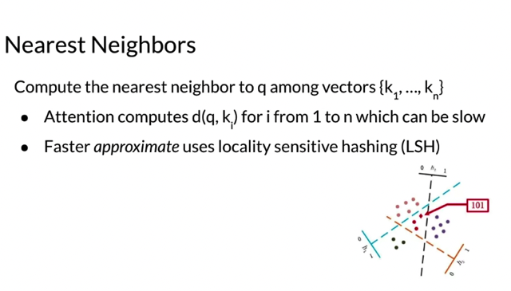</kbd>

> [!NOTE]
> You already know from earlier courses that you can **use
> locality-sensitive hashing** to **reduce the computational
> costs** of **finding k-nearest neighbors**.

> [!NOTE]
> Dùng LSH để giảm computational cost
> trong việc tìm k-nearest neighbor

 

<kbd>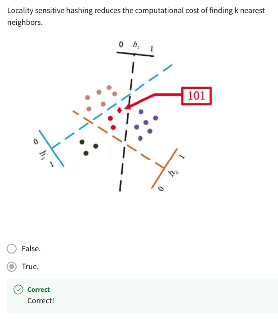</kbd>

 

<kbd>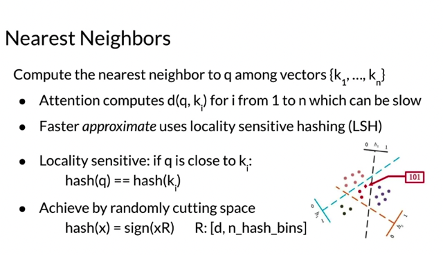</kbd>

> [!NOTE]
> Using locality-sensitive hashing, you can**hash both the query q and key k**.
> This helps you **group similar query and key vectors together,** just like the
> nouns with pronouns examples you saw before.
>
> Then you only **run attention on keys that are in the same hash buckets as the
> query**. When choosing the hash, you want to **make the buckets roughly the
> same size**. You know that **hash(x) is the sign(xR)** where **R is random with
> size of d for dimension times the number of hash bins**. And the **sign tells you
> which side of the plane the hash will be on**. The process is then **repeated**
> depending on the **number of hashes that you have.**

> [!NOTE]
> Ứng dụng kĩ thuật KNN with LSH vào: ý tưởng sẽ là  tìm những
> neareast neighbor của q vector trong số các key vector k1,k2....kn
>
> Và ta sẽ dùng LSH để tìm **approximate nearest neighbor**k cho q
>
> Nôm na cũng là, tạo các plane random để từ đó xác định bucket id
> cho các data points là q và k1,k2...kn
>
> **Làm nhiều lần như vậy** (như đã biết sẽ tăng độ chính xác khi tìm
> nearest neighbor nhưng cũng tăng thời gian)
>
> Tổng hợp các k vector có chung bucket với q. Đó chính là
> approximate nearest neighbor.
>
> **Thực hiện attention với q và các \_k đó**\_ thay vì mọi key như
> bản gốc

 

<kbd>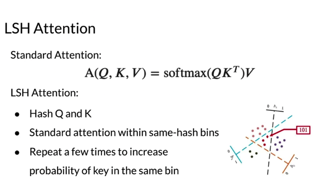</kbd>

 

<kbd>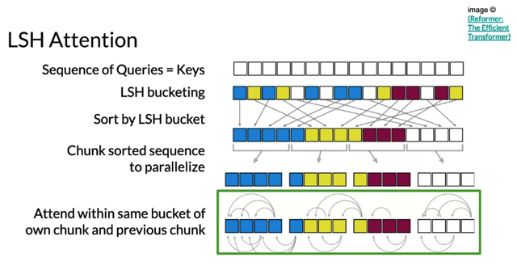</kbd>

> [!NOTE]
> And this can be done efficiently to **take advantage of parallel computing**. Now I'll show you **how to
> integrate LSH into attention layer**s.
>
> To start, you **modify the model** so that **it outputs a single vector at each position**, which **serves
> both as a query and a key**. This is called **QK attention** and performs just as well as regular
> attention.
>
> Next, you **map each vector to a bucket with LSH**, then you **sort the vectors by LSH bucket**,
>
> and finally, you **do attention only in each bucket.** You could do **this one bucket at a time**, but that
> **doesn't take advantage of hardware parallelism**.
>
> Instead, I'll show you how to do a **batch computation**.
>
> The first step for batching is to s**plit the sorted sequence into fixed size chunks**. This allows for some
> parallel computation. Then you **let each chunk attend within itself**and the **adjacent chunks**. This
> covers the case with a **hash bucket that is split over more than one chunk**, like you see for the **blue,
> yellow, and magenta buckets here**. And that's the **core of LSH attention**.
>
> One final point to consider is that **LSH is a probabilistic**, not **deterministic model**. This is because
> of the **inherent randomness** within the LSH algorithm, **meaning that the hash can change along with
> the bucket a vector finds itself mapped to**

> [!NOTE]
> Bắt đầu ta sẽ dùng một **đám vector (mỗi time-step 1 vector) đóng vai trò vừa là q, vừa
> là k.** Thay vì như original QKV attention là mỗi từ sẽ có 3 vector q, k, v
>
> **Dùng LSH để xếp mỗi thằng vào một bucket id**. Kết quả minh hoạ như hàng 2, khi mỗi
> vector được assign bucket (xanh, đỏ, vàng)
>
> Xong **sort cả đám theo bucket id (từ nhỏ tới lớn)**. (hàng 3, các vector đã xếp theo các
> nhóm bucket)
>
> Thì tới đây nếu **mình attend trong mỗi bucket thì cũng được** nhưng sẽ **không hiệu quả**
> khi **không tận dụng được hardware parallelism**. (cái này thì chưa rõ) nhưng một đặc
> điểm nhận thấy là **mỗi bucket sẽ có thể có số vector khác nhau**. nên có thể **có bucket
> chỉ có một vector** - nếu attend ở trong đó thì không ổn
>
> Ý tưởng là **chia thành các phần bằng nhau**, lúc **này 1 phần có thể chỉ chứa vector của
> cùng 1 bucket** nhưng cũng **có thể có vector của cả 2,3 bucket liền kề**.
>
> Vì lí do này nên bước tiếp theo bên cạnh cho **làm attention trong nội bộ một chunk** thì
> cũng **cho nó attend với các chunk liền kề nữa.**
>
> Nhắc lại ý nghĩa của cả quá trình này đó là, **chỉ attend một từ (một query) với các từ
> (key) mà giống nó nhất, không cần attend hết.
>
> ===**Và như đã biết về tính random của LSH nên cần phải **làm nhiều lần**để approximation 
> được chính xác hơn

 

<kbd>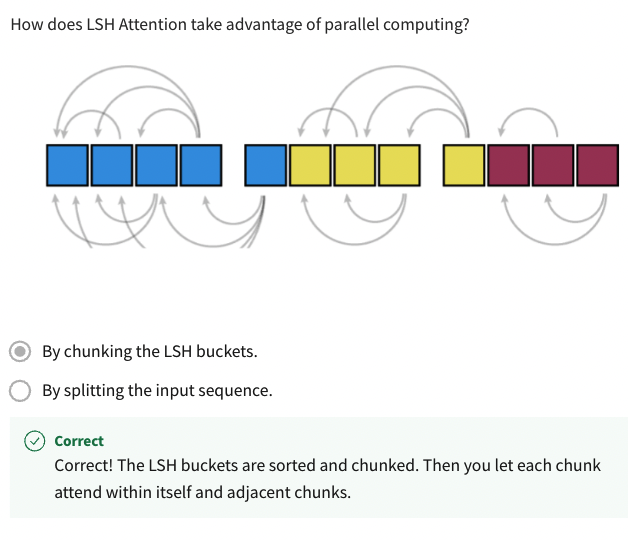</kbd>

> [!NOTE]
> Certainly! LSH (Locality Sensitive Hashing) attention is a technique applied in the context of attention
> mechanisms, particularly in transformers, to efficiently handle long sequences. It's designed to speed
> up the computation while still providing reasonable results. Let's break this down step by step:
>
> ## 1. Attention in Transformers:
>
> In typical transformers, such as the ones used in BERT or GPT, the attention mechanism computes a
> weight for every possible pair of words in a sequence. So, for a sequence of length \(N\), this results
> in a time complexity of \(O(N^2)\). This quadratic complexity makes it challenging to handle long
> sequences.
>
> ## 2. LSH Attention:
>
> LSH attention addresses the above challenge by approximating the full attention matrix. Instead of
> computing the exact attention weights for every pair of words, LSH attention buckets words together
> in such a way that words with similar content are likely to be in the same bucket.
>
> ## How LSH Attention Works:
>
> 1. **Random Projections**: Each word's attention key is randomly projected into a number of buckets.
> Words that have similar keys (and thus are likely to have higher attention weights with respect to a
> given query) will likely fall into the same bucket.
>
> 2. **Bucketing**: All words that fall into the same bucket are then attended to together. This means
> that instead of computing individual attention weights for each word, the model computes a single
> weight for all words in the bucket.
>
> 3. **Multiple Hashing Rounds**: To ensure that the model doesn't consistently miss out on certain
> word pairings, the process of random projection and bucketing is done multiple times, generating
> multiple sets of buckets. Words are then attended to across all of these buckets.
>
> ## Advantages:
>
> 1. **Efficiency**: LSH attention reduces the time complexity from quadratic to linear, i.e., \(O(N^2)\) to
> \(O(N)\), making it much more efficient for long sequences.
> 2. **Scalability**: With LSH attention, transformer models can handle much longer input sequences
> than what is feasible with traditional attention mechanisms.
>
> ## Limitations:
>
> 1. **Approximation**: Since LSH attention is an approximation method, it might not capture the
> intricate relationships between words as accurately as full attention. However, with multiple rounds of
> hashing, this effect is somewhat mitigated.
> 2. **Stochasticity**: The random nature of LSH attention introduces a level of stochasticity to the
> model, which can lead to slight variations in model outputs.
>
> In summary, LSH attention is a method to make attention mechanisms in transformers more scalable
> and efficient, especially for long sequences, by using locality-sensitive hashing to group words
> together and compute attention in a bucketed fashion.

 

## (optional) KNN &

> [!NOTE]
> (OPTIONAL) KNN &
> LSH REVIEW

 

### From Course 1, Week 4 in the NLP Specialization.

> [!NOTE]
> From Course 1, Week 4 in the NLP Specialization.
> Course: Natural Language Processing with Classification and Vector Spaces
>
> Lecture: Machine Translation and Document Search
>
> KNN
> https://www.coursera.org/learn/classification-vector-spaces-in-nlp/lecture/d13tm/k-nearest-neighbors
>
> Hash Tables and Hash Functions
> https://www.coursera.org/learn/classification-vector-spaces-in-nlp/lecture/OpheJ/hash-tables-and-hash-functions
>
> Locality Sensitive Hashing
> https://www.coursera.org/learn/classification-vector-spaces-in-nlp/lecture/HhTQF/locality-sensitive-hashing
>
> Multiple Planes
> https://www.coursera.org/learn/classification-vector-spaces-in-nlp/lecture/wdPgw/multiple-planes

 

## Lab: Reformer Lsh

 

### The videos describe two 'reforms' made to the **Transformer** to

> [!NOTE]
> The videos describe two 'reforms' made to the **Transformer** to
> make it more **memory** and **compute efficient**. The **Reversible
> Layers** reduce memory and **Locality Sensitive Hashing (LSH)**
> reduces the **cost of the Dot Product attention** for large input sizes.
> This ungraded lab will look more closely **at LSH** and how it is
> used in the Reformer model.
>
> Specifically, the notebook has 3 goals
>
> - review **dot-product self attention** for reference
>
> - examine **LSH based self attention**
>
> - extend our **understanding and familiarity with Trax infrastructure**

> [!NOTE]
> Đại khái là trong bài nói có hai technique giúp
> cải thiện Transformer là Reversible Layers và
> LSH. Bài này sẽ thử làm LSH

 

#### Part 1: Trax Efficient Attention classes

 

<kbd>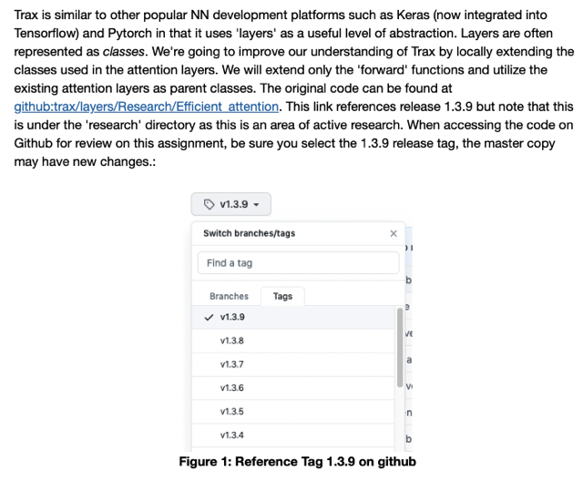</kbd>

 

<kbd>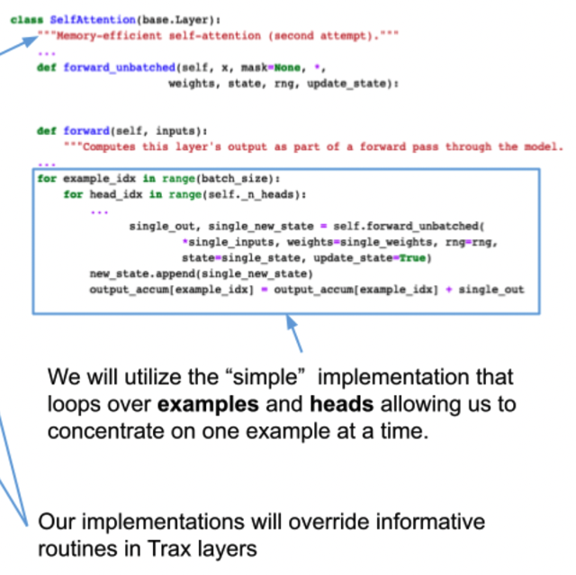</kbd>

<kbd></kbd>

<kbd>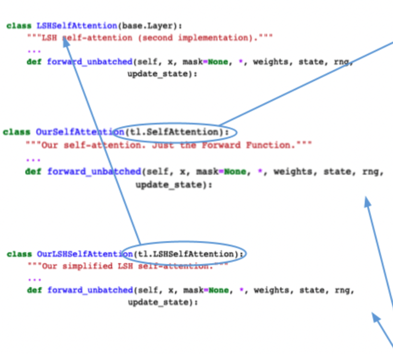</kbd>

> [!NOTE]
> Starting on the right in the diagram above you see SelfAttention that is a 'traditional'
> implementation of the dot product attention. The parent to this class is the base.layer which
> has the routines used by all layers. SelfAttention has an important feature in the Forward
> routine. It supports a **use_reference_code** capability that selects implementations that limit
> some of the complexities to provide a more easily understood version of the algorithms. In
> particular, it implements a **nested loop** that treats **each 'example, head' independently**. This
> simplifies our work as we need **only worry about matrix operations on one 'example, head'**
> at a time. This loop calls forward_unbatched, which is the child process that we will be
> overriding.
>
> We will be implementing the forward_unbatched version of SelfAttention to highlight the
> differences between this and the LSH implementation.

> [!NOTE]
> Đại khái là SelfAttention layer này chính là một cái traditional
> implementation của dot product attention.
>
> Nhưng ở đây đại khái là dùng một cái kiểu như là nested loop
> từng cặp example và head. Để chỉ tính matrix operation với từng
> cặp như vậy thôi. Để giảm complexities. Biết vậy thôi chưa rõ lắm.

> [!NOTE]
> On the top left is the **LSHSelfAttention**. This is the routine used in the Reformer
> architecture. We will override the **forward_unbatched** section of this and some of the
> utility functions it uses to explore its implementation in more detail.
>
> The code we will be working with is **from the Trax source**, and as such has
> implementation details that will make it a bit harder to follow. However, it will allow use of
> the results along with the rest of the Trax infrastructure. I will try to briefly describe these
> as they arise. The Trax documentation can also be referenced.

> [!NOTE]
> Còn bên đây là thực hiện LSHSelfAttention của Reformer
> đây. Code sẽ lấy từ Trax source

 

<kbd>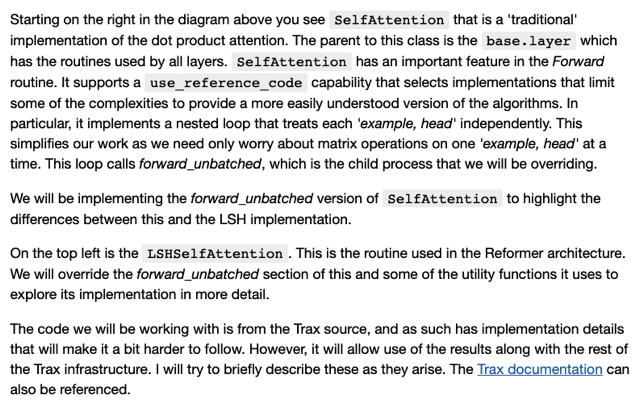</kbd>

 

#### Part 1.2 Trax Details

 

<kbd>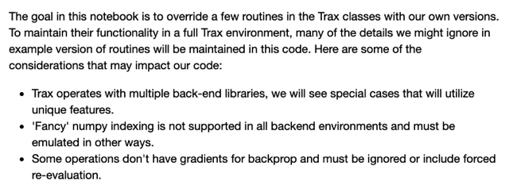</kbd>

> [!NOTE]
> Đại khái ổng nói mục đích chính của notebook này là override vài routines
> của Trax classes. Và vì thế để đảm báo nó hoạt động bình thường thì có vài
> chi tiết ta phải ignore
>
> Một cái chi tiết chú ý như Trax running với nhiều back-end libraries, numpy
> indexing không được supported nên phải làm cách khác  và một số operation
> không có gradient cho backprop và phải bị ignored hoặc forced include

 

<kbd>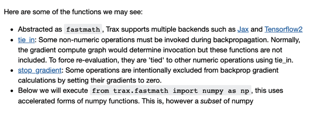</kbd>

 

<kbd>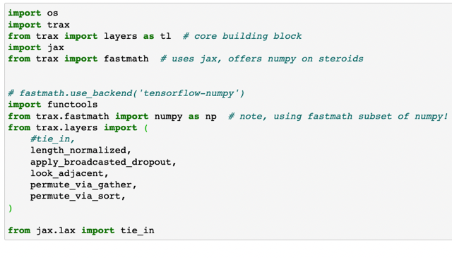</kbd>

 

#### Part 2: Full Dot Product Self Attention

 

#### 2.1 Description

 

<kbd>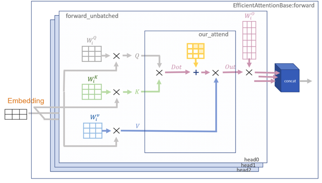</kbd>

> [!NOTE]
> The diagram above shows many of the familiar **data structures** and
> operations related to **attention** and describes the routines in which they are
> implemented.
>
> We will start by working on **our_simple_attend** or **our simpler version** of
> the **original attend function**. We will review the steps in performing dot-product
> attention with more focus on the details of the operations and their significance.
> This is useful when comparing to LSH attention. Note we will be discussing a
> **single example/head** unless otherwise specified.

 

<kbd>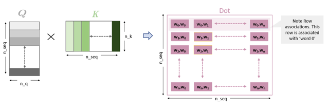</kbd>

> [!NOTE]
> The **attend function** receives **Query** and **Key**. As a reminder, they are produced by a
> matrix multiply of all the inputs with a single set of weights. We will describe the inputs as
> **embeddings** assuming an NLP application, however, this is not required.
>
> This matrix multiply works very much like a **convolutional network** where a **set of weights (a
> filter)** **slides across the input vectors** leaving behind a **map of the similarity of the input to
> the filter.**  In this case, the **filters are the weight matrices**𝑊𝑄**and**𝑊𝐾. The r**esulting
> maps are** **Q and K**. Q and K have the dimensions of (**n_seq, n_q**) where **n_seq** is the
> **number of input embeddings** and **n_q** or **n_k** is the s**elected size of the Q or K
> vectors**.
>
> Note the shading of Q and K, this reflects the fact that **each entry is associated with a particular
> input embedding**. You will note later in the code that **K is optional**. Apparently,**similar
> results can be achieved** using **Query alone** saving the compute and storage associated with
> K. In that case, the dot-product in attend is **matmul(q,q)**.
>
> Note the resulting dot-product (Dot) entries describe a complete (**n_seq,n_seq**) map of the
> **similarity of all entries of q vs all entries of k**. This is reflected in the notation in the dot-product
> boxes of  𝑤𝑛**,**𝑤𝑚   representing**word_n, word_m**.
>
> Note that each row of Dot describes the relationship of an input embedding, say  𝑤**0** , with
> **every other input.**

> [!NOTE]
> Hình trước đã review lại cách hoạt động của QKV Dot Product Attention.
>
> **Word embeddings** (n_seq, emb_dim) sẽ t**hông qua các weight matrix WQ, 
> WK, WV** mà tạo ra **Q (n_seq, n_q), K (n_seq, n_k), V (n_seq, n_v)** mà có
> thể n_q = n_k = n_v = emb_dim luôn.
>
> Sau đó , Q và K tham gia phép Scaled Dot Product Attention để tính ra attention
> weights **softmax [sqrt(Q@K_T)/n_k]** (n_seq, n_seq) là matrix các entry w_i w_j
> trong hình. Mỗi entry có giá trị thể hiện **mức attention mà từ thứ i nên chú ý tới
> từ thứ j.** Và mỗi hàng ví dụ hàng 3: [w2,w0 w2,w1 ... w2,wn] sẽ là các giá trị thể
> hiện relationship = mức độ tương quan = mức độ chú ý mà từ w2 với các từ khác.
>
> Một cái nữa là khi thực hiện Q@K.T thì **mỗi trong n_head phần của Q sẽ matmul
> với mỗi phần tương ứng của K.**Cái này tạo thành quá trình**Multi-head Attention.**
>
> Thì ở đây ổng cho ta biết thêm việc embeddings tensor thông qua WQ, WK, WV
> để tạo Q,K,V giống giống như trong Convolution layers, các filters convol các phần
> của image để detect pattern vậy.
>
> Và một cái nữa đó là **hoàn toàn có thể bỏ cái K đi, chỉ dùng Q** đóng luôn vai trò
> của K vẫn sẽ ra kết quả tương tự. Attention weights sẽ là 
> **softmax [sqrt(Q@Q_T)/n_q]**

 

<kbd>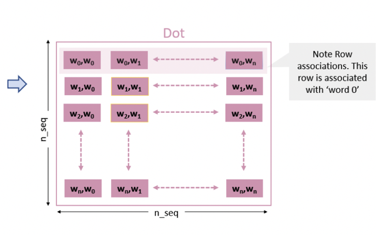</kbd>

<kbd></kbd>

<kbd>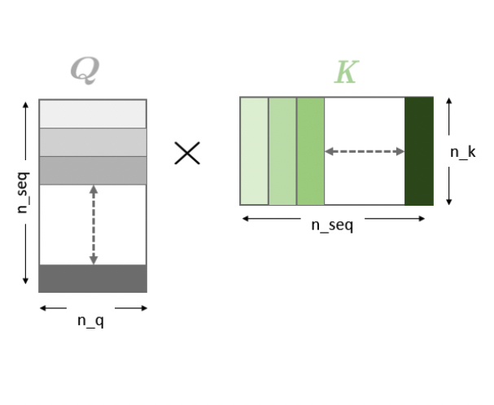</kbd>

 

<kbd>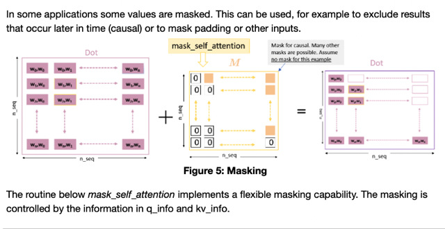</kbd>

> [!NOTE]
> Có thể apply mask nếu là **Future-Masked Attention** hay Causal attention 
> dùng trong Decoder.
> Nhớ lại thì cơ bản nó là **matrix cùng shape với Q.K_T** = (n_seq, n_seq)
>
> Và nó **che đi những "từ trước đó"**, ví dụ từ **w1** (ở hàng 2) thì **giữ
> w1w0, w1w1**, **che đi w1w2, w1w3**... bằng cách trong mask matrix
> những chỗ bị che sẽ có **-infi (dùng một số âm lớn)** để khi  **cộng với Q.
> K_T** những chỗ đó có **giá trị âm lớn, sau khi softmax sẽ thành ra 0**.
>
> Việc này mang ý nghĩa là **khi cần "tính" những từ liên quan đến w1** thì
> **bỏ qua những từ sau nó, chỉ dùng những từ trước (và chính nó) nó là w0,
> w1**

 

<kbd>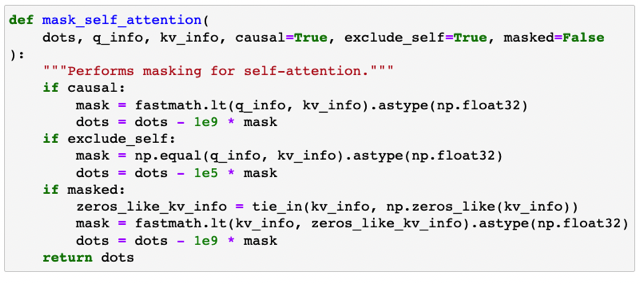</kbd>

 

<kbd>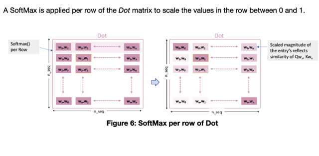</kbd>

> [!NOTE]
> Softmax sẽ apply và kết quả của "scaled dot product" Theo
> từng row để normalize, **biến mỗi row** (ví dụ row 1) đang là các "
> **chỉ số tương quan"** của một từ (w0) với các từ khác (w0,w1....)
> thành ra **attention weights - trọng số**

 

#### 2.1.1 our_softmax

 

<kbd>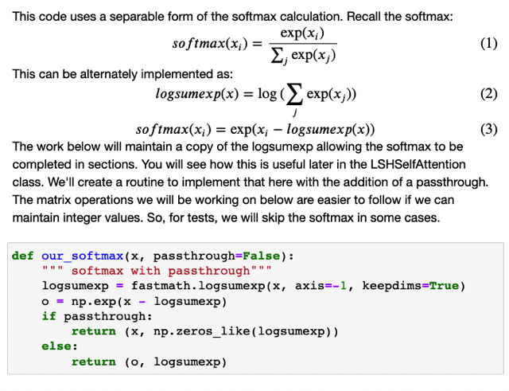</kbd>

> [!NOTE]
> Đại khái là công thức của **softmax(xj),** xj là một vector. Có thể được
> implement dùng **logsumxexp**() cũng dễ hiểu. Điều này **sẽ hữu ích khi tính
> LSHSelfAttention**.
>
> Trong function dưới, tính softmax **có trả ra kết quả của cả softmax và
> logsemexp để dùng**.  Có cái **passthrough** có vẻ mục đích là khi không
> muốn tính softmax có thể khi dùng sau này sẽ hiểu

 

<kbd>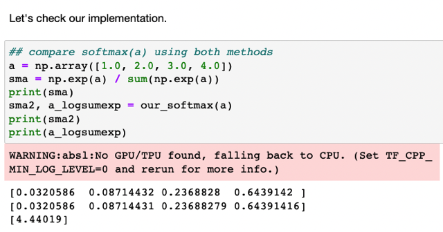</kbd>

> [!NOTE]
> Cho phép tính bằng **công thức softmax gốc** và dùng **our_softmax (với
> logsumexp),** kết quả **khác nhau chút xíu** có thể là **do vấn đề làm tròn
> số** của cách tính softmax gốc.

 

<kbd>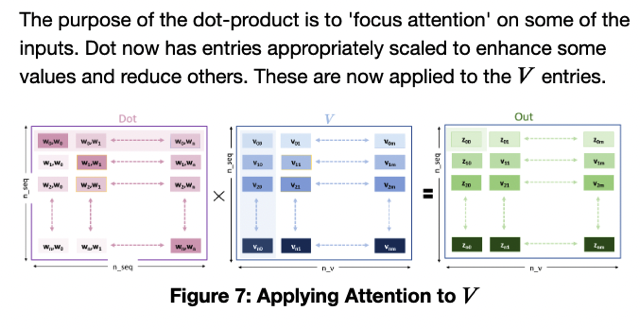</kbd>

> [!NOTE]
> Sau khi có attention weights,
> nhân nó với V để có

 

<kbd>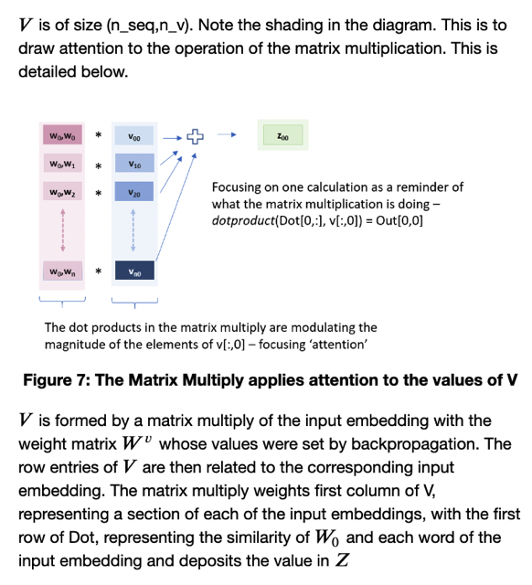</kbd>

> [!NOTE]
> Đại khái tại bước này, trong phép tính matrix Dot@V 
> kết quả giống như tạo ra **các embedding vector mới của
> các từ input** mà trong đó **phản ánh thêm thông tin context của
> các từ xung quanh.**

 

#### 2.2 our simple attend

 

#### 2.3 Class OurSelfAttention

 

#### Part 3: Trax LSHSelfAttention

 

#### 3.1 Description

 

#### 3.2 our_hash_vectors

 

#### 3.3 Sorting Buckets

 

#### 3.4 Chunked dot product attention

 

#### 3.5 OurLSHSelfAttention

 

## Motivation For Reversible

> [!NOTE]
> MOTIVATION FOR REVERSIBLE
> LAYERS: MEMORY

 

<kbd>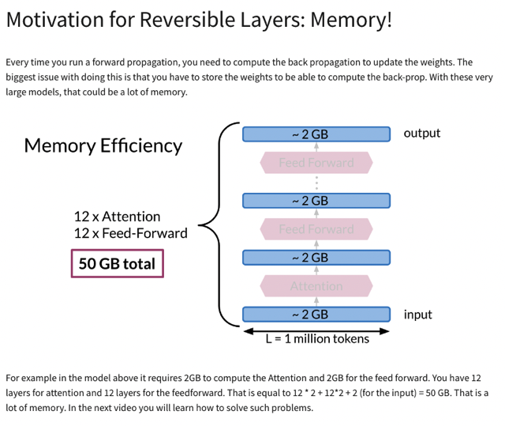</kbd>

 

<kbd>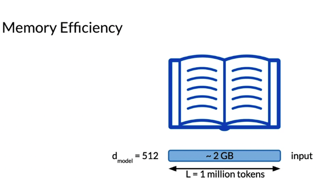</kbd>

> [!NOTE]
> 1 triệu từ (token), mỗi từ được represent
> bởi 512 dimensional embedding vector
> là tốn ~2GB memory

 

<kbd>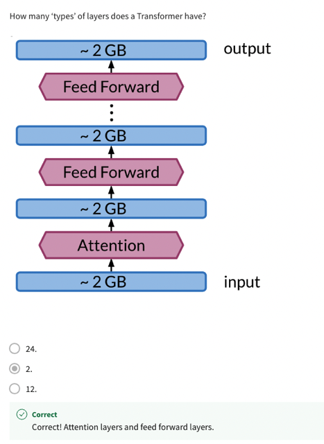</kbd>

 

<kbd>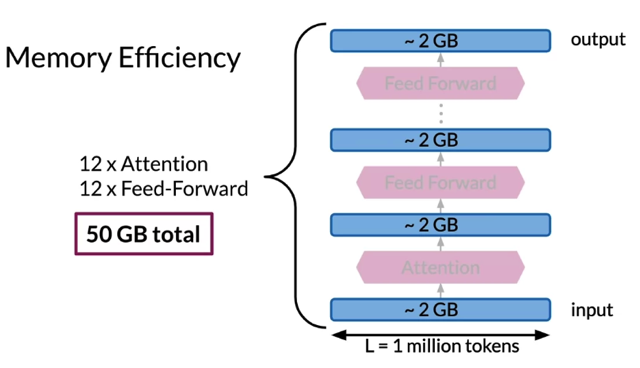</kbd>

> [!NOTE]
> Đại khái là trong quá trình backprop, như ta đã biết yêu cầu phải
> stores các weights. Ví dụ như activation của layers.
>
> Và tính sơ sơ một Transformer layer như thế này, thì phải tốn thêm
> ngoài 2GBs của embedding thì còn 6GBs cho các intermediary
> tensor này. Sơ sơ là 8GB. Nhân lên cho 12 lần vì Transformer
> original có 12 Transformer layer lận (gọi là encoder layer). Thì sơ sơ
> cũng tốn 50GB
>
> Mà các model sau này lớn và deep hơn nhiều. Thì tương ứng số
> memory cần thiết cũng rất lớn. Do đó đặt ra yêu cầu làm sao đó để
> giảm yêu cầu memory cho quá trình training.

 

## Reversible

> [!NOTE]
> REVERSIBLE
> RESIDUAL LAYERS

 

### 1. **Memory Efficiency** in **Deep Models**:**Large deep models** often **run out of memory** due to the

> [!NOTE]
> 1. **Memory Efficiency** in **Deep Models**:**Large deep models** often **run out of memory** due to the
> **continuous allocation of memory** by each layer. This problem can be addressed using
> **reversible layers.**
>
> 2. **Reversible Residual Connections**: To save memory while **running the Transformer network
> in reverse**, **reversible residual connections** are introduced. These **connections allow you to
> recompute activations quickly instead of storing them**.
>
> 3. Reversible Layer Configuration: The key idea is to **have two copies of the model inputs** and
> **update only one of them at each laye**r. The**unmodified activations are used to compute
> residuals.**
>
> 4. Reversible Layer Equations: The standard residual connection equations in a Transformer
> are modified in the reversible case. **The forward pass computes Y_1 and Y_2, while X_1 and
> X_2 are reconstructed to save memory.**
>
> 5. Forward Pass in Reversible Layers: In the forward pass of reversible layers, Y_1 is
> calculated first using attention, and then Y_2 is computed based on Y_1 and feedforward
> operations. This illustrates how information flows from left to right.
>
> 6. Memory Savings: Reversible residual blocks combine attention and feedforward layers into
> a single block, **reducing the need to store activations for each individual layer and saving
> memory.**
> 7. Backward Pass in Reversible Layers: In the backward pass, X_2 is computed before X_1.
> X_2 is calculated from Y_2 and feedforward, and then X_1 is computed from Y_1 and the
> attention operation. This reverse pass allows you to recover the inputs without storing
> activations.
>
> 8. General Applicability: Reversible layers can be applied to any Transformer model, and they
> solve memory issues during training. Comparisons show similar performance with regular
> transformers, with some benefits from hyperparameter tuning.
>
> 9. Versatility of Reversible Layers: Reversible layers can be applied in various contexts and
> are not limited to specific tasks. They offer a general technique for memory-efficient training.
>
> 10. Next Steps: The presentation concludes by mentioning the combination of reversible
> layers with LSH attention to create a variant of transformers suitable for processing very long
> sequences.

 

<kbd>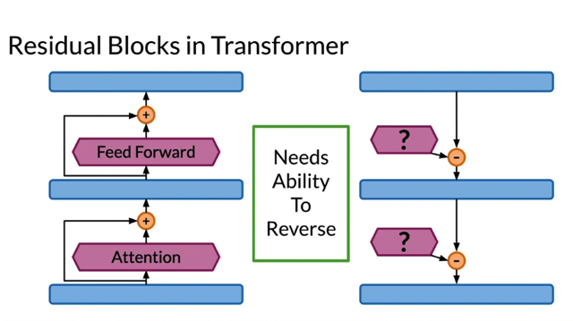</kbd>

> [!NOTE]
> When running**large deep models**, you'll often **run out of memory**, as **each layer
> keeps allocating it for a long time**. I'll show you how this can be solved using
> **reversible layers**. Let's dive in.
>
> The transformer network proceeds by **repeatedly adding the residuals to the hidden
> states**. To run it in reverse, you can **subtract the residuals in the opposite order**,
> starting with the outputs of the model. But in order to save memory **otherwise used to
> store the residuals, you need to be able to re-compute them quickly instead.**

> [!NOTE]
> Đại khái là để backprop cần phải **thực hiện ngược lại quá trình add
> residual**,  và để làm việc này thì thông thường phải save các activation
> value
>
> Nôm na là ví dụ y = x + f(x) | việc cộng x vào f(x) ở đây chính là skip
> connection hay residual connection. Thì **khi backprop** tính ngược lại thì **phải
> có phép trừ  lại x (nôm na là vậy**, còn cụ thể thì đây là quá trình tính
> derivative)   Thì ý nói **vì lý do này mà ta phải save x ở đâu đó trong quá trình
> forward prop** đ**ể mà trừ ra lại trong backprop**. Mà với Large Deep model thì
> có  rất nhiều skip connection kiểu này, dẫn đến quá tải bộ nhớ
>
> Do đó yêu cầu phải có cách nào đó **không cần lưu trữ**activation value và
> có cách sao cho **khi cần chỉ việc tính toán lại**. Thì đó chính là Reversible
> layer.

 

<kbd>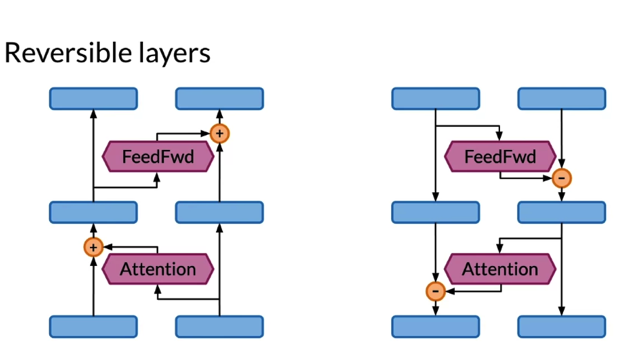</kbd>

> [!NOTE]
> Đại khái là người ta dùng một cách thức trong đó đưa vào
> model input và một copy của input.
>
> Và dùng nó như hình vẽ

 

<kbd>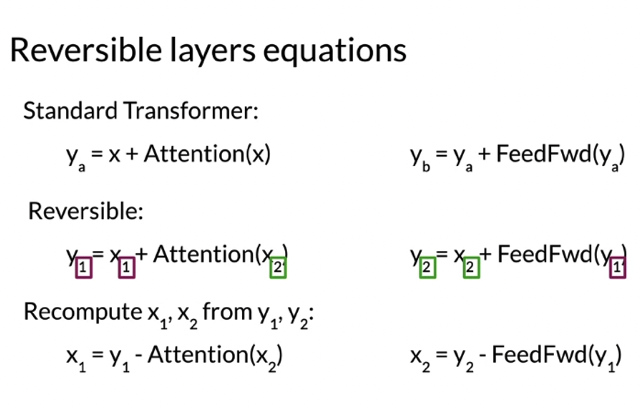</kbd>

> [!NOTE]
> Đại khái là Reversible layer có kiến trúc giúp cho mang lại
> khả năng tính ngược ra lại x1, x2 từ y1, y2

 

<kbd>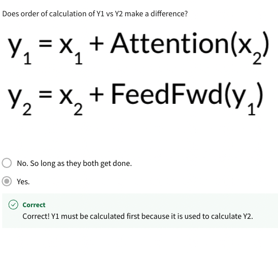</kbd>

 

<kbd>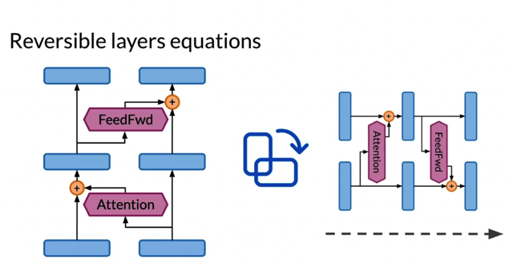</kbd>

 

<kbd>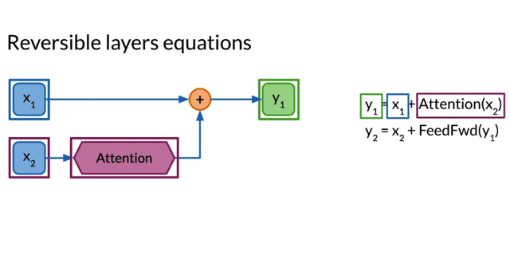</kbd>

> [!NOTE]
> Bước này, cơ bản là giống như y1 = x + Attention(x). Tức là
> cho x qua Attention, rồi add với Residual x (Skip connection)

 

<kbd>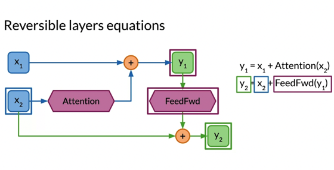</kbd>

> [!NOTE]
> Sau đó tính y2 bằng kết quả FeedFwd của y1 và x2 (skip
> connection).
>
> Chỗ này thắc mắc là nó không tương được y2 = y1 +
> FeedFwd(y1) được. Nhưng tạm hiểu vậy

 

<kbd>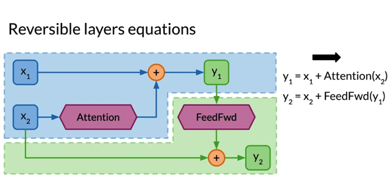</kbd>

> [!NOTE]
> Thì đây là quá trình Forward. Thì ổng nói không cần phải save memory cái gì.
> So sánh với cách cũ, y1 = **x** + Attention(x). y2 = **y1** + FeedFwd(y1) thì ta sẽ thấy
> nó sẽ **phải save memory x, và y1**(để tính Attention(x) thì cộng x vào lại, 
> FeedFwd(y1) xon thì cộng y1 vào lại)****Còn với Reversible layer, rõ ràng chỉ việc tính y1 = x1 + Attention(x2). Xong
> tính y2 = x2 + FeedFwd(y1). Không phải save value trung gian.

 

<kbd>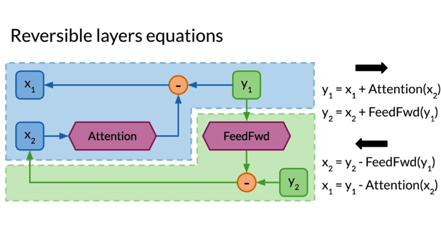</kbd>

> [!NOTE]
> Và quá trình backward pass cũng không
> cần phải tốn memory khi có thể tính
> ngược ra lại x1,x2 từ y1,y2

 

<kbd>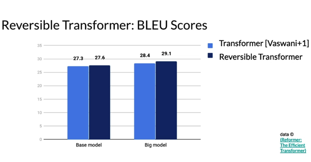</kbd>

 

## Lab: Revnet

 

## Reformer

 

<kbd>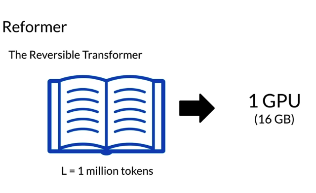</kbd>

 

<kbd>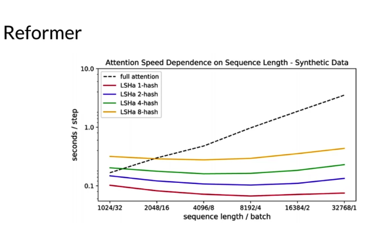</kbd>

> [!NOTE]
> Ổng chỉ nói Reformer sử dụng hai cái là LSHAttention và Reversible
> layer. Cụ thể thế nào thì trong P.A sẽ biết. Ở đây cho thấy so sánh
> performance của Reformer cho thấy so với  Full attention (Original
> transformer) thì Reformer nhanh hơn

 

<kbd>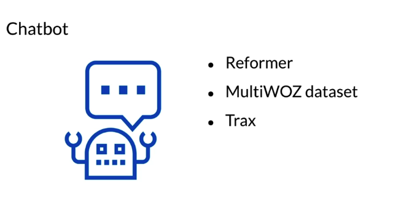</kbd>

 

## (optional) Transformers

> [!NOTE]
> (OPTIONAL) TRANSFORMERS
> BEYOND NLP

 

<kbd>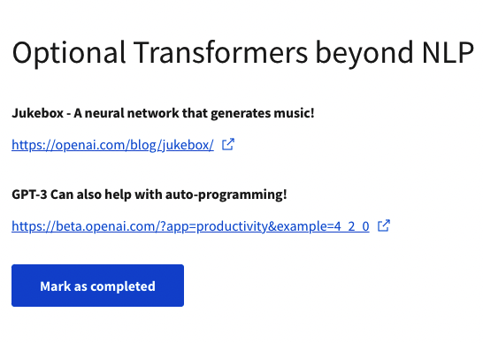</kbd>

> [!NOTE]
> https://openai.com/blog/jukebox/
>
> https://beta.openai.com/?app=productivity&example=4_2_0

 

## Quiz: Chatbot

 

<kbd></kbd>

 

<kbd>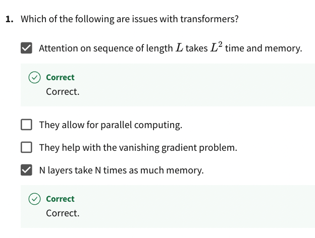</kbd>

 

<kbd>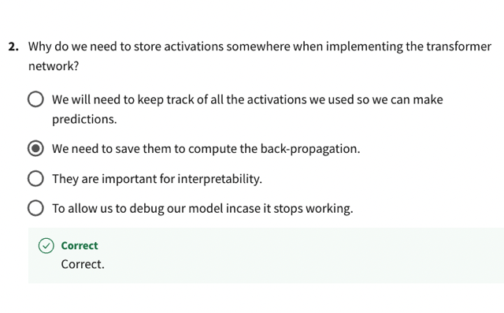</kbd>

 

<kbd>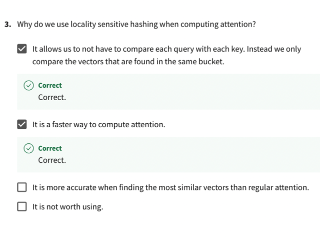</kbd>

 

<kbd>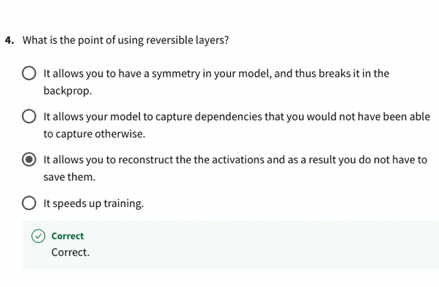</kbd>

 

<kbd>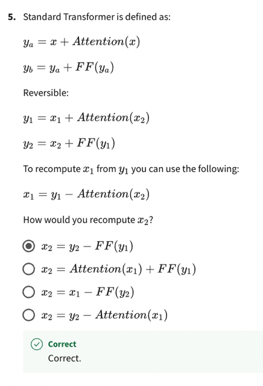</kbd>

 

<kbd>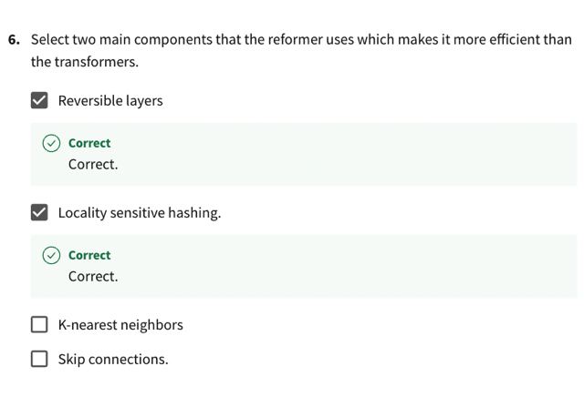</kbd>

 

<kbd>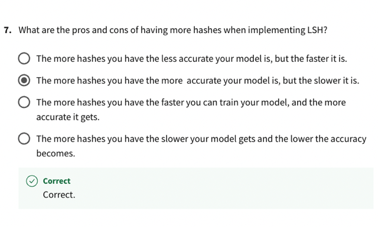</kbd>

 

<kbd>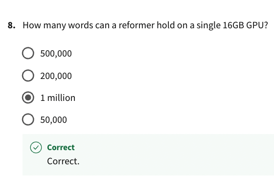</kbd>

 

<kbd>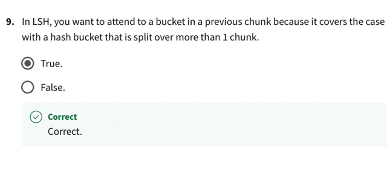</kbd>

 

<kbd>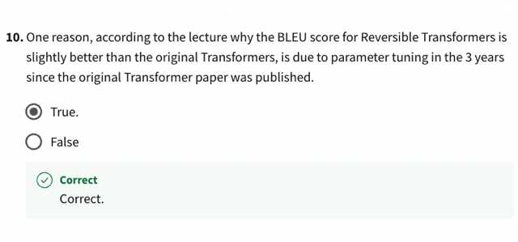</kbd>

 

## Pa: Chatbot

 

### Welcome to the last assignment of Course 4. Before you get started, we want to congratulate you

> [!NOTE]
> Welcome to the last assignment of Course 4. Before you get started, we want to congratulate you
> on getting here. It is your**16th programming assignment** in this Specialization and we are very
> proud of you! In this assignment, you are going to use the **Reformer**, also known as the **efficient
> Transformer**, to generate a **dialogue between two bots**. You will **feed conversations to your
> model** and it will **learn how to understand the context of each one**. Not only will it **learn how to
> answer questions** but it will also **know how to ask questions if it needs more info**. For example,
> after a customer asks for a train ticket, the chatbot can ask what time the said customer wants to
> leave. You can use this concept to automate call centers, hotel receptions, personal trainers, or any
> type of customer service. By completing this assignment, you will:
>
> Understand **how the Reformer works**
>
> Explore the **MultiWoz dataset**
>
> **Process the data to feed it into the model**
>
> Train your model
>
> **Generate a dialogue by feeding a question to the model**

<kbd></kbd>

 

#### 1 - Exploring the MultiWoz Dataset

 

<kbd>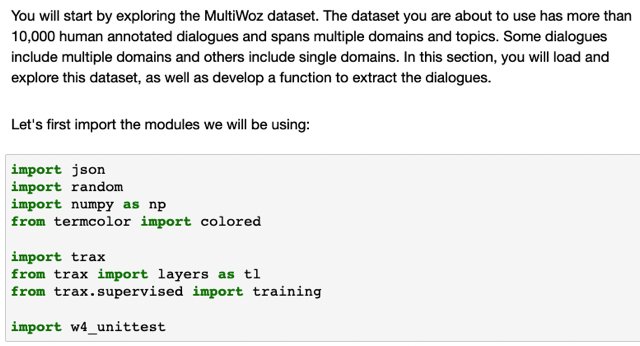</kbd>

> [!NOTE]
> Làm quên bộ dataset MultiWoz, chứa hơn 10000 dialogues
> được annotated (labeled) bao gồm nhiều topic.

 

<kbd>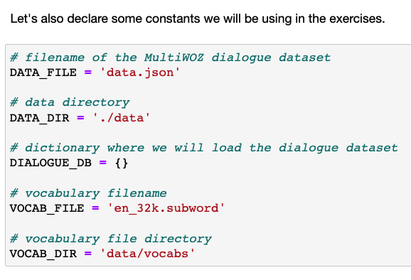</kbd>

> [!NOTE]
> Khai báo một số constant như dataset file
> name, file path, vocabs file's name & file
> path

 

<kbd>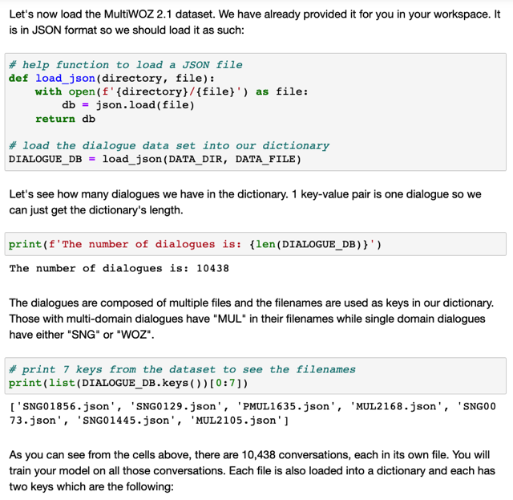</kbd>

> [!NOTE]
> Gọi function dưới để**load dataset vốn được để sẵn trong
> workspace dưới dạng json file.**
>
> Dùng **with open(file's path) as file: để mở file**
> Sau đó **dùng json lib .load() để load file.**Dataset có 10428 data sample. Nó có dạng là một dictionary
> với key là tên file ví dụ **"SNG1856.json", "MUL2105.json"**
>
> Kí tự **SNG hay MUL** thể hiện file**(dialog) thuộc loại single domain
> hay multiple domain.**

 

<kbd>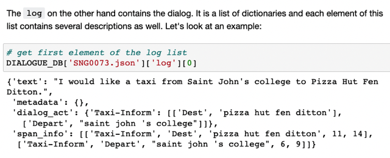</kbd>

<kbd></kbd>

<kbd>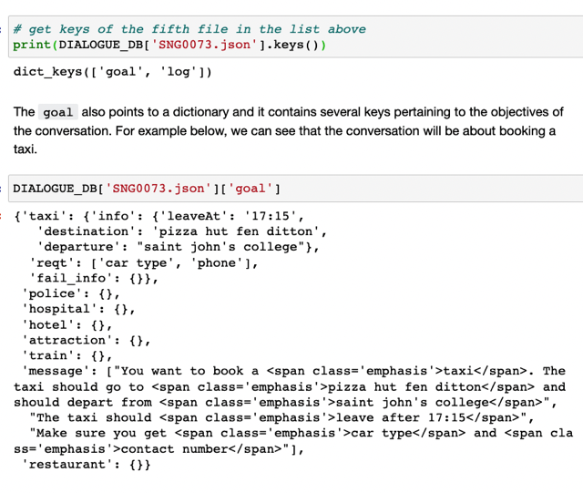</kbd>

> [!NOTE]
> Mỗi key ở trên ví dụ 'SNG0073.json' lại map với một dictionary.
>
> Dictionary này có 2 key là 'goal' và 'log'
>
> 'goal' tiếp tục map với một dictionary nữa, chứa nhiều keys liên quan đến 
> objective - chủ đề của conversation.
>
> Ví dụ như của cái này thì nó có 'taxi' map với dictionary chứa các thông tin
>
> 'log' chứa dialog nhưng nó là list trong đó mỗi entry là một dictionary
> có key 'text' map với câu trong hội thoại, các key khác như metadata,
> dialog_act, ....
> Và đáng lưu ý là mỗi entry cơ bản chứa thông tin của một câu của một
> người ví dụ person #1, và entry sau là câu đáp lại của person #2, cứ thế.
>
> ====
>
> Có thể sơ sơ các nhánh nó như sau:
>
> 'SNG0073.json' : 'goal' : 'taxi' : 'info' : 'leaveAt' : ...
>                                                            'destination': ...
>                                                  'regt' : 'car type', 'phone'
>                                        'message': [....] 
>                             'log' : ['text' : ....
>                                      'metadata' : ...],
>                                      ['text' : ...
>                                      'metadata' : ...] 
> 'MUL2105.json' : ...

 

<kbd>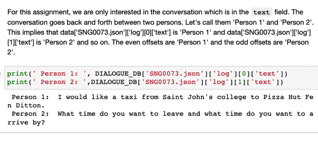</kbd>

> [!NOTE]
> Trong assignment này mình **chỉ quan tâm cái value của key '
> text' trong các entry của log** thôi. Đó chính là nội dung của câu
> hội thoại, các key khác chỉ là thông tin trích dẫn hay sao đó
> làm sẵn để dành cho mục đích gì đó

 

#### Exercise 1 - get_conversation (UNQ_C1)

 

<kbd>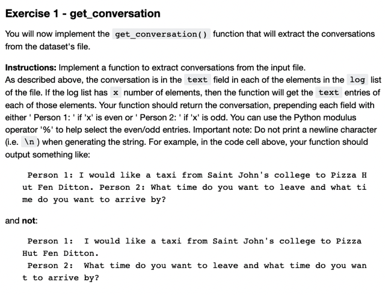</kbd>

> [!NOTE]
> Đại khái là giờ ta sẽ viết một function để lấy các câu đối thoại (nội
> dung) ra, chứa trong key 'text' của từng entry / element của 'log' (của
> từng data sample)
>
> Câu chẵn thì add 'Person 1: ', câu lẻ thì add 'Person 2: '

 

<kbd>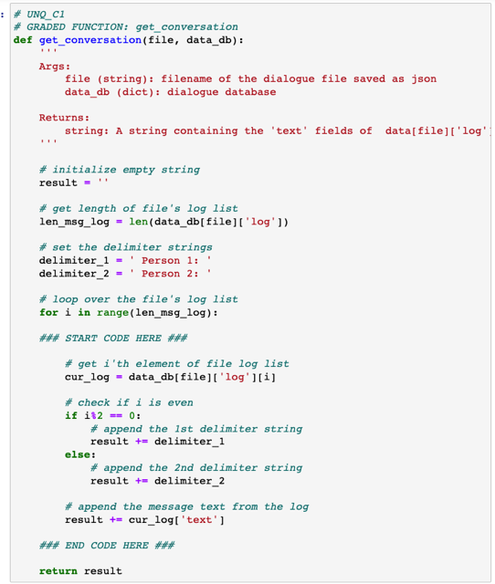</kbd>

> [!NOTE]
> Từ input 'file' là file's name cũng là key trong database.
> Access value của file đó cũng là một dictionary với 2
> key 'goal', và 'log' như đã biết. Access log để được list
> các entry.
>
> Dùng i%2 = 0 (modulus operation để check) câu chẵn hay
> lẻ để mà prepend phù hợp.

 

<kbd>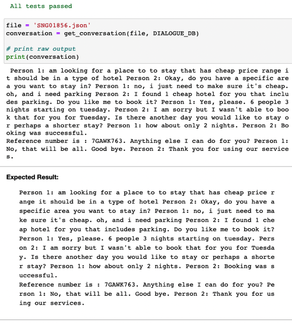</kbd>

 

<kbd>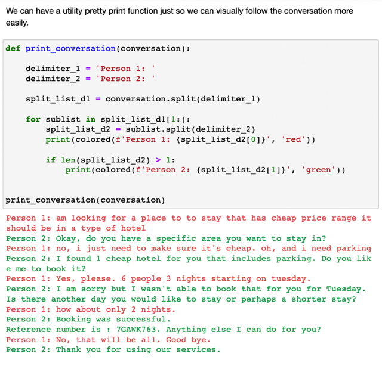</kbd>

> [!NOTE]
> Đại khái là một function giúp in
> conversation theo hai màu cho dễ nhìn

 

<kbd>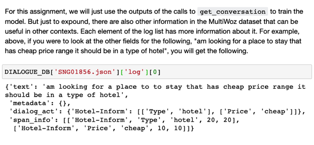</kbd>

> [!NOTE]
> Đại khái là trong phạm vi assignment này thì ta có thể **chỉ dùng nội
> dung của dialogues**, cụ thể là **output từ function get_conversation()** ở
> trên.
>
> Nhưng trong những trường hợp khác, **những thông tin khác của 
> bộ dataset sẽ rất hữu ích**. Ví dụ, trong entry chứ câu 'am looking for...
> ..a place..' thì phần 'dialog_act'**có các thông tin được extracted sẵn
> có thể dùng để train model cho các nhiệm vụ khác**

 

<kbd>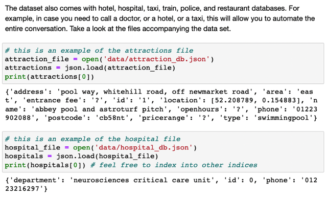</kbd>

> [!NOTE]
> Dataset còn có các database các chủ đề khác

 

<kbd>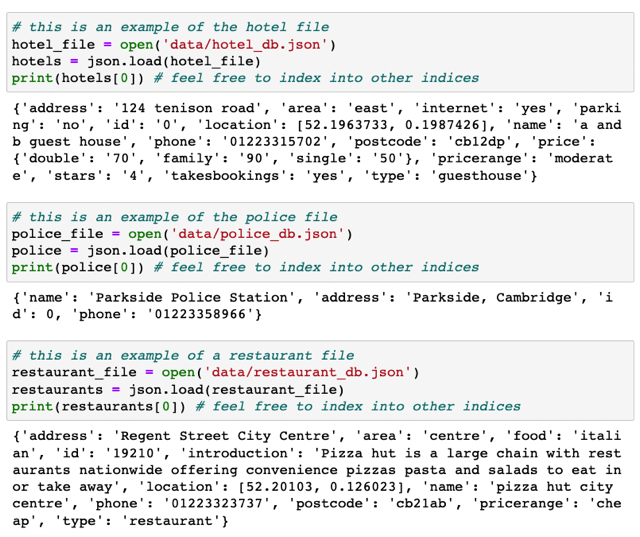</kbd>

 

<kbd>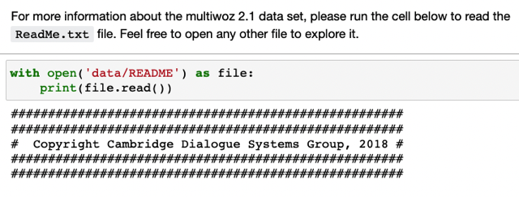</kbd>

 

#### Dataset contains the following files: 1. **data.json**: the **woz dialogue dataset,** which contains the **conversation  users and wizards**, as well  as a**set of coarse labels for each user turn**. This file contains both system and user dialogue acts annotated  at the turn level. Files with **multi-domain dialogues** have "**MUL**" in their names.**Single domain dialogues** have  either "**SNG**" or "**WOZ**" in their names. 2. **restaurant_db.json**: the**Cambridge restaurant database file**, containing **restaurants** in the  **Cambridge UK area** and a **set of attributes.** 3. **attraction_db.json**: the Cambridge attraction database file, contining attractions in the  Cambridge UK area and a set of attributes. 4. **hotel_db.json**: the Cambridge hotel database file, containing hotels in the Cambridge  UK area and a set of attributes. 5. **train_db.json**: the Cambridge train (with artificial connections) database file, containing  trains in the Cambridge UK area and a set of attributes. 6. **hospital_db.json**: the Cambridge hospital database file, contatining information about departments. 7. **police_db.json**: the Cambridge police station information. 8. **taxi_db.json**: slot-value list for taxi domain.     9. **valListFile.txt**: list of **dialogues for validation.** 10. **testListFile.txt**: list of **dialogues for testing.** 11. **system_acts.json**:   There are **6 domains ('Booking', 'Restaurant', 'Hotel', 'Attraction', 'Taxi', 'Train')** and **1 dummy domain ('general')**.   A domain-dependent dialogue act is defined as a domain token followed by a domain-independent  dialogue act, e.g. 'Hotel-inform' means it is an 'inform' act in the Hotel domain.   Dialogue acts which cannot take slots, e.g., 'good bye', are defined under the 'general' domain.   A slot-value pair defined as a list with two elements. The first element is slot token and the second one is its value.   If a dialogue act takes no slots, e.g., dialogue act 'offer booking' for an utterance 'would you like  to take a reservation?', its slot-value pair is ['none', 'none']      There are **four types of values:**   1) If a slot takes a **binary value**, e.g., **'has Internet' or 'has park'**, the value is either **'yes' or 'no'.**   2) If a slot is under the act 'request', e.g., 'request' about 'area', the value is expressed as '?'.   3) The value that appears in the utterance e.g., the name of a restaurant.   4) If for some reason the turn does not have an annotation then it is labeled as "No Annotation." 12. ontology.json: Data-based ontology containing all the values for the different slots in the domains. 13. slot_descriptions.json: A collection of human-written slot descriptions for each slot in the dataset.  Each slot has at least two descriptions. 14. tokenization.md: A description of the tokenization preprocessing we had to perform to maintain consistency  between the dialogue act annotations of DSTC 8 Track 1 and the existing MultiWOZ 2.0 data.

 

#### As you can see, there are **many other aspects** of the **MultiWoz** dataset. Nonetheless, you'll see that **even with just the conversations, your model will still be able to generate useful responses**. This concludes our exploration of the dataset. In the next section, we will do some preprocessing before we feed it into our model for training.

> [!NOTE]
> Đại khái có nhiều aspect khác của MutiWoz, tuy
> nhiên dù chỉ train với phần dialog content thôi cũng
> đủ đạt kết quả tốt

 

#### 2 - Processing the Data for Reformer Inputs

 

<kbd>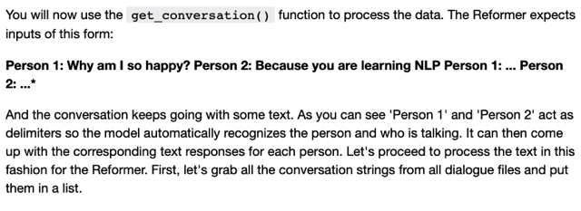</kbd>

> [!NOTE]
> Đại khái là nhờ có "Person 1",  "Person 2" model sẽ recognize ai
> đang nói (ý là sentence nào gắn với ông nào) 
>
> Trước khi **xử lý text theo fashion của Reformer model**, ta sẽ g**rab mọi
> conversation strings bỏ vào một list**

 

<kbd>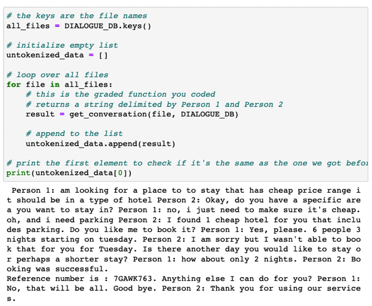</kbd>

> [!NOTE]
> Lấy **tất cả các key** của dialog dataset ra, loop trong đó và
> **dùng function get_conversation() ở trên để lấy các dialog
> content** - là đoạn**text chứa các câu kế tiếp nhau không có
> xuống dòng gì cả, append vào list**

 

<kbd>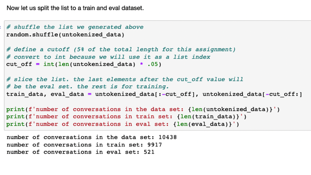</kbd>

> [!NOTE]
> Shuffle lên. Define **một con số bằng 5% của list's length**. Làm
> tròn thành **int**. Và**dùng nó để chia data thành train và eval set.**

 

#### 2.1 - Tokenizing, Batching with Bucketing

 

<kbd>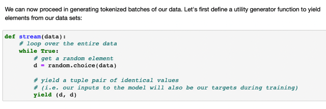</kbd>

> [!NOTE]
> Đại khái là một function đóng vai trò như **Data generator**, nhận
> dataset, **lấy random một dialogue** và trả ra **tuple chứa dialog,
> dialog** theo kiểu **yield (thay vì return) như ta đã biết là nó sẽ
> return từng chút từng chút**
>
> **Tuple (dialog, dialog)** là vì khi training dialog cũng**chính là target**(kiểu như **self-supervise learning mà**) cụ thể dùng như thế nào thì
> **tí sẽ biết.**

 

<kbd>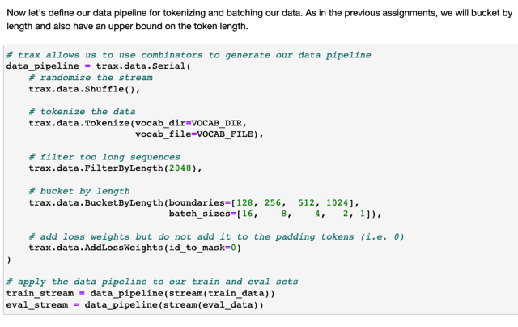</kbd>

> [!NOTE]
> Đại khái là define **pipeline** để thực hiện việc **tokenizing và batching**.
> Như các assignment trước đã biết, ta sẽ "**bucket by length"** và có **upper
> bound bởi token length.**
>
> Review lại một chút,**"bucket by length"** đại khái là**nhóm (bucket) các
> câu (ở đây là dialogue's content) thành các bucket** chứa các content **dài
> same same** nhau. Mục đích là để khi batching, và padding **giảm thiểu số
> padding cần có.**
>
> Các sequence **sẽ được pad đến (khi dài bằng) luỹ thừa 2 gần nhất**.
>
> Ví dụ trong các PA trước khi input là các sentence thì **bucket có các câu
> nhỏ hơn 8** sẽ được **pad để dài thành 8**,  các câu dài **9,10,11..15** **sẽ
> được pad để thành dài 16**... Và tương ứng với đó là batch size tương ứng.
>
> Xem ở đây với dialog thì ta thấy họ làm là với các **dialog có content's
> length < 128**  sẽ được **pad thành dài 128**, và gom thành **batch có
> batch size 16**.
>
> Các **dialog dài 127,128....255** sẽ **pad để dài 256**, gom thành **batch có
> batch size 8...**.

> [!NOTE]
> Giải thích code:
>
> Họ dùng Serial để define pipeline data_pipeline
>
> Bắt đầu với shuffle lên.
>
> Khởi tạo trax.data.**Tokenizer** nhận input là vocab dir và vocab file
> chứa trong các constant defined ở trên.
>
> Tạo trax.data.**FilterByLength**(2048) như vậy ta sẽ filter
> các dialog dài quá 2048. 
>
> Tạo trax.data.**BucketByLength**(với các boudaries và batch_size values)
>
> Tạo trax.data.**AddLossWeights** với **id_to_mask = 0**: Cái này cũng đã
> gặp, ý là mục đích để khi tính loss trong quá trình training, nó không 
> tính / ignore pad token
>
> Với data_pipleline define. Đưa vào nó data generator là stream(train_data)
> nó sẽ **tạo ra một data generator mới có apply các bước tokenizing và batching**

 

<kbd>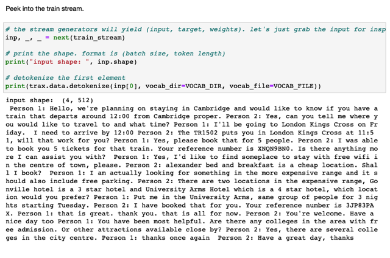</kbd>

> [!NOTE]
> Gọi **next(train_stream)** để**xem thử một batch**. Ta thấy **(4,
> 512)** có nghĩa là batch này có **các dialog được pad tới độ dài
> 512**, và **tương ứng với batch_sizes được defined ở trax.data.
> BucketByLength**, nó sẽ**tạo batch có 4 dialogs thôi**Bỏ vào lại **trax.data.detokenize()** thì ta xem được batch này có **content
> gốc là gì** (sau khi tokenize thì nó đã thành token hết rồi)

 

#### 3 - Reversible Layers

 

#### When running large deep models, you will often **run out of memory** as **each layer allocates memory to store activations** for use in **backpropagation**.  To save this resource, you need to be able to **recompute these activations during the backward pass without storing them during the forward pass**. Take a look first at the leftmost diagram below.

> [!NOTE]
> Như bài trước đã phân tích nhu cầu phải có **Reversible**
> layer xuất phát từ việc **quá trình backprop cần phải store
> các giá trị của activation function** của các layer (cho mục
> đích **tính derivative của quá trình gradient descent**)
>
> Mà với large deep model như LLM thì khối lượng quá lớn khiến
> memory quá tải
>
> Do đó để khắc phục, **cần phải có cách để tính lại activation value
> khi cần chứ không cần phải lưu trữ nó trong memory.**Thì Reversible layer cho phép điều đó.

 

<kbd>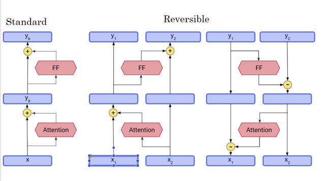</kbd>

 

<kbd>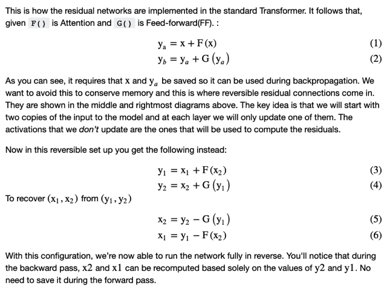</kbd>

> [!NOTE]
> Đại khái là như trong bài đã có nói với kiến trúc truyền thống (cụ thể là
> traditional skip-connection layer) thì yêu cầu phải save các activation
> value của các layer trung gian để mà trừ ra lại trong quá trình backprop.
>
> Điều này gây tốn memory. Thì reversible layer với kiến trúc của nó cho phép
> không cần save activation mà chỉ cần tính lại từ chính các output.

 

#### Exercise 2 - reversible_layer_forward (UNQ_C2)

 

<kbd>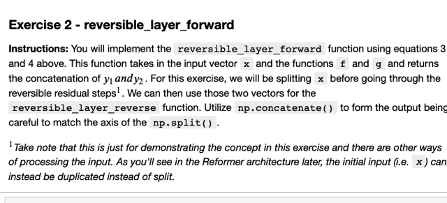</kbd>

 

<kbd>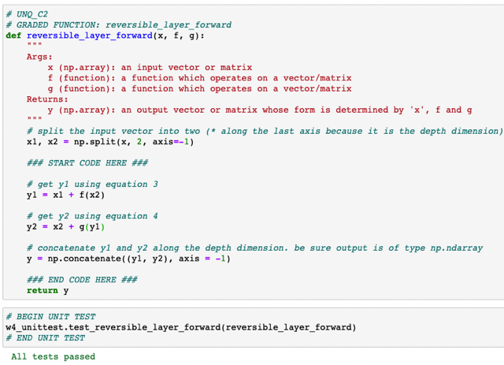</kbd>

 

#### Exercise 3 - reversible_layer_reverse (UNQ_C3)

 

<kbd>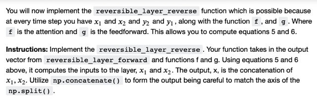</kbd>

 

<kbd>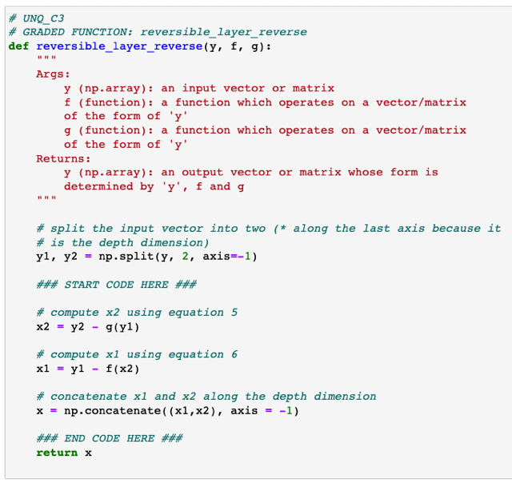</kbd>

 

<kbd>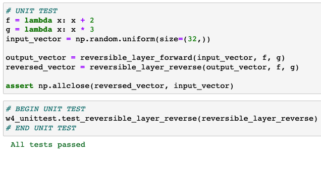</kbd>

 

#### 3.1 - Reversible Layers and Randomness

 

<kbd>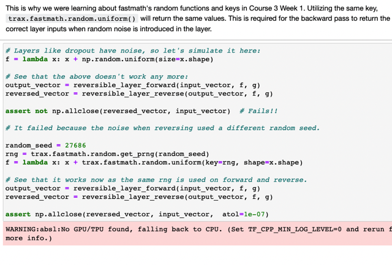</kbd>

> [!NOTE]
> Chưa hiểu lắm, nói gì đó đến vai trò của trax.
> fastmath.random functions. Cho phép cùng một
> key thì return cũng một value. Điều này cần thiết
> cho quá trình backward pass.

 

#### 4 - ReformerLM Training

 

#### You will now proceed to **training your model**. Since you have already know the **two main components** that differentiates it from the standard Transformer, LSH in Course 1 and reversible layers above, you can **just use the pre-built model already implemented in Trax**. It will have this architecture:

> [!NOTE]
> Qua quá trình training. Ở đây do mình **đã biết hai điểm khác so với
> traditional Transformer model đó là LSH và Reversible layer** thông qua
> hai lab trước. Nên ở đây chỉ cần dùng **pre-build model của Trax library**

 

<kbd>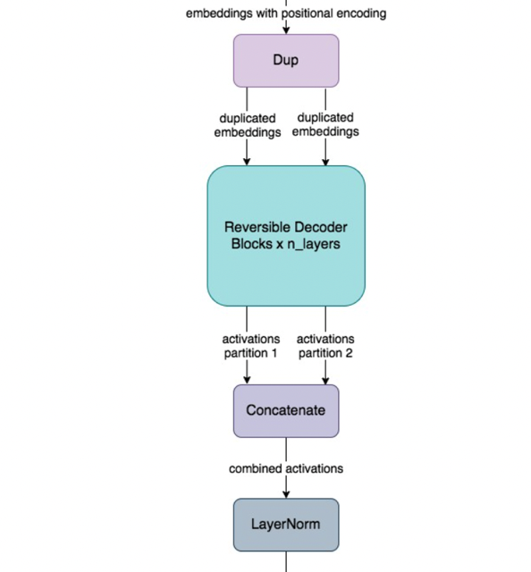</kbd>

<kbd>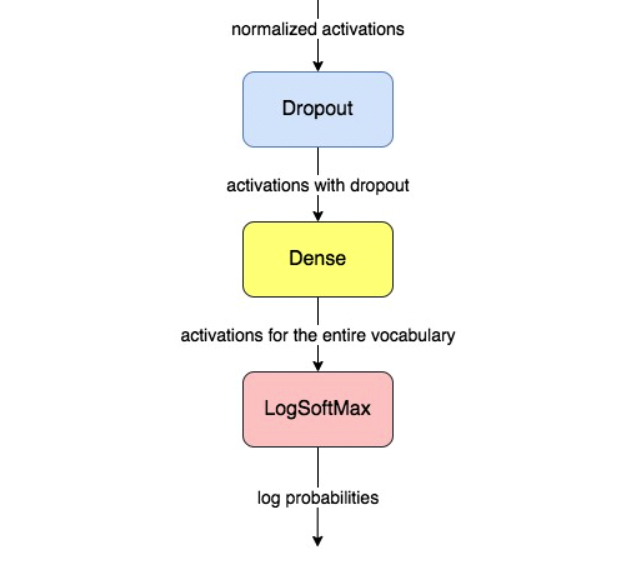</kbd>

<kbd></kbd>

<kbd></kbd>

<kbd>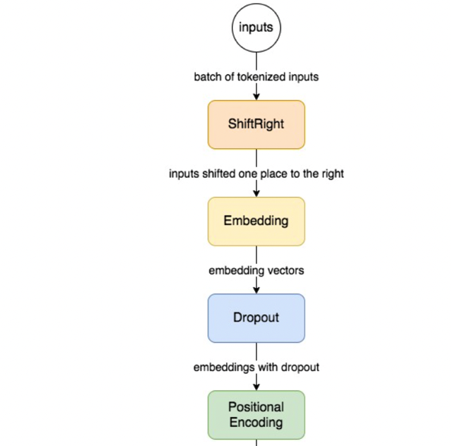</kbd>

 

#### Similar to the Transformer you learned earlier, you want to apply an **attention** and **feed forward layer** to your **inputs**.  For the **Reformer**, we improve the **memory efficiency** by using **reversible decoder blocks** and you can picture its implementation in Trax like below:

<kbd>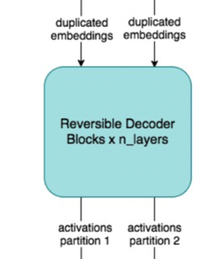</kbd>

<kbd></kbd>

 

<kbd>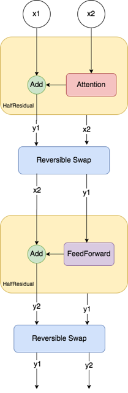</kbd>

> [!NOTE]
> x1, x2 chính là
> duplicated embddings

 

#### You can see that it takes the**initial inputs x1 and x2** and does the **first equation of the reversible networks** you learned in Part 3. As you've also learned, the **reversible residual**has **two equations for the forward-pass** so doing just one of them will just constitute half of the reversible decoder block.  Before doing the second equation (i.e. second half of the reversible residual), it first needs to **swap the elements** to **take into account the stack semantics in Trax**. It simply puts **x2 on top of the stack** so it can be fed to the add block of the half-residual layer. It then **swaps the two outputs again** so it can be fed to the next layer of the network. All of these arrives at the two equations in Part 3 and it can be **used to recompute the activations during the backward pass.**  These are **already implemented for you in Trax** and in the following exercise, you'll get to**practice how to call them to build your network.**

> [!NOTE]
> Cơ bản **nói thêm về cách thức hoạt động**để hiểu sơ, còn
> **Trax nó implement ở dưới** rồi đó là sau bước tính thứ nhất
> y1 = x1 + f(x2), f là attention, thì **còn có vụ swap x2, và
> y1 trong stack để x2 nằm trên.**
>
> Để rồi **sau bước tính thứ 2 tính ra y2 thì lại swap lại.**
>
> Chỉ hiểu thêm như vậy còn lại chỉ làm để biết cách gọi
> trong Trax

 

#### Exercise 4 - ReformerLM (UNQ_C4)

 

<kbd>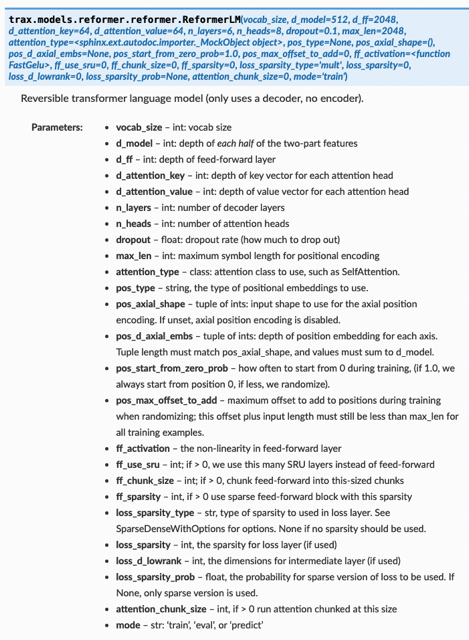</kbd>

 

<kbd>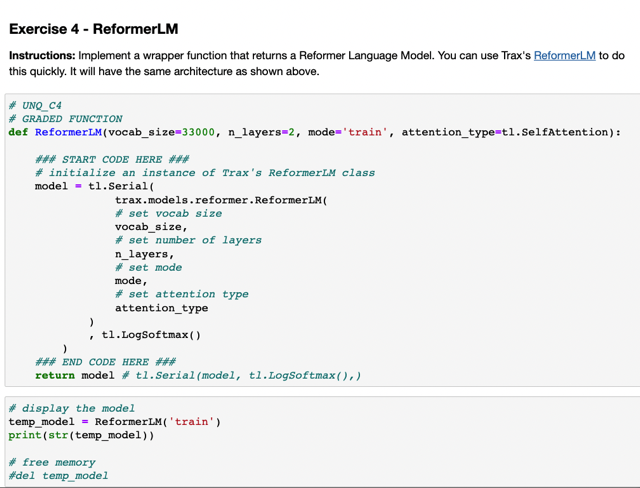</kbd>

> [!NOTE]
> Bị hoài luôn, chỗ sai này cần phải nhớ đó là khi
> define model phải luôn chỉ cụ thể ra argument nào.
> Để như thế này nó cũng build nhưng ra model có
> kiến trúc khác.

 

<kbd>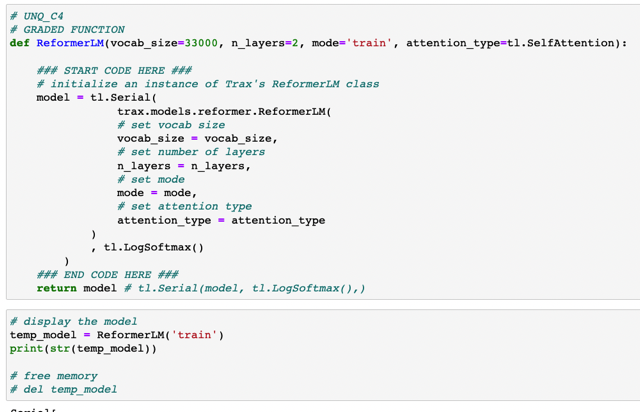</kbd>

> [!NOTE]
> Phải define argument cụ thể ra. Không define
> cụ thể build ra model không pass unit test -
> báo lỗi wrong model

 

#### Serial[   Serial[     Serial[       ShiftRight(1)     ]     Embedding_train_512     Dropout     Serial[       PositionalEncoding     ]     Dup_out2     ReversibleSerial_in2_out2[       ReversibleHalfResidualDecoderAttn_in2_out2[         Serial[           LayerNorm         ]         SelfAttention       ]       ReversibleSwap_in2_out2       ReversibleHalfResidualDecoderFF_in2_out2[         Serial[           LayerNorm           Dense_2048           Dropout           Serial[             FastGelu           ]           Dense_512           Dropout         ]       ]       ReversibleSwap_in2_out2       ReversibleHalfResidualDecoderAttn_in2_out2[         Serial[           LayerNorm         ]         SelfAttention       ]       ReversibleSwap_in2_out2       ReversibleHalfResidualDecoderFF_in2_out2[         Serial[           LayerNorm           Dense_2048           Dropout           Serial[             FastGelu           ]           Dense_512           Dropout         ]       ]       ReversibleSwap_in2_out2     ]     Concatenate_in2     LayerNorm     Dropout     Serial[       Dense_train     ]   ]   LogSoftmax ]

 

<kbd>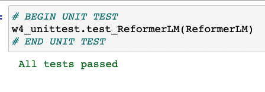</kbd>

 

#### Exercise 5 - training_loop (UNQ_C5)

 

<kbd>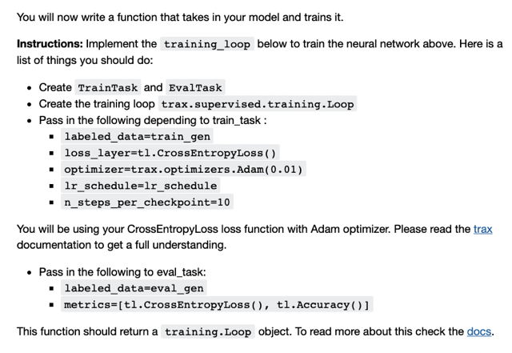</kbd>

> [!NOTE]
> Nói chung là define
> training loop

 

<kbd>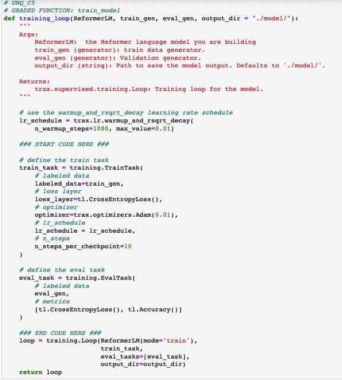</kbd>

> [!NOTE]
> Define **training.TrainTask** take input **labeled_data** là **train_gen** = **training**
> **data** **generator** ở trên.
>
> **loss_layer** là **tl.CrossEntropyLoss**(),
>
> **optimizer** dùng **trax.optimizer.Adam** với lr = 0.01
>
> **lr_schedule** dùng **trax.lr.warmup_and_rsqrt_decay** với **n_warmup_steps** =
> 1000 cái này để nghiên cứu sau nhưng **cơ bản là có thể hiểu nó là một specific
> technique của  adjusted learning rate**.
>
> Tương tự define **EvalTask** với **eval_gen**, metric dùng **tl.CrossEntropyLoss**
> và **tl.Accuracy**
>
> Cuối cùng đưa cả hai vào **training.loop**, cùng với **model** là **ReformerLM**, và
> output_dir để chứa kết **quả**

 

<kbd>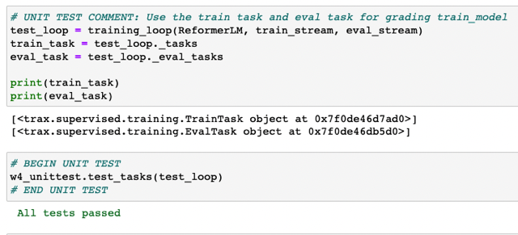</kbd>

 

<kbd>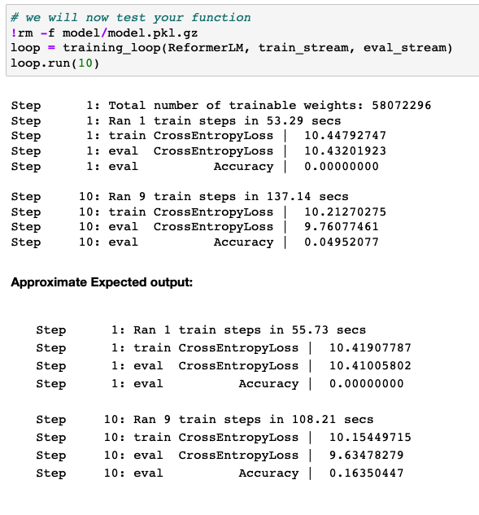</kbd>

 

#### 5 - Decode from a Pretrained Model

 

<kbd>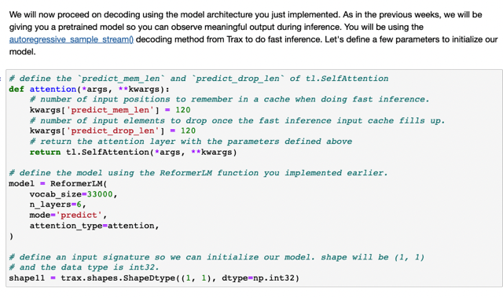</kbd>

> [!NOTE]
> Dùng **pretrained model để xem thử (decoding) output** như thế nào.
>
> Ta sẽ dùng **autoregressive_sample_stream**() **decoding method** của
> Trax để **thực hiện fast inferenc**e.
>
> Trước tiên **define vài params cũng như khởi tạo model**

 

<kbd>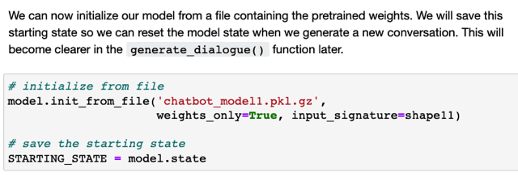</kbd>

> [!NOTE]
> **Load (pre-trained) weights từ file** và **save
> starting state** để reset model state khi ta generate
> new conversation. Tí sẽ hiểu

 

<kbd>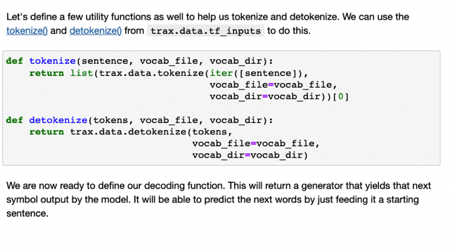</kbd>

> [!NOTE]
> Define sẵn hai **util function giúp tokenize và
> detokenize** để dùng. Sử dụng **api của Trax luôn**
> Kế tiếp mình sẽ **define decoding function**, trong đó sẽ return
> một generator mà**yields (nhả ra) từng next symbol output bởi model**

 

#### Exercise 6 - ReformerLM_output_gen (UNQ_C6)

 

<kbd>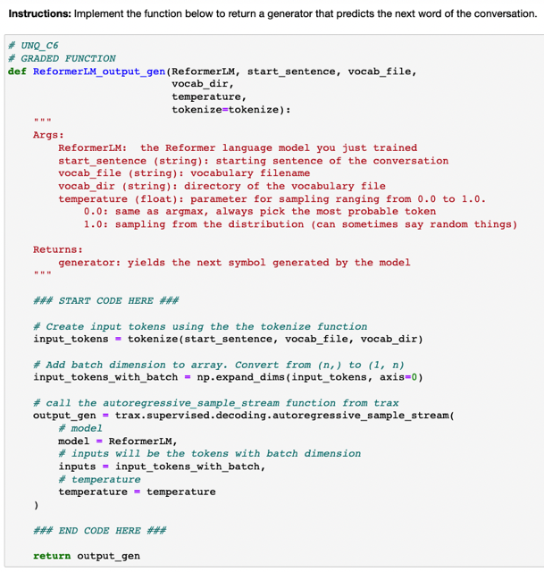</kbd>

> [!NOTE]
> Dùng tokenizer để tokenize input sentence. Sau đó np.
> expand_dims(.., axis = 0) để add thêm batch dimension trước khi
> bỏ vào function autoregressive_sample_stream của trax cùng
> với model và temperature để nó giúp thực hiện decoding

 

<kbd>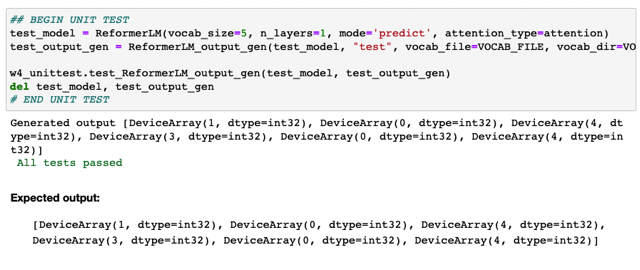</kbd>

 

<kbd>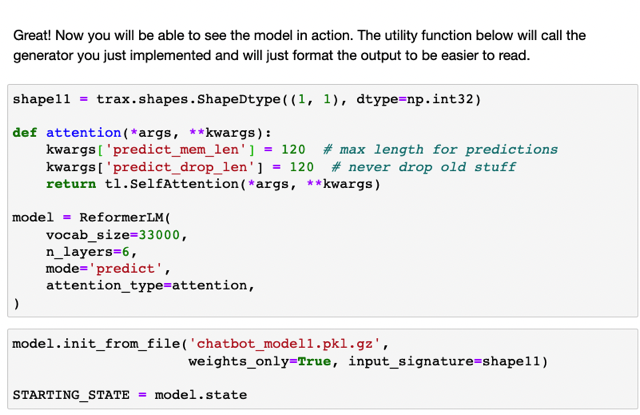</kbd>

> [!NOTE]
> Khởi tạo model,
> load weights

 

#### def **generate_dialogue**(ReformerLM, model_state, **start_sentence**, vocab_file, vocab_dir, max_len, temperature):     """     Args:         ReformerLM:  the Reformer language model you just trained         model_state (np.array): initial state of the model before decoding         start_sentence (string): starting sentence of the conversation         vocab_file (string): vocabulary filename         vocab_dir (string): directory of the vocabulary file         max_len (int): maximum number of tokens to generate          temperature (float): parameter for sampling ranging from 0.0 to 1.0.             0.0: same as argmax, always pick the most probable token             1.0: sampling from the distribution (can sometimes say random things)      Returns:         generator: yields the next symbol generated by the model     """            # define the delimiters we used during training     delimiter_1 = 'Person 1: '      delimiter_2 = 'Person 2: '          # initialize detokenized output     sentence = ''          # token counter     counter = 0          # output tokens. we insert a ': ' for formatting     result = [tokenize(': ', vocab_file=vocab_file, vocab_dir=vocab_dir)]          # **reset the model state** when**starting a new dialogue**     **ReformerLM.state = model_state**          # calls the output generator implemented earlier     output = **ReformerLM_output_gen**(ReformerLM, start_sentence, vocab_file=VOCAB_FILE,                                                  vocab_dir=VOCAB_DIR, temperature=temperature)      

> [!NOTE]
> Function giúp gọi generator và format
> output theo dạng dễ đọc

 

#### # print the starting sentence     print(start_sentence.split(delimiter_2)[0].strip())          # loop below yields the next tokens until max_len is reached. the if-elif is just for prettifying the output.     for o in output:                  result.append(o)                  sentence = detokenize(np.concatenate(result, axis=0), vocab_file=VOCAB_FILE, vocab_dir=VOCAB_DIR)                  if sentence.endswith(delimiter_1):             sentence = sentence.split(delimiter_1)[0]             print(f'{delimiter_2}{sentence}')             sentence = ''             result.clear()                  elif sentence.endswith(delimiter_2):             sentence = sentence.split(delimiter_2)[0]             print(f'{delimiter_1}{sentence}')             sentence = ''             result.clear()          counter += 1                  if counter > max_len:             break     

 

<kbd>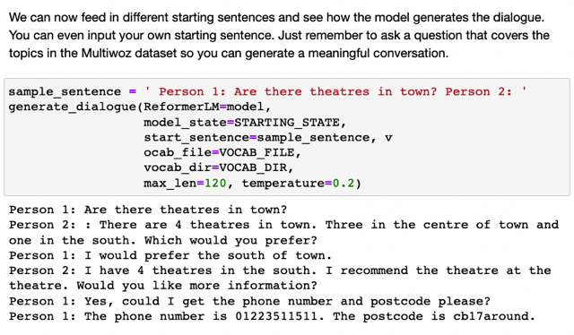</kbd>

> [!NOTE]
> Kết quả là inference vào một sentence
> nó sẽ generate một dialog

 

<kbd>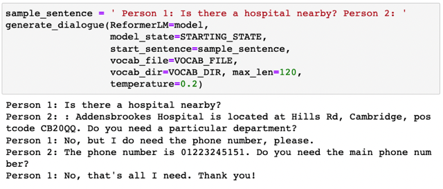</kbd>

 

<kbd>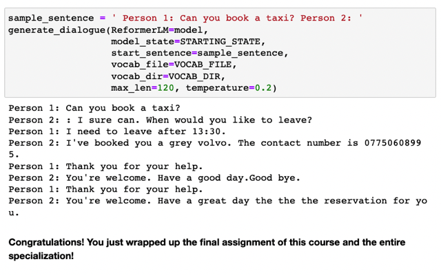</kbd>

 

