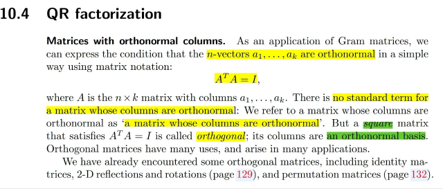
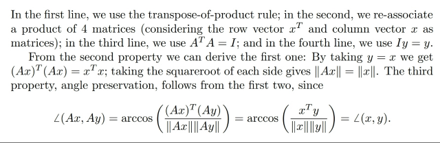
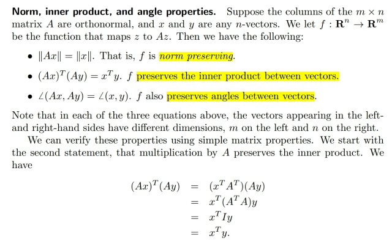
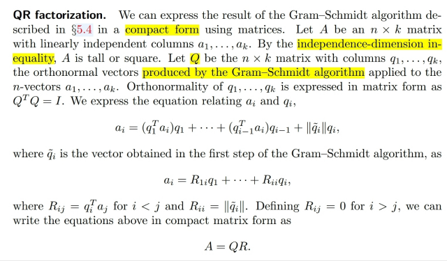
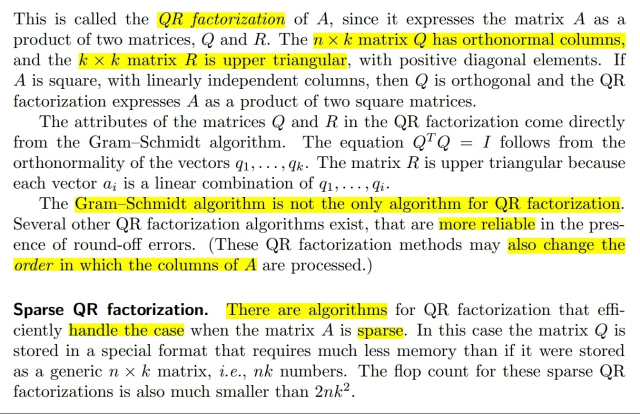

# 10.1 Matrix matrix multiplication

📊 **Progress:** `4` Notes | `6` Screenshots

---

<kbd></kbd>

> [!NOTE]
> Ko có gì mới so với 1806, ta đã biết nếu **các columns của A (m,
> n) orthonormal** thì nếu A**ko square** ta cũng chỉ nói A là matrix
> có các cột orthonormal. Ta sẽ **vẫn có ATA = I** nhưng I là **I_n**,
> tức **shape (n, n)**.
>
> **Chỉ khi A square**, tức là nó có m cột, và các cột này
> orthonormal thì khi đó **ATA = I_m**, và ta nói **A là orthogonal
> matrix**.
>
> Và ở đây ATA = I nói lên hai thứ:
>
> 1) column dot product với chính nó ra 1, tức là nó có**unit norm.**
>
> 2) Dot product với các cột khác ra 0, tức là **chúng orthogonal
> với nhau**

 

<kbd></kbd>

<kbd></kbd>

<kbd></kbd>

> [!NOTE]
> Tiếp theo đại khái là gs nói về **3 tính chất** gắn với **orthogonal**
> matrix. Đó là:
>
> nó **giữ nguyên norm vector (||Ax||=||x||)**,
>
> nó **giữ nguyên góc giữa hai vector** (tức góc giữa Ax và Ay bằng góc
> giữa x và y) điều này nói cách khác A (linear transformational represent
> bởi A) thể hiện một rotation operation.
>
> Và cuối cùng là **product giữa Ax và Ay sẽ bằng product giữa x và y**
>
> Chứng minh cũng dễ chỉ cần dựa vào **ATA= I** thôi

 

<kbd></kbd>

> [!NOTE]
> Đại khái là ta có thể **thể hiện G.S algorithm** bằng dạng
> **compact** (**matrix** x **matrix**)
>
> Ta sẽ hiểu vầy: như đã biết về G.S:
>
> **q1=a1**, **q'1=q1/||q1||: giữ nguyên cột 1, chỉ normalizing**
>
> ⇨ a1 = **||q1||q'1** = **R11q'1**
>
> q2 = a2-(q'1Ta2)q1, q'2 = q2/||q2||
>
> ⇨ a2 = (q'1Ta2)q1+q2
>
> = **(q'1Ta2)q'1 + q'2||q2||**
>
> = **R12q'1 + R22q'2***Dừng ở đây có thể thấy "hình dạng" của A = QR****
> vì QR = A (theo một góc nhìn matrix x matrix) sẽ là:
>
> cột 1 của A = linear combination các cột của Q, với hệ số là
> cột 1 của R. Và ở đây cột 1 của R là [||q1||, 0,....0] để QR
> chỉ là ||q1||q'1 (các cột của Q là q'1, q'2,...)
>
> cột 2 của A = linear combination các cột của Q, với hệ số là
> cột 2 của R. Và ở đây cột 2 của R là [q'1Ta2, ||q2||, 0, ...0]
>
> Từ đó có thể hiểu hiểu rằng R là upper triangular matrix
>
> ...
>
> qi=ai-(q'1Tai)q1-(q'2Tai)q'2-...(qi-1Tai)qi-1, q'i=qi/||qi||
>
> => ai=(q'1Tai)q'1+(q'2Tai)q'2+...+(qi-1Tai)qi-1+q'i||qi||
>
> =R1iq'1+R2iq'2+...Rijq'j+...Riiq'i
>
> Rii=||qi||, Rji (j<i) = q'jTai, Rji (j>i)=0
>
> và nếu a1,a2...an independent thì kết quả G.S algorithm tạo
> ra orthonormal set q'1,q'2...q'n (trong sách dùng q tilde)
>
> qn=an-(q'1Tan)q1-(q'2Tan)q'2-...(qn-1Tan)qn-1, q'n=qn/||qn||
>
> => an=(q'1Tan)q1+(q'2Tan)q'2...(qn-1Tan)qn-1+q'n||qn||
>
> =Rn1q'1+Rn2q'2+...+Rnnq'n
>
> Thế thì ai là linear combination của q1,q2,..qi
>
> a1=R11q'1+0q'2+...0q'n
>
> Và nó chính là [q'1 q'2...q'n](R11, 0,...0)T, hay A1 (tức cột 1
> của A) bằng Q (matrix các cột q'1..q'n) nhân cột 1 của R =
> (R11, 0,..0)
>
> a2 là linear combination của q'1, q'2: 
>
> a2=R21q'1+R22q'2+0q'3+...0q'n
>
> Và nó chính là: A2 (cột 2 của A, tức vector a2) sẽ bằng Q
> nhân cột 2 của R: R2= (R12, R22, 0, ...0)
>
> Tương tự vậy,
>
> an=Rn1q'1+Rn2q'2+...Rnnq'n
>
> an=Cột An=Q nhân cột n của R: Rn=(R1n, R2n, ...Rnn)
>
>
> Kết quả là ta có thể thể hiện A là matrix các independent
> vectors a1,a2...an bởi Q các orthogonal vectors q'1, q'2...q'n
> và upper triangular matrix R:
>
> A=QR shape: (m,n)=(m,n)(n,n)

 

<kbd></kbd>

> [!NOTE]
> Qua phân tích vừa rồi ta đã hiểu A=QR là sao. Nhưng vẫn có
> các algorithm khác G.S vẫn tạo orthonormal factorizations

 

