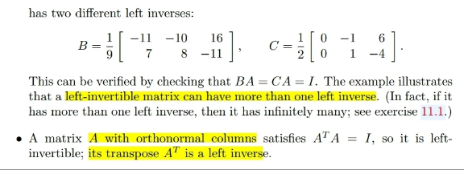
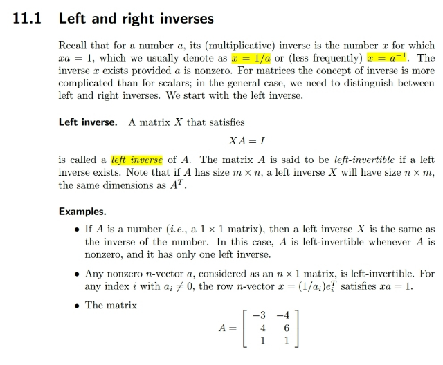
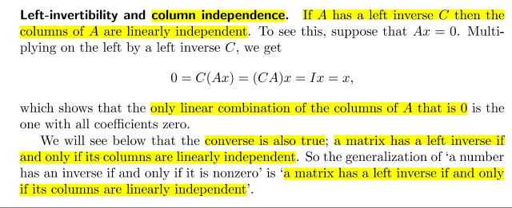
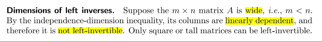
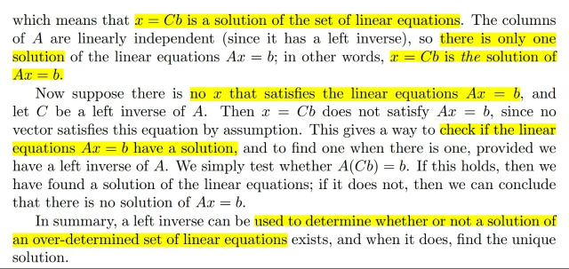
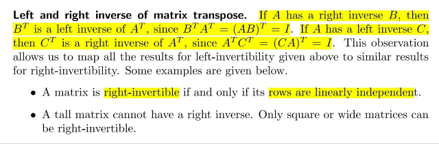
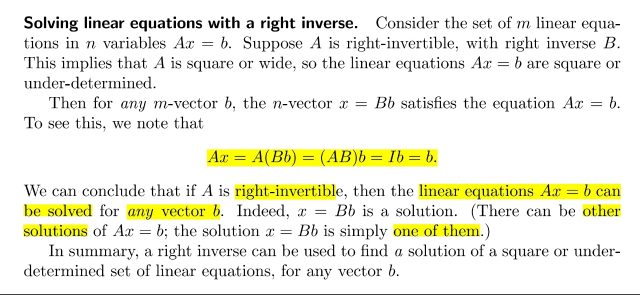

# 11.1 Left Right Inverse

📊 **Progress:** `7` Notes | `8` Screenshots

---

<kbd></kbd>

<kbd></kbd>

<kbd></kbd>

> [!NOTE]
> Khái niệm left inverse đã học từ 1806, là matrix nhân vào bên trái A
> để ra I: XA=I
>
> chỉ có một điểm mà ta có thể không để ý đó là: matrix có
> orthonormal columns (chưa phải orthogonal matrix) thì theo định
> nghĩa các cột orthogonal và unit norm nên QTQ=I.
>
> Vì vậy nó thỏa định nghĩa của left inverse,  vậy matrix có orthogonal
> columns Q là matrix left-invertible, với left inverse chính là QT

 

<kbd></kbd>

> [!NOTE]
> Tiếp họ nói nếu left inverse tồn tại thì A full column rank. Thử tự
> lập luận :
>
> Nếu A left invertible, tức là có matrix C để CA=I. Để chứng minh
> A full column rank ta cần chứng minh N(A)={0}: Xét Ax=0 nhân
> hai vế cho C:
>
> Ax=0 => CAx=0 <=> Ix=0 => x=0 như vậy 0 là solution duy nhất
> của Ax=0 nên N(A)={0} => A full column rank (kĩ hơn thì có thể
> nói thêm là do Ax=0 có solution duy nhất x=0 chứng tỏ
> coefficients để linearly combine columns của A cho ra 0 là mọi
> coefficients = 0 thì đó là định nghĩa của việc các columns của A
> độc lập
>
> Và ngược lại nếu các cột độc lập thì left inverse sẽ tồn tại: cái
> này thì ta đã biết từ 1806 rằng: nếu A full column rank (các cột
> độc lập) thì ATA full rank, invertible. Khi đó (ATA)inv tồn tại nên
> (ATA)invAT cũng vậy. Đây chính là left inverse của A:
> [(ATA)invAT]A=(ATA)inv(ATA)=I

 

<kbd></kbd>

> [!NOTE]
> Đại khái nói về matrix mập lùn thì sẽ ko left invertible. Lí do ở đây
> gs nói là vì có định lý đã biết là matrix có các cột độc lập chỉ có thể
> là vuông hoặc cao (set n-vectors độc lập chỉ có nhiều nhất n
> vectors)
>
> Review lại: cũng vì nhiều cột hơn hàng thì số cột chắc chắn lớn hơn
> rank, từ đó có cột tự do mà ta đã biết mỗi cột tự do sẽ "tương ứng"
> với một special solution của Ax=0 (gán 1,0 cho các free variables
> để backsub giải ra pivot variables), cũng là basis của nullspace,
> chính là coefficients combine linearly các cột thành 0 => chứng tỏ
> các cột không độc lập.

 

<kbd></kbd>

> [!NOTE]
> Đại khái là nếu ta có tình huống A cao ốm. Dĩ nhiên đã biết, khi đó
> nếu b nằm ngoài C(A) thì hệ vô nghiệm do ko thể có linear
> combination các columns của A để cho ra b. Nhưng nếu b nằm
> trong C(A) thì hệ có nghiệm. Khi đó, hệ sẽ có nghiệm duy nhất
> x_particular nếu Ax=0 chỉ có nghiệm = 0, đồng nghĩa N(A) ={0}, các
> cột của A độc lập. Ngược lại nếu có non zero solution của Ax=0 thì
> ta sẽ có complete solution của Ax=b có dạng x_particular +
> c*x_null, hệ có vô số nghiệm và điều này xảy ra khi các cột của A
> không độc lập
>
> Thế thì, trong 1806 gs Strang dạy ta giải Ax=b bằng Gauss
> elimination, đưa A|b về U|b' để rồi xác định pivot / free columns
> (cũng là variables). Từ đó ta sẽ set 0 cho các free variables à giải
> ra các pivot variables, đó là x_particular.
>
> Còn ở đây, nếu các cột của A độc lập (đồng nghĩa Ax=b chỉ có 1
> nghiệm duy nhất hoặc vô nghiệm vì ko có x_null), và cũng có nghĩa
> A' s left inverse tồn tại. Khi đó hệ có nghiệm thì nó chính là Cb:
> ACb=b. Cái này cũng có nghĩa là nếu mà ACb không bằng b thì suy
> ra Ax=b với A full column rank vô nghiệm
>
> Điều này giúp ta có cách xác định xem hệ Ax=b với A full column
> rank có nghiệm hay không bằng cách check xem ACb có bằng b
> không

> [!NOTE]
> Tại sao left inverse giúp kiểm tra hệ Ax=b với A full column rank có
> nghiệm hay không
>
> Nếu có nghiệm, tức là b thuộc C(A).Nên project b lên C(A) bằng
> projection onto C(A) matrix sẽ ra chính nó.
>
> Ta biết rằng với vector b thì projection của nó lên C(A) sẽ là: p=Pb
> với P=A(ATA)invAT
>
> Chứng minh nhanh
>
> AT(b-Ax)=0 <=> ATb=ATAx <=> x=(ATA)invATb
>
> => p=Ax=A(ATA)invATb=Pb
>
> => P (projection onto C(A)) matrix = A(ATA)invAT
>
> p=A(ATA)invATb.
>
> Thế thì, nếu hệ có nghiệm tức b thuộc C(A) thì p phải bằng b
>
> Tức là A(ATA)invATb=b
>
> Với (ATA)invAT chính là left inverse C thì đây chính việc check xem
> là ACb có bằng b hay không để rồi nếu ACb=b chính là thể hiện b
> thuộc C(A) và ngược lại.
>
> Và ta cũng thấy left inverse giúp tìm ra nghiệm x= Cb là vì đây là
> dựa vào công thức tìm projection của b lên C(A) áp dụng cho trường
> hợp b thuộc C(A) thì nó cũng giúp tìm ra coefficients linearly
> combine cột của A cho ra b (chính là nghiệm của Ax=b)
>
> Tóm lại là vì công thức / quy trình tìm projection của b trên C(A)
> giúp giải bài toán least square thì dĩ nhiên cũng bao hàm trường
> hợp b nằm trong C(A) để rồi khi đó nó cũng giúp tìm x để combine
> A's columns ra hình chiếu của b trên C(A) và trong trường hợp này
> cũng chính là b

 

<kbd></kbd>

> [!NOTE]
> Comment sau

 

<kbd></kbd>

> [!NOTE]
> Đại khái là nếu A mập lùn, ít hàng hơn cột, ít equation hơn biến và nếu A full
> row rank, đồng nghĩa right inverse tồn tại AT(AAT)inv thì nó sẽ giúp giải
> nghiệm của Ax=b cụ thể là ra nghiệm có norm nhỏ nhất, chính là x_particular.
>
> Vì full row rank nên chắc chắn có đủ r(=m) cột độc lập để span R^m. Nên chắc
> chắn b thuộc C(A) nên có x_particular. Và vì nhiều cột hơn hàng nên chắc
> chắn có cột tự do. Có x_null. Nên có vô số nghiệm ở dạng x_complete bằng
> x_particular +c*x_null.
>
> Để chứng minh nghiệm này có norm nhỏ nhất:
>
> x_particular là vector thỏa Ax=b, nên nó nằm trong rowspace của A (mọi
> vector trong Rn, nếu nó nằm trong rowspace, nó sẽ được map thành nonzero
> vector trong columns space, nếu nó nằm trong nullspace thì sẽ được map về
> 0, nên một vector trong Rn sẽ được tách thành hai phần: một rowspace và
> một trong nullspace)
>
> Vậy x_particular nằm trong rowspace. Còn x_null thì nằm trong nullspace nên
> x_particular vuông góc với x_null nên x_complete là cạnh huyền dĩ nhiên sẽ
> luôn lớn hơn x_particular, và khi x_null bằng 0 thì x_complete nhỏ nhất, bằng
> x_particular.
>
> Chứng minh nó nhỏ nhất bằng convex optimization EE364A:
>
> Ta sẽ giải bài toán minimize ||x|| constrained Ax=b
>
> Bài toán tương đương: minimize (1/2)||x||^2 constrained Ax=b
>
> Lagrangian L(x, v) = 0.5xTx+vT(Ax-b)
>
> Ta sẽ minimize over x để có Dual function :
>
> g(v)=inf x {0.5xTx + vT(Ax-b)}
>
> inf x {0.5xTx + vTAx} - vTb
>
> Tìm critical point :
>
> df=0.5(x+dx)T(x+dx) + vTA(x+dx) - 0.5xTx - vTAx
>
> =0.5(xTx+xTdx+dxTx+dxTdx) + vTAx+vTAdx - 0.5xTx - vTAx
>
> =0.5xTx+xTdx+0.5dxTdx + vTAx+vTAdx - 0.5xTx - vTAx
>
> =xTdx + vTAdx =(x+ATv)Tdx
>
> nabla_f = x + ATv
>
> nabla_f = 0 <=> x = -ATv (***)
>
> => g(v) = 0.5(-ATv)T(-ATv) + vT[A(-ATv)-b]
>
> = 0.5vTAATv - vTAATv - vTb
>
> = -0.5vTAATv - vTb
>
> = -[0.5vTAATv + vTb]
>
> d* = sup v {- [0.5vTAATv + vTb]} Tìm critical point:
>
> dg= - [0.5(v+dv)TAAT(v+dv) + (v+dv)Tb] + 0.5vTAATv + vTb
>
> = - 0.5(vT+dvT)AAT(v+dv) - (vTb+dvTb) + 0.5vTAATv + vTb
>
> = -0.5(vTAATv+vTAATdv+dvTAATv+dvTAATdv) - vTb - dvTb + 0.5vTAATv + vTb
>
> = -0.5vTAATv - vTAATdv - bTdv 0.5vTAATv
>
> = (-vTAAT-bT)dv = -(AATv+b)Tdv
>
> =nabla_g = -(AATv+b)
>
> nabla_g=0 <=> -(AATv+b)=0 <=>
>
> v=-(AAT)invb
>
> Vậy v* = -(AAT)invb
>
> Vậy d*=g(v*)= - [0.5vTAATv + vTb]
>
> = - {0.5bT[(AAT)inv]TAAT(AAT)invb + bT[(AAT)inv]Tb}
>
> =-{0.5bT[(AAT)inv]Tb-bT(AAT)invb}
>
> =-{-0.5bT[(AAT)inv]Tb}
>
> =0.5bT[(AAT)inv]Tb
>
> Thế thì vì đây là convex problem nên d* = p* (strong duality)
>
> Nên f(x*) = (p*) = 0.5bTx = 0.5bT[(AAT)inv]Tb
>
> <=> và x* theo (***) sẽ = -ATv* = -A[-(AAT)invb]
>
> = A(AAT)invb và như vậy ta đã chứng minh xong right inverse A(AAT)inv giúp
> tìm ra solution có norm nhỏ nhất của hệ under-determined Ax=b

 

