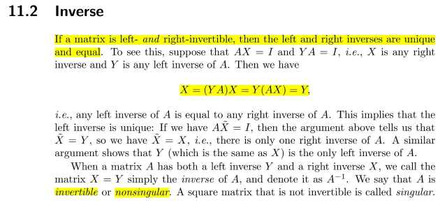
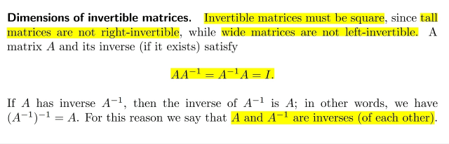
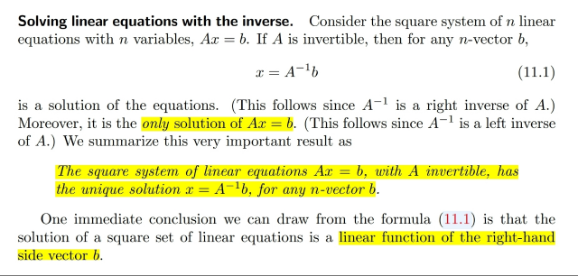
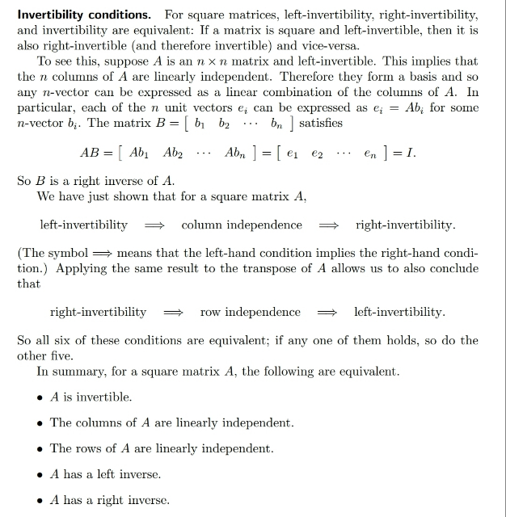
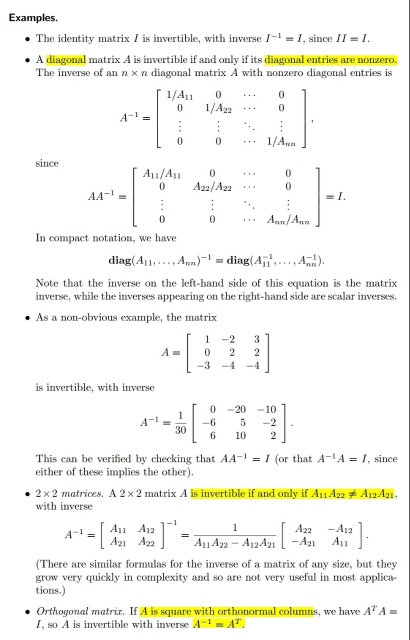
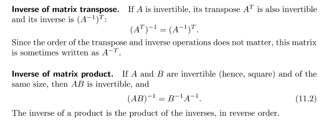
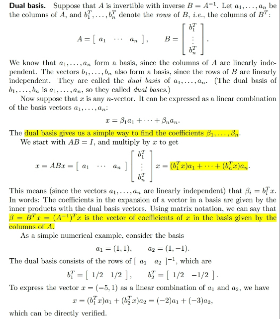
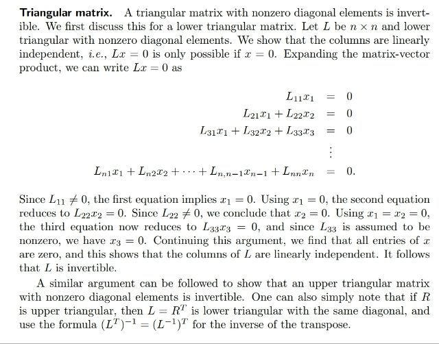
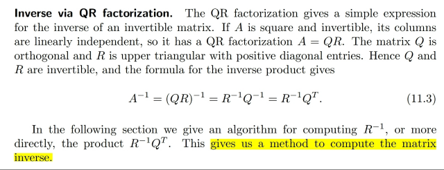

# 11.2 Inverse

📊 **Progress:** `10` Notes | `9` Screenshots

---

<kbd></kbd>

> [!NOTE]
> Đại khái là nếu left inverse và right inverse tồn tại thì A
> invertible / full rank và left inverse và right inverse là
> 1.

 

<kbd></kbd>

> [!NOTE]
> Cái này biết rồi, invertible matrix phải square.
>
> Theo lập luận ở đây thì vì A mập lùn thì nó không left invertible. Vì
> sao? Vì mập lùn thì sẽ dư cột tự do, nên các cột không độc lập mà
> đây là điều kiện cần và đủ để matrix left invertible
>
> Tương tự matrix cao ốm thì các hàng không độc lập nên cũng ko
> full row rank

 

<kbd></kbd>

> [!NOTE]
> Đại khái là với hệ Ax=b invertible matrix A, thì x=Ainvb là nghiệm
> duy nhất với mọi b
>
> Review một chút, từ 1806 ta biết matrix A sẽ map một vector trong
> Rm với vector trong Rn. Nếu x là nonzero thuộc rowspace của A thì
> Ax sẽ là nonzero vector của columns space. Nếu x là nonzero
> vector trong nullspace của A thì Ax sẽ bằng 0. Và rowspace và
> nullspace orthogonal complement. Điều này có nghĩa là m-vector
> bất kì trong Rm khi project lên rowspace thì phần dư residual nằm
> trong nullspace. Để rồi phần nằm trong rowspace thì được map với
> vector trong column space còn phần trong nullspace thì suy biến
> thành 0.
>
> Do đó, khi A full column rank và full row rank thì nullspace và left
> nullspace chỉ có zero. Thành ra mọi vector Rm khác zero đều thuộc
> rowspace và nó được map 1:1 với nonzero vector thuộc columns
> space.
>
> Và Ainv chính là matrix map 1:1 ngược lại một vector trong
> columns space về vector trong rowspace

> [!NOTE]
> Nói thêm về hệ Ax=b với A mập lùn, có vô số nghiệm x_particular
> +c*x_null
>
> Mình muốn lập luận để thấy rõ hơn là x_particular là vector trong
> rowspace, là projection của x_complete lên rowspace của A.
>
> Ta đã biết projection onto C(A) matrix sẽ là: A(ATA)invAT
>
> Lập luận lại: residual sẽ vuông góc với C(A):
>
> AT(Ax-b)=0 <=> ATAx=ATb
>
> <=> x=(ATA)invATb
>
> => p = Ax = A(ATA)invATb
>
> Nên projection onto columnspace  C(A) matrix sẽ là:
>
> P_ontoC(A) = A(ATA)invAT
>
> (Và (ATA)invAT chính là left inverse A_left inverse)
>
> Nên projection onto rowspace C(AT) sẽ là:
>
> P_ontoC(AT) = AT(AAT)invA
>
> (Và AT(AAT)inv chính là right inverse, nên Projection onto rowspace
> C(AT) = A_right inverse A)
>
> vậy nếu x_c (x_complete) là complete solution của Ax=b, thì
> x_particular sẽ là projection của x_c lên rowspace C(AT):
>
> x_p = P_ontoC(AT)*x_c
>
> = AT(AAT)invA*x_c
>
> Để rồi Ax_p=AAT(AAT)invAx_c=Ax_c=b
>
> Điều này chứng tỏ rằng right inverse matrix AT(AAT)inv chính là
> matrix cái giúp project x complete lên rowspace AT(AAT)invAx

 

<kbd></kbd>

> [!NOTE]
> Đại khái là ở đây lập luận rằng nếu matrix left invertible và
> vuông thì nó cũng right invertible.
>
> Cái này nếu lập luận theo kiểu 1806 thì là vì khi A square có
> shape m, n với m=n và left invertible thì các cột sẽ độc lập. Nên
> rank=n, cũng bằng m. Nên  nó cũng ful row rank nên sẽ right
> invertible
>
> Còn lập luận ở đây là vì có đủ n cột nên ta có đủ m (n=m) basis
> vectors của Rm, nên có thể span Rm. Vậy mọi vector trong Rm
> đều có thể thể hiện bằng linearly combine các A columns, kể cả
> các standard unit vectors.Gọi B là matrix các cột là các
> coefficients giúp combine linearly các cột của A cho ra các
> standard unit vector ta sẽ có AB=I
>
> Từ đó chứng minh A right invertible với B là right inverse

 

<kbd></kbd>

> [!NOTE]
> Diagonal matrix invertible nếu các
> components trên đường chéo khác 0. Từ
> 1806 ra đã biết rằng với diagonal matrix thì
> trên đường chéo chính là các eigenvalues.
> Nên các eigenvalue khác 0 thì chính là để
> det khác 0, khiến matrix invertible
>
> Với yêu cầu của matrix 2x2 cũng là để det
> khác 0

 

<kbd></kbd>

> [!NOTE]
> Rồi ở đây nói nếu A invertible thì AT cũng vậy. Thử giải thích tại
> sao : đơn giản là vì A invertible thì các hàng các cột đều độc lập.
> Nên AT cũng có các hàng các cột độc lập thành ra dĩ nhiên nó full
> rank.
>
> Và (AT)inv = (Ainv)T là vì:
>
> AAinv=AinvA=I
>
> Transpose hai vế :
>
> <=> (AAinv)T = (AinvA)T = I
>
> <=> (Ainv)TAT = AT(Ainv)T = I
>
> Từ đây suy ra (AT)inv chính là (Ainv)T
>
> Còn vì sao (AB)inv = BinvAinv (A,B invertible) 
>
> Vì: AB(AB)inv = (AB)invAB = I
>
> Equation 1 => Ainv = B(AB)inv <=> BinvAinv=(AB)inv 
>
> Hoặc equation 2 => Binv=(AB)invA
> => BinvAinv=(AB)inv (nhân phải hai vế cho Ainv)

 

<kbd></kbd>

> [!NOTE]
> Đây là cái mới so với 1806: đại khái là nếu a1,a2..là các
> cột của invertible matrix A, là một basis thì các row b'1,
> b'2...của B=Ainv cũng là môt basis và nó gọi là Dual basis
> của a1,..an.
>
> Tác dụng của nó đó là: như ta đã biết, nếu gọi shape của
> A là n,n thì các columns a1,..an là basis của Rn, nên mọi
> vector Rn đều là linear combination của các ai:
>
> u=c1a1+c2a2+...cnan = Ac
>
> Với c là vector (c1,..cn) là các coefficients.
>
> Thế thì dual basis của a1,...an sẽ giúp tính ra các ci:
>
> Xuất phát từ u= Iu = ABu
>
> Vậy Ac=Bu, nên c=Bu=Ainvu
>
> Vậy c1=(row 1 của B)Tu
>
> c2=(row 2 của B)Tu
>
> ...

 

<kbd></kbd>

> [!NOTE]
> Đại khái là ở đây ta lập luận để chứng minh triangular matrix (dĩ
> nhiên sẽ là square) thì nếu các diagonal entries khác 0 thì nó sẽ
> invertible. Ta có thể quen với cách lập luận rằng nếu điều này xảy
> ra thì mọi eigenvalue đều khác 0 nên det khác 0 => full rank.
>
> Nhưng ở đây lập luận khác: bằng cách xét Rx=0, thì vì là
> triangular matrix nên Rx sẽ là vector có components thứ 1 là
> R11x1. Ta có R11x1=0 và vì đã nói các diagonal entries khác 0
> nên R11 khác suy ra x1=0
>
> Lập luận tương tự với components thứ 2 của Ax, là
> R21x1+R22x2. Ta cái này bằng 0 thì vì R22 khác 0, nên suy ra x2
> phải bằng 0 (R12x1 bằng 0 rồi)
>
> Tương tự như vậy suy ra x3..xn bằng 0 hết chứng tỏ Rx=0 chỉ có
> trivial solution nên các columns của R độc lập => invertible
>
> Lập luận trên là với upper triangular matrix, thì với lower
> triangular matrix, L=RT, nên như đã biết R invertible thì RT cũng
> vậy

 

<kbd></kbd>

> [!NOTE]
> Đại khái là 1806 ít nhất là trong bài giảng ta ko / hình như chưa được
> học về cách tìm inverse
>
> Thế thì đại khái là nhờ **A=QR**, nên **Ainv=RjnvQinv**
>
> Với Q là **orthogonal** matrix thì **Qinv =QT** nên **Ainv=RinvQT**
>
> Từ đó giúp ta có thuật toán tìm inverse của A

 

