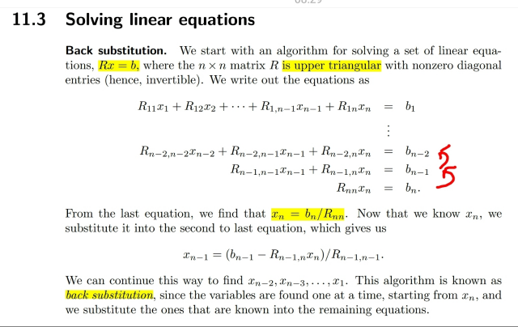
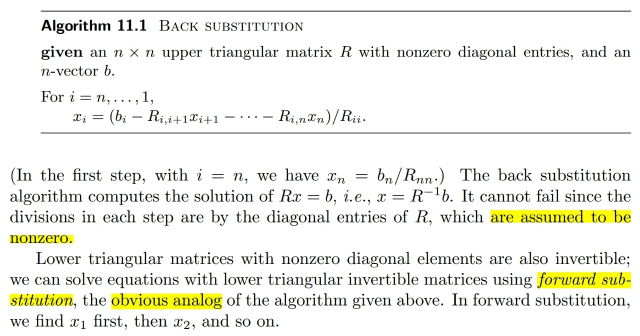
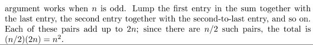
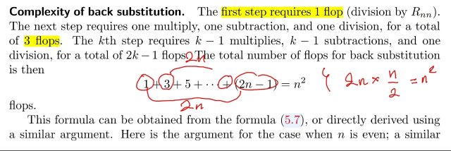
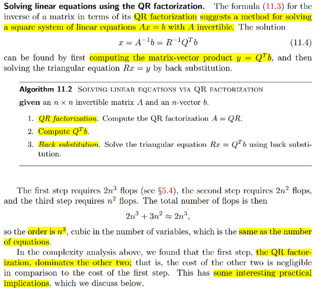
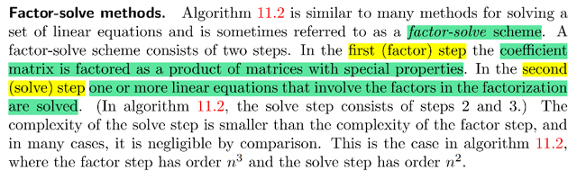

# 11.3 Solving linear equation

📊 **Progress:** `5` Notes | `7` Screenshots

---

<kbd></kbd>

> [!NOTE]
> Đại khái là như hồi học 1806, lúc đó ta học về Gaussian elimination,
> để đưa A về row echelon form, từ đó xác định được cột nào là pivot,
> ứng với pivot variable, cột nào là free, ứng với free variables. Để rồi khi
> giải Ax=b, ta cũng khử Gauss với augmented matrix A|b, từ đó, với các
> free variables, ta sẽ gán giá trị 1 cho một cái và 0 cho các cái còn lại.
> Và back-substitute để có thể giải ra các pivot variables.
>
> Thế thì khi ta có A full rank, thì A|b sẽ trở thành U|b', với U là upper
> triangular matrix. Lúc này chỉ việc tiến hành quá trình back substitution
> giải x_n, x_n-1, ....x_1
>
> Hiểu thế này Ux=b' thì với U là upper triangular matrix thì Ux là vector
> mà components lần lượt là dot product của các row của U với x.
>
> Và component thứ n sẽ là: hàng n của U dot product với x, mà hàng n
> của U chỉ có 1 non zero entries chính là U(n,n), từ đó ta có: U_(n,
> n)*x_n=b'_n, giúp ta giải ra x_n.
>
> Còn component thứ n-1 sẽ là: U(n-1, n-1)x_n-1 + U(n-1, n)xn = b'_n-1
>
> Vì đã biết x_n, và U(n-1,n-1) phải khác 0 vì (...) Nên giải ra x_n-1
>
> Thì ở đây cũng vậy, vì R là upper triangular nên hệ Rx = b sẽ có dạng
> như vầy, và cho phép ta tính xn, thế xn vào phương trình trước đó tính
> xn-1. Thế xn, xn-1 vào phương trình trên nữa tính xn-1. Đây gọi là
> BACK-SUBSTITUTION

 

<kbd></kbd>

> [!NOTE]
> Thuật toán sẽ là như vầy, ko có gì khó hiểu chỉ là như mô tả vừa rồi.
>
> Với lower triangular matrix Rx=b thì
>
> Components 1 của Rx sẽ là x1R(1,1)=b1 nên thay vì back substitution tính
> xn, rồi xn-1 ..x2, x1 thì nay ta tính x1 trước, rồi thế vào equation 2 tính x2,
> thế x1, x2 vào equation 3 tính x3...cho đến khi tính xn.
>
> Ở đây có điểm họ nói thuật toán này không thể fail vì mỗi step ta có phép
> chia cho Rii được assume khác 0. 
>
> Nếu matrix là lower triangular matrix thì việc giải Lx = b sẽ  bắt đầu từ tính
> x1 trước, thế vào equation sau tính x2, ...Nên đây gọi là FORWARD 
> SUBSTITUTION

 

<kbd></kbd>

<kbd></kbd>

<kbd></kbd>

> [!NOTE]
> Đại khái là ta có thể tính complexity của back substitution là n^2.
>
> Vì sao:
>
> bước 1 Rnnxn=bn, suy ra xn = bn/Rnn tốn một phép chia scalar. Tức
> **1 flops**
>
> Bước 2 Rn-1n-1xn-1+Rn-1nxn=bn-1
>
> Suy ra xn-1=(bn-1 **-**Rn-1 *****xn) **/**Rn-1
>
> Ta sẽ tốn 3 phép nhân, trừ, chia nên tốn **3 flops**
>
> Tương tự bước thứ 3 sẽ tốn 2 phép nhân, 2 trừ, 1 chia: **5 flops**
>
> Khái quát lên bước thứ n sẽ tốn n-1 nhân, n-1 trừ, 1 chia: 2n-1
> flops
>
> Vậy thành ra tốn **1+3+...(2n-1)**
>
> Để tính cái này thì ta sẽ thấy có n hạng tử, nên ghép đầu cuối sẽ
> có n/2 cặp. Mỗi cặp tổng bằng 2n.
>
> Vậy kết quả là 2n*(n/2) = **n^2**

 

<kbd></kbd>

> [!NOTE]
> Rồi đại khái là từ công thức 11.3: QR factorization A = QR thì cho phép ta
> có Ainv = RinvQinv, với Q là orthogonal matrix Qinv = QT ⇨ Ainv = RinvQT
>
> Cái này cho ta một cách để giải Ax = b ⇔ x = Ainvb = RinvQTb
>
> Đó là đầu tiên ta sẽ QR factored matrix A
>
> Sau đó tính y = QTb
>
> Cuối cùng tính x = Rinvy
>
> - QR factor với  thì tốn **2n^3** (**2nk^2** với k là số independent columns, ở đây
> là n vì A full rank)  (cái này có phân tích trong phần QR factorization, link
> xanh)
>
> - Tính y = QTb: Q là matrix nxn, b là Rn vector. Mỗi component của QTb sẽ
> là dot product của columns của Q và b: Tốn n + n - 1 = 2n - 1 flops ⇨ tổng
> cộng là (2n - 1)n = 2n^2 - n ≈ **2n^2**
>
> - Tính Rinvy, đây chính là giải Rx = y, với R là upper triangular thì đây là
> back - substitution, tốn **n^2** flops như vừa phân tích xong
>
> Vậy tổng cộng là **2n^3 + 3n^2 coi như 2n^3
>
> Và kết qủa này cho thấy bước factorization chiếm phần lớn chi phí**

 

<kbd></kbd>

> [!NOTE]
> Đại khái là cái này đã biết trong Appendix của C của Convex Optimization
> nói về factor-solve method. Đại ý là để giải Ax = b, đầu tiên ta sẽ factor 
> A thành tích các matrix có cấu trúc đặc biệt A1A2...Ak
>
> Sau đó giải Ax = b là giải A1A2...Akx = b. Chính là lần luợt giải A1z1 = b
> ra z1. Sau đó giải A2z2 = z1, ra z2. Giải A3z3 = z2....Cuối cùng giải Akx = zk-1

 

