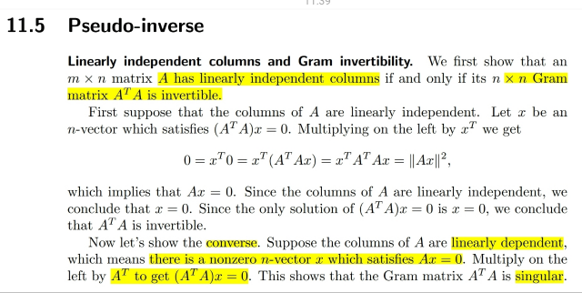
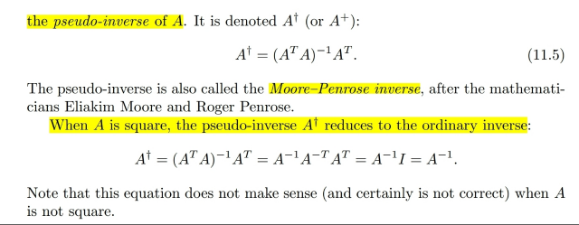
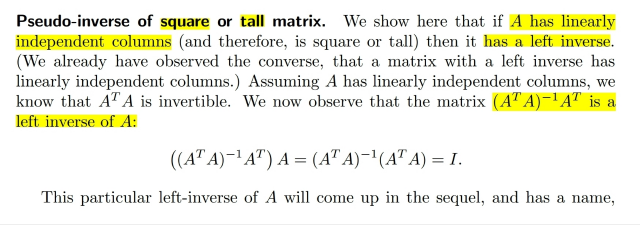
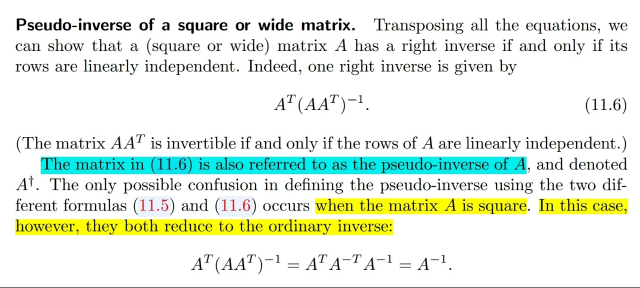
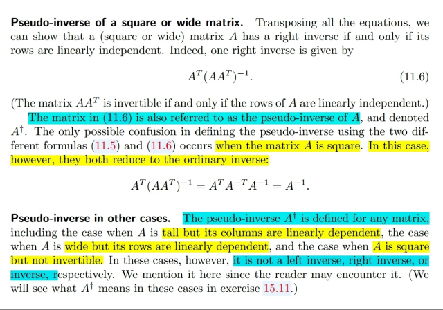
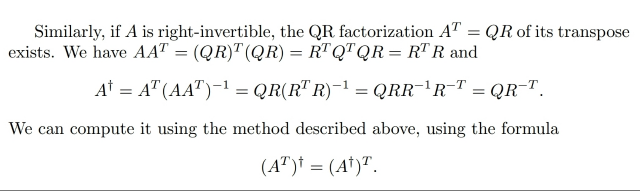
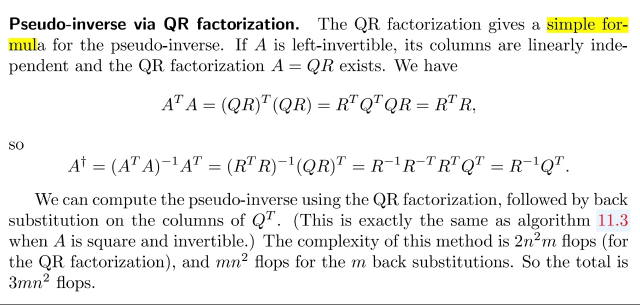
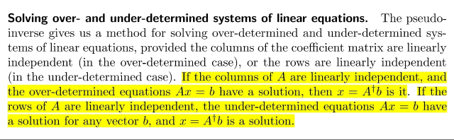
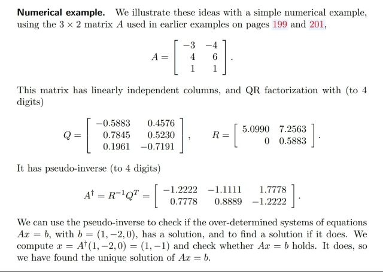

# 11.5 Pseudo inverse

📊 **Progress:** `7` Notes | `11` Screenshots

---

<kbd></kbd>

> [!NOTE]
> Đại khái là gs chứng minh một điểm mà 1806 ta đã học, cũng
> như nói lại nhiều lần.đó là A full column rank sẽ tương đương
> ATA full rank.
>
> Cái này ta đã chứng minh lại theo cách riêng ở phần least
> square.

 

<kbd></kbd>

<kbd></kbd>

<kbd></kbd>

> [!NOTE]
> Thế thì như đã nói hồi nãy. Ta sẽ solve normal equation bằng pseudo
> inverse A+. Và khi ta có matrix cao ốm với các cột linearly
> independent, tức A full column rank thì ATA full rank nên invertible
> khi đó A+ chính là left inverse: ATA_invAT (nhân vào bên trái của A
> sẽ cho ra I)
>
> Và nó giúp tìm ra unique solution của normal equation ATAx=ATb,
> cũng là uniquely least square solution
>
> Một điểm có thể ta chưa để ý trước đây đó là khi A full rank thì left
> (và cả right) inverse sẽ trở thành A_inv
>
> Cụ thể là (ATA)_invAT =
>
> (AinvATinv)AT = Ainv(ATinvAT) = Ainv

 

<kbd></kbd>

> [!NOTE]
> Đại khái là khi matrix mập lùn có các independent row (full row
> rank) khi đó AAT invertible thì A+ chính là right inverse
> AT(AAT)_inv
>
> Và khi A full rank thì nó cũng trở thành Ainv:
>
> AT(AAT)inv = ATATinvAinv = Ainv

 

<kbd></kbd>

> [!NOTE]
> Và cuối cùng như đã biết từ 1806, pseudo inverse vẫn tồn tại với
> cả khi A ko full rank /full column rank / full row rank

 

<kbd></kbd>

<kbd></kbd>

<kbd></kbd>

> [!NOTE]
> Chỗ này ta sẽ quay lại sau khi xem  về QR factorizations. Nhưng có
> thể hiểu là vầy:
>
> Dựa vào A=QR: ATA = (QR)T(QR) = RTQTQR = RTR (QTQ=I, Q là
> orthogonal matrix)
>
> Left inverse = (ATA)invAT = (RTR)inv(QR)T=RinvRRTQT=RinvQT
>
> Right inverse tương tự sẽ = QRinv

 

<kbd></kbd>

> [!NOTE]
> Ở đây nói về việc pseudo inverse giúp giải Ax=b khi có hoặc ko
> có solution ta có thể tóm tắt lại như vậy
>
> x=(A^+)b=(ATA)invATb
>
> Ax=b
>
> 1) A full rank, thì x=Ainvb, nghiệm duy nhất (A+ / left hay right
> inverse cũng là Ainv)
>
> 2) A full column rank, b thuộc C(A), hệ có nghiệm duy nhất vì b
> thuộc C(A) và N(A)={0}.
>
> Thì x=(A+)b=(ATA)invATb. A+ chính là left inverse
>
> 3) A full column rank, b không thuộc C(A), hệ vô nghiệm.
>
> Thì x^=(A+)b=(ATA)invATb là least square solution.
>
> 4) A không full column rank (kể cả square).Thì lúc này trường
> hợp đài tiên cũng y như hai trường hợp (3) đó là nếu b không
> thuộc C(A) tức hệ vô nghiệm thì x^=(A+)b sẽ là least square
> solution.
>
> Chú ý là, khác với case (3), (A+) lúc này không phải left inverse vì
> các cột dependent nên ATA không full rank dẫn đến left inverse
> không tồn tại. Nhưng ta vẫn có thể tìm A+ theo SVD
>
> Còn khi b thuộc C(A) thì khác với case 2 ở chỗ lúc này các cột
> dependent nên sẽ có x_null. Do đó hệ có vô số nghiệm.
>
> Lúc này x=(A^+)b chính là solution có norm nhỏ nhất (least norm
> solution)
>
> Cái này cũng vậy, A^+ không phải left inverse

 

<kbd></kbd>

> [!NOTE]
> Cuối cùng là 1 ví dụ,
> chưa xem kĩ

 

