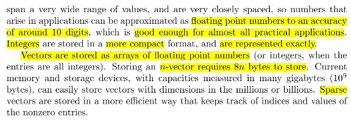
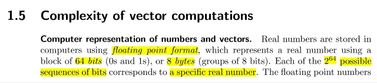
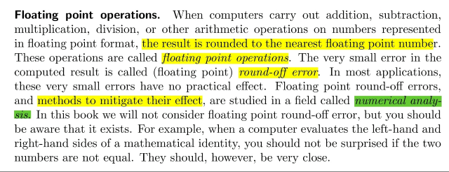
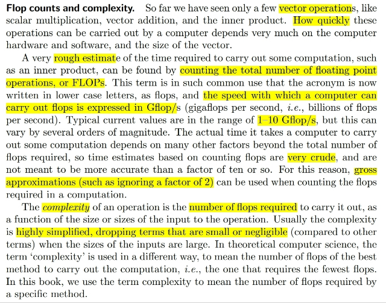
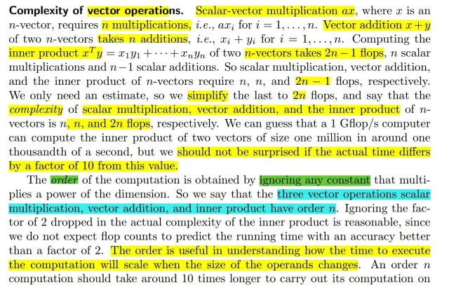
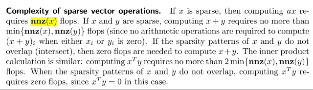

# 1.5 Complexity of vector computations

📊 **Progress:** `4` Notes | `7` Screenshots

---

<kbd></kbd>

<kbd></kbd>

<kbd></kbd>

> [!NOTE]
> Đại khái là như ta đã học trong cs50 về việc máy tính sẽ lưu
> trữ thông tin dưới dạng nhị phân.
>
> Ví dụ với số, cụ thể là số nguyên integer, thì thường máy tính
> sẽ dành 4 byte tương ứng 32 bits để lưu trữ một số nguyên.
>
> Thế thì với số thực, thì nó dành 8 bytes, tương ứng 64 bits.
>
> Đại khái là do đó, nếu ta có vector có n components chứa số
> thực thì sẽ cần 8n bytes.

 

<kbd></kbd>

> [!NOTE]
> Đại khái là khi máy tính thực hiện các operations như cộng trừ nhân
> chia thì nó sẽ thực hiện làm tròn các số thập phân
>
> Cái đó gọi là floating point operations (flops)
>
> Và vì làm tròn nên nó sẽ có sai sót nhỏ gọi là round off error.
>
> Và ta biết thêm môn Numerical Analysis là môn sẽ phân tích sâu
> vào các phương pháp giảm round off error này

 

<kbd></kbd>

> [!NOTE]
> Đại khái là, để mà biết chính xác máy tính nó tính một phép
> tính vector ví dụ nhân dot product hai vectors thì còn tùy thuộc
> nhiều yếu tố. Nhưng ta có thể ước lượng  bằng cách đếm số
> floating point operations, từ đó nhân với tốc độ xử lý một
> operations để biết sơ sơ thời gian tính toán của máy tính.
>
> Dĩ nhiên máy tính thì tính rất nhanh, khả năng của nó phải đo
> bằng Tỷ flop / giây (G-flops/s)
>
> Cũng vì như đã nói ta chỉ ước lượng chứ để tính chính xác cần
> nhiều yếu tố nên ta cũng ko cần quá khắt khe với việc tính số
> flops, có thể bỏ qua những phần nhỏ đại khái vậy.
>
> Và số flops sẽ được gọi là Complexity

 

<kbd></kbd>

> [!NOTE]
> Đại khái là ko khó để thấy nhân scalar với n-vector cần n flops.
> Cộng hai vectors tốn n flops. Dot product hai vectors tốn 2n-1
> flops,  và có thể bỏ qua nhỏ nhặt để cho là 2n flops.
>
> Tuy nhiên người ta bỏ đi constant để coi 2n là n, để chỉ quan tâm
> n thôi. Thì đó gọi là **order**.
>
> Thành ra 3 operations trên đều là order n

 

<kbd></kbd>

 

