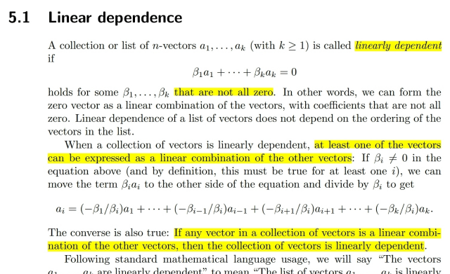
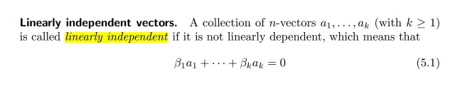
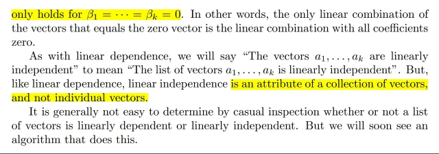
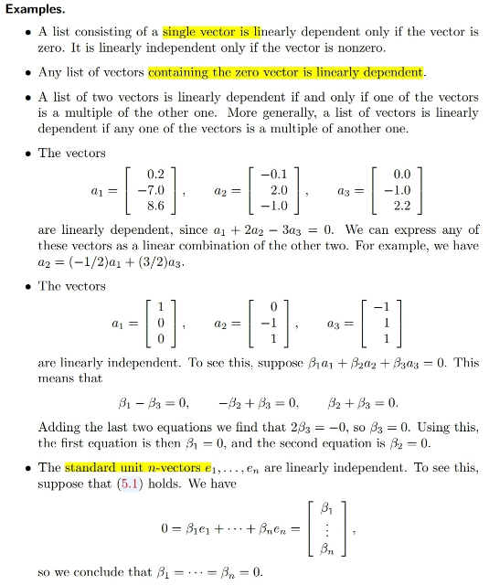
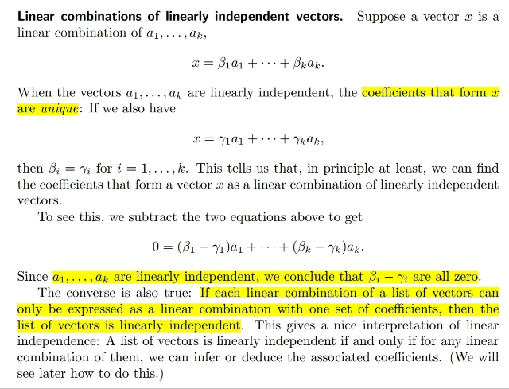
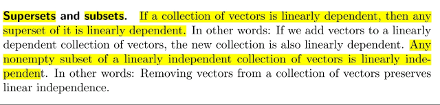

# 5.1 Linear Independent

📊 **Progress:** `5` Notes | `7` Screenshots

---

<kbd></kbd>

> [!NOTE]
> Đại khái là ta review lại khái niệm linear dependent đã học
> trong
> 1806. Theo định nghĩa nếu tồn tại bộ coefficients sao cho ít
> nhất có một cái khác 0 để linear combine các vector xi để
> cho ra 0 thì bộ vectors xi đó là linear dependent
>
> Và cũng dễ hiểu, khi đó có thể chứng minh rằng ít nhất một
> vector trong set sẽ là linear combination các vectors còn lại.
>
> Nói chung ko có gì mới

 

<kbd></kbd>

<kbd></kbd>

<kbd></kbd>

> [!NOTE]
> Ngược lại nếu chỉ có bộ coefficients zero hết mới giúp linearly
> combine các vector xi thành 0 thì ta nói chúng là bộ vector
> linearly independent
>
> Gs cũng lưu ý khái niệm dependent /independent là dành cho
> set các vectors chứ ko phải độc lập

 

<kbd></kbd>

> [!NOTE]
> Vài ví dụ trong đó đáng để tâm đến set vector nếu có zero
> vector thì sẽ dependent, vì sao nhỉ: là vì khi đó chỉ cần dùng set
> các coefficients sao cho toàn 0 trừ 1 cái khác 0 gắn với vector
> zero thì ta sẽ có linear combination ra 0
>
> Từ đó thỏa định nghĩa linear dependent
>
> Điểm đáng suy ngẫm thứ hai là set các standard unit vector ei.
> Tại sao nó linear dependent? Là bởi với standard unit thì ta có
> thể express vector x có tọa độ (a1,a2..an) bởi ei: a1e1+a2e2+..
> Thế thì x = 0 tức mọi tọa độ ai đều bằng 0, và dĩ nhiên điều này
> đồng nghĩa coefficients trong linear combination các ei bằng
> 0. Do đó với standard unit ei thì linearly combine chúng ra 0 chỉ
> khi coefficients bằng 0 hết. Nên thỏa định nghĩa dependent

 

<kbd></kbd>

> [!NOTE]
> Đại khái là ta sẽ nói về một tính chất đó là nếu ta có set các vector
> độc lập ui thì với nếu x là  linear combination của ui thì coefficients
> là duy nhất.
>
> Không thể có coefficients set khác mà linearly combine ui cho ra x
> đó được. Cái này cũng dễ chứng min: đại khái là giả sử cùng vector x
> mà có hai linear combination với hai coefficients set khác nhau:
> x=sum aiui, x=sum biui Thì trừ hai equation vế theo vế, ta sẽ có
> 0=sum (ai-bi)ui. Để rồi vì ui độc lập nên theo định nghĩa (ai-bi) phải
> bằng 0 (với mọi i) => ai=bi => coefficients set là duy nhất

 

<kbd></kbd>

> [!NOTE]
> Đại khái là ta sẽ có tính chất đó là Nếu ta có bộ vectors không độc
> lập thì superset của nó, tức add thêm vector tạo bởi linearly
> combinations của các vector trong set cũng sẽ dc một set
> dependent
>
> Ngược lại, nếu đang có set độc lập, lấy ra bớt vector ta sẽ vẫn dc set
> độc lập

 

