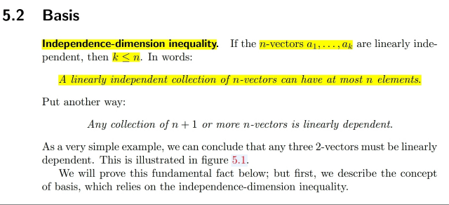
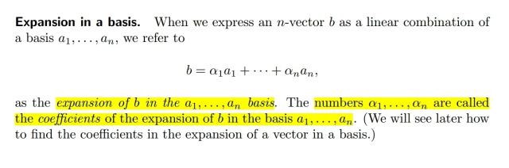
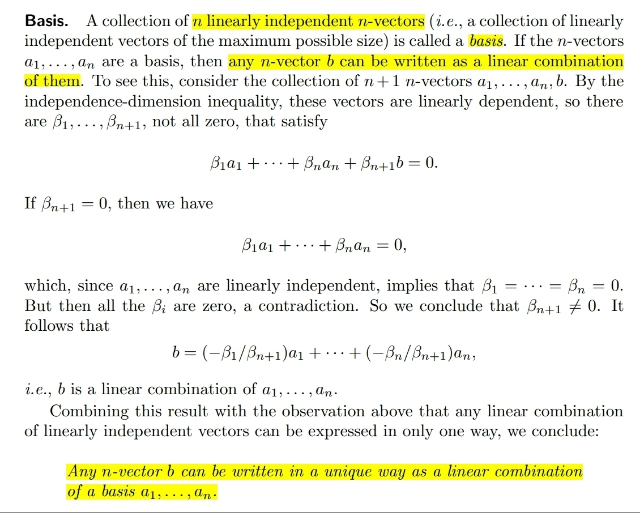
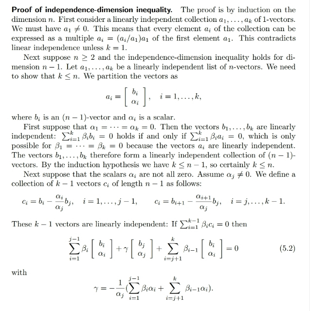

# 5.2 Basis

📊 **Progress:** `2` Notes | `5` Screenshots

---

<kbd></kbd>

> [!NOTE]
> Ở đây nói về một cái mà ta đã học từ 1806 đại khái là, nếu xét
> các n-dimensional vector, thì một basia của R^n phải có đúng
> n vector. Nhiều hơn thì thành set vectors dependent mà ít hơn
> thì không đủ span R^n.
>
> Còn ở đây, người gọi nó là tính chất dimension inequality : số
> vector một n-vectors độc lập phải nhỏ hơn hoặc bằng n

 

<kbd></kbd>

<kbd></kbd>

<kbd></kbd>

> [!NOTE]
> Ta sẽ dựa vào independence - dimension inequality để chứng minh
> rằng mọi n-vector đều là linear combination của các vectors trong
> basis.
>
> Giả sử có basis của R^n: {u1,...un} Thì khi thêm một n-vector v bất kì,
> ta có set chứa n+1 vectors, và theo independence dimension
> inequality theorem, nó nói rằng set n+1 vector này dependent.
>
> Do đó theo định nghĩa dependent vectors, sẽ tồn tại set coefficients
> khác 0 giúp combine chúng thành 0 (1)
>
> a1u1+a2u2+..anun+bv=0
>
> Có thể kết luận b phải khác 0, vì nếu b bằng 0, thành ra a1u1+...
> anun=0 mà u1,.. un là basis thì a1,...an phải bằng 0 hết mâu thuẫn với
> kết luận (1)
>
> Vậy b khác 0, nên chuyển vế đổi dấu và chia hết hai vế cho b ta sẽ có
> v là linear combination của ui.
>
> Từ đó giúp chứng minh xong rằng v bất kì đều là linear combination
> của basis vector

 

<kbd></kbd>

 

