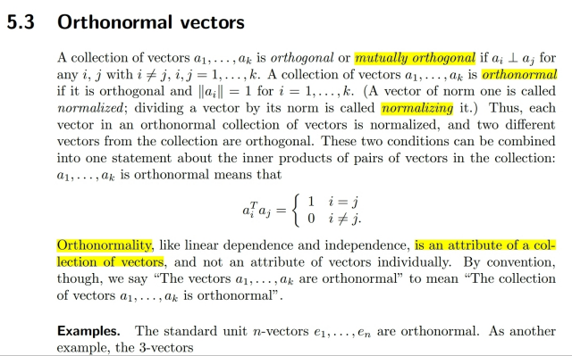
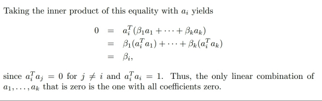
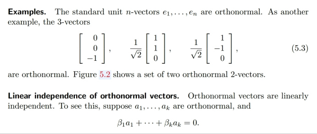
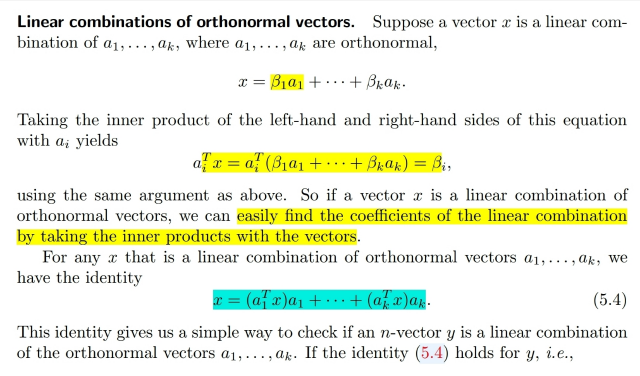
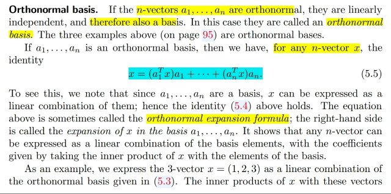

# 5.3 Orthonormal vectors

📊 **Progress:** `4` Notes | `6` Screenshots

---

<kbd></kbd>

> [!NOTE]
> Ko có gì mới, đã biết từ 1806, các
> khái niệm orthogonal vectors,
> orthonormal vectors

 

<kbd></kbd>

<kbd></kbd>

<kbd></kbd>

> [!NOTE]
> Cái này tuy ko có gì phức tạp nhưng cũng đáng để ý, đó là chứng minh
> set orthogonal vector thì sẽ independent.
>
> Như định nghĩa, để chứng minh set vectors independent thì chỉ cần
> chứng minh nếu linear combination của chúng bằng 0 thì các
> coefficients phải bằng 0.
>
> Thế thì ta bắt đầu từ a1q1+...akqk=0, bằng cách dot product hai vế cho
> q1 ta sẽ có a1q1Tq1+a2q2Tq2+...akqkTqk=0
>
> Và vì orthogonal nên còn lại a1||q1||^2=0 suy ra a1 bằng 0.
>
> Làm tương tự với mọi ai ta cũng chứng minh mọi ai đều bằng 0

 

<kbd></kbd>

> [!NOTE]
> Đây là điểm quan trọng về orthonormal vectors mà ta cũng đã học
> trong 1806 đó là: giả sử ta có orthonormal vectors q1, q2..qk thì xét x
> là một linear combination của chúng: x=a1q1+a2q2+...akqk
>
> Thì điểm quan trọng là a1 chính là x1Ta1.Vì sao? Chỉ cần dot product
> hai vế với q1:
>
> q1Tx1=a1q1Tq1+a2q1Tq2+...
>
> <=> q1Tx1 = a1*1+0+..0
>
> <=> a1 = q1Tx1
>
> Như vậy khi x là linear combination của orthonormal vectors qi thì
> coefficients chính là dot product của x với qi
>
> Từ đó:
>
> x = (q1Tx)q1+(q2Tx)q2+...

 

<kbd></kbd>

> [!NOTE]
> Dĩ nhiên nếu có đủ n (orthonormal n-vectors) thì ta sẽ có basis lúc
> đó mọi vector trong Rn đều có thể express bởi basis vectors với
> coefficients là dot product của nó với các orthonormal basis vectors
>
> x=(q1Tx)q1+(q2Tx)q2+...(qnTx)qn
>
> Và nó gọi là orthonormal expansion

 

