# 5.4 Gram-Smidth algorithm

📊 **Progress:** `3` Notes | `13` Screenshots

---

<kbd>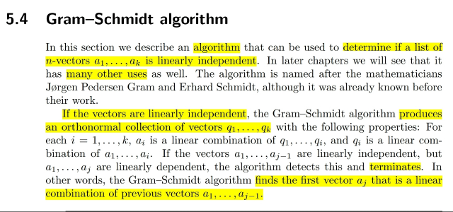</kbd>

> [!NOTE]
> Có 1 điểm khác / mới so với 1806 về GS đó là ở đây gs nói rằng nó có
> thể mang tác dụng detect các vector độc lập bên cạnh việc tạo set các
> orthonormal vectors từ các vector ban đầu.
>
> Nói chung khi chạy thuật toán này, khi các vectors còn độc lập thì nó
> sẽ tạo bộ các vector orthonormal còn khi phát hiện vector dependent
> thì nó sẽ stop

 

<kbd>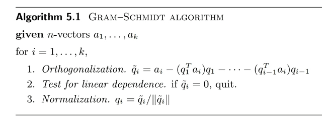</kbd>

> [!NOTE]
> Chap 5 ta đã biết, với orthonormal vectors q1,q2..qk thì ta có thể
> orthonormal expansion vector x (là linear combination của qi) như
> sau: x=(q1Tx)q1 + .. (qkTx)qk
>
> Trong đó, điểm đặc biệt đó là khi linearly combine các orthonormal
> vectors thì coefficients lại chính là dot product của x với các vectors
> đó.
>
> Còn một cái nữa ta có thể ôn lại rằng việc project vector x lên vector
> a: (x-ax^)Ta=0 <=> xTa-ax^Ta=0 <=> xTa=ax^Ta <=> x^aTa = aTx <=> x^
> = aTx/aTa
>
> Projection của x lên a sẽ là ax^
>
> Nếu a là q, tức unit norm thì x^ = qTx, và projection sẽ là qqTx =
> (qTx)q
>
> (Vì qTx là scalar nên có thể di chuyển tùy ý)
>
> Thế thì có thể thấy (q1Tai)q1 chính là projection của ai lên q1.
>
> Do đó ai - (q1Tai)q1 - (q2Tai)q2...(qi-1Tai)qi-1 là ta lấy ai và trừ đi hết
> các projection của ai lên các q1, q2...qi-1, để phần dư còn lại sẽ gán
> cho qi.
>
> Thế thì chỗ này có thể làm rõ một chút, liên hệ với 1806, trong đó nói
> là GS sẽ từ set independent vectors ai tạo ra set orthonormal vectors
> qi. Bằng cách cho q1=a1, q2=phần dư khi project a2 lên q1.q3 bằng
> phần dư khi chiếu a3 lên span(q1, q2)...Thì ta sẽ xem nó có giống với
> algorithm mô tả ở đây (là qi là phần dư khi lấy ai trừ projection của ai
> lên từng q1,q2...qi-1 hay không)
>
> Xét subspace span bởi q1,q2, tức column space của matrix [q1 q2].
> Thế thì như đã biết, projection onto C(A) matrix là P=A(ATA)invAT, và
> projection của b lên C(A) là A(ATA)invATb.
>
> Thế thì A ở đây với hai cột orthonormal thì A là matrix với orthogonal
> nên ATA=I
>
> Nên projection lên C(A) là AATb
>
> Xét ATb nó sẽ là vector có components là [q1Tb, q2Tb]:
>
> Nên A(ATb) = linear combination các A's columns (q1, q2) với
> coefficients là components của (ATb)
>
> AATb=(q1Tb)q1+(q2Tb)q2
>
> Thế thì ta có thể thấy, nếu project b lên q1, rồi q2, và tổng hai
> projection lại ta sẽ có:
>
> b projected lên q1: (q1Tb)q1
>
> b projected lên q2: (q2Tb)q2
>
> (q1Tb)q1+(q2Tb)q2
>
> Như vậy có thể thấy việc project vector x lên span(q1,q2...qi-1) với q1,
> q2,...qi-1 là orthonormal set sẽ giống với project x lên từng qi và cộng
> lại.
>
> Và qua đó cũng có thể thấy qi sẽ orthogonal với q1,..qi-1 là bởi vì đã
> nói qi là phần dư của ai sau khi trừ các projection của nó lên q1,q2...
> qi-1 thì cũng đồng nghĩa ai trừ projection của nó lên span(q1,..qi-1)
> mà ta biết phần dư của projection sẽ phải vuông góc với subspaces
> span(q1,...qi-1). Nên nó dĩ nhiên vuông góc với mọi vector trong
> subspace q1,..qi-1

> [!NOTE]
> Tiếp ta sẽ hiểu một điểm nữa là khi làm tới vector ai nếu mà ra qi=0,
> thì thuật toán sẽ dừng với kết luận là ai không còn independent với a1,
> .. . ai-1.
>
> Tại sao: đơn giản là nếu qi=0 tức là
>
> ai-(q1Tai)q1-(q2Tai)q2-...(qi-1Tai)qi-1 = 0 (1)
>
> <=> mà q1,q2,..qi-1 là linear combination a1,a2..ai-1. Nên (1) có thể
> cho thấy ai là linear combination (dependent) của các a1,a2...ai-1
>
> Bước thứ 3 thì dễ rồi, nếu nó khác 0, thì chia cho norm của nó để có
> unit norm vector

 

<kbd>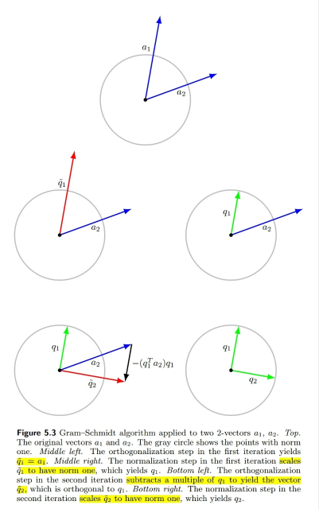</kbd>

 

<kbd>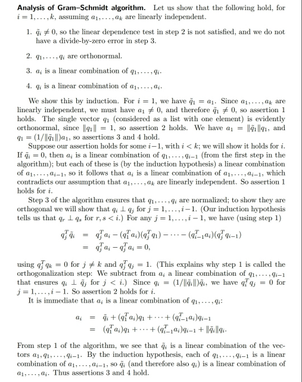</kbd>

 

<kbd>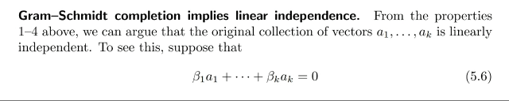</kbd>

<kbd></kbd>

<kbd>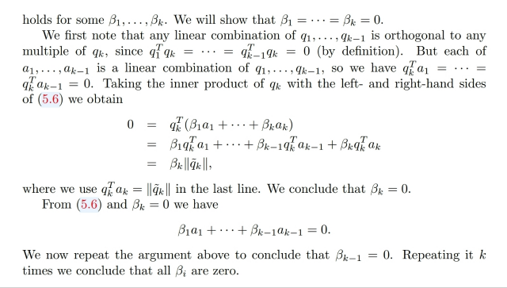</kbd>

 

<kbd>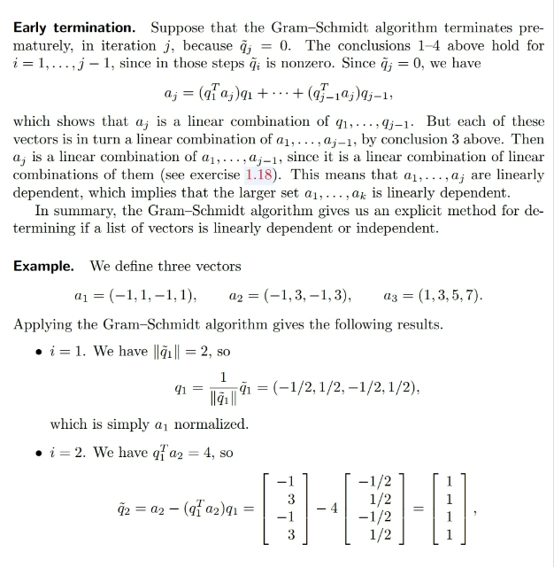</kbd>

 

<kbd>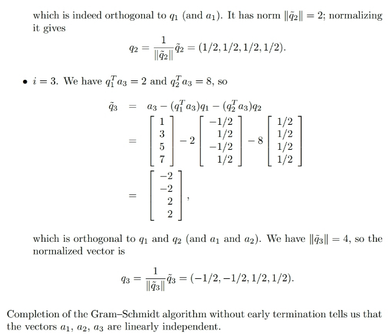</kbd>

 

<kbd>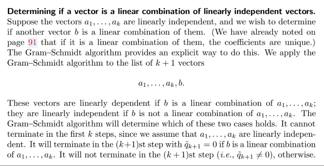</kbd>

 

<kbd>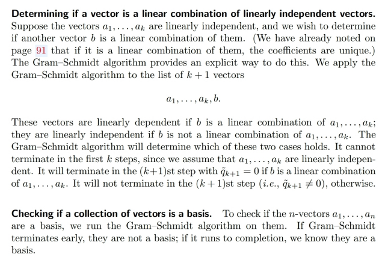</kbd>

 

<kbd>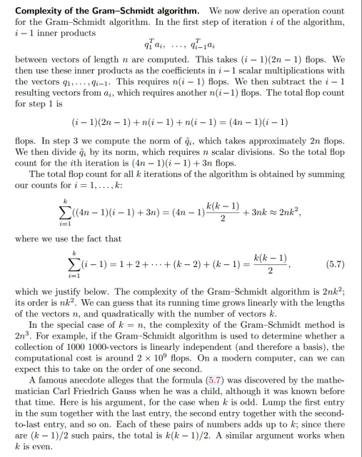</kbd>

 

<kbd>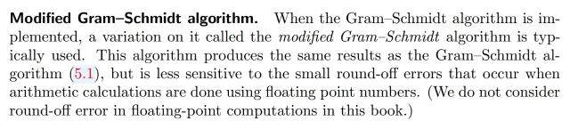</kbd>

 

