# Chap 12 Least squares

📊 **Progress:** `18` Notes | `31` Screenshots

---

<kbd>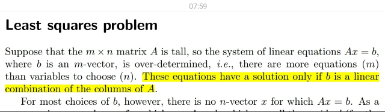</kbd>

> [!NOTE]
> Đại khái là ta sẽ có hệ các phương trình tuyến tính **Ax=b**. Trong đó
> **có nhiều phương trình hơn số biến**. Thể hiện bởi A là ma trận cao
> ốm. (Mà ở đây ta biết thêm là nó gọi là over-determined system - hệ
> quá định)
>
> Thế thì n**hờ 1806** ta biết, bản chất của việc giải Ax=b là tìm / x
> chính là **set coefficients giúp combine linearly các A columns để
> thành b**. Thế thì, như đã biết **nếu các columns của A không span
> đủ R^m** (vector b là Rm vector) thì sẽ**ko thể tìm được x**. Hay nói
> cách khác, **nếu b không nằm trong column space C(A)** (cũng chính
> là như ở đây nói b là linear combination của A columns) thì Ax=b sẽ
> vô nghiệm

 

<kbd>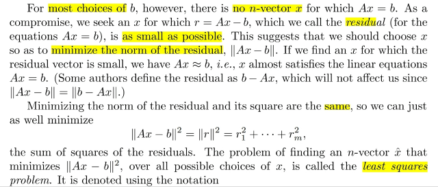</kbd>

> [!NOTE]
> Vậy thì với m > n, thì column của A nhiều nhất chỉ có thể span được
> một n-D subspace của R^m chứ không span được toàn bộ R^m. Do
> đó sẽ có rất nhiều điểm nằm ngoài subspace này mà không thể "với
> tới" được  bởi các basis của C(A)
>
> Nên mới nói **thường thường** **b sẽ ko nằm trong C(A)**, khi đó
> **không thể tìm thấy x solve Ax=b một cách tuyệt đối**.
>
> Khi đó ta có thể muốn**tìm x tốt nhất có thể**. Và tốt nhất ở đây đó
> là x sao cho **distance giữa Ax và b là nhỏ nhất**, cũng chính là**||Ax-b||**nhỏ nhất.
>
> Và vì f(u)=u^2 với u**ko âm là hàm đơn điệu tăng**, nên **minimize
> u^2 cũng là minimize u**. Nên ta sẽ tìm cách **giảm thiểu bình
> phương của Ax-b's l2 norm**. Và**||u||^2 = Σ ui^2** Thế thì đây là
> bài toán**least square**

 

<kbd>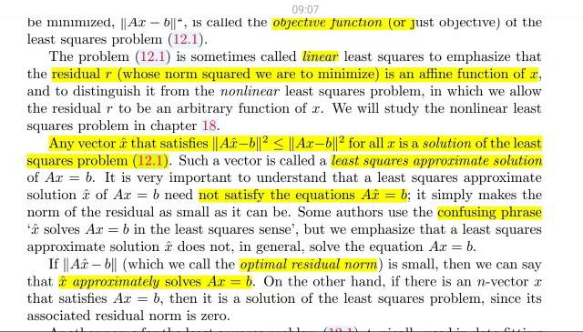</kbd>

> [!NOTE]
> Đại khái là, gs cho biết "cái mà ta muốn giảm thiểu" được gọi là
> **objective** **function**. Và ở đây, nó là **residual** (ám chỉ**Ax-b**) norm (tức ||Ax-b||) Thế thì điểm đáng chú ý là, residual r =
> Ax-b là một **affine function của x**. Nên đây cụ thể là bài toán
> **linear** least square. Gợi ý có thể có bài toàn **non linear** least
> square
>
> Một điểm đáng lưu ý nữa là gs nói **mọi x^ mà norm Ax-b là nhỏ
> nhất trong các x**, thì đều là least square solution. (Điều này gợi
> suy nghĩ rằng ko phải chỉ có một least square solution duy nhất) và
> nó có tên đầy đủ là "**least square approximation solutio**n"
>
> Cuối cùng gs lưu ý **một số tác giả nói theo kiểu x^ solve Ax=b**
> (mà gs Strang cũng từng nói kiểu này) thì phải hiểu thật ra **x^ chỉ
> là best approximated solution**, khiến Ax^ ≈ b thôi, chứ ko thật sự
> solve

 

<kbd>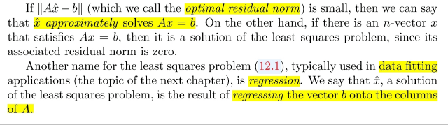</kbd>

> [!NOTE]
> Đại khái là trong bài toán này trong data fitting nó gọi là (Linear)
> Regression . Và cái tên này có ý nghĩa là, ta **regress (hồi quy) b về
> column space C(A)**, có thể cũng đồng nghĩa với **Projection b lên C(A)**

 

<kbd>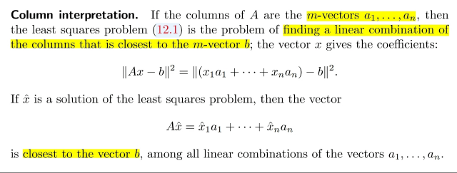</kbd>

> [!NOTE]
> Đại khái là cái này như đã biết từ 1806. Ý nghĩa hình học của bài
> toán least square, như đã nói hồi nãy đó là**tìm bộ coefficients
> (components của x) giúp tạo linear combination các columns của A
> để ra b**.
>
> Nên least square solution là**bộ coefficients sao cho ||Ax-b||  =
> ||x1a1+x2a2+.. . xnan - b|| nhỏ nhất**(ai là các columns của A, là các
> m-vectors tức m-dimensional vector)

 

<kbd>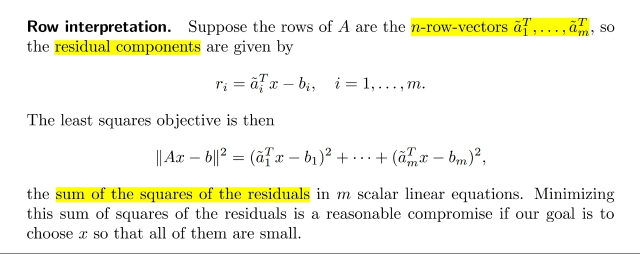</kbd>

> [!NOTE]
> Cái này đại khái là nói về**"cách nhìn" khác**, **theo row**. Ý là **Ax** sẽ
> là **vector có các components là dot product giữa A's row: ai~ và x**:
> ai~Tx, để rồi trừ cho bi sẽ mang ý nghĩa **residual ở dimension thứ i**:
> ai~Tx - bi. (Giống như "sai khác" ở dimension thứ i trong m dimension)
>
> Và việc **giảm thiểu (square) residual norm** mang ý nghĩa **giảm thiểu
> tổng bình phương "sai khác" ở mọi dimension**

 

<kbd>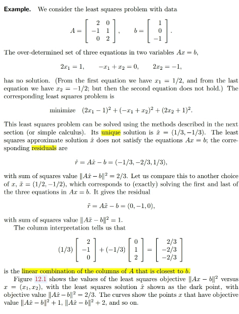</kbd>

> [!NOTE]
> Một ví dụ cho thấy Ax=b vô nghiệm khi b nằm ngoài C(A).
> Rõ ràng A chỉ có 2 cột, mà mỗi cột là một R^3 vector. Với
> việc xuất hiện cái patter 2 - 0, 0 - 2 mà mit 1806 gs Strang
> gọi là một identity matrix, thì có thể thấy ngay hai cột của A
> độc lập, tạo một basis giúp span một 2D plane trong R^3.
> Câu hỏi là b có nằm trong đó không? Nếu có thì hệ Ax = b
> sẽ có nghiệm, và là một nghiệm duy nhất (vì ko thể có hai
> cách linear combination một bộ basis mà cho ra b được, vì
> nếu có, thì đó ko phải basis, tức chúng ko độc lập) Ngược
> lại thì Ax = b ko thể có nghiệm chính xác, chỉ có  nghiệm
> least square, tức là điểm nằm trong C(A) mà gần với b
> nhất, hay, nói cách khác, đó là projection của b lên C(A)
>
> Thế thì họ mới giải ra (theo cách mà tiếp theo sau sẽ nói)
> và điều đáng chú ý là nghiệm này lại ko thỏa Ax = b, điều
> này ứng với case 1 ở trên vừa nói, là b nằm ngoài C(A)

 

<kbd>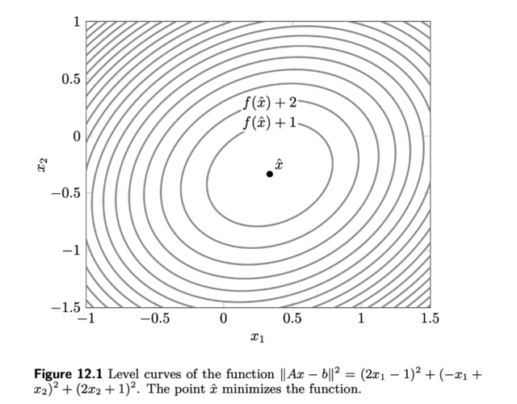</kbd>

> [!NOTE]
> Vài suy nghĩ về hinh ảnh này:
>
> đương nhiên đây là contour plot của hàm loss (objective) ||Ax - b||^2
>
> Đây là hàm bậc hai theo x, L(x) = (Ax - b)T(Ax - b) = xTATAx - bTAx - xTATb + bTb
>
> = xTATAx - 2bTAx + bTb, và dĩ nhiên (vì dạng của nó là square norm) nên ko âm
>
> Đồ thị của nó trong 3D space sẽ là khối chảo parabol
>
> Thế thì ở case mà optimal point x^ có optimal value > 0, nên đây là cái tô (paraboloid) NẰM TRÊN mặt  (plane) x1x2
>
> Ô thế thì, nếu x^ = 0 thì sao? Thì khi đó paraboloid này "vừa chạm" mặt x1x1 tại x^, và x^ là real solution của Ax = b, tức x^ = x =
> Ainvb Và những điều này chỉ xảy ra khi A invertible.
>
> À như vầy thì khi A invertible thì khối chảo này nằm tiếp xúc với mặt x1x2
>
> Nhận xét thêm, nếu mà mình dùng Newton method để giải  thì sao nhỉ?
>
> Phương pháp của Newton method, là tại một điểm, ta sẽ approx hàm số bởi hàm bậc hai, từ đó tìm minimum của hàm bậc hai
> đó, và dùng nó làm approximated cho true minimum. Và bước một bước Newton "tới đó". sau đó lại lặp lại quá trình. Thì vì dần
> dần, khi đến gần true optimal thì sử xấp sỉ bởi hàm quadratic sẽ ngày càng đúng, nên sự hội tụ về true optimal sẽ rất nhanh.
>
> Thế thì ở đây, cái hàm objective ..ĐÃ LÀ QUADRATIC RỒI. NÊN, XẤP XỈ BẬC HAI CỦA NÓ CŨNG LÀ NÓ. Nên việc mình tìm
> ra Newton step, chính là là tìm ra difference giữa x0 và x^, hay x* tức là optimal. Và chỉ một bước là nhảy tới đáy tô thật sự
>
> Không tin thì thử làm xem:
>
> Ta có hàm objective L(x) = xTATAx - 2bTAx + bTb
>
> Quadratic approximation của L(x) tại x0:
>
> L(x + δx) ≈ L(x0) + ∇L(x0)Tδx  + (1/2) δxT∇^2L(x0)δx
>
> Và ta gọi hàm này là L^(δx)
>
> Tìm gradient ∇L(x0): 2(ATA)Tx - 2ATb = 2(ATAx - ATb)
>
> Tìm Hessian ∇^2L(x0): 2ATA
>
> ⇨ vế phải, tức hàm L^(δx) = L(x0) + ∇L(x0)Tδx  + (1/2) δxT∇^2L(x0)δx
>
> = x0TATAx0 - 2bTAx0 + bTb + 2[(ATA)x0 - ATb]Tδx
>
> + (1/2) δxT2ATAδx
>
> = x0TATAx0 - 2bTAx0 + bTb + 2[x0T(ATA) - bTA]δx + δxTATAδx
>
> = x0TATAx0 - 2bTAx0 + bTb + \/2x0T(ATA)δx\/ \/- 2bTAδx\/ + **δxTATAδx**
>
> = **δxTATAδx + 2x0T(ATA)δx - 2bTAδx + x0TATAx0 - 2bTAx0 + bTb (1)**
>
> Again, việc này hơi silly, vì thật ra L(x + δx) chính xác là  L(x0)  + ∇L(x0)Tδx  + (1/2) δxT∇^2L(x0)δx:
>
> Không tin thì thế x0 + δx vào L mà xem:
>
> L(x0 + δx) = (x0 + δx)TATA(x0 + δx) - 2bTA(x0 + δx) + bTb
>
> = (x0TATAx0 + δxTATAx0 + x0TATAδx + δxTATAδx) - 2bTAx0 - 2bTAδx + bTb
>
> = x0TATAx0 + 2x0TATAδx + δxTATAδx - 2bTAx0 - 2bTAδx + bTb
>
> = **δxTATAδx + 2x0TATAδx - 2bTAδx + x0TATAx0  - 2bTAx0  + bTb (2)
>
> Kết qủa (1) (2) y chang
>
> ====**Vậy thì nếu như ta cứ lờ đi sự thật này, và tiếp tục giải bài toán tìm Newton step, tức minimize δx L^(δx) thì ta cũng sẽ đi tìm
> gradient của L^ và giải ∇L^ = 0, ta sẽ ra δx*, tức newton step Δx_nt:
>
> Tìm ∇L^:
>
> Tạm thay δx bằng v cho gọn:
>
> L^(v) = L(x0)  + ∇L(x0)Tv  + (1/2) vT∇^2L(x0)v
>
> dL^ = L^(v + dv) - L(v)
>
> = L(x0) + ∇L(x0)T(v+dv)  + (1/2) (v+dv)T∇^2L(x0)(v+dv) - [L(x0)  + ∇L(x0)Tv  + (1/2) vT∇^2L(x0)v]
>
> = L(x0) + ∇L(x0)T(v+dv)  + (1/2) (v+dv)T∇^2L(x0)(v+dv) - L(x0) - ∇L(x0)Tv - (1/2)vT∇^2L(x0)v
>
> = ∇L(x0)T(v+dv) + (1/2) (v+dv)T∇^2L(x0)(v+dv) - ∇L(x0)Tv - (1/2) vT∇^2L(x0)v
>
> = ∇L(x0)Tv + ∇L(x0)Tdv + (1/2) (vT∇^2L(x0)v + dvT∇^2L(x0)v + vT∇^2L(x0)dv + dvT∇^2L(x0)dv) - ∇L(x0)Tv - (1/2) vT∇^2L(x0)v
>
> = ∇L(x0)Tv + ∇L(x0)Tdv + (1/2)vT∇^2L(x0)v + vT∇^2L(x0)dv + (1/2)dvT∇^2L(x0)dv - ∇L(x0)Tv - (1/2) vT∇^2L(x0)v
>
> = ∇L(x0)Tdv + vT∇^2L(x0)dv
>
> = [∇L(x0) + ∇^2L(x0)Tv]Tdv
>
> ⇨ ∇L^(v) = ∇L(x0) + ∇^2L(x0)Tv
>
> Optimality condition ∇L^(v) = 0 ⇔ ∇L(x0) + ∇^2L(x0)Tv = 0
>
> ⇔ v = **-∇^2L(x0)_inv ∇L(x0)**
>
> Đây chính là Newton step tại x0: **Δx_nt = - ∇^2L(x0)_inv ∇L(x0)**
>
> Vậy thì, như đã nói ở trên, ta sẽ dự đoán x0 + Δx_nt SẼ CHÍNH XÁC LÀ MINIMAL (OPTIMAL) CỦA L(x)
>
> Chỉ việc kiểm tra xem x0 + Δx_nt có thỏa optimality condition của bài toán minimize L(x), hay đơn gỉan hơn là có thỏa normal
> equation ATAx^ = ATb không:
>
> Vế trái ATA(x0 + Δx_nt)
>
> = ATAx0 + ATA Δx_nt
>
> = ATAx0 + ATA [-∇^2L(x0)_inv ∇L(x0)]
>
> = ATAx0 + ATA [-∇^2L(x0)_inv ∇L(x0)]
>
> Thay ∇^2L(x0) = 2ATA và ∇L(x0) = 2(ATAx - ATb)
>
> ...= ATAx0 - ATA [2ATA]_inv 2[(ATA)x - ATb]]
>
> = ATAx0 -  ATA [(1/2)ATA_inv] 2[(ATA)x0 - ATb]]
>
> = ATAx0 -  ATA [ATA_inv] [(ATA)x0 - ATb]]
>
> = ATAx0 - (ATA)x0 + ATb
>
> = ATb CHÍNH LÀ VẾ PHẢI.

 

<kbd>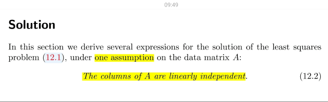</kbd>

> [!NOTE]
> Đại khái là ta sẽ có một assumption đó là các cột của A độc lập.
>
> Bàn về cái này một chút. Điều này sẽ đồng nghĩa n columns của A
> sẽ là một basis của một n dimensional suspace của R^m.
>
> Tiếp, khi A full column rank thì có thể chứng minh ATA full rank: Xét
> ATAx=0, nullspace vector khác 0 của ATA sẽ là vector x sao cho Ax
> thuộc nullspace của AT, tức left nullspace của A. Thế thì Ax nằm
> trong column space của A. Nên muốn nó cũng nằm trong left
> nullspace thì điều này có nghĩa là nó (Ax) là intersection của
> column space và left nullspace. Và đó chính là zero vì hai
> subspaces này orthogonal complement.
>
> Vậy, non zero nullspace vector x của ATA chính là x sao cho Ax=0,
> tức là nullspace vector của A. Mà A full column rank nên N(A) chỉ
> có zero. Vậy nullspace của ATA cũng chỉ có zero, suy ra ATA full
> column rank. Và vì nó square nên nó full rank, invertible
>
> Và cũng vì null space của ATA và A là một nên nếu ATA full rank
> tức nullspace bằng {0} thì A cũng vậy từ đó kết luận A full column
> rank
>
> Có thể chứng minh nhanh hơn:
>
> ATAx = 0 tương đương xTATAx = 0 Tương đương ||Ax||^2=0 tương
> đương Ax=0 => solution của hai equation là giống nhau => Kết quả
> trên

 

<kbd>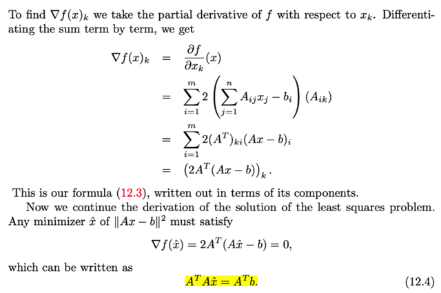</kbd>

<kbd>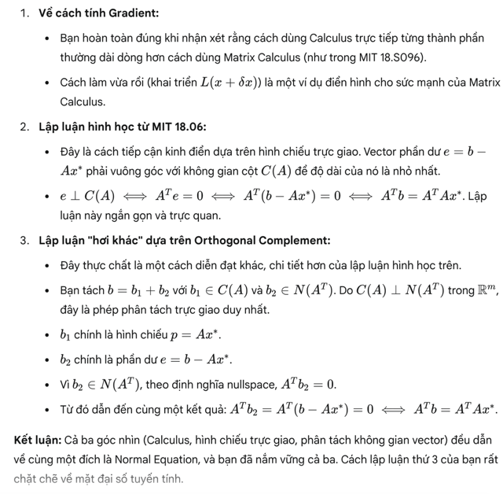</kbd>

<kbd></kbd>

<kbd></kbd>

<kbd>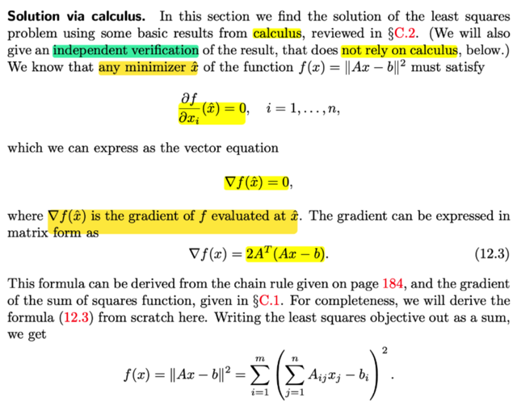</kbd>

> [!NOTE]
> Phần này đại khái là nói về cách giải least square problem dùng
> calculus. 
>
> Chủ yếu là ở đây gs cho ta thấy gradient của f (mà mình gọi là L-loss)
> theo cách làm theo từng biến, tức là triển khai từng component của
> gradient là partial derivative của f wrt xi
>
> Nhưng MIt 18s096 cho ta cách làm dễ hơn nhiều để tính ra gradient.
> mà mình đã làm vừa rồi. Khi có gradient thì xây dựng optimality condition
> (tức cho ∇f = 0 để có normal equation)
>
> Bên cạnh đó, nhờ mit 1806 cũng biết cách diễn dịch hình học:
>
> Cần tìm projected của của b lên Ax: p = Ax^, thì residual e = b - p
> sẽ vuông góc với C(A) ⇨ e vuông góc với mọi column của A ⇨ ATe = 0
> ⇔ AT(b - p) = 0 ⇔ ATb = ATp ⇔ **ATb = ATAx^**. Đây chính là normal
> equation 
>
> Thử luận hơi khác một chút:
>
> Cần tìm x^ sao cho Ax^ gần b nhất có thể. b thuộc R^m, nên nó sẽ
> có thể được tách thành hai vector nằm trong hai subspace orthogonal
> complement: Column space C(A) và Left nullspace N(AT)
>
> Hay nói cách khác, b thuộc R^m, nên nếu ta có một basis hợp bởi basis
> của column space và basis của left nullspace thì ta sẽ có thể tạo linear
> combination của basis đó cho ra b.
>
> Gọi b = b1 + b2 với b1 = Σi wici (ci là basis của C(A)) và b2 = Σj wjnj
> với nj là basis của left nullspace N(AT))
>
> thế thì dĩ nhiên với b1 nằm trong C(A) nên tồn tại x^ để b1 = Ax^,
> còn b2 dĩ nhiên thuộc N(AT) nên nó vuông góc với C(A)
>
> ⇨ vuông góc với mọi cột của A cũng là mọi hàng của AT
>
> ⇨ ATb2 = 0 ⇔ AT(b-b1) = 0 ⇔ ATb = ATb1 ⇔ **ATb = ATAx cũng là kết
> quả trên**

 

<kbd>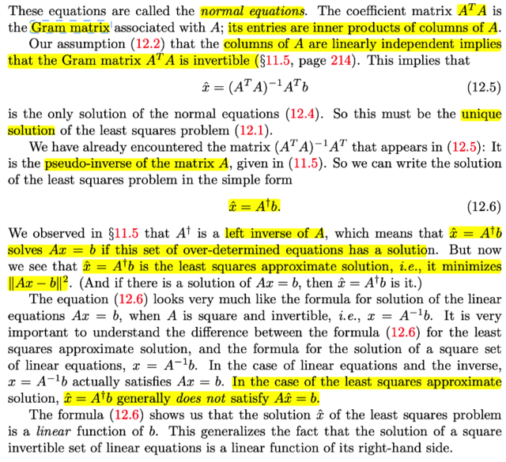</kbd>

> [!NOTE]
> Phần này như mình đã nói ở note trước, để giải normal  equation thì ta sẽ nhân hai vế cho
> ATAinv
>
> Có điều lúc đó quên nói, mit 1806 đã học, để ATAinv tồn tại thì A phải full column rank, tức
> các cột của A độc lập
>
> Chứng minh: ATAx = 0 chỉ xảy ra khi x = 0 cũng chính là chứng minh nullspace của ATA =
> {0}
>
> Cách 1: Dựa trên 1 tính chất quan trọng: Matrix K sẽ biến vector khác 0 trong rowspace
> của nó thành vector khác 0 trong columnspace của nó, và biến vector khác 0 trong
> nullspace của nó thành 0
>
> Với A full column rank ⇨ cột độc lập, ko có free column, ⇨ cách duy nhất combine các cột
> thành 0 là vector 0 ⇨ nullspace của A = {0},
>
> Nên nếu x khác 0, tức là khác vector duy nhất trong nullspace thì Ax khác 0
>
> Mà Ax ∈ column space của A, cũng là trong rowspace của AT.
>
> Xét phép biến đổi bởi matrix K với vector u khác 0, thì ta có thể luôn tách u thành 2 vector
> nằm trong hai orthogonal subspace là rowspace và nullspace của K: u = u_r + u_n  với  u_r
> là vector khác 0 thuộc rowspace của K và u_n là vector khác 0 trong nullspace của  K
>
> Thì Ku_r sẽ là vector khác 0 thuộc column space của A
>
> Còn Ku_n sẽ được suy biến thành 0: Ku_n = 0
>
> Vậy thì (1) đã nói, ở đây Ax đã là vector khác 0 thuộc rowspace của AT, nên ATAx sẽ map
> nó với vector khác 0 trong column space của AT
>
> Do đó ATAx chắc chắn khác 0 khi x khác 0. Và chỉ bằng 0 khi x = 0
>
> Từ đó kết luận ATA invertible
>
> Cách 2: Chứng minh nullspace của A cũng là của ATA
>
> Xét x ∈ N(A) ⇨ Ax = 0 ⇨ ATAx = 0 ⇨ x ∈ N(ATA)
>
> Xét x ∈ N(ATA) ⇨ ATAx = 0 ⇔ xTATAx = 0 ⇔ (Ax)T)(Ax) = 0
>
> ⇔ ||Ax||^2 = 0. Mà ||Ax||^2 ≥ 0 và chỉ = 0 khi Ax = 0 Nên từ đó ta có: ATAx = 0 ⇨ Ax = 0 ⇨ x
> ∈ N(A)
>
> Từ hai điều trên theo lí thuyết tập hợp ta suy ra N(A) = N(ATA)
>
> Vậy khi A full column rank ta có N(A) = {0}, suy ra N(ATA) cũng = {0} Mà ATA vuông ⇨ ATA
> invertible
>
> ====
>
> Thế thì x = (ATA)invATb chính là A^+b, với A^+ là inverse ảo của A
>
> Nói về cái này thì mit 1806 đã học:
>
> - Khi A full rank thì pseudo inverse cũng là Ainv:
>
> Dễ thấy điều này: khi A invertible thì ta có thể tách (ATA)inv = Ainv ATinv dùng tính chất
> (AB)inv = BinvAinv
>
> (ATA)invAT = Ainv ATinv AT, và ATinv AT = I để lại Ainv
>
> - Khi A full column rank thì pseudo inverse chính là left invese:
>
> Rõ ràng chính là trường hợp này. (ATA)invAT chính là left inverse,  vì nhân vào bên trái của
> A ta sẽ có I: (ATA)invATA = I
>
> - Nhưng khi A full row rank, thì pseudo inverse sẽ cũng giúp giải  Ax = b nhưng thay vì giải
> ra nghiệm least square, tức là gần b nhất như khi A full column rank (với hệ
> overdetermined_ thì lúc này Ax = b là hệ under determined sẽ lại có vô số nghiệm, do
> matrix mập lùn A có dư cột độc lập để span R^m và có dư cột tự đo khiến nullspace khác
> {0}
>
> Nên sẽ có vô số nghiệm có dạng x* + Fz với x* là particular solution (Ax* = b) và Fz là
> nullspace vector: A(x* + Fz) = Ax* + AFz = b + 0 = b ⇨ x* + Fz là nghiệm
>
> Khi đó x = A^+b sẽ chính là particular solution, tức là nghiệm x^ = A^+b sẽ là least norm
> solution, - là cái có length (norm) nhỏ nhất.
>
> Và khi đó A^+ cũng chính là right inverse của A: A^+ = AT(AAT)inv và least norm solution =
> AT(AAT)invb
>
> Tại sao nó là least norm solution:
>
> Xét bài toán minimize xTx constraint Ax = b với A full row rank
>
> Lagrangian: L(x, v) = xTx + vT(Ax - b)
>
> Optimality condition:
>
> ∇f(x) + ATv = 0 ⇔ 2x + ATv = 0
>
> Với f(x) = xTx ⇨ df = (x + dx)T(x + dx) - xTx = xTx + dxTx + xTdx + dxTdx - xTx
>
> = dxTx + xTdx + dxTdx =  2xTdx
>
> ⇨ ∇f(x) = 2x
>
> ⇨ x = -(1/2)ATv
>
> ⇨ Thế vô Ax* = b, ta có -(1/2)AATv = b ⇨ v = -2(AAT)invb
>
> Thay vào lại x, x = -(1/2)AT[-2(AAT)invb]
>
> = **AT(AAT)inv b đây chính là A^+b**====
>
> Cách giải khác theo hình học:****Nghiệm của Ax = b có dạng x = x' + Fz với x' thỏa Ax' = b
>
> Thế thì x' nằm trong R^m ta luôn có thể tách thành một vector trong nullspace và một
> vector trong rowspace x* + x_null
>
> Dĩ nhiên x_null vuông góc với x* và các Fz cũng vậy
>
> ⇨ x = x* + x_null + Fz
>
> Tất nhiên có thể gom chung x_null với Fz , để ta chỉ còn xét x gồm x* là non-zero vector
> trong rowsspace thỏa Ax* = b và Fz là vector trong nullspace bất kì.
>
> Ta có ||x||^2 = ||x*||^2 + ||Fz||^2
>
> Khi đó minimize ||x||^2 trở thành minimize ||x*||^2 + (Fz)T(Fz)
>
> dễ thấy nhỏ nhất là = ||x*||^2
>
> Và x* là non-zero vector trong rowspace được map với b bởi A
>
> Vậy x* phải có dạng ATy tức là linear combination của A's row
>
> Từ đó ta có Ax* = b ⇔ AATy = b ⇔ y = (AAT)invb
>
> ⇨ x = ATy = **AT(AAT)invb chứng minh A^+ b là least norm solution của hệ under
> determined**

 

<kbd>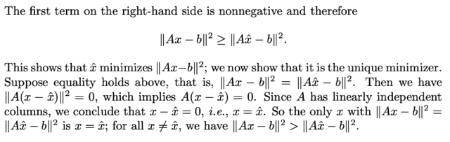</kbd>

<kbd>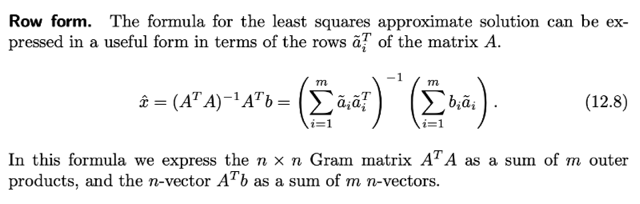</kbd>

<kbd></kbd>

<kbd></kbd>

<kbd>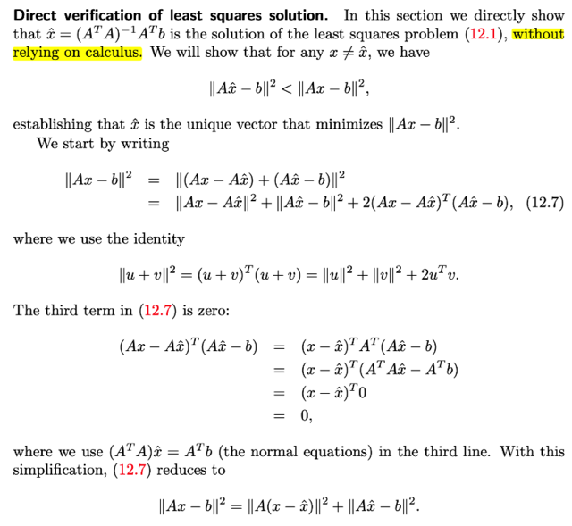</kbd>

> [!NOTE]
> QUAY LẠI SAU

> [!NOTE]
> Đại khái là ở đây gs kiểu như cho thấy một cách chứng
> minh trực tiếp rằng x^ = (ATA)invATb chính là least
> square solution bằng cách chứng minh rằng với mọi x
> thì ||Ax-b||>=||Ax^-b||
>
> Cũng ko khó, bắt đầu từ ||Ax-b||, cộng và trừ Ax^ ta có
> ||Ax-Ax^+Ax^-b||
>
> Tới đây dùng công thức ||u+v||^2=(u+v)T(u+v)
>
> =(uT+vT)(u+v)
>
> =(uTu+vTu+uTv+vTv)
>
> =||u||^2+||v||^2+2uTv
>
> Thì ta có ||Ax-Ax^||+||Ax^-b||+2(Ax-Ax^)T(Ax^-b)
>
> Tới đây với x^=(ATA)invATb thì 2(Ax-Ax^)T(Ax^-b)=0
>
> Do đó ||Ax-b||=||Ax-Ax^||+||Ax^-b||
>
> Và vì ||Ax-Ax^||  >= 0 nên ||Ax-b|| >= ||Ax^-b|| với mọi x,
> từ đó đã chứng minh x^ = (ATA)invATb chính là least
> square approximate solution
>
> Và dấu bằng xảy ra khi x = x^

> [!NOTE]
> Đại khái là ở đây ta học một điều mới mà 1806 chưa từng thấy, đó là
> thể hiện x^ = (ATA)invATb dưới dạng các row của A.
>
> Đầu tiên xem ATb, thì theo góc nhìn quen thuộc matrix nhân vector
> thì nó là linear combination của các columns của AT với coefficients
> là components của b. Mà columns của AT chính là rows của A. Vậy
> nên có thể thể hiện ATb = Sum a~i.bi với a~i là row thứ i của A.
>
> Tiếp, xét ATA, ta sẽ dùng góc nhìn  về nhân matrix mà gs Strang đã
> nói trong 1806 là matrix AB [(m,n)(n,p)] sẽ là tổng n các rank 1
> matrix [Col ith of A (m,1)]x[Row ith of B (1,p)]
>
> Và như vậy ATA
>
> = Sum i=1:m [Col ith của AT (n,1)] x [Row ith của A (1,n)]
>
> = Sum [Row ith của A] x [Row ith của A]
>
> Để có shape đúng (column vector x row vector) thì sẽ là (a~i)(a~i)T
>
> Hiểu là vì a~i là row thứ i nhưng nó là column vector nếu theo
> convention. Nên để lật nó nằm ngang ta sẽ transpose (a~i)T

 

<kbd>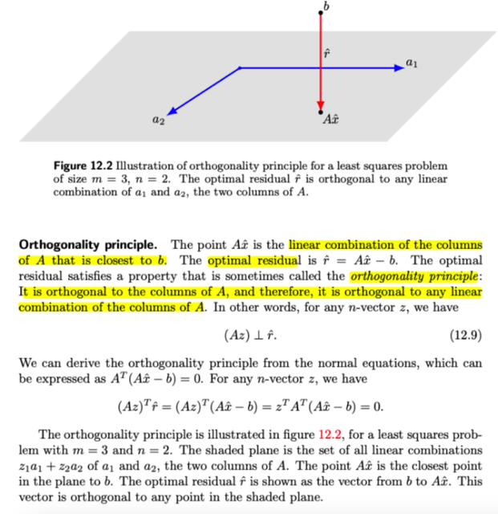</kbd>

> [!NOTE]
> QUAY LẠI SAU

> [!NOTE]
> Đại khái là nói về một principle gọi là orthogonal principle:
> optimal residual Ax^-b sẽ vuông góc với C(A).
>
> Cái này thì cũng đã biết trong 1806. Chỉ là ở đây mình suy nghĩ
> chút xíu: Ta có thể dùng orthogonal principle để lập luận ra
> normal equation như hay làm: Vì b nằm ngoài C(A) nên điểm
> nằm trong C(A) mà gần nhất với b chính là hình chiếu
> (projection) p của b lên C(A) do đó (b-p) vuông góc với C(A) =>
> vuông góc với mọi columns của A: (b-p)T(col ith of A)=0 <=>
> AT(b-p)=0 <=> ATb=ATp <=> ATb = ATAx^ (đây là normal
> equation)
>
> Và ngược lại ta cũng từ normal equation để suy ra optimal
> residual e (hay r) = Ax^-b sẽ vuông góc với mọi vector z trong
> C(A)

 

<kbd>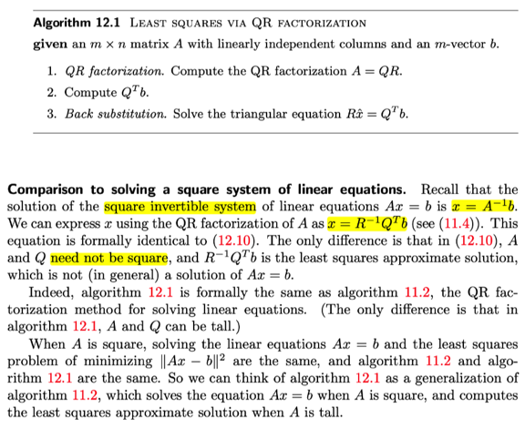</kbd>

<kbd></kbd>

<kbd>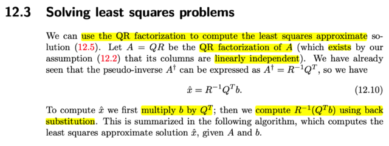</kbd>

> [!NOTE]
> Đại khái là ở đây nói ta sẽ dựa vào QR factorizations để solve
> least square solution
>
> Là bởi, ta biết ta sẽ có thể dùng pseudo inverse matrix A+ để
> solve least square solution :
>
> x+=(A+)b
>
> Và A+, nếu trong trường hợp A full column rank tức các cột
> độc lập thì A+=(ATA)invAT
>
> = (RTQTQR)invRTQT
>
> =(RTR)invRTQT = RinvRTinvRTQT | (AB)inv=BinvAinv
>
> = RinvQT
>
> Nên least square solution x^=RinvQTb

 

<kbd>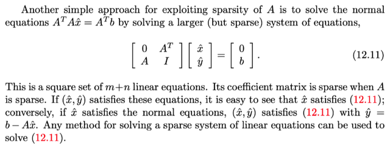</kbd>

<kbd></kbd>

<kbd>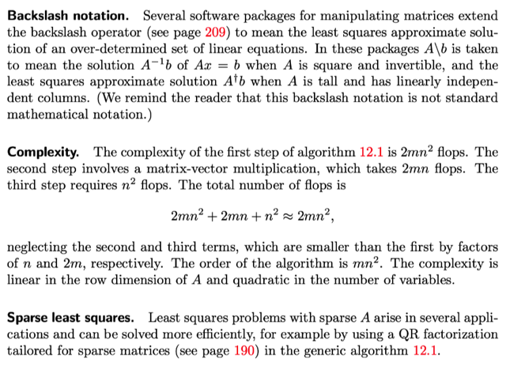</kbd>

 

<kbd>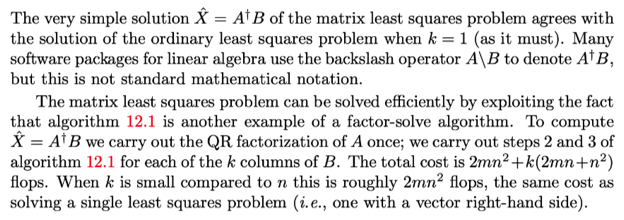</kbd>

<kbd></kbd>

<kbd>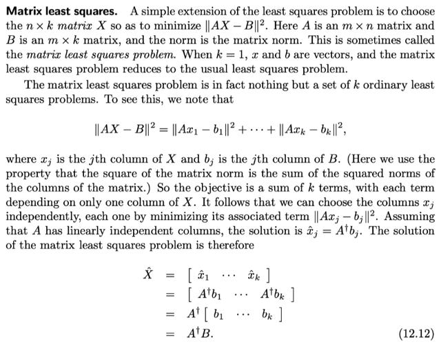</kbd>

 

<kbd>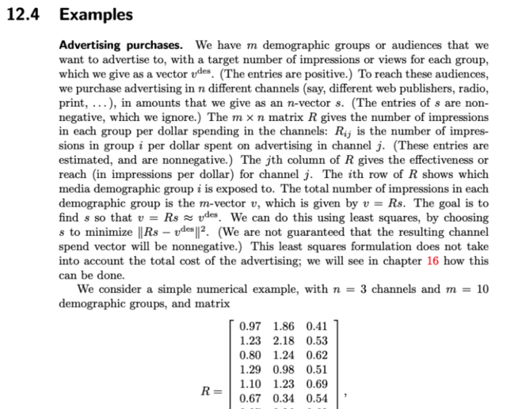</kbd>

> [!NOTE]
> QUAY LẠI SAU

 

