# Chap 13 Least square data fitting

📊 **Progress:** `15` Notes | `26` Screenshots

---

<kbd>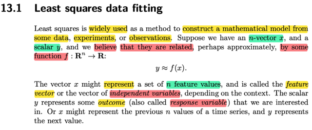</kbd>

> [!NOTE]
> Đại khái là khi ta có một n-vector x, và một scalar y. Và ta TIN RẰNG 
> có một quan hệ nào đó giữa chúng, mà ta có thể xấp xỉ bằng cách 
> dùng một hàm f: y ≈ f(x). Thì least square là một cách làm, một cách
> để xây dựng hàm f 
>
> x ở đây cho biết, có thể đại diện cho một tập (set) các FEATURE
> VALUES, được gọi là feature vector hoặc vector các independent 
> variables.
>
> (chỗ này khiến liên hệ với independent random variables trong xác
> suất thống kê)
>
> và y đại diện cho outcome, còn gọi là response variable. Các định 
> nghiã này đã gặp trong ISL

 

<kbd>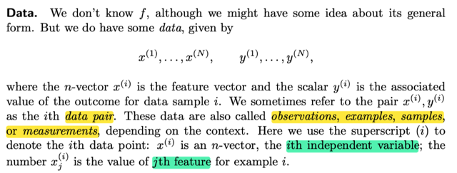</kbd>

> [!NOTE]
> ta sẽ có các data-pair, là các cặp feature vector x(i) và scalar y(i)
>
> Và chúng có thể được gọi là observations, exampls, samples, 
> measurements tùy bối cảnh cụ thể
>
> Trong đó x(i)j sẽ chỉ feature thứ j của feature vector

 

<kbd>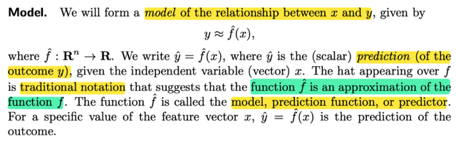</kbd>

> [!NOTE]
> Những quy ước, tên gọi này rất giống cái được học trong các lớp
> machine learning.
>
> Nhưng lần này mình hiểu sâu hơn tí, chứ không chỉ nghe rồi 
> biết vậy: Bản chất là ta đang muốn mô hình hóa, hay xây dựng
> mô hình của quan hệ giữa x và y. Thể hiện bởi y ≈ f^(x), mang ý 
> nghĩa là ta muốn xây dựng một mô hình của quan hệ giữa x và y
> sao cho thông qua mô hình này, ta có thể mô phỏng gần đúng
> được quan hệ giữa x và y, mà điều này thể hiện bởi y ≈ f^(x): 
> bỏ x vào mô hình, thì nó cho ra kết quả sát với y.
>
> Và việc ta dùng f^, mang ý nghĩa, là ta tin rằng có quan hệ nào
> đó giữa x và y, thể hiện bởi function y = f(x), nhưng ta không biết
> quan hệ đó, function đó cụ thể ra sao. Và việc ta xây dựng mô
> hình, cho quan hệ đó, thể hiện bởi f^, chính là ta đang xây dựng
> một hàm gần đúng, xấp xỉ với f.
>
> Và thông qua mô hình này , tức f^, thì nhận vào input x, ta có f^(x)
> , đặt là y^ là dự đoán của mô hình dựa trên input x.
>
> Dĩ nhiên như đã nói, ta muốn "dựng" mô hình được quan hệ giữa
> x và y, mà mô hình đúng thì phải phản ánh được quan hệ này sát
> nhất, nên ta muốn y^ ≈ y

 

<kbd>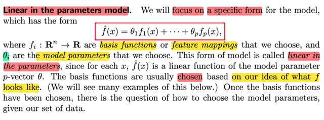</kbd>

> [!NOTE]
> Thế thì đại khái là ta sẽ tập trung vào một loại mô hình cụ thể: có dạng
>
> f^(x) = θ1f1(x) + θ2f2(x) + ...θpfp(x)
>
> (again, ta muốn xây dựng mô hình giúp mô phỏng được quan hệ giữa
> x, y vốn được ta tin rằng thể hiện bởi một hàm số toán học: y = f(x),
> thì bản chất việc xây dựng mô hình này chính là xây dựng một hàm 
> f^ sao cho nó hoạt động giống nhất xấp xỉ tốt nhất hàm số f. Thì ở
> đây ta quan tâm với một dạng cụ thể như trên)
>
> Trong đó các hàm fi(x) được gọi là basis function (cái này mới nghe
> lần đầu), hay feature mapping. Và ta sẽ chọn dạng cụ thể của các
> hàm này.
>
> Còn θi gọi là model parameter, tham số của mô hình
>
> Và khi đó, câu hỏi sẽ là làm sao để tìm được / chọn được tham số
> θi dựa trên dữ liệu
>
> Cái này nhìn sơ qua coi chừng ko để ý nó có một cái rất hay:
>
> f^(x) = θ1f1(x) + θ2f2(x) + ...θpfp(x) thì các f1(x), f2(x) .. là function của
> cả vector x nhé, chứ không phải chỉ là f1(x1), f2(x2),..
>
> Ban đầu mình nhầm, nghĩ rằng à có thể là f1(x1), f2(x2) để khái quát
> cho cái vụ polynomial ví dụ θ1 x1^2 + θ2 x2^3 + ...
>
> Không đâu, nó khái quát hơn nữa, khi f1(x) là có thể là x1 + x2,
> hay x1 + x2^2, rồi f2(x) có thể là log(x1) + x1x2, ...
>
> Có nghĩa là nó sẽ khái quát để chứa cả việc tạo các feature mới
> bằng cách combine cả Φ tuyến hoặc tuyến tính các feature gốc
>
> Nhưng có thể thấy dù thế nào, thì f VẪN LÀ HÀM TUYẾN TÍNH CỦA
> THAM SỐ θ1, θ2...

 

<kbd>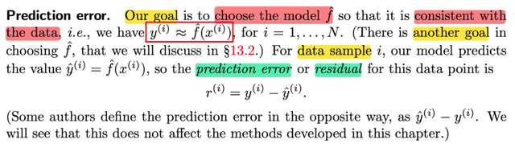</kbd>

> [!NOTE]
> Rồi, thế thì, như vừa nói, mục tiêu của ta là tìm được hàm f^ sát
> nhất, xấp xỉ tốt nhất hàm f - quan hệ giữa x và y. Và để thực hiện
> mục tiêu này
>
> **thì ít nhất là (tí nữa sẽ nói vì sao)**
>
> ta sẽ muốn kết quả của nó khi đưa ra dự đoán dựa trên x(i): y^(i) =
> f^(x(i)) phải rất sát, rất giống với **kết quả thực tế**, được tạo bởi
> quan hệ thực tế của x và y, tức là hàm f: y(i) = f(x(i)). Tức là ta
> muốn:
>
> f^(i) ≈ y(i) ****Và ta gọi chênh lệch giữa f^(x(i)) và y(i) là r(i)  prediction error, hay
> residual:
>
> r(i) = y(i) - y^(i)
>
> (có sách ghi là r(i) = y^(i) - y(i)

 

<kbd>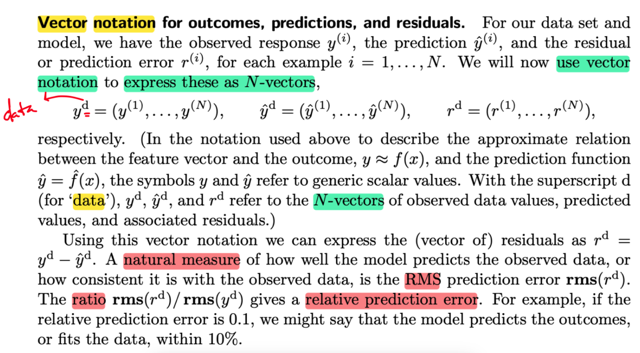</kbd>

> [!NOTE]
> rồi, đại khái là ta sẽ thể hiện dạng vector, bằng cách xây dựng
> vector predicted value y^d = (y^(1), y^(2)...), observed response
> yd = (y(1), y(2), ...)
>
> và residual rd = (r(1), r(2), ...)
>
> Vì có N data-pairs, nên các vector trên là N-vectors (N dimensional
> vectos)
>
> (d ở đây là data, mình thấy ko cần thiết lắm)
>
> Có sách, phần lớn sách sẽ dùng chữ đậm để thể hiện vector ko
> hiểu sao thầy Boyd ko làm vậy)
>
> Khúc dưới có thể khó hiểu: Mình đoán RMS là Root Mean Square
> như đã gặp ở các class khác:
>
> nên RMS(rd) = √ [r(1)^2 + r(2)^2 + ... + r(N)^2] / N
>
> từ đó tính thêm RMS(yd) = √ [y(1)^2 + y(2)^2 + ... + y(N)^2] / N
>
> Và RMS(rd) / RMS(yd) gọi là RELATIVE ERROR

 

<kbd>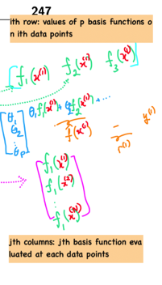</kbd>

<kbd></kbd>

<kbd>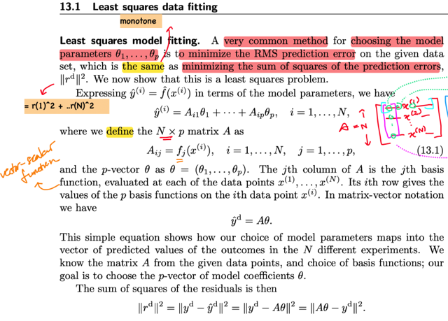</kbd>

> [!NOTE]
> Việc fitting mô hính với data sẽ là việc giải bài toán tối ưu để minimize
> RMS error
>
> Thể hiện compact hơn, ta sẽ xây dựng matrix A:
>
> mà mỗi hàng của nó là, ví dụ hàng i f1(x(i)), f2(x(i)),...fp(x(i))
>
> Chú ý: Basis function, fi(.) là vector → scalar function Mình sẽ hiểu hơn
> khi gặp ví dụ, còn ở đây là dạng khái quát chỉ cần biết nó là feature
> mapping function.
>
> (Những cái này khái quát nên ta thấy hơi lạ)
>
> Quay lại đây, cột j của A sẽ là [fj(x(1)), fj(x(2)), ...fj(x(N))]
>
> Và θ = [θ1, θ2,...θp]
>
> Và y^d = A θ ⇨ rd = A θ - yd
>
> Và mục tiêu sẽ là minimizing rms(rd)
>
> Nhưng như đã biết vì tính monotone (hàm square root monotone khi a, b
> ko âm: √a ≤ √b ⇔ a < b ) nên bài toán này equivalent bài toán minimize
> SUM SQUARE (đã học trong ee364a, bài toán equivalent là khi giải ra
> solution của cái này cũng cho ra solution của bài kia)
>
> tức là minimizing r(1)^2 + r(2)^2 + .., chính là ||rd||^2 = ||A θ - yd||^2

 

<kbd>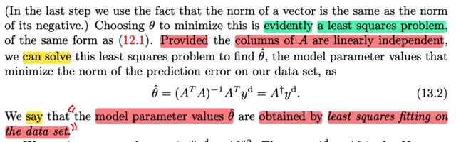</kbd>

> [!NOTE]
> Rồi, tới đây thì với việc ta muốn giải bài toán:
>
> minimize θ f(θ) = ||Aθ - yd||^2 = (Aθ - yd)T(Aθ - yd)
>
> thì nó chính là bài toán least square problem
>
> Thế thì khi ta được cho phép có điều kiện là các cột của A, tức
> linear independent, tức A full column rank, thì như chap 12 đã biết,
> ta sẽ có thể giải least square solution bằng left inverse của A:
>
> Normal equation ATA θ = ATyd (ko khó để derive lại)
>
> với A full column rank ⇨ ATA full rank, invertible
>
> ⇨ θ = (ATA)invATyd

 

<kbd>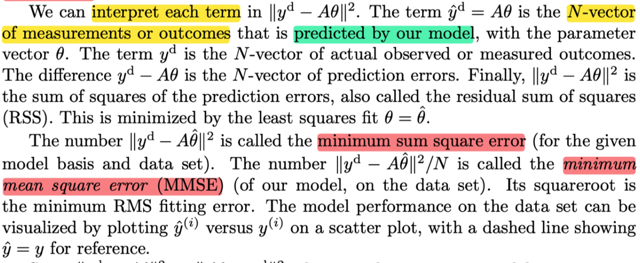</kbd>

> [!NOTE]
> Vài cách gọi tên, nghe rất hiển nhiên: 
>
> y^d = A θ dĩ nhiên là N-vector, mỗi phần tử, ví dụ phần tử đầu
> tiên là θ1f1(x(1)) + θ2f2(x(1) + ... + θp fp(x(1)), chính là f^(x(1))
> là dự đóan về giá trị outcome bởi mô hình f^ khi input là x(1).
> Nên y^d là vector chứa dự đoán về giá trị outcome của các N input
>
> Còn yd, thì đã nói, là giá trị quan sát thực tế của outcome khi đưa
> data vào hàm f, chứa đựng, phản ánh quan hệ thật của input và
> outcome x - y
>
> Và yd - Aθ là vector chứa các error
>
> ||yd - A θ||^2 dĩ nhiên là residual sum of squared (RSS)
>
> Khi ta giải bài toán least squared để có solution θ^, thì
>
> ||yd - A θ^||^2 dĩ nhiên là minimum sum square error
>
> còn chia N thì là minimum sum mean square error

 

<kbd>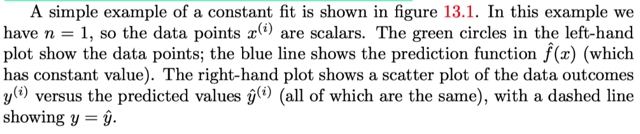</kbd>

<kbd>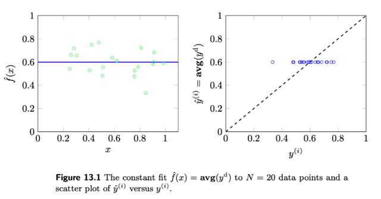</kbd>

<kbd></kbd>

<kbd></kbd>

<kbd>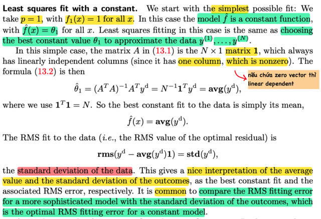</kbd>

> [!NOTE]
> đại khái là, case đơn giản nhất, p = 1, tức chỉ có một feature. 
>
> Tới đây có thể hiểu cái vụ feature mapping rồi, các hàm basis
> sẽ quyết định số lượng feature, và feature gì.
>
> Ví dụ, nếu chỉ có một feature: chỉ dùng một hàm f1(.), khi đó
> A trở thành chỉ là matrix 1 cột, và formula cụ thể của f1 sẽ quy
> định feature này là như thế nào. Ví dụ vector x gồm [diện tích, số
> phòng], f1(x) có thể lấy diện tích / 1000 + 10* số phòng, thể hiện
> ra feature engineering ra feature mới combine cả diện tích và
> số phòng.
>
> Quay lại đây, họ giả sử ta dùng f1(x) = 1, tức là constant function.
>
> Khi đó matrix A chính là column vector **1**Và họ nói đây vẫn là full column rank matrix, vì nó chỉ có 1 vector
> mà vector này khác 0 (nhờ ánh sánh của 1806, mình có thể hoàn
> tòan hiểu, vì nếu hai vector có 1 vector 0 thì sẽ là linear dependent
> set, nên nói chỉ có 1 vector là chưa đủ cho thấy nó là set linear
> independent, mà phải nói thêm vector này khác vector zero nữa)
>
> ATA lúc này là **1**T**1**, dĩ nhiên, 1+1+..1 = N, là 1 số, ko phải matrix
> gì nữa, Ninv chính là 1/N
>
> thì solution của bài toán least square, mà ở đây có tên cụ thể hơn
> là data fitting, sẽ là θ^ = Ninv**1**Tyd
>
> Và cái này chính là avg(yd), vì sao nhỉ?
>
> **1**Tyd thì chính là Σi y(i), là scalar.
>
> ⇨ θ^ = Ninv1Tyd = Σi y(i) / N, chính là trung bình của y(i)
>
> Và ý nghĩa của cái này là, khi dùng 1 feature, là constant f1(x) = 1
> để f^(x) = θ^. 1 = θ^, tức là ta khi dùng mô hình này, thì ta muốn
> dự đoán quan hệ của x - y bởi một hằng số, thì khi đó hằng số 
> tốt nhất dùng để dự đoán chính là giá trị trung bình của y(1),..y(N)
> rất hay.
>
> Và thử xem RMS error là gì:
>
> = rms(yd - y^d) = rms (yd - avg(yd)**1**) 
>
> ( avg(yd)**1** chỉ là để bung ra lại thành N-vector)
>
> vậy thì cái này là gì?
>
> Nó chính là: 
>
> √{[(y(1) - ybar)^2 + (y(2) - ybar)^2 + ..(y(N) - ybar)^2] / N}
>
> = √ {[Σi (y(i) - ybar)^2 ] / N}
>
> Tới đây, hãy liên hệ với những gì được học bên Statistical Inference
> Casella & Berger:
>
> Sample Variance: S^2 = 1/(N-1) Σi (Xi - Xbar)^2
>
> Vậy thì có vẻ như {[Σi (y(i) - ybar)^2 ] / N} chính là (sample) variance
>
> nhưng là công thức biased (vì chia cho N)
>
> và lấy square root thì ta có sample standard deviation
>
> Nên rms(rd) chính là std(yd)

 

<kbd>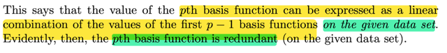</kbd>

<kbd></kbd>

<kbd>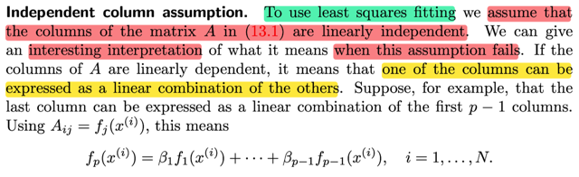</kbd>

> [!NOTE]
> đại khái là assumption về A full column rank có thể giải nghĩa như sau:
>
> Dĩ nhiên nhờ 1806 ta biết nếu các cột phụ thuộc thì có nghĩa là tồn
> tại cột nào đó có thể tạo bởi các cột khác.
>
> mà các cột j của A trong bài toán này là: fj(x(1)), fj(x(2)), ...fj(x(N))
>
> tức là basis function, hay function tạo FEATURE thứ j.
>
> Vậy việc có cột của A phụ thuộc CHỨNG TỎ CÓ FEATURE BỊ DƯ
> BỊ THỪA KO CẦN THIẾT

 

<kbd>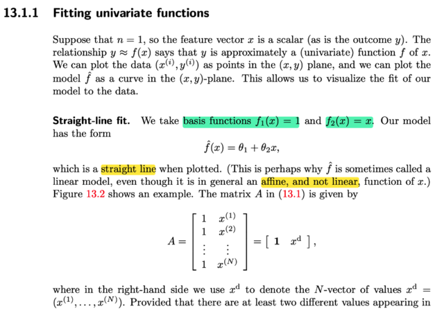</kbd>

> [!NOTE]
> Phần này xét việc deal với bài toán có n = 1, tức là vector x chỉ là scalar.
>
> Và dĩ nhiên y vẫn là scalar. Thì lúc này ta có thể plot ra.
>
> Ta mới chọn basis function f1(x) = 1, f2(x) = x
>
> thì mô hình f^ sẽ có dạng: f^(x) = θ1 + θ2x 
>
> (Nhớ lại dạng tổng quát: f^(x) = θ1 f1(x) + θ2 f2(x)...)
>
> trong đó fi(x) là basis function, gọi là feature mapping, kiểu như nó sẽ
> tạo feature để dùng)
>
> Lúc này f^ có dạng đường thẳng, thành ra nó có tên gọi là linear model,
> nhưng thật ra đúng phải là affine model.
>
> Matrix A, là feature design matrix, nhớ lại, sẽ có dạng hàng i là f1(x(i)), f2(x(i))..
> tức các feature mapping (basis function) apply lên input x(i) để có bộ feature
> của x(i).
>
> Thì dĩ nhiên cột j của A sẽ là fj(x(1)), fj(x(2)),...fj(x(N)), tức là feature j của các
> sample x(1),...x(N)
>
> Ở đây thì A sẽ có 2 cột như vầy, ghi ở dạng compact là [**1**, xd] ko khó hiểu

 

<kbd>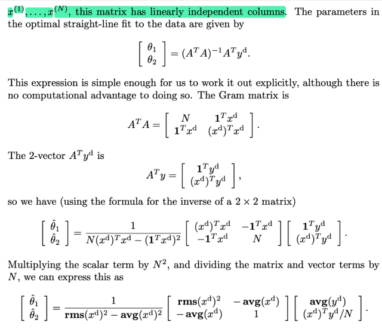</kbd>

> [!NOTE]
> rồi, thế thì nếu xd có ít nhất hai thằng khác nhau thì dĩ nhiên xd độc 
> lập với vector 1, ⇨ hai cột của A độc lập ⇨ Gram matrix (ATA) full rank
> ⇨ và least square solution của bài toán data fitting này, như đã biết sẽ
> là:
>
> **θ** = (ATA)invATyd
>
> Vì nói cung là đơn giản, nên matrix ATA có thể được ghi ra explicitly:
>
> ATA = [N, 1Txd, 1Txd, (xd)T(xd)]
>
> là sao: Thì thể hiện A theo block: [1, xd] ⇨ ATA = [1, d]T[1, xd] 
>
> = [1T1, 1Txd; xdT1, xdTxd], (1T1 = chính là N)
>
> Còn ATyd:
>
> = [1, xd]T[yd] = [1Tyd; xdTyd]
>
> Từ đó họ dùng công thức của inverse của matrix 2x2
>
> Và nhân cho N^2 thì ta có θ^ thể hiện bởi rms(xd) và avg(xd)
>
> (nói chung là cũng ko khó hiểu đâu. Ví dụ:
>
> N(xd)T(xd) chia đi cho N, còn (xd)T(xd) chính là Σ x(i)^2, chính là 
> [rms(xd)]^2

> [!NOTE]
> Vậy thì thử nhớ lại cái công thức tính matrix nghịch đảo
> của matrix 2x2 từ đâu ra:
>
> AAinv = I,
>
> thì cơ bản là ta sẽ gỉai hai hệ: Au = e1, Av = e2, thì [u, v] chính là
> Ainv.
>
> Giải Au = e1, tức hệ a11u1 + a12u2 = 1, a21u1 + a22u2 = 0
>
> từ (2) ⇨ u2 = -a21/a22 u1, thế vào (1): a11u1 - a12a21/a22 u1 = 1
>
> ⇨ u1 = 1/[a11 - a12a21/a22] = a22/(a11a22 - a12a21) = a22/detA
>
> ⇨ u2 = -a21/a22 a22/detA = -a21/detA
>
> ⇨ u = [a22/detA, -a21/detA] = (1/detA)[a22, -a21] 
>
> Giải Av = e2, tức hệ a11v1 + a12v2 = 0, a21v1 + a22v2 = 1
>
> từ (1) ⇨ v1 = -a12/a11 v2, thế vào (2):
>
> -a21a12/a11 v2 + a22v2 = 1 
>
> ⇔ v2 = 1/(a22 - a21a12/a11) = a11/(a11a22 - a21a12) = a11/detA
>
> ⇨ v1 = -a12/a11 a11/detA = -a12/detA
>
> ⇨ v = [-a12/detA, a11/detA] = (1/detA) [-a12, a11]
>
> ⇨ Ainv = [u, v] = (1/detA) [a22, -a12; -a21, a11]
>
> Và a22 chính là cofactor của a11, -a12 là cofactor của a21,...
>
> nên [a22, -a12; -a21, a11] chính là cofactor matrix của AT
>
> Nên ở đây ta có det ATA = N(xd)Txd - (1Txd)(1Txd)
>
> còn cofactor matrix của ATA)T cũng là của ATA vì symmetric: 
>
> [(xd)Txd, -1Txd; -1Txd, N]

 

<kbd>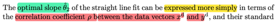</kbd>

<kbd>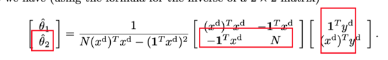</kbd>

<kbd></kbd>

<kbd></kbd>

<kbd>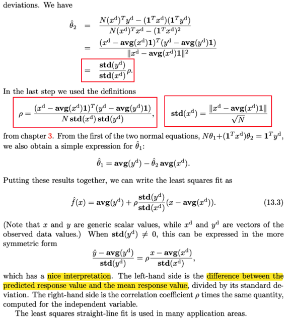</kbd>

> [!NOTE]
> Rồi, ko khó để nhìn ta ngay θ^_2, sẽ là dot product của row 2 matrix 
> cofactor và ATyd, rồi chia cho det ATA
>
> Thử xem tại sao nó thành [std(yd) / std(xd)] p
>
> [N(xd)Tyd - (1Txd)(1Tyd)] / [N(xd)Txd - (1Txd)^2
>
> Với p có định nghiã là [(xd - avg(xd)1)T(yd - avg(yd)1)] / [Nstd(xd)std(yd)]
>
> (cái công thức này định nghĩa vậy thì biết vậy thôi)
>
> Còn std(xd) = ||xd - avg(xd)1|| / √N,
>
> Thì cái này đã học xác suất thông kê thì đến giờ không còn thấy khó 
> nữa, std, hay căn bậc hai của variance. Thì ở đây ta có vector xd, 
> chứa các observed value x(1), x(2),....x(N).
>
> Nếu là bên thống kê, ta có random sample X1,...Xn từ population nào đó.
>
> Thì (unbised) sample variance sẽ là S^2 = (1/N-1) Σi (Xi - Xbar)^2
>
> còn ở đây họ dùng công thức biased, chia N.
>
> = (1/N) Σi (x(i) - xbar)^2 = (1/N) Σi (x(i) - avg(xd))^2
>
> và thể hiện theo vector thì sẽ là (1/N) [xd - avg(xd)1]T[xd - avg(xd)1]
>
> trong đó avg(xd)1 là để khôi phục thành N-vector mà mọi phần tử là avg(xd)
>
> Và chính là (1/N) ||xd - avg(xd)1||^2
>
> ⇨ sample variace = (1/N) ||xd - avg(xd)1||^2 
>
> ⇨ sample std = √[(1/N) ||xd - avg(xd)1||^2]
>
> = (1/√N) ||xd - avg(xd)1||
>
> ====
>
> Rồi, một điểm nữa, họ nói từ first equation của normal equations ta có thể có
> θ^_1 = ... là sao?
>
> normal equation là ATA[θ1, θ2]T = ATyd
>
> nên row1 của ATA dot product θ = component 1 của ATyd
>
> Chính là [N, 1Txd]T[θ1, θ2] = 1Tyd
>
> ⇔ Nθ1 + 1Txdθ2 = 1Tyd
>
> ⇨ θ1 = 1Tyd / N - (1Txd/N)θ2  
>
> chính là avg(yd) - avg(xd) θ2 chứ gì nữa
>
> ====
>
> Xong, bỏ vô hết thành ra có: f^(x) = avg(yd) + p [std(yd)/std(xd)](x - avg(xd))
>
> với std(yd) khác 0, chia hai vế cho nó:
>
> [y^ - avg(yd)]/std(yd) = p((x - avg(xd))/std(xd)

 

