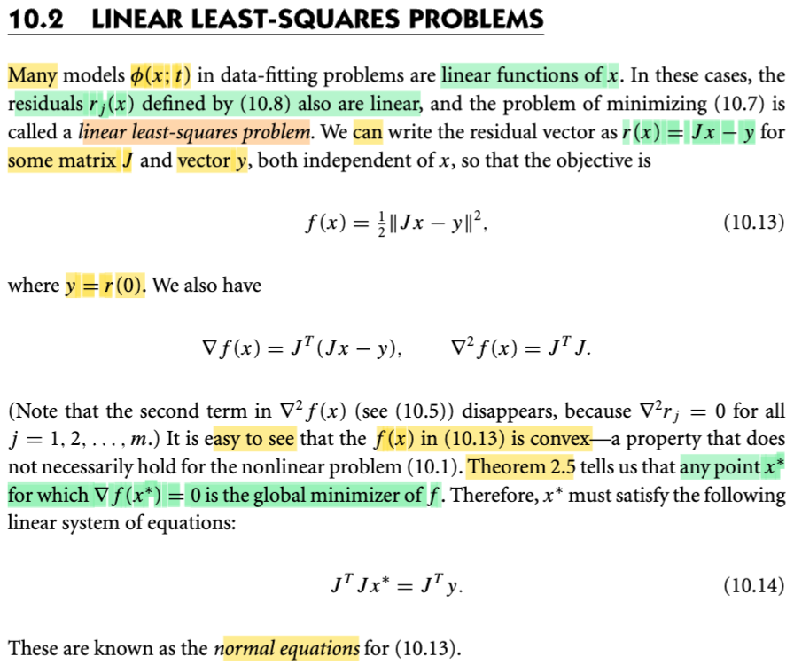
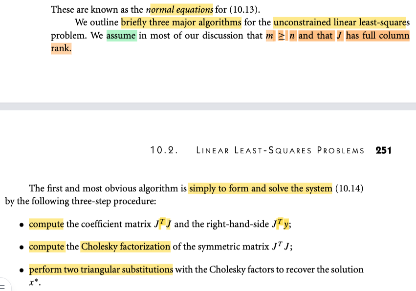
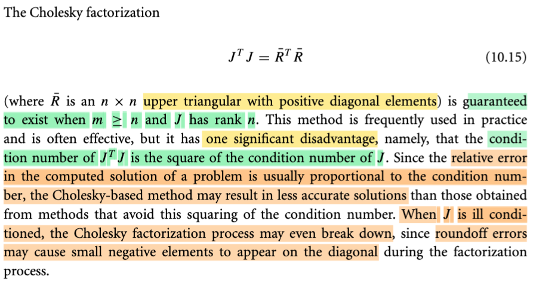

# 10.2 Linear Least-Square Problem

📊 **Progress:** `2` Notes | `3` Screenshots | `1` AI Reviews

---

## Bình phương tối thiểu tuyến tính

<kbd></kbd>

> [!NOTE]
> Thế thì phần 10.1 ta đã làm quen với bài toán least-square, và trong đó đã nói về Φ(x, t) là hàm dùng để dự đoán y từ input t dựa trên giá trị tham số x. Vậy thì nay, gs cho biết, rất nhiều khi người ta dùng hàm Φ là hàm tuyến tính theo x, khi đó ta có bài toán least-square tuyến tính (đây chính là linear regression)
>
>
>
> Thế thì, vì Φ(x, t) là hàm tuyến tính, nó sẽ kéo theo residual rj(x) = Φ(x,tj) - yj cũng là hàm tuyến tính. Do đó, nếu xét hàm r(x) (còn nhớ, nó là hàm vector → vector, nhận vào vector x, trả ra vector các rj(x) = Φ(x,tj) - yj) thì nó cũng la hàm tuyến tính theo x. Và như vậy, nhớ lại một ý đã học trong MIT 18s096, khi gs Steve nói về đạo hàm của hàm vector → vector, thì ông nói rằng: khi nói về cách để tìm Jacobian, nguyên tắc là ta sẽ đi tìm một linear operator act on vector dx để có df. Thì với việc dx và df đều là vector, linear operator duy nhất biến vector dx thành vector df chính là phép nhân với một matrix, do đó đạo hàm cấp một của hàm vector → vector là matrix, gọi là Jacobian matrix.
>
>
>
> Như vậy, tuy không liên quan lắm nhưng mình hiểu rằng, ở đây gs Nocedal chính là dùng lập luận đó: nói rằng, vì r(x) là hàm tuyến tính của x, nên nhất định nó phải có dạng một linear operator act on vector x: Và như vậy chỉ có thể là có dạng một matrix nào đó nhân với vector x mà thôi, ta gọi nó là matrix J: r(x) = Jx - y là vậy.
>
>
>
> Cũng có thể hiểu cách khác, vì rj(x) là hàm tuyến tính với vector x, và rj(x) là scalar, nên để có một hàm tuyến tính tác dụng lên vector x, để ra scalar rj(x) thì trong số các hàm vector → scalar, thì chỉ có hàm dot product là hàm tuyến tính. Như vậy rj(x) phải là dot product của vector x với vector gì đó không phụ thuộc x. Ta gọi vector đó là uj, thì ta có rj(x) = ujTx - yj.
>
>
>
> Ở đây cần lưu ý một chút, mình đã nghe điều này nhiều lần trong các lớp AI, S.Boyd: Thật ra nếu nói chính xác, thì việc Φ(x, t) là hàm linear thì hàm residual rj(x) = Φ(x, tj) - yj PHẢI LÀ HÀM AFFINE, chứ không phải là hàm linear.
>
> Lí do, linear function nếu chặt chẽ, phải thỏa tính chất f(α x + β) = α f(x) + β. Nhưng ở đây ko thỏa: rj(α x + β) = Φ(αx + β, tj) - yj = α Φ(x, tj) + β - yj, và cái này khác α rj(x) + β (= α \[Φ(x, tj) - yj\] + β = α Φ(x, tj) - αyj + β). Nhưng người ta kiểu như coi như nó là hàm tuyến tính.
>
>
>
> Như vậy, với rj(x) = yjTx - yj, thì đặt uj làm các hàng của một matrix, gọi là J, thì ta cũng có r(x) = Jx - y.
>
>
>
> ---
>
>
>
> Như vậy, objective lúc này trở thành: f(x) = (1/2)r(x)Tr(x) = (1/2)(Jx - y)T(Jx - y) = (1/2)||Jx - y||^2.
>
>
>
> Thử xem ∇f và Hessian ∇^2f là gì:
>
>
>
> Dùng kiến thức đã học trong MIT 18s096: ta sẽ tìm cách đưa df thành linear operator act on dx, khi đó sẽ thấy gradient ∇f:
>
>
>
> df = f(x + dx) - f(x) = (1/2)(J(x+dx) - y)T(J(x+dx) - y) - (1/2)(Jx - y)T(Jx - y)
>
>
>
> = (1/2) \[(J(x+dx) - y)T(J(x+dx) - y) - (Jx - y)T(Jx - y)\]
>
>
>
> = (1/2) \[(Jx + Jdx - y)T(Jx + Jdx - y) - (Jx - y)T(Jx - y)\]
>
>
>
> = (1/2) \[(xTJT + dxTJT - yT)(Jx + Jdx - y) - (xTJT - yT)(Jx - y)\]
>
>
>
> = (1/2) \[xTJTJx + dxTJTJx - yTJx + xTJTJdx + dxTJTJdx - yTJdx - xTJTy - dxTJTy + yTy - (xTJTJx - yTJx - xTJTy + yTy)\]
>
>
>
> = (1/2) \[xTJTJx + dxTJTJx - yTJx + xTJTJdx + dxTJTJdx - yTJdx - xTJTy - dxTJTy + yTy - xTJTJx + yTJx + xTJTy - yTy\]
>
>
>
> Bỏ hết các term bậc 2, và cancel out hết ta còn:
>
>
>
> = (1/2) \[2xTJTJdx - 2yTJdx\]
>
>
>
> = (xTJTJ - yTJ)dx
>
>
>
> = \[(xTJT - yT)J\]dx
>
>
>
> Vậy tại đây ta có df = (xTJTJ - yTJ)dx
>
>
>
> ⇨ ∇f(x) = \[(xTJT - yT)J\]T = JT((xTJT - yT)T = **JT(Jx - y)** → đây **chính là công thức trong sách.**
>
>
>
> Còn Hessian, có hai cách làm, đưa df thành bilinear form của dx và dx' hoặc đưa d∇f về dạng linear operator act on dx.
>
>
>
> Dùng cách hai cho dễ:
>
>
>
> Xét d∇f(x) = ∇f(x + dx) - ∇f(x) = JT(J(x+dx) - y) - JT(Jx - y)
>
>
>
> = JT(Jx + Jdx - y) - JT(Jx - y)
>
>
>
> = JTJx + JTJdx - JTy - JTJx + JTy
>
>
>
> = JTJdx
>
>
>
> Tới đây ta đã có kết quả thể hiện d ∇f(x) ở dạng một linear operator act on dx, và vì với hàm ∇f(x) là vector → vector function, nên linear operator act on vector dx cho ra vector df chỉ có thể là một matrix. Và với kết quả trên thì **Jacobian chính là JTJ** (J transposed J, dĩ nhiên là matrix đối xứng)
>
>
>
> ---
>
>
>
> Tiếp, một ý cũng không khó hiểu: Ông nói hàm f(x) là convex (hàm lồi): Vì sao lồi?
>
>
>
> Nhờ ee364A, và Convex Optimization của S.Boyd, mình biết, để chứng minh hàm lồi thì có thể dựa vào định nghĩa: là hàm f muốn lồi thì nó phải thỏa: f(αx + (1-α)y) ≤ αf(x) + (1-α)f(y). Hoặc dùng các theorem: Điều kiện đủ cho hàm lồi bậc hai: đạo hàm cấp hai phải luôn không âm (Hessian luôn xác định bán dương).
>
>
>
> Ở đây ta dùng điều kiện đủ bậc hai, cho dễ dễ thấy, ta đã có Hessian là JTJ, thì như đã biết JTJ chắc chắn là positive semi definite: Chỉ cần xét quadratic form của nó (nhớ MIT 18.06 ta biết, chỉ cần chỉ ra quadratic form của nó luôn ko âm): zTJTJz = (JTz)T(JTz) = ||JTz||^2, đây là bình phương của norm của vector JTz, dĩ nhiên luôn không âm. Kết luận JTJ possitive semi definite ⇨ f là hàm lồi.
>
>
>
> ---
>
>
>
> Và cuối cùng, vì f là hàm lồi, bài toán minimize f, ko có constraint gì, dĩ nhiên là bài toán lồi (convex optimization problem). (nếu đúng, phải xét thêm domain là tập lồi nữa, nhưng domain ở đây là R^n, dĩ nhiên là tập lồi). Và lúc này, dùng một theorem nói rằng, khi x **là điểm có gradient vanish, nó là local minimizer thì cũng sẽ là global minimizer luôn. (Ở đây có hai kiến thức lồng vào: x** là có ∇f(x**) = 0 → nó là critical point, nhưng với hàm lồi, thì chứng tỏ nó cũng là local minimizer do độ cong không âm kiến khi đi ra xa khỏi x**, hàm chỉ có thể đi lên. Và cùng vì tính chất hàm lồi, đảm bảo không thể có vụ đi xuống lại, nên ko thể có local minimizer nào khác.
>
>
>
> Như vậy, chỉ cần giải điều kiện gradient vanish là đủ để tìm minimizer:
>
>
>
> JT(Jx\* - y) = 0 ⇔ JTJx = JTy.
>
>
>
> Và đây, gs nói, cũng chính là normal equation.

> [!TIP]
> **🤖 AI Feedback** — ✅ Score: **100/100**
>
> Ghi chú của bạn cực kỳ chi tiết, chính xác và thể hiện sự hiểu biết sâu sắc về từng khái niệm. Việc bạn tự mình chứng minh gradient và Hessian, cũng như giải thích tính lồi và phương trình chuẩn từ các nguyên tắc cơ bản, là rất ấn tượng.

 

<kbd></kbd>

<kbd></kbd>

> [!NOTE]
> JTJx = JTy.

 

