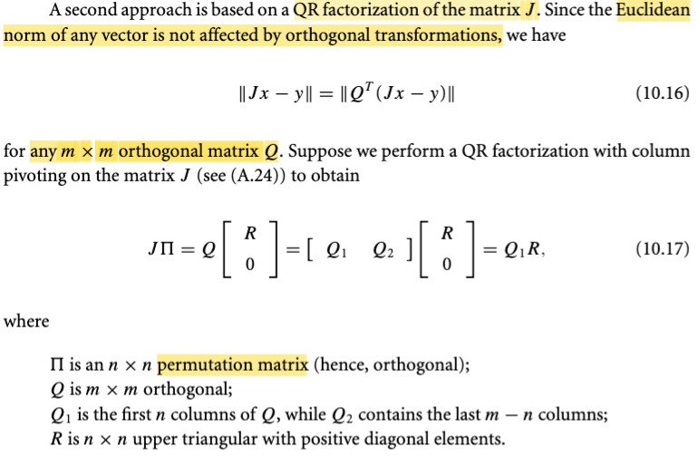
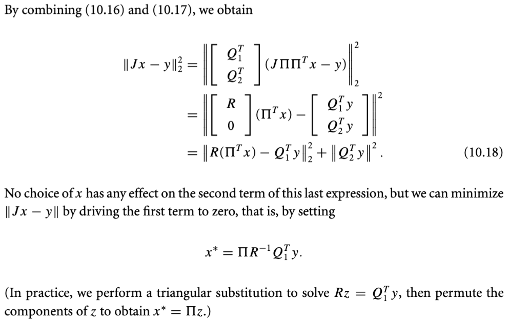

# 10.2 Linear Least-Square Problem

📊 **Progress:** `3` Notes | `5` Screenshots | `3` AI Reviews

---

## Bình phương tối thiểu tuyến tính

<kbd></kbd>

> [!NOTE]
> Thế thì phần 10.1 ta đã làm quen với bài toán least-square, và trong đó đã nói về Φ(x, t) là hàm dùng để dự đoán y từ input t dựa trên giá trị tham số x. Vậy thì nay, gs cho biết, rất nhiều khi người ta dùng hàm Φ là hàm tuyến tính theo x, khi đó ta có bài toán least-square tuyến tính (đây chính là linear regression)
>
>
>
> Thế thì, vì Φ(x, t) là hàm tuyến tính, nó sẽ kéo theo residual rj(x) = Φ(x,tj) - yj cũng là hàm tuyến tính. Do đó, nếu xét hàm r(x) (còn nhớ, nó là hàm vector → vector, nhận vào vector x, trả ra vector các rj(x) = Φ(x,tj) - yj) thì nó cũng la hàm tuyến tính theo x. Và như vậy, nhớ lại một ý đã học trong MIT 18s096, khi gs Steve nói về đạo hàm của hàm vector → vector, thì ông nói rằng: khi nói về cách để tìm Jacobian, nguyên tắc là ta sẽ đi tìm một linear operator act on vector dx để có df. Thì với việc dx và df đều là vector, linear operator duy nhất biến vector dx thành vector df chính là phép nhân với một matrix, do đó đạo hàm cấp một của hàm vector → vector là matrix, gọi là Jacobian matrix.
>
>
>
> Như vậy, tuy không liên quan lắm nhưng mình hiểu rằng, ở đây gs Nocedal chính là dùng lập luận đó: nói rằng, vì r(x) là hàm tuyến tính của x, nên nhất định nó phải có dạng một linear operator act on vector x: Và như vậy chỉ có thể là có dạng một matrix nào đó nhân với vector x mà thôi, ta gọi nó là matrix J: r(x) = Jx - y là vậy.
>
>
>
> Cũng có thể hiểu cách khác, vì rj(x) là hàm tuyến tính với vector x, và rj(x) là scalar, nên để có một hàm tuyến tính tác dụng lên vector x, để ra scalar rj(x) thì trong số các hàm vector → scalar, thì chỉ có hàm dot product là hàm tuyến tính. Như vậy rj(x) phải là dot product của vector x với vector gì đó không phụ thuộc x. Ta gọi vector đó là uj, thì ta có rj(x) = ujTx - yj.
>
>
>
> Ở đây cần lưu ý một chút, mình đã nghe điều này nhiều lần trong các lớp AI, S.Boyd: Thật ra nếu nói chính xác, thì việc Φ(x, t) là hàm linear thì hàm residual rj(x) = Φ(x, tj) - yj PHẢI LÀ HÀM AFFINE, chứ không phải là hàm linear.
>
> Lí do, linear function nếu chặt chẽ, phải thỏa tính chất f(α x + β) = α f(x) + β. Nhưng ở đây ko thỏa: rj(α x + β) = Φ(αx + β, tj) - yj = α Φ(x, tj) + β - yj, và cái này khác α rj(x) + β (= α \[Φ(x, tj) - yj\] + β = α Φ(x, tj) - αyj + β). Nhưng người ta kiểu như coi như nó là hàm tuyến tính.
>
>
>
> Như vậy, với rj(x) = yjTx - yj, thì đặt uj làm các hàng của một matrix, gọi là J, thì ta cũng có r(x) = Jx - y.
>
>
>
> ---
>
>
>
> Như vậy, objective lúc này trở thành: f(x) = (1/2)r(x)Tr(x) = (1/2)(Jx - y)T(Jx - y) = (1/2)||Jx - y||^2.
>
>
>
> Thử xem ∇f và Hessian ∇^2f là gì:
>
>
>
> Dùng kiến thức đã học trong MIT 18s096: ta sẽ tìm cách đưa df thành linear operator act on dx, khi đó sẽ thấy gradient ∇f:
>
>
>
> df = f(x + dx) - f(x) = (1/2)(J(x+dx) - y)T(J(x+dx) - y) - (1/2)(Jx - y)T(Jx - y)
>
>
>
> = (1/2) \[(J(x+dx) - y)T(J(x+dx) - y) - (Jx - y)T(Jx - y)\]
>
>
>
> = (1/2) \[(Jx + Jdx - y)T(Jx + Jdx - y) - (Jx - y)T(Jx - y)\]
>
>
>
> = (1/2) \[(xTJT + dxTJT - yT)(Jx + Jdx - y) - (xTJT - yT)(Jx - y)\]
>
>
>
> = (1/2) \[xTJTJx + dxTJTJx - yTJx + xTJTJdx + dxTJTJdx - yTJdx - xTJTy - dxTJTy + yTy - (xTJTJx - yTJx - xTJTy + yTy)\]
>
>
>
> = (1/2) \[xTJTJx + dxTJTJx - yTJx + xTJTJdx + dxTJTJdx - yTJdx - xTJTy - dxTJTy + yTy - xTJTJx + yTJx + xTJTy - yTy\]
>
>
>
> Bỏ hết các term bậc 2, và cancel out hết ta còn:
>
>
>
> = (1/2) \[2xTJTJdx - 2yTJdx\]
>
>
>
> = (xTJTJ - yTJ)dx
>
>
>
> = \[(xTJT - yT)J\]dx
>
>
>
> Vậy tại đây ta có df = (xTJTJ - yTJ)dx
>
>
>
> ⇨ ∇f(x) = \[(xTJT - yT)J\]T = JT((xTJT - yT)T = **JT(Jx - y)** → đây **chính là công thức trong sách.**
>
>
>
> Còn Hessian, có hai cách làm, đưa df thành bilinear form của dx và dx' hoặc đưa d∇f về dạng linear operator act on dx.
>
>
>
> Dùng cách hai cho dễ:
>
>
>
> Xét d∇f(x) = ∇f(x + dx) - ∇f(x) = JT(J(x+dx) - y) - JT(Jx - y)
>
>
>
> = JT(Jx + Jdx - y) - JT(Jx - y)
>
>
>
> = JTJx + JTJdx - JTy - JTJx + JTy
>
>
>
> = JTJdx
>
>
>
> Tới đây ta đã có kết quả thể hiện d ∇f(x) ở dạng một linear operator act on dx, và vì với hàm ∇f(x) là vector → vector function, nên linear operator act on vector dx cho ra vector df chỉ có thể là một matrix. Và với kết quả trên thì **Jacobian chính là JTJ** (J transposed J, dĩ nhiên là matrix đối xứng)
>
>
>
> ---
>
>
>
> Tiếp, một ý cũng không khó hiểu: Ông nói hàm f(x) là convex (hàm lồi): Vì sao lồi?
>
>
>
> Nhờ ee364A, và Convex Optimization của S.Boyd, mình biết, để chứng minh hàm lồi thì có thể dựa vào định nghĩa: là hàm f muốn lồi thì nó phải thỏa: f(αx + (1-α)y) ≤ αf(x) + (1-α)f(y). Hoặc dùng các theorem: Điều kiện đủ cho hàm lồi bậc hai: đạo hàm cấp hai phải luôn không âm (Hessian luôn xác định bán dương).
>
>
>
> Ở đây ta dùng điều kiện đủ bậc hai, cho dễ dễ thấy, ta đã có Hessian là JTJ, thì như đã biết JTJ chắc chắn là positive semi definite: Chỉ cần xét quadratic form của nó (nhớ MIT 18.06 ta biết, chỉ cần chỉ ra quadratic form của nó luôn ko âm): zTJTJz = (JTz)T(JTz) = ||JTz||^2, đây là bình phương của norm của vector JTz, dĩ nhiên luôn không âm. Kết luận JTJ possitive semi definite ⇨ f là hàm lồi.
>
>
>
> ---
>
>
>
> Và cuối cùng, vì f là hàm lồi, bài toán minimize f, ko có constraint gì, dĩ nhiên là bài toán lồi (convex optimization problem). (nếu đúng, phải xét thêm domain là tập lồi nữa, nhưng domain ở đây là R^n, dĩ nhiên là tập lồi). Và lúc này, dùng một theorem nói rằng, khi x **là điểm có gradient vanish, nó là local minimizer thì cũng sẽ là global minimizer luôn. (Ở đây có hai kiến thức lồng vào: x** là có ∇f(x**) = 0 → nó là critical point, nhưng với hàm lồi, thì chứng tỏ nó cũng là local minimizer do độ cong không âm kiến khi đi ra xa khỏi x**, hàm chỉ có thể đi lên. Và cùng vì tính chất hàm lồi, đảm bảo không thể có vụ đi xuống lại, nên ko thể có local minimizer nào khác.
>
>
>
> Như vậy, chỉ cần giải điều kiện gradient vanish là đủ để tìm minimizer:
>
>
>
> JT(Jx\* - y) = 0 ⇔ JTJx = JTy.
>
>
>
> Và đây, gs nói, cũng chính là normal equation.

> [!TIP]
> **🤖 AI Feedback** — ✅ Score: **100/100**
>
> Ghi chú của bạn cực kỳ chi tiết, chính xác và thể hiện sự hiểu biết sâu sắc về từng khái niệm. Việc bạn tự mình chứng minh gradient và Hessian, cũng như giải thích tính lồi và phương trình chuẩn từ các nguyên tắc cơ bản, là rất ấn tượng.

 

### Giải phương trình chuẩn Cholesky

<kbd></kbd>

<kbd></kbd>

> [!NOTE]
> Thế thì phần tiếp theo, gs sẽ mô tả sơ vài thuật toán chính giúp giải bài toán này.
>
>
>
> Thì cái đầu tiên đơn giản là giải cái normal equation này JTJx = JTy, vì nghiệm của nó chính là solution của bài toán này. (Đây là lúc ta nhớ lúc trước có chỗ thấy người ta nói bài toán không có closed-form solution, thì mình hiểu rằng, tức là không phải bài toán nào cũng có solution thể hiện dưới dạng closed-form, ví dụ như ở đây, về cơ bản, là có thể, vì nhân hai vế cho JTJinv, ta sẽ có x = (JTJ)invJTy. (với việc giả định J full column rank thì ta sẽ có JTJ invertible)
>
>
>
> Rồi, thế thì, để giải normal equation, đại khái thuật toán sẽ làm 3 bước:
>
>
>
> i) Tính toán ra matrix hệ số JTJ và vector JTy
>
>
>
> ii) Phân tách matrix JTJ thành dạng tích của hai matrix tam giác thông qua phép phân rã Cholesky.
>
>
>
> iii) Giải lần lượt hai hệ phương trình tuyến tính với mà mỗi hệ đều có matrix hệ số là tam giác, khiến quá trình chỉ là back hay forward substitution.
>
>
>
> Thế thì trong bước 2, gs cho biết ta sẽ đảm bảo có thể phân tách được JTJ thành R'TR' (trong sách là R_bar) nếu m ≥ n và J full column rank. Thử phân tích xem vì sao?
>
>
>
> Nếu m ≥ n, thì tức là ta có matrix J cao ốm (nhiều hàng hơn cột), và full column rank tức mọi cột độc lập và khi đó JTJ sẽ full rank (chứng minh nhanh: Giả sử **A full rank nhưng ATA không fullrank** → tồn tại x khác 0 khiến ATAx = 0. A full rank thì Ax phải khác 0 khi x khác 0 do nullspace của A chỉ có {0}. Mà AT(Ax) = 0 ⇨ Ax nằm trong left nullspace C(AT), là orthogonal complement với column space C(A) (cặp orthogonal complemt còn lại là nullspace và rowspace). Nhưng với x khác 0 thì Ax do A full column rank, sẽ phải nằm trong C(A), là vector khác 0 trong C(A).Do đó không thể có chuyện nó là left nullspace vector được. Như vậy mâu thuẫn giả thiết. Nên ATA phải full rank. Vậy áp dụng vào đây, J full column rank thì JTJ full rank.
>
>
>
> Ngoài ra, vì JTJ là gram matrix, là matrix positive semi definite (check quadratic form uTJTJu = (Ju)TJu = ||Ju||^2 ≥ 0 với mọi u), điều này đồng nghĩa mọi eigenvalue không âm, mà ở trên đã nói nó full rank, tức là không có eigenvalue bằng 0.
>
>
>
> Vậy, JTJ là matrix **xác định dương** (positive definite) → Thoả điều kiện tồn tại của Cholesky factorization.
>
>
>
> ---
>
>
>
> Tiếp, ông nói cách làm này cơ bản cũng tốt nhưng có nhược điểm chí mạng là condition number của JTJ = bình phương của condition number của J, mà relative error của solution lại thường là tỉ lệ thuận với condition number. Do đó, sai số của phương pháp này thường lớn hơn các phương pháp khác. Và hơn nữa, có thể khi J có condition number quá lớn (gọi là ill condition) thì thuật toán này còn có thể fail (do bước phân rã Cholesky fail do eigenvalue bằng 0 do lỗi làm tròn)
>
>
>
> Cùng phân tích chút xíu về đoạn này.
>
>
>
> Còn nhớ đã học trong MIT 18.06 condition number của matrix A được định nghĩa là tỉ lệ của stretching factor lớn nhất và nhỏ nhất của A: κ(A) = max_x (||Ax||/||x||) / min_x (||Ax||/||x||), và thật ra biến đổi chút cộng với định nghĩa của norm A là max_x ||Ax|| / ||x||, thì ta có κ(A) = ||A|| . ||Ainv||.
>
>
>
> Vậy thì ta thử giải thích vì sao sai số tương đối lại tỉ lệ thuận với condition number.
>
>
>
> Sai số nói đến ở đây, dĩ nhiên là sai số khi giải hệ, Ax = b (vì đang nói đến việc giải normal equation, có bản chất cũng chỉ là giải hệ tuyến tính với A là JTJ, b là JTy).
>
>
>
> Thế thì, giả sử x là solution của hệ, ta có x thỏa Ax = b. Sai số phát sinh khi nào? → Là khi b bị vì lí do gì đó, thay đổi một khoảng Δb, trở thành b + Δb. Khi đó solution của hệ phải thay đổi, trở thành x + Δx. Và Δx là sai số tuyệt đối. Dễ thấy AΔx = Δb.
>
>
>
> Giả sử A invertible, ta có Δx = Ainv Δb. ⇨ ||Δx|| = ||Ainv Δb||, và cái này, là norm của vector kết qủa khi dùng Ainv transform Δb, nên nó luôn nhỏ hơn việc lấy stretching factor lớn nhất đem stretch Δb: ||Ainv|| ||Δb|| ⇨ ||Δx|| = ||Ainv Δb|| ≤ ||Ainv|| ||Δb||
>
>
>
> Tiếp, xét x thỏa Ax = b ⇨ ||b|| = ||Ax|| ≤ ||A|| ||x|| ⇨ 1/||x|| ≤ ||A||/||b||
>
>
>
> Nhân vế theo vế của ||Δx|| ≤ ||Ainv|| ||Δb|| và 1/||x|| ≤ ||A||/||b||, ta có: 
>
>
>
> ||Δx|| / ||x|| ≤ ||Ainv|| ||Δb|| ||A|| / ||b|| = ||Ainv|| ||A|| (||Δb|| / ||b||)
>
>
>
> ⇔ relative error (=||Δx|| / ||x||) ≤ \[||Ainv|| ||A||\] × \[||Δb|| / ||b||\]
>
>
>
> Như vậy, **sai số tương đối ||Δx|| / ||x|| sẽ tỉ lệ thuận với ||Ainv|| ||A||** và **cả ||Δb|| / ||b||**, là biến động tương đối của b. Thì trong đó **||Ainv|| ||A|| chính là κ(A)**, nên giúp ta hiểu vì sao gs Nocedal nói "...Since the **relative error** in the computed solution of a problem is usually **proportional** to the **condition num-ber**.."
>
>
>
> ---
>
>
>
> Rồi, vì sao gs nói "the condition number of JTJ is the square of the condition number of J"?
>
>
>
> Để hiểu, ta sẽ quay lại định nghĩa của κ(A): tỉ lệ stretching factor lớn nhất / nhỏ nhất.
>
>
>
> Như đã nói stretching factor lớn nhất, chính là định nghĩa của norm A: ||A|| = max_x ||Ax|| / ||x||. Vậy thì ta sẽ thử mổ xẻ bài toán này: maximize_x ||Ax|| / ||x||. Đối mặt với bài toán tối ưu này, nhận thấy ||Ax|| / ||x|| là hàm không âm, và hàm quadratic thì đồng biến với input không âm, nên ta sẽ chuyển thành bài toán tương đương: maximize_x ||Ax||^2 / ||x||^2 = (Ax)T(Ax) / xTx = xTATAx / xTx (cái này trong MIT 1806, sách thầy Strang mình biết gọi là Rayleint quotient).
>
>
>
> Tiếp, nhận ra ATA là Gram matrix, là matrix đối xứng, nên luôn tồn tại phép phân rã eigenvalue với bộ eigenvector vuông góc: (ATA) = Q Λ QT. ⇨ xTATAx / xTx = xTQΛQTx / xTx. Bài toán trở thành maximize_x xTQΛQTx / xTx , đổi biến: Đặt y = QTx ⇨ yTy = (xTQQTx) = xTx ta có bài toán maximize yTΛy / yTy
>
>
>
> Σi λmin(ATA) yi^2 ≤ yTΛy = Σi λi yi^2 ≤ Σi λmax(ATA) yi^2
>
>
>
> ⇔ λmin(ATA) Σi yi^2 ≤ yTΛy = Σi λi yi^2 ≤ λmax(ATA) Σi yi^2
>
>
>
> ⇔ λmin(ATA) ||y||^2 ≤ yTΛy = Σi λi yi^2 ≤ λmax(ATA) ||y||^2
>
>
>
> ⇨ λmin(ATA) ≤ yTΛy / yTy = Σi λi yi^2 ≤ λmax(ATA)
>
>
>
> ⇨ yTΛy / yTy, cũng là ||Ax||^2 / ||x||^2 đạt max = λmax(ATA) và đạt min = λmin(ATA)
>
>
>
> ⇨ ||Ax|| / ||x|| đạt max = √ λmax(ATA) và đạt min = √λmin(ATA)
>
>
>
> Vậy κ(A) = √ λmax(ATA) / √λmin(ATA)
>
>
>
> Tiếp. Dùng quan hệ của eigenvalue của ATA và singular value của A:
>
>
>
> Ta biết, bất cứ matrix nào cũng có phép phân tách SVD: Có bản chất là: mapping một orthogonal basis của rowspace (đặt là các cột của matrix V) và orthogonal basis của columnspace (đặt là các cột của U): Avi = σiui, i = 1,2....⇨ AV = UΣ. Với việc V có các cột orthogonal: VVT = I_r (r là rank) nhân hai vế cho VT, ta có A = U Σ VT.
>
>
>
> Xét ATA, áp cái SVD factorization của A vào: ATA = (U Σ VT)T (U Σ VT) = (V ΣT UT)(U Σ VT) = V ΣT UTU Σ VT = V ΣTΣ VT, và đây cũng chính là eigen-decomposition của ATA, giúp kết luận σ(A)^2 = λ(ATA) ⇨ σ(A) = √λ(ATA).
>
>
>
> Từ đó, κ(A) = √ λmax(ATA) / √λmin(ATA) = σmax(A) / σmin(A).
>
>
>
> Nếu áp dụng công thức này, thì κ(ATA) = √λmax(\[ATA\]T\[ATA\])/√λmin(\[ATA\]T\[ATA\])
>
>
>
> = √λmax(\[ATA ATA\])/√λmin(\[ATA ATA\])
>
>
>
> = √λmax(\[ATA\]^2)/√λmin(\[ATA\]^2)
>
>
>
> Ôn nhanh tính chất này giả sử u và λ là eigenvector/value của A: Au = λu ⇨ A^2u = A λu = λ Au = λ^2 u ⇨ u cũng là eigenvector ứng với eigenvalue là λ^2, tức là eigenvalue của A^2 = \[eigenvalue tương ứng của A\]^2. Nếu A là matrix có eigenvalue không âm, ví dụ như matrix ATA, thì khi đó dễ thấy ta sẽ có thể nói, λmax(A^2) = \[λmax(A)\]^2, và λmin(A^2) = \[λmin(A)\]^2
>
>
>
> Vậy λmax\[(ATA)^2\] = \[λmax(ATA)\]^2 và λmin(\[ATA\]^2) = \[λmin(ATA)\]^2
>
>
>
> ⇨ √λmax(\[ATA\]^2)/√λmin(\[ATA\]^2) = λmax(ATA) / λmin(ATA)
>
>
>
> và cái này = \[√λmax(ATA) / √λmin(ATA)\]^2 = \[κ(A)\]^2
>
>
>
> Vậy ta đã thấy κ(ATA) = \[κ(A)\]^2 ⇨ giúp hiểu vì sao gs nói "the condition number of JTJ is the square of the condition number of J"
>
>
>
> ---
>
>
>
> Một ý cuối cùng, ông nói khi ill-condition, thì Cholesky có thể fail luôn do lỗi làm tròn số khiến đường chéo âm.

> [!TIP]
> **🤖 AI Feedback** — ✅ Score: **99/100**
>
> Phân tích của bạn cực kỳ sâu sắc và chính xác, đặc biệt với các chứng minh toán học chi tiết về điều kiện tồn tại của Cholesky factorization và mối quan hệ của số điều kiện. Tiếp tục duy trì mức độ đào sâu kiến thức và khả năng kết nối các khái niệm toán học này.

 

#### Optimal x* Solution

<kbd></kbd>

<kbd></kbd>

> [!NOTE]
> Rồi, tiếp, ta sẽ nói về cách tiếp cận thứ hai của việc giải bài toán linear least square:
>
>
>
> Nhắc lại nhiệm vụ: minimize residual ||Jx - y||
>
>
>
> Thì QR factorization cho ta một cách làm: GỈA SỬ (BẰNG THUẬT TOÁN NÀO ĐÓ, TA CÓ THỂ FACTOR J THÀNH: J Π = \[Q1, Q2\] \[R; 0\], ta sẽ áp dụng cái này vào việc giải bài toán tối ưu:
>
>
>
> Objective là norm của vector Jx - y, thì vì Q là orthogonal matrix, nên QT cũng vậy, nên nó không thay đổi norm. Nên ta có thể chuyển thành bài toán equivalient với objective,:
>
>
>
> ⇔ minimize ||QT(Jx - y)||
>
>
>
> Dĩ nhiên, vì norm ko âm, nên again, ta có thể minimize squared norm:
>
>
>
> ⇔ minimize ||QT(Jx - y)||^2
>
>
>
> Thay QT = \[Q1, Q2\]T = \[Q1T; Q2T\] và Jx = J Π ΠT x vào (vì Π là permutation matrix, nên Π ΠT = Π Πinv = I)
>
>
>
> QT(Jx - y) = \[Q1T; Q2T\](J Π ΠT x - y)
>
>
>
> = \[Q1T; Q2T\] J Π ΠT x - \[Q1T; Q2T\]y
>
>
>
> Thay J Π = \[Q1, Q2\] \[R; 0\]
>
>
>
> = \[Q1T; Q2T\] \[Q1, Q2\] \[R; 0\] ΠT x - \[Q1T; Q2T\]y
>
>
>
> = \[R; 0\] ΠT x - \[Q1T; Q2T\]y
>
>
>
> Vậy ||QT(Jx - y)||^2 = ||\[R; 0\] ΠT x - \[Q1T; Q2T\]y||^2 (đây là dấu bằng thứ 2)
>
>
>
> Tiếp, với argmented vector \[a;b\], ví dụ vector \[x1, x2, x3, x4\]T tách thành hai khúcp \[\[x1, x2\]; \[x3, x4\]\], thì norm của nó, tức ||\[x1, x2, x3, x4\]||^2 = x1^2 + x2^2 + x3^2 + x4^2 dĩ nhiên cũng là ||\[x1,x2\]||^2 + ||\[x3,x4\]||^2.
>
>
>
> Nên xét vector \[R; 0\] ΠT x - \[Q1T; Q2T\]y, nó cũng chính là hai vector này nối lại: \[RΠT x - Q1Ty\] và \[0 - Q2Ty\] 
>
>
>
> ⇨ ||\[R; 0\] ΠT x - \[Q1T; Q2T\]y||^2 
>
>
>
> = ||\[RΠT x - Q1Ty\]||^2 + ||\[0 - Q2Ty\]||^2
>
>
>
> = ||\[RΠT x - Q1Ty\]||^2 + ||\[Q2Ty\]||^2 → 10.18
>
>
>
> Và tới đây, vì biến tối ưu của bài toán này là x, term thứ hai chỉ là constant, nên bài toán tối ưu một lần nữa, equivalent với:
>
>
>
> minimize  ||\[RΠT x - Q1Ty\]||^2
>
>
>
> Và nó là square norm của \[RΠT x - Q1Ty\] đó, nên nó nhỏ nhất khi nó bằng 0: RΠT x - Q1Ty = 0 ⇔ RΠT x = Q1Ty
>
>
>
> Vậy là bài toán trở thành giải hệ RΠT x = Q1Ty
>
>
>
> Bước 1: giải R z = Q1Ty, ra z, đây là hệ có matrix hệ số tam giác → chỉ là back-subsititution, tốn O(n^2)
>
>
>
> Bước 2: Giải ΠT x = z, và hệ này matrix hệ số chỉ là permutation matrix, ⇨ x = Π z, chỉ là việc sắp xếp (hoán vị) lại các phần tử của z (ko tốn gì) (đây là ý mà gs Nocedal nói "perform triangular substitution to solve Rz = Q1Ty, then PERMUTE the component of z  to obtain x\*)

> [!TIP]
> **🤖 AI Feedback** — ✅ Score: **100/100**
>
> Phần ghi chú này cung cấp một quá trình dẫn xuất từng bước cực kỳ rõ ràng và chi tiết cho phương pháp phân tích QR trong bài toán bình phương tối thiểu tuyến tính, giải thích kỹ lưỡng từng phép biến đổi và lý do của nó. Việc liên hệ với các bước triển khai thực tế cũng được trình bày rất tốt.

 

