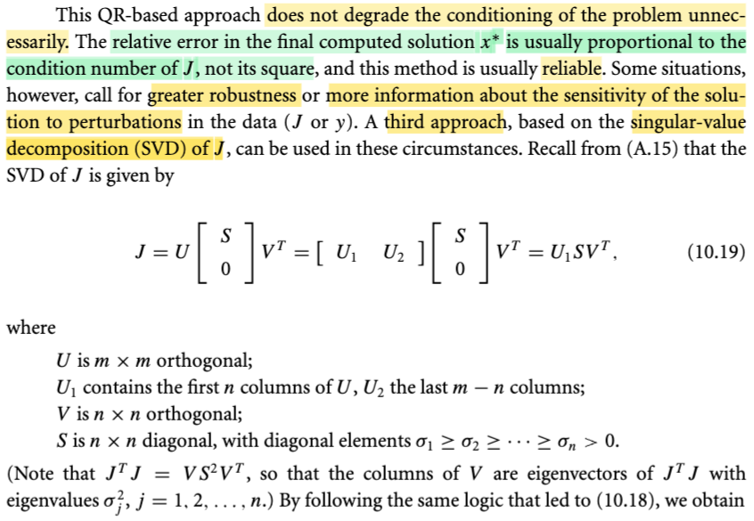
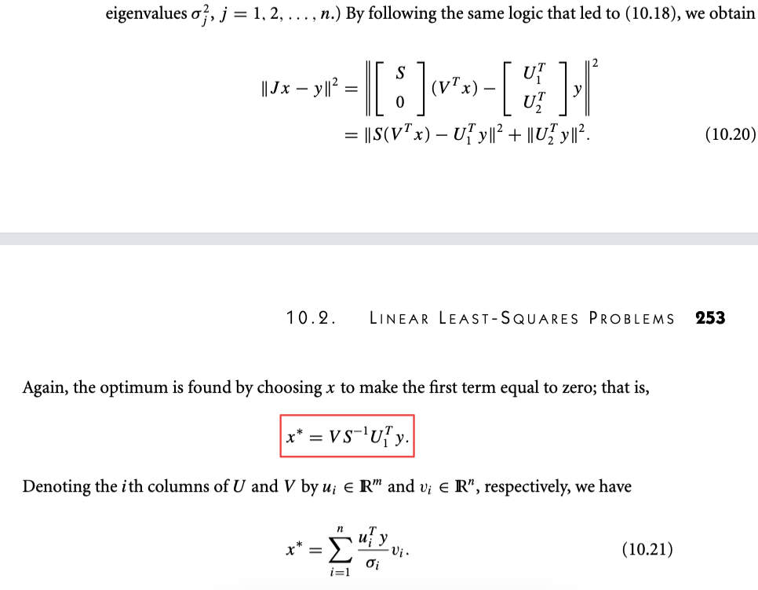
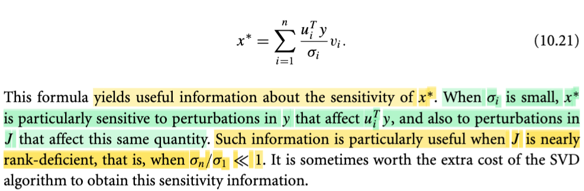
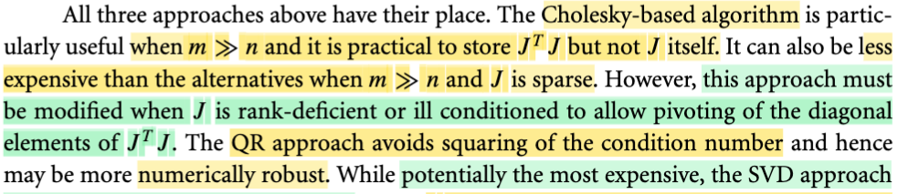
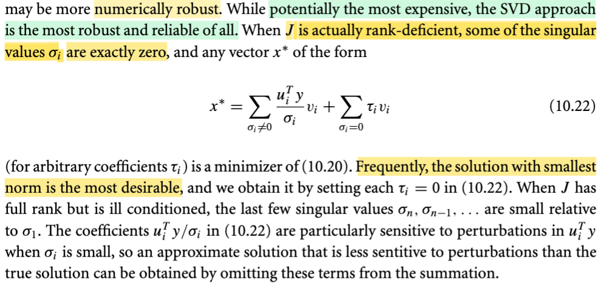

# 10.2 Linear Least-Square Problem

📊 **Progress:** `7` Notes | `10` Screenshots | `6` AI Reviews

---

## Bình phương tối thiểu tuyến tính

<kbd></kbd>

> [!NOTE]
> Thế thì phần 10.1 ta đã làm quen với bài toán least-square, và trong đó đã nói về Φ(x, t) là hàm dùng để dự đoán y từ input t dựa trên giá trị tham số x. Vậy thì nay, gs cho biết, rất nhiều khi người ta dùng hàm Φ là hàm tuyến tính theo x, khi đó ta có bài toán least-square tuyến tính (đây chính là linear regression)
>
>
>
> Thế thì, vì Φ(x, t) là hàm tuyến tính, nó sẽ kéo theo residual rj(x) = Φ(x,tj) - yj cũng là hàm tuyến tính. Do đó, nếu xét hàm r(x) (còn nhớ, nó là hàm vector → vector, nhận vào vector x, trả ra vector các rj(x) = Φ(x,tj) - yj) thì nó cũng la hàm tuyến tính theo x. Và như vậy, nhớ lại một ý đã học trong MIT 18s096, khi gs Steve nói về đạo hàm của hàm vector → vector, thì ông nói rằng: khi nói về cách để tìm Jacobian, nguyên tắc là ta sẽ đi tìm một linear operator act on vector dx để có df. Thì với việc dx và df đều là vector, linear operator duy nhất biến vector dx thành vector df chính là phép nhân với một matrix, do đó đạo hàm cấp một của hàm vector → vector là matrix, gọi là Jacobian matrix.
>
>
>
> Như vậy, tuy không liên quan lắm nhưng mình hiểu rằng, ở đây gs Nocedal chính là dùng lập luận đó: nói rằng, vì r(x) là hàm tuyến tính của x, nên nhất định nó phải có dạng một linear operator act on vector x: Và như vậy chỉ có thể là có dạng một matrix nào đó nhân với vector x mà thôi, ta gọi nó là matrix J: r(x) = Jx - y là vậy.
>
>
>
> Cũng có thể hiểu cách khác, vì rj(x) là hàm tuyến tính với vector x, và rj(x) là scalar, nên để có một hàm tuyến tính tác dụng lên vector x, để ra scalar rj(x) thì trong số các hàm vector → scalar, thì chỉ có hàm dot product là hàm tuyến tính. Như vậy rj(x) phải là dot product của vector x với vector gì đó không phụ thuộc x. Ta gọi vector đó là uj, thì ta có rj(x) = ujTx - yj.
>
>
>
> Ở đây cần lưu ý một chút, mình đã nghe điều này nhiều lần trong các lớp AI, S.Boyd: Thật ra nếu nói chính xác, thì việc Φ(x, t) là hàm linear thì hàm residual rj(x) = Φ(x, tj) - yj PHẢI LÀ HÀM AFFINE, chứ không phải là hàm linear.
>
> Lí do, linear function nếu chặt chẽ, phải thỏa tính chất f(α x + β) = α f(x) + β. Nhưng ở đây ko thỏa: rj(α x + β) = Φ(αx + β, tj) - yj = α Φ(x, tj) + β - yj, và cái này khác α rj(x) + β (= α \[Φ(x, tj) - yj\] + β = α Φ(x, tj) - αyj + β). Nhưng người ta kiểu như coi như nó là hàm tuyến tính.
>
>
>
> Như vậy, với rj(x) = yjTx - yj, thì đặt uj làm các hàng của một matrix, gọi là J, thì ta cũng có r(x) = Jx - y.
>
>
>
> ---
>
>
>
> Như vậy, objective lúc này trở thành: f(x) = (1/2)r(x)Tr(x) = (1/2)(Jx - y)T(Jx - y) = (1/2)||Jx - y||^2.
>
>
>
> Thử xem ∇f và Hessian ∇^2f là gì:
>
>
>
> Dùng kiến thức đã học trong MIT 18s096: ta sẽ tìm cách đưa df thành linear operator act on dx, khi đó sẽ thấy gradient ∇f:
>
>
>
> df = f(x + dx) - f(x) = (1/2)(J(x+dx) - y)T(J(x+dx) - y) - (1/2)(Jx - y)T(Jx - y)
>
>
>
> = (1/2) \[(J(x+dx) - y)T(J(x+dx) - y) - (Jx - y)T(Jx - y)\]
>
>
>
> = (1/2) \[(Jx + Jdx - y)T(Jx + Jdx - y) - (Jx - y)T(Jx - y)\]
>
>
>
> = (1/2) \[(xTJT + dxTJT - yT)(Jx + Jdx - y) - (xTJT - yT)(Jx - y)\]
>
>
>
> = (1/2) \[xTJTJx + dxTJTJx - yTJx + xTJTJdx + dxTJTJdx - yTJdx - xTJTy - dxTJTy + yTy - (xTJTJx - yTJx - xTJTy + yTy)\]
>
>
>
> = (1/2) \[xTJTJx + dxTJTJx - yTJx + xTJTJdx + dxTJTJdx - yTJdx - xTJTy - dxTJTy + yTy - xTJTJx + yTJx + xTJTy - yTy\]
>
>
>
> Bỏ hết các term bậc 2, và cancel out hết ta còn:
>
>
>
> = (1/2) \[2xTJTJdx - 2yTJdx\]
>
>
>
> = (xTJTJ - yTJ)dx
>
>
>
> = \[(xTJT - yT)J\]dx
>
>
>
> Vậy tại đây ta có df = (xTJTJ - yTJ)dx
>
>
>
> ⇨ ∇f(x) = \[(xTJT - yT)J\]T = JT((xTJT - yT)T = **JT(Jx - y)** → đây **chính là công thức trong sách.**
>
>
>
> Còn Hessian, có hai cách làm, đưa df thành bilinear form của dx và dx' hoặc đưa d∇f về dạng linear operator act on dx.
>
>
>
> Dùng cách hai cho dễ:
>
>
>
> Xét d∇f(x) = ∇f(x + dx) - ∇f(x) = JT(J(x+dx) - y) - JT(Jx - y)
>
>
>
> = JT(Jx + Jdx - y) - JT(Jx - y)
>
>
>
> = JTJx + JTJdx - JTy - JTJx + JTy
>
>
>
> = JTJdx
>
>
>
> Tới đây ta đã có kết quả thể hiện d ∇f(x) ở dạng một linear operator act on dx, và vì với hàm ∇f(x) là vector → vector function, nên linear operator act on vector dx cho ra vector df chỉ có thể là một matrix. Và với kết quả trên thì **Jacobian chính là JTJ** (J transposed J, dĩ nhiên là matrix đối xứng)
>
>
>
> ---
>
>
>
> Tiếp, một ý cũng không khó hiểu: Ông nói hàm f(x) là convex (hàm lồi): Vì sao lồi?
>
>
>
> Nhờ ee364A, và Convex Optimization của S.Boyd, mình biết, để chứng minh hàm lồi thì có thể dựa vào định nghĩa: là hàm f muốn lồi thì nó phải thỏa: f(αx + (1-α)y) ≤ αf(x) + (1-α)f(y). Hoặc dùng các theorem: Điều kiện đủ cho hàm lồi bậc hai: đạo hàm cấp hai phải luôn không âm (Hessian luôn xác định bán dương).
>
>
>
> Ở đây ta dùng điều kiện đủ bậc hai, cho dễ dễ thấy, ta đã có Hessian là JTJ, thì như đã biết JTJ chắc chắn là positive semi definite: Chỉ cần xét quadratic form của nó (nhớ MIT 18.06 ta biết, chỉ cần chỉ ra quadratic form của nó luôn ko âm): zTJTJz = (JTz)T(JTz) = ||JTz||^2, đây là bình phương của norm của vector JTz, dĩ nhiên luôn không âm. Kết luận JTJ possitive semi definite ⇨ f là hàm lồi.
>
>
>
> ---
>
>
>
> Và cuối cùng, vì f là hàm lồi, bài toán minimize f, ko có constraint gì, dĩ nhiên là bài toán lồi (convex optimization problem). (nếu đúng, phải xét thêm domain là tập lồi nữa, nhưng domain ở đây là R^n, dĩ nhiên là tập lồi). Và lúc này, dùng một theorem nói rằng, khi x **là điểm có gradient vanish, nó là local minimizer thì cũng sẽ là global minimizer luôn. (Ở đây có hai kiến thức lồng vào: x** là có ∇f(x**) = 0 → nó là critical point, nhưng với hàm lồi, thì chứng tỏ nó cũng là local minimizer do độ cong không âm kiến khi đi ra xa khỏi x**, hàm chỉ có thể đi lên. Và cùng vì tính chất hàm lồi, đảm bảo không thể có vụ đi xuống lại, nên ko thể có local minimizer nào khác.
>
>
>
> Như vậy, chỉ cần giải điều kiện gradient vanish là đủ để tìm minimizer:
>
>
>
> JT(Jx\* - y) = 0 ⇔ JTJx = JTy.
>
>
>
> Và đây, gs nói, cũng chính là normal equation.

> [!TIP]
> **🤖 AI Feedback** — ✅ Score: **100/100**
>
> Ghi chú của bạn cực kỳ chi tiết, chính xác và thể hiện sự hiểu biết sâu sắc về từng khái niệm. Việc bạn tự mình chứng minh gradient và Hessian, cũng như giải thích tính lồi và phương trình chuẩn từ các nguyên tắc cơ bản, là rất ấn tượng.

 

### Giải phương trình chuẩn Cholesky

<kbd></kbd>

<kbd></kbd>

> [!NOTE]
> Thế thì phần tiếp theo, gs sẽ mô tả sơ vài thuật toán chính giúp giải bài toán này.
>
>
>
> Thì cái đầu tiên đơn giản là giải cái normal equation này JTJx = JTy, vì nghiệm của nó chính là solution của bài toán này. (Đây là lúc ta nhớ lúc trước có chỗ thấy người ta nói bài toán không có closed-form solution, thì mình hiểu rằng, tức là không phải bài toán nào cũng có solution thể hiện dưới dạng closed-form, ví dụ như ở đây, về cơ bản, là có thể, vì nhân hai vế cho JTJinv, ta sẽ có x = (JTJ)invJTy. (với việc giả định J full column rank thì ta sẽ có JTJ invertible)
>
>
>
> Rồi, thế thì, để giải normal equation, đại khái thuật toán sẽ làm 3 bước:
>
>
>
> i) Tính toán ra matrix hệ số JTJ và vector JTy
>
>
>
> ii) Phân tách matrix JTJ thành dạng tích của hai matrix tam giác thông qua phép phân rã Cholesky.
>
>
>
> iii) Giải lần lượt hai hệ phương trình tuyến tính với mà mỗi hệ đều có matrix hệ số là tam giác, khiến quá trình chỉ là back hay forward substitution.
>
>
>
> Thế thì trong bước 2, gs cho biết ta sẽ đảm bảo có thể phân tách được JTJ thành R'TR' (trong sách là R_bar) nếu m ≥ n và J full column rank. Thử phân tích xem vì sao?
>
>
>
> Nếu m ≥ n, thì tức là ta có matrix J cao ốm (nhiều hàng hơn cột), và full column rank tức mọi cột độc lập và khi đó JTJ sẽ full rank (chứng minh nhanh: Giả sử **A full rank nhưng ATA không fullrank** → tồn tại x khác 0 khiến ATAx = 0. A full rank thì Ax phải khác 0 khi x khác 0 do nullspace của A chỉ có {0}. Mà AT(Ax) = 0 ⇨ Ax nằm trong left nullspace C(AT), là orthogonal complement với column space C(A) (cặp orthogonal complemt còn lại là nullspace và rowspace). Nhưng với x khác 0 thì Ax do A full column rank, sẽ phải nằm trong C(A), là vector khác 0 trong C(A).Do đó không thể có chuyện nó là left nullspace vector được. Như vậy mâu thuẫn giả thiết. Nên ATA phải full rank. Vậy áp dụng vào đây, J full column rank thì JTJ full rank.
>
>
>
> Ngoài ra, vì JTJ là gram matrix, là matrix positive semi definite (check quadratic form uTJTJu = (Ju)TJu = ||Ju||^2 ≥ 0 với mọi u), điều này đồng nghĩa mọi eigenvalue không âm, mà ở trên đã nói nó full rank, tức là không có eigenvalue bằng 0.
>
>
>
> Vậy, JTJ là matrix **xác định dương** (positive definite) → Thoả điều kiện tồn tại của Cholesky factorization.
>
>
>
> ---
>
>
>
> Tiếp, ông nói cách làm này cơ bản cũng tốt nhưng có nhược điểm chí mạng là condition number của JTJ = bình phương của condition number của J, mà relative error của solution lại thường là tỉ lệ thuận với condition number. Do đó, sai số của phương pháp này thường lớn hơn các phương pháp khác. Và hơn nữa, có thể khi J có condition number quá lớn (gọi là ill condition) thì thuật toán này còn có thể fail (do bước phân rã Cholesky fail do eigenvalue bằng 0 do lỗi làm tròn)
>
>
>
> Cùng phân tích chút xíu về đoạn này.
>
>
>
> Còn nhớ đã học trong MIT 18.06 condition number của matrix A được định nghĩa là tỉ lệ của stretching factor lớn nhất và nhỏ nhất của A: κ(A) = max_x (||Ax||/||x||) / min_x (||Ax||/||x||), và thật ra biến đổi chút cộng với định nghĩa của norm A là max_x ||Ax|| / ||x||, thì ta có κ(A) = ||A|| . ||Ainv||.
>
>
>
> Vậy thì ta thử giải thích vì sao sai số tương đối lại tỉ lệ thuận với condition number.
>
>
>
> Sai số nói đến ở đây, dĩ nhiên là sai số khi giải hệ, Ax = b (vì đang nói đến việc giải normal equation, có bản chất cũng chỉ là giải hệ tuyến tính với A là JTJ, b là JTy).
>
>
>
> Thế thì, giả sử x là solution của hệ, ta có x thỏa Ax = b. Sai số phát sinh khi nào? → Là khi b bị vì lí do gì đó, thay đổi một khoảng Δb, trở thành b + Δb. Khi đó solution của hệ phải thay đổi, trở thành x + Δx. Và Δx là sai số tuyệt đối. Dễ thấy AΔx = Δb.
>
>
>
> Giả sử A invertible, ta có Δx = Ainv Δb. ⇨ ||Δx|| = ||Ainv Δb||, và cái này, là norm của vector kết qủa khi dùng Ainv transform Δb, nên nó luôn nhỏ hơn việc lấy stretching factor lớn nhất đem stretch Δb: ||Ainv|| ||Δb|| ⇨ ||Δx|| = ||Ainv Δb|| ≤ ||Ainv|| ||Δb||
>
>
>
> Tiếp, xét x thỏa Ax = b ⇨ ||b|| = ||Ax|| ≤ ||A|| ||x|| ⇨ 1/||x|| ≤ ||A||/||b||
>
>
>
> Nhân vế theo vế của ||Δx|| ≤ ||Ainv|| ||Δb|| và 1/||x|| ≤ ||A||/||b||, ta có:
>
>
>
> ||Δx|| / ||x|| ≤ ||Ainv|| ||Δb|| ||A|| / ||b|| = ||Ainv|| ||A|| (||Δb|| / ||b||)
>
>
>
> ⇔ relative error (=||Δx|| / ||x||) ≤ \[||Ainv|| ||A||\] × \[||Δb|| / ||b||\]
>
>
>
> Như vậy, **sai số tương đối ||Δx|| / ||x|| sẽ tỉ lệ thuận với ||Ainv|| ||A||** và **cả ||Δb|| / ||b||**, là biến động tương đối của b. Thì trong đó **||Ainv|| ||A|| chính là κ(A)**, nên giúp ta hiểu vì sao gs Nocedal nói "...Since the **relative error** in the computed solution of a problem is usually **proportional** to the **condition num-ber**.."
>
>
>
> ---
>
>
>
> Rồi, vì sao gs nói "the condition number of JTJ is the square of the condition number of J"?
>
>
>
> Để hiểu, ta sẽ quay lại định nghĩa của κ(A): tỉ lệ stretching factor lớn nhất / nhỏ nhất.
>
>
>
> Như đã nói stretching factor lớn nhất, chính là định nghĩa của norm A: ||A|| = max_x ||Ax|| / ||x||. Vậy thì ta sẽ thử mổ xẻ bài toán này: maximize_x ||Ax|| / ||x||. Đối mặt với bài toán tối ưu này, nhận thấy ||Ax|| / ||x|| là hàm không âm, và hàm quadratic thì đồng biến với input không âm, nên ta sẽ chuyển thành bài toán tương đương: maximize_x ||Ax||^2 / ||x||^2 = (Ax)T(Ax) / xTx = xTATAx / xTx (cái này trong MIT 1806, sách thầy Strang mình biết gọi là Rayleint quotient).
>
>
>
> Tiếp, nhận ra ATA là Gram matrix, là matrix đối xứng, nên luôn tồn tại phép phân rã eigenvalue với bộ eigenvector vuông góc: (ATA) = Q Λ QT. ⇨ xTATAx / xTx = xTQΛQTx / xTx. Bài toán trở thành maximize_x xTQΛQTx / xTx , đổi biến: Đặt y = QTx ⇨ yTy = (xTQQTx) = xTx ta có bài toán maximize yTΛy / yTy
>
>
>
> Σi λmin(ATA) yi^2 ≤ yTΛy = Σi λi yi^2 ≤ Σi λmax(ATA) yi^2
>
>
>
> ⇔ λmin(ATA) Σi yi^2 ≤ yTΛy = Σi λi yi^2 ≤ λmax(ATA) Σi yi^2
>
>
>
> ⇔ λmin(ATA) ||y||^2 ≤ yTΛy = Σi λi yi^2 ≤ λmax(ATA) ||y||^2
>
>
>
> ⇨ λmin(ATA) ≤ yTΛy / yTy = Σi λi yi^2 ≤ λmax(ATA)
>
>
>
> ⇨ yTΛy / yTy, cũng là ||Ax||^2 / ||x||^2 đạt max = λmax(ATA) và đạt min = λmin(ATA)
>
>
>
> ⇨ ||Ax|| / ||x|| đạt max = √ λmax(ATA) và đạt min = √λmin(ATA)
>
>
>
> Vậy κ(A) = √ λmax(ATA) / √λmin(ATA)
>
>
>
> Tiếp. Dùng quan hệ của eigenvalue của ATA và singular value của A:
>
>
>
> Ta biết, bất cứ matrix nào cũng có phép phân tách SVD: Có bản chất là: mapping một orthogonal basis của rowspace (đặt là các cột của matrix V) và orthogonal basis của columnspace (đặt là các cột của U): Avi = σiui, i = 1,2....⇨ AV = UΣ. Với việc V có các cột orthogonal: VVT = I_r (r là rank) nhân hai vế cho VT, ta có A = U Σ VT.
>
>
>
> Xét ATA, áp cái SVD factorization của A vào: ATA = (U Σ VT)T (U Σ VT) = (V ΣT UT)(U Σ VT) = V ΣT UTU Σ VT = V ΣTΣ VT, và đây cũng chính là eigen-decomposition của ATA, giúp kết luận σ(A)^2 = λ(ATA) ⇨ σ(A) = √λ(ATA).
>
>
>
> Từ đó, κ(A) = √ λmax(ATA) / √λmin(ATA) = σmax(A) / σmin(A).
>
>
>
> Nếu áp dụng công thức này, thì κ(ATA) = √λmax(\[ATA\]T\[ATA\])/√λmin(\[ATA\]T\[ATA\])
>
>
>
> = √λmax(\[ATA ATA\])/√λmin(\[ATA ATA\])
>
>
>
> = √λmax(\[ATA\]^2)/√λmin(\[ATA\]^2)
>
>
>
> Ôn nhanh tính chất này giả sử u và λ là eigenvector/value của A: Au = λu ⇨ A^2u = A λu = λ Au = λ^2 u ⇨ u cũng là eigenvector ứng với eigenvalue là λ^2, tức là eigenvalue của A^2 = \[eigenvalue tương ứng của A\]^2. Nếu A là matrix có eigenvalue không âm, ví dụ như matrix ATA, thì khi đó dễ thấy ta sẽ có thể nói, λmax(A^2) = \[λmax(A)\]^2, và λmin(A^2) = \[λmin(A)\]^2
>
>
>
> Vậy λmax\[(ATA)^2\] = \[λmax(ATA)\]^2 và λmin(\[ATA\]^2) = \[λmin(ATA)\]^2
>
>
>
> ⇨ √λmax(\[ATA\]^2)/√λmin(\[ATA\]^2) = λmax(ATA) / λmin(ATA)
>
>
>
> và cái này = \[√λmax(ATA) / √λmin(ATA)\]^2 = \[κ(A)\]^2
>
>
>
> Vậy ta đã thấy κ(ATA) = \[κ(A)\]^2 ⇨ giúp hiểu vì sao gs nói "the condition number of JTJ is the square of the condition number of J"
>
>
>
> Vậy kết hợp hai ý: 
>
>
>
> i) sai số tương đối của hệ Ax = b sẽ tỉ lệ thuận với condition number của A, vậy sai số tương đối khi ta giải hệ normal equation JTJx = JTy sẽ tỉ lệ thuận với condition number của JTJ.
>
>
>
> ii) mà condition number của JTJ lại là bình phương condition number của J, nên nếu J ill-condition, tức có condition number lớn → condition number của JTJ càng lớn bạo → sai số tương đối của việc giải hệ JTJx = JTy, sẽ rất lớn. Đây chính là nhược điểm của cách làm thứ nhất này.
>
>
>
> ---
>
>
>
> Một ý cuối cùng, ông nói khi ill-condition, thì Cholesky có thể fail luôn do lỗi làm tròn số khiến đường chéo âm.

> [!TIP]
> **🤖 AI Feedback** — ✅ Score: **99/100**
>
> Phân tích của bạn cực kỳ sâu sắc và chính xác, đặc biệt với các chứng minh toán học chi tiết về điều kiện tồn tại của Cholesky factorization và mối quan hệ của số điều kiện. Tiếp tục duy trì mức độ đào sâu kiến thức và khả năng kết nối các khái niệm toán học này.

 

#### Optimal x* Solution

<kbd></kbd>

<kbd></kbd>

> [!NOTE]
> Rồi, tiếp, ta sẽ nói về cách tiếp cận thứ hai của việc giải bài toán linear least square:
>
>
>
> Nhắc lại nhiệm vụ: minimize residual ||Jx - y||
>
>
>
> Thì QR factorization cho ta một cách làm: GỈA SỬ (BẰNG THUẬT TOÁN NÀO ĐÓ, TA CÓ THỂ FACTOR J THÀNH: J Π = \[Q1, Q2\] \[R; 0\], ta sẽ áp dụng cái này vào việc giải bài toán tối ưu:
>
>
>
> Objective là norm của vector Jx - y, thì vì Q là orthogonal matrix, nên QT cũng vậy, nên nó không thay đổi norm. Nên ta có thể chuyển thành bài toán equivalient với objective,:
>
>
>
> ⇔ minimize ||QT(Jx - y)||
>
>
>
> Dĩ nhiên, vì norm ko âm, nên again, ta có thể minimize squared norm:
>
>
>
> ⇔ minimize ||QT(Jx - y)||^2
>
>
>
> Thay QT = \[Q1, Q2\]T = \[Q1T; Q2T\] và Jx = J Π ΠT x vào (vì Π là permutation matrix, nên Π ΠT = Π Πinv = I)
>
>
>
> QT(Jx - y) = \[Q1T; Q2T\](J Π ΠT x - y)
>
>
>
> = \[Q1T; Q2T\] J Π ΠT x - \[Q1T; Q2T\]y
>
>
>
> Thay J Π = \[Q1, Q2\] \[R; 0\]
>
>
>
> = \[Q1T; Q2T\] \[Q1, Q2\] \[R; 0\] ΠT x - \[Q1T; Q2T\]y
>
>
>
> = \[R; 0\] ΠT x - \[Q1T; Q2T\]y
>
>
>
> Vậy ||QT(Jx - y)||^2 = ||\[R; 0\] ΠT x - \[Q1T; Q2T\]y||^2 (đây là dấu bằng thứ 2)
>
>
>
> Tiếp, với argmented vector \[a;b\], ví dụ vector \[x1, x2, x3, x4\]T tách thành hai khúcp \[\[x1, x2\]; \[x3, x4\]\], thì norm của nó, tức ||\[x1, x2, x3, x4\]||^2 = x1^2 + x2^2 + x3^2 + x4^2 dĩ nhiên cũng là ||\[x1,x2\]||^2 + ||\[x3,x4\]||^2.
>
>
>
> Nên xét vector \[R; 0\] ΠT x - \[Q1T; Q2T\]y, nó cũng chính là hai vector này nối lại: \[RΠT x - Q1Ty\] và \[0 - Q2Ty\] 
>
>
>
> ⇨ ||\[R; 0\] ΠT x - \[Q1T; Q2T\]y||^2 
>
>
>
> = ||\[RΠT x - Q1Ty\]||^2 + ||\[0 - Q2Ty\]||^2
>
>
>
> = ||\[RΠT x - Q1Ty\]||^2 + ||\[Q2Ty\]||^2 → 10.18
>
>
>
> Và tới đây, vì biến tối ưu của bài toán này là x, term thứ hai chỉ là constant, nên bài toán tối ưu một lần nữa, equivalent với:
>
>
>
> minimize  ||\[RΠT x - Q1Ty\]||^2
>
>
>
> Và nó là square norm của \[RΠT x - Q1Ty\] đó, nên nó nhỏ nhất khi nó bằng 0: RΠT x - Q1Ty = 0 ⇔ RΠT x = Q1Ty
>
>
>
> Vậy là bài toán trở thành giải hệ RΠT x = Q1Ty
>
>
>
> Bước 1: giải R z = Q1Ty, ra z, đây là hệ có matrix hệ số tam giác → chỉ là back-subsititution, tốn O(n^2)
>
>
>
> Bước 2: Giải ΠT x = z, và hệ này matrix hệ số chỉ là permutation matrix, ⇨ x = Π z, chỉ là việc sắp xếp (hoán vị) lại các phần tử của z (ko tốn gì) (đây là ý mà gs Nocedal nói "perform triangular substitution to solve Rz = Q1Ty, then PERMUTE the component of z  to obtain x\*)

> [!TIP]
> **🤖 AI Feedback** — ✅ Score: **100/100**
>
> Phần ghi chú này cung cấp một quá trình dẫn xuất từng bước cực kỳ rõ ràng và chi tiết cho phương pháp phân tích QR trong bài toán bình phương tối thiểu tuyến tính, giải thích kỹ lưỡng từng phép biến đổi và lý do của nó. Việc liên hệ với các bước triển khai thực tế cũng được trình bày rất tốt.

 

##### Singular-Value Decomposition (SVD)

<kbd></kbd>

> [!NOTE]
> Đại khái là, các làm theo QR-based có ưu điểm là sai số tương đối chỉ tỉ lệ thuận với condition number của J chứ ko phải bình phương condition number, nên kết quả tính toán sẽ đáng tin cậy hơn so với phương pháp giải bằng cách giải normal equation.
>
>
>
> Tuy nhiên, có khi ta cần một cách làm mạnh mẽ hơn cũng như cho nhiều thông tin về độ nhạy cảm của nghiệm đối với sự thay đổi (pertubation) của data, thì phương pháp thứ 3, dựa trên SVD sẽ cho ta điều đó.
>
>
>
> Nhờ MIT 1806, mình hoàn toàn hiểu công thức 10.19 trong sách. Review nhanh: Trong bài về SVD, thầy Strang cho biết bản chất của bài toán chỉ là: Ta biết rằng, một vector khác không trong rowspace sẽ được map với một vector khác 0 trong column space bởi matrix A. Và một bộ basis của rowspace sẽ được map với một basis của column space. Và SVD bắt nguồn từ ý tưởng ta muốn tìm một bộ orthogonal basis của rowspace được map với một orthogonal basis của columnsspace.
>
>
>
> Vói vi, i=1,...r là orthogonal basis của rowspace, được map tương ứng với ui, i=1,...r là orthogonal basis của columnspace:
>
>
>
> Avi = σiui, i=1,2...r
>
>
>
> Đặt vi làm thành các cột của Vr, ui thành các cột của Ur, thì hệ các phương trình trên trở thành:
>
>
>
> AVr = UrΣr
>
>
>
> Σr là diagonal matrix (shape (m × r), có thể thể hiện ở dạng \[S; 0\] với S là diagonal matrix diag(σ1,...,σr), (r × r) và 0 là matrix zero shape (m-r × r)
>
>
>
> Rồi, tới đây, thử derive lại matrix chiếu lên C(A), đặt là P.
>
>
>
> chiếu b lên C(A) được p ⇨ p = linear combination của A's column: p = Ax, phần dư r = b - p sẽ vuông góc C(A) ⇨ ∈ left nullspace do hai subspace này orthogonal complement ⇨ AT(b - p) = 0 ⇔ ATb = ATp ⇔ ATb = ATAx. Nếu A full column rank, thì ATA full rank ⇨ ATb = ATAx ⇔ x = (ATA)invATAb ⇨ p = Ax = A(ATA)invATb. Và như vậy matrix chiếu lên C(A) là P = A(ATA)invAT.
>
>
>
> Bây giờ, nếu thay A bằng Vr, cũng là một full column rank do đã nói các cột của V là basis của rowspace của A, ta sẽ có matrix chiếu lên C(V):
>
>
>
> Vr(VrTVr)invVrT = VrVrT (do các cột của Vr orthogonal (dĩ nhiên là cũng chuẩn hóa thành orthonormal) nên VrTVr = Ir)
>
>
>
> Như vậy VrVrT chính là matrix chiếu lên columnspace của V nhưng vì column của V là row của A nên đây cũng chính là matrix chiếu lên rowspace của A.
>
>
>
> Thế thì nếu chiếu một vector đã thuộc rowspace của A lên rowspace của A thì dĩ nhiên được chính nó: ⇨ VrVrT (A's row)T = (A's row)T
>
>
>
> (A's row là một row vector, nên phải transpose để có column vector)
>
>
>
> Gọi a1, a2,...am là các row của A, ta có VrVrT a1T = a1T, VVT a2T = a2T,...
>
>
>
> gom lại dưới dạng matrix: VrVrT AT = AT
>
>
>
> Và tranpose hai vế ta có: (AT)T (VrVrT)T = (AT)T ⇔ A VrVrT = A.
>
>
>
> Vậy, điều này giải thích vì sao khi ta có AVr = UrΣr, nhân hai vế với VrT ta lại có A = Ur Σr VrT, là reduced SVD
>
>
>
> Và khi bổ sung thêm vào V một bộ orthogonal basis của rowspace, và vào U một bộ orthogonal basis của left nullspace, khi đó V, U sẽ là orthogonal matrix và Σ sẽ có là matrix m × m có dạng \[diag(σ1,..,σr), 0; 0, 0\]
>
>
>
> Vậy thì quay lại đây, ta sẽ hiểu rằng, dùng full SVD với J, ta có:
>
>
>
> J = U \[S; 0\] VT
>
>
>
> với U = \[U1, U2\] trong đó U1 là matrix các orthogonal basis của column space C(J), U2 là matrix các orthogonal basis của left nullspace N(JT)
>
>
>
> và V = \[V1, V2\], V1 là matrix các orthogonal basis của rowspace C(JT) và V2 là matrix các orthogonal basis của nullspace N(J)
>
>
>
> (viết Σ = \[S; 0\] là vì đáng lẽ ra phải là \[S, 0; 0, 0\] vì Σ có size m × m, S có size r × r. nhưng ở đây r = n, nên Σ = \[S; 0\])
>
>
>
> Một ý nữa đó là, JTJ = \[U \[S; 0\] VT\]T U \[S; 0\] VT
>
>
>
> = V \[S; 0\]T UT U \[S; 0\] VT
>
>
>
> = V \[S; 0\]T \[S; 0\] VT
>
>
>
> = V S^2 VT
>
>
>
> Và như đã biết cái vụ này từ MIT 1806, đó là, kết quả này cho thấy với JTJ, thì SVD cũng là eigendecomposition, nên eigenvector của JTJ chính là các cột của V, và eigenvalue của JTJ chính là các σi^2 (bình phương singular value của J)

> [!TIP]
> **🤖 AI Feedback** — ✅ Score: **98/100**
>
> Bạn đã thể hiện sự hiểu biết rất sâu sắc và chính xác về Phân tích Giá trị Kỳ dị (SVD), mở rộng rõ ràng các khái niệm trong văn bản gốc. Việc liên hệ với kiến thức từ MIT 1806 giúp làm rõ bản chất công thức (10.19) một cách xuất sắc.

 

- **Phương pháp SVD bình phương tối thiểu**

<kbd></kbd>

> [!NOTE]
> Rồi thế thì dựa vào cái này, ta sẽ xây dựng phương pháp giải thứ 3 cho bài toán linear least square. Có lẽ nên ôn lại nhanh về bối cảnh:
>
>
>
> Xuất phát từ việc ta muốn giải bài toán minimize hàm error với error = Σi ri(x)^2. Gọi r(x) là hàm nhận vào x trả ra vector chứa các residual (hay còn gọi là error) ri(x), mà cụ thể cho dễ hiểu thì ví dụ ri(x) = Φ(x, ti) - yi với ti có thể là một vector hoặc scalar input, x là tham số cần điều chỉnh, yi là observed value (target variable). Khi đó, objective có thể thể hiện = ||r(x)||^2.
>
>
>
> Tiếp, khi hàm Φ(x,t) là hàm tuyến tính theo x, thì r(x) khi đó có thể thể hiện bởi Jx - y, dẫn đến bài toán có objective là ||Jx - y||^2
>
>
>
> Nhớ lại cái phương pháp dựa trên QR factor ta đã nói rằng vì Q là orthogonal matrix nên nó ko làm thay đổi norm, nên có thể chuyển bài toán về tương đương minimize ||Q(Jx - y)||^2. Thì ở đây cũng vậy, ta dùng UT, cũng là orthogonal matrix (do U là orthogonal matrix: Chứng minh rất nhanh: U orthogonal ⇨ UT = Uinv ⇨ (UT)T(UT) = UUT = UUinv = I ⇨ UT cũng là orthogonal matrix)
>
>
>
> Nên ta sẽ có objective của bài toán tương đương là
>
>
>
> ||UT(Jx - y)||^2 = ||UTJx - UTy||^2
>
>
>
> Thay J = U \[S; 0\] VT
>
>
>
> ..= ||UT U \[S; 0\] VT x - UTy||^2
>
>
>
> = || \[S; 0\] VT x - UTy||^2
>
>
>
> U = \[U1, U2\] ⇨ UT = \[U1T; U2T\]
>
>
>
> ...= || \[S; 0\] VT x - \[U1T; U2T\]y||^2 
>
>
>
> Dùng tính chất  ||\[a;b\]||^2 = ||a||^2 + ||b||^2 (\[a,b\] là vector tạo bởi việc ghép vector a và b chồng lên nhau)
>
>
>
> .. = ||S(VTx) - U1Ty||^2 + ||\[0\]VTx - \[U2T\]y||^2 
>
>
>
> = ||S(VTx) - U1Ty||^2 + ||\[U2T\]y||^2  → 10.20
>
>
>
> Đến đây, tiếp tục chuyển thành bài toán tương đương với objective khác bằng cách bỏ đi hằng số: minimize ||S(VTx) - U1Ty||^2, và cái này là hàm không âm, nên minimize khi nó bằng 0: S(VTx) - U1Ty = 0
>
>
>
> ⇔ S(VTx) = U1Ty
>
>
>
> ⇔ x = \[S(VT)\]inv U1Ty
>
>
>
> ⇔ x = (VTinv Sinv) U1Ty
>
>
>
> Vì V cũng là orthogonal matrix ⇨ VT = Vinv
>
>
>
> ⇔ x = V Sinv U1Ty → chính là solution x\*
>
>
>
> Xem thử vì sao lại thể hiện ở dạng 10.21:
>
>
>
> Đầu tiên xem thử Sinv U1Ty là gì:
>
>
>
> U1 là matrix có các cột là các singular vector ứng với singular value ko âm: u1,...un → U1Ty là vector có các phần tử là u1Ty, u2Ty,...
>
>
>
> S là diag(σ1, σ2,...σn) ⇨ Sinv là diag(1/σ1, 1/σ2,...1/σn)
>
>
>
> ⇨ Sinv U1Ty sẽ là vector có các phần tử là u1Ty/σ1, u2Ty/σ2,...unTy/σn.
>
>
>
> Và với góc nhìn nhân matrix với vector là linear combination các cột của matrix bởi hệ số là các phần tử của vector. nên matrix V nhân vector (Sinv U1Ty) sẽ là linear combination của các cột của V, tức v1,...vn với các hệ số là các phần tử của Sinv U1Ty, tức u1Ty/σ1, u2Ty/σ2,...unTy/σn.
>
>
>
> ⇨ V Sinv U1Ty = ∑i=1:n (uiTy/σi) vi → 10.21

> [!TIP]
> **🤖 AI Feedback** — ✅ Score: **98/100**
>
> Phần giải thích rất rõ ràng, chính xác và có chiều sâu, đặc biệt là cách bạn đã phân tích từng bước để chuyển đổi bài toán và đi đến công thức cuối cùng. Việc giải thích chi tiết các tính chất của ma trận trực giao và cách mở rộng công thức tổng là một điểm mạnh lớn, giúp người đọc dễ dàng hiểu được các phương trình trong hình ảnh.

 

- **Formula (10.21) Sensitivity**

<kbd></kbd>

> [!NOTE]
> Thế thì kết quả này cho ta nhận định như thế này: nếu một σi nào đó nhỏ, ví dụ i=2, thì 1/σ2 sẽ lớn. Vậy thì có nghĩa là, chỉ cần y thay đổi chút xíu, thì cũng làm u2Ty/σ2 thay đổi lớn → kéo theo solution x thay đổi lớn.
>
>
>
> Bên cạnh đó, nếu y không thay đổi nhưng matrix J thay đổi (thay đổi nhỏ, perturb thôi) thì cũng làm u2 thay đổi → cũng lại khiến kéo theo u2Ty/σ2 thay đổi lớn → x thay đổi lớn.
>
>
>
> Do đó mới nói một singular value σi nào đó của J mà nhỏ thì sẽ khiến solution rất nhạy cảm với biến động nhỏ (perturbation) của y (dữ liệu) hoặc J.
>
>
>
> Và gs cho biết thông tin này rất hữu ích khi ta có J nearly rank - deficit, tức là khi nó có σn/σ1 << 1. Ý này là sao?
>
>
>
> Ôn nhanh:
>
>
>
> ||Ax||^2 = (Ax)T(Ax) = xTATAx
>
>
>
> Với ATA luôn đối xứng ⇨ luôn tồn tại đủ một bộ eigenvector độc lập, trong đó có thể chọn một bộ orthogonal để phân ra ATA thành Q Λ QT, với Λ là diagonal matrix chứa các eigenvalue của ATA.
>
>
>
> = xT(Q Λ QT)x = (QTx)T Λ (QTx)
>
>
>
> = yT Λ y (đặt y = QTx, vì Q orthogonal ||y|| = ||x||)
>
>
>
> = Σi λi yi^2
>
>
>
> Σi λmin yi^2 ≤ Σi λi yi^2 ≤ Σi λmax yi^2
>
>
>
> ⇔ λmin Σi yi^2 ≤ Σi λi yi^2 ≤ λmax Σi yi^2
>
>
>
> ⇔ λmin ≤ \[Σi λi yi^2\] / Σi yi^2≤ λmax
>
>
>
> ⇔ λmin ≤ ||Ax||^2 / ||y||^2≤ λmax (thay lại Σi λi yi^2 = ||Ax||
>
>
>
> ⇔ λmin ≤ ||Ax||^2 / ||x||^2≤ λmax (||y|| = ||x||)
>
>
>
> ⇔ √λmin ≤ ||Ax|| / ||x|| ≤ √λmax
>
>
>
> viết rõ hơn để nhấn mạnh λ đây là eigenvalue của ATA
>
>
>
> √λmin(ATA) ≤ ||Ax|| / ||x|| ≤ √λmax(ATA)
>
>
>
> Và cái này cũng chính là: ||A|| = max_x ||Ax|| / ||x|| = √λmax(ATA)
>
>
>
> Và ta cũng đã biết eigenvalue của ATA cũng chính là bình phương singular value của A
>
>
>
> nên √λmin(ATA) ≤ ||Ax|| / ||x|| ≤ √λmax cũng
>
>
>
> ⇔ σmin(A) ≤ ||Ax|| / ||x|| ≤ σmax(A)
>
>
>
> Thế thì, từ đây sẽ giúp ta hiểu điều trong sách nói:
>
>
>
> Khi σmin(A) / σmax(A) << 1 (khi thể hiện singular value của A là σ1,...σn thì người ta thường hàm ý sắp xếp theo giá trị nhỏ dần)
>
>
>
> điều này có nghĩa là, tỉ lệ của scale factor nhỏ nhất của A (tức σmin(A), hay cũng là min_x ||Ax|| / ||x||) so với scale factor lớn nhất của A (tức σmax(A), hay cũng là max_x ||Ax|| / ||x||) rất chênh lệch. Để rồi giả sử ta xét một matrix A cụ thể có σmax = 1, thì σmin sẽ rất nhỏ (≈ 0). Khi đó, nếu lấy u là argmin ||Ax||/||x|| thì ||Au|| = σmin ||u|| sẽ gần như là = 0, đồng nghĩa vector u gần như thuộc nullspace của A → Và như vậy A tồn tại nullspace vector → đây chính là rank-deficient

> [!TIP]
> **🤖 AI Feedback** — ✅ Score: **98/100**
>
> Bài viết giải thích xuất sắc và chính xác về độ nhạy của công thức, đặc biệt là khi các giá trị σi nhỏ. Phần trình bày chi tiết và diễn giải rõ ràng về khái niệm "gần như thiếu hạng" dựa trên các giá trị kỳ dị đã nâng cao đáng kể sự hiểu biết về vấn đề.

 

- **Cholesky and QR Approaches**

<kbd></kbd>

> [!NOTE]
> Như vậy ở đây, ta sẽ đánh giá lại ưu nhược điểm của cả bai phương pháp như sau:
>
>
>
> Cách làm thứ nhất, giải normal equation JTJx = JTy gồm 3 bước: tính JTJ, phân tách Cholesky thành L(LT), và giải hai hệ matrix tam giác Lu = JTy, và LTx = u.
>
>
>
> Cách này có ưu điểm nếu m >> n ⇨ J là matrix cao ốm, thì rõ ràng lưu trữ JTJ (shape n × n) sẽ ít tốn hơn J (shape m × n). Và thậm chí nếu J spares thì chi phí còn rẻ hơn.
>
>
>
> Nhưng nhược điểm là nếu J ill-condition hoặc rank-deficient.
>
>
>
> Nếu ill-condition tức κ(J) lớn ⇨ Cholesky factor có thể fail luôn khi singular value bằng 0 (nhớ ko, bình phương singular value của J chính là eigenvalue của JTJ, nếu singular value của J = 0 (ví dụ như xét J ill condition, tức có σmax / σmin << 1 và gỉa sử σmax = 1 thì **σmin ≈ 0** → λ(JTJ) tương ứng sẽ ≈ 0 → JTJ sẽ không positive definite khiến không thể phân rã Cholesky mà cụ thể là thuật toán phân rã Cholesky sẽ có bước chia cho 0 → tạch.
>
>
>
> Nếu rank-definite thì cũng vậy, trường hợp này là có nullspace vector của J → stretching factor nhỏ nhất = 0 → singular value **σmin(J) = 0** → cũng là λmin(JTJ) = 0 → y như trên.
>
>
>
> Do đó trong hai case này, ta phải thực hiện việc chỉnh sửa.
>
>
>
> ---
>
>
>
> Tíếp, với cái cách thứ 2 dựa trên QR factor
>
>
>
> i) Factor J thành: J Π = \[Q1, Q2\] \[R; 0\]
>
>
>
> bài toán trở thành giải hệ RΠΠT x = Q1Ty\
> \
> ii) giải R z = Q1Ty, ra z, đây là hệ có matrix hệ số tam giác →→ chỉ là back-subsititution, tốn O(n^2)\
> \
> iii) Giải ΠΠT x = z, và hệ này matrix hệ số chỉ là permutation matrix, ⇨ x = ΠΠ z, chỉ là việc sắp xếp (hoán vị) lại các phần tử của z (ko tốn gì) (đây là ý mà gs Nocedal nói "perform triangular substitution to solve Rz = Q1Ty, then PERMUTE the component of z to obtain x\*)
>
>
>
> Thì ưu điểm là nó có sai số tương đối chỉ tỉ lệ thuận vào condition number của J, không phải của JTJ nên sai số tương đối của nó nhỏ hơn của cách một → độ chính xác của solution đáng tin cậy hơn

 

- **SVD Approach and Singular Values**

<kbd></kbd>

 

