# 2.1 Funds of Unconstrained Optim - What's Solution

📊 **Progress:** `15` Notes | `21` Screenshots | `11` AI Reviews

---
> [!NOTE]
> Funds of Unconstrained Optim - What's Solution

## Tối ưu không ràng buộc

<kbd>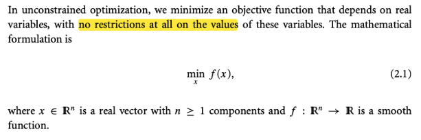</kbd>

<kbd>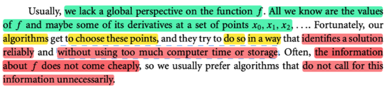</kbd>

> [!NOTE]
> Vì nhận thấy cuốn **Algorithm For Optimization** có đặc điểm là cover
> rộng, nhiều thuật toán, nhưng với mỗi cái chỉ nói sơ sơ, do đó nên
> đọc cuốn Numerical Optimization trước, sau đó mới quay lại cuốn kia
>
> Thế thì ở đây có mở đầu có vài điểm cũng đáng chú ý. Mở đầu tác gỉa
> giới thiệu về bài toán tối ưu không có ràng buộc (unconstrained) - tức là
> ko có giới hạn nào đối với các giá trị của variable.
>
> Ông nói rằng, thường thì chúng ta chỉ có thể biết giá trị của function
> (objective function, cái mà chúng ta muốn minimize) và có thể biết thêm
> giá trị của đạo hàm của nó tại một tập các điểm. Chứ ta không biết gì 
> về global perspective (tạm hiểu là góc nhìn toàn cục, khái quát về hành
> vi của hàm số). Tuy nhiên, ta có thể xây dựng những thuật toán để
> có thể chọn ra những điểm sao cho dần dần nó sẽ có thể xác định
> được solution của bài toán một cách đáng tin cậy. Mà quan trọng là
> không tốn quá nhiều thời gian (tính toán) và lưu trữ,
>
> Một điểm nữa là, dù ta có thể có giá trị hàm f, nhưng việc tính toán
> nó không rẻ, nên ta phải làm sao đó dùng ít lần gọi / tính giá trị hàm 
> số thôi (mình có thể hiểu ý này, ví dụ như trong mô hình deep learning,
> việc tính toán forward prop qua mô hình là rất tốn kém khi nó có hàng 
> triệu hoặc hàng tỉ tham số)

> [!TIP]
> **🤖 AI Feedback** — ✅ Score: **95/100**
>
> Ghi chú đã nắm bắt chính xác định nghĩa về tối ưu hóa không ràng buộc từ hình ảnh, đặc biệt là ý "không có giới hạn nào đối với các giá trị của variable". Nó còn cung cấp thêm nhiều thông tin chuyên sâu và các khía cạnh thực tế liên quan đến bài toán này, cho thấy sự hiểu biết sâu sắc về chủ đề.

 

### Bài toán khớp đường cong

<kbd>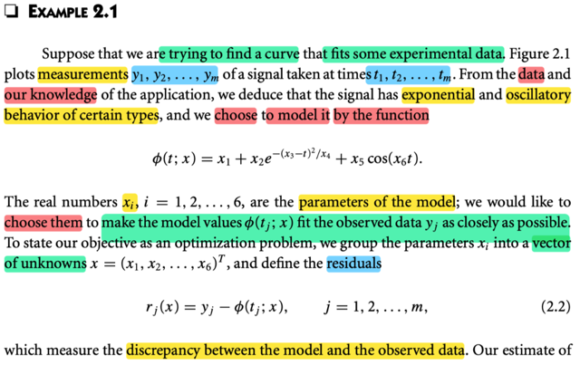</kbd>

<kbd>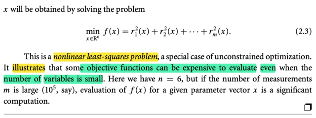</kbd>

<kbd>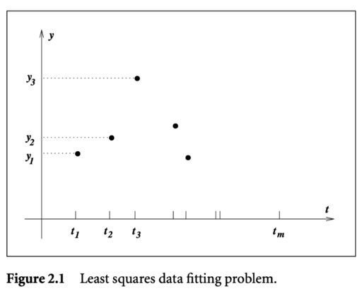</kbd>

> [!NOTE]
> tác giả cho một ví dụ, đại khái là ta sẽ muốn tìm một đường cong sao cho
> nó khớp được một bộ dữ liệu có được từ thực nghiệm. Đại khái là ta có
> các giá trị y1,...ym là giá trị của việc đo một yếu tố nào đó, tại các thời
> điểm t1, t2....tm
>
> Thế thì từ dữ liệu (ý là nhìn vào dữ liệu) và những gì ta biết về loại data
> này, thì ta sẽ đoán (đại khái là vậy) rằng có thể dùng một hàm số như vầy,
> để mô hình hóa
>
> Vậy thì trong hàm số này, x1,..x5 đóng vai trò là parameters và là thứ 
> mà ta muốn tìm giá trị. sao cho với bộ giá trị đó thì hàm Φ(t, x) sẽ khớp
> được sát nhất với bộ data set (t1, y1),...(tn, yn)
>
>
> Thế thì ta mới xây dựng vector x và định nghĩa residual (giống như error):
>
> rj(x) = yj - Φ(tj, x) tức là sai khác giữa giá trị dự đoán của hàm Φ với input
> là tj, dựa trên giá trị của parameters là vector x, với giá trị thực tế đo được
> yj
>
> Để rồi bài toán này, có thể được thể hiện ở dạng unconstrained optimization
> problem:
>
> minimize x Σj [rj(x)]^2 | rj tức là residual yj - Φ(tj, x), và hàm objective này
> là sum of squared error
>
> Bài toán này gọi là nonlinear least square, dễ thấy là vì hàm Φ(tj, x) là hàm
> nonlinear đối với parameters x
>
> Thế thì đại ý là tác giả muốn minh họa rằng bài toán này tuy có ít param
> nhưng vì có rất nhiều data nên để tính toán ra giá trị của objective function
> f = Σj [rj(x)]^2 cũng sẽ rất tốn kém

> [!TIP]
> **🤖 AI Feedback** — ✅ Score: **90/100**
>
> Bản tóm tắt và diễn giải rất tốt, đặc biệt là việc liên hệ bài toán với tối ưu hóa không ràng buộc và bình phương nhỏ nhất phi tuyến tính. Cần lưu ý rằng các tham số của mô hình là từ x1 đến x6, không phải x1 đến x5.

 

#### Giải pháp: Toàn cục và Cục bộ

<kbd>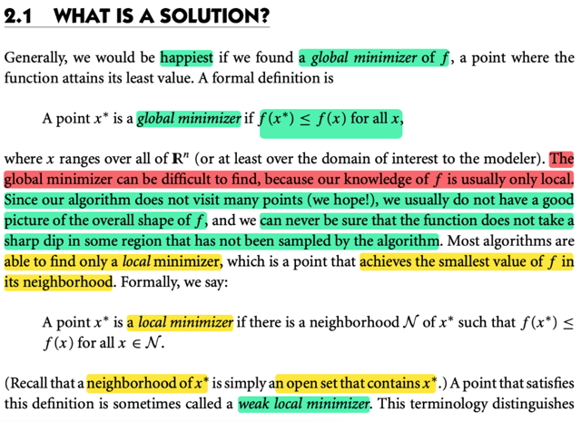</kbd>

> [!NOTE]
> đại khái là để mà đi tìm solution của bài toán tối ưu thì ta đầu tiên phải
> định nghĩa solution là gì cái đã.
>
> Thế thì dĩ nhiên là khi đặt ra bài toán tối ưu minimize hàm f(x) over x
> thì dĩ nhiên ta muốn tìm ra global minimizer, tức là tìm trong mọi giá
> trị x của x thì cái nào làm f nhỏ nhất. Định nghĩa chính thức là:
>
> x* gọi là global minimum nếu như f(x*) ≤ f(x) với mọi x.
>
>
> Vấn đề là, (đây là một ý rất hay), ta khó để biết / tìm thấy global minimizer,
> VÌ TA THƯỜNG CHỈ BIẾT VỀ HÀM F Ở PHẠM VI MANG TÍNH CÁCH
> ĐỊA PHƯƠNG, CỤC BỘ.
>
> Đó là vì, thuật toán của chúng ta chỉ xét xét hàm f tại một tập có số lượng
> hữu hạn các điểm khác nhau, vì đại khái là số lượng cũng không nhiều
> (vì lí do như đã nói hồi nãy, việc evaluate giá trị của hàm số là ko rẻ, nên
> phải hạn chế) Thế thì vì vậy, TA KHÔNG THỂ NÀO CHẮC CHẮN RẰNG
> KHÔNG CÓ MỘT CÁI HỐ SÂU, VỰC SÂU NÀO ĐÓ MÀ TRONG QUÁ
> TRÌNH CHẠY THUẬT TOÁN, TA ĐÃ BỎ QUA NHỮNG ĐIỂM TRONG 
> CÁI VỰC NÀY 
>
> (mình hiểu ý này đại khái là giống như ta có thể có vài báo cáo về độ sâu
> đáy biển tại một số điểm, và từ đó cố gắng phác họa, phán đoán bề mặt
> đáy biến, tuy nhiên không thể nào loại trừ khả năng rằng ta đã bỏ xót
> một điểm nào đó mà tại đó có một cái hụp sâu xuống)
>
> Vậy thì, từ đó ta có khái niệm local minimizer, tức là f(x*) chỉ nhỏ hơn những
> f(x) với x trong phạm vi local quanh đó

> [!TIP]
> **🤖 AI Feedback** — ✅ Score: **95/100**
>
> Bạn đã nắm vững các khái niệm về cực tiểu toàn cục và cực tiểu địa phương, cũng như lý do tại sao việc tìm cực tiểu toàn cục lại khó khăn, với một ví dụ minh họa rất rõ ràng. Để hoàn thiện hơn, bạn có thể bổ sung định nghĩa hình thức hơn cho cực tiểu địa phương bằng ký hiệu toán học và giải thích ngắn gọn "vùng lân cận" là gì.

 

##### Cực tiểu địa phương và toàn cục

<kbd>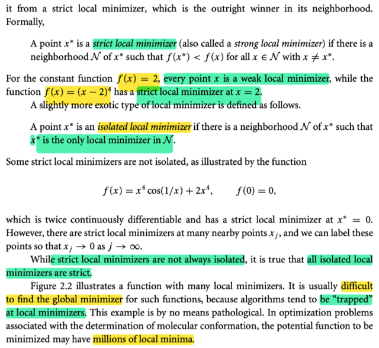</kbd>

<kbd>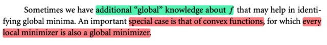</kbd>

<kbd>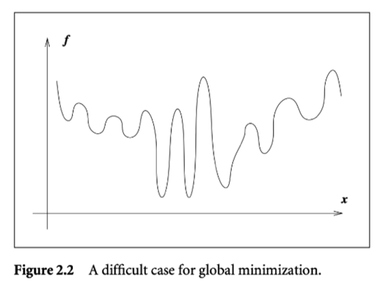</kbd>

> [!NOTE]
> Tuy nhiên cũng chia ra weak và strong local minimizer:
>
> Dễ hiểu weak là chỉ định nghĩa với dấu ≤, còn strong thì dấu <
>
> Có nghĩa là weak local minimizer thì x* là thằng mà f(x*) không lớn hơn
> những f(x) với x lân cận.
>
> Còn strong local mimizer thì x* là cái mà f(x*) NHỎ HƠN mọi f(x) của x lân
> cận.
>
> Ròi còn khái niệm isolated local minimizer (đơn độc, cô độc) nôm na là khi
> có một tập hàng xóm của x* sao cho chỉ có mỗi  mình x* là local minimizer
>
> Trong hình 2.2 minh họa một tính huống có rất nhiều local  minimizer
>
> Và tác giả cho biết thuật toán rất dễ bị mắc kẹt trong các local minimizer
>
> Và cuối cùng, đôi khi một kiến thức mang tính chất phổ quát nào đó mà ta
> biết về hàm số có thể giúp xác định global minimizer ví dụ như khi ta biết nó
> là hàm lồi (convex) thì khi có local minimizer thì ngay lập tức nó cũng chính
> là global minimizer
>
> (điều này đã biết ở Convex Optimization)

> [!TIP]
> **🤖 AI Feedback** — ✅ Score: **95/100**
>
> Bài làm thể hiện sự nắm vững và diễn đạt chính xác các khái niệm quan trọng về local minimizer, strict local minimizer, isolated local minimizer, cũng như vai trò của hàm lồi trong việc xác định global minimizer. Chất lượng công việc là rất cao.

 

- **Cực tiểu cục bộ: Gradient, Hessian**

<kbd>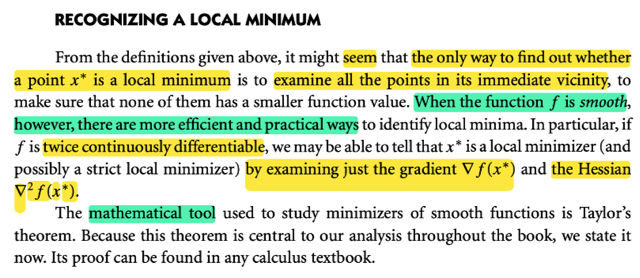</kbd>

> [!NOTE]
> đại ý: sau khi đã biết khái niệm local minimizer thì có lẽ ta sẽ nghĩ rằng
> muốn tìm xem một điểm x' có phải là local minimizer không thì ta phải
> check xem giá trị f(x') tại đó có nhỏ hơn mọi f(x) của các điểm x lân cận
> hay không. 
>
> Tuy nhiên, nếu như ta biết hàm có tính chất smooth, thì có thể có cách
> hiệu quả hơn
>
> Cụ thể là khi hàm f liên tục và khả vi kép (tức là tồn tại Hessian - matrix
> đạo hàm bậc 2) tại mọi điểm, thì ta có thể dùng gradient ∇f(x) và Hessian
> ∇^f(x) để giúp xác định xem x có phải là local minimizer không.
>
> Và công cụ toán học để làm nền tảng cho cái này là Taylor's theorem,

> [!TIP]
> **🤖 AI Feedback** — ⚠️ Score: **75/100**
>
> Bản tóm tắt đã nắm bắt được các ý chính của đoạn văn một cách rõ ràng. Tuy nhiên, việc sử dụng ký hiệu ∇^f(x) cho Hessian là không chính xác. Đồng thời, cần diễn đạt chính xác hơn về điều kiện "khả vi kép tại mọi điểm", vì phương pháp này chủ yếu dựa trên tính chất của hàm tại điểm cực trị tiềm năng x* và vùng lân cận của nó.

 

- **Theorem 2.1 Taylor's theorem, Taylor theorem**

<kbd>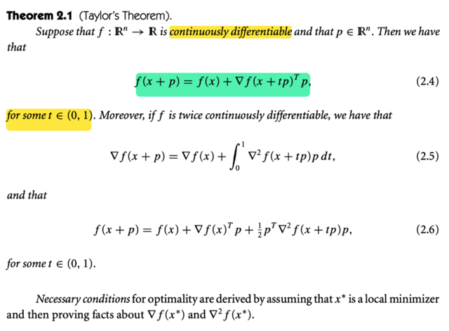</kbd>

> [!NOTE]
> #Theorem 2.1 Taylor's theorem, Taylor theorem
>
> đầu tiên ta có công thức 2.4: 
>
> f(x + p) = f(x) + ∇f(x + tp)Tpvới t ∈ (0, 1). Công thức này ở đâu ra ?
>
> Nhớ lại hồi học mit 1801 mình được học một theorem tên là **Mean Value Theorem**: đại khaí nói là, cho interval [a, b], thì nhất định có điểm c nào đó trong đoạn này (a < c < b) sao cho:
>
> f'(c) = [f(b) - f(a)] / (b - a) 
>
> ⇔ f'(c)(b - a) = f(b) - f(a) ⇔ (b) =(a) + f'(c)(b - a)
>
> Nhìn vào cái này, mình có thể đóan ràng với multivariate case, thì mean value theorem sẽ là, (cho interval [a, b] thì sẽ **tồn tại c nằm trên đoạn [a,b]**
> sao cho:
>
> **f(b) = f(a) + ∇f(c)T(b - a)** (b, a lúc này là vector, và derivative lúc này là gradient  vector)
>
> Vậy nếu gọi a là điểm x, và b = a + p (p = b - a)
>
> thì ta có: f(x + p) = f(x) + ∇f(c)Tp
>
> và vì **c là điểm nằm đâu đó trong đoạn [a, b]**, nên **có thể thể hiện c ở dạng  là mixture** (hay line segment, hay convex combination của a và b): 
>
> **c = αb + (1 - α)a**, với α ∈ (0, 1)để khi α nhỏ thì c ở gần a và khi α lớn thì c chạy
> đến gần b.
>
> Vậy ở đây, người ta dùng t thay cho α: nên c = tb + (1 - t)a = tb + 1 - ta = 1 + t(b-a)
>
> = 1 + tp
>
> Nên ta có (x + p) = f(x) + ∇f(x + tp)Tp là vậy
>
> =====
>
> Tiếp, công thức 2.5 khi họ nói nếu **f twice continuously differentiable** thì ta có:
>
> **∇f(x + p) = ∇f(x) + ∫0:1 ∇^2 f(x + tp)pdt**
>
> Để hiểu cái này có thể thấy nó có dạng của FTC2:
>
> Hồi học mit 1801 đã học FTC2, nói rằng: nếu G là nguyên hàm của f, thì ta sẽ có:
>
> **G(b) - G(a) = ∫_a^b f(t)dt**
>
> **đặt G(t) = ∇f(x + tp)**, 
>
> ⇨ G(0) = ∇f(x), G(1) = ∇f(x + p)
>
> và f(t) = G'(t) = d/dt ∇f(x + tp) = d/d(x + tp) ∇f(x + tp) ∘ d/dt (x + tp)
>
> = ∇^2 f(x + tp) ∘ p
>
> Áp dụng cái này, vì dĩ nhiên G là nguyên hàm của f:
>
> G(1) -  G(0) = ∫_0^1 f(t)dt
>
>  Ta có ∇f(x + p) - ∇f(x) = ∫_0^1 ∇^2 f(x + tp) . p dt
>
> ⇔ ∇f(x + p) = ∇f(x)  + ∫_0^1 ∇^2 f(x + tp) . p dt
>
> =====
>
> Còn cái 2.6: f(x + p) = f(x) + ∇f(x)Tp + (1/2)p ∇^2f(x + tp)p
>
> Đầu tiên phải dùng / nói đến định lý Taylor trước:
>
> f(b) = f(a) + f'(a)(b - a) + (1/2) f''(t)(b - a)^2 + ...+(1/n!) f^(n)(a)(b - a)^n
>
> + (1/(n+1)!)f^(n+1)(c)(b - a)^(n+1)/(n+1)! với c ∈ (a, b)
>
> Cái này thật ra ko có gì khó hiểu: Mình đã quen với Taylor expansion mà đúng hơn là Taylor approximation:
>
> Ví dụ xấp xỉ bậc 1: f(x) ≈ f(x0) + f'(x0)(x-x0)
>
> Và xấp xỉ bậc 2: f(x) ≈ f(x0) + f'(x0)(x-x) + (1/2) f''(x0)(x-x0)^2
>
> Thì đó là ta xấp xỉ. Còn cái này nó sẽ cho phép có dấu bằng, bằng cách nói về / thêm vào một phần dư (gọi là phần dư Lagrange)
>
> f(x) = f(x0) + f'(x0)(x-x0) + (1/2) f''(c)(x-x0)^2 với c nào đó nằm trong (x,x0)
>
> Tương tự,
>
> f(x) = f(x0) + f'(x0)(x-x0) + (1/2) f''(x0)(x-x0)^2 + (1/3!) f^(3)(x)(x-x0)^3  với c nằm trong (x,x0)
>
> Và mean value theorem chính là phiên bản của cái này:
>
> f(x) = f(x0) + f'(c)(x-x0) c ∈ (x,x0)
>
> ====
>
> Vậy thì áp dụng cái này:
>
> Ta sẽ đặt hàm g(t) = f(x + tp) với t ∈ [0,1] 
>
> Để t = 0 thì g(0) = f(x), t = 1, g(1) = f(x + t)
>
> Tức là hàm đơn biến t sẽ mô tả sự thay đổi của hàm số theo hướng x → x + p
>
> Thế thì, áp dụng Taylor theorem với a = 0, b = 1
>
> g(1) = g(0) + g'(0)(1 - 0) + (1/2) g''(t)(1 - 0)^2 với t nào đó ∈ (0,1)
>
> Tính g'(0):
>
> g'(t), tức d/dt g(t) = d/dt f(x + tp) = d/d(x + tp) f(x + tp) . d/dt (x + tp) 
>
> = ∇f(x + tp)Tp
>
> ⇨ g'(t)|t=0 = ∇f(x + tp)Tp|t=0 = ∇f(x)Tp
>
> Tính g''(t):
>
> g''(t) = d/dt g'(t) = d/dt ∇f(x + tp)Tp
>
> d/d(x + tp) ∇f(x + tp)Tp . d/dt (x + tp)
>
> Xét d/d(x + tp) ∇f(x + tp)Tp:
>
> Đặt u = x + tp ⇨ d/du ∇f(u)Tp
>
> đặt h(u) = ∇f(u)Tp ⇨  dh = h(u+du) - h(u)
>
> = ∇f(u+du)Tp - ∇f(u)Tp = [∇f(u+du) - ∇f(u)]Tp = d∇f(u)Tp 
>
> Mà d∇f(u) = ∇^2f(u) du  (vì đạo hàm của hàm ∇f chính là Hessian ∇^2f)
>
> Do đó dh = d ∇f(u)Tp = [∇^2f(u)du]Tp 
>
> = duT ∇^2f(u)T p . Và vì cái này là scalar (u, du là scalar)
>
> = (duT ∇^2f(u)T p)T
>
> = (∇^2f(u)T p)T duTT
>
> = (pT∇^2f(u)TT) du
>
> = pT∇^2f(u) du
>
> Vậy dh(u) = = pT∇^2f(u) du 
>
> ⇨ d/du h(u) = pT∇^2f(u) = pT∇^2f(x + tp)
>
> Vậy d/d(x + tp) ∇f(x + tp)Tp = pT∇^2f(x + tp)
>
> ⇨ d/d(x + tp) ∇f(x + tp)Tp . d/dt (x + tp) = pT∇^2f(x + tp) . d/dt (x + tp) 
>
> = pT∇^2f(x + tp) . p
>
> = pT∇^2f(x + tp)p
>
> Vậy g''(t)  = pT∇^2f(x + tp)p
>
> ⇨ g''(t)|t=ξ = pT∇^2f(x + ξp)p
>
> g(1) = g(0) + g'(0)(1 - 0) + (1/2) g''(ξ)(1-0)^2
>
> Thay vào hết:
>
> g(1) = f(x + p)
>
> g(0) = f(x)
>
> g'(0) = ∇f(x)Tp
>
> g''(t) = pT∇^2f(x + tp)p
>
> Vậy f(x + p)  = f(x) + ∇f(x)Tp + (1/2) pT∇^2f(x + tp)p
>
> Chứng minh xong

> [!TIP]
> **🤖 AI Feedback** — ✅ Score: **95/100**
>
> Học sinh đã phân tích cực kỳ chính xác và sâu sắc công thức (2.4) và (2.5) bằng cách liên hệ với các định lý cơ bản trong giải tích. Bài giải thể hiện kiến thức nền tảng vững chắc và khả năng suy luận xuất sắc.

> [!IMPORTANT]
> **🎤 Review Session 1** — Score: **65/100**
>
> Học sinh đã nắm vững mục đích của Định lý Taylor và mối liên hệ của nó với Định lý Giá trị Trung bình một biến, cùng với cách biểu diễn điểm trung gian (X + T * P). Tuy nhiên, bài giải còn thiếu các điều kiện quan trọng của định lý và hoàn toàn bỏ qua việc giải thích công thức 2.5 và 2.6, vốn là một phần đáng kể của tài liệu gốc.

 

- **Điều kiện cần bậc nhất**

<kbd>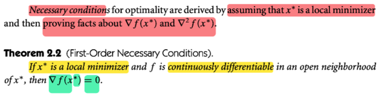</kbd>

<kbd>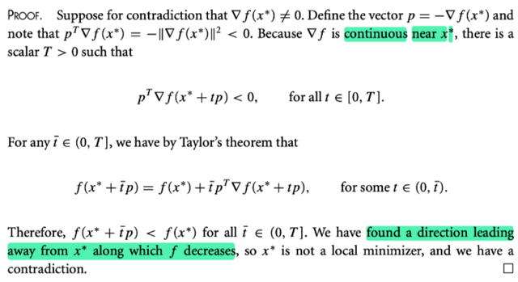</kbd>

> [!NOTE]
> đại khái là nói rằng **điều kiện cần của optimality** (điều kiện cần để một điểm là
> điểm local minimizer của bài toán tối ưu) sẽ được xây dựng từ việc **giả định
> rằng x là một local minimizer** và **những sự thật đã được chứng minh liên quan
> đến gradient và Hessian**
>
> Vậy thì theorem 2.2 có tên là **First Order Necessary Condition**: nói rằng: **nếu
> x* là local minimizer** và hàm f khả vi liên tục trong một khoảng lân cận của x*
> thì ∇f(x*) phải bằng 0.
>
> Để chứng minh thì đại khái là họ dùng **chứng minh phản chứng**. Ta **giả sử**
> theorem này sai, tức là **cho x* là local minimizer nhưng tại đó gradient vẫn
> khác 0**. Thế thì ta sẽ lập luận để thấy điều này không thể xảy ra, mâu thuẫn
>
> Đầu tiên, vì **x* đang được assume là local minimizer**, nên theo định nghĩa tại
> đó **so với vùng lân cận của x* thì f(x*) phải nhỏ nhất**.
>
> Thế thì ta có **∇f(x*) khác 0** (tức là vector khác 0, ta phải hiểu ∇f(x) là vector,
> gradient, không phải scalar). Thì, bằng cách **chọn một vector p = - ∇f(x*)**, ta sẽ
> có **∇f(x*)Tp = -∇f(x*)T∇f(x*) = -(||∇f(x*)||)^2**
>
> Vậy thì có thể thấy ∇f(x) là vector khác 0 thì dẫn đến ||∇f(x*)||^2 là square
> norm của nó, phải là số dương ⇨ pT ∇f(x*) = -||∇f(x*)||^2 phải **âm**.
>
> Tiếp, ta sẽ xét hàm **g(t) = pT∇f(x* + tp)**, đại ý là thể hiện **giá trị của pT∇f(x)**
> sẽ thay đổi như thế nào **khi đi từ x → x + p**, hay, đi theo hướng vector p
>
> Cái hàm g(t) này, để ý, nó là hàm theo t (scalar), và output cũng là scalar (dot
> product của vector p và vector gradient tại x* + tp
>
> Vậy thì đại khái là, **tại t = 0, ta đã có g(t)|t=0 = pT ∇f(x*) mang giá trị âm vì **.
>
> Mà, **f là hàm liên tục, nên g(t) cũng vậy**. Vậy thì, g(t) là hàm liên tục, mà tại t =
> 0 nó mang giá trị âm. Thế thì, tính liên tục của hàm số nói rằng, khi tăng hay
> giảm t trong một phạm vi lân cận thì hàm số này **nếu có đang tăng lên (để trở
> thành dương) thì nó cũng phải TĂNG TỪ TỪ, để rồi trong khoảng nào đó lân
> cận t thì hàm vẫn mang giá trị âm**. Chứ **không thể nào đùng một phát khi t
> thay đổi mà nó từ âm sang dương** được.
>
> Do đó ta hiểu đại khái chỗ này là như vậy, nên sách nói, **tồn tại T sao cho t
> trong khoảng [0, T] thì g(t) = pT ∇f(x* + tp) vẫn âm**
>
> Còn tại sao lại xét hàm g(t) = pT ∇f(x* + tp) là vì để phục vụ cho việc lập luận
> tiếp với Taylor theorem:
>
> Rồi, tới đây ta áp dụng Taylor theorem ở trên, nói là: 
>
> f(x + p) = f(x) + ∇f(x + tp)Tp với t nào đó ∈ (0,1) 
>
> ⇨ Áp dụng vào đây với t_bar p đóng vai trò của p trong công thức (1) ta có: 
>
> f(x* + t_bar p) = f(x*) + ∇f(x + t t_bar p)T(t_bar p)
>
> vế phải = f(x*) + t_bar ∇f(x + t t_bar p)Tp  for some t in (0,1)
>
> (Đưa scalar t_bar lên trước, vì nó là scalar  nên có thể di chuyển tùy ý)
>
> Tới đây đại khái là, với t và t_bar, thì t là số ∈ (0,1), ⇨ t nhân t_bar sẽ là một
> số nào đó ∈ (0, t_bar), có nghĩa là thay t tbar for some t in (0,1) thành some t
> in (0, tbar)
>
> thay t t_bar bằng t luôn (ý là gom lại dùng một cái để dùng)
>
> f(x* + t_bar p) = f(x*) + t_bar ∇f(x + t p)Tp   | t ∈ (0, t_bar)
>
> Tới đây vì **∇f(x + t p)Tp âm** như trên đã nói, nên có thể kết luận:
>
> f(x* + t_bar p) < f(x*) với mọi t_bar ∈ (0, T]
>
> ⇨ x* không phải là local minimizer. Mâu thuẫn giả thiết.
>
> ====
>
> Tóm tắt ý tưởng đại khái là:
>
> 1) Giả sử ∇f(x*) khác 0 thì  p = - ∇f(x*) thì pT ∇f(x) = -∇f(x*)T ∇f(x*) < 0
>
> Xét g(t) = pT∇f(x* + ptbar) thì nó ẫn âm trong khoảng x* → x* + p tbar nào
> đó, tức là từ tbar = 0 đến tbar = T nào đó.
>
> Mà Taylor theorem nói rằng trong khoảng từ x* → x* + p tbar thì nhất định có
> một điểm c  mà tại đó
>
> f(x* + p tbar) = f(x*) + ∇f(c)Tp với c nào đó in (x*, x* + p tbar)
>
> Tương đương
>
> f(x* + p tbar) = f(x*) + ∇f(x* + t tbar p)Tp với t nào đó in (0,1)
>
> Tương đương
>
> f(x* + ptbar) = f(x*) + ∇f(x* + tp)Tp với t nào đó trong (0, tbar)
>
> và với t này thì ∇f(x* + tp)Tp âm cho nên f(x* + p tbar) < f(x*)
>
> Nên ý nghĩa của cái này là
>
> ù tbar có bằng bao nhiêutrong khoảng từ 0 đến T thì ôn tồn tại một số
> t nằm trong khoảng từ 0 đến tbar ến ta có f(x* + ptbar) = f(x*) +
> somethingmà ý chính là:
>
> ới mọi tbarta ôn được phépf(x* + p tbar) bởi f(x*) +
> something  Và ái something đó âm, suy ra :
>
> ới mọi tbar ∈(0,T), f(x* + p tbar) luôn < f(x*)

> [!TIP]
> **🤖 AI Feedback** — ✅ Score: **95/100**
>
> Ghi chú của bạn cực kỳ chi tiết, chính xác và cho thấy sự hiểu biết sâu sắc về cả khái niệm và cấu trúc chứng minh, đặc biệt là giải thích về tính liên tục và định lý Taylor. Bạn có thể cải thiện bằng cách sử dụng ngôn ngữ nhất quán và chính xác hơn một chút ở một vài điểm nhỏ.

 

- **Điều kiện cần bậc hai**

<kbd>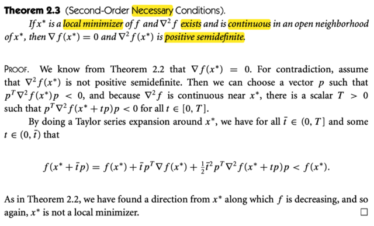</kbd>

> [!NOTE]
> Đại khái là theorem này nói về Second-order Necessary condition: Nếu là  local
> minimizer thì ∇^2f(x) sẽ là positive semi definite matrix (và ∇f(x*) = 0, cái này
> cũng là First order Necessary condition)
>
> Chứng minh Phản chứng, giả sử x* là local minimizer nhưng Hessian tại đó
> không positive semi definite. Mà như vậy thì từ mit 1806 đã biết, sẽ có nghĩa là
> **tồn tại vector p nào đó khiến quadratic form của nó âm pT ∇f(x*) p < 0 **
>
> Tiếp, dựa vào tính liên tục (Hessian là liên tục như đề cho thì g(t) cũng phải là hàm liên tục). Thì ta đặt hàm g(t) = pT ∇f(x* + tp) p thì, phải tồn tại một khoảng (0,T) nào đó sao cho pT ∇f(x* + tp) p vẫn âm. Vì như đã nói, không thể nào hàm g(t) đang âm mà nhảy kịch một phát thành dương ngay khi dịch t một tí được
>
> Thì dựa vào Taylor theorem:
>
> f(x* + p) = f(x*) + ∇f(x*)Tp + (1/2) pT∇^2 f(x + tp)p for some t in (0,1)
>
> Áp dụng vào đây với t_bar p đóng vài trò p, ta có:
>
> f(x* + t_bar p) = f(x*) + ∇f(x*)T t_bar p + (1/2) (t_bar p)T ∇^2 f(x + t t_bar p) t_bar p
>
> = f(x*) + t_bar∇f(x*)Tp + (1/2) (t_bar)^2 pT ∇^2 f(x + t t_bar p) p
>
> với t_bar ∈ (0, T), và some t in (0,1) ⇨ t × t_bar thay bằng some t in (0, t_bar)
>
> = f(x*) + t_bar∇f(x*)Tp + (1/2) (t_bar)^2 pT ∇^2 f(x + t p) p for some t in (0, t_bar)
>
> = f(x*) + (1/2) (t_bar)^2 pT ∇^2f(x + t p) p for some t in (0, t_bar)
>
> (gradient ∇f(x*) = 0)
>
> Và như trên ta có với t ∈ (0,T) thì pT ∇f(x* + tp) p < 0
>
> thì ở đây ta có tồn tại t nào đó trong (0, t_bar) thì ta có cái equation:
>
> f(x* + tbar p) = f(x*) + (1/2) (t_bar)^2 pT ∇^2 f(x + t p) p for some t in (0, t_bar)
>
> Và dĩ nhiên trong khoảng này thì cũng là trong khoảng (0, T)
>
> ⇨ pT ∇^2 f(x + t p) p < 0
>
> ⇨ f(x* + t_bar p) < f(x*) ⇨ ta đã có thể đi thêm theo hướng p để giảm f 
>
> ⇨ x* ko phải là local minimizer. Điều này trái với giả thiết 
>
> ⇨ ∇^2 f(x) phải positive semi definite tại x*
>
> =====
>
> Tóm tắt ý chính cái này chút:
>
> Ta giả sử x* là local minimizer nhưng Hessian tại đó ∇^2 f(x*) không positive
> semi definite. Tức tồn tại p sao cho pT ∇^2 f(x*) p < 0
>
> Theo tính liên tục, thì nếu đặt g(tbar) = pT ∇^2f(x* + ptbar) p thì g(tbar) phải tiếp
> tục âm trong một khoảng nào đó từ x* (tbar = 0) đến x* + p T (tbar = T), nói cách
> khác là tồn tại T nào đó mà từ tbar = 0 đến T, thì g(tbar) = pT ∇^2 f(x* + ptbar) p
> nhất định âm
>
> Thế thì, theo Taylor theorem nói rằng:
>
> Dù tbar có bằng bao nhiêu thì trong khoảng từ x* đến x* + p tbar thì sẽ luôn có
> một thằng t nào đó khiến ta được phép thể hiện f(x* + p tbar) bởi f(x*):
>
> f(x* + p tbar) = f(x*) + ∇f(x*)Tp + (1/2) (p tbar)T∇f^2(x* + t p tbar)(p tbar)
>
> = f(x*) + 0Tp + (1/2) tbar^2 pT∇f^2(x* + t p tbar)p
>
> = f(x*) + (1/2) tbar^2 pT∇f^2(x* + t p tbar)p
>
> Và ý chính của cái này, nhắc lại là với mọi tbar in (0,T) thì ta luôn được phép thể
> hiện f(x* + p tbar) = f(x*) + something.
>
> mà cái something này âm vì pT∇f^2(x* + t p tbar)p với some t in (0,1) thì cũng
> như pT∇f^2(x* + tp)p với some t in (0, tbar) và do đó nó âm
>
> Do đó ⇨ với mọi tbar in (0,T) thì f(x* + p tbar) < f(x*)

> [!TIP]
> **🤖 AI Feedback** — ✅ Score: **92/100**
>
> Điểm mạnh của bạn là giải thích rất chi tiết và sâu sắc về từng bước chứng minh, đặc biệt là vai trò của tính liên tục và các bước triển khai chuỗi Taylor. Tuy nhiên, bạn cần cẩn thận hơn về ký hiệu, đôi khi bạn dùng "∇f" thay vì "∇²f" trong biểu thức dạng toàn phương pT (...) p, điều này có thể gây nhầm lẫn.

 

- **Chứng minh điều kiện đủ cấp hai**

<kbd>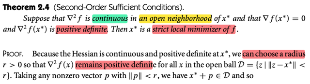</kbd>

> [!NOTE]
> Qua cái theorem về điều kiện ĐỦ (của optimality condition): Nó nói rằng, nếu
> ∇^2 f  liên tục trong khoảng lân cận của x* và ∇f(x*)  = 0 và ∇^2 f(x*) positive
> definite Thì x* là **strict local minimizer**
>
> Chứng minh. Đại khái là vì Hessian liên tục và positive definite tại x* nên có thể
> chọn một bán kính r sao cho những điểm trong open ball D = z: ||z - x*|| < r
> đều có Hessian positive definite.
>
> Cần làm rõ để hiểu ý này:
>
> Đại khái là, có thể hiểu vầy cho đơn giản: Gọi hàm λmin(x) là hàm lấy ra
> eigenvalue nhỏ nhất của matrix Hessian tại x: λmin(x) = minimum eigenvalues
> of ∇^2 f(x)
>
> Dĩ nhiên nó là scalar function.
>
> Và vì Hessian liên tục, nên λmin(x) CŨNG LÀ HÀM LIÊN TỤC.
>
> Và dùng lập luận về tính liên tục như cách ta đã lập luận ở trước đây, là:
>
> Nếu tại x* λmin(x*) DƯƠNG (*), thì khi thay đổi từ x* → x (ý là di chuyển qua
> điểm khác thì giá trị của nó phải thay đổi từ từ, có nghĩa là trong một khoảng
> nào đó mà khoảng này có nghĩa là một vòng tròn (quả banh) trong đó λmin(x)
> vẫn tiếp tục dương
>
> Và như vậy, có nghĩa là tại những điểm này Hessian tiếp tục positive definite
>
> Còn (*) tại x* λmin(x*) dương là vì đề bài đã cho Hessian tại đó positive definite.
>
> Và kiến thức mit 1806 thì mình đã biết matrix positive definite thì mọi eigenvalue
> đều  dương ⇨ cái nhỏ nhất phải dương

> [!TIP]
> **🤖 AI Feedback** — ✅ Score: **98/100**
>
> Bài ghi rất chính xác về định lý và chứng minh. Đặc biệt, phần làm rõ bằng cách sử dụng hàm eigenvalue nhỏ nhất và tính liên tục là rất sâu sắc, giúp người đọc hiểu rõ bản chất của điều kiện đủ.

 

- **Chứng minh điều kiện đủ bậc hai**

<kbd>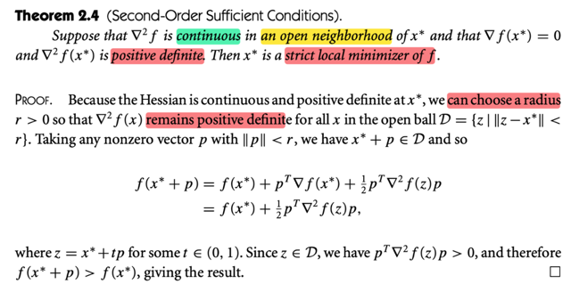</kbd>

> [!NOTE]
> Và phần chứng minh tiếp theo cũng dễ hiểu thôi khi ta đã biết Taylor theorem:
>
> Đại ý là, ta đứng từ x*, và đi theo hướng p bất kì với độ lớn nhỏ hơn r (ý là không
> ra khỏi vòng tròn / quả banh này)
>
> Thì Taylor theorem nói rằng:
>
> f(x* + p) = f(x*) + ∇f(x*)Tp + (1/2) pT ∇^2 f(z) p với z là điểm nào đó nằm giữa 
> x* và x* + p, tức khoảng (x*, x* + p), cũng có thể ghi là z = x* + pt với t là giá trị
> nào đó trong (0,1).
>
> Với ∇f(x*) = 0 ta có f(x* + p) = f(x*) + (1/2) pT ∇^2 f(z) p  với z = x* + pt với some 
> t ∈ (0,1).
>
> Và có nghĩa là f(x* + p) có thể được thể hiện bởi f(x*) + something mà something
> này, là bằng (1/2) pT ∇^2 f(z) p sẽ DƯƠNG vì z vẫn trong quả banh nói trên có
> mọi điểm trong đó đều có Hessian positive definite
>
> Vậy, f(x* + p) = f(x*) + số dương ⇨ f(x* + p) > f(x*) với mọi p sao cho ||p|| < r
> và như vậy x* thỏa định nghĩa là điểm "thấp" hơn mọi điểm lân cận (f(x*) < f(x)
> ∀ x lân cận) ⇨ x* là strict local minimizer

> [!TIP]
> **🤖 AI Feedback** — ✅ Score: **100/100**
>
> Ghi chú này cực kỳ rõ ràng và chính xác, giải thích chi tiết từng bước của chứng minh bằng định lý Taylor. Nó làm sâu sắc thêm sự hiểu biết bằng cách kết nối các phép toán với định nghĩa và các điều kiện đã cho.

> [!IMPORTANT]
> **🎤 Review Session 1** — Score: **45/100**
>
> Bạn đã giải thích rất chi tiết và chính xác về lý do tồn tại một vùng lân cận quanh x* mà tại đó Hessian vẫn xác định dương, thể hiện sự hiểu biết sâu sắc về tính liên tục của hàm số và giá trị riêng của ma trận. Tuy nhiên, bạn đã bỏ qua hoàn toàn phần cốt lõi của chứng minh liên quan đến việc áp dụng định lý Taylor và suy luận f(x* + p) > f(x*), đây là điểm thiếu sót nghiêm trọng trong việc tái hiện toàn bộ chứng minh.

> [!IMPORTANT]
> **🎤 Review Session 2** — Score: **85/100**
>
> Học sinh đã trình bày rất tốt các bước chứng minh và giải thích vai trò của định lý Taylor cũng như các điều kiện của bài toán. Tuy nhiên, có một chi tiết quan trọng về dấu bất đẳng thức ở bước kết luận cuối cùng cần được làm rõ hơn để phản ánh đúng tính "strict" của local minimizer.

 

- **Cực tiểu: cần, đủ, chặt**

<kbd>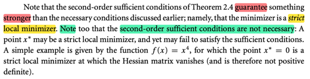</kbd>

> [!NOTE]
> Giải lú ba cái theorem trên:
>
> Đầu tiên: Nhớ lại điều kiện cần và đủ là sao:
>
> Điều kiện cần: Tức là ⇨ , ở đây là:
>
> [x* là local minimizer] ⇨ thì sao?
>
> Vậy ở đây điều kiện cần bậc 1 là:
>
> [x* là local minizer ] ⇨ thì gradient tại đó vanish ∇f(x*) = 0
>
> Điều kiện cần bậc 2:
>
> [x* là local minizer ] ⇨ thì Hessian tại đó xác định bán dương ∇^2 f(x*) ≻ 0
>
> Còn điều kiện đủ: Tức là ⇐: 
>
> [thì x* là local minimizer] ⇐ điều kiện đủ
>
> Vậy ở đây điều kiện đủ bậc 2 nói là:
>
> [thì x* là STRICT local minimizer] ⇐ Hessian tại x* xác định dương và
> gradient = 0
>
> Vậy ở đây người ta nói rằng Cái điều kiện đủ bậc 2 không phải là điều kiện
> cần, thì ý là ta ko có dấu ngược lại
>
> [thì x* là STRICT local minimizer] ⇨  Hessian tại x* xác định dương và
> gradient = 0
>
> Vậy tóm lại:
>
> Nếu x* là local minimizer ⇨ gradient vanish, Hessian xác định bán dương
>
> Nếu gradien vanish, Hessian xác định dương ⇨ x* là strict local minimizer
>
> Chỉ vậy thôi, chứ ta ko có chiều ngược lại ví dụ như:
>
> gradient vanish, Hessian xác định bán dương → (SAI) x* là local minimizer
>
> hay
>
> x* là strict local minimizer → (SAI) gradien vanish, Hessian xác định dương

> [!TIP]
> **🤖 AI Feedback** — ✅ Score: **95/100**
>
> Phân tích rất rõ ràng và chính xác, làm sáng tỏ các khái niệm điều kiện cần và đủ liên quan đến nội dung trong ảnh. Để hoàn hảo hơn, có thể lưu ý sử dụng ký hiệu chuẩn cho ma trận Hessian xác định bán dương (ví dụ ≽ 0) để tránh nhầm lẫn với xác định dương.

 

- **Hàm lồi: Local minimizer là global**

<kbd>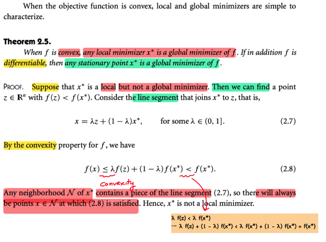</kbd>

> [!NOTE]
> Ta gặp lại theorem này (gặp bên EE364A): Khi hàm lồi thì local minimizer cũng trở thành global minimizer.
>
> Mình tóm tắt phần chứng minh ở đây trước, có vẻ cũng rất dễ hiểu:
>
> Ta sẽ giả sử hàm f convex, x* là local minimizer nhưng không phải là global minimizer (và ta sẽ chứng minh nó vô lí). Vì ko phải là global minimizer nên tồn tại z nào đó "thấp" hơn nó f(z) < f(x*). Khi đó ta xét line segment (đoạn thẳng nối x*, z, tập convex combination của x*, và z: x: x = λz + (1 - λ)x* với 0 < λ < 1.  
>
> Ta mới dùng tính chất của hàm lồi (cũng đã gặp ở ee365):
>
> f(x) ≤ λf(z) + (1 - λ)f(x*)
>
> mà f(z) < f(x*) như giả thiết 
>
> ⇨ f(x) ≤ λf(z) + (1 - λ)f(x*) ≤ λf(x*) + (1 - λ)f(x*) = f(x*)
>
> Tức f(x) ≤ f(x*), hay x sẽ nằm thấp hơn x*
>
> Thế thì đại khái ta sẽ lập luận là dù cho z ở đâu thì để đi từ x đến z ta đều phải đi qua một các điểm x thuộc line segment như này và do đó chắc chắn có điểm nằm trong vùng lân cận neighborhood N của x*.
>
> Và mọi điểm trong line segment này đều "thấp hơn" x*, nên chắc chắn phải có điểm trong lân cận N của x* thấp hơn nó. ⇨ điều này chứng tỏ x* ko phải là local optimizer Mâu thuẫn giả thiết ⇨ x* phải là global minimizer
>
> ====
>
> Thầy Boyd có cách chứng minh cũng hay: Dựa vào tính non negative curvature
>
> Đại khái cũng giả sử x* là local minimizer nhưng không global. Tồn tại z thấp hơn nó: 
> Vậy thì để đi từ x* đến z, vì x* là local minimizer nên kiểu như khi đi ra khỏi x* trong phạm vi lân cận thì đều phải là "đi lên", nhưng sau đó để tới z nằm thấp hơn x* thì phải là đi xuống, có nghĩa là phải có lúc nào đó hàm số phải "cong xuống", mà điều này
> vi phạm tính chất non-negative curvature của hàm lồi

 

- **Điểm dừng và tối ưu toàn cục**

<kbd>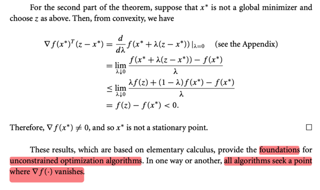</kbd>

> [!NOTE]
> Để chứng minh phần sau ta cũng phản chứng, giả sử x* là stationary point mà x* ko phải global minimizer ⇨ tồn tại z thấp hơn.
>
> ∇f(x*)T(z - x*) = d/dλ f(x* + λ(z - x*)) | λ = 0 là sao?
>
> có thể thấy vế trái, chính là directional derivative đối với vector d = z - x* (chỉ 
> hướng từ x* → z) và evaluate tại x* ta đã biết công thức là ∇f(x*)Td 
>
> Nếu đặt g(λ) = f(x* + λ(z - x*)) thì g là hàm đơn biến thể hiện giá trị của f 
> trên hướng vector d, khi λ = 0, g(0) = f(x*), λ = 1, g(1) = f(z). Và đạo hàm
> của g tại λ = 0 cũng chính là ∇f(x*)Td
>
> (vì bản chất định nghĩa của directional derivative đối với hướng d):
>
> lim δ→0 [f(x + δ) - f(x)] / δ)
>
> và dòng tiếp theo cũng chính là viện dẫn định nghĩa này:
>
> .. = lim λ→0 [f(x* + λ (z - x*)) - f(x*)] / λ  
>
> Tới đây mới dùng tính chất hàm convex:
>
> f(x* + λ(z - x*)) = f(x* + λz - λ x*) = f((1 - λ)x* + λz)
>
> và cái này thì theo convexity ≤ (1 - λ) f(x*) + λ f(z)
>
> ⇨ [f(x* + λ (z - x*)) - f(x*)] / λ  ≤ [(1 - λ) f(x*) + λ f(z) - f(x*)] / λ  
>
> và vế phải = [f(x*) - λf(x*)  + λ f(z) - f(x*)] / λ = - f(x*) + f(z)
>
> Nên ta có lim λ → 0 [f(x* + λ (z - x*)) - f(x*)] / λ  ≤ lim λ → 0 - f(x*) + f(z) 
>
> = f(z) - f(x*) 
>
> và đây là con số âm do f(z) < f(x*)
>
> ⇨ ∇f(x*)T(z - x*) < 0 điều này chứng tỏ ∇f(x*) khác vector 0 ⇨ x* không phải
> stationary point
>
> Và giáo sư nhận xét: Như mọi thuật toán đều tìm kiếm điểm gradient
> vanish

 

- **Minimizer hàm không trơn**

<kbd>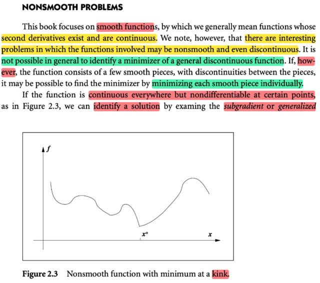</kbd>

<kbd>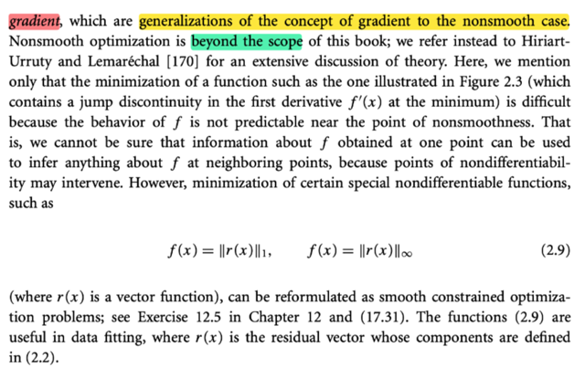</kbd>

> [!NOTE]
> đại khái là dù sách này tập trung vào smooth function, và non-smooth function thường là KHÔNG THỂ TÌM MINIMIZER ĐƯỢC, nhưng nếu hàm f smooth từng phần trên từng đoạn, và chỉ bị discontinuous tại giữa các đoạn, khi đó ta vẫn có cách để tìm minimizer, bằng cách ta sẽ minimizing từng đoạn
>
> Nhưng nói chung là gs chỉ nói sơ vậy thôi đề nghị đọc sách khác

 

