# 2.2 Funds of Unconstrained Optim - Overview of Algorithms

📊 **Progress:** `24` Notes | `35` Screenshots | `20` AI Reviews

---
> [!NOTE]
> Overview of Algorithms

## Tổng quan thuật toán tối ưu

<kbd>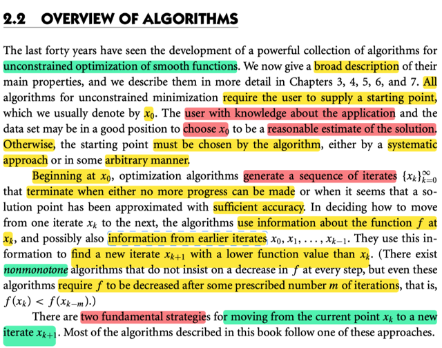</kbd>

> [!NOTE]
> gs nói về cái nhìn tổng quan của thuật toán tối ưu ko ràng buộc. Ta sẽ phải có điểm ban đầu x0, và thuật toán sẽ generate chuỗi điểm x(1),x(2)...cho đến khi dừng là khi ta ko tiến triển thêm nữa (hàm f ko giảm nữa) hoặc khi solution đã xấp xỉ gần đúng được optimal với mức độ chính xác chấp nhận được.
>
> x0 thì có thể được chọn bởi kinh nghiệm trong ngành. 
>
> Hoặc cũng có thể do thuật toán tạo ra một cách tùy tiện hoặc có phương pháp đàng hoàng.
>
> tại mỗi điểm x(k), thuật toán sẽ dùng thông tin tại đó để mà generate điểm kế tiếp, sao cho hàm f giảm. Nhưng cũng có dạng nonmonotone, khi có thể sau mỗi bước không giảm f liên tục nhưng đều phải giảm f sau một số bước nào đó.
>
> nói chung mấy cái này đều biết cả rồi.

> [!TIP]
> **🤖 AI Feedback** — ⚠️ Score: **88/100**
>
> Bài ghi rất chính xác và bao quát được nhiều ý chính quan trọng về thuật toán tối ưu. Để hoàn thiện hơn, bạn có thể bổ sung thêm việc thuật toán dùng thông tin từ các điểm lặp trước đó để tìm điểm tiếp theo và hai chiến lược cơ bản để chuyển từ điểm hiện tại sang điểm mới.

 

### Chiến lược Line Search

<kbd>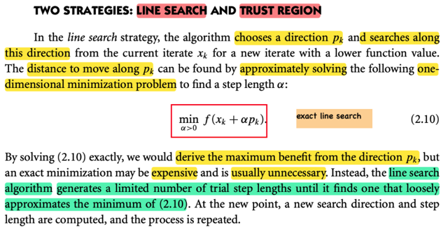</kbd>

> [!NOTE]
> Thế thì giáo sư cho biết có hai chiến lược chính để di chuyển: Line search và Trust region
>
> Với line search thì đã biết rồi, thuật toán sẽ chọn một hướng p_k, (có thể ý nói là descent direction), và tìm theo hướng này giúp đến một điểmthấp hơn
>
> Và bước đi dài bao nhiêu có thể được giải một cách chính xác bằng cách giải bài toán tối ưu hàm đơn biến: minimize α > 0: f(x_k + α p_k) (đây chính là exact line search trong Convex Optimization)
>
> Thì dĩ nhiên nếu giải bài toán này thì ta có bước đi tối ưu theo hướng p_k, nhưng thường là ko cần thiết vì việc giải bài toán này tăng chi phí.
>
> Thay vào đó thuật toán có thể dùng cách khác, tạo các step length cho đến khi tìm được một cái có thể gần gần với cái minimum của bài toán tối ưu
>
> (có thể gs đang nói về backtracking line search)
>
> Rồi sau đó, lại lặp lại, tìm p_(k+1) và search theo hướng đó để tìm x_(k+2)

> [!TIP]
> **🤖 AI Feedback** — ⚠️ Score: **75/100**
>
> Bài làm của bạn đã nắm bắt được hầu hết các điểm chính và có chiều sâu tốt, đặc biệt là việc liên hệ với các thuật toán cụ thể. Tuy nhiên, cần lưu ý rằng trong chiến lược line search, bước tìm độ dài alpha thường được giải quyết một cách gần đúng để tối ưu hóa hiệu quả, chứ không phải luôn chính xác như đã nêu ban đầu.

 

#### Chiến lược Trust Region

<kbd>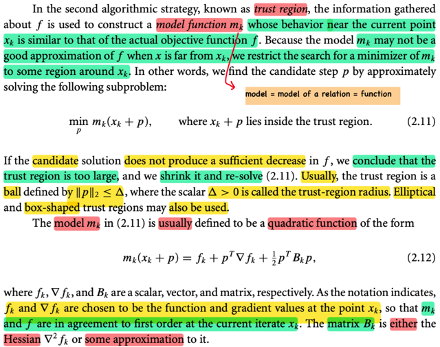</kbd>

> [!NOTE]
> Chiến lược thứ hai là TRUST REGION. 
>
> Đại khái là ta sẽ dùng thông tin về hàm f mà ta có được tại x_k (f, hay gradient, hay Hessian tại x_k) để xây dựng một mô hình m_k sao cho nó hành xử giống hàm f nếu giới hạn trong phạm vi lân cận x_k 
>
> (Mô hình, chữ này có nghĩa là ta mô hình, mô phỏng một quan hệ thực tế define bởi hàm f, nên nói ta xây dựng mô hình m_k thì ý là **xây dựng hàm m_k sao cho m_k(x) hành xử giống hàm f(x)**)
>
> Và vì **nó chỉ hành xử giống f tại vùng lân cận x_k, nên ta mới giới hạn nó trong một trust region**
>
> Khi đó ta sẽ giải bài toán **minimize p m_k(x_k + p) với ràng buộc x_k + p nằm trong trust region, để tìm p**.
>
> (rất dễ hiểu, bằng cách xây dựng mô phỏng của f khiến nó có thể bắt chước được f nếu xét quanh vùng gần x_k, thì ta có thể dùng nó để tìm p giúp đi từ x_k đến x_(k+1)  = 𝐱_k + p.Vì sao phải dùng m_k, thì vì m_k thường sẽ đơn giản hơn là f)
>
> Thế thì nếu như giải bài toán này **tìm thấy p khiến f ko giảm bao nhiêu, thì ta kết luận là trust region quá lớn** mà nguyên nhân là do khi đó **vì t.r quá lớn nên m_k ko còn hành xử giống f nữa**, nên ko dùng m_k để thay f được) 
>
> Khi đó ta sẽ **thu nhỏ trust region lại, và giải lại, và đến lúc nào đó với trust region nhỏ đủ thì m_k nhất định sẽ hành xử giống f, khi đó giải ra p sẽ giúp có thể thực hiện bước đi giảm f**
>
> Mình nghĩ: có cái gì đó rất đẹp ở đây: m_k giống như kẻ đóng thế của f, có thể làm tốt khi bảo nó làm những việc nhỏ thôi, khi đó, nếu ta chia nhỏ công việc ra thì hoàn toàn có thể m_k mô phỏng được f.
>
> Trust region thường là ball / hình như vòng tròn trong bivariate case, define bởi : 
>
> ||p|| ≤ Δ với Δ là bán kính 
>
> Và mô hình m_k thường được chọn là quadratic function (nhớ nhé, mô hình, là mô hình để mô phỏng lại f, nên là function)
>
> m_k(x_k + p) = f_k + pT ∇f_k + (1/2) pT B_k p
>
> f_k, ∇f_k thì là hàm f và gradient tại x_k rồi,
>
> còn B_k có thể dùng Hessian ∇^2 f(x_k) hoặc dùng một xấp xỉ của nó

> [!TIP]
> **🤖 AI Feedback** — ✅ Score: **98/100**
>
> Bài ghi chép này cực kỳ chính xác và chi tiết, giải thích sâu sắc về phương pháp trust region, từ việc xây dựng mô hình m_k đến cách điều chỉnh vùng tin cậy. Cách diễn giải bằng ví dụ "m_k như kẻ đóng thế của f" cùng với việc giải thích lý do ẩn sau các bước cho thấy sự nắm bắt vấn đề vượt trội.

 

##### Vùng tin cậy: Bước và hướng

<kbd>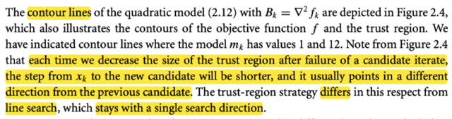</kbd>

<kbd>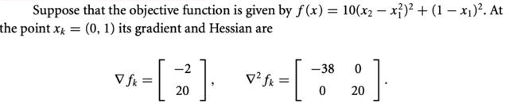</kbd>

<kbd>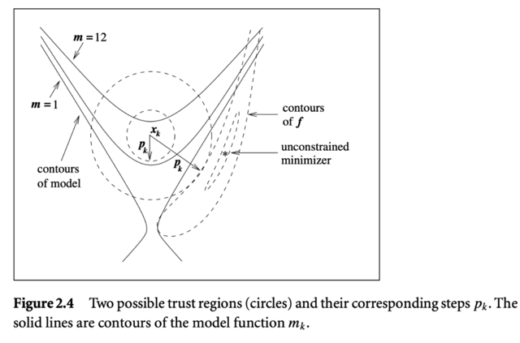</kbd>

<kbd>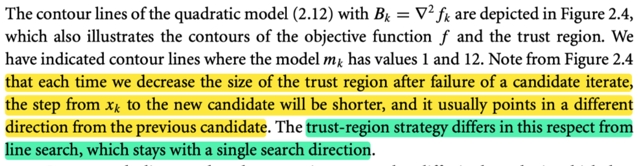</kbd>

> [!NOTE]
> Một minh họa
>
> QUAY LẠI XEM KĨ SAU

> [!TIP]
> **🤖 AI Feedback** — ❌ Score: **25/100**
>
> Bạn đã nhận diện đúng đây là một minh họa và có ý thức quay lại xem kỹ hơn, điều này rất tốt cho việc học. Để ghi chú hiệu quả hơn, hãy cố gắng trích xuất các ý chính như ý nghĩa của đường đồng mức, vùng tin cậy hoặc sự khác biệt với tìm kiếm đường thẳng.

 

- **Line Search và Trust Region**

<kbd>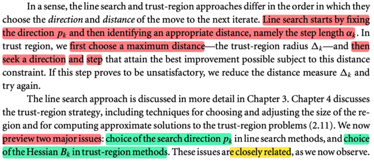</kbd>

> [!NOTE]
> Đại ý là, line search và trust region khác nhau cơ bản ở:
>
> Line search **chọn một hướng p_k**, và **tìm bước đi** phù hợp theo hướng đó.
>
> Trust region **chọn một bán kính**, sau đó **tìm p_k và step**. Nếu không giảm đủ thì thu nhỏ bán kính và làm lại.
>
> Vậy thì chap 3,4 sẽ bàn sâu về hai cái này,  nhưng trước hết ta sẽ tìm hiểu hai bước quan trọng trong hai cái này:
>
> **Chọn search direction p_k trong line search** và **chọn Hessian B_k của mô hình m_k trong trust region method**

> [!TIP]
> **🤖 AI Feedback** — ✅ Score: **97/100**
>
> Ghi chú tóm tắt rất hiệu quả sự khác biệt cốt lõi giữa hai phương pháp và xác định chính xác các vấn đề chính sẽ được thảo luận. Để sâu sắc hơn, bạn có thể bổ sung chi tiết rằng hai vấn đề chính (lựa chọn hướng tìm kiếm và Hessian) có "liên quan chặt chẽ" với nhau.

 

- **Hướng dốc nhất và Taylor**

<kbd>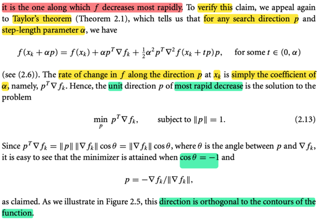</kbd>

<kbd>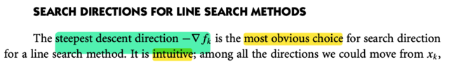</kbd>

<kbd>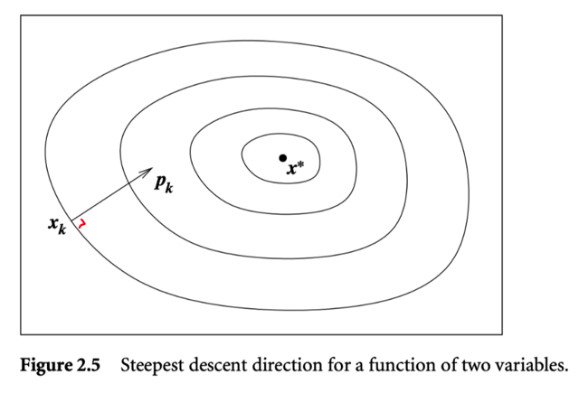</kbd>

> [!NOTE]
> Bàn về chọn p_k của line search, gs cho rằng cách dể hiểu nhất, hợp lí nhất là chọn hướng dốc nhất, chính là - ∇f_k (tức gradient -∇f(x)|x = x_k)
>
> Và dùng Taylor theorem ta có thể chứng minh điều này (cũng không hiểu sao phải viện dẫn Taylor theorem, vì ta đã biết directional derivative theo hướng p evaluate tại x_k sẽ là ∇f_k Tp, và nó cũng chính là độ dốc của hàm xét theo hướng p, nếu muốn xét p nào có độ dốc lớn nhất, ta sẽ so các p có length bằng 1, tức giải bài toán: 
>
> minimize p ∇f_k Tp subject to ||p|| = 1 thì lập luận tiếp như sách để có p = -∇f_k / ||∇f_k||
>
> Có thể gs viện Taylor theorem để chỉ ra rằng ∇f_k Tp chính là độ dốc của hàm f theo hướng p tại x_k (là thứ mà mình nói "ta đã biết" ở trên).
>
> Ôn lại Taylor theorem: Nói rằng:
>
> Khi đi từ a → b, thì f(b) = f(a) + ∇f(a)T(b-a) + (1/2) (b-a)T ∇^2 f(c) (b-a) với some c in (a, b) 
>
> Cũng là áp dụng ở đây:
>
> f(x_k + αp) = f(x_k) + ∇f_k T(αp) + (1/2) (αp)T ∇f(c) αp với some c in (x_k, x_k + αp)
>
> tương đương: 
>
> f(x_k + αp) = f(x_k) + ∇f_k T(αp) + (1/2) (αp)T ∇f(x_k + tαp) αp với some t in (0,1)
>
> tương đương
>
> f(x_k + αp) = f(x_k) + ∇f_k T(αp) + (1/2) (αp)T ∇f(x_k + tp) αp với some t in (0, α)
>
> viết lại chút:
>
> f(x_k + αp) = f(x_k) + α ∇f_k Tp + (1/2) (α)^2 pT ∇f(x_k + tp) p với some t in (0, α)
>
> Và như vậy, tương đương tiếp:
>
> [f(x_k + αp) - f(x_k)] / α = ∇f_k Tp + (1/2) α pT ∇f(x_k + tp) p
>
> Lấy lim α → 0:
>
> thì vế trái là lim α → 0 [f(x_k + αp) - f(x_k)] / α, nó chính là đạo hàm theo hướng p, directional derivative, cũng là rate of change theo hướng p của hàm f tại x_k
>
> Còn vế phải sẽ là lim α → 0 ∇f_k Tp + (1/2) α pT ∇f(xk + tp) p = ∇f_k Tp
>
> Nói chung, có thể coi như giáo sư đã liên hệ định nghĩa directional derivative với Taylor theorem
>
> Và p_k như vầy sẽ luôn vuông góc với contour (level set): Đã học trong mit 1802, nhưng ở đây Taylor theorem cho ta thấy luôn:
>
> xét d là hướng tiếp tuyến với level curve của f tại x_k
>
> khi đó lim α → 0 [f(x_k + αd) - f(x_k)] / α là độ dốc của hàm theo hướng tiếp tuyến với level curve, mà đi theo level curve thì f ko đổi, nên độ dốc này bằng 0.
>
> nên ta có vế trái = 0,
>
> còn vế phải là ∇f_k Td như trên. Vậy ∇f_k vuông góc d và dĩ nhiên cũng - ∇fk cũng vậy 
>
> ⇨  steepest direction pk = - ∇f_k sẽ vuông góc với level curve

> [!TIP]
> **🤖 AI Feedback** — ✅ Score: **98/100**
>
> Bản phân tích rất sâu sắc và chính xác, giải thích chi tiết việc sử dụng Định lý Taylor để chứng minh tốc độ thay đổi và lý do hướng dốc nhất vuông góc với đường đồng mức, làm rõ những điểm mà hình ảnh chỉ đề cập vắn tắt.

 

- **Steepest descent và bước nhảy**

<kbd>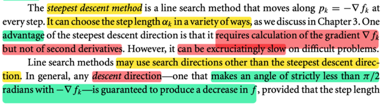</kbd>

<kbd>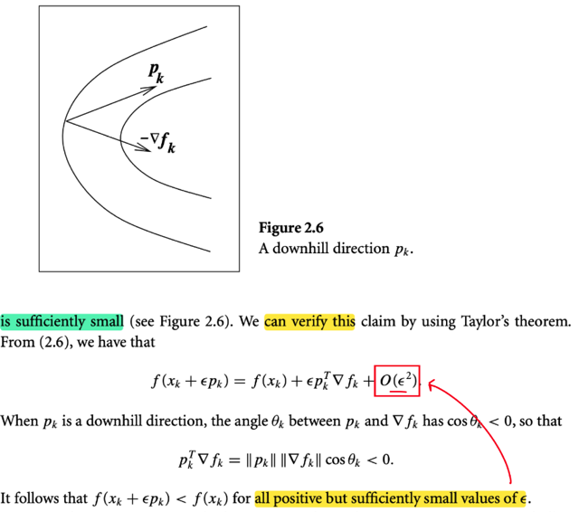</kbd>

> [!NOTE]
> Đại khái là, trong line search, dùng steepest descent có một ưu điểm là **chỉ phải tính gradient mà không cần Hessian**
>
> Tuy nhiên nó có thể **rất chậm nếu gặp bài toán khó**.
>
> Và line search cũng có thể dùng search direction khác ko nhất thiết -∇f.
>
> Đó là bất kì hướng nào có góc tù với gradient, và miễn sao là giữ cho step size nhỏ đủ thì đều có thể chắc giảm được f khi đi theo hướng đó.
>
> Mình nghĩ: Tại sao lúc này lại nói về việc phải giữ step size đủ nhỏ, bộ khi dùng steepest descent thì không cần hay sao?
>
> Không phải vậy, mà là đây sẽ là lập luận chứng minh chỉ cần đi theo hướng có góc tù với gradient và sải bước đủ nhỏ thì hướng nào cũng sẽ giảm f. Trong đó có steepest direction, chứ không phải là nếu đi theo hướng khác steepest thì mới phải giữ sải bước đủ nhỏ.
>
> Và chứng minh như sau:
>
> Dùng Taylor theorem, với p là hướng góc tù với gradient nói trên, bắt đầu tại x_k
>
> f(x_k + αp) = f(x_k) + ∇f(x_k)T(αp) + (1/2) (αp)T ∇^2 f(x_k + tαp) (αp) for some t in (0, 1)
>
> ≡ f(x_k + αp) = f(x_k) + ∇f(x_k)T(αp) + (1/2) (α)^2 pT ∇^2 f(x_k + tp) p for some t in (0, α)
>
> Và ta gọi (1/2) (α)^2 pT ∇^2 f(x_k + tp) p là O((α)^2) chỉ term sẽ tăng theo lũy thừa 2 của α.
>
> Viết lại f(x_k + αp) = f(x_k) + ∇f(x_k)Tαp + O((α)^2)
>
> ⇔ f(x_k + αp) = f(x_k) + α||∇f(x_k)||.||p||.cos(θ) + O((α)^2), θ là góc giữa p và ∇f(x_k)
>
> Khi đó, ý là vầy, với góc θ tù thì α||∇f(x_k)||||p||cos(θ) < 0
>
> Kh đó f(x_k) - f(x_k + αp) = - α||∇f(x_k)||||p||cos(θ) - O((α)^2)
>
> Thế thì - α||∇f(x_k)||||p||cos(θ) sẽ là một số dương và mà O((α)^2) (cũng là số dương), nên đây là hiệu của hai số dương, nếu O((α)^2) là số dương nhỏ thì cái hiệu này sẽ dương.
>
> Và vế trái chính là độ giảm của f khi từ x_k → x_k + αp
>
> Vậy, lập luận là, nếu giữ α đủ nhỏ, để O((α)^2) rất nhỏ coi như bỏ qua, = 0 
>
>  thì khi đó vế phải sẽ dương. Bất kể p có là hướng nào (miễn θ tù)
>
> Đó là lí do phải nói về step size đủ nhỏ, vì lớn quá có thể O((α)^2) sẽ dương lớn hơn cái kia, thành ra vế phải âm, hàm tăng

> [!TIP]
> **🤖 AI Feedback** — ⚠️ Score: **88/100**
>
> Bạn đã nắm vững các ưu và nhược điểm của phương pháp steepest descent và hiểu đúng về khái niệm hướng giảm tổng quát. Đặc biệt, cách bạn tự đặt câu hỏi và giải thích bằng chuỗi Taylor cho thấy tư duy phản biện và khả năng đào sâu vấn đề rất tốt.

> [!IMPORTANT]
> **🎤 Review Session 1** — Score: **55/100**
>
> Em đã nắm được khái niệm cơ bản về Steepest Descent và vị trí của nó trong Line Search. Tuy nhiên, em cần bổ sung thêm các điểm quan trọng khác như ưu điểm (chỉ cần tính gradient), nhược điểm (có thể rất chậm), và điều kiện về hướng giảm chung cũng như tầm quan trọng của việc chọn bước nhảy đủ nhỏ. Hãy thử đào sâu vào lý do tại sao bước nhảy phải nhỏ đủ để đảm bảo hàm giảm nhé.

 

- **Hướng Newton qua xấp xỉ Taylor**

<kbd>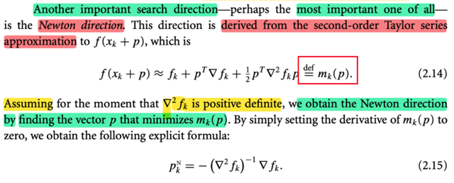</kbd>

> [!NOTE]
> Rồi, ta gặp lại người bạn cũ **Newton direction**, tác giả nói một search direction quan trọng có thể là quan trọng nhất chính là Newton direction. Đựơc derive bằng cách dùng xấp xỉ Taylor bậc hai của f(x_k + p).
>
> f(x_k + p) ≈ f(x_k) + ∇f(x_k)T p + (1/2) pT∇^2 f(x_k) p 
>
> Ghi gọn vế trái là f_k + ∇f_k Tp + (1/2) pT∇^2 f_k p 
>
> (đây là xấp xỉ Taylor bậc hai, ko phải Taylor theorem)
>
> Hàm bậc hai mà ta dùng để xấp xỉ hàm f, tại x_k, chính là m_k(p) là mô hình trust region tại x_k.
>
> Thế thì như đã biết ở ee364a, để tìm Newton step chính là ta xấp xỉ, hàm f, nói dễ hiểu hơn là ta coi hàm f như hàm bậc hai, để rồi giải tìm minimum của nó: 
>
> minimize f_hat (p) = f_k + ∇f_k Tp + (1/2) pT∇^2 f_k p 
>
> Và để giải tìm local minimizer ta cũng dùng điều kiện bậc 1: gradient = 0.
>
> Gradient của f_hat (p): Đây là hàm quadratic, mà gradient của hàm quadratic f(x) = (1/2)xTPx + qTx + r dễ dàng derive công thức là PTx + q.
>
> ⇨ ∇f_hat (p) = ∇^2 (f^)_k p + ∇f_k (Hessian đối xứng nên bỏ transpose)
>
> Cho gradient = 0 ⇨ ∇^2 f_k p + ∇fk = 0 ⇔ ∇^2 f_k p = -∇f_k
>
> Tới đây, trong sách giáo sư mới assume Hessian positive definite, ta hiểu để mà ∇^2 f_k khả nghịch
>
> ⇨ p = - ∇^2(f_k)^(-1) ∇f_k. Và đây chính là Newton step

> [!TIP]
> **🤖 AI Feedback** — ✅ Score: **98/100**
>
> Phân tích của bạn rất chính xác và thể hiện sự hiểu biết sâu sắc về hướng Newton và quá trình đạo hàm của nó. Bạn đã kết nối các khái niệm một cách xuất sắc.

 

- **Độ tin cậy phương pháp Newton**

<kbd>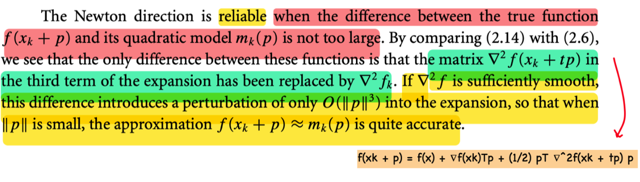</kbd>

> [!NOTE]
> Đoạn này rất hay: Đại khái là vì ta tìm Newton direction bằng cách xấp xỉ hàm f tại x_k bởi quadratic function, cũng chính là m_k, nên dĩ nhiên Newton direction chỉ tốt nếu như sự xấp xỉ này là tốt (khác biệt ko quá lớn)
>
> Vậy thì, công thức 2.6 của Taylor theorem cho ta cái hàm chính xác có thể thay f(x_k + p):
>
> f(x_k + p) = f(x_k) + ∇f(x_k)T p + (1/2) pT ∇^2 f(x_k + tp) p for some t in (0,1)
>
> Còn khi ta mô phỏng f bởi xấp xỉ bậc hai:
>
> f(x_k + p) ≈  f(x_k) + ∇f_k Tp + (1/2) pT ∇^2 f_k p
>
> Thì **cơ bản là ta đã thay ∇^2 f(x_k + tp) bởi ∇^2 f(x_k), nên từ dấu bằng, trở thành xấp xỉ ≈** 
>
> Và **mức độ sai khác giữa hai cái này sẽ quyết định mức độ sai khác của f(x_k + p) (chính xác) và mk(p)**.
>
> Thế thì, ở đây tác giả cho biết **nếu hàm f ĐỦ TRƠN**, thì sự khác biệt khi thay ∇^2 f(x_k + tp) bởi ∇^2 f(x_k) SẼ CHỈ THÊM VÀO MỘT TERM O((||p||)^3), tạm hiểu đại khái là, như vậy chỉ cần giữ p đủ nhỏ thì cái sai khác này ko đáng kể. 
>
> Và mình nghĩ: đây cũng chính là lí do cần giới hạn trust region trong phương pháp trust region: Vì trong đó ta cũng xây dựng mô hình mk là xấp xỉ bậc hai của f, nên nó chỉ đúng khi xét trong phạm vi nhỏ

> [!TIP]
> **🤖 AI Feedback** — ✅ Score: **98/100**
>
> Bạn đã nắm vững các khái niệm chính về độ tin cậy của hướng Newton và vai trò của xấp xỉ bậc hai. Khả năng kết nối kiến thức với phương pháp Trust Region là rất ấn tượng.

 

- **Hướng Newton là hướng giảm**

<kbd>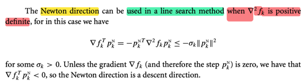</kbd>

> [!NOTE]
> Đại khái là chỗ này tác giả muốn nói **Newton direction CŨNG LÀ DESCENT DIRECTION**, nên nó cũng có thể được dùng trong line search (vì trong line search, ta nhớ đầu tiên là chọn hướng để đi, p, là một descent direction. Sau đó mới chọn sải bước tối ưu hoặc chấp nhận được.
>
> Nhưng điều này chỉ đúng khi Hessian tại x_k, ∇^2 f_k positive definite. Nói sơ trước khi đi vào chi tiết, là vì ta tính ra directional derivative theo hướng Newton tại x_k của f sẽ thấy nó là (âm) quadratic form của Hessian của f tại x_k, do đó, chỉ khi Hessian tại x_k positive definite thì ta mới đảm bảo là cái giá trị đạo hàm theo hướng Newton tại x_k âm, để cho thấy là đi theo hướng đó sẽ giảm f.
>
> Ta sẽ muốn xem thử directional derivative theo hướng Newton có âm không (để đi theo hướng đó, với xải bước nhỏ đủ, thì như lập luận lúc nãy, nhất định hàm f sẽ giảm)
>
> Gọi (p_k)^N, hay ở đây mình ghi là pkN, là hướng Newton tại x_k:
>
> Directional derivative theo hướng Newton tại x_k:
> ab
> (∇)_(pkN) f(x) | (x=x_k) = (∇)_(pkN) f_k = ∇f_k T pkN,
>
> với Newton direction (step) : pkN như nãy đã biết, = - (∇^2f_k)inv ∇fk
>
> ⇨ (∇)_(pkN) f_k = - ∇f_k T (∇^2f_k)inv ∇f_k
>
> Tới đây thì theo mình thì đã có thể kết luận cái này âm rồi:
>
> Lí do là nếu ∇^2 f_k positive definite, thì mọi eigenvalue của nó đều dương và dĩ nhiên mọi nghịch đảo của eigenvalue cũng dương ⇨ (∇^2f_k)inv cũng positive definite.
>
> Mà với positive definite A thì ta biết tính chất là quadratic form xTAx luôn dương với mọi x khác 0,  và chỉ bằng 0 khi x = 0.
>
> Vậy thì từ đó  ∇f_k T (∇^2fk)inv ∇f_k, sẽ luôn dương khi gradient tại x_k, tức ∇f_k khác 0, và chỉ bằng 0 khi gradient bằng 0 
>
> Do đó -  ∇f_k T (∇^2f_k)inv ∇f_k luôn âm khi gradient khác 0.
>
> Còn ở trong sách, ta có thể biến đổi thêm chút: nhân cho Identity matrix:
>
> (∇)_(pkN) f_k = - ∇f_k T (∇^2f_k)inv ∇f_k
>
> = - ∇f_k I (∇^2f_k)inv ∇f_k
>
> = - ∇f_k T (∇^2f_k)inv ∇^2 f_k (∇^2f_k)inv ∇f_k
>
> = - [(∇^2f_k)inv ∇fk]T ∇^2 f_k [(∇^2f_k)inv ∇f_k]
>
> = - (pkN)T ∇^2 f_k pkN
>
> Và lập luận tương tự, cái này luôn âm nhờ tính positive definite của Hessian và chỉ bằng 0 khi pkN = 0 ⇔ (∇^2f_k)inv ∇f_k = 0. 
>
> Và vì (∇^2f_k)inv positive definite nên dĩ nhiên là full rank, nên nullspace chỉ có {0}, dẫn tới là (∇^2f_k)inv ∇f_k = 0 ⇔ ∇f_k = 0: 
>
> Còn cái vụ - (pkN)T ∇^2 f_k pkN ≤  - σk (||pkN||)^2?
>
> Đó là eigen-decomposition của một symmetric matrix A thành dạng QΛQT (hoặc gọi cụ thể hơn còn gọi là diagonalization, dù bản chất vẫn là eigen-decomposition vì nó phân rã matrix thành một matrix diagonal)
>
> Đặt u = pkN, A =∇^2 f_k
>
> ⇨ (pkN)T ∇^2 f_k pkN = uTAu 
>
> = uTQ Λ QTu. Đặt v = QTu, cái ta có sẽ là vTΛv = Σ_i=1:n λ_i (v_i)^2 (λ_i là các eigenvalues của Hessian ∇^2 f_k)
>
> Và cái này Σi λmin (v_i)^2 ≤ Σ λi (v_i)^2 ≤  Σi λmax (v_i)^2
>
> ⇨ - Σ λi (v_i)^2 ≤ - Σi λmin (v_i)^2 = - λmin Σi (v_i)^2 = - λmin (||v||)^2
>
> ⇔ - Σ λi (v_i)^2 ≤ - λmin (vTv)
>
> ⇔ - Σ λi (v_i)^2 ≤ - λmin (QTu)T(QTu)
>
> ⇔ - Σ λi (v_i)^2 ≤ - λmin uTQQTu
>
> ⇔ - Σ λi (v_i)^2 ≤ - λmin uTu
>
> ⇔ - Σ λi (v_i)^2 ≤ - λmin (||u||)^2
>
> Áp dụng vào đây, - (pkN)T ∇^2 f_k pkN ≤ - λmin (||pkN||)^2
>
> nên σk ở trên chính là λmin của Hessian ∇^2 f_k

> [!TIP]
> **🤖 AI Feedback** — ✅ Score: **98/100**
>
> Bài làm của bạn thể hiện sự hiểu biết sâu sắc và toàn diện về hướng Newton như một hướng giảm, bao gồm cả các chứng minh toán học chi tiết vượt xa tài liệu tham khảo.

 

- **Sải bước tự nhiên của Newton**

<kbd>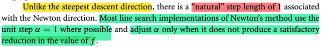</kbd>

> [!NOTE]
> Đây cũng là một ý rất hay mà mình từng suy nghĩ: Newton direction tuy cũng là một hướng, nhưng nó có một sải bước tự nhiên, bằng 1, khác với steepest descent.
>
> Lí do là với steepest descent, có thể hiểu là nó, cho ta một hướng có độ dốc lớn nhất tại điểm đang đứng, và theo Taylor theorem, miễn là ta giữ sải bước đủ nhỏ, thì theo hướng đó nó sẽ đưa ta đi xuống.
>
> Nhưng nó ko hề nói gì về sải bước (step size)
>
> Còn động cơ của Newton method thì khác, tại xk, ta thay hàm f, bởi xấp xỉ bậc hai của nó, và từ đó tìm local minimizer của hàm bậc hai. Và kết quả nó cho ta một vector chỉ hướng từ xk đến minimizer, nhưng đồng thời cũng cho ta độ lớn của sải bước, để theo hướng đó, đi đến minimizer. Có nghĩa là, một cách tự nhiên, Newton direction có step factor bằng 1, tức là tính ra Newton direction vector có độ dài bao nhiêu thì lấy bấy nhiêu
>
> Và như ta đã thấy chỉ cần Hessian tại xk positive definite thì Newton direction là descent direction, nhưng chưa chắc full step size là step size tối ưu. Có nghĩa là tuy ta có thể dùng Newton direction cho line search nhưng chưa chắc dùng step factor  = 1 là tối ưu, đơn giản là vì ta chỉ đang xấp xỉ bậc hai hàm f mà đương nhiên là nó ko chắc chắc là đúng.
>
> Do đó ở đây gs cho biết phần lớn line search  nếu đã dùng Newton step thì họ dùng luôn unit step tuy nhiên vẫn có khi ta adjust nó

> [!TIP]
> **🤖 AI Feedback** — ✅ Score: **98/100**
>
> Ghi chú rất chính xác và giải thích sâu sắc về sải bước tự nhiên của phương pháp Newton, cùng với sự khác biệt so với steepest descent. Nội dung cũng nắm bắt tốt việc khi nào bước nhảy được điều chỉnh, thể hiện sự hiểu biết toàn diện về phương pháp.

 

- **Newton: Điều kiện và chi phí**

<kbd>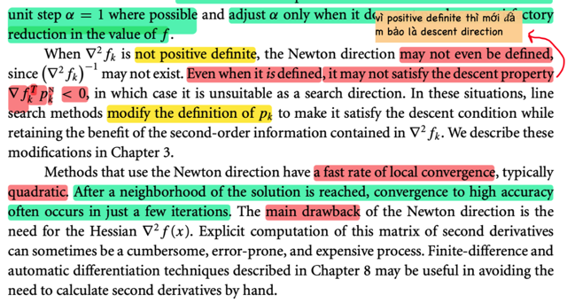</kbd>

> [!NOTE]
> Tiếp, khi Hessian ko positive definite, thì dĩ nhiên ko có Hessian inverse nên ta không có (không define được) Newton direction.
>
> Nhưng ngay cả khi nó define, thì cũng chưa chắc nó là descent direction.
>
> Chỗ này là vì, để có Newton direction, ta chỉ cần Hessian invertible, nhưng để là descent direction, thì ta còn cần Hessian positive definite nữa.
>
> Do đó trong những case này, có khi người ta sẽ điều chỉnh pk để giúp nó thỏa descent property,
>
> Đoạn tiếp theo nói về một thứ mình đã học trong Convex Optimization, đó là nó có tỉ lệ / tốc độ hội tụ nhanh, khi mà ta đã tiếp cận được vùng lân cận của solution (local minimizer) thì khi đó đại khái là trạng thái well condition ngày càng tốt, hiểu nôm na là "bề mặt" của optimization landscape ngày càng giống một hàm bậc hai, khiến cho việc xấp xỉ bậc hai hàm f ngày càng chính xác. 
>
> Dẫn tới việc tìm ra approximated solution (minimizer của hàm bậc 2 xấp xỉ f) sẽ ngày càng chính xác so với solution thật. Và dẫn tới cái gọi là quadratic convergence, trong giai đoạn gọi là Newton phase.
>
> Tuy nhiên cái nhược điểm lớn nhất của Newton direction là Hessian, phải tính Hessian: Dễ sai, phức tạp và tốn kém.
>
> Nên qua chương 8 mình sẽ học về finite-difference và automatic differentiation (thật ra đã học ở MIT 18s096)

> [!TIP]
> **🤖 AI Feedback** — ✅ Score: **98/100**
>
> Ghi chú này rất chính xác và sâu sắc, thể hiện sự hiểu biết rõ ràng về các khái niệm trong bài đọc. Đặc biệt, phần giải thích cơ chế hội tụ bậc hai và sự cần thiết của Hessian positive definite đã bổ sung thêm giá trị đáng kể.

 

- **Nguyên lý phương pháp Quasi-Newton**

<kbd>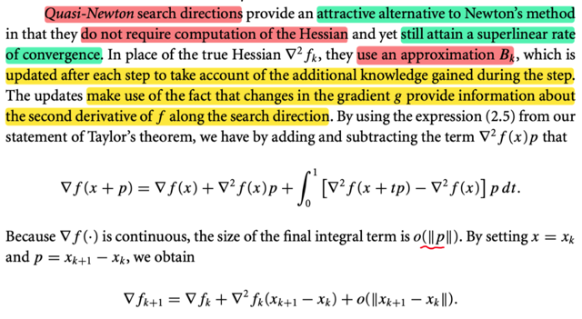</kbd>

> [!NOTE]
> Đây là lúc mình được học về phương pháp rất nổi tiếng Quasi-Newton đây.
>
> Đại khái là, ta sẽ muốn đạt được hiệu quả tương tự như Newton's method, như tốc độ hội tụ nhanh, nhưng không phải tính toán Hessian.
>
> Và người ta sẽ t**ính toán một matrix xấp xỉ của Hessian tại xk, gọi là Bk** theo cách làm là ta sẽ tận dụng thông tin có được sau mỗi step để update B và nó tận dụng sự thật là: 
>
> **SỰ THAY ĐỔI CỦA GRADIENT SAU MỖI STEP CÓ ĐEM ĐẾN MỘT LƯỢNG THÔNG TIN NÀO ĐÓ VỀ ĐẠO HÀM BẬC HAI THEO HƯỚNG SEARCH DIRECTION**
>
> Lập luận như sau:
>
> Đầu tiên ta dùng lại 2.5 của Taylor theorem (mà mình đã hiểu = tự chứng minh từ FTC)
>
> ∇f(x + p) = ∇f(x) + ∫0:1 ∇^2 f(x + tp) p dt
>
> Cộng và trừ cho ∇^2 f(x)p:
>
> ∇f(x + p) = ∇f(x) +  ∇^2 f(x)p - ∇^2 f(x)p + ∫0:1 ∇^2 f(x + tp) p dt
>
> Coi - ∇^2 f(x)p = ∫0:1 ∇^2 f(x)p dt, vì vế phải đúng là bằng vế trái nếu tính tích phân ra: ∇^2 f(x)p t|0:1 = ∇^2 f(x)p*1  - ∇^2 f(x)p*0 = ∇^2 f(x)p
>
> ⇔ ∇f(x + p) = ∇f(x) + ∇^2 f(x)p -  ∫0:1 ∇^2 f(x)p dt + ∫0:1 ∇^2 f(x + tp)p dt
>
> Gom hai tích phân lại:
>
> ⇔ ∇f(x + p) = ∇f(x) + ∇^2 f(x)p +  ∫0:1 [∇^2f(x + tp) - ∇^2 f(x)] p dt
>
> Xét cái term thứ 3:  ∫0:1 [∇^2 f(x + tp) - ∇^2 f(x)] p dt
>
> Đại khái là, nếu đặt G = ∫0:1 [∇^2 f(x + tp) - ∇^2f(x)] p dt,
>
> (lưu ý, đây tích phân này kết quả là vector)
>
> ||G|| = ∫0:1 ||[∇^2 f(x + tp) - ∇^2 f(x)]|| ||p|| dt,
>
> xét lim ||p|| → 0 ||G|| / ||p||
>
> thì khi ||p|| → 0 tức là xét vector p có length ngày càng nhỏ về 0, thì x + tp cũng → x 
>
> Do hàm f liên tục nên Hessian tại x + tp cũng → Hessian tại x
>
> ⇨ ||[∇^2 f(x + tp) - ∇^2 f(x)]|| → 0
>
> và ||p|| cũng → 0, 
>
> Nên tích của hai cái này còn → 0 nhanh hơn cả p nữa.
>
> Nên mới ghi là kích thước của ∫0:1 [∇^2 f(x + tp) - ∇^2 f(x)] p dt sẽ là o(||p||) ý là nhỏ về 0 rất nhanh, nhanh hơn cả ||p||
>
> Do đó, mới nói cái tích phân này là o(||p||), mang ý nghĩa là  nó là cái term
> tiến về 0 rất nhanh, nhanh hơn cái khi norm p (||p||) tiến về 0.

> [!TIP]
> **🤖 AI Feedback** — ✅ Score: **98/100**
>
> Ghi chú của bạn thể hiện sự hiểu biết sâu sắc và chính xác về phương pháp Quasi-Newton, đặc biệt là phần giải thích chi tiết về đạo hàm bậc hai và ký hiệu o(||p||).

 

- **Hessian xác định dương gần x***

<kbd>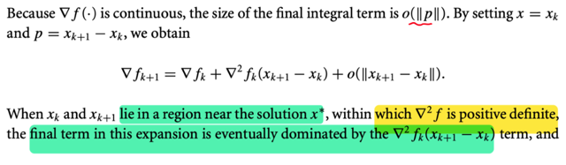</kbd>

<kbd>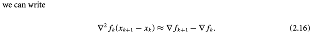</kbd>

> [!NOTE]
> Rồi, ta cho x = xk, p = xk+1 - xk:
>
> ∇f(x + p) = ∇f(x) + ∇^2 f(x)p +  o(||p||)
>
> trở thành:
>
> ⇔ ∇f_(k+1) = ∇f_k + ∇^2 f_k (x_(k+1) - x_k) + o(||x_(k+1) - x_k||)
>
> Tới đây là lập luận quan trọng: 
>
> Khi ngày càng gần x*, thì thì bước sải xk+1 - xk sẽ nhỏ lại, lí do là:
>
> Ví dụ như ở đây dùng Newton direction, pk = - ∇^2 f_k ∇f_k
>
> thì khi x_k → x* thì ∇f(x_k) → ∇f(x*) do hàm liên tục, mà ∇f(x*) = 0
>
> ⇨ pk = - ∇^2 f_k ∇f_k → - ∇^2 f(x*) ∇f(x*) = - ∇^2 f(x*) × 0 = 0
>
> Từ đó cho ta được phép nói rằng: 
>
> **Khi càng gần x* thì x_(k+1) - x_k ngày càng nhỏ về 0**
>
> Thế thì xét hai cái term ∇^2 f_k(x_(k+1) - x_k), và o(||x_(k+1) - x_k||) 
>
> khi x_(k+1) - x_k → vector 0, cũng là ||x_(k+1) - x_k|| → scalar 0, 
>
> Và như vậy **sẽ đến lúc nó bị dominated bởi  ∇^2 f_k(x_(k+1) - x_k)**
>
> VÌ SAO?
>
> VÌ ∇^2 f_k(x_(k+1) - x_k) chỉ giảm tuyến tính theo độ lớn của sải bước x_(k+1) - x_k
>
> Trong khi o(||x_(k+1) - x_k||)  thì giảm nhanh hơn là giảm tuyến tính độ giảm của sải bước sải bước x_(k+1) - x_k (vì như trên đã phân tích)
>
> Do đó, chỉ cần ∇^2 f_k(x_(k+1) - x_k) KHÔNG ĐỘT NHIÊN BẰNG 0, THÌ CHẮC CHẮN NÓ SẼ CÓ LÚC DOMINATE o(||x_(k+1) - x_k||).
>
> VÌ SAO NÓI NÓ KHÔNG ĐƯỢC ĐỘT NHIÊN BẰNG 0? 
>
> Là vì nếu x_(k+1) - x_k trở thành nullspace vector của matrix  ∇^2 f_k, thì ∇^2 f_k (x_(k+1) - x_k) sẽ = 0. Khi đó ta sẽ **không có cái vụ dominate, nên không được quyền bỏ o(||x_(k+1) - x_k||) và cũng là nếu dùng xấp xỉ sẽ là sai**
>
> Chính vì vậy, mới nhắc đến việc tại gần x*, Hessian **POSITIVE DEFINITE**
>
> **VÌ ĐIỀU NÀY ĐẢM BẢO LÀ ∇^2 f_k FULL RANK, NON-SINGULAR, NULLSPACE CHỈ CÓ {0}, giúp ta đảm bảo có thể bỏ đi o(||xk+1 - xk||) và xấp xỉ là ĐƯỢC PHÉP**
>
> VẬY THÌ VÌ SAO GẦN x* THÌ HESSIAN LẠI POSITIVE DEFINITE?  
>
> LÀ VÌ Ở ĐÂY NGƯỜI TA ĐANG ĐẶT RA ASSUMPTION NHƯ VẬY (ko phải là điều luôn đúng, vì theo điều kiện cần bậc 2, thì nếu x* là local minimizer thì chỉ có thể kết luận Hessian tại đó xác định bán dương)
>
> Tóm lại nếu những giả định trên thỏa mãn (Hessian xác định dương khi gần x*) thì giúp ta có thể nói rằng: *khi x_k, x_(k+1) gần solution x* thì o(||xk+1 - xk||) coi như quá nhỏ, coi như bỏ đi dẫn đến ta có xấp xỉ:
>
> ∇f_(k+1) ≈ ∇f_k + ∇^2 f_k (x_(k+1) - x_k) 
>
> ⇔ ∇f_(k+1) - ∇f_k ≈ ∇^2 f_k (x_(k+1) - x_k)
>
> ⇔ ∇^2 f_k (x_(k+1) - x_k) ≈ ∇f_(k+1) - ∇f_k 
>
> Và đây không phải để chơi, mà chính là cơ sở cho việc dùng một matrix B_k xấp xỉ cho Hessian tại x_k: Ta sẽ dùng matrix cũng thỏa cái tính chất trên.

> [!TIP]
> **🤖 AI Feedback** — ✅ Score: **98/100**
>
> Ghi chú này cung cấp một phân tích rất sâu sắc và chính xác về lý do các điều kiện (Hessian xác định dương, bước nhảy nhỏ) dẫn đến sự trội hơn của một số hạng trong khai triển Taylor. Nó không chỉ lặp lại nội dung mà còn giải thích tường tận từng yếu tố toán học liên quan, thể hiện sự hiểu biết sâu sắc về ngữ cảnh.

 

- **Xấp xỉ Hessian và Secant**

<kbd>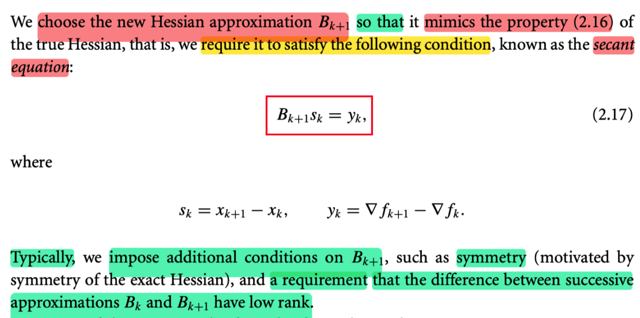</kbd>

> [!NOTE]
> Dựa trên sự thật này, là với Hessian thật, thì nó có tính chất khi gần x* thì: 
>
> ∇^2 f_k (x_(k+1) - x_k) ≈ ∇f_(k+1) - ∇f_k 
>
> Người ta mới **chọn** B_(k+1), là một xấp xỉ của Hessian sao cho nó thỏa tính chất trên. 
>
> Và đó chính là **SECANT EQUATION**:
>
> B_(k+1) s_k = y_k với s_k = x_(k+1) - x_k, y_k = ∇f_(k+1) - ∇f_k
>
> Nhắc lại, lập luận xuất phát từ việc, nếu ta (thỏa) giả định local minimizer có **Hessian  positive definite**, thì **tồn tại một vùng lân cận Hessian cũng positive definite**, cùng với lập luận ở trên, cho phép ta có quyền nói rằng, à, khi tới gần x*, thì ta có một phương trình xấp xỉ như vầy: 
>
> ∇^2 f_k (x_(k+1) - x_k) ≈ ∇f_(k+1) - ∇f_k
>
> Và dựa trên phương trình này, hay tính chất này của Hessian "thật", ta sẽ làm giả một cái Hessian (xấp xỉ nó), thay vì tính ra Hessian thật phiền phức, mà **việc làm giả nếu như vẫn thỏa tính chất trên thì khi dùng nó ta cũng có thể có được lợi ích từ Newton method.**
>
> Rồi, thêm nữa, khi "làm giả", ta cũng bắt chước một tính chất nữa của Hessian là tính đối xứng, và làm thêm một tính chất nữa, là **chế ra B sao cho Bk+1 - Bk, tức hiệu hai cái kế nhau là một matrix low rank** (có thể là để phục vụ ý đồ nào đó)

> [!TIP]
> **🤖 AI Feedback** — ✅ Score: **98/100**
>
> Ghi chú tóm tắt rất chính xác các khái niệm cốt lõi từ văn bản, bao gồm phương trình secant và các điều kiện bổ sung. Ghi chú cũng cung cấp độ sâu ngữ cảnh tuyệt vời về động cơ của việc xấp xỉ ma trận Hessian.

 

- **Công thức xấp xỉ Hessian SR1, BFGS**

<kbd>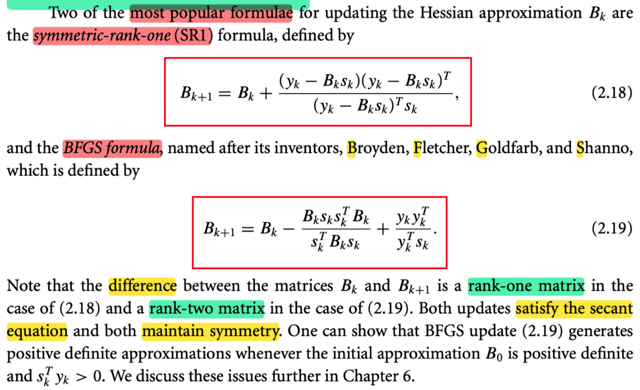</kbd>

> [!NOTE]
> Và hai công thức để CHẾ ra Bk (xấp xỉ cho Hessian) thông dụng là SR1 và BFGS trong đó cái đầu thì hiệu hai B là rank 1, cái sau là rank 2.
>
> Ta sẽ gặp lại ở các phần sau

 

- **Cập nhật nghịch đảo Quasi-Newton**

<kbd>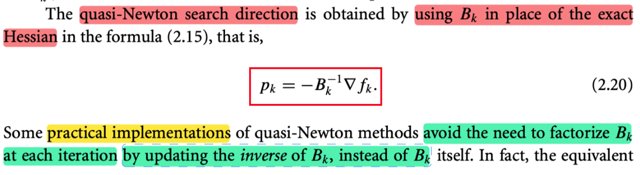</kbd>

<kbd>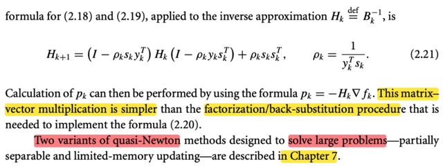</kbd>

> [!NOTE]
> Thế thì, khi ta t**hay Hessian (∇^2)_k, bằng cách dùng B_k**, thì cái mà ta có sẽ là **Quasi-Newton search direction** (thay vì Newton direction)
>
> pk = - (Bk)inv ∇f_k
>
> Tiếp, một số cách thực hiện của quasi-Newton method **cố gắng tránh việc phải mỗi lần iterate là mỗi lần factorized Bk**, và họ làm việc này bằng cách** update inverse của Bk thay vì update Bk.**
>
> Thế thì ở đây nói phải factorized Bk là sao? là vì giả sử ta chế ra Bk, thì để tính ra Quasi-Newton direction ta sẽ phải tính (Bk)inv
>
> Mà như đã học ở phần phụ lục của Convex Optimization, việc tìm Ainv vốn dĩ là giải một loạt các hệ A u_i = e_i, với e_i là standard basis vector, để có u_i là cột i của Ainv. 
>
> Thì việc giải hệ phương trình thì như đã biết, ta sẽ làm bằng **factor-solve approach**, tức đầu tiên là factor A thành tích các matrix có cấu trúc đơn giản. Ví dụ CDE, sau đó giải A u_i =  e_i chính là giải lần lượt C v_i = e_i, D z_i = v_i, E u_i = z_i. Mà lí do là vì tổng chi phí sẽ ít hơn là gỉải trực tiếp A u_i = e_i
>
> Bởi vậy ở đây người ta mới update, tính ra (Bk)inv luôn, khỏi phải tính Bk rồi tính (Bk)inv
>
> Và cái (Bk)inv của hai công thức SR1 và BFGS là như này.
>
> Khi đó pk chỉ việc dùng, pk = -Hk ∇fk
>
> Chapter 7 sẽ nói đến hai biến thể của quasi-Newton dùng cho bài toán lớn

> [!TIP]
> **🤖 AI Feedback** — ✅ Score: **98/100**
>
> Ghi chú giải thích rất chính xác các khái niệm từ hình ảnh, đặc biệt làm rõ lý do cần tránh việc phân tích nhân tử ma trận và phương pháp cập nhật nghịch đảo trực tiếp. Độ sâu kiến thức về đại số tuyến tính được thể hiện rõ ràng.

 

- **Tổng quan Conjugate Gradient phi tuyến**

<kbd>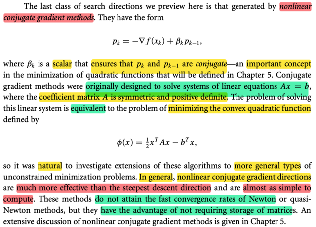</kbd>

> [!NOTE]
> Một cái nữa mà ta sẽ học kĩ ở chương 5 là **nonlinear conjugate gradient method**
>
> Thì ở đây tác giả cho biết, ý tưởng, cảm hứng của nó ban đầu là để giải hệ Ax = b, mà cụ thể là giải hệ này thông qua việc giải bài toán tương đương: 
>
> minimize hàm Φ(x) = (1/2)xTAx - bTx
>
> Cái này mình đã gặp ở **Convex Optimization** rồi, nên hiểu. Là vì khi ta giải Ax = b, chính là giải Ax - b = 0 Vậy nếu coi Ax - b là gradient của một hàm số nào đó, thì tìm x để Ax - b = 0 chính là tìm local minimizer của hàm số đó. 
>
> Và ∇f(x) = Ax - b, là hàm tuyến tính, thì f là hàm bậc hai: f(x) = 1/2 xTAx - bTx. 
>
> Và từ đó cho ta phương pháp để giải hệ Ax = b bằng cách dùng các tiếp cận iterative trong việc giải bài toán tối ưu.
>
> Tác giả nói thêm, cái **direction của phương pháp này tốt hơn cả steepest descent** dù nó **ko mang lại convergence rate nhanh như Newton nhưng nó có ưu điểm là ko phải lưu trữ matrix**

> [!TIP]
> **🤖 AI Feedback** — ⚠️ Score: **85/100**
>
> Ghi chú giải thích rất tốt về cảm hứng và sự tương đương của bài toán. Tuy nhiên, cần bổ sung điều kiện rằng ma trận A phải đối xứng và xác định dương, cũng như đặc tính "conjugate" của các hướng tìm kiếm pk và pk-1 để ghi chú hoàn chỉnh hơn.

 

- **Steepest Descent trong Trust Region**

<kbd>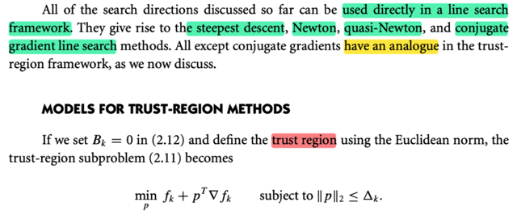</kbd>

<kbd>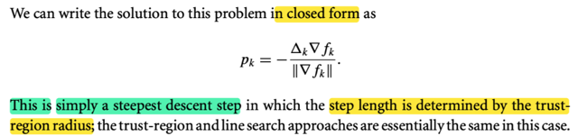</kbd>

> [!NOTE]
> Đại khái là, những **search direction** thảo luận ở trên **đều có thể dùng trực tiếp trong line search để tạo thành steepest descent, Newton, quasi-Newton, conjugate gradient line search** 
>
> Và trừ cái conjugate gradient thì những cái đó **đều có phiên bản tương đương của trust region**
>
> Thế thì tác giả nói, nếu ta cho Bk = 0 trong 2.12 (Chiến lược Trust Region)
>
> m_k(x_k + p) = f_k + pT ∇f_k + (1/2) pT B_k p
>
> sẽ trở thành m_k(x_k + p) = f_k + pT ∇f_k
>
> ====
>
> Ôn lại một chút về trust region: Ý tưởng sẽ là, ta dùng một sự thật là, **khi xét trong một phạm vi đủ nhỏ nào đó (quanh x_k), thì hàm số sẽ hành xử giống như hàm bậc hai**. Cụ thể là như sau: Dựa vào Taylor theorem, nói rằng khi đi từ x đến x + p thì ta có:
>
> f(x + p) = f(x) + ∇f(x_k)Tp + (1/2) pT ∇^2 f(z) p với z là điểm nào đó ∈ (x, x+p)
>
> ≡ f(x + p) = f(x) + ∇f(x_k)Tp + (1/2) pT ∇^2 f(x + tp) p với t là giá trị nào đó ∈ (0, 1)
>
> Và nếu xét trong phạm vi nhỏ nào đó khiến ∇^2 f(x + tp) ≈ ∇^2 f(x) thì ta sẽ có:
>
> f(x + p) ≈ f(x) + ∇f(x_k)Tp + (1/2) pT ∇^2 f(x ) p đây là chính là nói nếu xét trong phạm vi đủ nhỏ quanh x thì có thể coi hàm số hành xử như quadratic function: 
>
> g(p) = f_hat (x + p) = (1/2) pT ∇^2 f(x) p + ∇f(x_k)Tp +  f(x) 
>
> Từ đó, ta sẽ **mô phỏng hàm f bởi một hàm bậc hai, nhưng đảm bảo là chỉ trong một trust region nhất định.**
>
> Để rồi, để tìm pk, ta giải bài toán **minimize quadratic function có constraint**:
>
> minimize m_k (x_k + p) = f_k + pT∇f_k + (1/2)pT B_k p 
>
> constrained ||p|| < trust region radius Δk
>
> Giải ra nếu kiểm tra thấy mức giảm hàm f thực tế ko đạt, thì có nghĩa là trust region đang quá rộng, khiến việc dùng hàm quadratic để mô phỏng hàm f bị sai, ta sẽ thu nhỏ radius lại và làm lại.
>
> Bk trong mk có thể dùng Hessian hoặc dùng một xấp xỉ của Hessian
>
> ====
>
> Quay lại đây, khi Bk = 0, thì ta có bài toán minimize f_k + pT∇f_k subject to ||p|| ≤ Δk
>
> Thế thì, solution có nó có thể có dạng đóng là pk = - Δk ∇f_k / ||∇f_k||
>
> Là sao ta?
>
> Hàm m_k(x_k + p) = f_k + pT∇f_k lúc này là hàm tuyến tính
>
> Và f_k fixed rồi, nên đơn giản là ta minimize pT∇f_k = ||p|| ||∇fk|| cos(θ) subject to ||p|| ≤ Δk
>
> Mà -1 ≤ cos(θ) ≤ 1 ⇨ - ||p|| ||∇f_k|| ≤ ||p|| ||∇f_k|| cos(θ) ≤ ||p|| ||∇f_k|| nên nó sẽ đạt giá trị nhỏ nhất khi:
>
> 1) cos(θ) = -1, tức p = - ∇f_k và
>
> 2) ||p|| = Δk (vì p = max khả năng thì -||p|| mới âm nhỏ nhất)
>
> Do đó solution p là vector:  -(∇f_k / ||∇f_k||) Δk
>
> Và lúc này, đây chính là **steepest descent direction** với step length giới hạn = trust region radius.
>
> Ý tác giả là, à, khi **dùng quadratic function để làm m_k** (mô phỏng hàm f trong phạm vi nhỏ) và **chọn B_k = 0, thì cái descent direction giải ra hóa ra chính là steepest descent direction**

> [!TIP]
> **🤖 AI Feedback** — ✅ Score: **100/100**
>
> Bài làm của bạn rất xuất sắc! Bạn không chỉ nắm vững thông tin từ tài liệu mà còn mở rộng và giải thích sâu sắc về phương pháp Trust Region, cùng với việc tự suy luận chính xác về trường hợp đặc biệt.

 

- **Thuật toán vùng tin cậy Hessian**

<kbd>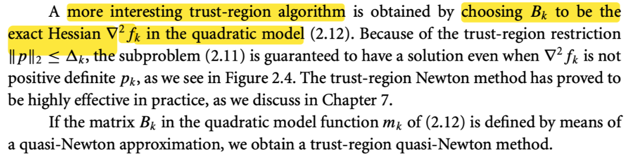</kbd>

> [!NOTE]
> QUAY LẠI SAU

 

- **Vấn đề Scaling trong tối ưu**

<kbd>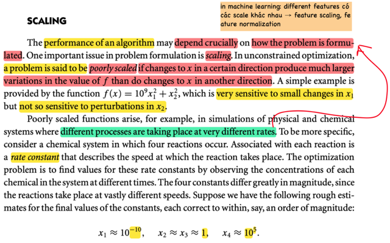</kbd>

<kbd>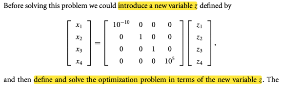</kbd>

<kbd>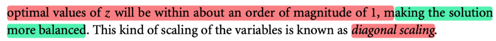</kbd>

> [!NOTE]
> Đại khái là, hiệu quả của thuật toán tối ưu sẽ **PHỤ THUỘC CỰC LỚN VÀO CÁCH MÀ VẤN ĐỀ ĐƯỢC FORMULATED.**
>
> Và một vấn đề quan trọng của cái này là **SCALING**.
>
> Trong bài toán tối ưu ko ràng buộc, một problem được gọi là **POORLY SCALED nếu thay đổi x theo một hướng này  khiến hàm số tăng hay giảm nhanh hơn là hướng khác** (nhạy cảm hơn)
>
> Và ông nói đại khái là vấn đề này xuất hiện trong các ví dụ như trong **các hệ thống mà có nhiều process diễn ra với tốc độ khác nhau**.
>
> Và đại khái như có 4 feature x1, x2,...x4 thì **x1 có các value scale** khác nhau. ví dụ như x1 thì cỡ 10^(-10), x2, x3 thì cỡ 1 (ý là 1-10) còn x4 cỡ 10^5
>
> Đại khái là bằng cách **tạo một feature vector khác z**, **liên hệ với x bởi matrix này**, thì **z sẽ có range xem xem** với nhau hơn. 
>
> Đây gọi là diagonal scaling (mình nghĩ: đây chính là một dạng feature scaling)

> [!TIP]
> **🤖 AI Feedback** — ⚠️ Score: **82/100**
>
> Bản ghi chú tóm tắt rất chính xác và đầy đủ các thông tin có trong hình ảnh. Tuy nhiên, phần cuối về "feature vector z" và "diagonal scaling" không xuất hiện trong hình ảnh được cung cấp, do đó ghi chú không hoàn toàn dựa trên nguồn ảnh này.

 

- **Scaling, Steepest Descent, Newton**

<kbd>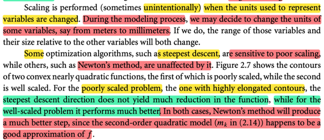</kbd>

<kbd>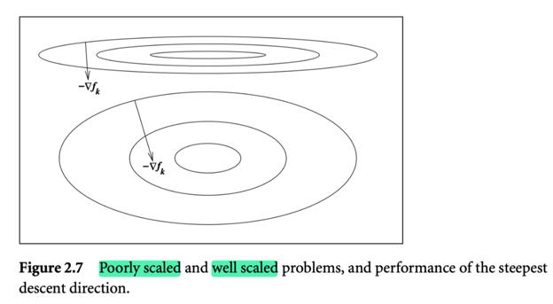</kbd>

> [!NOTE]
> Như ở đây, chính là nói cái mà ta gặp trong machine learning, **khi các feature có các đơn vị đo khác nhau dẫn đến range của chúng khác nhau ⇨ tạo ra vấn đề poorly scaled**.
>
> Do đó trong quá trình modeling (phát triển mô hình) ta** cần thay đổi units của các variable sao cho chúng có range xem xem nhau** (đây chính là feature scaling, hay standardization)
>
> Cuối cùng **một số thuật toán như steepest descent rất bị ảnh hưởng bởi poor scaling**, như mình đến giờ này thì đã hiểu, và sẽ còn gặp lại phân tích này ở chương sau nữa, **đó là vì nó chọn hướng dốc nhất nên gặp poorly scaled, nó sẽ nhảy qua nhảy lại giữa hai sườn dốc** → chậm hội tụ
>
> Còn **Newton method THÌ LẠI ÍT BỊ  ẢNH HƯỞNG**, do nó dùng quadratic approx, nên về cơ bản **kể cả là poorly scale, thì miễn là hàm số có thể được approx tốt ở dạng quadratic** (mà trong hình thì chính là vậy, dù hình trên hay hình dưới) thì newton direction & step sẽ đều chính xác - chỉ ngay đến minimum

> [!TIP]
> **🤖 AI Feedback** — ✅ Score: **98/100**
>
> Phân tích của bạn rất chính xác và chi tiết, thể hiện sự hiểu biết sâu sắc về khái niệm scaling và ảnh hưởng của nó đến các thuật toán tối ưu hóa khác nhau.

 

- **Thiết kế thuật toán bất biến tỉ lệ**

<kbd>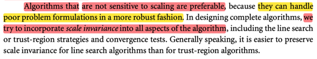</kbd>

> [!NOTE]
> Cuối cùng, việc thiết kế một thuật toán tối ưu mà ít nhạy cảm với scaling thì tốt hơn.
>
> Và người ta sẽ cố gắng thiết kế tính chất này vào mọi khía cạnh của thuật toán tối ưu như line search, trust region và convergence test
>
> Đó gọi là tính chất **SCALE INVARIANCE**

 

