# 3.2 Line Search Method: Convergence of Line Search Methods

📊 **Progress:** `10` Notes | `13` Screenshots | `9` AI Reviews

---
> [!NOTE]
> Line Search Method: Convergence of Line Search Methods

## 3.2 Convergence Of Line Search Method

<kbd>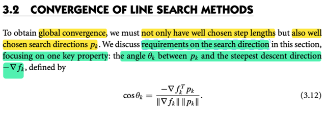</kbd>

<kbd>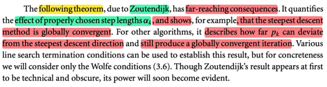</kbd>

> [!NOTE]
> Đại ý là để có thể **đạt được global convergence** thì **chọn step length tốt thôi là chưa đủ**, mà còn **phải chọn search direction tốt** nữa.
>
> Vậy phần này sẽ **bàn về việc chọn p_k**, tập trung vào khía cạnh: **góc θ bởi nó
> và steepest descent direction - ∇f_k **
>
> Thế thì mào đầu, tác giả nhắc đến một theorem có ảnh hưởng lớn, bởi Zoutendijk, nó cho thấy rằng **với steepest gradient descent, thì chắc chắn ta sẽ globally convergence.**
>
> Cũng như là với các phương pháp khác thì ta sẽ thấy nó có thể khác chút đỉnh so với steepest descent nhưng **sẽ vẫn global convergence**.

> [!TIP]
> **🤖 AI Feedback** — ⚠️ Score: **85/100**
>
> Điểm mạnh của ghi chú là việc tóm tắt chính xác các yêu cầu về global convergence (cần cả step length và search direction tốt) và trọng tâm của phần này (góc giữa p_k và -∇f_k) theo đúng nội dung trong hình ảnh. Ghi chú cũng thể hiện sự hiểu biết sâu sắc về chủ đề bằng cách đề cập đến các khía cạnh liên quan mặc dù không trực tiếp có trong hình ảnh.

 

### Theorem 3.2 về tính hội tụ toàn cục (global convergence)

<kbd>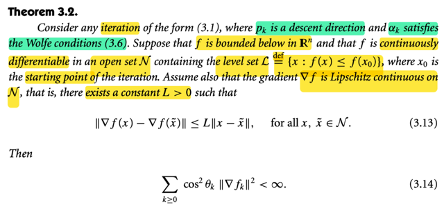</kbd>

> [!NOTE]
> Theorem này nói rằng: xét một iteration có dạng 3.1, tức là xk+1 = xk + αkpk 
> với pk là một descent direction và αk thỏa Wolfe conditions. 
>
> Cho rằng f bị chặn dưới trong R^n, và f liên tục khả vi trong tập mở N chứa level set L = x: f(x) ≤ f(x0).
>
> Giả sử thêm **gradient ∇f là Lipschitz continuous** trên N sao cho tồn tại hằng số L > 0 sao cho ||∇f(x) - ∇f(x_tilde)|| ≤ L||x - x_tilde||. Với mọi x, x_tilde ∈ N
>
> Thì khi đó:
>
> Σk≥0 [cos(θ_k)]^2 (||∇fk||)^2 < ∞

> [!TIP]
> **🤖 AI Feedback** — ✅ Score: **99/100**
>
> Bài ghi rất chính xác và đầy đủ các điều kiện cũng như kết luận của định lý. Cách giải thích chi tiết, đặc biệt là về điều kiện Lipschitz và công thức lặp, rất hữu ích và làm tăng sự rõ ràng. Hãy tiếp tục duy trì mức độ chi tiết và chính xác này.

 

#### Chứng minh theorem 3.2

<kbd>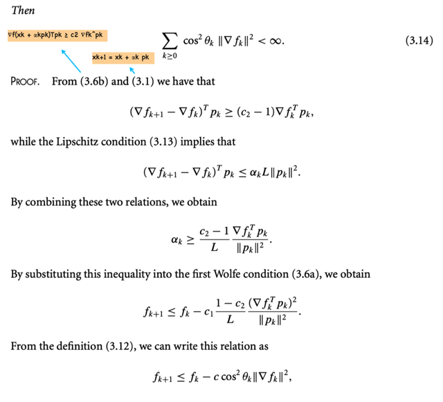</kbd>

> [!NOTE]
> Để chứng minh thì đầu tiên dùng 3.6b (curvature condition)
>
> ∇f(xk + αkpk)Tpk ≥ c2 ∇fkTpk
>
> Ý là, vì theorem này nói rằng ta thực hiện một bước update có dạng xk+1 = xk + αkpk với 
>
> ** p_k là descent direction** và 
>
> **αk thỏa Wolfe condition**, tức là nó sẽ khiến xk+1 thỏa điều kiện Amijo (Sufficient decrease 
>
> → f(xk + αpk) ≤ f(xk) + c1 α (∇fk)T pk
>
> và curvature condition, nên ta sẽ có độ dốc theo hướng pk tại xk+1 bớt âm so với độ dốc theo hướng pk tại xk)
>
> ⇨ ∇f(xk+1)Tpk ≥ c2 ∇f(xk)Tpk
>
> hay viết tắt là ∇fk+1Tpk ≥ c2 ∇fkTpk
>
> Trừ hai vế cho ∇fkTpk:
>
> ∇fk+1Tpk - ∇fkTpk ≥ c2 ∇fkTpk - ∇fkTpk
>
> ⇔ (∇fk+1 - ∇fk)Tpk ≥ (c2 - 1) ∇fkTpk (1)
>
> Tới đây, dùng giả định ban đầu ta có tính chất của gradient ∇f là Lipschitz continuous trên N mà tính chất này thể hiện theo toán học là:
>
> Tồn tại L dương sao cho: ||∇f(x) - ∇f(x~)|| ≤ L||x - x~|| với mọi x, x~ ∈ N Điều này mang ý nghĩa là, **khi đi từ x → x~ thì mức thay đổi của độ lớn của gradient sẽ không thể quá nhanh.**
>
>  Áp dụng với xk+1 và xk: ||∇fk+1 - ∇fk|| ≤ L||xk+1 - xk||
>
> ⇔ ||∇fk+1 - ∇fk|| ≤ L||xk + αkpk - xk||  (thay xk+1 = xk + αkpk)
>
> ⇔ ||∇fk+1 - ∇fk|| ≤ L||αkpk||
>
> ⇔ ||∇fk+1 - ∇fk|| ≤ αkL ||pk||  
>
> Do ||αk pk|| = |αk| ||pk|| = α ||pk|| vì α dương.
>
> ⇔ ||∇fk+1 - ∇fk||||pk|| ≤ αkL(||pk||)^2 (nhân hai vế cho ||pk||)
>
> mà (∇fk+1 - ∇fk)Tpk = ||∇fk+1 - ∇fk||||pk||cos θ ≤ ||∇fk+1 - ∇fk||||pk||*1 
>
> (θ là góc giữa ∇fk+1 - ∇fk và pk)
>
> ⇨ (∇fk+1 - ∇fk)Tpk ≤ αk L(||pk||)^2
>
> Chia hai vế cho (||pk||)^2 là số dương)
>
> ⇨ αk ≥ (∇fk+1 - ∇fk)Tpk / L(||pk||)^2  
>
> Tới đây kết hợp (∇fk+1 - ∇fk)Tpk ≥ (c2 - 1) ∇fkTpk
>
> ⇨ αk ≥ (∇fk+1 - ∇fk)Tpk / L(||pk||)^2 ≥ (c2 - 1) ∇fkTpk /  L(||pk||)^2
>
> ⇔ αk ≥ [(c2 - 1) / L] (∇fkTpk / (||pk||)^2)
>
> ⇔ αk ≥ - [(1 - c2) / L] (∇fkTpk / (||pk||)^2)
>
> Đặt vế phải là cục A, ta có αk ≥ cục A.
>
> Tới đây dùng điều kiện Amijo: f(xk + αpk) ≤ f(xk) + c1 α (∇fk)T pk
>
> Cũng là fk+1 ≤ fk + c1αk∇fkTpk =  fk + αk c1∇fkTpk
>
> Ở trên ta có αk ≥ cục A, mà cục B = c1∇fkTpk âm do c1 dương, ∇fkTpk âm lí do là pk là descent direction. Vậy cục B âm, nhân hai vế cho αk ≥ cục A ta có αk cục B ≤ cục A cục B
>
> αk c1∇fkTpk ≤ - [(1 - c2) / L] (∇fkTpk / (||pk||)^2) c1∇fkTpk
>
> Vậy fk+1 ≤ fk + c1αk∇fkTpk ≤ fk - [(1 - c2) / L] (∇fkTpk / (||pk||)^2) c1∇fkTpk
>
> = fk - c1 [(1 - c2) / L] (∇fkTpk)^2 / (||pk||)^2) 
>
> Tới đây dùng: ∇fkTpk = ||∇fk||||pk|| cos θk
>
> ⇨ fk+1 ≤ fk - c1 [ (1 - c2) / L] (||∇fk||||pk|| cos θ)^2 / (||pk||)^2)]
>
> ⇔ fk+1 ≤ fk - c1 [ (1 - c2) / L] (||∇fk||cos θ)^2)]
>
> Đặt c = c1 [ (1 - c2) / L]
>
> ⇨ fk+1 ≤ fk - c (cos θk)^2 (||∇fk||)^2

> [!TIP]
> **🤖 AI Feedback** — ✅ Score: **100/100**
>
> Bài giải thích cực kỳ chi tiết và chính xác từng bước trong chứng minh, bao gồm cả các lý do và bước biến đổi trung gian không có trong hình ảnh gốc. Độ sâu của phân tích vượt trội, giúp người đọc hiểu rõ bản chất của từng bất đẳng thức.

 

##### Chứng minh theorem 3.2 (tt)

<kbd>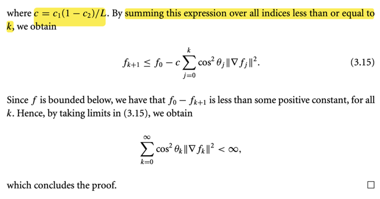</kbd>

> [!NOTE]
> Rồi, từ kết quả đã có ở note trước:
>
> fk+1 ≤ fk - c (cos θk)^2 (||∇fk||)^2
>
> Tới đây, viết cái inequality này với mọi j từ 0 tới k
>
> f1 ≤ f0 - c (cos θ0)^2 (||∇f0||)^2
>
> f2 ≤ f1 - c (cos θ1)^2 (||∇f1||)^2
>
> ...
>
> fk+1 ≤ fk - c (cos θk)^2 (||∇fk||)^2
>
> Cộng vế theo vế cả đám:
>
> f1 + f2 +...+ fk+1 ≤ f0 + f1 +...+ fk - Σ_j=0:k c (cos θj)^2 (||∇fj||)^2
>
> ⇔ fk+1 ≤ f0 - Σ_j=0:k c (cos θj)^2 (||∇fj||)^2
>
> Cuối cùng ta có f0 - fk+1 ≥ Σ_j=0:k c (cos θj)^2 (||∇fj||)^2
>
> Mà vì hàm f có giả thiết là bị chặn dưới, nôm na là nó không thể xuống -inf được, do đó khoảng giảm từ f0 đến fk+1 không thể lớn vô cùng được:
>
> ⇨ f0 - fk+1 ≤ inf
>
> ⇨ Σ_j=0:k c (cos θj)^2 (||∇fj||)^2 ≤ inf.
>
> ⇔ Σ_j=0:k (cos θj)^2 (||∇fj||)^2 ≤ inf. Chứng minh xong

> [!TIP]
> **🤖 AI Feedback** — ⚠️ Score: **80/100**
>
> Điểm mạnh của note là giải thích rất rõ ràng quá trình tổng chuỗi (telescoping sum) và việc sử dụng tính chất hàm f bị chặn dưới để chứng minh tổng hữu hạn bị chặn là chính xác. Tuy nhiên, để đạt được kết quả cuối cùng như trong ảnh (chuỗi vô hạn), note cần bổ sung bước lấy giới hạn khi k tiến tới vô cùng và sử dụng ký hiệu `< ∞` thay vì `≤ inf` để rõ ràng hơn.

 

- **Chứng minh theorem 3.2 (tt)**

<kbd>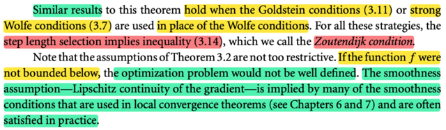</kbd>

> [!NOTE]
> đại khái là nếu ta thay vì dùng giả định là αk thỏa Wolfe condition mà ta dùng thỏa strong Wolfe conditions hoặc Goldstein condition thì ta cũng có kết quả tương tự.
>
> Đoạn dưới đại ý là những giả định của theorem này cũng ko quá gắt gao, ví dụ như giả định function f bị chặn dưới thật ra là ko có gì ghê gớm, bởi lẽ nếu hàm f vi phạm điều này thì bài toán tối ưu đã không thể hình thành (vô nghiệm).
>
> Còn giả định về tính trơ - Lipschitz continuity của gradient thì nó cũng thường là thỏa trong thực tế

> [!TIP]
> **🤖 AI Feedback** — ❌ Score: **65/100**
>
> Bạn đã hiểu đúng về việc các điều kiện Goldstein hoặc Wolfe mạnh mang lại kết quả tương tự và lý do hàm f bị chặn dưới là hợp lý. Tuy nhiên, bạn đã bỏ sót thông tin quan trọng về điều kiện Zoutendijk và có thể diễn đạt rõ hơn về giả định độ trơn của gradient.

 

- **Ý nghĩa của theorem này: Nếu pk là descent direction thì chắc chắn sẽ hội tụ toàn cục**

<kbd>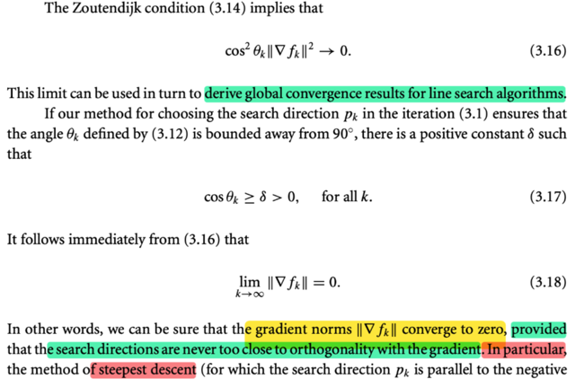</kbd>

<kbd>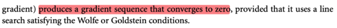</kbd>

> [!NOTE]
> Rồi, thế thì cái Dutendit condition Σ_j=0:k (cos θj)^2 (||∇fj||)^2 ≤ inf có một ý nghĩa như vầy.
>
> Tổng của chuỗi số với số hạng tổng quát (cos θk)^2 (||∇fk||)^2 hội tụ về  một giá trị nào đó, chứ ko nổ tung (= infinity). 
>
> Thế thì có một định lí về dãy số nói rằng (mà cũng dễ hiểu) là số hạng tổng quát (cos θk)^2 (||∇fk||)^2 phải hội tụ về 0 khi k → inf (vì chỉ có như vậy thì cái tổng mới hội tụ về giá trị hữu hạn được)
>
> Do đó ta suy ra lim k → inf (cos θk)^2 (||∇fk||)^2 = 0
>
> Thế thì cái chính sẽ là, chỉ cần pk được chọn là hướng hợp với - ∇fk một góc nhọn, tức cos θk theo công thức 3.12 cosθk = - ∇fkTpk / ||∇fk|| |pk|| là số dương, thì khi đó, để cái lim trên tiến về không thì bắt buộc ∇k phải → 0
>
> Và từ đó, ý nghĩa quan trọng của theorem này là:
>
> **CHỈ CẦN TA CHỌN SEARCH DIRECTION KO VUÔNG GÓC VỚI GRADIENT, VÀ LINE SEARCH TÌM αk THỎA WOLFE HAY GOLDSTEIN CONDITION THÌ NORM CỦA GRADIENT ∇fk SẼ DẦN DẦN HỘI TỤ VỀ 0, MÀ ĐIỀU NÀY CÓ NGHĨA LÀ, NÓ SẼ DẦN ĐẾN ĐƯỢC ĐIỂM CÓ GRADIENT VANISH**
>
> Tuy nhiên nó ko chắc là local minimizer, vì có thể là saddle point

> [!TIP]
> **🤖 AI Feedback** — ✅ Score: **95/100**
>
> Bài giải thích rất rõ ràng, bám sát các bước suy luận từ điều kiện Zoutendijk đến kết luận về sự hội tụ của chuẩn gradient. Việc giải thích vai trò của cos θk và bổ sung về điểm yên ngựa thể hiện sự hiểu sâu sắc, cho thấy bạn đã nắm vững kiến thức. Để bài viết hoàn hảo hơn, bạn có thể diễn đạt điều kiện Zoutendijk một cách tường minh hơn là "tổng chuỗi hội tụ về một giá trị hữu hạn" thay vì "≤ inf" ban đầu.

 

- **Hội tụ toàn cục và cực tiểu**

<kbd>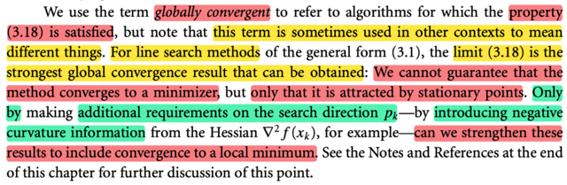</kbd>

> [!NOTE]
> Đại khái là, ta dùng thuật ngữ **globally convergent** để chỉ **các thuật toán mà thỏa tính chất này**. 
>
> Nhưng chú ý là thỉnh thoảng có thể được **dùng trong bối cảnh khác để ám chỉ thứ khác**. 
>
> **Với line search method, thì limit này là kết qủa mạnh nhất mà ta có thể có:** 
>
> Ta **không thể khẳng định là thuật toán sẽ hội tụ về minimizer, mà chỉ có thể nói là nó hội tụ về một stationary point** (nơi có gradient vanish ∇, nhưng chưa chắc là local minimizer)
>
> Nhưng **nếu thêm vào một điều kiện nữa của search direction, liên quan đến curvature condition thì ta có thể tăng cường kết quả để đảm bảo sự hội tự về local minimum**

> [!TIP]
> **🤖 AI Feedback** — ✅ Score: **98/100**
>
> Bản dịch rất chính xác và đầy đủ các ý chính từ văn bản gốc, bao gồm cả những sắc thái về việc sử dụng thuật ngữ. Việc bổ sung giải thích cho "stationary point" là một điểm cộng lớn, giúp làm rõ khái niệm.

 

- **Chứng minh Theorem 3.2 với Newton / quasi Newton direct**

<kbd>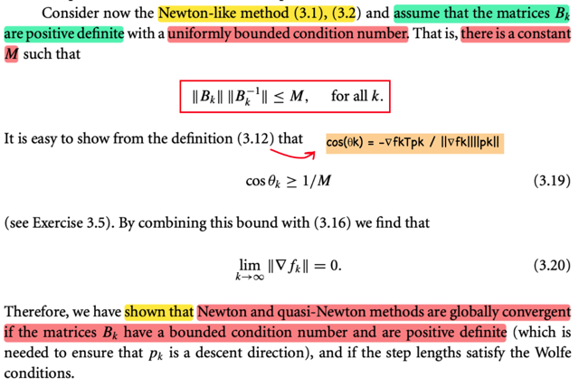</kbd>

> [!NOTE]
> Tiếp theo đại khái là ta sẽ chứng minh theorem hội tụ toàn cục với Newton / quasi Newton direction.
>
> Xét Newton-like method (3.1), (3.2) tức là thực hiện bước update bởi (3.1): 
>
> xk+1 = xk + αk pk với **pk là Newton direction hoặc quasi Newton direction** 
>
> (ôn lại tí xíu: Nếu pk là Newton direction, thì nó là nghiệm của hệ: Bk pk = - ∇fk với Bk là Hessian tại k: ∇^2 fk, còn với quasi Newton direction, thì người ta thay bằng matrix Bk nào đó (tính bằng vài cách) xấp xỉ cho Hessian) 
>
> Như vậy, ở đây, khi họ **assume Bk positive definite**, dĩ nhiên là ta có thể có (Bk)inv:
>
> ⇨ pk = - (Bk)inv ∇fk cũng như là ∇fk = - Bk pk
>
> Và cũng assume tồn tại hằng số M sao cho ||Bk|| ||Bvinv|| ≤ M với mọi k, gọi là uniformly bounded condition number.
>
> Rồi, cos θk theo định nghĩa 3.12 rằng: cos θk = - ∇fkTpk / ||∇fk||.||pk||
>
> Thay pk vào:
>
> cos θk = - ∇fkTpk / ||∇fk||.||pk|| = cos θk = - ∇fkT[-(Bk)inv ∇fk] / ||-Bk pk||.||pk||
>
> = ∇fkT (Bk)inv ∇fk / ||Bk pk||.||pk||
>
> = ∇fkT (Bk)inv Bk (Bk)inv ∇fk / ||Bk pk||.||pk||
>
> = ((Bk)inv∇fk)T Bk ((Bk)inv ∇fk) / ||Bk pk||.||pk||
>
> = (-pk)T Bk (-pk) / ||Bk pk||.||pk||
>
> = (pk)T Bk pk / ||Bk pk||.||pk||
>
> Vậy tới đây ta có cos θk = (pk)T Bk pk / ||Bk pk||.||pk||
>
> Tiếp, nhìn lại bức tranh tổng thể thì ta muốn chứng minh rằng nếu dùng pk là Newton / quasi Newton direction thì nếu Bk p.d và có tính chất ||Bk|| ||Bkinv|| ≤ M thì ta sẽ chứng minh rằng cái (cos θk) ≥ 1/M nhằm mục đích là cho thấy rằng khi đó ta sẽ chứng minh rằng gradient ∇fk sẽ → 0, tức là chứng minh rằng phương pháp này cũng sẽ global convergence.
>
> Vậy thử tử số có ≥ gì, và mẫu số ≤ gì.
>
> Tử số, (pk)T Bk pk là quadratic form của Bk, là positive definite matrix như ban đầu assume
>
> Phân tách Bk = Q Λ QT, thì ta có (pk)T Bk pk = (QTpk)T Λ (QTpk), 
>
> (Λ là matrix eigenvalue của Bk, Q là orthogonal matrix tạo bởi các eigenvectors của Bk)
>
> = Σi λi ((QTpk)_i)^2 ≥ Σi λmin(Bk) (QTpk)_i^2 
>
> = λmin(Bk) Σi (QTpk)_i^2 = λmin(Bk) ||QTpk||^2 
>
> = λmin(Bk) ||pk||^2  (do ||QTpk|| = ||pk||)
>
> Vậy (pk)T Bk pk ≥ λmin(Bk) ||pk||^2
>
> ====
>
> Còn mẫu số, ||Bk pk||.||pk||:
>
> Thì áp dụng bất đẳng thức liên quan đến norm của matrix: ||Ax|| ≤ ||A|| ||x|| 
>
> ⇨ ||Bk pk|| ≤ ||Bk|| ||pk||
>
> Ôn lại chút xíu về norm matrix
>
> Thế thì bàn về cái norm ||Bk|| một chút:
>
> Theo định nghĩa ||A||p = max x ≠ 0 ||Ax||p / ||x||p
>
> Với việc dùng l2 norm: thì ||A||2 = max x ≠ 0 ||Ax||2 / ||x||2
>
> Và ý nghĩa của nó là, norm của A chính là cái scale factor lớn nhất tạo bởi A khi linearly transform một vector x: Ta biết khi nhân với x, Ax sẽ tạo ra vector khác (nằm trong column space C(A)), và vector mới này có thể dài ra hoặc ngắn lại (ý nói đến norm của nó: ||Ax||), thế thì có với x khác nhau thì Ax dài ngắn khác nhau (nếu x mà nằm trong nullspace thì Ax thành 0). Vậy thì sẽ có cái x nào đó khiến sau khi transform, thì tỉ lệ giữa ||Ax|| / ||x|| là lớn nhất. Và cái tỉ lệ lớn nhất này, chính là norm của A: ||A||. Và nếu xài thước đo độ dài vector ||Ax||, hay ||x|| theo L-p norm thì ta cũng có L-p norm A, ||A||p, nhưng thông thường thì hay dùng L2 norm như nói trên
>
> Do đó mới nói ||A|| = max x ||Ax|| / ||x|| 
>
> Mà như vậy thì dĩ nhiên với mọi x thì ||Ax|| / ||x|| phải luôn nhỏ hơn cái tỉ lệ lớn nhất: ||A||, nên mới có:
>
> ∀x  ||Ax|| / ||x|| ≤ ||A||
>
> Quay lại đây tương tự, thì ta có: 
>
> ∀ pk thì ||Bk pk|| / ||pk|| ≤ ||Bk||
>
> ⇔||Bk pk|| ≤ ||Bk|| ||pk||
>
> Rồi, quay lại cái ||A|| = max x ||Ax|| / ||x||.
>
> Tức là để tìm ||A||, ta sẽ giải bài toán tối ưu, maximize x g(x) = ||Ax|| / ||x||
>
> Vì hàm objective không âm, nên ta có thể chuyển thành bài toán tương đương:
>
> maximize (g(x))^2 = (||Ax||)^2 / (||x||)^2, ví với u không âm thì u1 > u2 thì u1^2 > u2^2
>
> maximize x  (||Ax||)^2 / (||x||)^2  = (Ax)T(Ax) / xTx = (xT ATA x) / xTx
>
> Rồi, ATA dĩ nhiên là **symmetric**, nên nó **luôn có đủ các eigenvector độc lập để có thể diagonalizable**: 
>
> ATA = Q Λ QT
>
> Xét xTATAx / xTx = xTQ Λ QTx / xTx 
>
> = Σi λ(ATA)_i (QTx)_i^2 / xTx
>
> ≤  Σi λmax(ATA) (QTx)_i^2 / xTx (1)
>
> = λmax(ATA) Σi (QTx)_i^2 / xTx
>
> =λmax(ATA) ||QTx||^2 / xTx
>
> = λmax(ATA) ||x||^2 / xTx    | Do QTx ko thay đổi norm
>
> = λmax(ATA) ||x||^2 / ||x||^2
>
> = λmax(ATA)
>
> Vậy max x ≠ 0 ||Ax||^2 / ||x||^2 = λmax(ATA)
>
> ⇨ max x ||Ax|| / ||x|| = √λmax(ATA) 
>
> Suy nghĩ đơn giản thôi: 
>
> Nếu hàm [g(x)]^2 đạt max = a tức, [g(x)]^2 ≤ a, và g(x) ≥ 0, thì ta ⇔ g(x) ≤ √a ⇨ g(x) có max = √a
>
> Rồi.
>
> Nếu áp dụng cái này cho matrix Bk thì ta có:
>
> max x ||Bkx|| / ||x|| = √λmax(BkTBk)
>
> mà với matrix Bk positive definite thì ta có:
>
> BkTBk = (Q Λ QT)T (Q Λ QT) = Q Λ QT Q Λ QT = Q Λ^2 QT
>
> Và cái này chính là **singular value decomposition của BkTBk**, mà **cũng là eigenvalue decomposition của nó.**
>
> Tức là **eigenvalue của BkTBk chính là singular value cuả nó, và đều là λ(Bk)^2, tức là bình phương eigenvalue của Bk**
>
> Nên tất nhiên **eigenvalue lớn nhất của BkTBk cũng chính là bình phương eigenvalue lớn nhất của Bk**
>
> ⇨ √λmax(BkTBk) = √(λmax(Bk))^2 = λmax(Bk)
>
> Vậy ta có **max_x ||Bkx|| / ||x|| = λmax(Bk)**, hay cũng là **||Bk|| = λmax(Bk)** (1)
>
> Hay, cũng là ||Bkx|| / ||x|| ≤ λmax(Bk)
>
> ⇔ ||Bk  x|| ≤ λmax(Bk) ||x||
>
> Hay thay x bởi pk ta có
>
> **||Bk pk|| ≤ λmax(Bk) ||pk||** là vậy
>
> ====
>
> Vậy tử số (pk)T Bk pk ≥ λmin(Bk) ||pk||^2 
>
> còn mẫu số ||Bk pk|| ≤ λmax(Bk) ||pk||
>
> ⇨ ||Bk pk|| ||pk|| ≤ λ(Bk)_max ||pk||^2
>
> ⇨ cos θk = (pk)T Bk pk / ||Bk pk|| ||pk||  (kết qủa ta có ở trên) 
>
> ≥ λmin(Bk) ||pk||^2 / λmax(Bk) ||pk||^2 
>
> ⇔ **θk ≥ λmin(Bk) / λmax(Bk)**
>
> Mà đề bài cho gì: ||Bk|| ||Bkinv|| ≤ M ⇨ 1/(||Bk|| ||Bkinv||) ≥ 1/M
>
> Mà cần chứng minh gì, cos θk ≥ 1/M
>
> Vậy thử xem cos θk có lớn hơn 1/(||Bk|| ||Bk_inv||) không?
>
> Ta đang có cos θk ≥ λmin(Bk) / λmax(Bk)
>
> Mà λmax(Bk)  = ||Bk|| (hồi nãy đã chứng minh lại rồi đó, xem lại điểm (1) ở trên)
>
>  ||Bkinv||, cũng tương tự = λmax(Bkinv)
>
> Mà λ(Binv) = 1 / λ(B) ⇨ λmax(Binv) = 1/λmin(Bk)
>
> ⇔ **1/λmax(Binv) = λmin(Bk)**
>
> ⇨ cos θk ≥ λmin(Bk) / λmax(Bk) = (1/||Bkinv||) / ||Bk||  = 1/(||Bkinv|| ||Bk||)
>
> Và 1/(||Bk|| ||Bk_inv||) ≥ 1/M
>
> ⇨ **θk ≥ 1/M**. Chứng minh xong. 
>
> Và kết hợp với kết qủa (cos θk)^2 ||∇fk||^2 → 0 thì điều này có nghĩa là ∇fk → 0
>
> Và như vậy ta có thể kết luận rằng **chỉ cần Bk positive definite và có tính chất là tồn tại M sao cho ||Bk|| ||Bkinv|| ≤ M thì ta sẽ có global convergnence.**

> [!TIP]
> **🤖 AI Feedback** — ✅ Score: **90/100**
>
> Bài làm thể hiện sự hiểu biết sâu sắc và khả năng trình bày chi tiết về chứng minh hội tụ toàn cục. Tuy nhiên, việc áp dụng ||Bk|| = λmax(Bk) và ||Bk^-1|| = 1/λmin(Bk) đòi hỏi giả định rằng ma trận Bk là đối xứng và dương xác định, điều này cần được nêu rõ trong quá trình chứng minh.

 

- **Chứng minh global convergence với các algo khác**

<kbd>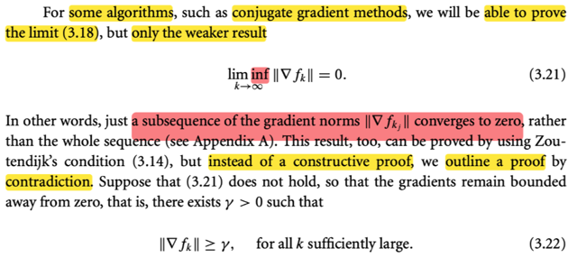</kbd>

<kbd>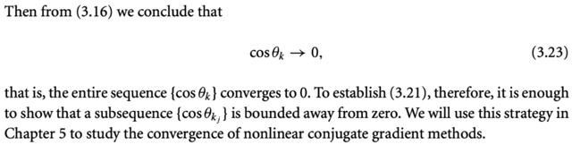</kbd>

<kbd>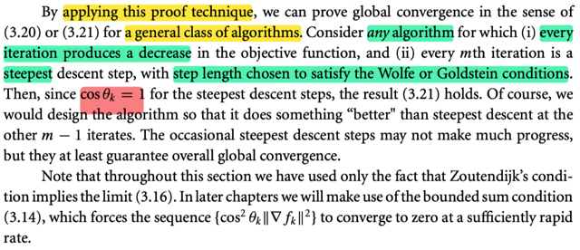</kbd>

> [!NOTE]
> QUAY LẠI SAU
> rồi Cái này để ý là nó nói là một số cái thuật toán Ví dụ như cái thuật toán liên hợp Green thì nó là ta có thể chứng minh rằng cái giới hạn 3.18 nhưng mà một cái phiên bản yếu hơn

> [!TIP]
> **🤖 AI Feedback** — ❌ Score: **0/100**
>
> Bạn đã ghi nhận tài liệu này, đó là một khởi đầu tốt! Để đạt điểm cao hơn, bạn hãy cố gắng tóm tắt những ý chính hoặc thông tin quan trọng từ đoạn văn. Lần tới, hãy thử ghi lại những gì bạn hiểu nhé!

 

