# 4.3 Trust-Region Methods: Iterative Solution of the Subproblem

📊 **Progress:** `16` Notes | `26` Screenshots | `14` AI Reviews

---
> [!NOTE]
> Trust-RegionMethods: Iterative Solution of the Subproblem

## 4.3 Iterative Solution Of The Subproblem

<kbd></kbd>

<kbd></kbd>

> [!NOTE]
> 4.3 Iterative solution of the subproblem
>
> Tạm lược dịch, vì tác giả dẫn một loạt các công thức trước đó
>
> Phần này đại ý là tác giả sẽ dùng đặc điểm 4.6, (có theorem nói rằng nếu p* là solution của bài toán 4.5 thì nó sẽ thỏa: (B  + λI)p* = -g) để giải tìm λ sao cho nó khớp với trust region radius Δ trong bài toán 4.5 (là bài toán minimize f + gTp + (1/2)pTBp subject to ||p|| ≤ Δ)
>
> (*Ý này chưa hiểu lắm nhưng sẽ hiểu hơn ở sau)
>
> Sau đó ta cũng sẽ chứng minh kết quả quan trọng của Theorem 4.1 liên quan đến đặc điểm của solution của bài toán 4.3 
>
> (4.3 chỉ bài toán này, minimize mk(p) =  f(xk) + ∇f(xk)Tp + (1/2)pT Bk p subject to ||p|| ≤ Δk, bỏ k đi cho gọn để có 4.5)
>
> Rồi tiếp, tác giả nói trong phần 4.1, ta không thật sự nghiêm túc trong việc muốn **tìm ra nghiệm chính xác** của subproblem 4.5. Tuy nhiên, ta đã **dùng thông tin của Hessian Bk (approx cho Hessian) và có một số lợi thế nhất định về chi phí cũng như tính hội tụ toàn cục tốt.**
>
> Khi **bài toán tương đối nhỏ**, thì có thể **cũng đáng để khai thác (exploit) mô hình một cách triệt để hơn** bằng cách **tìm kiếm một xấp xỉ gần hơn của subproblem.** 
>
> Trong phần này thì ta sẽ nói về **các cách tiếp cận để tìm xấp xỉ tốt hơn nói trên sao cho chỉ tốn vài bước factorization của matrix B** (thường là chỉ tốn 3, so với 1 của phương pháp dogleg và 2d subspace minimization)
>
> Cách tiếp cận này được **dựa trên đặc địểm của exact solution trong theorem 4.1** (theo link) và với **một ứng dụng của Newton method 1 biến**.
>
> Và về cơ bản là thuật toán sẽ ráng **xác định λ sao cho solution p*** của bài toán  minimize f + gTp + (1/2)pTBp subject to ||p|| ≤ Δ (4.5) sẽ **có thể thỏa được (B  + λI)p* = -g** (4.6)
>
> ====
>
> Sau khi ôn lại KKT condition thì ta sẽ thấy vì sao solution của bài toán 4.5 chính là p* thỏa 4.6:
>
> Viết lại bài toán 4.5:
>
> minimize f + gTp + (1/2)pTBp s.t ||p|| ≤ Δ
>
> Vì ||p|| không âm, và hàm square u^2 với u không âm sẽ đồng biến nên ta có ||p|| ≤ Δ ⇔ ||p||^2 ≤ Δ^2 ⇔ pTp ≤ Δ^2 ⇔ pTp - Δ^2 ≤ 0 ⇔ (1/2)(pTp - Δ^2) ≤ 0 
>
> Nên bài toán equivalent minimize f + gTp + (1/2)pTBp s.t (1/2)(pTp - Δ^2) ≤ 0
>
> Lagragian: f + gTp + (1/2)pTBp + (1/2)λ(pTp - Δ^2)
>
> = f + gTp + (1/2)pTBp + (1/2)λpTp - (1/2)λΔ^2
>
> = (1/2)pT(B + λI)p + gTp + f - λΔ^2
>
> KKT conditions:
>
> **Stationary condition**: ∇p L(p, λ)|p=p* = 0
>
> Gradient của Lagragian theo p:  
>
> (B + λI)p + g = 0
>
> ⇔ (B + λI)p = -g
>
> Đây chính là 4.6 trong sách.
>
> Và nó cũng là 4.8a của theorem 4.1:
>
> (B + λI)p* = -g (4.8a)
>
> λ(Δ - ||p*||) = 0 (4.8b)
>
> (B + λI) xác định bán dương. (4.8c)
>
> Vậy ta làm tiếp luôn để giải thích hai cái còn lại để cho thấy chúng ở đâu ra:
>
> Tiếp tục KKT conditions:
>
> Complementary slackness: Σi λ*i fi(x*) = 0. λ* là dual optimal, x* là primal optimal. Áp dụng ở đây, chính là:
>
> λ*(||p*|| - Δ) = 0 (λ* là dual optimal)
>
> Vì là bài toán với constraint ||p|| ≤ Δ cũng equivalent với pTp ≤ Δ^2 nên ta có quyền xài điều kiện này ở bài toán nào cũng được. Hoặc nếu thích thì cứ dùng điều kiện này ở bài toán equivalent:
>
> λ*(||p*||^2 - Δ^2) = 0
>
> ⇔ λ*(||p*|| - Δ)(||p*|| + Δ) = 0
>
> ⇔ λ*(||p*|| - Δ) = 0 | Do ||p*|| + Δ > 0
>
> Và đây chính là 4.8b
>
> Còn 4.8c: Thì chính là **điều kiện đủ bậc 2**: Để stationary pont là minimal của Lagragian:
>
> Hessian của L: ∇^2L(p, λ) = B + λI, tức là để tại stationary point p* (thỏa Gradient vanish) mà p* là minimal thì Hessian này phải xác định bán dương. 
>
> Một điểm quan trọng ghi lại đây luôn cho nhớ: Trong EE364A có nói, **KKT với bối cảnh bài toán convex thì là điều kiện cần và đủ** (ta có thể để ý trong bài toán convex, người ta **không cần nêu cái vụ Hessian xác định bán dương vì nó đã thỏa rồi**
>
> Nhưng **với bối cảnh này, thì KKT chỉ là điều kiện cần**, và **phải thêm điều kiện đủ bậc 2** như đã thấy.
>
> ====
>
> Thế thì đoạn đóng khung quan trọng, tác giả nói rằng, dựa vào các đặc điểm của λ, p* thỏa các điền kiện trên thì sẽ giúp kết luận p* là solution của bài toán 4.5. Thì từ đó ta **phác thảo ra một thuật toán để giải tìm p***:
>
> Đó là cho λ = 0: Xem thử B + λI = B có **xác định bán dương** không. Nếu thỏa, thì từ 4.8a (B + λI)p* = -g giải ra p* = -Binv g và **check nó có norm thoả điều kiện ≤ Δ không**, nếu thỏa thì chốt nghiệm p*. Có thể nhận ra đây **chính là Newton step**.
>
> Nếu case trên không thỏa thì** tìm λ > 0 sao cho B + λI xác định bán dương**, và p(λ) = -(B + λI)inv g có norm ||p(λ)|| = Δ
>
> (Vì sao ||p(λ)|| = Δ, là vì complementary slackness: λ(||p*|| - Δ) = 0, khiến cho nếu λ > 0 thì ||p*|| - Δ = 0 (4.
>
> Và bài toán ở case sau chỉ là giải phương trình ||p(λ)|| = Δ ⇔ ||-(B + λI)inv g|| = Δ, chỉ là giải một phương trình đơn biến tìm λ thôi.

> [!TIP]
> **🤖 AI Feedback** — ✅ Score: **95/100**
>
> Bản dịch chính xác và việc trình bày chi tiết điều kiện KKT cho thấy sự hiểu biết sâu sắc về lý thuyết tối ưu hóa. Tuy nhiên, cần loại bỏ các lỗi chính tả nhỏ và các nhận xét không chính thức để nâng cao tính chuyên nghiệp của bài ghi chú.

 

### Phân tách trị riêng vector riêng của B và dùng nó để hiểu về ||p(λ)||

<kbd></kbd>

> [!NOTE]
> Rồi, thế thì đại ý là ta sẽ **phân tách trị riêng vector riêng của B và dùng nó để hiểu về ||p**(λ)|| như sau:
>
> Vì B đối xứng, nên có thể phân tách thành Q Λ QT với Q là orthogonal matrix có các cột là eigenvector của B 
>
> p(λ) = -(B + λI)inv g 
>
> = -(Q Λ QT + λI)inv g
>
> = -(Q Λ QT + λQQT)inv g (do QQT = QTQ = I)
>
> = -(Q Λ QT + Q λI QT)inv g
>
> = -Q(Λ + λI)inv QT g 
>
> Dừng lại tí, xét AB, theo góc nhìn thứ 4 nhân matrix với matrix của thầy Strang đã dạy ta trong MIT 1806: AB = tổng các matrix rank 1 tạo bởi cột i của A outer product với hàng i của B
>
> Xét Q(Λ + λI)inv, các cột của nó là gì: 
>
> Các cột của Q là q1, q2,....qn, khi nhân với diagonal matrix M = (Λ + λI)inv, thì theo góc nhìn  thứ hai nhân matrix với matrix: cột 1 của QM là linear combination các cột của Q, với hệ số là cột 1 của M. Mà cột một của M chỉ có cái đầu tiên khác 0. nên kết quả sẽ chỉ là M11 q1. Tương tự cột 2 của QM là M22q2,....
>
> ⇨ các cột của QM là (M11 q1, M22 q2,...)
>
> Nhân QM cho QT: theo góc nhìn thứ 4 nói trên, ta sẽ có tổng:
>
> Σi (cột i của QM: Mii qi) outer product [row i của QT: qiT]
>
> ⇨ QMQT = Σi Mii qiqiT
>
> Giờ xét Mii là gì, dễ thấy nó là nghịch đảo của λi (eigenvalue của B) + λ: 1 / (λi + λ).
>
> Vậy p(λ) = -Q(Λ + λI)inv QT g = - { Σi [qiqiT / (λi + λ)] } g
>
> = - Σi [qiqiTg / (λi + λ)]  (phân phối vô)
>
> = - Σi [qiTg / (λi + λ)] qi  (qiTg là scalar) 
>
> Đây chính là 4.38
>
> Viết lại: p(λ) = - Σi [qiTg / (λi + λ)] qi (4.38)
>
> ||p(λ)||^2 = {- Σi [qiTg / (λi + λ)] qi }^2
>
> khi khai triển bình phương cái tổng này ra, ta sẽ có các cross - term dính đến dot product của qi, qj với i khác j, thì vì tính trực giao của Q nên đều bằng 0. Chỉ còn:
>
> ..= Σi [qiTg / (λi + λ)]^2 qiTqi 
>
> = Σi [qiTg / (λi + λ)]^2 ||qi||^2 
>
> Đây chính là 4.39
>
> Viết lại ||p(λ)||^2 = Σi [qiTg / (λi + λ)]^2 ||qi||^2 (4.39)
>
> = Σi [qiTg / (λi + λ)]^2  (norm qi = 1, do Q orthogonal matrix)

> [!TIP]
> **🤖 AI Feedback** — ✅ Score: **95/100**
>
> Bài giải thích cực kỳ rõ ràng và chính xác, thể hiện sự hiểu biết sâu sắc về đại số tuyến tính và các phép nhân ma trận. Đặc biệt ấn tượng với việc giải thích cặn kẽ các bước dẫn đến công thức 4.38 và 4.39.

 

#### Phân tích function ||p(λ)||

<kbd>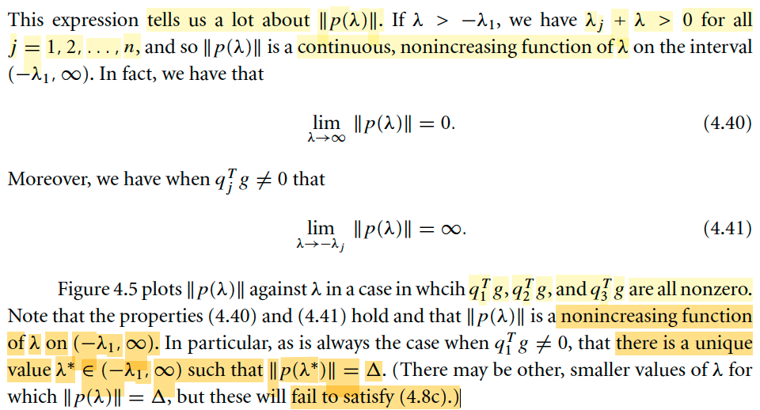</kbd>

<kbd>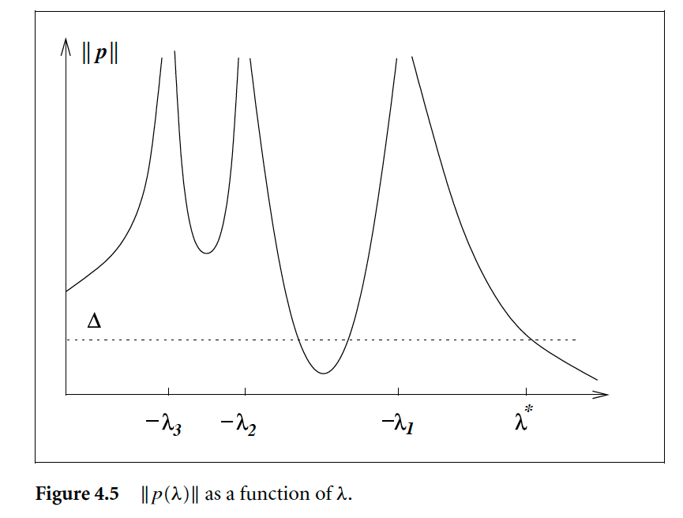</kbd>

> [!NOTE]
> Phân tích function ||p(λ)||
>
> Ôn lại xíu để hiểu bối cảnh: Nói ngắn gọn, ta đang muốn giải bài toán con (subproblem) ở mỗi iteration trong quá trình tối ưu: minimize mk(p) = fk + gkTp + (1/2)pBkp s.t ||p|| ≤ Δ. Bỏ đi k cho gọn: ta có bài toán minimize m(p) = f + gTp + (1/2)pBp s.t ||p|| ≤ Δ. Thì bài toán này, ta đã đi qua một theorem đã nói về điều kiện của p* để trở thành solution: (B + λI)p* = -g (mà mình đã hiểu xuất phát từ KKT conditopns) Và từ đó, người ta thiết kế thuật toán giải. 
>
> Thuật toán đó nhớ đại khái là ta sẽ xét hai trường hợp. Đầu tiên check xem với λ = 0, thì B (tức B + λI có xác định dương không), và p* có thỏa ||p|| ≤ Δ không. Nếu thỏa thì lấy p*. Trường hợp sau, ta sẽ tìm λ để B + λI xác định dương, và thỏa ||p(λ)|| = Δ.
>
> Thế thì ở đây, sau khi dùng phân rã trị riêng để thấy bản chất của ||p(λ)||: ||p(λ)||^2 = Σi [qiTg / (λi + λ)]^2 (4.39) thì ta sẽ lập luận dựa trên biến thiên của hàm ||p(λ)|| như sau:
>
> Chú ý mục tiêu là giải phương trình ||p(λ)|| = Δ.
>
> Thế thì, đại khái là xét trường hợp mà qiTg đều khác 0 (nên tử sổ [qiTg / (λi + λ)]^2 sẽ khác 0). Khi đó ta sẽ thấy khi λ → các giá trị - λi thì hàm sẽ vọt lên ∞ (vì mẫu = 0), nhưng khi λ đã lớn hơn -λ1, tức trị riêng nhỏ nhất. thì kể từ đó khi λ → inf thì hàm sẽ → 0 Và nó sẽ giảm liên tục (vì đạo hàm theo λ sẽ âm, cái này dễ thấy).
>
> Và ý chính là: trong khoảng (-λ1, inf), hàm giảm liên tục, nên sẽ có lúc nó cắt đường Δ, tức là sẽ có một nghiệm duy nhất của ||p(λ)|| = Δ mà thỏa yêu cầu. Phải hiểu là vẫn có thể có λ khác khiến ||p(λ)|| = Δ nhưng ta còn cần điều kiện B + λI xác định dương nên λ phải > -λ1. (vì eigenvalue của B + λI là λi + λ)
>
> Thế thì nếu như qiTg bằng 0 thì sao?
>
> Thì đồ thị sẽ không có hành vi vọt lên khi λ đi qua đó. Vì dụ q3Tg = 0, q2Tg = 0, q1Tg khác 0. Thì khi λ tăng dần (từ trái sang phải) để lần lượt vượt qua mốc - λ3, -λ2, -λ1 thì khi đi đi ngang -λ3 và -λ2 thì hàm số cứ đi ngang thôi (vì cái tổng lúc này chỉ là q1Tg) và chỉ vọt lên ∞ khi tới gần -λ1.
>
> Tương tự như vậy với q1Tg = 0, nhưng vai trò của case này quan trọng hơn vì cái lập luận trên (rằng hàm số giảm liên tục trong (-λ1, ∞) từ +∞ → -∞ nên khiến cho nhất định có λ nào đó thỏa ||p(λ)|| = Δ) sẽ không còn đúng nữa.
>
> Cụ thể là nếu q1Tg = 0, thì, giả sử q2Tg hoặc q3Tg hoặc cả hai khác 0 thì hàm số sẽ vẫn giảm liên tục sau khi đã vượt qua hai cái mốc mà khiến hàm vọt lên inf. Nhưng, vì khi đi ngang -λ1 thì có thể là giá trị ||p(λ)|| đã thấp hơn Δ rồi khiến phương trình vô nghiệm.

> [!TIP]
> **🤖 AI Feedback** — ✅ Score: **98/100**
>
> Phân tích của bạn rất chính xác và sâu sắc. Bạn không chỉ hiểu rõ các thuộc tính được đề cập trong văn bản mà còn mở rộng phân tích sang các trường hợp đặc biệt (khi qiTg = 0), thể hiện sự hiểu biết toàn diện về bản chất của hàm ||p(λ)||. Điều này rất ấn tượng và cho thấy bạn đã nắm vững cách hàm số biến thiên và các điều kiện để giải phương trình ||p(λ)|| = Δ.

 

##### Giải ||p(λ)|| = Δ bằng root finding Newton's method

<kbd>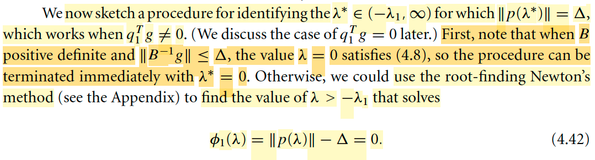</kbd>

> [!NOTE]
> Giải ||p(λ)|| = Δ bằng root finding Newton's method
>
> Đại khái là, tới đây ta có thể phác thảo ra quy trình để giải λ* ∈ (-λ1, ∞) thỏa ||p(λ*)|| = Δ, như đã biết, là có thể giải được khi gTq1 khác 0. (còn khi gTq1 = 0, nó là ca khó ta sẽ xét sau).
>
> Tác giả có lưu ý ta một điểm mà mình cũng đã nói ở note trước khi ôn lại về tiền để để giải p*, đó là đầu tiên ta sẽ xét thử λ = 0, xem thế nào. Thì ở case này, nếu B xác định dương và p* = - Binv g thỏa ||p|| ≤ Δ thì ta lấy p* đó ⇨ terminate thuật toán luôn.
>
> Còn ca này không thỏa thì ta mới làm quy trình sau để tìm λ khiến B + λI xác định dương và |p*(λ)|| = ||-(B+λI)inv g|| = Δ.
>
> Thế thì quay lại đây, xét trường hợp gTq1 khác 0 và ta muốn giải phương trình Φ1(λ) = ||p(λ)|| = Δ. Với λ > -λ1
>
> Tại đây tác giả nói ta có thể giải nó bằng rood-finding Newton method (xem trong Appendix). Cái này là sao?
>
> Thử suy nghĩ: Phương trình cần giải ||-(B + λI)inv g|| = Δ
>
> Thế thì, hồi MIT 1802 đã biết một kĩ thuật giúp giải phương trình f(x) = 0 theo lối iterative như sau:
>
> Bắt đầu tại một initial guess x0. Ta sẽ dựng tiếp tuyến của hàm f: g(x) = f(x0) + f'(x0)(x-x0). Và giải tìm nghiệm của g(x) = 0. Đặt là x1. Lặp lại, dựng tiếp tuyến của hàm f tại x1: g(x) = f(x1) + f'(x1)(x-x1). Giải tìm nghiệm g(x) = 0 để có x2. Cứ thế dần dần ta sẽ tiến về nghiệm của f(x) = 0.
>
> Và hồi học Convex Optimziation với thầy Boyd, mình hiểu ra cái idea của phương pháp này thật ra chính là coi việc giải f(x) = 0 là ta đang giải điều kiện cần bậc nhất của bài tóan tối ưu hàm F(x) là nguyên hàm của hàm f(x). Tức f(x) = ∇F(x). ⇨ Điều kiện cần bậc nhất để x* là optimal của F(x), nó phải thỏa: ∇F(x*) = 0
>
> Và phương pháp iterative trên chính là cách ta đang dùng Newton method để giải tìm solution của của bài toán này. Mà idea như đã biết, ta sẽ bắt đầu với initial point x0, để rồi lặp lại các bước:
>
> Xem hàm F(x) hành xử như hàm bậc hai, tức là xấp xỉ hàm F bởi quadratic function:
>
> m(d) = F(xk) + ∇F(xk)Td + (1/2) dT∇^2F(xk)d, và tìm minimum của hàm này để có xk+1 = xk + d
>
> Thì để tìm minimum của hàm này thì cũng lại dùng điều kiện đủ bậc 1 để giải tìm d*: 
>
> ∇m(d*) = 0 
>
> ⇔ ∇^2 F(xk) d + ∇F(xk) = 0
>
> ⇔ d = - ∇^2F(xk)inv ∇F(xk)
>
> = - ∇f(xk)inv f(xk)
>
> Mà ở dạng đơn biến thì chính là giải g(x) = 0 với g(x) = f(xk) + f'(xk)(x-xk) ⇔ (x-xk) = -f(xk) / f'(xk) ⇔ x = xk + -f(xk) / f'(xk)
>
> Nói tóm lại là, Newton method cho ta một cách để giải phương trình f(x) = 0 của một hàm phức tạp f theo lới iterative.

> [!TIP]
> **🤖 AI Feedback** — ✅ Score: **98/100**
>
> Ghi chú đã tóm tắt chính xác toàn bộ quy trình được nêu trong hình ảnh, từ điều kiện ban đầu đến việc sử dụng phương pháp Newton. Phần giải thích chi tiết về cơ chế và cơ sở lý thuyết của phương pháp Newton đã bổ sung độ sâu xuất sắc, cho thấy sự hiểu biết rất vững chắc về chủ đề.

 

- **Tái định hình bài toán để khắc phục hạn chế của Newton method:**

<kbd>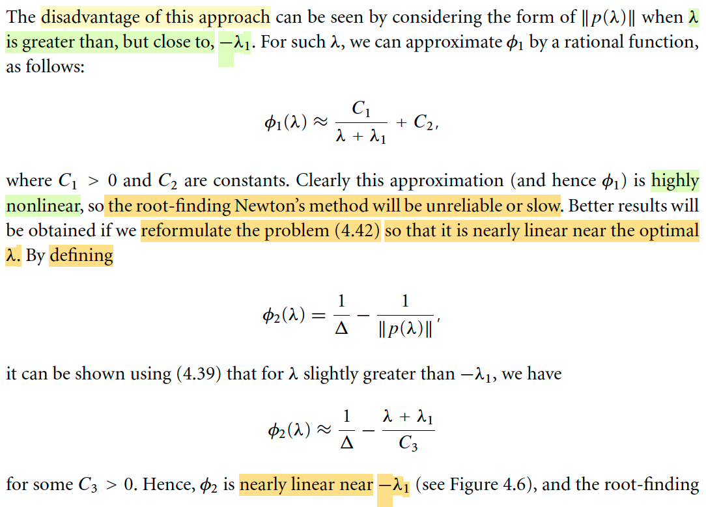</kbd>

<kbd>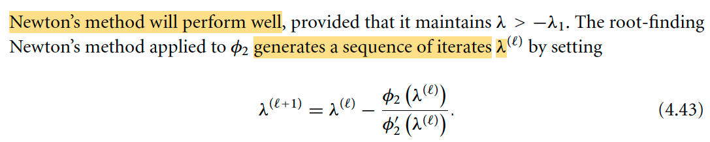</kbd>

<kbd>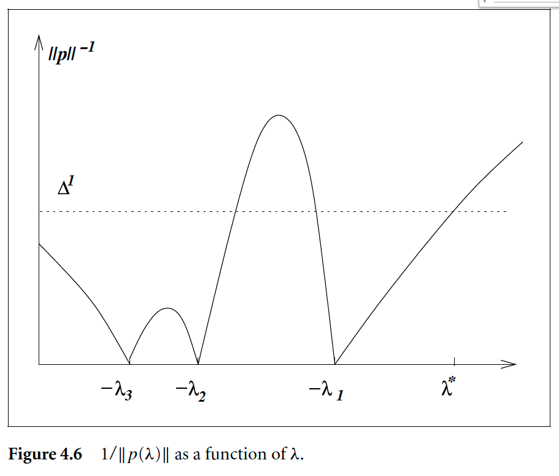</kbd>

> [!NOTE]
> Tái định hình bài toán để khắc phục hạn chế của Newton method:
>
> Rồi, thế thì đại khái là cái phương pháp Newton method để giải ||p(λ)|| = Δ nó có cái hạn chế ở chỗ này:
>
> Hồi học MIT 1806, giáo sư cũng có nói, cái điểm initial guess cần phải nằm ở đâu đó đủ tốt, chứ không phải muốn ở đâu cũng được. Vì có khi từ x0, giải ra x1, x2....rất lâu thậm chí không hội tụ về nghiệm.
>
> Thì ở đây, tác giả chỉ ra: Trong quá trình giải bằng phương pháp này, với các λ được tạo ra. Thì khi rơi vào trường hợp mà λ tuy lớn hơn nhưng rất gần -λ1, thì sẽ có vấn đề:
>
> Nhớ lại ||p(λ)||^2 = Σi [qiTg / (λi + λ)]^2 đã hiểu ở những note trước. Thì dễ thấy khi λ gần -λ1 → λ1 + λ ≈ 0 ⇨q1Tg / (λ1 + λ) sẽ rất lớn, và nó hoàn toàn vượt trội các hạng tử khác là q2Tg / (λ2 + λ) và q3Tg / (λ3 + λ).
>
> Do đó mới nói lúc này có thể xấp xỉ nó bởi C1 / (λ1 + λ) + C2 (ý là mấy cái kia nhỏ quá so với term 1 nên coi nó như constant)
>
> φ1(λ) ≈ C1 / (λ1 + λ) + C2
>
> Và nó là hàm cực kì phi tuyến, khiến phương pháp root finding Newton không hiệu quả (cái này thì đơn giản là vì việc giải theo phương pháp này dựa trên việc xấp xỉ hàm số bởi hàm bậc 2, nên nếu hàm số cực phi tuyến, thì xấp xỉ này không tốt chút nào khiến cho phương pháp không hiệu quả)
>
> Do đó, tác giả mới nói, ta sẽ REFORMULATE, tái cấu trúc lại bài toán, sao cho nó gần như là tuyến tính tại optimal λ.Thực hiện bằng cách định nghĩa ra hàm Φ2(λ) = 1/Δ - 1/||p(λ)||
>
> = 1/Δ - 1/√Σi [qiTg / (λi + λ)]^2
>
> ≈ 1/Δ - 1/√[q1Tg / (λ1 + λ)]^2
>
> = 1/Δ - 1/[q1Tg / (λ1 + λ)]
>
> = 1/Δ - (λ1 + λ)/q1Tg
>
> = 1/Δ - (λ1 + λ)/C3
>
> Và đây là hàm tuyến tính.
>
> Chú ý, điều này có nghĩa là, gần -λ1, nơi mà cái term 1/(λ1+λ) vượt trội hai cái term còn lại, thì hàm Φ1(λ) xấp xỉ C1 / (λ1 + λ) + C2 và hàm Φ2(λ) xấp xỉ 1/Δ - (λ1 + λ)/C3, và đây là hàm tuyến tính. Nói vậy để nhấn mạnh ta cần hiểu là Φ2(λ) CHỈ XẤP XỈ / ỨNG XỬ NHƯ HÀM TUYẾN TÍNH KHI λ gần -λ1 thôi 
>
> (nên hiểu tác giả ghi" Hence, Φ2 is nearly linear near -λ1 là vậy).
>
> Thế thì, dĩ nhiên việc giải ||p(λ)|| = Δ, hay ||p(λ)|| - Δ = 0, sẽ tương đương giải 1/||p(λ)|| = 1/Δ
>
> ⇨ giải φ1(λ) = 0 cũng tương đương φ2(λ) = 0.
>
> Nên bằng cách áp root finding Newton method cho việc giải φ2(λ) = 0 ta sẽ giải λ thỏa φ1(λ) = 0.
>
> Mà vì φ2(λ) gần như tuyến tính nên giải φ2(λ) = 0 trong trường hợp này bởi Newton method rất đơn giản.
>
> Như vậy có nghĩa là, bằng cách áp dụng Newton method để giải phương trình Φ2(λ) = 0 thay cho Φ1(λ) = 0, bài toán sẽ dễ dàng hơn. Tránh rơi vào bế tắc khi chuỗi λ sinh ra vô tình rơi vào case "lớn hơn nhưng rất gần -λ1"
>
> Tóm lại: root finding Newton method sẽ sinh ra chuỗi nghiệm λ(l):
>
> λ(l+1) = λ(l) - φ2(λ(l)) / φ'2(λ(l)) 
>
> (vì sao thì note trước đã hiểu rồi, vì khi áp dụng để giải f(x) = 0 thì root finding Newton sẽ sinh ra chuỗi nghiệm dự đoán: xk+1 = xk - f(xk)/f'(xk) đó)
>
> Vậy tóm lại. Phần này chỉ là nói về việc thay vì ta dùng root finding Newton method để giải Φ1(λ) = 0 ⇔ ||p(λ)|| - Δ = 0. Thì có thể bị rắc rối khi trong chuỗi λ, có thằng sinh ra nằm sát bên phải -λ1, khiến cho bước tiếp theo bị trục trặc và cả quá trình cơ bản là không thành công.
>
> Ta sẽ khắc phục bằng cách giải bài toán khác 1/||p(λ) = 1/Δ ⇔ 1/||p(λ)|| - 1/Δ = 0 ⇔ Φ2(λ) = 0, nơi mà Newton method ổn định hơn.

> [!TIP]
> **🤖 AI Feedback** — ✅ Score: **98/100**
>
> Ghi chú của bạn giải thích rất chi tiết và chính xác nội dung văn bản. Việc kết nối với kiến thức nền tảng và phân tích các xấp xỉ toán học là đặc biệt ấn tượng, thể hiện sự hiểu sâu sắc.

 

- **Thử tự tính đạo hàm của hàm φ2(λ) = 1/Δ - 1/||p(λ)||**

<kbd>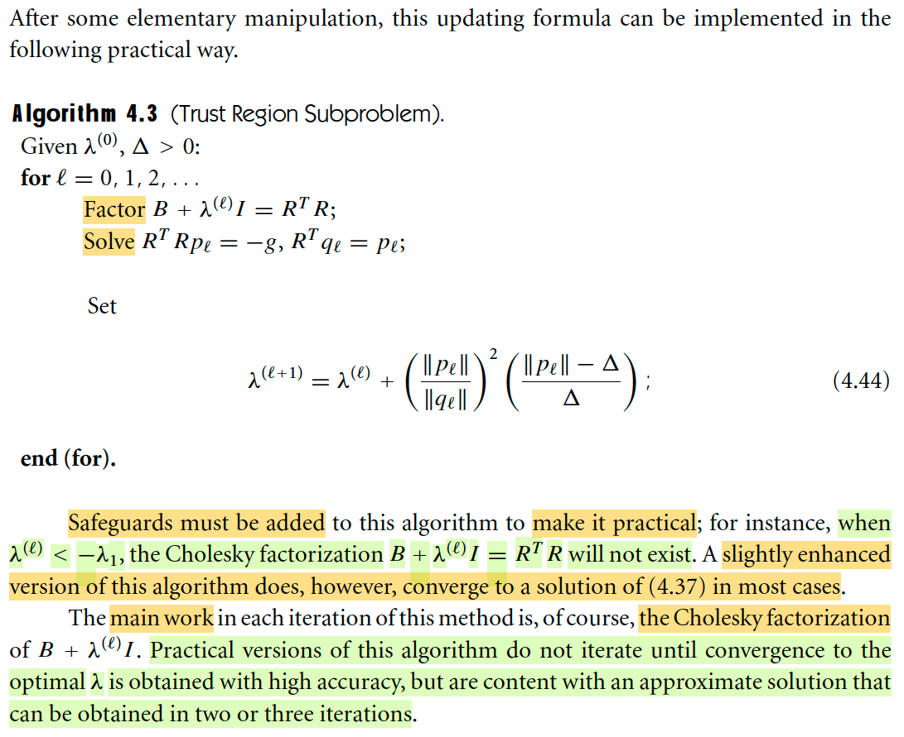</kbd>

> [!NOTE]
> Thử tự tính đạo hàm của hàm φ2(λ) = 1/Δ - 1/||p(λ)||
>
> Để hiểu tại sao có thuật toán này ta sẽ cần tự tính đạo hàm của hàm φ2(λ) = 1/Δ - 1/||p(λ)||
>
> φ'2(λ) = d/dλ[-1/||p(λ)||] = d/d||p(λ)|| [-1/||p(λ)||] . d/dλ ||p(λ)||
>
> = (1/||p(λ)||^2) . d/dλ ||p(λ)||
>
> Xét riêng d/dλ ||p(λ)|| 
>
> Dùng kiến thức đã học từ MIT 18.s096 tìm đạo hàm của hàm f(x) = ||x||:
>
> df = ||x + dx|| - ||x||, rồi tìm cách để có df = f'(x)[dx] mang ý nghĩa linear operator act on dx thì đó chính là gradient.
>
> Với hàm này ta dùng mẹo một chút: [f(x)]^2 = ||x||^2 = xTx:
>
> Đặt u = xTx, Ta có f^2 = u
>
> Đạo hàm 2 vế: 2fdf = du
>
> ⇨ df = (1/2f)du
>
> du = d(xTx) = (x+dx)T(x+dx) - xTx
>
> = (xT+dxT)(x+dx) - xTx
>
> = xTx+dxTx+xTdx+dxTdx - xTx
>
> = dxTx+xTdx+dxTdx
>
> = dxTx+xTdx (bỏ đi higher order term dxTdx)
>
> = 2xTdx (dxTx là scalar → dxTx = (dxTx)T)
>
> Vậy df = 2xTdx/2f = xTdx/||x|| = (1/||x||) xTdx
>
> ⇨ ∇f = x/||x|| 
>
> Vậy áp dụng vào đây:
>
> d/dλ ||p(λ)||  = d/dp(λ) ||p(λ)|| . d/dλ p(λ)
>
> =  [p(λ)/||p(λ)||] . d/dλ p(λ)
>
> Viết lại cho tới nay: 
>
> φ'2(λ) = (1/||p(λ)||^2) . d/dλ ||p(λ)||
>
> = (1/||p(λ)||^2) . [p(λ)/||p(λ)||] . d/dλ p(λ)
>
> = [1/||p(λ)||^3] p(λ)T d/dλ p(λ)
>
> (1/||p(λ)||^3] là scalar, không care. p(λ) và d/dλ p(λ) đều là column vector, kết quả φ'2(λ), dĩ nhiên là scalar vì φ2(λ) là scalar → scalar function. Nên ở đây phải là dot product của p(λ) và d/dλ p(λ)
>
> ====
>
> Xét tiếp d/dλ p(λ), = d/dλ [-(B + λI)inv g]
>
> p(λ) = -(B + λI)inv g
>
> ⇔ (B + λI) p(λ) = -g
>
> Lấy vi phân hai vế:
>
> ⇔ d[(B + λI) p(λ)] = -d(g)
>
> ⇔ d[(B + λI) p(λ)] = 0 (do g, không liên quan λ, là constant)
>
> ⇔ d(B + λI) p(λ) + (B + λI) d p(λ) = 0 (product rule)
>
> ⇔ d(B + λI) p(λ) + (B + λI) d p(λ) = 0
>
> ⇔ (B + λI + dλI - B - λI) p(λ) + (B + λI) d p(λ) = 0 
>
> ⇔ (dλI) p(λ) + (B + λI) d p(λ) = 0
>
> ⇔ dλ p(λ) + (B + λI) d p(λ) = 0 
>
> ⇔ dp(λ) = -(B + λI)inv p(λ) dλ
>
> ⇔ dp(λ)/dλ = -(B + λI)inv p(λ) 
>
> Gom lại: 
>
> φ'2(λ) = [1/||p(λ)||^3] p(λ)T d/dλ p(λ)
>
> = [1/||p(λ)||^3] p(λ)T [-(B + λI)inv p(λ)]
>
> = - 1/[||p(λ)||^3] p(λ)T (B + λI)inv p(λ)

> [!TIP]
> **🤖 AI Feedback** — ✅ Score: **95/100**
>
> Bài làm thể hiện sự hiểu biết sâu sắc về toán học đằng sau thuật toán, đặc biệt là việc tự đạo hàm hàm φ2(λ) và rút ra được công thức cập nhật Newton chính xác, khớp hoàn toàn với phương trình (4.44) trong tài liệu. Đây là một minh chứng xuất sắc cho khả năng phân tích độc lập. Tuy nhiên, một số bước trình bày có thể được làm rõ và chuẩn hóa hơn về mặt ký hiệu và ngôn ngữ, ví dụ như cách dùng 'không care' hoặc diễn giải quá chi tiết một bước đạo hàm đơn giản.

 

- **Algorithm 4.3 Trust Region Subproblem**

<kbd>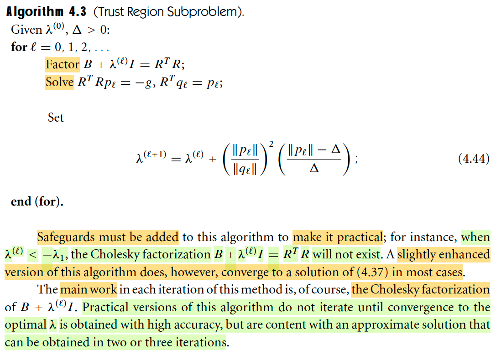</kbd>

> [!NOTE]
> Algorithm 4.3 Trust Region Subproblem:
>
> Rồi, quay lại đây, ôn lại chút bối cảnh: Mình đang tìm cái giải phương trình φ1(λ) = ||p(λ)|| - Δ bằng phương pháp root finding Newont's method (như đã ôn lại về phương pháp này ở note trước, mà nói ngắn gọn ý tưởng là coi như đang giải bài toán tối ưu hàm số là nguyên hàm của φ1(λ) theo phương pháp Newton - có ý tưởng là từ điểm đang đứng (λk) ta xem hàm số như hàm bậc hai, (cũng là coi đạo hàm của nó là hàm bậc 1) để rồi giải tìm minimal của nó, nhảy đến đó (λk+1) và lặp lại quá trình. Và quá trình sẽ cơ bản là generate ra chuỗi λ tiến dần về true solution của phương trình.) 
>
> Nhưng sau đó, tác giả phân tích cho ta thấy rằng, nếu làm vậy ta sẽ có thể gặp rắc rối khi λ sinh ra vô tình nằm sát bên phải của -λ1, và khiến cho quá trình sinh λ không / lâu hội tụ.
>
> Thế thì ta giải quyết vấn đề bằng cách tái định nghĩa bài toán, thay vì dùng Newton's method để giải phương trình Φ1(λ) = 0, thì ta giải φ2(λ) = 1/Δ - 1/||p(λ)|| = 0, sẽ hiệu qủa hơn.
>
> Và như đã biết, chuỗi λ sinh ra bởi phương pháp root finding Newton sẽ có dạng:
>
> λ^(l+1) = λ^(l) - Φ2(λ^(l)) / Φ'2(λ^(l))
>
> Và để hiểu vì sao thuật toán có dạng như vậy thì ta cần biết Φ'2 là gì như trong note trước đã làm.
>
> Thế thì, ráp công thức φ2 và φ'2 vào, và mình dùng  λ_l+1 và λ_l cho gọn:
>
> λ_l+1 = λ_l - Φ2(λ^(l)) / Φ'2(λ^(l))
>
> =  λ_l - [1/Δ - 1/||p(λ)||] / [-1/[||p(λ)||^3] p(λ)T (B + λI)inv p(λ)]
>
> =  λ_l - [(||p(λ)|| - Δ) / ||p(λ)||Δ] / [-1/[||p(λ)||^3] p(λ)T (B + λI)inv p(λ)]
>
> =  λ_l + [(||p(λ)|| - Δ)] ||p(λ)||^3 / [||p(λ)||Δ] [p(λ)T (B + λI)inv p(λ)]
>
> =  λ_l + (||p(λ)|| - Δ) ||p(λ)||^2 / Δ [p(λ)T (B + λI)inv p(λ)]
>
> Phân tách Cholesky: B + λI = RTR
>
> =  λ_l + (||p(λ)|| - Δ) ||p(λ)||^2 / Δ [p(λ)T (RTR)inv p(λ)]
>
> =  λ_l + (||p(λ)|| - Δ) ||p(λ)||^2 / Δ [p(λ)T Rinv RTinv p(λ)]
>
> =  λ_l + (||p(λ)|| - Δ) ||p(λ)||^2 / Δ [p(λ)T Rinv RinvT p(λ)]
>
> (ATinv = AinvT: Chứng minh nhanh: AAinv = AinvA = I ⇔ (AAinv)T = IT = I ⇔ AinvT AT = I ⇨ (AT)inv chính là AinvT)
>
> =  λ_l + (||p(λ)|| - Δ) ||p(λ)||^2 / Δ [[RinvTp(λ)]T RinvT p(λ)]
>
> Đặt q = RinvTp(λ) 
>
> .. = λ_l + (||p(λ)|| - Δ) ||p(λ)||^2 / Δ (qTq)
>
> = λ_l + (||p(λ)|| - Δ) ||p(λ)||^2 / Δ ||q||^2
>
> = λ_l + [||p(λ)||^2 / ||q||^2] [(||p(λ)|| - Δ) / Δ] 
>
> Đây chính là 4.44
>
> Viết lại:
>
> λ_l+1 = λ_l + [||p(λ)||^2 / ||q||^2] [(||p(λ)|| - Δ) / Δ]  (4.44)
>
> Và từ đó ta hiểu cái thuật toán 4.3 như sau: Là để thực hiện bước update λ ta sẽ cần p(λ), q
>
> Tại mỗi vòng lặp:
>
> Phân tách Cholesky B + λ_l I thành RTR.
>
> Giải p: p là solution của (B + λI) p = g
>
> ⇔ - RTR p = g
>
> Tách thành hai bước: B1: Giải - RTu = g, và B2: R p = u
>
> Cả hai đều dính với matrix tam giác nên giải rất nhanh (chỉ là forward / backward substitution)
>
> Tính q: q = RinvTp ⇔ q = RTinvp ⇔ RTq = p. Tức là để có q ta sẽ giải RTq = p, cũng rất nhanh.
>
> Thế vào để update λ.
>
> Ta sẽ hiểu rằng, bước **phân rã Cholesky có thể fail khi B + λI không xác định dương**, nên giáo sư mới nói thật ra có một phiên bản hơi khác chút xíu khắc phục chuyện này.
>
> Và một điểm nữa, nói rằng **phiên bản practical của thuật toán này đại ý là sẽ không cần phải không iterate cho đến khi đạt được sự hội tụ của λ với độ chính xác cao**, mà **chỉ cần hài lòng (content with) với kết quả đủ tốt của λ sau 2 hay 3 iterations thôi.**

> [!TIP]
> **🤖 AI Feedback** — ✅ Score: **90/100**
>
> Bài phân tích rất sâu sắc và chi tiết, đặc biệt là phần dẫn xuất công thức 4.44 hoàn toàn chính xác và thể hiện sự hiểu biết vững chắc. Tuy nhiên, cần lưu ý đến sự không nhất quán về dấu trong phương trình giải `p` và diễn giải chính xác hơn điều kiện `λ < -λ1` dẫn đến thất bại của phân tích Cholesky.

 

- **The Hard Case: Khi q1Tg = 0**

<kbd>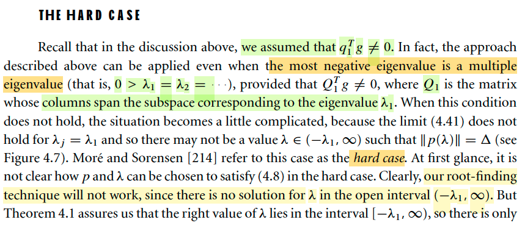</kbd>

<kbd>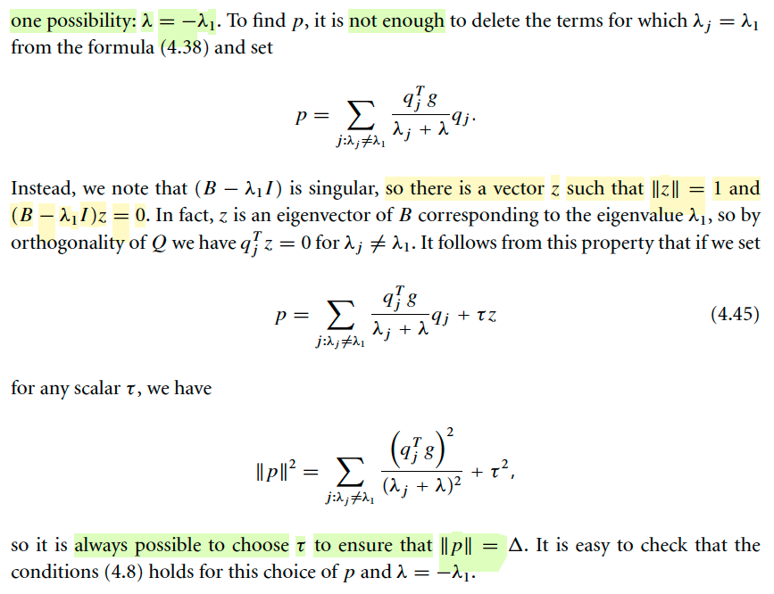</kbd>

<kbd>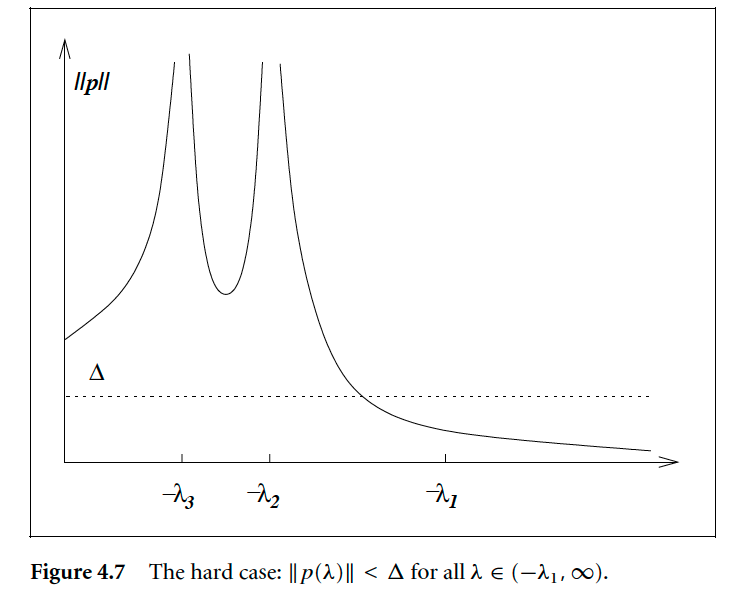</kbd>

> [!NOTE]
> The Hard Case: Khi q1Tg = 0
>
> Ok, cùng nhau tìm hiểu ca này:
>
> Đầu tiên phải ôn lại bối cảnh chút xíu thì mới hiểu được rõ vấn đề:
>
> Bài toán ta đang giải, subproblem: minimize f + gTp + (1/2)pTBp s.t ||p|| ≤ Δ, thì có một theorem (theorem 4.1) mà mình cũng đã hiểu xuất xứ nhờ đã học KKT conditions) cho biết điều kiện cần và đủ của nghiệm bài toán này, đó là:
>
> (B + λI)p* = -g (4.8a)
>
> λ(Δ - ||p*||) = 0 (4.8b)
>
> (B + λI) xác định bán dương. (4.8c)
>
> (ở đây mình tự hiểu λ ý là λ*, tức là optimal dual variable)
>
> Từ 4.8b (có gốc rễ là complementary slackness) suy ra: khi λ > 0 thì (Δ - ||p*||) phải = 0 và khi Δ - ||p*|| khác 0 thì λ phải bằng 0.
>
> Thế thì từ đó, người ta mới xây dựng thuật toán để giải bài toán này, tìm ra p*. 
>
> Bước 1: Kiểm tra xem với λ = 0 thì p* có thỏa ||p*|| < Δ và B + 0I = B có xác định bán dương không. Nếu có, thì chốt nghiệm p*. Dừng thuật toán.
>
> Bước 2: Nên case trên không thỏa. Thì tức là λ > 0 và Δ - ||p*|| = 0 ta sẽ đi tìm λ > 0 sao cho B + λI xác định dương, và giải Δ - ||p*|| = 0 ⇔ Δ = ||p*||.
>
> Vậy thì note trước mình đã nói về việc giải bài toán của bước 2, nhưng chỉ mới cover một phần. Tóm tắt sơ như sau:
>
> Để B + λI xác định bán dương, thì trị riêng của nó, λi + λ phải ≥ 0 với λi là trị riêng của B. Dẫn tới λ phải > -λmin(B), lấy ví dụ có λ1 < λ2 < λ3 thì λ phải ≥ -λ1.
>
> Và khi đó ||p*|| = Δ ⇔ ||p*|| - Δ = 0, thì dùng 4.8a, (B + λI)p* = -g ⇨ p* = - (B + λI)inv g, p* phụ thuộc λ nên kí hiệu là p*(λ), ta sẽ giải ||p*(λ)|| - Δ = 0, λ ≥ -λ1 bằng root finding Newton's method.
>
> Thế nhưng có một vấn đề là khi làm cách này, có thể xảy ra tình huống là trong chuỗi λ sinh ra xuất hiện một thằng nằm ngay sát bên phải -λ1, khiến thuật toán không thể hội tụ, hội tụ chậm. Do đó, ta mới chuyển hóa lại, bằng cách áp dụng root finding Newton nhưng giải bài toán: 1/||p*(λ)|| - 1/Δ = 0 thay cho bài toán gốc. Và cách này sẽ tốt hơn.
>
> Tuy nhiên, những gì xảy ra ở ca này chỉ đúng NẾU NHƯ q1Tg KHÁC 0: Vì sao?
>
> Đó là vì khi phân tích bản chất của ||p*(λ)||, bằng cách sử dụng phân tích giá trị riêng vector riêng, ta thấy nó là: 
>
> p(λ) = - Σi [qiTg / (λi + λ)] qi (4.38)
>
> ||p*(λ)||^2 = Σi [qiTg / (λi + λ)]^2 (4.39)
>
> hay ||p*(λ)|| = √Σi [qiTg / (λi + λ)]^2
>
> Thì phân tích sketch biến thiên của nó, ta sẽ thấy nó sẽ vọt lên infinity tại λ → -λi.
>
> Dẫn đến: Nếu q1Tg khác 0, thì khi λ đi từ -λ1 → ∞ thì hàm ||p*(λ)|| monotone decreasing từ +∞ → 0 Và kiểu gì cũng sẽ cắt ngang hàm f = Δ. Giúp cho phương trình ||p*|| = Δ chắc chắn có nghiệm, và thuật toán root finding Newton sẽ tìm ra.
>
> Nhưng, nếu q1Tg = 0, thì hình tình hình sẽ có thể là khi λ đi từ -∞ → ∞, sau khi đã vượt qua mốc -λ3, -λ2, và giả sử tại q3Tg và q2Tg đều khác 0, thì tức là khi đi qua hai mốc đó hàm số vọt lên inf rồi xuống lại. Thế thì, từ -λ2 → inf hàm giảm đơn điệu liên tục, để rồi khi λ đi trong đoạn [-λ1, inf) thì CÓ THỂ TRONG KHOẢNG NÀY ||p*(λ)|| ĐÃ NHỎ HƠN Δ RỒI, và như vậy phương trình vô nghiệm, thuật toán root finding sẽ fail.
>
> Thế thì, vấn đề là, theorem 4.1 không thể sai, nó đã quy định rằng, nếu đã rơi vào ca sau (tức λ > 0, ||p|| = Δ) thì chắc chắn phải tồn tại λ > 0 sao cho ||p*(λ)|| = Δ, ta gọi nó là λ* (mà thật ra đúng là phải dùng λ*, vì nó là dual optimal) thì vì p* ứng với λ*, tức p*(λ*) là optimal cho nên nó phải thỏa điều kiện đủ B + λ*I xác định dương, đồng nghĩa λ* phải ≥ -λ1.
>
> Vậy thì, khi q1Tg = 0, thì nếu ||p(-λ1)|| vẫn ≥ Δ, tức là khi λ bắt đầu đi vào [-λ1, inf) thì ||p(λ)|| vẫn còn cao hơn Δ, thì vì tính chất monotone decreasing, phương trình chắc chắn vẫn có nghiệm, và trường hợp này không sao cả, thuật toán root finding vẫn giải tốt.
>
> Nhưng the hard case xảy ra khi ||p(-λ1)|| < Δ, tức là khi λ bắt đầu đi vào [-λ1, inf) thì ||p(λ)|| ĐÃ NHỎ HƠN Δ rồi, phương trình vô nghiệm
>
> Xét λ > -λ1 → B + λI vẫn xác định dương → invertible → p = -(B + λI)inv g và vì ||p(-λ1)|| < Δ nên chắc chắn ||p(λ)|| = Δ với λ > -λ1 sẽ vô nghiệm. 
>
> Nhưng như đã nhắc lại ở trên, theorem 4.1 quy định **bắt buộc phải tồn tại λ* trong [-λ1, inf) sao cho (B + λI)p* = -g và ||p*|| = Δ**. 
>
> Do do **phải được quyền suy ra λ* = -λ1**
>
> Và như vậy p(λ*) = p(-λ1) = - Σi≠1 [qiTg / (λi-λ1)] qi 
>
> (theo 4.38 p(λ) = - Σi [qiTg / (λi + λ)] qi, thế λ = -λ1 và vì q1Tg = 0 rồi)
>
> phải là nghiệm của (B + λI)p* = -g
>
> Đến đây, vấn đề vẫn còn tồn đọng: |p*(λ*)|| = ||p(-λ1)|| < Δ, trong khi yêu cầu là ||p*(λ)|| = Δ 
>
> Cách xử lí đó là:
>
> p*, theo 4.8a, nó phải là solution của (B + λ*I)p = -g
>
> Nhưng với λ* = -λ1, thì B + λ*I = B - λ1I sẽ có một eigenvalue bằng 0 → singular matrix. Và không thể invertible để có p = (B - λ1I)inv g được.
>
> Tuy nhiên vì B - λ1I singular nên dim nullspace N(B - λ1I) khác 0 → tồn tại nullspace vector khác 0 khiến (B - λ1I)z = 0, thì mọi vector p* + αz đều là nghiệm của (B - λ1I)u = -g 
>
> ⇨ p = - Σi≠1 [qiTg / (λi-λ1)] qi + τz là solution của (B + λ*I)p = -g
>
> Và ta chỉ cần chọn τ để ||p|| = Δ thôi.
>
> ||p|| = ||-Σi≠1 [qiTg / (λi-λ1)] qi + τz|| = Δ
>
> ⇔ ||p||^2 = ||-Σi≠1 [qiTg / (λi-λ1)] qi + τz||^2 = Δ^2
>
> (Dùng tính chất ||(u + v)||^2 = (u + v)T(u + v) = (uT + vT)(u + v)
>
> = uTu + vTu + uTv + vTv = ||u||^2 + ||v||^2 + 2uTv. Nếu u vuông góc v → uTv = 0 thì  ||(u + v)||^2 
>
> = ||u||^2 + ||v||^2, đây chính là định lí Pythagores)
>
> Áp dụng vào đây Σi≠1 [qiTg / (λi-λ1)] qi là **linear combination các eigenvector của B - λ1I**, mà **eigenvector ứng với eigenvalue khác 0 của một matrix thì nó sẽ nằm trong rowspace**, cũng** đồng thời là columnspace vì matrix đối xứng chúng trùng nhau**, và **nullspace orthogonal complement rowspace** nên suy ra Σi≠1 [qiTg / (λi-λ1)] qi (là vector trong column space cũng là rowspace) sẽ vuông góc z
>
> → ||p||^2 = ||-Σi≠1 [qiTg / (λi-λ1)] qi + τz||^2 = Δ^2
>
> ⇔ ||-Σi≠1 [qiTg / (λi-λ1)] qi||^2 + ||τz||^2 = Δ^2
>
> ⇔ ||Σi≠1 [qiTg / (λi-λ1)] qi||^2 + |τ|^2||z||^2 = Δ^2
>
> ⇔ ||Σi≠1 [qiTg / (λi-λ1)] qi||^2 + |τ|^2 = Δ^2 (do chọn ||z|| = 1)
>
> ⇔ |τ|^2 = Δ^2 - ||Σi≠1 [qiTg / (λi-λ1)] qi||^2
>
> ⇨ giải ra τ

> [!TIP]
> **🤖 AI Feedback** — ✅ Score: **95/100**
>
> Bài phân tích rất xuất sắc, thể hiện sự hiểu biết sâu sắc về 'hard case' và các khía cạnh toán học liên quan. Lập luận rõ ràng và chính xác. Một điểm nhỏ có thể cải thiện là phần giải thích về tính trực giao giữa các vector riêng, có thể trình bày gọn gàng và trực tiếp hơn.

 

- **Proof of theorem 4.1: Lemma 4.7**

<kbd>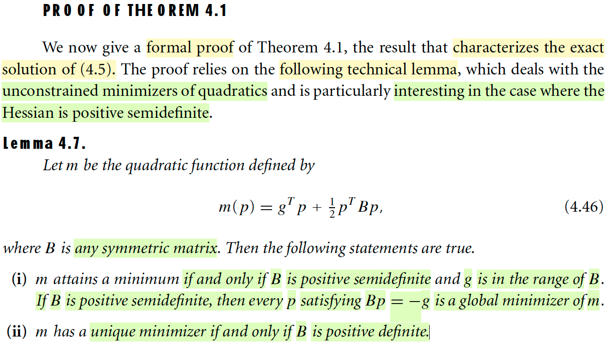</kbd>

<kbd>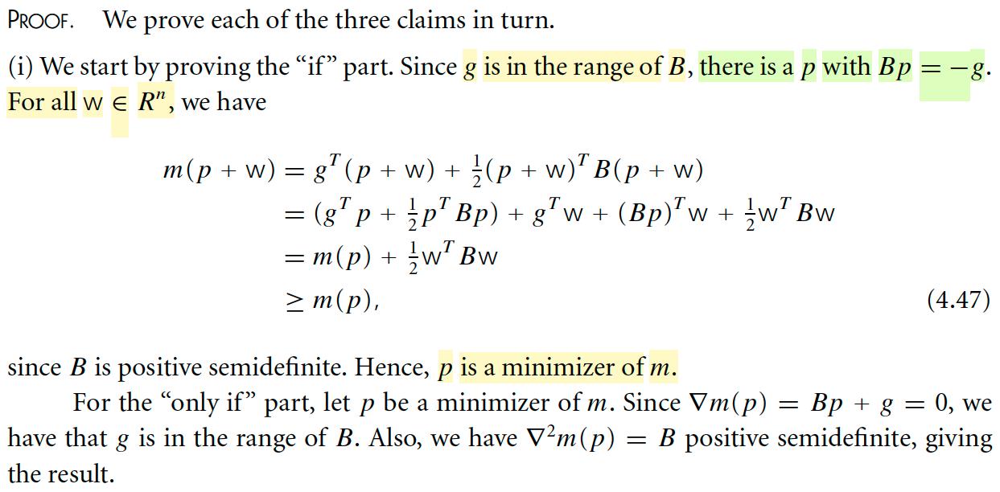</kbd>

> [!NOTE]
> Lemma 4.7
>
> Phần này đại khái là ta sẽ chứng minh theorem 4.1, là nền tảng để giúp tìm solution của bài toán 4.5, bài toán subprolem: minimize mk(pk) = fk + gkTpk + (1/2)pkBkpk s.t ||pk|| ≤ Δ. Còn nhớ theorem 4.1 nói ràng điều kiện cần và đủ để p là solution của bài toán này đó là tồn tại λ ≥ 0 thỏa:
>
> (B + λI)p* = -g (4.8a)
>
> λ(Δ - ||p*||) = 0 (4.8b)
>
> (B + λI) xác định bán dương. (4.8c)
>
> Thế thì, tác giả cho biết việc chứng minh theorem 4.1 cần dựa trên một bổ đề sau: Gọi m là quadratic function m(p) = gTp + (1/2)pTBp với B đối xứng thì khi đó:
>
> i) m  sẽ có thể attains minimum khi và chỉ khi B bán xác định dương và g nằm trong range (tức column space) của B.
>
> Phần chứng minh cho ý này cũng dễ hiểu thôi:
>
> Chứng minh [B bán ⪰ 0 và g ∈ C(B)] ⇨ m attain minimizer
>
> Ở dưới ta sẽ ôn lại **khi nào là gọi là đủ, khi nào là cần**, ở đây trong bối cảnh này trong tối ưu, ta ngầm hiểu là định lí này quan tâm [m attain minimizer], nên **đó là lí do ta gọi đây là chứng minh điều kiện đủ** (tuy nhiêu nếu mà tập trung vài [B bán ⪰ 0 và g ∈ C(B)], thì đây lại là chứng minh điều kiện cần. Chứng minh như sau:
>
> Vì **g ∈ C(B)**, đã học trong MIT 18.06, ⇨ **g (và -g) là linear combination của B's columns**, do đó tồn tại vector p làm hệ số để tạo ra g từ B's columns: Bp = -g
>
> Ta mới xét m(p + z) với z bất kì trong R^n và chứng minh nó luôn ≥ m(p) từ đó suy ra p là minimum.
>
> m(p + z) = gT(p + z) + (1/2)(p + z)TB(p + z)
>
> = gTp + gTz + (1/2)(pTB + zTB)(p + z)
>
> = gTp + gTz + (1/2)(pTBp + zTBp + pTBz + zTBz)
>
> = gTp + gTz + (1/2)pTBp + zTBp + (1/2)zTBz
>
> = gTp + (-Bp)Tz + (1/2)pTBp + zTBp + (1/2)zTBz
>
> = gTp - pTBz + (1/2)pTBp + zTBp + (1/2)zTBz
>
> = gTp + (1/2)pTBp + (1/2)zTBz
>
> = m(p) + (1/2)zTBz
>
> Mà **B bán xác định dương** nên **quadratic form zTBz ≥ 0 ∀ z ∈ R^n**
>
> ⇨ **vế phải ≥ m(p) ⇨ p là minimizer.**
>
> Chứng minh điều kiện cần (vì sao gọi là điều kiện cần, đọc phần ghi chú sau khi chứng minh):
>
> nếu [m có thể attain minimum] ⇨ [B bán xác định dương và g ∈ C(B)]:
>
> Vì m attain minimum, nên **gọi p là minimizer**. Áp dụng theorem điều kiện cần của optimal hàm bất kì: 
>
> Với f bất kì, thì **"Nếu x là minimizer của f(x) ⇨ gradient tại x vanish và Hessian tại x bán định dương"**.
>
> Vậy gradient của m tại p vanish: ∇m(p) = 0 ⇔ Bp + g = 0 ⇔ Bp = -g ⇨ **g là linear combination của B's columns, g ∈ C(B).**
>
> Và **Hessian của m tại p phải bán xác định dương** ⇨ **Hessian của m tại p chính là B.**
>
> Chứng minh xong (i)
>
> ====
>
> Ý (ii) của Lemma: **x có minimizer độc nhất khi và chỉ khi B xác định dương.**
>
> Ta chứng minh tức điều kiện cần: 
>
> x là unique minimizer → dĩ nhiên **đầu tiên nó phải là minimizer, dùng lập luận tương tự như chứng minh (i) để kết luận B ⪰ 0, và g ∈ C(B)**
>
> Vậy thì đến đây, ta **giả sử x là unique minimizer** nhưng **B chỉ bán xác định dương chứ không xác định dương.**
>
> Thế thì ta đã biết để **xác định dương thì mọi eigenvalue đều dương**, còn nếu chỉ **bán xác định dương thì mọi eigenvalue chỉ không âm**. Do đó **tồn tại một eigenvalue bằng 0**.
>
>
> Gọi nó là λ và eigenvector tương ứng là z, thì ta có** Bu = λz= 0** ⇨ **z chính là nullspace vector của B**. Nói cách khác, tồn tại non zero nullspace vector của B.
>
> Xét m tại p+z:
>
> m(p + z) = gT(p + z) + (1/2)(p + z)TB(p + z)
>
> = gTp + gTz + (1/2)(pTBp + zTBp + pTBz + zTBz)
>
> = gTp + gTz + (1/2)[pTBp + 0p + pT(0) + zT(0)] (0 là zero vector)
>
> (Dùng BTz = Bz = 0)
>
> Tới đây, **g là vector trong C(B), vì B đối xứng nên C(B) = C(BT) ⇨ g ∈ rowspace C(BT)**
>
> Mà **nullspace orthogonal complement rowspace** ⇨ **gTz = 0**
>
> = gTp + (1/2)pTBp
>
> = m(p) 
>
> Vậy giải thiết p là unique minimizer nhưng B không xác định dương dẫn tới m(z + p) = m(p) cho thấy z + p cũng là minimizer ⇨ mâu thuẫn với giả thiết. Từ đó suy ra B phải ≻ 0.
>
> (....) 
>
> Chứng minh điều kiện đủ:
>
> Ta có **B xác định dương**. Thì dĩ nhiên **cũng xác định bán dương**, và nó **full rank** 
>
> ⇨ **C(B) = R^n** 
>
> ⇨ **g dĩ nhiên cũng thỏa việc nằm trong C(B)**. 
>
> Nhờ đó dùng lập luận của chứng minh (i) ta suy ra m(p + z) = m(p) + (1/2)zTBz ∀ z ∈ R^n. Mà **B xác định dương** nên **hạng tử thứ hai luôn dương** ⇨ m(p + z) > m(p) ⇨ p là unique minimizer.
>
> ====
>
> Bàn một chút về điều kiện cần, đủ có vài ghi chú ngắn sau:
>
> Xét A ⇨ B, thì A là đk đủ (để suy ra) B, và B là đk cần của A.
>
> Nên nếu tập trung vào A, thì ta nói việc chứng minh A ⇨ B là chứng minh điều kiện cần.
>
> Còn nếu tập trung vào B, thì đây lại là chứng minh điều kiện đủ.
>
> Vậy thì, ta biết có theorem phổ quát về optimalilty
>
> x là minimizer của f ⇨ gradient tại x vanish.
>
> Thì vì ta thường quan trọng / tập trung vào A, tức x là minimizer của f, nên đây là theorem Điều kiện cần bậc 1, vì trong quan hệ này, B là điều kiện cần của A.
>
> nhưng nếu gradient tại x vanish và Hessian xác định dương, thì ta suy ra x là minimizer của f. Tức là:
>
> [gradient = 0, Hessian ≻ 0] ⇨ x là minimizer của f
>
> Thì đây là theorem Điều kiện đủ bậc 2 vì trong quan hệ này, ta tập trung vào vế sau, và vế đầu là điều kiện đủ của vế sau.
>
> Tóm lại: A → B, mà tập trung vào A, thì đây là điều kiện cần còn tập trung vào B thì là điều kiện đủ.
>
> Vậy nói thêm:
>
> Với hàm bất kì,
>
> [x là minimizer của f] ⇨ [gradient = 0, Hessian ⪰ 0]
>
> nên [gradient = 0, Hessian ⪰ 0] là điều kiện cần bậc hai của [x là minimizer của f]
>
> Nhưng với hàm bất kì thì:
>
> [gradient = 0, Hessian ⪰ 0] KHÔNG ⇨ [x là minimizer của f]
>
> nên [gradient = 0, Hessian ⪰ 0] không phải là điều kiện đủ bậc 2.
>
> Nhưng nếu là hàm convex thì:
>
>  [gradient = 0, Hessian ⪰ 0] ⇨ [x là minimizer của f]
>
> nên [gradient = 0, Hessian ⪰ 0] là điều kiện đủ bậc 2.
>
> Do đó, với hàm convex:
>
> [gradient = 0, Hessian ⪰ 0] là điều kiện CẦN VÀ ĐỦ bậc hai.
>
> [x là minimizer của f] ⇔ [gradient = 0, Hessian ⪰ 0]

> [!TIP]
> **🤖 AI Feedback** — ✅ Score: **98/100**
>
> Bài làm xuất sắc, thể hiện sự hiểu biết sâu sắc và khả năng phân tích vững chắc các điều kiện tối ưu và tính chất của hàm bậc hai. Các bước chứng minh được trình bày rõ ràng, logic và chính xác. Một điểm nhỏ cần lưu ý là có sự không nhất quán trong việc sử dụng 'x' thay vì 'm' hoặc 'p' khi đề cập đến hàm số hoặc cực tiểu trong phần chứng minh ý (ii).

 

- **Một ví dụ minh họa**

<kbd>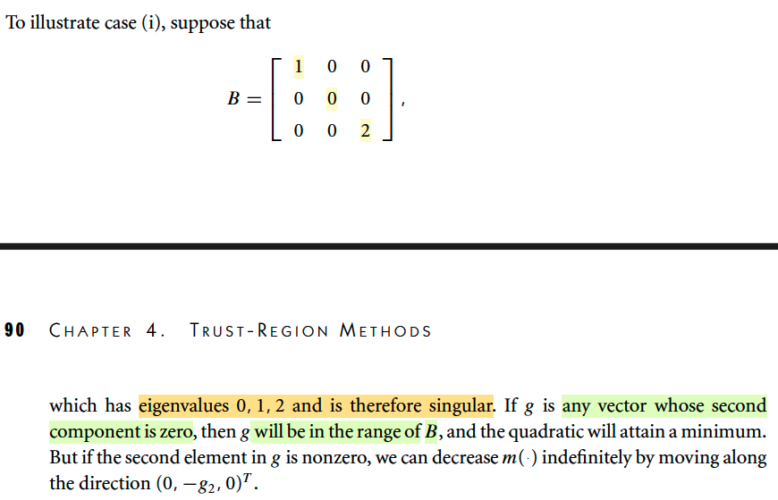</kbd>

> [!NOTE]
> Một ví dụ minh họa, họ cho matrix B như vậy. 
>
> Mình có thể thấy nó là diagonal matrix, nên ta biết từ MIT 18.06, eigenvalue của nó nằm trên đường chéo. Và đều không âm, nên đây là ma trận bán xác định dương. Rồi, nhìn ba cột của nó. thì cột thứ 2 = là zero, dĩ nhiên nó là dependent, hai cột kia chắc chắn là independent (vì tồn tại identity matrix). Nên đây là rank 2 matrix (phù hợp với việc matrix có 2 trị riêng khác 0). Và column space của nó sẽ là một 2D subspace tạo bởi mọi linear combination cột 1 và cột 3. Dễ thấy, nó chính là plane xz. Do đó mọi vector có y = 0 đều nằm trong plane này, đây chính là ý giáo sư nói mọi vector g có phần tử thứ 2 bằng 0 đều nằm trong C(B) (range of B). Và khi đó theo lemma vừa rồi, thì m sẽ có thể attain minimum.
>
> Nhưng nếu g không nằm trong C(B), thì theo lemma vừa rồi, m chắc chắn không thể attain minimum. (vì hãy nhớ lemma phát biểu điều kiện cần và đủ)
>
> Thật vậy, nếu phần tử thứ 2 của g khác 0. Ta xét m = gTp + (1/2)pTBp 
>
> Và cụ thể là d = (0, -g2, 0), ta xét scalar function k(t) = m(dt) = gT(dt) + (1/2)(td)TB(td)
>
> (trong EE364A, gọi là restricted by an affine)
>
> = t(gTd)+ (1/2)t^2 dTBd
>
> = t[g2 × (-g2)]+ (1/2)t^2 dTBd
>
> = -tg2^2+ (1/2)t^2 dTBd
>
> Để ý d = (0, -g2, 0) với g2 khác 0 chính là nullspace vector của B
>
> = -t g2^2 + (1/2) t^2 dT (0) 
>
> = -t g2^2. 
>
> Vậy khi t → inf, tức là đi theo hướng vector d, thì hàm m sẽ → -inf. Không thể attain minimum

> [!TIP]
> **🤖 AI Feedback** — ✅ Score: **95/100**
>
> Phân tích của bạn rất sâu sắc và chính xác, đặc biệt là phần chứng minh chi tiết việc hàm m(.) giảm vô hạn khi g không nằm trong C(B). Tuy nhiên, cần chú ý tính nhất quán trong ký hiệu, ví dụ như dấu của g2 khi định nghĩa vector d và trong các phép tính.

 

- **Proof of theorem 4.1**

<kbd>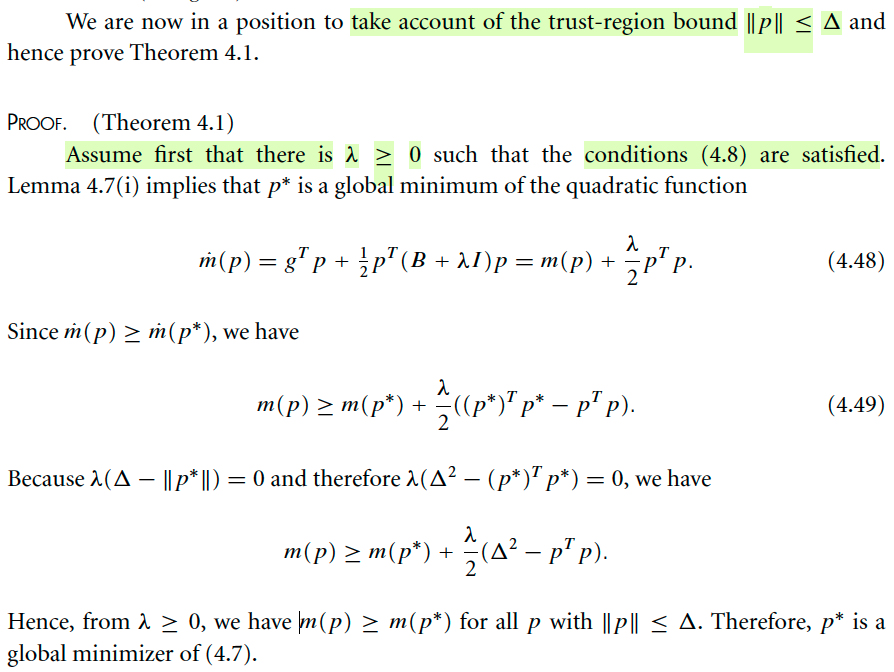</kbd>

> [!NOTE]
> Bây giờ với bổ đề 4.7, ta sẽ chứng minh theorem 4.1: 
>
> Nhắc lại theorem 4.1: Nói nói rằng p* là solution của bài toán minimize m(p) = f + gTp + (1/2)pTBp s.t ||p|| ≤ Δ khi và chỉ khi p* feasible và tồn tại λ ≥ 0 thỏa:
>
> (B + λI)p* = -g (4.8a)
>
> λ(Δ - ||p*||) = 0 (4.8b)
>
> (B + λI) xác định bán dương. (4.8c)
>
> Ta sẽ chứng minh điều kiện đủ: 
>
> Dùng bổ để 4.7 ý i) nói rằng xét hàm m(p) = gTp + (1/2)pTBp, điều kiện cần và đủ để m attain minimum là B ⪰ 0 và g ∈ range B. Khi đó minimizer sẽ là p thỏa Bp = -g.
>
> Do đó, áp dụng vào đây, ta có B + λI ⪰ 0 và vì (B + λI)p* = -g nên dĩ nhiên g nằm trong range B + λI. Vậy thỏa điều kiện để suy ra hàm quadratic m_tidle(p) = gTp + (1/2)pT(B + λI)p có thể attain minimum và p* thỏa (B + λI)p* = -g chính là minimizer của nó.
>
> Biến đổi chút hàm m'(p):
>
> m'(p) = gTp + (1/2)pT(B + λI)p 
>
> = gTp + (1/2)pTBp + (1/2)pT(λI)p
>
> = gTp + (1/2)pTBp + (λ/2)pTp
>
> Hai hạng tử đầu tiên làm nên m(p) - f | m(p), là cái hàm trong định lí 4.1 = f + gTp + (1/2)pTBp
>
> = m(p) - f + (λ/2)pTp
>
> (trong sách tác giả lờ đi f, có thể vì nó chỉ là constant)
>
> Rồi, vì như đã nói trên, p* là minimizer của m'(p) nên:
>
> m'(p) ≥ m'(p*) ∀ p
>
> ⇔ m(p) - f + (λ/2)pTp ≥ m(p*) - f + (λ/2)p*Tp*
>
> ⇔ m(p) ≥ m(p*) + (λ/2)p*Tp* - (λ/2)pTp
>
> ⇔ m(p) ≥ m(p*) + (λ/2)(p*Tp* - pTp)
>
> ⇔ m(p) ≥ m(p*) + (λ/2)p*Tp* - (λ/2)pTp (a)
>
> Tới đây ta dùng λ(Δ - ||p*||) = 0 (4.8b) Nhân hai vế cho (Δ + ||p*||)
>
> ⇔  λ(Δ - ||p*||)(Δ + ||p*||) = 0 (chú ý, Δ, hay ||p*|| chỉ là scalar)
>
> ⇔  λ(Δ^2 - ||p*||^2) = 0
>
> ⇔  λΔ^2 = λp*Tp*
>
> ⇔  (λ/2)Δ^2 = (λ/2)p*Tp*
>
> ⇨ (a) ⇔ m(p) ≥ m(p*) + (λ/2)Δ^2 - (λ/2)pTp
>
> ⇔ m(p) ≥ m(p*) + (λ/2)(Δ^2 - pTp)
>
> Tiếp theo, vì λ ≥ 0
>
> Nên nếu xét trong mọi p thỏa ||p|| ≤ Δ, thì m(p) ≥ m(p*). Điều này giúp kết luận p* chính là minimizer của bài toán (minimize m(p) s.t ||p|| ≤ Δ) → Chứng minh xong điều kiện đủ.

> [!TIP]
> **🤖 AI Feedback** — ✅ Score: **96/100**
>
> Bài làm rất xuất sắc, bạn đã tái hiện và giải thích chi tiết chứng minh điều kiện đủ của Định lý 4.1 một cách cực kỳ rõ ràng và chính xác. Việc phân tích hàm m(p) có hay không có hằng số f cho thấy sự hiểu biết sâu sắc. Một điểm nhỏ có thể cải thiện là diễn đạt điều kiện cần và đủ của bổ đề 4.7(i) một cách chính xác hơn về mối liên hệ giữa ma trận và vector g để hàm đạt cực tiểu.

 

- **Proof of theorem 4.1 (cont)**

<kbd>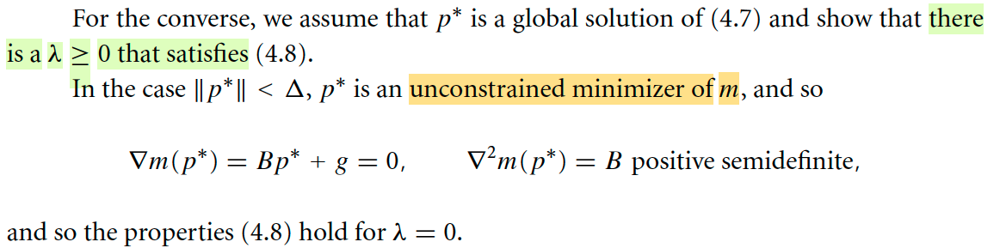</kbd>

<kbd>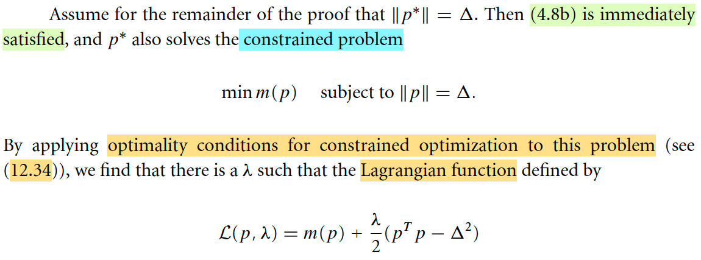</kbd>

<kbd>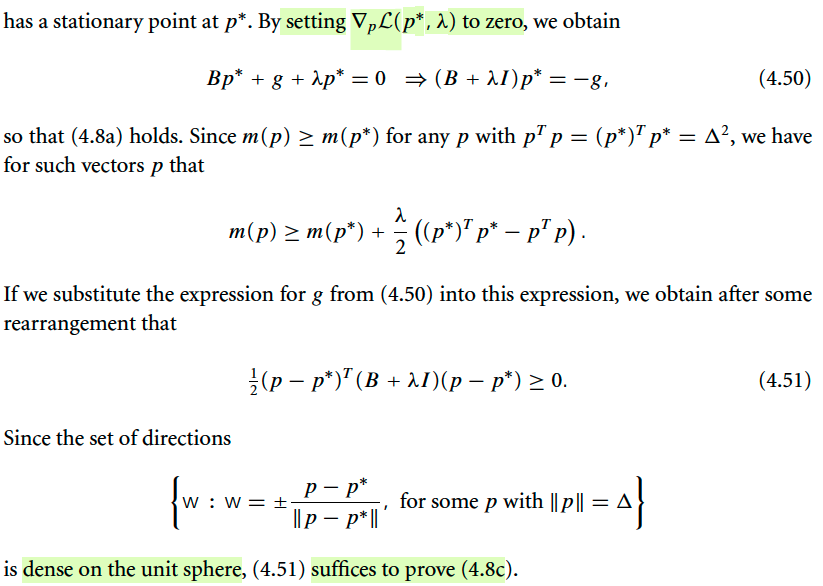</kbd>

<kbd>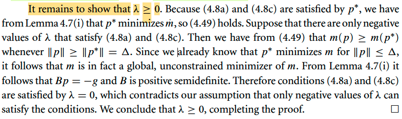</kbd>

> [!NOTE]
> Nhắc lại theorem 4.1: Nói nói rằng p* là solution của bài toán minimize m(p) = f + gTp + (1/2)pTBp s.t ||p|| ≤ Δ khi và chỉ khi p* feasible và tồn tại λ ≥ 0 thỏa:
>
> (B + λI)p* = -g (4.8a)
>
> λ(Δ - ||p*||) = 0 (4.8b)
>
> (B + λI) xác định bán dương. (4.8c)
>
> Chứng minh điều kiện cần. Tức là ta gọi p* là minimizer của bài toán constrained opitmiation problem trên. Thì ta chứng minh nó feasible và tồn tại λ ≥ 0 thỏa 4.8a,b,c.
>
> Ta sẽ chia làm hai trường hợp:
>
> 1) ||p*|| < Δ: Điều này dễ hiểu có nghĩa là p* chính là minimizer của m(p), hay nói như sách, p* là unconstrained minimizer của m. Đơn giản là p* là minimizer của constrained m(p) thì nó cũng phải là minimizer của unconstrained m(p) (lưu ý, điều này không đồng nghĩa với việc nói nếu p* là global minimizer của constrained m(p) thì nó cũng là global minimizer của unconstrained m(p), mà chỉ đúng khi đang ám chỉ local minimizer).
>
> Và vì vậy (p* là minimizer của unconstrained m(p)). Nên ta có quyền áp dụng điều kiện cần bậc 1:
>
> ∇m(p*) = 0 ⇔ (B + λI)p* + g = 0 ⇔ (B + λI)p* = -g → Đây chính là 4.8a
>
> và điều kiện cần bậc 2:
>
> ∇^2m(p*) ⪰ 0 ⇔ (B + λI) ⪰ 0  → Đây chính là 4.8b
>
> (Nhờ MIT 18s096, viêc tìm gradient và Hessian của quadratic function không có gì khó nữa:
>
> Gradient: Ta sẽ muốn đưa về kết quả df = f'(x)[dx], là linear operator của dx.
> Với f = (1/2)xTPx + gTx + v 
>
> ⇨ df = f(x+dx) - f(x) = (1/2)(x+dx)TP(x+dx) + gTx + v -[(1/2)xTPx + gTx + v] 
>
> = (1/2)(xTP+dxTP)(x+dx) + gT(x+dx) + v -[(1/2)xTPx + gTx + v]
>
> = (1/2)(xTPx+dxTPx+xTPdx+dxTPdx) + gT(x+dx) + v -[(1/2)xTPx + gTx + v]
>
> = (1/2)(xTPx+2xTPdx+dxTPdx) + gTdx - (1/2)xTPx
>
> = (1/2)(xTPx+2xTPdx) + gTdx - (1/2)xTPx | Bỏ high order term của dx
>
> = xTPdx  + gTdx 
>
> = gTdx + (PTx)Tdx 
>
> = (PTx + g)Tdx
>
> f là vector → scalar function, nên df là scalar. Linear operator act on dx để cho scalar dx chỉ có thể là phép dot product với một vector. Do đó gradient ∇f chính là PTx + g
>
> Để tìm Hessian ta có thể đi tìm Jacobian của hàm ∇f(x) = PTx hoặc làm theo lối bilinear form của [dx, dx'].
>
> Cách làm theo lối tìm Bilinear form: Ta sẽ có df' = (x+dx')TPdx + g - xTPdx - g
>
> = (xT+dx'T)Pdx - xTPdx
>
> = xTPdx + dx'TPdx - xTPdx
>
> = dx'TPdx, đây là Bilinear form của [dx,dx'] ⇨ Hessian chính là P
>
> Cách làm theo lối tìm Jacobian của ∇f: d∇f(x) = ∇f(x+dx) - ∇f(x) = PT(x+dx) + g - PTx - g = PTdx
>
> ⇨ Jacobian là P, cũng là Hessian của f.)
>
> Quay lại đây, có nghĩa là ở trên khi p* có ||p|| < Δ thì Bp* = -g và B ⪰ 0, cũng chính là đã thỏa điều kiện (B + λI)p* = -g (4.8a) và B + λI ⪰ 0 với λ = 0 .Và dĩ nhiên cũng thỏa λ(Δ - ||p*||) = 0 (4.8b) với λ = 0.
>
> Xét trường hợp 2: 
>
> 1) ||p*|| = Δ: Lúc này tự động thỏa λ(Δ - ||p*||) = 0 (4.8b) 
>
> Ta cần chứng minh 4.8a và c.
>
> Tiếp theo, vì đây là bài toán inequality constrained optimization problem thì KKT condition sẽ là điều kiện cần (Nói thêm trong bối cảnh hàm lồi, bài toán lồi, thì KKT condition là điều kiện cần và đủ của optimal):
>
> Trong đó có:
>
> Stationary condition: Tồn tại λ ≥ 0 khiến gradient của hàm Langrangian vanish
>
> Lagrangian: L(p, λ) = m(p) + λ(||p|| - Δ).
>
> Nhưng vì constrained ||p|| ≤ Δ ⇔ (1/2)||p||^2 ≤ (1/2)Δ do ||p|| không âm nên bài toán tương đương (equivalent) là minimize m(p) s.t (1/2) pTp ≤ (1/2) Δ^2.
>
> Lagrangian: L(p, λ) = m(p) + λ/2(pTp - Δ^2).
>
> ∇L = ∇m(p) + λp = BTp + g + λp = (B + λI)p + g
>
> Stationary condition: ∇L = 0 ⇔ (B + λI)p + g = 0 ⇨ Chính là điều kiện (B + λI)p* = -g (4.8a)
>
> ====
>
> Tiếp theo ta sẽ phải chứng minh 4.8c: B + λI xác định bán dương. Thì ý tưởng đơn giản thôi: Nhớ hồi học MIT 18.06, thầy Strang đã dạy, để chứng minh matrix A positive semidefinite, ta sẽ chứng minh quadratic form của nó xTAx ≥ 0 với mọi x.
>
> Ở đây, ta bắt đầu với việc đã có p* là minimizer của bài toán (minimize m(p) s.t ||p|| ≤ Δ). nên:
>
> m(p) ≥ m(p*) ∀ feasible p, tức ||p|| ≤ Δ.
>
> ⇔ m(p) ≥ m(p*) + 0 ∀p feasible
>
> Và dĩ nhiên inequality này cũng đúng nếu xét riêng các p có ||p|| = Δ
>
> m(p) ≥ m(p*) + (λ/2)(p*Tp* - pTp) ∀p có ||p|| = Δ
>
> ⇔ f + gTp + (1/2)pTBp ≥ f + gTp* + (1/2)p*TBp* + (λ/2)(p*Tp* - pTp) ∀p có ||p|| = Δ
>
> ⇔ gTp - gTp* + (1/2)pTBp - (1/2)p*TBp* - (λ/2)(p*Tp* - pTp) ≥ 0 ∀p có ||p|| = Δ
>
> ⇔ gT(p - p*) + (1/2)pTBp - (1/2)p*TBp* - (λ/2)p*Tp* + (λ/2)pTp) ≥ 0 ∀p có ||p|| = Δ
>
> ⇔ gT(p - p*) + (1/2)pTBp + (λ/2)pTp - (1/2)p*TBp* - (λ/2)p*Tp*  ≥ 0 ∀p có ||p|| = Δ
>
> ⇔ gT(p - p*) + (1/2)pTBp + (1/2)pT(λI)p - (1/2)p*TBp* - (1/2)p*T(λI)p*  ≥ 0 ∀p có ||p|| = Δ
>
> ⇔ gT(p - p*) + (1/2)pT(B + λI)p - (1/2)p*T(B + λI)p* ≥ 0 ∀p có ||p|| = Δ
>
> Do ở trên ta đã chứng minh 4.8a nên có quyền dùng ở đây:
>
> (B + λI)p* = -g 
>
> ⇔ [(B + λI)p*]T = -gT
>
> ⇔ -p*T(B + λI)T = gT
>
> ⇔ -p*T(B + λI) = gT  do B + λI đối xứng
>
> Thế vô inequality trên ta có:
>
> ⇔ -p*T(B + λI)(p - p*) + (1/2)pT(B + λI)p - (1/2)p*T(B + λI)p* ≥ 0 ∀p có ||p|| = Δ
>
> Đặt A = B + λI
>
> -p*TA(p - p*) + (1/2)pTAp - (1/2)p*TAp* ≥ 0 ∀p có ||p|| = Δ
>
> ⇔ -p*TAp + p*TAp* + (1/2)pTAp - (1/2)p*TAp* ≥ 0 ∀p có ||p|| = Δ
>
> ⇔ -p*TAp + (1/2)p*TAp* + (1/2)pTAp  ≥ 0 ∀p có ||p|| = Δ
>
> ⇔ (1/2)p*TAp* -p*TAp + (1/2)pTAp  ≥ 0 ∀p có ||p|| = Δ
>
> ⇔ p*TAp* -2p*TAp + pTAp ≥ 0 ∀p có ||p|| = Δ
>
> ⇔ p*TAp* -p*TAp - p*TAp+ pTAp ≥ 0 ∀p có ||p|| = Δ
>
> ⇔ p*TA(p*-p) - (p*T-pT)Ap ≥ 0 ∀p có ||p|| = Δ
>
> ⇔ p*TA(p*-p) - (p*-p)TAp ≥ 0 ∀p có ||p|| = Δ
>
> ⇔ p*TA(p*-p) - pTA(p*-p) ≥ 0 ∀p có ||p|| = Δ
>
> ⇔ (p* - p)TA(p* - p) ≥ 0 ∀p có ||p|| = Δ
>
> Tới đây, vì p* cố định, và p là mọi vector thỏa ||p|| = Δ, nên tập mọi vector p* - p sẽ là mọi vector trong không gian. (hình dung trong không gian 2D, p* là điểm trên đường tròn, p là điểm chạy trên đường tròn, thì mọi dây cung sẽ chỉa theo mọi hướng.
>
> Do đó quadratic form của A ≥ 0 ∀ vector x = p* - p ⇨ A ⪰ 0
>
> Còn phần chứng minh λ ≥ 0 (quay lại sau)

> [!TIP]
> **🤖 AI Feedback** — ⚠️ Score: **80/100**
>
> Ghi chú của bạn đã cung cấp một phân tích rất chi tiết và chính xác cho các điều kiện (4.8a) và (4.8c) trong cả hai trường hợp, thể hiện sự hiểu biết sâu sắc về các khái niệm toán học và cách thức chứng minh. Để hoàn thiện bản chứng minh, bạn cần bổ sung phần lý luận chứng minh λ ≥ 0.

 

- **Convergence of algorithms based on nearly exact solution**

<kbd>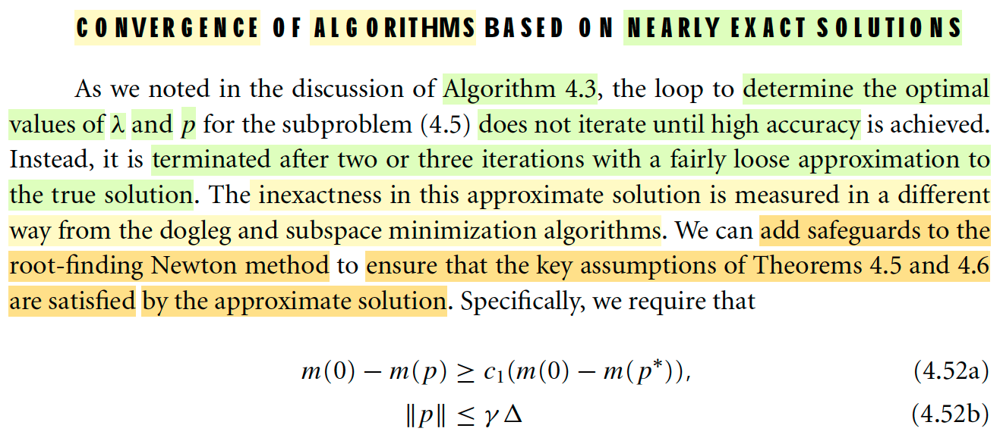</kbd>

<kbd>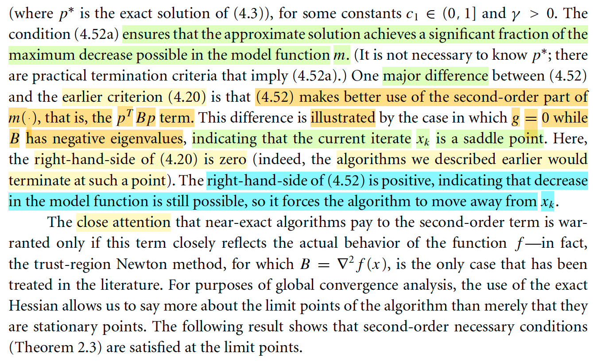</kbd>

> [!NOTE]
> Convergence of algorithms based on nearly exact solution
>
> Giờ nói qua một ghi chú nhỏ của tác giả lúc nói về thuật toán 4.3 (theo link mà xem, nhưng đại khái là thuật toán giúp giải bài toán subproblem minimize mk(p) s.t ||p|| ≤ Δ 4.5)
>
> Ôn lại xíu về ý tưởng cũng như là nguồn gốc của thuật toán này: 
>
> Nói ngắn gọn, nó xuất phát từ theorem 4.1 (xem link) nói về điều kiện cần và đủ để p là solution của bài toán này. Để rồi từ đó người ta thiết kế thuật toán giải: Thử λ = 0, nếu B ⪰ và p = -Binvg thỏa ||p|| ≤ Δ thì dừng, chốt solution p. Còn không thì tìm λ sao cho B + λI ⪰ 0 và p(λ) = -(B + λI)g thỏa ||p(λ)|| = Δ ⇔ ||-(B + λI)g|| = Δ. Mà trong bước này, việc giải tìm λ sẽ được thực hiện cũng theo iterative approach, dùng cái gọi là root finding Newton's method. Có điều, việc giải trực tiếp  ||p(λ|| = ||-(B + λI)g|| = Δ sẽ khiến ta gặp rắc rối, hay nói gọn là Newton method sẽ có thể không hiệu quả, nên ta mới giải bài toán khác, 1/||p(λ)|| = 1/Δ, giúp ta đạt hiệu quả tốt hơn. Và đó chính là thuật toán 4.3.
>
> Và trong phần đó tác giả có nói: Thực tế ta cần nâng cấp chút xíu thuật toán này vì nó có bước Cholesky factor matrix B + λI, nhưng vẫn đảm bảo là bài toán này converge về solution. Sau đó, ông nói, thực tế thì, ta sẽ không chạy để khi λ converge về giá trị chính xác, mà chỉ cần lấy giá trị tạm được sau khi chạy 2 hoặc 3 iteration thôi. Lí do dễ hiểu là Cholesky factorization tốn kém, và dù sao, bài toán subproblem của chỉ là bài toán xấp xỉ hàm objective bởi hàm quadraic.
>
> Thế thì, ý chính của phần này đó là: **tác giả muốn bàn về việc, liệu với việc không tính ra λ một cách chính xác, thì sự hội tụ của thuật toán (lớn, thuật toán trust region) sẽ thế nào**.
>
> Và ta sẽ đo lường sự không chính xác này bằng cách so sánh nó với thuật toán dogleg và 2D subspace minimization đã biết. Cũng như đưa vào vài kĩ thuật nhằm đảm bảo những giả định của theorem 4.5, 4.6 được thỏa mãn (hai theorem này đại ý là nói rằng nếu các giả định được thỏa thì trust region method sẽ hội tụ toàn cục)

> [!TIP]
> **🤖 AI Feedback** — ✅ Score: **90/100**
>
> Bài phân tích này thể hiện sự hiểu biết sâu sắc về ngữ cảnh và các thuật toán liên quan đến đoạn văn. Các điểm chính từ đoạn văn gốc được nắm bắt chính xác và được bổ trợ bởi thông tin nền đáng giá, thể hiện độ sâu đáng nể, mặc dù một số chi tiết nền không trực tiếp có trong hình ảnh đã cho.

 

- **4.52a và 4.52b đại ý là điều kiện mà ta sẽ đặt ra cho bài toán subproblem giúp đảm bảo sự hội tụ toàn cục của cả bài toán trust region**

<kbd>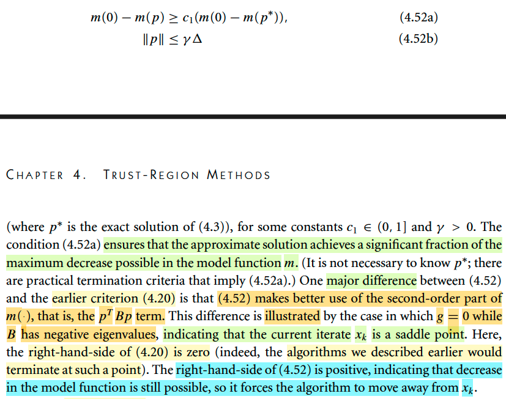</kbd>

> [!NOTE]
> Thế thì đại khái là như vầy. 4.52a và 4.52b đại ý là** điều kiện mà ta sẽ đặt ra cho bài toán subproblem giúp đảm bảo sự hội tụ toàn cục của cả bài toán trust region**. Còn nhớ mình vừa nói, khi giải bài toán subproblem với algorithm 4.3 thì ta cũng không cần giải chính xác λ, và p*, mà chỉ cần tìm giá trị đủ tốt. Nhưng thế nào là đủ tốt, hay khi nào thì dừng, thì chính là 4.52a và 4.52b. 
>
> Thế thì, đại ý là, tác giả nói rằng **hai điều kiện này tốt hơn điều kiện 4.20** (cũng là điều kiện về mức giảm của mỗi iteration, giúp đảm bảo bài toán có thể hội tụ toàn cục)
>
> mk(0) - mk(pk) ≥ c1 ||gk|| min (Δk, ||gk|| / ||Bk||) for some constant c1 ∈ (0, 1] (4.20)
>
> Nó tốt hơn ở chỗ: **Giúp thoát được điểm yên ngựa saddle point**
>
> Lập luận như sau, giả sử đến một iteration k nào đó, ta đến được điểm saddle point xk: Tại đây, gradient gk = 0, và Hessian tại đó, vì là điểm yên ngựa nên: Đi ra khỏi xk thì theo một số phương khiến độ dốc tăng lên, và một số thì độ dốc âm xuống. Có nghĩa là B là indefinite matrix, eigenvalue có âm có dương.
>
> mk(p) = fk + gkTp + (1/2)pTBkp = fk + 0 + (1/2)pTBkp = fk + (1/2)pTBkp
>
> Thế thì đại ý là, ta sẽ giải bài toán subproblem minimize mk(p) này s.t ||p|| ≤ Δ, thì kiểu gì cũng tồn tại true / exact solution p* phải khiến giảm mk, lí do là vì Bk có trị riêng âm, nên chỉ cần đi theo hướng eigenvector ứng với trị riêng này, thì sẽ giảm được mk thêm. (Có cách để chứng minh ý này)
>
> **Do đó mk(0) - mk(p*) là số dương**
>
> Và điều kiện dừng của thuật toán giải p xấp xỉ sẽ chỉ được dừng khi thỏa
>
> 4.52a: mk(0) - mk(p) ≥ c1[mk(0) - mk(p*)]
>
> Tức là chỉ được dừng khi m(0) - m(p) ≥ SỐ DƯƠNG.
>
> ⇔  fk - fk - (1/2)pTBkp ≥ Số dương
>
> ⇔  - (1/2)pTBkp ≥ Số dương
>
> ⇔  pTBkp ≤ Số âm
>
> Và như vậy p phải thỏa điều này thì p phải thế nào?
>
> pTBkp = pTQΛQTp = pTQΛQTp
>
> QTp là gì, là vector (q1Tp, q2Tp,...qnTp)
>
> ΛQTp là (λ1q1Tp, λ2q2Tp,....λnqnTp)
>
> QΛQTp là λ1q1Tp × q1 + λ2q2Tp × q2 + ..
>
> pTQΛQTp = pT(λ1q1Tp × q1) + pT(λ2q2Tp × q2) + ...
>
> = λ1q1Tp × pTq1 + λ2q2Tp × pTq2 + ...
>
> = λ1(q1Tp)^2 + λ2(q2Tp)^2 ...
>
> ⇨ pTBkp ≤ Số âm
>
> ⇔  λ1(q1Tp)^2 + λ2(q2Tp)^2 ... ≤ Số âm
>
> ⇨ **ít nhất một λi âm và tại λ đó, qiTp phải khác 0 chứ ko được = 0**
>
> Và điều đó có nghĩa là gì, **có nghĩa là p hợp với cái eigenvector ứng với eigenvalue âm này một góc nhọn hoặc tù** ⇨ chính là **hướng sẽ trượt ra khỏi saddle point**.
>
> Còn nếu với 4.20, thì vế phải của mk(0) - mk(pk) ≥ c1 ||gk|| min (Δk, ||gk|| / ||Bk||) đã thành 0, khi đó điều kiện dừng chỉ là mk(0) - mk(pk) ≥ 0 ⇔ - (1/2)pkTBkpk ≥ 0 thì thuật toán **chỉ cần chọn pk = 0, tức là đứng yên là thỏa → nó không ép đi ra khỏi saddle point
> **

> [!TIP]
> **🤖 AI Feedback** — ✅ Score: **95/100**
>
> Bài phân tích rất sâu sắc và chính xác, không chỉ tóm tắt nội dung mà còn đi sâu vào chứng minh toán học chi tiết về cách điều kiện (4.52) giúp thoát khỏi điểm yên ngựa. Cách bạn giải thích vai trò của trị riêng âm và vector riêng rất ấn tượng. Cần lưu ý hơn về phong cách trình bày để đạt mức độ học thuật cao hơn.

 

- **Theorem 4.8 (Quay lại sau)**

<kbd>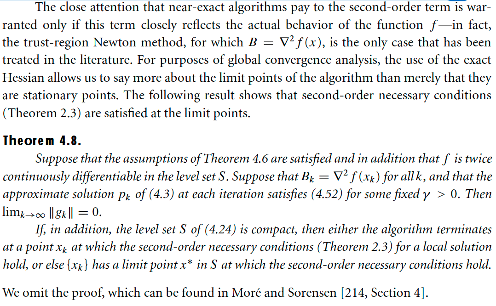</kbd>

> [!NOTE]
> Theorem (Quay lại sau)

 

