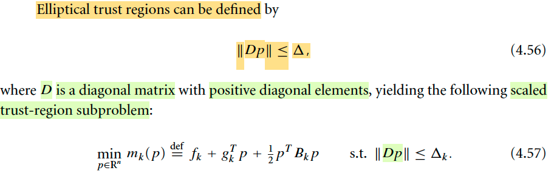
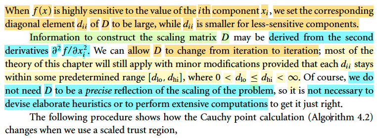
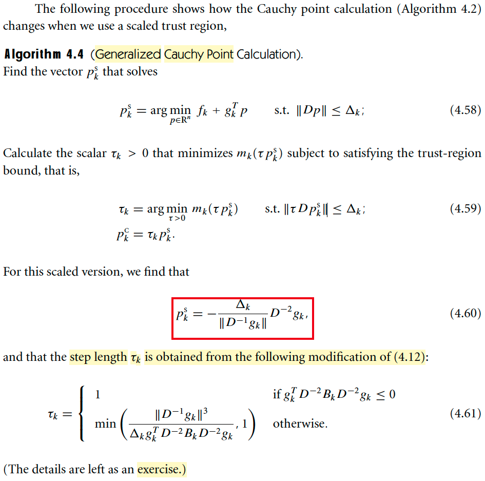
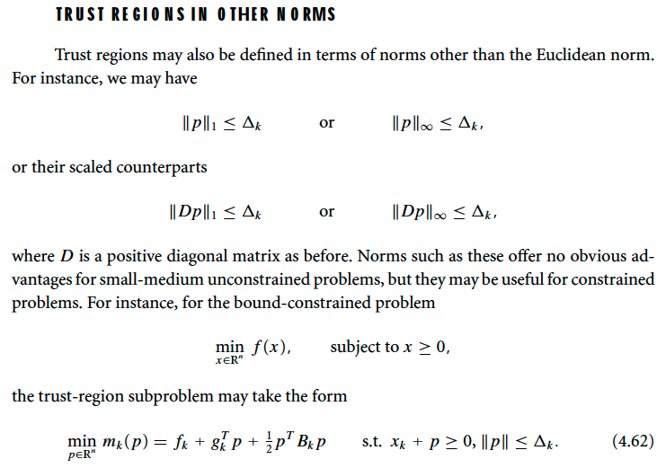
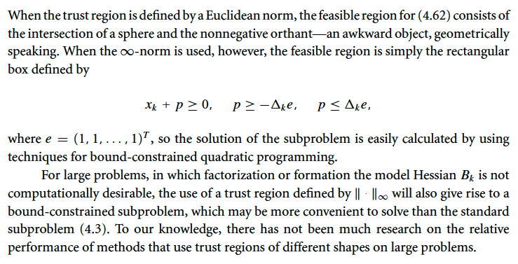

# 4.5 Trust-Region Methods: Other Enhancements

📊 **Progress:** `5` Notes | `7` Screenshots | `3` AI Reviews

---
> [!NOTE]
> 4.5 Trust-Region Methods: Other Enhancements

## 4.5 Trust-Region Method: Other Enhancements - Scaling

<kbd></kbd>

<kbd></kbd>

> [!NOTE]
> 4.5 Trust-Region Method: Other Enhancements
>
> Đại ý là vầy: Giả sử mình dùng trust region method cho bài toán mà f là hàm quadraric. Thế thì, tại x0 (điểm màu đỏ) ta sẽ thực hiện bước đi đến đến x1. Như đã biết, để làm việc này, ta sẽ giải bài toán subproblem: minimize m(p) = f0 + g0Tp + (1/2)pB0p s.t ||p|| ≤ Δ với g0 gradient và B0 (có thể chọn là Hessian, giả sử trong trường hợp này ta chọn Hessian) tại x0.
>
> Thì như đã phân tích trước đây trong phần nói về phương pháp Dogleg. Nếu trust region mở rộng vô cùng, hoặc rất lớn, như đường màu cam, thì bài toán subproblem coi như bài toán unconstrained, và solution chính là minimizer của quadratic function m. Và vì đã nói f cũng là quadratic, nên m chính là xấp xỉ hoàn hảo cho f (và thực tế chỉ là đổi biến từ x sang p), nên ta sẽ đến minimizer của f luôn. Và như đã biết, mũi tên màu cam chính là Newton step. Đây là điều rất tốt, hội tụ chỉ trong vòng một nốt nhạc.
>
> Nhưng nếu trust region thu hẹp rất nhỏ (đường tròn màu xanh) thì bài toán subproblem sẽ cho ra p là vector xanh lá, chính là negative gradient. Và ta cũng đã biết, dùng cái này thì sẽ rất tệ, hội tụ rất lâu vì ta sẽ nhảy đi nhảy lại hai bên vách đá.
>
> Và **ĐÂY CHÍNH LÀ MINH HỌA CHO THẤY CÁI DỞ CỦA VIỆC DÙNG TRUST REGION TRÒN** (Spherical)
>
> Thay vào đó, nếu ta có thể xây dựng trust region cũng là hình elliptic dẹt sao đó nó tương ứng với cái sự dẹt của level set trong bài toán này. Để rồi ở phương vuông góc với contour plot, trục elipse hẹp, và ở phương song song với contour plot thì trục ellipse rộng. Khi đó, trust region sẽ là một sự hướng dẫn tự nhiên giúp ta không đi theo hướng leo lên vách đá mà đi theo hướng dẫn về đáy của thung lũng.
>
> Đây chính là điều trong sách nói, ngay cả khi modal Hessian Bk chính xác (như trong ví dụ này ta dùng Hessian) thì mk ước lượng rất tệ hàm f khi xét theo hướng "rapid change" và ước lượng đáng tin hơn khi xét theo hướng "slowly change". Mình hiểu ý này như vầy: Trong ví dụ mà mình vẽ hình, thì m approx f tốt ở mọi hướng. Nhưng phân tích trên giúp ta hiểu cái dở của trust region tròn. 
>
> Trong một tình huống khác, f không phải quadratic, giống như trong hình 4.1 trong sách. Thì có thể thấy với cái bán kính như vậy, thì **đi theo hướng vector màu đỏ, mk xấp xỉ tốt f** (biểu hiện là contour của f cũng tương đối tương ứng contour của m). **Nhưng theo hướng vector màu xanh thì m sẽ có thể xấp xỉ rất kém vì theo hướng này f thay đổi nhanh, rất có thể khác xa hàm m**. Do đó **nếu như dùng trust region tròn, vì m ko tự tin nên buộc phải dùng bán kính nhỏ, dẫn tới hướng được chọn là hướng steepest descent → hội tụ tệ.**

> [!TIP]
> **🤖 AI Feedback** — ⚠️ Score: **88/100**
>
> Phân tích rất sâu sắc và chi tiết, đặc biệt trong việc liên hệ giữa các khái niệm và minh họa rõ ràng qua các hình vẽ. Cần làm rõ hơn sự khác biệt giữa mô hình xấp xỉ hoàn hảo cho hàm bậc hai và sự xấp xỉ kém theo hướng thay đổi nhanh cho hàm tổng quát, ngay cả khi dùng Hessian chính xác.

 

### Scaling (cont)

<kbd></kbd>

<kbd></kbd>

> [!NOTE]
> Thế thì  đại ý là ta có thể có trust region elliptical bằng cách thay constraint ||p|| ≤ Δ bằng ||Dp|| ≤ Δ. Với D là một diagonal matrix. Là sao nhỉ?
>
> Để dễ hình dung lấy ví dụ trong 2D case tức x là R^2 vector. Trong đó hàm f rất nhạy cảm theo x1 và ít hơn theo x2. 
>
> Thì tại sao ||Dp|| ≤ Δ sẽ tạo trust region hình elip thay vì hình tròn: Gọi d1, d2 là diagonal entries:
>
> Dp = (d1p1, d2p2) 
>
> ⇨ ||Dp|| ≤ Δ ⇔ ||Dp||^2 ≤ Δ^2 
>
> ⇔ (d1p1)^2 + (d2p2)^2 ≤ Δ^2
>
> ⇔ (d1/Δ)^2p1^2 + (d2/Δ)^2 p2^2 ≤ 1
>
> Đây là phương trình elips (có dạng ax^2 + by^2 ≤ c)
>
> Từ đó cho thấy. nếu ta di chuyển theo phương x1 (p2 = 0):
>
> (a) ⇔ (d1/Δ)^2p1^2 ≤ 1
>
> ⇔ p1^2 ≤ 1/(d1/Δ)^2 = (Δ/d1)^2
>
> ⇔ -Δ/d1 ≤ p1 ≤ Δ/d1
>
> Như vậy, nếu ta d1 lớn thì elips bị bóp ở phương x1 khiến p1 khi bị giới hạn này thì sẽ không thể lớn được dẫn tới hiệu quả là hạn chế đi theo phương x1 là phương khiến hàm f sensitive.
>
> Và lập luận tương tự sẽ thấy nếu d2 nhỏ, thì phạm vi cho phép của p2 là -Δ/d2 ≤ p2 ≤ Δ/d2 sẽ lớn, cho phép phạm vi theo hướng mà hàm f ít sensitive rộng hơn.
>
> Và chọn d thế nào (làm sao biết xi nào sensitive để mà cho dii đó lớn): Dùng đạo hàm cấp 2: ∂^2/∂xi^2 f
>
> Tác giả cũng cho biết là cũng không cần phải cố gắng làm quá chính xác, không cần phải theo sát sự scaling của bài toán (ý là nếu f là cái thung lũng dẹt thì ta sẽ muốn trust region cũng dẹt, nhưng không nhất thiết phải làm quá, để y chang sự dẹt của bài toán) mà chỉ cần hòm hòm để cái trust region elliptic là được rồi.
>
> Một ý nữa là phần lớn các lí thuyết của chương này sẽ đều đúng nếu ta chỉ áp dụng sự chỉnh sửa nhỏ sao cho mỗi dii vẫn nằm trong một range định trước

> [!TIP]
> **🤖 AI Feedback** — ✅ Score: **95/100**
>
> Bài làm rất xuất sắc. Sinh viên đã diễn giải rõ ràng cơ chế tạo vùng tin cậy elip bằng toán học và liên hệ chính xác với độ nhạy của hàm mục tiêu, thể hiện sự thấu hiểu sâu sắc. Tuy nhiên, có một lỗi đánh máy nhỏ ở cuối phần ghi chú (đihp[) cần được sửa chữa.

 

#### Algorithm 4.4 (Generalized Cauchy Point Calculation)

<kbd></kbd>

> [!NOTE]
> Algorithm 4.4 (Generalized Cauchy Point Calculation)
>
> Ôn lại chút về Cauchy Point: Đại khái là, ta nhớ bài toán subproblem là minimize mk(p) = fk + gkTp + (1/2)pTBkp s.t ||p|| ≤ Δ. Thì Cauchy point nằm trong bối cảnh là ta muốn p thỏa mãn điều kiện giúp giảm f một mức đủ để giúp sự hội tụ toàn cục (global convergence), và Cauchy point là một bước đi đủ tốt để làm tiêu chuẩn giúp so sánh. 
>
> Thế thì ý tưởng của Cauchy point, đó là ta coi hàm f như hàm bậc nhất, để rồi đi theo hướng dốc nhất tại điểm đang đứng, và xem thử trong phạm vi cho phép, thì bước đi là bao nhiêu xa thì giúp giảm m xuống thấp nhất. Khi đó sẽ có hai khả năng, là bước đi nằm trong phạm vi hoặc nằm ngay trên biên. Do đó ta thấy để tính Cauchy point cần hai bước:
>
> pks = argmin p ∈ R^n {fk + gkTp} s.t ||p|| ≤ Δ. thì đây chính là xấp xỉ hàm f bởi linear function: fk + gkTp (linear approx. tại xk của nó). Giải bài toán này sẽ ra pks = -gk (ý la hướng negative gradient, nhưng chiều dài sẽ là Δ) 
>
> Tất nhiên đây là bài toán ràng buộc bất đẳng thức, equivalent với minimize fk + gkTp s.t pTp - Δ^2 ≤ 0. Dùng KKT conditions:
>
> Stationary condition: Lagrangian: L(p, ν) = fk + gkTp + v(pTp - Δ^2).
>
> = vpTp + gkTp + fk - vΔ^2
>
> Tìm gradient ∇L theo phương pháp đã học trong MIT 18s096:
>
> dL = L(p+dp) - L(p) = v(p+dp)T(p+dp) + gkT(p+dp) - vpTp - gkTp
>
> = v(pTp+dpTp+pTdp+dpTdp) + gkT(p+dp) - vpTp - gkTp
>
> = vpTp+2vpTdp + gkTp + gkTdp - vpTp - gkTp
>
> = 2vpTdp + gkTdp  
>
> = (2vp + gk)Tdp  ⇨ ∇L = 2vp + gk
>
> ∇L = 0 ⇔ 2vp + gk = 0 ⇔ p = -gk/v
>
> Complenetary slackness: v(pTp - Δ^2) = 0. Vì v khác 0 nên pTp - Δ^2 = 0 ⇔ ||p|| = Δ
>
> Vậy p = - (Δ/||gk||) gk, cũng là pks.
>
> Sau đó, giải tìm τk > 0 để minimize mk(τpks) = fk + gkT(τpks) + (1/2)(τpks)TBk(τpks) (s.t ||τpks|| ≤ Δ
>
> ⇔ minimize mk(τpks) = fk + τgkTpks + (1/2)τ^2pksTBkpks s.t |τ|||pks|| ≤ Δ
>
> Đây là bài toán tối ưu hàm đơn biến bậc hai có ràng buộc. Cách giải rất đơn giản: Tìm minimizer của g(τ) = mk(τpks):
>
> g'(τ) = gkTpks + pksTBkpks × τ
>
> g'(τ) = 0 
>
> ⇔ τ = - gkTpks / pksTBkpks 
>
> = - gkT[- (Δ/||gk||) gk] / [- (Δ/||gk||) gk]TBk[- (Δ/||gk||) gk]
>
> = [(Δ/||gk||) gkTgk] / [(Δ/||gk||)^2 gkTBkgk]
>
> = [gkTgk] / [(Δ/||gk||) gkTBkgk] 
>
> = [gkTgk]||gk|| / [Δ gkTBkgk]
>
> = ||gk||^3 / (ΔgkTBkgk)
>
> → critical point τ* = ||gk||^3 / (ΔgkTBkgk)
>
> Đạo hàm cấp 2 tại critical point: g''(τ) = pksTBkpks = [- (Δ/||gk||) gk]TBk[- (Δ/||gk||) gk]
>
> = (Δ/||gk||)^2 gkTBkgk 
>
> Nếu gkTBkgk ≤ 0 ⇨ g''(τ) ≤ 0 ⇨ τ* là maximum, và τ* < 0 (do gkTBkgk ≤ 0 → ||gk||^3 / (ΔgkTBkgk) ≤ 0). Như vậy khi τ đi từ 0 → inf (nhớ ràng bài toán chỉ xét τ từ 0 đến 1, thể hiện ta đi từ xk theo hướng vector pks và xa nhất là đụng hàng rào, ứng với step size |pks| = Δ) thì hàm số giảm liên tục (cái bát parabol úp xuống và ta đang đi trên sườn bên kia của bát). Do đó, nó đạt min khi đi xa nhất có thể, chính là đụng hàng rào. Nên ở ca này, τ* = 1.
>
> Nếu gkTBkgk > 0, thì hàm đạt cực tiểu tại τ*, khi đó nếu τ* < 1, tức ||gk||^3 / (ΔgkTBkgk) < 1 thì lấy giá trị τ* = ||gk||^3 / (ΔgkTBkgk), ngược lại, có nghĩa là điểm cực tiểu nằm ngoài region → τ* = 1.
>
> Vậy nên tổng hợp lại: 
>
> τ* = 1 nếu gkTBkgk ≤ 0 và
>
> τ* = min {1, ||gk||^3 / (ΔgkTBkgk)} nếu gkTBkgk > 0
>
> ====
>
> Quay lại đây, bây giờ constraint của bài toán minimize fk + gkTp là ||Dp|| ≤ Δ, chuyển sang equivalent problem với constraint ||Dp||^2 ≤ Δ
>
> Thử xem solution sẽ là gì. Tương tự, dùng KKT conditions thôi: 
>
> Stationary condition: Lagrangian : L(p, ν) = fk + gkTp + ν(||Dp||^2 - Δ^2).
>
> = fk + gkTp + ν((Dp)T(Dp) - Δ^2)
>
> = fk + gkTp + ν(pTDTDp - Δ^2)
>
> = νpTDTDp + gkTp - νΔ^2 + fk
>
> Nhờ MIT 18s096 tìm gradient quá dễ, ∇L = 2νDTDp + gk 
>
> ∇L = 0 ⇔ 2νDTDp + gk = 0 ⇔ DTDp = -(1/2ν)gk 
>
> ⇔ p = -(1/2ν)(D^2)inv gk
>
> ⇔ p = -(1/2ν)(D^-2) gk = pks 
>
> Complenetary slackness: ν(pTDTDp - Δ^2) = 0. Vì ν khác 0 nên pTDTDp - Δ^2 = 0 
>
> ⇔ ||Dp|| = Δ 
>
> ⇔ ||D[-(1/2ν)(D^-2) gk]|| = Δ
>
> ⇔ ||D(-1/2ν)(D^-2) gk|| = Δ
>
> ⇔ |-1/2ν| ||D(D^-2) gk|| = Δ
>
> ⇔ (1/2ν) ||(D^-1)gk|| = Δ
>
> ⇔ (1/2ν) = Δ/||(D^-1)gk||
>
> Thay vào lại pks = -(Δ/||(D^-1)gk||)(D^-2) gk
>
> = -[Δ/||(D^-1)gk||] (D^-2) gk Đây chính là 4.60.
>
> Sau đó giải bài toán tìm τ* (Quay lại sau)

> [!TIP]
> **🤖 AI Feedback** — ❌ Score: **65/100**
>
> Phần lớn các bước đạo hàm cho p_k^s (phương trình 4.60) là chính xác và có chiều sâu đáng khen ngợi. Tuy nhiên, bài phân tích của bạn chưa hoàn chỉnh vì bạn đã bỏ qua hoàn toàn việc đạo hàm cho bước nhảy \tau_k (phương trình 4.61), đây là một phần cốt yếu của Thuật toán 4.4.

 

##### Trust Region In Other Norms (quay Lại Sau)

<kbd></kbd>

<kbd></kbd>

> [!NOTE]
> (QUAY LẠI SAU)

 

