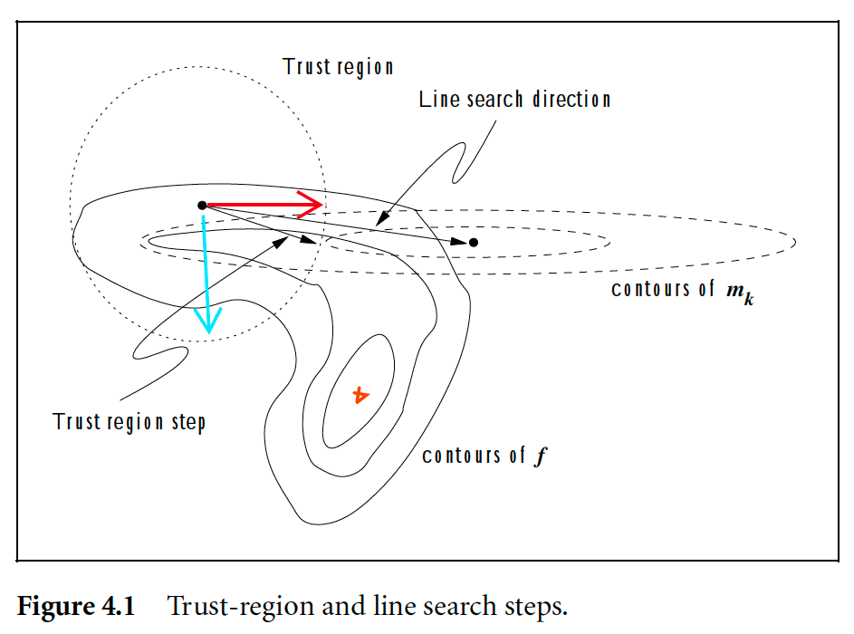
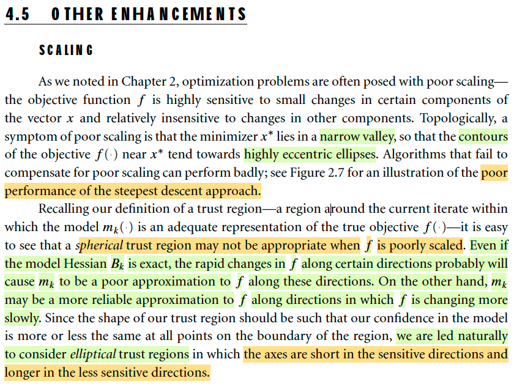

# 4.5 Trust-Region Methods: Other Enhancements

📊 **Progress:** `2` Notes | `2` Screenshots | `1` AI Reviews

---
> [!NOTE]
> 4.5 Trust-Region Methods: Other Enhancements

## 4.5 Trust-Region Method: Other Enhancements

<kbd></kbd>

<kbd></kbd>

> [!NOTE]
> 4.5 Trust-Region Method: Other Enhancements
>
> Đại ý là vầy: Giả sử mình dùng trust region method cho bài toán mà f là hàm quadraric. Thế thì, tại x0 (điểm màu đỏ) ta sẽ thực hiện bước đi đến đến x1. Như đã biết, để làm việc này, ta sẽ giải bài toán subproblem: minimize m(p) = f0 + g0Tp + (1/2)pB0p s.t ||p|| ≤ Δ với g0 gradient và B0 (có thể chọn là Hessian, giả sử trong trường hợp này ta chọn Hessian) tại x0.
>
> Thì như đã phân tích trước đây trong phần nói về phương pháp Dogleg. Nếu trust region mở rộng vô cùng, hoặc rất lớn, như đường màu cam, thì bài toán subproblem coi như bài toán unconstrained, và solution chính là minimizer của quadratic function m. Và vì đã nói f cũng là quadratic, nên m chính là xấp xỉ hoàn hảo cho f (và thực tế chỉ là đổi biến từ x sang p), nên ta sẽ đến minimizer của f luôn. Và như đã biết, mũi tên màu cam chính là Newton step. Đây là điều rất tốt, hội tụ chỉ trong vòng một nốt nhạc.
>
> Nhưng nếu trust region thu hẹp rất nhỏ (đường tròn màu xanh) thì bài toán subproblem sẽ cho ra p là vector xanh lá, chính là negative gradient. Và ta cũng đã biết, dùng cái này thì sẽ rất tệ, hội tụ rất lâu vì ta sẽ nhảy đi nhảy lại hai bên vách đá.
>
> Và **ĐÂY CHÍNH LÀ MINH HỌA CHO THẤY CÁI DỞ CỦA VIỆC DÙNG TRUST REGION TRÒN** (Spherical)
>
> Thay vào đó, nếu ta có thể xây dựng trust region cũng là hình elliptic dẹt sao đó nó tương ứng với cái sự dẹt của level set trong bài toán này. Để rồi ở phương vuông góc với contour plot, trục elipse hẹp, và ở phương song song với contour plot thì trục ellipse rộng. Khi đó, trust region sẽ là một sự hướng dẫn tự nhiên giúp ta không đi theo hướng leo lên vách đá mà đi theo hướng dẫn về đáy của thung lũng.
>
> Đây chính là điều trong sách nói, ngay cả khi modal Hessian Bk chính xác (như trong ví dụ này ta dùng Hessian) thì mk ước lượng rất tệ hàm f khi xét theo hướng "rapid change" và ước lượng đáng tin hơn khi xét theo hướng "slowly change". Mình hiểu ý này như vầy: Trong ví dụ mà mình vẽ hình, thì m approx f tốt ở mọi hướng. Nhưng phân tích trên giúp ta hiểu cái dở của trust region tròn. 
>
> Trong một tình huống khác, f không phải quadratic, giống như trong hình 4.1 trong sách. Thì có thể thấy với cái bán kính như vậy, thì **đi theo hướng vector màu đỏ, mk xấp xỉ tốt f** (biểu hiện là contour của f cũng tương đối tương ứng contour của m). **Nhưng theo hướng vector màu xanh thì m sẽ có thể xấp xỉ rất kém vì theo hướng này f thay đổi nhanh, rất có thể khác xa hàm m**. Do đó **nếu như dùng trust region tròn, vì m ko tự tin nên buộc phải dùng bán kính nhỏ, dẫn tới hướng được chọn là hướng steepest descent → hội tụ tệ.**

> [!TIP]
> **🤖 AI Feedback** — ⚠️ Score: **88/100**
>
> Phân tích rất sâu sắc và chi tiết, đặc biệt trong việc liên hệ giữa các khái niệm và minh họa rõ ràng qua các hình vẽ. Cần làm rõ hơn sự khác biệt giữa mô hình xấp xỉ hoàn hảo cho hàm bậc hai và sự xấp xỉ kém theo hướng thay đổi nhanh cho hàm tổng quát, ngay cả khi dùng Hessian chính xác.

 

