# 5.1 Linear Conjugate Gradient

📊 **Progress:** `18` Notes | `41` Screenshots | `14` AI Reviews

---

## 5.1 Linear Conjugate Gradient

<kbd></kbd>

<kbd></kbd>

<kbd></kbd>

> [!NOTE]
> Qua một phương pháp mới: Conjugate gradient method. Đại khái là tác giả nói nó có hai ưu điểm: Thứ nhất đây là một trong nhưng phương pháp tốt nhất để giải một hệ phương trình tuyến tính quy mô lớn. Và thứ hai, nó cũng có thể được điều chỉnh để giải hệ phương trình phi tuyến.
>
> Nói sơ, linear conjugate gradient được phát triển năm 1950, là các tiếp cận iterative, để giải hệ tuyến tính với ma trận hệ số xác định dương. Nó phù hợp hơn phép khử Gausse, vốn đã học ở MIT 18.06 cho những bài toán quy mô lớn.
>
> Hiệu quả của phương pháp này chủ yếu là phụ thuộc vào phân bố của trị riêng của matrix hệ số. Bằng cách transforming, còn gọi là pre-conditioning, ta có thể cải thiện sự phân bố của các trị riêng, giúp bài toán hội tụ nhanh hơn. 
>
> Nói sơ về non-linear conjugate gradient method, thì key feature của nó là nó ko đòi hỏi phải lưu trữ matrix, và nó nhanh hơn là phương pháp steepest descent.

 

### 5.1 The Linear Conjugate Gradient Method

<kbd></kbd>

> [!NOTE]
> Đại khái là, tác giả nói một điều mà mình đã học / tự nhận ra hồi còn học EE364A: Việc giải hệ f(x) = 0 có thể coi như là đang giải điều kiện cần bậc một của bài toán minimize hàm số F(x) là nguyên hàm của f: ∇F(x) = f(x) = 0. Và đây là nguyên lí của root finding Newton method: Bằng cách xấp xỉ hàm F bằng hàm bậc 2 thì ta cũng xấp xỉ hàm f là hàm bậc 1.
>
> Và giải bài toán minimize F với Newton method cũng chính là gỉai hệ f(x)=0 bằng root finding Newton method.
>
> Thế thì ở đây f(x) = Ax - b, thì nguyên hàm của nó, chính là F(x) = (1/2)xTAx - bTx, ở đây ta sẽ gọi là φ(x) ⇨ ∇φ(x) = Ax - b 
>
> Và như đã nói, cách nhìn này cho ta thấy việc giải hệ Ax = b chính là giải bài toán tối ưu hàm bậc hai F(x), là một convex optimzation problem.

> [!TIP]
> **🤖 AI Feedback** — ✅ Score: **98/100**
>
> Your analysis accurately captures the equivalence between solving Ax=b and minimizing φ(x), and correctly derives the gradient. Connecting this specific problem to the broader principle of root-finding and Newton's method demonstrates a profound understanding of the underlying mathematical concepts.

 

#### Conjugate Direction Method

<kbd></kbd>

<kbd></kbd>

> [!NOTE]
> Đầu tiên, tác giả nói đại ý là một đặc điểm rất tốt của phương pháp này là khả năng của nó trong việc tạo ra một bộ vector có tính chất gọi là conjugacy: {p0,...pn-1} được gọi là conjugate wrt matrix xác định dương A nếu như piTApj = 0 ∀i≠j.
>
> Tác giả nói cũng dễ cho thấy bộ vector conjugate cũng sẽ độc lập tuyến tính. Là sao?
>
> Giả sử có pk là vector phụ thuộc tuyến tính, ta có thể thể hiện nó bởi tổ hợp tuyến tính các vector còn lại: pk = Σi pi. Áp dụng tính chất conjugacy:
>
> pkTApj = 0 ∀k≠j
>
> ⇔ pkT(Σi pi)pj = 0 ∀k≠j
>
> ⇔ (Σi pi)TApj = 0 ∀k≠j
>
> ⇔ Σi piTApj = 0 ∀k≠j
>
> Trong cái tổng bên phải, nếu pi khác pj thì hạng tử bằng 0 rồi, nên chỉ còn pjApj.
>
> Tức là ta có pjTApj = 0, mà điều này sẽ mâu thuẫn với việc A xác định dương thì với mọi x khác 0, xTAx > 0. Do đó, đại ý là ta đã chứng minh được bộ vector conjugate cũng sẽ độc lập tuyến tính.
>
> Tiếp theo, tác giả nói về việc, ta có thể chứng minh được rằng, sử dụng bộ vector conjugate, ta có thể minimize hàm φ chỉ trong n bước. Và ta sẽ xét một phương pháp gọi là CONJUGATE DIRECTION method (không phải conjugate gradient method nhé, sự liên hệ giữa chúng sẽ nói sau). Phương pháp này đại khái là như sau:
>
> Bắt đầu với x0, và một bộ vector conjugate {p0,...pn-1}, ta sẽ generate các điểm xk:
>
> xk+1 = xk + αkpk trong đó αk là solution của bài toán tối ưu hàm một biến:
>
> minimize g(α) = φ(xk + αpk) 
>
> Để giải tìm αk, dùng điều kiện cần bậc 1 thôi: 
>
> g'(α) = 0 ⇔ d/dα φ(xk + αpk) = 0 
>
> ⇔ d/d(xk + αpk) φ(xk + αpk) . d/dα (xk + αpk) = 0
>
> ⇔ ∇φ(xk + αpk) . pk = 0 
>
> ⇔ ∇φ(xk + αpk)T pk = 0 
>
> ⇔ [(Ax - b)|x=xk + αpk]Tpk = 0
>
> ⇔ [A(xk + αpk) - b]Tpk = 0
>
> ⇔ [Axk + Aαpk - b]Tpk = 0
>
> ⇔ [rk + Aαpk]Tpk = 0 | Ở đây quên nói, ta sẽ gọi r(x) = Ax-b 
>
> ⇔ rkTpk + αpkTApk = 0
>
> ⇔ α = -rkTpk/pkTApk. Đây chính là 5.7

> [!TIP]
> **🤖 AI Feedback** — ✅ Score: **90/100**
>
> Bạn đã nắm vững các định nghĩa cốt lõi và thực hiện xuất sắc việc chứng minh công thức alpha_k một cách chi tiết và chính xác. Để nâng cao hơn nữa, hãy xem xét lại cách thiết lập giả định và các bước chứng minh tính độc lập tuyến tính của các vector liên hợp để đảm bảo tính chặt chẽ.

 

##### Theorem 5.1

<kbd></kbd>

<kbd></kbd>

> [!NOTE]
> Theorem 5.1: Nói rằng với x0 (initial point) bất kì thì chuỗi {xk} được generate bởi thuật toán 5.6 ở trên sẽ converge về solution x* của Ax = b trong nhiều nhất là n step.
>
> Chứng minh như sau: Đầu tiên, vì {pi} độc lập tuyến tính, và đủ số lượng (n) nên dĩ nhiên chúng là một basis của R^n, span {p0,..pn-1} = R^n. Nên mọi vector R^n đều là linear combination của chúng. Do đó gs nói ta có thể thể hiện x* - x0 (cũng là R^n vector) bởi:
>
> x* - x0 = σ0p0 + σ1p1 + ..σn-1 pn-1.
>
> Nhân hai vế cho pkTA ta có:
>
> pkTA(x* - x0) = pkTA(σ0p0 + σ1p1 + ..σn-1 pn-1)
>
> Xét vế phải, phân phối vô ta có tổng các pkTAσipi, vì tính conjugacy nên nếu pi khác pk, kết quả thành 0. Nên chỉ còn pkTApk, ta có pkTA(x*-x0) = σkpkTApk
>
> ⇔ σk = pkTA(x*-x0)/pkTApk (5.8)
>
> Giờ ta sẽ đi chứng minh σk TRÙNG KHỚP với step length αk của công thức 5.7. Là sao?
> ⇨ Thì khi ta chứng minh σk = αk thì cũng đã chứng minh là chuỗi {xk} tạo bởi x1 = x0 + α0p0, x2 = x1 + α1p1,...cũng chính là sẽ là đi từ x0 → x1 = x0 + σ0x0, x2 = x0 + σ0x0 + σ1x1 , ... xn = x0 + σ0p0 + σ1p1 + ...σn-1pn-1 = x0 + x* - x0 = x*! Có nghĩa là ta cũng đã chứng minh được thuật toán sẽ dẫn ta đến x* tại iteration thứ n.
>
> Về mặt hình học hiểu nôm na như sau: Như đã biết về ý nghĩa của x* - x0 = σ0p0 + σ1p1 + ..σn-1 pn-1: Đó là để đi từ x0 → x*, ta sẽ đi thep phương p0 một khoảng có độ lớn σ0, rồi từ đó đi theo phương p1 một khoảng có độ lớn σ1,... Vậy thì nếu chứng minh αk = σk thì dĩ nhiên cũng đã chứng minh chuỗi {xk} tạo bởi thuật toán cũng sẽ dẫn ta tới x* sau n bước.
>
> Quay lại đây, chuỗi {xk} tạo bởi 5.6, 5.7: xk+1 = xk + αkpk, và αk = -rkTpk/pkTApk, cụ thể sẽ là:
>
> x1 = x0 + α0p0
>
> x2 = x1 + α1p1 = x0 + α0p0 + α1p1
>
> ...
>
> xk = xk-1 + αkpk = x0 + α0p0 + α1p1 + ..αk-1pk-1
>
> Nhân hai vế cho pkTA:
>
> pkTAxk = pkTAx0 + pkTA(α0p0 + α1p1 + ..αk-1pk-1)
>
> ⇔ pkTAxk - pkTAx0 = pkTA(α0p0 + α1p1 + ..αk-1pk-1)
>
> ⇔ pkTA(xk - x0) = pkTA(α0p0 + α1p1 + ..αk-1pk-1)
>
> Vế phải, theo tính chất conjugate, dễ hiểu chỉ còn 0, ta có pkTA(xk - x0) = 0
>
> ⇔ pkTAxk = pkTAx0
>
> Từ đó cái tử số của σk = pkTA(x*-x0)/pkTApk sẽ bằng:
>
> pkTA(x* - x0) = pkTAx*- pkTAx0 = pkTAx*-pkTAxk = pkT(Ax*-Axk)
>
> = pkT(b-Axk) Và vì rk = Axk-b nên đây chính là -pkTrk
>
> Vậy σk = pkTA(x*-x0)/pkTApk = -pkTrk/pkTApk, chính là αk. Chứng minh xong

 

- **Góc nhìn hình học lí giải tính chất của conjugate direction**

<kbd></kbd>

> [!NOTE]
> Đại khái là ở đây minh họa giúp ta hiểu vì sao conjugate direction method lại giúp converge về x* trong n bước. Lấy ví dụ trong 2D, khi A là diagonal matrix, thì contour plot sẽ có dạng các hình ellipse. Và việc di chuyển từ x0 → x1, x1 → x2 theo phương pháp này chính là đi theo đường chấm chấm. Dễ thấy với 2D thì chỉ tốn 2 step, nếu 3D, sẽ tốn 3 steps,..nD sẽ tốn n steps.
>
> Thế thì vì sao khi A là diagonal thì contour plot là lại ellipse/ellipsoid?
>
> Nếu A là diagonal, A = diag(λ1,...,λn), contour của Φ(x) sẽ có dạng:
>
> Φ(x) = c (c-level set)
>
> ⇔ (1/2)xTAx - bTx = c
>
> ⇔ (1/2)xTdiag(λ1,...,λn)x - bTx = c
>
> ⇔ (1/2)xT(λ1x1, ..λnxn) - bTx = c
>
> ⇔ (1/2)λ1x1^2 + .. + (1/2)λnxn^2 - (b1x1+ .. + bnxn) = c
>
> ⇔ (1/2)λ1x1^2 + .. + (1/2)λnxn^2 - b1x1  .. - bnxn = c
>
> ⇔ (1/2)λ1x1^2 - b1x1 + .. + (1/2)λnxn^2 - bnxn = c
>
> ⇔ (λ1/2)[x1^2 - b1x1/(λ1/2)] + .. + (λn/2)[xn^2 - bnxn/(λn/2)] = c
>
> ⇔ (λ1/2)[x1^2 - 2b1x1/λ1] + .. + (λn/2)[xn^2 - 2bnxn/λn] = c
>
> ⇔ (λ1/2)[x1^2 - 2x1b1/λ1] + .. + (λn/2)[xn^2 - 2xnbn/λn] = c
>
> ⇔ (λ1/2)[x1^2 - 2x1b1/λ1 + (b1/λ1)^2 - (b1/λ1)^2] + .. + (λn/2)[xn^2 - 2xnbn/λn + (bn/λn)^2 - (bn/λn)^2] = c
>
> ⇔ (λ1/2)[x1^2 - 2x1b1/λ1 + (b1/λ1)^2] - (λ1/2)(b1/λ1)^2 + .. + (λn/2)[xn^2 - 2xnbn/λn + (bn/λn)^2] - (λn/2)(bn/λn)^2 = c
>
> ⇔ (λ1/2)[x1^2 - 2x1b1/λ1 + (b1/λ1)^2] - b1^2/2λ1 + .. + (λn/2)[xn^2 - 2xnbn/λn + (bn/λn)^2] - bn^2/2λn = c
>
> ⇔ (λ1/2)[x1^2 - 2x1b1/λ1 + (b1/λ1)^2] - b1^2/2λ1 + .. + (λn/2)[xn^2 - 2xnbn/λn + (bn/λn)^2] - bn^2/2λn = c
>
> ⇔ (λ1/2)(x1 - b1/λ1)^2 - b1^2/2λ1 + .. + (λn/2)(xn - bn/λn)^2 - bn^2/2λn = c
>
> ⇔ Σi (λi/2)(xi - bi/λi)^2 - Σi bi^2/2λi = c
>
> ⇔ Σi (λi/2)(xi - bi/λi)^2 = c + Σi bi^2/2λi
>
> Đặt vế phải là C'
>
> ⇔ Σi (λi/2)(xi - bi/λi)^2 = C'
>
> ⇔ Σi (λi/2)(xi - bi/λi)^2 / C'  = 1
>
> ⇔ Σi (xi - bi/λi)^2 / [C'/(λi/2)]  = 1
>
> ⇔ Σi (xi - bi/λi)^2 / [2C'/λi)]  = 1
>
> Đây chính là phương trình của ellipsoid với center tại (b1/λ1, ...bn/λn)
>
> Quay lại đây, có thể hiểu trong trường hợp này, bộ vector e1,...en (standard basis) chính là conjugate set của A. Thật vậy, eiTAej = eiT(0,0,...λj,..0) = 0×0 + 0×0 + ..1×0 + ..0×λj + ..0×0 = 0. Nên di chuyển theo conjugate direction chính là di chuyển theo hướng các trục:
>
> x0 đi theo hướng / phương e1 đến x1
>
> x1 đi theo hướng / phương e2 đến x2 (x*)

> [!TIP]
> **🤖 AI Feedback** — ✅ Score: **98/100**
>
> Bài phân tích rất xuất sắc, bạn không chỉ giải thích đúng ý nghĩa của hình minh họa mà còn cung cấp chứng minh toán học chi tiết, làm rõ vì sao ma trận A chéo lại dẫn đến các đường đồng mức hình elip. Để hoàn thiện hơn, bạn có thể lưu ý rằng trong hình 2D, điểm dừng x* đạt được sau x0 → x1 và x1 → x* chứ không phải x1 → x2.

 

- **Chuyển đổi A thành diagonal**

<kbd></kbd>

<kbd></kbd>

> [!NOTE]
> Hiểu chỗ này đại khái như sau: Nếu như A diagonal, thì bộ basis vector {ei} chính là conjugate set, và dùng chúng để đi từ x0 thì ta sẽ đến được x* trong nhiều nhất là n step như theorem 5.1 đã nói.
>
> Nhưng nếu A không phải diagonal, thì {ei} không phải là conjugate set, nên theorem 5.1 đương nhiên là không áp dụng, đi theo các hướng đó với thuật toán 5.6 (xk+1 = xk + αkpk) , 5.7 (αk = -rkTpk/pkTApk) không còn giúp đến đích trong nhiều nhất là n bước nữa.
>
> Vậy thì đại khái là để thuật toán hội tụ trong n bước theo theorem 5.1, ta phải tìm bộ conjugate set {pi} của A thì thuật toán mới work như theorem vừa rồi đã tuyên bố. 
>
> Nhưng ở đây, đại khái là mình hiểu việc dùng bộ {pi}, thì thật ra cũng chính là ta chuyển bài toán từ ellipse không diagonal thành diagonal. Chỉ vậy thôi.
>
> Cụ thể là ta sẽ đổi biến, đặt x^ = Sinv x với S là matrix các cột là conjugate set của A, S = [p0, ...pn-1].
>
> Vậy thì hàm Φ(x) = (1/2)xTAx - bTx trở thành
>
> Φ^(x^) = (1/2)x^T(STAS)x^ - (STb)Tx^
>
> Vậy thì, nhớ lại ở MIT 1806 ta đã học về change of basis matrix, cũng như linear transformation. Ôn lại tí:
>
> Giả sử ta có vector x đang có tọa độ theo basis v's. Thì để chuyển tọa độ của nó thành tọa độ theo basis w's thì ta sẽ lập luận như sau:
>
> Trước tiên phải nói về linear transformation: Ax là một linear tranformation, bởi nó thoả điều kiện T(αv + βu) = αT(v) + βT(u). Thế thì, ý chính cần hiểu, với một linear transformation, ta có thể thể hiện nó bởi phép biến đổi bởi một matrix A. Ví dụ, phép xoay bởi góc α, là một linear tranformation, thì sẽ có thể tìm được matrix Q để biểu diễn T(v) = Qv.
>
> Cách làm theo quy tắc như sau: Ta biến đổi (áp dụng linear transformation) lên các basis của input space. Và thể hiện kết quả theo basis của các output space. Rồi cuối cùng lấy tọa độ của chúng bỏ vào cột của matrix A. Khi đó ta sẽ có matrix A đại diện cho phép biến đổi tuyến tính. Ví dụ, ta tìm Q, đại diện cho phép xoay trong không gian R^2 một góc α.
>
> Theo rule trên, bước 1 ta biến đổi hai basis e1,e2:
>
> (1,0) trở thành (cos(α), sin(α))
>
> (0,1) trở thành (-sin(α), cos(α))
>
> Và dĩ nhiên đó cũng chính tọa độ của kết quả trong basis e's (tức là trong case này input basis = output basis, quy tắc khái quát là dành cho cả khi input basis khác output basis)
>
> Do đó, matrix Q chính là [cos(α) -sin(α); sin(α) cos(α)]
>
> Thế thì, nếu ta chọn output basis không phải là e1, e2 mà là vector khác, thì matrix sẽ khác, và trong bài giáo sư Strang đã minh họa khi ta chọn một bộ basis đặc biệt, q1,q2 thì có thể khiến Q trở thành một diagonal matrix. Và hóa ra basis đặc biệt đó cũng chính là eigenvector của Q.
>
> Thế thì, ta mới xét một phép biến đổi tuyến tính đặc biệt: Identity transformatio, T(v) = v. Tức là chả làm gì hết.
>
> Vậy thì vẫn theo quy tắc, ta sẽ biến đổi (dù chả làm gì) các input basis v's, rồi thể hiện nó bởi các output basis w's. Và ném các tọa độ vào các cột của A.
>
> Vậy thì T(v1) = v1. Tức là, kết quả biến đổi của v1 là v1. Bước 2: thể hiện kết quả này theo basis w's: v1 = α11w1 + α21w2 + ..Bước 3: Ném bộ tọa độ của v1 trong basis w's thành cột 1 của A: Cột 1 của A = [α11, α21,...] Tương tự như vậy, ta sẽ có matrix A.
>
> Thế thì ta thấy thế này, với matrix A như vậy, và bỏ các basis v's, w's thành các matrix V, W thì ta có: 
>
> v1 = α11w1 + α21w2 +.. . Chính là linear combination các vector w's bởi các hệ số là cột 1 của A: v1 = W[cột 1 của A]
>
> Tương tự, v2 = W[cột 2 của A]
>
> Và đây chính là V = WA (theo góc nhìn thứ 2 khi nhân matrix với matrix mà thầy Strang đã dạy)
>
> Từ đây, dĩ nhiên là W là matrix of basis, nó invertible, nhân hai vế cho Winv:
>
> WinvV = A ⇨ A = WinvV chính là matrix GIÚP ĐỔI TỌA ĐỘ TRONG BASIS v's SANG TỌA ĐỘ THEO BASIS w's, gọi là "change of basis" matrix.
>
> Thế thì, từ đó, nếu ta đang trong tọa độ chuẩn (standard basis e's), thì V lúc này chính là I và muốn đổi sang tọa độ basis w's: matrix đổi tọa độ sẽ là: A = WinvI = Winv
>
> Có nghĩa là nếu x là vector có tọa độ trong basis e's, thì Winvx là tọa độ của nó trong basis w's.
>
> Nhờ vậy khi quay lại bài này ta thấy rõ: x^ = Sinv x chính là chuyển tọa độ của x từ basis e's sang tọa độ của nó trong BASIS p's (p0,..pn-1). Vì đã nói S chính là matrix có các cột tạo bởi {pi} mà.
>
> Vậy thì ý tưởng ở đây là: 
>
> Khi A diagonal, ta thấy contour plot là elipsoid ngay ngắn thẳng trục để rồi đi theo các hướng bởi vector ei, theo thuật toán cho kết quả hội tụ trong n bước là vì lúc này {ei} là conjugate set
>
> Cho dù A không diagonal, để rồi {ei} không phải là conjugate set của nó. Nên đi dùng chúng sẽ không thỏa Theorem 5.1 giúp hội tụ trong n bước. Thì đơn giản là bằng cách đổi biến sang tọa độ của basis p's, là conjugate set của A, thì trong hệ tọa độ đó, cái contour plot nó là CŨNG LÀ một elipsoid ngay ngắn, thẳng trục với basis p's. Và mọi chuyện y hệt case trên.
>
> Vậy thì ý tưởng là: làm sao đó để trong hệ tọa tọa độ mới, matrix A biến thành diagonal matrix.
>
> Như trên vừa nói, nếu x là tọa độ trong basis e's, thì Sinv x sẽ là tọa độ trong basis mới
> tạo bởi các cột của S. Ngược lại nếu x^ là tọa độ trong basis đó thì x = S x^ sẽ là tọa độ trong basis e's. Thế thì ta có:
>
> Φ(x) = (1/2)xTAx - bTx khi chuyển qua tọa độ mới sẽ là:
>
> Φ(Sx^) = (1/2)(Sx^)TA(Sx^) - bTSx^
>
> = (1/2)x^TSTASx^ - bTSx^
>
> Để rồi nếu như ta muốn trong hệ trục này, basis {si} matrix Hessian trở nên diagonal, tức STAS diagonal (để giống như trong hệ trục gốc, basis {ei}, Hessian là A diagonal)
>
> Thế thì STAS diagonal đồng nghĩa các off-diagonal entries (các phần tử ngoài đường chéo) phải bằng 0. 
>
> Các phần tử ngoài đường chéo là gì?
>
> STAS = ST (AS), theo góc nhìn thứ 2 khi nhân matrix, = ST [As1, As2,...Asn]
>
> Thế thì matrix này, đường chéo của nó sẽ là s1TAs1, s2TAs2,...snTAsn
>
> Còn ngòai đường chéo sẽ là siTAsj với i ≠ j.
>
> Như vậy, muốn STAS là diagonal matrix thì ta sẽ phải có siTAsj = 9 với i ≠ j
>
> Do đó, {si} phải là một conjugate set của A.
>
> Và lúc này, ta sẽ hiểu rằng, trong hệ tọa độ mới, theo basis {si} = {pi} = {p0,...pn-1} thì thuật toán cũng làm cái việc y như trong trường hợp A diagonal: Tức là nó cũng sẽ chỉ mất n bước để đi đến x* mà ở mỗi bước nó sẽ dùng hướng các vector của basis.
>
> Do đó thầy Nocedal mới nói ở đây rằng: "ith coordinate direction in x^-space corresponds to th direction pi in x-space" Ý là, trong hệ tọa độ basis p's thì di chuyển theo hướng p cũng chính là tương ứng với di chuyển theo hướng e's trong hệ tọa độ basis e's.
>
> Nên coordinate search strategy sẽ apply Φ^ sẽ tương đương với conjugate direction algorithm. Do đó, theorem 5.1 nói rằng, nó sẽ converge trong n step.

> [!TIP]
> **🤖 AI Feedback** — ✅ Score: **95/100**
>
> Bài làm rất xuất sắc, thể hiện sự hiểu biết sâu sắc về đại số tuyến tính cơ bản và cách áp dụng vào giải thích thuật toán. Mặc dù phần giải thích về đổi cơ sở khá dài, nhưng nó hoàn toàn chính xác và củng cố vững chắc cho lập luận chính.

 

- **Tối ưu hóa tọa độ Hessian chéo**

<kbd></kbd>

> [!NOTE]
> Đại ý là thầy nói rằng, nhìn vào cái hình 5.1 ta có thể dễ nhận ra và hiểu ý sau đây: Khi Hessian diagonal thì cứ sau mỗi một step (ví dụ, từ x0 → x1) thì thật ra ta ĐÃ TÌM THẤY THÊM MỘT TỌA ĐỘ NỮA CỦA x* RỒI. Ta có thể hoàn toàn đồng tình với ý này. Trong hình 5.1, có hai tọa độ. Thì sau step thứ nhất, thì mình đã có x1_1 chính là x*_1. Và sau step thứ 2, x2_2 chính là x*_2. 
>
> Do đó, sau 1 step, thì hàm quadratic đã được minimize trên / over trục x1. Nói rõ ý này:
>
> Có nghĩa là ta sau bước 1 ta đã giải bài toán minimize over {x: x_1 ∈ R, x_2 fix} Φ(x). Và cái này cũng tương đương minimize over x ∈ R^2 Φ(x0 + t × e1).
>
> Thì đây chính là minimize quadratic Φ ON THE SUBSPACE SPANED BY e1.
>
> Vậy thì khái quát lên cho n-D case, thì mình cũng có thể hiểu là sau k step, ta quả thật là đã minimize hàm quadratic Φ on the subspace spanned by e1,e2,...ek.
>
> Trước khi vào theorem 5.2. Ta có:
>
> 5.4: rk = Axk - b, ⇨ rk+1 = Axk+1 - b
>
> ⇨ rk+1 - rk = Axk+1 - Axk - b + b
>
> ⇔ rk+1 - rk = A(xk+1 - xk) 
>
> Dùng xk+1 = xk + αkpk ⇔xk+1 - xk = αkpk
>
> ..⇔ rk+1 - rk = Aαkpk = αkApk (5.10)

> [!TIP]
> **🤖 AI Feedback** — ✅ Score: **98/100**
>
> Bài làm giải thích rất chính xác tính chất của ma trận Hessian chéo và sự tối ưu hóa trên không gian con, thể hiện sự hiểu sâu sắc. Việc tự tay dẫn dắt công thức (5.10) cũng cho thấy bạn đã nắm vững kiến thức và không chỉ đọc mà còn hiểu rõ từng bước; bạn chỉ cần chú ý đặt ký hiệu công thức ở dạng hoàn chỉnh để khớp hoàn toàn với văn bản gốc.

 

- **Vài suy nghĩ về bản chất của Conjugate Gradient method**

<kbd></kbd>

<kbd>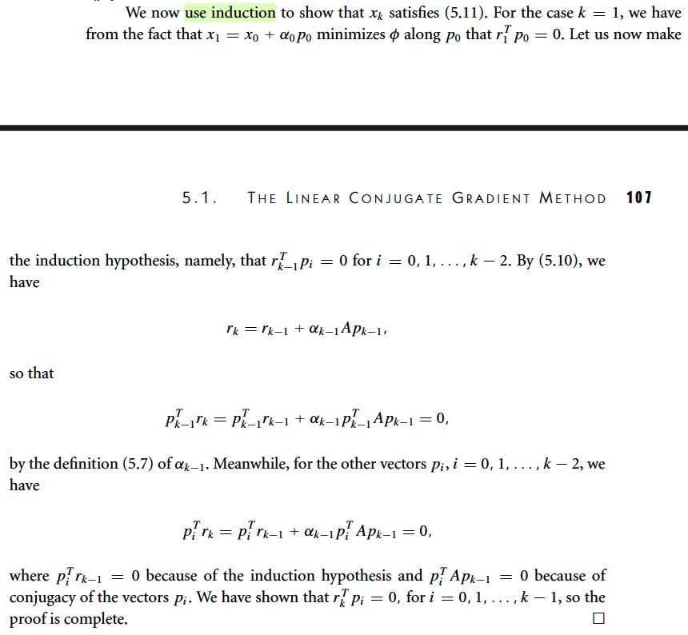</kbd>

> [!NOTE]
> Đại ý theorem này nói rằng cho điểm khởi đầu x0 bất kì. Và chuỗi {xk} sẽ được tạo bởi conjugate direction algorithm (5.6), (5.7). Thì khi đó: 
>
> rkTpi = 0 với i = 0,1,...k-1
>
> Và xk sẽ là minimizer của φ(x) = (1/2)xTAx - bTx over the set {x | x = x0 + span{p0,...pk-1}}.
>
> Trước khi đi vào chứng minh, ta hiểu cái theorem này nói gì vậy?
>
> Đầu tiên, nhớ lại conjugate direction algorithm cũng như các tính chất của nó, nói cách khác, ôn lại chút xíu bối cảnh của ta: Đó là chương này bắt đầu với việc nói về bài toán giải hệ phương trình tuyến tính Ax = b ⇔ Ax - b = 0. Thế thì, tìm nghiệm của hệ này cũng chính là, tương đương với việc tìm minimizer của hàm quadratic Φ(x) = (1/2)xTAx - bTx. Vì điều kiện cần bậc một chính là ∇Φ(x) = 0 ⇔ Ax - b = 0.
>
> Và từ đó, người ta mới giới thiệu một cách tiếp cận iterative để giải Ax = b. Bắt đầu với x0. Ta sẽ generate chuỗi {xk}: xk+1 = xk + αkpk. Với {p0,p1,...pn-1} là conjugate set của A. Và theorem 5.1 đã chứng minh rằng, trong nhiều nhất là n step thì {xk} sẽ converge về x* là true solution của Ax = b.
>
> Rồi, vậy thì đặt rk = Axk - b (r là stand for residual, ý là "phần còn thiếu tại step k") thì theorem này nói rằng: 
>
> rkTpi = 0 với mọi pi = 0,1,..,k-1.
>
> Suy nghĩ chút: Cái này có vẻ rất dễ có liên quan đến least square.
>
> Nếu rkTpi = 0 với mọi pi=0,1...k-1. Thì có nghĩa là rk vuông góc với span{p0,...,pk-1}.
>
> Nhớ lại least square: Lập luận thế này: ta muốn giải Ax = b, chính là muốn tìm linear combination các cột của A để tạo ra b. Từ đó nếu C(A) không chứa b, thì nhiều nhất là ta chỉ tìm được một linear combination của A's columns để tạo ra điểm gần nhất với b: chính là hình chiếu của b lên C(A): Để rồi, residual e = b - Ax^ sẽ vuông góc với C(A) ⇨ thuộc left nullspace N(AT) ⇨ ATe = 0 ⇔ AT(b - Ax^) = 0 ⇔ ATb = ATAx^, chính là normal equation.
>
> Thử lập luận thế này: Mục tiêu là di chuyển x trên x0 + span{p0}, sao cho minimize Φ(x) = (1/2)xTAx - bTx. Để cho đơn giản ta cho x0 = 0.
>
> Thì nếu được minimizer của Φ(x), tức x*, là solution của Ax = b, nếu x* không nằm trong span{p0}, nên cùng lắm là ta chỉ đến được hình chiếu của x* lên span{p0}, gọi đó là αp0. Ta có residual (x* - αp0) vuông góc với p0:
>
> (x* - αp0)Tp0 = 0 (i)
>
> ⇔ x*Tp0 - αp0Tp0 = 0
>
> ⇔ x*Tp0 = αp0Tp0 
>
> ⇔ x*Tp0/p0Tp0 = α 
>
> Hay α = x*Tp0 / p0Tp0. Vấn đề là, ta đâu có biết x* là gì. (iii)
>
> Để giải quyết, ta làm cách khác: **Chuyển tọa độ sang hệ basis a's** (là cột của A^-1/2), khi x di chuyển trong span {p0}: 
>
> Gọi x = αp0 là hình chiếu của x* lên span{p0}, đang có tọa độ trong basis e's
>
> Thì tọa độ của nó trong basis a's sẽ là:
>
> x^ = (A^1/2)inv x = (A^1/2)inv αp0
>
> Tọa độ của x* trong basis a's: x^* = (A^-1/2)inv x* = (A^1/2)x* 
>
> ⇔ x* = (A^1/2) x*^
>
> và p0^ là tọa độ của p0 trong basis a's: 
>
> p0^ = (A^-1/2)inv p0 
>
> ⇔ p0 = (A^1/2) p0^
>
> ⇨ Residual trong basis a's: x^* - αp^0
>
> Và thiết lập **phương trình residual vuông góc với subspace trong basis a's**: 
>
> (x^* - αp^0)Tp^0 = 0 (ii)
>
> Dừng lại đây một chút, nhớ lại phương trình (i): (x* - αp0)Tp0 = 0. Thì đây là phương trình giúp tìm hình chiếu của x* lên span{p0} trong tọa độ chuẩn (basis e's). 
>
> Còn (ii) là giúp tìm hình chiếu của x*^ lên span{p^0} trong tọa độ basis a's. 
>
> Kết quả sẽ có thể ra một điểm khác. Hiểu nôm na thế này: Giả sử ta có hai vector u = (1,1) v = (1,2). **Trong hệ tọa độ basis e's, dĩ nhiên chúng KHÔNG VUÔNG GÓC** vì 1 × 1 + 1 × 2 khác 0. **Nhưng khi chuyển về tọa độ basis là u, v** (dùng change of basis) thì tọa độ của u trong basis u, v sẽ là (1,0) và của v sẽ là (0,1) ⇨ **TRONG HỆ TỌA ĐỘ ĐÓ U VUÔNG GÓC V**, dù ở tọa độ basis e's chúng hợp nhau góc nhọn. 
>
> Thì câu chuyện cũng tương tự. Trong basis a's, ta tìm hình chiếu của x*^ lên span{p0^}, thì cái điểm đó, hay cái đường chiếu đó, **nó vuông góc với p0 trong hệ basis a's nhưng xéo xẹo nếu nhìn trong basis e's**. Nhưng ta sẽ thấy có những lí do để làm vậy.
>
> Tiếp tục từ (ii):
>
> (x^* - αp^0)Tp^0 = 0
>
> ⇔ x^*Tp^0 - αp^0Tp^0 = 0
>
> ⇔ x^*Tp^0 = αp^0Tp^0
>
> ⇔ x^*Tp^0 / p^0Tp^0 = α
>
> ⇔ α = x^*Tp^0 / p^0Tp^0
>
> Thay x^* = (A^-1/2)inv x* = Bx* (đặt B = (A^-1/2)inv cho gọn)
>
> p^0 = (A^-1/2)inv p0 = Bp0 
>
> ⇔  α = (Bx*)TBp0 / (Bp0)TBp0
>
> ⇔  α = x*TBTBp0 / p0TBTBp0
>
> ⇔  α = x*TB^2p0 / p0TB^2p0
>
> ⇔ **α = x*TAp0 / p0TAp0**
>
> Tới đây, từ Ax* = b ⇔ x*TAT = bT ⇔ x*TA = bT
>
> ..⇔ α = bTp0 / p0TAp0
>
> Thì **đây chính là công thức của conjugate gradient**, vì trong thuật toán 5.1
>
> αk := -rkTpk / pkTApk
>
> ⇨ α0 := -r0Tp0 / p0TAp0
>
> = -(Ax0 - b)Tp0 / p0TAp0
>
> = -(0 - b)Tp0 / p0TAp0  | đang giả sử xuất phát từ x0 = 0 
>
> = bTp0 / p0TAp0
>
> Như vậy mình hiểu thuật toán CG có bản chất là: 
>
> Từ x0 = 0, đi theo hướng p0 sao cho tới gần x* nhất để phần dư vuông góc với p0. Nhưng gần là theo basis a's, để vuông góc cũng là theo basis A, chứ không phải là basis e's. Thế thì nghĩ thêm một chút, trong basis e's, vì sao để tìm điểm gần nhất thì ta tìm điểm mà residual vuông góc với p0: Thì thật ra ta đang giải bài toán gì? → Chính là bài toán minimize distance: ||x* - αp0||, cũng tương đương minimize ||x* - αp0||^2 = (x* - αp0)T(x* - αp0). Mở ngoặc ra gom lại thì đây là hàm quadratic theo α và dùng calculus để giải thì cũng ra α trên công thức (iii) (ở trên khi tìm α từ lập luận residual vuông góc với basis p0 thì là dùng hình học): 
>
> g(α) = (x* - αp0)T(x* - αp0) = (x*T - αp0T)(x* - αp0) = x*Tx* - αp0Tx* - x*Tαp0 + αp0Tαp0 = ||p0||^2 α^2 - 2 p0Tx* α + ||x*||^2
>
> Giải tìm minimizer bằng điều kiện cần bậc 1: g'(α) = 0 
>
> ⇔ 2||p0||^2 α - 2 p0Tx* = 0
>
> ⇔ ||p0||^2 α = p0Tx* 
>
> ⇔ α = p0Tx* / ||p0||^2
>
> ⇔ α = p0Tx* / p0Tp0 
>
> Tới đây có thể thấy ta gặp lại công thức (iii), và again, đi vào ngõ cụt vì ta không biết x*.
>
> Rồi sau đó, ta sẽ dùng điều kiện vuông góc nhưng trong tọa độ basis a's. Thì ở đây mình sẽ chuyển bài toán về tọa độ basis a's: 
>
> Và trong tọa độ basis a's ta sẽ đi minimize distance, **TÍNH THEO BASIS a's**:
>
> Tức là minimize hàm h(α) = ||x^* - α p^0||^2 
>
> (Chỗ này chú ý nhé, lẽ dĩ nhiên với việc đã chuyển sang tọa độ basis a's thì distance cũng phải là trong basis a's chứ)
>
> Thay x^* = (A^-1/2)inv x* = (A^1/2)x* = B x*, 
>
> Thay p^0 = (A^-1/2)inv p0 = (A^1/2) p0 = Bp0 
>
> ⇨ h(α) = ||Bx* - α Bp0||^2 
>
> = (Bx* - α Bp0)T(Bx* - α Bp0)
>
> = [B(x* - αp0)]TB(x* - α p0)
>
> = (x* - αp0)TBTB(x* - α p0)
>
> = (x* - αp0)T(A^1/2)T(A^1/2)(x* - α p0)
>
> = (x* - αp0)TA(x* - αp0)
>
> VÀ CÁI NÀY ĐƯỢC ĐỊNH NGHĨA LÀ NORM-A CỦA VECTOR x* - αp0
>
> Tất nhiên là tương tự, lấy đạo hàm và cho bằng 0 ta sẽ giải ra α. NHƯNG Ý CHÍNH Ở ĐÂY ĐÓ LÀ: 
>
> **HÀNH ĐỘNG CHUYỂN TỌA ĐỘ VỀ BASIS a's VÀ MINIMIZE DISTANCE TRONG BASIS a's CŨNG CHÍNH LÀ HÀNH ĐỘNG CHUYỂN VIỆC MINIMIZE DISTANCE THEO NORM L2 THÔNG THƯỜNG SANG A-NORM** 
>
> Giải tiếp: g'(α) = 0
>
> g(α) = (x* - αp0)TA(x* - αp0) = (x*TA - αp0TA)(x* - αp0) = x*TAx* - αp0TAx* - x*TAαp0 + αp0TAαp0 = x*TAx* - 2p0TAx* α + α^2 p0TAp0
>
> g'(α) = 0 ⇔ 2p0TAp0 α - 2p0TAx* = 0
>
> ⇔ α = p0TAx* / p0TAp0 
>
> ⇔ α = p0Tb / p0TAp0 y như hồi nãy, mấu chốt là ta có Ax*, nên biến nó thành b là cái đã biết, thay vì chỉ có mỗi x*, là cái không biết → ngõ cụt.
>
> **TÓM LẠI, NHỜ VẬY TA HIỂU SÂU HƠN, BẢN CHẤT CỦA THUẬT TOÁN CG: CHỈ LÀ GIẢI BÀI TOÁN TÌM HÌNH CHIẾU CỦA x* LÊN SUBSPACE x0 + span{p0,..pk}, CŨNG LÀ TÌM CÁCH ĐẾN GẦN x* NHẤT KHI DI CHUYỂN TRONG x0 + span{p0,..pk}, TỨC MINIMIZE DISTANCE NHƯNG LÀM TRONG TỌA ĐỘ BASIS a's, CŨNG CHÍNH LÀ DÙNG NORM-A ĐỂ ĐO DISTANCE**

> [!TIP]
> **🤖 AI Feedback** — ✅ Score: **95/100**
>
> Điểm mạnh của bạn là sự hiểu biết sâu sắc về bản chất của thuật toán Conjugate Gradient, đặc biệt là vai trò của A-norm và phép chiếu trong không gian con. Bạn đã giải thích rất rõ ràng lý do tại sao phương pháp này lại hiệu quả, vượt xa việc chỉ tóm tắt định lý.

 

- **Một lập luận khác, sẽ cho thuật toán khác**
> [!NOTE]
> Một lập luận khác, sẽ cho thuật toán khác:
>
> x1 = x0 + α0p0, để rồi r1 = Ax1 - b. Đây chính là bước minimize hàm Φ over / trên subspace span {p0}. 
>
> Điều này mình đoán giống như mình chỉ bị ràng buộc chỉ được lấy x từ một 1D subspace là span {p0} để tương ứng với x, ta có linear combination các cột của A: Ax, và mục đích là: muốn đến được b. 
>
> Thế thì, vì non-zero vector x belong rowspace của A, C(AT) sẽ được map với non-zero vector Ax ∈ columnspace C(A), nên khi x bị hạn chế chỉ di chuyển trong không gian con 1D span {p0} thì Ax cũng sẽ bị ràng buộc trong một 1D subspace. Và ta muốn đến được b. Nhưng giả sử b không nằm trong subspace này, thì điều tốt nhất có thể làm chỉ là tới gần b nhất có thể: tức là hình chiếu của b lên subspace này. Vậy subspace này, có basis là gì?
>
> x bị  restrict trong span {p0} ⇨ x = αp0, dĩ nhiên basis của subspace này chính là p0.
> Khi đó Ax = Aαp0 = αAp0, khi α thay đổi từ 0 đến α ta sẽ di chuyển từ 0 đến αAp0, tức là theo hướng vector αAp0. Từ đó có thể thấy basis của subspace này là Ap0.
>
> Vậy thử tìm α khiến αAp0 là hình chiếu của b lên span {Ap0}
>
> Ta có nếu αAp0 là hình chiếu thì phần dư sẽ là b - αAp0 và nó sẽ vuông góc với subspace ⇨ (b - αAp0)T(Ap0) = 0
>
> ⇔ [bT - (αAp0)T](Ap0) = 0
>
> ⇔ [bT - αp0TAT]Ap0 = 0
>
> ⇔ bTAp0 - αp0TATAp0 = 0
>
> ⇔ bTAp0 = αp0TATAp0
>
> ⇔ bTAp0 / p0TATAp0 = α
>
> Với việc A đối xứng (xác định dương) nên AT = A ⇨ ATA = A^2
>
> ⇨ α = bTAp0 / p0A^2p0.
>
> (Đây chính là một công thức của một thuật toán khác)

 

- **Theorem 5.2 (Expanding Subspace Minimization)**

<kbd>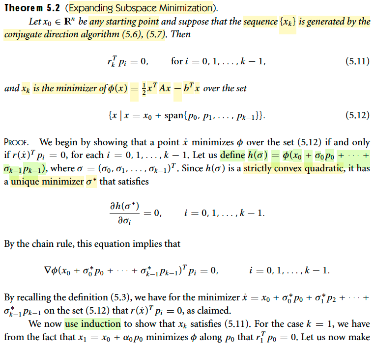</kbd>

<kbd>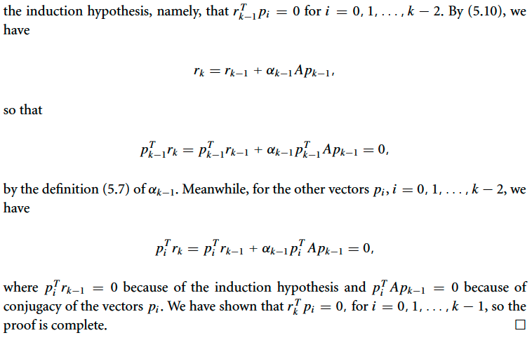</kbd>

> [!NOTE]
> Theorem này nói đại ý rằng: Bắt đầu từ x0 và ta dùng một thuật toán 5.6, 5.7 để tạo ra chuỗi {xk}. Tức là: αk = -rkTpk / (pkTApk) và xk+1 = xk + αkpk. Thì khi đó chuỗi này sẽ có tính chất sau:
>
> r(x1)Tp0 = 0
>
> r(x2)Tp0 = 0, r2Tp1 = 0
>
> r(x3)Tp0 = 0, r3Tp1 = 0, r3Tp2 = 0
> ....
>
> r(xk)Tpi = 0 ∀i = 0,1,...
>
> r(x) = Ax - b
>
> Và điều đó cũng đồng nghĩa là:
>
> x1 minimize φ(x) over the set {x: x = x0 + span{p0}}
>
> x2 minimize φ(x) over the set {x: x = x0 + span{p0, p1}}
>
> ...
>
> xk minimize φ(x) over the set {x: x =  x0 + span{p0, p1,...pk-1}}
>
> Cách chứng minh đại ý là: 
>
> Đầu tiên ta chứng minh điều kiện **cần và đủ** để x' là **minimizer của φ(x) over set {x: x = x0 + span{p0,...pk-1}} là r(x')Tpi = 0 với mọi i**. 
>
> Lập luận sẽ là xét hàm φ(x) restricted on set {x: x = x0 + span{p0,...pk-1}}, có nghĩa là hàm h(σ) = φ(x0 + σ0p0 + σ1p1 + ..σk-1pk-1), với σ = (σ0, ...σk-1)T
>
> Thì đây là convex function theo dạng convex (φ) composition with affine x0 + σ0p0 + σ1p1 + ..σk-1pk-1, nên điều kiện optimality cần và đủ là gradient h'(σ) = 0, triển khai ra ta sẽ có vector gradient = 0 đồng nghĩa r(x)Tpi = 0 với i = 0,1..,k-1.
>
> Vấn đề là, ta chỉ mới chứng minh rằng nếu mà có thằng x' thỏa r(x')Tpi = 0 ∀i = 0,1,...,k-1 thì nó sẽ là minimizer của φ(x) over subset {x0 + span{p0,...,pk-1}}. 
>
> Trong khi đó cái cần chứng minh là chuỗi {xk} sẽ đều thỏa cái này cơ.
>
> Do đó tiếp theo ta sẽ chứng minh chuỗi {xk} tạo bởi quy trình trên sẽ thỏa r(x')Tpi = 0 ∀i = 0,1,...,k-1. Và vì đây là chứng minh mọi item trong chuỗi đều thỏa, nên ta sẽ dùng phương pháp quy nạp (induction).
>
> Với phương pháp quy nạp.
>
> Đầu tiên ta chứng minh nó đúng với k = 1.
>
> Sau đó giả sử nó đúng với k-1 (đây gọi là induction hypothesis, gỉa thuyết quy nạp), thì ta sẽ chứng minh nó cũng đúng với k. Khi đó là chứng minh xong.
>
> Thế thì với k = 1, x1 = x0 + α0p0 thì liệu r(x1)Tp0 có bằng 0?
>
> Để trả lời, ta nhớ lại thuật toán 5.7, 5.8 là từ đâu ra.Đó là xuất phát từ ý tưởng của conjugate direction method: Cho bộ conjugate set {p0,...pn-1} của matrix A. Thì
> αk chính là one-dimensional minimizer của Φ along xk + αpk. Nói dễ hiểu, ta đặt ra bài toán minimize hàm đơn biến g(α) define bởi Φ giới hạn theo hướng pk: g(α) = Φ(xk + αpk), thì solution của nó sẽ là 5.7.
>
> Như vậy thì dĩ nhiên với k=1, g'(α)|α=α0 = 0 
>
> ⇔ d/dα φ(x0 + αp0) = 0 
>
> ⇔ d/d(x0 + αp0) φ(x0 + αp0) . d/dα (x0 + αp0) = 0 
>
> ⇔ ∇φ(x0 + αp0) . p0 = 0 
>
> ⇔ ∇φ(x0 + αp0)Tp0 = 0 
>
> ⇔ [(ATx - b)|x=x0+αp0]Tp0 = 0
>
> ⇔ [(ATx - b)|x=x1]Tp0 = 0 
>
> ⇔ (ATx1 - b)Tp0 = 0 
>
> ⇔ (Ax1 - b)Tp0 = 0 
>
> ⇔ r(x1)Tp0 = 0 ⇨ Như vậy k = 1 đúng: xk thỏa r(xk)Tpi = 0 ∀i = 0,..k-1
>
> Tiếp theo, như đã bàn, ta sẽ giả sử nó cũng đúng với xk-1: Tức là ta có 
>
> r(xk-1)Tpi = 0, hay rk-1Tpi = 0 ∀i = 0,..k-2 (a)
>
> Ta sẽ chứng minh nó đúng với xk
>
> Thế thì ta dùng 5.10 đã chứng minh ở note trước: rk+1 = rk + αkApk 
>
> ⇨ rk = rk-1 + αk-1Apk-1 
>
> Do đó xét piTrk i = 0,1,...k-1
>
> thay rk = rk-1 + αk-1Apk-1
>
> piTrk = piT(rk-1 + αk-1Apk-1)
>
> = piTrk-1 + piTαk-1Apk-1
>
> Hạng tử đầu piTrk-1 = rk-1Tpi = r(xk-1)Tpi = 0 với mọi i = 0,...k-2 do (a)
>
> Hạng tử sau piTαk-1Apk-1 = 0 với mọi i = 0,...k-2 do {p0,...pn-1} là conjugate set của A.
>
> Vậy piTrk = 0 với mọi i = 0,...k-1 
>
> ⇨ Kết luận với k, xk cũng thỏa r(xk)Tpi với mọi i = 0,...k-1 
>
> ⇨ Chứng minh xong rằng mọi xk trong chuỗi {xk} đều thỏa điều kiện này và như vậy xk sẽ là minimizer của φ over set {x0 + span{p0,..pk-1}}

> [!TIP]
> **🤖 AI Feedback** — ✅ Score: **98/100**
>
> Ghi chú của bạn giải thích rất chi tiết và chính xác định lý, đặc biệt làm rõ cách xử lý trường hợp i = k-1 trong bước quy nạp mà văn bản gốc chỉ ngụ ý, thể hiện sự hiểu biết sâu sắc. Để hoàn thiện hơn, bạn có thể đảm bảo sự nhất quán hoàn toàn trong ký hiệu r(x) và rk trên toàn bộ ghi chú.

 

- **Chứng minh eigenvector conjugate + ôn lại Gram-Smidth**

<kbd>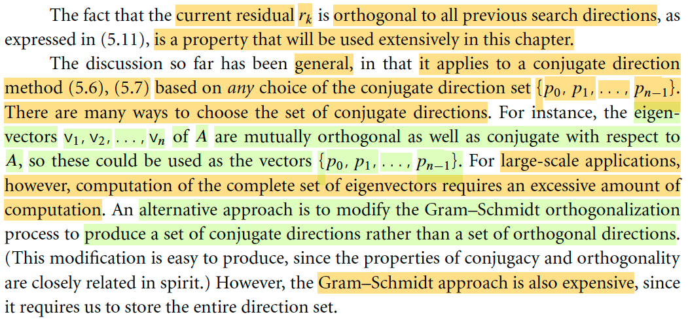</kbd>

> [!NOTE]
> Đại ý nói là thuật toán conjugate direction đòi hỏi ta có một bộ conjugate vector. Và có nhiều cách để tạo ra một bộ như vậy. Ví dụ với A xác định dương thì eigenvectors cũng là conjugate set. Nhưng có điều tìm ra bộ eigenvector thì rất tốn kém với bài toán quy mô lớn. Một đề xuất khác là có thể dùng thuật toán Gram-Smidth. Tuy nhiên, cũng tốn kém nốt. Nói chung là sắp tới sẽ nói giải pháp.
>
> Dừng ở đây mình thử trả lời xem vì sao với A ≻ thì eigenvector lại là conjugate set?
>
> Là vì với A đối xứng thì ta có thể có bộ eigenvector orthonormal, để tách A thành Q Λ QT
>
> với A ≻ 0 thì đường chéo của Λ đều dương.
>
> Vậy thì: vì sao qiTAqj = 0 nếu i ≠ j?
>
> qiTAqj = qiTQ Λ QTqj 
>
> QTqj chính là gì? ⇨ chính là ej, vì theo góc nhìn thứ nhất nhân matrix với vector, thì vector phần tử thứ i của vector kết quả là dot product của hàng i của Q (là qi) và vector qj. Mà Q orthogonal nên nếu i khác j thì chúng sẽ vuông góc → dot product = 0. Nên chỉ có row j (cũng chính là qj) dot product với qj là khác 0, mà cái này cụ thể thì là bằng 1 (vì ra ||qj||^2 = 1)
>
> Còn qiTQ = (QTqi)T, tương tự, chính là eiT
>
> Vậy ta có eiT Λ ej = eiT (0,..λj,..0) = 0 × 0 + ..1 × λi + ..+ 0 × λj +..0 ×0,
>
> Với i khác j thì cái này = 0 là cái chắc.
>
> Vậy rõ ràng {qi}, các cột của Q, các eigenvector của A chính là một conjugate set.
>
> Nhưng có thể chứng minh nhanh hơn nhiều:
>
> qiTAqj = qiT λiqj (vì Aqj = λiqj với λj và qj là trị riêng, vector riêng)
>
> = λi qiTqj (scalar move tùy ý)
>
> = λi × 0 (do Q orthogonal)
>
> = 0. 
>
> Trong sách cũng nhắc đến Gram Smidth: Sẵn ôn lại nhanh, nhờ gs Strang của MiT18.06 nó rất dễ hiểu:
>
> Ta có một bộ basis a1,...an và muốn tìm một bộ orthogonal basis q1,...qn.
>
> Cách làm như sau:
>
> Cho q1 là a1, normalize để có unit norm: q1 = a1/||a1||
>
> q2 được tạo ra như sau: Lấy a2 chiếu lên span{a1} (cũng là span{q1}) và lấy phần dư, đem normalize để thành q2. Khi đó q2 sẽ orthogonal span{q1}. 
>
> Gọi α1 q1  là hình chiếu của a2 lên span{q1}: residual sẽ vuông góc với span{q1}:
>
> (a2 - α1q1)Tq1 = 0 ⇔ a2Tq1 - (α1q1)Tq1 = 0 ⇔ a2Tq1 - α1q1Tq1 = 0 ⇔ a2Tq1 = α1q1Tq1
>
> ⇔ a2Tq1/q1Tq1 = α1
>
> ⇨ q2 = a2 - a2Tq1/(q1Tq1) × q1 = a2 - (a2Tq1) q1
>
> Normalize: q2 = q2 / ||q2||
>
> q3 được tạo như sau: Lấy a3 chiếu lên span{q1,q2} và lấy phần dư, đem normalize
> Đây sẽ là bài toán project lên 2D subspace 
>
> Bỏ gọi A là matrix có các cột là q1,q2: thì hình chiếu a3 lên C(A): Ax, phần dư vuông góc với với C(A) → nằm trong left null space N(AT): AT(a3 - Ax) = 0 ⇔ ATa3 = ATAx
>
> ⇔ x = (ATA)invATa3 ⇨ q3 = a3 - A (ATA)invATa3 
>
> Và vì q1,q2 orthogonal, nên ATA = I ⇨ q3 = a3 - AATa3
>
> Normalize q3.
>
> Cứ thế.

> [!TIP]
> **🤖 AI Feedback** — ✅ Score: **98/100**
>
> Bạn đã nắm bắt rất chính xác các ý chính từ văn bản và thể hiện sự hiểu biết sâu sắc qua việc tự giải thích các khái niệm liên quan. Để hoàn hảo hơn, hãy luôn đảm bảo mọi thông tin suy luận đều được gắn kết rõ ràng với nội dung gốc nếu có thể, hoặc chỉ ra đó là kiến thức bổ sung của bạn.

 

- **Basic properties of conjugate gradient method**

<kbd>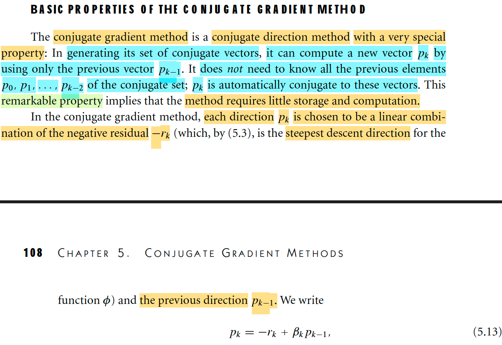</kbd>

<kbd>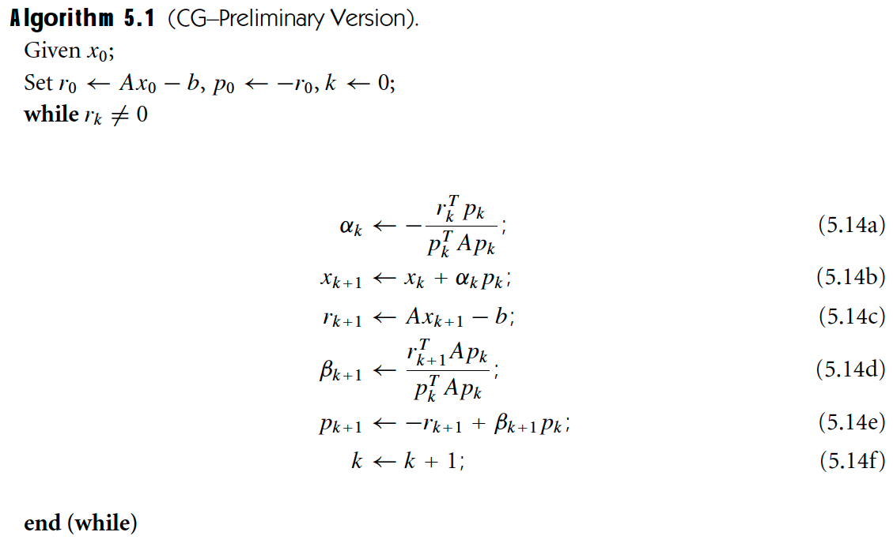</kbd>

> [!NOTE]
> Đại khái là, tác giả nói rằng, phương pháp conjugate gradient THẬT RA chính là conjugate direction nhưng CÓ THÊM MỘT TÍNH CHẤT CỰC KÌ HỮU ÍCH: Đó là **trong quá trình tính toán, ta sẽ DÙNG pk-1 ĐỂ TẠO pk**, mà vẫn đảm bảo là pk conjugate với đám p0,...pk-2 trước đó. Nhờ vậy, không cần tốn nhiều chi phí lưu trữ và tính toán.
>
> Tiếp theo, tác giả nói **pk là linear combination của negative residual -rk và pk-1**: 
>
> pk = -rk + βkpk-1 (5.13)
>
> Vì sao ở đây nói theo 5.3, -rk lại là steepest descent direction nhỉ? → vì 5.3 nói rằng ∇φ(xk) = Axk - b = r(xk) hay rk. À vậy thì -rk là - ∇φ(xk), dĩ nhiên nó chính là steepest descent direction như đã biết.
>
> Thế thì, **βk phải làm sao để pk và pk-1 conjugate wrt matrix A**: tức pkTApk-1 = 0. Ta sẽ tính ra βk thỏa điều kiện này:
>
> Nhân hai vế của pk = -rk + βkpk-1 với pk-1TA:
>
> pk-1TApk = -pk-1TArk + pk-1TAβkpk-1
>
> Cho bằng 0: pk-1TApk = 0 
>
> ⇔ -pk-1TArk + pk-1TAβkpk-1 = 0
>
> ⇔ -pk-1TArk + βk pk-1TApk-1 = 0
>
> ⇔ βk pk-1TApk-1 = pk-1TArk
>
> ⇔ βk  = pk-1TArk / pk-1TApk-1
>
> Và từ đó ta có full thuật toán: Bắt đầu **từ x0, ta chọn p0 là hướng dốc nhất: -∇φ(x0)**, rồi **theo công thức trên tính ra β1 và từ đó có p1**. Sau khi có p1 thì **theo cách làm của conjugate direction method**, đi **tìm α0 theo 5.7** cách làm của conjugate direction (Conjugate Direction Method), và từ đó có **x1: x1 = x0 + α1p1**. Tiếp theo tạo p2 từ p1 theo công thức trên, cứ thế.
>
> Nên nhìn thuật toán 5.1 **Conjugate Gradient Preliminary Version**
>
> Bắt đầu ta có intial point x0. Tính r0 = Ax0 - b, đó chính là ∇Φ(x0). Gán p0 cho -∇Φ(x0).
>
> Lặp lại cho đến khi residual rk = 0, tại mỗi iteration:
>
> Tính αk (theo công thức 5.7, xem link Conjugate Direction Method)
>
> Update xk+1 = xk + αkpk (công thức 5.8, xem link Conjugate Direction Method)
>
> Tính rk+1
>
> Tính βk+1
>
> Dùng nó tính conjugate direction tiếp thep pk+1
>
> Lặp lại.

 

- **Theorem 5.3**

<kbd>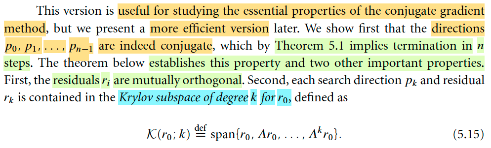</kbd>

<kbd>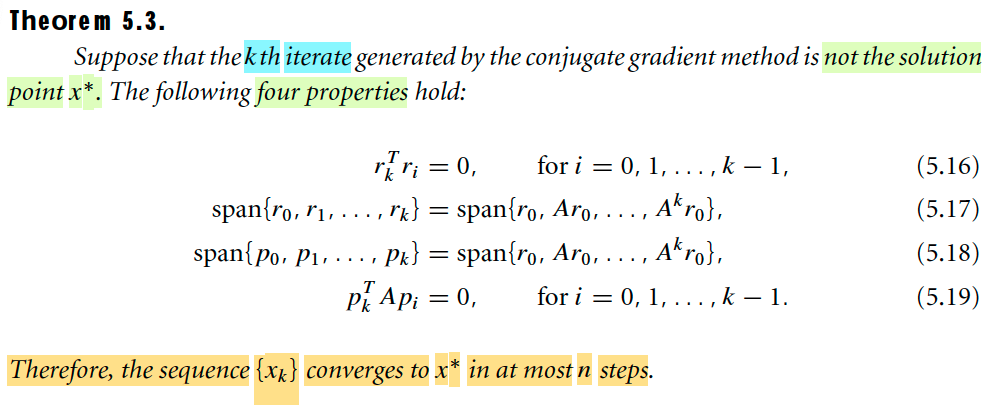</kbd>

<kbd>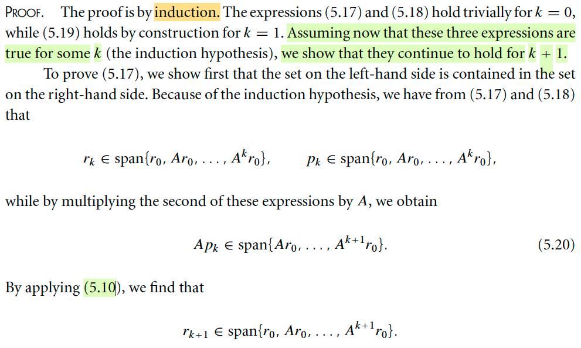</kbd>

<kbd>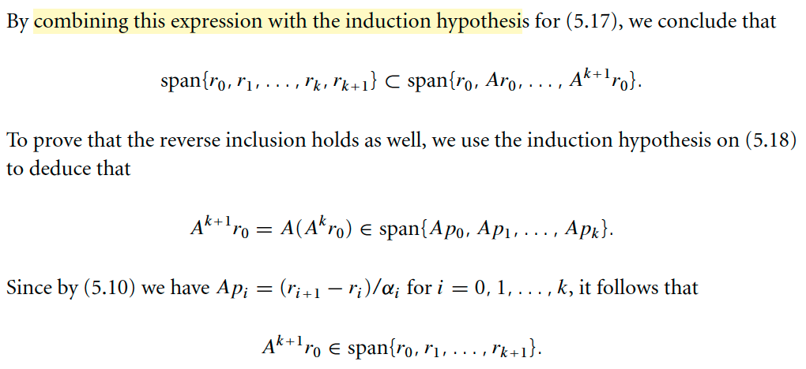</kbd>

<kbd>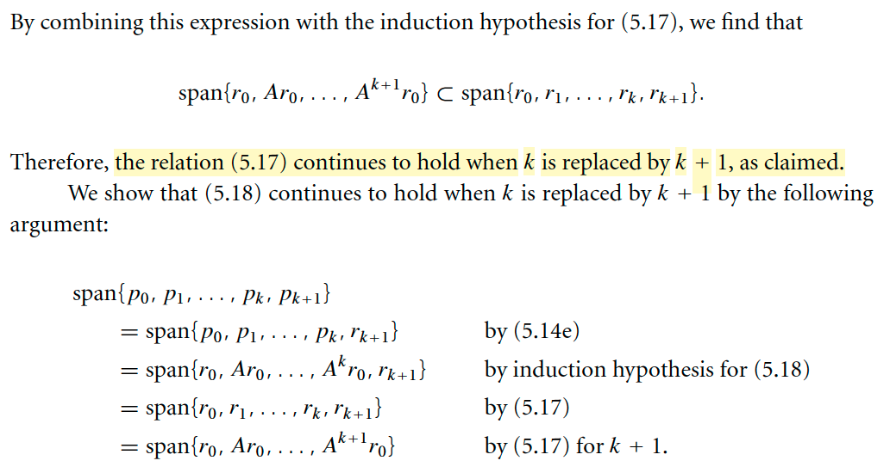</kbd>

<kbd>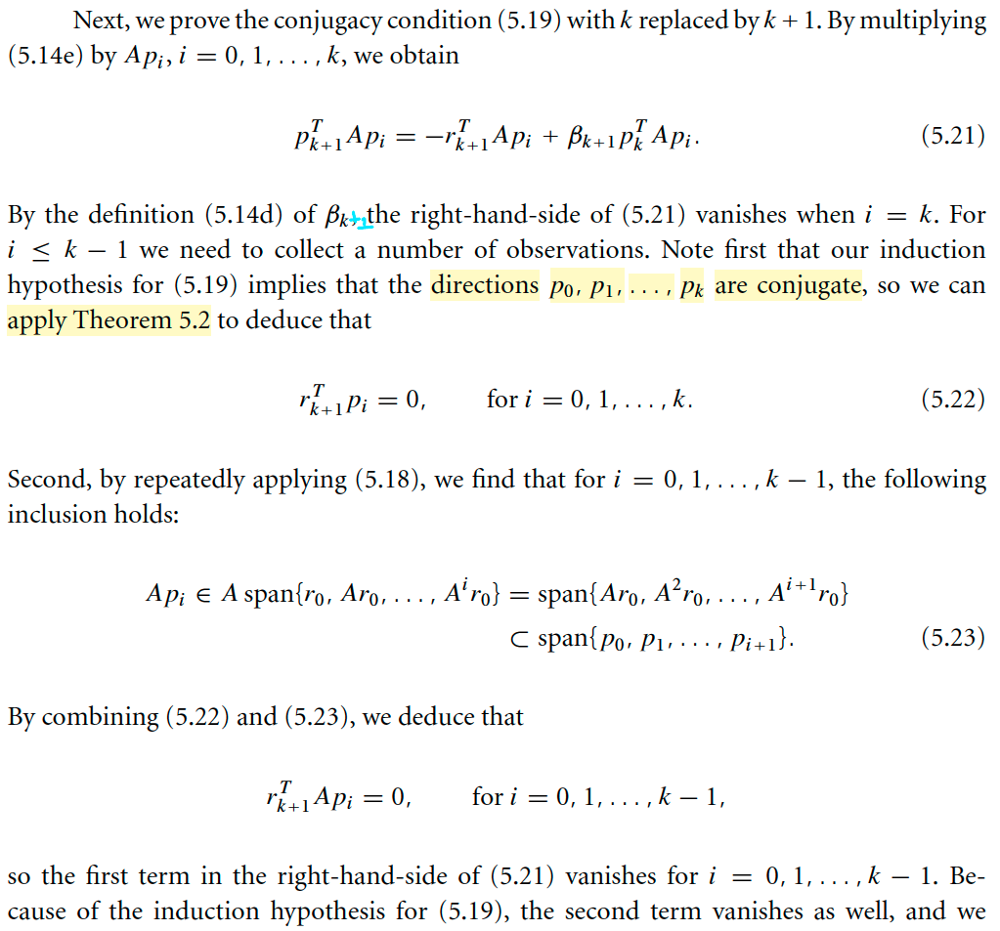</kbd>

<kbd>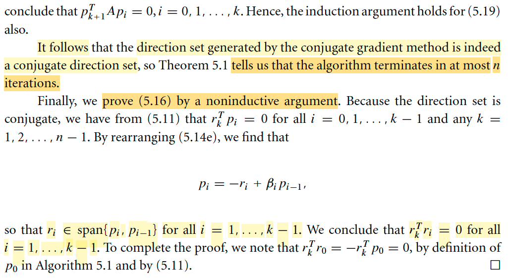</kbd>

> [!NOTE]
> Chứng minh theorem 5.3
>
> Vài ý chính:
>
> ..."5.17, 5.18 đúng với k = 0" là sao?
>
> → vì k = 0: 
>
> 5.17 là span {r0} = span {r0}, hiển nhiên đúng.
>
> 5.18 là: span {p0} = span {r0}, cái này đúng vì p0 được chọn = -r0.
>
> ..."5.19 đúng với k = 1 by construction" là sao?
>
> → Vì theo thuật toán, pk+1 sinh ra sao cho nó conjugate với pk. Nên dĩ nhiên p1TAp0 = 0.
>
> Vậy thì với việc 4 cái trên đã đúng với k = 0, ta giả sử nó đúng với k thì nếu chứng minh nó đúng với k + 1 thì ta sẽ chứng minh xong bởi phép quy nạp.
>
> I) Chứng minh 5.17 đúng với k+1. Tức cần chứng minh span {r0, ..rk+1} = span {r0, Ar0,..A^k+1r0}
>
> Chiến lược: Chứng minh tập này là con tập kia, vì cái cần chứng minh là hai tập hợp (span{..} chỉ là tập hợp các linear combination bởi các basis vector thôi) bằng nhau.
>
> Ia) Chứng minh vế trái là tập con vế phải:
>
> Dùng giả thuyết quy nạp, tức là ta đang cho rằng 5.16 → 5.19 đúng với k, nên có quyền xài.
>
> Xài cái 5.17: span {r0, ..,rk} = span {r0, Ar0,..A^kr0}. Dĩ nhiên suy ra rk ∈ span {r0, Ar0,..A^kr0}. (vì cái hộp chứa nó bên trái cũng là cái hộp bên phải nên nóo cũng thuộc cái hộp bên phải)
>
> Xài 5.18: span {p0, p1,..pk} = span {r0, Ar0, ..A^k r0}. Tương tự, đương nhiên cũng suy ra pk ∈ span {r0, Ar0, ..A^k r0}
>
> Tiếp, nhân hai vế của pk ∈ span {r0, Ar0, ..A^k r0} cho A, ta có 
>
> Apk ∈ span {Ar0, A^2r0, ..A^k+1 r0}
>
> Chỗ này là sao?
>
> → Hiểu thế này: nói pk ∈ span {r0, Ar0, ..A^k r0} thì như đã nói trên, chỉ đơn giản là nói pk nằm trong subspace span bởi các basis {r0, Ar0,..A^k r0}, đã học MIT 18.06, điều này có nghĩa là pk có thể thể hiện bởi linear combination của các basis vector đó:
>
> pk = α r0 + β Ar0 + .. + ω A^k r0
>
> Nhân hai vế cho A:
>
> Apk = A α r0 + A β Ar0 + .. + A ω A^k r0
>
> ⇔ Apk = α A r0 +  β A Ar0 + .. + ω A A^k r0
>
> ⇔ Apk = α A r0 +  β A^2r0 + .. + ω A^k+1 r0
>
> Và again, điều này chính là thể hiện rằng Apk nằm trong subspace span bởi các basis {Ar0, A^2r0 + .. ,A^k+1 r0}. Hay:
>
> Apk ∈ span {Ar0, A^2r0 + .. ,A^k+1 r0}
>
> Tiếp, áp dụng 5.10, là cái này đây (xem link để coi lại)
>
> (5.10) rk+1 - rk = Aαkpk = αkApk
>
> cái chính của 5.10 chính là nói rằng rk+1 - rk trùng phương với Apk (scale bởi αk) 
>
> Mà Apk ∈ span {Ar0, A^2r0 + .. ,A^k+1 r0}
>
> ⇨ rk+1 - rk ∈ span{Ar0,...,A^k+1 r0}
>
> Tới đây, hiểu thế này kết qủa này, chính là:
>
> rk+1 - rk = linear combination của Ar0, ...,A^k+1 r0
>
> ⇔ rk+1 = (linear combination của Ar0, ...,A^k+1 r0) + rk
>
> Mà rk cũng ∈ span {r0, Ar0,..A^kr0}, thì dĩ nhiên cũng chính là 
>
> rk = (linear combination của r0, Ar0,..A^k r0)
>
> Thế vô phương trình rk+1 = .. + rk rồi gom hạng tử lại thì cũng trở thành rk+1 = linear combination của Ar0, ...,A^k+1 r0
>
> ⇨ rk+1 ∈ span{Ar0,...,A^k+1 r0} 
>
> Tiếp sách viết kết hợp cái này với giả thuyết quy nạp cho 5.17, ta có thể kết luận tập vế trái là con tập vế phải. Là sao?
>
> Giả thuyết quy nạp cho 5.17 tức là ta có thể xài 5.17 cho case k = k (hồi nãy cũng đã xài đó): 
>
> span {r0, ..,rk} = span {r0, Ar0,..A^kr0} (induction hypo for 5.17)
>
> Lập luận thế này: gọi u là item bất kì ∈ tập vế trái span {r0,..rk+1}. Như đã nói hai lần ở trên, điều này có nghiã là 
>
> u = linear combination các vector r0,..rk+1: Σi=1:k+1 αi ri
>
> ⇔ u = α0 r0 + ...αk rk + αk+1 rk+1
>
> Vì rk+1 ∈ span{Ar0,...,A^k+1 r0}  ⇨ rk+1 cũng là linear combination các basis vector Ar0,...,A^k+1 r0: rk+1 = α × Ar0 + ...ω × A^k+1 r0 (for some α, ...ω)
>
> ⇔ u = α0 r0 + ...αk rk + αk+1 (α × Ar0 + ...ω × A^k+1 r0) 
>
> Và dùng (induction hypo for 5.17), cũng giúp ta có r0, r1,..rk đều thuộc span {r0, Ar0,..A^kr0}, nên đều là linear combination của {r0, Ar0,..A^kr0}
>
> Cho nên triển khai và thu gọn equation trên ta sẽ có u = linear combination của {r0, Ar0,..A^kr0, A^k+1 r0}
>
> ⇨ u belong span {r0, Ar0,..A^kr0, A^k+1 r0}
>
> Và vì u là vector bất kì của span {r0,..rk+1}, nên theo set theory, kết luận span {r0,..rk+1} ⊂ span {r0, Ar0,..A^kr0, A^k+1 r0}. Qua đó đã chứng minh xong Ia)
>
> Ib) Chứng minh span {r0, Ar0,..A^kr0, A^k+1 r0} ⊂ span {r0,..rk+1}
>
> Ta dùng induction hypothesis 5.18, tức là đường xài 5.18 với k = k: 
>
> span {p0, p1,..pk} = span {r0, Ar0, ..A^k r0} (induction hypo for 5.18) 
>
> Từ cái này tương tự như hồi nãy, ta suy ra 
>
> A^k r0 ∈ span {p0, p1,..pk} 
>
> (vì cái nhà bên phải của nó cũng là cái hộp bên trái, nên nó dĩ nhiên phải cũng nằm trong cái hộp bên trái)
>
> Again, điều này đồng nghĩa:
>
> A^k r0 = α0 p0 + α1 p1 +.. αk pk for some α0, α1,...
>
> ⇔ AA^k r0 = A α0 p0 + A α1 p1 +.. A αk pk
>
> ⇔ A^k+1 r0 = α0 Ap0 + α1 Ap1 +.. αk Apk
>
> ⇨ A^k+1 r0 ∈ span {Ap0, Ap1, .. ,Apk}
>
> Lại lôi 5.10 ra: rk+1 - rk = Aαkpk = αkApk, áp dụng với k = i
>
> ri+1 - ri = A αi pi 
>
> ⇔ ri+1 - ri = αi Api 
>
> ⇔ Api = (ri+1 - ri) / αi
>
> Có nghĩa là:
>
> i = 0, ta có Ap0 = (r1 - r0) / α0, điều này suy ra Ap0 ∈ span {r0,...rk+1}
>
> i = 1, ta có Ap1 = (r2 - r1) / α1 ⇨ suy ra Ap1 ∈ span {r0,...rk+1}
>
> ...
>
> i = k, ta có Apk = (rk+1 - rk) / αk ⇨ suy ra Apk ∈ span {r0,...rk+1}
>
> Thế thì ta đang có A^k+1 r0 ∈ span {Ap0, Ap1, .. ,Apk}, mà mỗi basis lại nằm trong A^k+1 r0 ∈ span {r0,...rk+1} nên có thể suy ra 
>
> A^k+1 r0 ∈ span {r0,...rk+1}.
>
> Đến đây dùng lập luận tương tự ở trên:
>
> span {r0, Ar0, ..A^k r0} = span {p0, p1,..pk} (induction hypo for 5.17)
>
> và kết hợp với A^k+1 r0 ∈ span {r0,...rk+1}
>
> giúp kết luận v bất kì nằm trong span {r0, Ar0,..A^kr0, A^k+1 r0} cũng sẽ nằm trong span {r0,..rk+1}
>
> ⇨ Chứng minh xong hai tập bằng nhau.
>
> ====
>
> II) Tiếp theo là chứng minh 5.18 đúng với k+1: tức là 
>
> span {p0, p1,..pk+1} = span {r0, Ar0, ..,A^k+1 r0, }
>
>  Lập luận như sau:
>
> Vế trái span {p0, p1,..pk+1} = span {p0, p1,..,pk, rk+1}
>
> Lí do: 5.14e tức là vì theo thuật toán, pk+1 = -rk+1 + βk+1 pk
> Thì sao? → Thì điều này có có nghĩa là, bất cứ linear combination của {p0,...pk+1} nào cũng đều thể hiện được bởi linear combination của {p0,...pk, rk+1} và ngược lại. Nên hai subspace này là một. 
>
> ..(tiếp) = span {r0, Ar0, ...,A^k r0, rk+1}
>
> Lí do? Bởi induction hypothesis cho 5.18, tức là xài 5.18 cho k = k: span {p0, p1,..pk} = span {r0, Ar0, ..A^k r0}. Và cái này có nghĩa là p0,...pk đều thuộc span {r0, Ar0, ..A^k r0}, đều có thể thể hiện bởi linear combination của {r0, Ar0, ..A^k r0}
>
> Nên span {p0, p1,..,pk, rk+1}, là tập mọi linear combination của {p0, p1,..,pk, rk+1}, thì mọi vector trong đó đều có thể thể hiện bởi linear combination của {r0, Ar0, ..A^k r0, rk+1} Và ngược lại cũng đúng.
>
> ..(tiếp) = span {r0, r1, ...,rk, rk+1}
>
> Lí do: Dùng induction hypothesis 5.17 for k: span {r0, ..,rk} = span {r0, Ar0,..A^kr0}. Và cái này có nghĩa là đám r0, Ar0,..A^kr0  đều có thể thể hiện bởi (linear combination) của đám r0, r1, ...,rk.
> Nên mọi u ∈ span {r0, Ar0, ...,A^k r0, rk+1} đều là linear combination của đám r0, r1, ...,rk, và rk+1. Và ngược lại.
>
> ..(tiếp) = span {r0, Ar0, ...,A^k+1 r0}. 
>
> Cái này là vì ta đã chứng minh 5.17 cho k+1 rồi, nên được quyền xài.
>
> Như vậy đã chứng minh xong:
>
> span{p0, ..pk+1} = span {r0, Ar0, ...,A^k+1 r0}, tức 5.18 cho k+1
>
> ====
>
> III) Chứng minh 5.19 đúng cho k + 1, tức chứng minh: 
>
> pk+1TApi = 0 với i = 0,1,...k
>
> Lập luận như sau: Từ công thức 5.14e: 
>
> pk+1 = -rk+1 + βk+1 pk
>
> Nhân hai vế cho Api với i = 0,1,....k, ta có: 
>
> pk+1TApi = -rk+1TApi + βk+1 pkTApi với i = 0,1,....k
>
> (nhớ là, đây là cái ta có, và ta phải chứng minh vế trái pk+1TApi = 0 với i = 0,1,...k)
>
> Vậy điều này đồng nghĩa ta phải chứng minh vế phải cũng = 0 với i = 0,1,...k
>
> Xét i = k: Vế trái pk+1Api = pk+1Apk đương nhiên bằng 0 khỏi cần chứng minh vì đây là do cách tạo pk+1 của thuật toán, nó phải cho ra pk+1 conjugaye pk.
>
> Nhiệm vụ chỉ cần chứng minh vế phải = 0 cho i = 0,1...k-1.
>
> Dùng / xài induction hypothesis cho 5.19, tức là được quyền xài 5.19 với  k = k: Ta có pkTApi = 0 với mọi i = 0,1...k-1
>
> Như vậy đương nhiên bộ vector p0,p1,..pk là một conjugate set.
>
> Từ đó cho phép ta dùng theorem 5.2.
>
> Theorem 5.2 nói gì? (*)
>
> Theorem này nói đại ý rằng: Bắt đầu từ x0 và ta dùng một thuật toán 5.6, 5.7 để tạo ra chuỗi {xk}. Tức là: αk = -rkTpk / (pkTApk) và xk+1 = xk + αkpk. Thì khi đó chuỗi này sẽ có tính chất sau:
> (với r(x) = Ax - b)
>
> r(x1)Tp0 = 0
>
> r(x2)Tp0 = 0, r2Tp1 = 0
>
> r(x3)Tp0 = 0, r3Tp1 = 0, r3Tp2 = 0
> ....
>
> r(xk)Tpi = 0 ∀i = 0,1,...k-1
>
> r(xk+1)Tpi = 0 ∀i = 0,1,...k
>
> Vậy thì ở đây dĩ nhiên là ta đang generate {xk} theo thuật toán này. Vì sao? Vì trong thuật toán conjugate gradient thì cơ bản chỉ là ta có cách để tính ra conjugate vector pk ngay trong thuật toán, rồi sau đó dùng cơ chế trên trên generate xk thôi.
>
> Do đó, theo theorem này ta có: 
>
> rk+1Tpi = 0 ∀i = 0,1,...k (đây là 5.22 trong sách)
>
> Tiếp, áp dụng 5.18 span{p0,...pk+1} = span{r0, Ar0, ..A^k+1 r0}.
>
> (tới đây thì ta đã chứng minh cho k+1 nên được quyền xài tẹt ga)
>
> Với i = 0,....k-1 ta đều có
>
> span{p0,...pi} = span{r0, Ar0, ..A^i r0}
>
> Dĩ nhiên điều này đồng nghĩa pi ∈ span{r0, Ar0, ..A^i r0}
>
> ⇔ pi = α r0 + β Ar0 + ... + ω A^i r0 for some α, ...ω
>
> ⇔ Api = A(α r0 + β Ar0 + ... + ω A^i r0) for some α, ...ω
>
> ⇔ Api = α Ar0 + β A^2 r0 + ... +  A^i+1 ω r0 for some α, ...ω
>
> ⇔ Api ∈ span{Ar0, A^2r0, ..A^i+1 r0}
>
> Mà span{Ar0, A^2r0, ..A^i+1 r0} ⊂ span{r0, Ar0, A^2r0, ..A^i+1 r0} (vì vế phải nó có thêm 1 basis là r0)
>
> Và theo 5.18 ở trên thì span{r0, Ar0, A^2r0, ..A^i+1 r0} = span{p0,...pi+1}
>
> ⇨ .. ⇔ Api ∈ span{Ar0, A^2r0, ..A^i+1 r0} ⊂ span{p0,...pi+1} (đây là 5.23)
>
> Rồi, tới đây kết hợp 5.22 và 5.23, viết lại hai cái này:
>
> (5.22) rk+1Tpi = 0 ∀i = 0,1,...k 
>
> (5.23) Với i = 0,....k-1: Api ∈ span{Ar0, A^2r0, ..A^i+1 r0} ⊂ span{p0,...pi+1}
>
> Lập luận như sau: cái thằng 5.22 nói rằng rk+1 vuông góc với mọi p0,p1,..pk. Nên suy ra: 
>
> nó vuông góc subspace span{p0,...pk}
>
> Mà  5.23 ta có với mọi i = 0,....k-1 thì Api nằm trong span{p0,...pi+1}. Tức là:
>
> Ap0 ∈ span span{p0}
>
> Ap1 ∈ span span{p0, p1}
>
> ..
>
> Apk-1 ∈ span span{p0, p1,...pk-1}
>
> mà:
>
> Ap0 ∈ span{p0} dĩ nhiên ⇨ Ap0 ∈ span{p0,...pk} (vì span{p0} ⊂ pan{p0,...pk}) 
>
> Ap1 ∈ span span{p0, p1} ⇨ Api ∈ span{p0,...pk}
>
> ..tương tự
>
> Apk-1 ∈ span span{p0, p1,...pk-1} ⇨ Apk-1 ∈ span{p0,...pk}
>
> VẬY LÀ, ĐÁM Ap0,...Apk-1 ĐỀU ∈ span{p0,...pk}, MÀ rk+1 LẠI VUÔNG GÓC VỚI SUBSPACE NÀY. NHƯ VẬY SUY RA rk+1 VUÔNG GÓC VỚI ĐÁM VECTOR Ap0,...Apk-1:
>
> rk+1TApi = 0 với mọi i = 0,....k-1
>
>
> NHỚ LẠI TA ĐANG MUỐN LÀM CÁI GÌ: → Ta đang muốn chứng minh pk+1Api = 0 với i = 0,1,....k-1
>
> Và đang có kết quả:
>
> pk+1TApi = -rk+1Api + βk+1 pkApi với i = 0,1,....k-1
>
> Và vừa rồi vừa chứng minh xong rk+1TApi = 0 với mọi i = 0,....k-1
>
> Có nghĩa là hạng tử thứ nhất đã bay màu (với i = 0,1,....k-1)
>
> Còn hạng tử còn lại βk+1 pkApi với i = 0,1,....k-1. Thì đơn giản là vì ta có thể dùng induction hypothesis cho 5.19, tức xài 5.19 với k = k. Nên ta có: pkApi = 0 với i = 0,1,....k-1
>
> Vậy là hạng tử thứ 2 cũng bằng 0 với mọi i = 0,1,....k-1
>
> Từ đó kết luận pk+1TApi = 0 với mọi i = 0,1,....k-1.
>
> Nhớ rằng lúc nãy ta đã nói với k thì  pk+1TApk dĩ nhiên = 0.
>
> Vậy là đã chứng minh xong 5.19 đúng với k + 1.
>
> =====
>
> IV) Chứng minh 5.16 tức là rkTri = 0 ∀ i = 0,1...k-1 và ∀k = 1,2,...n-1. 
>
> Cái này thì ko dùng quy nạp mà lập luận như sau: 
>
> Với việc đã chứng minh xong 5.18, nên có quyền xài: pkTApi = 0 ∀i = 0,1,...k-1. Do đó bộ p0,...pk là conjugate set.
>
> Lại theo theorem 5.1 (vì sao xài được thì xem lại (*)): nói rằng rkTpi = 0 ∀ i=0,1...k-1
>
> Dùng 5.14e: pk+1 = -rk+1 + βk+1 pk
>
> ⇨ pi = -ri + βi pi-1 
>
> ⇔ ri = -pi + βi pi-1 
>
> ⇨ ri ∈ span {pi, pi-1} ∀ i = 1,2...k-1 (cái này dễ hiểu)
>
> Vậy thì rkTpi ∀ i=0,1...k-1 ⇨ rk vuông góc span {p1,...pk-1}
>
> nên dĩ nhiên vuông góc với mọi vector trong đó (**)
>
> Mà ri ∈ span {pi, pi-1} ∀ i = 1,2...k-1 
>
> ⇨ ri ∈ {p1,...pk-1} ∀ i = 1,2...k-1
>
> Vậy từ ** → rkTri = 0 ∀ i = 1,2...k-1
>
> Tới đây là đã chưng minh 5.16 với mọi i = 1,2...k-1
>
> Nhưng ta còn 1 cái i = 0 nữa (xem lại 5.16)
>
> Vậy thì rkTr0 có bằng 0 không?
>
> ⇨ r0 chính là gì, Ax0 - b, chính là ∇Φ(x0), và p0 còn nhớ, được chọn = negative gradient. Vậy  r0 = -p0 
>
> ⇨ rkTr0 = -rkTp0, cái này thì đích thị là bằng 0 do 5.11: rkTpi = 0 ∀ i=0,1...k-1
>
> Vậy là đã chứng minh xong.

> [!TIP]
> **🤖 AI Feedback** — ✅ Score: **99/100**
>
> Bài ghi chú của bạn rất xuất sắc về độ chính xác và chiều sâu. Bạn đã giải thích chi tiết và rõ ràng từng bước trong chứng minh Định lý 5.3, đặc biệt là cách sử dụng khái niệm "span" và tổ hợp tuyến tính, cho thấy sự hiểu biết sâu sắc về tài liệu. Việc phân tích từng ý nhỏ và đưa ra lời giải thích cặn kẽ là một điểm mạnh lớn, giúp người đọc dễ dàng theo dõi toàn bộ quá trình chứng minh.

 

- **Cái tên Conjugate Gradient Method gây hiểu sai, gradient không conjugate**

<kbd>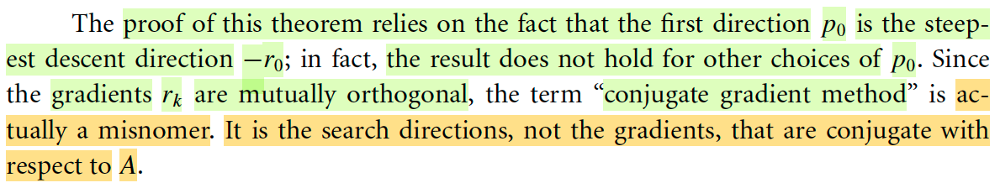</kbd>

> [!NOTE]
> Đại khái là nói rằng phần chứng minh của theorem này dựa trên sự thật rằng p0 là negative gradient (p0 = - r0, Ax0 - b, tức ∇(1/2xTAx - bx)|x=x0). Và nếu p0 không không phải -r0 thì theorem này sẽ không work.
>
> Một điểm nữa, thực ra ta thấy trong theorem đã nói (5.16): rkTri 0 với i=0,1,...k-1. Có nghĩa là, các gradient vector (nhắc lại lần nữa, residual Ax-b, chính là gradient của hàm Φ(x) = 1/2xTAx - bx) thực ra là ORTHOGONAL nhau, chứ KHÔNG PHẢI LÀ CONJUGATE NHAU.
>
> Do đó giáo sư mới nói tên gọi Conjugate Gradient Method thực ra là hiểu sai, gây hiểu lầm (misnormer) vì như đã nói gradient, không conjugate, mà cái conjugate là các direction pi

> [!TIP]
> **🤖 AI Feedback** — ✅ Score: **95/100**
>
> Phân tích của bạn rất chính xác và sâu sắc, thể hiện sự hiểu biết vững chắc về các khái niệm toán học liên quan. Việc bạn liên hệ r0 với gradient của hàm Φ(x) và giải thích rõ ràng lý do thuật ngữ "Conjugate Gradient Method" là một 'misnomer' là đáng khen ngợi.

 

- **A Practical Form Of The Conjugate Gradient Method.**

<kbd>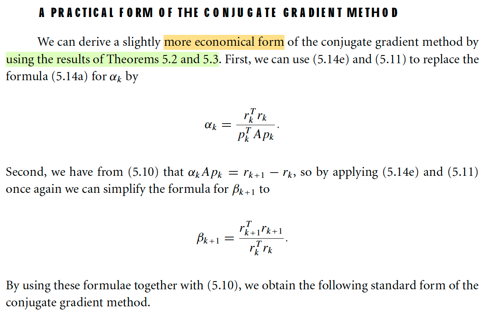</kbd>

<kbd>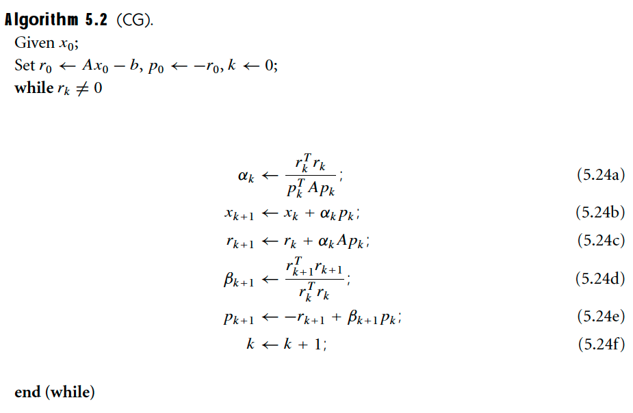</kbd>

<kbd>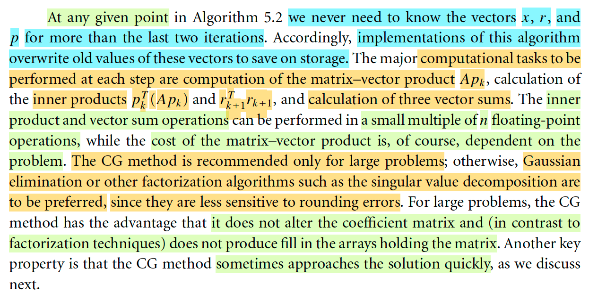</kbd>

<kbd>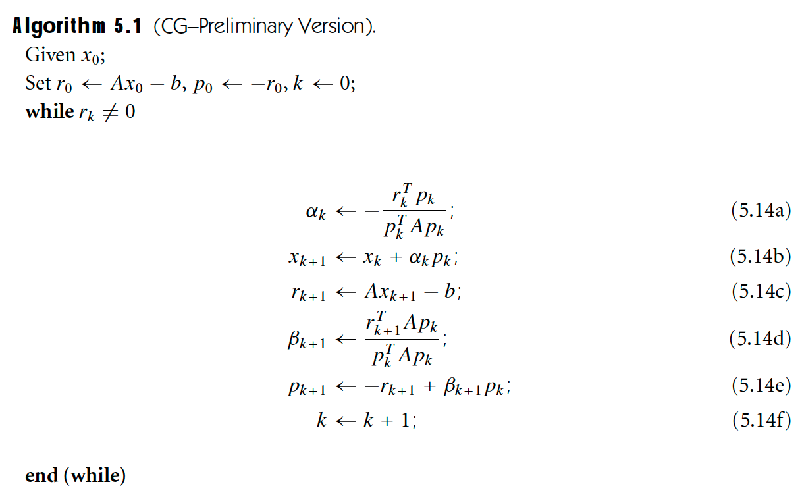</kbd>

> [!NOTE]
> Đại ý là ta sẽ derive phiên bản "kinh tế" hơn của thuật toán vừa rồi.
>
> Xem lại thuật toán 5.1 có các bước sau trong mỗi iteration, cũng là ôn lại toàn bộ từ đầu đến giờ
>
> Bắt đầu với starting point x0. Gán r0 = Ax0 - b (đây là residual tại r0, mang ý nghĩa mức error của việc giảm tìm x thỏa Ax = b tại initial step, và đây cũng là ∇φ(x0))
>
> Chọn p0 = -r0: hướng đi đầu tiên từ x0 chính là steepest descent.
>
> Lặp lại cho đến khi rk = 0:  
>
> i) αk := -rkTpk / pkTApk (5.14a)
>
> Đây là gì? Đây chính là solution của bài toán minimize hàm g(α) = φ(xk + α × pk), tức là hàm φ(x) giới hạn bởi phương vector pk. Y như trong line search. Ý nghĩa: Từ xk nếu đi theo phương pk thì step đến đâu là xuống được thấp nhất.
>
> ii) xk+1 := xk + αkpk (5.14b): Đây là update vị trí từ xk đến xk+1 thôi
>
> iii) rk+1 := Axk+1 - b (5.14c): Đây chỉ là tính lại residual mới nhất
>
> iv) βk+1 := rk+1TApk / pkTApk (5.14d)
>
> Đây chính là bước tính ra βk+1 dựa theo điều kiện pk+1 conjugate pk, để sau bước này, dùng βk+1 để tính pk+1 thì ta sẽ có direction pk+1 conjugate (wrt A) với pk.
>
> v) pk+1 = -rk+1 + βk+1 pk
>
> k = k + 1.
>
> Thế thì gs nói có thể dùng 5.14e, 5.11 để thay 5.14a bằng αk = rkTrk/ pkTApk. Là sao nhỉ? Ta có:
>
> 5.14e: pk+1 = -rk+1 + βk+1 pk.
>
> 5.11: rkTpi = 0, i = 0,1,....k-1
>
> 5.14a: αk = -rkTpk / pkTApk
>
> Vậy, từ 5.14e ⇨ pk = -rk + βk pk-1
>
> ⇨ -rkTpk = -rkT(-rk + βk pk-1) = rkTrk - rkT βk pk-1
>
> = rkTrk - βk rkTpk-1
>
> Mà 5.11 nói rkTpk-1 = 0 
>
> ⇨ -rkTpk = rkTrk 
>
> ⇨ αk = -rkTpk / pkTApk = rkTrk/ pkTApk
>
> Vậy là từ αk = -rkTpk / pkTApk, nay αk = rkTrk/ pkTApk, khác nhau ở cái tử số, cơ bản đều là dot product của hai vector.
>
> ----
>
> Tiếp, từ 5.10: rk+1 = rk + αkApk ⇨ αkApk = rk+1 - rk.
>
> Áp dụng 5.14e (pk+1 = -rk+1 + βk+1 pk) và 5.11 (rkTpi = 0, i = 0,1,....k-1) lần nữa ta đơn giản hóa βk+1:
>
> βk+1 = rk+1Trk+1 / rkTrk. Là sao?
>
> Công thức 5.14d nói βk+1 = (ý là :=) rk+1TApk / pkTApk
>
> = rk+1T(rk+1 - rk) / αkpkTApk
>
> = rk+1Trk+1 / αkpkTApk - rk+1Trk / αkpkTApk
>
> = rk+1Trk+1 / αkpkTApk - 0 (do 5.16)
>
> = rk+1Trk+1 / αkpkTApk
>
> Thay αk = rkTrk/ pkTApk.
>
> .. = rk+1Trk+1 / [(rkTrk/ pkTApk) pkTApk]
>
> = rk+1Trk+1 / rkTrk → Đây là công thức trong sách.
>
> ----
>
> Và từ đó ta có thuật toán 5.2: CONJUGATE GRADIENT chính thức:
>
> Bắt đầu với r0 = Ax0 - b, p0 = -rk, k = 0
>
> Lặp lại cho đến khi rk = 0:
>
> i)  (Công thức tính αk theo kiểu mới, cách cũ: αk = -rkTpk / pkTApk)
>
> ii) xk+1 := xk + αkpk (5.24b) (cái này ko có gì thay đổi)
>
> iii) rk+1 := rk + αkApk (5.24c)
>
> Trong Algo 5.1 thì bước này là rk+1 := Axk+1 - b, thay xk+1 = xk + αkpk ⇨ rk+1 = Axk + A αkpk - b = Axk - b + A αkpk = rk + αkApk. Có nghĩa là cũng ko có gì mới cả, nhưng cái khác là ta sẽ tính phép toán matrix nhân vector: Apk thay vì Axk+1. 
>
> iv) βk+1 := rk+1Trk+1 / rkTrk (5.24d)
>
> Cách cũ của Algo 5.1: βk+1 := rk+1TApk / pkTApk. Thì trong kiểu cũ, ta phải tính Apk, rồi dot product với rk+1 và pk. Còn kiểu mới chỉ tính dot product, không nhân matrix vector.
>
> v) pk+1 := -rk+1 + βk+1 pk (5.24e) (Cái này thì vẫn vậy)
>
> k := k + 1
>
> ====
>
> Thế thì, gs nói "như vậy với thuật toán này ta ko cần phải biết x, r và p của nhiều hơn 2 iteration trước": Ý ông là cả Algo 5.1 và 5.2. Ý này dễ hiểu, vì rõ ràng trong mỗi iteration, ta chỉ xài xk,pk,rk để tính xk+1, rk+1, pk+1.
>
> Ông nói "Phần lớn tính toán sẽ là tính Apk, tính pkT(Apk) và rk+1Trk+1 cũng như là 3 cái sum vectors": Đúng rồi, nhìn thuật toán là thấy.
>
> Rồi, đại ý là inner product (dot product) cũng như vector sum thì chỉ tốn một con số nhỏ nào đó của n floating point operation. Là sao?
>
> Sẵn ôn lại, đã học từ EE364a. Một phép cộng (trừ) và phép nhân (chia) tạo thành một floating point operation (flop). Vậy một dot product giữa hai n-D vector u,v: Sẽ tốn n phép nhân hai phần tử với nhau, và n-1 phép cộng, coi như tốn n phép (nhân + cộng scalar vs scalar) → tốn n flops. Và trong thuật toán thì ta sẽ dot product vài lần, ví dụ 4 lần → tốn 4n flops. Và ý chính là, đây chỉ là bậc 1 của n, n tăng, thì chi phí cũng chỉ tăng tuyến tính.
>
> Còn chi phí của nhân matrix với vector thì giáo sư nói tùy vào bài toán. Có thể hiểu ý này là: Nếu matrix A có thể phân rã thành các matrix đơn giản hơn thì chi phí nhân matrix vs vector có thể ít hơn. Còn tiêu chuẩn thì nó tốn O(n^2)
>
> Ta biết nhân matrix A với vector x là tính n phép dot product giữa các row của A và x. Mỗi cái thì tốn n flops ⇨ Tốn n^2 flops.
>
> Gs nói thêm cái Conjugate Gradient method này chỉ nên dùng cho LARGE PROBLEM. Còn nhỏ hơn thì nên dùng Gaussian elimination (khử Gausse) hay eigen decomposition vì chúng ít nhạy với rounding error hơn.
>
> Với large problem, CG có lợi điểm là nó không thay đổi matrix hệ số (còn factorization thì có) và nó cũng có thể đôi khi giúp tìm ra solution nhanh hơn, đây sẽ là điểm tiếp theo ta bàn.

> [!TIP]
> **🤖 AI Feedback** — ✅ Score: **98/100**
>
> Bài viết đã trình bày rất sâu sắc và chính xác các bước chuyển đổi từ thuật toán Conjugate Gradient sơ bộ sang phiên bản hiệu quả hơn, đặc biệt là các phần chứng minh lại công thức αk và βk+1. Phần phân tích về chi phí tính toán (flops) cũng như ưu nhược điểm của CG cho các bài toán lớn đã bổ sung thêm chiều sâu đáng kể.

 

- **Rate of Convergence**

<kbd>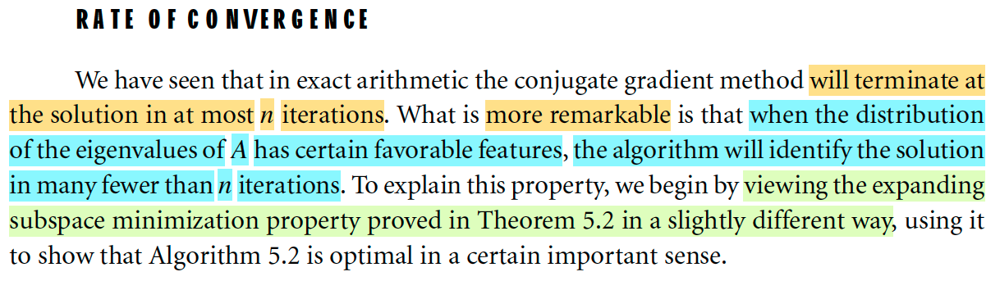</kbd>

<kbd>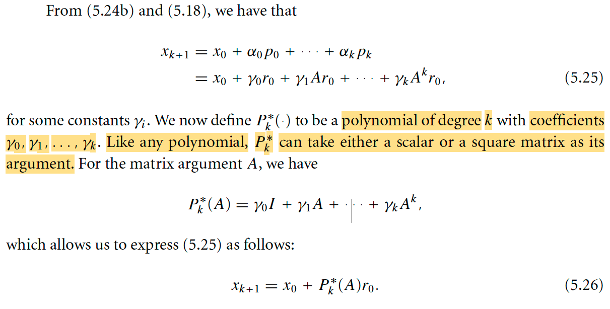</kbd>

<kbd>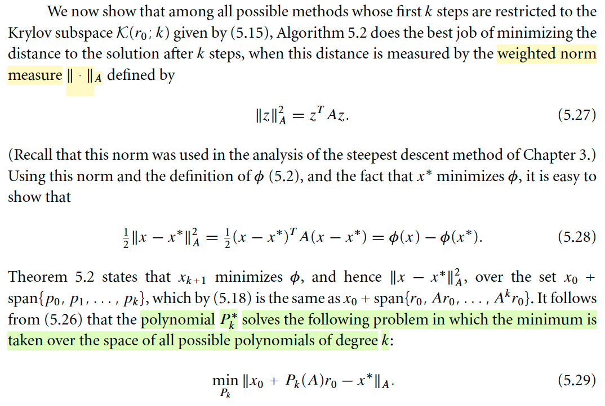</kbd>

<kbd>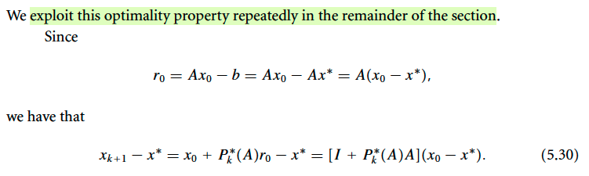</kbd>

<kbd>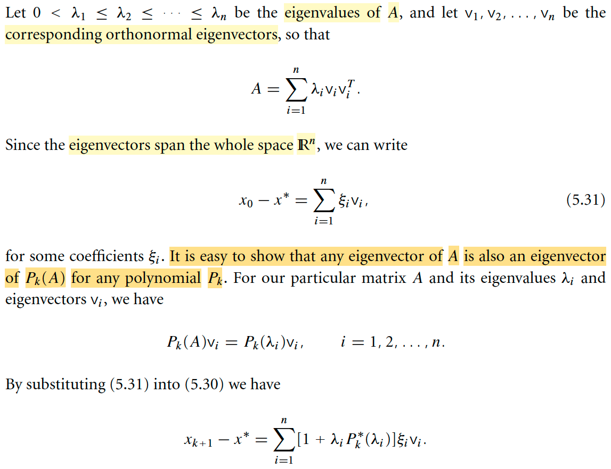</kbd>

<kbd>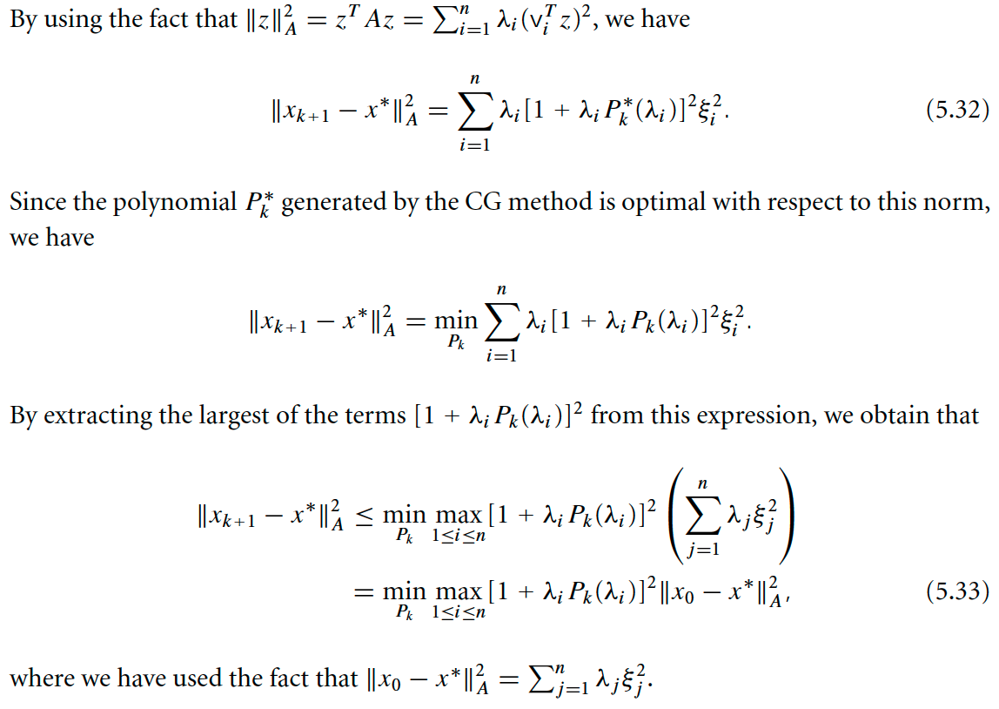</kbd>

<kbd>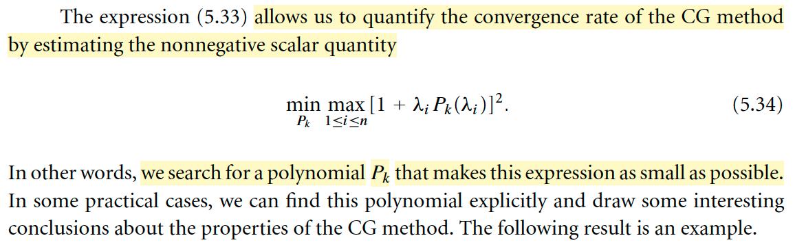</kbd>

> [!NOTE]
> Đại khái là ta đã biết phương pháp conjugat gradient có thể hội tụ chỉ trong nhiều nhất là n iteration. Nhưng, thậm chí, nếu eigenvalues của matrix A có một phân bố đặc biệt nào đó, thì thuật toán có thể còn hội tụ sớm hơn nữa.
>
> Từ (5.24b): xk+1 := xk + αkpk 
>
> Và (5.18): **span {p0, p1,..pk} = span {r0, Ar0, ..A^k r0}**, cái này như đã biết, cho thấy **pk ∈ span {r0, Ar0, ..A^k r0}**, cũng đồng nghĩa pk có thể thể hiện bởi một linear combination các vector r0, Ar0, ..A^k r0: pk = ε0 r0 + ..εk A^k r0. Nên: xk+1 = xk + αk (γ0 r0 + ..γk A^k) Mà xk thì cũng = xk-1 + αk-1 pk-1, làm tương tự vậy, và truy đến x0 rồi gom thừa số chung lại, có thể hiểu vì sao nói: **xk+1 = x0 + γ0 r0 + .. + γk A^k r0** (5.25)
>
> Rồi, bằng cách **đặt ra hàm P*_k(.) là một hàm đa thức bậc k với bộ hệ số {γ0,...γk}**, nó là hàm **nhận vào vector x hay matrix A, và output: γ0A^0 +...γk A^k**. Khi đó cũng dễ hiểu **xk+1 = x0 + P*_k(A) r0** (5.26)
>
> Tiếp gs nói ta sẽ chứng minh rằng trong mọi phương pháp mà k bước đầu tiên bị giới hạn trong Krylov subspace, thì thuật toán 5.2 là cái làm tốt nhất cái việc minimizing khoảng cách đến solution (x đến x*) với khoảng cách được đo bởi weighted norm ||.||_A, có công thức là: (||z||_A)^2 = zTAz. Và dùng norm này, cũng như sự thật là x* minimize φ(x), ta dễ có: (1/2)(||x - x*||_A)^2 = (1/2)(x - x*)TA(x - x*) = Φ(x) - Φ(x*). Chỗ này là sao nhỉ?
>
> Cái vụ minimize khoảng cách đo bởi weighted norm ||.||_A là sao? → Còn nhớ bữa trước khi lập luận để tìm hiểu bản chất của CG, mình đã tự derive cái này: Cơ bản thuật toán CG chỉ là: tại k's iteration, ta di chuyển trên subspace x0 + span{p0,..pk} và muốn đến gần x* nhất có thể. Thì đây chính là bài toán tìm hình chiếu của x* lên subspace này, hoặc cũng là minimize distance từ điểm trong subspace đến x* NHƯNG VỚI ĐIỀU KIỆN LÀ TA LÀM TRONG TỌA ĐỘ BASIS a's (CỘT CỦA A), VÀ ĐIỀU ĐÓ CŨNG ĐỒNG NGHĨA LÀ TA DÙNG NORM-A ĐỂ TÍNH DISTANCE THAY VÌ NORM THƯỜNG (xem lại note Vài suy nghĩ về bản chất CG). 
>
> Còn vì sao nó bằng φ(x) - φ(x*)? → Đơn giản là khai triển (1/2)(x - x*)TA(x - x*) ra:
>
> (1/2)(x - x*)TA(x - x*) = (1/2)(xTA- x*TA)(x - x*) = (1/2)(xTAx - x*TAx - xTAx* + x*TAx*) 
>
> = (1/2)(xTAx - 2xTAx* + x*TAx*) 
>
> = (1/2) xTAx - xTAx* + (1/2) x*TAx*
>
> Dùng Ax* = b (a)
>
> = (1/2)xTAx - xTb + (1/2) x*TAx*
>
> = φ(x) + (1/2) x*TAx* (b)
>
> Tiếp, thử tính φ(x*) = (1/2) x*TAx* - bTx*, mà (a) ⇔ x*TAT = bT ⇔ x*TA = bT (A đối xứng) 
>
> ⇨ φ(x*) = (1/2) x*TAx* - bTx* = (1/2) x*TAx* - x*TATx* = -(1/2) x*TATx*
>
> ⇔(1/2) x*TATx* = - φ(x*)
>
> Vậy (b) = φ(x) - φ(x*) (5.28)
>
> Viết lại (1/2)(||x - x*||_A)^2  = φ(x) - φ(x*)
>
> Tiếp, theorem 5.2 nói rằng: 
>
> xk minimize φ(x) over the set {x: x =  x0 + span{p0, p1,...pk-1}}, hay cũng là  
>
> xk+1 minimize φ(x) over the set {x: x =  x0 + span{p0, p1,...pk}}. 
>
> Nên với quan hệ ở trên suy ra φ(x) = (1/2)(||x - x*||_A)^2 + φ(x*), dĩ nhiên ta có: 
>
> xk+1 cũng sẽ minimize (1/2)(||x - x*||_A)^2 + φ(x*), 
>
> cũng là 
>
> xk+1 minimize (||x - x*||_A)^2 (vì 1/2 scale factor dương và φ(x*) là constant)
>
> Viết lại: **xk+1 minimize (||x - x*||_A)^2 over the set {x: x =  x0 + span{p0, p1,...pk}}**
>
> và theo 5.18 (span {p0, p1,..pk} = span {r0, Ar0, ..A^k r0}) 
>
> → **xk+1 cũng minimize (||x - x*||_A)^2 over the set: x0 + span {r0, Ar0, ..A^k r0}**
>
> Mà hồi nãy ta đã kết luận xk+1 = x0 + P*_k(A) r0, nên kết luận trên tương đương:
>
> **x0 + P*_k(A) r0 minimize (||x0 + P*_k(A) r0 - x*||_A)^2 over the set: x0 + span {r0, Ar0, ..A^k r0}**
>
> và x0, r0 là constant nên điều này cơ bản là:
>
> **P*_k(A) minimize (||x0 + P*_k(A) r0 - x*||_A)^2 over the set: x0 + span {r0, Ar0, ..A^k r0}**
>
> Do đó gs mới nói ta dẫn đến kết luận polynomial P*k giải bài toán, tức là solution của bài toán:
>
> minimize_Pk ||x0 + Pk(A)r0 - x*||_A (5.29)
>
> Có nghĩa là, trong không gian mọi hàm đa thức bậc k thì P*_k(.) là cái khiến giá trị của ||x0 + Pk(A)r0 - x*||_A nhỏ nhất.
>
> Và cũng có nghĩa là về mặt hình học, thuật toán tìm cách đến được điểm gần nhất với x* trong subspace x0 + span{p0,..pk}, với distance tính theo norm-A như đã nói ở trên, thì VỀ MẶT ĐẠI SỐ, thuật toán tìm cách TÌM RA MỘT HÀM ĐA THỨC BẬC K P_k(A) = γ0 + γ1 A + ..γk A^k (mà về cơ bản là tìm bộ hệ số γ0,...γk)  ĐỂ CHO TỐI THIỂU GIÁ TRỊ CỦA ||x0 + Pk(A)r0 - x*||_A.
>
> -----
>
> Tiếp, xét xk+1 - x* = x0 + P*k(A)r0 - x*
>
> mà r0 = Ax0 - b = Ax0 - Ax* = A(x0 - x*)
>
> ⇨ xk+1 - x* = x0 + P*k(A)r0 - x* 
>
> = x0 - x* + P*k(A)A(x0 - x*) 
>
> = I(x0 - x*) + P*k(A)A(x0 - x*) 
>
> = [I + P*k(A)A](x0 - x*) 
>
> Viết lại xk+1 - x* = [I + P*k(A)A](x0 - x*) (5.30)
>
> Chỗ này cần hiểu: Nếu coi xk+1 là KẾT QUẢ, LÀ ĐIỂM tạo bởi thuật toán từ xk, thì equation 5.30 ở trên sẽ dùng P*k(.) là đa thức tối ưu thuật toán tìm được. Nhưng nếu chỉ coi xk+1 là BIẾN, tức là trong quá trình tìm kiếm, thì trong equation trên dùng Pk(.), COI NHƯ BIẾN, MÀ TA ĐANG TÌM RA CÁI TỐI ƯU, nên ta cũng có:
>
> xk+1 (biến) - x* = [I + Pk(A)A](x0 - x*)
>
> Mục đích là để tí nữa, nếu ta treat xk+1 như kết quả từ thuật toán thì ta xài equation này với P*k(.), còn nếu coi nó như biến, thì ta xài với Pk(.) (iv)
>
> Tiếp, gọi 0 < λ1 ≤ λ2 ≤ ...≤ λn là eigenvalues của A và v1,...vn là eigenvectors tương ứng ta có A = Σi λi viviT. 
>
> Chỗ này là sao nhỉ? 
>
> Đầu tiên để ý, gs ghi mọi λ đều dương là vì A từ đầu đến giờ là matrix xác định dương nên mọi eigenvalue đều dương. 
>
> Rồi, với với việc A mà matrix đối xứng (xác định dương thì dĩ nhiên phải đối xứng) nên luôn có đủ n eigenvector độc lập cho phép phân rã A thành dạng Q Λ QT với Q là orthogonal matrix các cột là v1,..vn, Λ là diagonal matrix các entries đường chéo là λi:
>
> A = Q Λ QT = Q (Λ QT). Xét ΛQT, theo góc nhìn thứ 3 của gs Strang khi nhân hai matrix: hàng i của ΛQT là linear combination các hàng của QT bởi bộ hệ số là hàng i của Λ, dễ thấy, sẽ ra kết quả là λi viT. Xét Q (ΛQT), theo góc nhìn thứ 4 của thầy Strang khi nhân hai matrix, sẽ là tổng các rank 1 matrix tạo bởi outer product của cột i của Q và hàng i của ΛQT (tức λi viT) Do đó Q (ΛQT) = Σi vi  λi viT = Σi λiviviT ⇨ A = Σi λiviviT là vậy.
>
> Tiếp gs Nocedal nói "bởi eigenvector span toàn bộ R^n,.." Cái này là đương nhiên, vì bộ eigenvector vi độc lập và có đủ n cái thì dĩ nhiên là một basis của R^n → span tòan bộ R^n. Do đó mọi vector trong R^n đều là một linear combination của các basis này, nên với x0 - x*, cũng là R^n vector: x0 - x* = Σi ξi vi (5.31)
>
> Tiếp, gs nói không khó để cho thấy eigenvector của A cũng là của Pk(A) với mọi Pk. Là sao?
>
> Ta nhớ Pk(A) = γ0 + γ1 A + ...γk A^k với bộ hệ số γi nào đó.
>
> Nhân hai vế cho vi:
>
> Pk(A)vi = (γ0 + γ1 A + ...γk A^k)vi = γ0vi + γ1 Avi + ...γk A^k vi
>
> = γ0vi + γ1 λivi + ...γk A^k-1 λi vi = γ0vi + γ1 λivi + ...γk λi A^k-1 vi
>
> = γ0vi + γ1 λivi + ...γk λi A^k-2 λi vi = γ0vi + γ1 λivi + ...γk λi^2 A^k-2 vi
>
> = ...
>
> = γ0vi + γ1 λivi + ...γk λk A^k-k λi vi = γ0vi + γ1 λivi + ...γk λi^k A^0 vi
>
> = (γ0 + γ1 λi + ...γk λi^k) vi. Đây có dạng là một scalar nhân vi
>
> Viết lại Pk(A) vi = [scalar] vi ⇨ vi chính là eigenvector của Pk(A) 
>
> với eigenvalue tương ứng là scalar = γ0 + γ1 λi + ...γk λi^k, mà cái này thì lại chính là Pk(λi) (nhớ hàm đa thức bậc k có thể take input là bất cứ thứ gì, vector, matrix, scalar)
>
> Vậy Pk(A) vi = Pk(λi) vi,  ∀i = 1,2...n
>
> Thế (5.31) x0 - x* = Σi ξi vi 
>
> vào (5.30) xk+1 - x* = [I + P*k(A)A](x0 - x*):
>
> ta có: xk+1 - x* = [I + P*k(A)A] Σi ξi vi 
>
> = Σi [I + P*k(A)A] ξi vi  (đưa [I + P*k(A)A] vô tổng)
>
> = Σi [vi + P*k(A)Avi] ξi  (đưa vi vô ngoặc)
>
> = Σi [vi + P*k(A)λivi] ξi (dùng Avi = λivi)
>
> = Σi [vi + λi P*k(A)vi] ξi (đổi vị trí scalar λi, scalar di chuyển tùy ý)
>
> = Σi [vi + λi P*k(λi)vi] ξi (dùng kết quả P*k(A)vi = P*k(λi)vi ở trên)
>
> = **Σi [1 + λi P*k(λi)] ξi vi** (đưa vi ra lại, lúc này ở trong là scalar nên là số 1 chứ ko phải identity matrix I nữa, đây là kết quả trong sách)
>
> Tiếp, xét (||z||_A)^2 = zTAz, thay A = Σi λi viviT
>
> → zTAz = zT(Σi λi viviT)z = zT(Σi λi viviTz) = Σi zTλi viviTz = Σi λi zTvi viTz = Σi λi (zTvi)^2
>
> Áp dụng cho (||xk+1 - x*||_A)^2:
>
> = Σi λi ([xk+1 - x*]Tvi)^2  (thay xk+1 - x* cho z)
>
> Xét [xk+1 - x*]Tvi
>
> Thay xk+1 - x* = Σi [1 + λi P*k(λi)] ξi vi, hay đổi qua dùng index j: 
>
> xk+1 - x* = Σj [1 + λj P*k(λj)] ξj vj
>
> ⇨ [xk+1 - x*]Tvi = [Σj [1 + λj P*k(λj)] ξj vj]Tvi
>
> Cái này nhìn vậy thôi chứ chỉ là (Σj (scalar τj) × vj)Tvi, với τi = [1 + λi P*k(λi)] ξi thôi
>
> = Σj (scalar τj) × vjTvi) 
>
> = Σj≠j (scalar τj) × vjTvi) + (scalar τi) × viTvi
>
> = Σj≠j (scalar τj) × 0) + (scalar τi) × 1
>
> (Khi phân tách A = Q Λ QT, thì Q là orthogonal matrix tạo bởi các cột là orthonormal eigenvector vi của A, mà orthonormal dĩ nhiên là unit norm vector → ||vi|| = 1, và vi orthogonal vj → viTvj = 0)
>
> ..= scalar τi = [1 + λi P*k(λi)] ξi
>
> Vậy ta có kết quả là:
>
> [xk+1 - x*]Tvi = [1 + λi P*k(λi)] ξi
>
> ⇨ (||xk+1 - x*||_A)^2 = Σi λi ([xk+1 - x*]Tvi)^2 
>
> ⇔ (||xk+1 - x*||_A)^2 = Σi λi ([1 + λi P*k(λi)] ξi)^2
>
> ⇔ (||xk+1 - x*||_A)^2 = Σi λi [1 + λi P*k(λi)]^2 ξi^2 → Đây là 5.32 trong sách.
>
> -----
>
> Tiếp, như đã nói trên, thuật toán CG giúp tìm ra P*k giúp tối thiểu hóa ||x - x*||_A nên:
>
> ||xk+1 - x*||_A = min_Pk {Σi λi [1 + λi Pk(λi)]^2 ξi^2}
>
> Chỗ này là sao? Hiểu thế này: Kết quả 5.32 ở trên thì là kết quả của quá trình ta thay 5.30 vào 5.31
> Như điểm (iv) ở trên đã nói, ta đang xem xk+1 như là kết quả của thuật toán CG (nếu thích có thể ghi là (xk+1)* cũng đựơc), nên dùng equation xk+1 - x* = [I + P*k(A)A](x0 - x*) với P*k(.). Nhưng nếu coi nó như biến: biến xk+1, đang trên đường tìm kiếm đến (xk+1)*, thì ta dùng equation trên nhưng là với Pk(.)
>
> Thành ra trong equation 5.32 (||xk+1 - x*||_A)^2 = Σi λi [1 + λi P*k(λi)]^2 ξi^2, ta coi xk+1 là kết quả, nên bên phải là P*k.
>
> Vậy thì từ đó giúp hiểu rằng, nếu coi nó là biến, của bài toán: minimize (||xk+1 - x*||_A)^2 OVER xk+1 ∈ x0 + span {p0,..pk-1}, thì xk+1 (kết quả mà thuật toán ạo ra) là solution của bài toán đó. Và bài toán minimize (||xk+1 - x*||_A)^2 OVER xk+1 ∈ x0 + span {p0,..pk-1} cũng là bài toán minimize  Σi λi [1 + λi P*k(λi)]^2 ξi^2 OVER xk+1 ∈ x0 + span {p0,..pk-1} (NHỚ NHÉ, KHI NÓI xk+1 TRONG BÀI TOÁN, THÌ NÓ LÀ BIẾN, ĐÁNG LẼ DÙNG u, v, x gì đó, nhưng ta dùng luôn xk+1).
>
> Vậy nên ta hiểu khi gs nói ||xk+1 - x*||_A = min_Pk {Σi λi [1 + λi Pk(λi)]^2 ξi^2}, xk+1 bên vế trái là thể hiện kết quả, mà tại đó, thì hàm ||u - x*||_A là nhỏ nhất. 
>
> Tiếp, xét min_Pk {Σi λi [1 + λi Pk(λi)]^2 ξi^2}, gọi cái cục [1 + λi Pk(λi)]^2 là a(i) thì ta cái function đang tìm min có dạng: Σi λi a(i) ξi^2, là tổng của các hạng tử mỗi cái có a(i) nhân với factor dương λi ξi^2. Thế thì ta có: 
>
> ∀i=1,2,...n: a(i) ≤ max_1≤i≤n a(i), điều này là hiển nhiên. 
>
> ⇨ ∀i=1,2,...n: λiξi^2 a(i) ≤ λiξi^2 max_1≤i≤n a(i) (nhân hai vế cho số dương λiξi^2 không đổi chiều bất đẳng thức)
>
> Nhớ rằng ta đang có n bất đẳng thức như vậy, cộng vế theo vế:
>
> Σi λiξi^2 a(i) ≤ Σi λiξi^2 [max_1≤i≤n a(i)]
>
> ⇔ Σi λiξi^2 a(i) ≤ [max_1≤i≤n a(i)] Σi λiξi^2 
>
> Và hiển nhiên khi xét min_Pk của hai cái này ta cũng sẽ có:
>
> min_Pk Σi λiξi^2 a(i) ≤ min_Pk [max_1≤i≤n a(i)] Σi λiξi^2
>
> Tới đây dùng (5.31) x0 - x* = Σi ξi vi
>
> ⇨ (||x0 - x*||_A)^2 = (x0 - x*)TA(x0 - x*) = (Σi ξi vi)TA(Σi ξi vi)
>
> = (Σi ξi viT)A(Σi ξi vi) 
>
> = (Σi ξi viTA)(Σi ξi vi)
>
> Đây là tích của hai cái tổng, phân phối vô thôi
>
> = Σi ξi^2 viTAvi + ΣiΣj≠i ξi^2 viTAvj 
>
> = Σi ξi^2 viTλivi + ΣiΣj≠i ξi^2 viTλjvj  (Dùng Avi = λivi)
>
> = Σi ξi^2 λi viTvi + ΣiΣj≠i ξi^2 λj viTvj (di chuyển scalar λ)
>
> = Σi ξi^2 λi × 1 + ΣiΣj≠i ξi^2 λj × 0 (Dùng tính orthonormal của vi)
>
> = Σi ξi^2 λi 
>
> Như vậy: Σi λiξi^2 chính là (||x0 - x*||_A)^2, hay (||e0||_A)^2, e0 là error, sai số tại x0
>
> ⇨ min_Pk Σi λiξi^2 a(i) ≤ min_Pk [max_1≤i≤n a(i)] (||x0 - x*||_A)^2.
>
> Viết lại: và thay a(i) = [1 + λi Pk(λi)]^2
>
> (||xk+1 - x*||_A)^2 ≤ min_Pk [max_1≤i≤n [1 + λi Pk(λi)]^2] (||x0 - x*||_A)^2 (5.33)
>
> nên hiểu là (||x0 - x*||_A)^2 là constant, nên đưa nó ra ngoài min max, kết quả coi như là:
>
> (||xk+1 - x*||_A)^2 ≤ [SCALAR] × (||x0 - x*||_A)^2
>
> Với SCALAR = min_Pk [max_1≤i≤n [1 + λi Pk(λi)]^2]
>
> Do đó, gs mới nói 5.33 cho phép ta định lượng tốc độ hội tụ của phương phápp CG bằng cách ta ước lượng giá trị của scalar min_Pk [max_1≤i≤n [1 + λi Pk(λi)]^2], và ta sẽ tìm Pk sao cho cái này càng nhỏ càng tốt. 
>
> Nhờ thằng Gemini nó giải thích đại khái ý đồ của việc nãy giờ ta làm là thế này:
>
> Đầu tiên nhớ lại ta có Σi λiξi^2 chính là (||x0 - x*||_A)^2, hay (||error_0||_A)^2, nôm na là (bình phương) sai số (theo chuẩn A) tại x0 là Σi λiξi^2 
>
> Sau đó ta có ||xk+1 - x*||_A = min_Pk {Σi λi [1 + λi Pk(λi)]^2 ξi^2}.
>
> Tạm thay lại [1 + λi Pk(λi)]^2 = a(i) cho gọn: ||xk+1 - x*||_A = min_Pk {Σi λi a(i) ξi^2}.
>
> Thế thì mình hiểu rằng, cái equation này có nghĩa là, error (bình phương norm A của error) tại xk sẽ là giá trị có được khi thuật toán tìm cách minimize Σi λi a(i) ξi^2 bằng cách tìm kiếm trên toàn bộ không gian đa thức bậc k.
>
> Nếu coi xk+1 là biến, hay giá trị xk+1 chưa phải kết quả tối ưu thì error tại đó đương nhiên sẽ là Σi λi a(i) ξi^2 (vì chưa phải là kết quả tối ưu mà, nên bỏ cái vụ min)
>
> Do đó ta viết: (||ek+1||_A)^2 = Σi λi a(i) ξi^2 
>
> Rồi, vậy thì ta có: (nói sai số tự hiểu là bình phương của norm A)
>
> Sai số tại x0 = Σi λi ξi^2 
>
> Sai số tại xk = Σi λi a(i) ξi^2
>
> Như vậy ta sẽ có nhận xét là: Sai số ban đầu là tổng hợp bởi n cục / cấu phần λi ξi^2. Trong quá trình thuật toán CG chạy, nó sẽ tìm cách giảm sai số bằng cách nhân vào các cấu phần này bởi a(i). Do đó, dễ hiểu là nếu a(i) nhỏ, ví dụ bằng 0 với mọi i, thì sai số tại xk sẽ bằng 0 → Chính là ta đã converge về x*. 
>
> Rồi, thế thì thằng Gemini nó ví von a(i) như bộ lọc rác: ta có n cục rác ban đầu là λi ξi^2, và nếu như các bộ lọc rác hoạt động tốt (a(i) nhỏ) thì rác sẽ bị giữ lại sau khi lọc, khiến không còn rác (=error) nữa. Vậy ta muốn a(i) nhỏ, cũng là rất tương ứng với hình ảnh ta muốn cái mắt lưới của bộ lọc nhỏ, cũng là tỉ lệ thuận với TỈ LỆ LỌT RÁC, vì như vậy thì nó mới giữ lại rác, bụi bẩn được. 
>
> Phương pháp CG, là cái làm tốt nhất cũng chỉ đạt được tỉ lệ lọt của mỗi loại rác khác nhau
> ví dụ lấy n = 3, kết quả tỉ lệ lọt của CG là (10%, 20%, 50%). Và ở đây mình giả sử khối lượng rác loại 1 > loại 2 > loại 3, ý nói, để giảm khối lương rác tổng thì phải ưu tiên loại 1, 2 rồi mới đến 3. Nên CG, với sự tốt nhất của nó, đã đạt kết qủa tối ưu là tỉ lệ lọt rác loại 1, 2, 3 chỉ còn (10%, 20%, 50%)
>
> Thế thì giả sử hình dung ta làm qua loa hơn, thay vì đi tối ưu kích thước của từng bộ lọc trong set để rồi đạt tỉ lệ tối ưu của CG, thì ta chỉ coi như mọi set [bộ lọc] đều có mắt lưới lớn bằng kích thước lớn nhất của cái bộ lọc trong cái set. Để rồi khi tìm cái tốt nhất
>
> Bài toán lúc này sẽ là: coi mọi set bộ lọc đều có mắt lưới to bằng cái to nhất trong set sẽ chính là chữ max trong công thức, và đi tìm cái có size nhỏ nhất, hay giảm được tỉ lệ lọt rác xuống tối thiểu, đó là chữ min:
>
> MIN_Pk [MAX_1≤i≤n [1 + λi Pk(λi)]^2] (||e0||_A)^2
>
> Và kết quả là nó giúp đạt tỉ lệ lọc rác loại 1 = 10%, bằng với ông CG, và LƯU Ý RẰNG **KHÔNG THỂ LÀM TỐT HƠN THÊM ĐƯỢC NỮA, VÌ CG CŨNG CHỈ LÀM ĐƯỢC NHIÊU ĐÓ** 
>
> VÀ VÌ DÙNG CÁC SET BỘ LỌC CÓ SIZE BÀNG NHAU NÊN TỈ LỆ LỌC RÁC LOẠI 2,3 CŨNG CHỈ ĐẠT 10%. → Kết quả là (10%, 10%, 10%)
>
> Vậy thì dễ hiểu là, kết quả của thằng CG phải tốt hơn, vì nó adjust các loại rác 2, 3 cũng ở mức tối ưu nên sai số tại xk+1 PHẢI BÉ HƠN cái kết quả trên nữa (ý là cái MIN_Pk [MAX_1≤i≤n [1 + λi Pk(λi)]^2] (||e0||_A)^2)
>
> Do đó ví von này giúp mình hiểu vì sao có cái dấu "≤":
>
> Sai số tại k tốt nhất, kết quả của thuật toán, tức (||xk+1 - x*||_A)^2 ≤ MIN_Pk [MAX_1≤i≤n [1 + λi Pk(λi)]^2] (||e0||_A)^2.
>
> Và như nãy đã nói, vì (||e0||_A)^2 là constant, ta đưa ra ngoài min max:
>
> (||xk+1 - x*||_A)^2 ≤ {min_Pk [max_1≤i≤n [1 + λi Pk(λi)]^2]} × (||x0 - x*||_A)^2.

> [!TIP]
> **🤖 AI Feedback** — ✅ Score: **95/100**
>
> Bài phân tích cực kỳ chi tiết, sâu sắc và thể hiện sự hiểu biết thấu đáo về từng bước chứng minh. Khả năng tự đặt câu hỏi và giải thích các khái niệm phức tạp, như mối liên hệ giữa các hình chiếu và đa thức, hay cách diễn giải bất đẳng thức bằng phép ẩn dụ, là minh chứng cho tư duy xuất sắc. Tuy nhiên, cần chú ý hơn đến tính nhất quán ký hiệu, ví dụ như bình phương của chuẩn ở vế trái khi so sánh với tổng ở vế phải trong biểu thức tối thiểu hóa.

 

- **Theorem 5.4**

<kbd>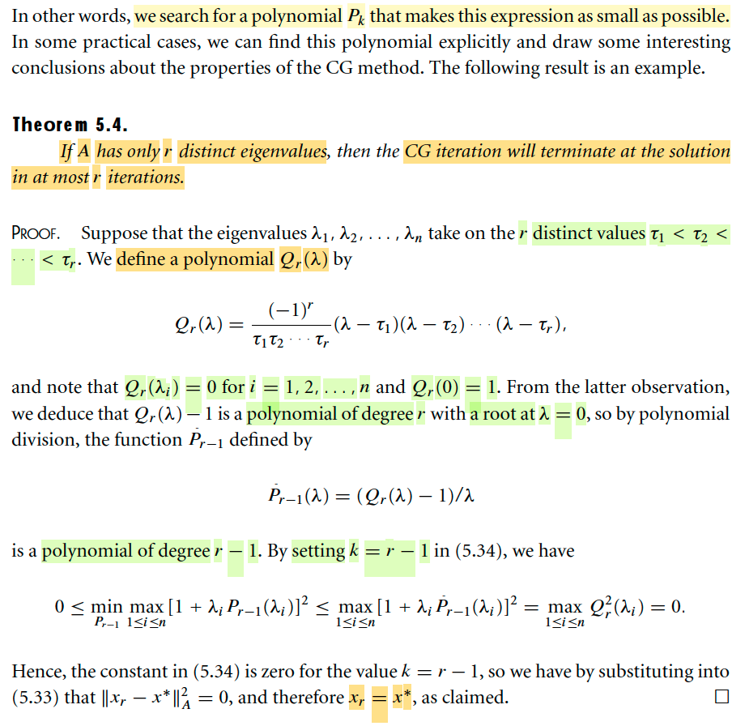</kbd>

> [!NOTE]
> Theorem 5.4 này đại ý nói là nếu như matrix A có r eigenvalues khác nhau (ví dụ matrix 10x10, có 10 eigenvalues dương nhưng nhiều cái bị lặp lại, chỉ có 5 giá trị khác nhau thôi) thì khi đó thuật toán CG sẽ hội tụ trong nhiều nhất là r bước thôi.
>
> Ý là sao, theorem này có ý nghĩa gì? → Ta nhớ có một theorem nói rằng thuật toán CG sẽ hội tụ trong tối đa là n bước (tức là matrix A nxn thì chỉ cần n iteration là converge từ x0 → x*). Thế thì theorem này nói rằng nếu ông A mà lại chỉ có r < n trị riêng khác nhau, nhiều  trị riêng bị lặp, thì thuật toán con hội tụ lẹ hơn nữa.
>
> Và ý tưởng của cách chứng minh đại khái là vầy: Trong phần trước, tác giả đã chỉ ra và ta đều đã hiểu rằng CÁI VIỆC MÀ CG ĐÃ LÀM TẠI BƯỚC K (ĐỂ TÌM ĐƯỢC xk+1 TỐI ƯU) CHÍNH LÀ TÌM RA CÁI ĐA THỨC BẬC K, Pk, TỐT NHẤT, GIÚP CHO SAI SỐ xk+1 - x* (theo chuẩn A) GIẢM XUỐNG NHỎ NHẤT. VÀ TA GỌI NÓ LÀ P*k(.). Thể hiện bằng toán học bởi:
>
> Sai số sau bước k, (||xk+1 - x*||_A)^2 ≤ {min_Pk [max_1≤i≤n [1 + λi Pk(λi)]^2]} × (||x0 - x*||_A)^2.
>
> Điều đó cũng có nghĩa là tại bước k = r-1, thì thuật toán sẽ tìm ra cái đa thức bậc r-1 tốt nhất, giúp xr - x* nhỏ nhất. 
>
> Vậy thì nếu ta CÓ THỂ CHỈ RA CÓ MỘT ĐA THỨC BẬC r-1 NÀO ĐÓ, CÓ THỂ KHIẾN CHO TẠI ĐÓ xr - x* = 0, THÌ SUY RA ĐA THỨC BẬC r-1 TỐT NHẤT P*r-1 CỦA THUẬT TOÁN ĐƯƠNG NHIÊN CŨNG PHẢI LÀM ĐƯỢC NHƯ VẬY. Điều này đồng nghĩa thuật toán CG hội tụ sau r bước. (Đi từ x0 → x1 là 1 bước, đi từ x0 → xr là r bước)
>
> Rồi, với chiến lược đó, chứng minh như sau:
>
> Cho k = r-1 ta có bất đẳng thức thể hiện rằng kết quả của thuật toán sau bước k = r-1 sẽ tìm ra cái đa thức bậc r-1 tốt nhất. 
>
> Gọi sai số sau bước r-1, tức (||xr - x*||_A)^2 là er, sai số ban đầu là (||x0 - x*||_A)^2 là e0
>
> Ta có các quan hệ đã biết ở note trước như sau
>
> er = Σi λi [1 + λi P*r-1(λi)]^2 ξi^2 
>
> = min_Pr-1 Σi λi [1 + λi Pr-1(λi)]^2 ξi^2 (error bởi cái Pr-1 xịn nhất, P*r-1, do CG tìm ra...)
>
> ≤ {min_Pr-1 [max_1≤i≤n [1 + λi Pr-1(λi)]^2]} × e0 (..sẽ có thể nhỏ hơn error của cái Pr-1 tìm ra bởi thuật quy trình min-max, vì sao ≤ thì đã hiểu rồi, việc cho rằng mọi cái lọc đều có mắt to bằng cái to nhất, đem siết, thì khi siết xong, thật sự kết quả sẽ có thể còn tốt hơn vì có nhiều cái vốn đã có mắt nhỏ sẵn, nay còn nhỏ hơn)
>
> ≤ {[max_1≤i≤n [1 + λi Pr-1(λi)]^2]} × e0 
>
> (...và bỏ cái min_Pr-1 thì dĩ nhiên ta phải có cái lớn hơn, và cái này max_1≤i≤n [1 + λi Pr-1(λi)]^2] × e0 mang ý nghĩa là sai số khi coi như mọi cái lọc đều có cái mắt lọc to nhất khi chưa siết (ta đã bỏ min rồi). Đương nhiên nó đúng với mọi Pr-1, nên có quyền thay P^r-1 vào. Và nếu như thay P^r-1 mà ta chỉ định vào mà cho ra kết quả = 0 thì điều này đồng nghĩa là: Thậm chí chưa cần siết, thêm mà tại bước r dùng cái lọc chỉ định đã cho ra 0 rồi, suy ra cái tốt nhất chắc chắn phải cũng ra 0 tại bước r.)
>
> Thật vậy dùng P^r-1(λ) có công thức là [Qr(λ) - 1] / λ, với Qr(λ) có công thức như trong sách, (được đặt ra với mục đích là: nó sẽ cho ra 0 với bất kì λ nào đưa vô, và = 1 nếu input là 0)
>
> [max_1≤i≤n [1 + λi P^r-1(λi)]^2] × e0
>
> = [max_1≤i≤n [1 + λi [Qr(λi) - 1] / λi]^2] × e0
>
> = [max_1≤i≤n [1 + [Qr(λi) - 1] ]^2] × e0
>
> = [max_1≤i≤n Qr(λi)^2] × e0
>
> = [max_1≤i≤n 0] × e0
>
> = [0] × e0
>
> = 0
>
> Như vậy là viết lại chuỗi kết quả ta có:
>
> er = Σi λi [1 + λi P*r-1(λi)]^2 ξi^2 = min_Pr-1 Σi λi [1 + λi Pr-1(λi)]^2 ξi^2 (i)
>
> ≤  {min_Pr-1 [max_1≤i≤n [1 + λi Pr-1(λi)]^2]} × e0 (ii)
>
> ≤ {[max_1≤i≤n [1 + λi P^r-1(λi)]^2]} × e0 (iii)
>
> = 0
>
> Hay er ≤ 0. Mà er dĩ nhiên ≥ 0 ⇨ er = 0.
>
> Và như vậy chứng minh xong.
>
> Nói lại ý nghĩa một lần nữa:  
>
> Dấu bằng (i) thể hiện: Thuật toán CG tìm ra xr tối ưu thì chính là nó tìm thấy cái P*r-1 nhỏ nhất,  tốt nhất.
>
> Dấu (ii) thể hiện: Đây là sai số tại xr nếu tìm ra bằng cách: Coi các bộ lọc đều có mắt to bằng cái to nhất, và đem siết hết, hay cũng có thể hiểu là tìm trong hết các bộ lọc có mắt to bằng nhau và tìm cái có mắt nhỏ nhất. Thì dĩ nhiên là cái bộ lọc tối ưu phải xịn hơn cái này, Ví dụ như khi mình tìm cái bộ lọc có đường kính bằng nhau (ví dụ tìm trong đám {(3,3,3), (4,4,4), (5,5,5)} nhỏ nhất thì thấy cái (3,3,3) là tốt nhất, thì cái P* là cái (1,2,3) dĩ nhiên phải có thể tốt hơn rồi.
>
> Cái dấu (iii) thể hiện: lấy cái mắt lọc to nhất ra. Và thấy rằng nó đã đủ tốt.
>
> Như vậy, với một cái bộ lọc P^r thì với cái mắt to nhất của nó mà nó đã đủ tốt, thì cái xịn hơn nữa chắc chắn cũng phải chỉ có tốt hơn trở lên. Tức là error tại xr của thuật toán CG cũng phải bằng 0 → thuật toán hội tụ sau r step.

> [!TIP]
> **🤖 AI Feedback** — ⚠️ Score: **88/100**
>
> Bài phân tích đã nắm vững ý nghĩa then chốt của Định lý 5.4 và đi theo đúng logic chứng minh bằng cách xây dựng đa thức. Tuy nhiên, việc trình bày chuỗi bất đẳng thức và phân biệt rõ ràng giữa sai số thực tế và cận trên của sai số có thể chặt chẽ và trực tiếp hơn, tránh dùng ngôn ngữ ẩn dụ trong phần giải thích toán học.

 

- **Theorem 5.5**

<kbd>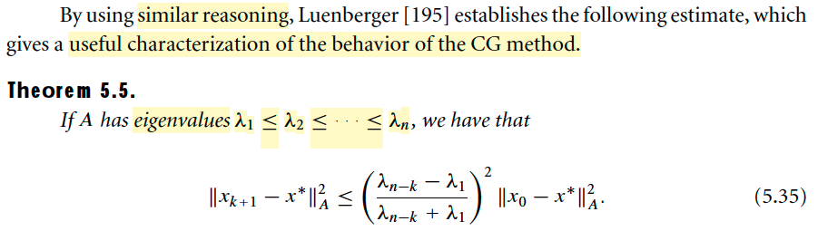</kbd>

<kbd>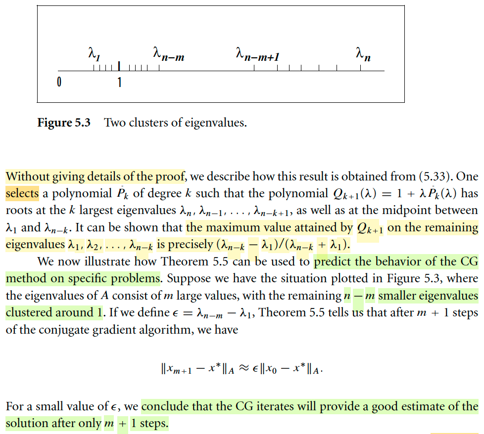</kbd>

> [!NOTE]
> Đại khái là theorem này nói rằng: Nếu như A có các eigenvalues λ1 ≤ λ2 ≤ ....≤ λn, ta sẽ có: 
>
> (||xk+1 - x*||_A)^2 ≤ [(λn-k - λ1)/(λn-k + λ1)]^2 (||x0 - x*||_A)^2
>
> Gs sẽ không chứng minh theorem này, nhưng gs cho rằng có thể mô tả làm sao ta có kết quả này từ kết quả 5.33:
>
> (||xk+1 - x*||_A)^2 ≤ {min_Pk [max_1≤i≤n [1 + λi Pk(λi)]^2]} × (||x0 - x*||_A)^2.
>
> Mình viết lại cho gọn bằng cách gọi e_k là sai số tại step k = (||xk+1 - x*||_A)^2:
>
> e_k ≤ {min_Pk [max_1≤i≤n [1 + λi Pk(λi)]^2]} × e_0
>
> Có dạng: e_k = [scalar] × e_0
>
> Thì đại ý gs nói là, nếu ta chọn một hàm đa thức bậc k, Pk sao cho [1 + λi Pk(λi)] (đặt là Qk+1(λ)) bằng giá trị 0 tại k λi lớn nhất, tức Qk+1(λn) = Qk+1(λn-1) = ... = Qk+1(λn-k+1) = 0, cũng như tại điểm nào đó nằm giữa λ1 và λn-l, thì khi đó dựa vào theorem 5.5 ta có thể chứng minh rằng giá trị lớn nhất đạt được của Qk+1 trong các giá trị eigenvalue còn lại λ1,...λn-k sẽ chính xác là (λn-k - λ1) / (λn-k + λ1) (i)
>
> Tiếp, ông nói ta sẽ minh họa việc có thể dùng Theorem 5.5 để dự đoán hành vi của CG method trong một bài toán cụ thể. Ví dụ ta ở trong hoàn cảnh như hình 5.3. trong đó trong n trị riêng của ma trận A thì m trị riêng lớn λn-m+1 → λn, còn lại n-m cái còn lại từ λ1 → λn-m thì nhỏ, và tập trung quanh mốc 1.
>
> Thế thì nếu ta đặt ε = λn-m - λ1, thì theorem 5.5 nói rằng, sau m+1 bước của thuật toán CG thì ta sẽ có:
>
> ||xm+1 - x*||_A ≈ ε||x0 - x*||_A
>
> Để rồi nếu như ε nhỏ, thì coi như ta có ||xm+1 - x*||_A ≈ 0, đồng nghĩa xm+1 đã là một gía trị ước lượng đủ tốt cho x* rồi.
>
> ====
>
> Để hiểu được cần ôn lại chút xíu từ bài trước, ta đã có cái này: 
>
> (||xk+1 - x*||_A)^2 = min_Pk Σi λi[1 + λiPk(λi)]^2 ξi^2 = min_Pk Σi [1 + λiPk(λi)]^2 λiξi^2
>
> Ý nghĩa là, ta có n cục rác λiξi^2 cấu thành nên cục rác to và ta muốn tạo ra n bộ lọc giúp bắt giữ được n cục rác này. Và nói bắt giữ, tức là nó phải có mắt lưới nhỏ đủ để bắt được cục rác. Mắt lưới to → tỉ lệ rác lọt qua 100%, mắt lưới nhỏ → tỉ lệ rác lọt qua 0%. 
>
> Thuật toán CG sẽ tìm cách giảm nó xuống tối thiểu bằng cách tìm Pk tốt nhất tức P*k: 
>
> (||xk+1 - x*||_A)^2 = min_Pk Σi λi[1 + λiPk(λi)]^2 ξi^2 = Σi [1 + λiP*k(λi)]^2 λiξi^2
>
> Nhớ rằng P*k là là solution tốt nhất mà CG sẽ tìm ra. Ta có thể ví von điều này giống như tại bước thứ k, CG sẽ tìm kiếm / thiết kế ra n bộ lọc có mắt lưới nhỏ tối ưu, tuy có thể chưa chặn hết được rác nhưng nó có tỉ lệ lọt rác là (p*1,..,p*n) ví dụ n = 3, (10%, 20%, 50%)
>
> Thế thì tiếp theo, mình mới hình dung là có một phương pháp khác làm theo cách khác, không tối ưu được như CG, nhưng cũng có thể có ích, bằng cách làm sau đây: Nó tiếp cận theo cách không tối ưu như CG (tìm ra đúng kích thước cần thiết để bắt mỗi cụ rác) nhưng tìm sẽ xem xét / thiết kế trong các bộ [bộ lọc] có dạng n bộ lọc đều có mắt lưới bằng nhau, hay cũng là siết lại các mắt lưới.
>
> Và cái tốt nhất nó tìm ra được sẽ có tỉ lệ lọt rác là (10%, 10%, 10%). vì nó xài 3 bộ lọc có mắt lướt bằng nhau nên tỉ lệ lọc rác cũng như nhau, và nó cũng đạt tỉ lệ lọt chỉ ở 10% ở loại rác thứ nhất cũng như hai loại kia.  
>
> Và thể hiện toán học cho phương pháp X này là: 
>
> ek bởi phương pháp X = {min_Pk [max_1≤i≤n [1 + λi Pk(λi)]^2]} × e_0
>
> Hành động chọn trong các bộ lọc có size như nhau thì cũng giống như coi mọi bộ lọc trong bộ đều có size bằng cái có size lớn nhất, ví dụ coi cái có size (1,2,3) như một cái có size (3,3,3) và coi cái có size (2,4,6) như cái có size (6,6,6), nên đây chính là tương ứng với cái chữ max 
>
> Và tìm cách siết nó lại / tìm cái có size nhỏ nhất chính là chữ min (bỏ qua (6,6,6) để chọn (3,3,3) ví dụ vậy)
>
> Và dễ thấy là vì ông X dùng bộ lọc size như nhau, nên khi ổng đạt được tỉ lệ lọt 10% trong việc lọc loại rác thứ 1 để bằng với ông CG, thì ổng cũng đã CHẠM GIỚI HẠN. VÌ CÁI 10% trong việc lọc loại rác thứ nhất là kết quả tốt nhất CÓ THỂ ĐƯỢC RỒI, vì ngay cả CG cũng chỉ làm được 10%. Và vì ÔNG X DÙNG LỌC SIZE BẰNG NHAU, nên ổng cũng đạt tỉ lệ lọt 10% ở các loại rác khác. DO ĐÓ, mức tỉ lệ lọc rác tổng cộng của ông CG PHẢI NHỎ HƠN ông X
>
> Do đó mới có bất đẳng thức: 
>
> e_k bởi CG = ≤ e_k bởi X = {min_Pk [max_1≤i≤n [1 + λi Pk(λi)]^2]} × e_0
>
> Từ đó chính cái này giúp chứng minh theorem vừa rồi rằng khi trong n trị riêng của A thì chỉ có r cái có giá trị khác nhau thì CG sẽ hội tụ tại nhiều nhất là trong r bước. Cách chứng minh có thể ôn lại đại khái là ta chỉ ra rằng bằng cách chọn đa thức bậc k, Qk sao cho tại mọi λi thì nó bằng 0 thì ngay lập tức ta sẽ thấy với Qk này (và Pk-1 tương ứng) thì vế phải đã bằng 0, đồng nghĩa tồn tại một đa thức Pk-1 khiến bài toán có thể hội tụ trong r bước, thì chắc chắc P*k của CG cũng phải làm được vậy. Ôn lại luôn cho nhớ lập luận tóan học:
>
> er = Σi λi [1 + λi P*r-1(λi)]^2 ξi^2 = min_Pr-1 Σi λi [1 + λi Pr-1(λi)]^2 ξi^2 
>
> ≤  {min_Pr-1 [max_1≤i≤n [1 + λi Pr-1(λi)]^2]} × e0 
>
> Vì bất đẳng thức này đúng với mọi Pr-1 nên nó đúng với P^r-1 mà ta chủ đích chọn:
>
> er ≤ {[max_1≤i≤n [1 + λi P^r-1(λi)]^2]} × e0 
>
> ≤ {[max_1≤i≤n [Qr(λi)]^2]} × e0 
>
> = {[max_1≤i≤n 0]} × e0 
>
> = 0 × e0 
>
> = 0
>
> Hay er ≤ 0. Mà er dĩ nhiên ≥ 0 ⇨ er = 0.
>
> ====
>
> Như vậy thì quay lại theorem này, đại khái là người ta cũng dùng lối tương tự, bằng cách chỉ ra rằng trong bài toán mà trong n trị riêng của A xếp từ nhỏ đến lớn λ1 → λn với CÁCH PHÂN BỐ (về giá trị và vị trí) đặc biệt đó là [đám gồm n-m cái từ λ1,..λn-m có giá trị nhỏ quây quanh mốc 1, và sau đó là m trị riêng giá trị lớn: λn-m+1 → λn). Thì khi đó, bằng cách chỉ ra, dựng nên một đa thức Qk(λ) sao cho nó bằng 0 tại các trị riêng lớn (λn-m+1 → λn) cũng như tại một giá trị nào đó giữa đám trị riêng nhỏ (λ1,..λn-m) thì ta sẽ có chuỗi lập luận sau:
>
>  Viết lại
>
> ek = Σi λi [1 + λi P*k-1(λi)]^2 ξi^2 = min_Pk-1 Σi λi [1 + λi Pk-1(λi)]^2 ξi^2 
>
> ≤  {min_Pk-1 [max_1≤i≤n [1 + λi Pk-1(λi)]^2]} × e0 
>
> Đặt Q(λi) = 1 + λi Pk-1(λi)
>
> ≤ {[max_1≤i≤n Qk(λi)^2]} × e0
>
> = max {Qk(λ1)^2, ...,Qk(λn-m)^2, Qk(λn-m+1)^2,...,Qk(λn)^2}  × e0 (1)
>
> Rồi, tới đây dừng lại chút để ôn lại Qk, hay Pk, là cái quái gì. 
>
> Câu trả lời: nó là hàm đa thức (polynomial) bậc k: Qk(α) = γ0 α^0 + γ1 α^1 + ... + γk α^k với bộ hệ số γ0,..γk nào đó. Và hàm đa thức bậc 1 thì có 1 nghiệm, đa thức bậc 2 thì có 2 nghiệm,...đa thức bậc k thì có k nghiệm. Nghiệm, tức là root, là giá trị khiến đa thức bằng 0. Vậy nếu là đa thức bậc 4 thì sẽ có có thể có 4 giá trị khiến tại đó nó bằng 0. Tương tự, đang thức Qk(α) bậc k thì có thể có k giá trị α khiến Qk(α) = 0.
>
> Vậy thì giả sử người ta muốn xây dựng đa thức Q^ (bậc chưa biết), sao cho tại đám m cái các trị riêng lớn {λn-m+1, ...,λn} và một giá trị nữa giữa đám trị riêng nhỏ bằng 0, thì dĩ nhiên bậc của Q^ phải là k = m+1: Qm+1. 
>
> Vậy thì trước khi gắn Q^ vô, ta cứ viết lại cái chuỗi ở trên với k=m+1 cái đã. Nên nhớ cái chuỗi này luôn đúng với k bằng bao nhiêu cũng được chả liên quan gì. Và cũng lưu ý luôn là ta chưa 
>
> em+1 ≤ {[max_1≤i≤n [1 + λi Pm(λi)]^2]} × e0
>
> ≤ {[max_1≤i≤n Qm+1(λi)^2]} × e0
>
> = max {Qk(λ1)^2, ...,Qk(λn-m)^2, Qk(λn-m+1)^2,...,Qk(λn)^2}  × e0 
>
> Rồi, giờ ta mới gắn Q^m+1 đặc biệt trên vào (dĩ nhiên Qm+1 có hàng vạn cái, những ta chọn cái có nghiệm là đám trị riêng lớn, còn vì sao phải là bậc m+1 thì hiểu rồi)
>
> em+1 ≤ {[max_1≤i≤n [1 + λi P^m(λi)]^2]} × e0
>
> ≤ {[max_1≤i≤n Q^m+1(λi)^2]} × e0
>
> = max {Q^m+1(λ1)^2, ...,Q^m+1(λn-m)^2, Q^m+1(λn-m+1)^2,..., Q^m+1(λn)^2}  × e0 
>
> = max {Q^m+1(λ1)^2, ...,Q^m+1(λn-m)^2, 0,..., 0} × e0  (tại các λ là nghiệm của nó, Q^m+1(λ) = 0)
>
> = max {Q^m+1(λ1)^2, ...,Q^m+1(λn-m)^2} × e0
>
> = max_1≤i≤n-m {Q^m+1(λ1)^2, ...,Q^m+1(λn-m)^2} × e0 (ii)
>
> Và như ông giáo sư Nocedal nói, theorem 5.5 nói rằng, giả sử ta có bài toán mà A có n eigenvalues phân bố theo kiểu từ λ1 → λn-k là giá trị nhỏ, còn từ λn-k+1 → λn là giá trị lớn thì ta có thể chứng minh rằng có thể chọn ra Qk+1 sao cho giá trị lớn nhất đạt được của Qk+1 trong các giá trị eigenvalue còn lại λ1,...λn-k sẽ chính xác là (λn-k - λ1) / (λn-k + λ1).
>
> Áp dụng vào đây, tương tự, mình sẽ có thể nói rằng: THEOREM 5.5 CHO PHÉP TA CHẮC CHẮN LÀ CÓ THỂ CHỌN Qm+1 SAO CHO GIÁ TRỊ LỚN NHẤT CỦA QM+1 TẠI CÁC GIÁ TRỊ RIÊNG CÒN LẠI λ1,...λn-m SẼ BẰNG CHÍNH XÁC LÀ (λn-m - λ1) / (λn-m + λ1).
>
> Như vậy tiếp nối (ii)
>
> = [(λn-m - λ1) / (λn-m + λ1)]^2 × e0
>
> Viết lại:
>
> em+1 ≤ [(λn-m - λ1) / (λn-m + λ1)]^2 × e0
>
> Và từ đó, nếu đám trị riêng CÓ GIÁ TRỊ NHỎ λ1 → λn-m  PHÂN BỐ TỤ LẠI TRONG MỘT PHẠM VI NHỎ NỮA, thì đồng nghĩa (λn-m - λ1) sẽ nhỏ → (λn-m - λ1) / (λn-m + λ1), đặt là ε sẽ nhỏ. Gíúp kết luận 
>
> em+1 ≤ ε^2 × e0 ≈ 0 với eps nhỏ
>
> ⇨ thuật toán hội tụ trong m+1 step (sau khi tính xm+1)
>
> Đây chính là giúp ta hiểu chỗ giáo sư Nocedal viết là nếu define ε = λn-m - λ1, Theorem 5.5 cho ta biết sau m+1 step thì ||xm+1 - x*||_A (chính là √em+1, vì mình đặt em+1 = (||xm+1 - x*||_A)^2) ≈ ε ||x0 - x*||_A.

> [!TIP]
> **🤖 AI Feedback** — ⚠️ Score: **75/100**
>
> Bài phân tích của bạn thể hiện sự nỗ lực đáng kể trong việc kết nối các khái niệm và giải thích sâu hơn tài liệu. Tuy nhiên, có một hiểu lầm cơ bản về vai trò của Định lý 5.5: Định lý này là ước lượng, được suy ra từ các tính chất của một đa thức được xây dựng đặc biệt (đa thức Chebyshev), chứ không phải là công cụ để chứng minh giá trị lớn nhất của đa thức đó.

 

