# 5.1 Linear Conjugate Gradient

📊 **Progress:** `8` Notes | `13` Screenshots | `5` AI Reviews

---

## 5.1 Linear Conjugate Gradient

<kbd>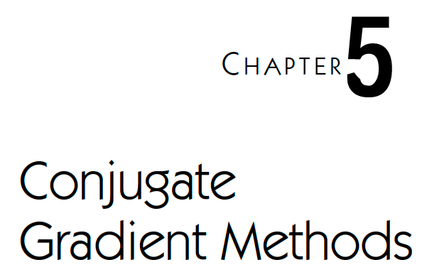</kbd>

<kbd>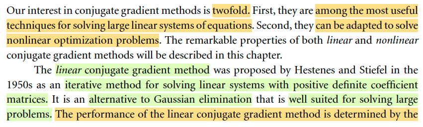</kbd>

<kbd>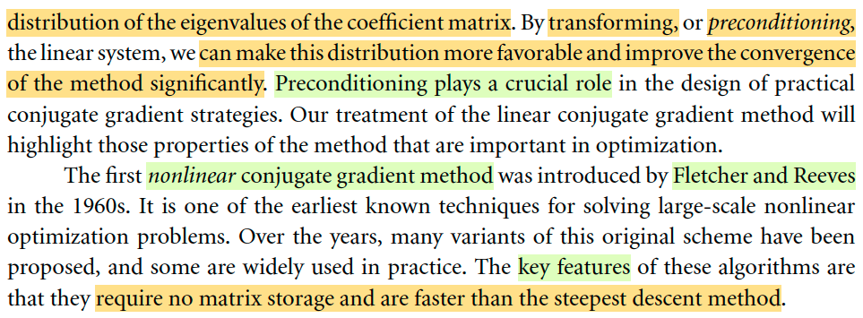</kbd>

> [!NOTE]
> Qua một phương pháp mới: Conjugate gradient method. Đại khái là tác giả nói nó có hai ưu điểm: Thứ nhất đây là một trong nhưng phương pháp tốt nhất để giải một hệ phương trình tuyến tính quy mô lớn. Và thứ hai, nó cũng có thể được điều chỉnh để giải hệ phương trình phi tuyến.
>
> Nói sơ, linear conjugate gradient được phát triển năm 1950, là các tiếp cận iterative, để giải hệ tuyến tính với ma trận hệ số xác định dương. Nó phù hợp hơn phép khử Gausse, vốn đã học ở MIT 18.06 cho những bài toán quy mô lớn.
>
> Hiệu quả của phương pháp này chủ yếu là phụ thuộc vào phân bố của trị riêng của matrix hệ số. Bằng cách transforming, còn gọi là pre-conditioning, ta có thể cải thiện sự phân bố của các trị riêng, giúp bài toán hội tụ nhanh hơn. 
>
> Nói sơ về non-linear conjugate gradient method, thì key feature của nó là nó ko đòi hỏi phải lưu trữ matrix, và nó nhanh hơn là phương pháp steepest descent.

 

### 5.1 The Linear Conjugate Gradient Method

<kbd>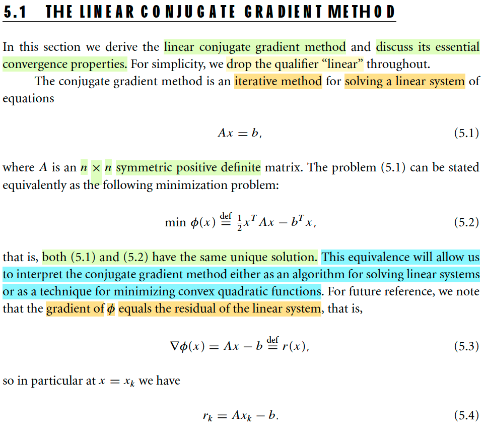</kbd>

> [!NOTE]
> Đại khái là, tác giả nói một điều mà mình đã học / tự nhận ra hồi còn học EE364A: Việc giải hệ f(x) = 0 có thể coi như là đang giải điều kiện cần bậc một của bài toán minimize hàm số F(x) là nguyên hàm của f: ∇F(x) = f(x) = 0. Và đây là nguyên lí của root finding Newton method: Bằng cách xấp xỉ hàm F bằng hàm bậc 2 thì ta cũng xấp xỉ hàm f là hàm bậc 1.
>
> Và giải bài toán minimize F với Newton method cũng chính là gỉai hệ f(x)=0 bằng root finding Newton method.
>
> Thế thì ở đây f(x) = Ax - b, thì nguyên hàm của nó, chính là F(x) = (1/2)xTAx - bTx, ở đây ta sẽ gọi là φ(x) ⇨ ∇φ(x) = Ax - b 
>
> Và như đã nói, cách nhìn này cho ta thấy việc giải hệ Ax = b chính là giải bài toán tối ưu hàm bậc hai F(x), là một convex optimzation problem.

> [!TIP]
> **🤖 AI Feedback** — ✅ Score: **98/100**
>
> Your analysis accurately captures the equivalence between solving Ax=b and minimizing φ(x), and correctly derives the gradient. Connecting this specific problem to the broader principle of root-finding and Newton's method demonstrates a profound understanding of the underlying mathematical concepts.

 

#### Conjugate Direction Method

<kbd>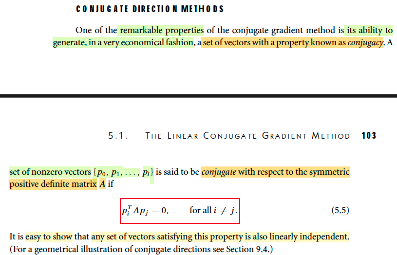</kbd>

<kbd>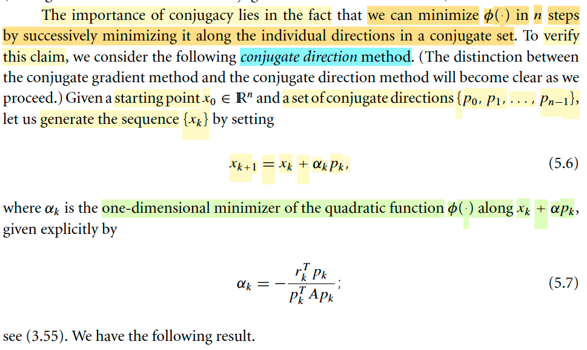</kbd>

> [!NOTE]
> Đầu tiên, tác giả nói đại ý là một đặc điểm rất tốt của phương pháp này là khả năng của nó trong việc tạo ra một bộ vector có tính chất gọi là conjugacy: {p0,...pn-1} được gọi là conjugate wrt matrix xác định dương A nếu như piTApj = 0 ∀i≠j.
>
> Tác giả nói cũng dễ cho thấy bộ vector conjugate cũng sẽ độc lập tuyến tính. Là sao?
>
> Giả sử có pk là vector phụ thuộc tuyến tính, ta có thể thể hiện nó bởi tổ hợp tuyến tính các vector còn lại: pk = Σi pi. Áp dụng tính chất conjugacy:
>
> pkTApj = 0 ∀k≠j
>
> ⇔ pkT(Σi pi)pj = 0 ∀k≠j
>
> ⇔ (Σi pi)TApj = 0 ∀k≠j
>
> ⇔ Σi piTApj = 0 ∀k≠j
>
> Trong cái tổng bên phải, nếu pi khác pj thì hạng tử bằng 0 rồi, nên chỉ còn pjApj.
>
> Tức là ta có pjTApj = 0, mà điều này sẽ mâu thuẫn với việc A xác định dương thì với mọi x khác 0, xTAx > 0. Do đó, đại ý là ta đã chứng minh được bộ vector conjugate cũng sẽ độc lập tuyến tính.
>
> Tiếp theo, tác giả nói về việc, ta có thể chứng minh được rằng, sử dụng bộ vector conjugate, ta có thể minimize hàm φ chỉ trong n bước. Và ta sẽ xét một phương pháp gọi là CONJUGATE DIRECTION method (không phải conjugate gradient method nhé, sự liên hệ giữa chúng sẽ nói sau). Phương pháp này đại khái là như sau:
>
> Bắt đầu với x0, và một bộ vector conjugate {p0,...pn-1}, ta sẽ generate các điểm xk:
>
> xk+1 = xk + αkpk trong đó αk là solution của bài toán tối ưu hàm một biến:
>
> minimize g(α) = φ(xk + αpk) 
>
> Để giải tìm αk, dùng điều kiện cần bậc 1 thôi: 
>
> g'(α) = 0 ⇔ d/dα φ(xk + αpk) = 0 
>
> ⇔ d/d(xk + αpk) φ(xk + αpk) . d/dα (xk + αpk) = 0
>
> ⇔ ∇φ(xk + αpk) . pk = 0 
>
> ⇔ ∇φ(xk + αpk)T pk = 0 
>
> ⇔ [(Ax - b)|x=xk + αpk]Tpk = 0
>
> ⇔ [A(xk + αpk) - b]Tpk = 0
>
> ⇔ [Axk + Aαpk - b]Tpk = 0
>
> ⇔ [rk + Aαpk]Tpk = 0 | Ở đây quên nói, ta sẽ gọi r(x) = Ax-b 
>
> ⇔ rkTpk + αpkTApk = 0
>
> ⇔ α = -rkTpk/pkTApk. Đây chính là 5.7

> [!TIP]
> **🤖 AI Feedback** — ✅ Score: **90/100**
>
> Bạn đã nắm vững các định nghĩa cốt lõi và thực hiện xuất sắc việc chứng minh công thức alpha_k một cách chi tiết và chính xác. Để nâng cao hơn nữa, hãy xem xét lại cách thiết lập giả định và các bước chứng minh tính độc lập tuyến tính của các vector liên hợp để đảm bảo tính chặt chẽ.

 

##### Theorem 5.1

<kbd>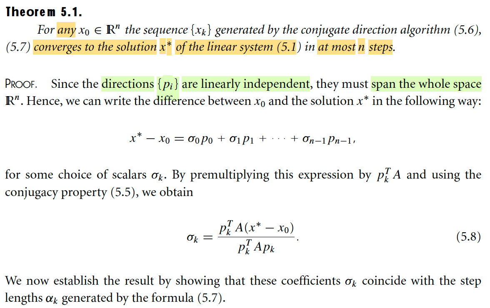</kbd>

<kbd>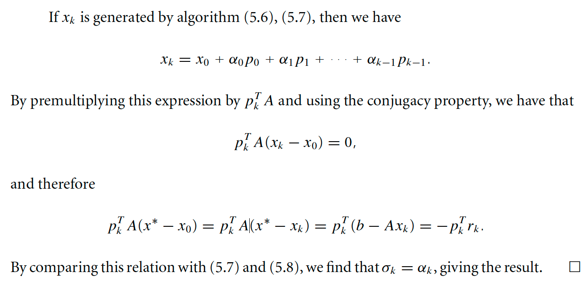</kbd>

> [!NOTE]
> Theorem 5.1: Nói rằng với x0 (initial point) bất kì thì chuỗi {xk} được generate bởi thuật toán 5.6 ở trên sẽ converge về solution x* của Ax = b trong nhiều nhất là n step.
>
> Chứng minh như sau: Đầu tiên, vì {pi} độc lập tuyến tính, và đủ số lượng (n) nên dĩ nhiên chúng là một basis của R^n, span {p0,..pn-1} = R^n. Nên mọi vector R^n đều là linear combination của chúng. Do đó gs nói ta có thể thể hiện x* - x0 (cũng là R^n vector) bởi:
>
> x* - x0 = σ0p0 + σ1p1 + ..σn-1 pn-1.
>
> Nhân hai vế cho pkTA ta có:
>
> pkTA(x* - x0) = pkTA(σ0p0 + σ1p1 + ..σn-1 pn-1)
>
> Xét vế phải, phân phối vô ta có tổng các pkTAσipi, vì tính conjugacy nên nếu pi khác pk, kết quả thành 0. Nên chỉ còn pkTApk, ta có pkTA(x*-x0) = σkpkTApk
>
> ⇔ σk = pkTA(x*-x0)/pkTApk (5.8)
>
> Giờ ta sẽ đi chứng minh σk TRÙNG KHỚP với step length αk của công thức 5.7. Là sao?
> ⇨ Thì khi ta chứng minh σk = αk thì cũng đã chứng minh là chuỗi {xk} tạo bởi x1 = x0 + α0p0, x2 = x1 + α1p1,...cũng chính là sẽ là đi từ x0 → x1 = x0 + σ0x0, x2 = x0 + σ0x0 + σ1x1 , ... xn = x0 + σ0p0 + σ1p1 + ...σn-1pn-1 = x0 + x* - x0 = x*! Có nghĩa là ta cũng đã chứng minh được thuật toán sẽ dẫn ta đến x* tại iteration thứ n.
>
> Về mặt hình học hiểu nôm na như sau: Như đã biết về ý nghĩa của x* - x0 = σ0p0 + σ1p1 + ..σn-1 pn-1: Đó là để đi từ x0 → x*, ta sẽ đi thep phương p0 một khoảng có độ lớn σ0, rồi từ đó đi theo phương p1 một khoảng có độ lớn σ1,... Vậy thì nếu chứng minh αk = σk thì dĩ nhiên cũng đã chứng minh chuỗi {xk} tạo bởi thuật toán cũng sẽ dẫn ta tới x* sau n bước.
>
> Quay lại đây, chuỗi {xk} tạo bởi 5.6, 5.7: xk+1 = xk + αkpk, và αk = -rkTpk/pkTApk, cụ thể sẽ là:
>
> x1 = x0 + α0p0
>
> x2 = x1 + α1p1 = x0 + α0p0 + α1p1
>
> ...
>
> xk = xk-1 + αkpk = x0 + α0p0 + α1p1 + ..αk-1pk-1
>
> Nhân hai vế cho pkTA:
>
> pkTAxk = pkTAx0 + pkTA(α0p0 + α1p1 + ..αk-1pk-1)
>
> ⇔ pkTAxk - pkTAx0 = pkTA(α0p0 + α1p1 + ..αk-1pk-1)
>
> ⇔ pkTA(xk - x0) = pkTA(α0p0 + α1p1 + ..αk-1pk-1)
>
> Vế phải, theo tính chất conjugate, dễ hiểu chỉ còn 0, ta có pkTA(xk - x0) = 0
>
> ⇔ pkTAxk = pkTAx0
>
> Từ đó cái tử số của σk = pkTA(x*-x0)/pkTApk sẽ bằng:
>
> pkTA(x* - x0) = pkTAx*- pkTAx0 = pkTAx*-pkTAxk = pkT(Ax*-Axk)
>
> = pkT(b-Axk) Và vì rk = Axk-b nên đây chính là -pkTrk
>
> Vậy σk = pkTA(x*-x0)/pkTApk = -pkTrk/pkTApk, chính là αk. Chứng minh xong

 

- **Góc nhìn hình học lí giải tính chất của conjugate direction**

<kbd>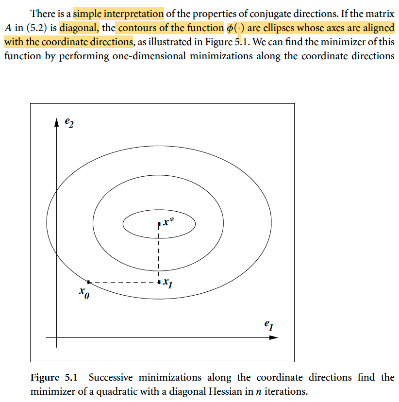</kbd>

> [!NOTE]
> Đại khái là ở đây minh họa giúp ta hiểu vì sao conjugate direction method lại giúp converge về x* trong n bước. Lấy ví dụ trong 2D, khi A là diagonal matrix, thì contour plot sẽ có dạng các hình ellipse. Và việc di chuyển từ x0 → x1, x1 → x2 theo phương pháp này chính là đi theo đường chấm chấm. Dễ thấy với 2D thì chỉ tốn 2 step, nếu 3D, sẽ tốn 3 steps,..nD sẽ tốn n steps.
>
> Thế thì vì sao khi A là diagonal thì contour plot là lại ellipse/ellipsoid?
>
> Nếu A là diagonal, A = diag(λ1,...,λn), contour của Φ(x) sẽ có dạng:
>
> Φ(x) = c (c-level set)
>
> ⇔ (1/2)xTAx - bTx = c
>
> ⇔ (1/2)xTdiag(λ1,...,λn)x - bTx = c
>
> ⇔ (1/2)xT(λ1x1, ..λnxn) - bTx = c
>
> ⇔ (1/2)λ1x1^2 + .. + (1/2)λnxn^2 - (b1x1+ .. + bnxn) = c
>
> ⇔ (1/2)λ1x1^2 + .. + (1/2)λnxn^2 - b1x1  .. - bnxn = c
>
> ⇔ (1/2)λ1x1^2 - b1x1 + .. + (1/2)λnxn^2 - bnxn = c
>
> ⇔ (λ1/2)[x1^2 - b1x1/(λ1/2)] + .. + (λn/2)[xn^2 - bnxn/(λn/2)] = c
>
> ⇔ (λ1/2)[x1^2 - 2b1x1/λ1] + .. + (λn/2)[xn^2 - 2bnxn/λn] = c
>
> ⇔ (λ1/2)[x1^2 - 2x1b1/λ1] + .. + (λn/2)[xn^2 - 2xnbn/λn] = c
>
> ⇔ (λ1/2)[x1^2 - 2x1b1/λ1 + (b1/λ1)^2 - (b1/λ1)^2] + .. + (λn/2)[xn^2 - 2xnbn/λn + (bn/λn)^2 - (bn/λn)^2] = c
>
> ⇔ (λ1/2)[x1^2 - 2x1b1/λ1 + (b1/λ1)^2] - (λ1/2)(b1/λ1)^2 + .. + (λn/2)[xn^2 - 2xnbn/λn + (bn/λn)^2] - (λn/2)(bn/λn)^2 = c
>
> ⇔ (λ1/2)[x1^2 - 2x1b1/λ1 + (b1/λ1)^2] - b1^2/2λ1 + .. + (λn/2)[xn^2 - 2xnbn/λn + (bn/λn)^2] - bn^2/2λn = c
>
> ⇔ (λ1/2)[x1^2 - 2x1b1/λ1 + (b1/λ1)^2] - b1^2/2λ1 + .. + (λn/2)[xn^2 - 2xnbn/λn + (bn/λn)^2] - bn^2/2λn = c
>
> ⇔ (λ1/2)(x1 - b1/λ1)^2 - b1^2/2λ1 + .. + (λn/2)(xn - bn/λn)^2 - bn^2/2λn = c
>
> ⇔ Σi (λi/2)(xi - bi/λi)^2 - Σi bi^2/2λi = c
>
> ⇔ Σi (λi/2)(xi - bi/λi)^2 = c + Σi bi^2/2λi
>
> Đặt vế phải là C'
>
> ⇔ Σi (λi/2)(xi - bi/λi)^2 = C'
>
> ⇔ Σi (λi/2)(xi - bi/λi)^2 / C'  = 1
>
> ⇔ Σi (xi - bi/λi)^2 / [C'/(λi/2)]  = 1
>
> ⇔ Σi (xi - bi/λi)^2 / [2C'/λi)]  = 1
>
> Đây chính là phương trình của ellipsoid với center tại (b1/λ1, ...bn/λn)
>
> Quay lại đây, có thể hiểu trong trường hợp này, bộ vector e1,...en (standard basis) chính là conjugate set của A. Thật vậy, eiTAej = eiT(0,0,...λj,..0) = 0×0 + 0×0 + ..1×0 + ..0×λj + ..0×0 = 0. Nên di chuyển theo conjugate direction chính là di chuyển theo hướng các trục:
>
> x0 đi theo hướng / phương e1 đến x1
>
> x1 đi theo hướng / phương e2 đến x2 (x*)

> [!TIP]
> **🤖 AI Feedback** — ✅ Score: **98/100**
>
> Bài phân tích rất xuất sắc, bạn không chỉ giải thích đúng ý nghĩa của hình minh họa mà còn cung cấp chứng minh toán học chi tiết, làm rõ vì sao ma trận A chéo lại dẫn đến các đường đồng mức hình elip. Để hoàn thiện hơn, bạn có thể lưu ý rằng trong hình 2D, điểm dừng x* đạt được sau x0 → x1 và x1 → x* chứ không phải x1 → x2.

 

- **Chuyển đổi A thành diagonal**

<kbd>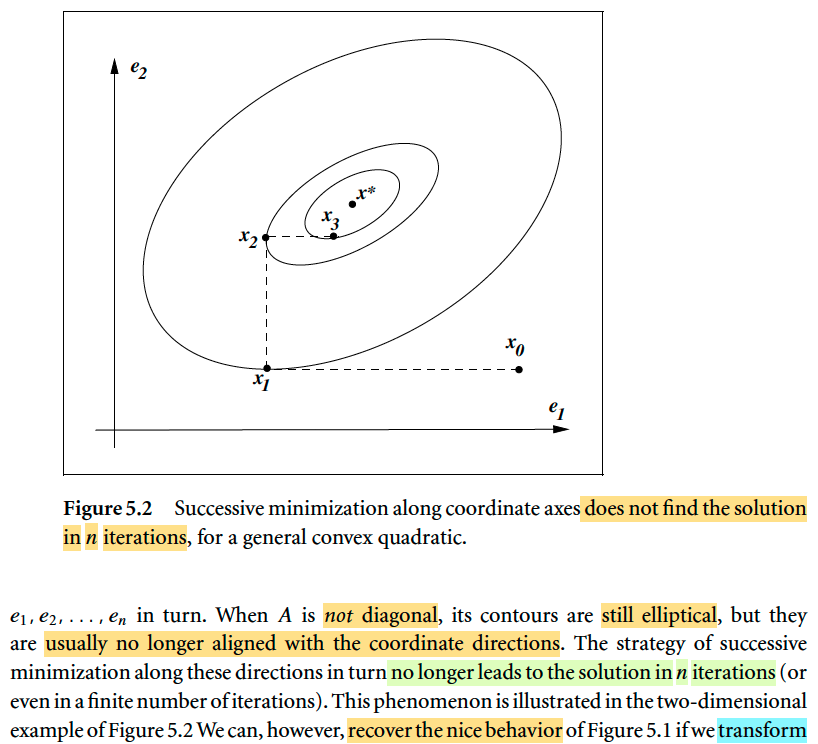</kbd>

<kbd>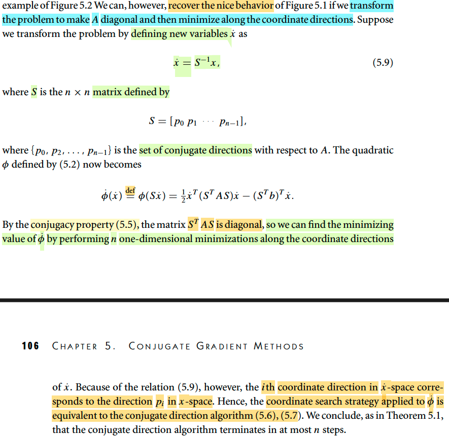</kbd>

> [!NOTE]
> Hiểu chỗ này đại khái như sau: Nếu như A diagonal, thì bộ basis vector {ei} chính là conjugate set, và dùng chúng để đi từ x0 thì ta sẽ đến được x* trong nhiều nhất là n step như theorem 5.1 đã nói.
>
> Nhưng nếu A không phải diagonal, thì {ei} không phải là conjugate set, nên theorem 5.1 đương nhiên là không áp dụng, đi theo các hướng đó với thuật toán 5.6 (xk+1 = xk + αkpk) , 5.7 (αk = -rkTpk/pkTApk) không còn giúp đến đích trong nhiều nhất là n bước nữa.
>
> Vậy thì đại khái là để thuật toán hội tụ trong n bước theo theorem 5.1, ta phải tìm bộ conjugate set {pi} của A thì thuật toán mới work như theorem vừa rồi đã tuyên bố. 
>
> Nhưng ở đây, đại khái là mình hiểu việc dùng bộ {pi}, thì thật ra cũng chính là ta chuyển bài toán từ ellipse không diagonal thành diagonal. Chỉ vậy thôi.
>
> Cụ thể là ta sẽ đổi biến, đặt x^ = Sinv x với S là matrix các cột là conjugate set của A, S = [p0, ...pn-1].
>
> Vậy thì hàm Φ(x) = (1/2)xTAx - bTx trở thành
>
> Φ^(x^) = (1/2)x^T(STAS)x^ - (STb)Tx^
>
> Vậy thì, nhớ lại ở MIT 1806 ta đã học về change of basis matrix, cũng như linear transformation. Ôn lại tí:
>
> Giả sử ta có vector x đang có tọa độ theo basis v's. Thì để chuyển tọa độ của nó thành tọa độ theo basis w's thì ta sẽ lập luận như sau:
>
> Trước tiên phải nói về linear transformation: Ax là một linear tranformation, bởi nó thoả điều kiện T(αv + βu) = αT(v) + βT(u). Thế thì, ý chính cần hiểu, với một linear transformation, ta có thể thể hiện nó bởi phép biến đổi bởi một matrix A. Ví dụ, phép xoay bởi góc α, là một linear tranformation, thì sẽ có thể tìm được matrix Q để biểu diễn T(v) = Qv.
>
> Cách làm theo quy tắc như sau: Ta biến đổi (áp dụng linear transformation) lên các basis của input space. Và thể hiện kết quả theo basis của các output space. Rồi cuối cùng lấy tọa độ của chúng bỏ vào cột của matrix A. Khi đó ta sẽ có matrix A đại diện cho phép biến đổi tuyến tính. Ví dụ, ta tìm Q, đại diện cho phép xoay trong không gian R^2 một góc α.
>
> Theo rule trên, bước 1 ta biến đổi hai basis e1,e2:
>
> (1,0) trở thành (cos(α), sin(α))
>
> (0,1) trở thành (-sin(α), cos(α))
>
> Và dĩ nhiên đó cũng chính tọa độ của kết quả trong basis e's (tức là trong case này input basis = output basis, quy tắc khái quát là dành cho cả khi input basis khác output basis)
>
> Do đó, matrix Q chính là [cos(α) -sin(α); sin(α) cos(α)]
>
> Thế thì, nếu ta chọn output basis không phải là e1, e2 mà là vector khác, thì matrix sẽ khác, và trong bài giáo sư Strang đã minh họa khi ta chọn một bộ basis đặc biệt, q1,q2 thì có thể khiến Q trở thành một diagonal matrix. Và hóa ra basis đặc biệt đó cũng chính là eigenvector của Q.
>
> Thế thì, ta mới xét một phép biến đổi tuyến tính đặc biệt: Identity transformatio, T(v) = v. Tức là chả làm gì hết.
>
> Vậy thì vẫn theo quy tắc, ta sẽ biến đổi (dù chả làm gì) các input basis v's, rồi thể hiện nó bởi các output basis w's. Và ném các tọa độ vào các cột của A.
>
> Vậy thì T(v1) = v1. Tức là, kết quả biến đổi của v1 là v1. Bước 2: thể hiện kết quả này theo basis w's: v1 = α11w1 + α21w2 + ..Bước 3: Ném bộ tọa độ của v1 trong basis w's thành cột 1 của A: Cột 1 của A = [α11, α21,...] Tương tự như vậy, ta sẽ có matrix A.
>
> Thế thì ta thấy thế này, với matrix A như vậy, và bỏ các basis v's, w's thành các matrix V, W thì ta có: 
>
> v1 = α11w1 + α21w2 +.. . Chính là linear combination các vector w's bởi các hệ số là cột 1 của A: v1 = W[cột 1 của A]
>
> Tương tự, v2 = W[cột 2 của A]
>
> Và đây chính là V = WA (theo góc nhìn thứ 2 khi nhân matrix với matrix mà thầy Strang đã dạy)
>
> Từ đây, dĩ nhiên là W là matrix of basis, nó invertible, nhân hai vế cho Winv:
>
> WinvV = A ⇨ A = WinvV chính là matrix GIÚP ĐỔI TỌA ĐỘ TRONG BASIS v's SANG TỌA ĐỘ THEO BASIS w's, gọi là "change of basis" matrix.
>
> Thế thì, từ đó, nếu ta đang trong tọa độ chuẩn (standard basis e's), thì V lúc này chính là I và muốn đổi sang tọa độ basis w's: matrix đổi tọa độ sẽ là: A = WinvI = Winv
>
> Có nghĩa là nếu x là vector có tọa độ trong basis e's, thì Winvx là tọa độ của nó trong basis w's.
>
> Nhờ vậy khi quay lại bài này ta thấy rõ: x^ = Sinv x chính là chuyển tọa độ của x từ basis e's sang tọa độ của nó trong BASIS p's (p0,..pn-1). Vì đã nói S chính là matrix có các cột tạo bởi {pi} mà.
>
> Vậy thì ý tưởng ở đây là: 
>
> Khi A diagonal, ta thấy contour plot là elipsoid ngay ngắn thẳng trục để rồi đi theo các hướng bởi vector ei, theo thuật toán cho kết quả hội tụ trong n bước là vì lúc này {ei} là conjugate set
>
> Cho dù A không diagonal, để rồi {ei} không phải là conjugate set của nó. Nên đi dùng chúng sẽ không thỏa Theorem 5.1 giúp hội tụ trong n bước. Thì đơn giản là bằng cách đổi biến sang tọa độ của basis p's, là conjugate set của A, thì trong hệ tọa độ đó, cái contour plot nó là CŨNG LÀ một elipsoid ngay ngắn, thẳng trục với basis p's. Và mọi chuyện y hệt case trên.
>
> Vậy thì ý tưởng là: làm sao đó để trong hệ tọa tọa độ mới, matrix A biến thành diagonal matrix.
>
> Như trên vừa nói, nếu x là tọa độ trong basis e's, thì Sinv x sẽ là tọa độ trong basis mới
> tạo bởi các cột của S. Ngược lại nếu x^ là tọa độ trong basis đó thì x = S x^ sẽ là tọa độ trong basis e's. Thế thì ta có:
>
> Φ(x) = (1/2)xTAx - bTx khi chuyển qua tọa độ mới sẽ là:
>
> Φ(Sx^) = (1/2)(Sx^)TA(Sx^) - bTSx^
>
> = (1/2)x^TSTASx^ - bTSx^
>
> Để rồi nếu như ta muốn trong hệ trục này, basis {si} matrix Hessian trở nên diagonal, tức STAS diagonal (để giống như trong hệ trục gốc, basis {ei}, Hessian là A diagonal)
>
> Thế thì STAS diagonal đồng nghĩa các off-diagonal entries (các phần tử ngoài đường chéo) phải bằng 0. 
>
> Các phần tử ngoài đường chéo là gì?
>
> STAS = ST (AS), theo góc nhìn thứ 2 khi nhân matrix, = ST [As1, As2,...Asn]
>
> Thế thì matrix này, đường chéo của nó sẽ là s1TAs1, s2TAs2,...snTAsn
>
> Còn ngòai đường chéo sẽ là siTAsj với i ≠ j.
>
> Như vậy, muốn STAS là diagonal matrix thì ta sẽ phải có siTAsj = 9 với i ≠ j
>
> Do đó, {si} phải là một conjugate set của A.
>
> Và lúc này, ta sẽ hiểu rằng, trong hệ tọa độ mới, theo basis {si} = {pi} = {p0,...pn-1} thì thuật toán cũng làm cái việc y như trong trường hợp A diagonal: Tức là nó cũng sẽ chỉ mất n bước để đi đến x* mà ở mỗi bước nó sẽ dùng hướng các vector của basis.
>
> Do đó thầy Nocedal mới nói ở đây rằng: "ith coordinate direction in x^-space corresponds to th direction pi in x-space" Ý là, trong hệ tọa độ basis p's thì di chuyển theo hướng p cũng chính là tương ứng với di chuyển theo hướng e's trong hệ tọa độ basis e's.
>
> Nên coordinate search strategy sẽ apply Φ^ sẽ tương đương với conjugate direction algorithm. Do đó, theorem 5.1 nói rằng, nó sẽ converge trong n step.

> [!TIP]
> **🤖 AI Feedback** — ✅ Score: **95/100**
>
> Bài làm rất xuất sắc, thể hiện sự hiểu biết sâu sắc về đại số tuyến tính cơ bản và cách áp dụng vào giải thích thuật toán. Mặc dù phần giải thích về đổi cơ sở khá dài, nhưng nó hoàn toàn chính xác và củng cố vững chắc cho lập luận chính.

 

- **Tối ưu hóa tọa độ Hessian chéo**

<kbd>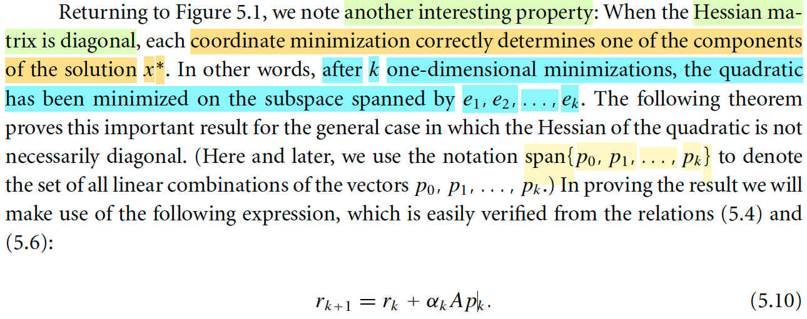</kbd>

> [!NOTE]
> Đại ý là thầy nói rằng, nhìn vào cái hình 5.1 ta có thể dễ nhận ra và hiểu ý sau đây: Khi Hessian diagonal thì cứ sau mỗi một step (ví dụ, từ x0 → x1) thì thật ra ta ĐÃ TÌM THẤY THÊM MỘT TỌA ĐỘ NỮA CỦA x* RỒI. Ta có thể hoàn toàn đồng tình với ý này. Trong hình 5.1, có hai tọa độ. Thì sau step thứ nhất, thì mình đã có x1_1 chính là x*_1. Và sau step thứ 2, x2_2 chính là x*_2. 
>
> Do đó, sau 1 step, thì hàm quadratic đã được minimize trên / over trục x1. Nói rõ ý này:
>
> Có nghĩa là ta sau bước 1 ta đã giải bài toán minimize over {x: x_1 ∈ R, x_2 fix} Φ(x). Và cái này cũng tương đương minimize over x ∈ R^2 Φ(x0 + t × e1).
>
> Thì đây chính là minimize quadratic Φ ON THE SUBSPACE SPANED BY e1.
>
> Vậy thì khái quát lên cho n-D case, thì mình cũng có thể hiểu là sau k step, ta quả thật là đã minimize hàm quadratic Φ on the subspace spanned by e1,e2,...ek.
>
> Trước khi vào theorem 5.2. Ta có:
>
> 5.4: rk = Axk - b, ⇨ rk+1 = Axk+1 - b
>
> ⇨ rk+1 - rk = Axk+1 - Axk - b + b
>
> ⇔ rk+1 - rk = A(xk+1 - xk) 
>
> Dùng xk+1 = xk + αkpk ⇔xk+1 - xk = αkpk
>
> ..⇔ rk+1 - rk = Aαkpk = αkApk (5.10)

> [!TIP]
> **🤖 AI Feedback** — ✅ Score: **98/100**
>
> Bài làm giải thích rất chính xác tính chất của ma trận Hessian chéo và sự tối ưu hóa trên không gian con, thể hiện sự hiểu sâu sắc. Việc tự tay dẫn dắt công thức (5.10) cũng cho thấy bạn đã nắm vững kiến thức và không chỉ đọc mà còn hiểu rõ từng bước; bạn chỉ cần chú ý đặt ký hiệu công thức ở dạng hoàn chỉnh để khớp hoàn toàn với văn bản gốc.

 

- **Theorem 5.2 (Expanding Subspace Minimization)**

<kbd>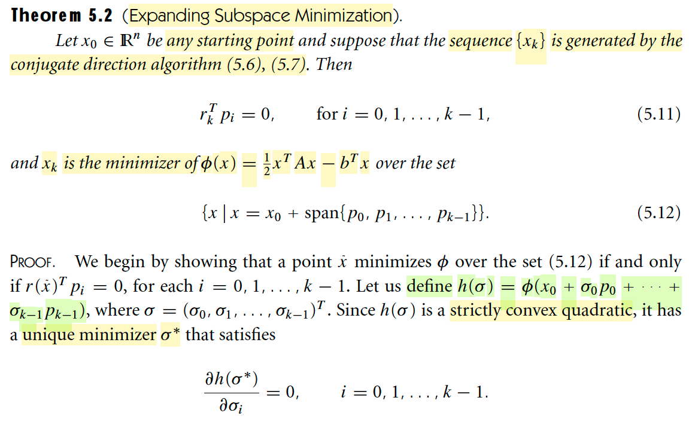</kbd>

> [!NOTE]
> Đại ý theorem này nói rằng cho điểm khởi đầu x0 bất kì. Và chuỗi {xk} sẽ được tạo bởi conjugate direction algorithm (5.6), (5.7). Thì khi đó: 
>
> rkTpi = 0 với i = 0,1,...k-1
>
> và xk sẽ là minimizer của φ(x) = (1/2)xTAx - bTx over the set {x | x = x0 + span{p0,...pk-1}}.
>
> Trước khi đi vào chứng minh, ta hiểu cái theorem này nói gì vậy?
>
> Đầu tiên, nhớ lại conjugate direction algorithm cũng như các tính chất của nó, nói cách khác, ôn lại chút xíu bối cảnh của ta: Đó là chương này bắt đầu với việc nói về bài toán giải hệ phương trình tuyến tính Ax = b ⇔ Ax - b = 0. Thế thì, tìm nghiệm của hệ này cũng chính là, tương đương với việc tìm minimizer của hàm quadratic Φ(x) = (1/2)xTAx - bTx. Vì điều kiện cần bậc một chính là ∇Φ(x) = 0 ⇔ Ax - b = 0.
>
> Và từ đó, người ta mới giới thiệu một cách tiếp cận iterative để giải Ax = b. Bắt đầu với x0. Ta sẽ generate chuỗi {xk}: xk+1 = xk + αkpk. Với {p0,p1,...pn-1} là conjugate set của A. Và theorem 5.1 đã chứng minh rằng, trong nhiều nhất là n step thì {xk} sẽ converge về x* là true solution của Ax = b.
>
> Rồi, vậy thì đặt rk = Axk - b (r chắc là stand for residual) thì theorem này nói rằng: 
> rkTpi = 0 với mọi pi = 0,1,..,k-1.
>
> Suy nghĩ chút: Cái này có vẻ rất dễ có liên quan đến least square.
>
> Nếu rkTpi = 0 với mọi pi=0,1...k-1. Thì có nghĩa là rk vuông góc với span{p0,..pk-1}.
>
> Nhớ lại least square: Lập luận thế này: ta muốn giải Ax = b, chính là muốn tìm linear combination các cột của A để tạo ra b. Từ đó nếu C(A) không chứa b, thì nhiều nhất là ta chỉ tìm được một linear combination của A's columns để tạo ra điểm gần nhất với b: chính là hình chiếu của b lên C(A): Để rồi, residual e = b - Ax^ sẽ vuông góc với C(A) ⇨ thuộc left nullspace N(AT) ⇨ ATe = 0 ⇔ AT(b - Ax^) = 0 ⇔ ATb = ATAx^, chính là normal equation.
>
> Vậy thì ở đây, rk = Axk - b, và rk vuông góc span{p0,..pk-1}. Có gì đó rất liên quan.
> Thôi qua phần chứng minh:
>
> ====
>
> Đầu tiên họ sẽ chứng minh điều kiện cần và đủ để x_tilde minimize Φ over set 5.12 đó là r(x_tilde)Tpi = 0 với i = 0,1...k-1.
>
> Ta đặt h(σ) = φ(x0 + σ0p0 + ..σk-1pk-1) với σ = (σ0,...σk-1)T. Nhớ lại bên EE364A, đã học cái vụ "composition with affine", tức là vì x0 + σ0p0 + ..σk-1pk-1 là affine function, mà affine thì vừa convex vừa concave, rồi φ lại là quadratic, được nhiên là convex. Mà convex function có theorem nói rằng any local minimizer cũng là global minimizer. Bên cạnh đó, với một hàm số thì điều kiện cần để trở thành convex là Hessian xác định bán dương tại mọi điểm. Còn nếu Hessian là matrix xác định dương tại mọi điểm thì ta có hàm strictly convex. Và khi là strictly convex thì global minimizer là unique. Cuối cùng, với hàm convex thì điều kiện cần và đủ của optimal chỉ là gradient vanish.
>
> Thế thì ở đây φ là hàm bậc hai, nhưng Hessian A đã cho trước là ma trận xác định dương, nên φ là strictly convex function. h là hàm convex composition với affine nữa nên h cũng là strictly convex. Và theo đó, sẽ tồn tại một điểm unique minimizer σ* của h(σ) thỏa gradient vanish:
>
> ∂/∂σi h(σ*) = 0 ∀ i = 0,1...k-1
>
> ∂/∂σi h(σ*) = ∂/∂σi φ(x0 + σ0p0 + ..σk-1pk-1)
>
> theo chain rule
>
> = ∂/∂(x0 + σ0p0 + ..σk-1pk-1) φ(x0 + σ0p0 + ..σk-1pk-1) . ∂/∂σi (x0 + σ0p0 + ..σk-1pk-1)
>
> = ∇φ(x0 + σ*0p0 + ..σ*k-1pk-1) . pi
>
> = ∇φ(x0 + σ*0p0 + ..σ*k-1pk-1)T pi  
>
> ⇨ ∂/∂σi h(σ*) = 0 ∀ i = 0,1...k-1
>
> ⇔ ∇φ(x0 + σ*0p0 + ..σ*k-1pk-1)T pi = 0 ∀ i = 0,1...k-1 (a)
>
> (vì sao chỗ này thành transpose, để thành dot product? Là vì φ(x0 + σ0p0 + ..σk-1pk-1) là vector → scakar function. Dấu "." trong chain rule là kí hiệu của function composition (hàm hợp). ∇φ(x0 + σ0p0 + ..σk-1pk-1), và pi đều là vector. Nên chỉ có thể là dot product để cho ra scalar thôi)
>
> Tới đây, nhớ lại ta đã gọi ∇φ(x) = Ax - b = r(x).
>
> ⇨ ∇φ(x0 + σ*0p0 + ..σ*k-1pk-1) = ∇φ(x_tilde)
>
> nên (a) chính là r(x_tilde)Tpi = 0

 

